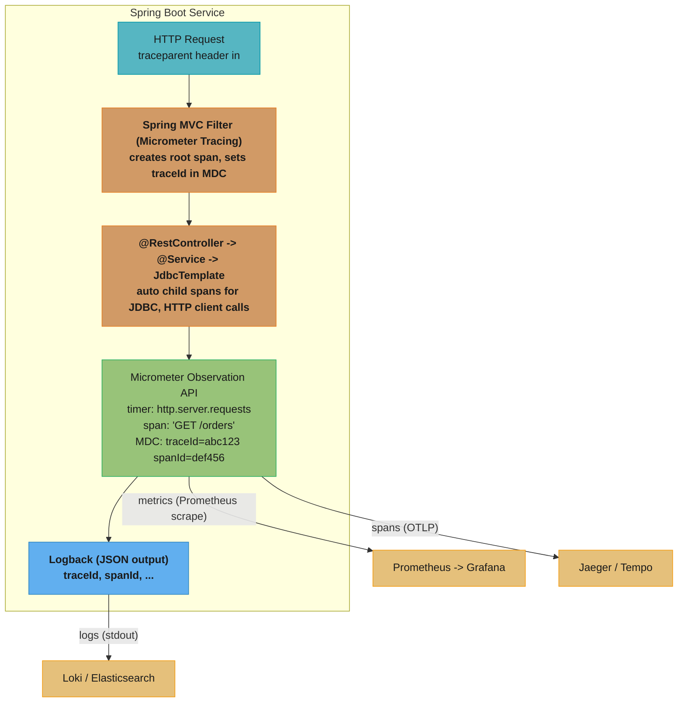
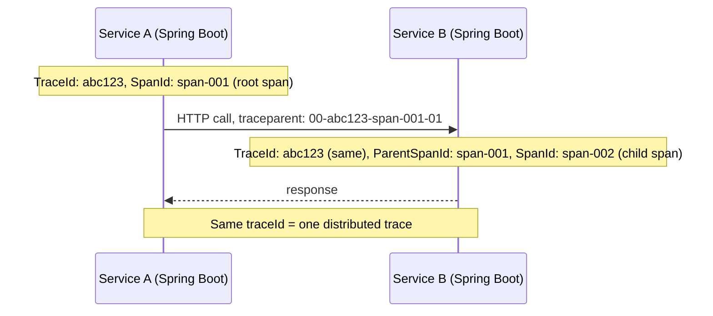

# Observability and Tracing in Spring

## 1. Concept Overview

Observability in a Spring Boot service means the ability to understand the system's behaviour from its external outputs — metrics, traces, and logs — without touching the running code (the "three pillars of observability").

Key components in the Spring ecosystem:

**Metrics:**
- `Micrometer` — vendor-neutral metrics API (counter, gauge, timer, histogram)
- `micrometer-registry-prometheus` — exposes metrics as Prometheus text format at `/actuator/prometheus`
- Spring Boot Actuator — auto-instruments HTTP requests, JVM, HikariCP, Kafka, etc.

**Tracing:**
- `Micrometer Tracing` — Spring Boot 3+ tracing abstraction (replaces Spring Cloud Sleuth)
- `micrometer-tracing-bridge-otel` — OpenTelemetry bridge (production standard)
- `opentelemetry-exporter-otlp` — exports spans via OTLP to Jaeger, Tempo, Honeycomb, Datadog
- W3C Trace Context (`traceparent` header) — standardised trace propagation across services

**Structured Logging:**
- `spring-boot-starter-logging` (Logback by default) — MDC populated with `traceId` / `spanId` by Micrometer Tracing
- JSON logging via `logstash-logback-encoder` — structured log output for ingestion by Elasticsearch/Loki
- `logging.structured.format.console=ecs` (Spring Boot 3.4+) — native ECS structured logging

**Observation API (unified abstraction):**
- `Observation` (Micrometer 1.10+) — single abstraction that produces metrics, traces, AND log correlation simultaneously

---

## 2. Intuition

> Observability is the ability to ask "what is my system doing right now?" and get a concrete, data-backed answer. A distributed system without observability is a black box — you learn about problems only when customers complain.

**Key insight:** The shift from logging to observability is a shift from "recording what happened" to "understanding causality." A log line saying `"Order 12345 created in 245ms"` is a fact; a trace showing the 245ms broke down as 2ms Spring MVC + 180ms JDBC + 63ms external API + 0ms serialization is an explanation. Structured logs without traces are searchable but not causal; traces without logs lose context. The Micrometer Observation API threads all three together automatically.

**Why this matters for senior engineers:** Production incidents are resolved by those who can find the cause fastest. Engineers who understand distributed tracing (trace IDs propagated via `traceparent`, span hierarchy, exemplars linking metrics to traces) debug p99 latency regressions in 5 minutes that others spend hours on by reading logs.

---

## 3. Core Principles

1. **Three pillars of observability**: metrics (aggregate), traces (per-request), logs (event records). All three are needed; no single pillar suffices alone.
2. **Trace context propagation**: a `traceId` must flow through every service call. W3C `traceparent` header is the standard format (`00-{traceId}-{spanId}-{flags}`).
3. **Auto-instrumentation first**: Spring Boot Actuator + Micrometer Tracing auto-instruments HTTP, JDBC, Kafka, Redis, and `@Scheduled` — write explicit `Observation` code only for business-critical custom operations.
4. **Sampling matters**: at high volume (1,000 req/s), 100% trace sampling generates 1,000 spans/req = 1M span-events/s — too expensive. Use head-based (random 1–10%) or tail-based (100% for errors/slow requests) sampling.
5. **Structured logs with trace correlation**: MDC fields `traceId` and `spanId` enable jumping from a log line to the corresponding trace in Jaeger/Grafana Tempo — the critical debugging link.
6. **Exemplars**: a Prometheus metric data point that carries a `{traceId}` label — allows navigating from a high p99 histogram bucket directly to an example trace that contributed to it.

---

## 4. Types / Architectures / Strategies

### 4.1 Instrumentation Levels

| Level | How | What You Get |
|---|---|---|
| Auto-instrumentation (Spring Boot Actuator) | Just add dependencies | HTTP, JVM, HikariCP, Kafka, Redis, Spring Batch, `@Scheduled` metrics + traces |
| Micrometer Observation API | `Observation.start("name")` | Custom span + metric + MDC correlation in one call |
| Manual Micrometer | `registry.counter("name").increment()` | Custom metrics without tracing |
| Manual OTel API | `tracer.spanBuilder("name").startSpan()` | Full control over span attributes |
| Aspect-based | `@Observed` annotation (Spring Boot 3.2+) | Automatically creates an Observation for every annotated method |

### 4.2 Propagation Formats

| Format | Header | Standard | Supported By |
|---|---|---|---|
| W3C Trace Context | `traceparent`, `tracestate` | W3C Recommendation | OTel, Micrometer Tracing, all modern APMs |
| B3 Single | `b3` | Zipkin | Zipkin, older Sleuth |
| B3 Multi | `X-B3-TraceId`, `X-B3-SpanId`, etc. | Zipkin | Zipkin, older systems |
| Datadog | `x-datadog-trace-id`, etc. | Proprietary | Datadog Agent |

Spring Micrometer Tracing defaults to W3C `traceparent` with the OTel bridge. B3 is available via `micrometer-tracing-bridge-brave`.

---

## 5. Architecture Diagrams

### Observability Stack Overview



### Distributed Trace Propagation



---

## 6. How It Works — Detailed Mechanics

### 6.1 Required Dependencies (Spring Boot 3 + Maven)

```xml
<!-- Actuator (metrics endpoint, health, info) -->
<dependency>
    <groupId>org.springframework.boot</groupId>
    <artifactId>spring-boot-starter-actuator</artifactId>
</dependency>

<!-- Micrometer Prometheus registry -->
<dependency>
    <groupId>io.micrometer</groupId>
    <artifactId>micrometer-registry-prometheus</artifactId>
</dependency>

<!-- Micrometer Tracing with OTel bridge -->
<dependency>
    <groupId>io.micrometer</groupId>
    <artifactId>micrometer-tracing-bridge-otel</artifactId>
</dependency>

<!-- OTLP exporter (Jaeger/Tempo/Honeycomb) -->
<dependency>
    <groupId>io.opentelemetry</groupId>
    <artifactId>opentelemetry-exporter-otlp</artifactId>
</dependency>
```

### 6.2 Configuration

```yaml
# application.yaml
management:
  endpoints:
    web:
      exposure:
        include: health, info, prometheus, metrics, loggers
  tracing:
    sampling:
      probability: 0.1   # 10% head-based sampling (100% in dev: 1.0)
  otlp:
    tracing:
      endpoint: http://otel-collector:4318/v1/traces  # OTLP HTTP endpoint

logging:
  pattern:
    console: "%d{ISO8601} %-5level [%X{traceId},%X{spanId}] %logger{36} - %msg%n"
  # Or structured JSON logging (Spring Boot 3.4+):
  # structured:
  #   format:
  #     console: ecs

spring:
  application:
    name: order-service   # appears in trace service.name attribute
```

### 6.3 Using the Micrometer Observation API

```java
// Auto-instrumentation is active by default for HTTP, JDBC, Kafka.
// For custom business logic, use Observation:

@Service
@RequiredArgsConstructor
public class InventoryService {
    private final ObservationRegistry registry;
    private final InventoryRepository repo;

    public InventoryStatus checkStock(long productId, int quantity) {
        return Observation.createNotStarted("inventory.check", registry)
            .lowCardinalityKeyValue("product.category", lookupCategory(productId))
            .highCardinalityKeyValue("product.id", String.valueOf(productId))
            .observe(() -> {
                // Everything inside observe() is wrapped in:
                //   - a timer metric: inventory.check{product.category=...}
                //   - a trace span: "inventory.check"
                //   - MDC: traceId, spanId auto-populated
                InventoryRecord record = repo.findById(productId);
                return record.availableQty() >= quantity
                    ? InventoryStatus.AVAILABLE
                    : InventoryStatus.OUT_OF_STOCK;
            });
    }
}
```

Key distinction:
- **`lowCardinalityKeyValue`**: tag with few distinct values (category, status, region) → safe for Prometheus labels (no cardinality explosion)
- **`highCardinalityKeyValue`**: attribute with many values (product ID, user ID, order ID) → stored in span attributes only, NOT as Prometheus labels

### 6.4 @Observed Annotation (Spring Boot 3.2+)

```java
// Declarative observation — no boilerplate Observation.createNotStarted() code
@Service
@Observed(name = "payment.processing", contextualName = "processPayment")
public class PaymentService {

    @Observed(name = "payment.charge", contextualName = "chargeCard")
    public PaymentResult charge(PaymentRequest req) {
        // Automatically wrapped in an Observation when called
        return stripeClient.charge(req);
    }
}

// Requires @EnableMethodSecurity or equivalent AOP enablement
// and spring-boot-starter-aop on classpath
```

### 6.5 Structured Logging with Trace Correlation

```xml
<!-- logback-spring.xml: JSON logging with traceId/spanId in every log line -->
<appender name="JSON" class="ch.qos.logback.core.ConsoleAppender">
    <encoder class="net.logstash.logback.encoder.LogstashEncoder">
        <customFields>{"service":"order-service","env":"${SPRING_PROFILES_ACTIVE}"}</customFields>
        <fieldNames>
            <timestamp>@timestamp</timestamp>
            <message>message</message>
            <level>level</level>
        </fieldNames>
        <!-- traceId and spanId come from MDC, auto-populated by Micrometer Tracing -->
    </encoder>
</appender>
```

Output line:
```json
{
  "@timestamp": "2024-01-15T02:34:56.789Z",
  "level": "INFO",
  "message": "Order 12345 created",
  "traceId": "abc123def456789012345678",
  "spanId": "0123456789abcdef",
  "service": "order-service",
  "env": "production"
}
```

### 6.6 Exemplars — Linking Metrics to Traces

```yaml
# Enable exemplars in Prometheus registry
management:
  metrics:
    distribution:
      percentiles-histogram:
        http.server.requests: true   # required for exemplars
```

```java
// Exemplars are automatically attached to histogram observations
// when both Micrometer Tracing and Prometheus registry are present.
// Each histogram bucket observation carries the traceId of a sample span.

// Prometheus scrape output (with exemplars):
// http_server_requests_seconds_bucket{...le="0.5"} 1234 # {traceId="abc123"} 0.432 1705283696
//                                                         ^^^ links this bucket to a trace
```

With Grafana: click on a histogram bucket data point → "Explore Trace" → jumps directly to the Jaeger/Tempo trace that contributed to that bucket. This is the exemplar-to-trace navigation.

### 6.7 BROKEN — Losing Trace Context in Async Operations

```java
// BROKEN: trace context is ThreadLocal-based — async thread has empty context
@Async
public CompletableFuture<Result> processAsync(Order order) {
    // traceId in MDC is null — logs from this method have no trace correlation
    log.info("Processing order {}", order.id());  // no traceId in log
    return CompletableFuture.completedFuture(service.process(order));
}

// FIX: use Micrometer Tracing's ContextExecutorService to propagate trace context
@Configuration
public class AsyncConfig {
    @Bean
    public Executor asyncExecutor(ObservationRegistry registry) {
        ThreadPoolTaskExecutor executor = new ThreadPoolTaskExecutor();
        executor.setCorePoolSize(8);
        executor.initialize();
        // Wrap with context propagation — trace context crosses thread boundaries
        return ContextExecutorService.wrap(
            executor.getThreadPoolExecutor(),
            () -> ContextSnapshot.captureAll(registry)
        );
    }
}
```

---

## 7. Real-World Examples

### 7.1 Netflix — Atlas + Distributed Tracing

Netflix uses Atlas (their internal time-series system) for metrics and a distributed tracing system (similar to Zipkin) for request tracing. Each microservice publishes `traceId` in every log line. When a user reports a video stream failure, on-call engineers use the `traceId` from the error log to reconstruct the full call graph across 50+ microservices — identifying whether the failure was in the CDN, the streaming service, the licensing service, or the playback device.

### 7.2 Shopify — Grafana LGTM Stack

Shopify uses the Grafana LGTM stack: Loki (logs), Grafana (dashboards), Tempo (traces), Mimir (metrics). Spring Boot services ship `traceId` in JSON logs (Loki), spans via OTLP to Tempo, and Prometheus metrics to Mimir. During a Black Friday incident, engineers drill down: Grafana dashboard shows p99 checkout latency spike → Tempo trace shows 3-second DB lock wait → Loki query filters by `traceId` to find the full context → root cause identified in 3 minutes.

### 7.3 Spring Boot Actuator — JVM and HikariCP Auto-metrics

Spring Boot Actuator auto-instruments: `jvm.memory.used`, `jvm.gc.pause`, `hikaricp.connections.pending`, `spring.kafka.consumer.fetch-latency-avg`, `http.server.requests` (histograms with p50/p95/p99). These metrics require zero application code — just `spring-boot-starter-actuator` + a registry dependency. An operations team building Grafana dashboards for a new service gets instant visibility without instrumenting a single line of business code.

---

## 8. Tradeoffs

| Approach | Coverage | Cardinality Risk | Overhead | When |
|---|---|---|---|---|
| Auto-instrumentation only | HTTP, JDBC, Kafka, JVM | Low | Minimal | Default for most services |
| `@Observed` annotation | Method-level, all code | Moderate (if poorly tagged) | Low (AOP proxy) | Annotating service-layer business operations |
| Manual `Observation` API | Full control | Controlled | Low | Critical custom operations |
| Manual OTel API | Full control | Controlled | Low | When OTel-specific features needed |
| 100% trace sampling | All requests | N/A (traces not metrics) | High storage + network | Dev/test; never in production at >100 req/s |
| Tail-based sampling | Errors + slow | N/A | Higher collector CPU | High-value traces only |

---

## 9. When to Use / When NOT to Use

### Use Micrometer Observation API when:
- Instrumenting custom business-critical operations (payment processing, fraud detection, external API calls)
- You need one instrumentation call to produce metrics AND traces AND log correlation simultaneously

### Use `@Observed` annotation when:
- You want declarative, zero-boilerplate observation for service-layer methods
- AOP-proxied beans are acceptable (same restrictions as `@Transactional`)

### Use manual `MeterRegistry` (counters, gauges) when:
- You need custom domain metrics not captured by Observation (e.g., business KPIs: orders per minute by product category, cart abandonment rate)
- No trace context is needed — purely aggregate business metrics

### Do NOT:
- Add user IDs, order IDs, or product IDs as **Prometheus metric labels** — high cardinality causes Prometheus OOM. Use them as span attributes instead.
- Set `sampling.probability=1.0` in production without estimating storage costs: 1,000 req/s × 10 spans/req × 500 bytes = 5 MB/s = 432 GB/day.

---

## 10. Common Pitfalls

### Pitfall 1: High-cardinality labels in Prometheus
```java
// BROKEN: order ID as a metric label → millions of unique label combinations
registry.timer("order.processing", "orderId", String.valueOf(order.id()))
    .record(duration);
// Prometheus keeps one time series per label combination → OOM at scale

// FIX: use low-cardinality labels only for metrics
registry.timer("order.processing", "tier", order.customerTier().name())
    .record(duration);
// Store orderId as a span attribute instead (high cardinality is fine there)
```

### Pitfall 2: Missing trace context in async code
See §6.7. Use `ContextExecutorService.wrap()` or Spring's `DelegatingSecurityContextAsyncTaskExecutor` equivalent for trace context propagation.

### Pitfall 3: Actuator endpoints exposed on the public port
```yaml
# BROKEN: all Actuator endpoints on port 8080 — exposed to internet
management:
  endpoints:
    web:
      exposure:
        include: "*"

# FIX: separate management port (not routed in the public load balancer)
management:
  server:
    port: 8081   # internal only; never in public VPC routing tables
  endpoints:
    web:
      exposure:
        include: health, prometheus, loggers
```

### Pitfall 4: Sampling suppressing error traces
Head-based sampling at 1% drops 99% of traces — including error traces you want to see. Fix: configure tail-based sampling (otel-collector or Tempo) to always keep traces with `status=ERROR` and sample the rest at 1%.

### Pitfall 5: Losing `traceId` at asynchronous service boundary (message queues)
When an event is published to Kafka, the `traceparent` header must be written to the Kafka record headers. Spring Kafka's `KafkaTemplate` with Micrometer Tracing propagation does this automatically — but only if the trace context is active on the publishing thread. Verify with `kafka-console-consumer --property print.headers=true` that `traceparent` appears in record headers.

---

## 11. Technologies & Tools

| Tool / Feature | Version | Purpose |
|---|---|---|
| `spring-boot-starter-actuator` | Spring Boot 3.x | Auto-instruments + exposes metrics/health/info endpoints |
| `micrometer-registry-prometheus` | Micrometer 1.x | Prometheus metrics scrape endpoint at /actuator/prometheus |
| `micrometer-tracing-bridge-otel` | Micrometer 1.10+ | OTel bridge for Micrometer Tracing |
| `opentelemetry-exporter-otlp` | OTel Java SDK 1.x | OTLP span export to Jaeger/Tempo/Honeycomb/Datadog |
| `Observation` API | Micrometer 1.10+ (Spring Boot 3+) | Unified metrics + trace + log correlation |
| `@Observed` | Micrometer 1.10+ (Boot 3.2+) | Declarative method-level observation |
| W3C `traceparent` | W3C Recommendation | Distributed trace context propagation header |
| `logstash-logback-encoder` | 7.x | JSON structured logging for Logback |
| `spring.logging.structured.format.console=ecs` | Spring Boot 3.4+ | Native ECS structured JSON logging |
| `management.tracing.sampling.probability` | Spring Boot 3.x | Head-based sampling rate (0.0–1.0) |
| Grafana Tempo | Open source | Distributed trace backend (OTLP ingestion) |
| Jaeger | Open source | Alternative distributed trace backend |
| Prometheus | Open source | Metrics time-series database |
| Grafana | Open source | Dashboard + alerting + trace navigation |

---

## 12. Interview Questions with Answers

**Q1: What are the three pillars of observability, and why is each insufficient alone?**
Metrics, traces, and logs. Metrics (counters, histograms, gauges) are aggregate — they tell you that p99 latency is 2 seconds but not which specific requests are slow or why. Traces are per-request causality maps — they show which service and which code path took the 2 seconds, but individual traces don't tell you how widespread the problem is. Logs are event records — they capture detailed context per event but are not structured for aggregation or causality analysis. Together: metrics alert you that something is wrong, traces tell you why a specific request was slow, and logs provide the fine-grained context (SQL queries, error messages, business fields) for debugging.

**Q2: What is the W3C `traceparent` header and what are its fields?**
`traceparent` is the W3C Trace Context standard for distributed trace propagation. Format: `{version}-{traceId}-{parentSpanId}-{flags}`. Example: `00-abc123def456789012345678901234-0123456789abcdef-01`. Fields: `version` (always `00`); `traceId` (128-bit hex, unique per distributed request — same across all services in one request); `parentSpanId` (64-bit hex, the calling span's ID — enables parent-child span linking); `flags` (8-bit, bit 0 = sampling flag: `01` means this trace is sampled). When Service A calls Service B, A sets `traceparent` with its own `spanId` as `parentSpanId` — Service B creates a child span with A's span as parent, building the trace tree.

**Q3: What is the Micrometer Observation API, and how does it differ from directly calling `MeterRegistry`?**
`MeterRegistry.counter("name").increment()` creates a metric only — no trace span, no MDC context. The Observation API (`Observation.createNotStarted("name", registry).observe(...)`) creates all three simultaneously: a timer metric (`name` with `outcome` and `exception` tags), a trace span (added as a child to the current active span), and populates MDC with `traceId`/`spanId` for the duration of the observed block. This ensures all three signals share the same name and context — when you look at a metric, a trace, and a log, they all agree on what happened. Using raw `MeterRegistry` calls scatters the instrumentation and loses correlation.

**Q4: What is trace sampling and what are the tradeoffs between head-based and tail-based sampling?**
Head-based sampling decides at the root span (first service) whether to record the trace — all downstream services inherit the decision. It is computationally cheap but cannot make intelligent decisions: a 1% head-based sampler drops 99% of traces, including some error traces. Tail-based sampling records all trace data initially and makes the keep/drop decision after the trace is complete — allowing "always keep errors or traces > 1 second." Tail-based sampling requires a trace collector (OTel Collector, Tempo with trace-aware receiver) to buffer spans and correlate them by `traceId` before applying the sampling policy. Cost: higher collector memory + CPU. Best practice: head-based 1–10% for normal traffic, tail-based rule to always keep error traces.

**Q5: What is cardinality in Prometheus metrics, and why is it dangerous to use request-level IDs as labels?**
Each unique combination of label values in a Prometheus metric creates one time series in Prometheus's memory. Prometheus stores all active series in memory for fast queries. Adding a label with 1 million distinct values (e.g., `userId`, `orderId`, `traceId`) creates 1 million time series — each consuming ~1–2 KB of memory = 1–2 GB per metric just for that label. This "cardinality explosion" causes Prometheus OOM and query timeouts. Rule: Prometheus labels must be low cardinality (< 1,000 distinct values): `status` (ok/error), `tier` (free/pro/enterprise), `region` (us-east/eu-west), `endpoint` (path template, not full URL). High-cardinality identifiers (userId, orderId, traceId) belong in trace span attributes — the trace backend indexes them efficiently.

**Q6: How does Micrometer Tracing propagate the trace context to virtual threads or CompletableFuture?**
Micrometer Tracing uses a context propagation mechanism (backed by `io.micrometer:context-propagation`) that captures all registered context values (trace context, MDC, Reactor context) into a `ContextSnapshot`. When wrapping an executor with `ContextExecutorService.wrap(executor, ContextSnapshot::captureAll)`, each task submitted to the executor restores the captured context before running — including the active trace span and MDC fields. For `CompletableFuture`: use `ContextSnapshot.captureAll(observationRegistry).wrap(runnable/callable)` to ensure the trace context is available in async callback chains. For virtual threads via `Executors.newVirtualThreadPerTaskExecutor()`: the same wrapping pattern applies.

**Q7: What is an exemplar, and how does it link Prometheus metrics to distributed traces?**
An exemplar is a sample data point attached to a Prometheus histogram/summary observation that carries additional metadata — specifically the `traceId` of the request that contributed to that observation. When a request with `traceId=abc123` is recorded in the `http.server.requests` histogram with a value of 0.8 seconds, the exemplar attaches `traceId=abc123` to that bucket boundary. In Grafana, a histogram visualization can display exemplars as orange dots — clicking a dot opens the Tempo trace for `abc123`. This is the "metric to trace" drill-down path. Requirements: Prometheus must be configured with `--enable-feature=exemplar-storage`; Micrometer must have both a tracing bridge and Prometheus registry active.

**Q8: How do you configure distributed tracing with Spring Boot 3 to export spans to Jaeger via OTLP?**
Add dependencies: `micrometer-tracing-bridge-otel` + `opentelemetry-exporter-otlp`. Configure:
```yaml
management:
  tracing:
    sampling:
      probability: 1.0  # 100% in dev
  otlp:
    tracing:
      endpoint: http://jaeger:4318/v1/traces  # Jaeger OTLP HTTP endpoint
spring:
  application:
    name: my-service   # becomes the "service.name" span attribute
```
Spring Boot 3 auto-configures the OTel `SdkTracerProvider`, the `OtlpHttpSpanExporter`, and the `MicrometerTracingAutoConfiguration`. Every HTTP request, JDBC query, and Kafka consumer invocation is automatically traced and exported to Jaeger. No manual `Tracer.spanBuilder()` code is needed for auto-instrumented paths.

**Q9: What is structured logging, and how does it differ from traditional log messages?**
Traditional logging: `log.info("Order 12345 created for user john@example.com in 245ms")` — a human-readable string. Searching for all slow orders requires regex: `grep "created.*[0-9]{4,}ms"`. Structured logging: `log.info("Order created", kv("orderId", 12345), kv("userId", "john"), kv("durationMs", 245))` — a JSON object `{"message": "Order created", "orderId": 12345, "userId": "john", "durationMs": 245, "traceId": "abc123"}`. Searching for all orders > 200ms: `level=INFO AND message="Order created" AND durationMs>200`. Structured logs are queryable, aggregatable, and linkable to traces via `traceId`. They are also parsable by log aggregation systems (Elasticsearch, Loki) without fragile regex extraction.

**Q10: How do you expose and secure the `/actuator/prometheus` endpoint?**
Never expose Actuator endpoints on the public port in production. Configure a separate management port: `management.server.port=8081`. The load balancer routes port 8080 (public) to the internet; port 8081 is internal-only (VPC security group or Kubernetes NetworkPolicy blocks external access). On port 8081, expose only the needed endpoints: `management.endpoints.web.exposure.include=health,prometheus,loggers,metrics`. For authenticated scraping: configure `management.endpoint.prometheus.enabled=true` and add Spring Security to the management port with `HttpSecurity.requestMatcher(EndpointRequest.toAnyEndpoint()).authorizeHttpRequests(auth -> auth.anyRequest().hasRole("PROMETHEUS"))`.

**Q11: What is the difference between `lowCardinalityKeyValue` and `highCardinalityKeyValue` in the Observation API?**
`lowCardinalityKeyValue(key, value)` produces a Prometheus metric tag (label) — it must have few distinct values (< 100). Example: `product.category=electronics`. These appear as dimensions in Prometheus time series. `highCardinalityKeyValue(key, value)` produces a span attribute only — it is never added to the Prometheus metric. Example: `product.id=12345`. High-cardinality values in Prometheus labels cause cardinality explosion; in span attributes they are fine because the trace backend indexes them efficiently (by `traceId`). Using the wrong method — putting high-cardinality data in `lowCardinalityKeyValue` — causes Prometheus OOM.

**Q12: How do you ensure the `traceId` appears in every log line, including logs from async methods?**
Micrometer Tracing auto-populates MDC keys `traceId` and `spanId` for the duration of every span (HTTP request, JDBC call, Observation block). For synchronous code, the MDC is automatically populated and cleared. For async code: the trace context is `ThreadLocal`-based — it must be explicitly propagated to the async thread. Use `ContextExecutorService.wrap(...)` for executor-based async (§6.7). For Spring's `@Async`: configure a `DelegatingContextTaskExecutor` or use `spring.threads.virtual.enabled=true` (Spring Boot 3.2 with virtual thread context propagation). Verify: add `%X{traceId}` to your Logback pattern and write an integration test that calls an async service method and checks that the log output contains a non-empty `traceId`.

**Q13: What are SLIs, SLOs, and how does Micrometer help implement them?**
SLI (Service Level Indicator) is a metric that measures service quality — e.g., p99 latency, error rate. SLO (Service Level Objective) is the target — e.g., "99% of requests complete in < 500ms". Micrometer provides: `http.server.requests` histogram (for latency SLIs), `http.server.requests{outcome=SERVER_ERROR}` counter (for error rate SLIs). In Prometheus/Grafana: `histogram_quantile(0.99, rate(http_server_requests_seconds_bucket[5m]))` computes p99 latency. An alerting rule fires when p99 > 500ms over 5 minutes — violating the SLO. Spring Boot Actuator's automatic `http.server.requests` instrumentation provides SLI data with zero custom code; SLO alerting lives in Prometheus/Grafana.

**Q14: How would you trace a Spring Batch job end-to-end?**
Spring Batch 5 + Micrometer Tracing (Spring Boot 3.1+) auto-creates spans for: `JobExecution` (root span), each `StepExecution` (child span), and each chunk (child of step). The job trace shows: total job duration, per-step duration, and identifies slow steps. To add business context: use `Observation.createNotStarted("inventory.check", registry).observe(...)` inside `ItemProcessor` — creates a child span of the current step span. The full trace in Jaeger shows: `importJob` (root) → `importStep` → `chunk-0` → `inventory.check` × N. Configure `management.tracing.sampling.probability=1.0` for scheduled batch jobs (they're low-frequency, so 100% sampling is affordable).

**Q15: Describe a production incident where observability tools helped diagnose the root cause.**
Scenario: Black Friday sale, checkout p99 latency spikes from 180ms to 4.2 seconds at 18:35. Grafana alert fires. Diagnosis in 4 minutes: (1) Grafana dashboard: `http.server.requests{uri=/checkout}` p99 histogram shows spike at 18:35; (2) exemplar on the spike bucket → jumps to a Tempo trace for `traceId=abc123`; (3) trace shows: checkout span 4.1s, JDBC `inventory.check` span 3.8s, DB connection `await` span 3.5s; (4) HikariCP metric `hikaricp.connections.pending` shows pool exhaustion (all 10 connections busy) at 18:35; (5) Loki query `traceId=abc123`: log line shows `connection acquire timed out after 3500ms` — HikariCP pool of 10 connections too small for Black Friday traffic; (6) fix: `spring.datasource.hikari.maximum-pool-size=25`. Resolved in 7 minutes. Without observability, this would have required hours of reading server logs.

---

## 13. Best Practices

1. **Start with auto-instrumentation** — `spring-boot-starter-actuator` + Prometheus + Micrometer Tracing OTel bridge gives HTTP, JVM, JDBC, Kafka traces and metrics with zero application code.
2. **Use `@Observed` for service-layer methods** that are business-critical and need custom timing + trace spans.
3. **Never use high-cardinality values (userId, orderId) as Prometheus metric labels** — use `lowCardinalityKeyValue` for metrics labels, `highCardinalityKeyValue` for span attributes.
4. **Structure logs as JSON** (`logstash-logback-encoder`) with `traceId` and `spanId` in every line — enables direct Loki-to-Tempo navigation.
5. **Separate the management port** — never expose `/actuator/prometheus` on the public port.
6. **Set `sampling.probability=0.1` in production** (10%) for normal traffic; configure tail-based sampling in the OTel Collector to always keep error/slow traces.
7. **Propagate trace context through async operations** — use `ContextExecutorService.wrap()` for thread pool executors; verify with integration tests.
8. **Enable exemplars** (`management.metrics.distribution.percentiles-histogram.http.server.requests=true`) — essential for metric-to-trace drill-down.
9. **Annotate spans with business context** (order tier, customer region, payment method) for root cause analysis beyond raw latency.
10. **Define and alert on SLOs** using `histogram_quantile` Prometheus queries — observability without alerting is just expensive storage.

---

## 14. Case Study

**Scenario: Diagnosing p99 checkout latency regression after a Spring Boot upgrade**

An e-commerce service upgraded from Spring Boot 2.7 to 3.2. Post-upgrade, p99 checkout latency increased from 220ms to 680ms. Observability tools identified the root cause in 12 minutes.

**Step 1 — Metrics alert:** Grafana `http.server.requests{uri=/checkout}` p99 histogram alarm fires at 680ms (SLO: 500ms). The alarm includes an exemplar `traceId`.

**Step 2 — Trace drill-down (Tempo):** The exemplar trace shows:
```
checkout (680ms)
  ├── JDBC: SELECT inventory WHERE productId=? (550ms)  ← suspicious
  ├── JDBC: INSERT orders ... (12ms)
  └── Kafka: send order.created (5ms)
```

**Step 3 — Span attributes:** The JDBC span shows `db.statement = "SELECT * FROM inventory WHERE productId = ?"`. Absence of `db.row_count` attribute from the new auto-instrumentation suggests a full table scan.

**Step 4 — Structured logs (Loki, filter by traceId):**
```json
{"level":"WARN","message":"Slow query: SELECT * FROM inventory WHERE productId=? took 548ms","traceId":"abc123","rowsScanned":1200000}
```

**Root cause:** Spring Boot 3.2 + Hibernate 6 changed the default `IN` clause strategy. A `@Query` using `productId IN :ids` was generating a query that bypassed the composite index. The index on `(productId, warehouseId)` was only used when `warehouseId` was also in the WHERE clause; the new Hibernate 6 query omitted it.

**Fix:** Added `@Index(columnList = "productId")` to the entity + reworded the query.

**Timeline:** Alert at T+0, trace identified at T+3min, log confirms at T+7min, root cause at T+10min, fix deployed at T+42min. Without observability: this would have been a 4-hour war-room session comparing logs manually.

**Cross-links:**
- [Spring Boot Actuator](../spring_boot_actuator/README.md) — metrics endpoints, health indicators
- [Spring Cloud Patterns](../spring_cloud_patterns/README.md) — Micrometer Tracing in distributed services
- [Spring Performance](../spring_performance/README.md) — JVM tuning, connection pool sizing

---

## Related / See Also

- [Spring Boot Actuator](../spring_boot_actuator/README.md) — Micrometer metrics foundation
- [Case Study: OTel Observability](../case_studies/cross_cutting/otel_observability_for_spring.md) — production tracing setup
- [Spring Cloud Patterns](../spring_cloud_patterns/README.md) — distributed tracing across services
- [Observability, Tracing & OTel](../../devops/observability_tracing_and_otel/README.md) — OTel Collector pipeline, sampling policies, and backend deployment (Jaeger/Tempo/Prometheus) beyond the Spring-side instrumentation covered here
- [Observability (HLD)](../../hld/observability/README.md) — the three-pillars theory and system-design tradeoffs behind metrics/traces/logs
- [Observability & Monitoring](../../backend/observability_and_monitoring/README.md) — alerting, SLIs/SLOs, and dashboard design at the platform level
