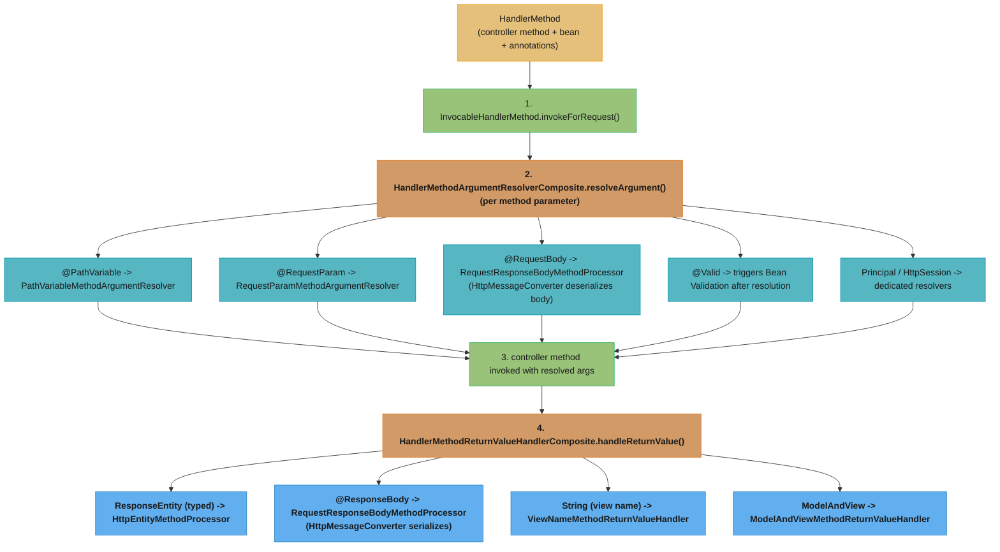
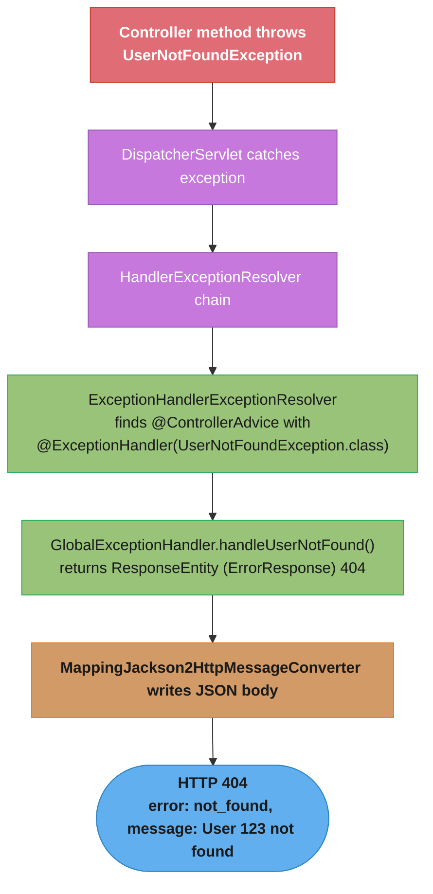
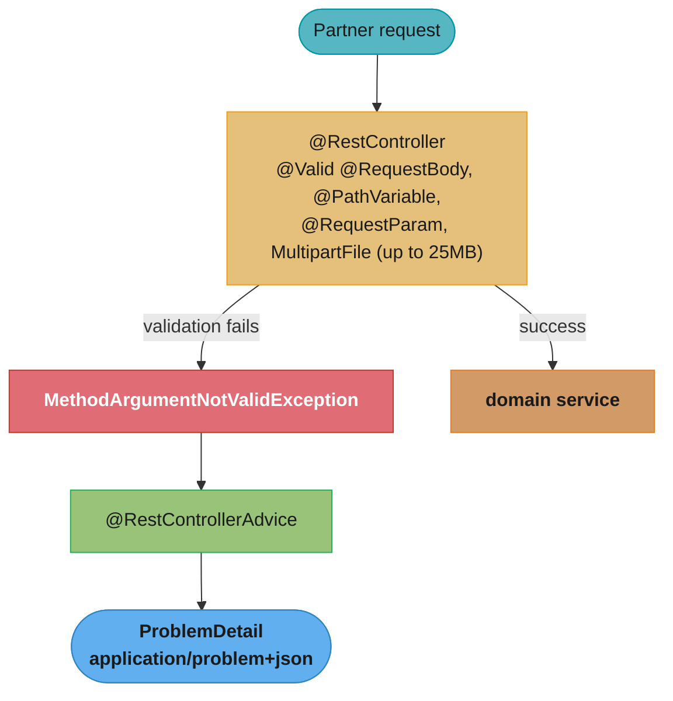

# Request Handling

## 1. Concept Overview

Request handling in Spring MVC covers everything from mapping HTTP requests to controller methods, extracting data from requests (path variables, query params, headers, request bodies), validating input, returning responses, and handling exceptions. `RequestMappingHandlerAdapter` drives this pipeline using `HandlerMethodArgumentResolver`s for input and `HandlerMethodReturnValueHandler`s for output.

---

## 2. Intuition

Think of a controller method as a contract: it declares exactly what it needs from the request (path variables, body, headers) and what it returns. Spring MVC is the middleman that reads the incoming HTTP message, fulfills the contract by populating method parameters, calls the method, and converts the return value back into an HTTP response.

**One-line analogy:** A controller method is a pure Java function — Spring MVC handles all the HTTP protocol plumbing around it.

**Key insight:** `@RequestBody` and `@ResponseBody` are what make Spring MVC "REST-like." Without them, Spring MVC is a classic server-side MVC framework returning HTML views. With them, it becomes a JSON REST API framework.

---

## 3. Core Principles

1. **Declare intent, not mechanism:** Annotate what you need (`@RequestBody User user`), not how to get it. Spring handles deserialization.
2. **Explicit produces/consumes:** Declare `produces` and `consumes` on mappings for clear API contracts and better error messages.
3. **Validation is declarative:** `@Valid` / `@Validated` on method parameters triggers Bean Validation without explicit code.
4. **Exception handling is global:** `@ControllerAdvice` centralizes error responses; controllers should not contain `try/catch` for business exceptions.
5. **ResponseEntity gives full control:** When you need to set status code, headers, or conditionally return a body, use `ResponseEntity<T>`.

---

## 4. Types / Architectures / Strategies

### Request Mapping Annotations

| Annotation | HTTP Method | Notes |
|------------|-------------|-------|
| `@RequestMapping` | Any (specify `method=`) | Most flexible |
| `@GetMapping` | GET | Shorthand, most common |
| `@PostMapping` | POST | For creating resources |
| `@PutMapping` | PUT | For full replacement |
| `@PatchMapping` | PATCH | For partial update |
| `@DeleteMapping` | DELETE | For deletion |

### Method Parameter Annotations

| Annotation | Extracts From | Notes |
|------------|---------------|-------|
| `@PathVariable` | URI path segment | `/users/{id}` |
| `@RequestParam` | Query string or form data | `?page=1` |
| `@RequestHeader` | HTTP header | `X-Request-ID` |
| `@CookieValue` | Cookie | `sessionId` |
| `@RequestBody` | Request body | JSON/XML deserialization |
| `@ModelAttribute` | Form data binding | Multi-field form |
| `@RequestPart` | Multipart request part | File upload |
| `@MatrixVariable` | Matrix variable in path | `/users;id=1` |

### Exception Handling Options

| Mechanism | Scope | Use Case |
|-----------|-------|---------|
| `@ExceptionHandler` in controller | Controller-local | Specific exceptions for one controller |
| `@ControllerAdvice` + `@ExceptionHandler` | Global | Centralized error handling for all controllers |
| `ResponseStatusException` | Inline throw | Quick status code + message |
| `ProblemDetail` (Spring 6+) | RFC 7807 response | Structured error format for REST APIs |

---

## 5. Architecture Diagrams



Argument resolution and return-value handling are both composite dispatchers: each registered resolver/handler is asked in order whether it supports the parameter or return type, and the first match wins.



A thrown exception is routed through the `HandlerExceptionResolver` chain to the matching `@ControllerAdvice` method, which produces the error response that the same message-converter pipeline serializes.

---

## 6. How It Works — Detailed Mechanics

### Request Mapping Variants

```java
@RestController
@RequestMapping("/api/v1/users")  // base path for all methods
public class UserController {

    // GET /api/v1/users/{id}
    @GetMapping("/{id}")
    public UserDto getUser(@PathVariable Long id) {
        return userService.findById(id);
    }

    // GET /api/v1/users?page=0&size=20&sort=name,asc
    @GetMapping
    public Page<UserDto> listUsers(
            @RequestParam(defaultValue = "0") int page,
            @RequestParam(defaultValue = "20") int size,
            @RequestParam(required = false) String name) {
        return userService.findAll(page, size, name);
    }

    // POST /api/v1/users
    // Content-Type: application/json
    @PostMapping(consumes = MediaType.APPLICATION_JSON_VALUE,
                 produces = MediaType.APPLICATION_JSON_VALUE)
    @ResponseStatus(HttpStatus.CREATED)
    public UserDto createUser(@Valid @RequestBody CreateUserRequest request) {
        return userService.create(request);
    }

    // PUT /api/v1/users/{id}
    @PutMapping("/{id}")
    public ResponseEntity<UserDto> updateUser(
            @PathVariable Long id,
            @Valid @RequestBody UpdateUserRequest request) {
        UserDto updated = userService.update(id, request);
        return ResponseEntity.ok(updated);
    }

    // DELETE /api/v1/users/{id}
    @DeleteMapping("/{id}")
    @ResponseStatus(HttpStatus.NO_CONTENT)
    public void deleteUser(@PathVariable Long id) {
        userService.delete(id);
    }

    // Header and conditional extraction
    @GetMapping("/{id}/profile")
    public UserDto getUserProfile(
            @PathVariable Long id,
            @RequestHeader("Accept-Language") String lang,
            @RequestHeader(value = "X-Request-ID", required = false) String requestId) {
        return userService.findProfile(id, lang);
    }
}
```

### ResponseEntity — Full Control

```java
@GetMapping("/{id}")
public ResponseEntity<UserDto> getUser(@PathVariable Long id) {
    return userService.findById(id)
        .map(user -> ResponseEntity.ok()
            .lastModified(user.getUpdatedAt())
            .eTag(String.valueOf(user.getVersion()))
            .body(userMapper.toDto(user)))
        .orElseGet(() -> ResponseEntity.notFound().build());
}

// Conditional GET (304 Not Modified)
@GetMapping("/{id}")
public ResponseEntity<UserDto> getUser(@PathVariable Long id,
                                        WebRequest request) {
    UserDto user = userService.findById(id);
    String etag = "\"" + user.getVersion() + "\"";

    if (request.checkNotModified(etag)) {
        return null;  // 304 Not Modified — body not sent
    }

    return ResponseEntity.ok()
        .eTag(etag)
        .body(user);
}
```

### Validation

```java
// Bean Validation on @RequestBody
@PostMapping("/users")
public UserDto createUser(@Valid @RequestBody CreateUserRequest request) {
    // If validation fails, MethodArgumentNotValidException is thrown
    // before the method body executes
    return userService.create(request);
}

// Request DTO with constraints
public class CreateUserRequest {
    @NotBlank(message = "Name is required")
    @Size(min = 2, max = 100)
    private String name;

    @Email(message = "Invalid email format")
    @NotBlank
    private String email;

    @Min(18) @Max(120)
    private int age;

    @Pattern(regexp = "^\\+?[0-9]{10,15}$")
    private String phone;

    // getters, setters
}

// @Validated for groups (Spring-specific, more powerful than @Valid)
@PostMapping("/users")
public UserDto createUser(@Validated(CreateGroup.class) @RequestBody CreateUserRequest req) {
    // Only constraints in CreateGroup are validated
}

// Global exception handler for validation errors
@RestControllerAdvice
public class GlobalExceptionHandler {

    @ExceptionHandler(MethodArgumentNotValidException.class)
    @ResponseStatus(HttpStatus.BAD_REQUEST)
    public ProblemDetail handleValidation(MethodArgumentNotValidException ex) {
        ProblemDetail problem = ProblemDetail.forStatus(HttpStatus.BAD_REQUEST);
        problem.setTitle("Validation Failed");
        Map<String, String> errors = new LinkedHashMap<>();
        ex.getBindingResult().getFieldErrors()
            .forEach(e -> errors.put(e.getField(), e.getDefaultMessage()));
        problem.setProperty("errors", errors);
        return problem;
    }

    @ExceptionHandler(UserNotFoundException.class)
    @ResponseStatus(HttpStatus.NOT_FOUND)
    public ProblemDetail handleNotFound(UserNotFoundException ex) {
        ProblemDetail problem = ProblemDetail.forStatus(HttpStatus.NOT_FOUND);
        problem.setTitle("User Not Found");
        problem.setDetail(ex.getMessage());
        return problem;
    }

    @ExceptionHandler(Exception.class)
    @ResponseStatus(HttpStatus.INTERNAL_SERVER_ERROR)
    public ProblemDetail handleGeneral(Exception ex) {
        log.error("Unhandled exception", ex);
        ProblemDetail problem = ProblemDetail.forStatus(HttpStatus.INTERNAL_SERVER_ERROR);
        problem.setTitle("Internal Server Error");
        return problem;
    }
}
```

### ResponseBodyAdvice — Wrapping All Responses

```java
// Wrap every response in a standard ApiResponse envelope
@RestControllerAdvice
public class ApiResponseWrapper implements ResponseBodyAdvice<Object> {

    @Override
    public boolean supports(MethodParameter returnType,
                             Class<? extends HttpMessageConverter<?>> converterType) {
        // Apply to all controllers except those returning ResponseEntity with ProblemDetail
        return !returnType.getParameterType().equals(ProblemDetail.class);
    }

    @Override
    public Object beforeBodyWrite(Object body, MethodParameter returnType,
                                   MediaType mediaType,
                                   Class<? extends HttpMessageConverter<?>> converterType,
                                   ServerHttpRequest request,
                                   ServerHttpResponse response) {
        if (body instanceof ApiResponse) return body;  // already wrapped
        return ApiResponse.success(body);
    }
}

public record ApiResponse<T>(boolean success, T data, String error) {
    public static <T> ApiResponse<T> success(T data) {
        return new ApiResponse<>(true, data, null);
    }
    public static ApiResponse<?> error(String message) {
        return new ApiResponse<>(false, null, message);
    }
}
```

### Custom HandlerMethodArgumentResolver

```java
// Custom @CurrentUser annotation that injects authenticated user
@Target(ElementType.PARAMETER)
@Retention(RetentionPolicy.RUNTIME)
public @interface CurrentUser {}

// Resolver
@Component
public class CurrentUserArgumentResolver implements HandlerMethodArgumentResolver {

    @Override
    public boolean supportsParameter(MethodParameter parameter) {
        return parameter.hasParameterAnnotation(CurrentUser.class)
            && parameter.getParameterType().equals(User.class);
    }

    @Override
    public Object resolveArgument(MethodParameter parameter,
                                   ModelAndViewContainer mavContainer,
                                   NativeWebRequest webRequest,
                                   WebDataBinderFactory binderFactory) {
        Authentication auth = SecurityContextHolder.getContext().getAuthentication();
        if (auth == null || !auth.isAuthenticated()) {
            throw new UnauthorizedException("Not authenticated");
        }
        return (User) auth.getPrincipal();
    }
}

// Register in WebMvcConfigurer
@Override
public void addArgumentResolvers(List<HandlerMethodArgumentResolver> resolvers) {
    resolvers.add(new CurrentUserArgumentResolver());
}

// Usage in controller
@GetMapping("/me")
public UserDto getCurrentUser(@CurrentUser User user) {
    return userMapper.toDto(user);  // clean, no SecurityContextHolder in controller
}
```

---

## 7. Real-World Examples

**Paginated list endpoint:** `@GetMapping("/orders")` accepts `Pageable` as a parameter (resolved by `PageableHandlerMethodArgumentResolver`). Supports `?page=0&size=20&sort=createdAt,desc`. Returns `Page<OrderDto>` with pagination metadata.

**File upload endpoint:** `@PostMapping(consumes = MediaType.MULTIPART_FORM_DATA_VALUE)` with `@RequestParam MultipartFile file` parameter. Spring parses multipart, validates file size and type, stores to S3, returns upload confirmation.

**Conditional update with ETag:** `@PutMapping` checks `If-Match` header against current entity version. If mismatch, returns `412 Precondition Failed`. Prevents concurrent overwrites.

---

## 8. Tradeoffs

| Approach | Control | Verbosity | Best For |
|----------|---------|-----------|---------|
| Return POJO | Low | Minimal | Simple REST APIs |
| Return `ResponseEntity<T>` | Full | More verbose | When status/headers matter |
| `@ResponseStatus` on method | Partial (status only) | Minimal | Fixed-status endpoints |
| `ResponseBodyAdvice` | Post-processing | Separate class | Global response wrapping |

---

## 9. When to Use / When NOT to Use

**Use `@Valid` on `@RequestBody` always** for any DTO with user-supplied data.

**Use `ResponseEntity<T>` when:**
- Setting dynamic response headers (ETag, Location, Cache-Control)
- Returning different status codes conditionally
- Returning empty body (204) vs filled body (200)

**Use `@ControllerAdvice` for ALL exception handling** — never catch exceptions in controllers just to return error responses.

**Do NOT:**
- Access `HttpServletRequest` directly in controller methods when argument resolvers cover the use case
- Return raw entity objects from controllers — always use DTOs (avoid exposing DB schema)
- Use `@ResponseBody` on individual methods in a `@RestController` class (redundant)

---

## 10. Common Pitfalls

### Pitfall 1: @RequestBody Consuming HttpServletRequest Body Twice

```java
// BROKEN: reading request body in a filter and again in @RequestBody
// HttpServletRequest.getInputStream() can only be read once
public class LoggingFilter extends OncePerRequestFilter {
    protected void doFilterInternal(...) {
        byte[] body = request.getInputStream().readAllBytes();  // reads body
        log.info("Request body: {}", new String(body));
        chain.doFilter(request, response);  // @RequestBody gets empty stream!
    }
}

// FIXED: wrap in ContentCachingRequestWrapper
public class LoggingFilter extends OncePerRequestFilter {
    protected void doFilterInternal(HttpServletRequest request, ...) {
        ContentCachingRequestWrapper wrapper = new ContentCachingRequestWrapper(request);
        chain.doFilter(wrapper, response);
        byte[] body = wrapper.getContentAsByteArray();  // read after filter chain
        log.info("Request body: {}", new String(body));
    }
}
```

### Pitfall 2: @PathVariable Type Mismatch Returns 400 Without Custom Error

```java
// GET /users/abc  (where id is Long)
@GetMapping("/users/{id}")
public UserDto getUser(@PathVariable Long id) { ... }
// MethodArgumentTypeMismatchException: "abc" cannot be converted to Long
// Default Spring error: ugly 400 with HTML or minimal JSON

// FIXED: handle in @ControllerAdvice
@ExceptionHandler(MethodArgumentTypeMismatchException.class)
@ResponseStatus(HttpStatus.BAD_REQUEST)
public ProblemDetail handleTypeMismatch(MethodArgumentTypeMismatchException ex) {
    ProblemDetail problem = ProblemDetail.forStatus(HttpStatus.BAD_REQUEST);
    problem.setDetail("Invalid value '" + ex.getValue() +
                      "' for parameter '" + ex.getName() + "'");
    return problem;
}
```

### Pitfall 3: Large RequestBody Causing OOM

```java
// Risk: client sends 500MB JSON; Spring reads entire body into memory
@PostMapping("/data")
public void processData(@RequestBody LargeDataPayload payload) { ... }

// FIXED: use streaming for large payloads
@PostMapping("/data")
public void processData(HttpServletRequest request) throws Exception {
    JsonFactory factory = new JsonFactory();
    try (JsonParser parser = factory.createParser(request.getInputStream())) {
        // stream-process without loading entire body
    }
}
// OR: limit payload size
spring.servlet.multipart.max-request-size=10MB
server.tomcat.max-http-form-post-size=10MB
```

---

## 11. Technologies & Tools

| Component | Role |
|-----------|------|
| `RequestMappingHandlerAdapter` | Invokes controller methods |
| `HandlerMethodArgumentResolver` | Resolves method parameters |
| `HttpMessageConverter` | Serializes/deserializes request/response bodies |
| `@ControllerAdvice` / `@RestControllerAdvice` | Global exception handling and response advice |
| `ResponseBodyAdvice` | Intercepts response body before writing |
| `ProblemDetail` | RFC 7807 structured error response (Spring 6+) |
| `@Validated` | Spring's group-aware validation annotation |
| `ContentCachingRequestWrapper` | Cache request body for multiple reads |
| `WebDataBinder` | Binds request parameters to Java objects |

---

## 12. Interview Questions with Answers

**Q: What is the difference between @RequestParam and @PathVariable?**
`@PathVariable` extracts a value from the URI path template segment: `GET /users/{id}` with `@PathVariable Long id` extracts the path segment. `@RequestParam` extracts from query string or form data: `GET /users?page=0` with `@RequestParam int page`. `@PathVariable` is required by default (missing segment = no route match = 404). `@RequestParam` can have `required=false` or `defaultValue`. Path variables are used for resource identification; query params for filtering, sorting, or pagination.

**Q: What happens when @Valid validation fails on a @RequestBody?**
Spring throws `MethodArgumentNotValidException` before the controller method executes. The exception contains `BindingResult` with all field and object errors. Without a `@ExceptionHandler` for it, Spring's `DefaultHandlerExceptionResolver` returns a generic 400 response. In a `@ControllerAdvice`, catch `MethodArgumentNotValidException`, iterate `ex.getBindingResult().getFieldErrors()`, and return a structured JSON error response with field names and messages. For `@RequestParam` and `@PathVariable` validation, catch `ConstraintViolationException` (from `MethodValidationPostProcessor`).

**Q: What is ResponseBodyAdvice and when would you use it?**
`ResponseBodyAdvice<T>` intercepts controller return values before they are written to the response, allowing modification. `supports()` filters which controller methods or converter types it applies to. `beforeBodyWrite()` can wrap, replace, or inspect the body. Common uses: wrapping all responses in a standard `ApiResponse<T>` envelope, adding security headers to response bodies, or filtering sensitive fields. Register by annotating with `@ControllerAdvice`. Avoid using it to hide controller design problems — prefer returning `ApiResponse<T>` directly for clarity.

**Q: How does @RequestBody deserialization work?**
`RequestResponseBodyMethodProcessor` finds the `HttpMessageConverter` supporting the request's `Content-Type` and the parameter type. For `application/json`, `MappingJackson2HttpMessageConverter.read()` uses Jackson's `ObjectMapper` to deserialize. Jackson creates the object via the default constructor (or `@JsonCreator`), then sets fields via setters or direct field access. If the body is invalid JSON, `HttpMessageNotReadableException` is thrown (400). If the body is valid JSON but fails schema mapping, Jackson may silently ignore unknown fields (default) or throw `UnrecognizedPropertyException` (if `FAIL_ON_UNKNOWN_PROPERTIES` is enabled).

**Q: What is the difference between @Valid and @Validated?**
`@Valid` is a JSR-303 standard annotation that triggers full Bean Validation on the annotated parameter — all constraints on the object's fields are checked. `@Validated` is Spring's extension that adds support for validation groups — only constraints belonging to the specified group(s) are checked. This enables different validation rules for create vs update scenarios. `@Validated` is also required (instead of `@Valid`) to enable method-level validation via `MethodValidationPostProcessor`.

**Q: How do you return a 404 response in Spring MVC?**
Multiple ways: (1) Throw `ResponseStatusException(HttpStatus.NOT_FOUND, "message")` from anywhere; (2) throw a custom exception annotated with `@ResponseStatus(HttpStatus.NOT_FOUND)`; (3) return `ResponseEntity.notFound().build()`; (4) throw `UserNotFoundException` and handle it in `@ControllerAdvice` with `@ExceptionHandler(UserNotFoundException.class)` returning `@ResponseStatus(HttpStatus.NOT_FOUND)`. Prefer option 4 for clean controller code and centralized error handling. Option 1 is a quick throwaway in simple cases.

**Q: What is ProblemDetail and why was it introduced?**
`ProblemDetail` (Spring 6 / Spring Boot 3) implements RFC 7807 "Problem Details for HTTP APIs" — a standardized JSON format for error responses: `type` (URI identifying the error type), `title` (human-readable summary), `status` (HTTP status code), `detail` (specific problem description), `instance` (URI of the specific occurrence). Before this, every team invented their own error response format, making API clients harder to write. Use `ProblemDetail.forStatus(HttpStatus.NOT_FOUND)` in `@ExceptionHandler` methods. Spring MVC 6 also auto-returns `ProblemDetail` for many built-in exceptions (404, 400, 405) when `spring.mvc.problemdetails.enabled=true`.

**Q: How does HandlerMethodArgumentResolver allow extending Spring MVC?**
`HandlerMethodArgumentResolver` with `supportsParameter()` returning true for a custom annotation/type and `resolveArgument()` extracting the value from the `NativeWebRequest`. Register via `WebMvcConfigurer.addArgumentResolvers()`. Spring MVC calls `supportsParameter()` for each registered resolver in order; the first match wins. Built-in resolvers handle `@RequestBody`, `@PathVariable`, `Principal`, `HttpSession`, `Pageable` (Spring Data). Custom resolvers cover authenticated user injection, tenant context, or any cross-cutting parameter pattern.

**Q: What is the difference between @ExceptionHandler in a controller vs @ControllerAdvice?**
`@ExceptionHandler` declared in a `@Controller` class only handles exceptions from that specific controller. `@ControllerAdvice` (or `@RestControllerAdvice`) applies its `@ExceptionHandler` methods globally to all controllers matching its scope (all by default, or limited by `basePackages`, `annotations`, `assignableTypes`). Global exception handling should always be in `@ControllerAdvice` for consistent error responses across the API. Controller-local handlers are only useful when one controller has genuinely unique exception handling requirements.

**Q: How do you handle multipart file uploads in Spring MVC?**
Annotate the method with `@PostMapping(consumes = MediaType.MULTIPART_FORM_DATA_VALUE)`. Declare `@RequestParam("file") MultipartFile file` as a parameter. Spring's `StandardServletMultipartResolver` parses the multipart request; `RequestPartMethodArgumentResolver` resolves `MultipartFile`. Access `file.getOriginalFilename()`, `file.getContentType()`, `file.getSize()`, `file.getInputStream()`. For multiple files, use `List<MultipartFile>`. Configure `spring.servlet.multipart.max-file-size` and `spring.servlet.multipart.max-request-size` to prevent OOM from oversized uploads.

**Q: What is the difference between @RequestMapping(method=GET) and @GetMapping?**
`@GetMapping` is a composed annotation: `@RequestMapping(method = RequestMethod.GET)`. It is shorter, more readable, and statically typed (IDE warns if you use `@GetMapping` with `method = RequestMethod.POST`). All `@GetMapping`, `@PostMapping`, `@PutMapping`, `@PatchMapping`, `@DeleteMapping` are composed annotations added in Spring 4.3. Use them instead of `@RequestMapping` with `method=` for all new code. Reserve `@RequestMapping` for class-level base path declarations where the method is not yet known.

**Q: What is `ProblemDetail` (RFC 7807) and how do you return it from a Spring MVC controller in Boot 3.x?**
`ProblemDetail` (Spring 6.0 / Boot 3.0) is a standardised error response body conforming to RFC 7807 Problem Details for HTTP APIs. It includes: `type` (URI identifier of the problem type), `title` (human-readable summary), `status` (HTTP status code), `detail` (specific problem description for this occurrence), `instance` (URI of the specific request). Enable it with `spring.mvc.problemdetails.enabled=true`. All built-in Spring exceptions (`MethodArgumentNotValidException`, `HttpMessageNotReadableException`, etc.) are automatically mapped to `ProblemDetail` responses. Throw `ResponseStatusException` with a problem detail or implement `ErrorResponseException` for custom problems:

```java
// Boot 3.x: throw a structured problem detail
throw new ResponseStatusException(HttpStatus.NOT_FOUND,
    "Order " + id + " not found");
// Or use ErrorResponseException for richer customisation:
// class OrderNotFoundException extends ErrorResponseException { ... }
```

**Q: How does `@ResponseBody` work with message converters, and what determines which converter is used?**
`@ResponseBody` (included in `@RestController`) instructs Spring MVC to write the return value directly to the HTTP response body via a `HttpMessageConverter`, bypassing view resolution. The converter is selected by content negotiation: (1) Check the `Accept` header from the client; (2) Match against the `produces` attribute of `@RequestMapping`; (3) Find the first registered `HttpMessageConverter` that supports the return type AND the accepted media type. Built-in converters (in order): `ByteArrayHttpMessageConverter` → `StringHttpMessageConverter` → `MappingJackson2HttpMessageConverter` (for JSON, if Jackson is on classpath) → others. If no converter matches, Spring returns `406 Not Acceptable`. Custom converters: implement `HttpMessageConverter<T>` and register via `WebMvcConfigurer.configureMessageConverters()`.

**Q: What is `@RequestBody` deserialization and what exception is thrown for malformed JSON?**
`@RequestBody` reads the HTTP request body and deserialises it using a `HttpMessageConverter`. For JSON bodies, `MappingJackson2HttpMessageConverter` uses Jackson's `ObjectMapper`. If the JSON is syntactically invalid (not well-formed JSON), Jackson throws `JsonParseException`, wrapped by Spring as `HttpMessageNotReadableException` — resulting in a `400 Bad Request`. If the JSON is valid but the type does not match the annotated parameter (e.g., a string where an integer is expected), Jackson throws `InvalidDefinitionException` or `MismatchedInputException`, also wrapped as `HttpMessageNotReadableException`. Handle it in `@ExceptionHandler(HttpMessageNotReadableException.class)` to return a structured error response with details about the malformed input.

**Q: How does Spring MVC's `@CrossOrigin` annotation compare to a global CORS configuration?**
`@CrossOrigin` on a controller or handler method enables CORS for that specific endpoint, configuring allowed origins, methods, and headers per-mapping. Global CORS configuration in `WebMvcConfigurer.addCorsMappings()` applies across all matching URL patterns without modifying any controller. Use global CORS for consistent policy across all endpoints — avoids scatter and ensures the policy is in one place. `@CrossOrigin` is useful for exceptions: a public endpoint in an otherwise restricted API. Important: `@CrossOrigin` and `WebMvcConfigurer` CORS config are additive — both can apply to the same endpoint. Spring Security's CORS integration must also be enabled (`http.cors(Customizer.withDefaults())`) — Spring MVC CORS config is ignored if Spring Security intercepts the preflight `OPTIONS` request before it reaches Spring MVC.

---

## 13. Best Practices

1. **Always use `@Valid` on `@RequestBody` DTOs** — fail fast with clear error messages.
2. **Return DTOs, not entities** — never expose JPA entities directly in REST responses.
3. **Use `ResponseEntity<T>` when you need to control status codes or headers**.
4. **Centralize exception handling in `@RestControllerAdvice`** with structured error responses.
5. **Use `ProblemDetail` (Spring 6+)** for RFC 7807-compliant error responses.
6. **Declare `produces` and `consumes`** on all mappings for explicit content-type contracts.
7. **Handle `MethodArgumentNotValidException` globally** — don't let Spring return its default ugly 400.
8. **Use `ContentCachingRequestWrapper` in filters** if you need to log request bodies.
9. **Use custom `HandlerMethodArgumentResolver`** for cross-cutting parameters (current user, tenant, trace ID).
10. **Version your APIs** (`/api/v1/`, `/api/v2/`) — use `@RequestMapping` at class level for clean versioning.

---

## 14. Case Study

### Scenario: B2B Platform REST API with Validation, Multipart Upload, and Global Error Mapping

**Context.** A B2B integration platform exposes a REST API consumed by ~600 partner systems, handling **6,000 req/sec**. Endpoints use `@RestController` with `@PathVariable`, `@RequestParam`, and `@RequestBody`. Bean validation (`@Valid`) on request bodies produces structured RFC 7807 `ProblemDetail` responses (Spring 6 / Boot 3). Partners also upload bulk CSV files (bounded to 25 MB) and submit CSV bodies parsed by a custom `HttpMessageConverter`. A single `@ControllerAdvice` maps every exception type to a consistent error contract.

### Request and Error Flow



### Controller and Validation

```java
@RestController
@RequestMapping("/api/v1/orders")
public class OrderController {

    @PostMapping
    public ResponseEntity<OrderDto> create(@Valid @RequestBody CreateOrderRequest req,
                                           @RequestParam(defaultValue = "false") boolean dryRun) {
        OrderDto dto = service.create(req, dryRun);
        return ResponseEntity.status(HttpStatus.CREATED).body(dto);
    }

    @PostMapping(value = "/bulk", consumes = "text/csv")     // custom converter parses CSV body
    public ResponseEntity<BulkResult> bulk(@RequestBody List<CreateOrderRequest> rows) {
        return ResponseEntity.accepted().body(service.bulk(rows));
    }

    @PostMapping(value = "/import", consumes = MediaType.MULTIPART_FORM_DATA_VALUE)
    public ResponseEntity<ImportSummary> upload(@RequestParam MultipartFile file) {
        return ResponseEntity.ok(service.importFile(file));
    }
}

public record CreateOrderRequest(
    @NotBlank String customerId,
    @Positive int quantity,
    @NotNull @PastOrPresent LocalDate orderDate) {}
```

```java
@RestControllerAdvice
public class ApiExceptionHandler {
    @ExceptionHandler(MethodArgumentNotValidException.class)
    public ProblemDetail handleValidation(MethodArgumentNotValidException ex) {
        ProblemDetail pd = ProblemDetail.forStatus(HttpStatus.BAD_REQUEST);
        pd.setTitle("Validation Failed");
        Map<String, String> fields = ex.getBindingResult().getFieldErrors().stream()
            .collect(Collectors.toMap(FieldError::getField,
                                      DefaultMessageSourceResolvable::getDefaultMessage, (a, b) -> a));
        pd.setProperty("fieldErrors", fields);
        return pd;   // 400 with structured per-field errors
    }

    @ExceptionHandler(MaxUploadSizeExceededException.class)
    public ProblemDetail handleTooBig(MaxUploadSizeExceededException ex) {
        ProblemDetail pd = ProblemDetail.forStatus(HttpStatus.PAYLOAD_TOO_LARGE);
        pd.setDetail("File exceeds 25MB limit");
        return pd;
    }
}
```

```yaml
spring:
  servlet:
    multipart:
      max-file-size: 25MB        # streamed to disk past threshold; rejects oversized uploads early
      max-request-size: 30MB
      file-size-threshold: 2MB
```

### Metrics

- Validation rejection: **<1ms**, returned as `application/problem+json` with a `fieldErrors` map.
- Bulk CSV body parse via custom converter: **~12k rows/sec** without loading the whole file as a String.
- Oversized uploads rejected before buffering, keeping heap flat at p99 under partner abuse.

### Pitfalls

**Pitfall 1 — `@RequestParam` without `required=false` returns 400 on a missing optional param.**
```java
// BROKEN: param is implicitly required; partners not sending ?dryRun get 400 Bad Request
@PostMapping
public ResponseEntity<OrderDto> create(@Valid @RequestBody CreateOrderRequest r,
                                       @RequestParam boolean dryRun) { ... }
```
```java
// FIXED: mark optional with a default (or required = false)
@RequestParam(defaultValue = "false") boolean dryRun
```

**Pitfall 2 — `@Valid` silently does nothing because the validation starter is absent.**
```xml
<!-- BROKEN: no Bean Validation provider on the classpath, so @Valid is a no-op; invalid bodies pass through -->
<!-- (only spring-boot-starter-web present) -->
```
```xml
<!-- FIXED: add the validation starter so Hibernate Validator triggers @Valid -->
<dependency>
    <groupId>org.springframework.boot</groupId>
    <artifactId>spring-boot-starter-validation</artifactId>
</dependency>
```

**Pitfall 3 — Large uploads without size limits exhaust the heap.**
```yaml
# BROKEN: no multipart limits; a partner uploads a 2GB file, the server buffers it and OOMs
spring:
  servlet:
    multipart:
      enabled: true   # defaults effectively unbounded for the request
```
```yaml
# FIXED: cap file and request size and stream past a small in-memory threshold
spring:
  servlet:
    multipart:
      max-file-size: 25MB
      max-request-size: 30MB
      file-size-threshold: 2MB
```

### Interview Q&A

**How does Spring turn a `@Valid` failure into an HTTP response?** When binding a `@RequestBody`, Spring runs the Bean Validation provider; constraint violations throw `MethodArgumentNotValidException` before the controller body executes. An `@ExceptionHandler` for that exception converts the `BindingResult` field errors into a `ProblemDetail`, so the client never reaches business logic with invalid data.

**Why is `@RequestParam` required by default and how do you make it optional?** Spring treats a declared param as mandatory to fail fast on contract violations. Set `required = false` or provide a `defaultValue` (or use `Optional<T>`) to make it optional; otherwise a missing param produces a 400 `MissingServletRequestParameterException`.

**What does the custom CSV `HttpMessageConverter` give you over reading a String body?** It plugs CSV into the normal content-negotiation pipeline, so a handler can declare `consumes = "text/csv"` and receive a typed `List<CreateOrderRequest>` parsed incrementally, rather than accepting a raw String and parsing manually in every controller.

**How does Spring bound multipart memory usage?** With `file-size-threshold`, small files stay in memory and larger ones are streamed to a temp directory; `max-file-size`/`max-request-size` reject oversized uploads before fully buffering them, preventing heap exhaustion from hostile or accidental large files.

**Why centralize error handling in `@ControllerAdvice` rather than per controller?** A single advice class maps every exception type to one RFC 7807 contract, so all 600 partners get a consistent error shape and new exception types are handled in one place. A per-controller `@ExceptionHandler` only covers that controller, leading to inconsistent formats.

**What is the advantage of `ProblemDetail` for a partner-facing API?** It is a standardized (RFC 7807) media type `application/problem+json` with predictable fields plus typed extensions like `fieldErrors`. Partners can write one parser for all error responses instead of branching on ad hoc shapes per endpoint.

---

## Related / See Also

- [Spring MVC Architecture](../spring_mvc_architecture/README.md) — DispatcherServlet
- [Validation & Error Handling](../validation_and_error_handling/README.md) — @Valid, ProblemDetail
- [Filters & Interceptors](../filters_and_interceptors/README.md) — pre/post request processing
- [REST API Design](../../backend/rest_api_design/README.md) — resource modeling, versioning, pagination contracts these handlers implement
