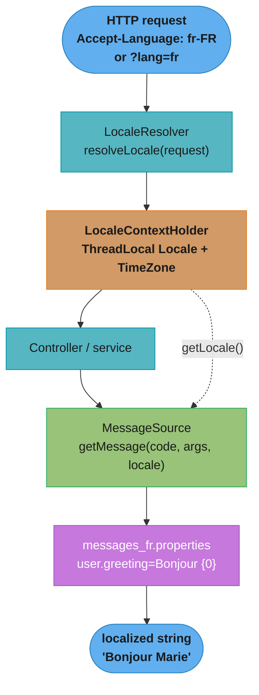
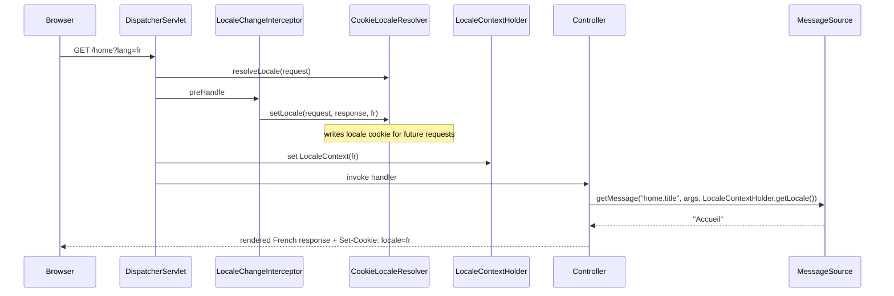

# Internationalization (i18n) and Localization — Deep Dive

Internationalization (i18n) is designing an application so its user-facing text,
numbers, dates, and currencies can be adapted to a locale without code changes;
localization (l10n) is supplying the locale-specific resources. In Spring MVC this
rests on four collaborators: a `MessageSource` (externalized text keyed by code and
locale), a `LocaleResolver` (decides the request's locale), `LocaleContextHolder`
(the per-request locale/timezone holder), and locale-aware `Formatter`s for
numbers, dates, and currency. This deep dive wires them together, shows the WebFlux
variant, and covers the traps.

This is a sub-file of [Request Handling](README.md) — the same controllers,
`@ControllerAdvice`, and `ProblemDetail` from the parent become locale-aware here,
so error messages and validation feedback speak the user's language.

Version baseline: all code targets **Spring Boot 3.x** (Spring Framework 6,
`jakarta.validation.*`, JDK 17+). Boot auto-configures a `MessageSource` from
`spring.messages.*`.

---

## 1. Concept Overview

A localizable Spring app never hardcodes user-facing strings. Instead:

1. **Text lives in resource bundles** — `messages.properties` (the default/fallback)
   plus `messages_fr.properties`, `messages_de.properties`, one per locale. Each is
   a set of `code = template` pairs, where the template may contain `{0}`, `{1}`
   placeholders filled at render time.
2. **A `MessageSource` resolves a code + locale to a string.** `getMessage("user.greeting", new Object[]{name}, locale)` picks the right bundle and interpolates the args.
3. **A `LocaleResolver` decides which locale a request is in** — from the
   `Accept-Language` header, a session attribute, a cookie, or a fixed value.
4. **`LocaleContextHolder` exposes that locale (and timezone)** to any code in the
   request thread, so formatters and the `MessageSource` do not need it passed
   explicitly.

Crucially, the Spring `ApplicationContext` *is itself a `MessageSource`* — the
interface is part of the container's contract (see [IoC Container](../ioc_container/README.md)) —
so any bean can inject `MessageSource` (or implement `MessageSourceAware`) and
resolve text.

---

## 2. Intuition

**One-line analogy:** A `MessageSource` is a phrasebook — you look up a phrase by
its code and the reader's language, and it hands you the translated sentence with
the blanks filled in.

**Mental model:** The controller and services speak in *codes*
(`order.confirmation.subject`), never in prose. At the edge of the request, Spring
figures out the locale once, stashes it in `LocaleContextHolder`, and every
lookup — text, dates, money — reads from there. Swapping languages is swapping a
properties file, not touching Java.

**Why it matters:** Hardcoded English strings scattered across controllers and
exceptions make a second language a rewrite. Externalizing them means a translator
edits `.properties` files, and the same binary serves French, German, and Japanese
users based on their `Accept-Language` header.

**Key insight:** Locale is a *cross-cutting, request-scoped* concern. The whole
design exists so that no method deep in the call stack has to accept a `Locale`
parameter — it reads the ambient one from `LocaleContextHolder`.

---

## 3. Core Principles

**Externalize every user-facing string.** Controllers, exceptions, validation
messages, emails — all reference message codes, never literals.

**Resolve locale once, at the edge.** The `DispatcherServlet` invokes the
`LocaleResolver` per request and populates `LocaleContextHolder` before the
controller runs; downstream code just reads it.

**Fallback is hierarchical.** For `fr_FR`, the `MessageSource` tries
`messages_fr_FR.properties`, then `messages_fr.properties`, then
`messages.properties`. A missing key falls to the default bundle, then (optionally)
to the code itself or a `NoSuchMessageException`.

**Formatting is locale-aware, not string concatenation.** Numbers, dates, and
currency go through `Formatter`/`DateTimeFormatter` bound to the current locale —
`1,234.56` in `en_US` is `1 234,56` in `fr_FR`.

**Reactive breaks `ThreadLocal`.** `LocaleContextHolder` is thread-bound and works
in blocking MVC; WebFlux switches threads across operators, so the reactive stack
uses a `LocaleContextResolver` and reads locale from the `ServerWebExchange`.

---

## 4. The Collaborators

### MessageSource implementations

| Implementation | Backing | Reload | Location | Use when |
|----------------|---------|--------|----------|----------|
| `ResourceBundleMessageSource` | `java.util.ResourceBundle` | No (cached per classloader for JVM life) | Classpath only | Default; bundles fixed at deploy (Boot's default) |
| `ReloadableResourceBundleMessageSource` | Spring `Resource` | Yes (`cacheSeconds`) | `classpath:`, `file:`, any `Resource` | Edit translations without restart; load from disk |
| `StaticMessageSource` | In-memory map | n/a (programmatic) | none | Tests, dynamic registration |

### LocaleResolver implementations

| Resolver | Locale source | `setLocale` supported? | Notes |
|----------|---------------|------------------------|-------|
| `AcceptHeaderLocaleResolver` | `Accept-Language` header | No (throws) | **Boot default**; stateless, honors the browser |
| `SessionLocaleResolver` | `HttpSession` attribute | Yes | Per-user choice, survives across requests in a session |
| `CookieLocaleResolver` | Cookie | Yes | Per-user choice, survives across sessions; can store timezone |
| `FixedLocaleResolver` | Constant | No | Force one locale app-wide |

### Interceptor and holder

- `LocaleChangeInterceptor` — reads a request parameter (default `locale`, often
  configured to `lang`) like `?lang=fr` and calls `LocaleResolver.setLocale(...)`.
  Requires a *mutable* resolver (Session/Cookie), not `AcceptHeaderLocaleResolver`.
- `LocaleContextHolder` — a `ThreadLocal<LocaleContext>` exposing the current
  `Locale` and `TimeZone` (`TimeZoneAwareLocaleContext`) to the whole request thread.

---

## 5. Architecture Diagrams

### LocaleResolver -> LocaleContextHolder -> MessageSource resolution



The resolver decides the locale once, `LocaleContextHolder` makes it ambient for the
thread, and the `MessageSource` reads that locale to pick and interpolate the right
bundle entry.

### A request that changes language via ?lang=fr



`LocaleChangeInterceptor` turns the `?lang=fr` parameter into a
`LocaleResolver.setLocale` call; because the resolver is cookie-backed, the choice
persists on later requests without the parameter.

---

## 6. How It Works — Detailed Mechanics

### Resource bundles

```properties
# messages.properties  (default / fallback — en)
user.greeting=Hello {0}
user.notfound=User {0} was not found
order.total=Order total: {0}
cart.items=You have {0,choice,0#no items|1#one item|1<{0} items}

# messages_fr.properties
user.greeting=Bonjour {0}
user.notfound=L''utilisateur {0} est introuvable
order.total=Total de la commande : {0}
```

Note `L''utilisateur` — when args are present, the string is run through
`java.text.MessageFormat`, where a literal single quote must be **doubled** and `{`
must be quoted, or interpolation silently misbehaves.

### Configuring MessageSource and locale (Boot 3.x)

Boot auto-configures a `ResourceBundleMessageSource` from properties — often all you
need:
```yaml
spring:
  messages:
    basename: messages,errors     # comma-separated bundle basenames
    encoding: UTF-8               # bundle file encoding (default UTF-8 in Boot)
    fallback-to-system-locale: false
    cache-duration: 10s           # non-null makes it reloadable-like; null = forever
```

To customize (e.g. reloadable from disk, use-code-as-default), define the bean:
```java
@Configuration
public class I18nConfig implements WebMvcConfigurer {

    @Bean
    public MessageSource messageSource() {
        ReloadableResourceBundleMessageSource ms =
            new ReloadableResourceBundleMessageSource();
        ms.setBasenames("classpath:messages", "classpath:errors");
        ms.setDefaultEncoding("UTF-8");
        ms.setCacheSeconds(10);                 // reload edited files every 10s
        ms.setUseCodeAsDefaultMessage(false);   // throw NoSuchMessageException if missing
        return ms;
    }

    @Bean
    public LocaleResolver localeResolver() {
        CookieLocaleResolver resolver = new CookieLocaleResolver("APP_LOCALE");
        resolver.setDefaultLocale(Locale.ENGLISH);
        return resolver;                        // mutable -> works with the interceptor
    }

    @Bean
    public LocaleChangeInterceptor localeChangeInterceptor() {
        LocaleChangeInterceptor interceptor = new LocaleChangeInterceptor();
        interceptor.setParamName("lang");       // ?lang=fr
        return interceptor;
    }

    @Override
    public void addInterceptors(InterceptorRegistry registry) {
        registry.addInterceptor(localeChangeInterceptor());
    }
}
```

### Using MessageSource in a controller / service

```java
@RestController
@RequiredArgsConstructor
public class GreetingController {

    private final MessageSource messages;   // injected — ApplicationContext IS a MessageSource

    @GetMapping("/greet")
    public String greet(@RequestParam String name) {
        Locale locale = LocaleContextHolder.getLocale();     // ambient, resolved at edge
        return messages.getMessage("user.greeting",
                                   new Object[]{name}, locale);
    }
}
```

### Locale-aware exceptions (BROKEN -> FIX)

**Broken — hardcoded English in the exception and controller:**
```java
// BUG: the message is a literal; a French user still sees English
public class UserNotFoundException extends RuntimeException {
    public UserNotFoundException(Long id) {
        super("User " + id + " was not found");   // hardcoded, not localizable
    }
}
```

**Fixed — carry a code + args, localize in the handler:**
```java
public class UserNotFoundException extends RuntimeException {
    private final Object[] args;
    public UserNotFoundException(Long id) {
        super("user.notfound");                    // message = the code
        this.args = new Object[]{id};
    }
    public Object[] getArgs() { return args; }
}

@RestControllerAdvice
@RequiredArgsConstructor
public class ApiExceptionHandler {
    private final MessageSource messages;

    @ExceptionHandler(UserNotFoundException.class)
    public ProblemDetail handle(UserNotFoundException ex) {
        String detail = messages.getMessage(
            ex.getMessage(), ex.getArgs(), LocaleContextHolder.getLocale());
        ProblemDetail pd = ProblemDetail.forStatus(HttpStatus.NOT_FOUND);
        pd.setTitle(messages.getMessage("error.notfound.title", null,
                                        LocaleContextHolder.getLocale()));
        pd.setDetail(detail);                       // localized RFC 7807 body
        return pd;
    }
}
```

### Locale-aware Bean Validation messages

By default Hibernate Validator interpolates constraint messages from
`ValidationMessages.properties` on the classpath root. To make validation use
Spring's `MessageSource` (so messages come from `messages_xx.properties` and honor
the resolved locale), wire a `LocalValidatorFactoryBean` — see
[Validation & Error Handling](../validation_and_error_handling/README.md):

```java
@Bean
public LocalValidatorFactoryBean getValidator(MessageSource messageSource) {
    LocalValidatorFactoryBean bean = new LocalValidatorFactoryBean();
    bean.setValidationMessageSource(messageSource);   // resolve {codes} from Spring
    return bean;
}
```
```java
public record CreateUser(
    @NotBlank(message = "{user.name.required}") String name,   // resolved by locale
    @Email(message = "{user.email.invalid}") String email) {}
```
```properties
# messages_fr.properties
user.name.required=Le nom est obligatoire
user.email.invalid=Adresse e-mail invalide
```

### Locale-aware number/date/currency formatting (BROKEN -> FIX)

**Broken — `SimpleDateFormat` with a fixed locale (also not thread-safe):**
```java
// BUG 1: SimpleDateFormat is NOT thread-safe -> corrupt output under concurrency.
// BUG 2: fixed Locale.US ignores the user's locale.
private static final SimpleDateFormat FMT =
    new SimpleDateFormat("MM/dd/yyyy", Locale.US);   // shared static -> race + wrong locale
```

**Fixed — immutable, locale-aware `DateTimeFormatter` from `java.time`:**
```java
public String formatOrderDate(LocalDate date) {
    // java.time DateTimeFormatter is immutable + thread-safe; binds current locale
    DateTimeFormatter fmt = DateTimeFormatter
        .ofLocalizedDate(FormatStyle.MEDIUM)
        .withLocale(LocaleContextHolder.getLocale());
    return date.format(fmt);   // "3 juil. 2026" (fr) vs "Jul 3, 2026" (en)
}

public String formatPrice(BigDecimal amount) {
    Locale locale = LocaleContextHolder.getLocale();
    NumberFormat currency = NumberFormat.getCurrencyInstance(locale);
    return currency.format(amount);   // "1 234,56 EUR" (fr) vs "$1,234.56" (en_US)
}
```
See [Java Date/Time](../../java/java_time_datetime/README.md) for the `java.time`
model that replaced `Date`/`SimpleDateFormat`.

In request binding, `@DateTimeFormat` and `@NumberFormat` (backed by Spring's
`FormattingConversionService`, which reads `LocaleContextHolder`) parse and render
per locale:
```java
public record ReportQuery(
    @DateTimeFormat(iso = DateTimeFormat.ISO.DATE) LocalDate from,
    @NumberFormat(style = NumberFormat.Style.CURRENCY) BigDecimal budget) {}
```

### Per-user timezone

`LocaleContextHolder.getTimeZone()` returns the request's timezone when the resolver
supports it (`CookieLocaleResolver`/`SessionLocaleResolver` implement
`TimeZoneAwareLocaleContext`). Store instants in UTC and render in the user's zone:
```java
Instant createdAt = order.getCreatedAt();            // UTC in the DB
ZoneId userZone = LocaleContextHolder.getTimeZone().toZoneId();
ZonedDateTime local = createdAt.atZone(userZone);    // display in the user's zone
```

### WebFlux i18n

WebFlux cannot use the thread-bound `LocaleContextHolder` reliably because operators
switch threads. It uses a `LocaleContextResolver` (default
`AcceptHeaderLocaleContextResolver`) and reads locale from the exchange:
```java
@GetMapping("/greet")
Mono<String> greet(@RequestParam String name, ServerWebExchange exchange) {
    Locale locale = exchange.getLocaleContext().getLocale();  // from the exchange
    return Mono.just(messages.getMessage("user.greeting",
                                         new Object[]{name}, locale));
}
```

---

## 7. Real-World Examples

**E-commerce checkout** serves the same catalog to `en_US`, `fr_FR`, and `de_DE`
shoppers: product copy, validation errors, and confirmation emails all come from
`messages_xx.properties`, prices render via `NumberFormat.getCurrencyInstance`, and
a language switcher hits `?lang=fr` backed by a `CookieLocaleResolver`.

**SaaS admin console** lets each user pick a language and timezone stored in a
cookie; a German user in Europe/Berlin sees `3.7.2026, 14:30` while a US user sees
`7/3/2026, 8:30 AM` for the same UTC instant.

**Partner-facing REST API** returns RFC 7807 `ProblemDetail` bodies whose `title`
and `detail` are localized from the `Accept-Language` header via
`AcceptHeaderLocaleResolver`, so integrators get errors in their language without a
UI.

**Banking statements** format currency and dates strictly per the account's locale
using `java.time` + locale-aware formatters, avoiding the `SimpleDateFormat`
thread-safety bug that historically corrupted concurrent statement generation.

---

## 8. Tradeoffs

### LocaleResolver choice

| Resolver | Pros | Cons |
|----------|------|------|
| `AcceptHeaderLocaleResolver` | Stateless, zero storage, honors browser | Cannot let users override language; `setLocale` throws |
| `SessionLocaleResolver` | Per-user override, no cookie needed | Lost when session ends; needs sticky sessions or shared session store |
| `CookieLocaleResolver` | Per-user override survives sessions; can hold timezone | Cookie must be sent every request; privacy/consent considerations |
| `FixedLocaleResolver` | Simple, single-locale apps | No per-user localization at all |

### MessageSource choice

| Aspect | `ResourceBundleMessageSource` | `ReloadableResourceBundleMessageSource` |
|--------|-------------------------------|------------------------------------------|
| Reload without restart | No | Yes (`cacheSeconds`) |
| Load from filesystem | No (classpath only) | Yes (`file:` resources) |
| Performance | Slightly faster (cached forever) | Reloads cost stat/parse per interval |
| Best for | Production where translations ship with the build | Editable translations, ops-tunable copy |

---

## 9. When to Use / When NOT to Use

**Externalize to `MessageSource` when:**
- Any string could ever be shown to a user in more than one language.
- You want translators to edit text without a code deploy.
- Error/validation messages must be consistent and localizable across the API.

**A `MessageSource` is worth it even for a single language** because it centralizes
copy and decouples wording from code — but you can skip full locale resolution and
formatting machinery if you will never support a second locale or region.

**Prefer `AcceptHeaderLocaleResolver` (default)** for stateless APIs that just honor
the client's header; **switch to Cookie/Session** only when users need to *override*
their browser language.

**Do NOT** hardcode strings in controllers/exceptions, use `SimpleDateFormat` (not
thread-safe, not locale-flexible), or rely on `LocaleContextHolder` inside reactive
WebFlux pipelines.

---

## 10. Common Pitfalls

### Pitfall 1: `LocaleChangeInterceptor` silently does nothing with the default resolver

`AcceptHeaderLocaleResolver` is read-only — its `setLocale` throws
`UnsupportedOperationException`. Registering `LocaleChangeInterceptor` with it means
`?lang=fr` cannot persist the choice.

**Broken:**
```java
@Bean LocaleResolver localeResolver() {
    return new AcceptHeaderLocaleResolver();   // BUG: setLocale throws; ?lang=fr no-op
}
```
**Fixed:** use a mutable resolver.
```java
@Bean LocaleResolver localeResolver() {
    CookieLocaleResolver r = new CookieLocaleResolver("APP_LOCALE");
    r.setDefaultLocale(Locale.ENGLISH);
    return r;                                  // setLocale writes a cookie
}
```

### Pitfall 2: `MessageFormat` quoting eats your apostrophes

When args are supplied, the template is parsed by `MessageFormat`, where a single
quote is an escape character. `L'utilisateur {0}` renders as `Lutilisateur` (the
`{0}` swallowed) unless you double it: `L''utilisateur {0}`. This bug only appears
when args are passed (no-arg lookups skip `MessageFormat`), making it sneaky.

### Pitfall 3: Bundle encoding mojibake

Historically `.properties` were ISO-8859-1, so `é`, `ü`, `ñ` came out garbled.
Set `spring.messages.encoding=UTF-8` (Boot's default) or
`ms.setDefaultEncoding("UTF-8")`, and save the files as UTF-8.

### Pitfall 4: Missing key blows up or shows the raw code

By default a missing code throws `NoSuchMessageException`. Setting
`setUseCodeAsDefaultMessage(true)` instead renders the raw code
(`user.greeting`) — better than a 500, worse than a real fallback. Prefer a complete
default `messages.properties` so the hierarchical fallback always resolves.

### Pitfall 5: `LocaleContextHolder` returns the wrong locale in WebFlux

The holder is a `ThreadLocal`; in reactive pipelines a downstream operator may run
on a different thread and read a default or stale locale. Use
`exchange.getLocaleContext().getLocale()` (or propagate via Reactor `Context`)
instead of `LocaleContextHolder` in WebFlux.

### Pitfall 6: `SimpleDateFormat` shared as a static field

`SimpleDateFormat` is mutable and not thread-safe; a `static final` instance shared
across request threads produces corrupted or exception-throwing output under load.
Use the immutable `java.time.DateTimeFormatter`.

---

## 11. Technologies, Tools & Best Practices

| Component | Role |
|-----------|------|
| `MessageSource` | Resolves code + args + locale to a string; `ApplicationContext` implements it |
| `ResourceBundleMessageSource` | Classpath bundles, cached for JVM life (Boot default) |
| `ReloadableResourceBundleMessageSource` | Reloadable, filesystem-capable bundles |
| `LocaleResolver` / `LocaleContextResolver` | Decide request locale (MVC / WebFlux) |
| `LocaleChangeInterceptor` | Switch locale via `?lang=` parameter |
| `LocaleContextHolder` | `ThreadLocal` current `Locale` + `TimeZone` (MVC) |
| `LocalValidatorFactoryBean` | Route Bean Validation messages through `MessageSource` |
| `@DateTimeFormat` / `@NumberFormat` | Locale-aware binding/rendering |
| `java.time.DateTimeFormatter` / `NumberFormat` | Thread-safe locale formatting |
| `MessageSourceAware` | Bean callback to receive the `MessageSource` |

**Best practices:**
1. **Never hardcode user-facing text** — controllers, exceptions, emails, and
   validation all reference codes resolved via `MessageSource`.
2. **Always ship a complete default `messages.properties`** so hierarchical fallback
   never misses; layer `messages_xx.properties` on top.
3. **Set UTF-8 encoding** on the bundles and files to avoid accent mojibake.
4. **Double single quotes** in any bundle string that takes args (`MessageFormat`).
5. **Use `java.time` formatters, never `SimpleDateFormat`** — thread-safe and
   locale-aware.
6. **Store instants in UTC, render in the user's timezone** via
   `LocaleContextHolder.getTimeZone()` (MVC) or the exchange (WebFlux).
7. **Pick a mutable resolver (Cookie/Session)** only when users must override
   language; otherwise the stateless `AcceptHeaderLocaleResolver` default is best.
8. **In WebFlux, read locale from the exchange**, not `LocaleContextHolder`.
9. **Wire `LocalValidatorFactoryBean` to the `MessageSource`** so validation errors
   are localized alongside everything else.

---

## 12. Interview Questions with Answers

**Q: Why does `?lang=fr` with `LocaleChangeInterceptor` sometimes have no effect?**
Because the default `AcceptHeaderLocaleResolver` is read-only and its `setLocale` throws `UnsupportedOperationException`, so the interceptor cannot persist the change. `LocaleChangeInterceptor` calls `LocaleResolver.setLocale`, which only mutable resolvers (`SessionLocaleResolver`, `CookieLocaleResolver`) implement. Fix by registering a Cookie or Session resolver as the `LocaleResolver` bean so the switch is stored for subsequent requests.

**Q: What is the `SimpleDateFormat` bug in a Spring app and how do you fix it?**
`SimpleDateFormat` is mutable and not thread-safe, so a shared static instance corrupts output or throws under concurrent requests, and a fixed locale ignores the user's locale. Replace it with `java.time.DateTimeFormatter`, which is immutable and thread-safe, bound to the current locale via `.withLocale(LocaleContextHolder.getLocale())`. This both eliminates the race and makes formatting locale-aware.

**Q: How do you localize hardcoded strings in controllers and exceptions?**
Move the text into `messages_xx.properties` keyed by a code, and have controllers/exceptions carry the code (plus args) instead of literal prose. Resolve it with `messageSource.getMessage(code, args, LocaleContextHolder.getLocale())` — typically in a `@ControllerAdvice` for exceptions, producing a localized `ProblemDetail`. The exception stores the code as its message and an `args` array, so the handler renders it in the user's language.

**Q: How is the Spring `ApplicationContext` related to `MessageSource`?**
`ApplicationContext` extends the `MessageSource` interface, so the container itself resolves messages — you can call `context.getMessage(...)` directly. Boot registers a `MessageSource` bean (named `messageSource`) that the context delegates to, and any bean can inject `MessageSource` or implement `MessageSourceAware`. This is why localization needs no special infrastructure beyond a properties file and the standard container.

**Q: What is the gotcha with single quotes in message templates?**
When a message has arguments, Spring runs it through `java.text.MessageFormat`, where a single quote is an escape character, so `L'utilisateur {0}` drops the `{0}` and renders `Lutilisateur`. You must double the quote: `L''utilisateur {0}`. The trap is that no-argument lookups skip `MessageFormat`, so the same string can look correct until an argument is passed.

**Q: What is the difference between `ResourceBundleMessageSource` and `ReloadableResourceBundleMessageSource`?**
`ResourceBundleMessageSource` wraps `java.util.ResourceBundle`, reads only from the classpath, and caches bundles for the JVM's lifetime, so translations change only on restart. `ReloadableResourceBundleMessageSource` reads from any Spring `Resource` (including `file:`), supports explicit encoding, and reloads edited files on a `cacheSeconds` interval. Use the reloadable one when translators or ops must edit copy without a redeploy; otherwise the classpath one is Boot's simpler default.

**Q: What are the LocaleResolver implementations and how do they differ?**
Spring ships four: AcceptHeader, Session, Cookie, and Fixed. `AcceptHeaderLocaleResolver` (Boot's default) reads the `Accept-Language` header and is stateless/read-only; `SessionLocaleResolver` stores the locale in the `HttpSession`; `CookieLocaleResolver` stores it in a cookie surviving across sessions; `FixedLocaleResolver` forces one constant locale. Only Session and Cookie resolvers support `setLocale`, so only they work with `LocaleChangeInterceptor` for user-driven language switching. Choose Accept-Header for stateless APIs and Cookie/Session when users must override their browser language.

**Q: How does `LocaleChangeInterceptor` work?**
It is a `HandlerInterceptor` whose `preHandle` reads a request parameter (default `locale`, commonly reconfigured to `lang`) and, if present, calls `LocaleResolver.setLocale(request, response, parsed)`. On `?lang=fr` it sets the locale on a mutable resolver, which then persists it (session attribute or cookie) so later requests keep it. It must be registered via `WebMvcConfigurer.addInterceptors` and paired with a mutable resolver.

**Q: What is `LocaleContextHolder` and why is it used?**
`LocaleContextHolder` is a `ThreadLocal` holding the current request's `LocaleContext` — its `Locale` and `TimeZone` — so any code in the request thread can read the ambient locale without it being passed as a parameter. The `DispatcherServlet` populates it per request from the `LocaleResolver` before invoking the controller. This is what lets a formatter deep in the call stack render per-locale without threading a `Locale` argument through every method.

**Q: How does Spring Boot auto-configure the `MessageSource`?**
Boot's `MessageSourceAutoConfiguration` creates a `ResourceBundleMessageSource` unless you define your own `MessageSource` bean. It is configured from `spring.messages.*` — `basename` (default `messages`), `encoding` (UTF-8), `cache-duration`, and `fallback-to-system-locale`. So placing `messages.properties` and `messages_fr.properties` on the classpath is enough for i18n to work with no Java config. Define an explicit bean only to switch to the reloadable implementation or tune behaviors like use-code-as-default.

**Q: How do you make Bean Validation messages locale-aware?**
By default Hibernate Validator interpolates from `ValidationMessages.properties` on the classpath, independent of Spring's locale. To route validation through Spring's `MessageSource` and the resolved locale, define a `LocalValidatorFactoryBean` and call `setValidationMessageSource(messageSource)`, then reference codes in constraints like `@NotBlank(message = "{user.name.required}")`. Now validation errors come from `messages_xx.properties` and honor the request's locale like everything else.

**Q: How do you format numbers, dates, and currency per locale in Spring?**
Use locale-aware formatters bound to the current locale, never string concatenation. Examples are `DateTimeFormatter.ofLocalizedDate(FormatStyle.MEDIUM).withLocale(locale)`, `NumberFormat.getCurrencyInstance(locale)`, and Spring's `@DateTimeFormat`/`@NumberFormat` on bound fields. Spring's `FormattingConversionService` reads `LocaleContextHolder`, so binding and rendering pick up the request locale automatically. This yields `1 234,56 EUR` in `fr_FR` versus `$1,234.56` in `en_US` from the same value.

**Q: How do you handle per-user timezone?**
Store all instants in UTC and render them in the user's zone read from `LocaleContextHolder.getTimeZone()`, which is populated when the resolver implements `TimeZoneAwareLocaleContext` (Cookie/Session resolvers do). Convert with `instant.atZone(LocaleContextHolder.getTimeZone().toZoneId())` at display time. This keeps storage unambiguous while showing each user their local wall-clock time.

**Q: How does i18n differ in WebFlux versus MVC?**
WebFlux cannot rely on the thread-bound `LocaleContextHolder` because operators switch threads. Instead it uses a `LocaleContextResolver` (default `AcceptHeaderLocaleContextResolver`) and reads the locale from `ServerWebExchange.getLocaleContext().getLocale()`. You pass that locale explicitly to `MessageSource.getMessage`, or propagate it via the Reactor `Context`. Using `LocaleContextHolder` inside a reactive pipeline risks reading a default or stale locale.

**Q: How does content negotiation for language work?**
The `Accept-Language` header is the standard signal: `AcceptHeaderLocaleResolver` parses its quality-weighted list and resolves the best match, so a client sending `Accept-Language: fr-FR, en;q=0.8` gets French. It is stateless and requires no per-user storage, which is why it is the default for APIs. For user overrides beyond the browser preference, layer a Cookie/Session resolver plus `LocaleChangeInterceptor`.

**Q: What happens on a missing message code and how do you control it?**
By default the `MessageSource` throws `NoSuchMessageException` when no bundle in the fallback chain has the code. Setting `setUseCodeAsDefaultMessage(true)` returns the raw code instead of throwing, and `getMessage(code, args, defaultMessage, locale)` lets you supply an inline default. The robust approach is a complete default `messages.properties` so the hierarchical `messages_fr_FR -> messages_fr -> messages` fallback always resolves.

**Q: What is the fallback order when resolving a message for locale `fr_FR`?**
The `MessageSource` tries the most specific bundle first and widens: `messages_fr_FR.properties`, then `messages_fr.properties`, then the default `messages.properties`. Within each, the code is looked up; the first hit wins. This is why a complete default bundle guarantees resolution even when a specific translation is missing a key, and why you only need to translate the deltas per locale.
