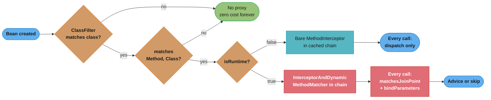
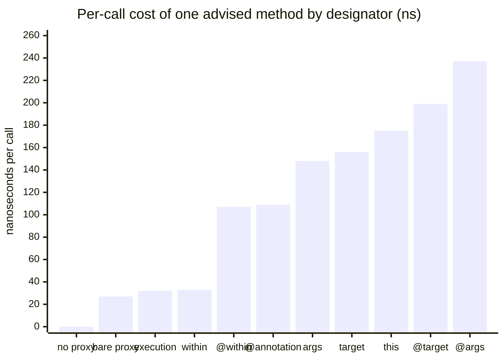
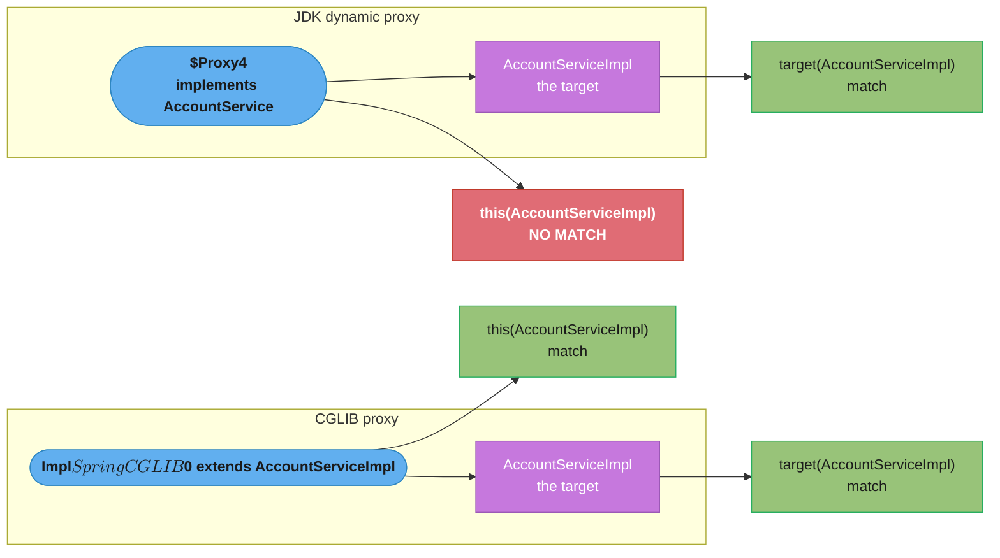

# Pointcut Designators — Deep Dive
Reference baseline for every claim on this page: **Spring Boot 4.1.x / Spring Framework 7.0.8 / AspectJ weaver 1.9.25.1 / Java 25 LTS**. Spring Framework 7 keeps a JDK 17 baseline while recommending JDK 25, and it still generates class proxies with its own repackaged CGLIB (`org.springframework.cglib.proxy.Enhancer`, shaded into `spring-core`) — not Byte Buddy.

---

## 1. Concept Overview

The parent module ([Spring AOP](README.md)) lists nine AspectJ pointcut designators and then develops four of them: `execution`, `within`, `@within`, `@annotation`. Those four cover perhaps 90% of production aspects, which is exactly why the other five — `args`, `@args`, `target`, `@target`, `this` — plus Spring's own `bean` designator are where interviews and outages live.

The reason those five behave differently is not syntax. It is *when* Spring can answer the question "does this pointcut match?". Spring's `MethodMatcher` contract is deliberately two-phase:

- `matches(Method, Class<?>)` — asked **once per method per bean class**, while the proxy is being created. The answer is cached.
- `matches(Method, Class<?>, Object... args)` — asked **on every single invocation**, and only if `isRuntime()` returned `true`.

A designator that depends only on the static shape of a method (its name, its declaring type, the annotations on either) is fully answered in phase one and never costs anything again. A designator that depends on a runtime value — the actual argument object, the concrete class of the proxy — leaves a *residue* that AspectJ must re-evaluate at each call. `AspectJExpressionPointcut.isRuntime()` is a one-line delegate to AspectJ:

```java
@Override
public boolean isRuntime() {
    return obtainPointcutExpression().mayNeedDynamicTest();
}
```

That single boolean decides which of two very different objects lands in your advisor chain, and therefore what every call to the advised method costs for the life of the process.

---

## 2. Intuition

**One-line analogy:** a pointcut is a two-stage security check — a guest list read once at the door (proxy creation) and a metal detector that every person walks through individually (per invocation). Some rules can be settled from the guest list; some cannot be known until the person is standing there holding something.

**Mental model:** `execution(* com.shop.OrderService.place(..))` is a guest-list rule — the method's signature never changes, so check it once and stamp the answer. `args(com.shop.Refund)` is a metal-detector rule — the method signature says `place(Object)`, and whether the caller hands you a `Refund` or an `Order` is only knowable when the call happens.

**Why it matters:** the choice between `@annotation(Audited)` and `@target(Audited)` looks like taste. It is not. One of them can cause Spring to wrap **every bean in your context** in a proxy and then run an AspectJ residue evaluation on **every method call in your application**. Nothing in the logs will tell you.

**Key insight:** Spring narrows AspectJ's semantics in a way that helps you and confuses you at the same time. In pure AspectJ at an execution join point, `this` and `target` are the same object. In Spring they are not — `this` is the proxy, `target` is the bean behind it. Under CGLIB the proxy is a *subclass* of the target class so the two coincide for most types; under a JDK dynamic proxy the proxy is not the target's class at all, and `this(YourServiceImpl)` silently matches nothing.

---

## 3. Core Principles

1. **Two-phase matching is the whole story.** `ClassFilter` narrows to candidate bean classes, `MethodMatcher.matches(Method, Class)` narrows to candidate methods, and only then does `isRuntime()` decide whether a third check runs per call.
2. **Static resolution is cached; dynamic resolution is not.** `AdvisedSupport` caches the resolved chain in a `Map<MethodCacheKey, List<Object>>`. But the *chain itself* holds the dynamic matcher, so caching the chain does not cache the per-call decision.
3. **Spring resolves subtype-sensitive variables more aggressively than AspectJ needs to.** A Spring proxy has exactly one target with one fixed class, so `RuntimeTestWalker.testTargetInstanceOfResidue(targetClass)` settles `target(...)` and `@target(...)` at the class level during phase one — even though the expression still reports `isRuntime() == true`.
4. **Binding and matching are the same act.** `args(account)` both restricts matching *and* delivers the object to your advice parameter. You cannot bind without matching, and you cannot bind through a purely static designator except `@annotation`/`@within`/`@target`/`@args`, which bind the annotation instance.
5. **Type names in a pointcut are resolved by AspectJ, not by javac.** There is no import context. `java.lang` types resolve unqualified; nothing else does, and the failure is usually silent.
6. **`bean()` is Spring's, not AspectJ's.** It is implemented as a `PointcutDesignatorHandler` registered on Spring's `PointcutParser`, and it reads a thread-local set during proxy creation. It has no meaning under native AspectJ weaving.

---

## 4. Types / Architectures / Strategies

### The ten designators, classified

AspectJ groups designators into **kinded** (what kind of join point), **scoping** (where), and **contextual** (runtime context). The Spring reference guide's advice — "a well written pointcut should include at least the first two types" — is the practical rule that this whole page justifies.

| Designator | Group | Static or dynamic in Spring | Bindable | Notes |
|-----------|-------|------------------------------|----------|-------|
| `execution(...)` | kinded | **static** | no | Matches the **declared** signature |
| `within(...)` | scoping | **static** | no | Resolved by `ClassFilter` — cheapest possible rejection |
| `bean(name)` | scoping (Spring-only) | **static** | no | Decided at proxy creation from a thread-local bean name |
| `@within(A)` | scoping | dynamic wrapper, static outcome | yes (the annotation) | `ClassFilter` cannot reject, but `matches(Method, Class)` can |
| `@annotation(A)` | kinded | dynamic wrapper, static outcome | yes (the annotation) | Per-method static decision, still wrapped |
| `this(T)` | contextual | **dynamic** | yes (the proxy) | Tests the **proxy** type |
| `target(T)` | contextual | **dynamic** | yes (the target) | Tests the **target** type |
| `@target(A)` | contextual | **dynamic** | yes (the annotation) | `ClassFilter` matches *everything* — see §10 |
| `args(...)` | contextual | **dynamic** | yes (the argument) | Tests the **runtime** argument type |
| `@args(A)` | contextual | **dynamic** | yes (the annotation) | `ClassFilter` matches *everything* — see §10 |

"Dynamic" here means the literal, verifiable thing: the advisor lands in the chain wrapped in an `InterceptorAndDynamicMethodMatcher` instead of as a bare `MethodInterceptor`, and `ReflectiveMethodInvocation.proceed()` runs a match test before dispatching to it.

### Measured chain shape (Spring 7.0.8)

Building a `ProxyFactory` over one advised method and printing the element types of `AdvisedSupport.getInterceptorsAndDynamicInterceptionAdvice(method, targetClass)`:

```
execution(* SvcImpl.save(..))   isRuntime=false   chain=[MethodInterceptor]
within(SvcImpl)                 isRuntime=false   chain=[MethodInterceptor]
bean(accountService)            isRuntime=false   chain=[]  (abstains outside the auto-proxy creator)
@within(Audited)                isRuntime=true    chain=[InterceptorAndDynamicMethodMatcher]
@annotation(Audited)            isRuntime=true    chain=[InterceptorAndDynamicMethodMatcher]
@target(Audited)                isRuntime=true    chain=[InterceptorAndDynamicMethodMatcher]
target(SvcImpl)                 isRuntime=true    chain=[InterceptorAndDynamicMethodMatcher]
this(SvcImpl)                   isRuntime=true    chain=[InterceptorAndDynamicMethodMatcher]
args(Object)                    isRuntime=true    chain=[InterceptorAndDynamicMethodMatcher]
@args(Audited)                  isRuntime=true    chain=[InterceptorAndDynamicMethodMatcher]
```

The `bean()` line needs a footnote: it reports `isRuntime() == false`, but a hand-built `ProxyFactory` sets no `ProxyCreationContext`, so the matcher abstains and the advisor never applies. Under a real `AnnotationConfigApplicationContext` the same expression selected exactly the intended bean and nothing else (verified: `bean(order*)` fired once for `orderService` and zero times for `reportService`).

The surprise for most engineers is the `@within` and `@annotation` rows: **they are not free**. AspectJ's `mayNeedDynamicTest()` is a property of the parsed expression, not of the shadow, and it reports `true` for annotation designators because in the general AspectJ world annotations can differ per runtime subtype. Spring then throws that residue away at match time — but only after paying for the wrapper on every call.

### Combination strategies

| Strategy | Expression | Why |
|----------|-----------|-----|
| Scope then qualify | `within(com.shop.service..*) && @annotation(com.shop.Audited)` | `ClassFilter` rejects most beans before any method is examined |
| Bind without widening | `execution(* com.shop..*.*(..)) && args(order,..)` | The `execution` clause does the matching; `args` only binds |
| Rescue a contextual designator | `within(com.shop..*) && @target(com.shop.Tenant)` | Stops `@target` from proxying the whole context |
| Negate a package | `within(com.shop..*) && !within(com.shop.internal..*)` | `!` on a scoping designator stays a `ClassFilter` decision |
| Reuse a named pointcut | `com.shop.aop.Pointcuts.serviceLayer() && args(id)` | Cross-class `@Pointcut` reference; the method must be visible |

Spring also accepts the word forms `and`, `or`, `not` in place of `&&`, `||`, `!` (`AspectJExpressionPointcut.replaceBooleanOperators`), which matters when a pointcut lives in an XML attribute where `&&` must be escaped.

---

## 5. Architecture Diagrams

### Where each designator is decided



`execution`, `within` and `bean` exit at the `isRuntime? = false` branch and never re-enter. Everything else takes the red path on every invocation for the life of the process.

### What that costs, measured



Deliberately crude harness — 20M calls, best of five slices, single thread, no-op interceptor, Apple M3, JDK 23, Spring 7.0.8. **Treat the ratio as the finding, not the absolute nanoseconds.** The static designators land within a few nanoseconds of a bare proxy that has no pointcut at all; every dynamic designator costs three to six times that. A second run on a busier machine shifted every bar upward but preserved the ordering and the ratio.

### `this` vs `target` under the two proxy mechanisms



`this` is bound to the proxy, `target` to the object behind it. A JDK proxy implements the interfaces and nothing else, so it fails an `instanceof AccountServiceImpl` test; a CGLIB proxy is a generated subclass, so it passes. `target` is unaffected either way because Spring always knows the real target class.

---

## 6. How It Works — Detailed Mechanics

### The two-phase matcher contract

```java
// org.springframework.aop.MethodMatcher — the whole contract, condensed
public interface MethodMatcher {
    boolean matches(Method method, Class<?> targetClass);          // phase 1: proxy creation
    boolean isRuntime();                                           // phase 1: "do I need phase 2?"
    boolean matches(Method method, Class<?> targetClass, Object... args);  // phase 2: every call
}
```

`DefaultAdvisorChainFactory` reads `isRuntime()` exactly once, while building the chain for a `(method, targetClass)` pair — `if (mm.isRuntime())` it adds `new InterceptorAndDynamicMethodMatcher(interceptor, mm)`, otherwise the raw interceptor goes in and the pointcut is never consulted again. `AdvisedSupport` caches the resulting list in a `Map<MethodCacheKey, List<Object>>`, so chain *construction* is amortised. What is not amortised is what `ReflectiveMethodInvocation.proceed()` does with a dynamic entry:

```java
if (interceptorOrInterceptionAdvice instanceof InterceptorAndDynamicMethodMatcher dm) {
    // Evaluate dynamic method matcher here: static part will already have
    // been evaluated and found to match.
    Class<?> targetClass = (this.targetClass != null ? this.targetClass : this.method.getDeclaringClass());
    if (dm.matcher().matches(this.method, targetClass, this.arguments)) {
        return dm.interceptor().invoke(this);
    }
    else {
        // Dynamic matching failed. Skip this interceptor and invoke the next in the chain.
        return proceed();
    }
}
```

### What the per-call check actually does

`AspectJExpressionPointcut.matches(Method, Class, Object...)` is not a cheap boolean. Per invocation it:

1. reads `ExposeInvocationInterceptor.currentInvocation()` — a `ThreadLocal` lookup, which is also why Spring silently prepends `ExposeInvocationInterceptor.ADVISOR` to any chain containing an AspectJ advisor;
2. looks up the `ShadowMatch` (cached globally in `ShadowMatchUtils`, so this part is a map hit, not a re-parse);
3. calls `shadowMatch.matchesJoinPoint(thisObject, targetObject, args)`, allocating a `JoinPointMatch`;
4. allocates a fresh `RuntimeTestWalker` to re-run the `this(TYPE)` residue against `thisObject.getClass()` — the fix for SPR-2979, whose comment in the source says it exists because "without this check, we get incorrect match on this(TYPE) where TYPE matches the target type but not 'this' (as would be the case of JDK dynamic proxies)";
5. calls `bindParameters(pmi, joinPointMatch)`, which does `invocation.setUserAttribute(resolveExpression(), jpm)` — lazily allocating a `HashMap` on the invocation.

Five steps, two allocations, one thread-local read, on a method that may be called a million times a second. That is where the 3–6x in §5 comes from. No reflection *cache miss* is involved; it is simply real work per call that the static designators skip entirely.

### Static resolution of subtype-sensitive variables

Spring is smarter than the raw `isRuntime()` flag suggests. Its phase-one matcher contains this:

```java
// A match test returned maybe - if there are any subtype sensitive variables
// involved in the test (this, target, at_this, at_target, at_annotation) then
// we say this is not a match as in Spring there will never be a different
// runtime subtype.
RuntimeTestWalker walker = getRuntimeTestWalker(shadowMatch);
return (!walker.testsSubtypeSensitiveVars() || walker.testTargetInstanceOfResidue(targetClass));
```

The practical consequence is measurable. Given an un-annotated `Plain` class and an annotated `Tagged` class:

```
@within(Tag)      Plain    classFilter=true   staticMatch=false      <- correctly rejected
@within(Tag)      Tagged   classFilter=true   staticMatch=true
target(Tagged)    Plain    classFilter=true   staticMatch=false      <- correctly rejected
this(Tagged)      Plain    classFilter=true   staticMatch=false      <- correctly rejected
@target(Tag)      Plain    classFilter=true   staticMatch=true       <- MATCHES ANYWAY
@args(Tag)        Plain    classFilter=true   staticMatch=true       <- MATCHES ANYWAY
```

`@target` and `@args` are the two designators Spring cannot settle statically, because the annotation lives on a type Spring will not know until the call arrives. Used alone, they proxy your entire context. §10 has the fix.

### Argument binding: how the name reaches the advice

`args(account)` is not a type — it is a *variable name*, and AspectJ needs to know which advice parameter it belongs to. Spring resolves that through a `ParameterNameDiscoverer` chain, tried in order until one succeeds:

| Order | Discoverer | Source of names |
|-------|-----------|-----------------|
| 1 | `AspectJAnnotationParameterNameDiscoverer` | the `argNames` attribute you wrote by hand |
| 2 | `KotlinReflectionParameterNameDiscoverer` | Kotlin reflection, if `kotlin-reflect` is present |
| 3 | `StandardReflectionParameterNameDiscoverer` | `java.lang.reflect.Parameter#getName`, real only with `-parameters` |
| 4 | `AspectJAdviceParameterNameDiscoverer` | *deduced* from the pointcut expression, `returning` and `throwing` |

```java
// args(from, to) binds BY NAME. Without -parameters, discoverer 3 yields
// "arg0"/"arg1" and discoverer 4 has to guess from the expression.
@Around("execution(* com.shop.LedgerService.move(..)) && args(from, to)")
public Object audit(ProceedingJoinPoint pjp, String from, String to) throws Throwable {
    log.info("move {} -> {}", from, to);
    return pjp.proceed();
}
```

Discoverer 4 can usually guess: with one unbound advice parameter and one binding variable, the mapping is forced. It cannot guess when two same-typed parameters are in play. Compile the aspect above with the parameters **declared in the opposite order** and drop `-parameters`, and Spring fails at startup, not at call time:

```
org.springframework.aop.aspectj.AspectJAdviceParameterNameDiscoverer$AmbiguousBindingException:
  Still 2 unbound args at this()/target()/args() binding stage, with no way to determine between them
        at AspectJAdviceParameterNameDiscoverer.maybeBindThisOrTargetOrArgsFromPointcutExpression
        at AbstractAspectJAdvice.bindArgumentsByName
        at ReflectiveAspectJAdvisorFactory.getAdvice
```

Recompile the identical source with `-parameters` and it binds correctly on the first call. Spring Boot's Maven and Gradle plugins set `-parameters` for you; a hand-rolled build, an IDE compiler profile, or a module compiled outside the Boot parent frequently does not. The two other failure messages worth recognising, both from `AbstractAspectJAdvice`:

```
IllegalStateException: Advice method [audit] requires 2 arguments to be bound by name,
  but the argument names were not specified and could not be discovered.

IllegalStateException: Required to bind 3 arguments, but only bound 2
  (JoinPointMatch was NOT bound in invocation)
```

The second one is the classic symptom of an advice parameter that no designator actually binds — you added `String tenantId` to the signature but never wrote `args(.., tenantId)`.

### Annotation binding through `@annotation(a)`

The mechanism is identical, and the annotation instance is the bound value:

```java
@Retention(RetentionPolicy.RUNTIME)
@Target(ElementType.METHOD)
public @interface RateLimit { int perMinute() default 60; }

@Around("@annotation(rateLimit)")   // 'rateLimit' is a NAME, matched to the parameter below
public Object limit(ProceedingJoinPoint pjp, RateLimit rateLimit) throws Throwable {
    bucket.consumeOrThrow(pjp.getSignature().toShortString(), rateLimit.perMinute());
    return pjp.proceed();
}
```

The *type* of the parameter is what AspectJ matches on; the *name* is what wires it. Rename the parameter to `rl` without touching the pointcut and you get the "could not be discovered" `IllegalStateException` above — a rename refactor that a compiler cannot catch. `@within`, `@target` and `@args` bind the same way; `this(p)` binds the proxy and `target(t)` binds the target object.

### `execution` matches declared types; `args` matches runtime values

This is the sharpest practical difference between the two families:

```java
public class OrderServiceImpl {
    public void place(CharSequence id) {}
    public void cancel(String id) {}
}
```

```
execution(* *..*.*(String))           place(CharSequence)=no      cancel(String)=MATCH
execution(* *..*.*(CharSequence))     place(CharSequence)=MATCH   cancel(String)=no
args(String)                          place(CharSequence)=MATCH   cancel(String)=MATCH
```

`execution` reads the signature in the class file. `args(String)` can only say "maybe" statically — the caller might pass a `String` into `place(CharSequence)` — so it matches both at phase one and decides at phase two. And the decision at phase two is on the value, which produces one more gotcha: **`args(String)` never matches a `null` argument**, because `null` is not an instance of anything. Verified with a live proxy:

```
args(s:String)   arg="hello"   -> advice fired 1 time
args(s:String)   arg=7         -> advice fired 0 times
args(s:String)   arg=null      -> advice fired 0 times
```

### `this()` vs `target()`, demonstrated

Two aspects, identical except for the designator — `@Around("this(com.shop.AccountServiceImpl)")` and `@Around("target(com.shop.AccountServiceImpl)")`, each incrementing a counter and calling `proceed()`. Running both against the same bean, once behind a JDK proxy and once behind CGLIB:

```
this(Impl)     JDK     -> advice fired 0 time(s)   proxy = $Proxy4
this(Impl)     CGLIB   -> advice fired 1 time(s)   proxy = AccountServiceImpl$$SpringCGLIB$$0
target(Impl)   JDK     -> advice fired 1 time(s)   proxy = $Proxy4
target(Impl)   CGLIB   -> advice fired 1 time(s)   proxy = AccountServiceImpl$$SpringCGLIB$$1
```

Zero. No warning, no log line at any level, no startup error. The same aspect and the same bean, and whether it fires depends on whether some unrelated part of the application happened to give the bean an interface. Spring Boot sets `spring.aop.proxy-target-class=true` by default, which forces CGLIB and hides this — until someone sets it to `false`, or a library creates the proxy with explicit interfaces.

**Use `target(T)` unless you specifically mean the proxy.** `this(T)` has exactly one honest use: matching on an interface that the *proxy* implements but the target does not, such as Spring's own `Advised` or a mixin introduced by an introduction advisor.

### `bean(name)` — the Spring-only designator

`bean` is not part of AspectJ. Spring registers a `BeanPointcutDesignatorHandler` on the `PointcutParser` it builds, whose `BeanContextMatcher` reports `mayNeedDynamicTest() == false` and returns a constant `true` from `matchesDynamically()` — because, as its own javadoc says, "the matching decision is made at the proxy creation time". The bean name comes from a thread-local:

```java
private FuzzyBoolean contextMatch(@Nullable Class<?> targetType) {
    String advisedBeanName = getCurrentProxiedBeanName();   // ProxyCreationContext.getCurrentProxiedBeanName()
    if (advisedBeanName == null) {   // no proxy creation in progress
        // abstain; can't return YES, since that will make pointcut with negation fail
        return FuzzyBoolean.MAYBE;
    }
    if (BeanFactoryUtils.isGeneratedBeanName(advisedBeanName)) {
        return FuzzyBoolean.NO;
    }
    ...
}
```

Three consequences fall straight out of that code:

- `bean()` is **free at runtime** — cheaper than `@annotation`, which is not what most people would guess.
- It **only works inside the auto-proxy creator**, which is what sets `ProxyCreationContext`. Build a proxy by hand with `ProxyFactory` and a `bean()` pointcut abstains and the advisor never applies. Verified: the chain came back empty.
- It **never matches an anonymous or generated bean name** (`isGeneratedBeanName` returns `NO` outright), so inner-bean definitions are silently out of scope.

Wildcards work as name patterns, and `&&`/`||`/`!` compose normally:

```java
@Pointcut("bean(*Repository)")                       public void repositories() {}
@Pointcut("bean(order*) || bean(payment*)")          public void hotBeans() {}
@Pointcut("within(com.shop..*) && !bean(*Metrics)")  public void appMinusMetrics() {}
```

**Portability cost:** move the aspect to compile-time or load-time AspectJ weaving and `bean()` does not exist. The pointcut parser AspectJ uses there has no such handler, and `ajc` rejects the expression. If there is any chance an aspect will be woven natively, express the same intent with `within(...)` or a marker annotation and `@within(...)`.

### Fully-qualified type names are not optional

Spring builds the `PointcutExpression` through AspectJ's `PointcutParser`. That parser has **no Java import context**. `java.lang` types resolve unqualified; nothing else does. What is worse than the rule is the failure mode — there are two, and only one of them is loud:

```
args(Zzzz)             classFilter=false   -> silently matches nothing
within(Zzzz)           classFilter=false   -> silently matches nothing
execution(* Zzzz.*(..))classFilter=false   -> silently matches nothing
args(List)             classFilter=false   -> silently matches nothing (java.util.List works)
args(String)           classFilter=true    -> java.lang is implicitly resolvable

@annotation(Audited)   IllegalArgumentException: error Type referred to is not an annotation type: Audited
```

AspectJ records these as `Xlint:invalidAbsoluteTypeName` warnings, which Spring does not surface. A lowercase unqualified name is worse still: in a *binding* position AspectJ reads it as a variable name, so `args(o)` with no matching advice parameter fails with `warning no match for this type name: o [Xlint:invalidAbsoluteTypeName]` wrapped in an `IllegalArgumentException`.

Always write `@annotation(com.shop.audit.Audited)`, `args(com.shop.model.Order)`, `target(com.shop.service.LedgerService)`. Then hide the verbosity behind named pointcuts in one class:

```java
public final class Pointcuts {
    @Pointcut("within(com.shop.service..*)")                     public void serviceLayer() {}
    @Pointcut("@annotation(com.shop.audit.Audited)")             public void audited() {}
    @Pointcut("serviceLayer() && audited()")                     public void auditedService() {}
    private Pointcuts() {}
}
```

Reference them from any aspect as `com.shop.aop.Pointcuts.auditedService()`. The referenced `@Pointcut` method must be visible to the referencing aspect — `private` works within the same class, and anything cross-class needs at least package-private.

---

## 7. Real-World Examples

**Multi-tenant data routing.** A platform tags tenant-scoped entities with `@TenantScoped` and needs to set a thread-local tenant before any repository call touching one. The naive pointcut is `@args(com.shop.TenantScoped)` — which proxies every bean in the context. The shipped version is `within(com.shop.repository..*) && @args(com.shop.TenantScoped)`: the scoping clause reduces the candidate set from every bean to about forty, and the dynamic argument check runs only on those.

**Spring Security's method security.** `@PreAuthorize` matching is an `@annotation`-shaped decision on the method, which is why it works uniformly on interface and class methods but has never been able to see the argument *values* without SpEL — the pointcut selects, the expression language inspects.

**Feature-flag kill switch.** `bean(experimental*)` wraps every bean whose name starts with `experimental`, letting an operator disable a whole family of components by name without any of them carrying an annotation. Because `bean()` is decided at proxy creation, the set is frozen at startup — which is exactly the property you want for a kill switch that must not add per-call cost.

**Micrometer `@Timed`.** `io.micrometer.core.aop.TimedAspect` matches on `@annotation(io.micrometer.core.annotation.Timed)` plus `@within(...)` for class-level application. Both go through the dynamic wrapper, which is entirely acceptable here: the timer's own `Timer.Sample` allocation and registry lookup dwarf the residue check.

**Ledger-transfer validation.** `execution(* com.shop.LedgerService.move(..)) && args(from, to)` binds two account ids into the advice so a pre-check can reject same-account transfers before the transaction opens. The `execution` clause carries the matching; `args` is present purely to bind.

---

## 8. Tradeoffs

### Static vs dynamic designators

| Dimension | Static (`execution`, `within`, `bean`) | Dynamic (`args`, `@args`, `this`, `target`, `@target`, and the wrapped `@annotation`/`@within`) |
|-----------|----------------------------------------|---------------------------------------------------|
| Per-call cost | Within a few ns of a bare proxy | 3–6x a bare proxy in the measurement above |
| Allocations per call | none | `JoinPointMatch`, `RuntimeTestWalker`, lazily a `HashMap` |
| Can bind values? | no | yes — the whole point |
| Failure visibility | silent zero-match on a typo | silent zero-match, plus silent per-call non-match |
| Startup cost | one shadow match per method, cached | same, plus wrapper allocation per chain |
| Predictability | matches or does not, forever | may match on one call and not the next |

### Choosing between overlapping designators

| Goal | Prefer | Avoid | Why |
|------|--------|-------|-----|
| "all methods of annotated classes" | `@within(A)` | `@target(A)` | `@within` is settled per class; `@target` proxies everything |
| "methods annotated A" | `@annotation(A)` | `execution` + naming convention | Explicit, refactor-safe, and the annotation is bindable |
| "this concrete class" | `target(T)` | `this(T)` | `this(T)` silently fails under JDK proxies |
| "these named beans" | `bean(pattern)` | `execution` over a package | Free at runtime, but not portable to native AspectJ |
| "this package tree" | `within(p..*)` | `execution(* p..*.*(..))` | `within` is a `ClassFilter` — rejects before touching methods |
| "argument of type X" | `execution(... (X))` when the signature declares X | `args(X)` | Static; use `args` only for runtime subtypes or binding |

---

## 9. When to Use / When NOT to Use

**Use a contextual designator (`args`, `@args`, `this`, `target`, `@target`) when:**
- You genuinely need the value in the advice body and cannot get it from `JoinPoint.getArgs()` with an index — binding is type-safe, index access is not.
- The decision truly depends on a runtime subtype: an `Object`-typed parameter that is sometimes a `Refund`.
- You are matching an annotation on the argument's own type (`@args`), which no static designator can express.

**Do NOT use one when:**
- A scoping or kinded designator gives the same answer. `execution(* com.shop..*.*(com.shop.Order))` and `args(com.shop.Order)` select the same methods when the parameter is declared as `Order` — pick the static one.
- The method is on a hot path called at high frequency and the advice does something trivial. The residue check can cost more than the advice.
- You need portability to compile-time AspectJ weaving and you were about to write `bean()`.
- You are reaching for `this(T)` and cannot articulate why the proxy's type, rather than the target's, is the thing you mean.

**Always pair a contextual designator with a scoping one.** `within(...) && @target(...)` is not a style preference; it is the difference between forty proxied beans and every bean in the context.

---

## 10. Common Pitfalls

### Pitfall 1: the pointcut that silently matches nothing

The single most common AOP support ticket. One dot too few.

```java
// BROKEN: OrderServiceImpl lives in com.example.service.impl — a SUB-package.
// `.` matches exactly one level. This matches zero methods, forever, silently.
@Pointcut("execution(* com.example.service.*.*(..))")
public void serviceLayer() {}

// FIXED: `..` spans any number of package levels.
@Pointcut("execution(* com.example.service..*.*(..))")
public void serviceLayer() {}
```

Measured against a class in `com.example.service.impl`:

```
execution(* com.example.service.*.*(..))     place=no      cancel=no
execution(* com.example.service..*.*(..))    place=MATCH   cancel=MATCH
within(com.example.service.*)                classFilter=false
within(com.example.service..*)               classFilter=true
```

There is no error, no warning, and no startup failure. The only defence is a test that asserts the advice fired. Write one for every pointcut you author:

```java
@Test
void auditAspectFiresOnServiceLayer() {
    orderService.place(new Order("A1"));
    assertThat(auditRepository.findAll()).hasSize(1);   // fails loudly if the pointcut is wrong
}
```

### Pitfall 2: `@target` or `@args` alone proxies your entire context

```java
// BROKEN: ClassFilter cannot reject anything, so EVERY bean in the context
// gets a proxy, and EVERY method call in the application runs an AspectJ
// residue evaluation to discover the answer is "no".
@Around("@target(com.shop.audit.Audited)")
public Object audit(ProceedingJoinPoint pjp) throws Throwable { ... }

// FIXED: a scoping designator gives the ClassFilter something to reject on.
@Around("within(com.shop..*) && @target(com.shop.audit.Audited)")
public Object audit(ProceedingJoinPoint pjp) throws Throwable { ... }
```

Verified against an un-annotated class outside `com.shop`:

```
@target(Tag)                            Plain   classFilter=true    staticMatch=true
within(com.example..*) && @target(Tag)  Plain   classFilter=false   staticMatch=false
```

If the annotation is on the *class* rather than resolved per call, use `@within(A)` instead of `@target(A)` and the problem disappears entirely — `@within` rejects un-annotated classes at phase one.

### Pitfall 3: `this(T)` and the JDK proxy

Covered in §6 with the measurement. The trap is that Spring Boot's CGLIB default hides it in development and it surfaces when someone sets `spring.aop.proxy-target-class=false`, or when a third-party `ProxyFactoryBean` supplies explicit interfaces. Prefer `target(T)`; if you must use `this(T)`, name an interface, not a class.

### Pitfall 4: renaming an advice parameter breaks the binding

```java
// BEFORE — works
@Around("@annotation(rateLimit)")
public Object limit(ProceedingJoinPoint pjp, RateLimit rateLimit) throws Throwable { ... }

// AFTER an innocent rename — compiles clean, fails at startup
@Around("@annotation(rateLimit)")
public Object limit(ProceedingJoinPoint pjp, RateLimit config) throws Throwable { ... }
// IllegalStateException: Advice method [limit] requires 1 arguments to be bound
//   by name, but the argument names were not specified and could not be discovered.
```

The pointcut string is not source code to the compiler. Either rename both, or pin the mapping with `argNames = "config"` so the intent is explicit.

### Pitfall 5: missing `-parameters` turns a rename into an ambiguity

Two same-typed bindings and no `-parameters` gives `AmbiguousBindingException: Still 2 unbound args at this()/target()/args() binding stage, with no way to determine between them` at context startup. Verify the flag is really on — do not assume, because the same source compiles and runs fine with a single binding:

```bash
javap -v -p target/classes/com/shop/aop/TransferAudit.class | grep -A3 MethodParameters
```

No `MethodParameters` attribute means no `-parameters`, and you are relying on `AspectJAdviceParameterNameDiscoverer` guessing correctly.

### Pitfall 6: expecting `args(X)` to fire on `null`

```java
// BROKEN: silently skips every call that passes a null id — including the
// exact calls a validation aspect exists to catch.
@Before("execution(* com.shop.LedgerService.*(..)) && args(id)")
public void requireId(String id) { Assert.hasText(id, "id required"); }

// FIXED: match on the signature, read the argument off the join point.
@Before("execution(* com.shop.LedgerService.*(String, ..))")
public void requireId(JoinPoint jp) {
    Assert.hasText((String) jp.getArgs()[0], "id required");
}
```

`args(id)` is an `instanceof` test, and `null instanceof String` is `false`. Any aspect whose purpose is to reject bad input must not use `args` binding to select the calls it inspects.

### Pitfall 7: `bean()` in an aspect destined for load-time weaving

`bean()` parses only because Spring registered a handler on its own parser. Under `ajc` or the LTW agent the expression is rejected. Grep for `bean(` before enabling weaving, and rewrite as `within(...)` or a marker annotation.

---

## 11. Technologies & Tools

| Component | Role |
|-----------|------|
| `AspectJExpressionPointcut` | Parses the expression, implements both `ClassFilter` and `MethodMatcher` |
| `MethodMatcher` | The two-phase contract: `matches(Method, Class)`, `isRuntime()`, `matches(Method, Class, Object...)` |
| `ClassFilter` | Phase-zero rejection; the reason `within` is the cheapest designator |
| `DefaultAdvisorChainFactory` | Reads `isRuntime()` and decides the chain entry's shape |
| `InterceptorAndDynamicMethodMatcher` | The per-invocation wrapper; a record holding `(interceptor, matcher)` |
| `ReflectiveMethodInvocation` | Runs the dynamic match in `proceed()` before dispatching |
| `AdvisedSupport` | Caches resolved chains in a `Map<MethodCacheKey, List<Object>>` |
| `ShadowMatchUtils` | Global `ShadowMatch` cache — keeps the per-call cost to a map hit, not a re-parse |
| `ExposeInvocationInterceptor` | Thread-local current invocation; auto-prepended when an AspectJ advisor is present |
| `ProxyCreationContext` | Thread-local bean name that makes `bean()` resolvable |
| `AspectJAdviceParameterNameDiscoverer` | Last-resort deduction of parameter names; `StandardReflectionParameterNameDiscoverer` above it needs `javac -parameters` |
| `AopUtils.canApply(Advisor, Class)` | The startup routine that decides whether a bean needs a proxy at all |
| `AspectJProxyFactory` | Programmatic proxy over a POJO with `@Aspect` classes — ideal for pointcut unit tests |

---

## 12. Interview Questions with Answers

**Q: What is the practical difference between a static and a dynamic pointcut designator in Spring AOP?**
**Short:** A static designator is resolved once at proxy creation and cached; a dynamic one is re-evaluated on every single invocation.

`MethodMatcher` is two-phase. `matches(Method, Class)` runs at proxy creation, and `isRuntime()` tells Spring whether a second `matches(Method, Class, Object...)` call is needed per invocation. `execution`, `within` and `bean` report `isRuntime() == false` and go into the chain as bare interceptors. Everything else is wrapped in an `InterceptorAndDynamicMethodMatcher`, and `ReflectiveMethodInvocation.proceed()` runs a match test before each dispatch. Default to static designators and add a contextual one only when you need a runtime value.

**Q: Why does `this(MyServiceImpl)` sometimes never fire while `target(MyServiceImpl)` always does?**
**Short:** `this` is bound to the proxy and `target` to the object behind it, and a JDK dynamic proxy is not an instance of the target class.

Spring differentiates the two even though pure AspectJ does not at an execution join point. A JDK dynamic proxy implements the target's interfaces and extends `java.lang.reflect.Proxy`, so `proxy instanceof MyServiceImpl` is false and `this(MyServiceImpl)` matches nothing — silently, with no warning at any log level. A CGLIB proxy is a generated subclass, so both match. Measured on Spring 7.0.8: `this(Impl)` fired 0 times under JDK and 1 time under CGLIB, while `target(Impl)` fired under both. Use `target(T)` unless you specifically mean the proxy's own type.

**Q: Which pointcut designators can Spring resolve without any per-call work?**
**Short:** Only `execution`, `within` and Spring's `bean` produce a fully static chain entry; every other designator is wrapped for per-call evaluation.

Verified by printing the chain types from `AdvisedSupport.getInterceptorsAndDynamicInterceptionAdvice`. The surprise is that `@annotation` and `@within` are *also* wrapped — AspectJ's `mayNeedDynamicTest()` is a property of the parsed expression, not the shadow, and it reports true for annotation designators. Spring then discards the residue at match time, so the outcome is static but the wrapper cost is paid anyway. `bean()` is the cheapest annotation-free way to scope an aspect because its matcher explicitly returns `mayNeedDynamicTest() == false`.

**Q: What actually happens on every invocation when a pointcut is dynamic?**
**Short:** Spring reads a ThreadLocal, looks up the cached ShadowMatch, allocates a JoinPointMatch and a RuntimeTestWalker, and binds parameters into the invocation.

`AspectJExpressionPointcut.matches(Method, Class, Object...)` calls `ExposeInvocationInterceptor.currentInvocation()`, fetches the `ShadowMatch` from the global `ShadowMatchUtils` cache, runs `shadowMatch.matchesJoinPoint(thisObject, targetObject, args)`, allocates a fresh `RuntimeTestWalker` to re-check the `this(TYPE)` residue against the proxy's real class, and calls `setUserAttribute` to publish the `JoinPointMatch`. That is two allocations and a thread-local read per call. It is why a dynamic designator measured 3–6x a bare proxy in a simple loop benchmark, and why the direction of that result is structural rather than incidental.

**Q: How does the parameter name in `args(account)` reach your advice method?**
**Short:** Through a ParameterNameDiscoverer chain — argNames first, then Kotlin reflection, then `-parameters` reflection, then deduction from the pointcut.

Spring tries `AspectJAnnotationParameterNameDiscoverer` (your explicit `argNames`), then `KotlinReflectionParameterNameDiscoverer`, then `StandardReflectionParameterNameDiscoverer` (which needs `javac -parameters` to see real names rather than `arg0`), then `AspectJAdviceParameterNameDiscoverer`, which deduces from the pointcut expression plus the `returning`/`throwing` clauses. The last one is set to raise exceptions, so if it also fails the context does not start. Ship with `-parameters` and treat the deduction step as a safety net, not a design.

**Q: What breaks if the aspect is compiled without `-parameters`?**
**Short:** Nothing, until two bindings of the same type make deduction ambiguous — then the context fails to start with AmbiguousBindingException.

With a single binding variable and a single unbound advice parameter the mapping is forced, so `AspectJAdviceParameterNameDiscoverer` guesses correctly and everything works. Add a second same-typed binding — `args(from, to)` with two `String` parameters — and it throws `AspectJAdviceParameterNameDiscoverer$AmbiguousBindingException: Still 2 unbound args at this()/target()/args() binding stage, with no way to determine between them`. The failure is at advisor construction, so it surfaces at startup rather than under load. Confirm the flag with `javap -v` and look for a `MethodParameters` attribute.

**Q: Why must annotation types in a pointcut expression be fully qualified?**
**Short:** AspectJ's pointcut parser has no Java import context, so only `java.lang` types resolve unqualified and everything else silently fails.

Spring hands the expression string to AspectJ's `PointcutParser`, which resolves type names on its own. `args(String)` works because `java.lang` is implicitly available; `args(List)` matches nothing at all, with `classFilter=false` and no error. For annotation designators the failure can instead be loud — `@annotation(Audited)` throws `IllegalArgumentException: error Type referred to is not an annotation type: Audited`. A lowercase unqualified name is read as a binding variable, producing `warning no match for this type name: o [Xlint:invalidAbsoluteTypeName]`. Write the full package name and hide the verbosity behind named `@Pointcut` methods.

**Q: A colleague writes `execution(* com.example.service.*.*(..))` and the aspect never fires. Why?**
**Short:** A single dot matches exactly one package level, so classes in any sub-package such as `.impl` are excluded.

`.` in an AspectJ type pattern matches one level; `..` spans any number. If the implementations live in `com.example.service.impl`, that pointcut selects nothing — silently, with no warning at startup. The fix is `execution(* com.example.service..*.*(..))` or the cheaper `within(com.example.service..*)`. Because there is no diagnostic, every authored pointcut deserves an integration test that asserts the advice actually fired.

**Q: What is the `bean()` designator and what does using it cost you?**
**Short:** It is a Spring-only designator matching bean names, free at runtime but unusable under native AspectJ weaving.

Spring registers a `BeanPointcutDesignatorHandler` on its `PointcutParser`; AspectJ has no such primitive. The matcher reports `mayNeedDynamicTest() == false` because the decision is made at proxy creation from `ProxyCreationContext.getCurrentProxiedBeanName()`, a ThreadLocal set by the auto-proxy creator. That makes it cheaper per call than `@annotation`. The costs: it only works inside the auto-proxy creator (a hand-built `ProxyFactory` abstains and the advisor never applies), it never matches generated or anonymous bean names, and `ajc` or the load-time weaving agent rejects the expression outright.

**Q: How do `@within` and `@target` differ, and why does the choice matter for performance?**
**Short:** `@within` tests the annotation on the declaring class statically; `@target` cannot be settled statically and therefore proxies every bean in the context.

Both select "methods of classes annotated with A", but `@within` is resolved by `matches(Method, Class)` — an un-annotated class returns false and no proxy is created. `@target` returns true for every class at the static phase, because Spring treats it as needing the runtime object. Measured: `@target(Tag)` static-matched an entirely un-annotated `Plain` class while `@within(Tag)` correctly rejected it. Use `@within` for class-level annotations, and if you truly need `@target`, always pair it with `within(...)` so the `ClassFilter` can reject.

**Q: Why does `args(String)` match a method declared as `place(CharSequence)` but `execution(* *(String))` does not?**
**Short:** `execution` matches the declared signature in the class file, while `args` matches the runtime type of the value actually passed.

`execution(* *(String))` reads the parameter type from the method descriptor, so `place(CharSequence)` is not a match. `args(String)` can only answer "maybe" statically — the caller might hand a `String` to a `CharSequence` parameter — so it matches at phase one and defers the real decision to phase two, on the value. That is the entire reason `args` is a dynamic designator. When the declared type is already what you want, `execution` gives the same selection for free.

**Q: Does `args(String)` fire when the argument is null?**
**Short:** No — `args` is an instanceof test and null is not an instance of any type, so the advice is silently skipped.

Verified with a live proxy: the same advice fired once for `"hello"`, zero times for an `Integer`, and zero times for `null`. This makes `args` binding a poor selector for validation aspects, whose whole purpose is often to reject the null case. Select the calls with `execution(... (String, ..))` and read the argument off `JoinPoint.getArgs()` instead, so a null still reaches your check.

**Q: You need an aspect that runs only for repository beans whose argument type carries `@TenantScoped`. Write the pointcut.**
**Short:** `within(com.shop.repository..*) && @args(com.shop.TenantScoped)` — the scoping clause is mandatory, not decoration.

`@args` alone matches every class at the static phase, so Spring would proxy the entire context and run an AspectJ residue evaluation on every method call in the application to discover the answer is "no". The `within(...)` clause gives the `ClassFilter` grounds to reject, cutting the candidate set from every bean to the repositories. The same rule applies to `@target`. Always lead with a scoping designator when the second clause is contextual.

**Q: How do you bind the annotation instance itself into your advice?**
**Short:** Put a lowercase variable name in the designator and declare a parameter of the annotation type with exactly that name.

`@Around("@annotation(rateLimit)")` on a method `Object limit(ProceedingJoinPoint pjp, RateLimit rateLimit)` binds the live annotation, so `rateLimit.perMinute()` reads the attribute the target method was annotated with. The type of the parameter is what AspectJ matches on; the name is what wires it. Rename the parameter without editing the string and the context fails to start with "the argument names were not specified and could not be discovered" — a refactor the compiler cannot see, which is a good argument for pinning `argNames` explicitly.

**Q: What does `IllegalStateException: Required to bind 3 arguments, but only bound 2 (JoinPointMatch was NOT bound in invocation)` mean?**
**Short:** An advice parameter exists that no pointcut designator actually binds — usually one added to the signature without updating the expression.

`AbstractAspectJAdvice` counts the arguments it managed to fill from the join point, the bound designators, and the `returning`/`throwing` clauses, and throws if the total falls short of the parameter count. The "JoinPointMatch was NOT bound" clause tells you the dynamic matcher never published a match for this invocation, which points at the pointcut rather than the advice body. Check that every non-`JoinPoint` parameter appears by name inside `args(...)`, `this(...)`, `target(...)`, `@annotation(...)`, `@within(...)`, `@target(...)` or `@args(...)`.

**Q: How does Spring avoid re-parsing the pointcut on every invocation of a dynamic designator?**
**Short:** The parsed expression and the per-method ShadowMatch are both cached, so the per-call work is residue evaluation, not parsing.

`AspectJExpressionPointcut` builds the `PointcutExpression` once, and `getShadowMatch` stores each `(pointcut, method)` result in the global `ShadowMatchUtils` cache under a `ShadowMatchKey`. `AdvisedSupport` separately caches the whole resolved interceptor chain in a `Map<MethodCacheKey, List<Object>>`. What is *not* cached is `shadowMatch.matchesJoinPoint(this, target, args)` — it depends on the arguments, so by definition it cannot be. That is the irreducible cost of a contextual designator.

**Q: Can you use a negated designator, and are there any traps?**
**Short:** Yes — `!within(...)` and `!bean(...)` both work, but a negated `bean()` relies on the matcher abstaining rather than returning false.

`&&`, `||` and `!` compose designators, and Spring's `replaceBooleanOperators` also accepts the word forms `and`, `or`, `not` for XML-friendly expressions. Negation is cheapest on scoping designators — `within(com.shop..*) && !within(com.shop.internal..*)` stays a pure `ClassFilter` decision. The subtle case is `bean()`: when no proxy creation is in progress its matcher returns `FuzzyBoolean.MAYBE` rather than `NO`, with a source comment noting it "can't return YES, since that will make pointcut with negation fail". Outside the auto-proxy creator, both `bean(x)` and `!bean(x)` behave in ways you should not rely on.

**Q: How would you unit-test that a pointcut selects exactly what you intend?**
**Short:** Build an `AspectJExpressionPointcut` directly and assert on `getClassFilter().matches(...)` and `getMethodMatcher().matches(...)` for both a positive and a negative class.

That gives a millisecond-fast test with no Spring context, and it catches the silent zero-match class of bug that integration tests only find by accident. For end-to-end confidence add an `AspectJProxyFactory` test — construct it over a plain target, `addAspect(new MyAspect())`, call the method and assert the advice fired. Run the second variant with `setProxyTargetClass(false)` as well, which is the only way to catch a `this(T)` pointcut that works under CGLIB and dies under a JDK proxy.

**Q: When is `this(T)` the right choice over `target(T)`?**
**Short:** Only when you mean a type the proxy has but the target does not — an introduced mixin interface, or Spring's own `Advised`.

Because Spring binds `this` to the proxy, the only types it can see that `target` cannot are ones added by proxying: interfaces contributed by an introduction advisor via `DelegatingIntroductionInterceptor`, or the `Advised` interface every Spring proxy implements. Matching on `this(SomeMixin)` to advise only beans that received an introduction is legitimate and cannot be expressed otherwise. Matching on `this(SomeServiceImpl)` is almost always a mistake for a concrete class, since it silently stops working the moment the bean is proxied through its interface.

**Q: Your aspect fires correctly in tests but not in production. What are the first three things you check?**
**Short:** Whether the proxy mechanism changed, whether the pointcut names a sub-package it does not span, and whether the call is a self-invocation.

First, `spring.aop.proxy-target-class` — Boot defaults to CGLIB, but an explicit `false`, a `@EnableAspectJAutoProxy` without `proxyTargetClass`, or a library-built proxy can switch to JDK proxies and kill any `this(ConcreteClass)` pointcut. Second, package depth: production code frequently lives one level deeper than the test fixture, and `.` versus `..` decides silently. Third, self-invocation — advice lives on the proxy, so an internal `this.method()` call never reaches it regardless of how correct the pointcut is. All three fail without a log line, which is why an assertion that the advice fired belongs in the test suite rather than in a code review.

---

## 13. Best Practices

1. **Lead every pointcut with a scoping designator.** `within(com.shop..*) && <the interesting part>` costs nothing and turns "every bean in the context" into "the beans you meant".
2. **Prefer `target(T)` to `this(T)`.** Reach for `this` only when you mean a type the proxy has and the target does not.
3. **Prefer `@within(A)` to `@target(A)`** for class-level annotations — it is settled statically and does not proxy the world.
4. **Fully qualify every type name**, then hide the verbosity behind named `@Pointcut` methods in a single `Pointcuts` class that every aspect references.
5. **Compile with `-parameters`.** Verify it with `javap -v` rather than assuming the build inherited it.
6. **Pin `argNames` on any advice with two or more bindings**, so a parameter rename cannot silently change which value lands where.
7. **Never select validation targets with `args(x)`** — a null argument is not an instance of anything and slips straight past.
8. **Write a test per pointcut that asserts the advice fired.** A silent zero-match is the default failure mode of this entire subsystem.
9. **Run at least one aspect test with `proxyTargetClass = false`** to catch pointcuts that only work under CGLIB.
10. **Grep for `bean(` before enabling load-time or compile-time weaving** — it is the one designator that will not survive the move.

---

## 14. Case Study

### Problem: an audit aspect that added 40 ms to p99 across an entire service

**Context.** A payments service, ~1,100 beans, 8,000 req/min peak, 40 HTTP endpoints. A compliance requirement landed: every method operating on an entity annotated `@PiiBearing` must write an audit row. The entity annotation already existed on the domain classes, so the first implementation matched on the argument's type.

**The pointcut that shipped:**

```java
@Aspect
@Component
public class PiiAuditAspect {

    @Around("@args(com.shop.model.PiiBearing)")
    public Object audit(ProceedingJoinPoint pjp) throws Throwable {
        auditRepository.save(AuditEntry.of(pjp));
        return pjp.proceed();
    }
}
```

It passed review — the expression reads exactly like the requirement — and it passed the integration test, which asserted an audit row appeared for `customerService.update(customer)`.

**What went wrong.** Two symptoms appeared within an hour of deploy. Startup time went from 4.1 s to 11.3 s. And p99 latency across *every* endpoint rose by roughly 40 ms, including endpoints that touch no PII at all and write no audit rows.

**Diagnosis.** `@args` cannot be resolved by `ClassFilter`, and it cannot be resolved by `matches(Method, Class)` either — the annotation is on the runtime type of an argument Spring has not seen yet. So `AopUtils.canApply` returned true for every bean, and `AnnotationAwareAspectJAutoProxyCreator` created a CGLIB subclass for all ~1,100 of them. That is the startup regression. Then every method call on every one of those beans took the `InterceptorAndDynamicMethodMatcher` path, running `shadowMatch.matchesJoinPoint(...)` with two allocations, purely to conclude "no". Reproduced locally:

```
@args(PiiBearing)   un-annotated Plain class   classFilter=true   staticMatch=true
```

`classFilter=true` for a class with no relationship to the annotation whatsoever is the entire bug in one line.

**The broken → fixed change:**

```java
// BROKEN: ClassFilter has nothing to reject on. ~1,100 beans proxied;
// every call in the application pays a dynamic residue evaluation.
@Around("@args(com.shop.model.PiiBearing)")
public Object audit(ProceedingJoinPoint pjp) throws Throwable { ... }

// FIXED: a scoping designator first. ClassFilter now rejects everything
// outside the service package before a single method is examined.
@Around("within(com.shop.service..*) && @args(com.shop.model.PiiBearing)")
public Object audit(ProceedingJoinPoint pjp) throws Throwable { ... }
```

**Second-round refinement.** Scoping cut the proxied set to 47 service beans, but every call on those 47 still ran the dynamic check. The team then asked whether the runtime argument type was really the criterion, and it was not: in this codebase the PII-bearing entities were always declared parameter types, never `Object`. That made the whole thing expressible statically:

```java
// The methods that take a PII entity are known from the signatures.
@Pointcut("execution(* com.shop.service..*.*(com.shop.model.Customer, ..)) || " +
          "execution(* com.shop.service..*.*(com.shop.model.PaymentMethod, ..))")
public void auditedPii() {}
```

That is `execution` only — `isRuntime() == false`, a bare interceptor in the chain, and no per-call residue anywhere. The tradeoff is honest and was recorded: the pointcut now lists entity types explicitly, so adding a third PII entity means editing the pointcut. The team accepted that and added an ArchUnit rule asserting every `@PiiBearing` class appears in `Pointcuts.auditedPii`, converting a silent runtime gap into a build failure.

**Results.**

| Metric | `@args` alone | `within && @args` | `execution` only |
|--------|---------------|-------------------|------------------|
| Beans proxied | ~1,100 | 47 | 47 |
| Startup | 11.3 s | 4.4 s | 4.3 s |
| Calls paying a dynamic check | all | service-layer only | none |
| p99 regression vs baseline | ~40 ms | ~2 ms | not measurable |
| Adding a new PII entity | automatic | automatic | needs a pointcut edit + ArchUnit catches it |

**Lessons.**

1. A pointcut that reads like the requirement is not the same as a pointcut that costs what the requirement is worth. `@args(PiiBearing)` is a perfect English translation and a catastrophic execution plan.
2. `ClassFilter` is where proxying decisions get cheap. Any designator that leaves it returning `true` for everything will proxy everything.
3. The cost of a contextual designator scales with *total application traffic*, not with the traffic that matches. That is the counter-intuitive part: an aspect that fires on 2% of calls charged 100% of calls.
4. Trading a dynamic designator for a static one usually means trading automatic coverage for explicit enumeration. Make that trade deliberately and back it with a build-time check, not a comment.

---

## Related / See Also

- [Spring AOP](README.md) — the parent module: advice types, ordering, `@EnableAspectJAutoProxy`
- [Spring Proxies](../spring_proxies/README.md) — JDK dynamic proxy vs CGLIB, `proxyTargetClass`, self-invocation
- [Spring Transactions](../spring_transactions/README.md) — `TransactionInterceptor` as an advisor in the same chain
- [Spring Performance](../spring_performance/README.md) — where proxy overhead does and does not matter
- [Proxy Pattern](../../lld/structural/proxy/README.md) — the GoF pattern underneath
- [Bytecode & Class-File Format](../../java/bytecode_and_classfile/README.md) — `MethodParameters` and what `-parameters` actually writes
