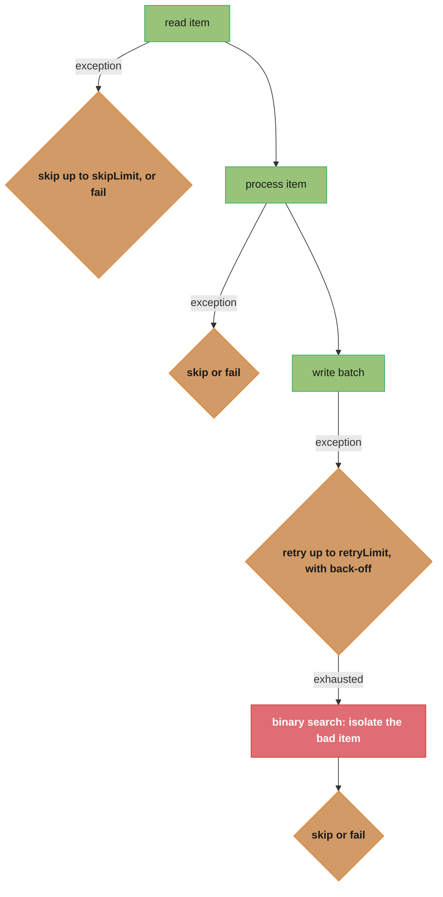
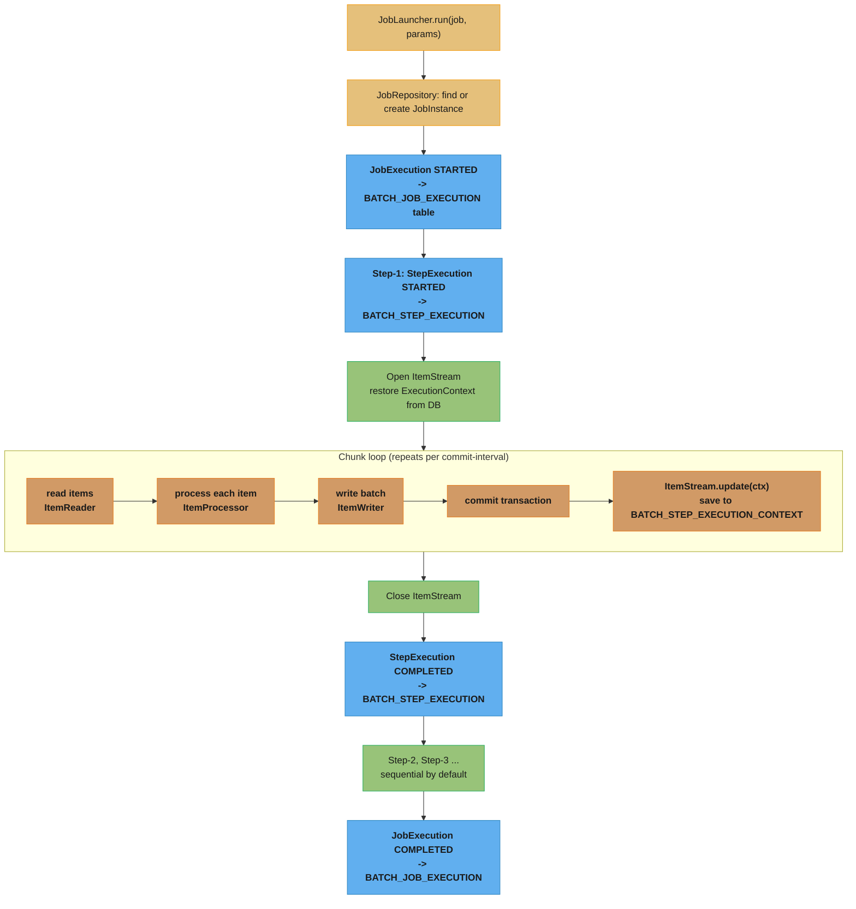
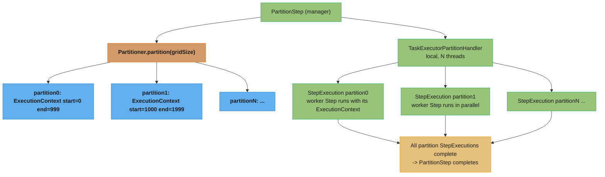

# Spring Batch

## 1. Concept Overview

Spring Batch is a lightweight, comprehensive batch-processing framework built on Spring. It provides reusable functions for processing large volumes of data in a **chunk-oriented** or **tasklet-based** model, with built-in support for:
- Restart/retry/skip after failures
- State persistence via `JobRepository` (database-backed)
- Parallel and partitioned processing
- Transaction management per chunk
- Job monitoring and management

Core abstractions:
- `Job` — a batch process, composed of one or more `Step`s
- `Step` — a unit of work; either chunk-oriented or tasklet
- `ItemReader<T>` → `ItemProcessor<I,O>` → `ItemWriter<O>` — the chunk pipeline
- `JobRepository` — stores `JobInstance`, `JobExecution`, `StepExecution` in a database
- `JobLauncher` — starts a `Job` with a set of `JobParameters`
- `@StepScope` / `@JobScope` — late-binding beans for step/job-specific configuration

Spring Batch 5 (GA with Spring Boot 3.0) requires Java 17 and Spring Framework 6.

---

## 2. Intuition

> A Spring Batch job is like a factory assembly line with a supervisor ledger: items move down the belt in configurable lots (chunks), the ledger records every completed lot so that if the belt jams, production resumes from the last recorded lot — not from the start.

**Key insight:** The `JobRepository` is what separates Spring Batch from a simple `for` loop. It records every `JobExecution` and `StepExecution` in a relational database. When a job fails at chunk 4,700 of 10,000, the framework can restart and resume from exactly that point — skipping already-processed items. This "resume from failure" guarantee is the primary reason to use Spring Batch over custom batch code.

**Why this matters:** Most production batch workloads are not fire-and-forget one-liners. They process millions of records, fail partway due to bad data or infrastructure issues, and must reconcile state after partial completion. Spring Batch's metadata model solves all of this without the developer writing resumption logic.

---

## 3. Core Principles

1. **Chunk-oriented processing**: read N items, process N items, write N items — all in one transaction. Commit interval is configurable (`chunk(size)`). On failure, only the current chunk is rolled back.
2. **`JobRepository` for durability**: every `JobInstance`, `JobExecution`, `StepExecution`, and `ExecutionContext` is persisted. The schema is created automatically by `spring-batch-core`.
3. **`JobParameters` uniqueness**: a `JobInstance` is identified by `Job + JobParameters`. Running the same job with the same parameters re-uses the existing instance. Add a `run.id` or timestamp parameter to force a new instance.
4. **Stateful readers/writers via `ExecutionContext`**: `ItemStream.update(ExecutionContext)` saves progress after each chunk; `open(ExecutionContext)` restores it on restart.
5. **`@StepScope` is lazy**: beans annotated `@StepScope` are created per step execution. This enables late binding of `JobParameters` and `StepExecutionContext` via `#{jobParameters['fileName']}` SpEL.

---

## 4. Types / Architectures / Strategies

### 4.1 Chunk-Oriented Step vs Tasklet Step

| Type | Use Case | Example |
|---|---|---|
| Chunk-oriented (`chunk(N)`) | Large volumes of records with item-level transform | CSV → DB, DB → Kafka |
| `Tasklet` | One-off tasks without item iteration | Create a temp directory, send a single email, clean up a table |
| `MethodInvokingTaskletAdapter` | Delegate to a plain service method | Wrap existing service without batch coupling |

### 4.2 Parallel Processing Strategies

| Strategy | Description | When to Use |
|---|---|---|
| Multi-threaded step | Multiple threads process the same `Step`'s chunks in parallel | When `ItemReader` is thread-safe (e.g., `JdbcPagingItemReader`) |
| Parallel steps | Multiple `Step`s run concurrently using `Flow` + `split(executor)` | Independent steps that don't share data |
| Partitioning (local) | `PartitionStep` splits work into partitions; each runs as a sub-step | Divide a large file or date range across threads |
| Remote chunking | `ItemReader` runs on manager; workers receive items via message queue | Reader is a bottleneck; workers scale horizontally |
| Remote partitioning | Both partitioning and worker execution are remote | Full distributed batch (cloud-native) |

### 4.3 Retry and Skip Policies



---

## 5. Architecture Diagrams

### Job Execution Flow



### Partitioned Step (Local)



---

## 6. How It Works — Detailed Mechanics

### 6.1 Job and Step Configuration (Spring Batch 5, Spring Boot 3+)

```java
@Configuration
@EnableBatchProcessing   // Spring Batch 5: auto-config in Boot 3; @EnableBatchProcessing optional
public class ImportJobConfig {

    @Bean
    public Job importJob(JobRepository repo, Step importStep) {
        return new JobBuilder("importJob", repo)
            .start(importStep)
            .build();
    }

    @Bean
    public Step importStep(JobRepository repo,
                           PlatformTransactionManager txMgr,
                           ItemReader<CsvRecord> reader,
                           ItemProcessor<CsvRecord, Entity> processor,
                           ItemWriter<Entity> writer) {
        return new StepBuilder("importStep", repo)
            .<CsvRecord, Entity>chunk(500, txMgr)  // chunk size 500
            .reader(reader)
            .processor(processor)
            .writer(writer)
            .faultTolerant()
            .skip(ParseException.class).skipLimit(100)
            .retry(TransientDataAccessException.class).retryLimit(3)
            .build();
    }
}
```

### 6.2 @StepScope and Late-Binding Job Parameters

```java
// BROKEN: reader is a singleton — params are not yet available at application start
@Bean
public FlatFileItemReader<CsvRecord> csvReader(@Value("#{jobParameters['file']}") String file) {
    // This won't work if csvReader() is NOT @StepScope — jobParameters is null at start
    return new FlatFileItemReaderBuilder<CsvRecord>()
        .name("csvReader")
        .resource(new FileSystemResource(file))
        .build();
}

// FIX: @StepScope = prototype-scoped, created per StepExecution — params available
@Bean
@StepScope
public FlatFileItemReader<CsvRecord> csvReader(
        @Value("#{jobParameters['file']}") String file) {
    return new FlatFileItemReaderBuilder<CsvRecord>()
        .name("csvReader")
        .resource(new FileSystemResource(file))
        .delimited()
        .names("id", "name", "amount")
        .targetType(CsvRecord.class)
        .build();
}
```

**Rule**: any bean that uses `jobParameters`, `stepExecutionContext`, or `jobExecutionContext` in SpEL MUST be `@StepScope` or `@JobScope`. Without it, the expression evaluates to `null` at application context startup.

### Reading the chunk size as a two-sided cost

`chunk(500)` above is the single most consequential number in a batch job. It sets two
costs that move in opposite directions:

```
  commits    = total_items / chunk_size
  worst-case rework on a failure = chunk_size items
```

**Stated plainly.** "Chunk size divides your job into commits: bigger chunks mean fewer
commits but more work thrown away when one fails." There is no universally right value —
you are choosing where to sit between per-commit overhead and per-failure rollback cost.

| Symbol | What it is |
|--------|------------|
| `total_items` | Rows the step will read end to end |
| `chunk_size` | Items read + processed before one transaction commits (`chunk(N)`) |
| `commits` | Number of transactions the step opens and closes — the fixed overhead term |
| rework | Items re-read and re-processed when a chunk rolls back — the failure term |
| chunk 1 | Degenerates to one transaction per item: max commits, zero rework |

**Walk one example.** A 10,000,000-row import at three chunk sizes:

```
  chunk    commits = 10,000,000 / chunk    items lost per rollback
      1      10,000,000                          1      commit-bound
     10       1,000,000                         10
    500          20,000                        500      the config above
  10000           1,000                     10,000      rollback-bound

  going 500 -> 10000:  commits fall 20x (20,000 -> 1,000)
                       rework  rises 20x (500 -> 10,000 items)
```

The `500` in the config buys 20,000 commits — small enough that commit overhead is not
the bottleneck, while a single bad row costs at most 500 items of rework. Both terms are
merely "acceptable," which is the correct shape of a tuning answer.

**Why chunk size interacts with `skipLimit`.** With `skipLimit(100)` and fault tolerance
on, a failed chunk triggers item-by-item re-processing to isolate the bad row — so a
chunk of 10,000 means up to 10,000 single-item retries to find one bad record. Large
chunks make the *scan* expensive, not just the rollback.

### 6.3 ItemReader, ItemProcessor, ItemWriter

```java
// ItemReader: returns one item per call; returns null to signal "no more items"
@Bean
@StepScope
public JdbcPagingItemReader<Order> orderReader(DataSource ds,
        @Value("#{jobParameters['date']}") String date) {
    return new JdbcPagingItemReaderBuilder<Order>()
        .name("orderReader")
        .dataSource(ds)
        .selectClause("SELECT id, customer_id, total, status")
        .fromClause("FROM orders")
        .whereClause("WHERE DATE(created_at) = :date AND status = 'PENDING'")
        .parameterValues(Map.of("date", date))
        .sortKeys(Map.of("id", Order.ASCENDING))
        .pageSize(500)
        .rowMapper(new BeanPropertyRowMapper<>(Order.class))
        .build();
}

// ItemProcessor: transforms or filters; return null to skip the item
@Bean
public ItemProcessor<Order, EnrichedOrder> enrichProcessor(CatalogService catalog) {
    return order -> {
        if (order.total().compareTo(BigDecimal.ZERO) <= 0) {
            return null;  // skip zero-total orders
        }
        String productName = catalog.lookupName(order.productId());
        return new EnrichedOrder(order, productName);
    };
}

// ItemWriter: receives a Chunk<EnrichedOrder> (list of processed items)
@Bean
public JdbcBatchItemWriter<EnrichedOrder> enrichedWriter(DataSource ds) {
    return new JdbcBatchItemWriterBuilder<EnrichedOrder>()
        .dataSource(ds)
        .sql("INSERT INTO enriched_orders(id, customer_id, product_name, total) " +
             "VALUES (:id, :customerId, :productName, :total)")
        .beanMapped()
        .build();
}
```

### 6.4 Restartability — How ExecutionContext Saves Progress

```java
// FlatFileItemReader implements ItemStream
// After each chunk, Spring Batch calls reader.update(ExecutionContext):
//   ctx.put("FlatFileItemReader.read.count", 500);  // items read so far
// This is stored in BATCH_STEP_EXECUTION_CONTEXT as serialized JSON.
// On restart, reader.open(ExecutionContext) calls:
//   int lineCount = ctx.getInt("FlatFileItemReader.read.count", 0);
//   skipLines(lineCount);  // fast-forwards to where we left off

// Custom reader with state preservation
@StepScope
public class StatefulCsvReader implements ItemReader<CsvRecord>, ItemStream {
    private long linesRead = 0;

    @Override
    public void open(ExecutionContext ctx) {
        linesRead = ctx.getLong("linesRead", 0);
        skipToLine(linesRead);
    }

    @Override
    public void update(ExecutionContext ctx) {
        ctx.putLong("linesRead", linesRead);
    }

    @Override
    public CsvRecord read() {
        linesRead++;
        return nextLine();
    }
}
```

### 6.5 Partitioning a Large Dataset

```java
// Divide 10M records into 10 partitions of 1M each
@Bean
public Step partitionedStep(JobRepository repo, Step workerStep,
                             Partitioner partitioner, TaskExecutor executor) {
    return new StepBuilder("partitionedStep", repo)
        .partitioner("workerStep", partitioner)
        .step(workerStep)
        .gridSize(10)
        .taskExecutor(executor)  // 10 threads run in parallel
        .build();
}

@Bean
public Partitioner rangePartitioner(DataSource ds) {
    return gridSize -> {
        Map<String, ExecutionContext> partitions = new HashMap<>();
        long totalRecords = 10_000_000L;
        long chunkSize = totalRecords / gridSize;
        for (int i = 0; i < gridSize; i++) {
            ExecutionContext ctx = new ExecutionContext();
            ctx.putLong("minId", i * chunkSize);
            ctx.putLong("maxId", (i + 1) * chunkSize - 1);
            partitions.put("partition" + i, ctx);
        }
        return partitions;
    };
}

@Bean
@StepScope
public JdbcPagingItemReader<Record> workerReader(DataSource ds,
        @Value("#{stepExecutionContext['minId']}") Long minId,
        @Value("#{stepExecutionContext['maxId']}") Long maxId) {
    return new JdbcPagingItemReaderBuilder<Record>()
        .name("workerReader")
        .dataSource(ds)
        .selectClause("SELECT *").fromClause("FROM records")
        .whereClause("WHERE id BETWEEN :minId AND :maxId")
        .parameterValues(Map.of("minId", minId, "maxId", maxId))
        .sortKeys(Map.of("id", Order.ASCENDING))
        .pageSize(1000)
        .rowMapper(new BeanPropertyRowMapper<>(Record.class))
        .build();
}
```

The partitioner is three lines of arithmetic that decide the whole job's shape:

```
  range_width = totalRecords / gridSize
  minId(i)    = i * range_width
  maxId(i)    = (i + 1) * range_width - 1
```

**What it means.** "Cut the primary-key space into `gridSize` equal, non-overlapping,
contiguous blocks and hand block `i` to worker `i`." The `- 1` is not cosmetic — it is
what makes the blocks disjoint, and dropping it double-processes one row per boundary.

| Symbol | What it is |
|--------|------------|
| `totalRecords` | Size of the key space being split. `10,000,000` here |
| `gridSize` | Number of partitions (and, locally, threads). `10` here |
| `range_width` | Rows per partition — the per-worker load |
| `minId(i)` | Inclusive lower bound of partition `i`'s `BETWEEN` clause |
| `maxId(i)` | Inclusive upper bound. `(i+1) * width - 1` closes the block one short of the next |

**Walk one example.** `totalRecords = 10,000,000`, `gridSize = 10`:

```
  range_width = 10,000,000 / 10 = 1,000,000

  partition   minId = i x 1,000,000    maxId = (i+1) x 1,000,000 - 1
      0                       0                            999,999
      1               1,000,000                          1,999,999
      2               2,000,000                          2,999,999
      ...
      9               9,000,000                          9,999,999

  check: 9,999,999 + 1 = 10,000,000 rows covered, no gaps
  check: partition 0 ends at 999,999 and partition 1 starts at 1,000,000 -> disjoint
```

Drop the `- 1` and partition 0 would end at `1,000,000`, exactly where partition 1
begins: every boundary row is then read by two workers and written twice. With
`gridSize = 10` that is 9 duplicated rows — small enough to survive testing and large
enough to corrupt a billing run.

**Why equal-width is not equal-work.** This formula splits the *key range* evenly, not
the *row count*. If IDs are sparse — deleted rows, or a sequence that skipped a
block — one worker gets a near-empty range while another gets a dense one, and the step
finishes only when the slowest partition does. Partitioning by row count (or over-
partitioning to `gridSize` well above the thread count so slow partitions interleave)
is the fix when key density is uneven.

---

## 7. Real-World Examples

### 7.1 Netflix — Billing Run

Netflix runs nightly billing jobs for ~250 million subscribers. Each billing run is a Spring Batch (or similar chunk-oriented) job with: `ItemReader` pulling subscription records from a DB, `ItemProcessor` computing charges, `ItemWriter` inserting payment records and firing events. Partitioning by subscription tier (Basic, Standard, Premium) gives 3 parallel partitions. Failed payment records are skipped and written to a DLQ for manual review.

### 7.2 Bank End-of-Day Settlement

Banks use Spring Batch for end-of-day trade settlement: read all unprocessed trades from the day (potentially 10M+ records), enrich with market data, calculate net positions, and write settlement instructions. The job is parameterised by `{tradeDate=YYYY-MM-DD}`, so it is idempotent on re-run for the same date. `JobParameters` uniqueness ensures a second run for the same date re-uses the existing `JobInstance` — if the first run completed, the second is rejected; if it failed, a restart resumes from the checkpoint.

### 7.3 E-Commerce Nightly Inventory Sync

A retailer syncs inventory from 50 supplier CSV files. One `Job` contains 50 parallel `Step`s (one per supplier) using `Flow.split()`. Each step is independently restartable. A bad row in one supplier's file causes that step to skip (up to `skipLimit=1000`) and log skipped items to an audit table, while all other supplier steps continue unaffected.

---

## 8. Tradeoffs

| Approach | Pros | Cons | When |
|---|---|---|---|
| Chunk-oriented (`chunk(N)`) | Transactional safety, resume on failure | Overhead per commit | Large record volumes (>10K) |
| Tasklet | Simplest, full control | No built-in item-level retry/skip | Single-step one-off tasks |
| Multi-threaded step | Simple config, high throughput | Reader must be thread-safe | Thread-safe readers only |
| Partitioning | True parallelism, partition-level restart | Setup complexity, partitioner logic | Large datasets with natural partition key |
| Remote chunking | Horizontal worker scale-out | Requires message broker (JMS/Kafka) | Expensive processing, cheap I/O |
| Remote partitioning | Full horizontal scale | Most complex; needs distributed JobRepository | Cloud-native at very high scale |

---

## 9. When to Use / When NOT to Use

### Use Spring Batch when:
- Processing large volumes (>100K records) in a scheduled or triggered batch
- Resumability after failure is required (financial, regulatory, SLA-bound)
- The pipeline has clear read/process/write stages
- You need auditable job history (which runs completed, when, how many records)
- Skip/retry/fault-tolerance logic is needed without writing it yourself

### Do NOT use Spring Batch when:
- Simple scripts or one-off admin tasks that don't need restart semantics
- Real-time stream processing — use Kafka Streams, Spring Cloud Stream, or Flink instead
- The dataset is tiny (<1K records) — overhead of JobRepository is not justified
- The job does not fail partway through and never needs restart

---

## 10. Common Pitfalls

### Pitfall 1: Non-@StepScope reader with `jobParameters` SpEL
See §6.2 above — `jobParameters` is `null` at startup if the bean is not `@StepScope`. Silent null-pointer in the SpEL expression, resulting in wrong file path or null query parameter.

### Pitfall 2: Re-running a job with the same `JobParameters`
```java
// BROKEN: second launch for same date is rejected (job already completed)
jobLauncher.run(job, new JobParameters(Map.of("date", new JobParameter("2024-01-15"))));
jobLauncher.run(job, new JobParameters(Map.of("date", new JobParameter("2024-01-15"))));
// Second call throws JobInstanceAlreadyCompleteException

// FIX: add a unique run parameter
jobLauncher.run(job, new JobParametersBuilder()
    .addString("date", "2024-01-15")
    .addLong("run.id", System.currentTimeMillis())
    .toJobParameters());
```

### Pitfall 3: `JdbcPagingItemReader` with non-deterministic sort key
```java
// BROKEN: sorting by non-unique column causes duplicate reads across pages
.sortKeys(Map.of("status", Order.ASCENDING))  // status has low cardinality

// FIX: always include a unique key (id) in the sort
.sortKeys(Map.of("status", Order.ASCENDING, "id", Order.ASCENDING))
```
Without a unique sort key, page boundaries are non-deterministic — records can be missed or duplicated across restarts.

### Pitfall 4: Large `ItemWriter` transactions rolling back the full chunk
If `ItemWriter` calls a slow external API and one call fails, the entire chunk transaction rolls back — all N items are re-processed. Use `@Transactional(propagation = REQUIRES_NEW)` in the writer for external calls, or use `RetryTemplate` with back-off inside the writer.

### Pitfall 5: `@EnableBatchProcessing` conflict in Spring Boot 3
Spring Boot 3 auto-configures Spring Batch when `spring-boot-starter-batch` is on the classpath. Adding `@EnableBatchProcessing` overrides the auto-configuration and may cause duplicate beans or incorrect schema initialization. In Spring Boot 3+, remove `@EnableBatchProcessing` and use `application.properties` to configure batch behaviour.

---

## 11. Technologies & Tools

| Tool / Feature | Version | Purpose |
|---|---|---|
| `spring-boot-starter-batch` | Spring Boot 3.x | Starter: includes spring-batch-core, spring-batch-infrastructure |
| `spring-batch-core` | Spring Batch 5.x | Job/Step/chunk model, JobRepository, executors |
| `spring-batch-infrastructure` | Spring Batch 5.x | ItemReader/Writer implementations, retry/skip |
| `spring-batch-test` | Spring Batch 5.x | `JobLauncherTestUtils`, `StepScopeTestExecutionListener` |
| `spring.batch.jdbc.initialize-schema=always` | Spring Boot 3.x | Auto-creates BATCH_* tables on startup (use `never` in prod) |
| `@EnableBatchProcessing` | Spring Batch 4.x (avoid in Boot 3) | Enables batch infrastructure beans — auto-done by Boot 3 |
| `FlatFileItemReader` | Core | Reads CSV/fixed-length files |
| `JdbcPagingItemReader` | Core | Reads DB records with keyset pagination |
| `JdbcBatchItemWriter` | Core | Writes via JDBC batch insert/update |
| `JpaPagingItemReader` | Core | Reads JPA entities with JPQL pagination |
| `KafkaItemReader` | `spring-batch-integration` | Reads from Kafka topic |
| `ItemReaderAdapter` | Core | Wraps any service method as an `ItemReader` |
| `CompositeItemProcessor` | Core | Chains multiple `ItemProcessor`s |
| `ClassifierCompositeItemWriter` | Core | Routes items to different writers based on type |
| Spring Batch Admin / Spring Cloud Data Flow | UI/Orchestration | Job monitoring, scheduling, and dashboard |

---

## 12. Interview Questions with Answers

**Q1: What is the chunk-oriented processing model in Spring Batch, and why does it matter for transactional safety?**
In chunk-oriented processing, items flow through three phases — `ItemReader`, `ItemProcessor`, `ItemWriter` — in configurable lots called chunks (e.g., `chunk(500)`). The framework reads and processes 500 items, then writes them all in a single transaction. If the write fails, only those 500 items roll back; previously committed chunks (items 1–499, 500–999) are not affected. This is fundamentally different from wrapping an entire million-row loop in one transaction (which holds locks for minutes) or processing one item per transaction (which creates 1M DB round trips). Chunk size is the key tuning parameter: too small = excessive commit overhead; too large = big rollback penalty on failure.

**Q2: What is `JobRepository` and why is it central to Spring Batch's restartability?**
`JobRepository` is the persistence layer that stores all batch metadata in a relational database (tables: `BATCH_JOB_INSTANCE`, `BATCH_JOB_EXECUTION`, `BATCH_JOB_EXECUTION_PARAMS`, `BATCH_STEP_EXECUTION`, `BATCH_STEP_EXECUTION_CONTEXT`). After every chunk, Spring Batch calls `ItemStream.update(ExecutionContext)` and persists the result to `BATCH_STEP_EXECUTION_CONTEXT`. On restart, `ItemStream.open(ExecutionContext)` reads the saved state and skips already-processed items. Without a `JobRepository`, a job is stateless — there is no way to resume. The database also provides auditing: which jobs ran, when, how many items were processed, what failed.

**Q3: What is the difference between `@StepScope` and `@JobScope`, and when do you need each?**
`@StepScope` is a Spring Batch custom scope that creates a new bean instance per `StepExecution`. It enables SpEL late-binding of `jobParameters` and `stepExecutionContext` — the values are only available when the step starts, not at application context refresh. `@JobScope` creates a new instance per `JobExecution` — available for beans that need `jobParameters` but are shared across steps. Typical usage: `@StepScope` for `ItemReader`/`ItemWriter` that need the step's partition context (`stepExecutionContext['minId']`); `@JobScope` for a shared `ItemProcessor` that needs a `jobParameter` but is reused by multiple steps. Without the appropriate scope, SpEL resolves to null because the execution context does not yet exist.

**Q4: Describe the skip and retry policies. How does Spring Batch handle a bad item that causes an exception?**
`faultTolerant().skip(ExceptionClass.class).skipLimit(N)` configures item-level skipping. When an exception occurs during read or process, Spring Batch increments the skip count and marks the item as skipped (logged to `BATCH_STEP_EXECUTION.SKIP_COUNT`). `faultTolerant().retry(ExceptionClass.class).retryLimit(M).backOffPolicy(policy)` configures writer-level retry: if the writer throws a retryable exception, the entire chunk is retried up to M times with the specified back-off. If all retries are exhausted, Spring Batch performs a "binary search" — it re-processes each item in the chunk individually to identify the bad one, then skips it (up to `skipLimit`). This item-scan pass ensures bad items are isolated without re-committing all other items.

**Q5: What causes `JobInstanceAlreadyCompleteException` and how do you prevent it for repeatable jobs?**
`JobInstanceAlreadyCompleteException` is thrown when `JobLauncher.run()` is called with `Job + JobParameters` that match an already-COMPLETED `JobInstance`. Spring Batch uses this uniqueness to guarantee idempotency: re-running a completed job with the same parameters is rejected to prevent accidental double-processing. To run the same logical job repeatedly (nightly batch): add a time-varying parameter like `addLong("run.id", System.currentTimeMillis())` or `addString("runDate", today)`. For true idempotency (re-runnable for the same date), use `JobParametersIncrementer` to automatically add a sequence number to the parameters.

**Q6: How does partitioning improve throughput, and what is the difference between local and remote partitioning?**
Partitioning splits a large dataset into N non-overlapping sub-ranges (partitions), each processed by an independent `StepExecution`. Local partitioning (`TaskExecutorPartitionHandler`) runs all partition steps in parallel on N threads of the same JVM — limited to available CPU cores. Remote partitioning runs partition steps on separate JVM instances (workers), communicating via a message broker (JMS/RabbitMQ/Kafka). Remote partitioning allows horizontal scale-out: a dataset of 1 billion records can be spread across 100 worker pods, each handling 10 million. Each worker's progress is independently tracked in `JobRepository`, so individual partitions can be restarted without reprocessing the others.

**Q7: What is `JdbcPagingItemReader` and why must the sort key be unique?**
`JdbcPagingItemReader` reads a database table in pages using keyset (cursor-based) pagination. It queries `SELECT ... WHERE id > :lastId ORDER BY id LIMIT pageSize` — using the sort key's last value to start the next page. If the sort key is not unique (e.g., `status` column), page boundaries may overlap or gap: if multiple rows have `status = 'PENDING'` that straddle a page boundary, some rows may appear in two pages (duplicates) or be missed after a re-sort. Always append a unique primary key as the final sort dimension: `Map.of("createdAt", ASCENDING, "id", ASCENDING)`. On restart, the reader re-reads `lastReadCount` from `ExecutionContext` and reconstructs the correct WHERE clause.

**Q8: How do you test a Spring Batch step in isolation without running the full job?**
```java
@SpringBatchTest
@SpringBootTest(classes = BatchConfig.class)
class ImportStepTest {
    @Autowired private JobLauncherTestUtils jobLauncherTestUtils;
    @Autowired private JobRepositoryTestUtils jobRepositoryTestUtils;

    @BeforeEach
    void setup() {
        jobRepositoryTestUtils.removeJobExecutions();  // clean state
    }

    @Test
    void importStepProcessesRecords() throws Exception {
        JobExecution execution = jobLauncherTestUtils.launchStep("importStep",
            new JobParametersBuilder().addString("file", "test-data.csv").toJobParameters());

        StepExecution stepExecution = execution.getStepExecutions().iterator().next();
        assertThat(stepExecution.getStatus()).isEqualTo(BatchStatus.COMPLETED);
        assertThat(stepExecution.getWriteCount()).isEqualTo(100);
    }
}
```
`@SpringBatchTest` registers `JobLauncherTestUtils` and `JobRepositoryTestUtils`. `launchStep()` executes only the named step, not the full job — isolating the test from upstream/downstream steps.

**Q9: What happens to the current chunk's transaction when an ItemWriter throws a non-retryable exception?**
The chunk's transaction is rolled back. All write operations for that chunk (typically `chunk-size` items) are undone. Spring Batch increments `StepExecution.rollbackCount`. If the exception is classified as skippable and the skip limit is not exceeded, Spring Batch attempts to identify the offending item via item-scanning (retry each item individually). Items that succeed in isolation are committed one-by-one; the single offending item is skipped. If the exception is not skippable, the `StepExecution` is marked `FAILED`, the `JobExecution` is marked `FAILED`, and processing stops.

**Q10: How does `CompositeItemProcessor` work, and what is a `ClassifierCompositeItemWriter`?**
`CompositeItemProcessor<I, O>` chains multiple `ItemProcessor`s sequentially: the output of processor-1 becomes the input of processor-2. Type alignment is required (`O` of step N must be assignable to `I` of step N+1). Use case: validate → enrich → transform, where each concern is in its own processor class. `ClassifierCompositeItemWriter<T>` routes items to different `ItemWriter`s based on a `Classifier<T, ItemWriter<T>>` — a strategy function. Use case: write premium customers to PostgreSQL and standard customers to Redis, both in the same step. This avoids forking the pipeline into two steps when the routing logic is item-level.

**Q11: What is remote chunking and when would you choose it over remote partitioning?**
In remote chunking, the manager step runs the `ItemReader` and sends items over a message queue (JMS/RabbitMQ) to worker JVMs, which run the `ItemProcessor` and `ItemWriter`. The manager waits for all workers to acknowledge before committing. Use remote chunking when the reader is a bottleneck-free singleton (e.g., one file) but processing is expensive and horizontally scalable (e.g., ML enrichment, external API calls). In remote partitioning, both reading AND processing happen on workers — the manager only partitions the key space. Use remote partitioning when the dataset is in a horizontally partitioned store (sharded DB, partitioned Kafka topic) and the reader itself can be distributed. Remote chunking requires exactly-once delivery guarantees from the message broker; remote partitioning requires only the partition key assignment to be correct.

**Q12: How do you run a Spring Batch job on a schedule without a separate scheduler?**
```java
@Scheduled(cron = "0 0 2 * * *")   // 2:00 AM every day
public void runDailyImport() throws Exception {
    JobParameters params = new JobParametersBuilder()
        .addString("runDate", LocalDate.now().toString())
        .addLong("timestamp", System.currentTimeMillis())
        .toJobParameters();
    JobExecution execution = jobLauncher.run(importJob, params);
    if (execution.getStatus() == BatchStatus.FAILED) {
        alertService.notifyBatchFailure(execution);
    }
}
```
Alternatively, use `spring.batch.job.enabled=true` (Spring Boot auto-launches jobs at startup) or `spring.batch.job.name=myJob` for targeting. For production, prefer an external scheduler (Quartz, Spring Cloud Data Flow, or Kubernetes CronJob) to provide retry-on-crash, distributed locking (avoid double-trigger), and a UI for monitoring.

**Q13: What are `ItemStream` and `ExecutionContext`, and why are they important for restartability?**
`ItemStream` is an interface with three methods: `open(ExecutionContext)`, `update(ExecutionContext)`, `close()`. `ExecutionContext` is a key-value map persisted per `StepExecution`. On startup, `open()` is called with the saved context (may be empty for a new execution, or populated for a restart). After each chunk, `update()` is called — the reader/writer serialises its progress (e.g., "I've read 5,000 records") into the context, which is written to `BATCH_STEP_EXECUTION_CONTEXT`. On restart, `open()` receives the saved context and can fast-forward to the correct starting position. Most built-in readers (`FlatFileItemReader`, `JdbcPagingItemReader`) implement `ItemStream` automatically. Custom readers must implement it to enable restartability.

**Q14: What is the default behavior of Spring Boot 3's batch auto-configuration, and what changed from Spring Batch 4?**
Spring Boot 3 + Spring Batch 5 auto-configuration changes: (1) `@EnableBatchProcessing` is no longer needed — Spring Boot auto-creates `JobRepository`, `JobLauncher`, `PlatformTransactionManager`; adding `@EnableBatchProcessing` DISABLES the auto-config (you take full manual control); (2) `spring.batch.jdbc.initialize-schema=always|embedded|never` replaces `spring.batch.initialize-schema`; (3) `JobBuilderFactory` and `StepBuilderFactory` are removed — use `JobBuilder(name, jobRepository)` and `StepBuilder(name, jobRepository)` directly; (4) `spring.batch.job.enabled=false` (default in Boot 3) — jobs no longer run automatically at startup unless enabled. The key migration action for Boot 2 → Boot 3: remove `@EnableBatchProcessing`, replace `*Factory` builders, update property keys.

**Q15: How would you implement an idempotent batch job that can safely re-run for the same date without double-processing?**
Idempotency in batch requires: (1) **unique `JobParameters`** keyed on the business date (`{runDate=2024-01-15}`) so Spring Batch treats each date as one `JobInstance`; (2) a completed `JobInstance` for that date is rejected on re-launch — no double-run is possible; (3) if the job fails partway and is restarted, the same `{runDate=2024-01-15}` parameters re-use the existing `JobInstance` and resume from the checkpoint — no reprocessing of already-committed chunks; (4) for the `ItemWriter`, use `INSERT ... ON CONFLICT DO UPDATE` (PostgreSQL) or `MERGE` (SQL Server/Oracle) to make individual writes idempotent against DB-level duplicates; (5) add `skipLimit` to skip malformed records that would otherwise cause repeated failures without progress. This combination ensures that regardless of how many times the job is restarted, each record is written exactly once.

---

## 13. Best Practices

1. **Set chunk size by profiling** — start at 100–500; too small increases commit overhead, too large increases rollback blast radius. Aim for chunks that commit in 50–200 ms.
2. **Always use `@StepScope` for readers/writers that use `jobParameters` or `stepExecutionContext`** — without it, SpEL evaluates to null at startup.
3. **Sort key of `JdbcPagingItemReader` must include the primary key** — ensures deterministic pagination and correct restart behaviour.
4. **Set `skipLimit` conservatively** — unlimited skipping masks data quality problems. Log every skipped item to an audit table for post-job review.
5. **Use `ItemStream` in custom readers** — required for restartability; without `update()` the job re-reads from the beginning on restart.
6. **Do not use `@EnableBatchProcessing` in Spring Boot 3** — the auto-configuration covers all infrastructure; adding it disables the auto-config.
7. **Separate job configuration from business logic** — `ItemProcessor` should not know about chunks, transactions, or Spring Batch specifics; it receives one item and returns one item (or null to skip).
8. **Use `spring.batch.jdbc.initialize-schema=never` in production** — create the schema manually from the provided SQL scripts; auto-create is for development only.
9. **Monitor via `JobExplorer`** — provides read-only access to `JobRepository`; use it to list running/failed jobs and feed your operations dashboard.
10. **For distributed batch (Kubernetes)**, use Spring Cloud Data Flow or a Kubernetes CronJob with distributed locking (Redis SETNX / Postgres advisory lock) to prevent multiple pods launching the same job simultaneously.

---

## 14. Case Study

See the Spring case study: [Design Batch Pipeline](../case_studies/design_batch_pipeline.md)

**Quick summary:** An order fulfillment service runs a nightly batch to reconcile 5 million unshipped orders, enrich them with warehouse inventory, and generate pick-lists. The Spring Batch implementation uses:
- `JdbcPagingItemReader` (paginated by `orderId`) with `@StepScope`
- `ItemProcessor` calling a warehouse API (with Resilience4j retry)
- `JdbcBatchItemWriter` for bulk insert of pick-list records
- Range partitioning across 8 threads (chunks of 500 per partition)
- Skip policy: `skipLimit=500` for warehouse API timeouts; skipped orders go to a `CompensationItemWriter`
- Full restartability: if the job fails at partition 5, partitions 1–4 are not re-processed

**Cross-links:**
- [Spring Transactions](../spring_transactions/README.md) — transaction propagation in chunk commits
- [Spring Messaging](../spring_messaging/README.md) — remote chunking via RabbitMQ
- [Spring Cloud Patterns](../spring_cloud_patterns/README.md) — Resilience4j retry in ItemProcessor

---

## Related / See Also

- [Spring Transactions](../spring_transactions/README.md) — chunk-level transactions
- [Spring Events & Scheduling](../spring_events_and_scheduling/README.md) — job trigger events
- [Case Study: Batch Pipeline](../case_studies/design_batch_pipeline.md) — full batch pipeline design
- [LLD: Template Method Pattern](../../lld/behavioral/template_method/README.md) — the GoF pattern behind the fixed Reader/Processor/Writer skeleton
