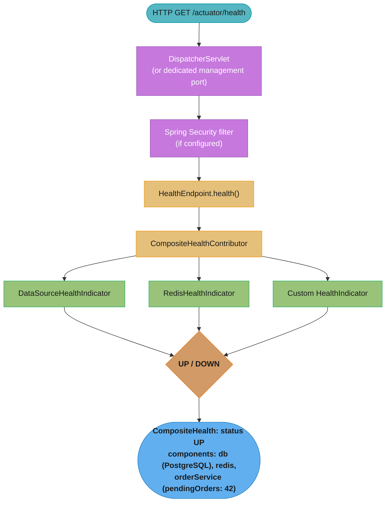
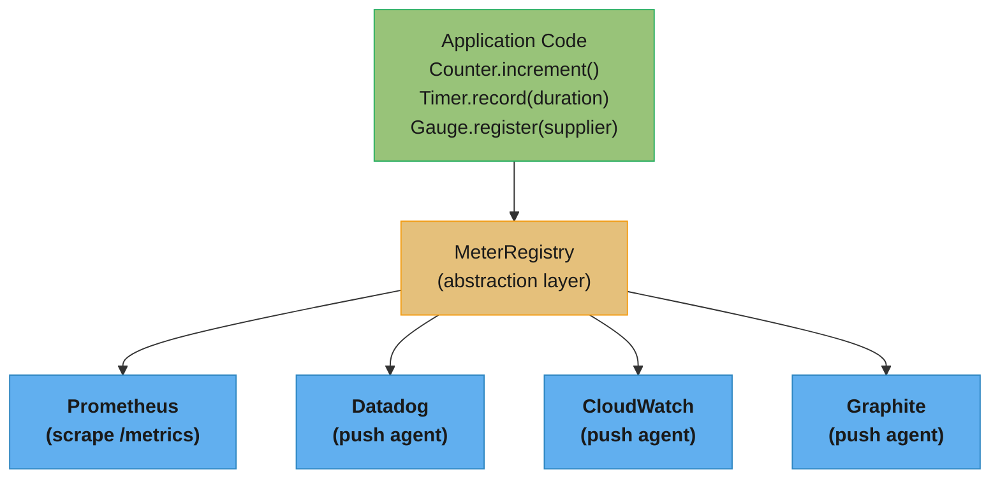
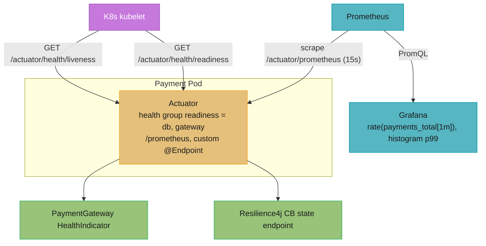

# Spring Boot Actuator

## 1. Concept Overview

Spring Boot Actuator adds production-ready features to Spring Boot applications: health checks, metrics, HTTP request tracing, bean introspection, logger configuration, thread dumps, and more — all accessible via HTTP endpoints or JMX. Actuator integrates with Micrometer for dimensional metrics and supports Kubernetes liveness/readiness probes out of the box.

---

## 2. Intuition

Think of Actuator as the diagnostic dashboard of a modern aircraft. The pilot (operations team) doesn't need to look inside the engine — the dashboard shows fuel level (heap usage), engine temperature (CPU), whether all systems are green (health), and complete sensor logs (metrics). The aircraft still flies the same way; the dashboard only provides observation capability.

**One-line analogy:** Actuator is an always-on diagnostic API for your running application, exposing operational data without modifying business logic.

**Key insight:** Actuator endpoints expose sensitive data (env vars, heap dumps, bean definitions, thread stacks) — securing them in production is not optional. A publicly accessible `/actuator/heapdump` can expose credentials stored in memory.

---

## 3. Core Principles

1. **Non-intrusive:** Actuator adds observation capability; business logic is untouched.
2. **Extensible:** Custom health indicators, info contributors, and custom endpoints integrate seamlessly.
3. **Security-first:** Endpoints must be secured; expose only what operations needs.
4. **Micrometer integration:** All metrics go through Micrometer's `MeterRegistry` abstraction — swap backends (Prometheus, Datadog, CloudWatch) without code changes.
5. **Kubernetes-native:** Liveness and readiness probes have first-class support via `/actuator/health/liveness` and `/actuator/health/readiness`.

---

## 4. Types / Architectures / Strategies

### Built-in Endpoints

| Endpoint | Default | Description |
|----------|---------|-------------|
| `/actuator/health` | Exposed | Application health (UP/DOWN/OUT_OF_SERVICE/UNKNOWN) |
| `/actuator/info` | Exposed | Arbitrary application info |
| `/actuator/metrics` | Not exposed | Micrometer metrics (requires explicit exposure) |
| `/actuator/env` | Not exposed | `Environment` property sources |
| `/actuator/beans` | Not exposed | All Spring beans and their dependencies |
| `/actuator/conditions` | Not exposed | Auto-configuration condition evaluation report |
| `/actuator/loggers` | Not exposed | View and change log levels at runtime |
| `/actuator/threaddump` | Not exposed | Thread dump (stack traces of all threads) |
| `/actuator/heapdump` | Not exposed | Heap dump as HPROF file |
| `/actuator/httptrace` | Not exposed | Recent HTTP request/response traces |
| `/actuator/shutdown` | Disabled | Gracefully shut down application (requires enable) |
| `/actuator/startup` | Not exposed | ApplicationContext startup steps with timing |
| `/actuator/scheduledtasks` | Not exposed | Scheduled tasks details |

### Health Check Components

| Component | Indicator | Checks |
|-----------|-----------|--------|
| Database | `DataSourceHealthIndicator` | JDBC ping query |
| Redis | `RedisHealthIndicator` | PING command |
| Kafka | `KafkaHealthIndicator` | Admin client describe topics |
| Disk space | `DiskSpaceHealthIndicator` | Free disk space threshold |
| Liveness | `LivenessStateHealthIndicator` | Application is not in broken state |
| Readiness | `ReadinessStateHealthIndicator` | Application is ready to serve traffic |

---

## 5. Architecture Diagrams



Each contributor reports its own status, and `CompositeHealthContributor` rolls them up into one aggregate `CompositeHealth` — the worst status among the leaves determines the overall health.



`MeterRegistry` is the one abstraction application code talks to; swapping the backend (Prometheus, Datadog, CloudWatch, Graphite) is a dependency change, not a code change.

---

## 6. How It Works — Detailed Mechanics

### Configuration

```properties
# Expose specific endpoints
management.endpoints.web.exposure.include=health,info,metrics,loggers,startup
management.endpoints.web.exposure.exclude=heapdump,shutdown,env

# Show health details (always | never | when-authorized)
management.endpoint.health.show-details=when-authorized
management.endpoint.health.show-components=always

# Kubernetes probes
management.endpoint.health.probes.enabled=true
# Creates: /actuator/health/liveness and /actuator/health/readiness

# Custom management port (separate from app port, not exposed by load balancer)
management.server.port=8081

# Enable shutdown endpoint (disabled by default)
management.endpoint.shutdown.enabled=true

# Health group for Kubernetes readiness (all must be UP)
management.endpoint.health.group.readiness.include=readiness,db,redis
management.endpoint.health.group.liveness.include=liveness
```

### Custom Health Indicator

```java
@Component
public class ExternalApiHealthIndicator implements HealthIndicator {
    private final ExternalApiClient client;

    public ExternalApiHealthIndicator(ExternalApiClient client) {
        this.client = client;
    }

    @Override
    public Health health() {
        try {
            ResponseEntity<String> response = client.ping();
            if (response.getStatusCode().is2xxSuccessful()) {
                return Health.up()
                    .withDetail("url", client.getBaseUrl())
                    .withDetail("responseTime", "< 100ms")
                    .build();
            }
            return Health.down()
                .withDetail("url", client.getBaseUrl())
                .withDetail("status", response.getStatusCode())
                .build();
        } catch (Exception e) {
            return Health.down(e)
                .withDetail("url", client.getBaseUrl())
                .withDetail("error", e.getMessage())
                .build();
        }
    }
}
```

### Micrometer Metrics

```java
@Service
public class OrderService {
    private final Counter orderCounter;
    private final Timer orderTimer;
    private final AtomicInteger activeOrders;

    public OrderService(MeterRegistry registry) {
        // Counter: monotonically increasing count
        this.orderCounter = Counter.builder("orders.placed")
            .description("Total orders placed")
            .tag("region", "us-east-1")
            .register(registry);

        // Timer: duration and count
        this.orderTimer = Timer.builder("orders.processing.time")
            .description("Order processing duration")
            .publishPercentiles(0.50, 0.95, 0.99)  // p50, p95, p99
            .publishPercentileHistogram()  // for Prometheus histogram
            .register(registry);

        // Gauge: current value (e.g., queue size)
        this.activeOrders = registry.gauge("orders.active",
            new AtomicInteger(0));  // gauge tracks the AtomicInteger's value
    }

    public Order placeOrder(OrderRequest request) {
        activeOrders.incrementAndGet();
        return orderTimer.record(() -> {
            Order order = processOrder(request);
            orderCounter.increment();
            return order;
        });
    }

    private void completeOrder(Order order) {
        activeOrders.decrementAndGet();
    }
}
```

### Custom Info Contributor

```java
@Component
public class BuildInfoContributor implements InfoContributor {
    @Override
    public void contribute(Info.Builder builder) {
        builder.withDetail("build", Map.of(
            "version", getClass().getPackage().getImplementationVersion(),
            "timestamp", System.getenv("BUILD_TIMESTAMP"),
            "commit", System.getenv("GIT_COMMIT")
        ));
    }
}

// application.properties to auto-expose build info from Maven:
// spring.info.build.location=classpath:META-INF/build-info.properties
// management.info.build.enabled=true
// management.info.git.mode=full  (if git.properties present)
```

### Custom @Endpoint

```java
// Custom endpoint accessible at /actuator/cache-stats
@Component
@Endpoint(id = "cache-stats")
public class CacheStatsEndpoint {
    private final CacheManager cacheManager;

    public CacheStatsEndpoint(CacheManager cacheManager) {
        this.cacheManager = cacheManager;
    }

    @ReadOperation  // HTTP GET
    public Map<String, Object> cacheStats() {
        Map<String, Object> stats = new LinkedHashMap<>();
        cacheManager.getCacheNames().forEach(name -> {
            Cache cache = cacheManager.getCache(name);
            // Get Caffeine stats if using CaffeineCacheManager
            stats.put(name, Map.of("name", name, "present", true));
        });
        return stats;
    }

    @WriteOperation  // HTTP POST
    public void clearCache(@Selector String cacheName) {
        Cache cache = cacheManager.getCache(cacheName);
        if (cache != null) {
            cache.clear();
        }
    }

    @DeleteOperation  // HTTP DELETE
    public void clearAllCaches() {
        cacheManager.getCacheNames()
            .forEach(name -> {
                Cache c = cacheManager.getCache(name);
                if (c != null) c.clear();
            });
    }
}
```

### Securing Actuator Endpoints

```java
@Configuration
@EnableWebSecurity
public class SecurityConfig {
    @Bean
    public SecurityFilterChain securityFilterChain(HttpSecurity http) throws Exception {
        http
            .authorizeHttpRequests(auth -> auth
                // Public health/info for load balancer
                .requestMatchers("/actuator/health", "/actuator/info").permitAll()
                // Require ACTUATOR_ADMIN role for sensitive endpoints
                .requestMatchers("/actuator/**").hasRole("ACTUATOR_ADMIN")
                // All other requests require authentication
                .anyRequest().authenticated()
            )
            .httpBasic(Customizer.withDefaults());  // or JWT for prod
        return http.build();
    }
}
```

---

## 7. Real-World Examples

**Kubernetes liveness and readiness probes:**
```yaml
livenessProbe:
  httpGet:
    path: /actuator/health/liveness
    port: 8080
  initialDelaySeconds: 15
  periodSeconds: 10

readinessProbe:
  httpGet:
    path: /actuator/health/readiness
    port: 8080
  initialDelaySeconds: 20
  periodSeconds: 5
```
Liveness failing → Kubernetes restarts the pod. Readiness failing → Kubernetes removes the pod from the load balancer (no traffic sent until ready).

**Runtime log level change:** During a production incident, change the log level of `com.example.payment` from INFO to DEBUG without restarting: `curl -X POST /actuator/loggers/com.example.payment -H "Content-Type: application/json" -d '{"configuredLevel":"DEBUG"}'`. Change back to INFO after debugging.

**Prometheus metrics scraping:** Prometheus scrapes `/actuator/prometheus` every 15 seconds. JVM GC pause times, HikariCP pool utilization, active HTTP threads, and business-level order counters are all available in Grafana dashboards. Alerting rules trigger on p99 order processing time exceeding 2 seconds.

---

## 8. Tradeoffs

| Endpoint | Risk If Exposed | Benefit |
|----------|----------------|---------|
| `/health` | Low | Load balancer/Kubernetes integration |
| `/info` | Low | Service identification |
| `/metrics` | Low-Medium | Performance monitoring |
| `/loggers` | Medium | Runtime debugging |
| `/env` | High (exposes properties) | Troubleshooting configuration |
| `/heapdump` | Critical (exposes heap memory) | Memory leak debugging |
| `/threaddump` | Medium | Deadlock debugging |
| `/shutdown` | Critical | Emergency shutdown |

---

## 9. When to Use / When NOT to Use

**Enable and secure in production:**
- `/actuator/health` — always; for load balancer and Kubernetes
- `/actuator/metrics/actuator/prometheus` — for monitoring
- `/actuator/loggers` — for runtime debugging (secured)
- `/actuator/info` — for deployment tracking

**Enable only in development/staging:**
- `/actuator/beans` — useful for debugging wiring
- `/actuator/conditions` — verify auto-configuration
- `/actuator/env` — troubleshoot configuration

**Never expose without strict auth:**
- `/actuator/heapdump` — contains full heap including secrets
- `/actuator/shutdown` — can kill the application
- `/actuator/env` — exposes all properties

---

## 10. Common Pitfalls

### Pitfall 1: Exposing Sensitive Endpoints Without Authentication

```properties
# BROKEN: exposes all endpoints including heapdump, env, shutdown
management.endpoints.web.exposure.include=*

# /actuator/heapdump -> anyone can download heap and extract passwords from memory
# /actuator/env -> anyone can see SPRING_DATASOURCE_PASSWORD (even masked, value visible in heap)
# /actuator/shutdown -> anyone can kill the application

# FIXED: explicit whitelist + secure with Spring Security
management.endpoints.web.exposure.include=health,info,metrics,prometheus
# Add SecurityFilterChain requiring authentication for /actuator/**
```

### Pitfall 2: Health Check Hitting Slow External Services on Every Probe

```java
// BROKEN: health indicator makes HTTP call on every /actuator/health probe
// Kubernetes probes /health every 10 seconds → 6 HTTP calls/minute to external service
@Component
public class SlowExternalServiceHealth implements HealthIndicator {
    @Override
    public Health health() {
        ResponseEntity<?> r = restTemplate.getForEntity("https://slow-api.com/ping", Void.class);
        // Takes 500ms each call...
        return Health.up().build();
    }
}

// FIXED: cache health check result with TTL
@Component
public class CachedExternalServiceHealth implements HealthIndicator {
    private volatile Health cachedHealth = Health.unknown().build();
    private volatile long lastCheckTime = 0;
    private static final long CACHE_TTL_MS = 30_000;  // re-check every 30s

    @Override
    public Health health() {
        if (System.currentTimeMillis() - lastCheckTime > CACHE_TTL_MS) {
            cachedHealth = checkExternal();
            lastCheckTime = System.currentTimeMillis();
        }
        return cachedHealth;
    }
}
```

### Pitfall 3: Micrometer Tag Explosion

```java
// BROKEN: using user ID or request ID as a tag
// creates millions of unique time series (cardinality explosion)
Timer.builder("http.requests")
    .tag("userId", userId)  // potentially millions of unique values!
    .tag("requestId", requestId)  // unique per request!
    .register(registry);

// FIXED: use low-cardinality tags only
Timer.builder("http.requests")
    .tag("uri", request.getRequestURI())       // limited set of endpoints
    .tag("method", request.getMethod())         // GET/POST/PUT/DELETE
    .tag("status", String.valueOf(status))      // 200/400/500
    .register(registry);
```

---

## 11. Technologies & Tools

| Component | Role |
|-----------|------|
| `spring-boot-actuator` | Core actuator endpoints |
| `spring-boot-actuator-autoconfigure` | Auto-configuration for actuator |
| `micrometer-core` | Metrics abstraction layer |
| `micrometer-registry-prometheus` | Prometheus metrics format |
| `micrometer-registry-datadog` | Datadog metrics push |
| `micrometer-tracing` | Distributed tracing (replaces Sleuth in Boot 3.x) |
| `HealthIndicator` | Interface for custom health checks |
| `InfoContributor` | Interface for custom `/info` contributions |
| `@Endpoint` | Annotation to define custom actuator endpoints |

---

## 12. Interview Questions with Answers

**What is the difference between liveness and readiness probes in Spring Boot Actuator?**
Liveness probe (`/actuator/health/liveness`) indicates whether the application is in a broken state that requires a restart. If liveness fails, Kubernetes kills and restarts the pod. Readiness probe (`/actuator/health/readiness`) indicates whether the application is ready to receive traffic. If readiness fails, Kubernetes removes the pod from the load balancer but does not restart it — it waits for readiness to recover. Liveness should only fail for truly unrecoverable states (deadlock, corrupted state). Readiness should fail during startup (before all beans are ready) and when dependent services are unavailable.

**What is Micrometer and how does it relate to Spring Boot Actuator?**
Micrometer is a metrics instrumentation library that provides a vendor-neutral API for recording application metrics. Spring Boot Actuator auto-configures a `MeterRegistry` based on what's on the classpath. Micrometer supports multiple backends (Prometheus, Datadog, CloudWatch, Graphite, InfluxDB) — switching backends requires only changing the registry dependency, not the application code. Actuator exposes `/actuator/metrics` (JSON) and `/actuator/prometheus` (Prometheus text format) endpoints backed by Micrometer.

**What are the four main Micrometer meter types?**
`Counter` is a monotonically increasing value (total requests, errors). `Timer` records both count and duration with percentile support (request processing time). `Gauge` represents a value that can go up and down (active connections, queue size, cache size). `DistributionSummary` is similar to Timer but records values that aren't durations (request body size, payload size). All meters support tags (dimensions) for slicing metrics by region, service, status code. Tags must be low-cardinality — avoid user IDs, request IDs, or other high-cardinality values.

**How do you secure Spring Boot Actuator endpoints in production?**
Configure Spring Security to require authentication for `/actuator/**`, expose only safe endpoints, and use a separate management port. Set `management.endpoints.web.exposure.include=health,info,metrics` as a whitelist. Require `ACTUATOR_ADMIN` role for sensitive operations like `/actuator/loggers` and `/actuator/beans`. Use a separate management port (`management.server.port=8081`) not exposed by the load balancer. Never expose `/actuator/heapdump`, `/actuator/env`, or `/actuator/shutdown` without strong authentication and audit logging.

**What is the CompositeHealth structure in Actuator?**
`CompositeHealth` aggregates the results of multiple `HealthIndicator` or `HealthContributor` beans. The overall status is determined by the worst status among all contributors: DOWN > OUT_OF_SERVICE > UNKNOWN > UP. Configure status order via `management.endpoint.health.status.order`. Individual components are shown under `components` key when `show-components=always`. Health groups allow separate health endpoints with different subsets of indicators — for example, a `readiness` group including only `db` and `redis` but not slow external APIs.

**How would you implement a custom Actuator endpoint?**
Annotate a Spring bean with `@Endpoint(id="my-endpoint")`. Define `@ReadOperation` methods (HTTP GET, returns JSON-serializable objects), `@WriteOperation` methods (HTTP POST), and `@DeleteOperation` methods. Use `@Selector` parameter annotation for path variables (`/actuator/my-endpoint/{name}`). The endpoint is automatically accessible at `/actuator/my-endpoint`. Expose it via `management.endpoints.web.exposure.include=my-endpoint`. For web-specific operations, use `@WebEndpoint` (HTTP only) or `@JmxEndpoint` (JMX only) instead of `@Endpoint` (both).

**What does /actuator/startup show and how is it useful?**
`/actuator/startup` shows a timeline of ApplicationContext startup steps with timing for each bean initialization. It requires a `BufferingApplicationStartup` configured on `SpringApplication`. This endpoint reveals which beans are slow to initialize (e.g., a `@PostConstruct` making HTTP calls) and their contribution to total startup time. Essential for diagnosing slow startup in Kubernetes environments where readiness probe timeout must be met. After analysis, the data should be cleared with a DELETE to `/actuator/startup` to free memory.

**What is the risk of exposing /actuator/heapdump?**
A heap dump contains a full snapshot of the JVM heap including all object instances in memory. Sensitive data stored as Java objects — database passwords from `DataSource` configuration, JWT tokens from `SecurityContext`, user PII from cached entities — is captured in the dump. Anyone with access to `/actuator/heapdump` can download a HPROF file and use tools like Eclipse Memory Analyzer (MAT) to extract plaintext credentials. Always restrict this endpoint to authenticated operators via a separate management network. In production, prefer using `jmap` or `jcmd` from an operator console rather than exposing it via HTTP.

**How do you configure HikariCP pool metrics in Actuator?**
HikariCP auto-registers metrics with Micrometer when `micrometer-core` is on the classpath and `metricRegistry` is configured. Spring Boot auto-configures this binding via `HikariDataSourceMetricsAutoConfiguration`. Metrics include: `hikaricp.connections.active` (connections in use), `hikaricp.connections.idle` (available connections), `hikaricp.connections.pending` (threads waiting for connection), `hikaricp.connections.timeout.total` (connection timeouts), and `hikaricp.connections.usage` (connection checkout duration timer). Pool saturation — `active` approaching `maximum-pool-size` — is the first signal of a database throughput problem.

**How does /actuator/loggers work and why is it valuable in production?**
`GET /actuator/loggers` returns all configured loggers and their current levels. `GET /actuator/loggers/{name}` shows the level for a specific logger. `POST /actuator/loggers/{name}` with body `{"configuredLevel": "DEBUG"}` changes the level at runtime without restart. This is invaluable during production incidents: switch a specific package to DEBUG to capture detailed trace without restarting (which would clear in-flight requests and change timing). Changes are in-memory only and reset on restart, so there is no permanent side effect. The endpoint should require authentication because excessive DEBUG logging can expose sensitive data.

**What is the `Info` endpoint, how do you populate it, and what value does it provide in an automated deploy pipeline?**
`/actuator/info` returns arbitrary application information as JSON. Populate it via: (1) `management.info.git.mode=full` — injects Git commit hash, branch, commit time from `git.properties` (generated by `git-commit-id-plugin`). (2) `management.info.build.enabled=true` — injects build version, artifact ID from `META-INF/build-info.properties` (generated by Spring Boot Maven/Gradle plugins). (3) Custom `InfoContributor` beans. In an automated pipeline, `/actuator/info` lets monitoring systems, deployment dashboards, and support staff verify exactly which commit hash and build version is running — critical for correlating a production incident with the deployment that caused it.

**How does Micrometer's `@Timed` annotation work and when should you use programmatic recording instead?**
`@Timed("my.operation")` on a Spring bean method (or class, to instrument all methods) instruments it via AOP — a `Timer` is automatically started/stopped around the method invocation. Tags can be added via `extraTags` or a `TimedAspect` bean with custom `TagsProvider`. Use programmatic recording (`registry.timer("my.op", "tag", value).record(() -> doWork())`) when: you need dynamic tags derived from the method's arguments or return value (impossible with `@Timed`), you need to record partial durations inside a method, or you want to record custom outcomes (success vs failure as separate tag values). `@Timed` is convenient for coarse-grained external API latency; programmatic timers are necessary for internal business logic with rich context.

**What is Micrometer Tracing and how does it integrate with Actuator in Spring Boot 3.x?**
Micrometer Tracing (formerly Spring Cloud Sleuth) is a tracing facade over concrete implementations (Brave/Zipkin or OpenTelemetry). Spring Boot 3.x auto-configures tracing when `micrometer-tracing-bridge-otel` or `micrometer-tracing-bridge-brave` is on the classpath. It provides: (1) `Observation` API — a unified abstraction over metrics + tracing that records both a `Timer` and a distributed trace span in one call. (2) Auto-instrumentation — `@Observed` on beans, `RestClient`/`WebClient`/`RestTemplate` interceptors, Spring MVC/WebFlux server filters, Kafka listeners. (3) `TraceId`/`SpanId` injection into MDC for structured logging correlation. The `/actuator/health` endpoint propagates trace context when `management.tracing.sampling.probability=1.0`.

**What is the difference between `HealthIndicator` and `HealthContributor`, and when do you use `CompositeHealthContributor`?**
`HealthIndicator` is the simple interface: implement `health()` returning a `Health` object with status and optional details. Spring auto-discovers all `HealthIndicator` beans and aggregates them. `HealthContributor` is a marker interface for both `HealthIndicator` (leaf contributor, returns a health result directly) and `CompositeHealthContributor` (named group of sub-contributors). Use `CompositeHealthContributor` when you want to group multiple related checks under a named hierarchy: e.g., a `DatabaseHealthContributor` composed of separate `ReadReplicaHealthIndicator` and `PrimaryHealthIndicator`. Each sub-contributor gets its own named entry under `components` in the health response, giving fine-grained visibility into which specific component is unhealthy.

**How do you configure a management server on a different port and why is this the recommended production pattern?**
Set `management.server.port=8081` (and optionally `management.server.address=127.0.0.1` to bind to localhost only). With a separate port: the load balancer / API gateway exposes only port 8080 (business traffic) to the internet; port 8081 is only reachable from within the cluster or through an internal VPN. This means `/actuator/heapdump`, `/actuator/env`, and `/actuator/beans` (which expose configuration, credentials, and class structure) are never reachable from outside the trust boundary. In Kubernetes, the liveness/readiness probes are configured to hit port 8081 directly on the pod IP — the probes bypass the service load balancer and check each pod individually.

---

## 13. Best Practices

1. **Enable `/actuator/health/liveness` and `/actuator/health/readiness`** for all Kubernetes deployments.
2. **Expose only whitelisted endpoints** — never use `*` in production.
3. **Use a separate management port** not accessible from the public internet.
4. **Secure actuator with Spring Security** — require `ACTUATOR_ADMIN` role for sensitive endpoints.
5. **Instrument business metrics** (orders placed, payments processed) alongside technical metrics.
6. **Use low-cardinality tags only** — avoid user IDs, request IDs, or UUIDs as metric tags.
7. **Cache slow health indicators** — external API health checks should not run on every probe.
8. **Configure percentile timers** (`publishPercentiles(0.5, 0.95, 0.99)`) for meaningful latency SLAs.
9. **Add build/git info** to `/actuator/info` for deployment traceability (which commit is deployed).
10. **Use `/actuator/startup`** during development to identify slow bean initialization.

---

## 14. Case Study

### Scenario: Observable Payment Microservice on Kubernetes

A payments microservice runs on Spring Boot 3.2 / Java 17 across a Kubernetes cluster. Scale and topology:

- 40 pods, ~12,000 req/sec aggregate, p99 budget 250 ms
- Liveness and readiness probes wired to Actuator health groups
- Prometheus scrapes `/actuator/prometheus` every 15s; Grafana dashboards and alerting on top
- A downstream payment gateway whose outages must be visible without taking the whole pod down
- A Resilience4j circuit breaker whose state must be inspectable in production

The team had two recurring problems: 503 spikes during rolling deploys (probes passing before the context was ready) and a security finding that the `env` endpoint had leaked database credentials.

### Architecture Overview



### Implementation

A custom `HealthIndicator` reports downstream gateway health into the readiness group, so a pod with a dead gateway is pulled from the load balancer instead of failing live requests.

```java
@Component("gateway")
public class PaymentGatewayHealthIndicator implements HealthIndicator {
    private final PaymentGatewayClient client;
    PaymentGatewayHealthIndicator(PaymentGatewayClient c) { this.client = c; }

    @Override
    public Health health() {
        try {
            Duration rtt = client.ping();                 // cheap /status call, 1s timeout
            return rtt.toMillis() < 500
                ? Health.up().withDetail("rttMs", rtt.toMillis()).build()
                : Health.status("DEGRADED").withDetail("rttMs", rtt.toMillis()).build();
        } catch (Exception e) {
            return Health.down(e).build();                // exception message only, no secrets
        }
    }
}
```

Business metrics use Micrometer `Counter` and `Timer`; Prometheus scrapes them and Grafana renders rate and p99.

```java
@Service
public class PaymentService {
    private final Counter approved;
    private final Counter declined;
    private final Timer latency;

    public PaymentService(MeterRegistry registry) {
        this.approved = Counter.builder("payments_total").tag("result", "approved").register(registry);
        this.declined = Counter.builder("payments_total").tag("result", "declined").register(registry);
        this.latency  = Timer.builder("payment_processing_seconds")
                             .publishPercentileHistogram()   // enables Prometheus histogram p99
                             .register(registry);
    }

    public PaymentResult charge(PaymentRequest req) {
        return latency.record(() -> {
            PaymentResult r = gateway.charge(req);
            (r.isApproved() ? approved : declined).increment();
            return r;
        });
    }
}
```

A custom `@Endpoint` exposes circuit breaker state for on-call inspection, and `HealthContributor` composition groups multiple sub-checks.

```java
@Component
@Endpoint(id = "circuitbreakers")
public class CircuitBreakerEndpoint {
    private final CircuitBreakerRegistry registry;
    CircuitBreakerEndpoint(CircuitBreakerRegistry r) { this.registry = r; }

    @ReadOperation
    public Map<String, String> states() {
        return registry.getAllCircuitBreakers().stream()
            .collect(Collectors.toMap(CircuitBreaker::getName,
                                      cb -> cb.getState().name()));
    }
}
```

```properties
# Expose only what is needed; never wildcard in production
management.endpoints.web.exposure.include=health,info,prometheus,circuitbreakers
management.endpoint.health.probes.enabled=true
management.endpoint.health.group.readiness.include=readinessState,db,gateway
management.endpoint.health.show-details=when_authorized
management.endpoint.health.show-components=when_authorized
```

```yaml
# deployment.yaml
readinessProbe:
  httpGet: { path: /actuator/health/readiness, port: 8080 }
  initialDelaySeconds: 10
  periodSeconds: 5
  failureThreshold: 6
livenessProbe:
  httpGet: { path: /actuator/health/liveness, port: 8080 }
  initialDelaySeconds: 30
  periodSeconds: 10
  failureThreshold: 3
```

### Metrics

| Metric | Before | After |
|--------|--------|-------|
| 503s per rolling deploy | ~5% of traffic, 30s | 0 |
| Mean time to detect gateway outage | 8 min (user reports) | 20 s (readiness flip) |
| Exposed actuator endpoints | all (`*`) | 4 explicit |
| Secrets leaked via `env` | yes | none (endpoint not exposed) |
| Grafana p99 metric gaps | frequent | none |

### Common Pitfalls

**Pitfall 1 — exposing all endpoints leaks secrets via `env`.**

```properties
# BROKEN: /actuator/env dumps every property, including spring.datasource.password
management.endpoints.web.exposure.include=*
```

```properties
# FIX: expose only the endpoints you operate on; protect the rest behind auth
management.endpoints.web.exposure.include=health,info,prometheus
```

**Pitfall 2 — health details expose DB credentials to anonymous callers.**

```properties
# BROKEN: anyone hitting /actuator/health sees jdbc URL, validation query, etc.
management.endpoint.health.show-details=always
```

```properties
# FIX: only show component details to authenticated/authorized principals
management.endpoint.health.show-details=when_authorized
management.endpoint.health.roles=ACTUATOR_ADMIN
```

**Pitfall 3 — Prometheus scrape interval mismatch causes gaps and bad rates.**

```yaml
# BROKEN: scrape every 60s but alert on rate(...[30s]) -> empty windows, flapping alerts
scrape_interval: 60s
```

```yaml
# FIX: scrape faster than the smallest rate window; rate window >= 4x interval
scrape_interval: 15s          # then use rate(payments_total[1m]) in Grafana/alerts
```

### Interview Discussion Points

**What is the difference between liveness and readiness probes, and how does Actuator support them?** Liveness answers "is the JVM healthy enough to keep running" — failing it restarts the pod; readiness answers "can it serve traffic right now" — failing it removes the pod from the Service endpoints without a restart. Actuator exposes `/actuator/health/liveness` and `/actuator/health/readiness` as health groups, and you compose business checks (db, caches, downstream gateway) into the readiness group so a not-yet-warm pod stays out of rotation.

**How do you keep a transient downstream outage from restarting pods?** Put the downstream check in the readiness group, not liveness. A failing gateway flips readiness to OUT_OF_SERVICE, so Kubernetes stops routing traffic but leaves the pod running; when the gateway recovers the pod rejoins automatically. Tying it to liveness instead would restart healthy pods on every blip, amplifying the outage.

**Why is `show-details=when_authorized` the right default?** The health endpoint's component details can include JDBC URLs, validation queries, disk paths, and downstream addresses. `when_authorized` returns only `{"status":"UP"}` to anonymous probes (enough for Kubernetes) while exposing the diagnostic detail to authenticated operators, closing an information-disclosure hole without losing observability.

**How do Micrometer `Counter` and `Timer` map to Prometheus, and how do you get p99?** A `Counter` becomes a monotonically increasing Prometheus counter you query with `rate(...)`; a `Timer` with `publishPercentileHistogram()` emits histogram buckets that Prometheus aggregates with `histogram_quantile(0.99, ...)` across pods. Computing percentiles server-side from buckets (rather than per-instance) is what makes cluster-wide p99 meaningful.

**When would you write a custom `@Endpoint` instead of a `HealthIndicator`?** Use a `HealthIndicator` when the signal is a binary up/down/degraded that should influence health and probes. Use a custom `@Endpoint` (with `@ReadOperation`/`@WriteOperation`) when you need to surface rich operational state or actions that are not health decisions — like dumping circuit breaker states or triggering a cache refresh — exposed under its own actuator path and secured independently.

**How do you secure actuator endpoints without disabling them?** Expose only the endpoints you operate (`exposure.include` allowlist), keep management on a separate port or behind the same Spring Security filter chain with a dedicated `ACTUATOR_ADMIN` role, and use `when_authorized` for detail-bearing endpoints. Probes that Kubernetes calls (`health/liveness`, `health/readiness`) can stay anonymous because they return no sensitive detail.

---

## Related / See Also

- [Observability & Tracing](../observability_and_tracing/README.md) — Micrometer + OTLP
- [Spring Boot Auto-Configuration](../spring_boot_autoconfiguration/README.md) — actuator auto-config
- [Case Study: OTel Observability](../case_studies/cross_cutting/otel_observability_for_spring.md) — production tracing
- [Prometheus Metrics](../../devops/observability_metrics_prometheus/README.md) — scrape configs, PromQL, alerting rules behind `/actuator/prometheus`
- [Observability & Monitoring](../../backend/observability_and_monitoring/README.md) — the broader monitoring stack Actuator health/metrics feed into
