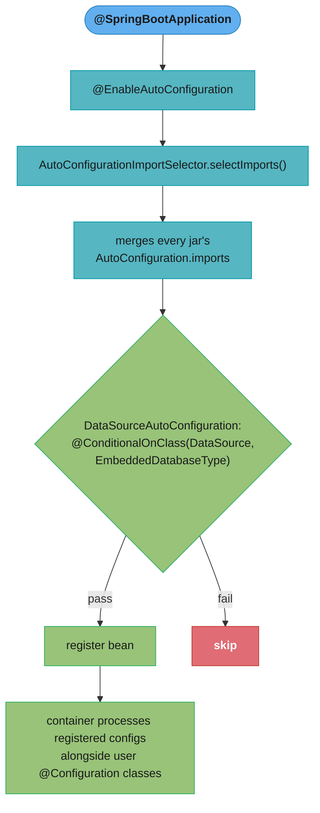
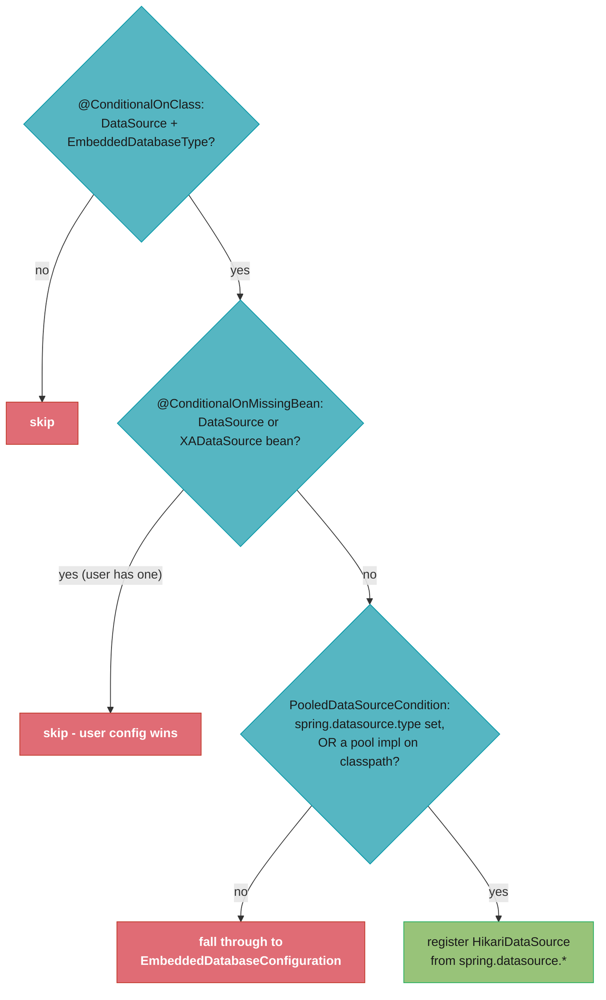
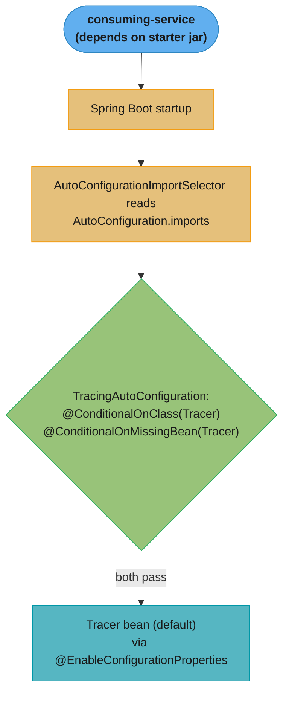

# Spring Boot Auto-Configuration

## 1. Concept Overview

Spring Boot auto-configuration is the mechanism that automatically configures Spring application components based on the JARs present on the classpath, beans already defined, and property values. When you add `spring-boot-starter-data-jpa` to your `pom.xml`, Spring Boot automatically configures `DataSource`, `EntityManagerFactory`, `TransactionManager`, and Spring Data repositories — without a single line of explicit configuration.

Auto-configuration classes are loaded by `@EnableAutoConfiguration` via the `AutoConfigurationImportSelector`, which aggregates configuration class names from every `META-INF/spring/org.springframework.boot.autoconfigure.AutoConfiguration.imports` file on the classpath. Each `spring-boot-<technology>` jar (`spring-boot-jdbc`, `spring-boot-security`, `spring-boot-data-redis`, …) ships its own imports file, so what your application auto-configures is exactly the union of the technology modules you depend on.

---

## 2. Intuition

Auto-configuration is like a smart hotel room that detects your preferences and sets itself up. If it detects you brought a laptop (Hibernate JAR), it sets up a desk and ethernet (DataSource + EntityManagerFactory). If you brought workout clothes (Actuator JAR), it sets up a gym access card (health endpoints). You can override anything — bring your own coffee maker (define your own `DataSource` bean) and the hotel's coffee machine stays off.

**One-line analogy:** Auto-configuration is an opinionated default setup that activates only when needed and backs off when you provide your own configuration.

**Key insight:** Auto-configuration is not magic — it is just `@Configuration` classes with layered `@Conditional` annotations. The `--debug` flag or `/actuator/conditions` endpoint shows exactly which configurations were applied and why others were skipped.

---

## 3. Core Principles

1. **Convention over configuration:** Sensible defaults are applied automatically; you only configure what differs from convention.
2. **Condition-based activation:** Every auto-configuration class has `@Conditional` gates that prevent registration when inappropriate.
3. **User config takes priority:** `@ConditionalOnMissingBean` ensures auto-configuration backs off when user provides their own bean.
4. **Order matters:** `@AutoConfigureAfter` and `@AutoConfigureBefore` control the order auto-configuration classes are processed.
5. **Discoverable via SPI:** Auto-configuration classes are registered in a standard file, not via component scanning — this is intentional to keep starter packages isolated from the application's scan.

---

## 4. Types / Architectures / Strategies

### Where Registration Lives

| Extension point | Registration file | Location |
|-----------------|------------------|---------|
| Auto-configuration classes | `AutoConfiguration.imports` | `META-INF/spring/org.springframework.boot.autoconfigure.AutoConfiguration.imports` |
| Test-slice auto-configurations | `<AutoConfigureXxx FQN>.imports` | `META-INF/spring/org.springframework.boot.<tech>.test.autoconfigure.AutoConfigureXxx.imports` |
| `FailureAnalyzer`, `EnvironmentPostProcessor`, `ApplicationContextInitializer`, `ApplicationListener`, `PropertySourceLoader` | `spring.factories` | `META-INF/spring.factories` |
| Condition metadata for fast filtering | `spring-autoconfigure-metadata.properties` | `META-INF/` (generated by `spring-boot-autoconfigure-processor`) |

`spring.factories` no longer registers auto-configurations — that key was removed — but it is still the live mechanism for every other extension point in the table.

### Condition Evaluation Report Categories

| Category | Meaning |
|----------|---------|
| Positive matches | Conditions passed; bean/configuration registered |
| Negative matches | One or more conditions failed; not registered |
| Exclusions | Explicitly excluded via `exclude` attribute |
| Unconditional classes | No conditions; always registered |

---

## 5. Architecture Diagrams

**Auto-Configuration Loading Flow**



`AutoConfigurationImportSelector` loads every class listed in `AutoConfiguration.imports`, then the container evaluates each one's `@Conditional` gates independently — a single failing condition skips only that configuration class, not the whole import list.

**Condition Layering Example: DataSourceAutoConfiguration**



Each gate runs in sequence; a "yes, so skip" outcome (a user already defined the bean) short-circuits registration just as reliably as a missing dependency does. Note the last gate is `PooledDataSourceCondition`, an `AnyNestedCondition` — not a `@ConditionalOnProperty` on `spring.datasource.url`. With HikariCP on the classpath the pooled branch matches even when no URL is set, so the failure surfaces at bean creation as "Failed to determine a suitable driver class" (rendered by `DataSourceBeanCreationFailureAnalyzer`) rather than as a silently skipped auto-configuration.

---

## 6. How It Works — Detailed Mechanics

### AutoConfigurationImportSelector Internals

```java
// Simplified logic of AutoConfigurationImportSelector
public class AutoConfigurationImportSelector implements DeferredImportSelector {

    @Override
    public String[] selectImports(AnnotationMetadata annotationMetadata) {
        // 1. Load all candidate class names from every AutoConfiguration.imports on the classpath
        List<String> candidates = getCandidateConfigurations(annotationMetadata);

        // 2. Remove duplicates
        candidates = removeDuplicates(candidates);

        // 3. Apply exclusions from @SpringBootApplication(exclude=...) and
        //    spring.autoconfigure.exclude property
        Set<String> exclusions = getExclusions(annotationMetadata);
        candidates.removeAll(exclusions);

        // 4. Filter by conditions (the actual @Conditional evaluation happens later)
        //    Here just returns all non-excluded candidates
        return candidates.toArray(new String[0]);
        // Actual @Conditional evaluation happens in BeanFactory processing
    }
}
```

### Writing a Custom Auto-Configuration Class

```java
// 1. The auto-configuration class
@AutoConfiguration  // implies @Configuration(proxyBeanMethods = false)
@ConditionalOnClass(ObservabilityClient.class)  // only if client JAR present
@ConditionalOnMissingBean(ObservabilityReporter.class)  // don't override user's bean
@AutoConfigureAfter(MetricsAutoConfiguration.class)  // needs MeterRegistry first
@EnableConfigurationProperties(ObservabilityProperties.class)
public class ObservabilityAutoConfiguration {

    @Bean
    @ConditionalOnProperty(
        prefix = "observability",
        name = "enabled",
        havingValue = "true",
        matchIfMissing = true  // enabled by default; set false to disable
    )
    public ObservabilityReporter reporter(ObservabilityProperties props,
                                           MeterRegistry registry) {
        return new ObservabilityReporter(props.getEndpoint(), registry);
    }

    @Bean
    @ConditionalOnMissingBean
    public ObservabilityHealthIndicator healthIndicator(ObservabilityReporter reporter) {
        return new ObservabilityHealthIndicator(reporter);
    }
}

// 2. Properties class
@ConfigurationProperties(prefix = "observability")
public class ObservabilityProperties {
    private boolean enabled = true;
    private String endpoint = "localhost:4317";
    private Duration timeout = Duration.ofSeconds(5);
    // getters, setters
}

// 3. Registration file
// src/main/resources/META-INF/spring/
//   org.springframework.boot.autoconfigure.AutoConfiguration.imports
// Content — one fully-qualified class name per line:
// com.company.observability.ObservabilityAutoConfiguration
```

### Debugging Auto-Configuration

```bash
# Method 1: --debug flag on startup
java -jar app.jar --debug

# Outputs ConditionEvaluationReport like:
# Positive matches:
#    DataSourceAutoConfiguration matched
#       - @ConditionalOnClass found required classes 'javax.sql.DataSource'...
#       - @ConditionalOnMissingBean (types: DataSource) did not find any beans
#
# Negative matches:
#    MongoAutoConfiguration:
#       Did not match:
#          - @ConditionalOnClass did not find required class 'com.mongodb.MongoClient'

# Method 2: Actuator conditions endpoint
# GET /actuator/conditions
# Returns JSON with same information

# Method 3: In tests
@SpringBootTest
class MyTest {
    @Autowired
    private ApplicationContext ctx;

    @Test
    void verifyDataSourceAutoConfigured() {
        assertThat(ctx.getBean(DataSource.class)).isNotNull();
        assertThat(ctx.getBean(DataSource.class)).isInstanceOf(HikariDataSource.class);
    }
}
```

### Excluding Auto-Configuration

```java
// Method 1: @SpringBootApplication exclude attribute (compile-time safe)
@SpringBootApplication(exclude = {
    DataSourceAutoConfiguration.class,
    SecurityAutoConfiguration.class
})
public class MyApplication { }

// Method 2: property (useful when class may not be on classpath)
// application.properties:
// spring.autoconfigure.exclude=\
//   org.springframework.boot.jdbc.autoconfigure.DataSourceAutoConfiguration,\
//   org.springframework.boot.security.autoconfigure.SecurityAutoConfiguration
```

### Boot 3 → 4 Migration

The single biggest change for anyone who excludes auto-configurations by name, or writes
their own: the monolithic `spring-boot-autoconfigure` jar was split into per-technology
`spring-boot-<tech>` modules, and every auto-configuration class moved package with it.

```
Boot 3.x FQN                                                        Boot 4.x FQN
org.springframework.boot.autoconfigure.jdbc.                        org.springframework.boot.jdbc.autoconfigure.
  DataSourceAutoConfiguration                                         DataSourceAutoConfiguration
org.springframework.boot.autoconfigure.security.servlet.            org.springframework.boot.security.autoconfigure.
  SecurityAutoConfiguration                                           SecurityAutoConfiguration
org.springframework.boot.autoconfigure.data.redis.                  org.springframework.boot.data.redis.autoconfigure.
  RedisAutoConfiguration                                              DataRedisAutoConfiguration

Also:
- @MockBean / @SpyBean removed -> @MockitoBean / @MockitoSpyBean (spring-test)
- management.endpoint.<id>.enabled -> management.endpoint.<id>.access
- Jakarta EE 11 baseline: Tomcat 11, Hibernate 7, Jackson 3
```

`spring.autoconfigure.exclude` is a string property with no compile-time check, so a stale
FQN is silently ignored: the auto-configuration you meant to exclude quietly stays on. The
`exclude` attribute of `@SpringBootApplication` takes a `Class<?>`, which is why it is the
safer of the two.

---

## 7. Real-World Examples

**HikariCP auto-configuration:** Adding `spring-boot-starter-jdbc` adds HikariCP to the classpath. `DataSourceAutoConfiguration` detects `DataSource.class` on classpath, no user-defined `DataSource` bean, and `spring.datasource.url` property defined, then auto-creates a `HikariDataSource` with pool size 10 and all HikariCP defaults. Zero `@Bean` methods needed.

**Redis auto-configuration:** `spring-boot-starter-data-redis` triggers `DataRedisAutoConfiguration` (creates `RedisTemplate` and `StringRedisTemplate`) and `DataRedisRepositoriesAutoConfiguration` (creates Redis repository proxies). Override by providing your own `RedisConnectionFactory` bean — auto-configuration backs off.

**Custom starter in a platform team:** A platform team creates `platform-spring-boot-starter` that auto-configures distributed tracing, security policies, and audit logging for every service. Teams add one dependency to `pom.xml` and get compliant observability automatically. Individual services can override specific beans with their own definitions.

---

## 8. Tradeoffs

| Aspect | Auto-Configuration | Manual Configuration |
|--------|-------------------|---------------------|
| Setup time | Near zero | Hours for complex stacks |
| Understanding | Opaque until debugged | Explicit and readable |
| Upgrade safety | May change behavior on version bump | Full control |
| Customization | Via properties or bean override | Anything |
| Spring Boot dependency | Tightly coupled | Can use plain Spring |
| Debuggability | Need --debug or /conditions | Read the code |

---

## 9. When to Use / When NOT to Use

**Use auto-configuration when:**
- Building Spring Boot applications (the standard approach)
- Writing Spring Boot starters for team-wide infrastructure
- Rapid prototyping

**Override auto-configuration when:**
- Default configuration does not match your requirements (define your own bean)
- Auto-configuration conflicts with another library (exclude it)

**Do NOT rely on auto-configuration order** for bean availability — use explicit `@DependsOn` or `@AutoConfigureAfter` if your configuration depends on an auto-configured bean being present.

---

## 10. Common Pitfalls

### Pitfall 1: Defining a Bean That Conflicts with Auto-Configuration

```java
// CONFUSION: defining a DataSource AND expecting auto-config Redis to work
@Configuration
public class AppConfig {
    @Bean
    public DataSource dataSource() { ... }  // overrides auto-config DataSource (good)
}

// Problem: user defines a partial config that doesn't satisfy all conditions,
// but auto-config skips because @ConditionalOnMissingBean sees the partial config.
// Symptom: NullPointerException on beans that depend on the "missing" auto-configured bean.

// RULE: if you define a bean, take full responsibility for it and related dependencies.
// Use @ConditionalOnMissingBean in your own auto-configurations.
```

### Pitfall 2: The imports File Is Not Where the Selector Looks

```java
// BROKEN: file not at correct path in JAR. There is no error and no warning —
// the starter simply auto-configures nothing.
// Wrong: src/main/resources/META-INF/AutoConfiguration.imports (missing spring/ dir)
// Wrong: src/main/resources/META-INF/spring/AutoConfiguration.imports (name truncated)
// Wrong: src/main/resources/spring/org.springframework...imports (missing META-INF/)
// Correct: src/main/resources/META-INF/spring/
//          org.springframework.boot.autoconfigure.AutoConfiguration.imports

// Verify in JAR:
// jar tf my-starter.jar | grep -i META-INF
// Should show: META-INF/spring/org.springframework.boot.autoconfigure.AutoConfiguration.imports
```

### Pitfall 3: @ComponentScan in Starter Package

```java
// BROKEN: starter's @Configuration scans its own packages into user's context
@Configuration
@ComponentScan("com.company.starter")  // BUG: scans starter's internal beans
public class MyStarterAutoConfiguration { }

// This exposes internal beans that should be implementation details.
// User's context gets polluted with starter's private beans.

// FIXED: never use @ComponentScan in auto-configuration classes
// Define all beans explicitly with @Bean methods in the auto-config class.
@AutoConfiguration
public class MyStarterAutoConfiguration {
    @Bean
    @ConditionalOnMissingBean
    public MyFeature myFeature(MyProperties props) {
        return new MyFeatureImpl(props);  // explicit registration, no scanning
    }
}
```

---

## 11. Technologies & Tools

| Component | Role |
|-----------|------|
| `AutoConfigurationImportSelector` | Loads and filters auto-configuration classes |
| `@AutoConfiguration` | Marks an auto-config class; implies `proxyBeanMethods = false` |
| `@ConditionalOnClass` | Condition: specific class on classpath |
| `@ConditionalOnMissingBean` | Condition: no bean of type already defined |
| `@ConditionalOnProperty` | Condition: property has specific value |
| `@AutoConfigureAfter/Before` | Ordering between auto-configurations |
| `spring-boot-autoconfigure-processor` | Generates metadata for IDE autocompletion |
| `ConditionEvaluationReport` | Printable report of all condition outcomes |
| `ApplicationContextRunner` | Test utility for testing auto-configuration |

---

## 12. Interview Questions with Answers

**Q: How does Spring Boot auto-configuration work?**
**Short:** AutoConfigurationImportSelector loads listed classes and registers their beans only when every @Conditional passes.

`@EnableAutoConfiguration` (included via `@SpringBootApplication`) imports `AutoConfigurationImportSelector`, which aggregates every `AutoConfiguration.imports` file on the classpath. The full path in each jar is `META-INF/spring/org.springframework.boot.autoconfigure.AutoConfiguration.imports`. Each listed class is annotated `@AutoConfiguration` — a `@Configuration` with `proxyBeanMethods = false` — carrying `@Conditional` annotations. The container evaluates each condition — if all pass, the beans are registered; if any fail, the entire configuration class is skipped. Users override by defining their own beans (caught by `@ConditionalOnMissingBean`) or excluding via `spring.autoconfigure.exclude`.

**Q: What is the difference between spring.factories and AutoConfiguration.imports?**
**Short:** AutoConfiguration.imports registers auto-configuration classes exclusively, while spring.factories still registers other SPI extension points.

They register different things, and both files are live today. `AutoConfiguration.imports` is a plain list of fully-qualified class names, one per line, read only by `AutoConfigurationImportSelector` — it is the sole registration path for auto-configuration classes. `spring.factories` is a generic key-value properties file keyed by interface name, and it still registers `FailureAnalyzer`, `EnvironmentPostProcessor`, `ApplicationContextInitializer`, `ApplicationListener`, `PropertySourceLoader`, `ConfigDataLoader` and `SpringApplicationRunListener`. Auto-configurations were moved off the `EnableAutoConfiguration` key onto their own dedicated file so Spring Boot can load them more efficiently, and that key no longer works at all.

**Q: Why does @ConditionalOnMissingBean work correctly even though Spring beans are initialized in dependency order?**
**Short:** It checks the bean definition registry during the BeanFactoryPostProcessor phase, before any bean is instantiated.

`@ConditionalOnMissingBean` is evaluated during the `BeanFactoryPostProcessor` phase, after all `BeanDefinition`s are loaded but before any beans are instantiated. It checks the `BeanDefinitionRegistry` for existing definitions (not instances). This means: if you define a `@Bean DataSource` in your `@Configuration` class, the `BeanDefinition` for it exists in the registry when `DataSourceAutoConfiguration` evaluates `@ConditionalOnMissingBean(DataSource.class)` — the condition fails and auto-configuration backs off correctly.

**Q: How would you write a custom Spring Boot starter?**
**Short:** A starter pairs an @AutoConfiguration module registered in AutoConfiguration.imports with a POM that pulls in its dependency.

Four steps: (1) Create an autoconfigure module with `@AutoConfiguration` class containing `@Conditional`-guarded `@Bean` methods and `@ConfigurationProperties` for user-overridable settings. (2) Register the class in `META-INF/spring/org.springframework.boot.autoconfigure.AutoConfiguration.imports`. (3) Do NOT use `@ComponentScan` — register all beans explicitly. (4) Create a starter POM that depends on your autoconfigure module and any required third-party JARs. Users add the starter dependency and get auto-configured behavior immediately.

**Q: How do you debug which auto-configurations are applied and which are skipped?**
**Short:** Running with --debug prints a ConditionEvaluationReport showing every positive and negative condition match.

Start the application with `--debug` flag: `java -jar app.jar --debug`. This prints the `ConditionEvaluationReport` to the console showing positive matches (applied), negative matches (skipped with reasons), and exclusions. Alternatively, expose the `/actuator/conditions` endpoint (require `spring-boot-actuator` on classpath and `management.endpoints.web.exposure.include=conditions`). For unit testing auto-configuration, use `ApplicationContextRunner` from `spring-boot-test` to test specific configurations in isolation.

**Q: What is @AutoConfigureAfter and why does order matter?**
**Short:** @AutoConfigureAfter guarantees a dependency's auto-configuration runs first so its beans exist when conditions evaluate.

`@AutoConfigureAfter(OtherAutoConfig.class)` ensures `OtherAutoConfig` is processed before the current class. This matters when your auto-configuration needs beans from another auto-configuration to be available. For example, `JdbcTemplateAutoConfiguration` is `@AutoConfigureAfter(DataSourceAutoConfiguration.class)` because it needs the `DataSource` bean. Without ordering, `@ConditionalOnBean(DataSource.class)` in `JdbcTemplateAutoConfiguration` might evaluate before `DataSourceAutoConfiguration` runs, failing the condition incorrectly.

**Q: What happens when you exclude an auto-configuration class?**
**Short:** Excluding a class removes it from the import list entirely, so its beans never register regardless of conditions.

The class name is added to an exclusion set checked by `AutoConfigurationImportSelector`. The class is removed from the import list before any condition evaluation. This is a hard exclusion — even if all conditions would have passed, the class is never imported and its beans are never registered. This is useful when: you want to completely replace auto-configuration with your own, the auto-configuration conflicts with another library, or you want to disable a feature entirely (like Spring Security auto-config in tests).

**Q: What is @ConditionalOnProperty and when is matchIfMissing important?**
**Short:** matchIfMissing controls whether an absent property counts as a match, and it defaults to false.

`@ConditionalOnProperty` registers a bean only when a named property holds the expected value. With `@ConditionalOnProperty(name="feature.enabled", havingValue="true", matchIfMissing=false)` the bean appears only when the property is literally set to "true"; if the property is absent it is NOT registered, because `matchIfMissing` defaults to false. Setting `matchIfMissing=true` inverts this: the bean is registered when the property is missing (treat "absent" as "true"). Use `matchIfMissing=true` for features that should be on by default and disabled by setting the property to "false".

**Q: How does spring-boot-autoconfigure-processor improve performance?**
**Short:** A compile-time processor generates metadata that lets Spring Boot skip loading classes whose conditions obviously fail.

The processor runs at compile time and generates `META-INF/spring-autoconfigure-metadata.properties`. This file lists the conditions for each auto-configuration class (class names for `@ConditionalOnClass`, property names for `@ConditionalOnProperty`). Spring Boot reads this metadata at startup and filters out auto-configuration classes whose conditions obviously fail (e.g., required class not on classpath) WITHOUT loading and processing the configuration class. This makes startup faster because fewer classes are loaded and parsed.

**Q: What is the ApplicationContextRunner and how is it used for testing?**
**Short:** ApplicationContextRunner builds a minimal context to test one auto-configuration in isolation without a full application.

`ApplicationContextRunner` is a test utility from `spring-boot-test` that creates a minimal `ApplicationContext` for testing auto-configuration. It does not start a full Spring Boot application — just evaluates specific configurations in isolation. Example: `new ApplicationContextRunner().withConfiguration(AutoConfigurations.of(MyAutoConfig.class)).withPropertyValues("my.property=value").run(context -> { assertThat(context).hasSingleBean(MyBean.class); })`. This is the recommended way to test auto-configuration without requiring `@SpringBootTest`.

**Q: What is `@ConditionalOnBean` and how does it differ from `@ConditionalOnMissingBean`, and which ordering trap can affect both?**
**Short:** @ConditionalOnBean is ordering-sensitive and needs @AutoConfigureAfter, unlike @ConditionalOnMissingBean.

`@ConditionalOnBean(DataSource.class)` registers the bean only if a `DataSource` bean already exists. `@ConditionalOnMissingBean(DataSource.class)` registers the bean only if a `DataSource` does NOT exist — this is the "sensible default / override" pattern. The ordering trap: conditions are evaluated in the order auto-configuration classes are processed. If `JdbcTemplateAutoConfiguration` evaluates `@ConditionalOnBean(DataSource.class)` before `DataSourceAutoConfiguration` registers the `DataSource`, the condition incorrectly fails. Fix: declare `@AutoConfigureAfter(DataSourceAutoConfiguration.class)` to guarantee `DataSource` is registered first. Key principle: `@ConditionalOnBean` is inherently ordering-sensitive; `@ConditionalOnMissingBean` is less so (it only needs the bean definition to be absent at evaluation time).

**Q: What is a Spring Boot "failure analyser" and how do you write a custom one?**
**Short:** A failure analyser intercepts a startup exception and prints a human-readable cause and action instead of a raw stack trace.

A failure analyser is a component that intercepts a startup failure, diagnoses the root cause, and displays a human-readable message with a suggested action — replacing a raw stack trace with a concise explanation. Examples: `PortInUseFailureAnalyzer` extends `AbstractFailureAnalyzer<PortInUseException>` and prints "Web server failed to start. Port 8080 was already in use." plus the action "Identify and stop the process that's listening on port 8080". To write one: implement `AbstractFailureAnalyzer<T extends Throwable>`, override `analyze(Throwable rootFailure, T cause)`, return a `FailureAnalysis` with a description and action, and register it in `META-INF/spring.factories` under `org.springframework.boot.diagnostics.FailureAnalyzer`. That file is the only registration path — analysers run when startup has already failed, so a `@Component` in the application context is never consulted. If your analyser needs context, declare a constructor taking `Environment` and/or `BeanFactory`: `SpringFactoriesLoader` resolves those two argument types when it instantiates the analyser, exactly as `InvalidConfigurationPropertyValueFailureAnalyzer` does.

**Q: What does `@ImportAutoConfiguration` do and when is it used instead of `@EnableAutoConfiguration`?**
**Short:** @ImportAutoConfiguration imports a named subset of auto-configurations explicitly, used by narrow test slices.

`@ImportAutoConfiguration` imports specific auto-configuration classes explicitly, bypassing the full autoconfiguration discovery mechanism. It is used in test slices (`@WebMvcTest`, `@DataJpaTest`) to import only the subset of auto-configurations relevant to the tested layer — avoiding loading the entire application context for a narrow test. The subset is not hard-coded on the slice annotation: each `@AutoConfigureXxx` meta-annotation names a companion imports file, so `@DataJpaTest` (via `@AutoConfigureDataJpa`) resolves `META-INF/spring/org.springframework.boot.data.jpa.test.autoconfigure.AutoConfigureDataJpa.imports`, whose two entries are `DataJpaRepositoriesAutoConfiguration` and `HibernateJpaAutoConfiguration`. Security, web and messaging auto-configurations are never loaded. Use `@ImportAutoConfiguration` in your own test slices or when you need a specific subset of auto-configurations for an integration test.

**Q: How does a GraalVM native image affect auto-configuration, and what is AOT processing?**
**Short:** AOT processing resolves auto-configuration conditions at build time, generating the beans and hints native-image needs upfront.

Spring Boot runs an AOT (Ahead-of-Time) processing phase at build time that resolves auto-configuration before the image is ever produced. AOT processes the `ApplicationContext` at build time: evaluates conditions, determines which beans will be created for the active profile, and generates Java source code plus reflection/proxy/resource hints that GraalVM's `native-image` tool needs. This means auto-configuration conditions are resolved at build time, not at runtime — the native image knows exactly which beans it will create. The practical payoff is a startup measured in tens of milliseconds rather than seconds, and a much smaller resident set, paid for with a long build and a lower peak throughput ceiling than the JIT reaches. A profile that was not active during AOT processing cannot be activated at runtime, because its beans were never generated. For your custom starter: if it uses reflection or dynamic proxies, you must provide `RuntimeHintsRegistrar` or `@RegisterReflectionForBinding` annotations to tell the AOT phase to preserve those types.

**Q: What is the difference between `@ConfigurationProperties` and `@Value`, and when should you choose each?**
**Short:** @ConfigurationProperties binds a whole prefix to a validated typed POJO, while @Value injects a single raw property.

`@Value` injects one property at a time, while `@ConfigurationProperties` binds a whole prefix to a typed POJO. `@Value("${my.property}")` is simple but has downsides: a typo in the property name fails silently (evaluates to the literal `${...}` or throws on startup), no type conversion for complex types, no IDE autocompletion, and no validation. `@ConfigurationProperties(prefix="my")` binds an entire prefix hierarchy to a typed POJO with: relaxed binding (camelCase, kebab-case, snake_case, env var all work), JSR-303 validation with `@Validated`, IDE autocompletion via `spring-configuration-metadata.json`, and structured documentation. Choose `@ConfigurationProperties` for any group of related properties (two or more); reserve `@Value` for single simple values that don't logically belong to a group or for SpEL expressions.

---

## 13. Best Practices

1. **Use `@ConditionalOnMissingBean` generously** in auto-configuration to give users full override capability.
2. **Never use `@ComponentScan` in auto-configuration** — define beans explicitly with `@Bean`.
3. **Use `@AutoConfigureAfter`/`@AutoConfigureBefore`** when your config depends on another auto-config's beans.
4. **Add spring-boot-autoconfigure-processor** to your starter's compile dependencies for metadata generation.
5. **Use `@ConfigurationProperties` with metadata** (`spring-boot-configuration-processor`) for IDE autocompletion and validation.
6. **Test auto-configuration with `ApplicationContextRunner`** — faster than full `@SpringBootTest`.
7. **Provide sensible defaults** with `matchIfMissing=true` so features work out of the box.
8. **Document which beans are auto-configured** and how to override them in your starter's README.
9. **Keep auto-configuration classes small and focused** — one per concern (data source, metrics, security).
10. **Use the `--debug` flag** to verify your auto-configuration is applying correctly during development.

---

## 14. Case Study

### Scenario: Company-Wide Distributed Tracing Starter

A platform team ships `company-tracing-spring-boot-starter` (Spring Boot 4.1 / Java 25) so all 80+ internal services get distributed tracing by adding one Maven dependency. Requirements:

- Auto-configure a `Tracer` bean only when the tracing library is on the classpath
- Back off entirely if a service defines its own `Tracer` (advanced teams customize)
- Bind configuration via `@EnableConfigurationProperties(TracingProperties.class)`
- Register via `AutoConfiguration.imports`, in a package no consumer component-scans
- Adoption goal: zero code in consuming services; opt-out via a property

Two recurring failures drove the design hardening: double bean registration when the autoconfig class was accidentally component-scanned, and `@ConditionalOnMissingBean` not backing off because of bean-definition ordering.

### Architecture Overview



`TracingAutoConfiguration` backs off the moment either condition fails — no tracing library on the classpath, or the consuming service already defines its own `Tracer` bean.

### Implementation

The autoconfiguration class lives in a package that is NOT component-scanned by consumers, and is registered via the imports file.

```java
@AutoConfiguration
@ConditionalOnClass(Tracer.class)                      // backs off if lib missing
@EnableConfigurationProperties(TracingProperties.class)
public class TracingAutoConfiguration {

    @Bean
    @ConditionalOnMissingBean                          // user's own Tracer wins
    @ConditionalOnProperty(prefix = "company.tracing",
                           name = "enabled", havingValue = "true", matchIfMissing = true)
    public Tracer tracer(TracingProperties props) {
        return Tracer.builder()
                     .serviceName(props.getServiceName())
                     .samplingRate(props.getSamplingRate())
                     .endpoint(props.getCollectorEndpoint())
                     .build();
    }
}

@ConfigurationProperties(prefix = "company.tracing")
public class TracingProperties {
    private String serviceName = "unknown";
    private double samplingRate = 0.1;
    private String collectorEndpoint = "http://otel-collector:4317";
    // getters/setters
}
```

Registration is a plain text imports file, one fully-qualified class name per line.

```
#   src/main/resources/META-INF/spring/
#     org.springframework.boot.autoconfigure.AutoConfiguration.imports
com.company.tracing.autoconfigure.TracingAutoConfiguration
```

Debugging which conditions matched uses the `--debug` flag's condition evaluation report.

```bash
java -jar service.jar --debug 2>&1 | grep -A4 "TracingAutoConfiguration"
# TracingAutoConfiguration matched:
#   - @ConditionalOnClass found required class 'com.company.tracing.Tracer'
#   - @ConditionalOnMissingBean (Tracer) did not find any beans
```

### Metrics

| Metric | Before | After |
|--------|--------|-------|
| Services with tracing | 12 (manual) | 80+ (automatic) |
| Code per service to enable | ~40 lines | 0 (just the dependency) |
| Double-registration startup failures | recurring | 0 |
| Time to onboard a new service | ~half day | minutes |

### Common Pitfalls

**Pitfall 1 — autoconfig class in a component-scanned package causes double registration.**

```java
// BROKEN: placed under com.company.app... so consumers' @ComponentScan picks it up,
// AND it's in AutoConfiguration.imports -> bean defined twice / ordering chaos
package com.company.app.config;
@AutoConfiguration
public class TracingAutoConfiguration { ... }
```

```java
// FIX: keep autoconfig in a dedicated package outside any consumer scan base package
package com.company.tracing.autoconfigure;   // only reached via AutoConfiguration.imports
@AutoConfiguration
public class TracingAutoConfiguration { ... }
```

**Pitfall 2 — `@ConditionalOnMissingBean` does not back off against ANOTHER auto-configuration.**

```java
// BROKEN: the platform's Tracer comes from another starter's autoconfig, which may be
// processed after this one -> the condition sees no Tracer definition and both get created.
// (Against a plain user @Configuration this cannot happen: autoconfigurations are
// deferred imports, always processed after every user @Configuration class.)
@AutoConfiguration   // no ordering hint
public class TracingAutoConfiguration {
    @Bean @ConditionalOnMissingBean public Tracer tracer() { ... }
}
```

```java
// FIX: name the other AUTO-CONFIGURATION in after/afterName so it is guaranteed to have
// registered its Tracer before this condition is evaluated. after() only accepts
// auto-configuration classes -- pointing it at a user @Configuration does nothing.
@AutoConfiguration(after = ObservabilityAutoConfiguration.class)
public class TracingAutoConfiguration {
    @Bean @ConditionalOnMissingBean public Tracer tracer() { ... }
}
```

**Pitfall 3 — using `@Configuration` instead of `@AutoConfiguration`.**

```java
// BROKEN: @Configuration listed in imports is treated as a user config, losing
// autoconfiguration ordering and @AutoConfigureBefore/After semantics
@Configuration
public class TracingAutoConfiguration { ... }
```

```java
// FIX: autoconfiguration classes must use @AutoConfiguration
@AutoConfiguration
public class TracingAutoConfiguration { ... }
```

### Interview Discussion Points

**What changed for a starter author in Boot 4, and what breaks silently?** The monolithic `spring-boot-autoconfigure` jar was split into per-technology `spring-boot-<tech>` modules and every auto-configuration class moved package — `org.springframework.boot.autoconfigure.jdbc.DataSourceAutoConfiguration` is now `org.springframework.boot.jdbc.autoconfigure.DataSourceAutoConfiguration`. Anything that names an auto-configuration as a string breaks quietly: `spring.autoconfigure.exclude`, `@AutoConfiguration(afterName = ...)`, and `@ConditionalOnMissingBean(type = ...)` all take FQNs that are simply skipped when the class is absent. The `exclude` attribute of `@SpringBootApplication` takes a `Class<?>` and so fails to compile instead — prefer it.

**What is the role of `@ConditionalOnClass` and `@ConditionalOnMissingBean` in a starter?** `@ConditionalOnClass` makes the autoconfiguration apply only when a required type is on the classpath, so the starter degrades gracefully if the underlying library is absent. `@ConditionalOnMissingBean` makes the default bean back off when the consumer has defined their own, implementing the "sensible defaults, fully overridable" contract that defines good Boot starters.

**Why must autoconfiguration classes live outside the consumer's component-scan path?** If the class sits under the application's base package, `@ComponentScan` registers it as a normal `@Configuration` in addition to the `AutoConfiguration.imports` mechanism, producing duplicate bean definitions and breaking the conditional ordering. Keeping it in a separate package ensures it is only loaded through the autoconfiguration import selector, after user configuration.

**Why might `@ConditionalOnMissingBean` fail to back off, and how do you fix it?** Against a plain user `@Configuration` it never fails: auto-configurations are deferred imports, processed after every user configuration class, so the user's bean definition is always in the registry by the time the condition runs. It fails between two auto-configurations, where relative order is undefined unless declared — fix it with `@AutoConfiguration(after = OtherAutoConfiguration.class)` or `afterName` when the other class may be absent from the classpath. It also fails when the `@Bean` method's declared return type is broader than the bean the condition is meant to detect, since matching is by type against the definition, not by instantiating anything.

**How do you debug whether an autoconfiguration was applied?** Run with `--debug` (or set `debug=true`) to print the condition evaluation report, which lists positive matches (with the satisfied conditions) and negative matches (with the reason a class was skipped). It immediately tells you whether the class was even discovered (registration file present), and which `@ConditionalOn*` gate failed.

**How do `@EnableConfigurationProperties` and `@ConfigurationProperties` cooperate in a starter?** `@ConfigurationProperties(prefix="company.tracing")` defines a typed binding target, and `@EnableConfigurationProperties(TracingProperties.class)` registers and binds it within the autoconfiguration without requiring the consumer to scan or annotate anything. Consumers then tune behavior purely through `application.yml` keys under that prefix, with relaxed binding and validation support.

---

## Related / See Also

- [Spring Boot Configuration](../spring_boot_configuration/spring_boot_configuration.md) — @ConfigurationProperties
- [Spring Boot Actuator](../spring_boot_actuator/spring_boot_actuator.md) — auto-configured endpoints
- [Dependency Injection](../dependency_injection/dependency_injection.md) — auto-wired beans
