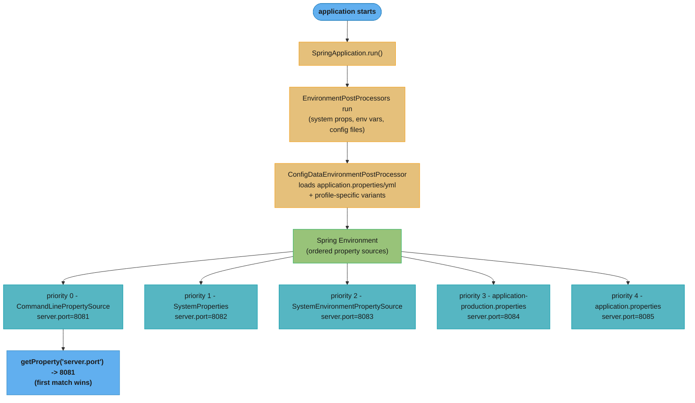
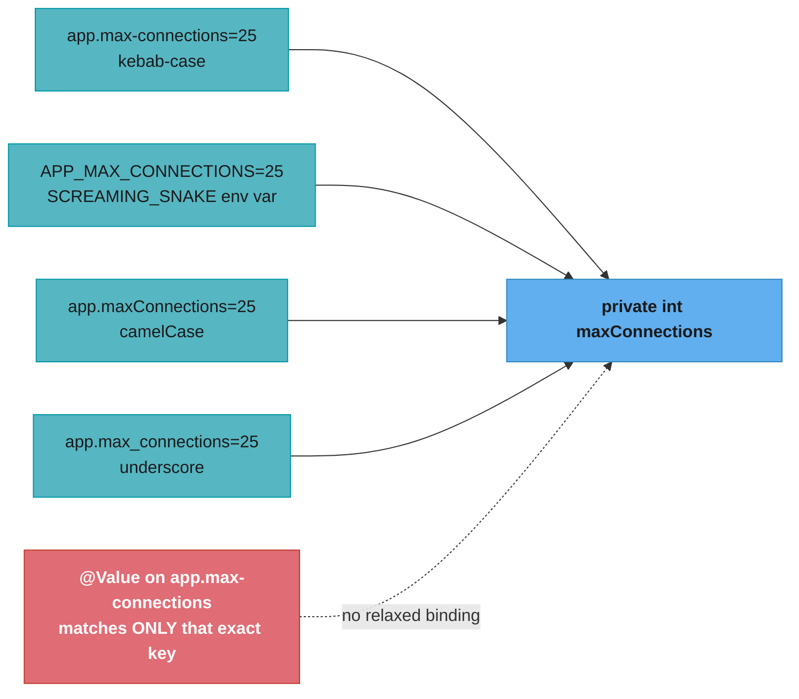
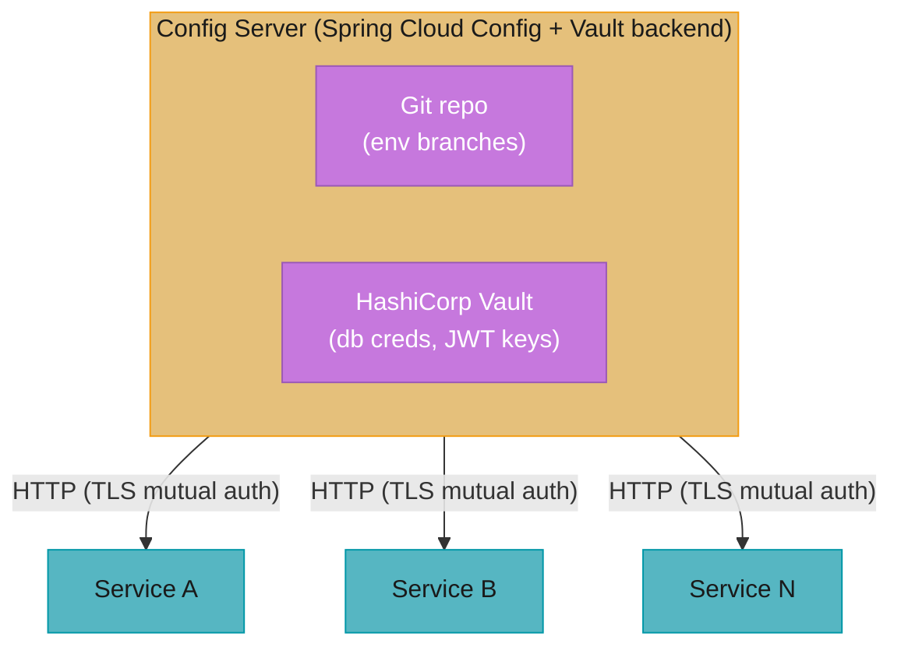

# Spring Boot Configuration

## 1. Concept Overview

Spring Boot's configuration system provides a unified, hierarchical way to externalize application settings. It supports properties files, YAML files, environment variables, command-line arguments, and remote config servers — all merged into a single `Environment` with a well-defined priority order. `@ConfigurationProperties` provides type-safe, validated binding of configuration to Java classes with IDE support, relaxed binding, and structured documentation.

---

## 2. Intuition

Think of Spring Boot's configuration as a layered cake. The bottom layers are defaults baked in (application.properties in the JAR). Each upper layer can override lower layers: profile-specific files override base files; environment variables override files; command-line arguments override everything. The topmost layer always wins.

**One-line analogy:** Spring Boot configuration is a priority-ordered stack where each level overrides everything below it — you only configure what differs from the layer beneath.

**Key insight:** Property source order matters enormously in production. A common production gotcha: a developer sets a property in `application.properties` but the deployment team sets the same property via an OS environment variable. The env var wins — the developer's value is silently overridden.

---

## 3. Core Principles

1. **Priority ordering:** Higher-priority sources override lower-priority ones. Command-line args beat env vars beat properties files.
2. **Relaxed binding:** `app.max-connections`, `APP_MAX_CONNECTIONS`, `app.maxConnections` all bind to the same Java field.
3. **Profile-specific overrides:** `application-{profile}.properties` overrides `application.properties` when the profile is active.
4. **@ConfigurationProperties over @Value:** For any group of related properties, `@ConfigurationProperties` provides type safety, validation, metadata, and relaxed binding.
5. **Fail fast on missing required config:** Use `@Validated` + `@NotNull` on `@ConfigurationProperties` to catch misconfiguration at startup.

---

## 4. Types / Architectures / Strategies

### Property Source Priority (Highest to Lowest)

| Priority | Source |
|----------|--------|
| 1 (highest) | Command-line arguments (`--server.port=8081`) |
| 2 | SPRING_APPLICATION_JSON (inline JSON in env var) |
| 3 | ServletConfig init parameters |
| 4 | ServletContext init parameters |
| 5 | JNDI attributes from `java:comp/env` |
| 6 | Java System properties (`-Dserver.port=8081`) |
| 7 | OS environment variables (`SERVER_PORT=8081`) |
| 8 | Profile-specific files outside JAR (`application-{profile}.properties`) |
| 9 | Profile-specific files inside JAR |
| 10 | `application.properties` outside JAR |
| 11 | `application.properties` inside JAR |
| 12 | `@PropertySource` on `@Configuration` classes |
| 13 | Default properties (`SpringApplication.setDefaultProperties`) |

### @ConfigurationProperties vs @Value

| Feature | `@ConfigurationProperties` | `@Value` |
|---------|---------------------------|---------|
| Type safety | Full (compile-time binding) | No (String expression) |
| Relaxed binding | Yes | No |
| Validation (`@Validated`) | Yes | No |
| IDE autocompletion | Yes (with metadata processor) | No |
| Complex types (Duration, DataSize) | Yes | Limited |
| Lists/Maps | Yes | Limited |
| Re-binding on refresh | Yes (with `@RefreshScope`) | Yes (with `@RefreshScope`) |
| Default values | Via Java field initialization | In expression `${key:default}` |

---

## 5. Architecture Diagrams

**Property Resolution Flow**



Spring Boot merges every property source into one ordered `Environment`; `getProperty()` walks the list top-down and returns the first source that defines the key, so command-line args always beat env vars, which always beat packaged files.

**@ConfigurationProperties Relaxed Binding**



Relaxed binding lets four different naming conventions all resolve to the same `@ConfigurationProperties` field — `@Value` has no such fallback and only matches the literal key it names.

---

## 6. How It Works — Detailed Mechanics

### @ConfigurationProperties — Type-Safe Binding

```java
// Properties class
@ConfigurationProperties(prefix = "app.database")
@Validated  // enables JSR-303 validation
public class DatabaseProperties {
    @NotEmpty
    private String url;

    @NotEmpty
    private String username;

    @Min(1) @Max(100)
    private int poolSize = 10;  // default value

    private Duration connectionTimeout = Duration.ofSeconds(30);  // Duration binding

    @DataSizeUnit(DataUnit.MEGABYTES)
    private DataSize maxMemory = DataSize.ofMegabytes(512);  // DataSize binding

    private List<String> allowedHosts = new ArrayList<>();

    private Map<String, String> connectionProperties = new LinkedHashMap<>();

    // Getters and setters required (or use @ConstructorBinding for immutable)
}

// Registration (two ways)
// Way 1: @EnableConfigurationProperties
@Configuration
@EnableConfigurationProperties(DatabaseProperties.class)
public class AppConfig { }

// Way 2: @ConfigurationPropertiesScan (Spring Boot 2.2+)
@SpringBootApplication
@ConfigurationPropertiesScan  // scans for @ConfigurationProperties in current package
public class MyApplication { }

// application.properties:
# app.database.url=jdbc:postgresql://localhost:5432/mydb
# app.database.username=app_user
# app.database.pool-size=25
# app.database.connection-timeout=10s
# app.database.max-memory=1GB
# app.database.allowed-hosts[0]=host1
# app.database.allowed-hosts[1]=host2
# app.database.connection-properties.ssl=true
# app.database.connection-properties.sslMode=verify-full
```

### Immutable @ConfigurationProperties with @ConstructorBinding

```java
// Spring Boot 2.2+: immutable properties via constructor binding
@ConfigurationProperties(prefix = "app.server")
@ConstructorBinding  // Spring Boot 2.x (optional in Boot 3.x if single constructor)
public class ServerProperties {
    private final int port;
    private final String host;
    private final Duration readTimeout;

    public ServerProperties(int port, String host, Duration readTimeout) {
        this.port = port;
        this.host = host;
        this.readTimeout = readTimeout;
    }

    // Only getters — no setters (immutable)
    public int getPort() { return port; }
    public String getHost() { return host; }
    public Duration getReadTimeout() { return readTimeout; }
}
```

### YAML Configuration

```yaml
# application.yml
spring:
  datasource:
    url: jdbc:postgresql://localhost:5432/mydb
    username: app_user
    hikari:
      maximum-pool-size: 25
      connection-timeout: 30000

app:
  database:
    allowed-hosts:
      - host1.example.com
      - host2.example.com
    connection-properties:
      ssl: "true"
      sslMode: verify-full

---
# Multi-document YAML — next document only active when profile matches
spring:
  config:
    activate:
      on-profile: production
  datasource:
    url: jdbc:postgresql://prod-db.internal:5432/mydb
```

### Profile-Specific Configuration

```yaml
# application.yml (base)
server:
  port: 8080
spring:
  datasource:
    url: jdbc:h2:mem:testdb

---
# Only active in 'production' profile
spring:
  config:
    activate:
      on-profile: production
  datasource:
    url: jdbc:postgresql://prod-db:5432/mydb
server:
  port: 80
```

```properties
# application.properties (base)
server.port=8080

# application-production.properties (overrides base when production profile active)
server.port=80
spring.datasource.url=jdbc:postgresql://prod-db:5432/mydb

# application-test.properties
spring.datasource.url=jdbc:h2:mem:testdb
```

### spring.config.import — Importing Additional Config

```properties
# application.properties
spring.config.import=optional:file:./config/extra.properties,\
                     optional:classpath:additional.properties,\
                     configserver:  # imports from Spring Cloud Config Server

# Kubernetes: import from config tree (mounted ConfigMap/Secret)
spring.config.import=optional:configtree:/etc/config/
# Files in /etc/config/ become properties: filename=filecontents
```

### EnvironmentPostProcessor — Programmatic Property Sources

```java
// Add custom property source before application starts
public class VaultEnvironmentPostProcessor implements EnvironmentPostProcessor {
    @Override
    public void postProcessEnvironment(ConfigurableEnvironment environment,
                                        SpringApplication application) {
        // Load secrets from Vault
        Map<String, Object> secrets = vaultClient.readSecrets("secret/myapp");
        MapPropertySource source = new MapPropertySource("vault", secrets);
        // Add with highest priority (first in list)
        environment.getPropertySources().addFirst(source);
    }
}

// Registration in META-INF/spring.factories:
// org.springframework.boot.env.EnvironmentPostProcessor=\
//   com.example.VaultEnvironmentPostProcessor
```

---

## 7. Real-World Examples

**Kubernetes deployment:** `SERVER_PORT`, `SPRING_DATASOURCE_URL`, and `SPRING_DATASOURCE_PASSWORD` are set as Kubernetes `env:` vars or `envFrom:` from a Secret. OS environment variables (priority 7) override the packaged `application.properties` (priority 11). The same JAR runs in dev (H2 database from properties) and production (PostgreSQL from env vars) with zero code change.

**Blue-green deployment:** `spring.config.import=configserver:` pulls configuration from Spring Cloud Config Server. Updating the Config Server and calling `/actuator/refresh` (or broadcasting via Spring Cloud Bus) live-reloads `@RefreshScope` beans without restarting the application.

**Feature flags:** `app.feature.new-checkout-flow.enabled=false` in `application.properties`. Overridden to `true` via environment variable during canary rollout. Overridden back to `false` via command-line argument during emergency rollback. All three override mechanisms work without code changes.

---

## 8. Tradeoffs

| Approach | Type Safety | IDE Support | Refresh | Complexity |
|----------|-------------|-------------|---------|------------|
| `@Value` | Low | Limited | With `@RefreshScope` | Low |
| `@ConfigurationProperties` | High | Excellent | With `@RefreshScope` | Medium |
| Programmatic `Environment` | None | None | Always current | Low |
| Spring Cloud Config | High (via CP) | Excellent | Push-based | High |
| Vault | High | Limited | Auto-renewal | High |

---

## 9. When to Use / When NOT to Use

**Use `@ConfigurationProperties` when:**
- You have 3+ related properties (database config, email config, API client config)
- You need validation, complex types (Duration, DataSize), or nested objects
- You want IDE autocompletion and documentation

**Use `@Value` when:**
- You need exactly one property in a class
- The value is a SpEL expression or system property

**Use environment variables when:**
- Setting secrets (passwords, API keys) — never put secrets in application.properties
- Kubernetes/Docker deployments
- Values that differ per environment

**Do NOT:**
- Put secrets in `application.properties` committed to source control
- Use `@Value` for complex/nested configuration
- Use YAML with `@PropertySource` (not supported — only `.properties` files)

---

## 10. Common Pitfalls

### Pitfall 1: @Value with YAML List (Does Not Work)

```yaml
# application.yml
app:
  allowed-hosts:
    - host1
    - host2
```

```java
// BROKEN: @Value cannot bind YAML lists
@Value("${app.allowed-hosts}")
private List<String> allowedHosts;  // injection fails or gets "[host1, host2]" as string

// FIXED: use @ConfigurationProperties
@ConfigurationProperties(prefix = "app")
public class AppProperties {
    private List<String> allowedHosts;  // properly bound as List<String>
}

// OR for @Value: use comma-separated property value (not YAML list):
// application.properties: app.allowed-hosts=host1,host2
@Value("${app.allowed-hosts}")
private List<String> allowedHosts;  // Spring auto-splits on comma
```

### Pitfall 2: @ConfigurationProperties Without Validation Failing Silently

```java
// BROKEN: invalid value accepted silently
@ConfigurationProperties(prefix = "app")
public class AppProperties {
    private int poolSize = 10;  // no validation
    // poolSize=-5 is accepted — no error until first DB connection attempt
}

// FIXED: add @Validated and constraints
@ConfigurationProperties(prefix = "app")
@Validated
public class AppProperties {
    @Min(1) @Max(100)
    private int poolSize = 10;
    // poolSize=-5 -> BindValidationException at startup with clear message
}
```

### Pitfall 3: @PropertySource with YAML (Unsupported)

```java
// BROKEN: @PropertySource does not support YAML files
@Configuration
@PropertySource("classpath:custom.yml")  // YAML not supported here!
public class AppConfig { }
// No error thrown — file silently ignored

// FIXED: use .properties file with @PropertySource
@PropertySource("classpath:custom.properties")

// OR: use spring.config.import in application.properties
// spring.config.import=classpath:custom.yml  (Boot 2.4+ supports YAML here)
```

---

## 11. Technologies & Tools

| Component | Role |
|-----------|------|
| `ConfigDataEnvironmentPostProcessor` | Loads `application.properties` / YAML |
| `@ConfigurationProperties` | Type-safe property binding |
| `@ConstructorBinding` | Immutable `@ConfigurationProperties` (Spring Boot 2.x) |
| `@Validated` | JSR-303 validation on `@ConfigurationProperties` |
| `spring-boot-configuration-processor` | Generates metadata for IDE autocompletion |
| `EnvironmentPostProcessor` | Programmatic property source addition |
| `spring.config.import` | Import additional config files or Config Server |
| `RelaxedPropertyResolver` | Handles relaxed binding lookups |
| `/actuator/env` | Shows resolved property values at runtime |

---

## 12. Interview Questions with Answers

**Q: What is the property source priority order in Spring Boot?**
From highest to lowest: command-line arguments, SPRING_APPLICATION_JSON env var, servlet init params, JNDI, Java system properties (-D flags), OS environment variables, profile-specific config files outside JAR, profile-specific files inside JAR, base application.properties outside JAR, base application.properties inside JAR, @PropertySource annotations, default properties. Command-line args win, meaning `--spring.datasource.password=...` overrides everything else. OS environment variables override packaged config files, which is the standard pattern for Kubernetes secrets.

**Q: What is relaxed binding and how does it help with Kubernetes secrets?**
Relaxed binding maps multiple property name formats to the same Java field. `maxConnections`, `max-connections`, `max_connections`, and `MAX_CONNECTIONS` all bind to a Java field named `maxConnections`. This is critical for Kubernetes: Kubernetes Secret env vars must use uppercase and underscores (`SPRING_DATASOURCE_PASSWORD`), but Java code uses camelCase (`password`) under prefix `spring.datasource`. Relaxed binding handles the translation automatically. `@Value` does NOT support relaxed binding — only `@ConfigurationProperties`.

**Q: What is the difference between profile-specific files inside and outside the JAR?**
Profile-specific files outside the JAR (filesystem, current directory) have higher priority than those inside the JAR. This allows operations teams to place an `application-production.properties` file alongside the JAR to override packaged defaults. Spring Boot checks `./config/`, `./`, then `classpath:/config/`, then `classpath:/` in order. The convention enables the same JAR to be configured differently per environment without rebuilding.

**Q: How does @ConstructorBinding work and why is it preferred for immutable classes?**
`@ConstructorBinding` (Spring Boot 2.x) or automatic detection of single constructor (Spring Boot 3.x) tells Spring to bind properties via constructor parameters instead of setters. This enables `final` fields — the bound object is immutable after creation. Immutable configuration is safer: no code can accidentally modify configuration post-initialization, and the object can be safely shared across threads. In Spring Boot 3.x, if `@ConfigurationProperties` class has only one constructor, `@ConstructorBinding` is implicit.

**Q: What is spring.config.import and how does it replace bootstrap.yml?**
`spring.config.import` (Spring Boot 2.4+) is a property that specifies additional configuration files or sources to import. It supports file paths, classpath resources, and protocol handlers like `configserver:` (Spring Cloud Config) and `vault:` (Vault). Before 2.4, Spring Cloud Config required a separate `bootstrap.yml` file loaded by a bootstrap ApplicationContext. `spring.config.import=configserver:` replaces this, importing Config Server properties into the main context with proper priority ordering. It also supports `optional:` prefix to silently skip missing imports.

**Q: How does @ConfigurationProperties validation work?**
Add `@Validated` to the `@ConfigurationProperties` class and JSR-303 annotations (`@NotNull`, `@Min`, `@Max`, `@NotEmpty`, `@Pattern`) to fields. Spring Boot runs Bean Validation on bound properties during context startup. A validation failure throws `BindValidationException` with the full list of constraint violations, preventing the application from starting with invalid configuration. This is the correct "fail fast" behavior for misconfiguration. Without `@Validated`, invalid values like `poolSize=-5` or `url=null` are silently accepted and cause failures much later.

**Q: Can YAML files be used with @PropertySource?**
No. `@PropertySource` only supports `.properties` files by default. It uses `PropertiesPropertySourceLoader` which parses key=value format. YAML requires `YamlPropertySourceLoader`. You can register a custom `PropertySourceFactory` on `@PropertySource` to handle YAML: `@PropertySource(value="classpath:extra.yml", factory=YamlPropertySourceFactory.class)`. Alternatively, use `spring.config.import=classpath:extra.yml` (Boot 2.4+), which uses the full config loading pipeline supporting YAML natively.

**Q: What is the @ConfigurationProperties metadata processor and why should you use it?**
Add `spring-boot-configuration-processor` to build dependencies (optional compile scope). It runs at compile time and generates `META-INF/spring-configuration-metadata.json` describing all `@ConfigurationProperties` classes. IDE plugins (IntelliJ, Eclipse) read this metadata to provide: property name autocompletion in `application.properties`, documentation tooltips showing field descriptions, type information, and default values. Without this, application.properties is edited without any IDE assistance. For library/starter authors, this metadata is what makes their configuration discoverable and documented.

**Q: How do multi-document YAML files work with profiles?**
A YAML file can contain multiple documents separated by `---`. Each document can be conditionally activated using `spring.config.activate.on-profile`. When a profile is active, only the matching documents (plus documents with no activation condition) are applied. Documents are applied in order — later documents override earlier ones for the same key. This allows a single `application.yml` to contain all environment configurations, which some teams prefer over multiple files. Multi-document `.properties` files are not supported; only YAML supports this.

**Q: What is EnvironmentPostProcessor and when would you use it?**
`EnvironmentPostProcessor` is an SPI that runs before the ApplicationContext is created, allowing programmatic manipulation of the `ConfigurableEnvironment`. Register via `spring.factories` (key: `org.springframework.boot.env.EnvironmentPostProcessor`) or `META-INF/spring/...` (Boot 3.x). Use cases: loading secrets from Vault or AWS Secrets Manager before other config is bound (ensuring secrets are available at highest priority), decrypting encrypted property values, or adding environment-specific property sources based on system detection.

**Q: What does /actuator/env expose and what are the security risks?**
`/actuator/env` exposes the full `Environment` including all property source values, showing which property source provides each property. The response masks values matching patterns like `*password*`, `*secret*`, `*key*` with `******`. However, this masking is pattern-based and not exhaustive — less obvious secret names may be exposed. In production, always secure actuator endpoints with Spring Security: `management.endpoints.web.exposure.include=health,info` (whitelist), and require authentication for the rest via `SecurityFilterChain`. Never expose `/actuator/env` without authentication.

**Q: What is relaxed binding in `@ConfigurationProperties` and what are the four binding conventions it supports?**
Relaxed binding means Spring automatically matches property keys in multiple formats to the same `@ConfigurationProperties` field. For a field `private String myApiKey`, all four formats bind to it: (1) `my.api-key` (kebab-case — recommended for `.yml`/`.properties` files), (2) `MY_API_KEY` (upper-case with underscore — OS environment variables, also allows `MY.API_KEY`), (3) `my.apiKey` (camelCase — older convention), (4) `my.api_key` (underscore — legacy). This relaxed binding is crucial for containerised deployments: `MY_DATABASE_URL=jdbc:...` in a Kubernetes Secret mounts as an environment variable and maps cleanly to `spring.datasource.url` without any custom mapping code.

**Q: What is `@ConfigurationPropertiesScan` and when is it needed?**
Without `@ConfigurationPropertiesScan`, `@ConfigurationProperties` classes are only registered if they have `@Component` (not recommended) or are referenced via `@EnableConfigurationProperties(MyProps.class)`. `@ConfigurationPropertiesScan("com.example")` (Spring Boot 2.2+, analogous to `@ComponentScan` for `@ConfigurationProperties`) automatically registers all `@ConfigurationProperties` classes found in the specified packages without needing `@EnableConfigurationProperties` per class. In practice: use `@ConfigurationPropertiesScan` at the application level (alongside `@SpringBootApplication`) for automatic discovery; use `@EnableConfigurationProperties` inside autoconfiguration classes where you want explicit, self-contained registration.

**Q: How do you validate `@ConfigurationProperties` fields, and what happens if validation fails at startup?**
Add `@Validated` to the `@ConfigurationProperties` class and use JSR-380 annotations (`@NotNull`, `@Min`, `@Max`, `@Pattern`, `@NotEmpty`, etc.) on the fields. Spring Boot evaluates validation during `ApplicationContext` refresh (before the app starts serving traffic). If any constraint fails, a `BindValidationException` is thrown with a clear message listing every failing constraint — the application does not start. Custom validators: implement `Validator` (Spring's interface) or `javax.validation.ConstraintValidator` and annotate the class with `@Validated`. Example: `@NotNull @URL private String externalApiUrl` — the app refuses to start if `external-api.url` is missing or not a valid URL, preventing deployment of misconfigured images.

**Q: How do Spring profiles interact with `@ConfigurationProperties` and what is the profile-specific properties file convention?**
Profiles activate profile-specific property sources loaded after (and overriding) the base `application.yml`. Convention: `application-{profile}.yml` (e.g., `application-prod.yml`, `application-staging.yml`) is automatically loaded when that profile is active. For `@ConfigurationProperties`, there is no per-profile annotation — the binding applies to whatever the active `Environment` contains. The active profiles' property files override the base file for matching keys. Multi-document YAML with `spring.config.activate.on-profile` achieves the same in a single file. Key pitfall: `@Profile("prod")` on a `@ConfigurationProperties` class means the class is not registered in non-prod environments, so non-prod code that injects it will fail. Prefer single always-registered `@ConfigurationProperties` class with profile-specific values handled by different `application-{profile}.yml` files.

---

## 13. Best Practices

1. **Use `@ConfigurationProperties` for all groups of related properties** — type safety, validation, IDE support.
2. **Use OS environment variables for secrets in production** — never commit passwords to `application.properties`.
3. **Validate all required config at startup** with `@Validated` + `@NotNull` — fail fast, not on first request.
4. **Add `spring-boot-configuration-processor`** to pom.xml for IDE autocompletion.
5. **Use profile-specific files** (`application-production.properties`) for environment-specific values.
6. **Understand property source priority** — env vars beat packaged properties (critical for understanding production behavior).
7. **Prefer `spring.config.import`** over bootstrap context for external config sources (Spring Boot 2.4+).
8. **Use `Duration` and `DataSize` types** in `@ConfigurationProperties` — `connection-timeout=30s` is more readable than `connection-timeout-ms=30000`.
9. **Restrict actuator endpoints** in production — never expose `/actuator/env`, `/actuator/heapdump`, or `/actuator/shutdown` without authentication.
10. **Test configuration binding** with `ApplicationContextRunner` or `@SpringBootTest` slice tests to catch binding errors early.

---

## 14. Case Study

### Problem: Production Deployment Picks Up Wrong Database URL

**Symptom:** Application starts successfully in production but connects to staging database. Data from staging users is leaking into production operations.

**Investigation:**

```bash
# Check what URL is actually resolved
curl -u admin:secret http://prod-service:8080/actuator/env | jq '."spring.datasource.url"'

# Output:
# {
#   "property": {
#     "source": "applicationConfig: [classpath:/application-staging.properties]",
#     "value": "jdbc:postgresql://staging-db:5432/mydb"
#   }
# }
```

The property source is `application-staging.properties`, not production config.

**Root cause:** The Docker image was built with `SPRING_PROFILES_ACTIVE=staging` hardcoded in the `Dockerfile`:

```dockerfile
# BROKEN: hardcoded profile in Docker image
ENV SPRING_PROFILES_ACTIVE=staging
```

When deployed to production, the Kubernetes deployment YAML also set:

```yaml
# kubernetes deployment.yaml
env:
  - name: SPRING_PROFILES_ACTIVE
    value: production
```

Kubernetes env var has priority 7 and should override... but `ENV` in Dockerfile sets environment variables that are baked into the container image as OS-level vars. The Kubernetes `env:` spec also sets OS-level vars, but container OS vars from Docker `ENV` are overridden by Kubernetes `env:` which sets vars AFTER the container is created. Actually, Kubernetes `env:` overrides Docker `ENV` at runtime. The real bug was elsewhere: the build pipeline was using the wrong Docker image that never received the Kubernetes override.

**Fix:**

```dockerfile
# FIXED: no hardcoded profile in Dockerfile
# Profile is set entirely by the deployment environment

# application.properties (default, safe for local dev)
spring.profiles.active=development

# Kubernetes deployment.yaml (production)
env:
  - name: SPRING_PROFILES_ACTIVE
    value: production
  - name: SPRING_DATASOURCE_URL
    valueFrom:
      secretKeyRef:
        name: db-credentials
        key: url
```

**Lesson:** Never hardcode profile names in Docker images. Secrets and environment-specific config belong in Kubernetes Secrets and ConfigMaps, not in the JAR or Docker image. The `/actuator/env` endpoint (secured, accessible to ops) is invaluable for diagnosing exactly which property source is winning for each property.

---

**Expanded Case Study: Multi-Environment Configuration Platform for a B2B SaaS**

**Scenario:** A B2B SaaS platform serves 800 enterprise tenants across 5 environments (dev, staging, uat, perf, prod). Each environment needs a different datasource URL, Redis cluster, Kafka broker list, feature-flag set, and tenant-specific secret. The team has 23 Spring Boot microservices. Misconfiguration caused the production DB outage in Q1 (staging URL deployed to prod). The goal: make environment config impossible to get wrong and auditable.

**Scale:** 23 services × 5 envs = 115 config surfaces. Secrets rotate every 90 days via HashiCorp Vault. 800 tenants × up to 50 custom properties each.

**Put simply.** "Config surfaces multiply — services times environments — and every one of them is an independent chance to deploy the wrong value, so the count itself is the argument for automation." The Q1 outage was one wrong value out of a space this large; hand-managing that space is not a discipline problem, it is an arithmetic one.

| Symbol | What it is |
|--------|------------|
| 23 services | Independently deployable Spring Boot apps, each with its own property set |
| 5 environments | dev, staging, uat, perf, prod — each needs different URLs, brokers, secrets |
| config surface | One (service, environment) pair: a distinct resolved property set that can be wrong |
| 90 days | Vault secret rotation interval — how often each surface's secrets change |

**Walk one example.** The size of the space being managed:

```
  config surfaces   = 23 services x 5 environments      = 115 surfaces
  tenant properties = 800 tenants x 50 properties       = 40,000 values

  rotation churn:
    rotations per surface per year = 365 / 90           ~ 4.06
    surface-rotations per year     = 115 x 4.06         ~ 466 events/year
                                                        ~ 1.3 per day
```

Roughly one secret-rotation event per surface per day, fleet-wide, plus 40,000 tenant
values that no human reviews. At that rate a manual rotation runbook is guaranteed to drift
— which is exactly why the resolution priority puts Vault dynamic secrets above anything
baked into a JAR or image.

**Why the priority order is the real control.** The 115 surfaces do not fail independently
— they fail when a *lower*-priority source (a classpath `application-staging.yml` shipped
in the image) silently wins over the intended one. Ordering Kubernetes Secrets and Config
Server above classpath files makes the wrong value structurally unable to win, so 115
surfaces need one correct ordering rule rather than 115 correct deployments.

Config resolution priority (highest to lowest):

1. Kubernetes Secrets (mounted as env vars) -> `SPRING_DATASOURCE_PASSWORD`
2. Spring Cloud Config Server -> per-env `application.yml`
3. Vault dynamic secrets -> `db.password`, `jwt.secret`
4. `application-{profile}.yml` in classpath -> service-specific defaults
5. `application.yml` in classpath -> safe local-dev defaults

**Deployment topology**



Each service pulls its `@ConfigurationProperties` + `@Validated` beans via `spring.config.import=configserver:`, resolving values from Git-backed YAML and Vault-backed secrets behind one TLS-authenticated endpoint.

**Key design decisions:**

**Decision 1 — @ConfigurationProperties over @Value.** Binding an entire namespace to a validated POJO catches missing/mistyped properties at startup, not at first request. `@Value` fails silently when a property is absent (returns null) unless `required=true` is explicit.

```java
// BROKEN: @Value fails silently if KAFKA_BROKERS env var is missing
@Value("${kafka.brokers}")
private String brokers;   // NullPointerException first time Kafka is used

// FIX: @ConfigurationProperties with @Validated — fails at startup
@ConfigurationProperties(prefix = "kafka")
@Validated
public record KafkaProperties(
    @NotBlank String brokers,
    @Min(1) @Max(10) int partitions,
    @NotNull Duration ackTimeout
) {}
```

**Decision 2 — Profile-specific YAML files, not conditional beans.** One file per profile keeps diffs small and reviewable. Conditional beans spread env logic throughout code.

```yaml
# application.yml — safe local defaults
spring:
  datasource:
    url: jdbc:h2:mem:devdb
  kafka:
    brokers: localhost:9092

---
# application-prod.yml — prod overrides only
spring:
  config:
    activate:
      on-profile: prod
  datasource:
    url: ${DATASOURCE_URL}          # injected by Kubernetes Secret
  kafka:
    brokers: ${KAFKA_BROKERS}       # Kubernetes ConfigMap
```

**Decision 3 — ConfigurationPropertiesValidator for cross-field rules.** `@Validated` on `@ConfigurationProperties` supports JSR-303 per-field, but cross-field rules (e.g., "if ssl=true then keystore path must be set") need a custom `Validator`.

```java
@Component
public class TlsPropertiesValidator implements Validator {
    @Override
    public boolean supports(Class<?> clazz) {
        return TlsProperties.class.isAssignableFrom(clazz);
    }

    @Override
    public void validate(Object target, Errors errors) {
        TlsProperties p = (TlsProperties) target;
        if (p.enabled() && (p.keystorePath() == null || p.keystorePath().isBlank())) {
            errors.rejectValue("keystorePath",
                "tls.keystore.required",
                "keystorePath is required when TLS is enabled");
        }
    }
}
```

**Decision 4 — Relaxed binding for Kubernetes env vars.** Spring Boot maps `SPRING_DATASOURCE_URL` (env var) to `spring.datasource.url` (property key) automatically via relaxed binding. Document the canonical property name in code, not the env var name.

```java
// Canonical property: spring.datasource.url
// Set via any of:
//   SPRING_DATASOURCE_URL (Kubernetes Secret env var)
//   spring.datasource.url (YAML)
//   spring_datasource_url (underscore)
// All bound to the same field — never reference the env var name in Java code
@ConfigurationProperties(prefix = "spring.datasource")
public record DatasourceProperties(@NotBlank String url, ...) {}
```

**Decision 5 — @RefreshScope + Spring Cloud Bus for runtime config reload.** Vault secrets rotate every 90 days. `@RefreshScope` beans re-initialize on `/actuator/refresh` (or Cloud Bus broadcast) without restart.

```java
@RefreshScope
@Component
public class JwtVerifier {
    // Re-read from Vault on each refresh event
    @Value("${jwt.public-key}")
    private String publicKey;

    public boolean verify(String token) { /* ... */ }
}
```

**Anti-patterns and pitfalls in production:**

**Pitfall 1 — Secrets in git.** The team committed `application-prod.yml` with real DB password to the config repo. Spring Cloud Config + Vault prevents this: secrets are stored in Vault, config repo holds only Vault paths (`vault://secret/data/db`).

```yaml
# BROKEN: secret in git
spring:
  datasource:
    password: SuperSecret123

# FIX: Vault reference (resolved at runtime, never in git)
spring:
  datasource:
    password: ${vault:secret/data/db:password}
```

**Pitfall 2 — Property type mismatch crashes at startup, not at compile time.** `@ConfigurationProperties` with `@Validated` catches this early:

```yaml
# application.yml
server:
  timeout: 5000   # developer intended Duration, wrote milliseconds as plain int
```

```java
// BROKEN: binds as int, used as Duration, throws ConversionFailedException
@ConfigurationProperties("server")
public record ServerProps(Duration timeout) {}  // "5000" → fails

// FIX: use ISO-8601 duration format
# application.yml
server:
  timeout: PT5S  # explicit, unambiguous
```

**Pitfall 3 — @RefreshScope and Feign/RestTemplate clients.** Wrapping a `RestTemplate` bean in `@RefreshScope` re-creates the entire connection pool on every refresh event (which happens every time Vault rotates a secret — every 90 days). During re-creation, in-flight requests fail.

```java
// BROKEN: @RefreshScope on connection-pool-holding bean
@RefreshScope
@Bean
public RestTemplate restTemplate() { return new RestTemplateBuilder().build(); }

// FIX: @RefreshScope only on the property holder; pass updated property into
// existing beans via a setter, or use WebClient with dynamic config
@RefreshScope
@ConfigurationProperties(prefix = "external.api")
public class ExternalApiProperties { ... }  // only this bean re-creates

@Bean
public WebClient webClient(ExternalApiProperties props) {
    // WebClient is stateless; re-create safely without losing connections
    return WebClient.builder().baseUrl(props.url()).build();
}
```

**Metrics and results:**
- Config-related production incidents: 3 in Q1 (before hardening) → 0 in Q2 after `@Validated` startup checks
- Time to rotate Vault secrets across 23 services: 8 minutes (Spring Cloud Bus broadcast) vs. 4-hour rolling restart previously
- Misconfigured-profile incidents: eliminated by removing `SPRING_PROFILES_ACTIVE` from Docker images
- Config audit coverage: 100% of properties are `@Validated` with JSR-303 constraints; violations logged with property source path

**Interview discussion points:**

**What is relaxed binding and why does it matter for Kubernetes deployments?** Spring Boot maps environment variable naming conventions (UPPER_SNAKE_CASE) to property key conventions (dot.case) automatically. `SPRING_DATASOURCE_URL` resolves to `spring.datasource.url`. This means you can inject any property from Kubernetes ConfigMaps/Secrets as env vars without special code, and the Java code only knows the canonical property name — not the deployment mechanism.

**When should a property live in application.yml vs a Kubernetes ConfigMap vs Vault?** Non-secret, service-specific config (thread pool size, timeouts, feature flags) belongs in application.yml or Spring Cloud Config git repo — it's reviewable and version-controlled. Env-specific non-secrets (broker URLs, service endpoints) go in ConfigMaps. Credentials, API keys, TLS certs, and anything that must be audited and rotated go in Vault. Never cross these boundaries.

**How does @ConfigurationProperties differ from @Value for list/map properties?** `@Value` cannot bind to a `List<String>` or `Map<String, Object>` directly without SpEL gymnastics. `@ConfigurationProperties` binds nested YAML structures to Java collections and records natively, including type conversion and validation. Prefer `@ConfigurationProperties` for any property group with more than one field.

**What happens if a required property is missing when using @ConfigurationProperties with @Validated?** The `ApplicationContext` fails to start and throws `BindValidationException` listing every constraint violation. This is fail-fast behavior: misconfiguration is caught before any request is served, unlike `@Value` which can return null at runtime.

**How do you test configuration binding without starting the full application context?** Use `@ConfigurationPropertiesTest` (from `spring-boot-test`) with a small `@TestConfiguration` that loads only the properties class under test. This starts faster than `@SpringBootTest` and validates binding and constraints without any beans except the properties record.

---

## Related / See Also

- [Spring Configuration](../spring_configuration/README.md) — @Configuration internals
- [Spring Boot Auto-Configuration](../spring_boot_autoconfiguration/README.md) — conditional config
- [Spring Cloud Config](../spring_cloud_config/README.md) — external config server
