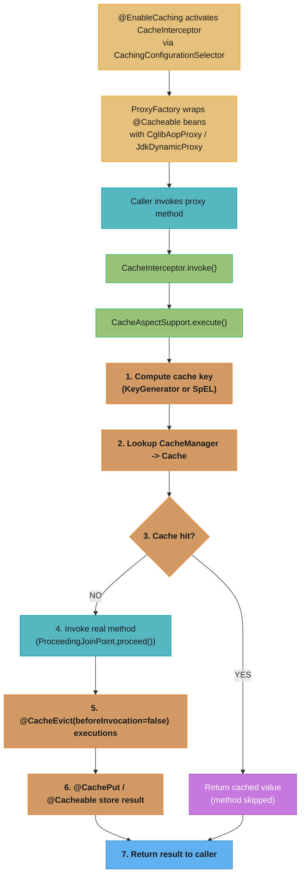
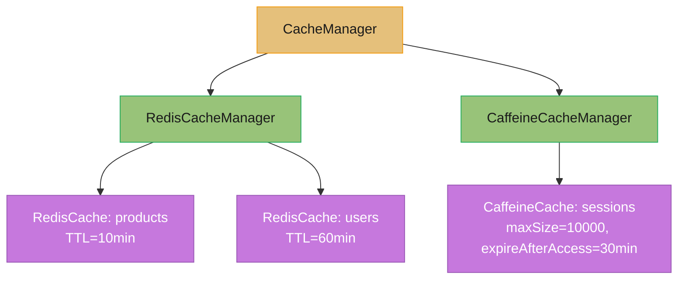
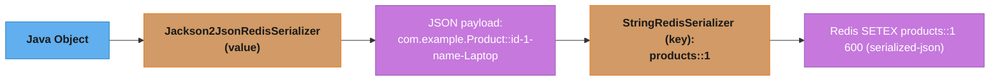
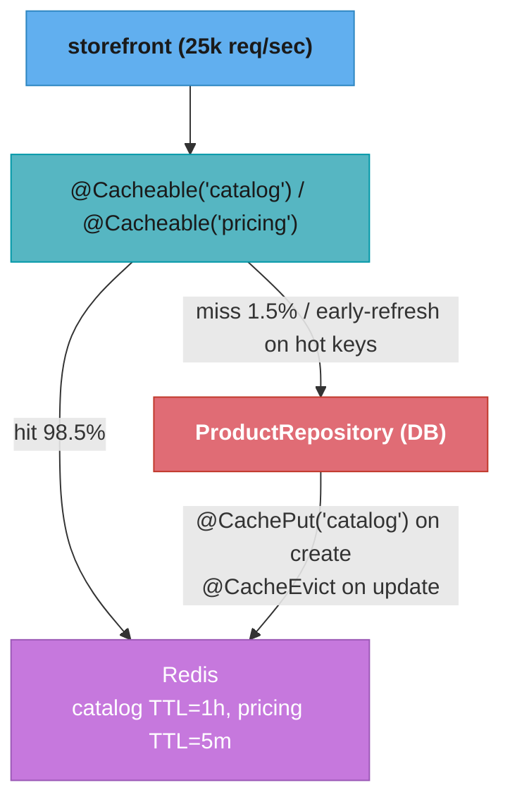

# Spring Caching

## 1. Concept Overview

Spring Cache Abstraction provides a unified caching API that decouples application code from the underlying cache store. Introduced in Spring 3.1, it allows caching method results through annotations without changing business logic. The abstraction sits on top of concrete implementations (ConcurrentMap, Redis, Caffeine, EhCache) and is driven by AOP proxies that intercept annotated methods.

The four core annotations are:

- `@Cacheable` — returns a cached value if it exists; populates the cache on first call
- `@CachePut` — always executes the method and writes the result to the cache (write-through)
- `@CacheEvict` — removes one or all entries from a named cache
- `@Caching` — groups multiple cache annotations on a single method

`@EnableCaching` activates `CachingInterceptor` (an `AopInterceptor`) on the Spring application context, which wraps annotated beans in proxies.

---

## 2. Intuition

**One-line analogy:** Spring caching is a smart receptionist who remembers recent answers so the expert does not have to be interrupted for questions already answered.

**Mental model:** The AOP proxy checks a key-value store before delegating to the real method. On a hit, the stored value is returned immediately. On a miss, the method runs, the result is stored under the computed key, and then returned.

**Why it matters:** Database and remote-service calls dominate latency in most Java services. Caching at the method boundary eliminates redundant I/O with zero business-logic changes, reducing p99 latencies from tens of milliseconds to sub-millisecond for hot paths.

**Key insight:** Spring caching is annotation-driven AOP, which means every limitation of Spring AOP applies — self-invocation bypasses the proxy, and the cache is populated only after the method returns successfully.

---

## 3. Core Principles

1. **Cache-aside pattern by default.** `@Cacheable` implements cache-aside: the application checks the cache, fetches from the source on a miss, then populates the cache.
2. **Write-through with `@CachePut`.** The method always executes and the result always updates the cache — useful for keeping the cache consistent after an update.
3. **Explicit eviction with `@CacheEvict`.** Cache entries must be explicitly removed; there is no automatic invalidation unless TTL is configured at the `CacheManager` level.
4. **Transparent key generation.** `SimpleKeyGenerator` derives cache keys from method parameters. Custom `KeyGenerator` beans or SpEL expressions can override this.
5. **Store-agnostic abstraction.** The same annotations work across ConcurrentMap, Redis, Caffeine, and EhCache by swapping the `CacheManager` bean.
6. **AOP proxy scope.** Only public methods on Spring-managed beans are eligible. Private methods and `this.method()` calls are never intercepted.

---

## 4. Types / Architectures / Strategies

### CacheManager Implementations

| Implementation | Best For | TTL Support | Eviction Policy | Notes |
|---|---|---|---|---|
| `ConcurrentMapCacheManager` | Dev / unit tests | No | None (unbounded) | Leaks memory in prod; no distributed support |
| `CaffeineCacheManager` | Single JVM, high throughput | Yes | LRU/LFU/size/weight | Async refresh, stats, near-zero overhead |
| `RedisCacheManager` | Distributed, multi-instance | Yes (per cache) | TTL-based or explicit | Requires serialization config; network latency |
| `EhCacheCacheManager` | Single JVM legacy | Yes | LRU/LFU/FIFO | Heavy config; replaced by Caffeine in new projects |
| `JCacheCacheManager` | JSR-107 compliance | Depends | Depends | Adapter over any JSR-107 provider |

### Caching Strategies

**Cache-aside (`@Cacheable`):** Application code manages the cache. Miss = load from DB + populate cache. Stale data risk.

**Write-through (`@CachePut`):** Every write updates both the DB and the cache atomically from the application's perspective. Ensures consistency at the cost of always executing the method.

**Write-behind:** Not natively supported by Spring; requires a custom `CacheWriter` at the store level (Caffeine supports it).

**Read-through:** The cache itself fetches from the source on a miss. Spring's abstraction does not natively implement this; the method body is the "read-through" loader.

**Refresh-ahead:** Caffeine's `refreshAfterWrite` or `@Cacheable(sync=true)` prevent stale data and stampedes respectively.

### Key Generation Strategies

1. `SimpleKeyGenerator` (default): zero params → `SimpleKey.EMPTY`; one param → param itself; multiple params → `SimpleKey(params[])`.
2. SpEL expression: `key="#id"`, `key="#user.email"`, `key="#root.methodName + '_' + #p0"`.
3. Custom `KeyGenerator` bean: implement `KeyGenerator` interface, specify by name `keyGenerator="myKeyGen"`.

---

## 5. Architecture Diagrams

**CacheInterceptor invocation pipeline** — the AOP path a `@Cacheable` call takes from proxy to cache lookup to (optional) method execution:



**CacheManager hierarchy** — one logical `CacheManager` fronts multiple named caches, each backed by a concrete store with its own TTL/eviction policy:



**Redis serialization pipeline** — how a cached Java object becomes a Redis key/value pair on the wire:



---

## 6. How It Works — Detailed Mechanics

### @EnableCaching Activation

```java
@Configuration
@EnableCaching  // imports CachingConfigurationSelector -> ProxyCachingConfiguration
public class CacheConfig {

    @Bean
    public CacheManager cacheManager() {
        return new ConcurrentMapCacheManager("products", "users");
    }
}
```

`@EnableCaching` imports `CachingConfigurationSelector`, which registers `BeanFactoryCacheOperationSourceAdvisor`. This advisor uses `AnnotationCacheOperationSource` to detect `@Cacheable`, `@CachePut`, `@CacheEvict`, and wraps qualifying beans with `CacheInterceptor`.

### @Cacheable Deep Dive

```java
@Service
public class ProductService {

    // Default key: #id (single param -> param itself via SimpleKeyGenerator)
    @Cacheable(cacheNames = "products")
    public Product findById(Long id) {
        return productRepository.findById(id).orElseThrow();  // DB hit only on miss
    }

    // SpEL key with method name prefix to prevent key collisions across methods
    @Cacheable(cacheNames = "products", key = "#root.methodName + ':' + #sku")
    public Product findBySku(String sku) {
        return productRepository.findBySku(sku);
    }

    // condition evaluated BEFORE method; unless evaluated AFTER (can see #result)
    @Cacheable(
        cacheNames = "products",
        key = "#id",
        condition = "#id > 0",        // do not cache if id <= 0
        unless = "#result == null"    // do not cache null returns
    )
    public Product findByIdSafe(Long id) {
        return productRepository.findById(id).orElse(null);
    }

    // sync=true: only one thread populates cache on concurrent misses (stampede protection)
    @Cacheable(cacheNames = "products", key = "#id", sync = true)
    public Product findByIdSync(Long id) {
        return productRepository.findById(id).orElseThrow();
    }
}
```

**Cache stampede without sync=true:** On a cold start or after eviction, 1000 concurrent threads all see a miss and all call the database simultaneously. `sync=true` ensures only one thread executes the method; the others block and receive the cached value once available.

### @CachePut — Write-Through

```java
@CachePut(cacheNames = "products", key = "#product.id")
public Product updateProduct(Product product) {
    return productRepository.save(product);  // always executes; result goes to cache
}
```

Use `@CachePut` after a mutating operation so readers immediately get the updated value from cache without a stale read.

### @CacheEvict — Invalidation

```java
// Remove single entry
@CacheEvict(cacheNames = "products", key = "#id")
public void deleteProduct(Long id) {
    productRepository.deleteById(id);
}

// Remove all entries from a cache
@CacheEvict(cacheNames = "products", allEntries = true)
public void clearProductCache() { }

// Eager eviction: evict BEFORE the method runs (safe even if method throws)
@CacheEvict(cacheNames = "products", key = "#id", beforeInvocation = true)
public void safeDelete(Long id) {
    productRepository.deleteById(id);  // if this throws, cache is already cleared
}
```

### Redis CacheManager Configuration

```java
@Configuration
@EnableCaching
public class RedisCacheConfig {

    @Bean
    public RedisCacheManager cacheManager(RedisConnectionFactory connectionFactory) {

        // Default config applied to all caches unless overridden
        RedisCacheConfiguration defaultConfig = RedisCacheConfiguration.defaultCacheConfig()
            .entryTtl(Duration.ofMinutes(10))
            .serializeKeysWith(
                RedisSerializationContext.SerializationPair
                    .fromSerializer(new StringRedisSerializer()))
            .serializeValuesWith(
                RedisSerializationContext.SerializationPair
                    .fromSerializer(new GenericJackson2JsonRedisSerializer()))
            .disableCachingNullValues();  // prevents caching null; pairs with unless="#result==null"

        // Per-cache TTL overrides
        Map<String, RedisCacheConfiguration> cacheConfigs = new HashMap<>();
        cacheConfigs.put("users",    defaultConfig.entryTtl(Duration.ofHours(1)));
        cacheConfigs.put("sessions", defaultConfig.entryTtl(Duration.ofMinutes(30)));
        cacheConfigs.put("products", defaultConfig.entryTtl(Duration.ofMinutes(5)));

        return RedisCacheManager.builder(connectionFactory)
            .cacheDefaults(defaultConfig)
            .withInitialCacheConfigurations(cacheConfigs)
            .build();
    }
}
```

### Caffeine CacheManager Configuration

```java
@Bean
public CacheManager caffeineCacheManager() {
    CaffeineCacheManager manager = new CaffeineCacheManager("sessions");
    manager.setCaffeine(Caffeine.newBuilder()
        .maximumSize(10_000)          // cap at 10k entries
        .expireAfterWrite(30, TimeUnit.MINUTES)
        .recordStats());              // enables hit rate, eviction count metrics
    return manager;
}
```

### Custom Key Generation with SpEL

```java
// #root — CacheExpressionRootObject
// #root.methodName  -> "findById"
// #root.targetClass -> ProductService.class
// #root.caches      -> [Cache("products")]
// #root.args        -> [42L]
// #p0, #p1          -> positional args
// #a0, #a1          -> alias for positional

@Cacheable(cacheNames = "search", key = "#root.methodName + ':' + #query + ':' + #page")
public Page<Product> search(String query, int page) { ... }
```

---

## 7. Real-World Examples

### E-Commerce Product Catalog

Product details change infrequently. Cache with 10-minute TTL in Redis. On update (`@CachePut`), immediately refresh. On delete (`@CacheEvict`), remove entry. Result: catalog page load drops from 80ms (DB) to 2ms (Redis), reducing DB connections by 90% during peak traffic.

### User Session / Profile Caching

User profile is fetched on every authenticated request. Cache with 60-minute TTL in Redis. Evict on profile update. With 500k active users and 1000 req/s, this eliminates ~950 DB queries/second.

### Reference Data (Country Codes, Tax Rates)

Rarely changes. Use `ConcurrentMapCacheManager` with `@CacheEvict(allEntries=true)` triggered by an admin endpoint or scheduled job. Appropriate for single-instance applications.

### Distributed Microservices

Multiple instances share a Redis cluster. Keys are namespaced by cache name. TTL-based expiry ensures eventual consistency. `sync=true` is not effective in distributed mode (it only blocks threads within a single JVM); a distributed lock (Redisson) is needed for true stampede protection across instances.

---

## 8. Tradeoffs

### ConcurrentMapCacheManager vs RedisCacheManager vs CaffeineCacheManager

| Dimension | ConcurrentMap | Caffeine | Redis |
|---|---|---|---|
| Latency | ~0 (in-process) | ~0 (in-process) | 0.2–2ms (network) |
| Capacity | JVM heap bounded | Configurable, bounded | GB–TB |
| TTL | No | Yes | Yes |
| Eviction | None | LRU/LFU/size/time | TTL only |
| Distributed | No | No | Yes |
| Serialization | None needed | None needed | Required |
| Ops complexity | None | None | Redis cluster needed |
| Stampede protection | sync=true (JVM) | sync=true (JVM) | Requires Redisson lock |

### @Cacheable vs @CachePut

| | @Cacheable | @CachePut |
|---|---|---|
| Method executes | Only on miss | Always |
| Use case | Read operations | Write operations (keep cache fresh) |
| Cache population | Lazy (on first miss) | Eager (every call) |
| Risk | Stale data between TTL | Wasted computation if nothing reads cache |

### Cache TTL: Short vs Long

| TTL | Pros | Cons |
|---|---|---|
| Short (seconds) | Fresh data, low staleness | High DB load, low hit rate |
| Long (hours) | High hit rate, low DB load | Stale data, manual eviction needed |

---

## 9. When to Use / When NOT to Use

### Use Spring Caching When

- Method results are expensive to compute (DB queries, HTTP calls, complex calculations).
- Results are deterministic for the same inputs.
- Data changes infrequently relative to read frequency (read-heavy workloads).
- Cache invalidation boundaries are well understood.
- You need to swap cache backends without changing business code.

### Do NOT Use Spring Caching When

- Data changes on every request or is user-specific and highly volatile.
- Method has side effects that must execute on every call (use `@CachePut` or no caching).
- You need transactional consistency between the cache and the database — Spring's cache abstraction is not transaction-aware by default. `@Transactional` + `@Cacheable` can cache uncommitted data.
- The data is too large for the configured cache store (configure `maximumSize` on Caffeine to prevent OOM).
- The method signature includes non-serializable parameters used as keys (breaks Redis serialization).

---

## 10. Common Pitfalls

### Pitfall 1: Self-Invocation Bypasses Cache Proxy

```java
// BROKEN: internal call bypasses AOP proxy; cache never consulted
@Service
public class OrderService {

    @Cacheable("orders")
    public Order findOrder(Long id) {
        return orderRepository.findById(id).orElseThrow();
    }

    public void processOrder(Long id) {
        Order order = findOrder(id);  // 'this.findOrder()' — not proxied!
        // cache is never hit; DB called every time
    }
}
```

```java
// FIX 1: Inject the bean into itself (Spring 4.3+)
@Service
public class OrderService {

    @Autowired
    @Lazy
    private OrderService self;  // injected proxy, not 'this'

    @Cacheable("orders")
    public Order findOrder(Long id) {
        return orderRepository.findById(id).orElseThrow();
    }

    public void processOrder(Long id) {
        Order order = self.findOrder(id);  // goes through proxy — cache hit works
    }
}

// FIX 2: Extract @Cacheable method to a separate @Service bean
```

### Pitfall 2: Mutable Objects as Cache Keys

```java
// BROKEN: mutable SearchCriteria as key; hashCode/equals can change
@Cacheable(cacheNames = "search", key = "#criteria")
public List<Product> search(SearchCriteria criteria) { ... }

// SearchCriteria is mutable; if caller modifies it after caching, key changes
// Also: if SearchCriteria doesn't override equals/hashCode, every call is a miss
```

```java
// FIX: use stable SpEL expression extracting immutable fields
@Cacheable(cacheNames = "search", key = "#criteria.category + ':' + #criteria.minPrice + ':' + #criteria.maxPrice")
public List<Product> search(SearchCriteria criteria) { ... }

// OR make SearchCriteria an immutable record (Java 16+)
public record SearchCriteria(String category, BigDecimal minPrice, BigDecimal maxPrice) {}
```

### Pitfall 3: Caching Null Values Causes NullPointerException

```java
// BROKEN: productRepository returns null for missing products
// RedisCacheManager with disableCachingNullValues() will throw on null storage attempt
// ConcurrentMapCacheManager will store null, and callers may NPE on cache hit
@Cacheable("products")
public Product findById(Long id) {
    return productRepository.findById(id).orElse(null);  // can return null
}
```

```java
// FIX: use 'unless' to prevent caching null + handle at caller
@Cacheable(cacheNames = "products", key = "#id", unless = "#result == null")
public Optional<Product> findById(Long id) {
    return productRepository.findById(id);  // return Optional, never null
}
```

### Pitfall 4: @Cacheable and @Transactional — Caching Uncommitted Data

```java
// BROKEN: @Cacheable populates cache BEFORE transaction commits
// If transaction rolls back, cache contains data that was never persisted
@Service
public class UserService {

    @Transactional
    @Cacheable("users")
    public User createAndFetch(Long id) {
        userRepository.save(new User(id));
        return userRepository.findById(id).orElseThrow();
        // cache is populated here; if tx rolls back after, cache is stale
    }
}
```

```java
// FIX 1: separate the @Cacheable read from the @Transactional write
@Service
public class UserService {

    @Transactional
    public User create(Long id) {
        return userRepository.save(new User(id));
    }

    @Cacheable("users")
    public User findById(Long id) {  // no transaction; reads committed data
        return userRepository.findById(id).orElseThrow();
    }
}

// FIX 2: use Spring's transaction synchronization to evict after commit
@CacheEvict(cacheNames = "users", key = "#result.id")
@Transactional
public User updateUser(User user) {
    return userRepository.save(user);
    // @CacheEvict with beforeInvocation=false runs after method, but still before commit
    // Use TransactionSynchronizationManager for post-commit eviction
}
```

### Pitfall 5: Missing Key Collision Across Methods

```java
// BROKEN: both methods use the same cache name and numeric key
// findById(1L) and findByVariantId(1L) collide on key "1" in "products" cache
@Cacheable("products")
public Product findById(Long id) { ... }

@Cacheable("products")
public Product findByVariantId(Long variantId) { ... }
```

```java
// FIX: prefix key with method name
@Cacheable(cacheNames = "products", key = "#root.methodName + ':' + #id")
public Product findById(Long id) { ... }  // key: "findById:1"

@Cacheable(cacheNames = "products", key = "#root.methodName + ':' + #variantId")
public Product findByVariantId(Long variantId) { ... }  // key: "findByVariantId:1"
```

### Pitfall 6: Redis Serialization Failure for Non-Serializable Types

```java
// BROKEN: PageImpl is not directly deserializable by Jackson without type info
@Cacheable("search")
public Page<Product> searchProducts(String query, Pageable pageable) {
    return productRepository.findByNameContaining(query, pageable);
}
// Redis stores the JSON but deserialization throws MismatchedInputException
```

```java
// FIX: cache a DTO list instead of framework types
@Cacheable("search")
public List<ProductDto> searchProducts(String query, int page, int size) {
    return productRepository
        .findByNameContaining(query, PageRequest.of(page, size))
        .map(ProductDto::from)
        .getContent();
}
```

---

## 11. Technologies & Tools

| Technology | Role | Version Notes |
|---|---|---|
| Spring Cache Abstraction | Core annotations + AOP interception | Spring 3.1+ |
| `spring-boot-starter-cache` | Auto-configures `CacheManager` | Spring Boot 2.x / 3.x |
| `spring-boot-starter-data-redis` | Auto-configures `RedisCacheManager` | Lettuce client by default |
| Caffeine | High-performance in-process cache | `com.github.ben-manes.caffeine:caffeine` |
| `spring-boot-starter-cache` + Caffeine | Spring Boot auto-detects Caffeine if on classpath | |
| Redisson | Distributed locks for stampede protection in Redis clusters | `redisson-spring-boot-starter` |
| Micrometer | Cache hit rate, miss rate, eviction count metrics | Spring Boot Actuator auto-exposes |
| Spring Boot Actuator `/actuator/caches` | Lists all registered caches; supports eviction via HTTP DELETE | |
| Testcontainers | Integration testing with real Redis container | `testcontainers:redis` |
| `@CacheConfig` | Class-level default `cacheNames`, `keyGenerator`, `cacheManager` | Reduces repetition |

---

## 12. Interview Questions with Answers

**Q: What does `@EnableCaching` actually do under the hood?**
It imports `CachingConfigurationSelector`, which registers `BeanFactoryCacheOperationSourceAdvisor` into the application context. This advisor scans beans for `@Cacheable`/`@CachePut`/`@CacheEvict` annotations and wraps matching beans in CGLIB (or JDK dynamic) proxies with a `CacheInterceptor`. Without `@EnableCaching`, all cache annotations are silently ignored — no errors, no caching.

**Q: What is the difference between `@Cacheable` and `@CachePut`?**
`@Cacheable` skips method execution on a cache hit and populates the cache only on a miss — it is a read optimization. `@CachePut` always executes the method and always writes the result to the cache regardless of existing entries — it is a write-through pattern used after data mutations to keep the cache consistent. Mixing them on the same method with the same key is undefined behavior and should be avoided.

**Q: How does `SimpleKeyGenerator` generate cache keys?**
Zero parameters produce `SimpleKey.EMPTY`. One parameter produces the parameter itself as the key. Multiple parameters produce a `SimpleKey` wrapping the parameter array. It relies on `equals` and `hashCode` of parameters — if the parameter does not override these (e.g., a mutable POJO), every call may appear as a cache miss. Always prefer SpEL expressions for complex types.

**Q: What is a cache stampede and how does `sync=true` address it?**
A cache stampede occurs when many threads simultaneously observe a cache miss and all call the underlying data source concurrently, multiplying load. `sync=true` on `@Cacheable` causes `CacheInterceptor` to use `Cache.get(key, Callable)`, which in Caffeine and ConcurrentMap serializes computation for the same key — only one thread calls the method, others wait. This is a JVM-local lock only; for distributed stampede protection across multiple instances, a distributed lock (Redisson) is required.

**Q: Explain `condition` vs `unless` in `@Cacheable`.**
`condition` is evaluated before the method executes using SpEL; if it returns false, caching is completely bypassed for this invocation (no lookup, no store). `unless` is evaluated after the method returns and can inspect `#result`; if it returns true, the result is not stored in the cache (but the method did execute). Use `condition` to skip caching for invalid inputs (e.g., `#id > 0`) and `unless` to skip caching null or empty results (e.g., `#result == null`).

**Q: Why can `@Cacheable` and `@Transactional` interact badly?**
Spring's cache abstraction is not transaction-aware by default. When both annotations are on the same method, `CacheInterceptor` populates the cache when the method returns, but the transaction may not have committed yet. If the transaction rolls back, the cache contains data that was never persisted to the database. The fix is to separate read (cacheable) from write (transactional) operations, or to use `TransactionSynchronizationManager.registerSynchronization()` to schedule cache population as an `afterCommit` callback.

**Q: What is `@CacheEvict(beforeInvocation = true)` used for?**
By default, eviction happens after the method returns successfully. If the method throws, the cache is not cleared. Setting `beforeInvocation = true` evicts the cache entry before the method runs, ensuring the entry is removed regardless of whether the method succeeds or throws. Use this when it is safer to serve a cache miss than to serve potentially stale data during a failed update.

**Q: How do you configure per-cache TTL with `RedisCacheManager`?**
Build one `RedisCacheConfiguration` per named cache, each with its own `entryTtl(Duration)`. Use `RedisCacheConfiguration.defaultCacheConfig().entryTtl(Duration)` per cache, then pass a `Map<String, RedisCacheConfiguration>` to `RedisCacheManager.builder(...).withInitialCacheConfigurations(map).build()`. Caches not in the map use the default configuration provided via `cacheDefaults(...)`.

**Q: How do you prevent storing null values in Redis cache?**
Call `.disableCachingNullValues()` on `RedisCacheConfiguration`. This throws an `IllegalArgumentException` if a null value reaches the cache. Pair this with `@Cacheable(unless = "#result == null")` so nulls are filtered out before reaching the cache store, or have methods return `Optional<T>` instead of nullable types.

**Q: Why does the cache not work when calling a `@Cacheable` method from within the same class?**
Spring caching uses AOP proxies. When a method calls `this.method()`, it bypasses the proxy and invokes the method directly on the target object. The `CacheInterceptor` is never invoked, so no cache lookup or population occurs. The fix is to either inject the bean into itself (`@Autowired @Lazy private MyService self`) and call `self.method()`, or refactor the cached method into a separate Spring bean.

**Q: How does `@CacheConfig` help reduce boilerplate?**
`@CacheConfig` at the class level sets default `cacheNames`, `keyGenerator`, `cacheManager`, and `cacheResolver` for all cache annotations in the class. Instead of repeating `cacheNames = "products"` on every method, declare `@CacheConfig(cacheNames = "products")` on the class. Individual method annotations can still override the class-level defaults.

**Q: How do you test `@Cacheable` behavior in a Spring Boot integration test?**
Annotate the test with `@SpringBootTest` to load the full context. Inject the service under test and call the method twice. Verify the underlying dependency (repository mock) was called exactly once using `Mockito.verify(repository, times(1)).findById(anyLong())`. Alternatively, use `@CacheConfig` on the test configuration with a `ConcurrentMapCacheManager` to avoid Redis dependency in unit tests. Use `CacheManager.getCache("products").clear()` in `@BeforeEach` to reset state between tests.

**Q: What is cache stampede (thundering herd) and how does Spring's `@Cacheable` expose your system to it — and how do you mitigate it?**
Cache stampede occurs when a cached key expires and many concurrent threads simultaneously hit a cache miss on it. All of them then execute the expensive source query and try to populate the cache at once, multiplying load on the backing store. `@Cacheable` provides no built-in protection: if 500 threads call `getProduct(id)` within the same millisecond after the TTL expires, all 500 call the database. Mitigation strategies: (1) **Probabilistic early expiry (jitter)** — randomise the TTL slightly so keys expire at different times, preventing simultaneous expiry of related keys. (2) **Mutex / distributed lock on cache miss** — only one thread computes the value; others wait. Implement with `RedisTemplate.opsForValue().setIfAbsent()` as a distributed lock in a custom `CacheManager`. (3) **Background refresh** — use a scheduled job to proactively refresh near-expiry keys before they expire. For critical paths, option 2 (lock on miss) is the most robust.

**Q: What is the difference between `@CachePut` and `@Cacheable`, and when should you use each?**
`@Cacheable` performs a cache-read: it checks the cache first; if a hit is found, returns the cached value without executing the method. If a miss, executes the method and populates the cache. `@CachePut` always executes the method AND always writes the result to the cache — no cache read is performed. Use `@CachePut` on update/create operations where you want to refresh the cache with the newly written value without requiring a subsequent cache miss to repopulate it. Example: a `save(Product)` method annotated with `@CachePut(key="#product.id")` ensures the cache is always consistent with what was just persisted. Never put `@Cacheable` and `@CachePut` with the same key on the same method — the write path would be skipped by `@Cacheable` if a cached value already exists.

**Q: How do you configure Redis as the Spring cache backend with per-cache TTLs?**
Configure a `RedisCacheManager` with a `RedisCacheConfiguration` that sets default TTL and per-cache overrides. Here's an example:

```java
@Bean
RedisCacheManager cacheManager(RedisConnectionFactory cf) {
    RedisCacheConfiguration defaults = RedisCacheConfiguration.defaultCacheConfig()
        .entryTtl(Duration.ofMinutes(30))
        .serializeValuesWith(
            RedisSerializationContext.SerializationPair
                .fromSerializer(new GenericJackson2JsonRedisSerializer()));
    Map<String, RedisCacheConfiguration> perCacheConfig = Map.of(
        "products",    defaults.entryTtl(Duration.ofHours(2)),
        "sessions",    defaults.entryTtl(Duration.ofMinutes(10)),
        "rateLimits",  defaults.entryTtl(Duration.ofSeconds(60))
    );
    return RedisCacheManager.builder(cf)
        .cacheDefaults(defaults)
        .withInitialCacheConfigurations(perCacheConfig)
        .build();
}
```

Use JSON serialization (not Java serialization) so cached objects survive rolling deploys that rename classes. Java serialization is the default and will throw `SerializationException` when a cached class has changed between versions.

**Q: What causes a cache key collision between two different `@Cacheable` methods, and how do you prevent it?**
A key collision happens when two methods share the same cache name and produce identical computed keys, so one method's cached value is silently returned for the other. For example, `findById(1L)` and `findByVariantId(1L)` both default to key `1` under `SimpleKeyGenerator` when they share the `products` cache — the second call returns the first entity's cached result with no error or warning of any kind. The fix is to always prefix the key with `#root.methodName` (e.g. `key = "#root.methodName + ':' + #id"`) or give each method its own cache name, so keys are namespaced and cannot collide across method boundaries.

**Q: When should you choose cache-aside (`@Cacheable`) over write-through (`@CachePut`), and what consistency risk does each carry?**
Cache-aside populates the cache lazily on a read miss, while write-through refreshes the cache eagerly on every write, trading staleness risk against wasted work. Cache-aside is cheaper when reads vastly outnumber writes, because only the keys actually requested are ever cached, but data can go stale between a write and the next read until the TTL expires or an explicit `@CacheEvict` fires. Write-through keeps the cache in lockstep with every write and eliminates that staleness window, but it does unnecessary work for entries nobody reads and does nothing for a cold cache, since nothing is cached until the first write happens. Most read-heavy services default to cache-aside with a short TTL and add `@CachePut` only on the specific write paths where an immediately consistent read matters.

**Q: What is the difference between letting a Redis entry expire via TTL and explicitly removing it with `@CacheEvict`?**
TTL expiration is passive and time-based, configured once on the `CacheManager`, while `@CacheEvict` is an active removal triggered by application code at a specific write. TTL guarantees an upper bound on staleness with zero code changes — if a developer forgets to evict, the entry still disappears once the TTL elapses, which is why every production cache should carry one. `@CacheEvict` closes the staleness window immediately when the underlying data changes, rather than waiting out the full TTL. Relying on TTL alone means readers can see stale data for up to the entire TTL window after every write; relying on eviction alone means an entry that is never explicitly evicted — say, after a missed code path or an out-of-band bulk DB update — is cached indefinitely with `ConcurrentMapCacheManager` or until an operator clears it by hand. Production systems should combine both: `@CacheEvict` on known write paths, TTL as the safety net for everything else.

---

## 13. Best Practices

1. **Use SpEL keys explicitly.** Relying on `SimpleKeyGenerator` is fragile when parameters are mutable or lack proper `equals`/`hashCode`. Always specify `key` in production code.

2. **Configure TTL on every production cache.** An unbounded cache with no eviction is a memory leak. Even a conservative 1-hour TTL prevents indefinite accumulation.

3. **Always configure `disableCachingNullValues()` for Redis.** Null values cause deserialization ambiguity and waste memory. Return `Optional<T>` from cached methods.

4. **Use `@CacheConfig` at the class level** to avoid repeating cache names across all methods in a service.

5. **Separate cache concerns from business logic.** Annotate only the service layer, not repositories or controllers. Repositories may be called from non-Spring contexts; controllers should remain thin.

6. **Use `sync=true` for expensive single-JVM calls.** On application startup or cache invalidation, the first wave of concurrent requests should not all hit the DB. `sync=true` serializes population for a given key within a JVM.

7. **Monitor cache hit rates.** Expose Micrometer cache metrics (`cache.gets`, `cache.puts`, `cache.evictions`) and alert on hit rate dropping below 80% for caches that should be warm.

8. **Avoid caching paginated results or framework types** (`Page<T>`, `Slice<T>`) directly in Redis — they embed Pageable internals that are not safely deserializable. Cache the `List<T>` content instead.

9. **Use `@Caching` to compose multiple operations** on a single method — e.g., evict from one cache and update another atomically from the annotation perspective.

10. **Write integration tests with Testcontainers (Redis)** rather than mocking the cache. Cache key formatting bugs only appear with a real Redis round-trip.

---

## 14. Case Study

### Scenario: Product Catalog Service Caching 500k Records on Redis with Stampede Protection

**Context.** A retail catalog service serves **500,000 product records** to a storefront at **25,000 read req/sec**. Reads are cached in Redis via `@Cacheable`, backed by a `RedisCacheManager` with per-cache TTLs: `catalog` (1 hour, slow-changing) and `pricing` (5 minutes, volatile). Writes use `@CacheEvict`/`@CachePut`. Cache stampede on hot keys is mitigated with probabilistic early expiration so popular products refresh before mass expiry.

### Architecture



### Cache Configuration

```java
@Configuration
@EnableCaching
public class CacheConfig {

    @Bean
    RedisCacheManager cacheManager(RedisConnectionFactory cf) {
        RedisCacheConfiguration base = RedisCacheConfiguration.defaultCacheConfig()
            .serializeValuesWith(SerializationPair.fromSerializer(
                new GenericJackson2JsonRedisSerializer()));
        Map<String, RedisCacheConfiguration> perCache = Map.of(
            "catalog", base.entryTtl(Duration.ofHours(1)),
            "pricing", base.entryTtl(Duration.ofMinutes(5)));
        return RedisCacheManager.builder(cf)
            .withInitialCacheConfigurations(perCache).build();
    }
}
```

```java
@Service
public class ProductService {

    @Cacheable(cacheNames = "catalog", key = "#id")     // SimpleKeyGenerator on (#id)
    public ProductView findById(long id) {
        return repo.findById(id).map(ProductView::from).orElseThrow();
    }

    @CachePut(cacheNames = "catalog", key = "#result.id())")
    public ProductView createProduct(NewProduct p) {     // populates cache with the new entry
        return ProductView.from(repo.save(p.toEntity()));
    }

    @CacheEvict(cacheNames = {"catalog", "pricing"}, key = "#p.id()")
    public void updateProduct(ProductUpdate p) {         // invalidate on write
        repo.update(p);
    }
}
```

```java
// Probabilistic early expiration: refresh a hot key BEFORE TTL to avoid synchronized mass expiry
boolean shouldEarlyRefresh(long ttlRemainingMs, long recomputeMs, double beta) {
    double xfetch = recomputeMs * beta * -Math.log(ThreadLocalRandom.current().nextDouble());
    return ttlRemainingMs <= xfetch;   // probability rises as TTL approaches zero
}
```

### Metrics

- Hit rate: **98.5%** steady state; DB read load reduced **~50x**.
- `catalog` read: **0.6ms** from Redis vs **18ms** from DB.
- Stampede on a viral product: DB QPS for that key capped at **~5/sec** instead of thousands.
- Micrometer `cache.gets{cache=catalog,result=hit|miss}` exposes per-cache hit ratio.

### Pitfalls

**Pitfall 1 — `@Cacheable` on a private method: Spring AOP cannot proxy it.**
```java
// BROKEN: Spring AOP proxies public methods only; the annotation on a private method is ignored,
// so the cache is never populated and every call hits the DB
@Cacheable("catalog")
private ProductView load(long id) { return repo.findById(id)...; }
```
```java
// FIXED: make the cached method public so the proxy can intercept it
@Cacheable(cacheNames = "catalog", key = "#id")
public ProductView findById(long id) { return repo.findById(id)...; }
```

**Pitfall 2 — Self-invocation bypasses the caching proxy.**
```java
// BROKEN: getAll() calls this.findById() internally; the call goes straight to the target,
// skipping the proxy, so @Cacheable never fires for those lookups
@Service
class ProductService {
    public List<ProductView> getAll(List<Long> ids) {
        return ids.stream().map(this::findById).toList();   // self-call, no cache
    }
    @Cacheable("catalog") public ProductView findById(long id) { ... }
}
```
```java
// FIXED: route through the proxy (self-injected reference or AopContext) so caching advice applies
@Service
class ProductService {
    @Autowired @Lazy ProductService self;
    public List<ProductView> getAll(List<Long> ids) {
        return ids.stream().map(self::findById).toList();   // cached via proxy
    }
    @Cacheable("catalog") public ProductView findById(long id) { ... }
}
```

**Pitfall 3 — Caching a non-serializable `Page<Product>` throws on store.**
```java
// BROKEN: PageImpl is not reliably (de)serializable by the Redis serializer -> SerializationException
@Cacheable("catalog")
public Page<ProductView> search(String q, Pageable p) { return repo.search(q, p); }
```
```java
// FIXED: cache a serializable DTO wrapper (content + paging metadata), not the framework Page type
@Cacheable("catalog")
public PageResult<ProductView> search(String q, Pageable p) {
    Page<ProductView> page = repo.search(q, p);
    return new PageResult<>(page.getContent(), page.getNumber(), page.getTotalElements());
}
```

### Interview Q&A

**Why does `@Cacheable` on a private or self-invoked method silently fail?** Spring's caching is implemented via AOP proxies that wrap the bean. Proxies can only intercept external, public method calls; a private method or a `this.method()` self-call bypasses the proxy entirely, so the advice that reads/writes the cache never runs.

**How do you configure different TTLs per cache?** Build a `RedisCacheManager` with `withInitialCacheConfigurations`, mapping each cache name to a `RedisCacheConfiguration` carrying its own `entryTtl`. Here `catalog` gets one hour and `pricing` five minutes, reflecting how often each changes.

**What is a cache stampede and how does probabilistic early expiration help?** A stampede happens when many entries expire simultaneously and a flood of concurrent misses hits the DB. Probabilistic early expiration recomputes a hot key slightly before its TTL with a probability that rises as expiry nears, so one request refreshes the value while others still serve the cached copy, smoothing DB load.

**When do you use `@CachePut` versus `@CacheEvict`?** `@CachePut` always executes the method and stores the result, ideal for create/update flows where you want the cache primed with the new value. `@CacheEvict` removes stale entries so the next read recomputes, used when recomputation is cheap or the new value is not directly returned.

**Why can caching a `Page<T>` fail?** Spring Data's `PageImpl` is not designed for stable serialization across the configured Redis serializer, which can throw a `SerializationException` or deserialize incorrectly. Caching a purpose-built serializable DTO that carries the content list and paging metadata avoids the issue.

**How do you observe cache effectiveness in production?** Enable Micrometer cache metrics (`cache.gets`, `cache.puts`, `cache.evictions`) tagged by cache name, and alert on hit-ratio drops per cache. A single cold cache can be hidden by a high aggregate ratio, so per-cache breakdown is essential.

---

**Additional production patterns and interview Q&As:**

**Cache stampede prevention with probabilistic early expiration:**

```java
// BROKEN: many threads hit expired cache simultaneously → all query DB → thundering herd
@Cacheable(value = "products", key = "#id")
public Product getProduct(Long id) {
    return productRepo.findById(id).orElseThrow();  // 50 threads query DB at once on expiry
}

// FIX 1: probabilistic early expiration (XFetch / Beta algorithm)
// Recompute before expiry with probability proportional to how close to expiry
public Product getProductWithEarlyExpiry(Long id) {
    ValueWrapper cached = cacheManager.getCache("products").get(id);
    if (cached != null && !shouldEarlyRecompute(id)) return (Product) cached.get();
    Product fresh = productRepo.findById(id).orElseThrow();
    cacheManager.getCache("products").put(id, fresh);
    return fresh;
}

// FIX 2: Caffeine's refreshAfterWrite — asynchronous refresh on first stale access
@Bean
public CacheManager cacheManager() {
    CaffeineCacheManager mgr = new CaffeineCacheManager("products");
    mgr.setCaffeine(Caffeine.newBuilder()
        .expireAfterWrite(10, MINUTES)
        .refreshAfterWrite(8, MINUTES)    // refresh async before expiry
        .recordStats());
    return mgr;
}
```

**@CacheEvict on wrong key causes stale cache:**

```java
// BROKEN: evicts with key "#id" but cache was populated with key "#product.id"
@Cacheable(value = "products", key = "#product.id")
public Product findById(Product product) { ... }

@CacheEvict(value = "products", key = "#id")     // MISMATCH — wrong key!
public void updateProduct(Long id, Product updated) { ... }
// Result: old product remains cached indefinitely

// FIX: use consistent key expression
@CacheEvict(value = "products", key = "#updated.id")
public void updateProduct(Long id, Product updated) { ... }
```

**Write-through vs write-behind vs cache-aside:**

| Pattern | Write path | Read path | Data consistency | DB load |
|---|---|---|---|---|
| Cache-aside (`@Cacheable`) | Bypass cache, write DB directly | Check cache, miss → DB | Eventual (stale until evicted) | Burst on expiry |
| Write-through | Write cache + DB synchronously | Always hit cache | Strong | Low |
| Write-behind | Write cache, async DB flush | Always hit cache | Eventual | Smoothed |

**Additional interview Q&As:**

**How does @CachePut differ from @Cacheable?** `@Cacheable` skips the method if the cache holds a value for the key. `@CachePut` always executes the method and updates the cache with the result. Use `@CachePut` when you need to force a cache refresh on write — such as after an update operation that must both persist and cache the new value without a subsequent read.

**What is the risk of caching with @Cacheable on a method that returns a mutable object?** The cached value is stored by reference in in-process caches (Caffeine, Ehcache). If the caller mutates the returned object, the cached version is also mutated — other callers see the mutated state. Fix: cache immutable types, return defensive copies, or use a serializing cache (Redis) which copies the object on put/get.

**How do you implement cache warming on application startup?** Implement `ApplicationRunner` or `CommandLineRunner` and pre-populate the cache in `run()`. For critical hot paths (product catalog, config data), load top-N items on startup to avoid cold-start latency on first requests. Use `@CachePut` in the warm-up code so the cache is populated without requiring a prior read miss.

---

## Related / See Also

- [Spring Data JPA](../spring_data_jpa/README.md) — caching queries
- [Spring Proxies](../spring_proxies/README.md) — self-invocation breaks caching
- [Case Study: Distributed Caching](../case_studies/design_distributed_caching.md) — two-level cache
- [Caching (HLD)](../../hld/caching/README.md) — cache-aside/read-through/write-through/write-behind theory, eviction policies, distributed cache topologies
- [Caching Strategies Deep Dive (Backend)](../../backend/caching_strategies_deep_dive/README.md) — thundering herd, cache stampede mitigation, negative caching at the systems level
- [Database Caching Patterns](../../database/database_caching_patterns/README.md) — stampede, write-behind, hot-key at the DB layer
- [Key-Value Stores (Database)](../../database/key_value_stores/README.md) — Redis internals: persistence, Cluster, Streams, Redlock
