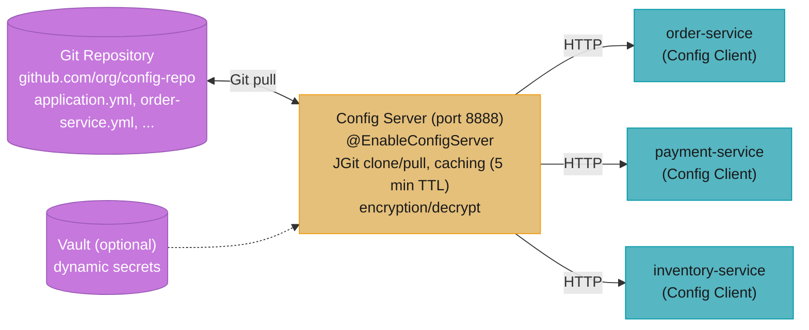
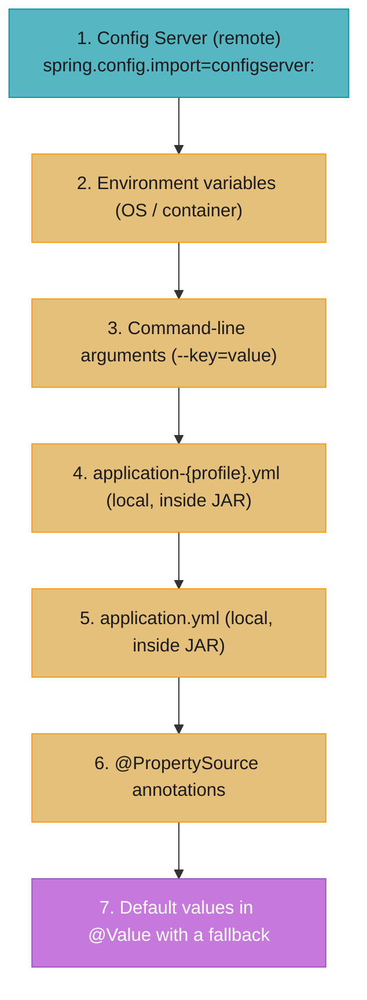
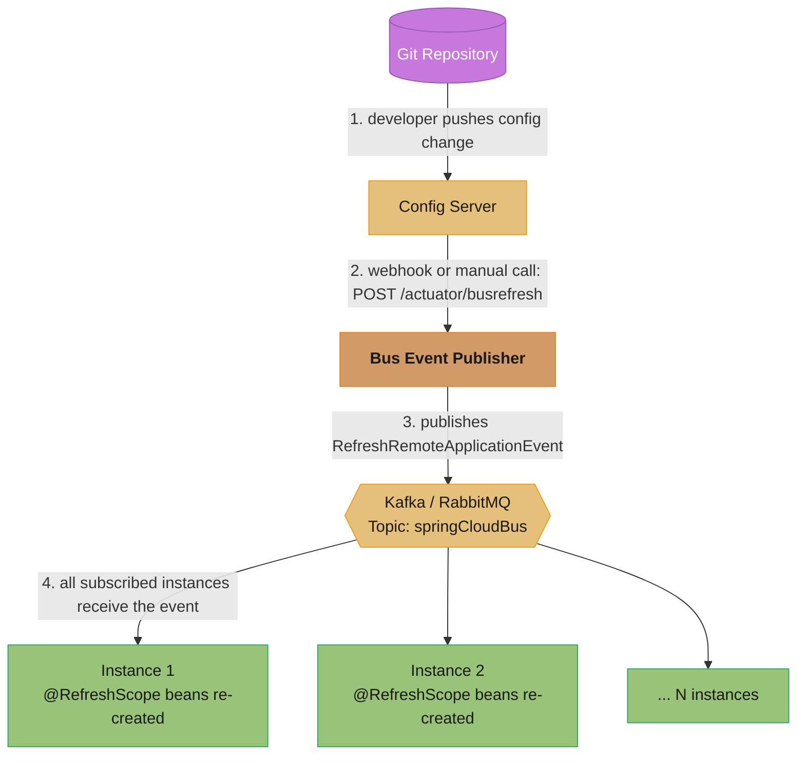
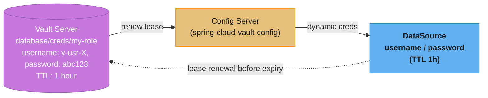
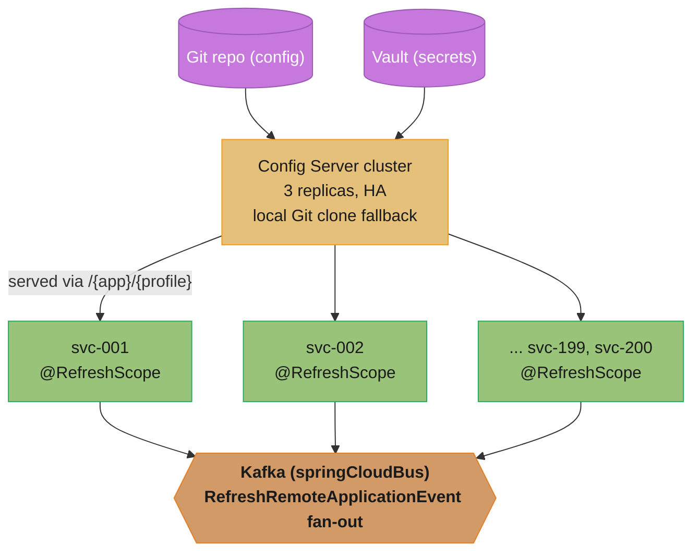
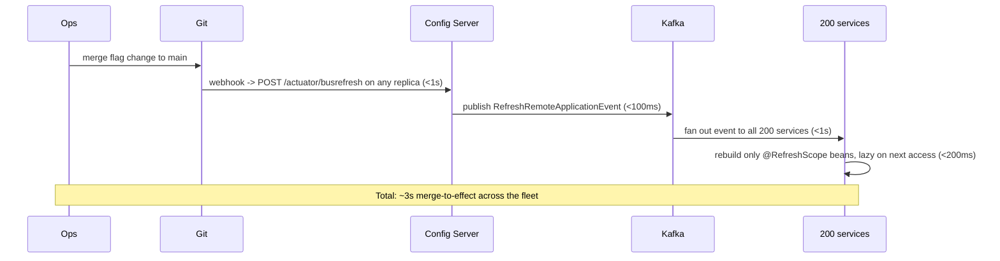

# Spring Cloud Config

---

## 1. Concept Overview

Spring Cloud Config provides server-side and client-side support for externalized configuration in a distributed system. Instead of bundling configuration inside each application artifact (JAR or Docker image), configuration is stored in a central repository — a Git repo, HashiCorp Vault, a relational database, or the filesystem — and served over HTTP to every service instance at startup.

The Config Server is a Spring Boot application that reads from one or more backends and exposes configuration as REST endpoints. Config Clients (microservices) fetch their configuration from the server on startup, meaning a single configuration change in Git propagates to every service without rebuilding or redeploying.

This module covers the full stack: server setup, client integration, runtime refresh with `@RefreshScope` and Spring Cloud Bus, Vault dynamic secrets, encryption of sensitive properties, and the production pitfalls that cause incidents during config refreshes.

---

## 2. Intuition

One-line analogy: the Config Server is a DNS server for application properties — every service asks "what are my settings?" at startup and the server answers from a single authoritative source.

Mental model: without external config, changing a database password requires rebuilding every affected JAR, tagging a new Docker image, and rolling every pod. With Config Server, you commit the new encrypted password to Git, call `/actuator/refresh` (or publish a bus event), and all running instances re-read the property — zero redeployment.

Why it matters: twelve-factor app principle III ("store config in the environment") applied at scale. Configuration drift between environments (dev/staging/prod) is the root cause of a significant percentage of production incidents. A single versioned, audited source of truth eliminates that class of bugs.

Key insight: Config Server trades deployment simplicity for operational complexity. You gain centralized control; you take on a new critical dependency. If Config Server is unavailable at startup, services that fail to fetch config will not start. Design for resilience from day one.

---

## 3. Core Principles

**Externalization.** Configuration is separated from application code and artifacts. The same Docker image runs in dev, staging, and production with different config values injected at runtime.

**Environment-specific profiles.** Spring's profile mechanism (`application-dev.yml`, `application-prod.yml`) is preserved. Config Server layers profile-specific values on top of default values using the same resolution order as local Spring Boot.

**Encryption at rest.** Sensitive values (passwords, API keys) are stored encrypted in the config repository (prefixed with `{cipher}`) and decrypted by the Config Server before serving to clients, or decrypted by the client itself.

**Versioned history.** When the backend is a Git repository, every configuration change is a commit. Rollback means reverting a commit. Audit trail is built in.

**Dynamic refresh.** Beans annotated with `@RefreshScope` are re-created when a refresh event occurs, picking up new property values without restarting the JVM.

---

## 4. Types / Architectures / Strategies

### Config Server Backends

| Backend | Use Case | Notes |
|---------|----------|-------|
| Git (GitHub, GitLab, Bitbucket) | Most common production use | Full version history, PR workflow for config changes |
| HashiCorp Vault | Secrets management, dynamic credentials | Lease-based, auto-rotating database passwords |
| JDBC (relational database) | Config in existing DB infrastructure | No version history out of the box; need manual versioning |
| Filesystem | Local development, testing | Not suitable for distributed production |
| AWS S3 / GCS | Cloud-native object storage | Useful when Git is not available; no branch model |
| Redis | Fast reads, simple key-value | No versioning; low operational overhead |

### Client Integration Styles

| Approach | Boot Version | Configuration |
|----------|-------------|---------------|
| `bootstrap.yml` / bootstrap context | Boot 2.x | `spring.cloud.config.uri` in bootstrap.yml; loads before ApplicationContext |
| `spring.config.import` | Boot 3.x (recommended) | `spring.config.import=configserver:http://config-server:8888` in application.yml |

### Refresh Strategies

| Strategy | Scope | Trigger | Complexity |
|----------|-------|---------|-----------|
| `/actuator/refresh` (HTTP POST) | Single instance | Manual or webhook | Low |
| Spring Cloud Bus + Kafka/RabbitMQ | All instances | Publish bus event | Medium |
| Polling (`spring.cloud.config.watch`) | Single instance | Timer | Low (but adds load) |
| Rolling restart | All instances | CI/CD pipeline | Low operationally but causes downtime |

---

## 5. Architecture Diagrams

### Config Server Overview



### Property Resolution Order (highest to lowest priority)



### Spring Cloud Bus Broadcast Refresh



### Vault Integration — Dynamic Database Credentials



---

## 6. How It Works — Detailed Mechanics

### Config Server Setup

```xml
<!-- pom.xml -->
<dependency>
    <groupId>org.springframework.cloud</groupId>
    <artifactId>spring-cloud-config-server</artifactId>
</dependency>
```

```java
@SpringBootApplication
@EnableConfigServer
public class ConfigServerApplication {
    public static void main(String[] args) {
        SpringApplication.run(ConfigServerApplication.class, args);
    }
}
```

```yaml
# application.yml for Config Server
server:
  port: 8888

spring:
  cloud:
    config:
      server:
        git:
          uri: https://github.com/org/config-repo
          default-label: main                    # Git branch
          search-paths: '{application}'           # look in subdirectory per app name
          clone-on-start: true                    # fail fast if Git unreachable
          timeout: 10                             # seconds; default is 5
          force-pull: true                        # always pull from remote, ignore local changes
          username: ${GIT_USERNAME}
          password: ${GIT_TOKEN}
      encrypt:
        fail-on-error: true
  security:
    user:
      name: configuser
      password: ${CONFIG_SERVER_PASSWORD}
```

### Config Client — Boot 3.x (spring.config.import)

```xml
<!-- pom.xml -->
<dependency>
    <groupId>org.springframework.cloud</groupId>
    <artifactId>spring-cloud-starter-config</artifactId>
</dependency>
<dependency>
    <groupId>org.springframework.boot</groupId>
    <artifactId>spring-boot-starter-actuator</artifactId>
</dependency>
```

```yaml
# application.yml in the microservice (Boot 3.x)
spring:
  application:
    name: order-service              # maps to order-service.yml in Config repo
  profiles:
    active: prod                     # maps to order-service-prod.yml
  config:
    import: "configserver:http://config-server:8888"
  cloud:
    config:
      username: configuser
      password: ${CONFIG_SERVER_PASSWORD}
      fail-fast: true                # fail startup if Config Server unreachable
      retry:
        initial-interval: 1000       # ms; retry on startup failure
        max-attempts: 6
        max-interval: 2000
        multiplier: 1.1

management:
  endpoints:
    web:
      exposure:
        include: refresh, health, info
```

### Bootstrap Context — Boot 2.x (legacy)

```yaml
# bootstrap.yml — loaded BEFORE ApplicationContext, before application.yml
spring:
  application:
    name: order-service
  cloud:
    config:
      uri: http://config-server:8888
      fail-fast: true
      username: configuser
      password: ${CONFIG_SERVER_PASSWORD}
  profiles:
    active: prod
```

```xml
<!-- Also requires bootstrap auto-configuration enabled in Boot 2.4+ -->
<dependency>
    <groupId>org.springframework.cloud</groupId>
    <artifactId>spring-cloud-starter-bootstrap</artifactId>
</dependency>
```

### @RefreshScope in Action

```java
@RestController
@RefreshScope  // bean is re-created when /actuator/refresh is called
public class FeatureFlagController {

    @Value("${feature.new-checkout-flow.enabled:false}")
    private boolean newCheckoutEnabled;

    @GetMapping("/checkout")
    public String checkout() {
        if (newCheckoutEnabled) {
            return newCheckoutFlow();
        }
        return legacyCheckoutFlow();
    }
}
```

```bash
# Trigger refresh on a single instance
curl -X POST http://order-service:8080/actuator/refresh
# Response: ["feature.new-checkout-flow.enabled"]  -- list of changed keys
```

### Spring Cloud Bus — Broadcast Refresh

```xml
<!-- pom.xml — add to every microservice and the Config Server -->
<dependency>
    <groupId>org.springframework.cloud</groupId>
    <artifactId>spring-cloud-starter-bus-kafka</artifactId>
    <!-- or spring-cloud-starter-bus-amqp for RabbitMQ -->
</dependency>
```

```yaml
# In microservices — Kafka transport
spring:
  kafka:
    bootstrap-servers: kafka:9092
  cloud:
    bus:
      enabled: true
      id: ${spring.application.name}:${server.port}:${random.uuid}
```

```bash
# Broadcast refresh to ALL instances of ALL services
curl -X POST http://any-service:8080/actuator/busrefresh

# Broadcast refresh to only order-service instances
curl -X POST http://any-service:8080/actuator/busrefresh/order-service:**
```

### Encrypting Sensitive Properties

```bash
# On Config Server: encrypt a value
curl -X POST http://config-server:8888/encrypt \
  -d 'supersecretpassword'
# Returns: AQA...base64encodedciphertext...

# In config repo (order-service.yml):
spring:
  datasource:
    password: '{cipher}AQA...base64encodedciphertext...'
    # Note: single quotes are required in YAML when value starts with {cipher}
```

```yaml
# Config Server: symmetric encryption key
encrypt:
  key: ${ENCRYPT_KEY}   # min 32 chars; store in Vault or environment variable

# For RSA asymmetric encryption (production recommended):
encrypt:
  key-store:
    location: classpath:/server.jks
    password: ${KEYSTORE_PASSWORD}
    alias: configserver
    secret: ${KEY_PASSWORD}
```

### Vault Backend Integration

```yaml
# Config Server application.yml — Vault backend
spring:
  cloud:
    config:
      server:
        vault:
          host: vault.internal
          port: 8200
          scheme: https
          authentication: TOKEN
          token: ${VAULT_TOKEN}
          kv-version: 2
          default-key-value-path: secret/data/{application}/{profile}
```

```yaml
# For dynamic database credentials (Vault database secret engine)
# Vault path: database/creds/order-service-role
# Config Server fetches lease-based credentials; they auto-expire and rotate
spring:
  datasource:
    url: jdbc:postgresql://db:5432/orders
    username: '${database.username}'    # populated dynamically from Vault
    password: '${database.password}'
```

### Config Server API Endpoints

```
GET /{application}/{profile}[/{label}]
# Example: GET /order-service/prod/main
# Returns merged config: application.yml + application-prod.yml + order-service.yml + order-service-prod.yml

GET /{application}/{profile}/{label}/{path}
# Serve a specific file (e.g., logback.xml)

POST /encrypt   -- encrypt a plaintext value
POST /decrypt   -- decrypt a ciphertext value
GET  /actuator/health -- Config Server health (includes Git connectivity)
```

---

## 7. Real-World Examples

**Feature flags across 200 services.** A large e-commerce platform stores feature flags in the Config Server Git repository. Product managers commit changes to `feature-flags.yml`. A webhook triggers `/actuator/busrefresh` on the Spring Cloud Bus Kafka topic. Within 3 seconds, all 200 service instances pick up the new flag values via `@RefreshScope` beans. No deployment required.

**Database password rotation in PCI-compliant environment.** A fintech uses HashiCorp Vault with the database secret engine. The Config Server fetches short-lived (1-hour TTL) PostgreSQL credentials from Vault. Before expiry, Vault renews the lease automatically. HikariCP's connection pool uses a custom DataSource wrapper that observes credential changes and invalidates the pool. Zero-downtime password rotation happens every hour without operator intervention.

**Multi-environment configuration.** A startup manages five environments (local, dev, staging, perf, prod) using Git branches. The Config Server maps branches to Spring profiles. A developer creates a pull request for the `staging` branch; a tech lead reviews the config change; merge triggers automatic deployment to staging services.

**Rollback after bad config push.** A database migration on prod required a connection string change. The change was committed to the config repo. Within 60 seconds, all pod instances picked up the new value via Bus refresh. The migration failed. The team reverted the Git commit. A second Bus refresh restored the old connection string. Total impact: 90 seconds. No redeployment, no image rebuild.

---

## 8. Tradeoffs

### Config Server vs Other Approaches

| Approach | Pros | Cons |
|----------|------|------|
| Spring Cloud Config Server + Git | Version history, PR workflow, familiar tooling | Config Server is a new SPOF; Git latency |
| HashiCorp Vault (direct) | Dynamic secrets, fine-grained ACLs | Higher operational complexity |
| Kubernetes ConfigMaps | Native K8s, no extra service | No encryption, no version history in etcd by default |
| AWS Parameter Store / Secrets Manager | Managed, IAM integration, audit trail | AWS-specific; costs at scale |
| Environment variables | Simple, twelve-factor | No central management, no dynamic refresh |

### Bootstrap Context vs spring.config.import

| Dimension | Bootstrap (Boot 2.x) | spring.config.import (Boot 3.x) |
|-----------|---------------------|--------------------------------|
| Phase | Before ApplicationContext | During ApplicationContext startup |
| Configuration | Separate bootstrap.yml | Single application.yml |
| Behavior on failure | App fails to start | Configurable (optional vs required) |
| Recommendation | Legacy; still supported | Preferred for new projects |

---

## 9. When to Use / When NOT to Use

**Use Spring Cloud Config when:**
- You operate multiple services across multiple environments and need centralized configuration management.
- Configuration changes need to be auditable (Git commit history) and reviewable (PR workflow).
- You need runtime configuration refresh without redeployment.
- You are already in the Spring ecosystem and want low integration friction.

**Do NOT use Spring Cloud Config when:**
- You run on Kubernetes and already use Helm + ConfigMaps effectively — adding Config Server duplicates infrastructure.
- You need secret management as a primary concern — use Vault or cloud provider secrets manager directly; bolt Config Server on top if needed.
- Your team is small and the operational overhead of running another service outweighs the benefits.
- Configuration changes are infrequent and a rolling restart is acceptable — simpler options like environment variables suffice.

---

## 10. Common Pitfalls

### Pitfall 1: Applying @RefreshScope to DataSource (causes connection pool destruction)

```java
// BROKEN: @RefreshScope re-creates the DataSource bean on every refresh event.
// All active connections in HikariCP are abandoned. Running transactions are killed.
// This cascades to JPA EntityManagerFactory, TransactionManager, and Repository beans.
@Bean
@RefreshScope   // DO NOT put RefreshScope on DataSource
public DataSource dataSource(DataSourceProperties props) {
    return DataSourceBuilder.create()
        .url(props.getUrl())
        .username(props.getUsername())
        .password(props.getPassword())
        .build();
}
```

```java
// FIXED option 1: keep DataSource as a singleton; only refresh lightweight config beans
// DataSource properties do not change frequently; handle credential rotation via Vault leases
// and a custom pool refresh mechanism, not @RefreshScope.

// FIXED option 2: use a routing DataSource wrapper that delegates; only replace the delegate
@Bean
public DataSource dataSource() {
    return new LazyConnectionDataSourceProxy(actualDataSource());
}
// Vault credential rotation: update credentials at the pool level, not the Spring bean level.
// HikariCP: hikari.setUsername() + hikari.setPassword() + hikari.softEvictConnections()
```

### Pitfall 2: bootstrap.yml vs spring.config.import confusion after Boot 3.x migration

```yaml
# BROKEN in Boot 3.x: bootstrap.yml is ignored without the bootstrap starter.
# Developer migrates from Boot 2 to Boot 3 but keeps bootstrap.yml.
# Config Server URL is never read; service starts with empty/default config.
# bootstrap.yml:
spring:
  cloud:
    config:
      uri: http://config-server:8888  # silently ignored in Boot 3.x without extra dep
```

```yaml
# FIXED: use spring.config.import in application.yml (Boot 3.x)
# application.yml:
spring:
  application:
    name: order-service
  config:
    import: "configserver:http://config-server:8888"
  cloud:
    config:
      fail-fast: true

# If you must keep bootstrap context in Boot 3.x (migration period):
# add spring-cloud-starter-bootstrap dependency explicitly.
```

### Pitfall 3: fail-fast not configured — silent startup with wrong config

```yaml
# BROKEN: if Config Server is unreachable, service starts with local defaults silently.
# The service may run for hours with stale or missing configuration before anyone notices.
spring:
  config:
    import: "optional:configserver:http://config-server:8888"  # optional means: if unavailable, continue
```

```yaml
# FIXED: use required import (default) with retry; fail loudly if Config Server is unavailable
spring:
  config:
    import: "configserver:http://config-server:8888"    # required by default (not optional)
  cloud:
    config:
      fail-fast: true
      retry:
        initial-interval: 1000
        max-attempts: 6
        max-interval: 2000
        multiplier: 1.1
```

### Pitfall 4: @Value fields not refreshed (only @ConfigurationProperties works with @RefreshScope)

```java
// BROKEN: @Value field injection does not pick up new values after refresh
// because the field is set once at bean creation time.
// Adding @RefreshScope to the class is necessary, but also the field must be
// accessed through the refreshed bean proxy — not captured in a local variable at init.
@Service
public class PricingService {

    private final double taxRate;  // captured at construction time, never updated

    public PricingService(@Value("${pricing.tax-rate}") double taxRate) {
        this.taxRate = taxRate;  // WRONG: constructor injection bypasses refresh
    }
}
```

```java
// FIXED option 1: use @RefreshScope + field injection (not constructor injection for refreshable props)
@Service
@RefreshScope
public class PricingService {

    @Value("${pricing.tax-rate}")
    private double taxRate;  // re-injected when bean is re-created by @RefreshScope

    public double calculateTax(double price) {
        return price * taxRate;
    }
}

// FIXED option 2 (preferred for complex config): use @ConfigurationProperties + @RefreshScope
@RefreshScope
@ConfigurationProperties(prefix = "pricing")
@Component
public class PricingProperties {
    private double taxRate;
    // getter/setter
}
```

### Pitfall 5: Sensitive values in plaintext in Git config repository

```yaml
# BROKEN: plaintext secret committed to Git — visible in commit history forever
# even after deletion, the secret lives in git log
spring:
  datasource:
    password: SuperSecret123!
```

```yaml
# FIXED: encrypt the value using Config Server's /encrypt endpoint
# The {cipher} prefix tells Config Server to decrypt before serving
spring:
  datasource:
    password: '{cipher}AQBkmJz...encryptedBase64...'

# Additionally: use .gitignore or separate private repo for sensitive environments
# Best practice: use Vault backend for secrets; use Git only for non-sensitive config
```

---

## 11. Technologies & Tools

| Tool | Role | Notes |
|------|------|-------|
| spring-cloud-config-server | Serves configuration over HTTP | Requires `@EnableConfigServer` |
| spring-cloud-starter-config | Config Client auto-configuration | Fetches config on startup |
| spring-cloud-starter-bus-kafka | Bus event transport (Kafka) | Enables broadcast refresh |
| spring-cloud-starter-bus-amqp | Bus event transport (RabbitMQ) | Alternative to Kafka for smaller deployments |
| spring-cloud-vault-config | Vault backend for Config Server | Supports KV v1/v2, dynamic secrets |
| Spring Boot Actuator | Exposes /refresh, /busrefresh | Required for runtime refresh |
| JGit | Git client embedded in Config Server | Clones and pulls config repo |
| HashiCorp Vault | Secrets manager | Dynamic credentials, fine-grained ACLs |
| Webhooks (GitHub/GitLab) | Trigger refresh on commit | POST to /actuator/busrefresh |

---

## 12. Interview Questions with Answers

**Q: What is Spring Cloud Config Server and what problem does it solve?**
Spring Cloud Config Server is a centralized configuration service that externalizes application configuration from the artifact. It solves configuration drift between environments: instead of each microservice maintaining its own `application.yml` baked into the Docker image, all services fetch their configuration from a single versioned source (typically a Git repository) at startup. Changes to configuration are auditable, reviewable via PRs, and can be applied at runtime without redeployment using `@RefreshScope`.

**Q: How does a Config Client fetch configuration in Spring Boot 3.x?**
In Boot 3.x, the client declares `spring.config.import=configserver:http://config-server:8888` in `application.yml`. During the `ApplicationContext` startup, Spring's `ConfigDataLocationResolver` sees the `configserver:` import, connects to the Config Server, and fetches properties for the current `spring.application.name` and active profiles. These remote properties are merged into the `Environment` with higher priority than local `application.yml`. In Boot 2.x, this was done via a separate `bootstrap.yml` loaded in a bootstrap context before the main context.

**Q: What is the difference between bootstrap context and spring.config.import?**
Bootstrap context (Boot 2.x) is a parent `ApplicationContext` that loads before the main context, specifically to resolve configuration from external sources. It requires a separate `bootstrap.yml` and the `spring-cloud-starter-bootstrap` dependency. `spring.config.import` (Boot 3.x) achieves the same goal in a single phase without a separate context: Spring's `ConfigData` infrastructure processes import declarations during the main context startup. The new approach is simpler (one config file), but the behavior on failure differs — `optional:configserver:` continues without the remote config, while the required form (default) fails the startup.

**Q: How does @RefreshScope work and what beans should NOT use it?**
`@RefreshScope` marks a bean as refresh-scoped. Spring wraps it in a proxy. When a refresh event is triggered (via `/actuator/refresh` or Spring Cloud Bus), the proxy destroys the underlying bean instance and re-creates it on the next method call, re-injecting all `@Value` fields and `@ConfigurationProperties` with current Environment values. Beans that should NOT use `@RefreshScope` include `DataSource` (re-creating destroys the connection pool and kills active transactions), `EntityManagerFactory`, `PlatformTransactionManager`, and any infrastructure beans whose lifecycle is tied to expensive resources. Apply `@RefreshScope` only to lightweight configuration holders and feature-flag beans.

**Q: How does Spring Cloud Bus work to broadcast configuration refresh?**
Spring Cloud Bus connects all service instances to a shared message broker topic (Kafka or RabbitMQ). When `/actuator/busrefresh` is called on any instance, that instance publishes a `RefreshRemoteApplicationEvent` to the bus topic. Every instance subscribed to the topic receives the event, calls its local `ContextRefresher`, and re-creates all `@RefreshScope` beans. This avoids calling `/actuator/refresh` on every pod individually — a single HTTP call triggers a coordinated refresh across the entire cluster. The destination can be scoped: `/actuator/busrefresh/order-service:**` only refreshes `order-service` instances.

**Q: How do you encrypt sensitive properties in the Config Server?**
The Config Server supports symmetric (AES) and asymmetric (RSA) encryption. Configure `encrypt.key` for symmetric or a JKS keystore for asymmetric. Call `POST /encrypt` with the plaintext value; the server returns the ciphertext. Store it in the config repo as `'{cipher}<ciphertext>'`. When a Config Client requests properties, the server (or client, depending on configuration) decrypts `{cipher}` prefixed values before delivery. The private key never leaves the Config Server. For production, RSA asymmetric encryption is preferred: the public key can be distributed to Config Clients for client-side decryption.

**Q: What is the priority order of configuration sources in a Spring Cloud Config client?**
From highest to lowest: (1) Config Server remote properties, (2) OS environment variables, (3) JVM system properties / command-line args, (4) `application-{profile}.yml` local to the JAR, (5) `application.yml` local to the JAR, (6) `@PropertySource` annotations, (7) default values. The Config Server properties intentionally override local files, which is the mechanism for enforcing environment-specific values centrally.

**Q: How does Vault integration work with Config Server for dynamic secrets?**
When the Vault backend is configured, Config Server connects to Vault using an authentication token (or AppRole, Kubernetes auth, etc.) and fetches secrets from the configured paths. For dynamic secrets (e.g., database credentials via Vault's database secret engine), Vault issues short-lived credentials with a lease TTL. Config Server holds a lease and renews it before expiry. When credentials are rotated (lease expires and a new lease is created), the Config Server can trigger a refresh event to push new credentials to clients. This creates a fully automated password rotation pipeline without any manual steps.

**Q: What happens if the Config Server is unavailable when a microservice starts?**
If `spring.cloud.config.fail-fast=true` (recommended), the service throws an exception during startup and does not proceed. Combined with retry configuration (`spring.cloud.config.retry.*`), the client retries with exponential backoff for a configurable number of attempts before failing. If `fail-fast=false` (or `optional:configserver:` import), the service starts with local defaults or no externalized config — which can lead to running in a misconfigured state silently. In production, `fail-fast=true` with retry is the correct setting because it is better to fail loudly than to run silently misconfigured.

**Q: How would you make the Config Server itself highly available?**
Deploy multiple Config Server instances behind a load balancer. Each instance independently clones the Git repository to a local working copy (configure a unique `basedir` per instance or use a shared filesystem). Config Server is stateless with respect to client connections — any instance can serve any client. For Git backend, the main concern is Git clone/pull latency; configure `clone-on-start: true` and an appropriate timeout. Register Config Server with a service registry (Eureka) so clients can discover it via load-balanced URL (`http://config-server/`) rather than a hardcoded IP.

**Q: What is the `spring.cloud.config.label` property and how does it map to Git branches/tags?**
`spring.cloud.config.label` specifies the Git branch, tag, or commit hash that the Config Server uses when cloning the repository. By default it is the backend's default branch (usually `main`). In a multi-environment setup, point different profiles to different branches: `dev` → `develop`, `prod` → `main`, a hotfix to a release tag. Clients set `spring.cloud.config.label=main` or the value can be embedded in the server configuration as `spring.cloud.config.server.git.default-label=main`. Using labels for environment isolation avoids the need for separate Config Server instances per environment — one server, multiple branches.

**Q: What are the risks of using `@RefreshScope` on beans that hold expensive resources, and how do you avoid in-production outages?**
When refresh is triggered, `@RefreshScope` destroys the underlying bean instance and marks it for re-creation on next access. For `DataSource`, this means: (1) all current HikariCP connections are destroyed mid-flight, causing `Connection is closed` for in-flight requests; (2) the new `DataSource` creates a fresh pool, causing a connection-acquisition burst to the database; (3) any thread holding an open `Connection` gets `Connection is closed` and throws. Avoid by never applying `@RefreshScope` to `DataSource`, `EntityManagerFactory`, `PlatformTransactionManager`, or Kafka consumers. For database credential rotation, use Vault dynamic secrets with credential renewal rather than Config Server refresh. Apply `@RefreshScope` only to thin configuration-holder beans (feature flags, rate-limit thresholds, external URL strings) where re-creation is instantaneous and safe.

**Q: How do you test configuration loading order and property overriding in Config Client integration tests?**
Use `@SpringBootTest` with `spring.config.import=optional:configserver:` to make the server optional for tests, then provide test properties via `@TestPropertySource` or `application-test.yml`. To test against a real Config Server in CI: use `@SpringBootTest` with Testcontainers to spin up a Config Server container, or use Wiremock to mock the Config Server's HTTP endpoints and return controlled JSON responses. For unit testing `@ConfigurationProperties` classes independently of the server: use `ApplicationContextRunner.withPropertyValues("prefix.key=value")` to test binding without any HTTP call. Verify `@RefreshScope` behaviour with `ContextRefresher.refresh()` called programmatically in the test.

**Q: What is the native profile in Config Server and how does it differ from the Git backend?**
The native profile (`spring.profiles.active=native`) serves configuration from the local file system or classpath rather than a Git repository. Files are searched in `search-locations` (default: `classpath:/`, `classpath:/config/`, `file:./`, `file:./config/`). This is primarily for: (1) **Local development** — no need for a running Git server. (2) **Kubernetes ConfigMap integration** — mount a `ConfigMap` as a file at a known path, point Config Server's `search-locations` to that path, and the native profile serves those YAML files. Each file follows the naming convention `{application}-{profile}.yml`. The native backend does not support encryption, history, or audit trail — use Git for production.

**Q: How does Spring Cloud Config handle configuration for multiple applications sharing a common base?**
The Config Server loads properties by combining three application names in order: the specific application's files, then `application-{profile}.{yml|properties}`, then `application.{yml|properties}`. Files named `application.*` (without a specific app name) are shared defaults loaded for all clients. A service named `order-service` requesting the `prod` profile gets: `application.yml` (shared base) → `application-prod.yml` (shared prod override) → `order-service.yml` (service-specific base) → `order-service-prod.yml` (service-specific prod override). Later files in the sequence override earlier ones. Use this layering to DRY configuration: common DB pool sizes in `application.yml`, environment-specific database URLs in `application-{env}.yml`, service-specific tuning in `{service}.yml`.

---

## 13. Best Practices

1. Use `spring.config.import=configserver:` (required, not optional) with `fail-fast: true` and retry in production. Silent startup with wrong config is worse than a failed startup.
2. Never put `@RefreshScope` on `DataSource`, `EntityManagerFactory`, or `PlatformTransactionManager`. Only use it on lightweight config-holder beans.
3. Store secrets in HashiCorp Vault, not in plaintext in the Git config repository. Use the `{cipher}` mechanism only as a last resort for non-Vault environments.
4. Use separate Git repositories for non-sensitive config (public repo) and sensitive config (private repo). Configure multiple backends in composite Config Server.
5. Configure a dedicated Git service account with read-only access to the config repository. Config Server does not need write access.
6. Set `clone-on-start: true` on the Config Server to detect Git connectivity problems at startup rather than on the first client request.
7. Tag every config change commit with a JIRA/issue ticket for full auditability. Enforce this via a commit hook.
8. Set `force-pull: true` to prevent local Git working copy drift. Without this, a corrupt local clone can serve stale config indefinitely.
9. Expose `/actuator/health` on the Config Server and include it in readiness probes. The health indicator reports Git backend connectivity.
10. Scope `busrefresh` events by service name (`/actuator/busrefresh/{service}:**`) during partial rollouts to avoid refreshing unrelated services.
11. Monitor the Config Server Git pull latency. A slow Git host causes increased startup times for all services. Consider a Git mirror (Gitea, Bitbucket Data Center) in the same network zone.
12. In Kubernetes, prefer mounting ConfigMaps for truly static configuration and use Config Server only for dynamic, frequently changing config to minimize the blast radius of a Config Server outage.

---

## 14. Case Study

### Scenario: Centralized Config for a 200-Service Platform with Vault Secrets and Bus Refresh

**Context.** A fintech platform runs **200 microservices** across multiple Kubernetes clusters. All non-secret configuration (feature flags, rate limits, downstream URLs, timeouts) lives in a Git repository served by **Spring Cloud Config Server**. Secrets (DB credentials, API keys) live in **HashiCorp Vault**, which the Config Server proxies so applications never talk to Vault directly. Config changes propagate without restart via **`@RefreshScope` + Spring Cloud Bus over Kafka**. Target: a flag flip reaches all 200 services in under 5 seconds.

### Architecture



### Bootstrap and Refresh Setup

```yaml
# application.yml on each service (Spring Boot 3.x uses spring.config.import, not bootstrap.yml)
spring:
  application:
    name: payment-service
  config:
    import: "optional:configserver:http://config-server:8888"
  cloud:
    config:
      fail-fast: true
      retry:
        max-attempts: 6
        initial-interval: 1000
        multiplier: 1.5
    bus:
      enabled: true
  kafka:
    bootstrap-servers: kafka-1:9092,kafka-2:9092,kafka-3:9092
```

```java
// A refresh-scoped DataSource: the bean is destroyed and rebuilt on /actuator/refresh,
// so a rotated DB password from Vault takes effect without a restart.
@Configuration
public class DataSourceConfig {

    @Bean
    @RefreshScope
    @ConfigurationProperties("app.datasource")
    public HikariDataSource dataSource() {
        return DataSourceBuilder.create().type(HikariDataSource.class).build();
    }
}
```



### Metrics

- Flag-flip propagation: **~3s** to all 200 services (was a 20-minute rolling restart).
- Config Server startup with local Git clone fallback: serves config in **<2s** even during a Git provider outage.
- Vault lease renewal handled by Config Server; services see refreshed secrets on the next bus refresh, **zero direct Vault calls** from 200 services.

### Pitfalls

**Pitfall 1 — 200 services hammering the Config Server on cold start.**
```yaml
# BROKEN: every pod retries instantly with no jitter; a cluster-wide rollout DDoSes the Config Server
spring.cloud.config.retry.initial-interval: 0
```
```yaml
# FIXED: exponential backoff with jitter + Config Server response caching staggers the herd
spring:
  cloud:
    config:
      retry: { initial-interval: 1000, multiplier: 1.5, max-attempts: 6 }
# plus deploy with maxSurge/maxUnavailable so pods come up in waves, not all at once
```

**Pitfall 2 — Single Config Server with no HA becomes a startup SPOF.**
```yaml
# BROKEN: one Config Server, no local cache; if it (or Git) is down, no service can start
spring.config.import: "configserver:http://config-server:8888"
```
```yaml
# FIXED: 3 replicas behind a Service VIP + server clones Git locally so it serves from disk during Git outages
spring:
  config:
    import: "optional:configserver:http://config-server:8888"   # optional avoids hard fail
# Config Server side:
  cloud:
    config:
      server:
        git:
          clone-on-start: true
          force-pull: true
          basedir: /data/config-cache   # persistent volume, local fallback
```

**Pitfall 3 — `@RefreshScope` on a `@Configuration` class does not refresh the property consumer.**
```java
// BROKEN: putting @RefreshScope on the config class does NOT make beans that already
// captured the value re-read it; the proxy wraps the factory, not the consumer.
@Configuration
@RefreshScope
public class RateLimitConfig {
    @Value("${rate.limit}") int limit;   // captured once; never updates
}
```
```java
// FIXED: put @RefreshScope on the BEAN that actually uses the property at runtime
@Service
@RefreshScope
public class RateLimiter {
    private final int limit;
    public RateLimiter(@Value("${rate.limit}") int limit) { this.limit = limit; }
    // on /actuator/refresh, the bean is recreated and the constructor re-reads ${rate.limit}
}
```

### Interview Q&A

**Why proxy Vault through the Config Server instead of having each service call Vault?** Centralizing Vault access means 200 services do not each need Vault tokens, network policy, or client libraries. The Config Server holds one Vault role, applies leasing/renewal once, and exposes secrets merged with Git config through a single `/{app}/{profile}` contract.

**What does Spring Cloud Bus add on top of `/actuator/refresh`?** `/actuator/refresh` refreshes one instance. Bus broadcasts a `RefreshRemoteApplicationEvent` over a shared broker (Kafka here) so a single `/actuator/busrefresh` triggers every subscribed instance, turning a per-pod operation into a fleet-wide fan-out.

**Why is `@RefreshScope` lazy, and what is the cost?** Refresh-scoped beans are wrapped in a proxy; on refresh the target is discarded and rebuilt on the next method call. The cost is a one-time rebuild latency and the requirement that the bean be safely re-creatable (no in-flight state lost), which is why a `DataSource` works but a stateful in-flight connection holder does not.

**What breaks if you refresh-scope a `DataSource` carelessly?** In-flight queries holding the old pool can fail when the bean is rebuilt mid-request. The safe pattern is a refresh-scoped Hikari pool with graceful shutdown semantics, refreshed during low traffic, or routing the changed value through a config bean rather than tearing down live connections.

**How do you prevent a config rollout from taking down the Config Server?** Stagger pod startup (Kubernetes `maxSurge`/`maxUnavailable`), use client retry with backoff and jitter, cache Config Server responses, and run multiple Config Server replicas with a local Git clone so reads survive a Git provider outage.

**How do you roll back a bad config change?** Revert the Git commit and fire `/actuator/busrefresh`. Because config is versioned in Git, rollback is a normal `git revert` plus a bus event, typically under two minutes, with full audit history of who changed what.

---

## Related / See Also

- [Spring Boot Configuration](../spring_boot_configuration/README.md) — @ConfigurationProperties
- [Case Study: Zero-Downtime Deploys](../case_studies/cross_cutting/zero_downtime_deploys_and_config.md) — @RefreshScope pitfalls
- [Secrets Management](../../devops/secrets_management/README.md) — Vault dynamic secrets, rotation, and encryption-at-rest patterns behind this module's Vault backend
