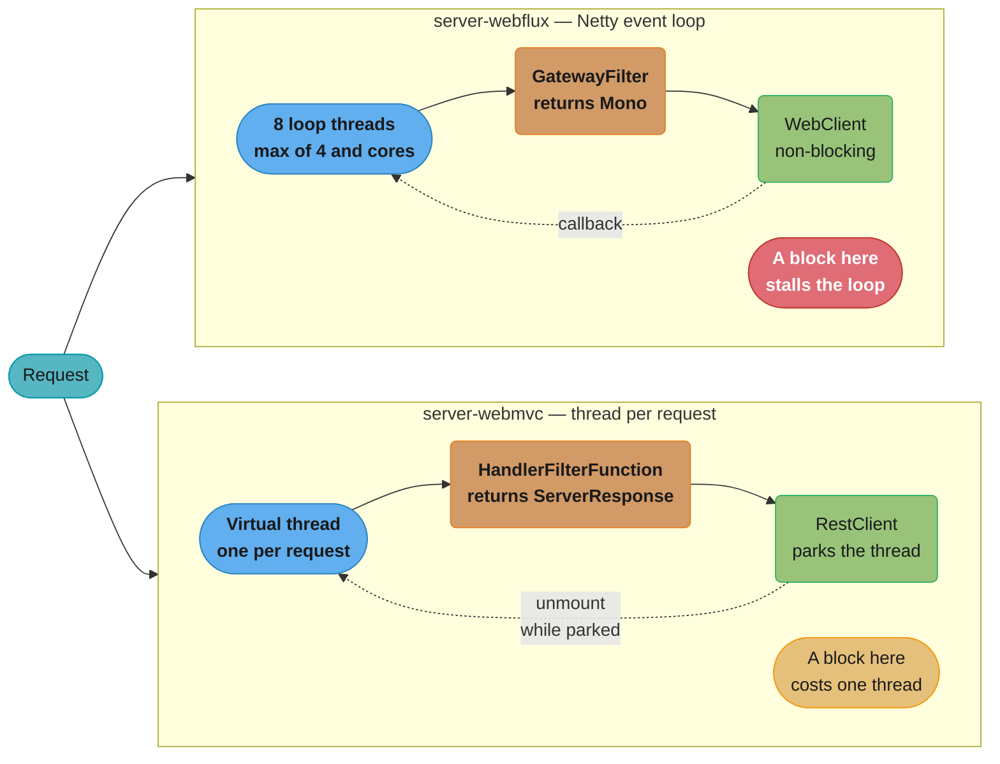
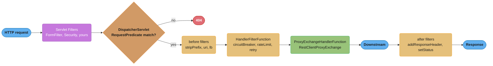

# Gateway Server WebMVC — the Servlet Flavour of Spring Cloud Gateway

Deep dive under [Spring Cloud Patterns](README.md), whose every code sample is the reactive
flavour: Netty, `Mono`, `GlobalFilter`. This file is the other half — the Servlet flavour,
`spring-cloud-gateway-server-webmvc`, where a route is a WebMvc.fn `RouterFunction`, a filter
is a `HandlerFilterFunction`, and **a blocking call inside a filter is legal rather than
fatal**. That last clause is why the flavour exists; understand it before anything else here.

Version baseline: Spring Boot **4.1.x** (GA 2026-06-10), Spring Framework **7.x**, Spring
Cloud **2025.1.0 "Oakwood"**, Java **25 LTS**.

---

## 1. Concept Overview

Spring Cloud Gateway ships as two server artifacts sharing a project, a release train, a
documentation site, and — almost entirely — a vocabulary:

| Flavour | Starter | Runtime | Property prefix |
|---------|---------|---------|-----------------|
| Reactive | `spring-cloud-starter-gateway-server-webflux` | Netty + Project Reactor | `spring.cloud.gateway.server.webflux.*` |
| Servlet | `spring-cloud-starter-gateway-server-webmvc` | Tomcat/Jetty + WebMvc.fn | `spring.cloud.gateway.server.webmvc.*` |

Both are `org.springframework.cloud`. The bare `spring-cloud-starter-gateway` is the legacy
coordinate, stopping at the 4.3.5 line while the renamed server starters carry the current
5.0.x stream. The bare `spring.cloud.gateway.*` property prefix is likewise gone: every route,
filter toggle and header setting lives under one of the two `server.<flavour>` subtrees.

Genuinely shared: the **route model** (id, uri, predicates, filters, metadata, order), the
**predicate vocabulary** (`Path`, `Host`, `Method`, `Header`, `Query`, `Cookie`, `Weight`,
`After`/`Before`/`Between`, `Version`), and **most filters by name** (`StripPrefix`,
`RewritePath`, `AddRequestHeader`, `CircuitBreaker`, `Retry`, `TokenRelay`, …) — a YAML route
file transplants with a prefix rename and little else. Not shared and not shareable: the
**runtime**, the **filter signature** and the **threading model** — the content of this file.

---

## 2. Intuition

**One-line analogy.** WebFlux gateway is a call centre with eight operators who must never be
put on hold; WebMVC gateway is one with two hundred operators who may be — and with virtual
threads, one that hires an operator per call.

**Mental model.** A gateway is mostly *waiting* for the downstream response; the flavours
differ only in what does the waiting. Reactive: a callback registered against a shared event
loop, so nothing occupies a thread while waiting — but nothing may *block* that loop either.
Servlet: a thread parked on a socket read, simple and debuggable, costing a thread per
in-flight request unless the thread is virtual, in which case it costs heap.

**Why it matters.** The most common thing a real gateway filter does is call something that
blocks: a JDBC API-key table, a JWT introspection endpoint behind a synchronous SDK, a legacy
entitlement service. In WebFlux that is an incident waiting for load; in WebMVC it is a method
call.

**Key insight.** Choose by the shape of *your filter code*, not by a throughput benchmark.
Since JDK 21 gave virtual threads and JDK 24 (JEP 491) removed `synchronized` pinning, the
servlet flavour's concurrency ceiling is no longer a reason to avoid it. Pick reactive because
your filters are already reactive and your team writes Reactor fluently — not because reactive
is faster at proxying bytes.

---

## 3. Core Principles

**A route is a `RouterFunction<ServerResponse>` bean.** No gateway-specific route registry:
routes are ordinary WebMvc.fn router functions using a proxying `HandlerFunction`, dispatched
by `DispatcherServlet` like any other functional endpoint. YAML routes are translated into
exactly the same objects at startup.

**A filter is a function, not an interface implementation.**
`HandlerFilterFunction<ServerResponse, ServerResponse>` is functional: `(request, next) ->
response`. Compare `GatewayFilter`'s `Mono<Void> filter(ServerWebExchange, GatewayFilterChain)`
— the servlet form returns the response, the reactive form a completion signal after mutating
the exchange. Narrower shapes exist for common cases: request-only is a `Function<ServerRequest,
ServerRequest>`, response-only a `BiFunction<ServerRequest, ServerResponse, ServerResponse>`,
adapted by `HandlerFilterFunction.ofRequestProcessor()`/`ofResponseProcessor()`.

**Blocking is a permitted operation.** Nothing in the servlet stack forbids it; it costs a
request-carrying thread for its duration, priced by whether that thread is platform or virtual.

**Servlet filters are still in the picture.** A `jakarta.servlet.Filter` runs around the whole
dispatch, route matching included — the servlet answer to `GlobalFilter`, and the source of
ordering concerns the reactive flavour never has.

---

## 4. Types / Architectures / Strategies

### The filter shapes

| Shape | Type | Registered with | Use for |
|-------|------|-----------------|---------|
| Before | `Function<ServerRequest, ServerRequest>` | `.before(...)` | header/path/param rewriting, target URI |
| After | `BiFunction<ServerRequest, ServerResponse, ServerResponse>` | `.after(...)` | response headers, status rewriting |
| Around | `HandlerFilterFunction<ServerResponse, ServerResponse>` | `.filter(...)` | auth short-circuit, circuit breaker, retry, rate limit |
| Servlet-wide | `jakarta.servlet.Filter` | `@Bean` + `Ordered` | correlation ids, MDC, anything preceding route matching |

Only the around shape can short-circuit; the first two run around a call that happens anyway.

### Signature comparison

| Concern | `-webflux` | `-webmvc` |
|---------|-----------|----------|
| Per-route filter | `GatewayFilter` | `HandlerFilterFunction<ServerResponse, ServerResponse>` |
| All-routes filter | `GlobalFilter` bean | Servlet `Filter` bean, or `.filter()` on the composed `RouterFunction` |
| Request object | `ServerHttpRequest`, `mutate()` | `ServerRequest`, `ServerRequest.from(req)` |
| Return type / chain call | `Mono<Void>`, `chain.filter(exchange)` | `ServerResponse`, `next.handle(request)` |
| Short-circuit | set status, `response.setComplete()` | `return ServerResponse.status(...).build()` |
| Ordering | `Ordered`/`@Order` on the bean | declaration order in the route builder |

### Route declaration forms and URI schemes

Routes come from YAML (`spring.cloud.gateway.server.webmvc.routes[]` — `id`, `uri`,
`predicates`, `filters`, `metadata`, `order`; identical in shape to the reactive flavour) or
from the Java DSL (`GatewayRouterFunctions.route("id")` returns a `RouterFunctions.Builder`;
chain `.GET(path, http())` or `.route(predicate, http())`, then `.before(...)`,
`.filter(...)`, `.after(...)`, `.build()`). Both coexist, with `order` deciding precedence.

A route `uri` may use the schemes `http`, `https`, `forward`, `fn`, `stream`, `no`, and `lb`
(load-balanced, requires `spring-cloud-starter-loadbalancer`). Each resolves through a
`<scheme>HandlerFunctionDefinition` bean at startup — also the extension point for your own.

---

## 5. Architecture Diagrams

### The two request paths, side by side



The mirrored boxes are one pipeline twice; only the middle type signature and the bottom node's
consequence differ. A blocking call is *loop-wide* on the left, *per-request* on the right —
and on a virtual thread the park does not even hold a carrier.

### Where a WebMVC route actually lives



`ProxyExchangeHandlerFunction` delegates to `RestClientProxyExchange`, built from Spring Boot's
own `RestClient.Builder` — so the proxy's connect and read timeouts come from Boot's
`spring.http.client.*`. The reactive flavour's
`spring.cloud.gateway.server.webflux.httpclient.*` has no servlet equivalent.

---

## 6. How It Works — Detailed Mechanics

### Dependencies and the property tree

Three `org.springframework.cloud` starters, versionless under the `spring-cloud-dependencies`
BOM: `spring-cloud-starter-gateway-server-webmvc`, plus
`spring-cloud-starter-loadbalancer` for `lb://`, plus
`spring-cloud-starter-circuitbreaker-reactor-resilience4j` for the `CircuitBreaker` filter.
That last coordinate reads wrong and is right — it is what the docs specify for **both**
flavours, and the "reactor" in the name is a Spring Cloud CircuitBreaker packaging detail, not
a sign you picked the wrong gateway.

```yaml
spring:
  threads.virtual.enabled: true     # Boot 3.2+; Tomcat runs a virtual thread per request
  http.client:
    connect-timeout: 2s             # the gateway's internal proxying RestClient
    read-timeout: 5s                # the servlet answer to httpclient.response-timeout
  cloud.gateway.server.webmvc:
    enabled: true                   # false keeps the starter but disables the gateway
    streaming-buffer-size: 16384             # default
    trusted-proxies: "10\\.0\\.\\d+\\.\\d+"  # regex; gates Forwarded/X-Forwarded trust
    forwarded-by-enabled: false              # default
    use-framework-retry-filter: false        # default; true forces Framework retry
    routes:
      - id: order-service-route
        uri: lb://order-service     # lb scheme -> LoadBalancerClient resolution
        order: 0
        predicates: [Path=/api/orders/**]
        filters:
          - StripPrefix=1
          - AddRequestHeader=X-Gateway-Flavour, webmvc
          - name: CircuitBreaker
            args:
              name: orderServiceCB
              fallbackUri: forward:/fallback/orders
              statusCodes: [500, "SERVICE_UNAVAILABLE"]
```

Every property above is real and current. The notable absentees relative to the reactive
flavour: `httpclient.*` (replaced by Boot's `spring.http.client.*`) and `redis-rate-limiter`.

### The Java route DSL

```java
// statics: GatewayRouterFunctions.route, HandlerFunctions.http,
//          GatewayRequestPredicates.path, BeforeFilterFunctions.{stripPrefix,uri},
//          LoadBalancerFilterFunctions.lb, CircuitBreakerFilterFunctions.circuitBreaker
@Configuration
class RouteConfiguration {

    @Bean
    RouterFunction<ServerResponse> orderRoutes() {
        return route("order-service-route")
            .route(path("/api/orders/**"), http())   // empty http(): target set by a filter
            .before(stripPrefix(1))                  // /api/orders/9 -> /orders/9
            .filter(lb("order-service"))             // MUST follow stripPrefix — pitfall 3
            .filter(circuitBreaker("orderServiceCB",
                    URI.create("forward:/fallback/orders")))
            .build();
    }

    @Bean   // fixed target instead of a service id
    RouterFunction<ServerResponse> staticTargetRoute() {
        return route("legacy-route").GET("/legacy/**", http())
            .before(uri("https://legacy.internal.example.com")).build();
    }
}
```

`HandlerFunctions.http(String)` and `http(URI)` are deprecated. The current form is the
no-argument `http()`, which reads its target from the `MvcUtils.GATEWAY_REQUEST_URL_ATTR`
request attribute — the attribute that `uri()` and `lb()` write. That indirection is what lets
a load balancer choose the host after the route has already matched.

### The same filter, written both ways

An API-key check that rejects unknown keys and forwards the resolved tenant downstream. The
lookup is a JDBC call.

```java
// ---------- server-webflux: a GlobalFilter bean, body shown ----------
// The JPA repository is unusable here: it must become R2DBC, or the call must be pushed onto
// Schedulers.boundedElastic(). There is no third option.
public Mono<Void> filter(ServerWebExchange exchange, GatewayFilterChain chain) {
    String key = exchange.getRequest().getHeaders().getFirst("X-API-Key");
    return reactiveRepo.findByKey(key)                          // R2DBC, not JPA
        .flatMap(entity -> chain.filter(exchange.mutate()
            .request(exchange.getRequest().mutate()
                .header("X-Tenant-Id", entity.tenantId()).build())
            .build()))
        .switchIfEmpty(Mono.defer(() -> {
            exchange.getResponse().setStatusCode(HttpStatus.UNAUTHORIZED);
            return exchange.getResponse().setComplete();
        }));
}

// ---------- server-webmvc: a HandlerFilterFunction, whole thing ----------
// Plain JPA. No scheduler, no switchIfEmpty, no Mono.defer. A null check is a null check.
static HandlerFilterFunction<ServerResponse, ServerResponse> apiKey(ApiKeyRepository repo) {
    return (request, next) -> {
        ApiKeyEntity entity = repo.findByKey(request.headers().firstHeader("X-API-Key"));
        if (entity == null) {
            return ServerResponse.status(HttpStatus.UNAUTHORIZED).build();
        }
        return next.handle(ServerRequest.from(request)
            .header("X-Tenant-Id", entity.tenantId()).build());
    };
}
// Per route: .filter(apiKey(repo)).  Across routes, filter the composed RouterFunction:
// orderRoutes().and(userRoutes()).filter(apiKey(repo));
```

The reactive version is longer not because Reactor is verbose but because the repository had
to change technology to satisfy the runtime. That is the cost the servlet flavour removes.

### Where the concurrency comes from

Without virtual threads, the servlet gateway is capped by Tomcat's thread pool
(`server.tomcat.threads.max`, default **200**), and each platform thread reserves on the order
of **1 MB** of stack. Arithmetic, by Little's Law, for a route whose downstream takes 40 ms:

```
  concurrency ceiling = threads / service time
  webflux, 8 loops, PURE filters      loops idle while waiting -> memory-bound, not 8-bound
  webflux, 8 loops, ONE 40 ms BLOCK   8 / 0.040   =   200 req/s   <- hard ceiling
  webmvc,  200 platform threads       200 / 0.040 = 5,000 req/s
  webmvc,  virtual threads            bounded by the connection pool, not by threads
```

The second row is the whole point: a blocking call collapses the reactive gateway to the
arithmetic of its *eight* threads, far below the servlet gateway's two hundred. Reactive is
faster **only while the no-blocking invariant holds**, and dramatically slower once broken.

`spring.threads.virtual.enabled=true` makes Tomcat run one virtual thread per request. A parked
virtual thread unmounts from its carrier, so 20,000 in-flight requests cost heap, not 20,000
stacks. **Since JEP 491 in JDK 24, `synchronized` no longer pins a virtual thread** — the
monitor belongs to the virtual thread itself, so a thread blocking inside a `synchronized`
block releases its carrier. So the "rewrite `synchronized` to `ReentrantLock` first" rule was
real for JDK 21–23 and is obsolete on Java 25, and `-Djdk.tracePinnedThreads` was **removed**
in JDK 24, replaced by the JFR event `jdk.VirtualThreadPinned` (on by default, 20 ms
threshold). What still pins is **native frames**: a JNI call or an FFM downcall holds the
carrier for its duration — exactly what a filter calling a native crypto library does.

### Two filters that are not the same filter

The reactive `RequestRateLimiter` is a Redis token bucket driven by a Lua script, configured
entirely in YAML with a SpEL `key-resolver`. The servlet `RateLimiter` filter is **Bucket4j**:

```java
// Bucket4j needs an AsyncProxyManager<String> bean, e.g. new CaffeineProxyManager<>(
// Caffeine.newBuilder().maximumSize(100), Duration.ofMinutes(1)).asAsync() — but Caffeine
// is per-instance; use Redis or Hazelcast for a limit shared across replicas.
@Bean
RouterFunction<ServerResponse> rateLimitedRoute() {
    return route("rate_limited_route").GET("/api/**", http())
        .before(uri("https://example.org"))
        .filter(rateLimit(c -> c.setCapacity(100)          // 100 tokens ...
            .setPeriod(Duration.ofMinutes(1))              // ... refilled each minute
            .setKeyResolver(r -> r.servletRequest().getUserPrincipal().getName())))
        .build();
}
```

Defaults: rejection status **429**, `tokens` per request **1**, remaining count in
**`X-RateLimit-Remaining`**, no `timeout` unless set. Two traps: **the key resolver can only be
configured in the Java DSL, never through external properties**, and a resolver producing no
key denies with **403 FORBIDDEN**, not 429 — which reads as an authorization bug in the logs.

The `Retry` filter picks its own implementation at runtime: Spring Retry if on the classpath
(`GatewayRetryFilterFunctions`), otherwise Spring Framework 7's core resilience support
(`FrameworkRetryFilterFunctions`). Spring Retry is maintenance-only and its branch will be
removed, so set `spring.cloud.gateway.server.webmvc.use-framework-retry-filter: true` rather
than letting a transitive dependency decide. Parameters are `retries`, `methods`, `series`,
`exceptions`, `cacheBody`, and `backoff` (delay `firstBackoff * factor^n`, capped at
`maxBackoff`). Note the absence of `statuses` — the servlet flavour has only `series`.

---

## 7. Real-World Examples

**A JDBC-backed API-key gateway.** A B2B platform authenticates partners by an API key in
PostgreSQL. On the reactive flavour this forced either an R2DBC rewrite of a table owned by
three other services, or a `boundedElastic` offload reintroducing the thread pool the reactive
stack existed to avoid. On `-webmvc` with virtual threads the existing `JdbcTemplate` DAO is
called from a `HandlerFilterFunction` — nine lines of filter, DAO untouched.

**Opaque-token introspection at the edge.** An OAuth2 deployment validates opaque tokens
through the authorization server's introspection endpoint using a synchronous vendor SDK. On
the servlet flavour that is an ordinary method call inside a filter; on the reactive flavour
every call site needs a `subscribeOn(...)` wrapper plus a scheduler to size and monitor.

**Gradual adoption inside a Spring MVC shop.** A team with no Reactor experience needed a
gateway: whole stack MVC, debugging by stack trace, tests in `MockMvc`. Adopting `-webmvc`
cost one new dependency; `-webflux` would have cost a paradigm. That gateway carries
1,200 req/s across 14 routes on three replicas. Reactive still wins the opposite shape — SSE
for 150,000 mostly-idle subscribers, where no per-connection thread exists even to unmount.

---

## 8. Tradeoffs

| Dimension | `-webflux` | `-webmvc` |
|-----------|-----------|----------|
| Server | Netty (Reactor Netty) | Tomcat / Jetty |
| Concurrency unit | Event loop, `max(4, cores)` workers | Thread per request (platform or virtual) |
| Blocking in a filter | Fatal — stalls every request on that loop | Legal — costs one thread |
| Stack traces / debugging | Reactor-assembled, stepping across operators | Ordinary and linear |
| Testing | `WebTestClient` | `MockMvc` / `WebTestClient` / `RestClient` |
| Idle connection cost | Lowest | Low with virtual threads |
| Route model, predicates, path/header filters | Same | Same |
| `CircuitBreaker` filter | Yes | Yes (`forward:` fallback only) |
| `Retry` filter | Yes, with `statuses` | Yes, with `series` (no `statuses`) |
| Rate limiting | Redis token bucket, YAML key-resolver | Bucket4j, key resolver Java-DSL only |
| HTTP client tuning | `…webflux.httpclient.*` | Boot `spring.http.client.*` |
| Global filter | `GlobalFilter` bean | Servlet `Filter`, or `RouterFunction.filter()` |
| WebSocket proxying / client backpressure | Yes | **No** |

**The last row ends arguments.** If the gateway must proxy WebSocket upgrades, the servlet
flavour is not a candidate, and no virtual-thread reasoning changes that.

---

## 9. When to Use / When NOT to Use

**Use `-webmvc` when** any filter needs to block and rewriting the dependency reactively is
not worth it; the team's fluency, tooling and on-call habits are servlet-shaped; or you want
gateway code a Spring MVC developer can read on day one. Java 21+ with
`spring.threads.virtual.enabled` is effectively a prerequisite.

**Do NOT use `-webmvc` when** you must proxy WebSocket upgrades or need backpressure
propagated to the client; when you are below Java 21 with no path to virtual threads *and*
expect more than a few hundred concurrent in-flight requests (200 platform threads is a real
ceiling); or when a filter calls into native code on every request — JNI/FFM frames still pin
the carrier, so virtual threads stop helping exactly where you needed them.

**Migrate an existing `-webflux` gateway when** its filters already contain
`subscribeOn(Schedulers.boundedElastic())` — the reactive stack telling you it is a thread pool
with extra steps — or the reactive-only dependencies exist solely to satisfy the gateway.

**Do NOT migrate when:**
- WebSocket routes exist, or a very large number of idle long-lived connections do.
- Filters use Reactor for genuine composition — `Flux` fan-out, `zip`, windowing — rather than
  as an async wrapper. That code has no servlet equivalent; it would be rewritten, not ported.
- The only complaint is "Reactor is hard". Team training is cheaper than an edge rewrite.

---

## 10. Common Pitfalls

### Pitfall 1: the blocking call in a reactive filter — the mistake this file exists to prevent

```java
// BROKEN (-webflux): a blocking JDBC lookup on a Netty event loop thread. Reactor Netty
// sizes its worker pool at max(4, availableProcessors) — 8 on an 8-core box — and while
// this thread sits in findByKey() it serves NO other request on that loop.
public Mono<Void> filter(ServerWebExchange exchange, GatewayFilterChain chain) {
    String key = exchange.getRequest().getHeaders().getFirst("X-API-Key");
    ApiKeyEntity entity = jpaRepo.findByKey(key);   // 40 ms, blocking, on the loop
    if (entity == null) {
        exchange.getResponse().setStatusCode(HttpStatus.UNAUTHORIZED);
        return exchange.getResponse().setComplete();
    }
    return chain.filter(exchange);
}
// Ceiling: 8 loops / 0.040 s = 200 req/s for the ENTIRE gateway, all routes, including the
// ones that never touch this filter. Latency degrades as a queue, not a slowdown: p50 stays
// flat until saturation, then p99 goes to seconds within one traffic step.
```

```java
// FIX A (stay reactive): the repository must become reactive — R2DBC, not JPA.
return reactiveRepo.findByKey(key).flatMap(entity -> chain.filter(exchange))
    .switchIfEmpty(Mono.defer(() -> unauthorized(exchange)));

// FIX B (stay reactive, keep JDBC): offload — and accept that you now own a thread pool.
return Mono.fromCallable(() -> repo.findByKey(key))
    .subscribeOn(Schedulers.boundedElastic())    // default cap: 10 x cores threads
    .flatMap(entity -> chain.filter(exchange));

// FIX C (change flavour): the same lookup on -webmvc, unmodified, on a virtual thread.
return (request, next) -> {
    ApiKeyEntity entity = repo.findByKey(request.headers().firstHeader("X-API-Key"));
    return entity == null
        ? ServerResponse.status(HttpStatus.UNAUTHORIZED).build()
        : next.handle(request);
};
```

Fix B is the tell: a reactive gateway full of `boundedElastic` has already chosen
thread-per-request and is paying Reactor's syntax for it. Fix C is the honest version.

### Pitfall 2: expecting `GlobalFilter` to exist

```java
// BROKEN (-webmvc): compiles against nothing. GlobalFilter ships only in the webflux module,
// and adding that artifact to get the type pulls the reactive gateway into the same context.
@Component
class CorrelationIdFilter implements GlobalFilter { /* ... */ }

// FIXED: a servlet filter — and it runs before route matching, which GlobalFilter never did.
@Component
class CorrelationIdFilter extends OncePerRequestFilter implements Ordered {

    @Override
    protected void doFilterInternal(HttpServletRequest req, HttpServletResponse res,
                                    FilterChain chain) throws ServletException, IOException {
        String id = Optional.ofNullable(req.getHeader("X-Correlation-Id"))
                            .orElseGet(() -> UUID.randomUUID().toString());
        MDC.put("correlationId", id);
        try {
            res.setHeader("X-Correlation-Id", id);
            chain.doFilter(req, res);
        } finally {
            MDC.remove("correlationId");
        }
    }

    @Override public int getOrder() { return Ordered.HIGHEST_PRECEDENCE + 10; }
}
// Gateway-scoped alternative: orderRoutes().and(userRoutes()).filter(correlationId());
```

### Pitfall 3: `lb()` declared before a path-manipulating filter

```java
// BROKEN: lb() resolves and rewrites the URI, then stripPrefix mangles the resolved path.
route("orders").route(path("/api/orders/**"), http())
    .filter(lb("order-service"))
    .before(stripPrefix(1))
    .build();

// FIXED: path-touching filters run first; lb() resolves the final URI last.
route("orders").route(path("/api/orders/**"), http())
    .before(stripPrefix(1))
    .filter(lb("order-service"))
    .build();
```

This trap is Java-DSL-only: the `lb:` **scheme** in YAML places the filter at highest
precedence automatically, an argument for keeping routes in YAML and the DSL for filters.

### Pitfall 4: a `@LoadBalanced RestClient.Builder` in the same context

```java
// BROKEN: the gateway builds its internal proxying RestClient from the context's
// RestClient.Builder, so @LoadBalanced makes Spring Cloud LoadBalancer intercept EVERY
// outbound call from it — the gateway's own proxy exchange included — attempting service
// discovery before lb() has resolved a target.
@Bean @LoadBalanced
RestClient.Builder restClientBuilder() { return RestClient.builder(); }
// Runtime symptom: IllegalArgumentException: Service Instance cannot be null

// FIXED: leave the shared builder plain; give application code its own load-balanced bean.
// Gateway routes then use lb() or lb:// exclusively, never a @LoadBalanced client.
@Bean
RestClient.Builder restClientBuilder() { return RestClient.builder(); }

@Bean @LoadBalanced
RestClient.Builder appLoadBalancedRestClientBuilder() { return RestClient.builder(); }
```

### Pitfall 5: two servlet-stack surprises with no reactive analogue

*Ordering against `FormFilter`.* A servlet container merges `application/x-www-form-urlencoded`
bodies into the request parameter map, consuming the body; Gateway's `FormFilter` rebuilds it
for the downstream. Any filter of yours that reads parameters before running the chain must be
ordered **before** it — `return FormFilter.FORM_FILTER_ORDER - 1;` from `getOrder()`, not a
guessed `HIGHEST_PRECEDENCE` — or the downstream gets empty POST bodies while the logs look
healthy.

*Spring Security's `StrictHttpFirewall`.* Adding `spring-boot-starter-security` makes every
request require authentication by default and installs the firewall, which rejects URLs
containing `%2F`, `//`, or a backslash with **400 Bad Request before any route is matched**.
The symptom is a route that "does not work" while the logs show no route evaluation at all,
sending people to debug predicates that were never consulted. Relax it only for the encodings
your downstream genuinely needs, never as a blanket `setAllowUrlEncodedSlash(true)` on a
gateway whose downstreams resolve paths against a filesystem.

### Pitfall 6: pasting the reactive rate limiter's YAML

A `- name: RequestRateLimiter` block with `redis-rate-limiter.replenishRate` and
`key-resolver: "#{@userKeyResolver}"` is the `-webflux` shape. On `-webmvc` there is no
`redis-rate-limiter` block and no SpEL key-resolver argument, so that is not the filter you
think you configured — the servlet flavour needs an `AsyncProxyManager<String>` bean plus a
Java-DSL `rateLimit(...)` filter carrying the resolver. Budget for it in a migration:
rate-limiting rules are the one part of a route set that does not port by prefix rename.

---

## 11. Technologies & Tools

| Tool | Role | Notes |
|------|------|-------|
| `spring-cloud-starter-gateway-server-webmvc` | The servlet gateway | Disable with `spring.cloud.gateway.server.webmvc.enabled=false` |
| Spring WebMvc.fn | Route and filter substrate | `RouterFunction`, `ServerRequest`, `HandlerFilterFunction` |
| Tomcat (default) / Jetty | Servlet runtime | `server.tomcat.threads.max` default 200 |
| Virtual threads | Concurrency model | `spring.threads.virtual.enabled=true`; Boot 3.2+ |
| Spring Boot `RestClient` | The proxy exchange client | Tuned via `spring.http.client.*` |
| `spring-cloud-starter-loadbalancer` | `lb://` and `lb()` | Returns 503 when no instance is available |
| `spring-cloud-starter-circuitbreaker-reactor-resilience4j` | `CircuitBreaker` filter | Required even on the servlet stack |
| Bucket4j (+ a `ProxyManager`) | `RateLimiter` filter | Caffeine for local; Redis/Hazelcast for distributed |
| JFR `jdk.VirtualThreadPinned` | Pinning diagnostics | Replaces the removed `jdk.tracePinnedThreads`; 20 ms threshold |

---

## 12. Interview Questions with Answers

**Q: What actually differs between spring-cloud-gateway-server-webmvc and -webflux?**
**Short:** The runtime, the filter signature, and the threading model differ; the route model, predicates, and most filters are shared.
Three things differ and everything else is shared. The runtime: Tomcat/Jetty on the Servlet API versus Netty and Reactor. The filter signature: `HandlerFilterFunction<ServerResponse, ServerResponse>` returning a response versus `GatewayFilter`/`GlobalFilter` returning `Mono<Void>`. The threading model: thread per request versus a small event-loop pool. What is shared is the route model (id, uri, predicates, filters, metadata, order), the predicate vocabulary (`Path`, `Host`, `Method`, `Header`, `Query`, `Weight`, …), and most filter names. Even the property tree is parallel — `spring.cloud.gateway.server.webmvc.*` against `spring.cloud.gateway.server.webflux.*`. In practice a YAML route set ports between them with a prefix rename; the filter code does not port at all.

**Q: Why is a blocking call fatal in a WebFlux gateway filter but fine in a WebMVC one?**
**Short:** WebFlux filters run on a shared event loop of about eight threads, so one block stalls every request on that loop; WebMVC blocks only the request's own thread.
Reactor Netty sizes its worker pool at `max(4, availableProcessors)` — eight threads on an eight-core box — and every request on a given loop is interleaved on that one thread. A 40 ms blocking JDBC call therefore does not slow one request; it takes an eighth of the entire gateway offline for 40 ms, across all routes, including routes that never invoke that filter. The arithmetic ceiling becomes 8 / 0.040 = 200 req/s for the whole process. On the servlet flavour the same call occupies the one thread already dedicated to that request, so the ceiling is 200 threads / 0.040 = 5,000 req/s, and with virtual threads it is bounded by the downstream connection pool rather than by threads at all. The reactive stack is faster only while the no-blocking invariant holds; it is dramatically slower the moment it is broken.

**Q: How do you write a custom filter in the WebMVC gateway?**
**Short:** Implement `HandlerFilterFunction<ServerResponse, ServerResponse>` as a lambda taking the request and the next handler, and attach it with `.filter(...)` on the route builder.
The full shape is `(request, next) -> { ... ServerResponse response = next.handle(modified); ... return response; }`, attached with `.filter(...)`. Because you decide whether to call `next.handle(...)` at all, this is the only shape that can short-circuit — return `ServerResponse.status(HttpStatus.UNAUTHORIZED).build()` and the downstream is never called. Two narrower shapes exist for the common cases: a request-only filter is a `Function<ServerRequest, ServerRequest>` registered with `.before(...)`, and a response-only filter is a `BiFunction<ServerRequest, ServerResponse, ServerResponse>` registered with `.after(...)`; `HandlerFilterFunction.ofRequestProcessor()` and `ofResponseProcessor()` adapt them. Requests are immutable, so mutation goes through `ServerRequest.from(request).header(...).build()`. Prefer the narrow shape where it fits — it cannot accidentally drop the downstream call.

**Q: Is there a GlobalFilter equivalent in the WebMVC gateway?**
**Short:** No — `GlobalFilter` ships only in the webflux module; use an ordered servlet Filter, or apply `.filter()` to the composed RouterFunction.
There is no `GlobalFilter` type in `spring-cloud-gateway-server-webmvc`, and pulling in the webflux artifact just to get the interface drags the reactive gateway into the same context. Two correct answers instead. A `jakarta.servlet.Filter` bean (typically extending `OncePerRequestFilter`) implementing `Ordered` runs around the entire dispatch — earlier than `GlobalFilter` ever did, since it precedes route matching, which makes it the right home for correlation ids and MDC setup. Alternatively, `RouterFunction` itself has a `filter(...)` method, so `orderRoutes().and(userRoutes()).filter(apiKey(repo))` applies one `HandlerFilterFunction` across a composed set of routes while staying gateway-scoped. Pick the servlet filter when the work must happen even for unmatched requests; pick the composed-router filter when it must not.

**Q: Do virtual threads make the servlet gateway a reasonable choice at scale?**
**Short:** Yes — one virtual thread per request unmounts from its carrier while parked, so in-flight requests cost heap rather than platform threads.
Set `spring.threads.virtual.enabled=true` (Boot 3.2+) and Tomcat runs one virtual thread per request. A virtual thread blocked on a socket read unmounts from its carrier, so twenty thousand in-flight requests cost heap for their stacks rather than twenty thousand ~1 MB platform stacks; the ceiling moves from the thread pool to the downstream connection pool, which is where it belongs. This is what makes the flavour viable at gateway scale rather than merely convenient. Two caveats remain. Native frames — a JNI call or a Foreign Function and Memory API downcall — still pin the carrier, so a filter calling a native crypto library or a JNI-backed vendor SDK loses the benefit exactly where it was needed. And a thread-per-request gateway still holds a thread per idle long-lived connection, cheap but non-zero, so hundreds of thousands of mostly-idle SSE subscribers remain the reactive stack's home ground.

**Q: Does `synchronized` still pin virtual threads?**
**Short:** No — JEP 491 in JDK 24 associated monitors with the virtual thread rather than the carrier, so blocking inside `synchronized` releases the carrier.
JEP 491, delivered in JDK 24, moved monitor ownership to the virtual thread itself, so a virtual thread that blocks inside a `synchronized` method or block releases its underlying platform thread. The advice to rewrite every `synchronized` block as a `ReentrantLock` before enabling virtual threads was correct for JDK 21 through 23 and is obsolete from JDK 24 onward — on Java 25 it is cargo cult. The diagnostic tooling changed with it: the `jdk.tracePinnedThreads` system property was removed in JDK 24 because it was no longer needed, and the remaining pinning is observed through the JFR event `jdk.VirtualThreadPinned`, enabled by default with a 20 ms threshold. What still pins is native frames — JNI and FFM downcalls — plus a few edge cases in the JEP's future work.

**Q: How is rate limiting different between the two gateway flavours?**
**Short:** WebFlux uses a Redis token bucket configured entirely in YAML; WebMVC uses Bucket4j whose key resolver can only be set in the Java DSL.
The reactive `RequestRateLimiter` is a Redis-backed token bucket driven by a Lua script, with `replenishRate`, `burstCapacity`, and a SpEL `key-resolver` bean reference — all expressible in YAML. The servlet `RateLimiter` filter uses Bucket4j: you supply an `AsyncProxyManager<String>` bean (Caffeine for local, Redis or Hazelcast for a limit shared across replicas) and configure `capacity` plus a `period` `Duration`. Crucially the key resolver is a `Function<ServerRequest, String>` that can only be set through the Java DSL — there is no external property for it. Defaults: 429 on rejection, one token per request, remaining count in `X-RateLimit-Remaining`, no timeout unless set. The trap is that a resolver returning no key denies with 403 FORBIDDEN rather than 429, which reads as an authorization bug during an incident.

**Q: Where do you configure connect and read timeouts for a WebMVC gateway route?**
**Short:** Through Spring Boot's `spring.http.client.*` properties, because the gateway proxies with Boot's own RestClient — there is no gateway httpclient subtree.
The servlet gateway's `ProxyExchangeHandlerFunction` delegates to `RestClientProxyExchange`, which is built from the context's `RestClient.Builder` with a `RestClientCustomizer` that applies the application's `ClientHttpRequestFactory`. So the timeouts are Boot's: `spring.http.client.connect-timeout` and `spring.http.client.read-timeout`, plus `spring.http.client.factory` to choose the underlying client. There is deliberately no `spring.cloud.gateway.server.webmvc.httpclient.*` — that subtree exists only on the reactive side as `…server.webflux.httpclient.*` with its `connect-timeout` and `response-timeout`. Migrating a route set is therefore not a pure prefix rename for timeouts: they move to an entirely different property tree, and a gateway that silently loses its response timeout will hold connections open until the socket dies, with no circuit breaker able to help because the call never completes to be counted as a failure.

**Q: How do you make a WebMVC gateway route load-balance across service instances?**
**Short:** Use `uri: lb://service-name` in YAML, or the `lb("service-name")` filter in the Java DSL with the no-argument `http()` handler.
Add `spring-cloud-starter-loadbalancer`, then either set the route's `uri` to `lb://order-service` in YAML or apply `.filter(lb("order-service"))` in the DSL. Both resolve the service id through `LoadBalancerClient` and rewrite the target URI in the `MvcUtils.GATEWAY_REQUEST_URL_ATTR` attribute, which is exactly what the no-argument `HandlerFunctions.http()` reads — that indirection is why `http(String)` and `http(URI)` are deprecated. The ordering rule matters in the DSL: `lb()` must come after any filter that manipulates the path, such as `stripPrefix()` or `setPath()`, or the resolved URL is wrong. The `lb:` scheme in YAML sidesteps this by placing the filter at highest precedence automatically. When no instance can be found the gateway returns 503.

**Q: What breaks if you declare a @LoadBalanced RestClient.Builder in a WebMVC gateway?**
**Short:** Spring Cloud LoadBalancer intercepts the gateway's own proxy calls before `lb()` has resolved a target, failing with "Service Instance cannot be null".
The gateway builds its internal proxying `RestClient` from the context's `RestClient.Builder`. Annotating that builder `@LoadBalanced` makes Spring Cloud LoadBalancer intercept every outbound request from the resulting client — including the gateway's own proxy exchange — and attempt service discovery on the raw target before the `lb()` filter or `lb://` scheme has resolved anything. The runtime symptom is `IllegalArgumentException: Service Instance cannot be null`, thrown from deep inside the load balancer rather than from anything that looks like gateway code, which is what makes it hard to diagnose. The fix is to leave the shared builder plain and give application code its own separate `@LoadBalanced` builder bean; gateway routes must rely exclusively on `lb()` or `lb://`.

**Q: What does the FormFilter do and why does servlet filter ordering suddenly matter?**
**Short:** Servlet containers consume `x-www-form-urlencoded` bodies into the parameter map, so FormFilter rebuilds the body — any parameter-reading filter must be ordered before it.
When a Servlet container receives `application/x-www-form-urlencoded` it merges the body into the request parameter map, consuming the body in the process; a naive proxy would then forward an empty form to the downstream service. Gateway ships a `FormFilter` bean that rebuilds the body from the parameter map. The consequence is an ordering constraint that has no analogue in the reactive flavour: any servlet `Filter` of yours that reads request parameters before running the chain must be ordered *before* `FormFilter`, using `FormFilter.FORM_FILTER_ORDER - 1` rather than a guessed constant. Get it wrong and the symptom is a downstream service receiving POSTs with an empty body while the gateway logs look completely healthy. It can be disabled with `spring.cloud.gateway.server.webmvc.form-filter.enabled=false` if you are certain no route proxies form posts.

**Q: How would you migrate an existing WebFlux gateway route set to WebMVC?**
**Short:** Swap the starter, rename the property prefix, then rewrite the filters and rate-limiting config — routes port cleanly, filter code does not port at all.
Four steps in increasing cost. First, swap `spring-cloud-starter-gateway-server-webflux` for `-webmvc` and turn on `spring.threads.virtual.enabled=true`. Second, rename `spring.cloud.gateway.server.webflux.*` to `…webmvc.*`; predicates, `StripPrefix`, `RewritePath`, header filters, and `CircuitBreaker` all carry over unchanged. Third, move timeouts from `…webflux.httpclient.*` to Boot's `spring.http.client.*`, and change `Retry`'s `statuses` to `series`. Fourth — the real work — rewrite every custom filter: `GlobalFilter` becomes an ordered servlet `Filter` or a composed-`RouterFunction` filter, `GatewayFilter` becomes a `HandlerFilterFunction`, and every reactive rate-limit config becomes a Bucket4j `AsyncProxyManager` plus a Java-DSL key resolver. Migrate one route at a time behind a weighted split rather than in a big bang, and treat WebSocket routes as a hard blocker: the servlet flavour does not proxy them.

**Q: Which capabilities does the WebMVC gateway simply not have?**
**Short:** WebSocket proxying and client-facing backpressure are absent, and Retry has no `statuses` parameter — only `series`.
Three real gaps. WebSocket proxying is unsupported, and that alone disqualifies the flavour for any gateway fronting upgrade traffic — no amount of virtual-thread reasoning changes it. Backpressure cannot propagate from the downstream to the client, because Servlet semantics have no equivalent of the reactive stack's demand signalling; a slow client on a large response is absorbed by buffers rather than by upstream demand. And the `Retry` filter takes `series` rather than `statuses`, so a rule expressed as "retry exactly on 503" has to be widened to the 5xx series or moved into an exception list. Everything else in the parent module's route catalogue — predicates, path filters, header filters, circuit breaker, token relay — has a servlet equivalent.

**Q: Which artifact does the CircuitBreaker filter need on the servlet stack?**
**Short:** `spring-cloud-starter-circuitbreaker-reactor-resilience4j` — the reactor name is a Spring Cloud CircuitBreaker detail, not a sign of the wrong gateway.
The `CircuitBreaker` filter is documented against `spring-cloud-starter-circuitbreaker-reactor-resilience4j` for both flavours. The "reactor" in the coordinate is an artifact of how Spring Cloud CircuitBreaker packages its Resilience4j integration, not an indication that you have accidentally pulled the reactive gateway. Two servlet-specific constraints follow the filter itself. The `fallbackUri` supports only `forward:`-schemed URIs, forwarding to a handler in the gateway application — or, via a second route, to an external one. And the causing `Throwable` is exposed on the `ServerRequest` as the `MvcUtils.CIRCUITBREAKER_EXECUTION_EXCEPTION_ATTR` attribute, which is how a fallback handler distinguishes a `CallNotPermittedException` (circuit open) from a genuine downstream error. The filter also accepts `statusCodes` to trip on specific responses and `resumeWithoutError` to swallow non-critical failures.

**Q: How does the Retry filter choose its implementation on the WebMVC gateway?**
**Short:** It uses Spring Retry if that is on the classpath, otherwise Spring Framework 7's core resilience support — force the latter with `use-framework-retry-filter=true`.
The filter selects at runtime: `GatewayRetryFilterFunctions` when Spring Retry is present, `FrameworkRetryFilterFunctions` otherwise, backed by the retry support added to Spring Framework 7 core. Spring Retry has been placed in maintenance-only mode and its branch of the filter will eventually be removed, so new code should not depend on which one it happened to get — a transitive dependency dragging Spring Retry onto the classpath silently changes the implementation under you. Set `spring.cloud.gateway.server.webmvc.use-framework-retry-filter=true` to pin the Framework implementation regardless. Parameters are `retries`, `methods`, `series`, `exceptions`, `cacheBody`, and `backoff` with delay `firstBackoff * factor^n` capped at `maxBackoff`. If you set `cacheBody: true` you must also apply the `adaptCachedBody` filter, or the retried request goes downstream with an empty body.

**Q: You are choosing a gateway flavour for a greenfield service. How do you decide?**
**Short:** Decide on your filter code and your team, not on throughput — pick WebMVC unless you need WebSockets, backpressure, or already write Reactor fluently.
Ask three questions in order. Do any routes proxy WebSocket upgrades, or need backpressure propagated to the client? If yes, it is WebFlux and the decision is over. Do your filters need to call something blocking — JDBC, a synchronous vendor SDK, an opaque-token introspection client? If yes, WebMVC, because the alternative is either a reactive rewrite of a dependency you do not own or a `boundedElastic` offload that reinstates thread-per-request with worse ergonomics. Otherwise, pick what the team debugs well: servlet stack traces are linear and `MockMvc` is familiar, whereas Reactor's assembly-time stack traces cost real on-call minutes. Throughput is the wrong tiebreaker at gateway scale — both flavours will saturate a downstream long before they saturate themselves, and virtual threads removed the concurrency argument that used to settle it.

**Q: Why does Spring Security cause 400 responses before any route matches on a WebMVC gateway?**
**Short:** Spring Security's StrictHttpFirewall rejects URLs containing `%2F`, `//`, or backslashes, and it runs in the servlet filter chain ahead of route matching.
Adding `spring-boot-starter-security` does two things at once. It auto-configures a `SecurityFilterChain` requiring authentication on *all* requests, so you must supply your own bean to permit health checks and shape access rules. And it installs `StrictHttpFirewall`, which rejects URLs containing encoded path separators (`%2F`), double slashes, or backslashes with 400 Bad Request — from inside the servlet filter chain, therefore before `DispatcherServlet` ever reaches `RouterFunctionMapping`. The symptom is a route that "does not work" while the gateway logs show no route evaluation at all, which sends people debugging predicates that were never consulted. Relax it with a custom `HttpFirewall` bean only for the specific encodings your downstream genuinely requires, and never blanket-enable encoded slashes on a gateway whose downstreams resolve paths against a filesystem.

**Q: What does the `trusted-proxies` property do and why does it matter at the edge?**
**Short:** It is a regex of proxy addresses whose Forwarded and X-Forwarded headers the gateway will honour; without it, client-supplied headers are not trusted.
`spring.cloud.gateway.server.webmvc.trusted-proxies` takes a regular expression matching the proxies that are trusted when they appear in a `Forwarded` or `X-Forwarded-*` header. This matters because those headers are the gateway's only source of the original client address, scheme, host, and port — the values that per-IP rate limits, audit logs, and downstream authorization decisions are built on — and any client can forge them. Setting the regex to match only your load balancer's CIDR means a forged `X-Forwarded-For` from the internet is ignored, while the one your ALB adds is honoured. The related knobs are `forwarded-by-enabled` (default false, controls whether the gateway adds the `by` parameter) and the `x-forwarded-request-headers-filter.*` tree, which enables or disables each `X-Forwarded-*` header individually and controls whether values append as a list.

---

## 13. Best Practices

1. Turn on `spring.threads.virtual.enabled=true` before you benchmark anything. Without it
   every conclusion about the flavour is a conclusion about Tomcat's 200-thread pool.
2. Keep routes in YAML and reserve the Java DSL for filters — the `lb:` scheme places the
   load-balancer filter at correct precedence automatically; the DSL makes you order it.
3. Set `spring.http.client.read-timeout` and `connect-timeout` explicitly. There is no gateway-level default, and an
   unset read timeout holds the connection until the socket dies — the circuit breaker never
   sees a failure because the call never completes.
4. Prefer `.before(...)`/`.after(...)` over `.filter(...)` when only one side is touched; a
   narrow shape cannot forget to call `next.handle(request)`.
5. Never annotate the shared `RestClient.Builder` with `@LoadBalanced`; give application code a
   separate builder bean. Likewise order any servlet `Filter` that reads request parameters
   against `FormFilter.FORM_FILTER_ORDER` — `HIGHEST_PRECEDENCE` is a guess, not an ordering.
6. Diagnose pinning with the JFR `jdk.VirtualThreadPinned` event; advice still naming
   `jdk.tracePinnedThreads` predates JDK 24. Set `trusted-proxies` on any internet-facing
   gateway before relying on `X-Forwarded-For` for rate limits or audit logging.
8. Supply a distributed Bucket4j `ProxyManager` when replicas must share a limit — Caffeine is
   per-instance, so N replicas silently grant every client N times the intended quota. Pin the
   retry implementation with `use-framework-retry-filter: true` for the same reason: neither
   default should be inherited by accident.
9. Check for WebSocket routes before anything else in a migration assessment — a hard blocker.
   `subscribeOn(Schedulers.boundedElastic())` in a filter is the strongest signal the other way.

---

## 14. Case Study

### Migrating a 9-route WebFlux gateway to WebMVC after a starvation incident

**Context.** A B2B logistics platform runs a reactive Spring Cloud Gateway in front of 9
services, sustaining 1,400 req/s across three replicas. Three filters do real work: JWT
validation (pure, in-memory JWKS), API-key-to-tenant resolution (PostgreSQL), and a partner
entitlement check through a vendor SDK with no reactive client. The two blocking ones were
wrapped in `Mono.fromCallable(...).subscribeOn(Schedulers.boundedElastic())` at build time and
nobody had revisited it.

**The incident.** A schema migration added an unindexed predicate to the API-key query, taking
it from 4 ms to 380 ms. `boundedElastic` grew toward its default cap of 10 × cores threads,
then queued. Gateway p99 went from 41 ms to 6.2 s in under four minutes across **all nine
routes**, including the six that never touch that filter. Restoring the index fixed it in
eleven minutes; the review question was why one route's slow query degraded eight others.

**The assessment.** Any WebSocket routes? No — all nine are request/response JSON. Client
backpressure needed? No — largest response is 240 KB. Reactor used for genuine composition?
No — both filters are `fromCallable` + `subscribeOn` wrappers. The third finding decided it:
the gateway was already thread-per-request, paying Reactor's syntax for the privilege.

**The migration**, four days across two sprints. *Day 1, mechanical:* swap the starter, rename
the property prefix on all nine routes, enable virtual threads. Predicates, `StripPrefix`,
header filters and both `CircuitBreaker` filters ported unchanged; timeouts moved from
`…webflux.httpclient.*` to `spring.http.client.*`, the one change that would have silently
removed every timeout if missed. *Day 2, filters:* the JWT `GlobalFilter` became an
`OncePerRequestFilter` (it must run for unmatched paths, so servlet scope was right), and the
two blocking filters became `HandlerFilterFunction`s that **lost their wrappers**:

```java
// BEFORE (-webflux): a scheduler to size, and a failure domain shared with every route.
return Mono.fromCallable(() -> apiKeyRepo.findByKey(key))
    .subscribeOn(Schedulers.boundedElastic())
    .flatMap(e -> e == null ? unauthorized(exchange) : chain.filter(withTenant(exchange, e)))
    .timeout(Duration.ofMillis(800))
    .onErrorResume(TimeoutException.class, e -> serviceUnavailable(exchange));

// AFTER (-webmvc): the query is a query; the timeout is the JDBC timeout.
return (request, next) -> {
    ApiKeyEntity e = apiKeyRepo.findByKey(request.headers().firstHeader("X-API-Key"));
    return e == null ? ServerResponse.status(HttpStatus.UNAUTHORIZED).build()
        : next.handle(ServerRequest.from(request).header("X-Tenant-Id", e.tenantId()).build());
};
```

*Day 3, rate limiting* — the only part that did not port. Two `RequestRateLimiter` routes
became Bucket4j `rateLimit(...)` filters over a **Redis-backed** `AsyncProxyManager`,
deliberately not Caffeine: three replicas each holding a local bucket would hand every partner
three times its contracted quota. The key resolver moved into the Java DSL, the only place
Bucket4j accepts one. *Day 4, rollout* — both gateways side by side behind a weighted split:
5%, 25%, 50%, 100% over eight days, watching p99 and per-route fallback rate.

**Two things went wrong.** A `@LoadBalanced RestClient.Builder` left over from an unrelated
internal client produced `IllegalArgumentException: Service Instance cannot be null` on every
proxied request in the first staging deploy — the gateway's own proxy `RestClient` intercepted
before `lb()` resolved a target, with an exception pointing nowhere near gateway code. And one
route proxying a form POST had an audit filter reading parameters at `HIGHEST_PRECEDENCE`,
*after* `FormFilter`, so the downstream got empty bodies until it was re-ordered.

**Outcome.**

| Metric | Before (webflux) | After (webmvc + virtual threads) |
|--------|------------------|----------------------------------|
| p50 / p99 latency, steady state | 9 ms / 41 ms | 10 ms / 38 ms |
| p99 during an induced 380 ms stall on one route | 6,200 ms, all 9 routes | 402 ms, affected route only |
| Lines of filter code / reactive-only deps | 187 / 3 | 104 / 0 |

Steady-state latency was **a wash** — the honest result, and the point. The gateway was never
thread-bound at 1,400 req/s under either runtime; what changed is the failure mode. A slow
dependency now consumes the threads of the requests touching it, not a shared scheduler.

**Lesson.** The flavour decision is about failure isolation and the shape of your filter code,
not throughput. A reactive gateway whose filters block through `boundedElastic` has all of
thread-per-request's costs and none of its isolation. If an assessment finds no WebSockets, no
backpressure requirement and no genuine Reactor composition, the reactive runtime is buying
nothing the team is paying for.

---

## Related / See Also

- [Spring Cloud Patterns](README.md) — the parent module: gateway, Resilience4j, Feign, Eureka, tracing
- [Spring WebFlux](../spring_webflux/README.md) — Mono/Flux, the Netty event loop, backpressure
- [Spring MVC Architecture](../spring_mvc_architecture/README.md) — the DispatcherServlet pipeline that dispatches these routes
- [Filters and Interceptors](../filters_and_interceptors/README.md) — servlet `Filter` ordering, `OncePerRequestFilter`
- [Structured Concurrency and Loom](../../java/structured_concurrency_and_loom/README.md) — virtual-thread internals, pinning, carriers
