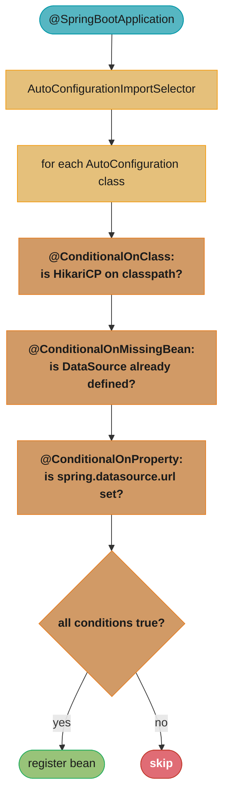

# Spring Configuration

## 1. Concept Overview

Spring configuration is how you declare beans, their dependencies, and conditional wiring rules to the IoC container. Spring supports three configuration styles — XML (legacy), annotation-based (`@Component` scanning), and Java-based (`@Configuration` + `@Bean`) — plus a hybrid of all three. Understanding the semantics of `@Configuration` (full mode) vs `@Component` (lite mode) is critical for avoiding subtle production bugs with `@Bean` method calls.

---

## 2. Intuition

Think of configuration as blueprints for a construction project:
- `@Configuration` is a master blueprint — every inter-component call follows the architect's plan (CGLIB proxy ensures singleton semantics).
- `@Component` in lite mode is a post-it note — quick and useful but missing important annotations; calls between `@Bean` methods just call the method directly.

**One-line analogy:** `@Configuration` is a CGLIB-proxied class where every `@Bean` method call returns the same cached singleton; `@Component` with `@Bean` is plain Java where each call creates a new object.

**Key insight:** The `@Configuration` vs `@Component` distinction exists because CGLIB subclassing is expensive — Spring only wraps it when you use `@Configuration` (which explicitly declares this class is a source of Spring beans with full proxy semantics). `@Component` classes that happen to declare `@Bean` methods are "lite" — they work for independent beans but break for inter-`@Bean` calls.

---

## 3. Core Principles

1. **Full mode (`@Configuration`):** Class is CGLIB-proxied. Calling one `@Bean` method from another returns the same singleton from the container.
2. **Lite mode (`@Component`):** No proxy. Calling one `@Bean` method from another invokes the method as normal Java — creating a new instance.
3. **Conditions gate beans:** `@Conditional` and its derivatives control whether a bean is registered based on classpath, properties, existing beans, or custom logic.
4. **Profile-based activation:** `@Profile` activates beans only in specified environments.
5. **Property binding:** `@PropertySource` and `@ConfigurationProperties` bring external configuration into the container.

---

## 4. Types / Architectures / Strategies

### Configuration Styles

| Style | Mechanism | Full Mode? | Use Case |
|-------|-----------|------------|---------|
| `@Configuration` + `@Bean` | Java config | Yes (CGLIB) | Infrastructure beans, explicit control |
| `@Component` + `@Bean` | Lite mode | No | Simple component-local factories |
| `@ComponentScan` | Classpath scan | N/A | Application beans |
| XML `<bean>` | XML parsing | N/A | Legacy applications |

### @Conditional Derivatives

| Annotation | Condition |
|------------|-----------|
| `@ConditionalOnClass` | A class is present on the classpath |
| `@ConditionalOnMissingClass` | A class is absent from the classpath |
| `@ConditionalOnBean` | A bean of the specified type exists |
| `@ConditionalOnMissingBean` | No bean of the specified type exists |
| `@ConditionalOnProperty` | A property has a specific value |
| `@ConditionalOnWebApplication` | Running in a web application context |
| `@ConditionalOnNotWebApplication` | Not running in a web application context |
| `@ConditionalOnResource` | A resource file exists at the specified path |
| `@ConditionalOnExpression` | A SpEL expression evaluates to true |
| `@ConditionalOnJava` | Running on a specific Java version range |

### @Import Mechanisms

| Mechanism | What It Does |
|-----------|-------------|
| `@Import(Config.class)` | Directly imports a `@Configuration` or `@Component` class |
| `@Import(MySelector.class)` | `ImportSelector` returns class names to import programmatically |
| `@Import(MyRegistrar.class)` | `ImportBeanDefinitionRegistrar` programmatically registers `BeanDefinition`s |

---

## 5. Architecture Diagrams

```
@Configuration Full Mode vs @Component Lite Mode
=================================================

  @Configuration (full mode — CGLIB proxied):
  --------------------------------------------
  @Configuration
  public class DataConfig {
      @Bean
      public DataSource dataSource() {
          return new HikariDataSource();  // created once, stored in context
      }

      @Bean
      public TransactionManager txManager() {
          DataSource ds = dataSource();   // <- goes through CGLIB proxy
          // proxy returns SAME DataSource from context, not new instance
          return new DataSourceTransactionManager(ds);
      }
  }

  Result:
  dataSource bean (id=1) <--- txManager uses this exact instance
  txManager bean

  --------------------------------------------------------

  @Component (lite mode — NOT proxied):
  ----------------------------------------
  @Component  // <-- lite mode
  public class DataConfig {
      @Bean
      public DataSource dataSource() {
          return new HikariDataSource();  // created as bean, id=1
      }

      @Bean
      public TransactionManager txManager() {
          DataSource ds = dataSource();   // <- plain Java method call!
          // creates a NEW HikariDataSource (id=2, not the bean)
          return new DataSourceTransactionManager(ds);  // wrong DataSource!
      }
  }

  Result:
  dataSource bean (id=1)  <-- in context
  txManager uses id=2     <-- different object! Not the Spring-managed bean
```



---

## 6. How It Works — Detailed Mechanics

### @Configuration Full Mode vs Lite Mode — Critical Difference

```java
// FULL MODE: @Configuration — ALWAYS use this for infrastructure beans
@Configuration
public class SecurityConfig {
    @Bean
    public PasswordEncoder passwordEncoder() {
        return new BCryptPasswordEncoder(12);  // cost factor 12
    }

    @Bean
    public AuthenticationManager authManager(UserDetailsService uds) {
        // passwordEncoder() goes through CGLIB proxy — returns the singleton bean
        DaoAuthenticationProvider provider = new DaoAuthenticationProvider();
        provider.setUserDetailsService(uds);
        provider.setPasswordEncoder(passwordEncoder());  // same bean as above
        return new ProviderManager(provider);
    }
}

// LITE MODE: @Component with @Bean — DANGEROUS for inter-bean calls
@Component  // or @Service, @Controller, etc.
public class SecurityConfig {
    @Bean
    public PasswordEncoder passwordEncoder() {
        return new BCryptPasswordEncoder(12);
    }

    @Bean
    public AuthenticationManager authManager(UserDetailsService uds) {
        // passwordEncoder() is a plain Java call — creates a SECOND BCryptPasswordEncoder!
        // The AuthenticationManager uses a different instance than the registered bean
        DaoAuthenticationProvider provider = new DaoAuthenticationProvider();
        provider.setPasswordEncoder(passwordEncoder());  // NEW instance! Not the bean
        return new ProviderManager(provider);
    }
}
```

### @ComponentScan Configuration

```java
@Configuration
@ComponentScan(
    basePackages = {"com.example.service", "com.example.repository"},
    // Include only classes annotated with @Service
    includeFilters = @ComponentScan.Filter(
        type = FilterType.ANNOTATION,
        classes = Service.class
    ),
    // Exclude test configurations
    excludeFilters = @ComponentScan.Filter(
        type = FilterType.ASSIGNABLE_TYPE,
        classes = TestConfig.class
    )
)
public class AppConfig { }
```

### Custom @Conditional

```java
// Custom condition: register bean only when running inside Docker
public class DockerEnvironmentCondition implements Condition {
    @Override
    public boolean matches(ConditionContext context, AnnotatedTypeMetadata metadata) {
        // Check for Docker-specific environment variables
        return System.getenv("DOCKER_CONTAINER") != null
            || new File("/.dockerenv").exists();
    }
}

@Configuration
public class MetricsConfig {
    @Bean
    @Conditional(DockerEnvironmentCondition.class)
    public MetricsExporter dockerMetricsExporter() {
        return new PrometheusExporter("docker-host:9090");
    }

    @Bean
    @ConditionalOnMissingBean(MetricsExporter.class)  // fallback if not in Docker
    public MetricsExporter noOpExporter() {
        return new NoOpMetricsExporter();
    }
}
```

### @Profile

```java
// Activate beans only for specific profiles
@Configuration
@Profile("production")
public class ProductionDataSourceConfig {
    @Bean
    public DataSource dataSource() {
        // Real HikariCP pool to production DB
        return new HikariDataSource(productionConfig());
    }
}

@Configuration
@Profile({"development", "test"})  // multiple profiles
public class EmbeddedDataSourceConfig {
    @Bean
    public DataSource dataSource() {
        return new EmbeddedDatabaseBuilder()
            .setType(EmbeddedDatabaseType.H2)
            .build();
    }
}

// Activate via:
// spring.profiles.active=production  (application.properties)
// -Dspring.profiles.active=production (JVM arg)
// SPRING_PROFILES_ACTIVE=production   (environment variable)

// Profile inheritance
# application.properties
spring.profiles.active=production
spring.profiles.include=metrics,security  # always include these alongside active profile
```

### @PropertySource and @ConfigurationProperties

```java
// @PropertySource: add a properties file to the Environment
@Configuration
@PropertySource("classpath:custom.properties")
@PropertySource(value = "classpath:optional.properties", ignoreResourceNotFound = true)
public class AppConfig {
    @Value("${custom.timeout:5000}")
    private int timeout;
}

// @ConfigurationProperties: type-safe binding (preferred for complex config)
@Configuration
@EnableConfigurationProperties(AppProperties.class)
public class AppConfig { }

@ConfigurationProperties(prefix = "app")
@Validated  // enable JSR-303 validation
public class AppProperties {
    @NotEmpty
    private String name;

    @Min(1) @Max(100)
    private int maxConnections = 10;  // default

    private Duration timeout = Duration.ofSeconds(5);

    // Relaxed binding: app.max-connections, APP_MAX_CONNECTIONS, app.maxConnections all work
    // Getters and setters required
}

// application.properties:
// app.name=MyService
// app.max-connections=25
// app.timeout=10s
```

### @Order and PriorityOrdered

```java
// Control order of BeanPostProcessors, Filters, EventListeners, etc.
@Component
@Order(1)  // lower = higher priority = runs first
public class SecurityFilter implements Filter { }

@Component
@Order(2)
public class LoggingFilter implements Filter { }

// For BeanPostProcessors and BeanFactoryPostProcessors: implement PriorityOrdered
// PriorityOrdered > Ordered > no order (unordered)
@Component
public class CriticalBeanPostProcessor implements BeanPostProcessor, PriorityOrdered {
    @Override
    public int getOrder() { return Ordered.HIGHEST_PRECEDENCE; }
}
```

---

## 7. Real-World Examples

**Auto-configuration class:** Spring Boot's `DataSourceAutoConfiguration` uses `@ConditionalOnClass(DataSource.class)` (HikariCP on classpath), `@ConditionalOnMissingBean(DataSource.class)` (no user-defined DataSource), and `@ConditionalOnProperty("spring.datasource.url")` to conditionally create a `HikariDataSource`. This is why adding `spring-boot-starter-data-jpa` to `pom.xml` automatically provides a working DataSource.

**Multi-environment data source:** `@Profile("production")` configures RDS PostgreSQL; `@Profile("test")` configures H2 in-memory. CI/CD sets `SPRING_PROFILES_ACTIVE=test`; Kubernetes deployment sets `SPRING_PROFILES_ACTIVE=production`. Zero code change for environment switching.

**Plugin registration with ImportSelector:** A library's `@EnableMyLibrary` annotation imports `MyLibrarySelector implements ImportSelector`, which reads the annotation's attributes and returns the correct configuration class names. This is how `@EnableCaching`, `@EnableAsync`, and `@EnableTransactionManagement` work.

---

## 8. Tradeoffs

| Configuration Style | Refactoring Safety | IDE Support | Verbosity | Conditional Support |
|--------------------|-------------------|-------------|-----------|---------------------|
| `@Configuration` + `@Bean` | High (compile-time) | Excellent | More explicit | Full |
| `@ComponentScan` | Medium (runtime scan) | Good | Minimal | Via annotations |
| XML | Low (no compile check) | Basic | Verbose | Limited |
| `@ConfigurationProperties` | High (type-safe) | Excellent | Medium | Via `@Conditional` |
| `@Value` | Low (string-based) | Limited | Minimal | No |

---

## 9. When to Use / When NOT to Use

**Use `@Configuration` + `@Bean` for:**
- Infrastructure beans: DataSource, TransactionManager, CacheManager, SecurityConfig
- Beans that require conditional logic or ordering
- Beans from third-party classes you cannot annotate
- Any case where inter-`@Bean` method calls are needed

**Use `@ComponentScan` + `@Component`/`@Service`/`@Repository` for:**
- Application-layer beans (services, repositories, controllers)
- Large numbers of beans following a naming convention

**Use `@ConfigurationProperties` instead of `@Value` when:**
- Configuration has multiple related properties (database config, email config)
- You need type safety, validation, and IDE autocomplete

**Do NOT:**
- Use `@Component` instead of `@Configuration` for configuration classes that call other `@Bean` methods (lite mode bug)
- Use XML for new code
- Mix XML and Java config extensively (pick one primary style)

---

## 10. Common Pitfalls

### Pitfall 1: @Component Lite Mode Creating Duplicate Beans

```java
// BROKEN: @Component (not @Configuration) causes double instantiation
@Component
public class DatabaseConfig {
    @Bean
    public DataSource dataSource() {
        HikariConfig config = new HikariConfig();
        config.setJdbcUrl("jdbc:postgresql://localhost:5432/db");
        return new HikariDataSource(config);  // opens 10 connections
    }

    @Bean
    public JdbcTemplate jdbcTemplate() {
        return new JdbcTemplate(dataSource());  // creates ANOTHER HikariDataSource!
        // Now 20 connections open — pool leak, wrong DataSource object
    }
}

// FIXED: use @Configuration
@Configuration  // CGLIB proxy ensures dataSource() returns the singleton
public class DatabaseConfig {
    @Bean
    public DataSource dataSource() {
        return new HikariDataSource(config());
    }

    @Bean
    public JdbcTemplate jdbcTemplate() {
        return new JdbcTemplate(dataSource());  // same DataSource bean
    }
}
```

### Pitfall 2: @ConditionalOnMissingBean Ordering Issue

```java
// BROKEN: order matters for @ConditionalOnMissingBean
// If UserDataSource is processed before DefaultDataSource,
// "no DataSource" condition is false, so UserDataSource registers.
// But if DefaultDataSource is processed first, both might register.

// Spring processes @Configuration classes in a specific order.
// Use @AutoConfigureAfter / @AutoConfigureBefore in auto-configuration.
// In user configuration, use @Order on @Configuration classes.

@Configuration
@ConditionalOnMissingBean(DataSource.class)
public class DefaultDataSourceConfig {
    @Bean
    public DataSource dataSource() { return new H2DataSource(); }
}
```

### Pitfall 3: @Profile Not Applied to @Bean Methods

```java
// BROKEN: @Profile on @Bean method is ignored in some versions
@Configuration
public class DataConfig {
    @Bean
    @Profile("test")  // This works correctly for @Bean methods in @Configuration
    public DataSource testDataSource() { return new H2DataSource(); }
}

// SAFER: Put @Profile on the @Configuration class itself
@Configuration
@Profile("test")
public class TestDataConfig {
    @Bean
    public DataSource dataSource() { return new H2DataSource(); }
}
```

---

## 11. Technologies & Tools

| Tool | Role |
|------|------|
| `@Configuration` | Declares full-mode configuration class (CGLIB proxy) |
| `@ComponentScan` | Classpath scanning for `@Component`-annotated classes |
| `@Conditional` | Base annotation for conditional bean registration |
| `@Profile` | Profile-based conditional bean registration |
| `@PropertySource` | Adds property file to Spring Environment |
| `@ConfigurationProperties` | Type-safe property binding |
| `@Import` | Explicitly imports configuration classes |
| `spring-context-indexer` | Compile-time component index (faster scanning) |
| `@EnableAutoConfiguration` | Triggers Spring Boot auto-configuration |

---

## 12. Interview Questions with Answers

**What is the difference between @Configuration and @Component for classes with @Bean methods?**
`@Configuration` creates a CGLIB subclass (full mode) where calls to `@Bean` methods return the singleton from the container. `@Component` uses no proxy (lite mode) — calls to `@Bean` methods are plain Java method invocations that create new instances. The difference only matters when one `@Bean` method calls another within the same class. Always use `@Configuration` for configuration classes that define inter-dependent beans.

**What is the order of @Conditional evaluation?**
`@Conditional` conditions are evaluated in the order they are declared on the class. Spring Boot's `@ConditionalOnClass` runs first (cheapest check — classpath scan), then `@ConditionalOnMissingBean` (requires partial context initialization), then `@ConditionalOnProperty`. If any condition fails, the class is skipped and no beans are registered. The `--debug` startup flag prints the `ConditionEvaluationReport` showing which conditions passed or failed.

**How does @PropertySource differ from @ConfigurationProperties?**
`@PropertySource` adds a `.properties` file to the Spring `Environment`, making its properties accessible via `@Value` and `Environment.getProperty()`. It does not bind properties to a Java object. `@ConfigurationProperties` takes a prefix and binds all matching properties from the `Environment` to a typed Java class with getters/setters. `@ConfigurationProperties` supports relaxed binding (camelCase, kebab-case, SCREAMING_SNAKE_CASE all map to the same property), JSR-303 validation, and IDE autocompletion. Prefer `@ConfigurationProperties` for any group of related properties.

**What is an ImportSelector and when would you use it?**
`ImportSelector` is an interface with `selectImports(AnnotationMetadata)` that returns an array of fully-qualified class names to import. The Spring container calls this at configuration processing time. `AutoConfigurationImportSelector` (which powers `@EnableAutoConfiguration`) is the most important example. You write an `ImportSelector` when building a library that needs to conditionally import different configurations based on annotation attributes — for example, `@EnableMyFeature(mode=Mode.SYNC)` importing different config classes based on the `mode` attribute.

**What is the difference between @Import and @ComponentScan?**
`@ComponentScan` discovers classes by scanning package paths at runtime. `@Import` explicitly registers specific classes by name (compile-time reference). `@Import` is faster (no classpath scanning) and more explicit. Use `@ComponentScan` for your application's own classes; use `@Import` in library/starter code to programmatically register configuration without requiring the user to scan specific packages.

**How does @Profile work and how can you activate multiple profiles?**
`@Profile("name")` on a `@Configuration` class or `@Bean` method registers the bean only when the named profile is active. Activate via `spring.profiles.active` property (comma-separated for multiple), the `SPRING_PROFILES_ACTIVE` environment variable, or `SpringApplication.setAdditionalProfiles()` programmatically. `spring.profiles.include` always activates additional profiles regardless of the primary active profile. A bean with `@Profile("!production")` is active when production is NOT active.

**What is relaxed binding in @ConfigurationProperties?**
Spring's `@ConfigurationProperties` accepts property names in any case format and maps them to Java field names: `app.max-connections`, `APP_MAX_CONNECTIONS`, `app.maxConnections`, and `app.max_connections` all bind to a Java field `maxConnections`. This allows properties defined by operations (OS environment variables in SCREAMING_SNAKE_CASE) to bind to Java convention (camelCase) without duplication. `@Value` does NOT support relaxed binding — it uses exact property name matching.

**How do you exclude an auto-configuration class?**
Two ways: `@SpringBootApplication(exclude = {DataSourceAutoConfiguration.class})` as an annotation attribute, or `spring.autoconfigure.exclude=org.springframework.boot.autoconfigure.jdbc.DataSourceAutoConfiguration` as a property. The annotation approach is compile-time safe (catches typos); the property approach is useful when you need runtime control or the class may not be on the classpath. Exclusion is necessary when you define your own DataSource bean but the auto-configuration would still try to create one.

**What is @Order and when does it matter for @Configuration classes?**
`@Order(n)` on `@Configuration` classes controls the order in which they are processed. Lower values are processed first. This affects which `@ConditionalOnMissingBean` evaluations see existing beans. More importantly, `@Order` on `BeanPostProcessor` beans controls the order they are applied to each bean. For `ApplicationListener` beans, it controls which listener handles events first. For `@Configuration` classes in user code, order matters when multiple classes provide the same bean type and conditional logic depends on processing order.

**What is proxyBeanMethods=false and when should you use it?**
`@Configuration(proxyBeanMethods=false)` disables the CGLIB proxy for the configuration class (making it behave like lite mode). Use it when the `@Bean` methods in the class are never called from other `@Bean` methods in the same class (independent beans), to improve startup performance (CGLIB proxying adds overhead). Spring Boot's own auto-configuration classes use `proxyBeanMethods=false` for most configurations since they define independent beans. Use `proxyBeanMethods=true` (the default) whenever inter-`@Bean` method calls are needed.

**How would you write a custom Spring Boot starter?**
Four steps: (1) Create a module with your auto-configuration class annotated with `@AutoConfiguration` (Boot 3.x) or `@Configuration` (Boot 2.x); (2) Use `@ConditionalOnClass`, `@ConditionalOnMissingBean`, `@ConditionalOnProperty` to make it conditional; (3) Add a file at `META-INF/spring/org.springframework.boot.autoconfigure.AutoConfiguration.imports` (Boot 3.x) or `spring.factories` (Boot 2.x) with your auto-configuration class name; (4) Do NOT use `@ComponentScan` in the starter — let user applications scan their own packages. Include your auto-configure module as a dependency in the starter POM.

**What is the difference between @PropertySource and spring.config.import?**
`@PropertySource` is a Java annotation that loads a `.properties` file into the Environment during the configuration class processing phase. It does not work with YAML files and processes at a fixed point in the config loading lifecycle. `spring.config.import` (Spring Boot 2.4+) is a property that loads additional config files or config tree directories, supports YAML, and participates fully in the config priority ordering. `spring.config.import=configserver:` is how Spring Cloud Config Server is imported in Boot 3.x, replacing the bootstrap context approach.

**What is @ImportBeanDefinitionRegistrar?**
`ImportBeanDefinitionRegistrar` is an interface that allows programmatic registration of `BeanDefinition` objects during configuration processing. Unlike `ImportSelector` (which returns class names), the registrar directly calls `registry.registerBeanDefinition()`. It receives the annotation metadata of the `@Import` annotation's declaring class, enabling dynamic bean registration based on annotation attributes. Spring Data JPA uses this internally to register repository proxy bean definitions for each `@Repository` interface found during component scanning.

**What is the difference between `@Configuration` full mode and lite mode, and when does it matter?**
A `@Configuration` class (full mode) is CGLIB-proxied: `@Bean` method calls from within the class are intercepted and return the same singleton instance from the bean factory. A `@Component` or `@ComponentScan`-discovered class containing `@Bean` methods (lite mode) is NOT proxied: inter-`@Bean` calls create plain Java object instances, bypassing the container. This matters when one `@Bean` method calls another:

```java
@Configuration // FULL MODE — safe
class AppConfig {
    @Bean DataSource dataSource() { return new HikariDataSource(); }
    @Bean JdbcTemplate jdbc() { return new JdbcTemplate(dataSource()); } // returns THE SAME singleton
}

@Component // LITE MODE — dangerous
class AppConfig {
    @Bean DataSource dataSource() { return new HikariDataSource(); }
    @Bean JdbcTemplate jdbc() { return new JdbcTemplate(dataSource()); } // creates a NEW DataSource each call
}
```

In lite mode, `dataSource()` creates a second `HikariDataSource` outside the container — a connection pool leak. Always use `@Configuration` for classes where `@Bean` methods call each other. Lite mode is appropriate only for simple factories that have no inter-`@Bean` dependencies.

**What is `@Conditional` and how does it compare to `@ConditionalOnProperty` / `@ConditionalOnClass`?**
`@Conditional(MyCondition.class)` is the meta-annotation that powers all `@ConditionalOn*` variants. The referenced `Condition` implementation receives `ConditionContext` (access to `Environment`, `BeanDefinitionRegistry`, `ClassLoader`) and `AnnotatedTypeMetadata` and returns `true` (include) or `false` (skip). `@ConditionalOnProperty`, `@ConditionalOnClass`, `@ConditionalOnBean` are Spring Boot's pre-built `Condition` implementations registered as composed annotations for common use cases. Write a custom `@Conditional` when the built-in variants don't cover your logic — e.g., enabling a bean only when running in Kubernetes (check for `KUBERNETES_SERVICE_HOST` env var) or only on a specific OS. Custom conditions are registered with `@Conditional(MyKubernetesCondition.class)` and can be composed into a custom `@ConditionalOnKubernetes` annotation.

---

## 13. Best Practices

1. **Use `@Configuration` (not `@Component`) for classes with inter-dependent `@Bean` methods** — the lite mode gotcha is a frequent interview question.
2. **Use `@ConfigurationProperties` instead of `@Value` for groups of related properties** — type safety, validation, IDE support.
3. **Use `@ConditionalOnMissingBean` in library code** to allow user customization without exclusion.
4. **Keep `@ComponentScan` narrow** — scan only the packages containing your application classes; broad scanning significantly slows startup.
5. **Use `@Profile` for environment-specific beans** — avoid `if` statements checking environment in bean code.
6. **Add `spring-context-indexer`** to compile-time dependencies for large codebases — eliminates runtime classpath scanning entirely.
7. **Use `proxyBeanMethods=false`** on `@Configuration` classes where all `@Bean` methods are independent — reduces startup overhead.
8. **Validate `@ConfigurationProperties` with `@Validated`** — catch misconfiguration at startup rather than during the first use of the property.
9. **Use `@AutoConfigureAfter`/`@AutoConfigureBefore`** in auto-configuration to express ordering dependencies.
10. **Test configuration classes with `@SpringBootTest(classes=MyConfig.class)`** or `ApplicationContextRunner` (from `spring-boot-test`) to verify conditional logic.

---

## 14. Case Study

### Scenario: Multi-Environment Configuration for a Service Deployed to 5 Regions

**Context.** A SaaS service ships the same JAR to **5 environments** — `dev`, `test`, `staging`, `prod-eu`, `prod-us` — handling 8,000 req/sec in production. Each environment differs in data sources, external service URLs, and feature flags. The strategy combines `@Profile` (environment selection), `@Conditional`/`@ConditionalOnProperty` (feature toggling), validated `@ConfigurationProperties`, and `@Import` to compose modular configuration classes without duplication.

### Configuration Layout

```
application.yml                  (shared defaults)
application-dev.yml
application-test.yml
application-staging.yml
application-prod-eu.yml          (eu data residency, eu external URLs)
application-prod-us.yml          (us data residency, us external URLs)

  +-- @Import composes ---------------------------+
  |  DataSourceConfig   (@Profile per env)        |
  |  ExternalServiceConfig (@ConditionalOnProperty)|
  |  FeatureFlagConfig  (@Conditional)            |
  +-----------------------------------------------+
```

### Composed Config

```java
@Configuration
@Import({ DataSourceConfig.class, ExternalServiceConfig.class, ResilienceConfig.class })
public class AppConfig { }

@Configuration
public class ResilienceConfig {
    @Bean
    @ConditionalOnProperty(prefix = "resilience.circuit-breaker", name = "enabled",
                           havingValue = "true", matchIfMissing = true)
    public CircuitBreaker paymentBreaker(ResilienceProps props) {
        return CircuitBreaker.of("payment", CircuitBreakerConfig.custom()
            .failureRateThreshold(props.getFailureRate())
            .waitDurationInOpenState(props.getOpenWait()).build());
    }
}
```

```java
@Validated
@ConfigurationProperties(prefix = "resilience")
public class ResilienceProps {
    @NotNull private Duration openWait;
    @Min(10) @Max(100) private float failureRate;       // rejected at startup if out of range
    // getters / setters
}
```

```java
// Full @Configuration mode: calls between @Bean methods return the SAME singleton (CGLIB-proxied)
@Configuration
public class DataSourceConfig {
    @Bean public DataSource dataSource(DbProps p) { return build(p); }
    @Bean public JdbcTemplate jdbc()  { return new JdbcTemplate(dataSource(dbProps())); } // same DataSource
    @Bean public DbProps dbProps()    { return new DbProps(); }
}
```

### Metrics

- One JAR, 5 environments: zero environment-specific builds, profile chosen by `SPRING_PROFILES_ACTIVE`.
- Validation failures (e.g. `failureRate=200`) fail fast at boot in **<1s**, before traffic is served.
- Disabling the circuit breaker in `dev` via `resilience.circuit-breaker.enabled=false` removes the bean entirely — no runtime branch.

### Pitfalls

**Pitfall 1 — Lite-mode `@Bean` methods are not proxied, creating duplicate instances.**
```java
// BROKEN: class lacks @Configuration (lite mode); jdbc() calls dataSource() as a PLAIN method,
// producing a SECOND DataSource (and a second connection pool)
@Component
class DataSourceConfig {
    @Bean DataSource dataSource() { return build(); }
    @Bean JdbcTemplate jdbc()    { return new JdbcTemplate(dataSource()); } // new pool!
}
```
```java
// FIXED: @Configuration (full mode) CGLIB-proxies the class so inter-bean calls return the singleton
@Configuration
class DataSourceConfig {
    @Bean DataSource dataSource() { return build(); }
    @Bean JdbcTemplate jdbc()    { return new JdbcTemplate(dataSource()); } // same singleton
}
```

**Pitfall 2 — `@Profile` on an inner `@Configuration` ignored when the outer class is already loaded.**
```java
// BROKEN: nested config's @Profile evaluated in the outer class's context;
// if the outer @Configuration is registered, the inner beans load regardless of active profile
@Configuration
class Outer {
    @Configuration @Profile("prod-eu")
    static class Inner { @Bean EuClient client() { return new EuClient(); } }
}
```
```java
// FIXED: make profile-specific config a top-level class so the profile gate applies to the whole class
@Configuration @Profile("prod-eu")
class EuConfig { @Bean EuClient client() { return new EuClient(); } }
```

**Pitfall 3 — `@Value` resolved before its `PropertySource` is loaded.**
```java
// BROKEN: a @Value used in a static or early-initialized context reads before the source is registered,
// yielding the literal placeholder "${external.url}" instead of the value
@Component
class EarlyBean {
    static String URL;
    @Value("${external.url}") public void set(String v) { URL = v; }  // ordering-fragile
}
```
```java
// FIXED: read the value through @ConfigurationProperties (bound after all PropertySources load),
// or inject via constructor on a normal singleton so resolution happens after the Environment is ready
@ConfigurationProperties(prefix = "external")
class ExternalProps { private String url; /* bound once Environment is complete */ }
```

### Interview Q&A

**What is the difference between full `@Configuration` and lite-mode bean declarations?** A `@Configuration` class is CGLIB-proxied, so calling one `@Bean` method from another returns the cached singleton. Lite mode (`@Bean` methods on a `@Component` or plain class) is not proxied, so inter-bean method calls execute the method normally and create new instances.

**How do `@Profile` and `@Conditional` differ?** `@Profile` is a specialized `@Conditional` keyed on active profile names, used for coarse environment selection. `@Conditional`/`@ConditionalOnProperty` evaluate arbitrary conditions (a property value, a class on the classpath, a bean's presence) for finer-grained toggling like enabling a circuit breaker.

**Why does `@ConditionalOnProperty(matchIfMissing = true)` matter for defaults?** It makes a bean present unless explicitly disabled. Production gets the safe default (circuit breaker on) with no config, while a developer can set the property to `false` to opt out, avoiding the need to enable it in every environment file.

**When does `@ConfigurationProperties` validation fire, and why prefer it over runtime checks?** With `@Validated`, JSR-303 constraints are checked at bean binding during startup, so an invalid value fails fast before the app serves traffic. This is safer than discovering a bad config value via a runtime exception under load.

**Why use `@Import` instead of one giant `@Configuration`?** `@Import` composes small, cohesive config classes (data source, external services, resilience) that can be reused and reasoned about independently, and lets you include or omit modules per profile rather than maintaining one monolithic class.

**How do you ship one artifact to five environments safely?** Keep shared defaults in `application.yml`, override per environment in `application-<profile>.yml`, select the profile via `SPRING_PROFILES_ACTIVE`, keep secrets out of the JAR (injected at deploy time), and validate bound properties so a misconfigured environment fails at boot rather than mid-request.

---

**Additional war stories and interview Q&As:**

**Pitfall: @Configuration full mode — circular dependency through @Bean methods.**

```java
// BROKEN: two @Bean methods call each other — circular reference at startup
@Configuration
public class AppConfig {
    @Bean
    public ServiceA serviceA() {
        return new ServiceA(serviceB());  // calls serviceB() below
    }

    @Bean
    public ServiceB serviceB() {
        return new ServiceB(serviceA());  // calls serviceA() above → cycle!
    }
}

// FIX: inject via method parameter (Spring resolves the cycle via CGLIB proxy)
@Configuration
public class AppConfig {
    @Bean
    public ServiceA serviceA(ServiceB serviceB) {  // injected, not called directly
        return new ServiceA(serviceB);
    }

    @Bean
    public ServiceB serviceB() {
        return new ServiceB();
    }
}
```

**Pitfall: @Profile mismatch causes "No qualifying bean" in test.**

```java
// BROKEN: production bean gated on @Profile("prod") — not loaded in test context
@Configuration
@Profile("prod")
public class ProdSecurityConfig { @Bean SecurityFilter securityFilter() { ... } }

// Test context uses no profile → SecurityFilter missing → NoSuchBeanDefinitionException
@SpringBootTest
class ServiceTest { @Autowired SecurityFilter filter; }  // fails in test

// FIX: provide a test double with @Profile("!prod") or use @ConditionalOnMissingBean
@Configuration
@Profile("!prod")
public class TestSecurityConfig {
    @Bean
    public SecurityFilter securityFilter() { return new NoopSecurityFilter(); }
}
```

**@ConditionalOnProperty for feature flags:**

```java
@Bean
@ConditionalOnProperty(name = "features.new-pricing-engine", havingValue = "true")
public PricingEngine newPricingEngine() { return new NewPricingEngine(); }

@Bean
@ConditionalOnProperty(name = "features.new-pricing-engine",
                       havingValue = "false", matchIfMissing = true)
public PricingEngine legacyPricingEngine() { return new LegacyPricingEngine(); }
```

**Additional interview Q&As:**

**What is the difference between @Configuration full mode and lite mode?** A class annotated with `@Configuration` (full mode) is subclassed by CGLIB — inter-`@Bean` method calls are intercepted so that the container returns the same singleton instance each time. A `@Component` or `@Bean` class without `@Configuration` (lite mode) is not proxied — calling one `@Bean` method from another creates a new instance, bypassing the singleton guarantee. Always use `@Configuration` for beans with inter-dependencies; use lite mode (or `@Configuration(proxyBeanMethods = false)`) in Spring Boot 3 for performance when `@Bean` methods are independent.

**When should you use @Import vs component scanning?** `@Import` explicitly imports a configuration class — useful for library starters, infrastructure configuration, or test configurations that must not be auto-detected. Component scanning (`@ComponentScan`) discovers all `@Component`-annotated classes in a package — useful for application beans but gives up explicit control. In library code (starters, framework modules), always use `@Import` to avoid polluting application scan paths.

**How does @Conditional work under the hood?** Spring evaluates `@Conditional` during the `BeanDefinition` post-processing phase, before bean instantiation. The `Condition.matches()` method receives a `ConditionContext` (access to `Environment`, `BeanDefinitionRegistry`, `ResourceLoader`) and a `AnnotatedTypeMetadata` (access to the annotation's attributes). Spring Boot's `@ConditionalOnProperty`, `@ConditionalOnClass`, and `@ConditionalOnMissingBean` are all implemented as `Condition` implementations that inspect these contexts.

---

## Related / See Also

- [Dependency Injection](../dependency_injection/README.md) — @Qualifier, @Primary
- [Spring Boot Configuration](../spring_boot_configuration/README.md) — @ConfigurationProperties
- [Spring Boot Auto-Configuration](../spring_boot_autoconfiguration/README.md) — @Conditional
