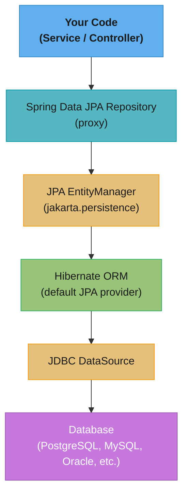
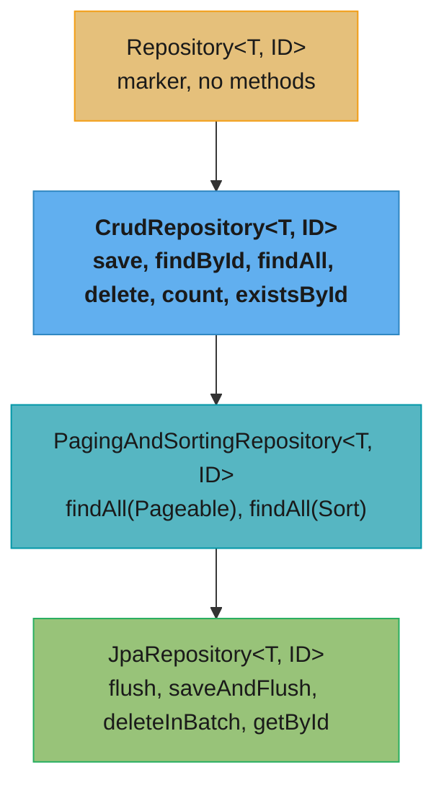
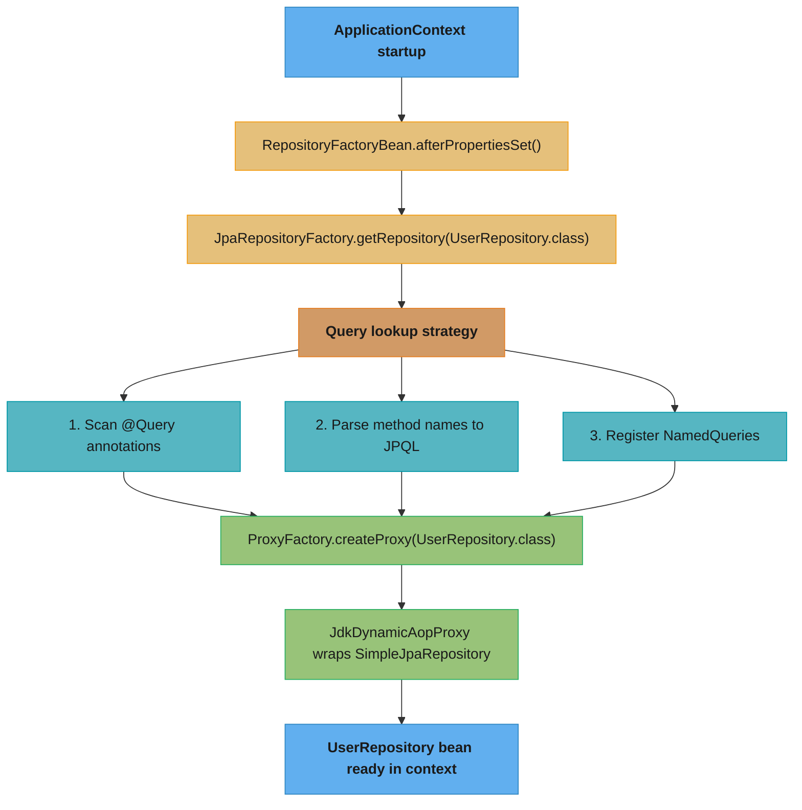
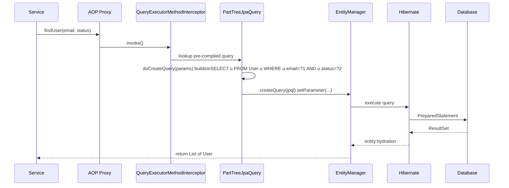
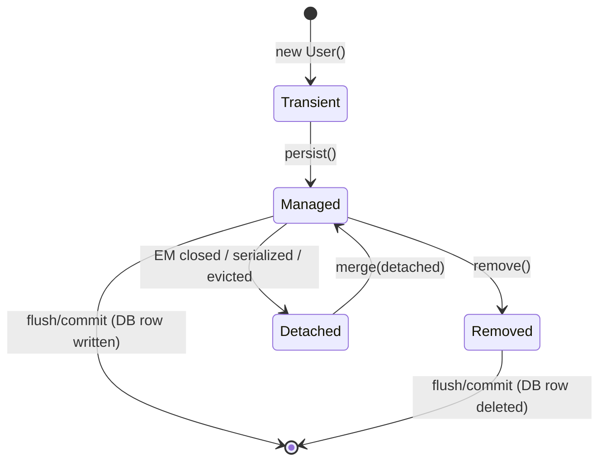
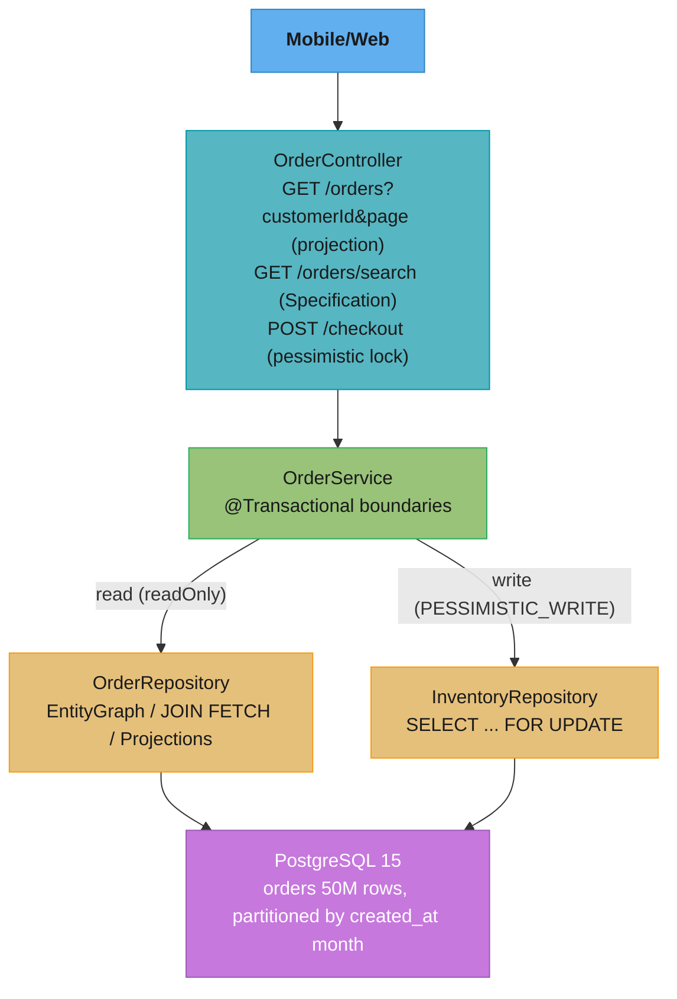

# Spring Data JPA — Deep Dive

---

## 1. Concept Overview

Spring Data JPA is a layer on top of JPA (Java Persistence API) and Hibernate that eliminates boilerplate repository code. It provides repository interfaces, derived query methods, JPQL/native query support, projections, specifications, pagination, auditing, and locking mechanisms. Under the hood, Spring Data generates proxy implementations at startup time, wiring together the JPA EntityManager, persistence context lifecycle, and transaction management.

Spring Data JPA sits in the stack as follows:



Key terms:
- **Repository**: Spring Data marker interface
- **EntityManager**: JPA low-level API for managing entity lifecycle
- **Persistence Context**: first-level cache; tracks managed entities within a transaction
- **Session**: Hibernate term for EntityManager equivalent
- **JPQL**: object-oriented query language operating on entity names and field names, not table/column names

---

## 2. Intuition

One-line analogy: Spring Data JPA is the difference between writing every SQL statement by hand and having a smart assistant who generates the correct SQL from the method name you wrote.

Mental model: think of a repository as a typed gateway to a single aggregate root. You describe what you want (findByEmailAndStatus), and the framework translates intent into SQL at startup, not at runtime.

Why it matters: 80% of data access code is repetitive CRUD. Spring Data removes that entirely and lets engineers focus on the 20% that is non-trivial — complex queries, locking, performance tuning.

Key insight: the entire repository infrastructure (proxy creation, query derivation, EntityManager wiring) happens at ApplicationContext startup. A wrong method name like findByEmial fails fast at boot, not in production at 3 AM.

---

## 3. Core Principles

1. **Repository abstraction**: code against interfaces; Spring Data provides the implementation.
2. **Convention over configuration**: method name conventions map directly to JPQL predicates without writing a single line of query code.
3. **Domain-driven design alignment**: one repository per aggregate root — UserRepository, OrderRepository, not a generic DataRepository.
4. **Composability**: Specifications and QueryDSL predicates compose at runtime using and/or/not, matching the Composite design pattern.
5. **Explicit fetch strategy**: N+1 is a feature (lazy loading gives control) until it becomes a bug (LazyInitializationException, unbounded SELECT storms). You must be intentional.
6. **Transaction integration**: repositories rely on an active transaction for write operations; reads can work without one but detached entities lose lazy-load capability.

---

## 4. Types / Architectures / Strategies

### Repository Hierarchy



`JpaRepository` also extends `QueryByExampleExecutor<T>` for Example-based queries.

### Query Strategies

| Strategy | How | Best For |
|---|---|---|
| Derived query methods | Method name parsing | Simple predicates, <3 conditions |
| @Query JPQL | Object-level HQL | Complex joins, aggregates |
| @Query native | Raw SQL | Database-specific features, performance |
| Specifications | JPA Criteria API wrapper | Dynamic, composable predicates |
| QueryDSL | Type-safe fluent API | Complex dynamic queries, compile-time safety |
| EntityManager direct | JPA low-level API | Bulk ops, stored procedures |

### Projection Strategies

| Type | Mechanism | Characteristics |
|---|---|---|
| Interface-based (closed) | Spring proxy at runtime | Only declared getter methods fetched |
| Interface-based (open) | SpEL expressions | Can combine fields, compute values |
| DTO (class-based) | Constructor expression in JPQL | No Spring proxy overhead, immutable DTO |
| Dynamic | Generic `<T>` return type | Caller chooses projection type |

---

## 5. Architecture Diagrams

### Repository Proxy Creation at Startup



### Request Flow: findByEmailAndStatus(email, status)



### Persistence Context Entity States



### N+1 Problem Visualization

```
findAll() returns 100 Order entities  →  1 SELECT

For each Order, access order.getItems():
  [Hibernate] SELECT * FROM order_item WHERE order_id = 1    (lazy)
  [Hibernate] SELECT * FROM order_item WHERE order_id = 2
  ...
  [Hibernate] SELECT * FROM order_item WHERE order_id = 100
                                                            = 101 SELECTs total

Solution A — JOIN FETCH:
  SELECT o FROM Order o JOIN FETCH o.items  →  1 SELECT (Cartesian join)

Solution B — @EntityGraph:
  @EntityGraph(attributePaths = {"items"})  →  1 SELECT (LEFT OUTER JOIN)

Solution C — Batch fetch:
  hibernate.default_batch_fetch_size=25
  →  1 + ceil(100/25) = 5 SELECTs (IN clause batching)
```

---

## 6. How It Works — Detailed Mechanics

### 6.1 Derived Query Methods

Spring Data parses method names using a Subject + Predicate grammar.

```java
// Subject keywords: find...By, read...By, query...By, count...By, exists...By, delete...By
// Predicate keywords: And, Or, Between, LessThan, GreaterThan, Like, In, IsNull, IsNotNull,
//                    OrderBy, Asc, Desc, Top, First, Distinct

public interface UserRepository extends JpaRepository<User, Long> {

    // SELECT u FROM User u WHERE u.email = ?1 AND u.status = ?2
    List<User> findByEmailAndStatus(String email, UserStatus status);

    // SELECT u FROM User u WHERE u.age BETWEEN ?1 AND ?2
    List<User> findByAgeBetween(int min, int max);

    // SELECT u FROM User u ORDER BY u.createdAt DESC LIMIT 10
    List<User> findTop10ByOrderByCreatedAtDesc();

    // SELECT COUNT(u) FROM User u WHERE u.active = true
    long countByActiveTrue();

    // SELECT CASE WHEN COUNT(u) > 0 THEN TRUE ELSE FALSE END FROM User u WHERE u.email = ?1
    boolean existsByEmail(String email);

    // Supported: IgnoreCase, AllIgnoreCase
    List<User> findByEmailIgnoreCase(String email);
}
```

### 6.2 @Query: JPQL and Native

```java
public interface OrderRepository extends JpaRepository<Order, Long> {

    // JPQL — operates on entity/field names, not table/column names
    @Query("SELECT o FROM Order o JOIN FETCH o.items WHERE o.customer.id = :customerId AND o.status = :status")
    List<Order> findOrdersWithItems(@Param("customerId") Long customerId,
                                    @Param("status") OrderStatus status);

    // Native SQL — dialect-specific, bypasses JPQL optimizations
    @Query(value = "SELECT * FROM orders WHERE created_at > NOW() - INTERVAL '7 days'",
           nativeQuery = true)
    List<Order> findRecentOrders();

    // Modifying: UPDATE/DELETE require @Modifying
    // clearAutomatically=true evicts updated entities from first-level cache (avoids stale reads)
    // flushAutomatically=true flushes pending changes before executing the bulk update
    @Modifying(clearAutomatically = true, flushAutomatically = true)
    @Query("UPDATE User u SET u.status = :status WHERE u.lastLoginAt < :cutoff")
    int deactivateInactiveUsers(@Param("status") UserStatus status,
                                @Param("cutoff") LocalDateTime cutoff);

    // COUNT query can be provided separately for pagination (avoids re-running complex joins)
    @Query(value = "SELECT o FROM Order o JOIN o.customer c WHERE c.region = :region",
           countQuery = "SELECT COUNT(o) FROM Order o JOIN o.customer c WHERE c.region = :region")
    Page<Order> findByCustomerRegion(@Param("region") String region, Pageable pageable);
}
```

### 6.3 Projections

```java
// Interface-based closed projection — Spring generates proxy; only selected columns fetched
public interface UserSummary {
    String getEmail();
    String getFullName();
}

// Interface-based open projection — SpEL to combine fields
public interface UserDisplay {
    @Value("#{target.firstName + ' ' + target.lastName}")
    String getFullName();
    String getEmail();
}

// Class-based (DTO constructor) projection — no proxy overhead, good for read-heavy paths
public class UserDTO {
    private final String email;
    private final String fullName;

    public UserDTO(String email, String fullName) {
        this.email = email;
        this.fullName = fullName;
    }
    // getters
}

// Repository methods
public interface UserRepository extends JpaRepository<User, Long> {
    List<UserSummary> findByStatus(UserStatus status);  // interface projection

    @Query("SELECT new com.example.UserDTO(u.email, CONCAT(u.firstName, ' ', u.lastName)) FROM User u")
    List<UserDTO> findAllAsDTO();  // DTO constructor projection

    // Dynamic projection — caller chooses type
    <T> List<T> findByStatus(UserStatus status, Class<T> type);
}

// Usage:
List<UserSummary> summaries = repo.findByStatus(ACTIVE, UserSummary.class);
List<UserDTO>     dtos      = repo.findByStatus(ACTIVE, UserDTO.class);
```

### 6.4 Specifications (Criteria API Wrapper)

```java
// Composable predicate building — avoids long derived method names
public class UserSpecifications {

    public static Specification<User> hasStatus(UserStatus status) {
        return (root, query, cb) -> cb.equal(root.get("status"), status);
    }

    public static Specification<User> createdAfter(LocalDateTime date) {
        return (root, query, cb) -> cb.greaterThan(root.get("createdAt"), date);
    }

    public static Specification<User> emailLike(String pattern) {
        return (root, query, cb) -> cb.like(cb.lower(root.get("email")), pattern.toLowerCase());
    }
}

// Repository must extend JpaSpecificationExecutor<User>
public interface UserRepository extends JpaRepository<User, Long>,
                                         JpaSpecificationExecutor<User> { }

// Composition at service layer:
Specification<User> spec = Specification
    .where(UserSpecifications.hasStatus(ACTIVE))
    .and(UserSpecifications.createdAfter(LocalDateTime.now().minusDays(30)))
    .and(UserSpecifications.emailLike("%@example.com%"));

Page<User> result = userRepository.findAll(spec, PageRequest.of(0, 20));
```

### 6.5 N+1 Solutions

```java
// --- PROBLEM ---
// @OneToMany defaults to LAZY; accessing collection outside JOIN causes N+1
@Entity
public class Order {
    @OneToMany(mappedBy = "order", fetch = FetchType.LAZY)
    private List<OrderItem> items;
}

// Service code that triggers N+1:
List<Order> orders = orderRepository.findAll();
orders.forEach(o -> System.out.println(o.getItems().size())); // N extra SELECTs

// --- SOLUTION A: JOIN FETCH in JPQL ---
@Query("SELECT DISTINCT o FROM Order o JOIN FETCH o.items")
List<Order> findAllWithItems();
// Warning: MultipleBagFetchException if fetching >1 @OneToMany simultaneously

// --- SOLUTION B: @EntityGraph ---
@EntityGraph(attributePaths = {"items", "items.product"})
@Query("SELECT o FROM Order o")
List<Order> findAllWithItemsAndProducts();

// --- SOLUTION C: hibernate.default_batch_fetch_size ---
// application.properties:
// spring.jpa.properties.hibernate.default_batch_fetch_size=25
// Hibernate issues: SELECT * FROM order_item WHERE order_id IN (1,2,...,25)
// instead of 1 query per order — reduces 100 queries to 4-5
```

### 6.6 Locking

```java
// Optimistic locking — version column; no DB-level lock held
@Entity
public class Account {
    @Id
    private Long id;

    @Version
    private Long version;  // Hibernate auto-increments; mismatch throws ObjectOptimisticLockingFailureException

    private BigDecimal balance;
}

// Typical retry wrapper:
@Retryable(value = ObjectOptimisticLockingFailureException.class, maxAttempts = 3)
@Transactional
public void credit(Long accountId, BigDecimal amount) {
    Account account = accountRepository.findById(accountId).orElseThrow();
    account.setBalance(account.getBalance().add(amount));
    // save() triggers version check on flush
}

// Pessimistic locking — SELECT FOR UPDATE; use when contention is high and retries are expensive
@Lock(LockModeType.PESSIMISTIC_WRITE)
@Query("SELECT a FROM Account a WHERE a.id = :id")
Optional<Account> findByIdForUpdate(@Param("id") Long id);

// LockModeType options:
// PESSIMISTIC_READ     → SELECT FOR SHARE
// PESSIMISTIC_WRITE    → SELECT FOR UPDATE
// PESSIMISTIC_FORCE_INCREMENT → SELECT FOR UPDATE + bumps @Version
```

### 6.7 Pagination

```java
// Page<T> — executes count(*) query, returns total pages/elements; use for UI pagination
Page<User> page = userRepository.findAll(PageRequest.of(0, 20, Sort.by("createdAt").descending()));
long totalElements = page.getTotalElements();  // expensive COUNT query
int  totalPages    = page.getTotalPages();

// Slice<T> — no count query; only knows if next page exists; use for infinite scroll / cursor-based
Slice<User> slice = userRepository.findByStatus(ACTIVE, PageRequest.of(0, 20));
boolean hasNext = slice.hasNext();  // cheaper: fetches pageSize+1 rows, checks if >pageSize

// Custom count query for complex joins (avoids redundant JOINs in count):
@Query(value = "SELECT u FROM User u JOIN u.roles r WHERE r.name = :role",
       countQuery = "SELECT COUNT(u.id) FROM User u JOIN u.roles r WHERE r.name = :role")
Page<User> findByRole(@Param("role") String role, Pageable pageable);
```

### 6.8 Auditing

```java
@Configuration
@EnableJpaAuditing(auditorAwareRef = "auditorProvider")
public class JpaConfig {

    @Bean
    public AuditorAware<String> auditorProvider() {
        return () -> Optional.ofNullable(SecurityContextHolder.getContext())
                             .map(ctx -> ctx.getAuthentication())
                             .map(auth -> auth.getName());
    }
}

@MappedSuperclass
@EntityListeners(AuditingEntityListener.class)
public abstract class Auditable {

    @CreatedDate
    @Column(updatable = false)
    private LocalDateTime createdAt;

    @LastModifiedDate
    private LocalDateTime updatedAt;

    @CreatedBy
    @Column(updatable = false)
    private String createdBy;

    @LastModifiedBy
    private String updatedBy;
}

@Entity
public class User extends Auditable {
    // inherits all audit fields
}
```

---

## 7. Real-World Examples

**E-commerce order system**: OrderRepository uses `findByCustomerIdAndStatusIn(customerId, statuses, pageable)` for order history pages. N+1 on `order.getItems()` is solved with `@EntityGraph({"items","items.product"})`. Optimistic locking on inventory updates with `@Version` to prevent overselling.

**Multi-tenant SaaS**: Specifications compose tenant ID predicates with business predicates so every query automatically scopes to the current tenant. A `TenantSpecification.forCurrentTenant()` is `and`-ed into every repository call via a base service.

**Analytics dashboard**: Interface-based projections return only 3 columns out of a 30-column entity. A `countByActiveTrue()` derived method drives a stats widget. `Slice<T>` drives infinite scroll feeds to avoid expensive COUNT on large tables.

**Financial ledger**: Pessimistic locking (`PESSIMISTIC_WRITE`) on account rows during transfer operations. `@Version` on idempotency keys prevents duplicate payment processing.

**Audit trail**: `@EnableJpaAuditing` with custom `AuditorAware` pulls current user from JWT in SecurityContext, writing created_by/updated_by on every entity save with zero boilerplate.

---

## 8. Tradeoffs

### FetchType Comparison

| Aspect | LAZY | EAGER |
|---|---|---|
| Default for @OneToMany, @ManyToMany | Yes | No |
| Default for @ManyToOne, @OneToOne | No | Yes |
| Risk | LazyInitializationException outside tx | Cartesian product with multiple EAGER associations |
| SELECT count (single entity load) | 1 + N (if accessed) | 1 (JOIN) or 1 + N (subselect) |
| Recommendation | Always use LAZY; fetch explicitly when needed | Avoid on collections |

### Page vs Slice

| | Page<T> | Slice<T> |
|---|---|---|
| Count query | Yes (extra SELECT COUNT) | No |
| Total pages/elements | Yes | No |
| Has next page | Yes | Yes (offset+1 trick) |
| Performance on large tables | Slow (COUNT can be expensive) | Fast |
| Use case | UI pagination with total indicator | Infinite scroll, mobile feeds |

### Query Method vs @Query

| | Derived Method | @Query JPQL | @Query Native |
|---|---|---|---|
| Compile-time safety | Method name validated at startup | String, validated at startup | String, validated at startup |
| Readability | Good for simple; bad for 4+ conditions | Good | Lowest (raw SQL) |
| Portability | Full | Full | None (DB-specific) |
| Performance control | Low | Medium | Full |

### Optimistic vs Pessimistic Locking

| | Optimistic | Pessimistic |
|---|---|---|
| DB lock held | No | Yes (FOR UPDATE) |
| Suitable contention | Low | High |
| On conflict | Exception + retry | Waiter blocks |
| Throughput | Higher | Lower |
| Deadlock risk | None | Yes |

---

## 9. When to Use / When NOT to Use

**Use Spring Data JPA when:**
- Domain model is rich with relationships and invariants
- Team prefers ORM-level abstraction over raw SQL
- Audit trails, optimistic locking, and projections add value
- Rapid development speed is priority
- Read patterns are straightforward (CRUD + simple queries)

**Do NOT use Spring Data JPA when:**
- Bulk batch operations over millions of rows (use JDBC batch or jOOQ)
- Complex reporting queries with many aggregations, window functions, CTEs (use native SQL or jOOQ)
- Extreme latency sensitivity where per-entity overhead matters (use plain JDBC)
- Schema is owned by another team and does not map cleanly to objects
- Event sourcing / CQRS architectures where entity state is not the source of truth

---

## 10. Common Pitfalls

### Pitfall 1: LazyInitializationException Outside Transaction

```java
// BROKEN — transaction closes after repository call; accessing lazy collection throws
@Service
public class OrderService {
    public List<OrderItem> getItems(Long orderId) {
        Order order = orderRepository.findById(orderId).orElseThrow(); // tx ends here
        return order.getItems(); // LazyInitializationException — session is closed
    }
}

// FIX A — keep operation inside transaction
@Service
public class OrderService {
    @Transactional(readOnly = true)
    public List<OrderItem> getItems(Long orderId) {
        Order order = orderRepository.findById(orderId).orElseThrow();
        return order.getItems(); // session still open, lazy load works
    }
}

// FIX B — use JOIN FETCH or @EntityGraph to eagerly load in the query
@EntityGraph(attributePaths = "items")
Optional<Order> findWithItemsById(Long id);
```

### Pitfall 2: N+1 on @OneToMany

```java
// BROKEN
List<Post> posts = postRepository.findAll(); // 1 SELECT
posts.forEach(p -> p.getComments().size());  // N SELECTs

// FIX — JOIN FETCH
@Query("SELECT DISTINCT p FROM Post p JOIN FETCH p.comments")
List<Post> findAllWithComments();
// Note: DISTINCT prevents duplicate Post instances from Cartesian join
```

### Pitfall 3: save() on Detached Entity Fires Unnecessary UPDATE

```java
// BROKEN — passing a DTO-constructed entity to save() always triggers UPDATE
// even if nothing changed, because Hibernate treats it as a detached entity merge
@Transactional
public User updateEmail(Long id, String newEmail) {
    User user = new User();
    user.setId(id);           // detached — has ID but not managed
    user.setEmail(newEmail);
    return userRepository.save(user); // triggers SELECT + UPDATE (all columns)
}

// FIX — load the managed entity first, then mutate
@Transactional
public User updateEmail(Long id, String newEmail) {
    User user = userRepository.findById(id).orElseThrow();
    user.setEmail(newEmail);
    // No explicit save() needed — dirty checking handles it on flush
    return user;
}
```

### Pitfall 4: @Modifying Without clearAutomatically

```java
// BROKEN — bulk UPDATE via @Modifying bypasses persistence context;
// subsequently loaded entities have stale data from first-level cache
@Modifying
@Query("UPDATE User u SET u.status = 'INACTIVE' WHERE u.lastLoginAt < :cutoff")
int deactivate(@Param("cutoff") LocalDateTime cutoff);

// Then in same transaction:
User u = userRepository.findById(someId).orElseThrow();
// u.getStatus() might still return ACTIVE from L1 cache — stale!

// FIX
@Modifying(clearAutomatically = true, flushAutomatically = true)
@Query("UPDATE User u SET u.status = 'INACTIVE' WHERE u.lastLoginAt < :cutoff")
int deactivate(@Param("cutoff") LocalDateTime cutoff);
```

### Pitfall 5: Multiple @OneToMany JOIN FETCH → MultipleBagFetchException

```java
// BROKEN — Hibernate cannot join-fetch two bag collections simultaneously
@Query("SELECT o FROM Order o JOIN FETCH o.items JOIN FETCH o.tags")
List<Order> findAll(); // throws MultipleBagFetchException

// FIX A — use Set instead of List for one of the collections
@OneToMany
private Set<Tag> tags; // Set = no duplicate concern, no "bag" semantic

// FIX B — use @EntityGraph (Hibernate handles multi-collection fetch via subselect)
@EntityGraph(attributePaths = {"items", "tags"})
List<Order> findAll();

// FIX C — fetch in two separate queries, join in memory
List<Order> orders = orderRepository.findAllWithItems();
orderRepository.findAllWithTags(); // populates L1 cache; Hibernate merges in memory
```

### Pitfall 6: EAGER on Multiple Associations → Cartesian Product

```java
// BROKEN — two EAGER @OneToMany on Order causes Cartesian product:
// 10 orders x 5 items x 3 tags = 150 rows returned, hydrated to 10 Order objects
@Entity
public class Order {
    @OneToMany(fetch = FetchType.EAGER)
    private List<OrderItem> items;

    @OneToMany(fetch = FetchType.EAGER)
    private List<Tag> tags;
}

// Rows returned = parents x |collection A| x |collection B| x ...
//   one collection : 10 x 5      =    50 rows
//   two collections: 10 x 5 x 3  =   150 rows, hydrated down to 10 objects

// FIX — use LAZY on all collections; fetch explicitly per use case
@Entity
public class Order {
    @OneToMany(fetch = FetchType.LAZY)
    private List<OrderItem> items;

    @OneToMany(fetch = FetchType.LAZY)
    private List<Tag> tags;
}
```

**What it means.** "Joining two collections onto one parent does not add their rows together —
it multiplies them, because SQL has no concept of 'two separate lists', only one flat result
set." The database faithfully returns every combination, Hibernate faithfully deduplicates back
to 10 objects, and everything in between — network bytes, sort memory, hydration time — is
paid for the full multiplied count.

| Symbol | What it is |
|--------|------------|
| parents | Root entities you actually asked for. `10` orders |
| `\|items\|` | Average size of the first collection per parent. `5` |
| `\|tags\|` | Average size of the second collection per parent. `3` |
| rows returned | `parents x \|items\| x \|tags\|`. What crosses the wire |
| objects hydrated | Still just `parents`. What you get back |
| blowup factor | `rows / objects`. Pure waste |

**Walk one example.** One collection is linear; two is quadratic:

```
  collections fetched         rows returned          objects   blowup
  -------------------------   --------------------   -------   ------
  items only                  10 x 5      =    50        10       5x
  items + tags                10 x 5 x 3  =   150        10      15x

  Now scale to a real page -- 100 orders, 20 items each, 10 tags each:
                              100 x 20 x 10 = 20,000 rows      100     200x

  20,000 rows across the wire to build 100 objects. Add a third EAGER
  collection and it multiplies again.
```

**Why this is worse than the N+1 it was meant to fix.** N+1 costs `1 + N` *round trips* but
transfers only the rows you need; a multi-collection `JOIN FETCH` costs one round trip but
transfers a multiplied row set. Swapping one for the other trades a latency problem for a
bandwidth-and-memory problem, and at 20,000 rows the second is the worse deal. The middle path
is `hibernate.default_batch_fetch_size = 25`, which turns `1 + 100` queries into
`1 + ceil(100/25) = 5` — five round trips, and no multiplication at all, because each
collection is loaded by its own `IN (?, ?, ...)` query rather than joined into the same result
set.

---

## 11. Technologies & Tools

| Tool | Role |
|---|---|
| Spring Data JPA 3.x | Repository abstraction, query derivation, projections, auditing |
| Hibernate 6.x | JPA provider; manages sessions, caching, SQL generation |
| HikariCP | Default connection pool in Spring Boot; default pool size 10 |
| Flyway / Liquibase | Schema migration management (complements Spring Data JPA) |
| QueryDSL | Type-safe query builder; alternative to Specifications |
| jOOQ | SQL-first approach; use alongside Spring Data for complex queries |
| Spring Boot DevTools | Restart on classpath change; does not affect JPA behavior |
| Hibernate Envers | Entity audit history via @Audited |
| P6Spy / datasource-proxy | SQL logging with parameters (better than show_sql=true) |
| Testcontainers | Real DB in integration tests (PostgreSQL, MySQL containers) |

### Key Spring Boot Properties

```properties
# Show SQL (dev only — use P6Spy in prod for param values)
spring.jpa.show-sql=true
spring.jpa.properties.hibernate.format_sql=true

# DDL (none in production — use Flyway/Liquibase)
spring.jpa.hibernate.ddl-auto=validate

# Batch size for N+1 reduction
spring.jpa.properties.hibernate.default_batch_fetch_size=25

# Connection pool
spring.datasource.hikari.maximum-pool-size=20
spring.datasource.hikari.minimum-idle=5
spring.datasource.hikari.connection-timeout=30000

# Statistics (useful for diagnosing N+1 in tests)
spring.jpa.properties.hibernate.generate_statistics=true
```

---

## 12. Interview Questions with Answers

**Q1: What is the difference between CrudRepository, JpaRepository, and PagingAndSortingRepository?**
CrudRepository provides basic CRUD: save, findById, findAll, delete, count, existsById. PagingAndSortingRepository adds findAll(Pageable) and findAll(Sort). JpaRepository extends both and adds JPA-specific operations: flush, saveAndFlush, deleteInBatch, getById (reference without SELECT), and Example-based queries. In practice, you almost always extend JpaRepository unless you are writing a library that should work with non-JPA Spring Data modules (MongoDB, Redis) where extending CrudRepository keeps the interface provider-agnostic.

**Q2: How does Spring Data generate the SQL for a derived query method like findByEmailAndStatus?**
At ApplicationContext startup, Spring Data parses the method name using PartTree: it strips the subject (findBy, countBy, etc.) and splits the predicate on And/Or/Between/LessThan etc. Each predicate token maps to a JPA Criteria expression. The resulting PartTreeJpaQuery is compiled once and cached. On each invocation, Spring binds runtime parameters to the pre-built query. If a token does not match any field on the entity, startup fails with PropertyReferenceException — this means bugs are caught at boot, not at runtime.

**Q3: What is the N+1 select problem and how do you fix it?**
N+1 occurs when loading N parent entities triggers N additional SELECT statements to load their lazy-fetched child collections. For example, loading 100 Orders and then accessing each Order's items fires 1 + 100 = 101 queries. Fix options: (A) JOIN FETCH in JPQL loads everything in one query using a Cartesian JOIN, but can produce duplicate parent rows (use DISTINCT). (B) @EntityGraph generates a LEFT OUTER JOIN. (C) Setting hibernate.default_batch_fetch_size=25 causes Hibernate to use IN (?1,?2,...,?25) clauses, reducing 100 queries to 4. Choice depends on cardinality: JOIN FETCH for single collections; batch fetching for multiple or large collections.

**Q4: Explain FetchType.LAZY vs FetchType.EAGER and the risks of each.**
LAZY means the association is loaded on first access (generates an extra SELECT or proxy stub). EAGER means the association is always loaded with the parent, usually via a JOIN or subselect. LAZY is the default for @OneToMany and @ManyToMany; EAGER is the default for @ManyToOne and @OneToOne. The risk of LAZY is LazyInitializationException when accessing the association after the persistence context closes. The risk of EAGER on collections is Cartesian product explosion when multiple EAGER @OneToMany associations exist on the same entity. Best practice: always use LAZY on collections and fetch explicitly per use case with @EntityGraph or JOIN FETCH.

**Q5: What is a persistence context and what are the four entity states?**
The persistence context is a first-level cache managed by the EntityManager within a transaction. It tracks all entities loaded or saved during that transaction. The four states are: Transient (new object, not associated with any row or context), Managed (associated with a row and tracked for dirty checking), Detached (was managed, context closed or entity evicted — changes not tracked), and Removed (scheduled for deletion on flush). Understanding states is critical: calling save() on a detached entity triggers a SELECT + UPDATE even if nothing changed; mutating a managed entity without calling save() still persists via dirty checking on flush.

**Q6: What does @Modifying do, and when should you set clearAutomatically=true?**
@Modifying marks a @Query method as an UPDATE or DELETE operation, which causes Spring Data to execute it as an executeUpdate() call instead of getResultList(). Without it, Hibernate throws an exception for write operations in JPQL. clearAutomatically=true is required when you perform a bulk update and then query entities in the same transaction, because the bulk UPDATE bypasses the persistence context (first-level cache). Without clearing, subsequently fetched entities may show stale values from the L1 cache. flushAutomatically=true ensures any pending dirty-checked changes are flushed before the bulk update executes, preventing the bulk query from operating on out-of-date DB state.

**Q7: How does optimistic locking work with @Version?**
You declare a @Version field (Long, Integer, or Timestamp) on the entity. Hibernate includes the version in every UPDATE: UPDATE user SET email=?, version=version+1 WHERE id=? AND version=?. If the WHERE clause matches zero rows (another transaction already incremented the version), Hibernate throws ObjectOptimisticLockingFailureException. The caller must catch this and retry or surface a conflict error to the user. This avoids holding a DB lock but requires application-level retry logic. Use optimistic locking when concurrent modification of the same row is rare. The @Version field is also used in @Modifying updates automatically if you include the entity's version in your query.

**Q8: When would you choose pessimistic locking over optimistic locking?**
Pessimistic locking is appropriate when contention is high and retry overhead would degrade user experience or cause thundering herd issues. For example, a seat reservation system where many users simultaneously try to book the last seat — optimistic locking would cause repeated failures and retries. PESSIMISTIC_WRITE (@Lock(LockModeType.PESSIMISTIC_WRITE)) issues SELECT FOR UPDATE, blocking other writers for the duration of the transaction. The trade-off is reduced throughput and deadlock risk. Pessimistic locking should be scoped to the narrowest possible transaction to minimize lock hold time.

**Q9: What is the difference between Page<T> and Slice<T>?**
Page<T> extends Slice<T> and additionally includes a COUNT(*) query to determine the total number of elements and pages. This makes it suitable for UI pagination with "Page 3 of 47" indicators but expensive on large tables where COUNT scans the full index. Slice<T> fetches pageSize+1 rows, uses the extra row to determine if a next page exists, then discards it — no COUNT query. Use Slice<T> for infinite scroll, mobile feeds, or any scenario where total count is unnecessary. For very large datasets (100M+ rows), even Slice with offset-based pagination is slow; cursor-based pagination (keyset pagination) using a WHERE id > lastSeenId is the production solution.

**Q10: Explain interface-based projections and how Spring implements them.**
Interface-based projections are interfaces declaring getters for a subset of entity fields. Spring Data generates a JDK dynamic proxy at runtime that implements the interface. When the query executes, Hibernate fetches only the columns needed to populate the declared getters (using a constructor-style result mapping). This reduces data transfer and avoids hydrating full entity objects. Open projections use @Value("#{target.field1 + ' ' + target.field2}") for computed properties using SpEL. The limitation of open projections is that Spring must load the full entity to evaluate SpEL expressions, negating the column-reduction benefit of closed projections.

**Q11: What is a Specification and when should you use it instead of derived query methods?**
Specification is a Spring Data abstraction over JPA Criteria API. It encapsulates a single predicate as a functional interface: Specification<T> is (Root<T>, CriteriaQuery<?>, CriteriaBuilder) -> Predicate. Specifications compose with .and(), .or(), .not(). Use Specifications when query predicates are dynamic (optional filters in a search form), when the combination of conditions is not known at compile time, or when you want to unit test individual predicates in isolation. Avoid derived query methods beyond 3-4 conditions — a method like findByStatusAndRegionAndAgeGreaterThanAndEmailLike becomes unmaintainable. Specifications keep that logic readable and composable.

**Q12: What happens if you call save() on an entity with an ID that already exists in the database?**
JpaRepository.save() checks if the entity is new using SimpleJpaRepository.isNew(), which by default checks if the ID field is null. If the ID is non-null, save() calls EntityManager.merge() (not persist()). merge() issues a SELECT to load the current state, then merges the passed object's state over it and returns a managed copy. This means two things: (1) you must use the returned entity, not the passed-in argument; (2) if you construct an entity with an ID but do not populate all fields, merge() will overwrite existing fields with nulls. The correct pattern for updates is to load the managed entity, mutate it, and rely on dirty checking.

**Q13: How do you implement soft deletes with Spring Data JPA?**
Use @SQLDelete and @Where annotations from Hibernate. @SQLDelete overrides the DELETE SQL with an UPDATE that sets a deleted_at column. @Where appends a condition to all SELECT queries for the entity. Combined, every delete becomes a soft delete and every query automatically filters deleted records. Example:

```java
@Entity
@SQLDelete(sql = "UPDATE user SET deleted_at = NOW() WHERE id = ?")
@Where(clause = "deleted_at IS NULL")
public class User { ... }
```

For Spring Data 3.x with Hibernate 6, use @SoftDelete (new in Hibernate 6.4) which provides first-class soft delete support. Custom repositories can expose a findAllIncludingDeleted method using EntityManager with a different query that bypasses the @Where filter.

**Q14: How does Spring Data JPA auditing work and what is AuditorAware?**
@EnableJpaAuditing activates the AuditingEntityListener. Fields annotated with @CreatedDate, @LastModifiedDate, @CreatedBy, @LastModifiedBy on @MappedSuperclass or the entity itself are populated automatically before insert/update via JPA entity lifecycle callbacks (@PrePersist, @PreUpdate). @CreatedDate and @LastModifiedDate use the clock configured in @EnableJpaAuditing(dateTimeProviderRef=). @CreatedBy and @LastModifiedBy call AuditorAware.getCurrentAuditor(), which you implement to return the current user (typically from SecurityContextHolder). The key constraint is that @CreatedDate and @CreatedBy fields should be @Column(updatable=false) to prevent modification after initial creation.

**Q15: What is the difference between getById/getOne and findById?**
findById(id) executes SELECT immediately and returns Optional<T>. It returns Optional.empty() if the row does not exist. getById(id) (formerly getOne in older Spring Data) returns a Hibernate proxy without hitting the database — the SELECT fires lazily when you access a non-id field. If the row does not exist and you access the proxy, Hibernate throws EntityNotFoundException. Use findById when you need the entity immediately or want to check existence. Use getById/getReferenceById when setting a foreign key relationship (e.g., setting order.setCustomer(customerRepository.getReferenceById(customerId))) to avoid an unnecessary SELECT — you just need the proxy reference for the FK column.

**Q16: How would you handle a scenario where you need to update only specific fields of an entity?**
Option A: Load the managed entity, set only the changed fields, and let dirty checking generate a partial UPDATE (Hibernate with @DynamicUpdate only updates changed columns). Option B: Use @Modifying @Query with explicit SET clause — precise but requires separate queries per update pattern. Option C: Use DTO-based partial updates with a custom repository method using EntityManager.createQuery(). Option D (Hibernate 6+): Use the HQL UPDATE statement with SET. @DynamicUpdate on the entity class makes Hibernate include only dirty columns in the SQL, reducing bandwidth and avoiding overwriting concurrent changes to other fields:

```java
@Entity
@DynamicUpdate
public class User {
    // Hibernate will only UPDATE columns that actually changed
}
```

**Q17: How do you test Spring Data JPA repositories?**
Use @DataJpaTest which loads only the JPA slice: entity classes, repositories, Flyway/Liquibase, and an embedded H2 database (unless replaced). It wraps each test in a transaction that rolls back after the test, keeping tests isolated. For testing against the real database engine (recommended for complex queries, JSON columns, window functions), use Testcontainers with @DynamicPropertySource to point spring.datasource.url at the container. Use AssertJ for fluent assertions on Optional and collections. Test projection methods by asserting that the returned DTO/interface only exposes declared fields. Test Specifications by verifying they return correct results for each predicate in isolation.

**Q18: What is the Open Session in View (OSIV) pattern and why is it controversial?**
OSIV keeps the EntityManager (Session) open for the entire HTTP request lifecycle, including the view rendering phase. In Spring Boot, spring.jpa.open-in-view=true is the default (a warning is logged). This allows lazy loading in view templates without LazyInitializationException. It is controversial because: (1) database connections are held for the full request duration including slow rendering, starving the connection pool under load; (2) it encourages lazy-loaded queries scattered throughout the view layer, making N+1 problems invisible during development; (3) it mixes infrastructure concerns into the presentation layer. The correct approach is to explicitly fetch all needed data in the service layer (within a transaction), project to DTOs, and return closed/immutable objects to the controller. Disable OSIV in production: spring.jpa.open-in-view=false.

**Q19: Why can `JOIN FETCH` with pagination trigger an in-memory paging warning, and how do you fix it?**
When you `JOIN FETCH` a collection and also apply `setMaxResults`/`Pageable`, Hibernate cannot translate the limit to SQL correctly — a join to a one-to-many multiplies rows, so a SQL `LIMIT` would cut off rows mid-collection and return incomplete entities. Hibernate's defense is to fetch *all* matching rows and paginate *in memory* (logging `HHH000104: firstResult/maxResults specified with collection fetch; applying in memory`), which can load an enormous result set and OOM. The fix is to paginate in two steps: first query the *root* ids with the limit (no fetch), then fetch the full graph for those ids with `JOIN FETCH ... WHERE id IN :ids`; or use `@EntityGraph` with a separate count, or batch fetching (`@BatchSize`) instead of a fetch join. Treat the HHH000104 warning as a latent OOM, not noise.

**Q20: What is the difference between `getReferenceById` (the old `getOne`) and `findById`, and when does it bite you?**
`findById` issues a SELECT immediately and returns `Optional<T>` (empty if absent). `getReferenceById` returns a lazy *proxy* without hitting the database, deferring the SELECT until you first access a non-id property; it is used to set an association (`order.setCustomer(repo.getReferenceById(id))`) without loading the customer. The trap: if the id does not exist, you get no error at call time — instead a `EntityNotFoundException` is thrown later, often outside the transaction or during serialization, where it is confusing to diagnose. Also, accessing the proxy after the session closes throws `LazyInitializationException`. Use `getReferenceById` only to wire a foreign key you trust exists; use `findById` when you actually need the data or must validate existence.

**Q21: How does `@Modifying` query execution interact with the persistence context, and what's the common stale-data bug?**
A `@Modifying` JPQL/native `UPDATE`/`DELETE` runs directly against the database, bypassing the persistence context — so entities already loaded in the first-level cache are *not* updated and will return stale values for the rest of the transaction. The classic bug: you bulk-update a status with `@Modifying`, then read the same entity via the repository and see the old status because it came from the cache, not the DB. The fix is `@Modifying(clearAutomatically = true, flushAutomatically = true)`: `flushAutomatically` pushes pending changes before the bulk op so they are not lost, and `clearAutomatically` evicts the persistence context afterward so subsequent reads reload fresh from the database. Without these flags, bulk modifications and the persistence context silently diverge.

---

## 13. Best Practices

1. **Extend JpaRepository only when JPA-specific operations are needed.** In shared libraries or multi-store projects, extend CrudRepository.

2. **Always use FetchType.LAZY on @OneToMany and @ManyToMany.** Fetch eagerly only when needed, using @EntityGraph or JOIN FETCH per query.

3. **Prefer DTO projections for read-heavy endpoints.** Loading full entity graphs when only 2-3 fields are needed wastes memory and CPU.

4. **Set hibernate.default_batch_fetch_size=25 as a baseline.** This single property reduces accidental N+1 overhead by 90% for most applications.

5. **Use @DynamicUpdate on entities with wide tables or high concurrent update rates.** Prevents overwriting columns modified by concurrent transactions.

6. **Never expose JPA entities directly as REST response bodies.** Entity state (LAZY proxies, Hibernate-enhanced subclasses, bidirectional relationships with @JsonIgnore) creates serialization pitfalls. Always map to DTOs at the service boundary.

7. **Use getReferenceById (formerly getOne) for FK assignment.** Avoids a SELECT when you only need the proxy for a relationship assignment.

8. **Set spring.jpa.open-in-view=false in production.** Force all data loading into the service/transaction layer where it belongs.

9. **Write integration tests with Testcontainers against the real DB.** Embedded H2 misses PostgreSQL-specific query behavior, JSON operators, and index hints.

10. **Use @CreatedDate and @LastModifiedDate fields consistently.** Free auditing with zero boilerplate; invaluable during production incident investigation.

11. **Avoid @Transactional on public methods in the repository layer.** Spring Data already wraps each method in a transaction. Redundant @Transactional on the service layer's callers can mask propagation issues.

12. **Provide countQuery in @Query pagination methods with JOINs.** The auto-derived count query includes all JOINs, making it slower than a simple COUNT on the ID.

---

## 14. Case Study

### Scenario: Order Management System at Scale

A B2C marketplace runs an order management system on PostgreSQL 15 with `JpaRepository<Order, Long>`. Scale:

- 50M rows in the `orders` table, growing 5,000 writes/sec at peak
- 18,000 read req/sec on the "My Orders" history endpoint
- Inventory reservation requires correctness under concurrent checkout
- A back-office search screen needs dynamic, ad-hoc filtering (status, date range, amount, customer)
- HikariCP pool sized at 30; Hibernate 6.x; Spring Boot 3.2 / Java 17

The original implementation loaded full entity graphs in a loop and called `findAll()` for reports. Two production incidents (an OOM and a 4.2s p99 on order history) triggered the redesign.

### Architecture Overview



### Implementation

Lightweight reads use interface-based projections plus `JOIN FETCH` only where associations are genuinely needed. The history endpoint paginates with `Pageable`.

```java
public interface OrderSummary {           // interface projection — closed, no entity loaded
    Long getId();
    LocalDateTime getCreatedAt();
    OrderStatus getStatus();
    BigDecimal getTotalAmount();
}

public interface OrderRepository extends JpaRepository<Order, Long>,
                                         JpaSpecificationExecutor<Order> {

    // Lightweight list view: 1 data query + 1 count query, zero lazy loads
    Page<OrderSummary> findByCustomerId(Long customerId, Pageable pageable);

    // Detail view that genuinely needs the item graph — fetched in one query
    @Query("""
           select o from Order o
           join fetch o.items i
           join fetch i.product
           where o.id = :id
           """)
    Optional<Order> findDetailById(@Param("id") Long id);

    // EntityGraph as an alternative to JOIN FETCH for derived queries
    @EntityGraph(attributePaths = {"items", "items.product"})
    Optional<Order> findWithItemsById(Long id);
}
```

Inventory reservation under concurrent checkout uses `PESSIMISTIC_WRITE` (DB row lock) so two buyers cannot oversell the last unit.

```java
public interface InventoryRepository extends JpaRepository<Inventory, Long> {
    @Lock(LockModeType.PESSIMISTIC_WRITE)
    @QueryHints(@QueryHint(name = "jakarta.persistence.lock.timeout", value = "3000"))
    @Query("select i from Inventory i where i.productId = :pid")
    Optional<Inventory> findForUpdate(@Param("pid") Long productId);
}

@Service
public class CheckoutService {
    private final InventoryRepository inventoryRepo;
    CheckoutService(InventoryRepository r) { this.inventoryRepo = r; }

    @Transactional  // lock held only for the duration of this short tx
    public void reserve(Long productId, int qty) {
        Inventory inv = inventoryRepo.findForUpdate(productId).orElseThrow();
        if (inv.getAvailable() < qty) throw new OutOfStockException(productId);
        inv.setAvailable(inv.getAvailable() - qty);   // dirty checking flushes on commit
    }
}
```

Dynamic back-office filtering uses `Specification<Order>` composed from optional criteria — no string concatenation, no SQL injection surface.

```java
public final class OrderSpecs {
    public static Specification<Order> status(OrderStatus s) {
        return (root, q, cb) -> s == null ? null : cb.equal(root.get("status"), s);
    }
    public static Specification<Order> createdAfter(LocalDateTime t) {
        return (root, q, cb) -> t == null ? null : cb.greaterThanOrEqualTo(root.get("createdAt"), t);
    }
    public static Specification<Order> minAmount(BigDecimal a) {
        return (root, q, cb) -> a == null ? null : cb.greaterThanOrEqualTo(root.get("totalAmount"), a);
    }
}

// Usage — null specs are ignored by Spring's conjunction
Page<Order> results = orderRepository.findAll(
        Specification.where(OrderSpecs.status(status))
                     .and(OrderSpecs.createdAfter(from))
                     .and(OrderSpecs.minAmount(min)),
        PageRequest.of(page, 50, Sort.by("createdAt").descending()));
```

### Metrics

| Metric | Before | After |
|--------|--------|-------|
| Order history p99 | 4,200 ms | 180 ms |
| Queries per history page | 41 (N+1) | 2 |
| Report endpoint memory | OOM at ~6M rows | flat (paged) |
| Oversell incidents / week | 3 | 0 |
| HikariCP wait time p99 | 900 ms | 12 ms |

### Common Pitfalls

**Pitfall 1 — N+1 from lazy fetch in a loop.**

```java
// BROKEN: 1 query for orders, then 1 per order for items, 1 per item for product
List<Order> orders = orderRepository.findByCustomerId(customerId);
for (Order o : orders) {
    for (OrderItem it : o.getItems()) {        // LAZY -> extra SELECT each iteration
        total += it.getProduct().getPrice();   // LAZY -> another SELECT each item
    }
}
```

```java
// FIX: one query with JOIN FETCH (or @EntityGraph)
List<Order> orders = orderRepository.findByCustomerIdWithItems(customerId); // join fetch items, product
```

**Pitfall 2 — `findAll()` on 50M rows causes OOM.**

```java
// BROKEN: materializes 50M entities into the persistence context -> heap blows up
List<Order> all = orderRepository.findAll();
all.forEach(reportBuilder::add);
```

```java
// FIX: page through, or stream with a fetch size and clear the context per page
int page = 0;
Page<Order> p;
do {
    p = orderRepository.findAll(PageRequest.of(page++, 5_000));
    p.forEach(reportBuilder::add);
    entityManager.clear();          // detach to release first-level cache
} while (p.hasNext());
```

**Pitfall 3 — `@Transactional(readOnly = true)` on a write method.**

```java
// BROKEN: Hibernate sets FlushMode.MANUAL; the dirty update is silently never flushed
@Transactional(readOnly = true)
public void markShipped(Long id) {
    Order o = orderRepository.findById(id).orElseThrow();
    o.setStatus(OrderStatus.SHIPPED);   // change is lost on commit
}
```

```java
// FIX: writes must run in a read-write transaction
@Transactional
public void markShipped(Long id) {
    Order o = orderRepository.findById(id).orElseThrow();
    o.setStatus(OrderStatus.SHIPPED);   // flushed and committed
}
```

A related trap is `LazyInitializationException`: accessing `order.getItems()` in the controller after the service transaction closed. Fix by fetching the association inside the transaction (`JOIN FETCH`/`@EntityGraph`) or mapping to a DTO before returning.

### Interview Discussion Points

**Why prefer interface projections over fetching full entities for a list view?** Projections issue a narrower SELECT (only the named columns) and do not place a managed entity in the persistence context, so there is no lazy-loading surface and no dirty-checking overhead. For a 20-item page this turned 41 queries into 2 and removed all `LazyInitializationException` risk.

**When do you use `JOIN FETCH` versus `@EntityGraph`?** Both produce a single query that eagerly loads associations. Use `JOIN FETCH` inside an explicit `@Query` when you want full control over the JPQL; use `@EntityGraph` to add eager fetching declaratively on top of a derived or paged query without writing JPQL. Note that `JOIN FETCH` with `Pageable` triggers in-memory pagination and a Hibernate warning, so for paged fetches prefer `@EntityGraph` or a two-step ID-then-fetch query.

**How does `PESSIMISTIC_WRITE` differ from optimistic locking for inventory?** `PESSIMISTIC_WRITE` issues `SELECT ... FOR UPDATE`, taking a database row lock so concurrent transactions block until the first commits — correct for high-contention single rows like inventory counts. Optimistic locking (`@Version`) lets both reads proceed and fails the loser at commit, which is better for low-contention data where retries are cheap. Pessimistic locks should be held for the shortest possible transaction to avoid serializing throughput.

**Why does `findAll()` on a huge table OOM, and what are the alternatives?** It loads every row as a managed entity into the first-level cache simultaneously. Alternatives: `Pageable` pagination with `entityManager.clear()` per page, `Stream<T>` query methods with a configured fetch size (closed promptly), or pushing aggregation into a native/SQL projection so rows never become entities.

**How do `Specification` objects avoid SQL injection and stay composable?** They build a JPA Criteria tree (parameterized, type-checked) rather than concatenating strings, so user input always flows through bind parameters. Returning `null` from a spec means "no constraint," letting you compose only the filters the user actually supplied via `Specification.where(...).and(...)`.

**What causes `LazyInitializationException` and how do you prevent it?** It happens when a lazy association is accessed after its Hibernate session/transaction has closed (commonly in the view layer). Prevent it by fetching the needed associations within the transaction (`JOIN FETCH`/`@EntityGraph`) or by mapping to a DTO before the transaction ends. Enabling `open-in-view` masks the symptom but holds connections open across rendering and is an anti-pattern at scale.

---

## Related / See Also

- [Spring Transactions](../spring_transactions/README.md) — @Transactional on repositories
- [Spring Caching](../spring_caching/README.md) — caching JPA query results
- [JDBC & Database (Java)](../../java/jdbc_and_database/README.md) — underlying JDBC
- [SQL Query Optimization (Database)](../../database/sql_query_optimization/README.md) — EXPLAIN ANALYZE, join algorithms, keyset pagination — the DB-level view of N+1
- [Indexing Deep Dive (Database)](../../database/indexing_deep_dive/README.md) — B+tree, GIN, covering indexes, composite index selection
