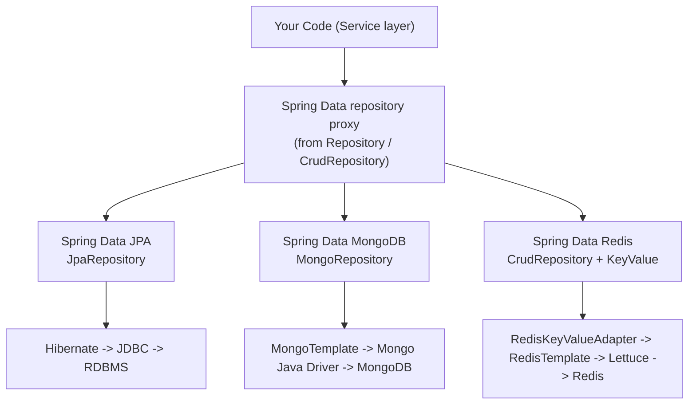
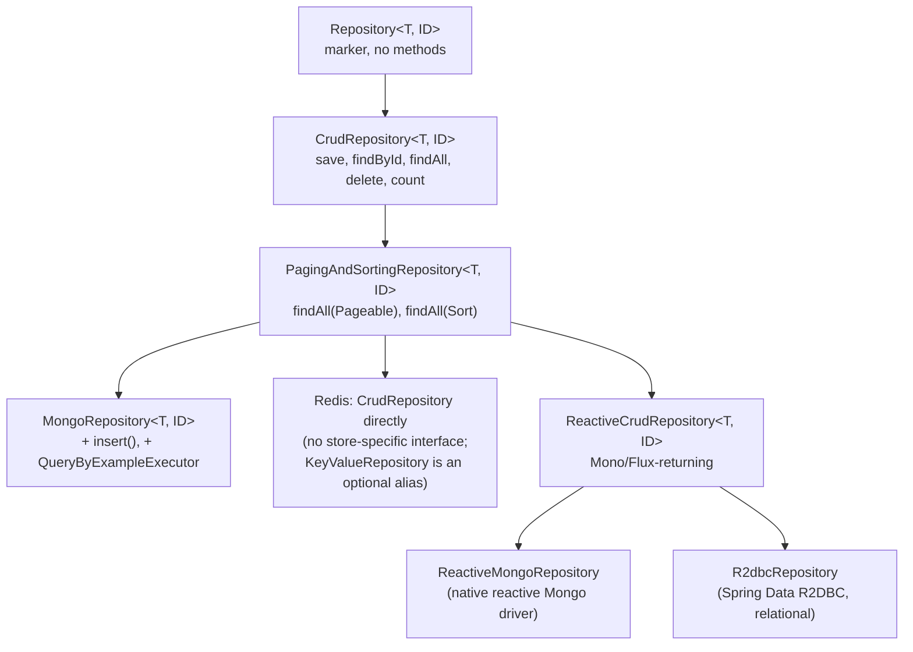
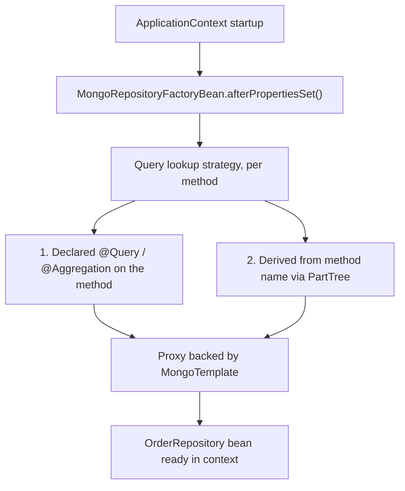
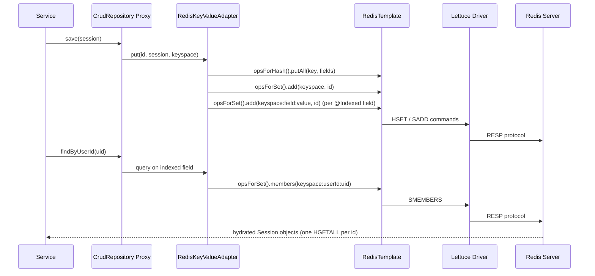
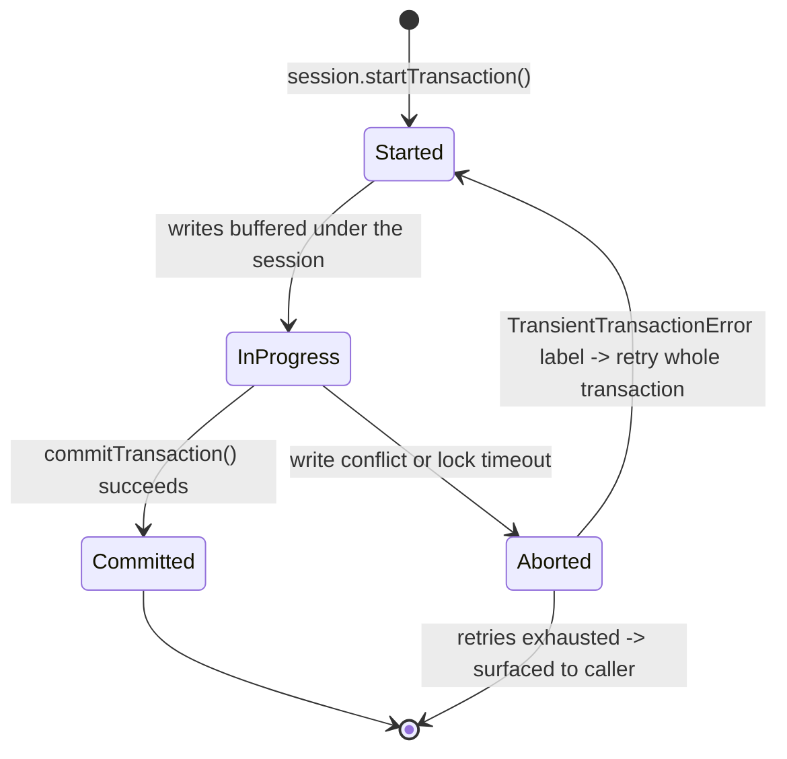
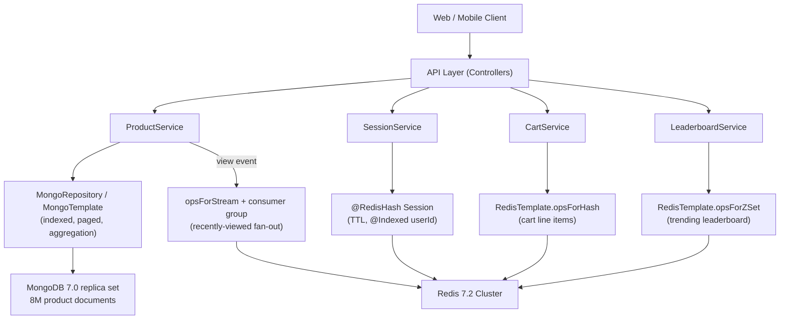

# Spring Data NoSQL — Deep Dive

---

## 1. Concept Overview

Spring Data is not one library but a family of modules sharing a single contract: describe
what you want with an interface, and the framework generates the implementation for whatever
store sits underneath. Spring Data Commons defines that contract once — `Repository`,
`CrudRepository`, `PagingAndSortingRepository`, derived-query parsing, auditing, `@Id`/`@Version`
— and each store module (JPA, MongoDB, Redis, Cassandra, Elasticsearch, Neo4j) implements it
against its own driver. This module covers the two non-relational implementations every Spring
shop eventually reaches for: **Spring Data MongoDB** (a document store accessed through
`MongoTemplate` and `MongoRepository`) and **Spring Data Redis** (a key-value store accessed
through `RedisTemplate` and `@RedisHash` repositories), plus the reactive variants of both.



Key terms:
- **Spring Data Commons**: the `spring-data-commons` module providing the store-agnostic
  `Repository` hierarchy, `PartTree` query derivation, and mapping infrastructure.
- **Converter**: store-specific class (`MappingMongoConverter`, `MappingRedisConverter`)
  that turns a Java object into the store's native representation (BSON document, Redis hash).
- **Template**: the low-level, always-available API (`MongoTemplate`, `RedisTemplate`) that
  repositories are built on top of and that you drop to when repositories are not enough.
- **KeyValue**: `spring-data-keyvalue`, the shared infrastructure Spring Data Redis's
  repository layer is built on (there is no Redis-specific repository marker interface).

---

## 2. Intuition

One-line analogy: Spring Data Commons is a universal remote — `save`, `findById`, and
`findAll` are the same buttons no matter which device (Postgres, MongoDB, Redis) you point
it at, but the wiring behind each button is completely different hardware.

Mental model: a repository is a thin, generated adapter over a store-specific template.
The repository gives you 80% convenience through convention (`findByCustomerEmail`); the
template gives you the remaining 20% — aggregation pipelines, Lua scripts, pub/sub — for
whatever the store's query model can express that a method name cannot.

Why it matters: teams frequently choose MongoDB or Redis for the wrong reason. "Schema
flexibility" is not "no data modeling," and "Redis is fast" is not "Redis is a database."
Spring Data's uniform API makes the *syntax* of switching stores easy, but it does not make
the underlying consistency, transaction, and query models equivalent — that gap is exactly
where production incidents happen.

Key insight: derived query methods and `@Query` look almost identical across JPA, MongoDB,
and Redis, but what runs underneath is utterly different. A Mongo derived query becomes a
BSON filter document with no joins and no cross-collection atomicity unless you opt into a
session; a Redis derived query on a `@RedisHash` entity only works at all if the field is
explicitly marked `@Indexed`, because Redis has no query engine — Spring Data Redis is
faking one out of plain Sets.

---

## 3. Core Principles

1. **One repository contract, many implementations.** `CrudRepository`/`PagingAndSortingRepository`
   come from `spring-data-commons`; `MongoRepository` and Redis's `CrudRepository` usage are
   store-specific extensions or direct reuses of the same base.
2. **Convention over configuration, bounded by store capability.** `PartTree` derived-query
   parsing is shared, but each module only implements the keywords its store can execute —
   Mongo supports `Near`/`Within` (geospatial) because Mongo's query language natively
   understands geometry; Redis supports almost nothing beyond equality on indexed fields.
3. **The template is the escape hatch, never a legacy path.** `MongoTemplate` and
   `RedisTemplate` are first-class, actively used APIs, not something you "graduate away
   from" once you adopt repositories.
4. **Mapping annotations replace `@Entity` per store.** `@Document` (Mongo) and `@RedisHash`
   (Redis) each drive a different converter with different rules about indexes, versioning,
   and references.
5. **Consistency is not uniform across stores.** JPA gives you cross-table ACID by default;
   MongoDB gives you single-document atomicity by default and cross-document ACID only
   inside an explicit, replica-set-only transaction; Redis gives you per-command atomicity
   and nothing more unless you reach for Lua or `MULTI`/`WATCH`.
6. **Reactive support is store-dependent, not a Commons-wide guarantee.** MongoDB and Redis
   both ship reactive drivers, but Spring Data exposes that reactivity asymmetrically —
   MongoDB gets full reactive *repositories*; Redis gets a reactive *template* only.

---

## 4. Types / Architectures / Strategies

### Repository Hierarchy Across Stores



### Query Strategies by Store

| Strategy | JPA | MongoDB | Redis |
|---|---|---|---|
| Derived query methods | Full predicate grammar | Subset + geospatial (`Near`, `Within`) | Equality on `@Indexed` fields only |
| `@Query` | JPQL or native SQL | Mongo JSON-like filter syntax | Not supported — no query language to target |
| Template/native API | `EntityManager` | `MongoTemplate` + `Criteria`/`Query` | `RedisTemplate` + `opsForX()` |
| Aggregation/pipeline | JPQL `GROUP BY` (limited) | `$match`/`$group`/`$lookup` pipeline | Not applicable |
| Full programmatic control | Criteria API / QueryDSL | `Aggregation.newAggregation(...)` | Lua scripting (`EVAL`) |

### Mapping Annotations Compared

| Concern | JPA | MongoDB | Redis |
|---|---|---|---|
| Type marker | `@Entity` | `@Document(collection=...)` | `@RedisHash(value=...)` |
| Identifier | `@Id` | `@Id` | `@Id` (auto-generated UUID string if null) |
| Optimistic locking | `@Version` | `@Version` (top-level document only) | Not supported natively |
| Secondary index | DB-level index + `@Index` (DDL) | `@Indexed`, `@CompoundIndex`, `@TextIndexed` | `@Indexed` (Spring-maintained Set, not a real DB index) |
| Expiry | N/A | TTL index (`expireAfterSeconds`) | `@RedisHash(timeToLive=...)`, `@TimeToLive` |
| Cross-object linking | `@ManyToOne`/`@OneToMany` | Embed or manual reference | `@Reference` (eager-resolved) |

### Reactive Repository Types

| Interface | Package | Backing driver |
|---|---|---|
| `ReactiveCrudRepository<T,ID>` | `spring-data-commons` | shared marker, implemented per store |
| `ReactiveMongoRepository<T,ID>` | `spring-data-mongodb` | MongoDB's native reactive streams driver |
| `R2dbcRepository<T,ID>` | `spring-data-r2dbc` | R2DBC (a non-JDBC reactive relational spec) |
| *(none for Redis)* | — | `ReactiveRedisTemplate` only — no reactive `@RedisHash` repository |

---

## 5. Architecture Diagrams

### MongoRepository: Startup Wiring and Query Lookup



### Redis Repository Call Flow: save() and findByX()



### MongoDB Multi-Document Transaction Lifecycle



### Visual Intuition: What `@RedisHash` Actually Stores

```
REDIS KEY LAYOUT FOR @RedisHash("Person")  id=1  firstname="Alice"  city="NYC"

  HASH   Person:1                       <- the object itself
         firstname -> "Alice"              HSET Person:1 firstname Alice ...
         city      -> "NYC"
         _class    -> "com.example.Person"

  SET    Person                         <- every known id (used by findAll)
         members: 1, 2, 3, ...            SADD Person 1

  SET    Person:firstname:Alice         <- secondary index, @Indexed fields only
         members: 1, 7, 19                SADD Person:firstname:Alice 1

  findByFirstname("Alice")   [indexed]     -> SMEMBERS Person:firstname:Alice, HGETALL x3
  findByCity("NYC")          [not indexed] -> no Set exists; repository query fails
```

The object lives in one Hash; every `@Indexed` field costs one extra Set that Spring Data
Redis keeps in sync on every write — a derived query is really just an `SMEMBERS` against
that Set followed by one `HGETALL` per id, which is why un-indexed fields simply aren't
queryable through the repository.

---

## 6. How It Works — Detailed Mechanics

### 6.1 Spring Data Commons: One Contract, Many Stores

```java
// spring-data-commons — the shared contract every store module implements
public interface Repository<T, ID> { }                       // marker, no methods

public interface CrudRepository<T, ID> extends Repository<T, ID> {
    <S extends T> S save(S entity);
    Optional<T> findById(ID id);
    Iterable<T> findAll();
    void deleteById(ID id);
    long count();
}

public interface PagingAndSortingRepository<T, ID> extends CrudRepository<T, ID> {
    Iterable<T> findAll(Sort sort);
    Page<T> findAll(Pageable pageable);
}

// MongoDB adds a store-specific interface on top:
public interface MongoRepository<T, ID> extends PagingAndSortingRepository<T, ID>,
                                                 QueryByExampleExecutor<T> {
    <S extends T> S insert(S entity);   // always inserts; never merges like save() can
}

// Redis has no store-specific interface — extend CrudRepository/PagingAndSortingRepository
// directly. The "Redis-ness" lives entirely in the @RedisHash mapping annotation and the
// RedisKeyValueAdapter running behind the generated proxy.
public interface SessionRepository extends CrudRepository<Session, String> { }
```

### 6.2 MongoTemplate vs MongoRepository

```java
@Document(collection = "orders")
public class Order {
    @Id
    private String id;                 // hex string over ObjectId, or ObjectId directly

    @Indexed
    private String customerEmail;

    @Field("total")
    private BigDecimal totalAmount;

    private OrderStatus status;
    private Instant createdAt;

    @Version
    private Long version;              // optimistic locking, top-level document only
}

public interface OrderRepository extends MongoRepository<Order, String> {

    List<Order> findByCustomerEmailAndStatus(String email, OrderStatus status);

    @Query("{ 'status': ?0, 'createdAt': { $gte: ?1 } }")
    List<Order> findRecent(OrderStatus status, Instant since);

    // fields = projection document — narrower BSON over the wire, same idea as a JPA DTO projection
    @Query(value = "{ 'customerEmail': ?0 }", fields = "{ 'status': 1, 'total': 1 }")
    List<Order> findStatusAndTotalByEmail(String email);
}

// MongoTemplate — the escape hatch for dynamic, optional-filter queries a method name can't express
@Service
public class OrderQueryService {
    private final MongoTemplate mongoTemplate;
    OrderQueryService(MongoTemplate mongoTemplate) { this.mongoTemplate = mongoTemplate; }

    public List<Order> search(String email, OrderStatus status, Instant from, Pageable page) {
        Criteria criteria = Criteria.where("customerEmail").is(email);
        if (status != null) criteria = criteria.and("status").is(status);
        if (from != null) criteria = criteria.and("createdAt").gte(from);

        return mongoTemplate.find(Query.query(criteria).with(page), Order.class);
    }
}
```

### 6.3 Derived Queries, `@Query`, and the Aggregation Framework

```java
public interface StoreRepository extends MongoRepository<Store, String> {
    // Geospatial — no JPA equivalent; Mongo's query language natively understands geometry
    List<Store> findByLocationNear(Point point, Distance maxDistance);

    // Repository-level aggregation pipeline (Spring Data MongoDB 2.2+)
    @Aggregation(pipeline = {
        "{ $match: { status: 'COMPLETED' } }",
        "{ $group: { _id: '$category', revenue: { $sum: '$total' }, orders: { $sum: 1 } } }",
        "{ $sort: { revenue: -1 } }"
    })
    List<CategoryRevenue> revenueByCategory();
}

// The same pipeline via the Java DSL against MongoTemplate — full programmatic control,
// useful when the pipeline shape depends on runtime parameters
Aggregation pipeline = Aggregation.newAggregation(
    Aggregation.match(Criteria.where("status").is(OrderStatus.COMPLETED)),
    Aggregation.group("category").sum("total").as("revenue").count().as("orders"),
    Aggregation.sort(Sort.Direction.DESC, "revenue")
);
AggregationResults<CategoryRevenue> results =
    mongoTemplate.aggregate(pipeline, "orders", CategoryRevenue.class);
```

### 6.4 Multi-Document Transactions (MongoDB 4.0+)

```java
@Configuration
public class MongoTxConfig {
    @Bean
    MongoTransactionManager transactionManager(MongoDatabaseFactory dbFactory) {
        return new MongoTransactionManager(dbFactory);   // requires a replica set or mongos
    }
}

@Service
public class TransferService {
    private final MongoTemplate mongoTemplate;
    TransferService(MongoTemplate mongoTemplate) { this.mongoTemplate = mongoTemplate; }

    @Transactional
    public void transfer(String fromId, String toId, BigDecimal amount) {
        mongoTemplate.updateFirst(Query.query(Criteria.where("id").is(fromId)),
            new Update().inc("balance", amount.negate()), Account.class);
        mongoTemplate.updateFirst(Query.query(Criteria.where("id").is(toId)),
            new Update().inc("balance", amount), Account.class);
        // Both writes commit or roll back together — but only against a replica set or
        // mongos. A standalone mongod rejects the first transactional command with:
        // "Transaction numbers are only allowed on a replica set member or mongos"
    }
}
```

Hard constraints to design around:
- Requires a replica set (even a single-node one for local dev) or a sharded cluster.
- Transactions default to a 60-second lifetime (`transactionLifetimeLimitSeconds`); MongoDB
  proactively aborts anything still open past that.
- `maxTransactionLockRequestTimeoutMillis` (default 5ms) bounds how long a transaction waits
  on a lock before failing with a write conflict, surfaced as a `TransientTransactionError`
  label — the caller must retry the *entire* transaction, not just the failed statement.
- Overhead is roughly 10-20% versus single-document operations (same ballpark as the
  storage-engine numbers in [Document Databases](../../database/document_databases/README.md)).
- Prefer designing the write around one aggregate document first; reach for a transaction
  only when true cross-document atomicity cannot be avoided.

### 6.5 Index Management and Optimistic Locking

```java
// @Indexed alone is NOT enough in production: spring.data.mongodb.auto-index-creation
// defaults to false, so annotations never create anything unless you opt in — and even
// then, every instance racing to build the same index at startup wastes cycles on a large
// collection. Create indexes explicitly, once, through a controlled step.
@Component
public class MongoIndexInitializer {
    private final MongoTemplate mongoTemplate;
    MongoIndexInitializer(MongoTemplate mongoTemplate) { this.mongoTemplate = mongoTemplate; }

    @PostConstruct
    void createIndexes() {
        IndexOperations ops = mongoTemplate.indexOps(Order.class);
        ops.createIndex(new Index().on("customerEmail", Direction.ASC).named("idx_customer_email"));
        ops.createIndex(new CompoundIndexDefinition(
            new Document("status", 1).append("createdAt", -1)).named("idx_status_created"));
    }
}

// Optimistic locking — @Version applies only to the top-level document
@Document("accounts")
public class Account {
    @Id private String id;
    private BigDecimal balance;
    @Version private Long version;   // save() adds {version: currentVersion} to the update
}                                    // filter; a mismatch means zero documents matched ->
                                     // OptimisticLockingFailureException
```

### 6.6 RedisTemplate, StringRedisTemplate, and Serializers

```java
@Configuration
public class RedisConfig {

    // Left unconfigured, RedisTemplate<String, Object> defaults ALL FOUR serializer slots
    // (key, value, hashKey, hashValue) to JdkSerializationRedisSerializer — every value
    // becomes a Java-serialized binary blob (0xAC 0xED magic bytes), unreadable in
    // redis-cli, unreadable by any non-JVM client, and broken the moment a field is renamed.
    @Bean
    public RedisTemplate<String, Object> redisTemplate(RedisConnectionFactory factory) {
        RedisTemplate<String, Object> template = new RedisTemplate<>();
        template.setConnectionFactory(factory);
        template.setKeySerializer(new StringRedisSerializer());
        template.setHashKeySerializer(new StringRedisSerializer());
        template.setValueSerializer(new GenericJackson2JsonRedisSerializer());
        template.setHashValueSerializer(new GenericJackson2JsonRedisSerializer());
        return template;
    }
}

// StringRedisTemplate: RedisTemplate<String, String> pre-wired with StringRedisSerializer
// on all four slots — ideal when every value really is a plain string (counters, tokens,
// flags); you serialize/deserialize JSON yourself for anything structured.
@Service
public class ViewCounterService {
    private final StringRedisTemplate redis;
    ViewCounterService(StringRedisTemplate redis) { this.redis = redis; }

    public Long increment(String articleId) {
        return redis.opsForValue().increment("views:" + articleId);
    }
}
```

### 6.7 `@RedisHash` Repositories and Secondary Indexes

```java
@RedisHash(value = "Session", timeToLive = 1800)   // class-level default TTL, seconds
public class Session {
    @Id
    private String id;                  // auto-generated UUID string if left null

    @Indexed
    private String userId;              // secondary index — queryable

    private String city;                // NOT indexed — cannot be used in a derived query

    @Reference
    private Cart cart;                  // pointer to another @RedisHash aggregate;
                                         // resolved (fetched) eagerly as part of loading Session
    @TimeToLive
    private Long ttlOverride;           // optional per-instance TTL, overrides the class default
}

public interface SessionRepository extends CrudRepository<Session, String> {
    List<Session> findByUserId(String userId);   // OK — userId is @Indexed

    // List<Session> findByCity(String city);    // would fail — city has no secondary index,
                                                   // and Redis repositories have no @Query
                                                   // escape hatch the way Mongo/JPA do
}
```

Unlike MongoDB or JPA, Spring Data Redis repositories have no `@Query` annotation to fall
back on — there is no query language underneath for it to target. Anything beyond equality
on an `@Indexed` field means dropping to `RedisTemplate` (or a Lua script) and maintaining
your own index.

### 6.8 Redis Pub/Sub vs Streams

```java
@Configuration
public class RedisPubSubConfig {
    @Bean
    RedisMessageListenerContainer container(RedisConnectionFactory factory,
                                             MessageListenerAdapter listener) {
        RedisMessageListenerContainer container = new RedisMessageListenerContainer();
        container.setConnectionFactory(factory);
        container.addMessageListener(listener, new ChannelTopic("order-events"));
        return container;
    }
}

// Publish — fire and forget, no persistence, no acknowledgment
stringRedisTemplate.convertAndSend("order-events", "{\"orderId\":42,\"status\":\"SHIPPED\"}");
// A subscriber not connected at publish time, or one whose connection drops mid-broadcast,
// never sees the message — Redis gives no signal that delivery failed.

// Streams — durable log + consumer groups + acknowledgment, via the same RedisTemplate
StreamOperations<String, Object, Object> streams = redisTemplate.opsForStream();
streams.add(StreamRecords.newRecord().ofObject(event).withStreamKey("order-events"));
streams.createGroup("order-events", "order-processors");
// consumer reads with XREADGROUP-equivalent, then explicitly streams.acknowledge(...)
```

### 6.9 Reactive Repositories vs R2DBC

```java
public interface ReactiveOrderRepository extends ReactiveMongoRepository<Order, String> {
    Flux<Order> findByCustomerEmail(String email);      // Flux<T> instead of List<T>
    Mono<Order> findByIdAndStatus(String id, OrderStatus status);
}

// ReactiveCrudRepository (spring-data-commons) is the SAME marker interface Spring Data
// R2DBC uses for relational databases — the reactive analog of the "universal remote":
public interface ReactiveAccountRepository extends R2dbcRepository<Account, Long> {
    Flux<Account> findByOwnerId(Long ownerId);
}

// Redis has no reactive @RedisHash repository — the repository layer (CrudRepository +
// RedisKeyValueAdapter) is imperative-only, built on the synchronous Spring Data KeyValue
// infrastructure. For non-blocking Redis access, use ReactiveRedisTemplate directly:
Mono<String> value = reactiveRedisTemplate.opsForValue().get("session:42");
```

MongoDB and Redis both ship native asynchronous drivers, so their reactive templates are
genuinely non-blocking end to end. Relational databases have no such driver at the JDBC
layer — JDBC is blocking by specification — which is exactly why R2DBC exists as a separate,
purpose-built reactive driver spec, letting Spring Data R2DBC offer the same
`ReactiveCrudRepository` contract over SQL. See
[Spring WebFlux](../spring_webflux/README.md) for the full non-blocking picture, including
why wrapping JDBC in `subscribeOn(boundedElastic())` is a stopgap, not a fix.

### 6.10 Broken → Fix: The Unbounded, Unindexed `findAll`

```java
// --- BROKEN: two compounding mistakes that surface as the same symptom ---

// Mistake 1 — @Indexed alone does not create an index (auto-index-creation=false by
// default), so this "indexed" field has no index in any real deployment:
@Document("orders")
public class Order {
    @Indexed                       // annotation only — nothing ever ran createIndex() for it
    private String customerEmail;
    // ...
}

// Mistake 2 — building a report by materializing the entire collection into the JVM:
@Service
public class OrderReportService {
    private final MongoTemplate mongoTemplate;
    OrderReportService(MongoTemplate mongoTemplate) { this.mongoTemplate = mongoTemplate; }

    public List<OrderReport> monthlyReport(String customerEmail) {
        List<Order> all = mongoTemplate.findAll(Order.class);              // COLLSCAN, 50M docs
        return all.stream()
                  .filter(o -> o.getCustomerEmail().equals(customerEmail)) // filtered in the JVM
                  .map(OrderReport::from)
                  .toList();
    }
}
// db.orders.find({customerEmail: "..."}).explain("executionStats")
//   winningPlan.stage: "COLLSCAN"   totalDocsExamined: 50,000,000   executionTimeMillis: 41,200
// Heap: materializing 50M Order objects before filtering -> OutOfMemoryError under load.
```

```java
// --- FIX ---

// 1. Create the index explicitly and verify it — never rely on the annotation alone
mongoTemplate.indexOps(Order.class)
    .createIndex(new Index().on("customerEmail", Direction.ASC).named("idx_customer_email"));

// 2. Push the filter into the query and page instead of materializing everything
@Service
public class OrderReportService {
    private final MongoTemplate mongoTemplate;
    OrderReportService(MongoTemplate mongoTemplate) { this.mongoTemplate = mongoTemplate; }

    public List<OrderReport> monthlyReport(String customerEmail, Pageable page) {
        Query query = Query.query(Criteria.where("customerEmail").is(customerEmail)).with(page);
        return mongoTemplate.find(query, Order.class).stream().map(OrderReport::from).toList();
    }
}
// db.orders.find({customerEmail: "..."}).explain("executionStats")
//   winningPlan.stage: "IXSCAN"   totalDocsExamined: 340   executionTimeMillis: 6
```

Same store, same driver, same collection — the difference between a 41-second heap-busting
scan and a 6-millisecond lookup is one explicitly created index and one `Pageable`.

---

## 7. Real-World Examples

**Product catalog**: MongoDB stores 8M products across 400 categories, each category with a
different attribute schema (a laptop document has `ramGb`; a t-shirt document has `size`).
A compound index on `(category, brand)` backs the browse endpoint; a nightly `@Aggregation`
pipeline rolls up revenue per category.

**Session and auth state**: `@RedisHash(timeToLive = 1800)` Session objects with an
`@Indexed userId` field so a "log out everywhere" feature can find all of a user's active
sessions in one `SMEMBERS` call instead of a scan.

**Real-time leaderboard**: `RedisTemplate.opsForZSet()` backs a game leaderboard —
`ZADD`/`ZREVRANGE` give O(log n) updates and O(log n + k) top-k reads regardless of player
count (see [Key-Value Stores](../../database/key_value_stores/README.md) for the full
skiplist mechanics).

**Shopping cart plus order record**: Redis Hash (`opsForHash`) holds the *ephemeral* cart
(fast, TTL-bounded, disposable), while MongoDB stores the *durable* order once checkout
completes — a deliberate polyglot split between hot, disposable state and the permanent
record.

**Event fan-out**: Redis Streams with a consumer group replace pub/sub for
"recently viewed" and inventory-change notifications that a downstream worker cannot afford
to silently miss, while MongoDB change streams (not covered here — see
[Document Databases](../../database/document_databases/README.md)) feed the same events to
a search index.

---

## 8. Tradeoffs

### Store Comparison

| Aspect | JPA / Relational | MongoDB | Redis |
|---|---|---|---|
| Data model | Normalized tables | Nested documents (BSON) | Flat key -> value / hash / set / zset |
| Transactions | Cross-table ACID by default | Single-doc atomic by default; multi-doc opt-in (4.0+) | Per-command atomic; `MULTI`/Lua for more |
| Query flexibility | Full SQL, joins, window functions | Rich (aggregation pipeline), no joins across shards | Point lookups + a handful of structure-specific ops |
| Horizontal scale | Requires sharding add-ons | Built-in sharding | Built-in Cluster (hash slots) |
| Typical latency | 1-10 ms | 1-15 ms (single doc), more with transactions | Sub-millisecond |
| Schema | Enforced at write | Flexible, app-enforced | None — just bytes per field |

### MongoTemplate vs MongoRepository

| | MongoRepository | MongoTemplate |
|---|---|---|
| Best for | Fixed, common-path lookups | Dynamic, optional-filter queries |
| Compile-time safety | Method name validated at startup | None — plain Java calls |
| Aggregation | `@Aggregation` (fixed pipeline) | `Aggregation.newAggregation(...)` (built at runtime) |
| Boilerplate | Minimal | More verbose, more control |

### RedisTemplate vs `@RedisHash` Repository

| | `@RedisHash` Repository | RedisTemplate |
|---|---|---|
| Query capability | Equality on `@Indexed` fields only | Anything the data structure supports |
| Structures | Hash only (one object = one Hash) | String, Hash, List, Set, ZSet, Stream |
| `@Query` escape hatch | None | N/A — you're already at the lowest level |
| Best for | Simple CRUD aggregates (sessions, profiles) | Counters, leaderboards, pub/sub, rate limits |

### Redis Serializer Choice

| Serializer | Readability | Cross-language | Versioning risk |
|---|---|---|---|
| `JdkSerializationRedisSerializer` (default) | None (binary) | None — JVM only | High — `serialVersionUID` breaks on refactor |
| `StringRedisSerializer` | Full (plain text) | Full | None — you own the format |
| `GenericJackson2JsonRedisSerializer` | Full (JSON) | Full | Low — tolerant of added/removed fields |

### Blocking vs Reactive Repositories

| Store | Blocking repository | Reactive repository | Reactive template |
|---|---|---|---|
| Relational (JPA/JDBC) | Yes | No — needs R2DBC instead | N/A |
| Relational (R2DBC) | No | Yes (`R2dbcRepository`) | N/A |
| MongoDB | Yes (`MongoRepository`) | Yes (`ReactiveMongoRepository`) | `ReactiveMongoTemplate` |
| Redis | Yes (`CrudRepository`) | No | `ReactiveRedisTemplate` |

---

## 9. When to Use / When NOT to Use

**Use MongoDB when**: the domain is aggregate-shaped (a whole document is read and written
together), schema varies per record type, you need built-in horizontal sharding, and
single-document atomicity covers most writes.

**Do NOT use MongoDB when**: the workload is relational joins across many entity types as
the *normal* case (not the exception), cross-collection ACID needs to be the default
transaction mode, or you need window functions/CTEs for reporting.

**Use Redis when**: access is by key at sub-millisecond latency, data is naturally
ephemeral or TTL-bounded, or you need atomic counters, leaderboards, rate limits, or fast
pub/sub-style fan-out.

**Do NOT use Redis as a primary store when**: the dataset exceeds available RAM, durability
requirements exceed what `appendfsync everysec` provides, or you need ad hoc queries across
many non-indexed attributes.

### Access Pattern & Consistency Decision Guide

| Question | Favors JPA / Relational | Favors MongoDB | Favors Redis |
|---|---|---|---|
| How is data typically read? | Joined across several tables | One aggregate document at a time | One key at a time |
| What's the consistency need? | Cross-table ACID, always | Single-doc atomic; cross-doc is opt-in and costly | None built in — atomicity is per-command or scripted |
| How does it scale? | Vertical + read replicas | Native horizontal sharding | In-memory horizontal via Cluster |
| What happens if the store restarts? | WAL replay, no data loss | Oplog replay with `w:majority` | RDB/AOF replay — accept up to ~1s loss with `everysec` |

---

## 10. Common Pitfalls

### Pitfall 1: `@Indexed` Without an Actual Index

```java
// BROKEN — the annotation alone is metadata; auto-index-creation defaults to false
@Document("orders")
public class Order {
    @Indexed
    private String customerEmail;
}
// db.orders.find({customerEmail: "a@b.com"}).explain() -> winningPlan.stage: "COLLSCAN"
```

```java
// FIX — create the index explicitly, once, through a controlled startup/migration step
mongoTemplate.indexOps(Order.class)
    .createIndex(new Index().on("customerEmail", Direction.ASC).named("idx_customer_email"));
```

**Production impact**: a marketplace ran this exact gap for six weeks — every "orders by
customer" query silently scanned 22M documents at 380ms p50, mistaken for "MongoDB being
slow at scale" until `explain()` revealed the missing index.

### Pitfall 2: Default `RedisTemplate` Serialization

```java
// BROKEN — no serializers configured; every value is Java-serialized binary
@Bean
public RedisTemplate<String, Object> redisTemplate(RedisConnectionFactory f) {
    RedisTemplate<String, Object> t = new RedisTemplate<>();
    t.setConnectionFactory(f);
    return t;                       // key/value/hashKey/hashValue all default to JDK serializer
}
```

```java
// FIX — explicit String keys, JSON values
@Bean
public RedisTemplate<String, Object> redisTemplate(RedisConnectionFactory f) {
    RedisTemplate<String, Object> t = new RedisTemplate<>();
    t.setConnectionFactory(f);
    t.setKeySerializer(new StringRedisSerializer());
    t.setValueSerializer(new GenericJackson2JsonRedisSerializer());
    return t;
}
```

**Production impact**: a rolling deploy renamed a field on a cached DTO. Every session
written by the old JVM version failed to deserialize under the new one —
`SerializationException` on 100% of active sessions until the cache was flushed.

### Pitfall 3: Querying a Non-Indexed `@RedisHash` Field

```java
// BROKEN — city was never annotated @Indexed
public interface SessionRepository extends CrudRepository<Session, String> {
    List<Session> findByCity(String city);   // no Set exists to back this query
}
```

```java
// FIX — either index the field, or accept that Redis is the wrong tool for this query
@Indexed
private String city;
// or: maintain your own index structure via RedisTemplate, or query MongoDB/Elasticsearch
// instead — Redis has no general-purpose secondary-index engine to fall back on
```

### Pitfall 4: `@Transactional` on MongoDB Without a Replica Set

```java
// BROKEN — a single standalone mongod cannot run transactions at all
@Transactional
public void transfer(String from, String to, BigDecimal amount) { /* two updates */ }
// Fails immediately: "Transaction numbers are only allowed on a replica set member or mongos"
```

```java
// FIX — run Mongo as a (single-node, for local dev) replica set, wire a MongoTransactionManager,
// and wrap the call in a retry loop that inspects the exception's error labels
@Retryable(retryFor = TransientTransactionException.class, maxAttempts = 3)
@Transactional
public void transfer(String from, String to, BigDecimal amount) { /* two updates */ }
```

### Pitfall 5: Redis Pub/Sub for Data That Cannot Be Lost

```java
// BROKEN — order-status fan-out over pub/sub; a subscriber restart during a deploy
// silently drops every message published during the gap
stringRedisTemplate.convertAndSend("order-events", payload);
```

```java
// FIX — Streams give persistence, consumer groups, and acknowledgment
redisTemplate.opsForStream().add(StreamRecords.newRecord()
    .ofObject(payload).withStreamKey("order-events"));
// consumer: XREADGROUP-equivalent read, process, then explicitly acknowledge(...)
```

**Production impact**: a notification service lost roughly 8,000 "order shipped" events
during a single Redis failover because pub/sub has no replay — customers who should have
been notified were not, discovered only through support tickets.

### Pitfall 6: Unhandled `OptimisticLockingFailureException` on `@Version`

```java
// BROKEN — no retry, so any concurrent write to the same document surfaces as a 500
public void credit(String accountId, BigDecimal amount) {
    Account a = accountRepository.findById(accountId).orElseThrow();
    a.setBalance(a.getBalance().add(amount));
    accountRepository.save(a);   // throws OptimisticLockingFailureException under contention
}
```

```java
// FIX — retry on conflict; remember MongoDB versions only the top-level document, so
// concurrent updates to two different fields on the same document still conflict
@Retryable(retryFor = OptimisticLockingFailureException.class, maxAttempts = 3)
public void credit(String accountId, BigDecimal amount) {
    Account a = accountRepository.findById(accountId).orElseThrow();
    a.setBalance(a.getBalance().add(amount));
    accountRepository.save(a);
}
```

---

## 11. Technologies & Tools

| Tool | Role |
|---|---|
| Spring Data MongoDB 4.x | Repository abstraction, `MongoTemplate`, aggregation, index management |
| Spring Data Redis 3.x | `RedisTemplate`/`ReactiveRedisTemplate`, `@RedisHash` repositories, pub/sub |
| MongoDB Java Driver (sync + reactive streams) | Wire-protocol client `MongoTemplate`/`ReactiveMongoTemplate` delegate to |
| Lettuce | Default Redis client since Spring Boot 2.0 — Netty-based, thread-safe, reactive-native |
| Jedis | Alternative synchronous Redis client; needs `commons-pool2` for connection pooling |
| Spring Data R2DBC | Reactive relational repositories over R2DBC — the `ReactiveCrudRepository` for SQL |
| Mongock | Schema/index migration tool for MongoDB — the Flyway/Liquibase equivalent |
| MongoDB Compass / `mongosh` | GUI/CLI for `explain()` plans, index inspection, schema analysis |
| RedisInsight / `redis-cli` | GUI/CLI for key inspection, `MONITOR`, memory analysis |
| Testcontainers (mongodb, redis modules) | Real MongoDB (including replica-set mode) and Redis in integration tests |
| Flapdoodle Embedded MongoDB | In-JVM MongoDB for fast unit tests (no replica set, no transactions) |
| Micrometer | Connection-pool and command-latency metrics for both drivers |

### Key Spring Boot Properties

```properties
# MongoDB — indexes are NOT auto-created from @Indexed by default
spring.data.mongodb.auto-index-creation=false

# MongoDB connection
spring.data.mongodb.uri=mongodb://localhost:27017/catalog?replicaSet=rs0

# Redis — Lettuce pool sizing
spring.data.redis.lettuce.pool.max-active=16
spring.data.redis.lettuce.pool.max-idle=8
spring.data.redis.timeout=2000ms
```

---

## 12. Interview Questions with Answers

**Why does calling `mongoTemplate.findAll(Order.class)` on a large collection risk an OutOfMemoryError?**
`findAll()` loads every document in the collection into memory as a `List` in one call, so
heap usage grows linearly with collection size regardless of what you actually need. On a
50-million-document collection this materializes 50 million live objects before any
filtering happens. Fix by pushing the filter into a `Query`/`Criteria` and paginating with
`Pageable`, or by using a cursor-based `Stream<T>` query method that processes rows one at
a time.

**Why does a MongoDB field annotated `@Indexed` still get a COLLSCAN in production?**
`@Indexed` only describes intent — Spring Boot's `spring.data.mongodb.auto-index-creation`
defaults to false, so the annotation alone never creates the index. The index only exists
if something explicitly ran `IndexOperations.createIndex(...)` or a migration tool like
Mongock. Always verify with `explain("executionStats")` that the plan says `IXSCAN`, not
`COLLSCAN`, before trusting an annotation.

**Why does `RedisTemplate<String, Object>` store values as unreadable binary blobs by default?**
Its default key/value/hashKey/hashValue serializer is `JdkSerializationRedisSerializer`,
which writes Java's binary serialization format, not human-readable text. This is why
`redis-cli GET` on an unconfigured template's key shows garbage bytes, why non-JVM clients
can't read it, and why renaming a cached class's field can break deserialization entirely.
Always configure `StringRedisSerializer` for keys and a JSON serializer
(`GenericJackson2JsonRedisSerializer`) for values explicitly.

**Why can't a `@RedisHash` repository query a field unless it's annotated `@Indexed`?**
Redis has no built-in secondary-index engine, so Spring Data Redis maintains its own index
as a separate Set per distinct value, only for fields you mark `@Indexed`. A derived query
like `findByCity` on a non-indexed field has no Set to read from, so it is unsupported —
unlike MongoDB or JPA, Redis repositories have no `@Query` fallback to express it another
way. The workaround is to add `@Indexed`, or drop to `RedisTemplate` and scan/filter
yourself, or maintain your own index structure.

**Why does wrapping two MongoDB writes in `@Transactional` throw at runtime against a fresh single-node `mongod`?**
MongoDB transactions require a replica set or a `mongos` router, so a standalone `mongod`
rejects the very first transactional command outright. The exact error is "Transaction
numbers are only allowed on a replica set member or mongos" — even a local, single-node
deployment must be initialized as a one-member replica set before `@Transactional` (backed
by `MongoTransactionManager`) will work at all. This is a common local-dev-vs-production
surprise; Testcontainers' MongoDB module can start in replica-set mode specifically to
catch it in CI.

**What's the difference between `StringRedisTemplate` and `RedisTemplate<String, Object>`?**
`StringRedisTemplate` pre-wires `StringRedisSerializer` for keys, values, and hash fields,
while a bare `RedisTemplate<String, Object>` defaults to Java serialization unless
reconfigured. Use `StringRedisTemplate` when every value truly is a string (counters,
tokens, flags); use a configured `RedisTemplate<String, Object>` with a JSON value
serializer when you're storing structured objects. Mixing the two against the same keys
without matching serializers produces deserialization errors.

**When should you drop from a `MongoRepository` down to `MongoTemplate` directly?**
Reach for `MongoTemplate` when the query is dynamic, needs an aggregation pipeline, or
requires field-level projections that a derived method name can't cleanly express. A
back-office search screen with five optional filters is a `Criteria` chain built at
runtime, not a 5-keyword derived method name. Repositories remain the right choice for the
fixed, common-path lookups that make up most of an application's queries.

**How does the MongoDB aggregation framework differ from a derived query or `@Query` method?**
The aggregation framework runs documents through a pipeline of stages (`$match`, `$group`,
`$lookup`, `$sort`) that can reshape and combine data, not just filter it. Derived queries
and `@Query` return documents (or projections of them) as-is; an aggregation can compute
sums, group by category, join another collection with `$lookup`, and reshape the output
entirely. Use `@Aggregation` on a repository method for a fixed pipeline, or
`Aggregation.newAggregation(...)` against `MongoTemplate` when the pipeline's stages depend
on runtime input.

**What are the hard constraints on MongoDB multi-document transactions (4.0+)?**
They require a replica set or sharded cluster, default to a 60-second lifetime, and abort
with a retryable `TransientTransactionError` on write conflicts. The caller is responsible
for catching that error label and retrying the whole transaction from the start, not just
the failed statement. Overhead runs roughly 10-20% versus single-document operations, which
is why most teams model writes around one aggregate document first and reserve
transactions for the cases that truly need cross-document atomicity.

**How does `@Version` optimistic locking work in Spring Data MongoDB, and how does it differ from JPA?**
Spring Data MongoDB adds the current version to the update filter and increments it on
write, so a stale write matches zero documents and throws
`OptimisticLockingFailureException`. The key difference from JPA is scope: MongoDB's
`@Version` only tracks the top-level document — there is no per-nested-object versioning,
so two concurrent updates to different embedded sub-objects within the same document still
conflict, unlike JPA where each entity in a graph can version independently.

**How does Spring Data Redis implement a secondary index for a `@RedisHash` entity?**
It stores the entity as a Redis Hash and maintains one extra Set per `@Indexed` field,
named after the field and value, holding the ids of all matching entities. A query like
`findByUserId("u42")` becomes `SMEMBERS Session:userId:u42` followed by one `HGETALL` per
returned id. This means indexing N fields costs N extra Sets kept in sync on every write —
a real, if implicit, storage and write-amplification cost that's easy to forget because it
looks exactly like `@Indexed` in JPA.

**What is `@Reference` in Spring Data Redis and what does it cost?**
`@Reference` links one `@RedisHash` aggregate to another by id, and Spring Data Redis
resolves it eagerly on every load — there is no lazy option the way JPA's `FetchType.LAZY`
provides. Looping over a collection of entities that each carry a `@Reference` field
reproduces JPA's N+1 problem, except as N extra `HGETALL` calls instead of N extra
`SELECT`s. Prefer embedding the referenced data directly in the Hash when it's small and
always accessed together.

**How do Redis pub/sub and Redis Streams differ as messaging mechanisms for a Spring application?**
Pub/sub is fire-and-forget with zero persistence — a subscriber that isn't connected at
publish time simply never sees the message, and Redis gives no delivery-failure signal at
all. Streams (accessed via `RedisTemplate.opsForStream()`) add an append-only log, consumer
groups so each message goes to exactly one consumer in a group, and explicit
acknowledgment, closing all three gaps. Use pub/sub only for best-effort broadcast (live
dashboards, chat presence); use Streams for anything a downstream consumer cannot afford to
miss.

**Does `ReactiveMongoRepository` give you the same non-blocking guarantee as `ReactiveCrudRepository` over R2DBC?**
Yes for both, but for different underlying reasons — MongoDB ships a native asynchronous
driver, while R2DBC is a separate driver specification built because JDBC has no
non-blocking equivalent at all. Both surface through the shared `ReactiveCrudRepository`
marker interface from `spring-data-commons`, so the programming model looks identical even
though one sits on a store with reactive support built in and the other exists specifically
to retrofit it onto relational databases.

**Does Spring Data Redis offer reactive `@RedisHash` repositories the same way MongoDB does?**
No — the `@RedisHash` repository layer is imperative-only, built on the synchronous Spring
Data KeyValue infrastructure, even though Redis itself has a fully reactive driver
(Lettuce). For non-blocking Redis access you use `ReactiveRedisTemplate` directly
(`opsForValue().get(key)` returning `Mono<V>`, and so on) rather than a reactive repository
— an asymmetry that surprises teams who assume "reactive" is offered uniformly across every
Spring Data module.

**When should you choose MongoDB or Redis over Spring Data JPA on a relational database?**
Choose by access pattern and consistency: JPA for cross-entity ACID joins, MongoDB for
aggregate-shaped documents, Redis for single-key sub-millisecond access. If most queries
join three or more tables and must be transactionally consistent by default, stay
relational; if a single JSON-shaped aggregate is read and written together and horizontal
scale matters more than joins, MongoDB fits; if the access is "get/set by key" at latency
budgets JPA can't hit, Redis fits.

**When should Redis be a `@Cacheable` cache versus a Spring Data Redis-backed primary store?**
Use the cache abstraction when Redis merely accelerates data that has a durable source of
truth elsewhere and can vanish without permanent loss — that's exactly the domain of
[Spring Caching](../spring_caching/README.md)'s `RedisCacheManager`. Use Spring Data Redis
repositories/templates when Redis itself is the only copy of the data (sessions,
leaderboards, real-time counters), because then durability configuration (AOF, replicas)
and query design matter in a way pure caching never has to consider.

**How do you manage MongoDB indexes safely across multiple application instances in production?**
Create indexes explicitly through a controlled migration step, not through `@Indexed` plus
`auto-index-creation=true`, so instances don't race to build the same index concurrently at
startup. A single migration job (Mongock, or a one-shot `IndexOperations` call gated behind
a deploy pipeline step) runs once; every application instance then just assumes the index
already exists. Building a large index inline during normal request traffic can visibly
degrade write throughput.

**What happens when two concurrent writers both update the same `@Version`-tracked MongoDB document?**
Only the first write's version-matching filter succeeds — the second write's filter no
longer matches the already-incremented version, so it updates zero documents and fails with
`OptimisticLockingFailureException`. The losing caller must retry: reload the document,
reapply its change, and attempt the save again, typically wrapped in a bounded retry
(`@Retryable`) rather than surfaced directly to the user.

**Why can't you page through a 50-million-document MongoDB collection with `skip()`/`limit()`?**
`skip()` still has to walk and discard every preceding document before the limit window, so
cost grows linearly with the offset regardless of index usage — page 100,000 costs roughly
100,000x the work of page 1. The fix is keyset (cursor-based) pagination: query
`WHERE _id > lastSeenId ORDER BY _id LIMIT pageSize` instead of an offset, which costs the
same regardless of how deep into the collection you are.

**Can Spring Data's derived query method names (`findByXAndY`) express the same things across JPA, MongoDB, and Redis?**
No — the method-name grammar (`PartTree`) is shared, but each module only translates the
keywords its store can actually execute. MongoDB additionally supports geospatial keywords
like `Near`/`Within` because its query language understands geometry natively; Redis
supports almost nothing beyond equality on `@Indexed` fields because there is no query
engine underneath to translate anything richer into.

**What happens to data already stored with the default JDK serializer if you switch a Redis app to JSON serialization?**
Existing keys stay encoded in the old format and fail to deserialize under the new
serializer, so a mid-flight switch needs a dual-read migration, not a config change. A safe
rollout reads with a fallback (try JSON, fall back to JDK, rewrite on next save) until a TTL
sweep or background migration job confirms no old-format keys remain, then removes the
fallback path.

---

## 13. Best Practices

1. **Never rely on `@Indexed` alone in production.** Create indexes explicitly (Mongock or
   a gated startup step) and verify with `explain("executionStats")`.
2. **Configure `StringRedisSerializer` for keys and `GenericJackson2JsonRedisSerializer` for
   values on every `RedisTemplate` you define.** Never leave the JDK default in place.
3. **Page or stream MongoDB queries; never call `findAll()` against a production-sized
   collection.** Materializing everything into a `List` is an OOM waiting for enough rows.
4. **Reserve MongoDB multi-document transactions for cases single-document atomicity
   genuinely cannot express.** Model writes around one aggregate document first.
5. **Wrap MongoDB `@Transactional` methods in a retry policy targeting `TransientTransactionError`.**
   A single write conflict should not become a user-facing failure.
6. **Mark every field used in a `@RedisHash` derived query `@Indexed`.** An un-indexed
   reference fails at query time, not at compile time, and there is no `@Query` fallback.
7. **Set an explicit TTL on any Redis-primary data that's allowed to expire.** Untracked
   keys without a TTL leak memory indefinitely.
8. **Use Redis Streams, not pub/sub, for any event a consumer cannot afford to miss.**
   Pub/sub has zero persistence and zero delivery guarantee.
9. **Choose the cache abstraction when Redis merely accelerates data owned elsewhere;
   choose Spring Data Redis when Redis itself is the source of truth.**
10. **Prefer `MongoTemplate`/`Criteria` for dynamic, optional-filter queries** and reserve
    derived query methods for fixed, common-path lookups.
11. **Test against real replica-set MongoDB and real Redis via Testcontainers.**
    Embedded/single-node substitutes silently hide transaction and clustering behavior.
12. **When migrating a Redis serializer, dual-read the old format** until a background
    migration or natural TTL expiry confirms no old-format keys remain.

---

## 14. Case Study

### Scenario: Polyglot Storefront on MongoDB + Redis

A marketplace runs its product catalog on MongoDB 7.0 (flexible per-category attributes)
and Redis 7.2 for session state, shopping carts, and a "trending now" leaderboard. Scale:

- 8M product documents across 400 categories, each with a different attribute schema
- 12,000 catalog read req/sec at peak, 40 catalog writes/sec (price/stock updates)
- 2M concurrent sessions during flash sales, average session size 4KB
- Trending leaderboard recomputed from roughly 500 view-events/sec
- Spring Boot 3.2, Java 17, Spring Data MongoDB 4.2, Spring Data Redis 3.2, Lettuce 6.3

The original implementation called `mongoTemplate.findAll(Product.class)` on the category
browse endpoint and filtered in the application layer; sessions used the default,
unconfigured `RedisTemplate` (JDK serialization); "recently viewed" fan-out used pub/sub.
Three incidents — a catalog OOM during a flash sale, sessions failing to deserialize after
a rolling deploy, and lost recently-viewed events during a Redis failover — forced the
redesign below.

### Architecture Overview



### Implementation

Category browse is indexed and paged, never materialized in full:

```java
@Document("products")
public class Product {
    @Id private String id;

    @CompoundIndex(def = "{'category': 1, 'brand': 1}")
    private String category;
    private String brand;

    private Map<String, Object> attributes;   // per-category variable schema
    private BigDecimal price;
}

public interface ProductRepository extends MongoRepository<Product, String> {
    Page<Product> findByCategory(String category, Pageable pageable);

    @Aggregation(pipeline = {
        "{ $match: { category: ?0 } }",
        "{ $group: { _id: '$brand', avgPrice: { $avg: '$price' }, count: { $sum: 1 } } }"
    })
    List<BrandSummary> brandSummary(String category);
}
```

Sessions carry an explicit TTL and an indexed `userId` for "log out everywhere":

```java
@RedisHash(value = "Session", timeToLive = 1800)
public class Session {
    @Id private String id;
    @Indexed private String userId;
    private Instant lastActiveAt;
}
```

The cart is a Redis Hash accessed directly through `RedisTemplate` — no repository, because
the access pattern is "increment this one field," not CRUD on a whole object:

```java
@Service
public class CartService {
    private final RedisTemplate<String, Object> redis;
    CartService(RedisTemplate<String, Object> redis) { this.redis = redis; }

    public void addItem(String userId, String productId, int qty) {
        redis.opsForHash().increment("cart:" + userId, productId, qty);
        redis.expire("cart:" + userId, Duration.ofDays(7));
    }
}
```

Recently-viewed fan-out moved from pub/sub to Streams so a worker restart never drops an
event:

```java
@Service
public class ViewEventPublisher {
    private final RedisTemplate<String, Object> redis;
    ViewEventPublisher(RedisTemplate<String, Object> redis) { this.redis = redis; }

    public void recordView(String userId, String productId) {
        redis.opsForStream().add(StreamRecords.newRecord()
            .ofObject(Map.of("userId", userId, "productId", productId))
            .withStreamKey("product-views"));
    }
}
```

### Metrics

| Metric | Before | After |
|---|---|---|
| Category browse p99 | 3,900 ms (COLLSCAN + in-app filter) | 65 ms (indexed, paged) |
| Catalog service heap during flash sale | OOM at ~1.2M documents materialized | flat, bounded by page size |
| Session deserialization failures per deploy | ~2M (100% of active sessions) | 0 |
| Recently-viewed events lost per Redis failover | ~8,000 (pub/sub, no persistence) | 0 (Streams + consumer group replay) |
| Redis memory per session | 1.9 KB (JDK serialization overhead) | 0.6 KB (JSON) |

### Common Pitfalls

**Pitfall 1 — category browse called `findAll()` then filtered in Java.**

```java
// BROKEN
List<Product> all = mongoTemplate.findAll(Product.class);
List<Product> page = all.stream().filter(p -> p.getCategory().equals(category))
                         .skip(offset).limit(pageSize).toList();
```

```java
// FIXED — filter and page inside the query
Page<Product> page = productRepository.findByCategory(category, pageable);
```

**Pitfall 2 — session cache silently broke across a deploy.**

```java
// BROKEN: unconfigured RedisTemplate<String, Object> -> JDK serialization
// FIXED: explicit StringRedisSerializer (keys) + GenericJackson2JsonRedisSerializer (values)
```

**Pitfall 3 — recently-viewed events vanished on failover.**

```java
// BROKEN: stringRedisTemplate.convertAndSend("views", event)   // pub/sub, no persistence
// FIXED: redisTemplate.opsForStream().add(...)                 // Streams, replayable
```

### Interview Discussion Points

**Why put the catalog on MongoDB instead of a relational schema with 400 category-specific
tables?** Each category has a genuinely different attribute set; representing that
relationally means either one enormous nullable-column table or 400 tables with 400 join
paths. A document per product, with a compound index on the fields every browse query
actually filters by, matches the access pattern directly.

**Why is the cart a raw `RedisTemplate` Hash instead of a `@RedisHash` repository entity?**
The access pattern is "increment one field on one key," not "load the whole aggregate,
mutate it, save it back." Going through a repository would mean reading the entire cart,
changing one quantity in Java, and writing the whole hash back — `opsForHash().increment()`
does the same job in one round trip with no read-modify-write race.

**Why did switching from pub/sub to Streams need a consumer group, not just a different
API call?** Pub/sub's failure mode is silent — a disconnected consumer sees nothing and
nothing is retried. A consumer group tracks which messages each consumer has and hasn't
acknowledged, so a crashed worker's unacked messages are still in the stream, ready for a
replacement consumer to pick up.

**What would have caught the missing-index regression before it reached production?**
Running `explain("executionStats")` against the browse query in a test backed by a real
MongoDB (Testcontainers, not an embedded stand-in) and asserting the plan's stage is
`IXSCAN`. An assertion on query plan shape catches this class of regression the same way a
unit test catches a logic bug — CI would have failed the moment the index was dropped or
never created.

---

## Related / See Also

- [Spring Data JPA](../spring_data_jpa/README.md) — the relational sibling: same repository
  contract, different consistency and query model
- [Spring Caching](../spring_caching/README.md) — `@Cacheable`/`RedisCacheManager`, the
  right layer when Redis merely accelerates data owned elsewhere
- [Document Databases](../../database/document_databases/README.md) — MongoDB internals:
  WiredTiger, sharding, change streams, embedding vs referencing
- [Key-Value Stores](../../database/key_value_stores/README.md) — Redis internals: data
  structure encodings, persistence, Cluster, Streams, Redlock
