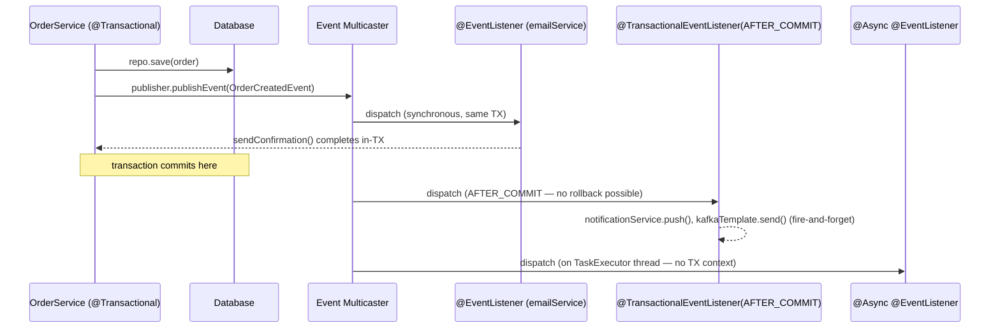
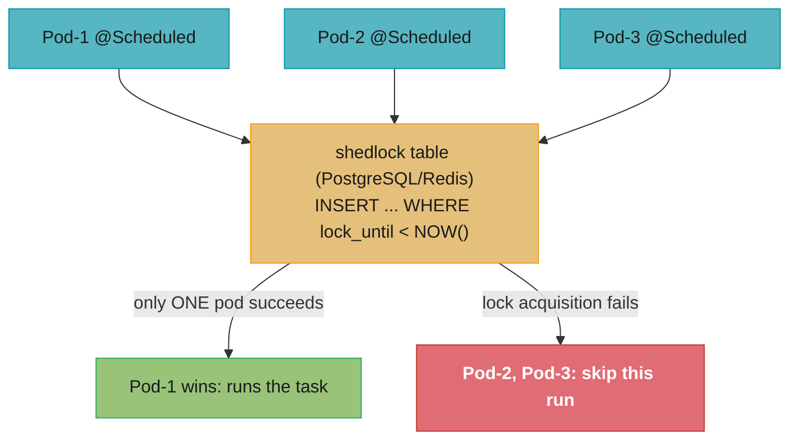

# Spring Events and Scheduling

## 1. Concept Overview

Spring provides two complementary mechanisms for decoupling application logic:

**Application Events** — a publish/subscribe model within the Spring ApplicationContext:
- `ApplicationEventPublisher` — synchronous event publication
- `@EventListener` — annotation-driven listener methods
- `@TransactionalEventListener` — listener that fires at a transaction lifecycle phase (AFTER_COMMIT, BEFORE_COMMIT, AFTER_ROLLBACK)
- Async events via `@Async` + a configured `TaskExecutor`

**Scheduling** — time-based task execution:
- `@Scheduled` — cron, fixed-rate, fixed-delay, and initial-delay scheduling
- `@EnableScheduling` — activates the scheduling infrastructure
- `ThreadPoolTaskScheduler` — configurable thread pool for scheduled tasks
- `TaskExecutor` / `ThreadPoolTaskExecutor` — async task execution
- `ShedLock` — distributed locking to prevent multiple instances from running the same scheduled task concurrently

Spring Boot 3.2+ ships with virtual thread integration: `spring.threads.virtual.enabled=true` makes `@Async` and `@Scheduled` use virtual threads by default.

---

## 2. Intuition

> Application events are like a radio station: the publisher broadcasts a signal; anyone who has tuned to the right frequency receives it — the publisher does not know (or care) how many listeners exist or what they do.

**Key insight for `@TransactionalEventListener`:** Events published inside a `@Transactional` method do not fire until the transaction commits. This makes them safe for "post-commit side effects" (send email, push notification, fire Kafka message). But listeners cannot roll back the original transaction — they are late-binding callbacks, not part of the original unit of work.

**Why this matters:** The "publish event on commit" pattern is the simplest form of the outbox-without-a-table pattern. It avoids coupling the main service to auxiliary effects while ensuring those effects only happen if the core change persisted. The tradeoff is that listener failures do not roll back the original transaction — understanding this is a senior-level distinction.

---

## 3. Core Principles

1. **Events are synchronous by default**: `publishEvent()` blocks until all synchronous listeners complete.
2. **`@Async` makes listeners fire on a separate thread**: the publisher unblocks immediately; the listener runs in a `TaskExecutor` thread.
3. **`@TransactionalEventListener` binds to transaction lifecycle**: defaults to `AFTER_COMMIT`. If no transaction is active, the event is discarded (use `fallbackExecution=true` to fire anyway).
4. **`@Scheduled` requires `@EnableScheduling`**: all `@Scheduled` methods run in a single-threaded scheduler by default. Configure `ThreadPoolTaskScheduler` to allow concurrent scheduled tasks.
5. **Distributed scheduling needs a lock**: without a distributed lock, all pods in a cluster run `@Scheduled` tasks simultaneously. `ShedLock` (or Quartz) prevents this.
6. **`@Async` + `@Transactional` do NOT compose automatically**: an async method gets a new thread with no inherited transaction context. Transactions must be re-opened explicitly in the async method.

---

## 4. Types / Architectures / Strategies

### 4.1 Event Listener Types

| Annotation | When It Fires | Transaction | Thread |
|---|---|---|---|
| `@EventListener` | Synchronously, inline in publisher's call stack | Inherits publisher's transaction | Publisher's thread |
| `@Async @EventListener` | After publisher returns, on executor thread | None — new transaction must be opened explicitly | Executor thread |
| `@TransactionalEventListener(AFTER_COMMIT)` | After the surrounding transaction commits | None by default; use `@Transactional(REQUIRES_NEW)` | Publisher's thread (by default) |
| `@TransactionalEventListener(BEFORE_COMMIT)` | Just before the surrounding transaction commits | Participates in the same transaction | Publisher's thread |
| `@TransactionalEventListener(AFTER_ROLLBACK)` | After the transaction rolls back | None | Publisher's thread |

### 4.2 Scheduling Configuration Options

| Option | Annotation | Notes |
|---|---|---|
| Fixed delay | `@Scheduled(fixedDelay=5000)` | N ms after previous execution completes |
| Fixed rate | `@Scheduled(fixedRate=5000)` | Every N ms regardless of completion (overlaps if slow) |
| Cron | `@Scheduled(cron="0 0 2 * * *")` | Spring cron: `s m h d M weekday`; `?` not supported in Spring, use `*` |
| Initial delay | `@Scheduled(initialDelay=10000, fixedRate=5000)` | Wait 10s before first run |
| Duration string | `@Scheduled(fixedDelayString="${batch.delay}")` | Property-driven; supports `PT5S` (ISO-8601) |

---

## 5. Architecture Diagrams

### Event Publication and Listener Dispatch



### Distributed Scheduling with ShedLock



---

## 6. How It Works — Detailed Mechanics

### 6.1 Basic Application Events

```java
// Event class — a plain POJO (or extend ApplicationEvent for classic style)
public record OrderCreatedEvent(Order order, Instant publishedAt) {}

// Publisher
@Service
@RequiredArgsConstructor
public class OrderService {
    private final ApplicationEventPublisher publisher;
    private final OrderRepository repo;

    @Transactional
    public Order createOrder(CreateOrderRequest req) {
        Order order = repo.save(req.toEntity());
        publisher.publishEvent(new OrderCreatedEvent(order, Instant.now()));
        return order;
    }
}

// Listener (synchronous, runs in same transaction as publisher)
@Component
public class AuditListener {
    @EventListener
    public void handleOrderCreated(OrderCreatedEvent event) {
        auditRepo.save(new AuditEntry(event.order().id(), "ORDER_CREATED"));
        // Runs in the same transaction — if this throws, the whole TX rolls back
    }
}
```

### 6.2 @TransactionalEventListener — Post-Commit Side Effects

```java
// BROKEN: side effect fires even if the transaction rolls back
@EventListener
public void sendEmail(OrderCreatedEvent event) {
    emailService.send(event.order().email(), "Your order was created");
    // If createOrder() throws AFTER publishing, this may fire before rollback
    // (actually Spring defers synchronous @EventListener to after listener registration
    // but the semantics are complex — use @TransactionalEventListener for safety)
}

// FIX: only fire after the transaction commits
@Component
public class EmailNotificationListener {

    @TransactionalEventListener(phase = TransactionPhase.AFTER_COMMIT)
    public void sendConfirmationEmail(OrderCreatedEvent event) {
        // Guaranteed: createOrder() transaction has committed; order IS in DB
        emailService.send(event.order().email(), "Order confirmed: " + event.order().id());
    }
}

// If listener needs its own transaction (e.g., updates another table):
@TransactionalEventListener(phase = TransactionPhase.AFTER_COMMIT)
@Transactional(propagation = Propagation.REQUIRES_NEW)
public void notifyAnalytics(OrderCreatedEvent event) {
    analyticsRepo.save(new AnalyticsEvent("order_created", event.order().id()));
    // REQUIRES_NEW opens a fresh transaction after the original commit.
    // If THIS transaction fails, the original order is NOT rolled back — it already committed.
    // Use the outbox pattern for true atomicity.
}
```

### 6.3 Async Events with @Async

```java
@Configuration
@EnableAsync
public class AsyncConfig {
    @Bean
    public Executor asyncExecutor() {
        ThreadPoolTaskExecutor executor = new ThreadPoolTaskExecutor();
        executor.setCorePoolSize(4);
        executor.setMaxPoolSize(16);
        executor.setQueueCapacity(500);
        executor.setThreadNamePrefix("async-event-");
        executor.initialize();
        return executor;
    }
}

// Async listener — fire-and-forget, publisher unblocks immediately
@Component
public class PushNotificationListener {

    @Async("asyncExecutor")
    @TransactionalEventListener(phase = TransactionPhase.AFTER_COMMIT,
                                 fallbackExecution = true)
    public void sendPush(OrderCreatedEvent event) {
        // Runs on asyncExecutor thread; no transaction context from publisher
        pushGateway.send(event.order().userId(), "Your order is confirmed!");
    }
}
// fallbackExecution=true: fires even if no transaction was active (e.g., in tests or scripts)
```

### 6.4 @Scheduled Configuration

```java
@Configuration
@EnableScheduling
public class SchedulingConfig {

    // Replace the default single-threaded scheduler with a pool
    @Bean
    public TaskScheduler taskScheduler() {
        ThreadPoolTaskScheduler scheduler = new ThreadPoolTaskScheduler();
        scheduler.setPoolSize(5);
        scheduler.setThreadNamePrefix("scheduled-task-");
        scheduler.setWaitForTasksToCompleteOnShutdown(true);
        scheduler.setAwaitTerminationSeconds(60);
        return scheduler;
    }
}

@Component
public class ReportGenerationTask {

    @Scheduled(cron = "0 0 1 * * MON-FRI")   // 1:00 AM, Mon–Fri
    public void generateDailyReport() {
        reportService.generate(LocalDate.now());
    }

    @Scheduled(fixedDelay = 30_000, initialDelay = 10_000)
    public void healthCheck() {
        // Runs 30s after previous run completes; first run 10s after startup
        externalApi.ping();
    }
}
```

### 6.5 Distributed Locking with ShedLock

```java
// pom.xml: net.javacrumbs.shedlock:shedlock-spring:5.x
//          net.javacrumbs.shedlock:shedlock-provider-jdbc-template:5.x

@Configuration
@EnableSchedulerLock(defaultLockAtMostFor = "PT10M")  // max 10 min lock
public class ShedLockConfig {
    @Bean
    public LockProvider lockProvider(DataSource ds) {
        return new JdbcTemplateLockProvider(ds,
            JdbcTemplateLockProvider.Configuration.builder()
                .withTableName("shedlock")
                .usingDbTime()  // use DB clock, not JVM clock (avoids clock skew)
                .build());
    }
}

// Required table:
// CREATE TABLE shedlock (
//   name VARCHAR(64) NOT NULL PRIMARY KEY,
//   lock_until TIMESTAMP NOT NULL,
//   locked_at TIMESTAMP NOT NULL,
//   locked_by VARCHAR(255) NOT NULL
// );

@Scheduled(cron = "0 0 3 * * *")
@SchedulerLock(name = "nightly_cleanup",
               lockAtLeastFor = "PT5M",    // hold lock min 5 min (prevent thundering herd)
               lockAtMostFor = "PT30M")    // release lock after 30 min even if dead
public void nightlyCleanup() {
    dataService.deleteExpiredRecords();
}
```

### 6.6 Virtual Thread Executor for @Async (Spring Boot 3.2+)

```yaml
# application.yaml
spring:
  threads:
    virtual:
      enabled: true    # all @Async and @Scheduled methods use virtual threads
```

```java
// Or configure explicitly:
@Bean
public Executor asyncExecutor() {
    return Executors.newVirtualThreadPerTaskExecutor();
}
// @Async methods no longer need a bounded thread pool; each invocation
// gets its own virtual thread — blocking I/O does not pin OS threads.
```

### 6.7 Preventing @Scheduled From Running During Application Startup

```java
// Problem: @Scheduled fires at startup if fixedDelay=0 or cron matches immediately
@Scheduled(fixedDelay = 60_000, initialDelay = 60_000)  // wait 60s before first run

// Or: disable scheduling entirely in tests
@SpringBootTest
@TestPropertySource(properties = "spring.task.scheduling.pool.size=0")
// Better: use a profile
@Profile("!test")
@Scheduled(cron = "...")
public void productionOnlyTask() { ... }
```

---

## 7. Real-World Examples

### 7.1 E-Commerce Order Confirmation Flow

An order service uses `@TransactionalEventListener(AFTER_COMMIT)` to publish order confirmation events. The listener sends a push notification and emails an invoice. If either fails, the order is not rolled back — it's already committed. A separate compensation job retries failed notifications by scanning for orders without confirmation timestamps.

### 7.2 Nightly ETL with ShedLock (Multi-Pod Kubernetes Deployment)

A financial reporting service runs a nightly data reconciliation at 2:00 AM. With 5 pods in production, without ShedLock all 5 would run the job simultaneously, generating 5 duplicate reports and 5 database writes. ShedLock on PostgreSQL ensures only one pod acquires the lock; the other 4 skip silently. `lockAtMostFor = "PT1H"` prevents a dead pod from holding the lock forever.

### 7.3 Cache Warm-up on Startup with @EventListener

```java
@Component
public class CacheWarmer {
    @EventListener(ApplicationReadyEvent.class)
    public void warmCaches() {
        // Fires after all beans are initialised and the app is ready to serve requests
        productCatalog.preloadTopCategories();
    }
}
// ApplicationReadyEvent fires after embedded server starts — safer than @PostConstruct
// which fires during context refresh (before embedded server is ready)
```

---

## 8. Tradeoffs

| Approach | Decoupling | Transactional Safety | Failure Handling | When to Use |
|---|---|---|---|---|
| `@EventListener` (sync) | Good | Same TX as publisher | Rolls back publisher TX | In-process side effects that should be part of same TX |
| `@TransactionalEventListener(AFTER_COMMIT)` | Good | Post-commit; no rollback | Failure does not roll back original | Post-commit side effects; send email, push notification |
| `@Async @EventListener` | Excellent | None — new thread | Silent failure unless logged | Fire-and-forget side effects; publisher must not depend on result |
| Kafka/RabbitMQ | Excellent | At-least-once; idempotency required | DLQ for retry | Cross-service events; durable, ordered, replay |
| Outbox pattern | Excellent | Atomic with original TX | Poller retries | Exactly-once cross-service events |

---

## 9. When to Use / When NOT to Use

### Use `@TransactionalEventListener` when:
- The side effect (email, notification, analytics write) should only happen after the main transaction commits
- The side effect does not need to be part of the same atomic unit of work
- Failure of the side effect is acceptable (or handled by a retry/compensation job)

### Use `@Async @EventListener` when:
- The side effect is slow (HTTP call, email SMTP) and must not block the main request
- You accept eventual delivery (no guarantee if the JVM crashes between commit and listener execution)

### Use outbox pattern (not `@TransactionalEventListener`) when:
- The event must be delivered exactly once, even across JVM crashes
- Downstream consumers are event-sourcing or require strong ordering guarantees

### Use ShedLock when:
- Running `@Scheduled` tasks in a multi-instance deployment (Kubernetes, cloud)
- The task is not idempotent (generating a report twice causes problems)

### Do NOT use `@Async` + `@Transactional` naively:
- Async methods run in a new thread with no inherited `SecurityContext` or transaction
- Explicitly re-open a transaction with `@Transactional(propagation = REQUIRES_NEW)` if needed
- Propagate `SecurityContext` manually via `DelegatingSecurityContextExecutor`

---

## 10. Common Pitfalls

### Pitfall 1: @TransactionalEventListener fires when there is no transaction
```java
// BROKEN: calling a @TransactionalEventListener-annotated method outside a transaction
// (e.g., from a test, a scheduled job, or a non-@Transactional service method)
// The event is silently discarded by default.

// FIX: add fallbackExecution = true to fire even without a transaction
@TransactionalEventListener(phase = TransactionPhase.AFTER_COMMIT, fallbackExecution = true)
public void handleEvent(MyEvent event) { ... }
```

### Pitfall 2: @Async listener swallows exceptions silently
```java
// BROKEN: exception in async listener disappears; publisher never knows
@Async
@EventListener
public void process(OrderEvent event) {
    throw new RuntimeException("failed");  // silently logged only if UEH is configured
}

// FIX: configure AsyncUncaughtExceptionHandler
@Configuration
@EnableAsync
public class AsyncConfig implements AsyncConfigurer {
    @Override
    public AsyncUncaughtExceptionHandler getAsyncUncaughtExceptionHandler() {
        return (ex, method, params) -> log.error("Async error in {}: {}", method, ex.getMessage());
    }
}
```

### Pitfall 3: Single-threaded scheduler — @Scheduled tasks blocking each other
```java
// BROKEN: all @Scheduled methods share one thread by default
// If task A takes 30s and task B is fixed-rate 10s, task B will miss runs
// until task A completes — they are queued on the single scheduler thread.

// FIX: configure ThreadPoolTaskScheduler with multiple threads
@Bean
public TaskScheduler taskScheduler() {
    ThreadPoolTaskScheduler s = new ThreadPoolTaskScheduler();
    s.setPoolSize(10);
    return s;
}
```

### Pitfall 4: ShedLock lock held after pod crash
If a pod crashes while holding a ShedLock lock, the `lock_until` column prevents other pods from running until the lock expires. Set `lockAtMostFor` to a safe upper bound (e.g., twice the expected task duration). Use `usingDbTime()` to avoid JVM clock drift causing premature lock release.

### Pitfall 5: @Scheduled + @Transactional self-invocation proxy bypass
A `@Scheduled` method calling another `@Transactional` method on `this` bypasses the proxy. Use `ApplicationContext.getBean()` or `@Autowired` self-reference, or restructure into a separate `@Service` bean.

---

## 11. Technologies & Tools

| Tool / Feature | Version | Purpose |
|---|---|---|
| `ApplicationEventPublisher` | Spring 3.0+ | Synchronous in-process event publication |
| `@EventListener` | Spring 4.2+ | Annotation-driven listener method |
| `@TransactionalEventListener` | Spring 4.2+ | Binds listener to transaction lifecycle |
| `@Async` | Spring 3.0+ | Executes annotated method asynchronously in an executor |
| `@EnableAsync` | Spring 3.1+ | Activates `@Async` processing |
| `@Scheduled` | Spring 3.0+ | Annotation-driven scheduling |
| `@EnableScheduling` | Spring 3.1+ | Activates scheduling infrastructure |
| `ThreadPoolTaskExecutor` | Spring 3.0+ | Configurable thread pool for `@Async` |
| `ThreadPoolTaskScheduler` | Spring 3.0+ | Configurable thread pool for `@Scheduled` |
| `ShedLock` | `net.javacrumbs.shedlock:shedlock-spring:5.x` | Distributed scheduling lock (JDBC/Redis/Mongo) |
| `Quartz` | Library | Full-featured scheduler with job persistence, cluster support |
| `Spring Cloud Task` | Spring Cloud | Short-lived task execution with job history |
| `ApplicationReadyEvent` | Spring Boot | Fires after embedded server is ready (use instead of `@PostConstruct` for post-startup work) |
| `spring.threads.virtual.enabled=true` | Spring Boot 3.2 | @Async and @Scheduled use virtual threads |

---

## 12. Interview Questions with Answers

**Q1: What is the difference between `@EventListener` and `@TransactionalEventListener`?**
`@EventListener` fires synchronously inline within the publisher's call stack, participating in the same transaction (if any). `@TransactionalEventListener` binds the listener to a transaction lifecycle phase — defaulting to `AFTER_COMMIT`. If the publisher's transaction rolls back, `@TransactionalEventListener(AFTER_COMMIT)` listeners never fire; `@EventListener` listeners would have already fired and cannot be rolled back. Use `@TransactionalEventListener` for any side effect that must only happen if the primary operation persisted — sending an email after a successful order, pushing an event to Kafka after a DB write.

**Q2: Why does `@TransactionalEventListener` silently not fire in some situations, and how do you fix it?**
`@TransactionalEventListener` requires an active transaction to bind to. If the event is published outside a transaction (from a test, a scheduler, or a non-`@Transactional` method), the event is silently discarded. Diagnosis: add `fallbackExecution = true` to the annotation — this makes it fire even without a surrounding transaction. Alternatively, ensure the publishing code is always called within a `@Transactional` method. The silent discard is a frequent source of "event listener not called" bugs in test environments where the service method is called without the transaction proxy active.

**Q3: What happens when an `@Async` listener throws an exception?**
By default, async exceptions are logged by Spring's `SimpleAsyncUncaughtExceptionHandler` at `WARN` level and silently swallowed — the publisher's thread never sees them. This can cause data inconsistencies: the primary transaction committed, the async listener failed, and the side effect never happened. Fix: implement `AsyncConfigurer.getAsyncUncaughtExceptionHandler()` to return a handler that alerts on failure, retries, or writes to a DLQ. For critical side effects, consider using `@TransactionalEventListener` with a persistent message broker (Kafka, RabbitMQ) instead of `@Async`.

**Q4: How does ShedLock prevent multiple instances from running a scheduled task, and what are `lockAtLeastFor` and `lockAtMostFor`?**
ShedLock uses an `INSERT ... WHERE lock_until < NOW()` statement (or equivalent) in the backing store (JDBC table, Redis key, MongoDB document). Only one JVM instance succeeds in inserting/updating the lock row; all others get a constraint violation and skip the task for that scheduled run. `lockAtLeastFor` is the minimum duration the lock is held — even if the task finishes quickly, other instances cannot start until this duration expires (prevents near-simultaneous re-runs from two pods). `lockAtMostFor` is the safety valve: if the lock-holder JVM crashes without releasing the lock, the lock is released after this duration so other instances can take over. Always set `lockAtMostFor` to prevent permanent lock-up.

**Q5: Can you use `@Transactional` on an `@Async` method, and what are the pitfalls?**
Yes, but with important caveats. An `@Async` method runs on a different thread with no transaction context from the caller. Adding `@Transactional` on the async method opens a new transaction on that thread — the async method's transaction is completely independent. Pitfall 1: the caller's transaction commits before the async method starts, so the async method sees the committed state (usually desired). Pitfall 2: if the async method's transaction fails, the caller's transaction is NOT rolled back — they are independent. Pitfall 3: `SecurityContextHolder` (which is `ThreadLocal`) is not automatically propagated to the async thread — configure `DelegatingSecurityContextAsyncTaskExecutor` to propagate security context.

**Q6: What is the default scheduling thread pool size, and why does it matter?**
Spring's default scheduler uses a single thread (`ScheduledThreadPoolExecutor` with `corePoolSize=1`). This means all `@Scheduled` methods share one thread and execute sequentially. If one task is long-running or slow, it delays all other tasks. Configure a `ThreadPoolTaskScheduler` bean with `setPoolSize(N)` to allow N tasks to run concurrently. Choose N based on expected concurrent scheduled tasks — typically 5–20 for a service with a dozen scheduled jobs. Without explicit configuration, a slow nightly job can delay a critical 30-second health check.

**Q7: What is `ApplicationReadyEvent` and why should it be preferred over `@PostConstruct` for post-startup work?**
`@PostConstruct` fires during the Spring context refresh, before the embedded server (Tomcat/Netty) starts accepting requests. Code in `@PostConstruct` that takes a long time delays server startup. More importantly, if `@PostConstruct` code makes HTTP calls or accesses beans that haven't been initialised yet, it fails silently. `ApplicationReadyEvent` fires after the full application context is refreshed, all beans are initialised, and the embedded server is accepting requests. It is the correct hook for: cache pre-loading, connectivity checks, background initialisation threads, or any work that should start after the application is genuinely "ready."

**Q8: How would you test a `@TransactionalEventListener` to ensure it fires only on commit?**
```java
@SpringBootTest
class OrderEventTest {
    @Autowired OrderService orderService;
    @SpyBean EmailNotificationListener emailListener;

    @Test
    void listenerFiresAfterCommit() {
        orderService.createOrder(testRequest());  // opens + commits TX

        // @TransactionalEventListener fires AFTER commit, so it has fired by now
        verify(emailListener).sendConfirmationEmail(any(OrderCreatedEvent.class));
    }

    @Test
    void listenerDoesNotFireOnRollback() {
        assertThrows(RuntimeException.class,
            () -> orderService.createOrderThatFails());

        verify(emailListener, never()).sendConfirmationEmail(any());
    }
}
```
Use `@SpyBean` (not `@MockBean`) to wrap the real listener in a Mockito spy — this preserves the `@TransactionalEventListener` annotation on the bean, which `@MockBean` would not. Call the real service method (not a test fixture) so the full transaction lifecycle fires.

**Q9: Explain the `fixedRate` vs `fixedDelay` difference and when an overlap can occur.**
`fixedDelay = N` starts the next run N milliseconds after the previous run completes — if a run takes 8 seconds and `fixedDelay=5000`, the next run starts at 8+5=13s after the first started. `fixedRate = N` tries to maintain N milliseconds between start times — if a run takes longer than N, the next run starts immediately after the previous finishes (no overlap, but the schedule slips). If the scheduler has multiple threads (via `ThreadPoolTaskScheduler`), `fixedRate` can actually run multiple instances simultaneously if a run takes longer than the rate. This can cause concurrent modification issues in stateful tasks. Use `fixedDelay` for tasks that must not overlap; use `fixedRate` with a pool size of 1 (default) if you want constant-rate scheduling with sequential execution.

**Q10: How does Spring's `@Async` propagate security context to async methods?**
`SecurityContextHolder` is `ThreadLocal`-based — the async thread has a fresh, empty security context by default. To propagate the caller's `Authentication`: configure a `DelegatingSecurityContextAsyncTaskExecutor` wrapping your task executor. Spring Security provides this out of the box:
```java
@Bean
public Executor asyncExecutor() {
    return new DelegatingSecurityContextAsyncTaskExecutor(
        new ThreadPoolTaskExecutor()  // your underlying executor
    );
}
```
The `DelegatingSecurityContextAsyncTaskExecutor` captures the `SecurityContext` at submission time and sets it in the async thread before running the task, then clears it afterwards. Without this, async methods calling `SecurityContextHolder.getContext()` see `AnonymousAuthenticationToken`.

**Q11: What is the difference between publishing a Spring event and sending a message to Kafka/RabbitMQ?**
Spring application events are in-process, in-memory, synchronous (or async via `@Async`) — they live and die with the JVM. If the application crashes between publishing and a listener firing, the event is lost. Kafka/RabbitMQ messages are durable, cross-process, and replayed after failure. Use Spring events for: in-process decoupling, cache invalidation, audit logging, and side effects that do not need durability. Use Kafka/RabbitMQ for: cross-service communication, durable event sourcing, at-least-once delivery guarantees, and fan-out to multiple services. The outbox pattern bridges the gap: write the event to a DB table in the same transaction, then a relay process publishes it to Kafka — giving transactional guarantees + durability.

**Q12: How would you make a `@Scheduled` task conditional (e.g., only run in production)?**
Three approaches: (1) `@Profile("!test")` on the class — scheduling is not registered in the `test` profile; (2) `@ConditionalOnProperty(name = "tasks.enabled", havingValue = "true")` on the bean — disable via property; (3) `SchedulingConfigurer` to programmatically register tasks with conditions. The simplest production pattern is a `@ConditionalOnProperty` guard combined with `spring.tasks.enabled=false` in `application-test.yaml`. For feature-flag-style control at runtime, use `ScheduledFuture` + manual reschedule, though this adds complexity. ShedLock inherently makes tasks conditional on lock acquisition — which handles the multi-instance case.

**Q13: What happens if a `@TransactionalEventListener` listener method opens a new transaction (`REQUIRES_NEW`) and that transaction fails?**
The new transaction's failure does not affect the original transaction — it has already committed. The new transaction rolls back atomically. The result is a partial state: the original data is committed, but the secondary update (e.g., analytics insert) is not. This is the fundamental tradeoff of `@TransactionalEventListener` — it provides post-commit fire guarantee but cannot participate in the original atomicity. For cases where both changes must succeed or fail together, use an explicit `@Transactional` service that performs both writes in one transaction, or use the outbox pattern + a reliable message relay to ensure the secondary effect eventually happens (at-least-once, with idempotent consumer).

**Q14: How does `spring.threads.virtual.enabled=true` affect `@Async` and `@Scheduled` in Spring Boot 3.2?**
With `spring.threads.virtual.enabled=true`, Spring Boot 3.2 replaces the default `ThreadPoolTaskExecutor` for `@Async` with a `VirtualThreadTaskExecutor` (`Executors.newVirtualThreadPerTaskExecutor()`). For `@Scheduled`, it replaces the scheduler with a `SimpleAsyncTaskScheduler` backed by virtual threads. This means: (1) `@Async` no longer needs a bounded thread pool — each invocation gets its own virtual thread; (2) blocking I/O in async methods does not pin OS threads; (3) `@Scheduled` tasks no longer share a fixed thread pool — each scheduled run gets a virtual thread. Important: virtual threads still respect `synchronized` pinning — if scheduled tasks use `synchronized` blocks, they may pin carrier threads. Monitor with `-Djdk.tracePinnedThreads=full`.

**Q15: Describe the outbox pattern and how it solves the dual-write problem for events.**
The dual-write problem: after a DB write, publishing a Kafka message in a separate network call is non-atomic. If the app crashes between the commit and the publish, the event is lost. The outbox pattern solves this: (1) within the same DB transaction, write both the business entity and an `outbox_events` row; (2) a separate relay process (Debezium CDC, Quartz job, or `@Scheduled`) reads from `outbox_events` and publishes to Kafka; (3) on successful Kafka publish, delete or mark the outbox row as processed. Both writes are in one DB transaction — they succeed or fail atomically. The relay retries on failure — providing at-least-once delivery. Consumers must be idempotent (use event ID deduplication). Spring Batch's chunk-oriented model is well-suited for the relay: read pending outbox rows, publish, write completion — with restart-on-failure built in.

---

## 13. Best Practices

1. **Use `@TransactionalEventListener(AFTER_COMMIT)` for all post-commit side effects** — email, push, Kafka, audit — rather than in-transaction `@EventListener`.
2. **Add `fallbackExecution = true`** when the event can be published outside a transaction (test environments, scripts).
3. **Always configure `AsyncUncaughtExceptionHandler`** for `@Async` — never let async exceptions disappear silently.
4. **Replace the default single-thread scheduler** with a `ThreadPoolTaskScheduler` (pool size 5–20) for services with multiple `@Scheduled` methods.
5. **Use ShedLock** for all `@Scheduled` tasks in multi-instance deployments; set both `lockAtLeastFor` and `lockAtMostFor`.
6. **Prefer `ApplicationReadyEvent`** over `@PostConstruct` for post-startup cache loading or connectivity probes.
7. **Use `@Async` + virtual threads** (`spring.threads.virtual.enabled=true`) in Spring Boot 3.2+ — avoids thread pool sizing headaches for I/O-bound async work.
8. **Do not mix `@Async` with `@Transactional` without understanding isolation** — the async thread has no transaction context from the caller; open a new transaction explicitly if needed.
9. **Use `fixedDelay` for tasks that must not overlap**; only use `fixedRate` if overlap is acceptable or the pool size is 1.
10. **For exactly-once event delivery**, use the outbox pattern — Spring events + `@Async` are at-most-once and not suitable for critical financial or compliance events.

---

## 14. Case Study

See the Spring case study: [Design Spring Boot Event-Driven Microservice](../case_studies/design_event_driven_microservice.md)

**Quick scenario:** An e-commerce order service:
- Writes the order to PostgreSQL inside `@Transactional`
- Publishes `OrderCreatedEvent`
- `@TransactionalEventListener(AFTER_COMMIT)` fires: async email notification and a Kafka message to the inventory service
- `@Scheduled(cron="0 0 2 * * *")` + ShedLock: nightly batch cleanup of expired draft orders

**Key tradeoff demonstrated:** The `@Async @TransactionalEventListener` approach achieves sub-100 ms p99 latency for the HTTP response (email notification runs off the hot path) but provides only at-most-once delivery. A production variant adds an outbox table + Debezium CDC relay for exactly-once Kafka delivery to the inventory service.

**Cross-links:**
- [Spring Transactions](../spring_transactions/README.md) — `@TransactionalEventListener` transaction phases
- [Spring Messaging](../spring_messaging/README.md) — Kafka integration + outbox pattern
- [Spring Batch](../spring_batch/README.md) — scheduled batch jobs with ShedLock

---

## Related / See Also

- [Spring Messaging](../spring_messaging/README.md) — async event vs Kafka
- [Spring Transactions](../spring_transactions/README.md) — @TransactionalEventListener
- [Spring Batch](../spring_batch/README.md) — scheduling batch jobs
- [LLD: Observer Pattern](../../lld/behavioral/observer/README.md) — the GoF pattern that `ApplicationEvent`/`ApplicationListener` implements
