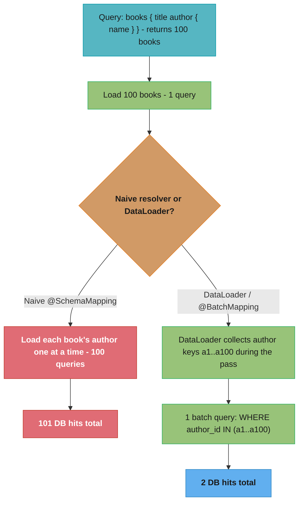
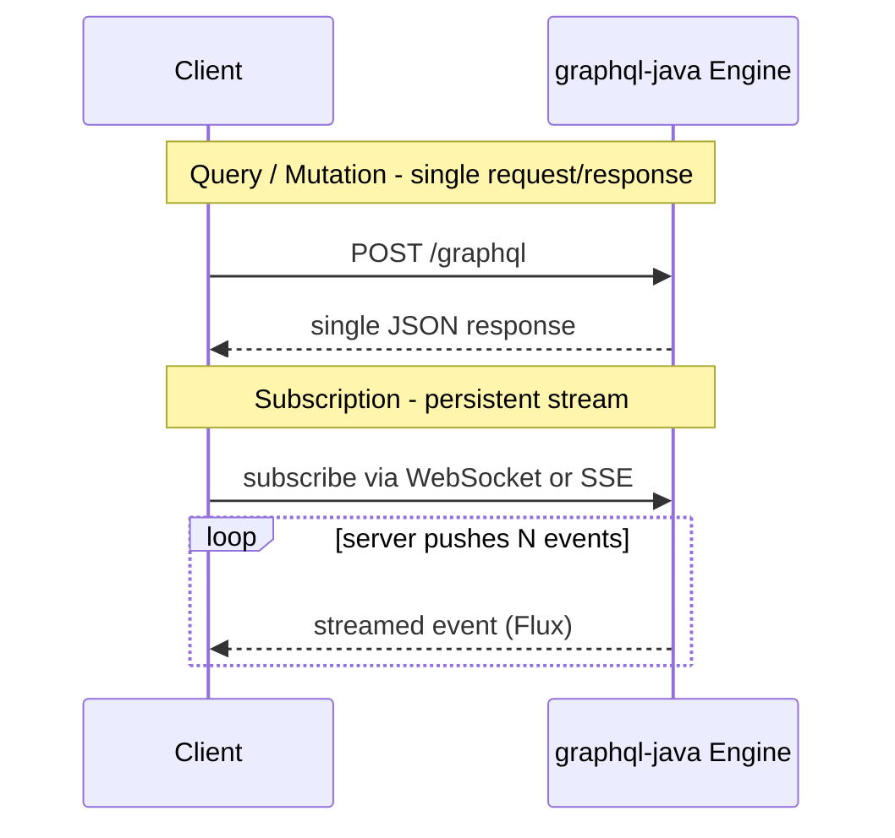

# Spring for GraphQL

> How Spring for GraphQL maps a GraphQL schema onto Spring controllers, how
> `DataLoader` defeats the N+1 problem that GraphQL makes worse, how subscriptions
> stream over WebSocket/SSE, and how to do pagination and error handling the GraphQL
> way. Spring for GraphQL 1.x (on graphql-java) / Spring Boot 3.x.

---

## 1. Concept Overview

GraphQL is a query language for APIs where the *client* specifies exactly which fields
it wants, against a strongly-typed schema, and gets back exactly that shape — no more,
no less. One endpoint (`POST /graphql`) serves arbitrary queries; the schema is the
contract. This solves two REST pain points: **over-fetching** (REST returns fixed
payloads with fields you do not need) and **under-fetching** (you call three REST
endpoints to assemble one screen).

Spring for GraphQL is the official integration (a collaboration between the Spring team
and the graphql-java team) that sits on top of the `graphql-java` engine and gives you:

- **Schema-first development** — you write the `.graphqls` schema; Spring wires
  *handler methods* (`@QueryMapping`, `@MutationMapping`, `@SubscriptionMapping`,
  `@SchemaMapping`) to schema fields, much like `@RequestMapping` wires HTTP.
- **`DataLoader` integration** — batching and caching of nested field resolution to
  fix the N+1 problem that GraphQL's nested selections create.
- **Transports** — HTTP for queries/mutations, and WebSocket or SSE for subscriptions
  (server push).
- **Reactive and blocking** — handler methods can return `Mono`/`Flux` or plain values;
  it runs on WebMVC or WebFlux.

The mental shift from REST is crucial: in REST you design *endpoints*; in GraphQL you
design a *graph of types and the resolvers (DataFetchers) for each field*. The engine
walks the client's selection set, calling the resolver for each requested field. That
field-by-field resolution is the source of both GraphQL's power and its single biggest
performance trap (N+1).

---

## 2. Intuition

**One-line analogy.** REST is a fixed-menu restaurant (each endpoint is a set plate);
GraphQL is à la carte (the client composes the exact dish from a typed menu, the
schema).

**Mental model.** The schema is a graph; a query is a *path-selection* through it. The
engine does a traversal: for each field the client selected, it calls that field's
resolver. So a query for `orders { customer { name } }` resolves `orders`, then for
*each* order resolves `customer` — which is precisely where N+1 is born and where
`DataLoader` batches it back into one call.

**Why it matters.** "How do you fix N+1 in GraphQL?" is the defining GraphQL interview
question, because GraphQL's nested resolution makes N+1 the *default* behavior, not an
accident. The strong answer — `DataLoader` batches per-request, deferring and grouping
the nested lookups — separates people who have run GraphQL in production from those who
have only read about it.

**Key insight.** GraphQL moves complexity from the client to the server. The client
gets exactly what it asks for trivially; the server must now resolve an arbitrary graph
efficiently, guard against expensive queries, and batch nested loads. The framework
helps, but the N+1 and query-cost problems are *yours* to manage.

---

## 3. Core Principles

1. **Schema is the contract.** The typed schema (SDL) defines every query, mutation,
   subscription, type, and field. Clients and tooling generate from it; it is the
   single source of truth.

2. **Client selects the shape.** The response mirrors the query's selection set
   exactly — no over- or under-fetching. The server returns only requested fields.

3. **Every field has a resolver (DataFetcher).** The engine resolves a query by
   calling the resolver for each selected field; scalar fields usually use a trivial
   property getter, associations use explicit `@SchemaMapping` methods.

4. **Batch nested resolution.** Because nested fields resolve per-parent, naive
   resolvers cause N+1; `DataLoader` batches the keys collected during one resolution
   pass into a single backend call.

5. **One endpoint, many operations.** All queries/mutations go to one HTTP endpoint;
   subscriptions use a streaming transport (WebSocket/SSE). HTTP status is almost
   always 200 — errors live in the response body's `errors` array.

6. **Guard query cost.** An open query language invites expensive or malicious queries;
   depth/complexity limits and pagination are first-class concerns, not afterthoughts.

---

## 4. Types / Architectures / Strategies

### Schema-mapping annotations

| Annotation | Maps to | Example |
|------------|---------|---------|
| `@QueryMapping` | A field of the root `Query` type | `book(id)` |
| `@MutationMapping` | A field of the root `Mutation` type | `addBook(...)` |
| `@SubscriptionMapping` | A field of the root `Subscription` type (returns `Flux`) | `bookAdded` |
| `@SchemaMapping` | Any type's field (esp. associations) | `Book.author` |
| `@BatchMapping` | A type's field, resolved in batch (built-in DataLoader) | `Book.author` for many books |

### N+1 mitigation strategies

| Strategy | How | Tradeoff |
|----------|-----|----------|
| **`DataLoader` (`@SchemaMapping` + loader)** | Collect keys, batch-load once per request | Most flexible; you wire the loader |
| **`@BatchMapping`** | Framework creates the DataLoader; method takes `List<Parent>` returns `Map`/`List` | Least boilerplate for the common case |
| **Join fetch at the source** | Fetch the graph in the root query (SQL join) | Couples query to anticipated selections; can over-fetch |

### Transports

| Operation | Transport | Spring support |
|-----------|-----------|----------------|
| Query / Mutation | HTTP `POST /graphql` | WebMVC or WebFlux |
| Subscription | WebSocket (`graphql-ws`) or SSE | WebFlux-based; `Flux` return |

### Pagination

- **Offset/limit** — simple, but unstable under inserts and slow at deep offsets.
- **Cursor-based (Relay Connection spec)** — `edges { node cursor } pageInfo`; Spring
  has first-class Connection support. Stable and the GraphQL convention.

---

## 5. Architecture Diagrams

### The N+1 explosion and the DataLoader fix



GraphQL's per-field resolution makes the 101-query version the *default*; the
DataLoader defers each `author` resolution, gathers the keys, and dispatches one batch
— the single most important GraphQL performance pattern.

**Read it like this.** "Query count with a naive resolver is `1 + N` and grows with the
page size; query count with a DataLoader is `1 per nesting level` and does not grow at
all." That second phrasing is the whole point — batching converts a cost that scales
with *data volume* into a cost that scales with *schema depth*, which is a small fixed
number you control.

| Term | What it is |
|------|------------|
| `1` (the leading one) | The root query that fetches the parent list — one hit, always |
| `N` | Number of parents returned, i.e. the page size. `100` books here |
| `1 + N` | Naive total. Every parent triggers its own association query |
| `1 + 1` | Batched total. Keys are collected, then one `IN (...)` query serves all parents |
| "nesting level" | Each association field in the selection set, not each row |

**Walk one example.** Push the same query through both resolvers at two page sizes:

```
                          page = 100        page = 500      grows with page?
  naive  1 + N              1 + 100 = 101     1 + 500 = 501       yes, linearly
  batch  1 + 1              1 +   1 =   2     1 +   1 =   2       no, flat

  going 100 -> 500 books:
    naive   101 -> 501 queries   = 5x more DB work for 5x more rows
    batch     2 ->   2 queries   = same DB work, 5x more rows
```

The batched column is flat, which is why a DataLoader is not merely "faster" — it
removes the page size from the cost model entirely. That is what makes it safe to let
clients ask for a large page.

**Why the `1` in `1 + 1` never goes away.** The root query must run before you know
*which* keys to batch — the DataLoader cannot collect `a1..a100` until the 100 books
exist. One round trip per nesting level is the irreducible floor, and it is why deeply
nested schemas still need depth limits even with perfect batching.

### Field-by-field resolution walks the selection set

```
  query
   └─ books            -> BookController.books()            [@QueryMapping]
        ├─ title        -> Book.getTitle()                  (trivial getter)
        └─ author       -> BookController.author(book)      [@SchemaMapping / @BatchMapping]
              └─ name   -> Author.getName()                 (trivial getter)

  The engine calls a resolver for EACH selected field, parent-by-parent.
  Association fields (author) are the ones that need batching.
```

### Transport split: HTTP for query/mutation, stream for subscription



Subscriptions are the only operation that needs a persistent connection; queries and
mutations are request/response over plain HTTP.

---

## 6. How It Works — Detailed Mechanics

### 6.1 Schema-first: the SDL

```graphql
# src/main/resources/graphql/schema.graphqls
type Query   { books: [Book!]!  book(id: ID!): Book }
type Mutation{ addBook(title: String!, authorId: ID!): Book! }
type Subscription { bookAdded: Book! }

type Book   { id: ID!  title: String!  author: Author! }
type Author { id: ID!  name: String! }
```

### 6.2 Wiring controllers to schema fields

```java
@Controller
class BookController {

    @QueryMapping                         // Query.books
    List<Book> books() { return bookRepo.findAll(); }

    @QueryMapping                         // Query.book(id)
    Book book(@Argument String id) { return bookRepo.findById(id).orElse(null); }

    @MutationMapping                      // Mutation.addBook
    Book addBook(@Argument String title, @Argument String authorId) {
        return bookRepo.save(new Book(title, authorId));
    }

    @SubscriptionMapping                  // Subscription.bookAdded -> a stream
    Flux<Book> bookAdded() { return bookSink.asFlux(); }
}
```

`@Argument` binds a schema field argument to a method parameter; the return value is
serialized to the requested sub-selection automatically.

### 6.3 The N+1 problem and the @BatchMapping fix

The naive association resolver is the trap:

```java
// BROKEN: called once PER book -> N+1 (one author query per book)
@SchemaMapping
Author author(Book book) {
    return authorRepo.findById(book.authorId());   // executed 100 times for 100 books
}
```

`@BatchMapping` resolves the field for *all* parents at once via an auto-created
DataLoader:

```java
// FIXED: called ONCE with all 100 books -> one batched author query
@BatchMapping
Map<Book, Author> author(List<Book> books) {
    Set<String> ids = books.stream().map(Book::authorId).collect(toSet());
    Map<String, Author> byId = authorRepo.findAllById(ids).stream()
        .collect(toMap(Author::id, a -> a));            // one query: WHERE id IN (...)
    return books.stream().collect(toMap(b -> b, b -> byId.get(b.authorId())));
}
```

### 6.4 Explicit DataLoader (more control)

When you need caching/keying beyond `@BatchMapping`:

```java
@Configuration
class LoaderConfig {
    @Bean
    BatchLoaderRegistry.Spec authorLoader(BatchLoaderRegistry registry) {
        return registry.forTypePair(String.class, Author.class)
            .registerBatchLoader((authorIds, env) ->
                Flux.fromIterable(authorRepo.findAllById(authorIds)));
    }
}

@SchemaMapping
CompletableFuture<Author> author(Book book, DataLoader<String, Author> loader) {
    return loader.load(book.authorId());   // deferred + batched + cached per request
}
```

The `DataLoader` collects every `load(key)` call during the resolution pass, then
dispatches one batch — and caches within the request so the same key is not loaded
twice.

### 6.5 Cursor-based pagination (Relay Connection)

```java
@QueryMapping
Window<Book> books(ScrollSubrange subrange) {       // Spring Data Window/Scroll
    var pos = subrange.position().orElse(ScrollPosition.offset());
    int limit = subrange.count().orElse(20);
    return bookRepo.findBy(/* ... */, q -> q.limit(limit).scroll(pos));
}
// Spring adapts Window<Book> to a GraphQL Connection: edges{node cursor} + pageInfo
```

### 6.6 Error handling

GraphQL returns HTTP 200 even on errors; failures go into the `errors` array. Spring
lets you translate exceptions to typed `GraphQLError`s:

```java
@ControllerAdvice
class GraphQlExceptionHandler {
    @GraphQlExceptionHandler
    GraphQLError handle(EntityNotFoundException ex) {
        return GraphQLError.newError()
            .errorType(ErrorType.NOT_FOUND)
            .message(ex.getMessage())
            .build();
    }
}
```

Unhandled exceptions become a generic `INTERNAL_ERROR` with the message hidden — so you
*must* map domain exceptions to meaningful error types and extensions, or clients get
opaque failures.

---

## 7. Real-World Examples

- **GitHub API v4** — the highest-profile public GraphQL API; lets clients fetch
  exactly the repo/issue/PR fields they need in one request, the canonical
  over/under-fetching win.
- **Netflix (DGS)** — Netflix's Domain Graph Service framework (built on graphql-java)
  predates and influenced Spring for GraphQL; both now interoperate and share the
  graphql-java engine.
- **Shopify / Facebook** — Facebook created GraphQL; Shopify exposes a large GraphQL
  Admin API where cursor pagination and query-cost limits are mandatory at scale.
- **Backend-for-frontend (BFF)** — teams put a GraphQL BFF in front of many
  microservices so mobile/web clients assemble one query instead of fanning out to many
  REST calls (federation extends this across services).
- **Spring for GraphQL 1.0 (2022)** — the official successor to the community
  GraphQL-Java-Spring-Boot starters, aligning Spring's controller model with
  graphql-java.

---

## 8. Tradeoffs

| Dimension | GraphQL | REST |
|-----------|---------|------|
| Fetching | Exactly requested fields | Fixed payloads (over/under-fetch) |
| Endpoints | One | Many |
| Typing | Strong schema, introspection | OpenAPI optional |
| Caching | Hard (POST, dynamic) — needs persisted queries/field caching | Easy (HTTP caching on GET URLs) |
| N+1 risk | High (default) — needs DataLoader | Lower (you control the query) |
| Query cost control | Your responsibility (depth/complexity limits) | Bounded by endpoint design |
| File upload / binary | Awkward | Natural |
| Error semantics | 200 + `errors` array | HTTP status codes |

| N+1 fix | Pros | Cons |
|---------|------|------|
| `@BatchMapping` | Minimal code; framework builds the loader | Less control over caching/keys |
| Explicit `DataLoader` | Full control, per-request cache | More wiring |
| Source join fetch | One DB round trip | Couples query to anticipated selection; over-fetch risk |

---

## 9. When to Use / When NOT to Use

**Use GraphQL when** diverse clients need different shapes of the same data (mobile vs
web), when a screen aggregates many resources (BFF/aggregation), when you want a
strongly-typed, introspectable, self-documenting API, or when rapidly-evolving frontend
needs would otherwise force constant REST endpoint churn. It shines as a
backend-for-frontend over multiple services.

**Avoid GraphQL when** the API is simple CRUD with stable payloads (REST is simpler and
caches trivially), when HTTP-level caching/CDN is critical (GraphQL POST queries do not
cache without extra machinery like persisted queries), when you serve mostly
file/binary transfer, or when the team cannot invest in the operational discipline
GraphQL demands — N+1 batching, query-cost limiting, and schema governance. Adopting
GraphQL without `DataLoader` and complexity limits is a known path to production
incidents.

**Rule of thumb:** GraphQL pays off when *client-side flexibility* is the dominant
requirement; REST wins when *simplicity and cacheability* dominate.

---

## 10. Common Pitfalls

1. **The N+1 explosion.** Resolving an association field with a per-parent query turns
   one query into N+1. *War story:* a `users { posts { comments } }` query melted the
   database at 30k queries for one request. *Fix:* `@BatchMapping`/`DataLoader` for
   every association field — treat un-batched associations as a bug.

2. **No query depth/complexity limits.** An open schema lets a client send a deeply
   nested or cyclic query (`a { b { a { b ... }}}`) that is exponentially expensive — a
   trivial DoS. *Fix:* configure `maxQueryDepth` and complexity instrumentation; reject
   over-budget queries.

3. **Assuming HTTP status reflects success.** GraphQL returns 200 even when fields fail;
   clients that check only HTTP status miss errors in the `errors` array. *Fix:* always
   parse `errors`; map domain exceptions to meaningful `GraphQLError` types.

4. **Forgetting caching is different.** Teams expect REST-style HTTP caching and find
   POST queries uncacheable. *Fix:* use persisted queries (GET + hash), field-level
   caching, or a CDN that understands GraphQL — do not assume free HTTP caching.

5. **Over-fetching at the source despite GraphQL.** Eagerly join-fetching the whole
   graph in the root resolver "to avoid N+1" loads data the client did not request,
   re-introducing over-fetching. *Fix:* prefer DataLoader (loads only selected
   associations) over blanket join fetches.

6. **Exposing internal exception details.** Letting raw exceptions surface leaks stack
   traces/messages into the `errors` array. *Fix:* `@GraphQlExceptionHandler` maps to
   safe, typed errors; hide internals.

7. **Offset pagination at depth.** Deep `OFFSET` scans get slow and skip/duplicate rows
   under concurrent inserts. *Fix:* cursor-based (Relay Connection) pagination.

---

## 11. Technologies & Tools

| Concern | Tools |
|---------|-------|
| Engine | `graphql-java`, Spring for GraphQL (`spring-boot-starter-graphql`) |
| Controllers | `@QueryMapping`, `@MutationMapping`, `@SubscriptionMapping`, `@SchemaMapping`, `@BatchMapping`, `@Argument` |
| N+1 | `DataLoader`, `BatchLoaderRegistry`, `@BatchMapping` |
| Transports | HTTP, WebSocket (`graphql-ws`), SSE |
| Pagination | Relay Connection, Spring Data `Window`/`ScrollPosition`, `ScrollSubrange` |
| Tooling | GraphiQL (built-in playground), schema introspection, Apollo/Relay clients |
| Cost control | `maxQueryDepth`, complexity instrumentation, persisted queries |
| Federation | Apollo Federation, Netflix DGS, GraphQL Federation spec |
| Testing | `GraphQlTester`, `@GraphQlTest` slice |

---

## 12. Interview Questions with Answers

**Q: What problem does GraphQL solve compared to REST?**
It eliminates over-fetching and under-fetching: the client specifies exactly which
fields it wants against a typed schema and receives precisely that shape from a single
endpoint, instead of REST's fixed payloads (which return unneeded fields) and multiple
round trips (which force several calls to assemble one view). It also provides a strong,
introspectable schema as the contract. The trade is that the server takes on more
complexity — resolving an arbitrary client-shaped graph efficiently, controlling query
cost, and batching nested loads.

**Q: What is the N+1 problem in GraphQL and why is it the default rather than an accident?**
GraphQL resolves a query field-by-field, parent-by-parent: a query like `books { author
{ name } }` resolves the list of books (1 query), then resolves `author` *once per
book* (N queries) — 1+N. It is the default because the engine inherently calls each
field's resolver for each parent in the selection set, so a naive association resolver
that does one lookup per call produces N+1 automatically. Avoiding it requires
deliberately batching, which is why it is the defining GraphQL performance concern.

**Q: How does DataLoader fix N+1?**
A `DataLoader` defers individual `load(key)` calls made during the resolution pass,
collects all the keys, and then dispatches a single batch load (e.g. `WHERE id IN
(...)`) instead of one query per key — turning 1+N into 1+1. It also caches results
within a single request, so the same key is never loaded twice. In Spring for GraphQL
you either register a batch loader and inject `DataLoader` into a `@SchemaMapping`, or
use `@BatchMapping` where the framework creates the loader and your method receives the
full list of parents at once.

**Q: What is the difference between `@SchemaMapping` and `@BatchMapping`?**
`@SchemaMapping` resolves a single field for a single parent — it is called once per
parent object, so using it for an association naively causes N+1. `@BatchMapping`
resolves the field for *all* parents at once: Spring auto-creates a DataLoader, calls
your method with the `List` (or `Collection`) of parents, and you return a `Map` of
parent→value (or a parallel list), executing one batched backend call. `@BatchMapping`
is the low-boilerplate way to batch; explicit `DataLoader` + `@SchemaMapping` gives
finer control over keys and caching.

**Q: Why does GraphQL usually return HTTP 200 even on errors, and how do you handle errors properly?**
Because a GraphQL response can be *partially* successful — some fields resolve while
others fail — so a single HTTP status cannot express the result; instead errors are
returned in a top-level `errors` array alongside whatever `data` resolved. You handle
them by always parsing `errors` on the client, and on the server by mapping domain
exceptions to typed `GraphQLError`s (via `@GraphQlExceptionHandler`/`DataFetcherExceptionResolver`)
with meaningful error types and extensions; unhandled exceptions become an opaque
`INTERNAL_ERROR`, so explicit mapping is required for usable error semantics.

**Q: How do GraphQL subscriptions work and what transport do they use?**
A subscription is a long-lived operation where the server *pushes* events to the client
as they occur (e.g. `bookAdded`). It cannot use plain request/response HTTP, so it runs
over a persistent transport — WebSocket (the `graphql-ws` protocol) or Server-Sent
Events. In Spring for GraphQL a `@SubscriptionMapping` method returns a `Flux<T>`, and
the framework streams each emitted element to the subscribed client over the chosen
transport. Queries and mutations, by contrast, stay on ordinary HTTP POST.

**Q: Why is caching harder in GraphQL than REST, and what are the options?**
REST caches naturally because GETs have stable, unique URLs that HTTP caches and CDNs
key on; GraphQL sends queries as POST bodies to one endpoint, so standard HTTP caching
does not apply, and responses are highly variable by query shape. Options include
persisted queries (register a query, reference it by hash via GET so it becomes
cacheable), field/entity-level caching behind the resolvers (e.g. DataLoader cache,
Redis), response caching keyed on the normalized query, and client-side normalized
caches (Apollo/Relay). You must choose and build one — it is not free.

**Q: How do you prevent expensive or malicious queries?**
Because the query language is open, a client can request deeply nested or cyclic
selections that are exponentially expensive — a denial-of-service vector. You guard it
with query *depth* limits (`maxQueryDepth`), query *complexity*/cost analysis that
assigns a cost to fields and rejects queries over a budget, pagination limits (cap
`first`/`limit`), timeouts, and optionally allow-listing persisted queries so only
vetted queries run. These controls are mandatory for any public GraphQL API.

**Q: What is cursor-based (Relay Connection) pagination and why prefer it over offset?**
Cursor pagination returns a `Connection` with `edges { node cursor }` and `pageInfo
{ hasNextPage endCursor }`; the client pages by passing the last cursor (`after`) rather
than a numeric offset. It is preferred over offset/limit because deep offsets are slow
(the DB must scan and skip rows) and unstable under concurrent inserts/deletes (rows
shift, causing skips or duplicates), whereas a cursor anchors to a stable position.
Spring for GraphQL supports it via Spring Data's `Window`/`ScrollPosition` and adapts
the result to the Connection shape automatically.

**Q: Schema-first vs code-first — what does Spring for GraphQL use?**
Spring for GraphQL is schema-first: you author the schema in SDL (`.graphqls` files),
and Spring binds handler methods (`@QueryMapping`, etc.) to schema fields, similar to
how `@RequestMapping` binds to HTTP routes. Code-first approaches (some other frameworks)
generate the schema from code/annotations instead. Schema-first keeps the contract
explicit and reviewable as a single artifact and lets frontend/backend agree on the
schema independently of implementation, which is the dominant approach in the Spring
ecosystem.

**Q: What does the `@Argument` annotation do, and how are inputs handled?**
`@Argument` binds a GraphQL field argument to a controller-method parameter, converting
the incoming value to the parameter type (including binding complex input types to a
POJO). For structured inputs you define an `input` type in the schema and bind it to a
DTO. Spring also supports `@Arguments` for binding the whole argument map and validation
via Bean Validation on the bound objects. It is the GraphQL analogue of
`@RequestParam`/`@RequestBody` binding in MVC.

**Q: Can Spring for GraphQL resolvers be reactive, and how does that interact with DataLoader?**
Yes — handler methods can return `Mono`/`Flux` (and run on WebFlux) or plain blocking
values (on WebMVC); subscriptions specifically return `Flux`. DataLoader fits naturally
because it is inherently asynchronous: `loader.load(key)` returns a
`CompletableFuture`/reactive type that completes when the batch dispatches, so reactive
resolvers compose with batched loading without blocking. This lets you do non-blocking,
batched resolution end to end, which matters under high concurrency.

**Q: How does GraphQL relate to a backend-for-frontend (BFF) and federation?**
A GraphQL BFF is a single graph that aggregates data from many backend services so a
client issues one query instead of fanning out to many REST calls — the server does the
fan-out and assembly. Federation (Apollo Federation, Netflix DGS) extends this across
teams: each service owns a *subgraph* of the schema, and a gateway composes them into
one supergraph, so a single query can be resolved by stitching fields from multiple
services. This is how large organizations scale GraphQL across many teams without one
monolithic resolver layer.

**Q: What is query introspection and what is its security consideration?**
Introspection is a built-in GraphQL feature where the schema itself is queryable
(`__schema`, `__type`), enabling tooling like GraphiQL, auto-generated clients, and
documentation. The security consideration is that on a sensitive/internal API,
introspection exposes your entire schema (every type and field) to anyone, which aids
attackers in crafting expensive or probing queries; many teams disable introspection in
production for non-public APIs or gate it behind auth, while keeping it on in
development.

**Q: How do you test a Spring for GraphQL API?**
Use `GraphQlTester` (and the `@GraphQlTest` slice for controller-focused tests): you
send a query/mutation document, then assert on the typed response path-by-path
(`.path("books[0].title").entity(String.class).isEqualTo(...)`) and on expected errors.
`@GraphQlTest` loads only the GraphQL layer (controllers, schema, DataLoaders) with
collaborators mocked, making tests fast, while `GraphQlTester` also works in full
integration tests over the real transport. This mirrors `WebMvcTest`/`MockMvc` for REST.

**Q: Why might eagerly join-fetching the whole graph be the wrong fix for N+1?**
Because it re-introduces over-fetching: if you always join-fetch every association in
the root resolver to avoid per-field queries, you load data the client may not have
requested, wasting DB work and memory, and you couple the query to an anticipated
selection set that varies per client — the very problem GraphQL exists to avoid.
DataLoader is the better fix: it loads *only* the associations the client actually
selected, batched into one call, so you get one round trip without fetching unrequested
data.

---

## 13. Best Practices

- **Batch every association field** with `@BatchMapping`/`DataLoader`; treat an
  un-batched association resolver as an N+1 bug.
- **Enforce query depth and complexity limits** on any non-trivial (especially public)
  API — it is your DoS guard.
- **Map domain exceptions to typed `GraphQLError`s**; never leak raw exceptions, and
  remember responses are HTTP 200 with errors in the body.
- **Use cursor-based (Relay Connection) pagination**, not deep offsets.
- **Plan caching deliberately** — persisted queries, field/entity caching — because
  HTTP caching does not come for free.
- **Keep the schema as the reviewed contract** (schema-first); evolve it additively and
  deprecate fields rather than breaking them.
- **Disable or gate introspection** on sensitive APIs in production.
- **Test with `GraphQlTester`/`@GraphQlTest`**, asserting both data paths and error
  cases.

---

## 14. Case Study

### Mobile BFF: collapsing a chatty REST screen into one GraphQL query

**Problem.** A retailer's mobile order-history screen made 5 REST calls (orders, then
per-order: items, shipment, payment, and product details), causing slow,
battery-draining load on poor networks and brittle client orchestration. The backend
team built a Spring for GraphQL BFF (Boot 3.2) so the app could fetch the whole screen
in one query. The first cut, however, hammered the database.

**Requirements.**
- One round trip for the whole screen; client picks exactly the fields it shows.
- No N+1 against the order/item/product services.
- Stable pagination of order history.
- Safe error semantics and protection against expensive queries.

**Design.**

1. **Schema-first BFF.** `Query.orders(first, after): OrderConnection`; `Order` has
   `items`, `shipment`, `payment`; `OrderItem` has `product`.

2. **Batch every association.** `@BatchMapping` for `Order.items`, `Order.shipment`,
   `Order.payment`, and `OrderItem.product`, each issuing one `IN (...)` batched call.

3. **Cursor pagination** via Spring Data `Window`/`ScrollPosition`, adapted to a Relay
   `OrderConnection`.

4. **Cost controls + error mapping.** `maxQueryDepth` and complexity limits configured;
   `@GraphQlExceptionHandler` maps `EntityNotFoundException` → `NOT_FOUND` and hides
   internals.

**Broken → fixed (the N+1 that melted the DB on launch day):**

```java
// BROKEN: per-order, per-item resolvers -> N+1 squared.
// orders(20) -> +20 items queries -> for ~6 items each -> +120 product queries
// One screen load = ~141 queries; under load the DB connection pool exhausted.
@SchemaMapping
List<OrderItem> items(Order order) { return itemRepo.findByOrderId(order.id()); }  // x20
@SchemaMapping
Product product(OrderItem item)    { return productRepo.findById(item.productId()); } // x120

// FIXED: batch both fields -> one query per level, regardless of page size.
@BatchMapping
Map<Order, List<OrderItem>> items(List<Order> orders) {
    var ids = orders.stream().map(Order::id).toList();
    var byOrder = itemRepo.findByOrderIdIn(ids).stream()            // 1 query
        .collect(groupingBy(OrderItem::orderId));
    return orders.stream().collect(toMap(o -> o, o -> byOrder.getOrDefault(o.id(), List.of())));
}
@BatchMapping
Map<OrderItem, Product> product(List<OrderItem> items) {
    var ids = items.stream().map(OrderItem::productId).collect(toSet());
    var byId = productRepo.findAllById(ids).stream()                // 1 query
        .collect(toMap(Product::id, p -> p));
    return items.stream().collect(toMap(i -> i, i -> byId.get(i.productId())));
}
```

**What this actually says.** "Each unbatched nesting level multiplies the one above it,
so two levels deep the query count is a *product*, not a sum." A single page of 20
orders is enough to turn one screen into ~141 database round trips, and the multiplier
means the next nesting level would make it far worse.

| Quantity | What it is |
|----------|------------|
| `20` | Page size — orders returned by the root query |
| `~6` | Average items per order (the second-level fan-out factor) |
| `1` | The root `orders` query |
| `20` items queries | One per order, because `items(Order)` resolves per parent |
| `120` product queries | `20 × 6` — one per item, the fan-out squared |

**Walk one example.** Compare the naive product against the batched sum:

```
  naive (per-parent resolvers)
    orders root                       1
    items,   one per order      20 x 1  =  20
    products, one per item      20 x 6  = 120
                                       -----
    total                                141   queries for ONE screen

  batched (@BatchMapping at every level)
    orders root                          1
    items    (one IN(...) call)          1
    products (one IN(...) call)          1
    shipment + payment (batched)         1
                                       -----
    total                                  4   queries, independent of page size
```

Raising the page from 20 to 50 orders takes the naive path to `1 + 50 + 50x6 = 351`
queries while the batched path stays at `4`. That flatness is why the connection pool
stopped exhausting: the naive cost was a *function of traffic shape*, which the client
controls, and the batched cost is a function of the schema, which you control.

**Outcomes (measured).**
- Queries per screen load: **~141 → 4** (orders + batched items + batched products +
  batched shipment/payment), independent of page size — the DB-exhaustion incident did
  not recur.
- Mobile screen load went from 5 sequential REST round trips to **1** GraphQL request;
  perceived load time on 3G roughly halved and client orchestration code shrank
  substantially.
- Adding cursor pagination removed the duplicate/missing rows users had occasionally
  seen with the old offset-based "load more."
- Depth/complexity limits rejected a malformed deeply-nested query during load testing
  that would otherwise have been an easy DoS.

**Tradeoffs accepted.** The team took on GraphQL's operational discipline — every new
association needs a batch resolver, caching had to be designed (field-level + persisted
queries) since HTTP caching no longer applied, and schema governance became a review
gate. Worth it for the client-flexibility and round-trip reduction a BFF demands.

---

## See Also

- [request_handling](../request_handling/README.md) — `@RequestMapping` and argument
  binding, the MVC analogue of the GraphQL controller model.
- [spring_data_jpa](../spring_data_jpa/README.md) — the N+1 problem at the persistence
  layer and `Window`/`ScrollPosition` pagination GraphQL builds on.
- [spring_webflux](../spring_webflux/README.md) — `Mono`/`Flux` resolvers and the
  reactive transport behind subscriptions.
- [GraphQL (backend)](../../backend/graphql/README.md) — GraphQL at the architecture
  level (federation, schema design, query cost).
- [REST API Design](../../backend/rest_api_design/README.md) — REST vs GraphQL API
  design tradeoffs.
