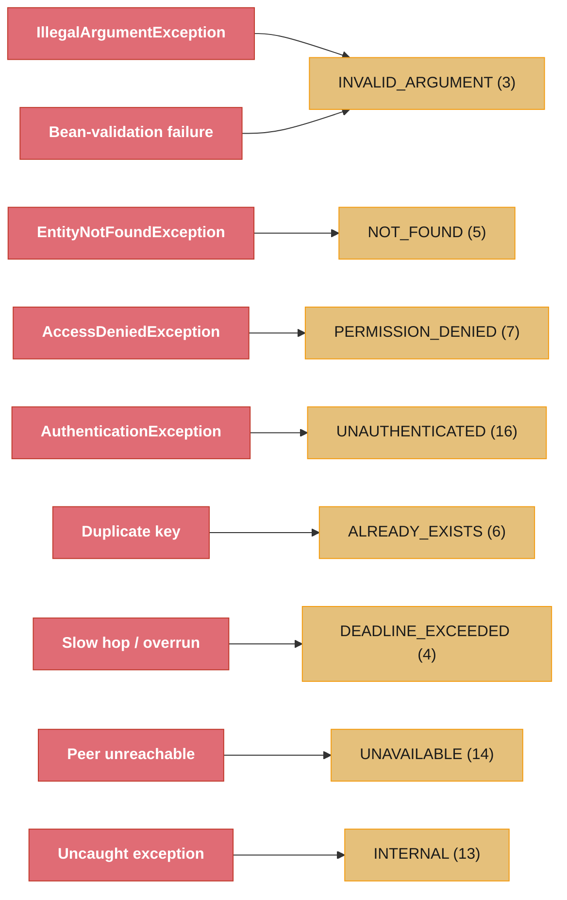
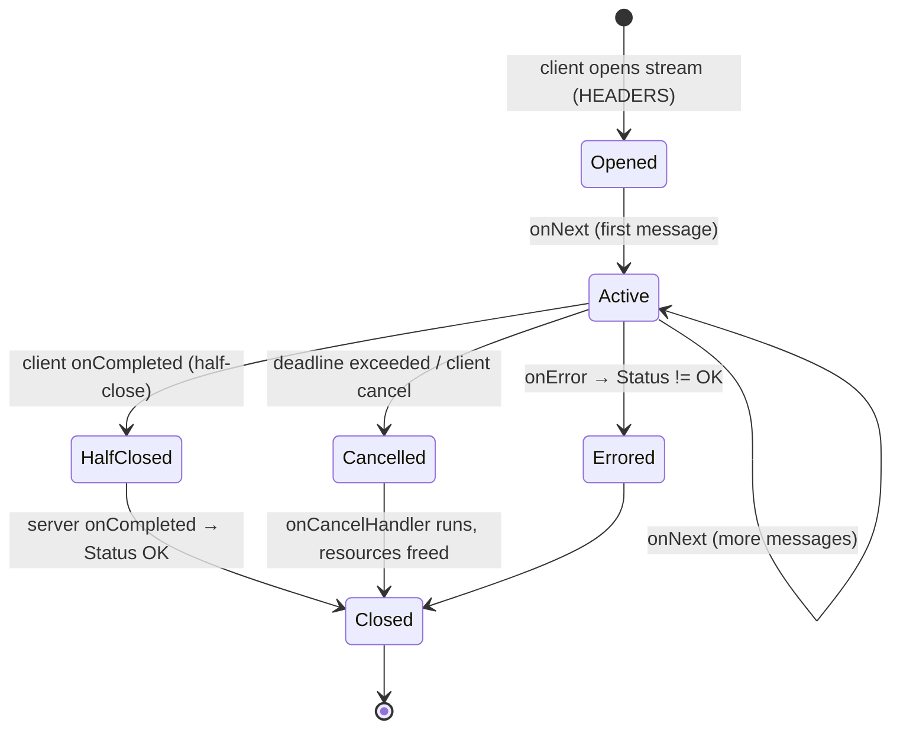

# Spring gRPC Integration — Beans, Interceptors, Security, Tracing, Deadlines

---

## 1. Concept Overview

gRPC is a contract-first, HTTP/2-based RPC framework: you write a `.proto` service definition, generate strongly-typed stubs, and call remote methods as if they were local. The wire mechanics — Protobuf varint encoding, HTTP/2 stream multiplexing, the four RPC modes — are covered in depth in [gRPC & Protobuf (pure Java)](../../java/grpc_protobuf/README.md) and [gRPC & Protobuf (backend design)](../../backend/grpc_and_protobuf/README.md). This module is about the *Spring* layer on top: how a gRPC server and its channels become managed beans, how cross-cutting concerns (auth, logging, metrics, tracing) plug in through interceptors, and how gRPC composes with Spring Security and Micrometer.

Raw grpc-java requires you to build a `Server`, register `BindableService` implementations, manage a `ManagedChannel` lifecycle, and wire interceptors by hand. Spring removes that boilerplate. Two projects do this:

1. **Spring gRPC** — the official project (1.0 GA, 2025), part of the Spring portfolio. Starters `spring-grpc-server-spring-boot-starter` / `spring-grpc-client-spring-boot-starter`; properties under `spring.grpc.*`; annotate a service bean with `@GrpcService` (`org.springframework.grpc.server.service.GrpcService`).
2. **grpc-spring-boot-starter** — the community project (`net.devh`, currently `3.1.0.RELEASE`), the de-facto standard for years before the official one. Properties under `grpc.server.*` / `grpc.client.*`; `@GrpcService` (`net.devh.boot.grpc.server.service.GrpcService`) for servers and `@GrpcClient` for injecting stubs.

Both auto-configure the Netty-based gRPC server (default port **9090**), register your `@GrpcService` beans, expose `ManagedChannel` factories, and let you contribute `ServerInterceptor` / `ClientInterceptor` beans that Spring orders and applies globally. This module covers that wiring, the error-mapping and deadline mechanics that bite in production, and the integrations with Spring Security and Micrometer Tracing.

---

## 2. Intuition

One-line analogy: `@GrpcService` is to gRPC what `@RestController` is to HTTP — the framework discovers the bean, binds it to the transport, and runs a filter chain around every call. A gRPC `ServerInterceptor` is the `OncePerRequestFilter` of the RPC world.

Mental model: a gRPC call flows through an *interceptor chain* the same way an HTTP request flows through the `FilterChainProxy` in Spring Security. On the client, a `ClientInterceptor` wraps the outgoing call — attaching a deadline, injecting a `traceparent` header, adding an auth token. On the server, a `ServerInterceptor` unwraps it — reading metadata, authenticating, starting a span, timing the call — before the `@GrpcService` method runs. Spring's job is to collect these interceptors as beans, order them, and register them once.

Why it matters: teams adopt gRPC for internal service-to-service traffic because it is 5–10x more compact than JSON and strongly typed, but a gRPC call that leaves Spring's comfort zone loses everything Spring gives you for free over HTTP — the `SecurityContext`, the trace propagated in MDC, the Micrometer timer. Without deliberate interceptor wiring, your gRPC endpoints are unauthenticated, untraced, and unmonitored. The single most common production incident is a client with no deadline hanging forever against a slow or dead server, exhausting its own thread pool.

Key insight: gRPC does not use `HttpServletRequest`, so none of Spring MVC's servlet-scoped machinery applies. Security, tracing, and context propagation all move to the gRPC `Metadata` (headers) and gRPC `Context` (a `ThreadLocal`-like immutable scope). Everything in this module is about rebuilding Spring's cross-cutting guarantees on top of those two gRPC primitives.

---

## 3. Core Principles

**Beans, not boilerplate.** A `@GrpcService`-annotated bean is auto-discovered and bound to the server; a channel is a `ManagedChannel` bean injected by name. You never call `ServerBuilder.forPort(...)` or manage a channel's shutdown yourself.

**Interceptors are the cross-cutting seam.** Every concern that HTTP handles with a servlet filter — auth, logging, metrics, tracing, tenancy — is a `ServerInterceptor` (inbound) or `ClientInterceptor` (outbound) in gRPC. Order matters and is explicit.

**Metadata carries context, not the message.** Auth tokens, trace context, tenant IDs travel in `Metadata` (the gRPC equivalent of HTTP headers), keyed by `Metadata.Key`. The Protobuf message body stays purely domain data.

**Deadlines are absolute and propagate.** A deadline is a wall-clock instant, not a per-hop timeout. Set once on the client, it flows through the gRPC `Context` to every downstream call, and any hop that overruns fails fast with `DEADLINE_EXCEEDED`.

**Errors are Status codes, not stack traces.** gRPC has 16 canonical `Status` codes. Mapping domain exceptions to the right code (and back) is the contract between services; leaking a raw exception as `UNKNOWN` destroys the caller's ability to react.

**Context propagation must be explicit across threads.** The gRPC `Context` and Micrometer's observation context are `ThreadLocal`-backed; crossing a thread pool (async handler, reactive scheduler) drops them unless you wrap the executor.

---

## 4. Types / Architectures / Strategies

### The two Spring gRPC frameworks

| Dimension | Spring gRPC (official, 1.0) | grpc-spring-boot-starter (net.devh, 3.1.x) |
|-----------|------------------------------|---------------------------------------------|
| Server annotation | `@GrpcService` (`org.springframework.grpc...`) | `@GrpcService` (`net.devh.boot.grpc...`) |
| Client injection | `GrpcChannelFactory` + generated stub bean | `@GrpcClient("name")` on a stub field |
| Config prefix | `spring.grpc.server.*`, `spring.grpc.client.*` | `grpc.server.*`, `grpc.client.<name>.*` |
| Global interceptor | `ServerInterceptor` / `GlobalServerInterceptor` bean | `@GrpcGlobalServerInterceptor` bean |
| Security module | Compose with Spring Security manually via interceptor | Built-in `grpc-server-spring-boot-starter` security (`GrpcSecurity`, `@Secured`) |
| Maturity | Newer, portfolio-backed, actively converging | Battle-tested, huge install base |

### The four RPC modes in a Spring service

| Mode | `@GrpcService` method shape | Spring use case |
|------|-----------------------------|-----------------|
| Unary | `(Req, StreamObserver<Resp>)`, one `onNext` | Standard request/response (get, create) |
| Server streaming | `(Req, StreamObserver<Resp>)`, many `onNext` | Server pushes a result set / live feed |
| Client streaming | returns `StreamObserver<Req>`, one final `onNext` | Client uploads a batch, server aggregates |
| Bidirectional streaming | returns `StreamObserver<Req>`, many `onNext` | Chat, real-time sync, long-lived duplex |

Reactive variants (`Mono`/`Flux` signatures) come from `reactor-grpc` (Salesforce reactive-grpc) or the reactive support in Spring gRPC — see [Spring WebFlux](../spring_webflux/README.md) for the reactive model these plug into.

### Interceptor ordering strategies

| Concern | Interceptor | Typical order (lower = outer/first) |
|---------|-------------|-------------------------------------|
| Tracing / observation | `ObservationGrpcServerInterceptor` | 0 (outermost, so it times everything) |
| Authentication | custom `ServerInterceptor` reading `Metadata` | 100 |
| Authorization | Spring Security / `@Secured` check | 150 |
| Logging | custom `ServerInterceptor` | 200 |
| Metrics (per-method) | custom or Micrometer | 300 (innermost) |

### Error-mapping strategies

| Strategy | How | When |
|----------|-----|------|
| `@GrpcExceptionHandler` (`@GrpcAdvice`) | Central class maps exception → `Status` | Clean, controller-advice-like |
| `onError(StatusRuntimeException)` per call | Manual `responseObserver.onError(...)` | Fine-grained, per-method control |
| Rich error model | `StatusProto.toStatusRuntimeException` with `google.rpc.ErrorInfo` / `BadRequest` details | Machine-readable structured errors |

---

## 5. Architecture Diagrams

### Unary call: client interceptor → server interceptor → @GrpcService

```mermaid
sequenceDiagram
    actor App as Caller code
    participant CI as ClientInterceptor
    participant Net as HTTP/2 (Netty)
    participant SI as ServerInterceptor
    participant Svc as @GrpcService

    App->>CI: stub.withDeadlineAfter(200ms).getUser(req)
    Note over CI: attach deadline to Context<br/>inject traceparent + bearer token into Metadata
    CI->>Net: HEADERS + DATA (Protobuf), :path=/user.UserService/GetUser
    Net->>SI: start(call, metadata)
    Note over SI: read traceparent → start span<br/>read Authorization → build Authentication<br/>check Context deadline not already expired
    SI->>Svc: getUser(req, responseObserver)
    Svc-->>SI: onNext(resp); onCompleted()
    SI-->>Net: HEADERS(status=OK) + DATA + trailers
    Net-->>CI: response frames
    CI-->>App: UserResponse (or StatusRuntimeException)
```

The client interceptor writes the deadline and trace/auth metadata; the server interceptor reads them back and rebuilds Spring's `SecurityContext` and trace span before the service method runs.

### Server interceptor chain (ordering)


Lower order runs first and outermost, so the observation interceptor wraps (and times) every inner interceptor plus the handler. Reverse the order and your span would miss the auth and logging cost.

### Domain exception ↔ gRPC Status mapping



A central `@GrpcAdvice` maps each domain exception to a canonical `Status`; anything unmapped falls through as `INTERNAL (13)`, which tells the caller nothing — the whole point of the mapping is to avoid that.

### Streaming call lifecycle



A bidirectional stream stays `Active` while either side sends. Half-close (`onCompleted`) signals no more requests; cancellation and deadline expiry both short-circuit to `Cancelled`, where your `ServerCallStreamObserver.setOnCancelHandler` must release resources.

---

## 6. How It Works — Detailed Mechanics

### Protobuf build (Maven)

The `os-maven-plugin` extension detects the OS/arch classifier so the `protobuf-maven-plugin` can download the right `protoc` and gRPC codegen binaries.

```xml
<build>
  <extensions>
    <extension>
      <groupId>kr.motd.maven</groupId>
      <artifactId>os-maven-plugin</artifactId>
      <version>1.7.1</version>
    </extension>
  </extensions>
  <plugins>
    <plugin>
      <groupId>org.xolstice.maven.plugins</groupId>
      <artifactId>protobuf-maven-plugin</artifactId>
      <version>0.6.1</version>
      <configuration>
        <protocArtifact>com.google.protobuf:protoc:3.25.5:exe:${os.detected.classifier}</protocArtifact>
        <pluginId>grpc-java</pluginId>
        <pluginArtifact>io.grpc:protoc-gen-grpc-java:1.64.0:exe:${os.detected.classifier}</pluginArtifact>
      </configuration>
      <executions>
        <execution>
          <goals>
            <goal>compile</goal>       <!-- message classes -->
            <goal>compile-custom</goal> <!-- gRPC service stubs -->
          </goals>
        </execution>
      </executions>
    </plugin>
  </plugins>
</build>
```

`.proto` files live in `src/main/proto/`; generated sources land in `target/generated-sources/protobuf/{java,grpc-java}`.

### Server autoconfiguration and @GrpcService (net.devh)

```xml
<dependency>
  <groupId>net.devh</groupId>
  <artifactId>grpc-server-spring-boot-starter</artifactId>
  <version>3.1.0.RELEASE</version>
</dependency>
```

```yaml
# application.yml
grpc:
  server:
    port: 9090                 # default; 0 = in-process/random
    max-inbound-message-size: 4MB   # grpc-java default is 4 MiB
    security:
      enabled: false           # set true + certChain/privateKey for TLS
```

```java
import net.devh.boot.grpc.server.service.GrpcService;
import io.grpc.stub.StreamObserver;

@GrpcService  // auto-registered with the embedded gRPC server, no manual bind
public class UserGrpcService extends UserServiceGrpc.UserServiceImplBase {

    private final UserRepository repo;

    public UserGrpcService(UserRepository repo) { this.repo = repo; }

    @Override
    public void getUser(GetUserRequest request, StreamObserver<UserResponse> obs) {
        User user = repo.findById(request.getId())
            .orElseThrow(() -> new EntityNotFoundException("user " + request.getId()));
        obs.onNext(UserResponse.newBuilder()
            .setId(user.getId()).setName(user.getName()).build());
        obs.onCompleted();   // MUST call, or the client hangs until its deadline
    }
}
```

### Server autoconfiguration (official Spring gRPC)

```yaml
# application.yml — official Spring gRPC
spring:
  grpc:
    server:
      port: 9090
      max-inbound-message-size: 4MB
    client:
      channels:
        user-service:
          address: "static://localhost:9090"
          negotiation-type: plaintext   # or TLS
```

```java
import org.springframework.grpc.server.service.GrpcService;

@GrpcService
public class UserGrpcService extends UserServiceGrpc.UserServiceImplBase { /* same body */ }
```

### Injecting a client stub

```java
// net.devh style
@Service
public class OrderService {

    @GrpcClient("user-service")             // channel named in grpc.client.user-service.*
    private UserServiceGrpc.UserServiceBlockingStub userStub;

    public UserResponse lookup(long id) {
        return userStub
            .withDeadlineAfter(200, TimeUnit.MILLISECONDS)   // ALWAYS set a deadline
            .getUser(GetUserRequest.newBuilder().setId(id).build());
    }
}
```

```yaml
grpc:
  client:
    user-service:
      address: "static://user-service:9090"   # or discovery:///user-service
      negotiation-type: plaintext
      deadline: 500ms            # default per-call deadline if none set on the stub
```

```java
// Official Spring gRPC style — build a stub from a channel bean
@Configuration
class GrpcClientConfig {
    @Bean
    UserServiceGrpc.UserServiceBlockingStub userStub(GrpcChannelFactory channels) {
        return UserServiceGrpc.newBlockingStub(channels.createChannel("user-service"));
    }
}
```

### Server interceptor — auth, ordered, populating SecurityContext

```java
import io.grpc.*;
import org.springframework.core.annotation.Order;

@Order(100)                                 // runs after tracing (order 0), before logging (200)
@net.devh.boot.grpc.server.interceptor.GrpcGlobalServerInterceptor
public class AuthServerInterceptor implements ServerInterceptor {

    static final Metadata.Key<String> AUTH =
        Metadata.Key.of("authorization", Metadata.ASCII_STRING_MARSHALLER);

    private final JwtDecoder jwtDecoder;
    public AuthServerInterceptor(JwtDecoder jwtDecoder) { this.jwtDecoder = jwtDecoder; }

    @Override
    public <Req, Resp> ServerCall.Listener<Req> interceptCall(
            ServerCall<Req, Resp> call, Metadata headers, ServerCallHandler<Req, Resp> next) {

        String bearer = headers.get(AUTH);
        if (bearer == null || !bearer.startsWith("Bearer ")) {
            call.close(Status.UNAUTHENTICATED.withDescription("missing bearer token"), new Metadata());
            return new ServerCall.Listener<>() {};   // no-op listener; call is already closed
        }
        try {
            Jwt jwt = jwtDecoder.decode(bearer.substring(7));
            Authentication auth = new JwtAuthenticationToken(jwt);
            // Bind identity into the gRPC Context so downstream (and @Secured) can see it.
            Context ctx = Context.current().withValue(SecurityContextKey.KEY, auth);
            return Contexts.interceptCall(ctx, call, headers, next);
        } catch (JwtException e) {
            call.close(Status.UNAUTHENTICATED.withDescription("invalid token"), new Metadata());
            return new ServerCall.Listener<>() {};
        }
    }
}
```

The gRPC `Context` (not servlet `SecurityContextHolder`) carries identity, because a gRPC call is not servlet-scoped. net.devh's security module bridges this into `SecurityContextHolder` for `@Secured`/`@PreAuthorize` support; with the official starter you read the context key yourself or install the bridge interceptor.

### Client interceptor — inject a token on every outbound call

```java
@net.devh.boot.grpc.client.interceptor.GrpcGlobalClientInterceptor
public class TokenClientInterceptor implements ClientInterceptor {

    private final TokenProvider tokens;
    public TokenClientInterceptor(TokenProvider tokens) { this.tokens = tokens; }

    @Override
    public <Req, Resp> ClientCall<Req, Resp> interceptCall(
            MethodDescriptor<Req, Resp> method, CallOptions opts, Channel next) {
        return new ForwardingClientCall.SimpleForwardingClientCall<>(next.newCall(method, opts)) {
            @Override public void start(Listener<Resp> listener, Metadata headers) {
                headers.put(AuthServerInterceptor.AUTH, "Bearer " + tokens.currentToken());
                super.start(listener, headers);
            }
        };
    }
}
```

### Error handling with @GrpcAdvice / @GrpcExceptionHandler

```java
import net.devh.boot.grpc.server.advice.GrpcAdvice;
import net.devh.boot.grpc.server.advice.GrpcExceptionHandler;

@GrpcAdvice                                 // like @ControllerAdvice, but for gRPC
public class GrpcExceptionAdvice {

    @GrpcExceptionHandler(EntityNotFoundException.class)
    public Status handleNotFound(EntityNotFoundException e) {
        return Status.NOT_FOUND.withDescription(e.getMessage());
    }

    @GrpcExceptionHandler({IllegalArgumentException.class, ConstraintViolationException.class})
    public Status handleBadRequest(Exception e) {
        return Status.INVALID_ARGUMENT.withDescription(e.getMessage());
    }

    @GrpcExceptionHandler(AccessDeniedException.class)
    public Status handleDenied(AccessDeniedException e) {
        return Status.PERMISSION_DENIED.withDescription("forbidden");
    }
    // Anything unmapped surfaces as UNKNOWN/INTERNAL — always add a catch-all.
}
```

On the client, unwrap the code:

```java
try {
    return userStub.withDeadlineAfter(200, MILLISECONDS).getUser(req);
} catch (StatusRuntimeException e) {
    Status.Code code = e.getStatus().getCode();
    if (code == Status.Code.NOT_FOUND) throw new UserNotFoundException(req.getId());
    if (code == Status.Code.DEADLINE_EXCEEDED) throw new UpstreamTimeoutException("user-service");
    throw e;   // UNAVAILABLE etc. bubble to a retry/circuit-breaker layer
}
```

### Deadlines and cancellation propagation — BROKEN → FIX

```java
// BROKEN: no deadline. If user-service is slow (GC pause) or dead (TCP accepts,
// never responds), this call blocks the calling thread FOREVER. Under load the
// caller's thread pool fills with hung calls and the whole service becomes
// unresponsive — a classic cascading failure with no error, just silence.
public UserResponse lookup(long id) {
    return userStub.getUser(GetUserRequest.newBuilder().setId(id).build());
}
```

```java
// FIX: set an absolute deadline. The deadline propagates through the gRPC Context
// to every downstream hop; any overrun fails fast with DEADLINE_EXCEEDED instead
// of hanging. 200ms here budgets the whole call, not each hop.
public UserResponse lookup(long id) {
    return userStub
        .withDeadlineAfter(200, TimeUnit.MILLISECONDS)
        .getUser(GetUserRequest.newBuilder().setId(id).build());
}
```

On the server, observe the propagated deadline and cancellation:

```java
@Override
public void getUser(GetUserRequest req, StreamObserver<UserResponse> obs) {
    // The client's remaining budget is visible here — bail before expensive work.
    Deadline deadline = Context.current().getDeadline();
    if (deadline != null && deadline.isExpired()) {
        obs.onError(Status.DEADLINE_EXCEEDED.asRuntimeException());
        return;
    }
    if (Context.current().isCancelled()) return;   // client already gave up
    // ... do work, honoring the budget ...
}
```

### Micrometer tracing — traceparent through Metadata

```xml
<dependency><groupId>io.micrometer</groupId>
  <artifactId>micrometer-tracing-bridge-otel</artifactId></dependency>
<dependency><groupId>io.opentelemetry</groupId>
  <artifactId>opentelemetry-exporter-otlp</artifactId></dependency>
```

```java
import io.micrometer.core.instrument.binder.grpc.ObservationGrpcServerInterceptor;
import io.micrometer.core.instrument.binder.grpc.ObservationGrpcClientInterceptor;

@Configuration
public class GrpcObservabilityConfig {

    @Bean
    @Order(0)   // outermost server interceptor — times the entire call chain
    ObservationGrpcServerInterceptor grpcServerObservation(ObservationRegistry reg) {
        return new ObservationGrpcServerInterceptor(reg);
    }

    @Bean
    ObservationGrpcClientInterceptor grpcClientObservation(ObservationRegistry reg) {
        return new ObservationGrpcClientInterceptor(reg);
    }
}
```

These interceptors serialize the current trace into the W3C `traceparent` metadata key on the client (`00-<32-hex trace>-<16-hex span>-01`) and deserialize it on the server, so a single trace ID spans the whole gRPC call graph — the same mechanism described in [Observability & Tracing](../observability_and_tracing/README.md), just carried over gRPC `Metadata` instead of HTTP headers.

---

## 7. Real-World Examples

**Internal service mesh at scale.** A payments company moved 40 internal microservices from JSON-over-HTTP to gRPC. Each service exposes a `@GrpcService`; a shared library contributes four global interceptors (observation order 0, auth 100, tenant 150, logging 200) so every service is traced and authenticated identically. Cross-service payloads shrank ~65% versus JSON, and p99 serialization time dropped from 4ms to well under 1ms.

**Auth via interceptor, not per-method code.** A logistics platform validates a JWT in a single `AuthServerInterceptor` that decodes the token, builds a `JwtAuthenticationToken`, and binds it into the gRPC `Context`. Method-level `@Secured("ROLE_DISPATCH")` then works exactly as in Spring MVC — because net.devh's security bridge copies the context identity into `SecurityContextHolder` before the handler runs.

**Deadline budget preventing a cascade.** An order service calls user → pricing → inventory in sequence with a single 300ms deadline set at the top. When inventory suffered a GC pause, the deadline had already been consumed by the first two hops; inventory saw `Context.current().getDeadline().isExpired()` and returned `DEADLINE_EXCEEDED` in microseconds instead of hanging, so the order service failed fast and served a degraded response rather than exhausting its thread pool.

**Tracing an incident in 90 seconds.** A slow checkout was traced by pasting the `traceparent` trace ID (captured from the response) into Tempo. The trace showed `order (12ms) → pricing (280ms) → currency-rate DB (270ms)`, isolating a missing index — all because `ObservationGrpcClientInterceptor` propagated `traceparent` through gRPC metadata across four services.

**gRPC-Web for the browser.** A dashboard SPA cannot speak native gRPC (browsers cannot control HTTP/2 frames), so an Envoy sidecar with the gRPC-Web filter translates browser `application/grpc-web+proto` requests into native gRPC to the Spring `@GrpcService`, giving the frontend typed clients without a REST layer.

---

## 8. Tradeoffs

### gRPC vs REST vs GraphQL

| Dimension | gRPC | REST (JSON) | GraphQL |
|-----------|------|-------------|---------|
| Payload | Protobuf binary (compact) | JSON text (verbose) | JSON text |
| Contract | `.proto`, compile-time typed | OpenAPI (optional) | SDL schema |
| Transport | HTTP/2 required | HTTP/1.1 or 2 | usually HTTP/1.1 |
| Streaming | First-class (4 modes) | SSE / chunked hacks | Subscriptions (WS) |
| Browser | Needs gRPC-Web proxy | Native | Native |
| Best for | Internal service-to-service | Public APIs, broad clients | Client-shaped aggregation |

### Spring gRPC (official) vs net.devh starter

| Dimension | Spring gRPC (official) | net.devh starter |
|-----------|------------------------|------------------|
| Backing | Spring portfolio | Community, very mature |
| Security | Manual composition | Built-in `GrpcSecurity`, `@Secured` |
| Config | `spring.grpc.*` | `grpc.*` |
| Momentum | Growing, will converge | Stable, huge adoption |
| Recommendation | New greenfield on latest Boot | Existing systems, richest security |

### gRPC vs HTTP for internal traffic

| Dimension | gRPC | HTTP/JSON |
|-----------|------|-----------|
| Debuggability | Needs `grpcurl`/tooling | `curl` + eyeballs |
| Schema evolution | Field numbers, strict rules | Loose, ad hoc |
| Load balancing | L7 / mesh needed (sticky HTTP/2) | Any L4/L7 LB |
| Human readability | Binary | Text |

---

## 9. When to Use / When NOT to Use

**Use Spring gRPC when:**
- Internal service-to-service traffic where payload size, latency, and a strict typed contract matter.
- You want streaming (server push, client upload batches, or duplex sync) as a first-class citizen.
- Polyglot services share one `.proto` contract and generate native clients in each language.

**Do NOT use Spring gRPC when:**
- The API is public or consumed by arbitrary browsers/third parties — REST/JSON has far broader reach and tooling.
- You need human-readable, `curl`-debuggable endpoints and your team has no gRPC tooling.
- Your clients are exclusively browsers and you do not want a gRPC-Web proxy — REST or GraphQL is simpler.

**Use interceptor-based auth/tracing when:**
- More than one `@GrpcService` needs the same cross-cutting concern — centralize it in one global interceptor.

**Do NOT scatter cross-cutting logic when:**
- You are tempted to re-validate the token or start a span inside each method body — that is the exact duplication interceptors exist to remove.

**Avoid gRPC without deadlines, always:**
- Any client call with no `withDeadlineAfter` is a latent hang; there is no scenario where an unbounded internal RPC is acceptable.

---

## 10. Common Pitfalls

### Pitfall 1: Client call with no deadline (the hang)

```java
// BROKEN: no deadline. A dead-but-listening peer never sends a response;
// the blocking stub waits indefinitely. 1,000 RPS × infinite wait = thread
// pool exhaustion in seconds, and the caller looks "hung" with zero errors.
UserResponse r = userStub.getUser(req);
```

```java
// FIXED: bound every call. Prefer a per-call deadline (budgets the whole tree);
// also set a channel-level default as a backstop.
UserResponse r = userStub.withDeadlineAfter(200, TimeUnit.MILLISECONDS).getUser(req);
```
```yaml
grpc:
  client:
    user-service:
      deadline: 500ms   # backstop if a code path forgets the per-call deadline
```

### Pitfall 2: Forgetting onCompleted() (server-side hang)

```java
// BROKEN: onNext without onCompleted. The client's stream never closes;
// it blocks until ITS deadline fires, then reports DEADLINE_EXCEEDED — a
// misleading error that hides a server bug.
@Override public void getUser(GetUserRequest req, StreamObserver<UserResponse> obs) {
    obs.onNext(buildResponse(req));
    // missing obs.onCompleted();
}
```

```java
// FIXED: always terminate the observer exactly once — onCompleted OR onError.
@Override public void getUser(GetUserRequest req, StreamObserver<UserResponse> obs) {
    obs.onNext(buildResponse(req));
    obs.onCompleted();
}
```

### Pitfall 3: Leaking exceptions as UNKNOWN

```java
// BROKEN: an unhandled exception propagates to the client as Status.UNKNOWN
// with no description (stack traces are stripped for security). The caller
// cannot tell "not found" from "bug" from "bad input".
@Override public void getUser(GetUserRequest req, StreamObserver<UserResponse> obs) {
    User u = repo.findById(req.getId()).orElseThrow();  // NoSuchElementException → UNKNOWN
    obs.onNext(toResponse(u)); obs.onCompleted();
}
```

```java
// FIXED: map to a meaningful Status, centrally via @GrpcAdvice (see §6),
// so the client receives NOT_FOUND (5) with a description.
User u = repo.findById(req.getId())
    .orElseThrow(() -> new EntityNotFoundException("user " + req.getId()));
```

### Pitfall 4: Exceeding the 4 MB default message limit

```
# SCENARIO: a batch endpoint returns 10,000 records. Encoded Protobuf = 6 MB.
# The client fails with:
#   RESOURCE_EXHAUSTED: gRPC message exceeds maximum size 4194304: 6291456
# grpc-java caps inbound messages at 4 MiB by default on BOTH ends.
```

```yaml
# FIXED (prefer): paginate or server-stream instead of one giant message.
# If you truly must, raise the limit on both server and client:
grpc:
  server:
    max-inbound-message-size: 8MB
  client:
    user-service:
      max-inbound-message-size: 8MB
```

### Pitfall 5: Trace/security context lost across a thread boundary

```java
// BROKEN: the gRPC Context and Micrometer trace are ThreadLocal-backed.
// Offloading to a plain executor drops both — the async work is untraced
// and unauthenticated.
@Override public void getUser(GetUserRequest req, StreamObserver<UserResponse> obs) {
    executor.submit(() -> {                 // loses Context + trace
        obs.onNext(buildResponse(req));
        obs.onCompleted();
    });
}
```

```java
// FIXED: wrap the runnable so the current gRPC Context propagates; use a
// context-propagating executor for Micrometer trace continuity.
@Override public void getUser(GetUserRequest req, StreamObserver<UserResponse> obs) {
    executor.submit(Context.current().wrap(() -> {   // gRPC Context carried
        obs.onNext(buildResponse(req));
        obs.onCompleted();
    }));
}
```

### Pitfall 6: Interceptor order silently wrong

```java
// BROKEN: metrics interceptor at order 0 (outermost) and observation at 300.
// The trace span now starts AFTER metrics/auth/logging, so those inner costs
// are invisible in the trace, and unauthenticated calls still get timed.
@Bean @Order(0)   MetricsInterceptor metrics() { ... }
@Bean @Order(300) ObservationGrpcServerInterceptor obs(ObservationRegistry r) { ... }
```

```java
// FIXED: observation outermost (0) so the span wraps everything; auth next;
// metrics innermost so it times only the handler.
@Bean @Order(0)   ObservationGrpcServerInterceptor obs(ObservationRegistry r) { ... }
@Bean @Order(100) AuthServerInterceptor auth(JwtDecoder d) { ... }
@Bean @Order(300) MetricsInterceptor metrics() { ... }
```

---

## 11. Technologies & Tools

| Tool | Role | Notes |
|------|------|-------|
| `spring-grpc-server-spring-boot-starter` | Official Spring gRPC server autoconfig | `spring.grpc.*`; Boot 3.x |
| `spring-grpc-client-spring-boot-starter` | Official Spring gRPC client / channels | `GrpcChannelFactory` |
| `grpc-server-spring-boot-starter` (net.devh) | Community server autoconfig | `@GrpcService`, `grpc.server.*` |
| `grpc-client-spring-boot-starter` (net.devh) | Community client autoconfig | `@GrpcClient`, `grpc.client.*` |
| `grpc-spring-boot-starter` security (net.devh) | `GrpcSecurity`, `@Secured` on gRPC | Bridges to `SecurityContextHolder` |
| `protobuf-maven-plugin` + `os-maven-plugin` | Codegen from `.proto` | `compile` + `compile-custom` goals |
| `micrometer-core` (`binder.grpc.*`) | `Observation*Interceptor` for gRPC | Propagates `traceparent` in Metadata |
| `micrometer-tracing-bridge-otel` | Trace bridge to OTLP | Exports to Tempo/Jaeger |
| Envoy gRPC-Web filter | Browser ↔ gRPC translation | For SPA clients |
| `grpcurl` | CLI to call gRPC by reflection | The `curl` of gRPC; needs reflection service |
| gRPC server reflection | Runtime service/method discovery | Enable for `grpcurl`, disable in prod if sensitive |

---

## 12. Interview Questions with Answers

**Why does a gRPC client call hang forever, and how do you prevent it?**
Because a blocking stub with no deadline waits indefinitely for a response that a slow or dead-but-listening peer never sends. gRPC does not impose a default timeout, so the call blocks its thread until the peer replies; under load this exhausts the caller's thread pool with zero errors — just silence. Always call `stub.withDeadlineAfter(200, TimeUnit.MILLISECONDS)`, and set a channel-level `deadline` backstop so a forgotten per-call deadline still fails fast with `DEADLINE_EXCEEDED`.

**What is the difference between a gRPC deadline and a per-hop timeout?**
A deadline is an absolute wall-clock instant that propagates through the entire call tree, whereas a timeout is a per-call relative duration. When a client sets `withDeadlineAfter(300ms)`, that instant travels through the gRPC `Context` to user → pricing → inventory; each hop sees the *remaining* budget via `Context.current().getDeadline()`. This prevents the "reset timeout at each hop" bug where a 300ms budget silently becomes 900ms across three services. Set the deadline once at the edge of a request and let it flow.

**How does `@GrpcService` differ from `@RestController`, and what machinery does it lose?**
`@GrpcService` binds a bean to the HTTP/2 gRPC server instead of the servlet dispatcher, so none of Spring MVC's servlet-scoped machinery applies. There is no `HttpServletRequest`, no `HandlerInterceptor`, no servlet `SecurityContextHolder` auto-population. Cross-cutting concerns move to gRPC `ServerInterceptor`s, and identity/trace context move to gRPC `Metadata` and `Context` rather than servlet request attributes. You rebuild security, tracing, and logging on those two gRPC primitives.

**How do you propagate the security identity into a gRPC service method?**
Read the token from `Metadata` in a `ServerInterceptor`, build an `Authentication`, and bind it into the gRPC `Context` with `Contexts.interceptCall`. Because gRPC calls are not servlet-scoped, the servlet `SecurityContextHolder` is not populated automatically; the interceptor either stores identity in the gRPC `Context` (read directly downstream) or, with net.devh's security bridge, copies it into `SecurityContextHolder` so `@Secured`/`@PreAuthorize` work as in MVC. Do this in one global interceptor, not per method.

**Why does an unhandled server exception reach the client as UNKNOWN, and how do you fix it?**
Because gRPC strips stack traces for security and maps any unmapped exception to `Status.UNKNOWN` with no description, so the caller cannot distinguish a bug from "not found" from bad input. Fix it with a central `@GrpcAdvice` class whose `@GrpcExceptionHandler` methods map each domain exception to a canonical `Status` (`EntityNotFoundException` → `NOT_FOUND`, `IllegalArgumentException` → `INVALID_ARGUMENT`), and always include a catch-all so nothing silently degrades to `INTERNAL`.

**What happens if a server-side handler calls onNext but forgets onCompleted?**
The response stream never closes, so the client blocks until its own deadline fires and then reports `DEADLINE_EXCEEDED` — a misleading error that hides a pure server bug. Every `StreamObserver` must be terminated exactly once with `onCompleted()` (success) or `onError()` (failure). This is the server-side twin of the missing-deadline client hang; both manifest as a "timeout" that points at the wrong cause.

**How does interceptor ordering affect tracing and metrics correctness?**
Lower `@Order` runs first and outermost, so the observation/tracing interceptor must be order 0 to wrap and time every inner interceptor plus the handler. If metrics or auth run outside the span, their cost is invisible in the trace and even unauthenticated calls get timed. The correct chain is observation (0) → auth (100) → authorization (150) → logging (200) → metrics (300, innermost), so the span measures the full inbound cost.

**How is trace context propagated across a gRPC call?**
The client interceptor serializes the current trace into the W3C `traceparent` metadata key on the outgoing call. The `ObservationGrpcServerInterceptor` then deserializes that key and continues the span on the server, so one trace ID spans the entire call graph. Because it travels in gRPC `Metadata` (the header analog), this is identical in spirit to HTTP header propagation, just over gRPC. Register both interceptors from `micrometer-core`'s `binder.grpc` package.

**Why do gRPC calls fail with RESOURCE_EXHAUSTED on large payloads?**
Because grpc-java caps inbound messages at 4 MiB by default on both the server and the client, so a 6 MB response throws `RESOURCE_EXHAUSTED: gRPC message exceeds maximum size 4194304`. The right fix is to paginate or switch to server streaming so no single message is huge; only if unavoidable, raise `max-inbound-message-size` on both ends — a large limit invites memory pressure and makes a single call able to OOM the process.

**What is the difference between the official Spring gRPC and net.devh's starter?**
The official Spring gRPC (1.0) is portfolio-backed and configured under the `spring.grpc` properties, while net.devh's starter is the mature community project under the `grpc` prefix. net.devh adds a richer built-in security module (`GrpcSecurity`, `@Secured`, `@GrpcGlobalServerInterceptor`), while both auto-configure the Netty server, register `@GrpcService` beans, and support global interceptors. Choose the official one for greenfield on the latest Boot; keep net.devh for existing systems that lean on its security bridge.

**How does cancellation propagate, and how should a streaming handler react?**
When a client cancels or its deadline expires, the server's gRPC `Context` becomes cancelled and a `ServerCallStreamObserver.setOnCancelHandler` callback fires. A long-running or streaming handler should check `Context.current().isCancelled()` before expensive steps and register an on-cancel handler to release resources (close cursors, cancel downstream calls). Ignoring cancellation wastes CPU producing results no one will read and can leak connections on long streams.

**How do you inject a gRPC stub as a Spring bean?**
With net.devh, annotate a stub field with `@GrpcClient("channel-name")` and Spring injects a stub bound to the named channel from `grpc.client.<name>.*`. With the official starter, build the stub in a `@Bean` from a `GrpcChannelFactory.createChannel("name")`. Prefer a blocking stub for unary request/response, an async stub for streaming, and always apply `withDeadlineAfter` on each call rather than trusting a global default.

**What are the four gRPC streaming modes and their Spring method shapes?**
Unary and server-streaming both take a `(Request, StreamObserver<Response>)` signature, differing only in how many times the handler calls `onNext`. Client-streaming and bidirectional-streaming both return a `StreamObserver<Request>` that receives the incoming messages. Client-streaming emits one final response after the client half-closes; bidirectional keeps both directions open concurrently. In Spring you override the generated `...ImplBase` method matching the mode declared in the `.proto`.

**How do you secure gRPC endpoints with method-level authorization?**
Authenticate in a `ServerInterceptor` that populates identity, then guard methods with `@Secured` or `@PreAuthorize`. net.devh's security bridge enforces those annotations by copying the gRPC-context identity into `SecurityContextHolder` before the handler runs. The interceptor answers "who are you?" (`UNAUTHENTICATED` on failure) and the annotation answers "may you?" (`PERMISSION_DENIED` on failure). Keeping the two separate mirrors Spring Security's authentication-vs-authorization split.

**How do you call a Spring gRPC service from a browser?**
Put a gRPC-Web proxy (Envoy's gRPC-Web filter, or grpcwebproxy) in front, because browsers cannot control HTTP/2 framing and cannot speak native gRPC. The proxy translates the browser's `application/grpc-web+proto` over HTTP/1.1 into native gRPC to the Spring `@GrpcService`. Alternatively expose a REST façade via transcoding (a gateway maps JSON/HTTP to the gRPC method using `google.api.http` annotations) when you want plain REST for external clients.

**Why is Metadata used for auth tokens instead of the Protobuf message?**
Because Metadata is the transport-level header channel — cross-cutting context like tokens, trace IDs, and tenant IDs belong there so interceptors can read them without parsing the domain message. Putting an auth token in the request message couples every method's schema to security concerns and forces the handler (not an interceptor) to enforce auth. Keys use `Metadata.Key.of(name, ASCII_STRING_MARSHALLER)`; binary values use a `-bin` suffix key.

**What does a channel-level default deadline give you over a per-call deadline?**
A channel `deadline` is a backstop that bounds any call whose code path forgets `withDeadlineAfter`, so a single missed per-call deadline cannot hang. The per-call deadline is still preferred because it budgets the whole downstream tree for that specific request, while the channel default is a blunt catch-all. Configure both: a strict per-call deadline for correctness and a generous channel deadline as a safety net.

**How do you keep gRPC serialization out of your service's critical CPU path under load?**
Rely on Protobuf's compact binary encoding, which is far smaller than JSON and parses faster, so serialization rarely dominates. Then avoid oversized messages by paginating or streaming instead of returning multi-MB blobs. Reuse generated builders rather than reflection, keep field numbers stable to avoid re-encoding surprises, and let the Netty transport multiplex many calls over one HTTP/2 connection so you are not paying per-call connection setup. The wire-level detail lives in [gRPC & Protobuf (pure Java)](../../java/grpc_protobuf/README.md).

**When would you choose gRPC over REST or GraphQL for a new API?**
Choose gRPC for internal service-to-service traffic where a strict typed contract, small binary payloads, low latency, and first-class streaming matter more than human readability. Choose REST for public or browser-facing APIs that need the broadest client reach and `curl`-level debuggability, and GraphQL when clients need to shape aggregated responses across many resources. gRPC's browser gap (needs gRPC-Web) and binary opacity are the usual reasons it stays internal.

---

## 13. Best Practices

1. Set `withDeadlineAfter` on every client call and a channel-level `deadline` backstop; an unbounded internal RPC is never acceptable.
2. Terminate every `StreamObserver` exactly once — `onCompleted()` on success, `onError()` on failure — or the peer hangs until its deadline.
3. Centralize error mapping in one `@GrpcAdvice`/`@GrpcExceptionHandler` class and always include a catch-all so nothing degrades to `UNKNOWN`.
4. Put cross-cutting concerns in global interceptors, not method bodies: observation at order 0, auth at 100, authorization at 150, logging at 200, metrics innermost.
5. Carry identity, trace, and tenant in `Metadata` and the gRPC `Context`; never smuggle them into the Protobuf message.
6. Authenticate in an interceptor, authorize with `@Secured`/`@PreAuthorize` — keep the "who" and "may you" checks separate, mapping to `UNAUTHENTICATED` and `PERMISSION_DENIED`.
7. Register `ObservationGrpcServerInterceptor` and `ObservationGrpcClientInterceptor` so `traceparent` propagates across the gRPC call graph into your tracing backend.
8. Prefer pagination or server streaming over raising `max-inbound-message-size`; a large limit lets one call OOM the process.
9. Wrap any executor/async offload with `Context.current().wrap(...)` (and a context-propagating executor for Micrometer) so security and trace context survive the thread hop.
10. Keep `.proto` field numbers stable and follow the schema-evolution rules from [gRPC & Protobuf (pure Java)](../../java/grpc_protobuf/README.md); never renumber or reuse a field tag.
11. Enable server reflection only where `grpcurl` debugging is needed; disable it in hardened production to avoid exposing the service catalog.
12. Pin `protoc`, `protoc-gen-grpc-java`, and the runtime `io.grpc` versions together to avoid generated-vs-runtime incompatibilities.

---

## 14. Case Study

### Scenario: Internal Microservice-to-Microservice API over gRPC with Auth, Tracing, and Deadlines

**Context.** A fintech platform runs 25 internal services behind an HTTP gateway. Service-to-service calls were JSON-over-HTTP with hand-rolled `RestTemplate` clients: no shared auth, inconsistent timeouts, and traces that broke at every hop because propagation was copy-pasted and often wrong. Two incidents in a quarter were caused by a slow downstream with no client timeout hanging its callers until thread pools drained. The team decided to standardize internal traffic on gRPC with a shared Spring library enforcing auth, tracing, and deadlines uniformly.

**Requirements.**
- Every internal call authenticated by a service JWT, validated once in an interceptor.
- One trace ID spanning any call chain, exported to Tempo.
- A hard deadline on every call, propagated through the whole tree, no exceptions.
- Consistent error codes so callers can react (retry `UNAVAILABLE`, surface `NOT_FOUND`, reject `INVALID_ARGUMENT`).

**Architecture decision.** Build one `platform-grpc-starter` internal library that contributes four global server interceptors and two client interceptors, and expose a `.proto` per service. Every service depends on the starter; no service writes its own auth or tracing code.

**Implementation.**

Shared interceptor registration in the starter's autoconfiguration:
```java
@AutoConfiguration
public class PlatformGrpcAutoConfiguration {

    @Bean @Order(0)
    ObservationGrpcServerInterceptor serverObservation(ObservationRegistry r) {
        return new ObservationGrpcServerInterceptor(r);   // outermost: full-call span
    }
    @Bean @Order(100)
    AuthServerInterceptor auth(JwtDecoder decoder) { return new AuthServerInterceptor(decoder); }

    @Bean @Order(200)
    LoggingServerInterceptor logging() { return new LoggingServerInterceptor(); }

    @Bean
    ObservationGrpcClientInterceptor clientObservation(ObservationRegistry r) {
        return new ObservationGrpcClientInterceptor(r);
    }
    @Bean
    ServiceTokenClientInterceptor clientToken(TokenProvider p) {
        return new ServiceTokenClientInterceptor(p);      // injects service JWT on egress
    }
}
```

The pricing service exposes a `@GrpcService`; the order service consumes it with a deadline:
```java
@GrpcService
public class PricingGrpcService extends PricingServiceGrpc.PricingServiceImplBase {
    @Override
    public void quote(QuoteRequest req, StreamObserver<QuoteResponse> obs) {
        if (Context.current().getDeadline() != null && Context.current().getDeadline().isExpired()) {
            obs.onError(Status.DEADLINE_EXCEEDED.asRuntimeException());
            return;   // don't compute a price no one will wait for
        }
        Money price = pricingEngine.price(req.getSku(), req.getQty());
        obs.onNext(QuoteResponse.newBuilder().setCents(price.cents()).build());
        obs.onCompleted();
    }
}

@Service
public class OrderService {
    @GrpcClient("pricing-service")
    private PricingServiceGrpc.PricingServiceBlockingStub pricing;

    public Quote getQuote(String sku, int qty) {
        try {
            QuoteResponse r = pricing
                .withDeadlineAfter(150, TimeUnit.MILLISECONDS)   // budget the whole chain
                .quote(QuoteRequest.newBuilder().setSku(sku).setQty(qty).build());
            return new Quote(r.getCents());
        } catch (StatusRuntimeException e) {
            if (e.getStatus().getCode() == Status.Code.DEADLINE_EXCEEDED)
                return Quote.unavailable();   // degrade, don't hang
            if (e.getStatus().getCode() == Status.Code.UNAVAILABLE)
                throw new RetryableException("pricing-service down");
            throw e;
        }
    }
}
```

Central error mapping in the starter:
```java
@GrpcAdvice
public class PlatformGrpcExceptionAdvice {
    @GrpcExceptionHandler(EntityNotFoundException.class)
    Status notFound(EntityNotFoundException e) { return Status.NOT_FOUND.withDescription(e.getMessage()); }
    @GrpcExceptionHandler(ConstraintViolationException.class)
    Status invalid(ConstraintViolationException e) { return Status.INVALID_ARGUMENT.withDescription(e.getMessage()); }
    @GrpcExceptionHandler(AccessDeniedException.class)
    Status denied(AccessDeniedException e) { return Status.PERMISSION_DENIED.withDescription("forbidden"); }
    @GrpcExceptionHandler(Exception.class)          // catch-all: never leak UNKNOWN
    Status other(Exception e) { return Status.INTERNAL.withDescription("internal error"); }
}
```

**Results.**

During a later incident, the pricing engine hit a 4-second GC pause. Because the order service set a 150ms deadline that had already been partly consumed upstream, pricing saw an expired deadline and returned `DEADLINE_EXCEEDED` in microseconds. The order service caught it and served an "unavailable" quote placeholder; the checkout flow stayed up. Before gRPC deadlines, the equivalent event drained the order service's thread pool and took checkout down for 8 minutes.

| Metric | Before (JSON/HTTP) | After (Spring gRPC) |
|--------|--------------------|---------------------|
| Inter-service payload size | 100% (JSON baseline) | ~35% (Protobuf) |
| Hung-call incidents / quarter | 2 | 0 |
| Broken traces across hops | frequent | none (traceparent propagated) |
| p99 serialization time | ~4ms | <1ms |
| Mean incident RCA time | ~30 min (log grep) | ~90s (Tempo trace) |

**Observability outcome.** A single trace ID from `ObservationGrpcClientInterceptor` spanned order → pricing → currency-rate DB in Tempo, isolating a missing index in 90 seconds. Auth was uniform because one `AuthServerInterceptor` validated every call; no service re-implemented it.

**Lesson learned.** The value was not gRPC's speed alone but the *shared starter* that made auth, tracing, and deadlines impossible to get wrong. Cross-cutting concerns belong in global interceptors contributed once, exactly as the [Spring Security Architecture](../spring_security_architecture/README.md) `FilterChainProxy` centralizes them for HTTP — gRPC just moves the seam from servlet filters to `ServerInterceptor`s.

---

## Related / See Also

- [gRPC & Protobuf (pure Java)](../../java/grpc_protobuf/README.md) — wire format, generated stubs, the four RPC modes, schema evolution
- [gRPC & Protobuf (backend design)](../../backend/grpc_and_protobuf/README.md) — load balancing, service mesh, HTTP/2 multiplexing
- [Spring WebFlux](../spring_webflux/README.md) — the reactive model behind `Mono`/`Flux` gRPC stubs
- [Observability & Tracing](../observability_and_tracing/README.md) — Micrometer Observation, W3C `traceparent`, OTLP export
- [Spring Security Architecture](../spring_security_architecture/README.md) — `FilterChainProxy`, authentication vs authorization, method security
