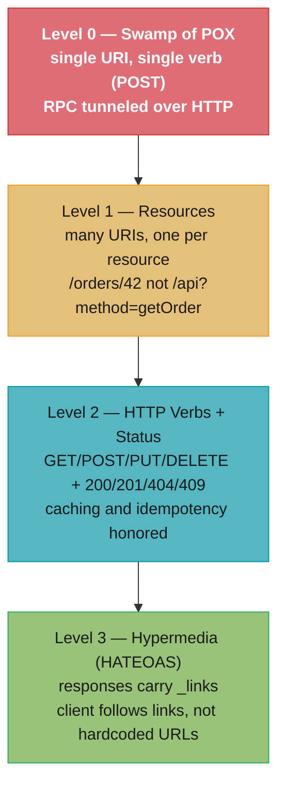
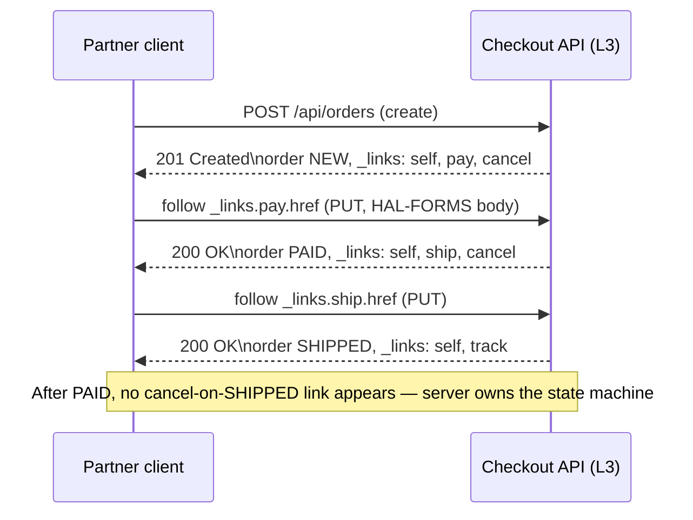

# Spring HATEOAS & REST Maturity

## 1. Concept Overview

REST maturity is measured by the **Richardson Maturity Model (RMM)** — a four-level ladder from RPC-tunneled-over-HTTP (Level 0) to fully hypermedia-driven APIs (Level 3, HATEOAS). Most production "REST" APIs actually sit at **Level 2**: resource URIs plus correct HTTP verbs and status codes. Level 3 — **HATEOAS** (Hypermedia As The Engine Of Application State) — adds links to every response so the client discovers what it can do next instead of hardcoding URLs.

**Spring HATEOAS** (the `spring-boot-starter-hateoas` module) is the toolkit for building Level 3 APIs on Spring MVC. It supplies `RepresentationModel`, `EntityModel<T>`, `CollectionModel<T>`, and `PagedModel<T>` wrappers that carry `Link` objects; a `WebMvcLinkBuilder` that generates URLs by pointing at controller methods (`linkTo(methodOn(...))`) instead of concatenating strings; and `RepresentationModelAssembler` to keep link-building out of the controller. It serializes to the **HAL** media type (`application/hal+json`) and, when you add affordances, to **HAL-FORMS** (`application/prs.hal-forms+json`), which also describes the *inputs* each action needs.

Around this sit the pieces that make an evolvable REST API: a standardized error model with **`ProblemDetail`** (RFC 7807, `application/problem+json`), a versioning strategy (URI vs header vs media type), and declarative HTTP clients — `@HttpExchange` interfaces backed by `RestClient` (both GA in Spring Boot 3.2) — that let a *consumer* follow those hypermedia links cleanly.

---

## 2. Intuition

Think of a hypermedia API as **a website built for machines**. When you browse a shopping site you never memorize URLs — you land on a page, read the links and buttons it offers ("Pay", "Cancel", "Track"), and click one. The server decides which actions exist right now; the browser just follows what it is given. HATEOAS applies exactly this to a JSON API: each response embeds the links (and, with HAL-FORMS, the forms) for the next legal transitions.

**One-line analogy:** A Level 2 API is a phone directory the client must memorize; a Level 3 (HATEOAS) API is a website the client browses by following links.

**Key insight:** In a hypermedia API the **server owns the URL structure and the state machine**. The client hardcodes only one thing — the entry-point URL — and derives every subsequent action from `_links`. That is what lets the server relocate endpoints, add new actions, or gate transitions by state without breaking clients. The catch, and the reason Level 3 is rarely adopted, is that the *client* must be written to actually follow links rather than template URLs — and most clients are not.

---

## 3. Core Principles

1. **Links, not string URLs:** Never concatenate `"/orders/" + id` in a response body. Build links from controller methods so a route change updates every link automatically.
2. **Server owns application state transitions:** The presence or absence of a link (`pay`, `cancel`, `ship`) encodes what the resource *allows right now*. The client reads the state machine off the response.
3. **Hypermedia as the engine:** The client stores one bookmark (the API root) and navigates by relation names (`rel`), decoupling it from the URI layout.
4. **Self-describing media types:** `application/hal+json` standardizes where links live (`_links`) and where nested resources live (`_embedded`); HAL-FORMS adds `_templates` describing method, target, and expected fields.
5. **Standardized errors:** Every failure is a `ProblemDetail` (RFC 7807), so a client writes one error parser instead of one per endpoint.
6. **Evolve without breaking:** Additive change (new links, new optional fields, new media-type version) over breaking change; version explicitly when you must.

---

## 4. Types / Architectures / Strategies

### Richardson Maturity Model

| Level | Name | What it adds | Typical smell |
|-------|------|--------------|---------------|
| **L0** | The Swamp of POX | One URI, one verb (usually `POST`); RPC tunneled over HTTP | SOAP, `/api?method=getOrder`, XML-RPC |
| **L1** | Resources | Many URIs, one per resource/entity | `/orders/42` instead of a single endpoint |
| **L2** | HTTP Verbs + Status | Correct verbs (GET/POST/PUT/PATCH/DELETE) + status codes (200/201/404/409); caching + idempotency | **Where ~90% of real APIs live** |
| **L3** | Hypermedia (HATEOAS) | Responses carry `_links` (and HAL-FORMS `_templates`); client follows them | Rare in practice; common in public APIs (PayPal, GitHub) |

### Spring HATEOAS Model Types

| Type | Wraps | Use for |
|------|-------|---------|
| `RepresentationModel<T>` | Nothing (base class) | A resource whose fields you add by subclassing; carries links |
| `EntityModel<T>` | A single DTO/entity | The common case: one resource + its links |
| `CollectionModel<T>` | A collection of models | A list of resources + collection-level links |
| `PagedModel<T>` | A page of models | Paginated lists; adds `page` metadata + `next`/`prev`/`first`/`last` links |
| `Link` | A `href` + `rel` (+ affordances) | The link itself; `IanaLinkRelations.SELF`, custom rels |

### Media Types

| Media type | Purpose |
|------------|---------|
| `application/hal+json` | HAL: `_links` + `_embedded`; the Spring HATEOAS default |
| `application/prs.hal-forms+json` | HAL-FORMS: HAL plus `_templates` describing method/target/fields of each action |
| `application/problem+json` | RFC 7807 error bodies (`ProblemDetail`) |
| `application/vnd.company.v2+json` | Media-type (vendor) versioning |
| Collection+JSON / Siren / Uber | Alternative hypermedia formats Spring HATEOAS can emit |

### Declarative / Fluent HTTP Clients (for the *consumer*)

| Client | Style | Status | Notes |
|--------|-------|--------|-------|
| `RestClient` | Synchronous fluent | **GA in Boot 3.2** (Spring 6.1) | Modern replacement for `RestTemplate`; blocking |
| `@HttpExchange` interface | Declarative | Interface since Spring 6.0; `RestClientAdapter` GA in **Boot 3.2** | Define an interface, `HttpServiceProxyFactory` implements it |
| `RestTemplate` | Synchronous template | Maintenance mode | Still supported; not deprecated but no new features |
| `WebClient` | Reactive/non-blocking | GA (WebFlux) | Use when you need reactive streams or high concurrency |

### API Versioning Strategies

| Strategy | Example | Tradeoff |
|----------|---------|----------|
| URI | `/api/v2/orders` | Most visible, cache-friendly; "un-RESTful" (version in resource identity) |
| Header | `X-API-Version: 2` | Clean URLs; invisible in browser/logs, harder to cache |
| Media type (content negotiation) | `Accept: application/vnd.acme.v2+json` | Most REST-purist; complex tooling, easy to get wrong |

---

## 5. Architecture Diagrams

### Richardson Maturity Model — the four levels



Each level is strictly additive over the one below. The red node is the least mature; most APIs that call themselves REST stop at the teal Level 2 and never reach the green hypermedia level.

### A client driving state by following links (L3)

```mermaid
sequenceDiagram
    participant C as Client
    participant API as Order API (L3)
    C->>API: POST /orders  (create)
    API-->>C: 201 Created\nbody _links: self, cancel, pay, items
    C->>API: follow _links.pay.href  (PUT)
    API-->>C: 200 OK\npayment resource, _links: self, confirm
    C->>API: follow _links.confirm.href  (PUT)
    API-->>C: 200 OK\norder state PAID, _links: self, ship
    Note over C,API: Client hardcodes only the root URL; every next action is read off _links
```

The client never templates a URL. Which links appear depends on the order's current state — an already-paid order simply stops offering a `pay` link, so the state machine lives on the server.

### Building a HAL response with an assembler

```mermaid
flowchart LR
    classDef io      fill:#61afef,stroke:#2e86c1,color:#1a1a1a,font-weight:bold
    classDef frozen  fill:#c678dd,stroke:#9b59b6,color:#fff
    classDef train   fill:#98c379,stroke:#27ae60,color:#1a1a1a
    classDef mathOp  fill:#d19a66,stroke:#e67e22,color:#1a1a1a,font-weight:bold
    classDef lossN   fill:#e06c75,stroke:#c0392b,color:#fff,font-weight:bold
    classDef req     fill:#56b6c2,stroke:#0097a7,color:#1a1a1a
    classDef base    fill:#e5c07b,stroke:#f39c12,color:#1a1a1a

    ORD([Order from service])
    ASM["OrderModelAssembler\ntoModel(order)"]
    LINK["WebMvcLinkBuilder\nlinkTo(methodOn(...)).withRel(...)"]
    EM["EntityModel(OrderDto)\ncontent + links"]
    CONV["HAL message converter\nHateoasJackson2..."]
    HAL([HAL response\napplication/hal+json])

    ORD --> ASM --> LINK --> EM --> CONV --> HAL

    class ORD,HAL io
    class ASM,EM train
    class LINK mathOp
    class CONV base
```



The assembler is the single place that knows how to turn a domain object into a linked representation; the `WebMvcLinkBuilder` derives each `href` from a controller method, so renaming a route never leaves a stale URL in the body.

---

## 6. How It Works — Detailed Mechanics

### BROKEN: hardcoded string URLs in the response

```java
// BROKEN — URLs concatenated by hand in the response body.
// Every route change (context path, versioning, host) silently breaks these.
@GetMapping("/{id}")
public Map<String, Object> getOrder(@PathVariable Long id) {
    Order o = service.find(id);
    Map<String, Object> body = new HashMap<>();
    body.put("id", o.getId());
    body.put("status", o.getStatus());
    body.put("self", "http://localhost:8080/api/orders/" + id);   // hardcoded host + path
    body.put("cancel", "http://localhost:8080/api/orders/" + id + "/cancel");
    return body;
}
```

### FIXED: links built from controller methods

```java
import static org.springframework.hateoas.server.mvc.WebMvcLinkBuilder.linkTo;
import static org.springframework.hateoas.server.mvc.WebMvcLinkBuilder.methodOn;

@GetMapping("/{id}")
public EntityModel<OrderDto> getOrder(@PathVariable Long id) {
    OrderDto dto = service.find(id);
    EntityModel<OrderDto> model = EntityModel.of(dto);

    // Link derived from the mapping on this very method — no strings, host-correct
    model.add(linkTo(methodOn(OrderController.class).getOrder(id)).withSelfRel());
    if (dto.status() == Status.NEW) {
        model.add(linkTo(methodOn(OrderController.class).cancel(id)).withRel("cancel"));
        model.add(linkTo(methodOn(OrderController.class).pay(id)).withRel("pay"));
    }
    return model;   // serialized as application/hal+json
}
```

The produced HAL body:

```json
{
  "id": 42,
  "status": "NEW",
  "_links": {
    "self":   { "href": "http://localhost:8080/api/orders/42" },
    "cancel": { "href": "http://localhost:8080/api/orders/42/cancel" },
    "pay":    { "href": "http://localhost:8080/api/orders/42/pay" }
  }
}
```

`linkTo(methodOn(...))` records a proxy call to the controller method, reads its `@RequestMapping`/`@GetMapping` metadata, resolves the current request's base URL (scheme, host, context path), and produces a correct absolute `href` — so the same code is correct behind a load balancer or under `/api/v2`.

### RepresentationModelAssembler — keep link logic out of the controller

```java
@Component
public class OrderModelAssembler
        implements RepresentationModelAssembler<Order, EntityModel<OrderDto>> {

    @Override
    public EntityModel<OrderDto> toModel(Order order) {
        OrderDto dto = OrderDto.from(order);
        EntityModel<OrderDto> model = EntityModel.of(dto,
            linkTo(methodOn(OrderController.class).getOrder(order.getId())).withSelfRel(),
            linkTo(methodOn(OrderController.class).list(null)).withRel("orders"));

        // State-dependent transitions — the link IS the permission signal
        switch (order.getStatus()) {
            case NEW -> {
                model.add(linkTo(methodOn(OrderController.class).pay(order.getId())).withRel("pay"));
                model.add(linkTo(methodOn(OrderController.class).cancel(order.getId())).withRel("cancel"));
            }
            case PAID -> model.add(linkTo(methodOn(OrderController.class).ship(order.getId())).withRel("ship"));
            default -> { /* terminal states expose only self */ }
        }
        return model;
    }
}
```

### CollectionModel and PagedModel

```java
@GetMapping
public CollectionModel<EntityModel<OrderDto>> list(Pageable pageable) {
    List<EntityModel<OrderDto>> orders = service.findAll(pageable).stream()
        .map(assembler::toModel)
        .toList();
    return CollectionModel.of(orders,
        linkTo(methodOn(OrderController.class).list(pageable)).withSelfRel());
}

// PagedModel adds page metadata + first/prev/next/last links automatically
@GetMapping("/paged")
public PagedModel<EntityModel<OrderDto>> paged(Pageable pageable,
        PagedResourcesAssembler<Order> pagedAssembler) {
    Page<Order> page = service.page(pageable);
    return pagedAssembler.toModel(page, assembler);
}
```

`PagedModel` serializes a `page` block (`size`, `totalElements`, `totalPages`, `number`) plus navigation links — the client pages by following `next`, never by constructing `?page=N`.

### Affordances — HAL-FORMS (`application/prs.hal-forms+json`)

An affordance attaches *what inputs an action needs* to a link, so the client can render a form:

```java
import static org.springframework.hateoas.server.mvc.WebMvcLinkBuilder.*;
import static org.springframework.hateoas.mediatype.Affordances.*;

Link payLink = linkTo(methodOn(OrderController.class).pay(id)).withRel("pay");
payLink = payLink.andAffordance(
    afford(methodOn(OrderController.class).pay(id)));  // exposes the PaymentRequest schema

// Requires the client to send Accept: application/prs.hal-forms+json
```

Resulting HAL-FORMS `_templates` (abbreviated):

```json
"_templates": {
  "pay": {
    "method": "PUT",
    "target": "http://localhost:8080/api/orders/42/pay",
    "properties": [
      { "name": "amount",   "required": true, "type": "number" },
      { "name": "currency", "required": true }
    ]
  }
}
```

### The consumer side — declarative `@HttpExchange` + `RestClient` (Boot 3.2)

```java
// 1) Declare the client as an interface (Spring 6 @HttpExchange)
public interface OrderApiClient {
    @GetExchange("/api/orders/{id}")
    EntityModel<OrderDto> getOrder(@PathVariable Long id);

    @PostExchange("/api/orders")
    EntityModel<OrderDto> create(@RequestBody CreateOrderRequest req);
}

// 2) Back it with RestClient (GA in Boot 3.2) via HttpServiceProxyFactory
@Configuration
class ClientConfig {
    @Bean
    OrderApiClient orderApiClient(RestClient.Builder builder) {
        RestClient client = builder.baseUrl("http://orders-service").build();
        HttpServiceProxyFactory factory = HttpServiceProxyFactory
            .builderFor(RestClientAdapter.create(client))   // RestClientAdapter — Spring 6.1
            .build();
        return factory.createClient(OrderApiClient.class);
    }
}

// 3) A truly hypermedia-aware client follows links instead of templating URLs
RestClient rc = RestClient.create();
EntityModel<OrderDto> order = rc.get()
    .uri("http://orders-service/api/orders/42")
    .accept(MediaTypes.HAL_JSON)
    .retrieve()
    .body(new ParameterizedTypeReference<EntityModel<OrderDto>>() {});

Optional<Link> pay = order.getLink("pay");   // read the next action off _links
pay.ifPresent(link -> rc.put().uri(link.getHref()).retrieve().toBodilessEntity());
```

`RestClient` is the synchronous fluent client that replaces `RestTemplate`; `WebClient` remains the choice when you need reactive/non-blocking streams. Prefer `RestClient` for ordinary blocking calls in a servlet stack.

### Errors — `ProblemDetail` (RFC 7807)

```java
@RestControllerAdvice
class OrderExceptionHandler {
    @ExceptionHandler(OrderNotFoundException.class)
    ProblemDetail handleNotFound(OrderNotFoundException ex) {
        ProblemDetail pd = ProblemDetail.forStatus(HttpStatus.NOT_FOUND);
        pd.setType(URI.create("https://api.acme.com/problems/order-not-found"));
        pd.setTitle("Order Not Found");
        pd.setDetail(ex.getMessage());              // application/problem+json
        return pd;
    }
}
```

---

## 7. Real-World Examples

**PayPal REST API** is a canonical Level 3 hypermedia API: an order response returns `links` with `rel` values like `approve`, `capture`, and `self`, and the integration guide explicitly tells you to follow the `approve` link rather than construct the URL yourself.

**GitHub REST API** embeds hypermedia URLs (`url`, `commits_url`, `issues_url`) in nearly every resource, letting clients traverse from a repo to its issues without hardcoding paths — a pragmatic partial-HATEOAS style.

**Spring Data REST** auto-exposes JPA repositories as a HAL API: it generates `_links` and `_embedded` for every entity and association out of the box, and serves an ALPS/HAL-FORMS profile describing each resource — the most common way teams ship a Level 3 API without hand-writing assemblers.

**Amazon API Gateway + AWS services** commonly return `application/problem+json`-style structured errors, and internal service meshes increasingly standardize on RFC 7807 so that one client error handler works across dozens of services.

---

## 8. Tradeoffs

| Concern | Level 2 (verbs + status) | Level 3 (HATEOAS) |
|---------|--------------------------|-------------------|
| Client coupling to URLs | High (client templates URLs) | Low (client follows links) |
| Server URL flexibility | Changing routes breaks clients | Relocate freely; links regenerate |
| Payload size | Smaller | Larger (`_links`/`_templates` overhead) |
| Client complexity | Simple (fetch by URL) | Higher (must parse and follow links) |
| Discoverability / docs | External (OpenAPI) | In-band (links describe next actions) |
| Adoption reality | ~90% of APIs | Rare; needs a link-following client |

| Client library | Blocking? | When |
|----------------|-----------|------|
| `RestClient` | Yes | Default for servlet apps (Boot 3.2+) |
| `WebClient` | No | Reactive stacks, high fan-out concurrency |
| `RestTemplate` | Yes | Legacy code only (maintenance mode) |
| `@HttpExchange` interface | Either backend | Declarative, testable client contracts |

| Versioning | Cache-friendly | Cleanliness | Complexity |
|------------|----------------|-------------|------------|
| URI (`/v2/`) | Best | "Version in identity" purists dislike | Low |
| Header | Poor (needs Vary) | Clean URLs | Medium |
| Media type | Poor | Most RESTful | High |

---

## 9. When to Use / When NOT to Use

**Use HATEOAS (Level 3) when:**
- The resource has a **non-trivial state machine** whose allowed actions change (order: NEW → PAID → SHIPPED) — links naturally encode which transitions are legal now.
- You control neither client release cadence nor URL stability and need to **evolve endpoints without coordinated deploys**.
- You are building a **public / partner API** where discoverability and long-term evolvability pay for the extra payload (PayPal, GitHub style).
- You use **Spring Data REST**, which gives HAL essentially for free.

**Do NOT use HATEOAS when:**
- You and the client are the **same team shipping together** — a Level 2 API with OpenAPI is simpler and the client will hardcode URLs anyway.
- The API is **internal, high-throughput, latency-sensitive** — `_links` overhead and link-following round-trips cost more than they save.
- The client is a **thin SPA/mobile app** that just needs data; front-end devs rarely write generic link-following clients.
- You cannot invest in a client that actually follows links — a Level 3 server with a Level 2 client gives you all the cost and none of the benefit.

Aim for **solid Level 2** as the baseline; add HATEOAS deliberately where the state machine or evolvability argument is real.

---

## 10. Common Pitfalls

### Pitfall 1: Hardcoded URLs defeat the whole point

```java
// BROKEN: string URLs — wrong host behind a proxy, break on context-path change
body.put("self", "http://localhost:8080/orders/" + id);
```
```java
// FIXED: derive from the controller method
model.add(linkTo(methodOn(OrderController.class).getOrder(id)).withSelfRel());
```

### Pitfall 2: HATEOAS server, non-HATEOAS client

Shipping `_links` that no client reads is pure overhead. If the consumer still does `GET /orders/{id}/pay` by templating the URL, you paid the L3 cost for L2 behavior. Decide up front whether the client will follow links; if not, stay at Level 2.

### Pitfall 3: `methodOn` proxy limitations

```java
// BROKEN: linkTo(methodOn(...)) cannot capture links to a method whose mapping
// depends on runtime request attributes not passed as arguments (e.g. reading
// SecurityContext inside the method) — the recorded call has no such context.
```
`methodOn` records a dummy invocation to read mapping metadata; the method body never runs, so anything it computes from the current thread/request is invisible. Pass everything the link needs as method arguments, or build the link with `linkTo(SomeController.class).slash(id)`.

### Pitfall 4: Forgetting the HAL-FORMS `Accept` header

Affordances only render as `_templates` when the client sends `Accept: application/prs.hal-forms+json`. With plain `application/hal+json` you get `_links` but no form metadata — clients then "can't see" the inputs and teams wrongly conclude affordances are broken.

### Pitfall 5: Leaking entities and losing links to serialization config

Returning a raw JPA entity (not a DTO) inside `EntityModel` exposes the DB schema and can trigger lazy-loading serialization errors. Also, registering a custom `ObjectMapper` without the HAL module (`Jackson2HalModule`) silently drops `_links`. Always wrap DTOs, and let the HATEOAS auto-configuration own the HAL `ObjectMapper`.

### Pitfall 6: Breaking clients by removing a link `rel`

Once clients navigate by `rel`, a `rel` name is part of your contract. Renaming `pay` → `payment` is a **breaking change** just like deleting an endpoint. Treat `rel` names with the same discipline as URLs and version them.

---

## 11. Technologies & Tools

| Component | Role |
|-----------|------|
| `spring-boot-starter-hateoas` | Brings Spring HATEOAS + HAL support |
| `RepresentationModel` / `EntityModel` / `CollectionModel` / `PagedModel` | Link-carrying response wrappers |
| `WebMvcLinkBuilder` (`linkTo`, `methodOn`) | Generate URLs from controller methods |
| `RepresentationModelAssembler` | Convert domain objects to linked models |
| `PagedResourcesAssembler` | Build `PagedModel` with navigation links |
| `Affordances` / HAL-FORMS | Describe action inputs (`_templates`) |
| `ProblemDetail` (Spring 6 / Boot 3) | RFC 7807 error bodies |
| `RestClient` (Boot 3.2) | Synchronous fluent HTTP client |
| `@HttpExchange` + `HttpServiceProxyFactory` + `RestClientAdapter` | Declarative HTTP client interfaces |
| Spring Data REST | Auto-generated HAL API over repositories |
| Traverson | Spring's Java client for traversing HAL links by `rel` |
| `hal-explorer` | Browsable UI for HAL APIs |

---

## 12. Interview Questions with Answers

**What does HATEOAS actually add over a normal REST API, and why is it Level 3?**
HATEOAS adds hypermedia links to responses so the client discovers available actions instead of hardcoding URLs. In the Richardson Maturity Model, Level 1 adds resource URIs, Level 2 adds proper verbs and status codes, and Level 3 (HATEOAS) adds the `_links` that let the response itself drive the client's next request. The practical payoff is that the server can relocate endpoints or gate transitions by state without breaking clients — but only if the client is written to follow links.

**Why is hardcoding `"/orders/" + id` in a response body considered broken in Spring HATEOAS?**
Because a concatenated string bakes in the host, scheme, and context path, so it breaks behind a load balancer, under a different context path, or when versioning changes the route. `linkTo(methodOn(OrderController.class).getOrder(id)).withSelfRel()` instead reads the mapping off the controller method and resolves the current request's base URL, producing a correct absolute href everywhere. This is the single most common HATEOAS mistake in code review.

**Most APIs call themselves REST but sit at Level 2 — what does that mean and is it wrong?**
It means they use resource URIs plus correct HTTP verbs and status codes but do not return hypermedia links, so clients still template URLs. It is not wrong: Level 2 is a perfectly reasonable, widely-recommended target, and HATEOAS is only worth its extra payload and client complexity when you have a real state machine or evolvability requirement. Roy Fielding argues true REST requires Level 3, but pragmatically most teams stop at Level 2 deliberately.

**What is the difference between `EntityModel`, `CollectionModel`, and `PagedModel`?**
`EntityModel<T>` wraps a single resource plus its links, `CollectionModel<T>` wraps a list of models, and `PagedModel<T>` adds page metadata plus navigation links. `CollectionModel` carries collection-level links, while `PagedModel` extends it with a `page` block (`size`, `totalElements`, `totalPages`, `number`) and `first`/`prev`/`next`/`last` links. You return `EntityModel` from a single-item GET, `CollectionModel` from a list, and `PagedModel` (via `PagedResourcesAssembler`) from a paginated list — the client pages by following `next` rather than constructing `?page=N`.

**What does `linkTo(methodOn(...))` do under the hood, and what is its main limitation?**
`methodOn` returns a proxy that records a dummy invocation of the controller method without running its body, letting `linkTo` read the method's `@RequestMapping` metadata and build the URL. The limitation is that anything the real method computes from the current request or thread (SecurityContext, request attributes) is invisible, because the body never executes. Pass all URL-affecting values as method arguments, or fall back to `linkTo(Controller.class).slash(id)`.

**What is the difference between HAL and HAL-FORMS, and which media type triggers each?**
HAL (`application/hal+json`) describes *where* you can go via `_links` and embeds related resources in `_embedded`. HAL-FORMS (`application/prs.hal-forms+json`) adds `_templates` that describe *how* to invoke an action — its HTTP method, target URL, and expected input fields. You get HAL-FORMS only when the client sends `Accept: application/prs.hal-forms+json` and you attached affordances to the link; otherwise you get plain HAL.

**What is `RepresentationModelAssembler` and why use it instead of building links in the controller?**
It is an interface with a `toModel(entity)` method that centralizes conversion of a domain object into a linked `EntityModel`, keeping link logic out of controllers. This avoids duplicating link-building across every endpoint that returns the same resource and gives you one place to encode state-dependent links (show `pay`/`cancel` only when NEW). Controllers then just call `assembler.toModel(order)` and stay thin.

**What is `ProblemDetail` and what problem does it solve?**
`ProblemDetail` (Spring 6 / Boot 3) is Spring's implementation of RFC 7807, a standardized JSON error body with `type`, `title`, `status`, `detail`, and `instance`, served as `application/problem+json`. It replaces every team inventing its own error shape, so a client writes one error parser for all endpoints. You create one with `ProblemDetail.forStatus(...)` in an `@ExceptionHandler` and can add custom properties like a `fieldErrors` map.

**When would you choose `RestClient` over `RestTemplate` or `WebClient`?**
Use `RestClient` (GA in Boot 3.2) for synchronous, blocking HTTP in a servlet application — it is the modern fluent replacement for `RestTemplate`, which is now in maintenance mode. Use `WebClient` when you need reactive, non-blocking calls or very high concurrency fan-out. `RestTemplate` is only for legacy code you are not modernizing; it is supported but receives no new features.

**How does `@HttpExchange` create a declarative HTTP client, and what backs it?**
You declare a Java interface with methods annotated `@GetExchange`/`@PostExchange`, and `HttpServiceProxyFactory` generates an implementation at runtime. The factory is given an adapter — `RestClientAdapter` (Spring 6.1 / Boot 3.2), `WebClientAdapter`, or `RestTemplateAdapter` — which determines the underlying transport. This gives you a typed, testable client contract, analogous to Spring Data repositories or OpenFeign, without hand-writing HTTP calls.

**What are the three main API versioning strategies and their tradeoffs?**
URI versioning (`/api/v2/orders`) is the most visible and cache-friendly but puts a version in the resource identity, which purists dislike. Header versioning (`X-API-Version: 2`) keeps URLs clean but is invisible in logs and needs `Vary` for caching. Media-type versioning (`Accept: application/vnd.acme.v2+json`) is the most RESTful because the representation, not the resource, is versioned, but it is the most complex to tool. Most teams pick URI versioning for pragmatism.

**How does the presence or absence of a link encode authorization or state?**
In a hypermedia API the assembler adds a `cancel` or `pay` link only when the resource's current state (and the caller's permissions) actually allow that action, so the link set *is* the state machine. A client reads what it may do off `_links` instead of hardcoding business rules, and an already-shipped order simply stops offering `cancel`. This keeps transition logic on the server and prevents clients from attempting illegal actions.

**Why is renaming a link `rel` a breaking change?**
Once clients navigate by relation name, a `rel` like `pay` is part of the published contract exactly as a URL is, so renaming it to `payment` breaks every client that looked up `_links.pay`. Hypermedia moves the coupling from URLs to `rel` names — it does not eliminate coupling. Treat `rel` names with the same versioning discipline you apply to endpoints.

**Can you have a Level 3 server with a Level 2 client, and what happens?**
Yes, and it is a common anti-pattern: the server emits `_links` but the client ignores them and templates URLs itself. You then pay the full cost of HATEOAS — larger payloads, assembler complexity, link maintenance — while getting none of the decoupling benefit, because the client is still hardwired to your URL layout. Decide whether the client will genuinely follow links *before* committing to Level 3.

**How does Spring Data REST relate to Spring HATEOAS?**
Spring Data REST is built on Spring HATEOAS and auto-exposes JPA/Mongo repositories as a HAL API, generating `_links`, `_embedded`, pagination links, and an ALPS/HAL-FORMS profile with no hand-written assemblers. It is the fastest way to ship a Level 3 API, at the cost of tightly coupling your HTTP surface to your persistence model. For a curated public API you usually still hand-write assemblers to control the exposed shape.

**What is Traverson and when would you use it?**
Traverson is Spring HATEOAS's Java client for navigating a HAL API by following `rel` names rather than building URLs, e.g. `traverson.follow("orders", "pay")`. You use it on the consumer side to write a genuinely hypermedia-driven client that only knows the API root and traverses links from there. It is the client-side counterpart that makes a Level 3 server actually pay off.

**Does adding HATEOAS change your status codes or verbs?**
No — HATEOAS sits on top of Level 2, so you still return 201 on create, 200 on read, 404 on missing, 409 on conflict, and use GET/POST/PUT/PATCH/DELETE correctly. HATEOAS only adds the `_links` (and optionally HAL-FORMS `_templates`) to the body; it does not replace correct HTTP semantics. A broken Level 2 API does not become correct by bolting links onto it.

---

## 13. Best Practices

1. **Never concatenate URLs** — always `linkTo(methodOn(...))` so links survive proxies, context paths, and versioning.
2. **Wrap DTOs, never entities**, inside `EntityModel` — avoid exposing the DB schema and lazy-loading serialization errors.
3. **Put link logic in a `RepresentationModelAssembler`**, not controllers — one place per resource, easy to encode state-dependent links.
4. **Let link presence encode the state machine** — add `pay`/`cancel`/`ship` only for the states that allow them.
5. **Standardize every error as `ProblemDetail`** (RFC 7807) so clients write one error parser.
6. **Target solid Level 2 first**; add HATEOAS only where a real state machine or evolvability need justifies the cost.
7. **Version deliberately** (prefer URI versioning for pragmatism) and treat `rel` names as part of the contract.
8. **Use `RestClient` (Boot 3.2)** for synchronous clients and `@HttpExchange` interfaces for typed, testable client contracts; reserve `WebClient` for reactive needs.
9. **Expose HAL-FORMS affordances** for write actions so clients can discover required inputs, and document the `Accept: application/prs.hal-forms+json` requirement.
10. **Write a link-following client** (Traverson/`getLink`) if you go Level 3 — otherwise you paid for hypermedia you never use.

---

## 14. Case Study

### Scenario: A hypermedia-driven order/checkout API at Level 3

**Context.** A commerce platform exposes a partner-facing checkout API consumed by ~120 external integrators on independent release cycles. The team cannot coordinate deploys with every partner, and the checkout flow is a strict state machine: `NEW → PAID → SHIPPED → DELIVERED`, with `CANCELLED` reachable only from `NEW`/`PAID`. They build the API at **Level 3** so partners drive the flow by following links and the platform can evolve routes and gate transitions server-side. Traffic: **3,000 req/sec**, HAL by default, HAL-FORMS on request, errors as `application/problem+json`.

### State-driven link flow



### Assembler encoding the state machine

```java
@Component
public class CheckoutAssembler
        implements RepresentationModelAssembler<Order, EntityModel<OrderDto>> {

    @Override
    public EntityModel<OrderDto> toModel(Order order) {
        Long id = order.getId();
        EntityModel<OrderDto> model = EntityModel.of(OrderDto.from(order),
            linkTo(methodOn(OrderController.class).get(id)).withSelfRel());

        switch (order.getStatus()) {
            case NEW -> {
                model.add(payAffordance(id));                                   // HAL-FORMS
                model.add(linkTo(methodOn(OrderController.class).cancel(id)).withRel("cancel"));
            }
            case PAID -> {
                model.add(linkTo(methodOn(OrderController.class).ship(id)).withRel("ship"));
                model.add(linkTo(methodOn(OrderController.class).cancel(id)).withRel("cancel"));
            }
            case SHIPPED -> model.add(linkTo(methodOn(OrderController.class).track(id)).withRel("track"));
            case DELIVERED, CANCELLED -> { /* terminal: only self */ }
        }
        return model;
    }

    private Link payAffordance(Long id) {
        return linkTo(methodOn(OrderController.class).pay(id, null)).withRel("pay")
            .andAffordance(afford(methodOn(OrderController.class).pay(id, null)));
    }
}
```

### Controller

```java
@RestController
@RequestMapping("/api/orders")
class OrderController {
    private final CheckoutService service;
    private final CheckoutAssembler assembler;

    @PostMapping
    ResponseEntity<EntityModel<OrderDto>> create(@Valid @RequestBody CreateOrderRequest req) {
        Order created = service.create(req);
        EntityModel<OrderDto> model = assembler.toModel(created);
        return ResponseEntity
            .created(model.getRequiredLink(IanaLinkRelations.SELF).toUri())   // 201 + Location
            .body(model);
    }

    @GetMapping("/{id}")
    EntityModel<OrderDto> get(@PathVariable Long id) {
        return assembler.toModel(service.find(id));
    }

    @PutMapping("/{id}/pay")
    EntityModel<OrderDto> pay(@PathVariable Long id, @Valid @RequestBody PaymentRequest req) {
        return assembler.toModel(service.pay(id, req));       // 409 if not in NEW state
    }

    @PutMapping("/{id}/ship")
    EntityModel<OrderDto> ship(@PathVariable Long id) { return assembler.toModel(service.ship(id)); }

    @PutMapping("/{id}/cancel")
    EntityModel<OrderDto> cancel(@PathVariable Long id) { return assembler.toModel(service.cancel(id)); }

    @GetMapping("/{id}/track")
    EntityModel<TrackingDto> track(@PathVariable Long id) { /* ... */ return null; }
}
```

### Error contract (RFC 7807)

```java
@RestControllerAdvice
class CheckoutErrors {
    @ExceptionHandler(IllegalStateTransitionException.class)
    ProblemDetail handleBadTransition(IllegalStateTransitionException ex) {
        ProblemDetail pd = ProblemDetail.forStatus(HttpStatus.CONFLICT);          // 409
        pd.setType(URI.create("https://api.acme.com/problems/illegal-transition"));
        pd.setTitle("Illegal State Transition");
        pd.setDetail(ex.getMessage());
        pd.setProperty("currentState", ex.getCurrentState());
        return pd;   // application/problem+json
    }
}
```

### Partner client — follows links, never templates URLs

```java
RestClient rc = RestClient.create();
EntityModel<OrderDto> order = rc.post()
    .uri("https://api.acme.com/api/orders")
    .accept(MediaTypes.HAL_FORMS_JSON)
    .body(new CreateOrderRequest(...))
    .retrieve()
    .body(new ParameterizedTypeReference<>() {});

// Pay only if the server offered the action for this state
order.getLink("pay").ifPresent(pay ->
    rc.put().uri(pay.getHref()).body(new PaymentRequest(...)).retrieve().toBodilessEntity());
```

### Metrics

- Route relocation from `/api/orders/{id}/pay` to `/api/v2/orders/{id}/pay`: **zero partner changes** — link-following clients picked up the new `href` automatically.
- Illegal transitions (e.g. paying an already-shipped order) rejected with **409 `application/problem+json`** in **<1ms**, before touching the domain service.
- HAL payload overhead: `_links` added **~180 bytes/response**; acceptable at 3,000 req/sec for a partner API where evolvability was the priority.

### Pitfalls hit in production

**Pitfall 1 — a partner ignored `_links` and hardcoded `/pay`, breaking on the v2 move.**
```text
BROKEN: partner did PUT /api/orders/42/pay by string templating → 404 after route moved to /api/v2/...
FIXED:  partner switched to order.getLink("pay").getHref() → resilient to the relocation
```

**Pitfall 2 — HAL-FORMS `_templates` missing because of the `Accept` header.**
```text
BROKEN: client sent Accept: application/hal+json → got _links but no _templates, "couldn't find the pay fields"
FIXED:  client sent Accept: application/prs.hal-forms+json → _templates.pay described amount/currency
```

**Pitfall 3 — renaming the `cancel` rel to `cancelOrder` silently broke clients.**
```text
BROKEN: rel renamed cancel → cancelOrder in a minor release; clients doing _links.cancel got null
FIXED:  treated rel names as contract; kept cancel, added cancelOrder as an alias, deprecated over v2
```

### Interview Q&A

**Why build this checkout API at Level 3 instead of Level 2?** Because the platform cannot coordinate deploys with 120 independent partners and the checkout is a strict state machine, so encoding allowed transitions as links lets the server evolve routes and gate actions without breaking clients that follow `_links`. A Level 2 API would force every partner to hardcode URLs and re-deploy whenever a route changed.

**How does the API stop a client from paying an already-shipped order?** The assembler simply does not emit a `pay` link once the order leaves the `NEW` state, and the service still enforces the rule server-side by throwing `IllegalStateTransitionException` (mapped to 409) if a stale client tries anyway. The link set is the advisory state machine; the service is the authoritative guard.

**What did the v2 route move demonstrate about HATEOAS?** Partners whose clients followed `_links` needed zero changes when `/api/orders/{id}/pay` became `/api/v2/...`, because the new `href` flowed through the response automatically. The one partner who hardcoded the URL got a 404 — proving the benefit only materializes for link-following clients.

**Why is `ProblemDetail` valuable for a 120-partner API?** It gives every partner one RFC 7807 error shape (`application/problem+json`) with predictable fields plus typed extensions like `currentState`, so they write a single error handler instead of branching per endpoint. This drastically cuts integration-support load compared to ad hoc error bodies.

**What is the cost side of this design?** HAL adds ~180 bytes per response and clients must parse and follow links rather than fetch by URL, so the team accepted larger payloads and a more complex client contract in exchange for evolvability. They kept the flow at Level 2 semantics (correct verbs/status) and layered hypermedia only where the state machine justified it.

---

## Related / See Also

- [Request Handling](../request_handling/README.md) — `@RequestMapping`, `ResponseEntity`, `ProblemDetail`
- [Spring MVC Architecture](../spring_mvc_architecture/README.md) — DispatcherServlet + message converters that emit HAL
- [REST API Design](../../backend/rest_api_design/README.md) — resource modeling, verbs, status codes at Level 2
- [GraphQL](../../backend/graphql/README.md) — REST vs GraphQL: schema-driven graph vs hypermedia links
- [API Design (HLD)](../../hld/api_design/README.md) — API style tradeoffs at the system-design level
