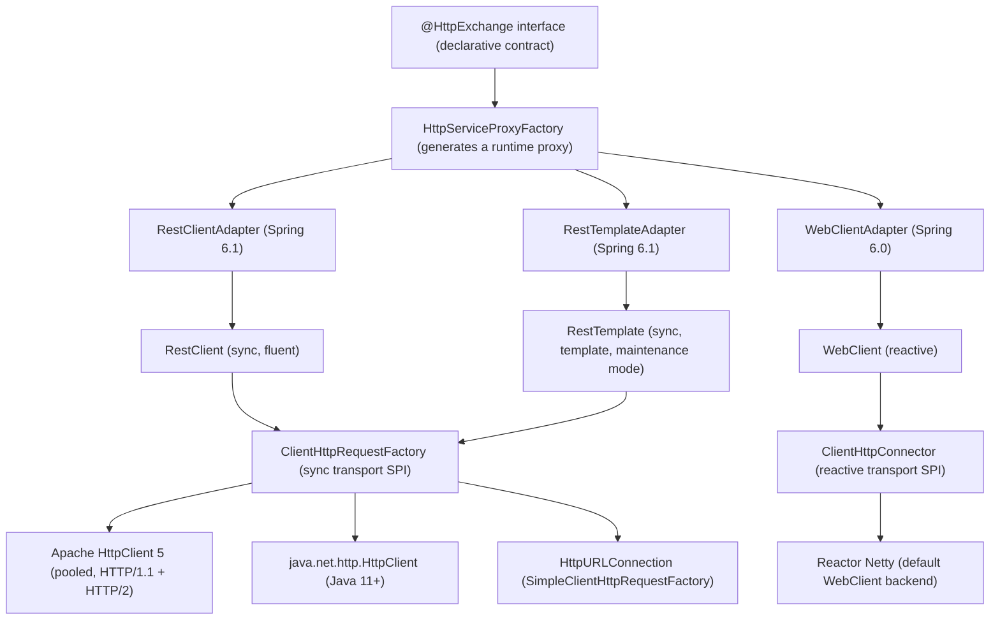
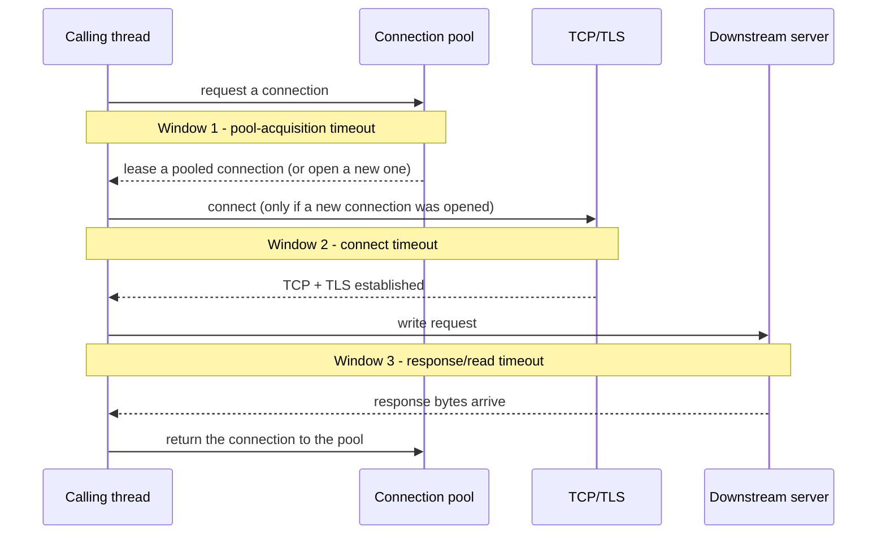
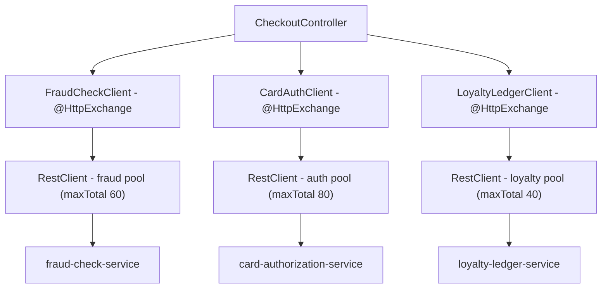

# Spring HTTP Clients — RestTemplate, WebClient, RestClient, and @HttpExchange

---

## 1. Concept Overview

Spring has shipped four generations of HTTP client since 2009, and — unlike most "legacy vs. modern" stories — all four are in active production use today and none has fully retired the others. **`RestTemplate`** (Spring 3) is the original synchronous, template-method-style client; Spring 5 put it into **maintenance mode** the day `WebClient` shipped, meaning it still receives bug and security fixes but no new capability. **`WebClient`** (Spring 5 / WebFlux) is the reactive, non-blocking client backed by Project Reactor and, by default, Reactor Netty; it is usable in any Spring application — including a plain Spring MVC app — by pulling in `spring-webflux` and calling `.block()` at the very boundary of the reactive chain. **`RestClient`** (Spring 6.1, GA in Boot 3.2, November 2023) is the newest synchronous client: a fluent, `WebClient`-styled builder API that — this is the detail interviewers probe for — is **not** built on Reactor at all. It sits on exactly the same blocking transport infrastructure as `RestTemplate` (`ClientHttpRequestFactory`, `ClientHttpRequestInterceptor`), so it is best understood as *RestTemplate's plumbing wearing WebClient's clothes*. **`@HttpExchange`** (Spring 6.0) is a declarative alternative to all three: you write an interface, and `HttpServiceProxyFactory` generates a runtime proxy that dispatches through whichever of the three concrete clients you choose as its adapter.

All four eventually delegate the actual socket work to one of a small number of shared transport implementations: `HttpComponentsClientHttpRequestFactory` (Apache HttpClient 5), `JdkClientHttpRequestFactory` (`java.net.http.HttpClient`, Java 11+), `SimpleClientHttpRequestFactory` (the JDK's original `HttpURLConnection`), or, for `WebClient`, `ReactorClientHttpConnector` (Reactor Netty) with Jetty and JDK reactive alternatives. This module is about that shared plumbing — pooling, timeouts, interceptors, error handling, retries, and testing — as much as it is about the four client APIs themselves, because the plumbing is where production incidents actually happen.

---

## 2. Intuition

**One-line analogy:** `RestTemplate`, `WebClient`, and `RestClient` are three different steering wheels bolted onto a small number of shared engines — learn the engine (connection pooling, timeout budgets) once, and the lesson transfers no matter which wheel a given codebase hands you.

**Mental model:** every outbound HTTP call is a resource-lifecycle problem before it is a networking problem. A connection is a scarce, leasable resource with exactly two valid end states: returned to the pool, or closed. Every production incident in this module's pitfalls is really the same failure shape — a connection (or a thread) was checked out and never came back — wearing a different HTTP client's clothing.

**Why it matters:** a bare `new RestTemplate()` has an infinite connect timeout and an infinite read timeout. A downstream partner that accepts your TCP connection and then simply never writes a response byte will hold the calling thread forever — not for a long time, forever. Multiply that by a Tomcat thread pool of 200 (Spring Boot's default) and one degraded dependency exhausts the entire application's request-handling capacity, including endpoints that never call the slow partner.

**Key insight:** timeouts and pool limits are two *independent* safety nets, not one. A call can have a perfectly-tuned 3-second response timeout and still hang forever if there is no separate timeout on *acquiring a connection from the pool* and every connection in that pool is already checked out. Most "we set a timeout and it still hung" incidents trace back to exactly this gap.

---

## 3. Core Principles

1. **The client class is a facade; the transport factory is where pooling and timeouts actually live.** `RestTemplate.getForObject(...)` and `RestClient.get()...retrieve()` both eventually call into a `ClientHttpRequestFactory` — swap the factory and every pooling/timeout behavior changes without touching a single call site.
2. **An unset timeout is not a sensible default — it is silently infinite.** Every client discussed here defaults to "wait forever" for at least one of connect/read/response unless a factory is explicitly configured.
3. **There are three independent timeout windows per call**, not one: waiting to lease a connection from the pool, waiting for the TCP/TLS handshake, and waiting for response bytes after the request is written. Each fails with a different exception and each must be set explicitly.
4. **Connections are leased, not owned.** A pool's `maxTotal`/`maxPerRoute` (or `maxConnections`) bounds how much concurrency you can sustain against one dependency; too small serializes traffic that should run in parallel, too large lets one degrading dependency consume resources meant for everything else.
5. **Declarative (`@HttpExchange`) and imperative (`RestClient`/`WebClient`) are API-style choices, not performance choices** — both ultimately run through the same transport factories and connectors described above.
6. **Error handling, retries, and circuit breaking are opt-in layers.** Spring's built-in error handler only tells success apart from 4xx/5xx; anything richer is composed on top, typically with Resilience4j (see [Spring Cloud Patterns](../spring_cloud_patterns/README.md)).

---

## 4. Types / Architectures / Strategies

### 4.1 The Four Client APIs

| Client | Style | Blocking? | Since | Status |
|--------|-------|-----------|-------|--------|
| `RestTemplate` | Template methods (`getForObject`, `postForEntity`, `exchange`) | Yes | Spring 3 (2009) | Maintenance mode since Spring 5 — supported, no new features |
| `WebClient` | Reactive fluent (`Mono`/`Flux`) | No (blockable via `.block()`) | Spring 5 / WebFlux (2017) | GA, actively developed |
| `RestClient` | Synchronous fluent, WebClient-styled | Yes | Spring 6.1 / Boot 3.2 GA (Nov 2023) | GA, default recommendation for new blocking code |
| `@HttpExchange` interface | Declarative (Feign-like) | Depends on adapter | Spring 6.0 (2022); sync adapters in 6.1 | GA |

### 4.2 `ClientHttpRequestFactory` Implementations (Synchronous Transport SPI)

| Factory | Backing library | Pooling | HTTP/2 | Used by default when |
|---------|-----------------|---------|--------|----------------------|
| `SimpleClientHttpRequestFactory` | `java.net.HttpURLConnection` | JDK keep-alive cache only (`http.maxConnections`, default 5/destination) | No | `new RestTemplate()` — always, regardless of classpath |
| `JdkClientHttpRequestFactory` | `java.net.http.HttpClient` (Java 11+) | Yes, JDK-managed | Yes | `RestClient.create()` when Apache/Jetty are absent |
| `HttpComponentsClientHttpRequestFactory` | Apache HttpClient 5 | Yes, `PoolingHttpClientConnectionManager` | Yes | First choice when `httpclient5` is on the classpath, for both `RestTemplate` (via Boot's builder) and `RestClient` |
| `JettyClientHttpRequestFactory` | Jetty `HttpClient` | Yes | Yes | When `jetty-client` is on the classpath and preferred |

### 4.3 `ClientHttpConnector` Implementations (Reactive Transport SPI, `WebClient`)

| Connector | Backing library | Default? |
|-----------|-----------------|----------|
| `ReactorClientHttpConnector` | Reactor Netty | Yes — `WebClient.create()`'s implicit default |
| `JettyClientHttpConnector` | Jetty reactive `HttpClient` | No — opt-in |
| `JdkClientHttpConnector` | `java.net.http.HttpClient` adapted reactively | No — opt-in |

### 4.4 `HttpServiceProxyFactory` Adapters (for `@HttpExchange`)

| Adapter | Backs onto | Since | Blocking? |
|---------|-----------|-------|-----------|
| `WebClientAdapter` | `WebClient` | Spring 6.0 | No |
| `RestClientAdapter` | `RestClient` | Spring 6.1 / Boot 3.2 | Yes |
| `RestTemplateAdapter` | `RestTemplate` | Spring 6.1 | Yes |

### 4.5 The Three Timeout Windows

| Window | What it bounds | Apache HttpClient 5 | Reactor Netty (`WebClient`) | JDK `HttpClient` |
|--------|-----------------|---------------------|------------------------------|-------------------|
| Pool acquisition | Waiting for a free pooled connection | `RequestConfig.setConnectionRequestTimeout(Timeout)` | `ConnectionProvider.builder(name).pendingAcquireTimeout(Duration)` (default 45s) | Not exposed — internal pool is not user-tunable |
| Connect | TCP + TLS handshake | `RequestConfig.setConnectTimeout(Timeout)` | `.option(ChannelOption.CONNECT_TIMEOUT_MILLIS, ms)` | `HttpClient.newBuilder().connectTimeout(Duration)` |
| Response / read | Waiting for response bytes after the request is sent | `RequestConfig.setResponseTimeout(Timeout)` | `.responseTimeout(Duration)` on the Reactor Netty `HttpClient` | `HttpRequest.newBuilder().timeout(Duration)` (per-request, covers the whole exchange) |

`SimpleClientHttpRequestFactory` (`HttpURLConnection`) only exposes the first two — `setConnectTimeout`/`setReadTimeout` — and has no pool-acquisition concept at all, because it does not really pool: it relies on the JDK's small built-in keep-alive cache.

---

## 5. Architecture Diagrams

### Where every client actually ends up



`RestClient` and `RestTemplate` converge on the exact same `ClientHttpRequestFactory` box — that shared box, not the fluent API on top of it, is what this module is really about. `WebClient` alone branches off into the separate reactive `ClientHttpConnector` SPI.

### The three timeout windows on a single call



Each window is enforced by a different setting and fails with a different exception (a pool-acquire timeout, `ConnectTimeoutException`, or `SocketTimeoutException`/response-timeout). Setting only two of the three still leaves one path to an indefinite hang.

### Thread-pool occupancy: infinite timeouts vs. a bounded, timed-out pool

```
RestTemplate calling a stalling partner API -- Tomcat pool = 200 worker threads
(each # = 10 busy threads; the bar saturates when it fully fills)

BEFORE -- new RestTemplate(), no timeouts (infinite connect + infinite read)

  t=0s   [##__________________]   20/200 busy   normal traffic
  t=15s  [############________]  120/200 busy   partner goes slow
  t=30s  [####################]  200/200 busy   POOL EXHAUSTED
  t=45s  [####################]  200/200 busy   unrelated endpoints now time out too

AFTER -- pooled factory: connect=2s, response=3s, connection-request=1s

  t=0s   [##__________________]   20/200 busy   normal traffic
  t=15s  [####________________]   40/200 busy   partner goes slow
  t=30s  [##__________________]   20/200 busy   stalled calls fail at 3s, threads freed
  t=45s  [##__________________]   20/200 busy   steady state restored
```

The BEFORE bar never recovers on its own — every thread that touches the slow partner is gone forever, so unrelated endpoints starve too. The AFTER bar recovers every three seconds because a fixed response timeout guarantees the thread returns to the pool whether or not the partner ever answers.

---

## 6. How It Works — Detailed Mechanics

### 6.1 RestTemplate — the default factory, and the infinite-timeout trap

```java
// BROKEN -- looks completely normal in a code review.
@Bean
public RestTemplate restTemplate() {
    return new RestTemplate();
    // Backed by SimpleClientHttpRequestFactory (HttpURLConnection).
    // connectTimeout and readTimeout are both left at -1 (Spring's "unset" sentinel),
    // which means the underlying HttpURLConnection default applies: 0 -- infinite.
    // This is true NO MATTER what else is on the classpath: plain `new RestTemplate()`
    // never auto-detects Apache HttpClient5, even if httpclient5 is a dependency --
    // only Spring Boot's RestTemplateBuilder performs that auto-detection.
}
```

Any call through this bean to a partner that accepts the TCP connection and then never writes a response byte blocks the calling thread forever. See Pitfall 1 and the Case Study for the full production incident this causes.

```java
// FIXED -- explicit pool, explicit triad of timeouts, all three windows bounded.
@Bean
public ClientHttpRequestFactory partnerRequestFactory() {
    PoolingHttpClientConnectionManager connectionManager = new PoolingHttpClientConnectionManager();
    connectionManager.setMaxTotal(100);            // Apache's own default is 25 -- too small for this traffic
    connectionManager.setDefaultMaxPerRoute(20);    // Apache's own default is 5 per route -- also too small

    RequestConfig requestConfig = RequestConfig.custom()
        .setConnectionRequestTimeout(Timeout.ofSeconds(1))   // Window 1: max wait for a pooled connection
        .setConnectTimeout(Timeout.ofSeconds(2))             // Window 2: max wait for TCP+TLS
        .setResponseTimeout(Timeout.ofSeconds(3))            // Window 3: max wait for response bytes
        .build();

    CloseableHttpClient httpClient = HttpClients.custom()
        .setConnectionManager(connectionManager)
        .setDefaultRequestConfig(requestConfig)
        .evictIdleConnections(TimeValue.ofSeconds(30))       // reclaim idle pooled connections
        .build();

    return new HttpComponentsClientHttpRequestFactory(httpClient);
}

@Bean
public RestTemplate restTemplate(ClientHttpRequestFactory partnerRequestFactory) {
    return new RestTemplateBuilder()
        .requestFactory(() -> partnerRequestFactory)
        .build();
}
```

Now a stalled partner fails after 3 seconds with a `ResourceAccessException` wrapping a timeout instead of hanging forever, and the pool caps concurrent in-flight calls to that partner at 100 instead of growing unbounded.

**Put simply.** "The three timeouts are sequential stages of one call, so the number that
actually bounds your latency is their *sum*, not the largest of them." Everyone quotes the 3
second response timeout as 'our timeout'; the real worst case is what the caller upstream will
experience, and the caller does not care which stage the time was spent in.

| Symbol | What it is |
|--------|------------|
| `setConnectionRequestTimeout` | Window 1: waiting for a free pooled connection. `1` s |
| `setConnectTimeout` | Window 2: TCP handshake + TLS. `2` s. Skipped on a pool hit |
| `setResponseTimeout` | Window 3: waiting for response bytes after the request is sent. `3` s |
| worst-case call | `1 + 2 + 3`. All three windows exhausted back to back |
| retries | A multiplier on the whole budget, not an addition to it |

**Walk one example.** The best and worst paths through the same configuration:

```
  path                          w1      w2      w3      total
  ---------------------------  -----   -----   -----   -------
  pool hit, fast partner        0 ms    skip    40 ms     40 ms
  pool hit, stalled partner     0 ms    skip   3000 ms  3,000 ms
  pool empty, cold + stalled   1000 ms 2000 ms 3000 ms  6,000 ms   <- the real bound

  Now wrap it in a retry policy of 3 attempts:
    3 x 6,000 ms = 18,000 ms of caller-visible latency from a "3 second timeout".
```

If the upstream caller's own SLO is 5 seconds, this configuration blows it on a single attempt
before any retry is involved. The rule that falls out: **every timeout budget must be derived
downward from the caller's deadline**, and retries must be counted inside it, not bolted on
after.

**Why Window 1 is the one people forget.** It is the only window that does not exist in the
`SimpleClientHttpRequestFactory` mental model, so it is routinely left at its default —
Reactor Netty's `pendingAcquireTimeout` defaults to a very generous 45 s. Leave it there and a
degrading dependency does not fail fast; it silently parks every caller thread in the pool
queue for three quarters of a minute, which looks like an application hang rather than a
downstream fault.

**Sizing the pool is Little's Law, not a vibe.** `maxTotal` bounds concurrency, and concurrency
is `rate x latency`:

```
  connections_needed  = calls_per_second x seconds_per_call
  sustainable_rate    = pool_size / seconds_per_call

  at a 300 ms partner call:
    200 calls/s needs   200 x 0.300 =  60 connections
    maxTotal      = 100  supports   100 / 0.300 = 333 calls/s
    maxPerRoute   =  20  supports    20 / 0.300 =  66.7 calls/s per route

  So maxTotal is comfortable, but maxPerRoute is the real ceiling for any single
  partner -- and it is the limit that will bite first.
```

Note what happens when the partner degrades from 300 ms to 3 s: required connections jump
tenfold to 600 while the pool is still 100, so the pool saturates, Window 1 starts firing, and
callers see pool-acquisition timeouts rather than the partner's own slowness. That is the
correct behaviour — but it is why `maxPerRoute` must be read alongside the dependency's *worst*
latency, never its median.

**Spring Boot 3.4+ shortcut** for the same intent without hand-building Apache HttpClient types:

```java
@Bean
public RestClient restClient(RestClient.Builder builder) {
    ClientHttpRequestFactorySettings settings = ClientHttpRequestFactorySettings.defaults()
        .withConnectTimeout(Duration.ofSeconds(2))
        .withReadTimeout(Duration.ofSeconds(3));
    ClientHttpRequestFactory factory = ClientHttpRequestFactoryBuilder.httpComponents().build(settings);
    return builder.requestFactory(factory).build();
}
```

`ClientHttpRequestFactoryBuilder.detect()` performs Boot's unified auto-detection (`http-components` > `jetty` > `reactor` > `jdk` > `simple`) instead of pinning a specific library; the same detection order is available declaratively via `spring.http.client.factory=http-components` plus `spring.http.client.connect-timeout`/`read-timeout` properties, with no Java configuration at all.

### 6.2 WebClient — Reactor Netty timeouts and pool, and using it in blocking mode

```java
// reactor.netty.http.client.HttpClient -- NOT java.net.http.HttpClient; the import matters here
import reactor.netty.http.client.HttpClient;

ConnectionProvider provider = ConnectionProvider.builder("partner-pool")
    .maxConnections(50)                              // Reactor Netty's own default is 500 per remote host
    .pendingAcquireTimeout(Duration.ofSeconds(1))     // Window 1 -- default is 45s, usually too generous
    .maxIdleTime(Duration.ofSeconds(30))
    .build();

HttpClient nettyClient = HttpClient.create(provider)
    .option(ChannelOption.CONNECT_TIMEOUT_MILLIS, 2_000)   // Window 2
    .responseTimeout(Duration.ofSeconds(3));               // Window 3

WebClient webClient = WebClient.builder()
    .baseUrl("https://partner.example.com")
    .clientConnector(new ReactorClientHttpConnector(nettyClient))
    .build();

// Reactive usage -- the idiomatic path
Mono<PartnerResponse> reactive = webClient.get().uri("/quote").retrieve().bodyToMono(PartnerResponse.class);

// Blocking usage -- perfectly legal from a Spring MVC controller thread (NOT a WebFlux event-loop thread)
PartnerResponse blocking = webClient.get().uri("/quote").retrieve()
    .bodyToMono(PartnerResponse.class)
    .block(Duration.ofSeconds(5));   // extra safety net at the subscription boundary
```

Calling `.block()` here is safe because a Spring MVC controller method runs on an ordinary Tomcat worker thread, not a Netty event-loop thread — see [Spring WebFlux](../spring_webflux/README.md) for why the same call inside a `@Controller` in a WebFlux application deadlocks.

### 6.3 RestClient — proving it shares RestTemplate's plumbing

```java
// The SAME ClientHttpRequestFactory bean from 6.1, reused verbatim -- not a coincidence.
@Bean
public RestClient restClient(ClientHttpRequestFactory partnerRequestFactory) {
    return RestClient.builder()
        .baseUrl("https://partner.example.com")
        .requestFactory(partnerRequestFactory)
        .build();
}

PartnerResponse quote = restClient.get()
    .uri("/quote")
    .retrieve()
    .body(PartnerResponse.class);
```

Nothing about pooling, timeouts, or the connection manager changed between 6.1 and 6.3 — only the calling syntax did. This is the single most useful fact to internalize about `RestClient`: it is not "`WebClient` made synchronous," it is "`RestTemplate`'s transport wearing a fluent API."

### 6.4 `@HttpExchange` + `HttpServiceProxyFactory`

```java
public interface PartnerQuoteClient {
    @GetExchange("/quote")
    PartnerResponse getQuote(@RequestParam String symbol);

    @PostExchange("/quote/lock")
    LockResult lockQuote(@RequestBody LockRequest request);
}

@Configuration
class PartnerClientConfig {
    @Bean
    PartnerQuoteClient partnerQuoteClient(RestClient.Builder builder,
                                           ClientHttpRequestFactory partnerRequestFactory) {
        RestClient client = builder
            .baseUrl("https://partner.example.com")
            .requestFactory(partnerRequestFactory)
            .build();
        HttpServiceProxyFactory factory = HttpServiceProxyFactory
            .builderFor(RestClientAdapter.create(client))
            .build();
        return factory.createClient(PartnerQuoteClient.class);
    }
}
```

`HttpServiceProxyFactory` inspects the interface's methods and `@GetExchange`/`@PostExchange` metadata once, then hands back a JDK dynamic proxy; calling `getQuote("AAPL")` translates the call into exactly the `RestClient` call from 6.3 underneath. Swap `RestClientAdapter` for `WebClientAdapter` and the identical interface becomes non-blocking with no change to calling code.

### 6.5 Interceptors and filters

```java
// ClientHttpRequestInterceptor -- shared by RestTemplate AND RestClient (same synchronous SPI)
public class CorrelationIdInterceptor implements ClientHttpRequestInterceptor {
    @Override
    public ClientHttpResponse intercept(HttpRequest request, byte[] body,
                                         ClientHttpRequestExecution execution) throws IOException {
        request.getHeaders().add("X-Correlation-Id", MDC.get("correlationId"));
        long start = System.nanoTime();
        try {
            return execution.execute(request, body);   // MUST call through, or nothing is ever sent
        } finally {
            log.debug("{} {} took {}ms", request.getMethod(), request.getURI(),
                Duration.ofNanos(System.nanoTime() - start).toMillis());
        }
    }
}

restClientBuilder.requestInterceptor(new CorrelationIdInterceptor());
restTemplateBuilder.additionalInterceptors(new CorrelationIdInterceptor());
```

```java
// ExchangeFilterFunction -- WebClient's equivalent, reactive instead of imperative
ExchangeFilterFunction correlationId = (request, next) -> {
    ClientRequest mutated = ClientRequest.from(request)
        .header("X-Correlation-Id", MDC.get("correlationId"))
        .build();
    return next.exchange(mutated);
};

WebClient webClient = WebClient.builder().filter(correlationId).build();
```

Both shapes are the Chain of Responsibility pattern (see [Filters and Interceptors](../filters_and_interceptors/README.md)): each interceptor/filter decides whether, and how, to forward to the next link, and every registered one runs in registration order.

### 6.6 Error handling

```java
// RestTemplate's default: DefaultResponseErrorHandler
// hasError() is true for any 4xx or 5xx status.
// 4xx -> HttpClientErrorException (or a status-specific subclass, e.g. HttpClientErrorException.NotFound)
// 5xx -> HttpServerErrorException
// Any other >= 400 that doesn't fit either series -> UnknownHttpStatusCodeException
// The gotcha: by the time you catch HttpClientErrorException, the call has already thrown --
// you read the structured body from the EXCEPTION, not from a normal return value.
try {
    restTemplate.getForObject("/orders/{id}", Order.class, id);
} catch (HttpClientErrorException.NotFound ex) {
    ProblemDetail problem = ex.getResponseBodyAs(ProblemDetail.class);   // still readable off the exception
    throw new OrderNotFoundException(problem.getDetail());
}
```

```java
// RestClient / WebClient's fluent alternative -- onStatus, resolved before the body is consumed
Order order = restClient.get()
    .uri("/orders/{id}", id)
    .retrieve()
    .onStatus(HttpStatusCode::is4xxClientError, (req, resp) -> {
        ProblemDetail problem = new ObjectMapper().readValue(resp.getBody(), ProblemDetail.class);
        throw new OrderNotFoundException(problem.getDetail());
    })
    .body(Order.class);
```

### 6.7 Retries and resilience

Neither `RestTemplate` nor `RestClient` retries anything on its own; wrap the call with Resilience4j (see [Spring Cloud Patterns](../spring_cloud_patterns/README.md)) or Spring Retry:

```java
@Retry(name = "partnerQuote", fallbackMethod = "quoteFallback")
@CircuitBreaker(name = "partnerQuote")
public PartnerResponse getQuoteWithResilience(String symbol) {
    return partnerQuoteClient.getQuote(symbol);   // the @HttpExchange client from 6.4
}
```

Because `HttpServiceProxyFactory` produces an ordinary Spring bean, Resilience4j's method-level annotations apply to `@HttpExchange` clients exactly as they do to any other bean — the same ergonomics OpenFeign clients have long offered, without adding OpenFeign as a dependency. `WebClient` additionally has a native reactive retry operator, `.retryWhen(Retry.backoff(...))`, covered in depth in [Spring WebFlux](../spring_webflux/README.md).

### 6.8 Testing

```java
// MockRestServiceServer -- intercepts at the ClientHttpRequestFactory boundary, no real socket
RestTemplate restTemplate = new RestTemplate();
MockRestServiceServer server = MockRestServiceServer.bindTo(restTemplate).build();

server.expect(requestTo("/orders/42"))
    .andExpect(method(HttpMethod.GET))
    .andRespond(withSuccess("{\"id\":42,\"status\":\"NEW\"}", MediaType.APPLICATION_JSON));

Order order = restTemplate.getForObject("/orders/42", Order.class);
server.verify();   // fails the test if any expectation was never matched
```

```java
// MockRestServiceServer also binds directly to a RestClient.Builder (Spring 6.1)
RestClient.Builder builder = RestClient.builder();
MockRestServiceServer server = MockRestServiceServer.bindTo(builder).build();
RestClient restClient = builder.build();
```

```java
// MockWebServer (OkHttp) -- a REAL embedded HTTP server; works identically for
// WebClient, RestClient, and @HttpExchange because it tests the wire, not the client class
MockWebServer mockServer = new MockWebServer();
mockServer.enqueue(new MockResponse()
    .setResponseCode(200)
    .setBody("{\"id\":42,\"status\":\"NEW\"}")
    .addHeader("Content-Type", "application/json"));
mockServer.start();

WebClient webClient = WebClient.create(mockServer.url("/").toString());
Order order = webClient.get().uri("/orders/42").retrieve().bodyToMono(Order.class).block();

RecordedRequest recorded = mockServer.takeRequest();
assertThat(recorded.getPath()).isEqualTo("/orders/42");   // assert on the OUTGOING request too
mockServer.shutdown();
```

`MockRestServiceServer` is the right tool when the code under test is expressed as `RestTemplate`/`RestClient` calls and you want to assert on requests without opening a socket. `MockWebServer` is the right tool when you want a real transport round-trip — including the underlying HTTP/2 negotiation, headers, and timeouts — or when the code under test is a `WebClient`/`@HttpExchange` client and you also want to assert on exactly what was sent over the wire.

### 6.9 Concrete numbers

| Fact | Value |
|------|-------|
| `SimpleClientHttpRequestFactory` default connect/read timeout | 0 (infinite) — unset unless configured |
| JDK `HttpURLConnection` keep-alive cache size | `http.maxConnections` system property, default 5 idle connections per destination |
| Apache HttpClient 5 `PoolingHttpClientConnectionManager` default | 25 max total connections, 5 max per route |
| Reactor Netty default `ConnectionProvider` (WebClient's implicit default) | "fixed" pool, 500 max active channels per remote host, 1000 max pending acquisitions, 45s `pendingAcquireTimeout` |
| `new RestTemplate()` factory selection | Always `SimpleClientHttpRequestFactory` — no classpath auto-detection at the Framework level |
| `RestClient.create()` factory selection (Framework level) | Apache HttpClient 5 > Jetty > JDK `HttpClient` > Simple |
| Spring Boot unified auto-detection order (`ClientHttpRequestFactoryBuilder.detect()`) | `http-components` > `jetty` > `reactor` > `jdk` > `simple` |
| Tomcat default worker thread pool | 200 |

---

## 7. Real-World Examples

**Netflix Feign and its Spring lineage.** Feign originated at Netflix as a declarative HTTP client generator and was later open-sourced and adopted by Spring Cloud as OpenFeign (see [Spring Cloud Patterns](../spring_cloud_patterns/README.md)). `@HttpExchange` is Spring's own, dependency-light answer to the same idea: define an interface, get a working client, without adding a third-party annotation processor.

**Stripe's official API clients build retry and idempotency into the transport layer, not the caller.** Stripe's Java, Python, and Ruby SDKs implement automatic retry with backoff inside the HTTP client itself and attach an `Idempotency-Key` header to POST requests, so a retried request cannot double-charge a card. This is exactly the discipline this module's Pitfall 5 requires teams to bolt on by hand around `RestClient`/`@HttpExchange` calls that lack it.

**A payments platform migrating off `new RestTemplate()` bean-per-service-call.** A mid-size payments company found 40+ `@Bean RestTemplate` definitions across microservices, most constructed with zero arguments. A production incident traced to one partner integration timing out for 90 seconds during a partner-side deploy caused Tomcat thread exhaustion in three unrelated services that happened to share the same base image and default configuration. The fix was a shared `ClientHttpRequestFactory`-producing library module (pooled, 2s/3s/1s timeout triad) that every team's `RestTemplateBuilder`/`RestClient.Builder` pulled in, turning a per-team footgun into a platform default.

**A checkout aggregator using `WebClient` from a Spring MVC application deliberately.** An e-commerce checkout service is a conventional servlet-stack (Spring MVC) application, but its checkout endpoint fans out to four downstream services concurrently. Rather than adopting WebFlux end-to-end, the team injected a single `WebClient` bean, issued the four calls as `Mono`s, combined them with `Mono.zip(...)`, and called `.block()` once at the controller boundary — a safe pattern because the controller thread is an ordinary Tomcat worker thread, not a Netty event loop.

---

## 8. Tradeoffs

### Client comparison

| Dimension | `RestTemplate` | `WebClient` | `RestClient` | `@HttpExchange` |
|-----------|---------------|-------------|--------------|------------------|
| Blocking | Yes | No (blockable) | Yes | Depends on adapter |
| API style | Template methods | Reactive fluent | Sync fluent | Declarative interface |
| New-project recommendation | No — maintenance mode | Only if reactive/streaming is needed | Yes, default for blocking code | Yes, for typed/testable contracts |
| Learning curve | Low | High (Reactor operators) | Low (familiar to `WebClient` users) | Low, but limited to fixed method shapes |
| Dependency footprint | `spring-web` only | `spring-webflux` (+ Reactor Netty) | `spring-web` only | Same as whichever adapter backs it |

### Transport factory / connector comparison

| Dimension | Simple (`HttpURLConnection`) | JDK `HttpClient` | Apache HttpClient 5 | Reactor Netty |
|-----------|------------------------------|-------------------|----------------------|----------------|
| Real connection pooling | No (JDK keep-alive cache only) | Yes | Yes, highly tunable | Yes, highly tunable |
| HTTP/2 | No | Yes | Yes | Yes |
| Pool-acquisition timeout exposed | No | No | Yes | Yes |
| Typical use | Zero-dependency fallback only | Modern JDK-only stack | High-throughput synchronous services | Any `WebClient` usage |

### Testing tool comparison

| Tool | Real socket? | Best for |
|------|--------------|----------|
| `MockRestServiceServer` | No — intercepts at `ClientHttpRequestFactory` | Unit-testing `RestTemplate`/`RestClient` call sites in isolation |
| OkHttp `MockWebServer` | Yes — real embedded HTTP server | Testing wire-level behavior (headers, HTTP/2, timeouts) across any client, including `WebClient`/`@HttpExchange` |
| WireMock | Yes — real embedded HTTP server | Contract-style testing with richer stub matching/scenario support (see [Spring Cloud Patterns](../spring_cloud_patterns/README.md)) |

---

## 9. When to Use / When NOT to Use

**Use `RestTemplate` when:**
- The codebase already has extensive `RestTemplate` usage and there is no reactive or fluent-API need driving a rewrite.
- A dependency or house library only exposes a `RestTemplate`-based integration point.

**Do NOT use `RestTemplate` when:**
- Starting new code on Spring 6.1+/Boot 3.2+ — use `RestClient` instead; `RestTemplate` receives no new capabilities.

**Use `WebClient` when:**
- The application is already on WebFlux, or the call site needs genuine reactive composition (concurrent fan-out via `Mono.zip`, backpressure, streaming).
- You need Server-Sent Events or another streaming response shape.
- A conventional MVC app needs to fan out to several downstream calls concurrently and is willing to `.block()` once at the controller boundary rather than adopt reactive programming throughout.

**Do NOT use `WebClient` when:**
- The only motivation is "it's newer" — adding Reactor as a dependency purely to call `.block()` immediately adds complexity `RestClient` does not have.

**Use `RestClient` when:**
- Writing new synchronous, blocking Spring code on 6.1+/Boot 3.2+ — this is the default recommendation today.

**Use `@HttpExchange` when:**
- You want a typed, mockable, Feign-like client contract without adding OpenFeign, and the call shapes (paths, params, bodies) are fixed and known at compile time.

**Do NOT use `@HttpExchange` when:**
- The request needs to be assembled dynamically at runtime (conditional query parameters, dynamically-chosen headers per call) — plain fluent `RestClient`/`WebClient` code is more flexible than a fixed interface method signature.

---

## 10. Common Pitfalls

### Pitfall 1: Default (infinite) timeouts on a shared singleton client

See Section 6.1 for the full broken/fixed pair. The short version: `new RestTemplate()` (or an unconfigured client falling back to `SimpleClientHttpRequestFactory`-equivalent behavior) has no read/connect timeout, so a single degraded dependency exhausts the calling application's finite thread pool. Always pair a real pool with an explicit connect/response/pool-acquisition timeout triad before a client bean reaches production.

### Pitfall 2: Setting connect and read timeouts, but forgetting the pool-acquisition timeout

**Broken:**
```java
RequestConfig requestConfig = RequestConfig.custom()
    .setConnectTimeout(Timeout.ofSeconds(2))
    .setResponseTimeout(Timeout.ofSeconds(3))
    // connectionRequestTimeout left unset -- defaults to an indefinite wait for a free connection
    .build();
```
With `maxPerRoute` at Apache's default of 5, the sixth concurrent caller to the same host waits for a pooled connection to free up — and if all 5 in-flight calls are themselves stuck (each individually bounded to 3 seconds, but constantly replaced by new incoming requests), the sixth caller can wait far longer than any single call's own timeout suggests, because nothing bounds *the wait for a slot*.

**Fixed:**
```java
RequestConfig requestConfig = RequestConfig.custom()
    .setConnectionRequestTimeout(Timeout.ofSeconds(1))   // the forgotten third window
    .setConnectTimeout(Timeout.ofSeconds(2))
    .setResponseTimeout(Timeout.ofSeconds(3))
    .build();
```
Now a caller that cannot get a pooled connection within 1 second fails fast with a clear pool-exhaustion signal instead of silently queuing.

### Pitfall 3: Building a new client (or connection manager) per request

**Broken:**
```java
@Service
public class PricingService {
    public PriceQuote getQuote(String symbol) {
        // BUG: a brand-new pool and a brand-new HttpClient are created on every call.
        // Pooling across calls is impossible -- every call pays a full TCP+TLS handshake,
        // and the previous PoolingHttpClientConnectionManager is never closed, leaking sockets.
        RestClient client = RestClient.builder()
            .requestFactory(new HttpComponentsClientHttpRequestFactory(HttpClients.createDefault()))
            .build();
        return client.get().uri("https://partner.example.com/quote/" + symbol)
            .retrieve().body(PriceQuote.class);
    }
}
```

**Fixed:**
```java
@Service
public class PricingService {
    private final RestClient partnerClient;   // constructed once, injected

    public PricingService(RestClient partnerClient) {
        this.partnerClient = partnerClient;
    }

    public PriceQuote getQuote(String symbol) {
        return partnerClient.get().uri("/quote/{symbol}", symbol).retrieve().body(PriceQuote.class);
    }
}
```
See [Networking & HTTP Client (Java)](../../java/networking_and_http_client/README.md) for the same defect one layer down the stack, with the plain JDK `HttpClient`.

### Pitfall 4: Calling `.block()` on a Netty event-loop thread

Calling `.block()` inside a WebFlux `@Controller` (or any code running on a Netty event-loop thread) deadlocks the loop, because the thread waiting on `.block()` is the very thread the inner `Mono` needs in order to complete. This is safe from a Spring MVC controller thread (an ordinary platform thread) and unsafe from a WebFlux handler. Full mechanics and the broken/fixed pair live in [Spring WebFlux](../spring_webflux/README.md) — do not add a `.block()` call inside reactive code in this module's client beans.

### Pitfall 5: Blind retries around a non-idempotent write

**Broken:**
```java
@Retry(name = "orderCreate")
public OrderConfirmation createOrder(OrderRequest request) {
    return orderClient.create(request);   // an @HttpExchange POST -- retried blindly on any failure
}
```
If the first attempt reached the server and created the order, but the response was lost to a network blip, Resilience4j's retry has no way to know that and will create a second order.

**Fixed:** generate an idempotency key per logical operation and have the retried call carry the same key so the server can deduplicate — the full pattern (including the server-side dedup table) is covered in [Spring Cloud Patterns](../spring_cloud_patterns/README.md).
```java
@Retry(name = "orderCreate")
public OrderConfirmation createOrder(OrderRequest request, String idempotencyKey) {
    return orderClient.create(idempotencyKey, request);   // same key on every retry attempt
}
```

### Pitfall 6: Losing the structured error body to the default error handler

**Broken:**
```java
try {
    restTemplate.postForObject("/orders", request, OrderConfirmation.class);
} catch (HttpClientErrorException ex) {
    // BUG: the ProblemDetail/JSON error body the server sent is discarded;
    // only a generic "409 Conflict" message reaches the caller.
    throw new OrderCreationException("Order creation failed");
}
```

**Fixed:**
```java
try {
    restTemplate.postForObject("/orders", request, OrderConfirmation.class);
} catch (HttpClientErrorException ex) {
    ProblemDetail problem = ex.getResponseBodyAs(ProblemDetail.class);   // the body IS still there
    throw new OrderCreationException(problem != null ? problem.getDetail() : ex.getMessage());
}
```
See [Spring HATEOAS & REST Maturity](../spring_hateoas_rest_maturity/README.md) for the full `ProblemDetail` (RFC 7807) contract this pattern assumes on the server side.

---

## 11. Technologies & Tools

| Technology | Role |
|------------|------|
| `RestTemplate` | Synchronous template-style HTTP client; maintenance mode |
| `WebClient` | Reactive, non-blocking HTTP client (Reactor `Mono`/`Flux`) |
| `RestClient` | Synchronous fluent HTTP client (Spring 6.1) |
| `@HttpExchange` + `HttpServiceProxyFactory` | Declarative HTTP client interfaces |
| `HttpComponentsClientHttpRequestFactory` | Apache HttpClient 5-backed synchronous transport |
| `JdkClientHttpRequestFactory` / `JdkClientHttpConnector` | `java.net.http.HttpClient`-backed transport (sync/reactive) |
| `SimpleClientHttpRequestFactory` | `HttpURLConnection`-backed fallback transport |
| `ReactorClientHttpConnector` | Reactor Netty-backed reactive transport (WebClient default) |
| `ClientHttpRequestFactoryBuilder` / `ClientHttpRequestFactorySettings` | Spring Boot 3.4+ unified factory-building/timeout API |
| `PoolingHttpClientConnectionManager` | Apache HttpClient 5's connection pool |
| `ConnectionProvider` | Reactor Netty's connection pool |
| `ClientHttpRequestInterceptor` | Synchronous interceptor SPI (`RestTemplate`/`RestClient`) |
| `ExchangeFilterFunction` | Reactive filter SPI (`WebClient`) |
| Resilience4j (`@Retry`, `@CircuitBreaker`) | Retry/circuit-breaking layered on any of the four clients |
| `MockRestServiceServer` | Test double intercepting at the `ClientHttpRequestFactory` boundary |
| OkHttp `MockWebServer` | Embedded real HTTP server for wire-level client tests |
| WireMock | Contract-style HTTP stubbing with richer scenario support |
| Micrometer | HTTP client call metrics/observability |

---

## 12. Interview Questions with Answers

**Q: Why does a bare `new RestTemplate()` hang forever when a downstream service accepts the connection but never sends a response?**
Its default `SimpleClientHttpRequestFactory` leaves both connect and read timeouts unset, and an unset timeout defaults to infinite rather than to any safe fallback. The underlying `HttpURLConnection` has no timeout unless one is explicitly configured with `setConnectTimeout`/`setReadTimeout`, so a partner that accepts the TCP handshake and then never writes a byte holds the calling thread indefinitely. In a servlet application this is fatal at scale: every thread that calls the flaky partner is gone forever, and Tomcat's finite worker pool (200 by default) eventually has none left for unrelated endpoints. Always construct `RestTemplate` (or any client) through a factory with explicit, finite timeouts before it reaches production.

**Q: Is `RestClient` just `WebClient` with a hidden `.block()` call built in?**
No — `RestClient` is built on `RestTemplate`'s synchronous `ClientHttpRequestFactory`/`ClientHttpRequestInterceptor` infrastructure, not on Reactor at all. It shares the exact same transport factories (`HttpComponentsClientHttpRequestFactory`, `JdkClientHttpRequestFactory`, `SimpleClientHttpRequestFactory`) that `RestTemplate` uses, and its type signatures contain no `Mono`/`Flux` anywhere. The only thing `RestClient` borrows from `WebClient` is its fluent builder style, not its reactive engine. Pick `RestClient` for ordinary blocking servlet code and reserve `WebClient` for genuinely reactive or streaming needs.

**Q: What is the difference between a connect timeout, a response (read) timeout, and a connection-request (pool-acquisition) timeout?**
They bound three separate waits inside a single HTTP call: time to lease a connection out of the pool, time for the TCP/TLS handshake, and time waiting for response bytes once the request has been sent. Apache HttpClient 5 exposes all three explicitly (`setConnectionRequestTimeout`, `setConnectTimeout`, `setResponseTimeout`); the JDK's plain `HttpURLConnection` only exposes the last two, because it has no real configurable pool to wait on. A caller that sets only connect and read timeouts is still exposed to an indefinite hang if every pooled connection is checked out and nothing bounds the wait for a free one.

**Q: Does `new RestTemplate()` automatically start using Apache HttpClient 5 just because it is on the application's classpath?**
No — at the Spring Framework level, `new RestTemplate()` always constructs a `SimpleClientHttpRequestFactory` regardless of what HTTP client libraries are present on the classpath. Only Spring Boot's `RestTemplateBuilder` (and, unified since Boot 3.4, `ClientHttpRequestFactoryBuilder.detect()`) performs classpath auto-detection, preferring Apache HttpClient 5, then Jetty, then the JDK `HttpClient`, and falling back to `Simple` last. A team that assumes "Apache HttpClient 5 is a dependency, so pooling must already be happening" for a hand-constructed `RestTemplate` bean is walking straight into the infinite-timeout trap.

**Q: `RestTemplate` is described as being in "maintenance mode" — what does that actually mean in practice?**
It means `RestTemplate` keeps receiving bug fixes and security patches, but gains no new capability at all. Features added to `RestClient`/`WebClient` after Spring 5 either never reach it or arrive only as a compatibility shim, such as the `RestTemplateAdapter` bridge for `@HttpExchange`. It is not deprecated and existing code is not at risk of removal. The practical guidance is one-directional: keep existing `RestTemplate` code running, but write new synchronous call sites with `RestClient` instead.

**Q: Why is it safe to call `.block()` on a `WebClient` `Mono` from a Spring MVC controller but unsafe from a WebFlux controller?**
A Spring MVC controller method runs on an ordinary Tomcat platform thread, so blocking it while the reactive chain completes on Reactor Netty's own event-loop threads costs one thread and nothing else. Inside a WebFlux handler, the calling thread often *is* one of Netty's small, fixed set of event-loop threads, and if that same thread calls `.block()` on a `Mono` that itself needs an event-loop thread to complete, the two become deadlocked against each other. The rule of thumb: `.block()` is fine at a genuine thread boundary (an MVC controller, a `main` method, a test) and never fine inside code already running inside the reactive pipeline.

**Q: What happens when a Resilience4j `@Retry` wraps a `RestClient`/`@HttpExchange` call that performs a non-idempotent POST?**
The retry mechanism blindly re-executes the method on any matching failure with no knowledge of whether the first attempt's request actually reached the server before the failure occurred. If the original POST created a resource (an order, a payment) and only the response was lost — a common outcome of a network blip or a load-balancer timeout — the retried call creates a second one, a duplicate side effect rather than a safe do-over. The fix is to generate an idempotency key per logical operation and have every retry attempt send the same key so the server can deduplicate, never to retry a non-idempotent write with no key at all.

**Q: What does `DefaultResponseErrorHandler` treat as an "error", and what exception types does it throw?**
Any response with a 4xx or 5xx status code is classified as an error. 4xx becomes an `HttpClientErrorException` (or a status-specific subclass, such as `HttpClientErrorException.NotFound`), 5xx becomes an `HttpServerErrorException`, and a status Spring cannot classify into either series throws `UnknownHttpStatusCodeException`. The gotcha is that by the time you can inspect the response, `retrieve()`/`getForObject()` has already thrown — the structured error body (a `ProblemDetail`, a JSON error payload) is read off the caught exception via `getResponseBodyAs(...)`, not off a normal return value. `RestClient` and `WebClient` offer the same distinction through the fluent `.onStatus(predicate, handler)` API instead of a checked/unchecked exception hierarchy.

**Q: How does `@HttpExchange` combined with `HttpServiceProxyFactory` actually produce a working client at runtime?**
`HttpServiceProxyFactory` reads the `@GetExchange`/`@PostExchange` (and related) annotations on an interface's methods once at startup and generates a JDK dynamic proxy implementing that interface. Each proxied method invocation is translated into a call against whichever adapter (`RestClientAdapter`, `WebClientAdapter`, `RestTemplateAdapter`) the factory was built with, which in turn issues the equivalent fluent call against the underlying `RestClient`/`WebClient`/`RestTemplate`. Because the proxy is just another Spring bean, ordinary Spring AOP — including Resilience4j's method-level annotations — applies to it exactly as it would to any hand-written service class.

**Q: What is the practical difference between `RestClientAdapter`, `WebClientAdapter`, and `RestTemplateAdapter`?**
They determine which concrete client executes an `@HttpExchange` interface's calls, and therefore whether those calls block. `WebClientAdapter` (Spring 6.0) is reactive and never blocks the calling thread, while `RestClientAdapter` and `RestTemplateAdapter` (both Spring 6.1) are synchronous and block the caller until the response arrives. Swapping the adapter passed to `HttpServiceProxyFactory.builderFor(...)` changes this behavior without touching the annotated interface at all. Choose `RestClientAdapter` for new blocking code, `WebClientAdapter` for reactive stacks, and `RestTemplateAdapter` only when a legacy `RestTemplate` bean (with its own interceptors/factory) must stay the transport of record.

**Q: How do you decide concrete `maxTotal`/`maxPerRoute` (or `maxConnections`) values for a downstream dependency's connection pool?**
Size the pool from the dependency's observed p99 latency and the caller's required throughput. A pool needs at least `throughput (req/s) x p99 latency (s)` connections in flight to avoid queuing, with headroom for latency spikes. Apache HttpClient 5's own defaults — 25 total, 5 per route — are safe starting points for low-volume integrations but are routinely too small for a single high-traffic partner and need to be raised explicitly, as in Section 6.1's 100/20 example. Oversizing carries its own risk (see the pool-size question below); undersizing manifests as pool-acquisition timeouts and artificially serialized traffic that should run in parallel.

**Q: What happens when Apache HttpClient 5's connection pool is exhausted and no `connectionRequestTimeout` has been set?**
Every additional caller past the pool's `maxPerRoute` limit queues indefinitely waiting for a connection to free up, because the default behavior with no `connectionRequestTimeout` configured is to wait without a bound. If the connections currently checked out are themselves stuck (slow or hung responses), new callers pile up behind them with no visible error until the surrounding application's own thread pool or request timeout intervenes at a much coarser, later layer. Setting an explicit, short `connectionRequestTimeout` turns a silent, cascading queue into a fast, attributable failure.

**Q: How do you unit-test code that calls `RestTemplate` or `RestClient` without hitting the network?**
Bind a `MockRestServiceServer` to the `RestTemplate` instance (or a `RestClient.Builder`) and register expectations before exercising the code under test. Use `MockRestServiceServer.bindTo(...).build()`, then `.expect(requestTo(...)).andRespond(withSuccess(...))` to stub each expected call. `MockRestServiceServer` intercepts calls at the `ClientHttpRequestFactory` boundary, so no real socket is opened and no test port is needed. Call `.verify()` at the end of the test to fail it if any registered expectation was never actually invoked.

**Q: When would you reach for OkHttp's `MockWebServer` instead of `MockRestServiceServer`?**
`MockWebServer` starts a real embedded HTTP server on a local port, exercising the actual wire protocol instead of intercepting calls in-process. Real sockets, real headers, and real HTTP/2 negotiation are all exercised, unlike `MockRestServiceServer`, which intercepts calls before they ever leave the client object. Use it when the client under test is `WebClient` or an `@HttpExchange` interface, or whenever the test needs to assert on exactly what was sent over the wire via `mockServer.takeRequest()`. `MockRestServiceServer` remains the simpler choice for `RestTemplate`/`RestClient` unit tests that only care about request/response content, not transport-level behavior.

**Q: How would you attach a correlation ID to every outbound `RestClient` call without repeating the header logic at every call site?**
Register a single `ClientHttpRequestInterceptor` on the `RestClient.Builder` via `.requestInterceptor(...)` and add the header there, once. The interceptor reads the current correlation ID (from MDC or a request-scoped bean) and adds it as a header before calling `execution.execute(request, body)` to continue the chain. Every call issued through that builder's resulting `RestClient` picks up the header automatically, and the same interceptor class works unmodified on a `RestTemplate` via `.additionalInterceptors(...)`, since both share the identical `ClientHttpRequestInterceptor` SPI. `WebClient` needs the reactive equivalent, `ExchangeFilterFunction`, because it does not share `RestTemplate`'s synchronous interceptor chain.

**Q: How does `WebClient`'s reactive `.retryWhen(Retry.backoff(...))` differ from wrapping a `RestClient` call in Resilience4j's `@Retry`?**
`.retryWhen` is a reactive operator that re-subscribes to the upstream `Mono`/`Flux` on a matching error signal, composing naturally with the rest of the reactive chain without leaving the reactive world. Resilience4j's `@Retry` is a Spring AOP proxy wrapping an ordinary (blocking) method call, re-invoking the entire method body on failure, and works for `RestClient`, `RestTemplate`, or `@HttpExchange`-backed methods precisely because none of them are reactive types. Functionally both achieve retry-with-backoff, but mixing the two idioms on the same call — retrying a blocking call from inside a reactive pipeline — reintroduces the same blocking-on-the-event-loop risk this module warns about elsewhere.

**Q: What is the tradeoff between choosing `JdkClientHttpRequestFactory` (`java.net.http`) and `HttpComponentsClientHttpRequestFactory` (Apache HttpClient 5)?**
`JdkClientHttpRequestFactory` needs no extra dependency, since it is part of the JDK from Java 11 onward. It gives you HTTP/2 and a managed pool with less code, at the cost of fewer tunable knobs — notably, no exposed pool-acquisition timeout. Apache HttpClient 5 requires an explicit dependency but exposes fine-grained pool sizing (`maxTotal`/`maxPerRoute`) and all three timeout windows, which matters once a single dependency needs deliberate isolation from the rest of the application's outbound traffic. Choose the JDK client for a lean dependency footprint on straightforward integrations, and Apache HttpClient 5 once per-dependency pool isolation or every timeout window configurable becomes a requirement.

**Q: Why might increasing a connection pool's `maxTotal`/`maxConnections` make an ongoing incident worse instead of better?**
A larger pool lets more concurrent requests reach an already-struggling downstream dependency, which can push its latency up further or tip it into outright failure. The caller's pool limit was incidentally acting as a crude concurrency cap protecting the dependency, and removing that cap removes the protection along with the queuing. This is the same failure mode a bulkhead is designed to prevent deliberately (see [Spring Cloud Patterns](../spring_cloud_patterns/README.md)): concurrency limits contain a struggling dependency's blast radius, they do not merely throttle the caller. The safer response to pool-exhaustion symptoms during an incident is usually a circuit breaker opening to shed load, not a larger pool feeding more load into a system that is already failing.

**Q: How do you decide between `@HttpExchange` and Spring Cloud OpenFeign for a declarative HTTP client?**
`@HttpExchange` ships in Spring Framework itself, with no additional dependency required. It backs onto `RestClient`/`WebClient`/`RestTemplate` directly, while OpenFeign is a separate Spring Cloud project with its own annotation set, its own error-decoding SPI, and first-class integration with Eureka/LoadBalancer service discovery. Teams already on Spring Cloud for service discovery and client-side load balancing typically keep OpenFeign for consistency with that ecosystem; teams that only need a typed HTTP client contract, with no discovery and no load balancer integration, get the same declarative ergonomics from `@HttpExchange` with one fewer dependency. Both support Resilience4j annotations identically, since both ultimately produce ordinary Spring beans.

**Q: Why does `SimpleClientHttpRequestFactory` have no pool-acquisition timeout to configure at all?**
It does not implement real, application-managed pooling in the first place. Instead it relies on the JDK's own built-in keep-alive connection cache (`http.maxConnections`, default 5 idle connections per destination), which is a JVM-wide system property, not a per-factory, Spring-configurable pool. Once that small cache is full, `HttpURLConnection` simply opens a fresh, non-reused connection rather than making the caller wait for one to free up, which avoids an indefinite pool-acquisition hang but trades it for unbounded raw socket/file-descriptor growth under sustained concurrent load. This is one more reason `SimpleClientHttpRequestFactory` is treated as a bare fallback rather than a production transport for any service with meaningful outbound HTTP volume.

---

## 13. Best Practices

1. **Never ship a client bean built with a zero-argument constructor.** `new RestTemplate()`, `WebClient.create()`, and `RestClient.create()` are fine for prototypes and tests; production beans need an explicit, pooled `ClientHttpRequestFactory`/`ClientHttpConnector` with all applicable timeouts set.
2. **Set all three timeout windows, not just two.** Pool-acquisition, connect, and response timeouts each fail differently; skipping the pool-acquisition timeout leaves an indefinite-hang path open even when the other two are tuned.
3. **Size pools from measured latency and throughput, not defaults.** Apache HttpClient 5's 25/5 defaults and Reactor Netty's 500-per-host default are starting points, not sizing decisions — compute from `throughput x p99 latency` plus headroom.
4. **Reuse one client/factory instance per downstream dependency.** Construct `RestTemplate`/`RestClient`/`WebClient` (and their backing factories) once as singleton beans; constructing them per-request defeats pooling and leaks sockets.
5. **Prefer `RestClient` for new blocking code and reserve `WebClient` for genuine reactive/streaming needs.** Do not adopt WebFlux end-to-end merely to get a nicer fluent API.
6. **Never call `.block()` from inside reactive code running on an event-loop thread.** It is only safe at a true thread boundary — an MVC controller, `main()`, or a test.
7. **Treat retries and idempotency keys as a pair, never one without the other.** A retry annotation with no idempotency key on a non-idempotent write is a data-integrity bug waiting to happen.
8. **Read the structured error body off the exception (or `.onStatus()` handler), not just the status code.** `ProblemDetail`/JSON error payloads are still available after `DefaultResponseErrorHandler` throws — do not discard them for a generic message.
9. **Centralize cross-cutting concerns (auth headers, correlation IDs, logging) in one interceptor/filter, not at every call site.** `ClientHttpRequestInterceptor` (sync) and `ExchangeFilterFunction` (reactive) exist exactly for this.
10. **Pick the test tool that matches the assertion you need.** `MockRestServiceServer` for request/response content on `RestTemplate`/`RestClient`; `MockWebServer`/WireMock when the wire protocol itself, or a `WebClient`/`@HttpExchange` client, is under test.
11. **During an incident, reach for a circuit breaker before a bigger pool.** A pool limit is often an accidental concurrency cap protecting a struggling dependency; raising it can make things worse, not better.

---

## 14. Case Study

### Migrating a checkout aggregator from ad hoc RestTemplate calls to pooled RestClient + @HttpExchange

**Context.** A checkout service calls three partner integrations synchronously on every order: a fraud-check service, a card-network authorization service, and a loyalty-points ledger. All three were originally called through hand-constructed `new RestTemplate()` instances scattered across three different `@Service` classes, none configured with timeouts. Traffic peaks at **1,200 checkout requests/second**; the application runs on Tomcat with the default **200-thread** pool.

**The incident.** During a routine deploy, the card-network authorization partner's load balancer briefly (roughly 90 seconds) accepted connections but stopped responding to any of them. Because the authorization `RestTemplate` had no read timeout, every checkout request touching it blocked indefinitely. Within 40 seconds, all 200 Tomcat threads were parked waiting on the authorization call, and the fraud-check and loyalty endpoints — which had nothing to do with the incident — began returning 503s because no worker thread was ever free to accept their requests either.

**Goals for the redesign:**
- Bound every downstream call with an explicit connect/response/pool-acquisition timeout triad.
- Isolate each partner's connection pool so one partner's degradation cannot starve the others.
- Move to typed, testable client contracts.

**Architecture:**



Each partner gets its own `PoolingHttpClientConnectionManager` and its own `RestClient` bean — a stuck authorization pool can no longer touch the fraud or loyalty pools' capacity at all.

**Key implementation:**

```java
@Configuration
class PartnerClientConfig {

    @Bean
    ClientHttpRequestFactory cardAuthRequestFactory() {
        PoolingHttpClientConnectionManager cm = new PoolingHttpClientConnectionManager();
        cm.setMaxTotal(80);
        cm.setDefaultMaxPerRoute(80);   // single-route pool: total == per-route is intentional here

        RequestConfig requestConfig = RequestConfig.custom()
            .setConnectionRequestTimeout(Timeout.ofMilliseconds(500))
            .setConnectTimeout(Timeout.ofSeconds(1))
            .setResponseTimeout(Timeout.ofSeconds(2))
            .build();

        CloseableHttpClient httpClient = HttpClients.custom()
            .setConnectionManager(cm)
            .setDefaultRequestConfig(requestConfig)
            .evictIdleConnections(TimeValue.ofSeconds(30))
            .build();

        return new HttpComponentsClientHttpRequestFactory(httpClient);
    }

    @Bean
    CardAuthClient cardAuthClient(RestClient.Builder builder, ClientHttpRequestFactory cardAuthRequestFactory) {
        RestClient client = builder
            .baseUrl("https://card-auth.internal")
            .requestFactory(cardAuthRequestFactory)
            .build();
        HttpServiceProxyFactory factory = HttpServiceProxyFactory
            .builderFor(RestClientAdapter.create(client))
            .build();
        return factory.createClient(CardAuthClient.class);
    }
}

public interface CardAuthClient {
    @PostExchange("/authorize")
    AuthorizationResult authorize(@RequestBody AuthorizationRequest request);
}
```

```java
@Service
public class CheckoutService {

    private final CardAuthClient cardAuthClient;

    @CircuitBreaker(name = "cardAuth", fallbackMethod = "authFallback")
    @Retry(name = "cardAuth")
    public AuthorizationResult authorize(AuthorizationRequest request) {
        return cardAuthClient.authorize(request);   // 2s response timeout, 80-connection isolated pool
    }

    private AuthorizationResult authFallback(AuthorizationRequest request, Exception ex) {
        return AuthorizationResult.declinedPendingRetry(request.orderId());
    }
}
```

**Results:**

| Metric | Before (shared, unbounded `RestTemplate`) | After (per-partner pooled `RestClient`) |
|--------|---------------------------------------------|-------------------------------------------|
| Connect/response timeout | None (infinite) | 1s / 2s per partner |
| Pool isolation | None — single default `HttpURLConnection` | One dedicated pool per partner |
| Partner-outage blast radius | Entire service — fraud and loyalty stalled alongside the failing partner | Isolated to the degraded partner only |
| Time to first failed call surfacing | Indefinite hang | 2s response timeout; circuit breaker opens after 5 failures |
| p99 checkout latency during partner slowness | Unbounded during the outage | 185ms steady-state, 2.1s during degradation (bounded) |

**Key lessons:**
- Per-partner pool isolation, not just timeouts, was what stopped the fraud and loyalty endpoints from going down alongside the actual failing partner — a single shared client bean makes every downstream dependency's worst day the whole application's worst day.
- The `@HttpExchange` interfaces made each partner integration mockable in unit tests (`MockRestServiceServer.bindTo(builder)`) without needing to also stand up the shared `RestClient` plumbing in every test class.
- The circuit breaker on top of the now-finite retry/timeout stack meant the 90-second partner outage surfaced as a fast, visible, alertable open-circuit failure instead of a silent, unbounded hang.

---

## Related / See Also

- [Spring WebFlux and Project Reactor](../spring_webflux/README.md) — `WebClient`'s reactive engine, `.block()` deadlock mechanics, Reactor Netty internals in depth
- [Spring HATEOAS & REST Maturity](../spring_hateoas_rest_maturity/README.md) — `ProblemDetail` (RFC 7807) error contracts and the hypermedia-consuming angle of `RestClient`/`@HttpExchange`
- [Spring Cloud Patterns](../spring_cloud_patterns/README.md) — Resilience4j retry/circuit-breaker/bulkhead, OpenFeign, and idempotency-key patterns layered on top of these clients
- [Networking & HTTP Client (Java)](../../java/networking_and_http_client/README.md) — the plain JDK `HttpClient`/NIO/connection-pooling fundamentals underneath every Spring HTTP client
