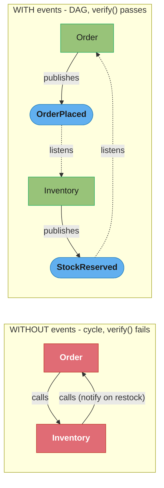

# Spring Modulith (Modular Monolith)

> How Spring Modulith lets you build a *modular monolith*: enforce module boundaries
> at the package level, verify them with ArchUnit, decouple modules through
> application events instead of direct calls, test one module in isolation, and
> generate living documentation. Spring Modulith 1.x / Spring Boot 3.1+.

---

## 1. Concept Overview

The "monolith vs microservices" dichotomy is a false one. The real failure mode of
monoliths is not that they are one deployable — it is that they become a *big ball of
mud*: every class can reach every other class, so boundaries erode, change ripples
everywhere, and you cannot reason about a part in isolation. Microservices fix this by
turning module boundaries into *network boundaries* — but you pay distributed-systems
tax (latency, partial failure, eventual consistency, ops) for it.

Spring Modulith offers the middle path: a **modular monolith** — one deployable, but
with *enforced* internal module boundaries. A module is (by default) a direct
sub-package of your application's main package; its public API is the types in that
package, and everything in nested sub-packages is *internal* and may not be accessed
from other modules. Modulith provides:

- **Verification** — a test (`ApplicationModules.verify()`, built on ArchUnit) that
  *fails the build* if one module reaches into another's internals or if there is a
  cyclic dependency.
- **Event-based decoupling** — modules communicate via Spring `ApplicationEvent`s and
  `@ApplicationModuleListener` rather than calling each other's beans, so dependencies
  point "inward" to published events, not to implementation.
- **Module integration testing** — spin up one module in isolation
  (`@ApplicationModuleTest`) with its collaborators stubbed.
- **Documentation** — generate C4/PlantUML component diagrams and a module canvas from
  the actual code structure.
- **An event publication registry** — persist published events so a crash does not
  lose an in-flight event (the transactional-outbox idea, in-process).

The strategic value: you get most of microservices' modularity discipline with none of
the network cost, *and* a clean seam to extract a true microservice later if a module
genuinely needs independent scaling.

---

## 2. Intuition

**One-line analogy.** Spring Modulith is interior walls in an open-plan house: it is
still one building (one deploy), but rooms have doors (public APIs) and you cannot
walk through walls (internals). Microservices would be separate buildings connected by
roads (the network).

**Mental model.** Think of each module as a tiny service that happens to run
in-process: it has a published API (the package's public types), private internals
(sub-packages), and an "API" of events it emits. Modulith's verifier is the compiler
for those architectural rules — it makes "module A must not touch module B's guts" a
*build error*, not a code-review hope.

**Why it matters.** "Monolith vs microservices" is a classic senior interview prompt.
The strong answer is "modularize first; distribute only when a module's scaling or
team-ownership needs justify the network tax" — and Modulith is the concrete tool that
makes the modular-monolith stage enforceable rather than aspirational.

**Key insight.** Boundaries that are not *enforced* decay. A naming convention or a
wiki page does not stop a developer from `@Autowiring` another module's internal
repository under deadline pressure. Modulith turns the boundary into a failing test —
that mechanical enforcement is the whole point.

---

## 3. Core Principles

1. **Modules are packages.** By default each direct sub-package of the main
   application package is an application module; its base package is the public API,
   nested packages are internal.

2. **Internals are hidden.** Types in a module's sub-packages may not be referenced
   from other modules; only the module's API package is accessible. This is verified,
   not merely documented.

3. **No cycles.** Module dependencies must form a DAG; a cyclic dependency between
   modules fails verification. Cycles are the death of modularity.

4. **Prefer events over direct calls.** Modules publish domain events; other modules
   listen. This inverts the dependency (publisher does not know its consumers) and
   keeps the graph acyclic.

5. **Verification is a test.** Architecture rules are asserted in a normal test
   (`ApplicationModules.verify()`), so violations break CI like any other failing test.

6. **Reliable events when needed.** The event publication registry persists events
   transactionally so an in-process listener failure or crash does not silently drop
   the event — the same durability discipline as a transactional outbox.

---

## 4. Types / Architectures / Strategies

### Defining module boundaries

| Style | How | When |
|-------|-----|------|
| **Convention (default)** | Each direct sub-package = a module; nested packages internal | Most apps; zero config |
| **Explicit (`@ApplicationModule`)** | `package-info.java` annotated with display name, allowed dependencies, named interfaces | When you need to declare/limit dependencies or expose >1 API package |
| **Named interfaces** | `@NamedInterface` on a sub-package | Expose a second public surface beyond the base package |

### Inter-module communication choices

| Mechanism | Coupling | Consistency | Use when |
|-----------|----------|-------------|----------|
| Direct bean call (allowed dep) | Tight, synchronous | Strong (same TX) | Module truly depends on another's API and needs the result now |
| `ApplicationEvent` + `@EventListener` | Loose, synchronous | Same TX (runs in publisher's TX) | Decouple but stay transactional |
| `@ApplicationModuleListener` (async, after-commit, transactional) | Loosest | Eventual | Side effects that should run after the publisher commits |

### Testing strategies

- **`@ApplicationModuleTest`** — bootstraps just the module under test (plus declared
  dependencies), so a test is fast and scoped.
- **Scenario API** — `Scenario` drives event-based flows: publish an event, await the
  resulting event/state.

---

## 5. Architecture Diagrams

### Three topologies on a modularity ↔ distribution axis

```
  big ball of mud        modular monolith            microservices
  (no boundaries)        (Spring Modulith)           (network boundaries)

  +-----------+          +---+ +---+ +---+            [svc] [svc] [svc]
  | A B C D E |          | A | | B | | C |             |     |     |
  | all wired |          +-^-+ +-^-+ +-^-+            net   net   net
  | together  |            |     |     |               \    |    /
  +-----------+          one deploy, walls enforced      message bus
   change ripples         change is local              + distributed tax
   everywhere             (verified, in-process)        (latency, failure)
```

Modulith sits in the middle: the *internal* discipline of microservices without the
*external* network cost. You move right only when a module's scaling/ownership earns it.

### Dependency inversion via events keeps the graph acyclic



Both modules depend only on *event types*, not on each other's beans, so the module
dependency graph stays a DAG and `verify()` passes.

### Module structure: API package public, sub-packages internal

```
  com.shop.order                <- module "order"; PUBLIC API (OrderService, Order)
  com.shop.order.internal       <- INTERNAL; other modules MUST NOT reference these
  com.shop.inventory            <- module "inventory"; PUBLIC API
  com.shop.inventory.internal   <- INTERNAL

  order.internal -> order            ok (same module)
  inventory      -> order            ok (allowed dependency on public API)
  inventory      -> order.internal   VIOLATION -> ApplicationModules.verify() fails
```

The package nesting *is* the access-control rule; Modulith's verifier enforces it.

---

## 6. How It Works — Detailed Mechanics

### 6.1 Verifying the module structure

The cornerstone is a single test that fails the build on any boundary violation or
cycle:

```java
class ModularityTests {
    ApplicationModules modules = ApplicationModules.of(ShopApplication.class);

    @Test
    void verifiesModularStructure() {
        modules.verify();        // fails on internal access or cyclic dependency
    }

    @Test
    void writesDocumentation() {
        new Documenter(modules)
            .writeModulesAsPlantUml()       // C4 component diagram
            .writeIndividualModulesAsPlantUml()
            .writeModuleCanvases();         // per-module API/events/deps canvas
    }
}
```

`ApplicationModules.of(...)` derives the module model from the package structure;
`verify()` runs ArchUnit rules under the hood.

### 6.2 Declaring an explicit module API and allowed dependencies

```java
// com/shop/inventory/package-info.java
@ApplicationModule(
    displayName = "Inventory",
    allowedDependencies = { "order" }   // inventory may depend ONLY on the order module
)
package com.shop.inventory;

import org.springframework.modulith.ApplicationModule;
```

With `allowedDependencies` declared, a reference to *any other* module also fails
verification — you whitelist the graph explicitly.

### 6.3 Event-based decoupling

The publisher emits a domain event; it knows nothing about consumers:

```java
// in module "order"
@Service
class OrderService {
    private final ApplicationEventPublisher events;
    OrderService(ApplicationEventPublisher events) { this.events = events; }

    @Transactional
    public void place(Order order) {
        // ... persist order ...
        events.publishEvent(new OrderPlaced(order.id()));   // OrderPlaced is order's PUBLIC event
    }
}

// in module "inventory" — depends on the EVENT type, not on OrderService
@Component
class InventoryListener {
    @ApplicationModuleListener                 // async + after-commit + transactional
    void on(OrderPlaced event) {
        // reserve stock for event.orderId()
    }
}
```

`@ApplicationModuleListener` is the important one: it is shorthand for
`@TransactionalEventListener(phase = AFTER_COMMIT)` + `@Async` + `@Transactional`, so
the listener runs *after* the publisher's transaction commits, asynchronously, in its
own transaction. That gives loose, eventually-consistent coupling.

### 6.4 The event publication registry (reliable in-process events)

A plain after-commit async listener can be lost if the app crashes between commit and
listener execution. The event publication registry fixes this:

```java
// build.gradle: spring-modulith-starter-jpa (or jdbc/mongodb)
// Modulith persists each published event + intended listener in an
// EVENT_PUBLICATION table within the publisher's transaction, and marks it
// completed when the listener succeeds. Incomplete publications are
// re-submitted on restart -> at-least-once in-process delivery.
```

This is the transactional-outbox pattern applied *inside* the monolith: the event row
commits with the business data, and recovery replays unfinished events. (See
[../../java/microservices_patterns/](../../java/microservices_patterns/) for the cross-
service outbox.)

### 6.5 Isolated module testing

```java
@ApplicationModuleTest                 // bootstraps ONLY the inventory module
class InventoryModuleTests {

    @Test
    void reservesStockOnOrderPlaced(Scenario scenario) {
        scenario.publish(new OrderPlaced("order-7"))     // simulate the inbound event
                .andWaitForStateChange(() -> stock.reservedFor("order-7"))
                .andVerify(reserved -> assertThat(reserved).isTrue());
    }
}
```

The module boots without the rest of the app; the `Scenario` API drives the
event-in → state-change-out flow that defines the module's behavior.

---

## 7. Real-World Examples

- **Spring Modulith itself (2022→1.0 GA 2023)** — emerged from the Spring team
  (Oliver Drotbohm) and the "moduliths" community project, codifying years of
  "modular monolith" advocacy into tooling.
- **Domain-Driven Design bounded contexts** — Modulith modules map naturally onto DDD
  bounded contexts; teams use it to keep contexts from leaking into one another inside
  a single deployable.
- **Monolith-first / strangler readiness** — companies that deliberately start with a
  modular monolith (per Fowler's "MonolithFirst") use Modulith so that *if* a module
  later needs to become a microservice, its boundary and event contracts already exist
  — a clean extraction seam.
- **Event publication registry in production** — used to get reliable in-process event
  handling (e.g. "send welcome email after user registers") without standing up Kafka,
  with crash-recovery via the persisted publication table.
- **Architecture documentation in CI** — teams generate PlantUML module diagrams on
  every build so the docs never drift from the code.

---

## 8. Tradeoffs

| Dimension | Modular monolith (Modulith) | Microservices | Unstructured monolith |
|-----------|------------------------------|---------------|------------------------|
| Deployment | One unit | Many units | One unit |
| Boundary enforcement | Build-time verified | Network-enforced | None |
| Latency between modules | In-process (ns) | Network (ms) | In-process |
| Failure model | Shared fate | Partial failure | Shared fate |
| Operational complexity | Low | High | Low |
| Independent scaling | No (whole app) | Yes (per service) | No |
| Refactor across boundary | Easy (one codebase) | Hard (contracts/versioning) | Easy but uncontrolled |
| Team autonomy | Moderate | High | Low |

| Communication | Pros | Cons |
|---------------|------|------|
| Direct call (allowed dep) | Simple, strong consistency | Tighter coupling; risk of cycles |
| `@ApplicationModuleListener` | Loose, decoupled, durable (with registry) | Eventual consistency; ordering/async complexity |

---

## 9. When to Use / When NOT to Use

**Use Spring Modulith when** you are building or refactoring a monolith and want
enforced internal boundaries — to prevent the big-ball-of-mud, to map DDD bounded
contexts, or to set up clean seams so future microservice extraction is cheap. It is
ideal for small-to-medium teams who need modularity discipline but cannot justify
distributed-systems overhead, and for "monolith-first" strategies.

**Avoid it (or go straight to microservices) when** modules genuinely need
*independent deployment, scaling, or technology stacks*, or when separate teams must
release on independent cadences — those are real reasons to pay the network tax. Avoid
adding Modulith to a tiny app with no meaningful module structure (overhead with no
benefit), and recognize it does not give you independent scaling or fault isolation —
a memory leak in one module still takes down the whole process.

**Rule of thumb:** modularize with Modulith first; distribute a module into a service
only when its scaling/ownership needs *demand* it. Modularity is a prerequisite for
clean microservices anyway, so this order is rarely wasted work.

---

## 10. Common Pitfalls

1. **Treating boundaries as advisory.** Skipping the `ApplicationModules.verify()`
   test means nothing actually stops cross-module internal access — the boundaries
   decay exactly as in a plain monolith. *Fix:* make `verify()` a mandatory CI test.

2. **Cyclic module dependencies.** Two modules calling each other's services creates a
   cycle that fails verification (and is a design smell). *Fix:* invert one direction
   with an event so the dependency points one way.

3. **Leaking internals as the public API.** Putting everything in the module's base
   package exposes implementation as API. *Fix:* keep only the intended API in the
   base package; push implementation into `internal` sub-packages.

4. **Losing events on crash.** Relying on a plain async after-commit listener without
   the event publication registry means a crash between commit and listener loses the
   event. *Fix:* enable a Modulith persistence starter so publications are durable and
   replayed. *War story:* a "send invoice email after payment" listener silently
   dropped emails on the rare pod restart until the registry was enabled.

5. **Expecting fault isolation.** Assuming module boundaries give microservice-style
   isolation — they do not; it is one process with shared fate. *Fix:* if you need
   isolation/independent scaling, that module is a candidate for real extraction.

6. **Synchronous event listeners blocking the publisher.** A `@EventListener` (not
   `@ApplicationModuleListener`) runs in the publisher's thread and transaction, so a
   slow listener slows the publisher and a listener failure rolls back the publisher.
   *Fix:* use `@ApplicationModuleListener` for after-commit async side effects.

7. **Ignoring the generated docs.** Generating module diagrams once and never wiring
   it into the build lets architecture docs drift. *Fix:* run `Documenter` in the
   verification test so diagrams regenerate every build.

---

## 11. Technologies & Tools

| Concern | Tools |
|---------|-------|
| Core | `spring-modulith-core`, `ApplicationModules`, `@ApplicationModule`, `@NamedInterface` |
| Verification | ArchUnit (under the hood), `ApplicationModules.verify()` |
| Events | `@ApplicationModuleListener`, `ApplicationEventPublisher`, Spring events |
| Reliable events | `spring-modulith-events-jpa` / `-jdbc` / `-mongodb`, event publication registry; `-kafka`/`-amqp` externalization |
| Testing | `spring-modulith-starter-test`, `@ApplicationModuleTest`, `Scenario` |
| Documentation | `Documenter` (PlantUML/C4, module canvas), `spring-modulith-docs` |
| Observability | `spring-modulith-observability` (per-module spans/metrics) |
| Related | ArchUnit (standalone), jMolecules (DDD annotations), Spring Events module |

---

## 12. Interview Questions with Answers

**Q: What problem does Spring Modulith solve, and where does a modular monolith sit between a plain monolith and microservices?**
It solves boundary erosion: in a plain monolith every class can reach every other, so
modules decay into a big ball of mud. Microservices fix this by making boundaries
network boundaries — at the cost of latency, partial failure, and operational
overhead. A modular monolith (what Modulith enables) keeps one deployable but
*enforces* internal module boundaries via build-time verification and event-based
decoupling. So it gives microservices' internal discipline without the distributed-
systems tax, and a clean seam to extract a real service later if needed.

**Q: How does Spring Modulith define a module and its public API?**
By package convention: each direct sub-package of the application's main package is an
application module, the types in that base package are its public API, and types in
nested sub-packages (e.g. `internal`) are module-private and may not be referenced from
other modules. You can override this with `@ApplicationModule` on a `package-info.java`
to set a display name, declare allowed dependencies, or expose additional public
surfaces via `@NamedInterface`. The package structure literally is the access-control
boundary.

**Q: How are module boundaries actually enforced?**
Through a test: `ApplicationModules.of(App.class).verify()`, which builds a module
model from the package structure and runs ArchUnit rules that fail if one module
references another's internal (non-API) types or if there is a cyclic dependency
between modules. Because it is an ordinary test, a violation breaks CI like any other
failing test. This mechanical enforcement is the key value — unenforced boundaries
(conventions, wikis) inevitably decay under deadline pressure.

**Q: Why are cyclic dependencies between modules disallowed?**
Because a cycle means two modules cannot be understood, tested, changed, or extracted
independently — they are effectively one tangled unit, which defeats modularity.
Modulith's `verify()` fails on cycles. The standard fix is dependency inversion via
events: instead of A calling B and B calling A, one module publishes a domain event
and the other listens, so both depend only on the event type and the graph becomes a
DAG.

**Q: What is `@ApplicationModuleListener` and how does it differ from `@EventListener`?**
`@ApplicationModuleListener` is a composed annotation equivalent to
`@TransactionalEventListener(phase = AFTER_COMMIT)` + `@Async` + `@Transactional`: the
listener runs asynchronously, only after the publishing transaction commits, and in
its own transaction. A plain `@EventListener` runs synchronously in the publisher's
thread and transaction, so it blocks the publisher and a failure rolls the publisher
back. Use `@ApplicationModuleListener` for decoupled, eventually-consistent side
effects between modules; use `@EventListener` only when you genuinely want synchronous,
same-transaction handling.

**Q: What is the event publication registry and what problem does it solve?**
It is Modulith's durability mechanism: when you add a persistence starter
(`spring-modulith-events-jpa`/`-jdbc`/`-mongodb`), each published event and its
intended listener are written to an event-publication table *within the publisher's
transaction*, then marked complete when the listener succeeds; incomplete publications
are re-submitted on application restart. This prevents the loss of an after-commit
async event if the app crashes between commit and listener execution — it is the
transactional-outbox pattern applied in-process, giving at-least-once delivery to
in-process listeners.

**Q: How do you test a single module in isolation?**
Use `@ApplicationModuleTest`, which bootstraps only the module under test (and its
declared dependencies) rather than the whole application, making tests fast and
scoped. Combined with the `Scenario` API you can drive event-based behavior: publish an
inbound event, await a resulting state change or outbound event, and assert on it. This
verifies a module's contract (events in → effects out) without standing up unrelated
modules.

**Q: When should you turn a Modulith module into a real microservice?**
Only when the module has a concrete need that justifies the network tax: independent
deployment cadence, independent scaling (a hot path that must scale separately),
independent technology stack, or separate team ownership requiring autonomous releases.
If none of those apply, keeping it as an in-process module is cheaper and simpler.
Because Modulith already gives the module a clean boundary and event contracts,
extraction later is far easier — modularize first, distribute on demand.

**Q: What are the limits of a modular monolith — what does it NOT give you?**
It does not give independent deployment, independent scaling, fault isolation, or
technology heterogeneity. It is one process with shared fate: an OOM, a crash, or a
runaway thread in one module takes the whole app down, and you scale the entire
deployable, not a single module. Modulith gives *structural* modularity (boundaries,
decoupling, testability, docs) but not *operational* independence — those require true
service extraction.

**Q: How does Modulith relate to ArchUnit?**
Modulith's verification is built on ArchUnit: `verify()` translates the module model
(derived from package structure and `@ApplicationModule` metadata) into ArchUnit rules
about allowed package access and acyclic dependencies, then executes them. You can also
use ArchUnit directly for finer-grained custom rules. Modulith is essentially a
higher-level, module-aware layer over ArchUnit's general architecture-testing engine.

**Q: How does Modulith generate documentation, and why is that valuable?**
The `Documenter` API produces PlantUML/C4 component diagrams (whole-system and
per-module) and a "module canvas" listing each module's API, published/consumed events,
and dependencies — derived directly from the code. Running it inside the verification
test means the docs regenerate on every build and therefore never drift from reality,
solving the perennial problem of architecture diagrams that are stale the day after
they are drawn.

**Q: How do events help keep the module dependency graph acyclic?**
Direct calls create dependencies in the direction of the call, so two-way interaction
produces a cycle. Events invert the consumer's dependency: the publisher emits an event
without knowing who consumes it (it depends only on the event type it owns), and
consumers depend on that event type rather than on the publisher's beans. So a
would-be back-edge (B notifying A) becomes "A listens to an event B publishes," and the
module graph stays a DAG that passes verification.

**Q: Can a module expose more than one public API package?**
Yes — by default only the module's base package is the public API, but you can mark
additional sub-packages with `@NamedInterface` to expose them as named public surfaces
that other modules are allowed to depend on. This lets you, for example, separate a
module's "spi" (for extensions) from its main API while still keeping the rest of its
internals hidden. Everything not in the base package or a named interface remains
module-private.

**Q: How does Modulith fit a strangler-fig or monolith-first migration strategy?**
A modular monolith is the ideal starting point and the ideal extraction source: you
build with enforced module boundaries and event contracts from day one, so each module
is already a candidate bounded context. When a module needs to become a service, its
API and the events it publishes/consumes are already defined, so you can replace the
in-process event transport with a real broker (Modulith even supports event
externalization to Kafka/AMQP) and extract the module behind its existing contract —
far less risky than carving boundaries out of a tangled monolith.

**Q: What is event externalization in Spring Modulith?**
It is the ability to publish selected application events not just in-process but also to
an external broker (Kafka, AMQP/RabbitMQ) via `@Externalized`, so an in-process module
event can simultaneously become a message other systems consume. This is the bridge
between the modular-monolith stage and the distributed stage: you can start with
in-process events, then externalize the ones a future microservice will need, easing
extraction without rewriting the publishing code.

**Q: Does the event publication registry guarantee exactly-once handling?**
No — it guarantees at-least-once in-process delivery: events are persisted with the
transaction and incomplete ones are replayed on restart, but a crash after a listener's
side effect but before the publication is marked complete will cause the listener to run
again on recovery. As with any at-least-once system, the listener must therefore be
idempotent. The registry solves *lost* events, not *duplicate* handling — idempotency
is still your responsibility, exactly as with a cross-service outbox.

---

## 13. Best Practices

- **Make `ApplicationModules.verify()` a required CI test** — boundaries are only real
  if a build fails on violation.
- **Keep the API surface minimal**: only intended types in the base package,
  implementation in `internal` sub-packages.
- **Default to events (`@ApplicationModuleListener`)** for cross-module side effects;
  reserve direct calls for genuine, declared dependencies.
- **Enable the event publication registry** whenever a lost in-process event would be a
  bug; make listeners idempotent.
- **Declare `allowedDependencies`** on important modules to whitelist the graph
  explicitly and catch unintended coupling.
- **Generate docs in the verification test** so module diagrams never drift.
- **Modularize first, distribute on demand** — extract a module to a service only when
  scaling/ownership requires it; use event externalization to ease that path.
- **Map modules to DDD bounded contexts** for boundaries that match the business.

---

## 14. Case Study

### Taming a checkout monolith with enforced modules and durable events

**Problem.** A mid-size commerce app was a single Spring Boot monolith where `order`,
`inventory`, `payment`, and `notification` logic were freely intertwined: services
`@Autowired` each other's repositories, a "send confirmation email" call sat inline in
the order-placement transaction, and every change risked breaking something unrelated.
The team wanted microservice-like modularity but had neither the ops maturity nor the
scaling need to actually distribute. They adopted Spring Modulith (Boot 3.2).

**Requirements.**
- Stop cross-module access to internals; make violations fail the build.
- Decouple order placement from inventory reservation and email sending.
- Never lose a confirmation email on a pod restart.
- Keep a clean seam in case `payment` later needs to become its own service.

**Design.**

1. **Package-aligned modules** with internals hidden: `com.shop.order` (API) +
   `com.shop.order.internal`, same for `inventory`, `payment`, `notification`. A
   `ModularityTests.verify()` test runs in CI.

2. **Events replace direct calls.** `OrderService.place` publishes `OrderPlaced`;
   `inventory` and `notification` listen via `@ApplicationModuleListener` (after-commit,
   async), so order placement no longer depends on those modules' beans.

3. **Durable events.** `spring-modulith-events-jpa` persists publications in the order
   transaction; unfinished ones replay on restart. Listeners made idempotent.

4. **Living docs.** `Documenter` runs in the verify test, emitting PlantUML component
   diagrams each build.

**Broken → fixed (the inline email in the order transaction + internal coupling):**

```java
// BROKEN: notification reached into order internals AND email sent inline in the
// order transaction -> a slow/failing SMTP call rolled back the *order*, and a
// pod restart between commit and a later async send dropped the email.
@Service
class OrderService {
    @Autowired EmailRepository emailRepo;          // <- notification.internal! (coupling)
    @Transactional
    void place(Order o) {
        orderRepo.save(o);
        emailService.sendConfirmation(o);          // <- inline; SMTP failure rolls back order
    }
}

// FIXED: publish an event; notification listens after commit, durably, idempotently.
@Service
class OrderService {
    private final ApplicationEventPublisher events;
    @Transactional
    void place(Order o) {
        orderRepo.save(o);
        events.publishEvent(new OrderPlaced(o.id()));   // order depends on nobody
    }
}
@Component
class ConfirmationEmailListener {
    @ApplicationModuleListener                          // after-commit, async, own TX
    void on(OrderPlaced e) { emailService.sendConfirmation(e.orderId()); }  // idempotent
}
// + spring-modulith-events-jpa => the publication survives a restart and is replayed.
```

**Outcomes (measured).**
- The `verify()` test immediately flagged **9** cross-module internal accesses and **1**
  `order`↔`notification` cycle on first run; all were refactored to events or declared
  dependencies, and the test now gates every PR.
- Order-placement latency dropped because email/SMTP work moved out of the order
  transaction to an after-commit async listener; a failing SMTP server no longer rolls
  back orders.
- Confirmation emails lost on pod restarts (a recurring support complaint) went to
  **zero** after enabling the event publication registry — unfinished sends replay on
  startup.
- When `payment` later needed independent scaling for a promo event, its already-clean
  boundary and externalized events let it be extracted to a service in days, not weeks —
  the modular-first investment paid off.

**Tradeoffs accepted.** Inter-module flows became eventually consistent (an order is
placed before its email/stock side effects complete), requiring idempotent listeners
and some "pending" UI states. The team judged that acceptable — and far cheaper than
the distributed-systems overhead microservices would have imposed before they actually
needed it.

---

## See Also

- [spring_events_and_scheduling](../spring_events_and_scheduling/README.md) —
  `ApplicationEvent`, `@TransactionalEventListener`, the event machinery Modulith builds
  on.
- [spring_integration](../spring_integration/README.md) — EIP-based integration when
  flows cross protocols/systems rather than in-process modules.
- [SOLID Principles](../../lld/solid_principles/README.md) — dependency inversion and
  separation of concerns, the design principles Modulith enforces mechanically.
- [../../java/microservices_patterns/](../../java/microservices_patterns/) — the
  transactional-outbox and saga patterns Modulith's event registry mirrors in-process.
- [Microservices Fundamentals](../../backend/microservices_fundamentals/README.md) —
  the network-boundary tradeoffs Modulith lets you defer until a module truly needs
  independent deployment or scaling.
