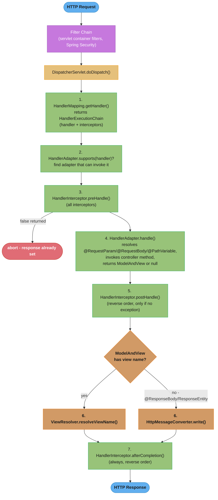
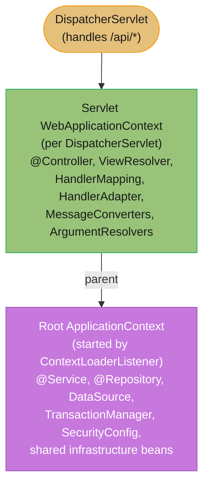
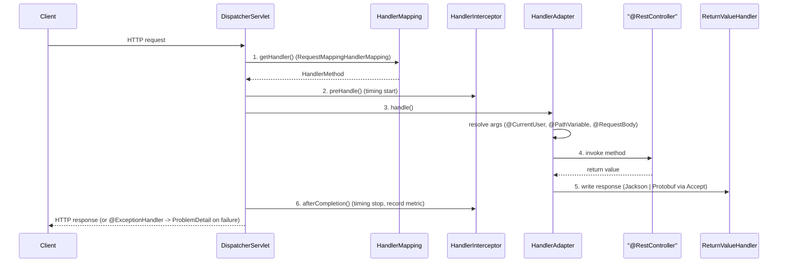

# Spring MVC Architecture

## 1. Concept Overview

Spring MVC is a web framework built on the Front Controller pattern. A single `DispatcherServlet` receives all HTTP requests, delegates to the appropriate handler (controller method), and renders the response. Every request flows through a well-defined pipeline: handler mapping → handler adapter → handler execution → view resolution (or direct response body writing). Understanding this pipeline is essential for debugging request failures, adding cross-cutting behavior, and tuning performance.

---

## 2. Intuition

Think of `DispatcherServlet` as an airport dispatcher. Every flight (HTTP request) arrives at the main terminal (servlet). The dispatcher checks which gate (handler mapping) the flight belongs to, assigns a ground crew (handler adapter) to handle it, and after the crew finishes (controller method runs), the dispatcher routes the plane to the correct exit (view resolver or message converter). If anything goes wrong, there is an emergency coordinator (`@ExceptionHandler` / `@ControllerAdvice`).

**One-line analogy:** `DispatcherServlet` is the orchestrator of the entire request-response cycle — every other Spring MVC component is a plugin it calls at the right moment.

**Key insight:** Spring MVC is synchronous and thread-per-request by default. Each request occupies a Tomcat thread (default max 200) for the duration. For high-concurrency I/O-bound applications, WebFlux (reactive) is the alternative.

---

## 3. Core Principles

1. **Front Controller pattern:** One servlet handles all requests; specialized components are delegated to.
2. **Convention over configuration:** `@RequestMapping` on a `@Controller` class registers it as a handler automatically.
3. **Separation of concerns:** Handler mapping, adapting, executing, and view rendering are separate, replaceable components.
4. **HTTP message converters:** Serialization/deserialization between Java objects and HTTP body bytes is handled by pluggable `HttpMessageConverter`s.
5. **Context hierarchy:** In classic Spring MVC, `DispatcherServlet` has its own child `WebApplicationContext` (MVC beans) with the root context as parent (service/repository beans). Spring Boot uses a single merged context.

---

## 4. Types / Architectures / Strategies

### Key Components

| Component | Interface | Role |
|-----------|-----------|------|
| `DispatcherServlet` | `HttpServlet` | Front controller; orchestrates the pipeline |
| Handler Mapping | `HandlerMapping` | Maps request to handler (method) |
| Handler Adapter | `HandlerAdapter` | Invokes the handler; resolves method arguments |
| Handler Interceptor | `HandlerInterceptor` | Pre/post processing within servlet |
| View Resolver | `ViewResolver` | Resolves logical view name to `View` object |
| Message Converter | `HttpMessageConverter` | Serializes/deserializes request/response bodies |
| Exception Resolver | `HandlerExceptionResolver` | Maps exceptions to error responses |

### Handler Mappings (in priority order)

| Handler Mapping | What It Handles |
|----------------|----------------|
| `RequestMappingHandlerMapping` | `@RequestMapping` annotated methods (most common) |
| `BeanNameUrlHandlerMapping` | Maps URL to bean name |
| `SimpleUrlHandlerMapping` | Static URL-to-handler mapping |
| `RouterFunctionMapping` | WebFlux functional routing (reactive) |

### HTTP Message Converters (default, in order)

| Converter | Handles |
|-----------|---------|
| `ByteArrayHttpMessageConverter` | `byte[]` |
| `StringHttpMessageConverter` | `String` (text/plain, text/*) |
| `ResourceHttpMessageConverter` | `Resource` |
| `MappingJackson2HttpMessageConverter` | `Object` ↔ JSON (requires Jackson) |
| `Jaxb2RootElementHttpMessageConverter` | `Object` ↔ XML (requires JAXB2) |

---

## 5. Architecture Diagrams



The pipeline runs every request through handler mapping, interceptor pre/post hooks, and either view resolution or message-converter serialization before a response is written.



Classic Spring MVC keeps two contexts — a root context of shared infrastructure beans and a child per-servlet context of MVC beans that can see the parent but not vice versa; Spring Boot collapses both into a single merged context.

---

## 6. How It Works — Detailed Mechanics

### DispatcherServlet Initialization

```java
// Spring Boot auto-creates DispatcherServlet via DispatcherServletAutoConfiguration
// Maps to "/" by default (configurable via spring.mvc.servlet.path)

// For classic (non-Boot) Spring MVC:
public class MyWebAppInitializer extends AbstractAnnotationConfigDispatcherServletInitializer {
    @Override
    protected Class<?>[] getRootConfigClasses() {
        return new Class[]{RootConfig.class};  // DataSource, Services, Repos
    }

    @Override
    protected Class<?>[] getServletConfigClasses() {
        return new Class[]{WebMvcConfig.class};  // Controllers, ViewResolvers
    }

    @Override
    protected String[] getServletMappings() {
        return new String[]{"/"};
    }
}
```

### Configuring Spring MVC

```java
@Configuration
@EnableWebMvc  // Not needed in Spring Boot (auto-configured)
public class WebMvcConfig implements WebMvcConfigurer {

    // Custom message converters
    @Override
    public void configureMessageConverters(List<HttpMessageConverter<?>> converters) {
        Jackson2ObjectMapperBuilder builder = new Jackson2ObjectMapperBuilder()
            .featuresToDisable(SerializationFeature.WRITE_DATES_AS_TIMESTAMPS)
            .modules(new JavaTimeModule());
        converters.add(new MappingJackson2HttpMessageConverter(builder.build()));
    }

    // Add argument resolvers (for custom method parameters)
    @Override
    public void addArgumentResolvers(List<HandlerMethodArgumentResolver> resolvers) {
        resolvers.add(new CurrentUserArgumentResolver());
    }

    // CORS configuration
    @Override
    public void addCorsMappings(CorsRegistry registry) {
        registry.addMapping("/api/**")
            .allowedOrigins("https://my-frontend.com")
            .allowedMethods("GET", "POST", "PUT", "DELETE")
            .allowedHeaders("*")
            .allowCredentials(true)
            .maxAge(3600);
    }

    // View resolver for Thymeleaf (auto-configured in Boot with thymeleaf starter)
    @Bean
    public ViewResolver viewResolver() {
        InternalResourceViewResolver resolver = new InternalResourceViewResolver();
        resolver.setPrefix("/WEB-INF/views/");
        resolver.setSuffix(".html");
        return resolver;
    }

    // Static resources
    @Override
    public void addResourceHandlers(ResourceHandlerRegistry registry) {
        registry.addResourceHandler("/static/**")
            .addResourceLocations("classpath:/static/")
            .setCacheControl(CacheControl.maxAge(365, TimeUnit.DAYS));
    }
}
```

### Content Negotiation

```java
// Spring MVC negotiates response format via:
// 1. Accept header: Accept: application/json
// 2. URL suffix (deprecated): /users.json (removed in Spring 6)
// 3. Request parameter: /users?format=json
// 4. Configured defaults

@Configuration
public class WebMvcConfig implements WebMvcConfigurer {
    @Override
    public void configureContentNegotiation(ContentNegotiationConfigurer configurer) {
        configurer
            .defaultContentType(MediaType.APPLICATION_JSON)
            .mediaType("json", MediaType.APPLICATION_JSON)
            .mediaType("xml", MediaType.APPLICATION_XML);
            // Parameter strategy: /users?format=json
            // .favorParameter(true).parameterName("format")
    }
}

// ContentNegotiatingViewResolver picks the best ViewResolver based on negotiated type
```

### Async Request Handling

```java
@RestController
public class OrderController {

    // DeferredResult: complete from another thread
    @GetMapping("/orders/{id}/status")
    public DeferredResult<OrderStatus> getOrderStatus(@PathVariable Long id) {
        DeferredResult<OrderStatus> result = new DeferredResult<>(5000L); // 5s timeout
        orderStatusService.getStatusAsync(id)
            .thenAccept(result::setResult)
            .exceptionally(ex -> { result.setErrorResult(ex); return null; });
        return result;
    }

    // Callable: Spring executes in TaskExecutor thread
    @GetMapping("/orders/{id}/report")
    public Callable<OrderReport> getOrderReport(@PathVariable Long id) {
        return () -> reportService.generate(id);  // runs in async thread
    }

    // SseEmitter: Server-Sent Events for streaming
    @GetMapping(value = "/orders/stream", produces = MediaType.TEXT_EVENT_STREAM_VALUE)
    public SseEmitter streamOrders() {
        SseEmitter emitter = new SseEmitter(60_000L);  // 60s timeout
        executorService.submit(() -> {
            try {
                for (Order order : orderRepository.findRecent()) {
                    emitter.send(SseEmitter.event()
                        .name("order")
                        .data(order, MediaType.APPLICATION_JSON));
                }
                emitter.complete();
            } catch (Exception e) {
                emitter.completeWithError(e);
            }
        });
        return emitter;
    }
}
```

---

## 7. Real-World Examples

**REST API serving mobile clients:** `DispatcherServlet` handles all `/api/**` requests. `RequestMappingHandlerMapping` finds the matching `@RestController` method. `RequestMappingHandlerAdapter` resolves `@RequestBody` via `MappingJackson2HttpMessageConverter`. After the method returns a `ResponseEntity<UserDto>`, Jackson serializes the DTO to JSON. A `@ControllerAdvice` catches validation exceptions globally and returns structured error responses.

**Multi-format API:** A single controller method handles both JSON and XML responses. `ContentNegotiatingViewResolver` or message converter selection based on the `Accept` header determines the format. The controller code is identical for both formats.

**File upload:** `MultipartResolver` (configured via `spring.servlet.multipart.*`) parses multipart form data. The controller method receives `MultipartFile` parameters resolved by `RequestMappingHandlerAdapter`. Spring Boot auto-configures `StandardServletMultipartResolver`.

---

## 8. Tradeoffs

| Aspect | Spring MVC | Spring WebFlux |
|--------|------------|----------------|
| Threading model | Thread-per-request (Tomcat, ~200 threads) | Event loop (Netty, ~CPU cores threads) |
| Programming model | Imperative, familiar | Reactive (Mono/Flux), learning curve |
| Blocking I/O | Fine (JDBC, RestTemplate) | Must avoid (use R2DBC, WebClient) |
| Throughput (I/O-bound) | Limited by thread pool | Much higher (non-blocking) |
| Throughput (CPU-bound) | Similar | Similar |
| Ecosystem maturity | Mature, 20+ years | 7+ years |
| Best for | CRUD APIs, typical microservices | High-concurrency streaming, reactive pipelines |

---

## 9. When to Use / When NOT to Use

**Use Spring MVC when:**
- Building standard REST APIs backed by relational databases (JDBC/JPA)
- Team is familiar with imperative programming
- Using blocking libraries (most enterprise Java libraries are blocking)
- Typical CRUD microservices with moderate load

**Use WebFlux when:**
- Very high concurrency with I/O-bound operations (10K+ concurrent connections)
- Streaming scenarios (SSE, WebSocket at scale)
- Already using reactive data stores (MongoDB reactive, R2DBC)

**Do NOT mix** blocking code (JDBC, `Thread.sleep`) with WebFlux — it blocks event loop threads and degrades performance worse than Spring MVC.

---

## 10. Common Pitfalls

### Pitfall 1: 406 Not Acceptable — Missing Message Converter

```java
// BROKEN: custom type with no registered converter
@GetMapping("/reports/{id}")
@ResponseBody
public PdfReport getReport(@PathVariable Long id) {
    return reportService.generate(id);
    // 406 Not Acceptable: no converter for PdfReport + "application/pdf"
}

// FIXED: use ResponseEntity with explicit content type
@GetMapping(value = "/reports/{id}", produces = "application/pdf")
public ResponseEntity<byte[]> getReport(@PathVariable Long id) {
    byte[] pdf = reportService.generatePdf(id);
    return ResponseEntity.ok()
        .contentType(MediaType.APPLICATION_PDF)
        .body(pdf);
}
```

### Pitfall 2: @EnableWebMvc Disabling Spring Boot Auto-Configuration

```java
// BROKEN: @EnableWebMvc in a Spring Boot app disables all WebMvc auto-configuration
// Jackson customization, Actuator MVC endpoints, static resource mapping — all lost
@Configuration
@EnableWebMvc  // BUG in Spring Boot!
public class WebConfig implements WebMvcConfigurer { }

// Spring Boot auto-configures Spring MVC via WebMvcAutoConfiguration.
// @EnableWebMvc triggers WebMvcConfigurationSupport which deactivates WebMvcAutoConfiguration.
// Use WebMvcConfigurer without @EnableWebMvc to extend, not replace, Boot's config.
@Configuration  // No @EnableWebMvc
public class WebConfig implements WebMvcConfigurer {
    @Override
    public void addCorsMappings(CorsRegistry registry) { ... }  // extends Boot's config
}
```

### Pitfall 3: Multipart File Upload Size Limits

```properties
# Default limits are very small; large file uploads fail with 500 or 413
# FIXED: configure limits explicitly
spring.servlet.multipart.max-file-size=50MB
spring.servlet.multipart.max-request-size=55MB
# Also configure Tomcat's connector maxSwallowSize if needed
server.tomcat.max-swallow-size=-1
```

---

## 11. Technologies & Tools

| Component | Role |
|-----------|------|
| `DispatcherServlet` | Front controller |
| `RequestMappingHandlerMapping` | Maps `@RequestMapping` to handlers |
| `RequestMappingHandlerAdapter` | Invokes handler methods with resolved arguments |
| `MappingJackson2HttpMessageConverter` | JSON serialization/deserialization |
| `ContentNegotiatingViewResolver` | Selects view/converter by Accept header |
| `@EnableWebMvc` | Enables Spring MVC in non-Boot apps |
| `WebMvcConfigurer` | Customize MVC config without replacing defaults |
| `WebMvcTest` | Test slice for MVC layer only |
| Tomcat/Jetty/Undertow | Embedded servlet containers |

---

## 12. Interview Questions with Answers

**Q: What is the role of DispatcherServlet in Spring MVC?**
`DispatcherServlet` is the Front Controller — a single servlet that handles all HTTP requests. It orchestrates the request pipeline by delegating to `HandlerMapping` (find the right controller method), `HandlerAdapter` (invoke it with resolved arguments), `ViewResolver` or `HttpMessageConverter` (render the response), and `HandlerExceptionResolver` (handle exceptions). Every Spring MVC request flows through this pipeline. In Spring Boot, `DispatcherServlet` is auto-configured and mapped to `"/"`.

**Q: What is the difference between HandlerMapping and HandlerAdapter?**
`HandlerMapping` resolves the request URL (and method, headers, params) to a handler — in most cases a `HandlerMethod` representing a `@RequestMapping`-annotated controller method. `HandlerAdapter` knows how to invoke a particular type of handler — `RequestMappingHandlerAdapter` handles `HandlerMethod` objects, resolving method parameters (`@RequestBody`, `@PathVariable`, etc.) and converting the return value. The separation allows non-standard handlers (WebSocket handlers, HTTP function handlers) to integrate via custom adapter implementations.

**Q: What are HTTP message converters and when are they used?**
`HttpMessageConverter<T>` handles reading a request body into a Java object (`@RequestBody`) and writing a Java object to the response body (`@ResponseBody`). Selection is based on: the Java type being converted, and the `Content-Type` (for reading) or `Accept` header (for writing). `MappingJackson2HttpMessageConverter` handles `application/json`. `StringHttpMessageConverter` handles `text/plain`. If no converter can handle the type/media-type combination, Spring returns `406 Not Acceptable` (write) or `415 Unsupported Media Type` (read).

**Q: What is the WebApplicationContext hierarchy in Spring MVC?**
Classic Spring MVC creates two contexts: a root `ApplicationContext` (started by `ContextLoaderListener`) containing service and repository beans, and a child `WebApplicationContext` per `DispatcherServlet` containing MVC beans (controllers, view resolvers, handler mappings). Child can see parent beans; parent cannot see child beans. Controllers can inject services from the root context. Spring Boot collapses this into a single merged context for simplicity, though the logical separation of concerns is still recommended.

**Q: How does Spring MVC handle async requests?**
Spring MVC supports three async patterns: `DeferredResult<T>` (completed by any thread, releasing the servlet thread immediately), `Callable<T>` (Spring executes in a `TaskExecutor` thread pool, releasing the servlet thread), and `SseEmitter`/`StreamingResponseBody` (streaming). For `DeferredResult`, the Tomcat NIO connector holds the connection without occupying a thread. This allows 200-thread Tomcat to handle thousands of concurrent long-polling connections. Each pattern works with the underlying servlet container's async support (Servlet 3.0+).

**Q: What is content negotiation in Spring MVC?**
Content negotiation determines the response format based on: (1) `Accept` header in the request (`Accept: application/json`), (2) request parameter (`?format=json`, if configured), or (3) configured default content type. `ContentNegotiatingViewResolver` selects the best view resolver for the negotiated type. For `@ResponseBody`, the appropriate `HttpMessageConverter` is selected. URL suffix negotiation (`.json`, `.xml`) was deprecated in Spring 5.3 and removed in Spring 6.

**Q: How do you add a custom HandlerMethodArgumentResolver?**
Implement `HandlerMethodArgumentResolver` with `supportsParameter(MethodParameter p)` (return true for your custom type) and `resolveArgument(...)` (extract and return the argument from the request). Register via `WebMvcConfigurer.addArgumentResolvers()`. Example: a `@CurrentUser` annotation on a controller parameter that extracts the authenticated user from `SecurityContextHolder`. `resolveArgument` calls `SecurityContextHolder.getContext().getAuthentication().getPrincipal()` and casts it to your `User` type.

**Q: What is the difference between DispatcherServlet and a Filter?**
`Filter` (javax/jakarta Servlet API) runs before the `DispatcherServlet` in the servlet container's filter chain — it sees the raw `HttpServletRequest`/`HttpServletResponse` before Spring MVC touches them. `DispatcherServlet` is a servlet, subject to filter wrapping. Spring's `HandlerInterceptor` runs inside the `DispatcherServlet` pipeline after handler mapping but before/after handler execution. Implication: Spring Security (`FilterChainProxy`) is a filter and runs before `DispatcherServlet` — it can block requests before they reach any controller.

**Q: What happens when no HandlerMapping matches a request?**
`DispatcherServlet` throws `NoHandlerFoundException` (if `throwExceptionIfNoHandlerFound=true`) or sends a 404 response directly. With the default `DefaultServletHttpRequestHandler` fallback enabled (Spring Boot default), unmapped requests are forwarded to the servlet container's default servlet for static resource serving. In REST APIs, `@EnableWebMvc` or `spring.mvc.throw-exception-if-no-handler-found=true` should be set to receive `NoHandlerFoundException` in `@ControllerAdvice` for proper 404 JSON responses.

**Q: What is @EnableWebMvc and why should you NOT use it in Spring Boot?**
`@EnableWebMvc` imports `DelegatingWebMvcConfiguration` which extends `WebMvcConfigurationSupport`. Spring Boot's `WebMvcAutoConfiguration` has `@ConditionalOnMissingBean(WebMvcConfigurationSupport.class)` — it backs off when `WebMvcConfigurationSupport` is detected. Using `@EnableWebMvc` in Spring Boot therefore disables ALL of Boot's MVC auto-configuration: Jackson customization, Actuator MVC endpoints, static resource serving, welcome page, content negotiation defaults. Instead, implement `WebMvcConfigurer` (without `@EnableWebMvc`) to extend Spring Boot's auto-configuration.

**Q: How does multipart file upload work in Spring MVC?**
Multipart support is handled by `MultipartResolver`. Spring Boot auto-configures `StandardServletMultipartResolver` (delegates to the servlet container, supports Servlet 3.0 API). When a request has `Content-Type: multipart/form-data`, the resolver parses the request into parts. `RequestMappingHandlerAdapter` resolves `@RequestParam MultipartFile file` parameters using `RequestPartMethodArgumentResolver`. Size limits are configured via `spring.servlet.multipart.max-file-size` and `spring.servlet.multipart.max-request-size`. Exceeding limits throws `MaxUploadSizeExceededException`, catchable in `@ControllerAdvice`.

**Q: How does Spring MVC integrate with Tomcat's thread pool?**
Spring Boot auto-configures an embedded Tomcat with a thread pool (default max 200 threads via `server.tomcat.threads.max`). Each HTTP request acquires a thread for its entire duration. Blocking database calls, external API calls, and file I/O occupy the thread while waiting. When all 200 threads are busy, new requests queue (Tomcat's `acceptCount`, default 100) or are rejected (connection refused). This is the fundamental scalability limit of the thread-per-request model. WebFlux with Netty uses 2×CPU-core event loop threads and handles thousands of concurrent I/O-bound requests.

**Q: What is the difference between @Controller and @RestController?**
`@RestController` is `@Controller` + `@ResponseBody` — every handler method's return value is serialized directly to the response body via `HttpMessageConverter`. `@Controller` is for MVC controllers that return view names (String) or `ModelAndView` objects resolved by `ViewResolver`. In REST API development, always use `@RestController`. Use `@Controller` only when rendering server-side templates (Thymeleaf, FreeMarker, JSP).

**Q: What is content negotiation in Spring MVC and how does `produces` on `@RequestMapping` control it?**
Content negotiation is the process by which Spring MVC selects the response media type (e.g., `application/json`, `application/xml`) based on the client's `Accept` header and the handler's declared capabilities. `produces = "application/json"` on `@GetMapping` narrows the handler to only handle requests that accept JSON — if the client sends `Accept: application/xml`, this mapping is skipped and Spring looks for another handler. If no handler matches, Spring returns `406 Not Acceptable`. Content negotiation order: `Accept` header → path extension (deprecated) → query parameter (`?format=json`, disabled by default). In REST APIs, always declare `produces = MediaType.APPLICATION_JSON_VALUE` on all handlers for clear documentation and to prevent accidental content type negotiation fall-through.

**Q: How does Spring MVC's `HandlerExceptionResolver` hierarchy work, and in what order are resolvers consulted?**
`DispatcherServlet` catches handler exceptions and passes them through a chain of `HandlerExceptionResolver` beans in order: (1) `ExceptionHandlerExceptionResolver` — processes `@ExceptionHandler` methods in `@Controller` and `@ControllerAdvice` (highest priority, handles most cases). (2) `ResponseStatusExceptionResolver` — handles `@ResponseStatus` on exception classes and `ResponseStatusException` thrown programmatically. (3) `DefaultHandlerExceptionResolver` — handles standard Spring MVC exceptions (e.g., `MethodArgumentNotValidException` → 400, `HttpRequestMethodNotSupportedException` → 405, `HttpMediaTypeNotSupportedException` → 415). (4) Fallback: unhandled exceptions propagate to the Servlet container, which renders a generic 500 error page. Boot 3.x adds `ResponseEntityExceptionHandler` as a convenient base class for `@ControllerAdvice` that handles all standard Spring MVC exceptions and returns RFC 7807 `ProblemDetail` bodies.

---

## 13. Best Practices

1. **Use `@RestController` for REST APIs** — it combines `@Controller` and `@ResponseBody`.
2. **Never use `@EnableWebMvc` in Spring Boot** — use `WebMvcConfigurer` to extend auto-configuration.
3. **Configure message converters globally** via `WebMvcConfigurer.configureMessageConverters()` or `@Bean ObjectMapper`.
4. **Use `ContentNegotiatingViewResolver` carefully** — stick to a single format (JSON) for REST APIs.
5. **Set explicit `produces` and `consumes`** on `@RequestMapping` for documentation and error clarity.
6. **Configure Tomcat thread pool** (`server.tomcat.threads.max`) based on expected concurrent requests × average DB query time.
7. **Use `DeferredResult` for long-polling** rather than blocking the servlet thread.
8. **Use `@ControllerAdvice`** for all exception handling — never let controller methods return inconsistent error formats.
9. **Configure static resource caching** with `CacheControl` via `addResourceHandlers`.
10. **Know the filter vs interceptor boundary** — security and CORS belong in filters; logging and locale in interceptors.

---

## 14. Case Study

### Scenario: REST API Gateway at 20k req/sec with Custom Argument Resolution and Content Negotiation

**Context.** A public API gateway fronts dozens of internal services and serves **20,000 requests/sec**. `DispatcherServlet` routes each request through `RequestMappingHandlerMapping` to a `@RestController`. A custom `HandlerMethodArgumentResolver` injects the authenticated principal as `@CurrentUser` parsed from the JWT, avoiding repetitive boilerplate in every handler. The `HttpMessageConverter` chain serves JSON (Jackson) to mobile/web clients and Protobuf binary to high-throughput service-to-service callers, selected by the `Accept` header. Errors are returned as RFC 7807 `ProblemDetail` (Spring 6).

### Request Lifecycle



### Custom Argument Resolver and Negotiation

```java
public class CurrentUserArgumentResolver implements HandlerMethodArgumentResolver {
    @Override public boolean supportsParameter(MethodParameter p) {
        return p.hasParameterAnnotation(CurrentUser.class) && p.getParameterType() == AuthUser.class;
    }
    @Override public Object resolveArgument(MethodParameter p, ModelAndViewContainer mav,
                                            NativeWebRequest req, WebDataBinderFactory bf) {
        Jwt jwt = (Jwt) ((Authentication) req.getUserPrincipal()).getPrincipal();
        return new AuthUser(jwt.getSubject(), jwt.getClaimAsString("tenant_id"));
    }
}

@Configuration
public class WebConfig implements WebMvcConfigurer {
    @Override public void addArgumentResolvers(List<HandlerMethodArgumentResolver> resolvers) {
        resolvers.add(new CurrentUserArgumentResolver());
    }
    @Override public void configureContentNegotiation(ContentNegotiationConfigurer c) {
        c.favorParameter(false).ignoreAcceptHeader(false)   // negotiate strictly by Accept header
         .defaultContentType(MediaType.APPLICATION_JSON)
         .mediaType("protobuf", MediaType.valueOf("application/x-protobuf"));
    }
    @Override public void extendMessageConverters(List<HttpMessageConverter<?>> converters) {
        converters.add(0, new ProtobufHttpMessageConverter());   // binary for service callers
    }
    @Override public void addInterceptors(InterceptorRegistry r) {
        r.addInterceptor(new TimingInterceptor());
    }
}
```

```java
@RestControllerAdvice
public class ApiErrorAdvice {
    @ExceptionHandler(NoSuchOrderException.class)            // global, applies across all controllers
    public ProblemDetail handle(NoSuchOrderException ex) {
        ProblemDetail pd = ProblemDetail.forStatusAndDetail(HttpStatus.NOT_FOUND, ex.getMessage());
        pd.setType(URI.create("https://api.example.com/errors/order-not-found"));
        return pd;                                           // RFC 7807, serialized as application/problem+json
    }
}
```

### Metrics

- Routing + resolution overhead: **~0.3ms** per request (handler lookup is cached in a `MappingRegistry`).
- Protobuf payloads: **~60% smaller** than JSON for the same DTO, cutting service-to-service bandwidth.
- TimingInterceptor records p99 per route to Micrometer; gateway p99 held at **35ms** under 20k req/sec.

### Pitfalls

**Pitfall 1 — `@ResponseBody` missing, so the gateway tries to resolve a view.**
```java
// BROKEN: on a @Controller (not @RestController), the String return is treated as a view name
@Controller
class OrderController {
    @GetMapping("/orders/{id}")
    public OrderDto get(@PathVariable String id) { return service.find(id); }
    // DispatcherServlet asks the ViewResolver for a view named by the DTO -> 404/500
}
```
```java
// FIXED: @RestController (or @ResponseBody) tells the return-value handler to serialize the body
@RestController
class OrderController {
    @GetMapping("/orders/{id}")
    public OrderDto get(@PathVariable String id) { return service.find(id); }  // body serialized via converters
}
```

**Pitfall 2 — Content negotiation not configured, so XML/Protobuf clients still get JSON.**
```java
// BROKEN: relying on defaults; favorParameter / path-extension strategies misfire and Accept is ignored
// -> a client sending Accept: application/x-protobuf silently receives JSON
```
```java
// FIXED: negotiate by Accept header and register the binary converter
c.favorParameter(false).ignoreAcceptHeader(false).defaultContentType(MediaType.APPLICATION_JSON);
converters.add(0, new ProtobufHttpMessageConverter());   // honored when Accept: application/x-protobuf
```

**Pitfall 3 — `@ExceptionHandler` on a single controller, not `@ControllerAdvice`.**
```java
// BROKEN: this handler only catches exceptions thrown by OrderController; other controllers fall through
@RestController
class OrderController {
    @ExceptionHandler(NoSuchOrderException.class)
    ProblemDetail handle(NoSuchOrderException e) { ... }   // local scope only
}
```
```java
// FIXED: move it to @RestControllerAdvice so one handler covers all 30 controllers
@RestControllerAdvice
class ApiErrorAdvice {
    @ExceptionHandler(NoSuchOrderException.class)
    ProblemDetail handle(NoSuchOrderException e) { ... }   // global scope
}
```

### Interview Q&A

**How does `RequestMappingHandlerMapping` find the handler for a request?** At startup it scans all `@RequestMapping` methods and builds a `MappingRegistry` keyed by `RequestMappingInfo` (path, method, params, headers, produces/consumes). Per request it matches the URL and HTTP attributes against that registry and returns a `HandlerMethod`, so lookup is a cached map operation, not reflection per call.

**What problem does a custom `HandlerMethodArgumentResolver` solve?** It removes repeated boilerplate of extracting and validating cross-cutting request data. Instead of every handler parsing the JWT to get the user, a `@CurrentUser` resolver does it once and injects a typed `AuthUser`, keeping controllers focused on business logic.

**How does Spring decide which `HttpMessageConverter` serializes the response?** It intersects the client's `Accept` header (via the configured `ContentNegotiationStrategy`) with the media types each registered converter can produce and the handler's `produces`. The first converter that supports both the Java type and a negotiated media type wins; if none match, it returns 406.

**What is the difference between a `Filter` and a `HandlerInterceptor` for timing?** A servlet `Filter` runs outside the `DispatcherServlet` and sees raw requests/responses for all paths. A `HandlerInterceptor` runs inside the dispatcher with access to the resolved `HandlerMethod`, so it can record per-route metrics and `ModelAndView`, which a generic filter cannot.

**Why use `ProblemDetail` over a custom error DTO?** `ProblemDetail` (Spring 6) implements RFC 7807, serializing as `application/problem+json` with standard `type`, `title`, `status`, `detail`, and extension fields. Clients across services get one predictable error contract instead of each team inventing its own error shape.

**Why does returning a `String` from a `@Controller` behave differently than from a `@RestController`?** On a plain `@Controller`, a `String` return is interpreted as a view name passed to the `ViewResolver`. `@RestController` (which bundles `@ResponseBody`) routes returns through the message converters to be serialized as the response body, so the same String becomes literal output rather than a view lookup.

---

**Additional war stories and interview Q&As:**

**Pitfall: HandlerMethodArgumentResolver order conflict.**

```java
// BROKEN: custom resolver registered last — Spring's built-in resolvers
// handle @RequestBody first, your custom resolver never fires
@Configuration
public class WebConfig implements WebMvcConfigurer {
    @Override
    public void addArgumentResolvers(List<HandlerMethodArgumentResolver> resolvers) {
        resolvers.add(new TenantContextResolver());  // added at end — too late!
    }
}

// FIX: Spring iterates resolvers in order; custom resolvers added via
// addArgumentResolvers are appended AFTER built-ins. Use
// RequestMappingHandlerAdapter.setCustomArgumentResolvers() to prepend
@Bean
public RequestMappingHandlerAdapter requestMappingHandlerAdapter(
        ApplicationContext ctx) {
    RequestMappingHandlerAdapter adapter =
        ctx.getBean(RequestMappingHandlerAdapter.class);
    List<HandlerMethodArgumentResolver> resolvers = new ArrayList<>();
    resolvers.add(new TenantContextResolver());     // prepend
    resolvers.addAll(adapter.getArgumentResolvers());
    adapter.setArgumentResolvers(resolvers);
    return adapter;
}
```

**Pitfall: @ControllerAdvice applies to all controllers including library controllers.**

```java
// BROKEN: @ControllerAdvice catches exceptions from Spring Actuator and
// Springdoc OpenAPI controllers — transforms their JSON into your custom format
@ControllerAdvice
public class GlobalExceptionHandler {
    @ExceptionHandler(Exception.class)
    public ProblemDetail handleAll(Exception e) { ... }
}
// /actuator/health now returns ProblemDetail instead of health JSON

// FIX: scope @ControllerAdvice to your own packages
@ControllerAdvice(basePackages = "com.company.myapp.api")
public class GlobalExceptionHandler { ... }
```

**DispatcherServlet request pipeline — full sequence:**

```
1. [Filter chain] — authentication, logging, CORS
2. [DispatcherServlet.doDispatch()]
3. [HandlerMapping.getHandler()] — finds controller method
4. [HandlerAdapter.handle()]
   a. [ArgumentResolvers] — @RequestBody, @PathVariable, custom
   b. [Controller method executes]
   c. [ReturnValueHandlers] — @ResponseBody → HttpMessageConverter → JSON
5. [HandlerExceptionResolvers] — @ExceptionHandler, @ControllerAdvice
6. [ViewResolver] — if not @ResponseBody (MVC views)
```

**Additional interview Q&As:**

**How does Spring MVC choose between multiple HandlerMappings?** `DispatcherServlet` holds a list of `HandlerMapping` instances ordered by `@Order` or `Ordered`. It calls each in order until one returns a non-null `HandlerExecutionChain`. `RequestMappingHandlerMapping` (for `@RequestMapping`) has order 0; `RouterFunctionMapping` (WebFlux-style functional routes) has order -1 in Spring MVC (takes priority). Understand this ordering when mixing annotation-based and functional routing.

**What happens during content negotiation when a client sends `Accept: application/xml` but only Jackson is on the classpath?** `AbstractMessageConverterMethodProcessor` iterates registered `HttpMessageConverter` instances to find one that can write the requested media type. With only Jackson (JSON), no converter can produce XML — Spring returns 406 Not Acceptable. Add `jackson-dataformat-xml` to enable XML output, or configure `ContentNegotiationStrategy` to always default to JSON for unknown accept types.

**How do you stream a large response (1M rows) without loading it all into memory?** Return a `StreamingResponseBody` or `ResponseBodyEmitter` from the controller. Spring writes directly to the response `OutputStream` as data is produced without buffering the full response. For database streaming, use JPA `@QueryHints({@QueryHint(name = HINT_FETCH_SIZE, value = "1000")})` or Spring Data's `Stream<Entity>` return type (requires a transaction around the streaming read).

---

## Related / See Also

- [Request Handling](../request_handling/README.md) — @RequestMapping, argument resolvers
- [Filters & Interceptors](../filters_and_interceptors/README.md) — filter vs interceptor
- [Spring WebFlux](../spring_webflux/README.md) — reactive alternative
- [REST API Design](../../backend/rest_api_design/README.md) — resource modeling, versioning, pagination for the APIs DispatcherServlet serves
