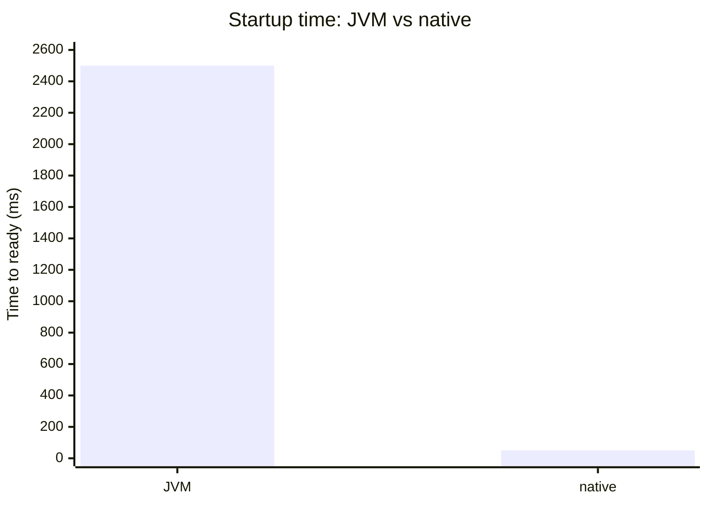
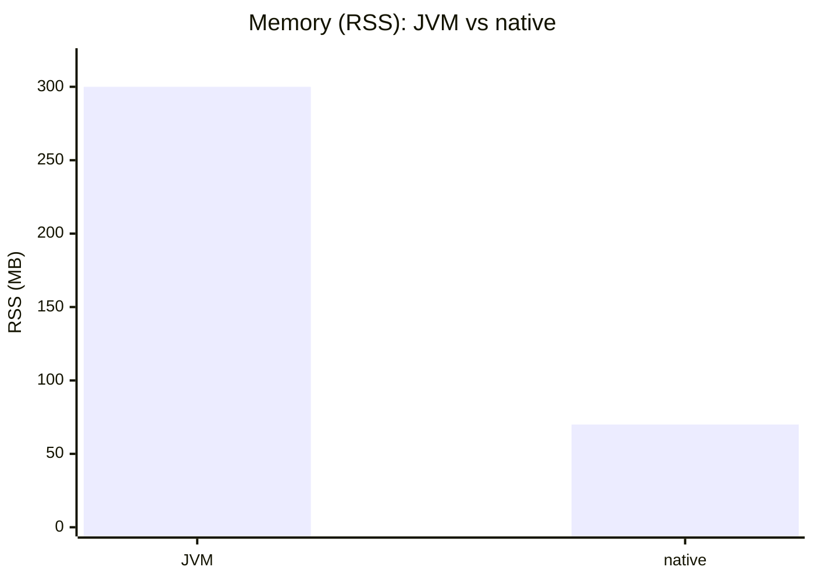
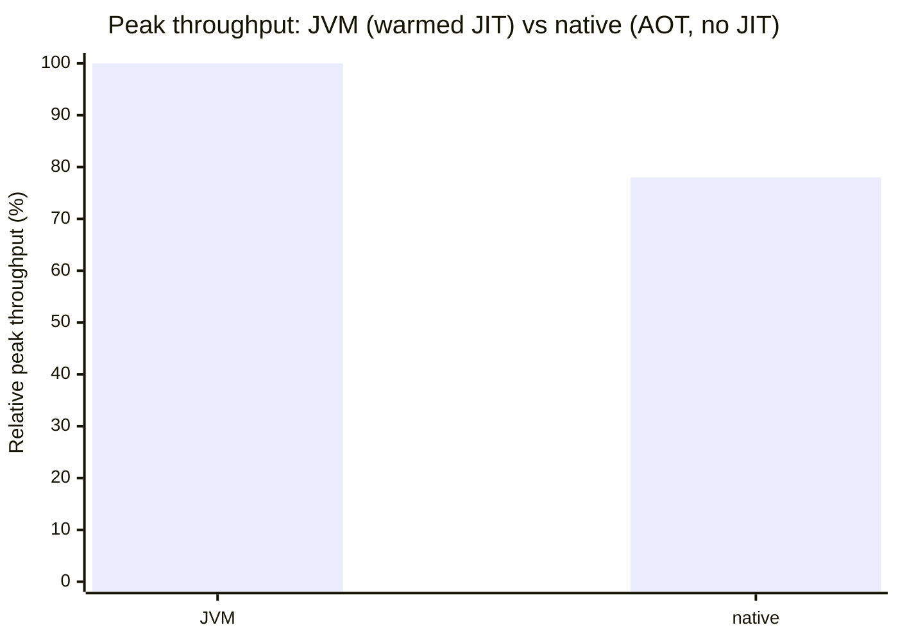
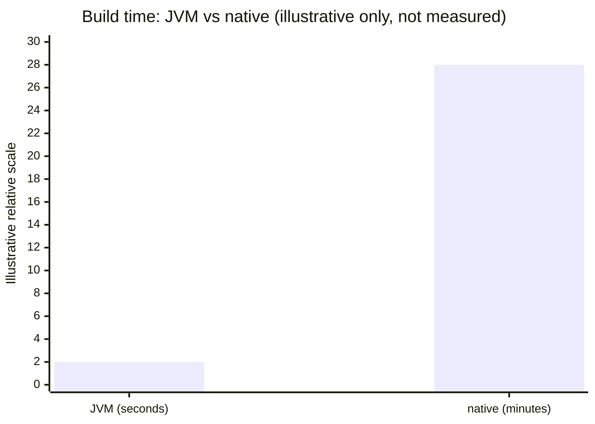
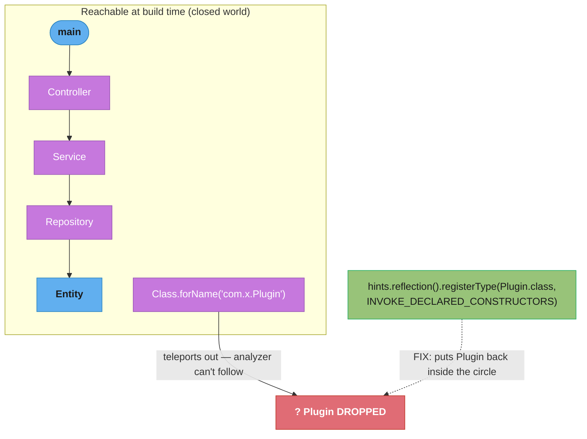

# Spring Native & GraalVM (AOT)

> How Spring Boot 3 turns a reflection-and-proxy-heavy framework into a GraalVM
> native executable: ahead-of-time (AOT) processing, reachability metadata
> (reflection/resource/proxy hints), build-time vs runtime initialization, and the
> startup/memory-vs-peak-throughput tradeoff that decides when native is worth it.
> Spring Boot 3.0+ / GraalVM 22.3+; always note the version.

---

## 1. Concept Overview

A normal Spring Boot app runs on the JVM: at startup it scans the classpath, reads
annotations via reflection, builds bean definitions, and creates dynamic proxies
(CGLIB/JDK) for `@Transactional`, `@Configuration`, AOP, etc. All of that is dynamic
— decided at runtime. GraalVM **native image** compiles your application
ahead-of-time into a single self-contained native executable with no JVM, using a
**closed-world assumption**: everything reachable must be known at *build time*.

Those two facts are in direct tension. Native image's static analysis cannot see
code reached only through reflection, dynamic proxies, JNI, or runtime resource
loading unless you *tell* it — via **reachability metadata** (hints). Spring Boot 3's
**AOT engine** exists to bridge the gap: at build time it runs a special processing
phase that pre-computes the bean definitions and *emits* the reflection/proxy/
resource hints GraalVM needs, so the framework's dynamic behavior is "frozen" into
generated code and metadata.

The payoff is dramatic startup and memory reduction — tens of milliseconds to start,
a fraction of the memory — at the cost of long build times, loss of JIT peak
throughput, and a more rigid runtime (no classpath scanning, limited reflection). It
is the enabling technology for Spring on serverless/FaaS and for high-density
container deployments.

---

## 2. Intuition

**One-line analogy.** The JVM is a chef who reads the recipe (annotations) while
cooking, improvising as ingredients (classes) appear. Native image is a meal-prep
service: every dish is fully cooked and packed in advance — instant to serve, but you
cannot ask for anything that was not on the prep list.

**Mental model.** Native image draws a circle around all code reachable from `main`
at build time and throws away everything outside it. Reflection is a teleporter that
jumps *outside* the circle — the analyzer cannot follow it, so you must hand it a map
(hints) of every teleport destination, or that code is gone.

**Why it matters.** A native app that built fine can crash at runtime with
`ClassNotFoundException` / `No such method` the first time it hits an un-hinted
reflective path — and only on the code path that triggers it. Understanding *why*
(closed world) and *where* the hints come from (AOT auto-generation + manual
`RuntimeHints`) is the entire skill.

**Key insight.** AOT does not make Spring faster by magic — it *moves work from
runtime to build time*. The context is effectively "pre-refreshed": bean definitions
and proxies are computed during the build and replayed at startup, which is why
startup collapses but the build gets expensive and dynamic flexibility disappears.

---

## 3. Core Principles

1. **Closed-world assumption.** Everything used must be reachable and known at build
   time. Anything dynamic (reflection, proxies, resources, JNI, serialization) needs
   explicit metadata or it does not exist at runtime.

2. **AOT moves work earlier.** Spring's `ApplicationContext` is processed at build
   time; bean definitions become generated Java/`BeanFactoryInitializer` code, not
   runtime reflection. Startup replays this instead of recomputing it.

3. **Hints are the contract with GraalVM.** Reflection, resource, proxy, and
   serialization hints are how dynamic needs are declared. Spring auto-generates most
   from its own annotations; you supply the rest via `RuntimeHintsRegistrar`.

4. **Build-time vs runtime initialization.** GraalVM can run a class's static
   initializer at *build* time (baked into the image heap) or defer it to *runtime*.
   Wrong choice = stale state captured at build, or a crash from something that must
   be deferred (e.g. capturing a random seed or a file handle at build time).

5. **No JIT at runtime.** A native image has no profiling JIT, so peak throughput is
   typically lower than a warmed-up JVM. You trade peak performance for instant start
   and low memory. (Profile-Guided Optimization, PGO, narrows but does not close the
   gap.)

6. **Fail at build, not in production.** The goal is to surface missing metadata
   during the build/tests (via the GraalVM tracing agent and native tests), never as
   a first-request runtime failure.

---

## 4. Types / Architectures / Strategies

### Where metadata comes from

| Source | Covers | Effort |
|--------|--------|--------|
| **Spring AOT engine** | Beans, `@Configuration`, `@Transactional`/AOP proxies, `@ConfigurationProperties`, most Spring annotations | Automatic |
| **Reachability Metadata Repository** | Popular third-party libs (shipped with GraalVM) | Automatic if lib is covered |
| **GraalVM tracing agent** | Records reflection/resource/proxy use during a real JVM run → `reflect-config.json` etc. | Run your test suite under the agent |
| **`RuntimeHintsRegistrar` / `@RegisterReflectionForBinding`** | Your own reflective code, custom serialization, dynamic classes | Manual, code-level |

### Initialization strategy choices

- **Build-time init** — static initializer runs during build; result baked into the
  image heap. Faster startup; dangerous for anything environment- or time-dependent.
- **Runtime init** — deferred to executable start. Needed for things that must read
  the *runtime* environment (random seeds, native libraries, open files).

### Deployment targets that motivate native

- **Serverless/FaaS** (AWS Lambda SnapStart alternative, Google Cloud Run) — cold
  start dominated; native's sub-100ms start is the whole value proposition.
- **High-density containers / Kubernetes** — pack many low-memory pods; native's
  small RSS raises density.
- **CLI tools** — instant start, no JVM warmup.

---

## 5. Architecture Diagrams

### JVM startup vs native: where the work happens

```mermaid
flowchart TD
    classDef io      fill:#61afef,stroke:#2e86c1,color:#1a1a1a,font-weight:bold
    classDef frozen  fill:#c678dd,stroke:#9b59b6,color:#fff
    classDef train   fill:#98c379,stroke:#27ae60,color:#1a1a1a
    classDef mathOp  fill:#d19a66,stroke:#e67e22,color:#1a1a1a,font-weight:bold
    classDef lossN   fill:#e06c75,stroke:#c0392b,color:#fff,font-weight:bold
    classDef req     fill:#56b6c2,stroke:#0097a7,color:#1a1a1a
    classDef base    fill:#e5c07b,stroke:#f39c12,color:#1a1a1a

    subgraph JVMPATH["JVM (runtime work)"]
        direction LR
        j1(["start"]) --> j2["classpath scan"] --> j3["read annotations\n(reflection)"] --> j4["build bean defs"] --> j5["create proxies\n(CGLIB)"] --> j6["refresh context"] --> j7(["READY (~2-4 s)"])
        j7 -.-> j8["JIT warms up over minutes\n→ peak throughput"]
    end

    subgraph NBUILD["Native — BUILD time"]
        direction LR
        n1(["AOT process context"]) --> n2["generate bean-def code\n+ hints"] --> n3["GraalVM static analysis\n(closed world)"] --> n4(["native image (minutes)"])
    end

    subgraph NRUN["Native — RUN time"]
        direction LR
        n5(["start"]) --> n6["replay pre-built context"] --> n7(["READY (~30-80 ms)"])
        n7 -.-> n8b["no JIT: throughput flat from t=0,\nlower peak than warm JVM"]
    end

    NBUILD --> NRUN

    class j1,j7,n5,n7 io
    class j2,j3,j4,j5,j6,j8,n8b mathOp
    class n1,n2,n6 train
    class n3,n4 base
```



The charts below contrast the two profiles (illustrative magnitudes):









Peak throughput is charted at the ~70-85% midpoint stated above; build time has no
fixed numbers and is shown only as an illustrative relative scale. Native wins
startup and memory by a wide margin; the JVM keeps peak throughput and fast builds.
That is the entire decision.

### The closed-world circle and the reflection teleport



Any class reached only via reflection is invisible to static analysis and removed
unless a hint re-includes it. This is the #1 cause of native runtime failures.

---

## 6. How It Works — Detailed Mechanics

### 6.1 Building a native image (Spring Boot 3 + GraalVM)

```bash
# Native build via the Spring Boot Maven plugin + GraalVM native-maven-plugin
./mvnw -Pnative native:compile        # produces target/<app> (native executable)

# Or a native container image with buildpacks (no local GraalVM needed):
./mvnw -Pnative spring-boot:build-image
```

The `native` profile triggers two phases: Spring's **AOT** processing (generates
`*__BeanDefinitions.java`, proxy classes, and `reflect-config.json`/`resource-config.json`
under `target/spring-aot/`), then GraalVM's `native-image` static analysis and
compilation.

### 6.2 What AOT generates (conceptually)

A normal `@Configuration` bean method is invoked reflectively at runtime. After AOT,
Spring emits explicit registration code instead:

```java
// You write:
@Configuration
class AppConfig {
    @Bean OrderService orderService(OrderRepo repo) { return new OrderService(repo); }
}

// AOT generates (simplified) — no runtime reflection to discover this bean:
public class AppConfig__BeanDefinitions {
    public static BeanDefinition orderServiceBeanDefinition() {
        RootBeanDefinition def = new RootBeanDefinition(OrderService.class);
        def.setInstanceSupplier(() ->
            new OrderService(beanFactory.getBean(OrderRepo.class)));
        return def;
    }
}
```

The runtime context simply executes this generated code — no classpath scan, no
annotation reflection. That is the startup win.

### 6.3 Supplying your own reflection hints

When you load classes reflectively (custom deserialization, plugin loading, a
library Spring does not cover), declare a `RuntimeHintsRegistrar`:

```java
public class MyRuntimeHints implements RuntimeHintsRegistrar {
    @Override
    public void registerHints(RuntimeHints hints, ClassLoader classLoader) {
        // make a reflectively-instantiated class survive the closed-world cut
        hints.reflection().registerType(PaymentPlugin.class,
            MemberCategory.INVOKE_DECLARED_CONSTRUCTORS,
            MemberCategory.INVOKE_PUBLIC_METHODS);
        // include a resource read at runtime
        hints.resources().registerPattern("templates/*.json");
        // a JDK dynamic proxy interface set
        hints.proxies().registerJdkProxy(AuditPort.class);
    }
}

@Configuration
@ImportRuntimeHints(MyRuntimeHints.class)
class HintsConfig {}
```

For DTOs bound reflectively (e.g. Jackson), the shortcut is
`@RegisterReflectionForBinding(MyDto.class)` on a bean.

### 6.4 The tracing agent: discover hints automatically

Rather than guess, run your **JVM tests** under GraalVM's tracing agent; it records
every reflective/resource/proxy access and writes the metadata files:

```bash
# Run on the JVM with the agent; it emits reflect-config.json etc.
java -agentlib:native-image-agent=config-output-dir=src/main/resources/META-INF/native-image \
     -jar target/app.jar
# exercise all code paths (run the full test suite) so nothing is missed
```

The crucial caveat: the agent only records paths your tests *actually execute*. Code
paths your tests miss produce no hints and fail in the native image — which is why
native test coverage matters more here than usual.

### 6.5 Build-time vs runtime initialization

```bash
# Force a class to initialize at runtime (e.g. it opens a socket / reads env):
native-image --initialize-at-run-time=com.example.NativeResourceHolder ...
# Default for app code is build-time where safe; Spring configures sensible defaults.
```

A class that captures environment-specific state in a static initializer (a random
seed, current time, a file handle) must be `--initialize-at-run-time`, or the
build-time value is frozen into the image — a subtle correctness bug.

### 6.6 Running native tests

```bash
./mvnw -PnativeTest test    # compiles tests into a native image and runs them
```

This is the safety net: it executes your tests in the *native* runtime, surfacing
missing metadata at build/test time instead of in production.

---

## 7. Real-World Examples

- **Spring Boot 3.0 (Nov 2022)** — folded the experimental "Spring Native"
  incubator into the core framework as first-class AOT support; GraalVM became a
  supported target rather than a side project.
- **AWS Lambda** — Spring Boot native images cut Java cold starts from seconds to
  ~tens of ms, making Java competitive with Node/Python on FaaS; widely used for
  latency-sensitive event handlers.
- **GraalVM Reachability Metadata Repository** — a community/Oracle-maintained repo
  of hints for popular libraries (Netty, Hibernate, etc.), pulled in automatically
  so you do not hand-write metadata for common dependencies.
- **Quarkus / Micronaut** — competitors built *natively-first* (compile-time DI, no
  runtime reflection by design); their existence is why Spring invested in AOT to
  stay competitive on startup/memory.
- **Spring Cloud Function on native** — serverless functions deployed as native
  images for dense, cheap, fast-scaling workloads.

---

## 8. Tradeoffs

| Dimension | JVM (JIT) | Native image (AOT) | Native wins when… |
|-----------|-----------|--------------------|--------------------|
| Startup | Seconds | Tens of ms | Cold start / FaaS dominates cost |
| Memory (RSS) | Hundreds of MB | Tens of MB | High pod density / memory-billed |
| Peak throughput | Higher (warmed JIT) | Lower (no JIT; PGO helps) | Throughput is not the bottleneck |
| Build time | Seconds | Minutes | You can absorb slow CI builds |
| Flexibility | Full reflection/dynamic | Closed-world, hints needed | App is mostly static |
| Debuggability | Mature JVM tooling | Harder; less mature | — |

| Concern | JVM | Native |
|---------|-----|--------|
| Classpath scanning at startup | Yes | No (done at build) |
| Reflection without config | Works | Needs hints |
| Dynamic proxies (CGLIB at runtime) | Yes | Pre-generated at build |
| Conditional beans on runtime classpath | Flexible | Frozen at build time |

---

## 9. When to Use / When NOT to Use

**Use native when** startup latency and memory footprint dominate your cost or SLA:
serverless/FaaS, scale-to-zero, high-density Kubernetes, CLIs, and short-lived jobs.
It is also attractive when you want a smaller attack surface (no JVM, fewer classes).

**Avoid native when** you run long-lived, throughput-heavy services where a warmed-up
JIT outperforms AOT (most steady-state backends); when your stack leans heavily on
runtime reflection/dynamic class loading/agents your hints cannot easily cover; when
slow builds would cripple your iteration loop; or when the operational maturity
(debugging, profiling, observability tooling) of native does not yet meet your needs.

**Rule of thumb:** native optimizes the *first second* of a process's life; the JVM
optimizes the *millionth request*. Match the tool to which one your bill is paying
for.

---

## 10. Common Pitfalls

1. **Runtime reflection with no hint.** A Jackson DTO or a `Class.forName` plugin not
   registered → `ClassNotFoundException`/`No such method` on first hit. *War story:* a
   service built and started fine but threw on the first request that deserialized a
   rarely-used DTO — the tracing agent run had never exercised that endpoint. *Fix:*
   `@RegisterReflectionForBinding` + native tests covering that path.

2. **Trusting the tracing agent's coverage.** The agent only records executed paths;
   missed branches produce no metadata. *Fix:* run the agent under the *full* test
   suite and add native tests; treat uncovered code as un-hinted.

3. **Build-time init capturing runtime state.** A static field initialized at build
   time froze a value (e.g. a generated key or timestamp) into the image, identical
   across all deployments. *Fix:* `--initialize-at-run-time` for environment- or
   time-sensitive classes.

4. **Expecting JIT peak throughput.** Teams benchmarked a native image against a
   warmed JVM and were surprised throughput was ~20-30% lower. *Fix:* understand the
   tradeoff; apply PGO if peak matters, or stay on the JVM for throughput-bound work.

5. **Conditional/dynamic beans on runtime classpath.** `@ConditionalOnClass` and
   profile-based wiring are resolved at *build* time in native, so flipping a profile
   at runtime does not re-wire beans. *Fix:* decide configuration at build time, or
   build per-profile images.

6. **Surprise at build duration.** Native builds take minutes and lots of RAM; CI
   pipelines that assumed JVM build times time out. *Fix:* dedicated native build
   stages, caching, and buildpacks.

7. **Unsupported libraries.** A dependency using deep reflection/JNI/agents with no
   reachability metadata silently breaks. *Fix:* check the metadata repository first;
   prefer native-friendly libraries.

---

## 11. Technologies & Tools

| Concern | Tools |
|---------|-------|
| Native compiler | GraalVM `native-image`, Oracle GraalVM / GraalVM CE / Liberica NIK |
| Build integration | `spring-boot-maven-plugin` (AOT), `native-maven-plugin`, Gradle GraalVM plugin, Cloud Native Buildpacks |
| Metadata discovery | GraalVM tracing agent (`native-image-agent`), Reachability Metadata Repository |
| Spring AOT | `RuntimeHintsRegistrar`, `@ImportRuntimeHints`, `@RegisterReflectionForBinding`, `AotProcessor` |
| Testing | `nativeTest` (JUnit native), Testcontainers (on JVM stage) |
| Optimization | Profile-Guided Optimization (PGO), `-march`, G1 for native (large heaps) |
| Competitors/context | Quarkus, Micronaut, AWS Lambda SnapStart (JVM alternative) |

---

## 12. Interview Questions with Answers

**Q: Why can't GraalVM native image just use reflection like the JVM does?**
Native image uses a closed-world assumption: it statically analyzes everything
reachable from `main` at build time and discards the rest to produce a small, fast
executable. Reflection (and dynamic proxies, JNI, runtime resource loading) reaches
code the analyzer cannot follow, so that code is dropped unless you explicitly
declare it via reachability metadata (hints). The JVM, by contrast, loads and links
classes lazily at runtime, so reflection just works. Native trades that runtime
dynamism for startup speed and small footprint.

**Q: What does Spring Boot's AOT engine actually do?**
At build time it processes the `ApplicationContext` — resolving bean definitions,
configuration classes, and proxies — and emits generated Java code plus GraalVM hint
files (`reflect-config.json`, etc.). At runtime the context replays this generated
code instead of scanning the classpath and reading annotations reflectively. So AOT
moves the expensive context-building work from startup to build time, which is what
collapses startup from seconds to tens of milliseconds, and it auto-generates most of
the metadata GraalVM needs.

**Q: What is reachability metadata and what are the kinds of hints?**
Reachability metadata tells GraalVM about dynamic behavior its static analysis cannot
see, so the affected code is retained and configured in the image. The main kinds are
reflection hints (classes/methods/fields accessed reflectively), resource hints
(files/patterns loaded at runtime), proxy hints (interfaces for JDK dynamic proxies),
and serialization hints. Spring auto-generates most from its annotations; you add the
rest via `RuntimeHintsRegistrar`/`@ImportRuntimeHints` or `@RegisterReflectionForBinding`.

**Q: What is the difference between build-time and runtime initialization?**
Build-time initialization runs a class's static initializer during the native build
and bakes the resulting state into the image heap, giving faster startup. Runtime
initialization defers it to when the executable starts. The danger is initializing at
build time something that depends on the runtime environment — a random seed, the
current time, an open file/socket — which then freezes a build-time value into every
deployment. Such classes must be marked `--initialize-at-run-time`.

**Q: Why is peak throughput often lower for a native image than a warmed-up JVM?**
A native image has no runtime JIT compiler, so it cannot profile hot paths and
re-optimize them with aggressive inlining and speculative optimizations the way
HotSpot does after warmup. AOT compiles ahead of time with less runtime profile
information, so steady-state throughput is typically lower (often ~70-85% of a warmed
JVM). Profile-Guided Optimization narrows the gap by feeding a profiling run back into
the build, but native's strength is startup and memory, not peak throughput.

**Q: When would you choose native over the JVM, and when not?**
Choose native when startup latency and memory dominate cost or SLA — serverless/FaaS,
scale-to-zero, high-density containers, CLIs, short-lived jobs. Avoid it for
long-lived, throughput-bound services where a warm JIT wins, for apps that depend
heavily on runtime reflection/agents that are hard to hint, and where slow builds or
less-mature debugging tooling would hurt. The slogan: native optimizes the first
second of the process; the JVM optimizes the millionth request.

**Q: How do you discover the hints your application needs?**
First rely on Spring AOT (covers Spring's own annotations) and the GraalVM
Reachability Metadata Repository (covers many popular libraries). For your own
reflective code, run your application/tests on the JVM under the GraalVM tracing
agent, which records reflection/resource/proxy access and writes the metadata files.
Crucially, the agent only captures paths your tests execute, so you must exercise all
code paths and back it up with native tests — uncovered paths produce no hints and
fail at runtime.

**Q: Why might a native app build successfully but crash at runtime?**
Because missing reachability metadata is not a build error — the build simply omits
the un-referenced (reflective) code. The failure surfaces only when execution first
reaches a reflective/resource path that was never hinted, throwing
`ClassNotFoundException`, `NoSuchMethodException`, or a missing-resource error on that
specific request. This is why native tests and full-coverage tracing-agent runs
matter: the goal is to fail at build/test time, not on a production request.

**Q: How are `@Transactional` and other proxies handled in native image?**
Spring normally creates CGLIB/JDK dynamic proxies at runtime; under native that is
impossible (no runtime bytecode generation for CGLIB and proxies must be known up
front). The AOT engine generates the required proxy classes and proxy hints at build
time, so the proxy exists in the image. For JDK dynamic proxies you may need to
register the interface set via a proxy hint if it is not auto-detected. The behavior
is the same; only the *when* of proxy creation moves to build time.

**Q: What happens to `@ConditionalOnClass` and profiles in a native image?**
They are evaluated at build time, not runtime, because the set of beans is frozen
into the image. So a conditional that depends on a class being present, or a
profile-specific bean graph, is decided when the image is built — flipping a profile
at runtime will not re-wire the context. If you need different wiring per environment,
decide it at build time or produce separate per-profile images.

**Q: What is the GraalVM tracing agent and its main limitation?**
It is a JVM agent (`native-image-agent`) that observes a normal JVM run and records
all reflective, resource, proxy, and serialization access, writing the corresponding
metadata JSON files. Its main limitation is coverage: it only records code paths that
actually execute during the run, so any branch your tests miss yields no metadata and
breaks in the native image. You therefore run it under the full test suite and treat
its output as a starting point, not a guarantee.

**Q: How does native image reduce memory footprint so much?**
There is no JVM: no separate interpreter/JIT/metaspace overhead, no large reusable
runtime, and the closed-world cut removes unreachable classes so only what you use is
included. The application's initialized heap can also be partly built at image-build
time. The result is an RSS measured in tens of MB versus hundreds for an equivalent
JVM process, which is what enables high pod density.

**Q: What is Profile-Guided Optimization (PGO) in the native context?**
PGO is a two-step build: you first produce an instrumented native image, run it under
representative load to collect a profile, then rebuild using that profile so the AOT
compiler can optimize hot paths (inlining, layout) the way a JIT would. It recovers
much of the peak-throughput gap with the JVM. It costs an extra build cycle and a
representative workload, so it is used when native is chosen but throughput still
matters.

**Q: Why does the build take so long and what can you do about it?**
Native compilation runs whole-program static analysis (points-to analysis across the
entire reachable graph) and then AOT-compiles everything, which is far heavier than
javac and memory-hungry. Mitigations: dedicate a native build stage in CI with ample
RAM, cache aggressively, use buildpacks for reproducible builds, and only build native
images for the artifacts that need them rather than every commit/branch.

**Q: How is Spring's native support different from Quarkus/Micronaut?**
Quarkus and Micronaut were designed native-first: they do dependency injection and
metadata generation at compile time and avoid runtime reflection by architecture, so
they need fewer hints and build leaner. Spring retained its powerful runtime
programming model and added an AOT layer on top to make that model expressible under
the closed world. The tradeoff: Spring keeps its rich ecosystem and runtime
flexibility (on the JVM) while supporting native; the others start leaner but with a
different (compile-time) programming model.

**Q: Can you use the JVM's full reflection and dynamic features and still go native later?**
Not freely — code that relies on unbounded runtime reflection, dynamic class
generation, or JVM agents is hostile to the closed world and will need extensive
hints or refactoring. The pragmatic approach is to write "native-friendly" code from
the start (constructor injection, minimal reflection, no runtime bytecode gen), lean
on Spring AOT and the metadata repository, and validate continuously with native
tests so you do not discover a wall of missing metadata at the end.

---

## 13. Best Practices

- **Decide native early** and validate with `nativeTest` continuously — do not bolt
  it on at the end.
- **Run the tracing agent under your full test suite**, then commit the generated
  metadata; treat uncovered paths as unsupported.
- **Prefer constructor injection and minimal reflection**; avoid runtime bytecode
  generation and JVM agents.
- **Use `@RegisterReflectionForBinding`** for DTOs bound by Jackson and friends.
- **Mark environment/time-sensitive classes `--initialize-at-run-time`** to avoid
  freezing build-time state.
- **Check the Reachability Metadata Repository** before hand-writing hints; prefer
  native-friendly libraries.
- **Budget for slow builds** — dedicated CI stage, caching, buildpacks; do not build
  native on every branch.
- **Reserve native for startup/memory-bound workloads**; keep throughput-bound
  services on the JVM unless PGO closes the gap.

---

## 14. Case Study

### Payment-webhook handler on AWS Lambda: JVM→native

**Problem.** A Spring Boot 3 webhook handler ran on AWS Lambda (Java 17 JVM). Cold
starts were 3–5 s, blowing the payment provider's 10 s webhook timeout during
scale-out and forcing expensive provisioned concurrency to keep instances warm. The
function is short-lived and bursty — the worst case for JVM warmup.

**Requirements.**
- Cold start well under 1 s to survive bursts without provisioned concurrency.
- Low memory per invocation (Lambda bills on memory × duration).
- Correctly handle reflective JSON deserialization of provider payloads.
- No correctness regressions from build-time initialization.

**Design.**

1. **Native image build.** `./mvnw -Pnative native:compile` (Spring Boot 3.2,
   GraalVM 22.3) produces the executable; deployed via a Lambda custom runtime.

2. **Hints for the payload DTOs.** Provider payloads are deserialized reflectively by
   Jackson, so the DTOs are registered:

```java
@Configuration
@RegisterReflectionForBinding({ WebhookEvent.class, ChargeSucceeded.class,
                                ChargeFailed.class, Dispute.class })
class WebhookHints {}
```

3. **Tracing-agent run under full tests.** The suite (which exercises every event
   type) runs under `native-image-agent` to capture any remaining reflection/resource
   metadata; output committed under `META-INF/native-image`.

4. **Runtime init for the signing key holder.** The HMAC verifier read an env-based
   secret in a static initializer; marked `--initialize-at-run-time` so each
   deployment reads its own runtime secret rather than a build-time value.

**Broken → fixed (the production crash that native tests caught):**

```java
// BROKEN: a rarely-used Dispute event was deserialized reflectively but never
// exercised by the tracing-agent run, so no reflection hint was generated.
// On the JVM: fine. As native image: first real dispute webhook ->
//   com.fasterxml.jackson...: Cannot construct instance of Dispute (no metadata)

// FIXED: register the DTO for reflective binding + add a native test that
// deserializes a real Dispute payload, so the gap fails the build, not prod.
@RegisterReflectionForBinding(Dispute.class)
// + DisputeWebhookNativeTest exercises the path under nativeTest
```

**Outcomes (measured).**
- Cold start: **~3.5 s → ~120 ms** — comfortably inside the 10 s webhook timeout
  without provisioned concurrency, which was removed.
- Memory per invocation: **~256 MB → ~90 MB**, lowering Lambda cost per call.
- The `Dispute` deserialization bug was caught by `nativeTest` in CI rather than by
  a failed production webhook (which would have meant a missed dispute deadline).
- Steady-state per-request latency was unchanged in practice — the function does one
  signature check + one DB write, so the lost JIT peak throughput was irrelevant to
  this workload (the right reason to choose native here).

**Tradeoffs accepted.** Native builds added ~4 minutes to CI (isolated to a dedicated
stage) and the team gave up some JVM profiling tooling. Both were worth eliminating
cold-start pain and provisioned-concurrency cost for this bursty, short-lived
workload.

---

## See Also

- [spring_performance](../spring_performance/README.md) — JVM-side startup/throughput
  tuning, lazy init, virtual threads (the non-native levers).
- [spring_boot_autoconfiguration](../spring_boot_autoconfiguration/README.md) —
  conditional beans and auto-config, which AOT freezes at build time.
- [../../java/annotation_processing/](../../java/annotation_processing/) — compile-
  time code generation, the same "move work to build time" philosophy as AOT.
- [../../java/jvm_internals/](../../java/jvm_internals/) — JIT vs AOT, what you give
  up by dropping the runtime compiler.
- [Bytecode & Class-File Format](../../java/bytecode_and_classfile/README.md) —
  reachability analysis and reflection metadata operate on this bytecode/class-file
  representation.
