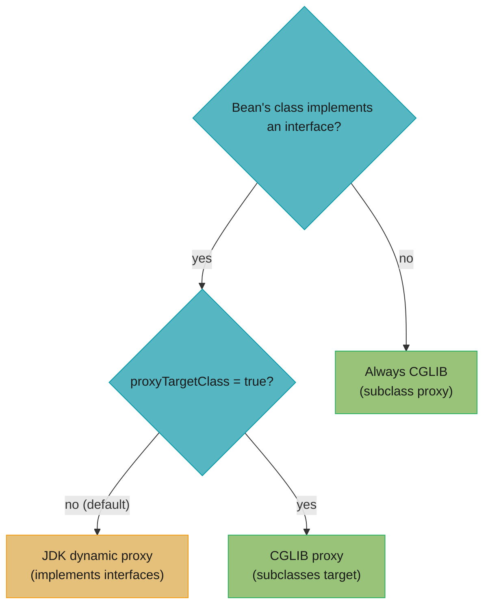
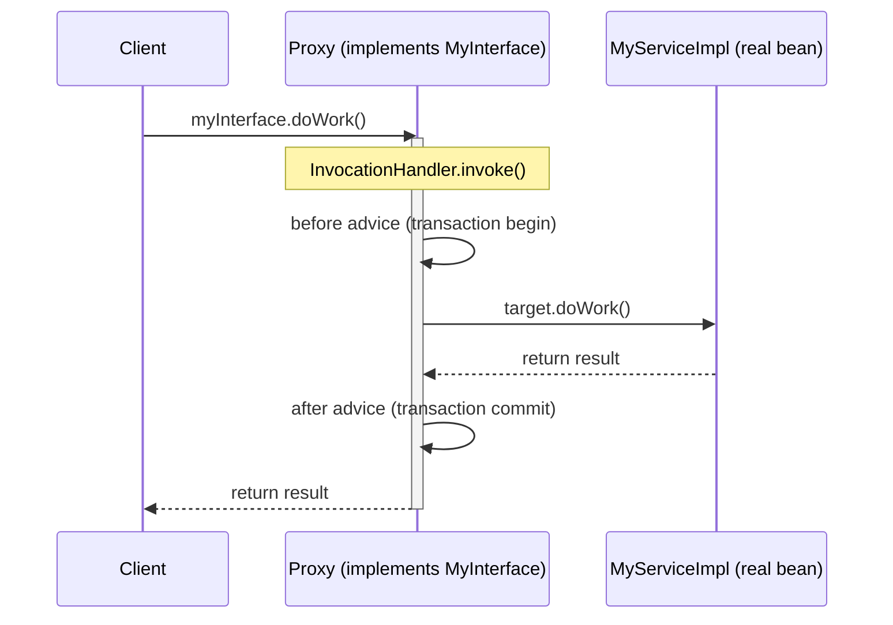
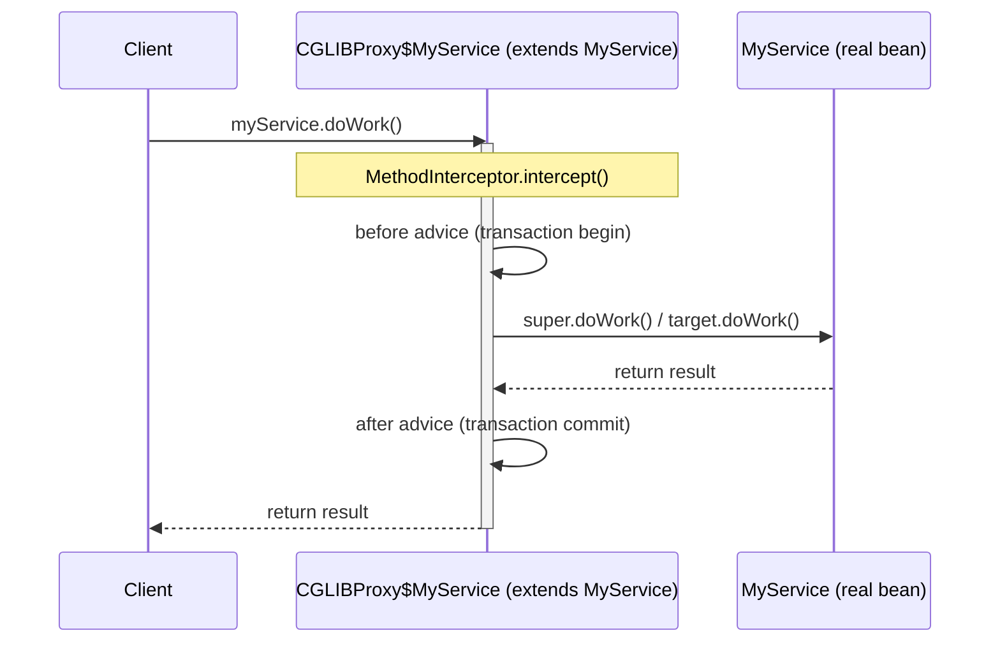
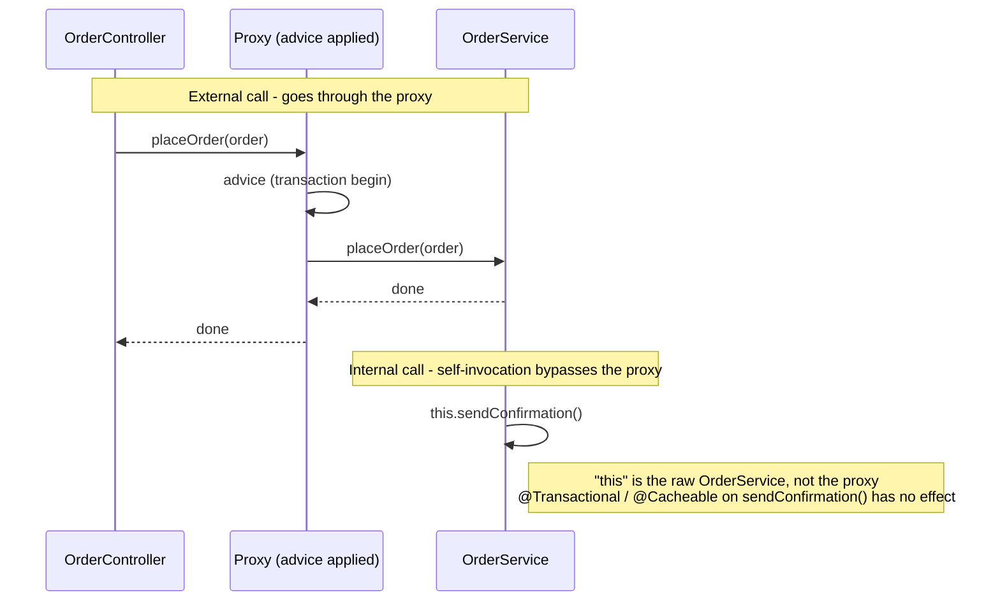
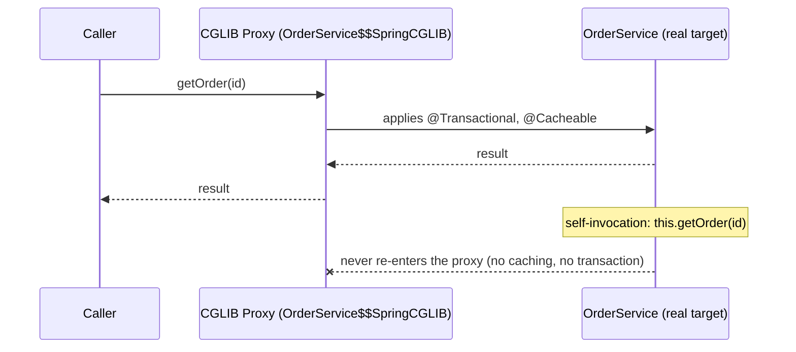

# Spring Proxies

## 1. Concept Overview

Spring relies heavily on dynamic proxies to implement cross-cutting concerns — `@Transactional`, `@Cacheable`, `@Async`, AOP advice, and Spring Security method security all work by wrapping your bean in a proxy. Understanding which proxy type Spring uses and when is essential for debugging self-invocation issues, understanding `@Transactional` gotchas, and working with `final` classes.

Spring uses two proxy mechanisms: **JDK dynamic proxies** (interface-based) and **CGLIB proxies** (subclass-based).

---

## 2. Intuition

Think of a proxy like a personal assistant standing in front of a celebrity. When you call the assistant (proxy), they first handle formalities (security checks, logging, transactions), then pass the call to the celebrity (real bean), then handle follow-up tasks (commit/rollback, caching the result). The key insight: the assistant only intercepts calls coming from outside. If the celebrity calls their own phone number, the call goes directly to them — the assistant is bypassed.

**One-line analogy:** A proxy is a wrapper that intercepts method calls from outside the bean; internal method calls within the same bean bypass the proxy entirely.

**Key insight:** Self-invocation — calling `this.someMethod()` within the same bean — bypasses the proxy and loses all AOP advice (transactions, caching, security). This is the single most common Spring production bug.

---

## 3. Core Principles

1. **JDK proxy requires an interface:** Creates a proxy implementing all interfaces of the target bean. Cannot proxy classes without interfaces.
2. **CGLIB creates a subclass:** Generates a subclass of the target class at runtime. Fails on `final` classes and `final` methods (cannot subclass or override them).
3. **Spring chooses automatically:** Has interface and `proxyTargetClass=false` (default) → JDK proxy. No interface → CGLIB always. `proxyTargetClass=true` → CGLIB always.
4. **Spring Boot forces CGLIB by default:** `@SpringBootApplication` enables `proxyBeanMethods=true` and `proxyTargetClass=true`, so CGLIB is used everywhere.
5. **Proxies only intercept external calls:** A method call within the same class object (`this.method()`) calls the real object directly, bypassing the proxy.

---

## 4. Types / Architectures / Strategies

### JDK Dynamic Proxy

- Implemented in `java.lang.reflect.Proxy`
- Creates a proxy object implementing all interfaces of the target
- Uses `InvocationHandler.invoke()` to intercept calls
- Target must implement at least one interface
- **Cannot proxy concrete classes that don't implement interfaces**

### CGLIB Proxy

- Third-party library included with Spring (repackaged as `spring-cglib`)
- Creates a subclass of the target class using bytecode generation
- Overrides non-final methods to add advice
- **Cannot proxy `final` classes or `final` methods**
- **Cannot proxy classes with no default (no-arg) constructor** (unless Spring uses Objenesis to bypass this)
- Spring 4+ includes Objenesis, so no-arg constructor restriction is mostly lifted

### Proxy Selection Logic



Spring makes this choice once per bean at proxy-creation time: no interface always forces CGLIB, and `proxyTargetClass=true` forces CGLIB even when an interface exists.

---

## 5. Architecture Diagrams

**JDK Dynamic Proxy**



`proxy instanceof MyInterface` is `true`, but `proxy instanceof MyServiceImpl` is `false` — a JDK proxy only implements the target's interfaces, so casting it to the concrete class throws `ClassCastException`.

**CGLIB Proxy (Subclass)**



Because the CGLIB proxy is a real subclass, `proxy instanceof MyService` is `true` and `proxy.getClass()` reports `MyService$$EnhancerBySpringCGLIB$$abc123`.

**Self-Invocation Problem**



The external call crosses the proxy boundary and gets advice; the internal `this.sendConfirmation()` call never leaves the target object, so any `@Transactional` or `@Cacheable` on that method is silently skipped.

---

## 6. How It Works — Detailed Mechanics

### How JDK Proxy Works

```java
// Simplified InvocationHandler for @Transactional
public class TransactionalInvocationHandler implements InvocationHandler {
    private final Object target;
    private final PlatformTransactionManager txManager;

    @Override
    public Object invoke(Object proxy, Method method, Object[] args) throws Throwable {
        // Check if method has @Transactional
        if (method.isAnnotationPresent(Transactional.class)) {
            TransactionStatus status = txManager.getTransaction(new DefaultTransactionDefinition());
            try {
                Object result = method.invoke(target, args);  // call real bean
                txManager.commit(status);
                return result;
            } catch (Exception e) {
                txManager.rollback(status);
                throw e;
            }
        }
        return method.invoke(target, args);  // no transaction
    }
}

// Creating the proxy
MyService proxy = (MyService) Proxy.newProxyInstance(
    MyService.class.getClassLoader(),
    new Class[]{MyService.class},   // must be an interface!
    new TransactionalInvocationHandler(realBean, txManager)
);
```

### How CGLIB Proxy Works

```java
// CGLIB creates a subclass that overrides all non-final methods
// Simplified MethodInterceptor
public class TransactionalMethodInterceptor implements MethodInterceptor {
    @Override
    public Object intercept(Object proxy, Method method, Object[] args,
                             MethodProxy methodProxy) throws Throwable {
        // Similar to InvocationHandler but uses MethodProxy for super calls
        TransactionStatus status = txManager.getTransaction(def);
        try {
            Object result = methodProxy.invokeSuper(proxy, args);  // super.method()
            txManager.commit(status);
            return result;
        } catch (Exception e) {
            txManager.rollback(status);
            throw e;
        }
    }
}
```

### Self-Invocation Problem and Fixes

```java
// BROKEN: internal method call bypasses proxy
@Service
public class OrderService {
    @Transactional
    public void placeOrder(Order order) {
        // ... business logic ...
        sendConfirmation(order);  // calls this.sendConfirmation(), bypasses proxy
    }

    @Transactional(propagation = Propagation.REQUIRES_NEW)  // IGNORED!
    public void sendConfirmation(Order order) {
        // Runs in SAME transaction as placeOrder, not a new one
        confirmationRepo.save(new Confirmation(order));
    }
}

// FIX 1: Restructure (best solution) — separate service for transactional boundaries
@Service
public class OrderService {
    private final ConfirmationService confirmationService;  // inject other service

    public OrderService(ConfirmationService confirmationService) {
        this.confirmationService = confirmationService;
    }

    @Transactional
    public void placeOrder(Order order) {
        confirmationService.sendConfirmation(order);  // goes through proxy!
    }
}

// FIX 2: Inject self (works but code smell)
@Service
public class OrderService {
    @Autowired
    private OrderService self;  // Spring injects the proxy!

    @Transactional
    public void placeOrder(Order order) {
        self.sendConfirmation(order);  // goes through proxy!
    }

    @Transactional(propagation = Propagation.REQUIRES_NEW)
    public void sendConfirmation(Order order) { ... }
}

// FIX 3: Use ApplicationContext.getBean() (service locator, avoid)
@Service
public class OrderService implements ApplicationContextAware {
    private ApplicationContext ctx;

    public void placeOrder(Order order) {
        OrderService proxy = ctx.getBean(OrderService.class);  // gets proxy
        proxy.sendConfirmation(order);
    }
}
```

### CGLIB Cannot Proxy Final Classes

```java
// BROKEN: final class cannot be CGLIB-proxied
@Service
public final class UserService {  // final!
    @Transactional
    public User findById(Long id) { return repo.findById(id).orElseThrow(); }
}
// BeanCreationException: Cannot subclass final class UserService

// FIXED: remove final
@Service
public class UserService {
    @Transactional
    public User findById(Long id) { return repo.findById(id).orElseThrow(); }
}

// ALSO BROKEN: final method
@Service
public class UserService {
    @Transactional
    public final User findById(Long id) { ... }  // final method — CGLIB cannot override
    // @Transactional SILENTLY IGNORED — no error, just no transaction
}
```

### proxyTargetClass Configuration

```java
// Force CGLIB for all beans (even those with interfaces)
@Configuration
@EnableTransactionManagement(proxyTargetClass = true)
@EnableAspectJAutoProxy(proxyTargetClass = true)
@EnableCaching(proxyTargetClass = true)
public class AppConfig { }

// Spring Boot sets proxyTargetClass=true by default in:
// @SpringBootApplication -> @EnableAutoConfiguration ->
// AopAutoConfiguration -> @EnableAspectJAutoProxy(proxyTargetClass=true)
```

### Proxy Impact on equals/hashCode/instanceof

```java
// Gotchas with proxied beans
@Service
public class UserService { }

// In test or application code:
UserService bean = ctx.getBean(UserService.class);

// CGLIB proxy:
bean.getClass()  // UserService$$EnhancerBySpringCGLIB$$abc123 — NOT UserService.class
bean instanceof UserService  // true (subclass relationship)
bean.getClass() == UserService.class  // FALSE! Common mistake

// JDK proxy:
UserService bean2 = ctx.getBean(UserService.class);  // actually gets proxy for interface
bean2.getClass()  // com.sun.proxy.$Proxy25 — NOT UserService.class
bean2 instanceof UserService  // depends on whether UserService is interface or class
```

---

## 7. Real-World Examples

**@Transactional implementation:** Every `@Transactional` method call goes through a Spring AOP proxy. The proxy starts a transaction, calls the real method, commits or rolls back based on the outcome. Without understanding this, the self-invocation bug is mysterious and hard to debug.

**Spring Security method security:** `@PreAuthorize("hasRole('ADMIN')")` on a service method is implemented via CGLIB proxy. When the proxy intercepts the call, it evaluates the SpEL expression against the current `SecurityContext` before delegating to the real method.

**Debugging tool:** To detect if a Spring bean is proxied, log `bean.getClass().getName()`. A CGLIB proxy has `$$EnhancerBySpringCGLIB$$` in the name; a JDK proxy starts with `$Proxy`. Use this in integration tests to verify proxy creation.

---

## 8. Tradeoffs

| Aspect | JDK Proxy | CGLIB Proxy |
|--------|-----------|-------------|
| Interface requirement | Required | Not required |
| `final` class support | N/A (interface) | No |
| `final` method support | N/A (interface) | No (silently skipped) |
| Performance | Slightly faster | Slightly slower (bytecode gen) |
| Constructor required | No | No (Objenesis handles it) |
| Casting to class type | Fails | Works |
| Spring Boot default | Not default (overridden) | Default (`proxyTargetClass=true`) |

---

## 9. When to Use / When NOT to Use

**Proxies are automatic** — you do not choose them directly. But you should:

**Know proxy implications when:**
- Writing classes with `@Transactional`, `@Cacheable`, `@Async`, `@Secured`
- Working with `final` classes or methods (remove `final`, or accept that advice won't apply)
- Testing: verifying that a proxy wraps your bean (`bean.getClass().getName()`)
- Debugging: unexpected behavior in self-invoked methods

**Avoid self-invocation of proxied methods by:**
- Extracting methods to separate services (best)
- Using `@Lookup` or self-injection as a last resort
- Restructuring code to keep transaction/cache/security boundaries at service call boundaries

---

## 10. Common Pitfalls

### Pitfall 1: @Transactional on Private Method (Silently Ignored)

```java
// BROKEN: private method cannot be overridden — proxy cannot intercept it
@Service
public class OrderService {
    @Transactional  // SILENTLY IGNORED — no error, no transaction
    private void saveOrder(Order order) {
        orderRepo.save(order);
    }

    public void processOrder(Order order) {
        saveOrder(order);  // no transaction; any exception = data not saved
    }
}

// FIXED: make transactional methods public
@Service
public class OrderService {
    @Transactional
    public void saveOrder(Order order) {  // public — proxy can intercept
        orderRepo.save(order);
    }
}
```

### Pitfall 2: Casting JDK Proxy to Concrete Class

```java
// BROKEN: JDK proxy does not extend the concrete class
@Autowired
private UserService userService;  // JDK proxy if UserService implements an interface

// At some point, code tries to cast to implementation
MyUserServiceImpl impl = (MyUserServiceImpl) userService;  // ClassCastException!

// FIXED: use the interface type, or force CGLIB
// Option 1: use interface type only
UserService service = userService;  // ok

// Option 2: force CGLIB for this service
@EnableAspectJAutoProxy(proxyTargetClass = true)
```

### Pitfall 3: @Async Self-Invocation

```java
// BROKEN: calling async method from within same class
@Service
public class ReportService {
    @Async  // Creates proxy for async execution
    public CompletableFuture<Report> generateAsync(String id) {
        return CompletableFuture.completedFuture(generate(id));
    }

    public void generateAllReports(List<String> ids) {
        for (String id : ids) {
            generateAsync(id);  // BROKEN: self-invocation, runs synchronously!
        }
    }
}

// FIXED: inject self or extract to separate service
@Service
public class ReportService {
    @Autowired
    private ReportService self;  // proxy injected

    public void generateAllReports(List<String> ids) {
        for (String id : ids) {
            self.generateAsync(id);  // goes through proxy — truly async
        }
    }
}
```

---

## 11. Technologies & Tools

| Component | Role |
|-----------|------|
| `java.lang.reflect.Proxy` | JDK proxy foundation |
| CGLIB (`spring-cglib`) | Bytecode generation for CGLIB proxies |
| Objenesis | Creates CGLIB proxies without no-arg constructor |
| `ProxyFactoryBean` | Programmatic Spring AOP proxy creation |
| `AopUtils.isAopProxy()` | Utility to check if object is a Spring proxy |
| `AopUtils.getTargetClass()` | Get underlying class of a proxied bean |
| `AopTestUtils.getTargetObject()` | Unwrap proxy in tests |
| `ProxyFactory` | Programmatic proxy creation for advanced use cases |

---

## 12. Interview Questions with Answers

**Q: What are the two proxy types Spring uses and when does it use each?**
JDK dynamic proxy (uses `java.lang.reflect.Proxy`) is used when the target bean implements at least one interface and `proxyTargetClass=false`. CGLIB proxy (generates a subclass via bytecode) is used when the target has no interface, or when `proxyTargetClass=true` is configured. Spring Boot sets `proxyTargetClass=true` by default, so CGLIB is used for all beans in Spring Boot applications even when interfaces exist.

**Q: Why does self-invocation break @Transactional?**
When you call `this.method()` inside a Spring bean, `this` refers to the raw bean object, not the proxy. The proxy wrapping the bean is only involved when the method is called from outside the bean. Since `@Transactional` is implemented as a proxy interceptor, internal calls bypass it entirely. The fix is to restructure code so transactional operations are called from a different Spring bean (which goes through its proxy), or as a last resort, inject the bean into itself (`@Autowired private MyService self`).

**Q: What happens when you make a method final in a Spring service that uses @Transactional?**
CGLIB cannot override `final` methods. If `@Transactional` is on a `final` method, the advice is silently skipped — no transaction is started, no exception is thrown, the method simply runs without Spring's transaction management. This is extremely dangerous because there is no indication anything is wrong at startup. Similarly, `@Cacheable` and `@Async` on `final` methods are silently ignored. Always run your tests to verify transactional behavior.

**Q: What is the difference between AOP proxy behavior with JDK vs CGLIB?**
Both proxies intercept method calls from outside the bean. The key difference: JDK proxy implements interfaces and can only be cast to those interfaces; CGLIB proxy extends the class and can be cast to the class type. With JDK proxy, calling `bean.getClass()` returns a `$Proxy` class; with CGLIB it returns `ClassName$$EnhancerBySpringCGLIB$$...`. CGLIB proxies can be used where interface-based proxies cannot (concrete class injection, casting to class type).

**Q: How would you verify that a Spring bean is proxied?**
Check `bean.getClass().getName()`. For CGLIB proxy, the name contains `$$EnhancerBySpringCGLIB$$`. For JDK proxy, it starts with `com.sun.proxy.$Proxy`. Alternatively, use `AopUtils.isAopProxy(bean)` (returns true for both types) and `AopUtils.isCglibProxy(bean)` or `AopUtils.isJdkDynamicProxy(bean)` for specific type. In tests, use `AopTestUtils.getTargetObject(bean)` to unwrap the proxy and get the underlying bean.

**Q: How does Spring Boot's proxyTargetClass=true affect the application?**
It forces CGLIB proxies for all Spring AOP-proxied beans, even those implementing interfaces. This eliminates the JDK proxy / interface requirement distinction, simplifies injection (you can always inject by class type, not just interface), and avoids `ClassCastException` when code tries to cast a bean to its concrete class. The downside: CGLIB cannot proxy `final` classes or `final` methods. Most Spring Boot applications should not change this default.

**Q: What is the proxy chain in a Spring MVC request?**
A request enters Spring Security's `FilterChainProxy` (a `Filter`, not a Spring AOP proxy), which runs security filters. After passing security, the request reaches the `DispatcherServlet`, which dispatches to a controller method. The controller may call a `@Service` method — this goes through the service's AOP proxy (CGLIB or JDK), which applies `@Transactional`, `@Cacheable`, or other AOP advice. Method security (`@PreAuthorize`) is also applied via AOP proxy on the service. This chain is important to understand for debugging.

**Q: Why can't CGLIB proxy final classes?**
CGLIB works by generating a subclass of the target class at runtime using bytecode generation. Java's `final` keyword prevents subclassing. When Spring tries to create a CGLIB proxy for a `final` class, the bytecode generation fails with `BeanCreationException: Cannot subclass final class...`. The fix is to remove the `final` modifier. If you genuinely need a `final` class (immutability concern), avoid annotations that require proxying, or use AspectJ compile-time weaving instead.

**Q: How does @Configuration's CGLIB proxy differ from a @Transactional proxy?**
`@Configuration` CGLIB proxy's sole purpose is to intercept `@Bean` method calls and return the singleton from the container (caching semantics). It wraps the entire configuration class. `@Transactional` (or `@Cacheable`) proxy wraps an individual service bean and intercepts every method call to apply advice. `@Configuration` proxying happens during context startup for configuration classes; `@Transactional` proxying happens via `AnnotationAwareAspectJAutoProxyCreator` as part of the `BeanPostProcessor` phase for each bean.

**Q: What is Objenesis and why does Spring use it?**
Objenesis is a library that creates Java objects without calling their constructors, using JVM internals (e.g., `sun.reflect.ReflectionFactory`). Spring uses it when creating CGLIB proxy subclasses — the proxy subclass does not need to match the target class's constructor signature. Without Objenesis, CGLIB would require the target class to have a no-arg constructor (or matching constructor parameters). With Objenesis (bundled in Spring since 4.0), any class can be CGLIB-proxied regardless of constructor shape.

**Q: How does the self-injection trick work for avoiding self-invocation?**
When a bean injects itself via `@Autowired private MyService self`, Spring injects the proxy bean (from the context), not `this`. When application code calls `self.method()`, it goes through the proxy (which applies AOP advice) rather than directly calling the method on `this`. The reason Spring can inject the bean's own proxy is that the proxy is already in the singleton registry when field injection runs (phase 2 of lifecycle). This is a valid workaround but is considered a code smell — restructuring to separate services is preferred.

**Q: What is the difference between `proxyTargetClass=true` and `proxyTargetClass=false`, and when does Spring choose each automatically?**
`proxyTargetClass=false` (default): Spring creates a JDK dynamic proxy that implements the same interfaces as the target bean. The proxy is injected anywhere the interface type is expected. If you try to inject by concrete class, `NoSuchBeanDefinitionException` or a `ClassCastException` occurs. `proxyTargetClass=true`: Spring creates a CGLIB subclass proxy that extends the concrete class. Injection by both interface and concrete type works. Spring Boot sets `spring.aop.proxy-target-class=true` by default (Boot 2.0+), meaning CGLIB is used everywhere unless the bean implements an interface and `proxy-target-class` is explicitly set to `false`. The implication: in Spring Boot, beans can always be injected by concrete type safely.

**Q: How does Spring's proxy mechanism interact with `@Transactional` on a final method?**
CGLIB subclasses cannot override `final` methods — they are not intercepted by the proxy. A `@Transactional` annotation on a `final` method is silently ignored: the method is called directly on the target object without any transaction management. Spring does not log a warning by default. Diagnosis: add `logging.level.org.springframework.aop=DEBUG` — Spring logs when it cannot proxy a method. Fix: remove `final` from the method (or use `@Transactional` on the class and ensure no methods are final). The same applies to any AOP advice on `final` methods — `@Cacheable`, `@Async`, `@Secured` all fail silently on `final` methods.

**Q: What happens to a Spring-managed bean's CGLIB proxy when the target class has a `@Bean` method with `@Scope("prototype")`?**
When a `@Configuration` class (which is CGLIB-proxied in full mode) has a `@Bean` method annotated `@Scope("prototype")`, each call to the method returns a new prototype instance. The CGLIB proxy intercepts the method call, goes to the bean factory, and asks for a new prototype. However, if the method is called from within the same `@Configuration` class (e.g., one `@Bean` method calling another), the CGLIB proxy intercepts the call and still creates a new prototype instance. Contrast with `@Configuration` in lite mode (`@Component` + `@Bean`) — in lite mode, `@Bean` methods are NOT intercepted; calling them returns a new Java object, bypassing the container entirely (neither singleton nor prototype semantics are enforced). Full mode is the safe default for `@Configuration`.

**Q: What is `InfrastructureAdvisorAutoProxyCreator` and how does it differ from `AnnotationAwareAspectJAutoProxyCreator`?**
Both are `BeanPostProcessor` implementations that create AOP proxies. `InfrastructureAdvisorAutoProxyCreator` only applies advisor beans with the `ROLE_INFRASTRUCTURE` role — internal Spring framework advisors (transaction advisor, async advisor, caching advisor). It is registered first and handles Spring's built-in AOP. `AnnotationAwareAspectJAutoProxyCreator` handles all advisors including user-defined `@Aspect` classes. It replaces `InfrastructureAdvisorAutoProxyCreator` when `@EnableAspectJAutoProxy` is present. Key implication: if both infrastructure advisors and user `@Aspect` classes apply to the same bean, they all go through `AnnotationAwareAspectJAutoProxyCreator`, and their relative order is controlled by `@Order` on the advisors.

**Q: How does `AopContext.currentProxy()` fix self-invocation, and what must you enable for it to work?**
`AopContext.currentProxy()` retrieves the current proxy from a `ThreadLocal`, so calling the returned proxy re-enters the interceptor chain instead of calling `this` directly. It only works when `exposeProxy=true` is set on `@EnableAspectJAutoProxy` (or the XML equivalent), which makes the auto-proxy creator publish the proxy to the `ThreadLocal` before invoking the target — without it, `AopContext.currentProxy()` throws `IllegalStateException`. The cast (`(MyService) AopContext.currentProxy()`) couples business code to Spring AOP internals, so most teams prefer extracting the advised method into a separate bean instead of relying on this workaround.

**Q: Can CGLIB advise `static` or `private` methods, and why not?**
No: CGLIB proxies subclass the target and override methods, and neither static methods (resolved at compile time) nor private methods (invisible to a subclass) can be overridden this way. This is a distinct limitation from `final` methods — a `final` method exists on the instance and could in principle be dispatched dynamically, but the JVM specifically forbids overriding it, whereas `static`/`private` methods are excluded by Java's dispatch rules regardless of any modifier. Any `@Transactional`, `@Cacheable`, or `@Async` on a `static` or `private` method is silently ignored, with no warning at startup — always keep advised methods public and non-static.

**Q: How does a CGLIB proxy affect `equals()`/`hashCode()`, and why can that break `HashSet`/`HashMap` lookups?**
A CGLIB-proxied bean and a plain instance of the same class are never `equal()` by default, because the proxy's runtime class differs from the original class. Unless the target overrides `equals()`/`hashCode()` based on business fields, comparisons fall back to identity semantics inherited through the generated subclass, so storing a proxied bean in a `HashSet`/`HashMap` and later probing it with a manually constructed instance silently misses. The fix is to compare by a stable identifier field or unwrap the proxy first with `AopUtils.getTargetClass()` / `AopTestUtils.getTargetObject()`, rather than relying on default object equality across proxied and non-proxied instances.

---

## 13. Best Practices

1. **Never make Spring-managed beans `final`** — CGLIB cannot proxy them.
2. **Never put AOP-advised annotations (@Transactional, @Cacheable, @Async) on private or final methods** — they are silently ignored.
3. **Extract transactional logic into separate service beans** to avoid self-invocation issues.
4. **Use `AopUtils.isAopProxy(bean)`** in integration tests to verify proxy creation when behavior depends on it.
5. **Use interface types for injection points** when writing testable code — easier to mock.
6. **Understand the proxy chain** in your application — Security → AOP proxy → bean.
7. **Do not compare `bean.getClass() == MyService.class`** for CGLIB-proxied beans — use `instanceof` or `AopUtils.getTargetClass()`.
8. **Use `AopTestUtils.getTargetObject(bean)`** in tests to access the underlying bean directly when needed.
9. **Prefer restructuring over self-injection** to fix self-invocation issues.
10. **Know when NOT to use Spring AOP:** For method calls that are very hot paths (tight loops, called billions of times), Spring AOP's reflection overhead may be significant — consider AspectJ compile-time weaving or restructuring.

---

## 14. Case Study

### Scenario: OrderService with @Transactional and @Cacheable Both via CGLIB

An order service (Spring Boot 3.2 / Java 17) annotates a read method with `@Cacheable` and a write method with `@Transactional`. Spring Boot creates a CGLIB proxy (subclass) for the bean. Scale and symptoms:

- 22,000 read req/sec on `getOrder`, backed by a Redis cache (expected ~95% hit rate)
- The team observed a near-0% cache hit rate and missing transactions, despite correct annotations
- Root cause: an internal method calling `this.getOrder(id)` — a self-invocation that bypasses the proxy, so neither `@Cacheable` nor `@Transactional` advice runs

Understanding the proxy mechanics (CGLIB vs JDK, `proxyTargetClass`, `final`, self-invocation) is what resolves this.

### Architecture Overview



Proxy class hierarchy: CGLIB makes `OrderService$$SpringCGLIB` a *subclass* of `OrderService` (the Boot default); a JDK proxy instead only `implements OrderApi`, so only interface methods are visible to callers.

### Implementation

The bug: an internal aggregate method calls a cached method on `this`, bypassing the proxy.

```java
@Service
public class OrderService {

    @Cacheable("orders")
    public Order getOrder(Long id) {                 // proxied -> should cache
        return orderRepository.findById(id).orElseThrow();
    }

    public List<Order> getOrders(List<Long> ids) {
        return ids.stream()
                  .map(this::getOrder)               // BROKEN: self-invocation, no cache, no tx
                  .toList();
    }
}
```

Fix using `AopContext.currentProxy()` (requires `@EnableAspectJAutoProxy(exposeProxy = true)`), so the call re-enters the proxy and caching applies.

```java
@Configuration
@EnableCaching
@EnableAspectJAutoProxy(exposeProxy = true)          // expose proxy on a ThreadLocal
public class AopConfig {}

@Service
public class OrderService {

    @Cacheable("orders")
    public Order getOrder(Long id) {
        return orderRepository.findById(id).orElseThrow();
    }

    public List<Order> getOrders(List<Long> ids) {
        OrderService self = (OrderService) AopContext.currentProxy();
        return ids.stream()
                  .map(self::getOrder)               // goes through proxy -> cached
                  .toList();
    }
}
```

The cleaner alternative (preferred in most teams) is to extract the cached read into a separate bean so the call naturally crosses a proxy boundary.

```java
@Service
public class OrderQueryService {
    @Cacheable("orders")
    public Order getOrder(Long id) { return repo.findById(id).orElseThrow(); }
}

@Service
public class OrderService {
    private final OrderQueryService queries;        // injected -> calls cross the proxy
    OrderService(OrderQueryService q) { this.queries = q; }
    public List<Order> getOrders(List<Long> ids) {
        return ids.stream().map(queries::getOrder).toList();
    }
}
```

### Metrics

| Metric | Before (self-invocation) | After (fix) |
|--------|--------------------------|-------------|
| Cache hit rate | ~0% | 95% |
| DB reads/sec for getOrder | ~22,000 | ~1,100 |
| getOrders p99 | 480 ms | 18 ms |
| Transactions correctly opened | no | yes |

**What it means.** "A silently-bypassed proxy does not degrade the cache — it deletes it. Every one of the 22,000 reads per second that should have been absorbed by Redis arrived at the database instead, and the fix is worth exactly the hit rate you were supposed to have."

The numbers in this table are not independent measurements; three of them follow arithmetically from the hit rate. Being able to derive them is how you recognize a proxy-bypass from a dashboard alone.

| Symbol | What it is |
|--------|------------|
| `R` | Total read rate on `getOrder` — **22,000 req/sec** |
| `H` | Cache hit ratio. **~0%** while self-invoked, **95%** once routed through the proxy |
| `R x (1 - H)` | Reads that reach the database — the row that changed by 20x |
| p99 | Tail latency, dominated by whichever store actually serves the request |

**Walk one example.** Derive the DB-load row from the hit-rate row:

```
  DB reads/sec = R x (1 - H)

    broken (self-invocation):  22,000 x (1 - 0.00) = 22,000/sec   <- full load on DB
    fixed  (via proxy):        22,000 x (1 - 0.95) =  1,100/sec   <- matches the table

  Load removed from the database:
    22,000 - 1,100 = 20,900 reads/sec eliminated
    22,000 / 1,100 = 20x reduction

  Effective read latency, using the p99 figures as the two service times:
    broken: 1.00 x 480 ms                    = 480.0 ms
    fixed : 0.95 x ~1 ms + 0.05 x 480 ms     =  24.9 ms  (table reports 18 ms
            -- the real cache path is faster than the DB p99 used here)
```

The `1,100` in the table is not a separate measurement — it is `22,000 x 0.05`. When a service's DB read rate equals its total request rate despite a `@Cacheable` annotation being present, the hit rate is zero, and a zero hit rate on a correctly-annotated method means the annotation is not running at all.

**Why the failure is silent.** A misconfigured cache logs errors; a bypassed proxy logs nothing, because from the JVM's perspective `this.getOrder(id)` is a perfectly ordinary method call that happens to skip the wrapper. Nothing throws, nothing warns, and the method returns correct data — just slowly, and without a transaction. The only signal is this arithmetic: 22,000 reads in, 22,000 reads out, hit rate zero.

### Common Pitfalls

**Pitfall 1 — `@Transactional` on a `private` method is silently ignored.**

```java
// BROKEN: CGLIB subclass cannot override private; advice never applied
@Service
public class PaymentService {
    @Transactional
    private void debit(Long id) { ... }   // no proxy interception, no transaction
}
```

```java
// FIX: make it public (or package-private with AspectJ) and call it through the proxy
@Service
public class PaymentService {
    @Transactional
    public void debit(Long id) { ... }
}
```

**Pitfall 2 — casting a JDK-proxied bean to its concrete class throws `ClassCastException`.**

```java
// BROKEN: when the bean implements an interface and proxyTargetClass=false, the proxy
// is NOT an instance of the concrete class
OrderServiceImpl impl = (OrderServiceImpl) context.getBean(OrderApi.class); // CCE
```

```java
// FIX: depend on the interface, or force CGLIB so the proxy is a subclass
// application.properties: spring.aop.proxy-target-class=true   (Boot default = true)
OrderApi api = context.getBean(OrderApi.class);   // program to the interface
```

**Pitfall 3 — a proxy stored in HTTP session fails cluster replication.**

```java
// BROKEN: CGLIB proxy isn't Serializable -> NotSerializableException on session replication
session.setAttribute("orderService", orderService);   // storing a Spring bean/proxy
```

```java
// FIX: never store beans/proxies in session; keep only serializable state
session.setAttribute("orderId", order.getId());        // plain data, replicates cleanly
```

### Interview Discussion Points

**Why does self-invocation bypass Spring AOP advice?** Spring AOP is proxy-based: advice (`@Transactional`, `@Cacheable`, custom aspects) lives in the proxy that wraps the target bean. An internal `this.method()` call dispatches directly on the target instance and never passes through the proxy, so no advice runs. Crossing a bean boundary, using `AopContext.currentProxy()`, or switching to AspectJ weaving are the ways around it.

**When does Spring use a CGLIB proxy versus a JDK dynamic proxy?** A JDK dynamic proxy is used when the bean implements at least one interface and `proxyTargetClass=false`; it implements the same interfaces and only intercepts interface methods. CGLIB generates a runtime subclass and is used when there is no interface or when `proxyTargetClass=true` — which is the Spring Boot default, so most beans are CGLIB-proxied.

**Why can't CGLIB proxy `final` classes or `final` methods?** CGLIB works by subclassing the target and overriding methods to insert advice. A `final` class cannot be subclassed and a `final` (or `private`/`static`) method cannot be overridden, so those members are not intercepted — `final` classes fail proxy creation outright, and `final` methods are silently un-advised.

**What is `proxyTargetClass` and why is `true` the Boot default?** It forces CGLIB (subclass) proxies even when interfaces exist. Spring Boot defaults it to `true` to avoid the common `ClassCastException` from casting an interface-only JDK proxy to a concrete type and to ensure non-interface methods can be advised, at the cost of requiring non-final classes.

**How does `AopContext.currentProxy()` fix self-invocation, and what is its downside?** With `exposeProxy=true`, Spring places the current proxy in a `ThreadLocal`; calling a method on that reference re-enters the proxy so advice applies. The downside is that it couples business code to Spring's AOP infrastructure and is easy to misuse, so extracting the advised method into a separate bean is usually the cleaner fix.

**Why must you avoid storing Spring proxies in serializable state like the HTTP session?** CGLIB proxies (and most beans) are not `Serializable`, so a clustered/replicated session serialization attempt throws `NotSerializableException`. Sessions should hold only plain, serializable data (IDs, value objects); behavior should be obtained from the container per request, not persisted.

---

## Related / See Also

- [Spring AOP](../spring_aop/README.md) — AOP uses proxies
- [Spring Transactions](../spring_transactions/README.md) — @Transactional self-invocation
- [Spring Caching](../spring_caching/README.md) — @Cacheable self-invocation
- [LLD: Proxy Pattern](../../lld/structural/proxy/README.md) — virtual/protection/remote proxy theory behind JDK dynamic proxies and CGLIB
