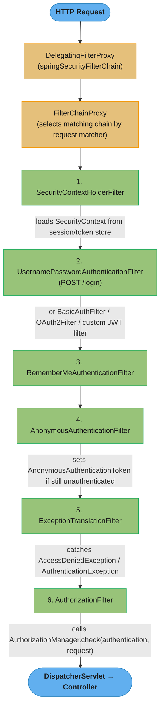
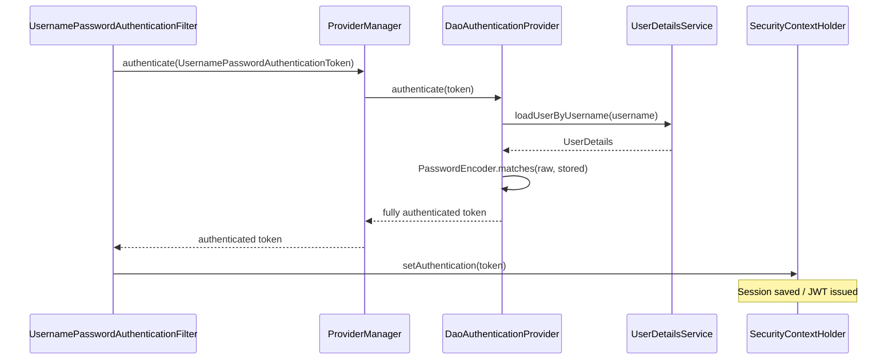
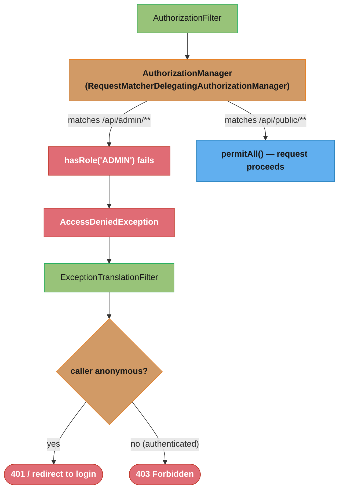
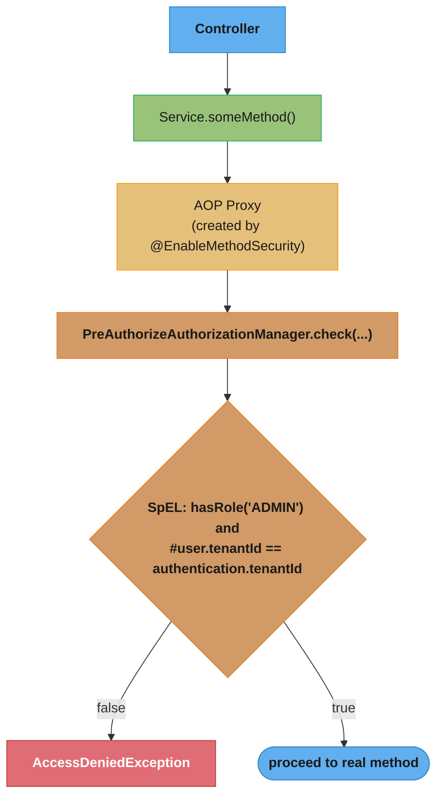

# Spring Security Architecture

## 1. Concept Overview

Spring Security is a comprehensive security framework for Java applications, providing authentication (who are you?) and authorization (what are you allowed to do?) as orthogonal concerns wired together through a servlet filter chain. It integrates with Spring's dependency injection and AOP infrastructure while remaining usable outside Spring MVC.

The core architectural pillars are:

- **FilterChainProxy** — the single entry point from the servlet container; delegates to ordered `SecurityFilterChain` instances
- **SecurityFilterChain** — an ordered list of `jakarta.servlet.Filter` implementations, each responsible for one security concern
- **SecurityContextHolder** — ThreadLocal storage for the authenticated principal; the single source of truth for "who is the current user"
- **AuthenticationManager** — authenticates credentials; delegates to a list of `AuthenticationProvider` implementations
- **AuthorizationManager** — makes access-control decisions using the `Authentication` from `SecurityContextHolder`

Spring Boot 3.x / Spring Security 6.x made breaking changes: `WebSecurityConfigurerAdapter` was removed, lambda DSL became the only way to configure `HttpSecurity`, and `@EnableMethodSecurity` replaced `@EnableGlobalMethodSecurity`.

---

## 2. Intuition

**One-line analogy:** Spring Security is a series of checkpoints at a building entrance — each guard (filter) checks one thing (identity, badge validity, room permissions) in order, and any guard can stop you before the next.

**Mental model:** Every HTTP request passes through an ordered sequence of filters. Filters execute before the servlet/controller. Each filter either sets context (authentication filters), gates access (authorization filters), or handles errors (exception translation filters). The controller is only reached if all relevant filters pass.

**Why it matters:** Security logic scattered across controllers is untestable, inconsistent, and easy to forget on new endpoints. Centralizing it in filters means every request — including those to future endpoints — is automatically covered by the configured rules.

**Key insight:** Spring Security 6.x (Spring Boot 3.x) requires all configuration via `SecurityFilterChain` beans with lambda DSL. The old `extends WebSecurityConfigurerAdapter` approach will not compile. Understanding the filter chain order is essential for diagnosing why security rules are applied (or not applied) to specific requests.

---

## 3. Core Principles

1. **Separation of authentication and authorization.** Authentication determines identity (produces an `Authentication` object). Authorization determines permissions (reads the `Authentication` object). They are completely decoupled.
2. **Filter chain is the integration point.** Spring Security does not require Spring MVC. It integrates at the servlet filter level, making it applicable to any servlet-based application.
3. **SecurityContextHolder is thread-bound.** The authenticated user's identity is stored in a `ThreadLocal` and is automatically available to any code running on the same thread within a request.
4. **Fail-closed by default.** If no `SecurityFilterChain` matches, or if authorization fails, Spring Security denies access. You explicitly open routes rather than explicitly close them.
5. **Defense in depth.** Multiple layers (filter chain, method security, URL pattern matching) enforce security independently, so a misconfigured URL pattern cannot bypass method-level checks.
6. **Composable architecture.** Each `AuthenticationProvider` handles one credential type (password, OAuth2 token, SAML assertion). `ProviderManager` composes them; the first successful provider wins.

---

## 4. Types / Architectures / Strategies

### Authentication Mechanisms

| Mechanism | Filter | AuthenticationProvider |
|---|---|---|
| Username/Password (form login) | `UsernamePasswordAuthenticationFilter` | `DaoAuthenticationProvider` |
| HTTP Basic | `BasicAuthenticationFilter` | `DaoAuthenticationProvider` |
| Bearer token (JWT) | Custom `OncePerRequestFilter` | Custom `AuthenticationProvider` |
| OAuth2 login (social) | `OAuth2LoginAuthenticationFilter` | `OidcAuthorizationCodeAuthenticationProvider` |
| SAML 2.0 | `Saml2WebSsoAuthenticationFilter` | `OpenSaml4AuthenticationProvider` |
| Remember-Me | `RememberMeAuthenticationFilter` | `RememberMeAuthenticationProvider` |
| Anonymous | `AnonymousAuthenticationFilter` | (sets `AnonymousAuthenticationToken` if no auth yet) |

### Authorization Strategies

| Strategy | API | When Used |
|---|---|---|
| URL pattern-based | `http.authorizeHttpRequests(...)` | Coarse-grained, applies before controller |
| Method-level | `@PreAuthorize`, `@PostAuthorize` | Fine-grained, applied via AOP after reaching the service layer |
| Object-level (ACL) | Spring Security ACL module | Per-instance permission (e.g., "user X owns resource Y") |
| Domain-specific | Custom `AuthorizationManager` | Complex business rules not expressible in SpEL |

### SecurityContextHolder Strategies

| Strategy | Class Constant | Use Case |
|---|---|---|
| `THREAD_LOCAL` (default) | `SecurityContextHolder.MODE_THREADLOCAL` | Standard web applications; one thread per request |
| `INHERITABLE_THREAD_LOCAL` | `SecurityContextHolder.MODE_INHERITABLETHREADLOCAL` | SecurityContext propagated to child threads (e.g., `ForkJoinPool`) |
| `GLOBAL` | `SecurityContextHolder.MODE_GLOBAL` | Standalone desktop applications; single shared context |

### Session Management Policies

| Policy | Behavior |
|---|---|
| `ALWAYS` | Creates session if one doesn't exist |
| `IF_REQUIRED` (default) | Creates session when needed by Spring Security |
| `NEVER` | Never creates, but uses existing session if present |
| `STATELESS` | Never creates or uses a session; used for REST/JWT APIs |

---

## 5. Architecture Diagrams

### FilterChainProxy Request Pipeline



Every request runs the same ordered gauntlet of filters before reaching a controller; any filter can short-circuit the chain, which is why filter order (not just filter presence) determines behavior.

### Authentication Flow (within step 2)



`ProviderManager` never talks to the database directly — it delegates to `DaoAuthenticationProvider`, which is the only component that knows about `UserDetailsService` and the password encoder.

### Authorization Flow (step 6)



`ExceptionTranslationFilter` is the piece that turns a thrown `AccessDeniedException` into the right HTTP status: 401 for anonymous callers who never authenticated, 403 for authenticated callers who lack permission.

### Method Security (orthogonal layer)



Method security is orthogonal to the filter chain: it runs at the AOP proxy boundary, not the servlet boundary, which is exactly why self-invocation (calling `this.method()` instead of going through the proxy) silently bypasses it.

---

## 6. How It Works — Detailed Mechanics

### Spring Security 6.x Configuration (Spring Boot 3.x)

```java
@Configuration
@EnableWebSecurity
@EnableMethodSecurity  // activates @PreAuthorize, @PostAuthorize, @PreFilter, @PostFilter
public class SecurityConfig {

    @Bean
    public SecurityFilterChain filterChain(HttpSecurity http) throws Exception {
        http
            // Lambda DSL required in Spring Security 6.x
            .authorizeHttpRequests(auth -> auth
                .requestMatchers("/actuator/health", "/api/public/**").permitAll()
                .requestMatchers("/api/admin/**").hasRole("ADMIN")
                .requestMatchers(HttpMethod.GET, "/api/products/**").hasAnyRole("USER", "ADMIN")
                .anyRequest().authenticated()
            )
            .formLogin(form -> form
                .loginPage("/login")
                .defaultSuccessUrl("/dashboard", true)
                .permitAll()
            )
            .logout(logout -> logout
                .logoutUrl("/logout")
                .logoutSuccessUrl("/login?logout")
                .invalidateHttpSession(true)
                .deleteCookies("JSESSIONID")
            )
            .csrf(csrf -> csrf
                .ignoringRequestMatchers("/api/**")  // disable CSRF for stateless REST
            )
            .sessionManagement(session -> session
                .sessionCreationPolicy(SessionCreationPolicy.IF_REQUIRED)
                .sessionFixation().migrateSession()  // new session ID on login
                .maximumSessions(1)                  // prevent concurrent logins
            );

        return http.build();
    }

    @Bean
    public PasswordEncoder passwordEncoder() {
        // DelegatingPasswordEncoder: stores {bcrypt}hash, {argon2}hash, etc.
        // Supports multiple algorithms simultaneously — critical for password migration
        return PasswordEncoderFactories.createDelegatingPasswordEncoder();
    }
}
```

### Stateless JWT Configuration

```java
@Bean
public SecurityFilterChain jwtFilterChain(HttpSecurity http, JwtAuthenticationFilter jwtFilter)
        throws Exception {
    http
        .sessionManagement(sm -> sm.sessionCreationPolicy(SessionCreationPolicy.STATELESS))
        .csrf(csrf -> csrf.disable())  // no session, no CSRF risk
        .authorizeHttpRequests(auth -> auth
            .requestMatchers("/api/auth/**").permitAll()
            .anyRequest().authenticated()
        )
        .addFilterBefore(jwtFilter, UsernamePasswordAuthenticationFilter.class);

    return http.build();
}

// Custom JWT filter
@Component
public class JwtAuthenticationFilter extends OncePerRequestFilter {

    @Override
    protected void doFilterInternal(HttpServletRequest request,
                                    HttpServletResponse response,
                                    FilterChain filterChain) throws ServletException, IOException {
        String header = request.getHeader("Authorization");
        if (header == null || !header.startsWith("Bearer ")) {
            filterChain.doFilter(request, response);
            return;
        }
        String token = header.substring(7);
        if (jwtService.isValid(token)) {
            String username = jwtService.extractUsername(token);
            UserDetails userDetails = userDetailsService.loadUserByUsername(username);
            UsernamePasswordAuthenticationToken auth =
                new UsernamePasswordAuthenticationToken(userDetails, null, userDetails.getAuthorities());
            auth.setDetails(new WebAuthenticationDetailsSource().buildDetails(request));
            SecurityContextHolder.getContext().setAuthentication(auth);
        }
        filterChain.doFilter(request, response);
    }
}
```

### UserDetailsService and PasswordEncoder

```java
@Service
public class CustomUserDetailsService implements UserDetailsService {

    @Autowired
    private UserRepository userRepository;

    @Override
    public UserDetails loadUserByUsername(String username) throws UsernameNotFoundException {
        return userRepository.findByEmail(username)
            .map(user -> User.builder()
                .username(user.getEmail())
                .password(user.getPasswordHash())  // already encoded; Spring verifies
                .roles(user.getRoles().toArray(new String[0]))
                .accountExpired(!user.isActive())
                .credentialsExpired(user.isPasswordExpired())
                .build())
            .orElseThrow(() -> new UsernameNotFoundException("User not found: " + username));
    }
}

// Encoding passwords
@Service
public class RegistrationService {

    @Autowired
    private PasswordEncoder passwordEncoder;

    public void register(String email, String rawPassword) {
        // BCrypt with cost factor 12: ~300ms encode time (intentionally slow)
        String hash = passwordEncoder.encode(rawPassword);
        // stored as: {bcrypt}$2a$12$...
        userRepository.save(new User(email, hash));
    }
}
```

### Method Security with SpEL

```java
@Service
public class DocumentService {

    // Only ADMIN or the owner can delete
    @PreAuthorize("hasRole('ADMIN') or #document.ownerEmail == authentication.name")
    public void deleteDocument(Document document) {
        documentRepository.delete(document);
    }

    // Filter return collection: only return documents owned by current user
    @PostFilter("filterObject.ownerEmail == authentication.name")
    public List<Document> findAll() {
        return documentRepository.findAll();
    }

    // Filter input collection before method receives it
    @PreFilter("filterObject.ownerEmail == authentication.name")
    public void archiveDocuments(List<Document> documents) {
        documentRepository.archiveAll(documents);
    }

    // Verify return value satisfies condition
    @PostAuthorize("returnObject.ownerEmail == authentication.name")
    public Document findById(Long id) {
        return documentRepository.findById(id).orElseThrow();
    }
}
```

### CORS Configuration

```java
@Bean
public CorsConfigurationSource corsConfigurationSource() {
    CorsConfiguration config = new CorsConfiguration();
    config.setAllowedOrigins(List.of("https://app.example.com"));
    config.setAllowedMethods(List.of("GET", "POST", "PUT", "DELETE", "OPTIONS"));
    config.setAllowedHeaders(List.of("Authorization", "Content-Type", "X-Requested-With"));
    config.setAllowCredentials(true);
    config.setMaxAge(3600L);  // pre-flight cache for 1 hour

    UrlBasedCorsConfigurationSource source = new UrlBasedCorsConfigurationSource();
    source.registerCorsConfiguration("/api/**", config);
    return source;
}

// Wire into security config:
http.cors(cors -> cors.configurationSource(corsConfigurationSource()));
// IMPORTANT: cors() must be configured before any authorizeHttpRequests()
// Spring Security handles CORS via CorsFilter, which runs before authentication filters
```

### SecurityContext with @Async

```java
@Configuration
@EnableAsync
public class AsyncConfig implements AsyncConfigurer {

    @Autowired
    private SecurityContextHolderStrategy securityContextHolderStrategy;

    @Override
    public Executor getAsyncExecutor() {
        ThreadPoolTaskExecutor executor = new ThreadPoolTaskExecutor();
        executor.setCorePoolSize(10);
        executor.setMaxPoolSize(50);
        executor.initialize();

        // Wraps executor to propagate SecurityContext to async threads
        return new DelegatingSecurityContextAsyncTaskExecutor(executor);
    }
}

// Without DelegatingSecurityContextAsyncTaskExecutor:
// @Async methods run on a different thread; SecurityContextHolder.getContext()
// returns an empty context (MODE_THREADLOCAL is thread-bound, not inherited).
// @PreAuthorize on async methods will throw AccessDeniedException.
```

### DelegatingPasswordEncoder for Migration

```java
// During migration from plain MD5 to BCrypt:
// Existing stored passwords: "md5:{hash}", new passwords: "{bcrypt}{hash}"
// DelegatingPasswordEncoder handles both transparently

Map<String, PasswordEncoder> encoders = new HashMap<>();
encoders.put("bcrypt", new BCryptPasswordEncoder(12));  // cost factor 12 = ~300ms
encoders.put("argon2", new Argon2PasswordEncoder(16, 32, 1, 65536, 10));
encoders.put("pbkdf2", new Pbkdf2PasswordEncoder("secret", 16, 185000, SecretKeyFactoryAlgorithm.PBKDF2WithHmacSHA256));

// "bcrypt" is the default encoder for new passwords
PasswordEncoder delegating = new DelegatingPasswordEncoder("bcrypt", encoders);

// Verification: reads the prefix {bcrypt}, {argon2} to select the right encoder
boolean matches = delegating.matches(rawPassword, "{bcrypt}$2a$12$...");
```

---

## 7. Real-World Examples

### Multi-Tenant SaaS Application

Each request carries a JWT with a `tenantId` claim. A custom `JwtAuthenticationFilter` extracts the tenant and sets it on the `Authentication` object. Method security uses `@PreAuthorize("authentication.details.tenantId == #resource.tenantId")` to enforce tenant isolation at the service layer, independent of URL patterns.

### Microservices with OAuth2 Resource Server

Each microservice configures `http.oauth2ResourceServer(oauth2 -> oauth2.jwt(...))`. The API gateway issues JWTs; downstream services validate the signature against the public key fetched from `/.well-known/jwks.json`. No session, no database lookup per request — stateless validation at ~0.5ms per token.

### Admin Portal with Role Hierarchy

`ROLE_SUPER_ADMIN` implicitly includes `ROLE_ADMIN` which includes `ROLE_USER`. Configure with `RoleHierarchyImpl`. Method security `@PreAuthorize("hasRole('ADMIN')")` passes for `SUPER_ADMIN` users without listing all roles explicitly.

### Legacy Application Password Migration

10 million users have SHA-1 hashed passwords. `DelegatingPasswordEncoder` stores `{sha1}{hash}` for existing users. On successful login, Spring Security re-encodes the verified raw password with BCrypt and updates the stored hash transparently. After 6 months, force-reset remaining SHA-1 accounts.

---

## 8. Tradeoffs

### Session-Based vs Stateless JWT

| Dimension | Session-Based | Stateless JWT |
|---|---|---|
| Server memory | O(active sessions) | O(1) |
| Revocation | Instant (delete session) | Requires blacklist or short expiry |
| Horizontal scaling | Requires session replication or sticky sessions | Trivially horizontal |
| CSRF risk | Yes (mitigated by SameSite + CSRF token) | No (no cookie, Bearer header) |
| Network overhead | Session ID cookie only | Full JWT payload each request |
| Token size | ~50 bytes (session ID) | 500–2000 bytes (JWT) |
| Suitable for | Traditional web apps, SSO with IdP | REST APIs, microservices |

### BCrypt Cost Factor

| Cost Factor | Encode Time (approx.) | Security Level |
|---|---|---|
| 10 (Spring default) | ~100ms | Acceptable for most apps |
| 12 (recommended) | ~300ms | Production recommendation |
| 14 | ~1200ms | High-security (consider Argon2) |

**What the formula is telling you.** "The cost factor is an exponent, not a dial — each `+1` doubles the work, so the small-looking step from 10 to 12 makes an attacker's password-cracking rig four times slower."

The number in `BCryptPasswordEncoder(12)` is `log2` of the iteration count. Reading it as a linear 1-to-14 scale is the standard misinterpretation, and it makes the security difference between 10 and 12 look trivial when it is 4x.

| Symbol | What it is |
|--------|------------|
| cost factor | The exponent stored in the hash (`$2a$12$...`). Range 4-31 |
| `2^cost` | Actual key-expansion rounds BCrypt performs |
| encode time | Wall-clock cost of one hash, roughly proportional to `2^cost` |
| `+1` to cost | Doubles both defender cost and attacker cost. The whole design |
| the salt | 16 random bytes per password, stored in the hash — defeats rainbow tables |

**Walk one example.** Expand the three rows of the table into their true round counts:

```
  cost    2^cost rounds    relative work    table's measured time
    10          1,024           1x               ~100 ms
    12          4,096           4x               ~300 ms
    14         16,384          16x              ~1200 ms

  Step arithmetic:
    10 -> 12  =  2^12 / 2^10  =  4096 / 1024  =  4x the work
    12 -> 14  =  2^14 / 2^12  = 16384 / 4096  =  4x the work

  What it costs an attacker with a stolen password table:
    at cost 10, cracking 1 million candidate passwords takes T
    at cost 12, the same 1 million candidates take 4T
    at cost 14, the same 1 million candidates take 16T
```

The published times track the doubling law loosely rather than exactly — 12 to 14 lands on a clean 4x (300 to 1200 ms) while 10 to 12 is quoted as 3x (100 to 300 ms), since these are rounded measurements on real hardware, not derived figures. Trust the `2^cost` ratio as the invariant; treat the millisecond column as hardware-specific and re-measure it on your own machines.

**Why the defender's 300 ms is the real constraint.** BCrypt is deliberately slow, so the cost factor is bounded by your own login throughput, not by how much security you want. At cost 12, one core completes about `1 / 0.3 = 3.3` logins per second. A login storm of 300 concurrent sign-ins needs roughly 90 cores of headroom, which is why raising the cost factor is a capacity decision as much as a security one — and why an unthrottled login endpoint at cost 14 is itself a denial-of-service vector.

Argon2id is the current OWASP recommendation for new systems, offering memory-hardness that resists GPU/ASIC attacks better than BCrypt.

### URL Pattern vs Method Security

| | URL Pattern Security | Method Security |
|---|---|---|
| Layer | Filter chain (before servlet) | AOP (at service method) |
| Granularity | Coarse (URL path + HTTP method) | Fine (method parameters, return values) |
| Bypass risk | Misconfigured patterns | Self-invocation bypasses proxy |
| Performance | Minimal (string matching) | AOP proxy overhead per call |
| Recommended for | Public/private endpoint separation | Business rule authorization |

---

## 9. When to Use / When NOT to Use

### Use Spring Security When

- The application has authentication and authorization requirements of any complexity.
- You need defense-in-depth: URL-level and method-level access control independently enforced.
- Multiple authentication mechanisms are needed (form login + OAuth2 + API key).
- Password storage, CSRF protection, CORS, session management, and clickjacking protection are needed out of the box.
- You need to integrate with an OAuth2 authorization server or SAML IdP.

### Do NOT Use Spring Security (or be aware of limitations) When

- Building a stateless microservice that only validates JWTs — consider a lightweight filter without the full Spring Security infrastructure if startup time and memory are critical.
- The "security" is entirely delegated to an API gateway (Nginx, Kong, AWS API Gateway) — you may still want `@PreAuthorize` at the service layer, but the filter chain can be minimal.
- You need per-object (ACL) security at scale — Spring Security ACL uses a database table per ACE and can become a query bottleneck at millions of objects; consider a dedicated authorization service (OPA, Casbin).

---

## 10. Common Pitfalls

### Pitfall 1: CORS Filter Must Run Before Spring Security Filters

```java
// BROKEN: registering CORS configuration without wiring it into Spring Security
// The browser sends an OPTIONS pre-flight; Spring Security rejects it with 401
// before the CORS headers are set, so the browser never sees the CORS response

@Bean
public FilterRegistrationBean<CorsFilter> corsFilterBean() {
    CorsConfiguration config = new CorsConfiguration();
    config.addAllowedOrigin("https://app.example.com");
    // ...
    UrlBasedCorsConfigurationSource source = new UrlBasedCorsConfigurationSource();
    source.registerCorsConfiguration("/**", config);
    FilterRegistrationBean<CorsFilter> bean = new FilterRegistrationBean<>(new CorsFilter(source));
    bean.setOrder(Ordered.HIGHEST_PRECEDENCE);  // registered in servlet container
    return bean;
    // Problem: Spring Security's FilterChainProxy is also registered; ordering between
    // FilterRegistrationBean and FilterChainProxy is not guaranteed this way
}
```

```java
// FIX: configure CORS directly through HttpSecurity.cors()
// This ensures CorsFilter runs as the FIRST filter in Spring Security's own chain

@Bean
public SecurityFilterChain filterChain(HttpSecurity http) throws Exception {
    http
        .cors(cors -> cors.configurationSource(corsConfigurationSource()))  // must be first
        .csrf(csrf -> csrf.disable())
        .authorizeHttpRequests(auth -> auth.anyRequest().authenticated());
    return http.build();
}

@Bean
public CorsConfigurationSource corsConfigurationSource() {
    CorsConfiguration config = new CorsConfiguration();
    config.setAllowedOrigins(List.of("https://app.example.com"));
    config.setAllowedMethods(List.of("GET", "POST", "PUT", "DELETE", "OPTIONS"));
    config.setAllowCredentials(true);
    UrlBasedCorsConfigurationSource source = new UrlBasedCorsConfigurationSource();
    source.registerCorsConfiguration("/api/**", config);
    return source;
}
```

### Pitfall 2: @PreAuthorize Not Working — Missing @EnableMethodSecurity

```java
// BROKEN: @PreAuthorize annotated but never enforced
// No exception, no error, but access is granted to everyone

@Service
public class AdminService {

    @PreAuthorize("hasRole('ADMIN')")
    public void deleteUser(Long id) {  // called by any authenticated user without restriction
        userRepository.deleteById(id);
    }
}

// Root cause: @EnableMethodSecurity (Spring 6.x) or @EnableGlobalMethodSecurity (Spring 5.x)
// was not added to any @Configuration class
```

```java
// FIX: add @EnableMethodSecurity to the security configuration class

@Configuration
@EnableWebSecurity
@EnableMethodSecurity(prePostEnabled = true)  // enables @PreAuthorize, @PostAuthorize, etc.
public class SecurityConfig {
    // ...
}

// Spring Security 5.x (Spring Boot 2.x) — deprecated but still works:
// @EnableGlobalMethodSecurity(prePostEnabled = true, securedEnabled = true)

// Note: @EnableMethodSecurity uses AuthorizationManagerBeforeMethodInterceptor (AOP),
// which requires the service bean to be called through a Spring proxy.
// Direct instantiation or self-invocation bypasses the check.
```

### Pitfall 3: Self-Invocation Bypasses @PreAuthorize

```java
// BROKEN: internal call bypasses AOP proxy; @PreAuthorize never evaluated
@Service
public class ReportService {

    public void generateAllReports() {
        generateAdminReport();  // 'this.generateAdminReport()' — no proxy, no security check
    }

    @PreAuthorize("hasRole('ADMIN')")
    public void generateAdminReport() {
        // should only run for admins, but self-invocation bypasses the check
    }
}
```

```java
// FIX: inject the bean into itself or split into separate beans
@Service
public class ReportService {

    @Autowired
    @Lazy
    private ReportService self;

    public void generateAllReports() {
        self.generateAdminReport();  // goes through proxy — @PreAuthorize is evaluated
    }

    @PreAuthorize("hasRole('ADMIN')")
    public void generateAdminReport() { ... }
}
```

### Pitfall 4: WebSecurityConfigurerAdapter in Spring Security 6.x

```java
// BROKEN: does not compile with Spring Security 6.x (Spring Boot 3.x)
// WebSecurityConfigurerAdapter was removed in Spring Security 6.0

@Configuration
public class SecurityConfig extends WebSecurityConfigurerAdapter {  // COMPILE ERROR in Boot 3

    @Override
    protected void configure(HttpSecurity http) throws Exception {
        http.authorizeRequests()
            .antMatchers("/public/**").permitAll()
            .anyRequest().authenticated();
    }
}
```

```java
// FIX: SecurityFilterChain @Bean with lambda DSL
@Configuration
@EnableWebSecurity
public class SecurityConfig {

    @Bean
    public SecurityFilterChain filterChain(HttpSecurity http) throws Exception {
        http
            .authorizeHttpRequests(auth -> auth  // authorizeHttpRequests replaces authorizeRequests
                .requestMatchers("/public/**").permitAll()  // requestMatchers replaces antMatchers
                .anyRequest().authenticated()
            );
        return http.build();
    }
}
```

### Pitfall 5: SecurityContext Lost in @Async Methods

```java
// BROKEN: @Async method cannot see authenticated user
@Service
public class NotificationService {

    @Async
    public void sendWelcomeEmail(Long userId) {
        // SecurityContextHolder.getContext().getAuthentication() returns null here
        // because @Async runs on a thread pool thread; ThreadLocal is not inherited
        Authentication auth = SecurityContextHolder.getContext().getAuthentication();
        log.info("Sending email on behalf of: {}", auth.getName());  // NullPointerException
    }
}
```

```java
// FIX: use DelegatingSecurityContextAsyncTaskExecutor
@Configuration
@EnableAsync
public class AsyncConfig {

    @Bean("securityAwareExecutor")
    public Executor securityAwareExecutor() {
        ThreadPoolTaskExecutor delegate = new ThreadPoolTaskExecutor();
        delegate.setCorePoolSize(5);
        delegate.initialize();
        // copies SecurityContext from calling thread to async thread
        return new DelegatingSecurityContextAsyncTaskExecutor(delegate);
    }
}

@Async("securityAwareExecutor")  // use the wrapped executor
public void sendWelcomeEmail(Long userId) {
    Authentication auth = SecurityContextHolder.getContext().getAuthentication();
    log.info("Sending email on behalf of: {}", auth.getName());  // works correctly
}
```

### Pitfall 6: Storing Roles Without ROLE_ Prefix

```java
// BROKEN: role stored as "ADMIN", but hasRole('ADMIN') checks for "ROLE_ADMIN"
// hasRole() automatically prepends "ROLE_" — if stored without prefix, check always fails
UserDetails user = User.builder()
    .username("admin@example.com")
    .password(encodedPassword)
    .authorities("ADMIN")  // stored as "ADMIN", not "ROLE_ADMIN"
    .build();
// http.authorizeHttpRequests(auth -> auth.requestMatchers("/admin").hasRole("ADMIN"))
// translates to: check for authority "ROLE_ADMIN" — never matches
```

```java
// FIX option 1: use roles() which adds ROLE_ prefix automatically
UserDetails user = User.builder()
    .username("admin@example.com")
    .password(encodedPassword)
    .roles("ADMIN")  // stores as "ROLE_ADMIN"
    .build();

// FIX option 2: use hasAuthority() which does NOT add prefix
http.authorizeHttpRequests(auth -> auth
    .requestMatchers("/admin").hasAuthority("ADMIN")  // exact match, no prefix added
);
```

---

## 11. Technologies & Tools

| Technology | Role | Notes |
|---|---|---|
| `spring-boot-starter-security` | Auto-configures Spring Security with sensible defaults | Enables HTTP Basic, generates random password on startup if no config |
| Spring Security 6.x | Core framework | Requires Spring Boot 3.x; Java 17 minimum |
| `spring-security-oauth2-resource-server` | JWT/opaque token validation for APIs | `http.oauth2ResourceServer(...)` |
| `spring-security-oauth2-client` | OAuth2 login (social login, SSO) | Handles authorization code flow |
| `spring-security-test` | `@WithMockUser`, `@WithUserDetails`, `MockMvc` security testing | `SecurityMockMvcRequestPostProcessors.csrf()` |
| Nimbus JOSE + JWT | JWT parsing and validation | Used internally by Spring Security OAuth2 Resource Server |
| Argon2 | Memory-hard password hashing (OWASP recommended) | `spring-security-crypto`; requires Bouncy Castle |
| BCrypt | Default password hashing; cost factor 10–12 | ~100ms–300ms encode time intentionally |
| Redisson / Spring Session | Distributed session storage | Enables horizontal scaling without sticky sessions |
| Spring Security ACL | Per-object permission management | Separate module; use `spring-security-acl` |
| Keycloak / Okta / Auth0 | External OAuth2/OIDC authorization servers | Spring Security acts as resource server validating their JWTs |
| Micrometer + Spring Boot Actuator | Security event metrics | Failed logins, session events via `ApplicationEventPublisher` |

---

## 12. Interview Questions with Answers

**Q: What is FilterChainProxy and how does it differ from a regular servlet filter?**
`FilterChainProxy` is a single `javax.servlet.Filter` registered in the servlet container that internally delegates to one or more `SecurityFilterChain` instances based on request matching. Unlike a regular filter registered directly in the container, `FilterChainProxy` allows multiple independent filter chains, each with different URL matchers. Only the first matching chain processes the request. This enables distinct security configurations for, say, `/api/**` (stateless JWT) and `/admin/**` (form login with session).

**Q: Walk through a successful username/password authentication in Spring Security.**
The request hits `UsernamePasswordAuthenticationFilter`, which extracts credentials and creates an unauthenticated `UsernamePasswordAuthenticationToken`. This token is passed to `ProviderManager.authenticate()`, which iterates its list of `AuthenticationProvider`s. `DaoAuthenticationProvider` calls `UserDetailsService.loadUserByUsername()` to retrieve the `UserDetails`, then calls `PasswordEncoder.matches(rawPassword, storedHash)`. On success, a fully authenticated token is created with granted authorities. `SecurityContextHolder.getContext().setAuthentication(token)` stores it. `AuthenticationSuccessHandler` redirects or returns a response.

**Q: What is the difference between `hasRole()` and `hasAuthority()` in Spring Security?**
`hasRole('ADMIN')` automatically prepends the `ROLE_` prefix and checks for the authority `ROLE_ADMIN`. `hasAuthority('ADMIN')` checks for the exact string `ADMIN` without any prefix manipulation. When using `User.builder().roles("ADMIN")`, the authority is stored as `ROLE_ADMIN`, so `hasRole('ADMIN')` is the correct match. When using `User.builder().authorities("ADMIN")`, use `hasAuthority('ADMIN')`. Mixing them (e.g., storing with `authorities("ADMIN")` but checking with `hasRole("ADMIN")`) results in authorization always failing silently.

**Q: What changed between Spring Security 5.x and 6.x (Spring Boot 2.x vs 3.x)?**
`WebSecurityConfigurerAdapter` was removed; all configuration must now be `SecurityFilterChain` beans. `antMatchers()` was replaced by `requestMatchers()`. Lambda DSL is required; method-chaining without lambdas no longer works. `@EnableGlobalMethodSecurity` was deprecated in 5.6 and removed conceptually in favor of `@EnableMethodSecurity`. `authorizeRequests()` was replaced by `authorizeHttpRequests()`. LDAP, CAS, and various adapters moved to separate modules.

**Q: How does `ProviderManager` work when multiple `AuthenticationProvider`s are registered?**
`ProviderManager` iterates its `List<AuthenticationProvider>` and calls `supports(Class)` on each to find compatible providers. For each compatible provider, it calls `authenticate(authentication)`. If the provider returns a non-null fully authenticated token, iteration stops and that result is returned. If the provider throws `AuthenticationException`, it is recorded but iteration continues to the next provider. If all providers fail or abstain, `ProviderManager` throws the last `AuthenticationException` or delegates to a parent `ProviderManager` if configured.

**Q: How does Spring Security protect against CSRF attacks?**
By default, Spring Security generates a CSRF token per session stored in `HttpSession` and expects it in subsequent state-changing requests (POST, PUT, DELETE, PATCH) as either a form field or request header `X-CSRF-Token`. On each request, `CsrfFilter` compares the submitted token with the session-stored token; mismatch results in 403. For REST APIs using stateless JWT (no session, no cookies), CSRF is not a risk and `csrf.disable()` is appropriate. `SameSite=Strict` cookies are an alternative protection that prevents cross-origin form submissions.

**Q: What is session fixation and how does Spring Security prevent it?**
Session fixation is an attack where an attacker establishes a known session ID (e.g., via URL parameter or pre-authentication), tricks the victim into authenticating with that ID, and then uses the now-authenticated session. Spring Security's default `sessionFixation().migrateSession()` creates a new session with a new ID upon successful authentication and migrates all session attributes, invalidating the attacker's known ID. `newSession()` creates a new session without migrating attributes. `none()` disables the protection.

**Q: How do you propagate the SecurityContext to threads spawned by `@Async` methods?**
`SecurityContextHolder` uses `ThreadLocal` by default, so spawned threads see an empty context. Use `DelegatingSecurityContextAsyncTaskExecutor` which wraps the delegate `Executor` and copies the `SecurityContext` from the calling thread to each submitted task before execution. Configure it as the `@Async` executor in an `AsyncConfigurer` implementation or qualify it on the `@Async("executorName")` annotation.

**Q: What is `DelegatingPasswordEncoder` and when is it necessary?**
`DelegatingPasswordEncoder` stores a prefix with each hashed password indicating which algorithm was used (e.g., `{bcrypt}$2a$12$...`, `{argon2}...`). On `matches()`, it reads the prefix, selects the appropriate `PasswordEncoder`, and delegates. It is essential for password migration — existing hashed passwords stored with an older algorithm (MD5, SHA-1, plain BCrypt cost 4) continue to work while new passwords are stored with the current preferred algorithm. `PasswordEncoderFactories.createDelegatingPasswordEncoder()` provides a production-ready instance with BCrypt as the default.

**Q: Explain the role of `ExceptionTranslationFilter` in the security filter chain.**
`ExceptionTranslationFilter` wraps the remaining filter chain (primarily `AuthorizationFilter`) in a try-catch block. It catches two exception types: `AuthenticationException` triggers `AuthenticationEntryPoint` (which redirects to login or returns 401 for APIs) and `AccessDeniedException` checks whether the current user is anonymous — if anonymous, triggers `AuthenticationEntryPoint`; if authenticated, triggers `AccessDeniedHandler` (returns 403). Without this filter, `AccessDeniedException` from the authorization layer would propagate as a 500 error instead of a meaningful 403/401.

**Q: How does `@PostAuthorize` differ from `@PreAuthorize` in terms of execution timing and use case?**
`@PreAuthorize` evaluates its SpEL expression before the method executes; if the expression returns false, `AccessDeniedException` is thrown immediately and the method body never runs. `@PostAuthorize` evaluates after the method returns, with access to `returnObject` via `#result`; this allows authorizing based on the returned data (e.g., verifying the fetched document belongs to the current user). The method always executes for `@PostAuthorize`; the side effect (e.g., a database read) already occurred even if access is subsequently denied.

**Q: How do you implement multiple SecurityFilterChain instances for different URL prefixes?**
Annotate each `SecurityFilterChain` `@Bean` with `@Order` to set priority. Attach a `securityMatcher()` to each chain to restrict which requests it handles. Spring Security selects the first matching chain.

```java
@Bean
@Order(1)
public SecurityFilterChain apiChain(HttpSecurity http) throws Exception {
    http
        .securityMatcher("/api/**")
        .sessionManagement(sm -> sm.sessionCreationPolicy(SessionCreationPolicy.STATELESS))
        .csrf(csrf -> csrf.disable())
        .authorizeHttpRequests(auth -> auth.anyRequest().authenticated())
        .addFilterBefore(jwtFilter, UsernamePasswordAuthenticationFilter.class);
    return http.build();
}

@Bean
@Order(2)
public SecurityFilterChain webChain(HttpSecurity http) throws Exception {
    http
        .authorizeHttpRequests(auth -> auth
            .requestMatchers("/public/**").permitAll()
            .anyRequest().authenticated())
        .formLogin(Customizer.withDefaults());
    return http.build();
}
```

**Q: What is the `AuthorizationManager` API introduced in Spring Security 5.6 / 6.x?**
`AuthorizationManager<T>` replaces `AccessDecisionManager` and its voter pattern. It provides a single `check(Supplier<Authentication>, T object)` method returning `AuthorizationDecision`. For HTTP requests, `RequestMatcherDelegatingAuthorizationManager` maps URL patterns to `AuthorizationManager` instances. For method security, `PreAuthorizeAuthorizationManager` evaluates SpEL. The new API is simpler (no voter aggregation logic), lazy (authentication is a `Supplier` — not resolved unless needed), and directly testable.

**Q: How does Spring Security handle OAuth2 JWT validation in a resource server?**
Configure `http.oauth2ResourceServer(oauth2 -> oauth2.jwt(Customizer.withDefaults()))`. Spring Security fetches the authorization server's public keys from the JWKS URI (`spring.security.oauth2.resourceserver.jwt.jwks-uri`), caches them, and validates each incoming JWT's signature, expiry, issuer, and audience. A valid JWT results in a `JwtAuthenticationToken` placed in the `SecurityContextHolder`. Authorities are extracted from the `scope` or `roles` claim using a configurable `JwtAuthenticationConverter`. No session is required.

**Q: What are `@PreFilter` and `@PostFilter` and when do you use them?**
`@PreFilter` filters elements of an input collection before the method receives it; only elements where the SpEL expression returns true are passed to the method. `@PostFilter` filters elements of the returned collection after execution; only elements where the expression is true remain in the returned list. Use them to enforce row-level security on collection parameters or results — e.g., `@PostFilter("filterObject.tenantId == authentication.details.tenantId")` ensures a service method can only return objects belonging to the caller's tenant, regardless of what the underlying query returns.

**Q: How do you write an integration test for a Spring Security-protected endpoint?**
Use `@SpringBootTest` with `MockMvc`. Import `SecurityMockMvcRequestPostProcessors` for helpers.

```java
@SpringBootTest
@AutoConfigureMockMvc
class AdminControllerTest {

    @Autowired
    private MockMvc mockMvc;

    @Test
    @WithMockUser(roles = "ADMIN")       // sets up SecurityContext with ROLE_ADMIN
    void adminEndpoint_shouldReturn200() throws Exception {
        mockMvc.perform(get("/admin/dashboard"))
               .andExpect(status().isOk());
    }

    @Test
    @WithMockUser(roles = "USER")
    void adminEndpoint_asUser_shouldReturn403() throws Exception {
        mockMvc.perform(get("/admin/dashboard"))
               .andExpect(status().isForbidden());
    }

    @Test
    void adminEndpoint_unauthenticated_shouldReturn401() throws Exception {
        mockMvc.perform(get("/admin/dashboard"))
               .andExpect(status().isUnauthorized());
    }
}
```

**Q: What is the security implication of using `SessionCreationPolicy.STATELESS` and when is it safe?**
`STATELESS` instructs Spring Security to never create or read an `HttpSession`. On each request, authentication must be re-established from the request itself (e.g., JWT Bearer token, API key). This is safe for purely machine-to-machine APIs or mobile/SPA clients that send a token on every request. It eliminates CSRF risk (no session cookie), enables horizontal scaling without session replication, but also eliminates automatic logout via session invalidation — token expiry and token blacklisting must be managed explicitly.

**Q: What is the difference between `authenticated()`, `permitAll()`, `denyAll()`, and `anonymous()` in the authorization DSL?**
`authenticated()` requires a fully authenticated principal (anonymous tokens fail); `permitAll()` allows everyone, including unauthenticated requests, and short-circuits without running further authorization; `denyAll()` rejects everyone unconditionally (useful to lock down a path explicitly); `anonymous()` matches *only* requests carrying the anonymous authentication token, i.e. not-logged-in users, which is rarely needed directly. The subtle trap is that `permitAll()` still runs the filter chain — it does not skip authentication filters — so a JWT filter still validates a token if present; it only skips the final authorization check. Order matters: the first matching matcher wins, so place specific rules before broad ones and end with `anyRequest().authenticated()`.

**Q: Why is the order of security matchers significant, and what is the "first match wins" trap?**
Spring Security evaluates authorization matchers top-to-bottom and applies the *first* one that matches the request, ignoring the rest. If you put `anyRequest().permitAll()` (or a broad `/**` pattern) before a specific `/admin/**` rule, every request matches the broad rule first and the admin restriction never applies — a silent privilege-escalation hole. The fix is to order from most-specific to least-specific and finish with a catch-all `anyRequest()`. This is a frequent real-world misconfiguration because the app still "works" — it just authorizes too much.

**Q: How do multiple `SecurityFilterChain` beans coexist, and how does Spring pick which one handles a request?**
You can define several `SecurityFilterChain` beans, each with its own `securityMatcher` (e.g. one for `/api/**` that is stateless + JWT, one for everything else that is form-login + sessions). `FilterChainProxy` holds the ordered list and, per request, selects the *first* chain whose `securityMatcher` matches — only that chain's filters run. Use `@Order` to control evaluation order, and make the most specific matcher first; a chain with no `securityMatcher` matches everything and must come last. This is the modern way (Spring Security 5.7+/6.x) to apply different security models to different parts of one application after `WebSecurityConfigurerAdapter` was removed.

---

## 13. Best Practices

1. **Use `SecurityFilterChain` beans, never extend `WebSecurityConfigurerAdapter`.** This is mandatory for Spring Security 6.x and produces a cleaner, more testable configuration.

2. **Always configure `permitAll()` for public endpoints explicitly.** The fail-closed default means any unconfigured endpoint is implicitly protected. Never rely on "I'll add security later."

3. **Use `DelegatingPasswordEncoder` for all new applications.** This future-proofs password storage and enables zero-downtime algorithm migration.

4. **Set BCrypt cost factor to 12 in production.** Cost 10 (Spring default) is acceptable but cost 12 provides meaningfully better resistance to offline brute-force at ~300ms per hash, which is imperceptible to users.

5. **Disable CSRF only for stateless APIs.** Stateless JWT-based APIs (no cookies) are not vulnerable to CSRF. Traditional web apps with session cookies must keep CSRF enabled.

6. **Configure `cors()` through `HttpSecurity`, not as a separate `FilterRegistrationBean`.** This guarantees CORS headers are set before Spring Security's authentication filters reject OPTIONS pre-flight requests.

7. **Apply defense in depth: URL patterns AND method security.** URL patterns are coarse and can be misconfigured. Method-level `@PreAuthorize` on service methods provides a second independent enforcement layer.

8. **Use `@WithMockUser` and `@WithUserDetails` in tests.** Never test security by manually populating `SecurityContextHolder` — use the test support to ensure your `UserDetailsService` integration is also tested.

9. **Propagate `SecurityContext` explicitly in async code.** Register `DelegatingSecurityContextAsyncTaskExecutor` as the default async executor in any application using `@Async` or reactive pipelines.

10. **Log authentication events, not credentials.** Use `ApplicationEventPublisher` to listen for `AuthenticationSuccessEvent`, `AbstractAuthenticationFailureEvent`, and `AuthorizationDeniedEvent` for audit trails. Never log raw passwords or full JWT tokens.

11. **Review `requestMatchers` order carefully.** Rules are evaluated in declaration order; the first match wins. Place more specific rules (exact paths, specific HTTP methods) before more general rules (`anyRequest()`).

12. **Validate JWT `iss` and `aud` claims.** Accepting a JWT signed by a trusted key is insufficient — a token issued to one service must not be accepted by another. Configure `JwtDecoder` with issuer validation and audience validation.

---

## 14. Case Study

### Problem: Securing a Multi-Tenant SaaS Platform with Mixed Authentication Mechanisms

A SaaS platform serves two client types: a browser-based React SPA (uses OAuth2 login via Google, then receives a short-lived JWT) and a B2B partner API (uses long-lived API keys). The platform has admin users (Spring form login to an internal admin portal), regular tenant users (JWT from SPA), and service accounts (API key). All three must be handled by the same Spring Boot application.

**Requirements:**
- `/admin/**` — form login, session-based, MFA enforced
- `/api/v1/**` — stateless JWT; roles from JWT claims; tenant isolation enforced
- `/partner/v1/**` — stateless API key; rate-limited per key
- CORS enabled for SPA origin `https://app.example.com`
- `@PreAuthorize` for fine-grained method-level authorization
- Full audit log of authentication events

**Architecture:**

```
Three SecurityFilterChain beans with @Order:

  Order 1: /admin/**
    - Form login, session-based
    - SessionCreationPolicy.IF_REQUIRED
    - CSRF enabled
    - MFA enforced via custom AuthenticationProvider

  Order 2: /partner/v1/**
    - Custom ApiKeyAuthenticationFilter
    - SessionCreationPolicy.STATELESS
    - CSRF disabled
    - Rate limiting via filter before authentication

  Order 3: /api/v1/** and default
    - JWT Bearer validation (oauth2ResourceServer)
    - SessionCreationPolicy.STATELESS
    - CSRF disabled
    - CORS enabled
```

**Implementation Highlights:**

```java
@Configuration
@EnableWebSecurity
@EnableMethodSecurity
public class MultiChainSecurityConfig {

    @Bean
    @Order(1)
    public SecurityFilterChain adminChain(HttpSecurity http, MfaAuthenticationProvider mfaProvider)
            throws Exception {
        http
            .securityMatcher("/admin/**")
            .authenticationProvider(mfaProvider)
            .authorizeHttpRequests(auth -> auth
                .requestMatchers("/admin/login").permitAll()
                .anyRequest().hasRole("ADMIN")
            )
            .formLogin(form -> form.loginPage("/admin/login").defaultSuccessUrl("/admin/dashboard"))
            .sessionManagement(sm -> sm
                .sessionCreationPolicy(SessionCreationPolicy.IF_REQUIRED)
                .sessionFixation().newSession()
                .maximumSessions(1));
        return http.build();
    }

    @Bean
    @Order(2)
    public SecurityFilterChain partnerChain(HttpSecurity http, ApiKeyFilter apiKeyFilter)
            throws Exception {
        http
            .securityMatcher("/partner/v1/**")
            .addFilterBefore(apiKeyFilter, UsernamePasswordAuthenticationFilter.class)
            .sessionManagement(sm -> sm.sessionCreationPolicy(SessionCreationPolicy.STATELESS))
            .csrf(csrf -> csrf.disable())
            .authorizeHttpRequests(auth -> auth.anyRequest().authenticated());
        return http.build();
    }

    @Bean
    @Order(3)
    public SecurityFilterChain apiChain(HttpSecurity http, JwtDecoder jwtDecoder)
            throws Exception {
        http
            .cors(cors -> cors.configurationSource(corsConfigurationSource()))
            .sessionManagement(sm -> sm.sessionCreationPolicy(SessionCreationPolicy.STATELESS))
            .csrf(csrf -> csrf.disable())
            .oauth2ResourceServer(oauth2 -> oauth2
                .jwt(jwt -> jwt
                    .decoder(jwtDecoder)
                    .jwtAuthenticationConverter(tenantAwareJwtConverter())
                )
            )
            .authorizeHttpRequests(auth -> auth
                .requestMatchers("/api/v1/public/**").permitAll()
                .anyRequest().authenticated()
            );
        return http.build();
    }
}

// Tenant-aware JWT converter: extracts tenantId claim into Authentication details
public class TenantAwareJwtAuthenticationConverter
        implements Converter<Jwt, AbstractAuthenticationToken> {

    @Override
    public AbstractAuthenticationToken convert(Jwt jwt) {
        Collection<GrantedAuthority> authorities = extractAuthorities(jwt);
        JwtAuthenticationToken token = new JwtAuthenticationToken(jwt, authorities, jwt.getSubject());
        // Store tenantId for @PreAuthorize SpEL: authentication.details.tenantId
        token.setDetails(Map.of("tenantId", jwt.getClaimAsString("tenantId")));
        return token;
    }
}

// Method-level tenant isolation
@Service
public class DocumentService {

    @PreAuthorize("authentication.details['tenantId'] == #document.tenantId")
    public Document update(Document document) {
        return documentRepository.save(document);
    }
}
```

**Audit Logging:**

```java
@Component
public class SecurityAuditListener {

    @EventListener
    public void onSuccess(AuthenticationSuccessEvent event) {
        log.info("AUTH_SUCCESS user={} ip={}",
            event.getAuthentication().getName(),
            extractIp(event));
    }

    @EventListener
    public void onFailure(AbstractAuthenticationFailureEvent event) {
        log.warn("AUTH_FAILURE user={} reason={}",
            event.getAuthentication().getName(),
            event.getException().getMessage());
    }
}
```

**Results:**
- Three independent security domains coexist in one application without interference.
- Tenant isolation is enforced at the service layer via `@PreAuthorize`, independent of JWT parsing bugs.
- Admin portal uses sessions (supports forced logout, concurrent session control) while APIs remain fully stateless.
- All authentication events feed a centralized audit log without polluting business logic.
- Integration tests use `@WithMockUser(roles = "ADMIN")`, `@WithUserDetails`, and custom `SecurityMockMvcRequestPostProcessors` for API key headers, covering all three chains.

---

## Related / See Also

- [Filters & Interceptors](../filters_and_interceptors/README.md) — security filter chain
- [Spring Security JWT & OAuth2](../spring_security_jwt_oauth/README.md) — JWT resource server
- [Case Study: OAuth2 Authorization Server](../case_studies/design_oauth2_authorization_server.md) — Spring Auth Server
- [Auth & Authorization Systems](../../backend/auth_and_authorization_systems/README.md) — OAuth2/OIDC flows, session vs token tradeoffs at the systems level
- [Backend Security / OWASP](../../backend/backend_security_owasp/README.md) — CSRF, injection, and the broader web-app threat model behind these filters
- [Security & Auth (HLD)](../../hld/security_and_auth/README.md) — authn/authz at the distributed-systems architecture level
