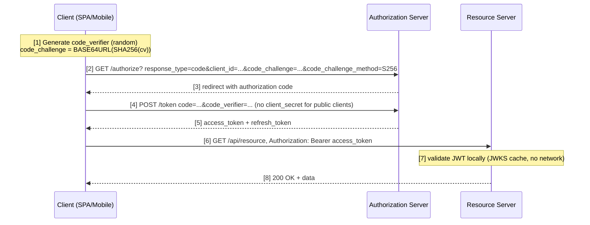
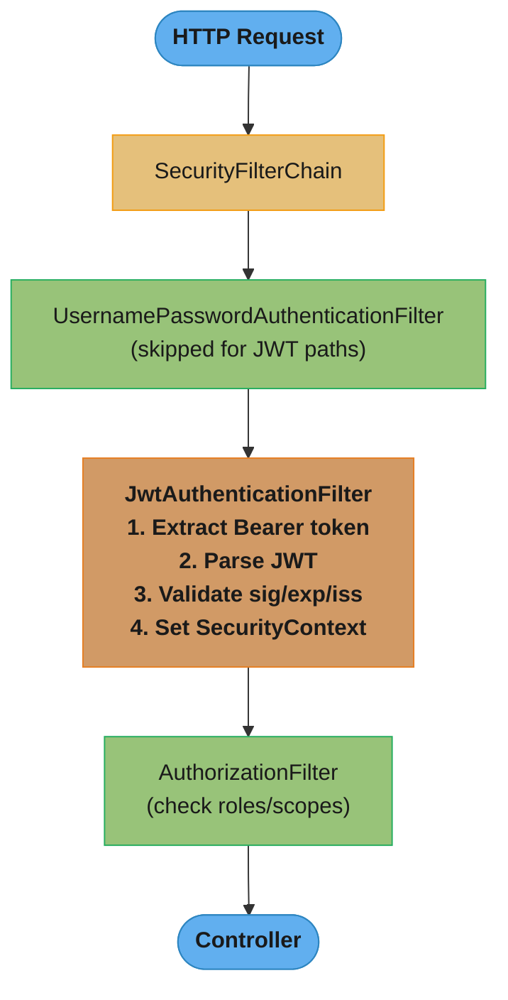
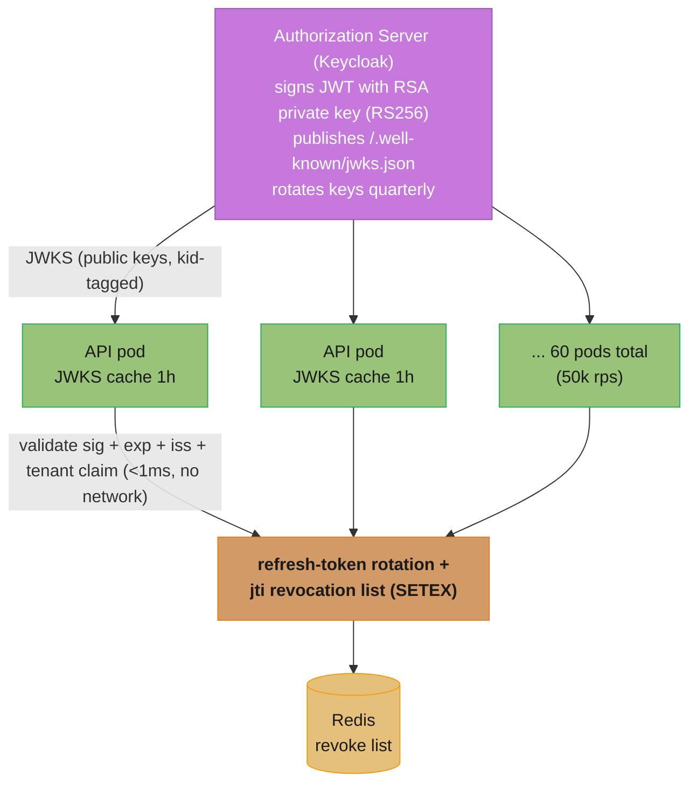

# Spring Security — JWT and OAuth2

---

## 1. Concept Overview

Spring Security is the de-facto security framework for Java applications. When combined with JWT (JSON Web Tokens) and OAuth2, it provides a stateless, standards-based authentication and authorization model that scales horizontally without server-side session state.

JWT encodes identity and claims directly into a signed, compact token. OAuth2 defines the delegation protocol that allows a resource owner to grant limited access to a third party. Spring Security's OAuth2 Resource Server support wires these together: every incoming request carries a Bearer token, the framework validates the signature and claims, then populates the SecurityContext — all without touching a session store.

This module covers the full production stack: JWT anatomy, stateless filter chains, OAuth2 authorization flows, social login, token revocation strategies, refresh token rotation, multi-tenancy, and the classic pitfalls that cause production security incidents.

---

## 2. Intuition

One-line analogy: a JWT is a signed hotel key card — the card itself encodes which room you can enter; the door reader verifies the signature without calling the front desk.

Mental model: instead of storing a session in a HashMap on the server, you hand the client a tamper-proof document. Any server instance can verify the document independently, which is why stateless JWT auth scales across pods without sticky sessions.

Why it matters: horizontal scaling, microservices across cloud regions, and mobile clients all become simpler when the authentication state lives in the token, not in a shared session store.

Key insight: the power of JWT is also its biggest risk — once issued, a token cannot be revoked without additional infrastructure. Short expiry windows combined with refresh token rotation are the production answer.

---

## 3. Core Principles

**Stateless authentication.** The server does not store any session. All authentication state is in the token. Every request is self-contained.

**Separation of concerns.** The Authorization Server issues tokens; the Resource Server validates them. These roles can be separate services (Keycloak, Auth0, Okta) or combined in a Spring Boot application.

**Least privilege via scopes and claims.** The token carries only the claims needed. Never embed more privilege than required.

**Defense in depth.** Signature validation alone is insufficient. Validate issuer (iss), audience (aud), expiry (exp), and issued-at (iat) on every request.

**Short-lived access tokens.** Access tokens expire in minutes (typically 5–15 minutes in production). Long-lived sessions are managed via refresh tokens, not long-expiry access tokens.

---

## 4. Types / Architectures / Strategies

### JWT Token Types

| Type | Signing | Verification | Use Case |
|------|---------|-------------|----------|
| HS256 (HMAC-SHA256) | Shared secret | Same shared secret | Single service or tightly controlled internal systems |
| RS256 (RSA-SHA256) | Private key | Public key (JWKS) | Distributed microservices; public key published at /.well-known/jwks.json |
| ES256 (ECDSA-SHA256) | EC private key | EC public key | Same as RS256 but smaller key size and faster operations |

### OAuth2 Grant Types

| Grant | Use Case | PKCE Required |
|-------|----------|---------------|
| Authorization Code | Server-side web apps, SPAs | Recommended for SPAs; required for public clients |
| Authorization Code + PKCE | Mobile apps, SPAs | Yes |
| Client Credentials | Machine-to-machine (M2M) | No (no user involved) |
| Refresh Token | Renewing access tokens | N/A |
| Device Code | CLI tools, smart TVs | No |

### Token Storage Strategies

| Strategy | XSS Risk | CSRF Risk | Recommendation |
|----------|----------|-----------|----------------|
| localStorage | High | None | Avoid for sensitive apps |
| sessionStorage | High | None | Avoid for sensitive apps |
| httpOnly cookie | None | High | Use with CSRF token or SameSite=Strict |
| Memory (JS variable) | Low | None | Best for SPAs; lost on page reload |

### Resource Server Architectures

**Centralized Auth Server + Multiple Resource Servers:** Keycloak or Auth0 issues RS256 tokens. Each microservice is a Resource Server that fetches the JWKS endpoint and validates tokens locally.

**Self-contained Spring Boot Auth + Resource Server:** Single application that both issues and validates tokens. Common in smaller deployments.

**Opaque Token + Introspection:** Token is a random UUID; Resource Server calls the Authorization Server's introspection endpoint on every request. Slower but fully revocable.

---

## 5. Architecture Diagrams

### JWT Structure

```
Header           Payload              Signature
+-------------+  +------------------+  +---------------------------+
| {           |  | {                |  | HMACSHA256(               |
|   "alg":    |  |   "sub": "u123", |  |   base64(header) +        |
|   "HS256",  |  |   "iss": "auth", |  |   "." +                   |
|   "typ":    |  |   "aud": "api",  |  |   base64(payload),        |
|   "JWT"     |  |   "exp": 1700...,|  |   secret                  |
| }           |  |   "iat": 1700...,|  | )                         |
+-------------+  |   "roles": [...] |  +---------------------------+
base64url encoded|  }               |  base64url encoded
                 +------------------+
                 base64url encoded

Final token: <header_b64>.<payload_b64>.<signature_b64>
```

### Authorization Code + PKCE Flow



PKCE closes the gap left by public clients that cannot hold a secret: the authorization code is useless to an attacker who intercepts it, because exchanging it for tokens requires the `code_verifier`, which never crosses the network until step 4.

### Stateless JWT Filter Chain



The JWT filter sits between the (skipped) session-based filter and the authorization check — it is the only place credentials are extracted, so a failure here means every downstream filter sees an unauthenticated request.

### Refresh Token Rotation

```mermaid
sequenceDiagram
    participant Client
    participant AS as Auth Server

    Client->>AS: POST /token/refresh, refresh_token=RT1
    Note over AS: invalidate RT1; issue new AT2 + RT2
    AS-->>Client: access_token=AT2, refresh_token=RT2
    Note over Client,AS: RT1 is now dead — if an attacker replays RT1,<br/>the server detects reuse and revokes the entire token family
```

Rotation turns a stolen refresh token into a detectable event rather than a silent, standing compromise: the very first reuse of an already-rotated token proves theft and triggers a family-wide revocation.

---

## 6. How It Works — Detailed Mechanics

### Maven Dependencies

```xml
<dependency>
    <groupId>org.springframework.boot</groupId>
    <artifactId>spring-boot-starter-security</artifactId>
</dependency>
<dependency>
    <groupId>org.springframework.boot</groupId>
    <artifactId>spring-boot-starter-oauth2-resource-server</artifactId>
</dependency>
<!-- For issuing JWTs (auth server role) -->
<dependency>
    <groupId>com.nimbusds</groupId>
    <artifactId>nimbus-jose-jwt</artifactId>
    <version>9.37.3</version>
</dependency>
```

### Security Configuration — Resource Server (RS256 / JWKS)

```java
@Configuration
@EnableWebSecurity
@EnableMethodSecurity
public class SecurityConfig {

    @Bean
    public SecurityFilterChain filterChain(HttpSecurity http) throws Exception {
        http
            .csrf(AbstractHttpConfigurer::disable)          // stateless; no CSRF needed
            .sessionManagement(sm ->
                sm.sessionCreationPolicy(SessionCreationPolicy.STATELESS))
            .authorizeHttpRequests(auth -> auth
                .requestMatchers("/public/**").permitAll()
                .requestMatchers("/admin/**").hasRole("ADMIN")
                .anyRequest().authenticated()
            )
            .oauth2ResourceServer(oauth2 -> oauth2
                .jwt(jwt -> jwt
                    .decoder(jwtDecoder())
                    .jwtAuthenticationConverter(jwtAuthConverter())
                )
            );
        return http.build();
    }

    @Bean
    public JwtDecoder jwtDecoder() {
        // NimbusJwtDecoder fetches JWKS from issuer and caches keys
        // Default cache: 5 minutes; keys rotated gracefully
        return NimbusJwtDecoder
            .withJwkSetUri("https://auth.example.com/.well-known/jwks.json")
            .build();
    }

    @Bean
    public JwtAuthenticationConverter jwtAuthConverter() {
        JwtGrantedAuthoritiesConverter grantedAuthConverter =
            new JwtGrantedAuthoritiesConverter();
        // Map custom claim "roles" to Spring GrantedAuthority
        grantedAuthConverter.setAuthoritiesClaimName("roles");
        grantedAuthConverter.setAuthorityPrefix("ROLE_");

        JwtAuthenticationConverter converter = new JwtAuthenticationConverter();
        converter.setJwtGrantedAuthoritiesConverter(grantedAuthConverter);
        return converter;
    }
}
```

### Issuing JWTs (symmetric HS256 for internal use)

```java
@Service
public class JwtService {

    private static final String SECRET_KEY = System.getenv("JWT_SECRET"); // min 256 bits
    private static final long ACCESS_EXPIRY_MS  = 15 * 60 * 1000;        // 15 minutes
    private static final long REFRESH_EXPIRY_MS = 7 * 24 * 60 * 60 * 1000; // 7 days

    public String issueAccessToken(UserDetails user) {
        Instant now = Instant.now();
        return Jwts.builder()
            .subject(user.getUsername())
            .issuer("https://auth.example.com")
            .audience().add("https://api.example.com").and()
            .issuedAt(Date.from(now))
            .expiration(Date.from(now.plusMillis(ACCESS_EXPIRY_MS)))
            .claim("roles", extractRoles(user))
            .signWith(Keys.hmacShaKeyFor(SECRET_KEY.getBytes()), Jwts.SIG.HS256)
            .compact();
    }

    public Claims parseAndValidate(String token) {
        return Jwts.parser()
            .verifyWith(Keys.hmacShaKeyFor(SECRET_KEY.getBytes()))
            .requireIssuer("https://auth.example.com")
            .requireAudience("https://api.example.com")  // CRITICAL: validate aud
            .build()
            .parseSignedClaims(token)
            .getPayload();
    }
}
```

### Stateless JWT Filter (custom, no Resource Server auto-config)

```java
@Component
public class JwtAuthenticationFilter extends OncePerRequestFilter {

    private final JwtService jwtService;
    private final UserDetailsService userDetailsService;

    @Override
    protected void doFilterInternal(HttpServletRequest request,
                                    HttpServletResponse response,
                                    FilterChain chain)
            throws ServletException, IOException {

        String authHeader = request.getHeader(HttpHeaders.AUTHORIZATION);
        if (authHeader == null || !authHeader.startsWith("Bearer ")) {
            chain.doFilter(request, response);
            return;
        }

        String token = authHeader.substring(7);
        try {
            Claims claims = jwtService.parseAndValidate(token);
            String username = claims.getSubject();

            if (username != null &&
                SecurityContextHolder.getContext().getAuthentication() == null) {

                UserDetails user = userDetailsService.loadUserByUsername(username);
                UsernamePasswordAuthenticationToken auth =
                    new UsernamePasswordAuthenticationToken(
                        user, null, user.getAuthorities());
                auth.setDetails(
                    new WebAuthenticationDetailsSource().buildDetails(request));
                SecurityContextHolder.getContext().setAuthentication(auth);
            }
        } catch (JwtException e) {
            // Token invalid — do NOT set auth; request will fail at authorization
            response.setStatus(HttpServletResponse.SC_UNAUTHORIZED);
            return;
        }

        chain.doFilter(request, response);
    }
}
```

### Multi-Tenancy: Per-Tenant JwtDecoder

```java
@Component
public class TenantJwtDecoderResolver implements AuthenticationManagerResolver<HttpServletRequest> {

    private final Map<String, JwtDecoder> decoderCache = new ConcurrentHashMap<>();

    @Override
    public AuthenticationManager resolve(HttpServletRequest request) {
        String tenant = resolveTenant(request); // from subdomain, header, or JWT claim
        JwtDecoder decoder = decoderCache.computeIfAbsent(tenant, this::buildDecoder);
        return new JwtAuthenticationProvider(decoder)::authenticate;
    }

    private String resolveTenant(HttpServletRequest req) {
        // Option 1: from Host header subdomain
        String host = req.getServerName(); // tenant1.api.example.com
        return host.split("\\.")[0];
    }

    private JwtDecoder buildDecoder(String tenant) {
        String jwksUri = "https://auth.example.com/" + tenant + "/.well-known/jwks.json";
        return NimbusJwtDecoder.withJwkSetUri(jwksUri).build();
    }
}

// Wire into security config:
// .oauth2ResourceServer(oauth2 -> oauth2.authenticationManagerResolver(tenantResolver))
```

### Social Login Configuration

```java
// application.yml
spring:
  security:
    oauth2:
      client:
        registration:
          google:
            client-id: ${GOOGLE_CLIENT_ID}
            client-secret: ${GOOGLE_CLIENT_SECRET}
            scope: openid, email, profile
          github:
            client-id: ${GITHUB_CLIENT_ID}
            client-secret: ${GITHUB_CLIENT_SECRET}
            scope: read:user, user:email
        provider:
          google:
            issuer-uri: https://accounts.google.com
          # GitHub is pre-defined in CommonOAuth2Provider
```

```java
// Security config addition for social login
http.oauth2Login(login -> login
    .loginPage("/login")
    .defaultSuccessUrl("/dashboard")
    .failureUrl("/login?error")
    .userInfoEndpoint(ui -> ui
        .userService(customOAuth2UserService) // map OAuth2 user to domain user
    )
);
```

### Refresh Token Rotation Implementation

```java
@Service
@Transactional
public class RefreshTokenService {

    private final RefreshTokenRepository repo;
    private final JwtService jwtService;

    public TokenPair rotate(String incomingRefreshToken) {
        RefreshToken stored = repo.findByToken(incomingRefreshToken)
            .orElseThrow(() -> new SecurityException("Refresh token not found"));

        if (stored.isRevoked()) {
            // Reuse detected — revoke entire token family
            repo.revokeAllByFamily(stored.getFamilyId());
            throw new SecurityException("Refresh token reuse detected; all sessions revoked");
        }

        if (stored.getExpiresAt().isBefore(Instant.now())) {
            throw new SecurityException("Refresh token expired");
        }

        // Invalidate old token
        stored.setRevoked(true);
        repo.save(stored);

        // Issue new pair
        String newAccessToken = jwtService.issueAccessToken(stored.getUser());
        RefreshToken newRefresh = new RefreshToken();
        newRefresh.setToken(UUID.randomUUID().toString());
        newRefresh.setFamilyId(stored.getFamilyId()); // same family for reuse detection
        newRefresh.setUser(stored.getUser());
        newRefresh.setExpiresAt(Instant.now().plus(7, ChronoUnit.DAYS));
        repo.save(newRefresh);

        return new TokenPair(newAccessToken, newRefresh.getToken());
    }
}
```

---

## 7. Real-World Examples

**Keycloak as Authorization Server:** Large enterprise deployments run Keycloak. Spring Boot microservices configure `spring.security.oauth2.resourceserver.jwt.issuer-uri=https://keycloak.example.com/realms/myrealm`. Spring fetches the OIDC discovery document automatically, resolves the JWKS URI, and caches public keys. Key rotation is handled transparently — Keycloak publishes new keys alongside old ones for a grace period.

**Auth0 with custom claims:** Auth0 supports Actions (JavaScript functions) that add custom claims to tokens under a namespace (e.g., `https://example.com/roles`). The `JwtGrantedAuthoritiesConverter` is configured with the namespaced claim name.

**GitHub OAuth2 for developer tools:** Internal developer portals use GitHub OAuth2 login. The `OAuth2UserService` maps GitHub organization membership to Spring roles, giving team members appropriate access without maintaining a separate user database.

**Short-lived tokens in high-security fintech:** Access tokens expire in 5 minutes. Refresh tokens expire in 8 hours (business day scope). Every refresh rotates the refresh token. The refresh token is stored in a Redis cluster for fast invalidation; on logout, the token entry is deleted.

**Microservice-to-microservice with client credentials:** Service A calls Service B using the OAuth2 Client Credentials grant. Spring Security's `WebClient` with `ServerOAuth2AuthorizedClientExchangeFilterFunction` handles token acquisition and caching automatically.

---

## 8. Tradeoffs

### JWT vs Opaque Tokens

| Dimension | JWT (self-contained) | Opaque token |
|-----------|---------------------|--------------|
| Revocation | Requires blacklist or short expiry | Immediate (delete from store) |
| Scalability | Excellent (no network call to validate) | Requires introspection endpoint call |
| Token size | ~200–500 bytes (base64 encoded) | ~20–40 bytes (random UUID) |
| Information exposure | Claims visible to anyone with the token | No information leaked |
| Suitable for | Distributed microservices | Single-service or when immediate revocation is required |

### HS256 vs RS256

| Dimension | HS256 | RS256 |
|-----------|-------|-------|
| Key distribution | All parties share the secret | Private key stays in auth server; public key distributed |
| Microservices | Dangerous (every service knows secret) | Safe (services only need public key) |
| Performance | Slightly faster | Slightly slower |
| Key rotation | Requires coordinated secret change | Auth server rotates independently |

### httpOnly Cookie vs localStorage

| Dimension | httpOnly Cookie | localStorage |
|-----------|----------------|-------------|
| XSS resistance | Immune (JS cannot read it) | Vulnerable |
| CSRF | Must be mitigated (SameSite, CSRF token) | Immune |
| Mobile clients | Awkward | Natural |
| SSR apps | Natural | Less natural |

---

## 9. When to Use / When NOT to Use

**Use JWT stateless auth when:**
- Application is deployed as multiple stateless pods (Kubernetes)
- Microservices need to validate tokens without a shared session store
- Mobile or SPA clients need to authenticate across domains
- You accept the complexity of token refresh and revocation infrastructure

**Do NOT use JWT when:**
- You need immediate revocation (e.g., "logout everywhere" for banking) and cannot afford a blacklist lookup on every request
- Token size is a concern for high-frequency, low-latency APIs (opaque tokens are smaller)
- Your team does not have the operational maturity to handle key rotation and refresh token rotation securely

**Use OAuth2 Authorization Code + PKCE when:**
- The client is a public client (SPA, mobile app) that cannot store a client secret
- Users are humans logging in from a browser

**Use Client Credentials when:**
- Caller is a service, not a human
- No user context is involved

---

## 10. Common Pitfalls

### Pitfall 1: Not validating the audience (aud) claim

```java
// BROKEN: accepts any valid token from this issuer, including tokens meant for other services
public Claims parseToken(String token) {
    return Jwts.parser()
        .verifyWith(publicKey)
        .requireIssuer("https://auth.example.com")
        // MISSING: .requireAudience(...)
        .build()
        .parseSignedClaims(token)
        .getPayload();
}
```

```java
// FIXED: token from payment-service cannot be replayed against user-service
public Claims parseToken(String token) {
    return Jwts.parser()
        .verifyWith(publicKey)
        .requireIssuer("https://auth.example.com")
        .requireAudience("https://user-service.example.com")  // service-specific
        .build()
        .parseSignedClaims(token)
        .getPayload();
}
```

### Pitfall 2: alg:none attack

```java
// BROKEN: trusting the algorithm declared in the token header
// An attacker strips the signature and sets alg: "none"
// Some older libraries would accept this
JwtParser parser = Jwts.parser()
    .setSigningKeyResolver(new SigningKeyResolverAdapter() {
        @Override
        public Key resolveSigningKey(JwsHeader header, Claims claims) {
            if ("none".equals(header.getAlgorithm())) {
                return null; // DANGEROUS
            }
            return publicKey;
        }
    }).build();
```

```java
// FIXED: always specify expected algorithm explicitly; modern JJWT and Nimbus reject alg:none by default
JwtDecoder decoder = NimbusJwtDecoder
    .withJwkSetUri(jwksUri)
    // NimbusJwtDecoder only accepts RS256/RS384/RS512/ES256 etc. by default
    // Never use JwtDecoders.fromIssuerLocation() without validating the issuer in code
    .jwsAlgorithm(SignatureAlgorithm.RS256)
    .build();
```

### Pitfall 3: Storing JWT in localStorage (XSS vulnerable)

```javascript
// BROKEN: any injected script can read the token
localStorage.setItem('access_token', token);
const stored = localStorage.getItem('access_token');
fetch('/api/data', { headers: { Authorization: 'Bearer ' + stored } });
```

```javascript
// FIXED option 1: httpOnly cookie (set by server, JS cannot read it)
// Server sets: Set-Cookie: access_token=<jwt>; HttpOnly; Secure; SameSite=Strict
// Client just makes the request; cookie is sent automatically
fetch('/api/data', { credentials: 'include' });

// FIXED option 2: in-memory storage (cleared on page reload)
let accessToken = null; // module-level variable, never touches DOM storage
function setToken(t) { accessToken = t; }
```

### Pitfall 4: Long expiry access tokens without refresh token rotation

```java
// BROKEN: 24-hour access token with no refresh rotation
// If token is stolen, attacker has 24 hours of access
return Jwts.builder()
    .expiration(Date.from(now.plusHours(24))) // too long
    .compact();
```

```java
// FIXED: short-lived access token + rotating refresh tokens
// Access token: 15 minutes
// Refresh token: 7 days, single-use, rotated on every use
return Jwts.builder()
    .expiration(Date.from(now.plusMinutes(15)))
    .compact();
// See RefreshTokenService for rotation implementation above
```

### Pitfall 5: Clock skew between issuer and validator

```java
// BROKEN: strict expiry validation fails when servers have 30s clock drift
// NimbusJwtDecoder throws ExpiredJwtException even for a token that just expired

// FIXED: configure clock skew tolerance (allow up to 60 seconds)
NimbusJwtDecoder decoder = NimbusJwtDecoder.withJwkSetUri(jwksUri).build();
decoder.setClockSkew(Duration.ofSeconds(60));
```

### Pitfall 6: Leaking sensitive data in JWT payload

```java
// BROKEN: JWT payload is base64url encoded, NOT encrypted
// Anyone can decode it with jwt.io — never put PII or secrets in claims
return Jwts.builder()
    .claim("ssn", user.getSocialSecurityNumber())   // NEVER do this
    .claim("creditCardNumber", user.getCard())       // NEVER do this
    .compact();
```

```java
// FIXED: put only non-sensitive identity and authorization claims
return Jwts.builder()
    .subject(user.getId().toString())   // opaque user ID, not email or name
    .claim("roles", user.getRoles())    // coarse-grained roles only
    .compact();
// For sensitive data, use JWE (JSON Web Encryption) or keep data server-side
```

---

## 11. Technologies & Tools

| Tool / Library | Role | Notes |
|---------------|------|-------|
| Spring Security 6.x | Security filter chain, method security | Ships with Spring Boot 3.x |
| spring-boot-starter-oauth2-resource-server | Resource server auto-config | Pulls in Nimbus JOSE+JWT |
| Nimbus JOSE+JWT | JWT parsing, JWKS fetching | Default in Spring Security OAuth2 |
| JJWT (io.jsonwebtoken) | JWT building and parsing | Fluent API; use 0.12.x+ |
| Keycloak | Open-source Authorization Server | Self-hosted; supports OIDC, SAML |
| Auth0 / Okta | Managed Authorization Server | SaaS; Actions for custom claims |
| Redis | Refresh token store, blacklist | Sub-millisecond revocation lookup |
| Spring Authorization Server | Spring-native Authorization Server | GA since 1.0; replaces deprecated Spring Security OAuth2 |
| jwt.io | Token debugging | Paste token to inspect header/payload |
| OpenSSL | Generate RSA keypairs for RS256 | `openssl genrsa -out private.pem 2048` |

---

## 12. Interview Questions with Answers

**What is the structure of a JWT and what does each part contain?**
A JWT consists of three base64url-encoded parts separated by dots: header, payload, and signature. The header declares the token type ("JWT") and signing algorithm (e.g., "RS256"). The payload carries claims: registered claims (sub — subject, iss — issuer, aud — audience, exp — expiry, iat — issued-at), public claims, and private claims. The signature is computed over the encoded header and payload using the specified algorithm and key. Only the signature provides integrity; the header and payload are visible to anyone.

**What is the difference between HS256 and RS256, and when would you choose each?**
HS256 uses a single shared secret for both signing and verification. RS256 uses an RSA private key to sign and the corresponding public key to verify. In a microservices architecture, RS256 is strongly preferred: only the Authorization Server holds the private key, while every Resource Server only needs the public key (fetched from the JWKS endpoint). With HS256, every service that needs to validate tokens must possess the secret, meaning a compromise of any service compromises the signing secret for all services.

**Explain the OAuth2 Authorization Code + PKCE flow and why PKCE is required for public clients.**
The flow has six steps that bind the token exchange to the client instance which started the request, without needing a client secret. (1) client generates a random code_verifier and computes code_challenge = BASE64URL(SHA256(code_verifier)); (2) client redirects user to the authorization endpoint with code_challenge; (3) user authenticates and server returns an authorization code; (4) client sends the code plus the original code_verifier to the token endpoint; (5) server recomputes SHA256(code_verifier) and compares it to the stored code_challenge; (6) if they match, server issues tokens. PKCE prevents authorization code interception attacks: an attacker who intercepts the code cannot exchange it for tokens because they do not know the code_verifier, which was never transmitted over the network.

**How does Spring Security's OAuth2 Resource Server validate JWTs?**
When configured with `http.oauth2ResourceServer(oauth2 -> oauth2.jwt(...))`, Spring auto-configures a `BearerTokenAuthenticationFilter`. For each request with a Bearer token, it calls the configured `JwtDecoder` (typically `NimbusJwtDecoder`). Nimbus fetches the JWKS from the configured URI, caches the public keys (default 5-minute TTL), and verifies the token signature and standard claims (exp, nbf). The decoded JWT is then passed to a `JwtAuthenticationConverter` which maps claims to `GrantedAuthority` objects and populates the `SecurityContext`.

**Why can't you simply delete a JWT to revoke it?**
A JWT is self-contained and stateless. The Resource Server validates it locally without contacting any central store. There is no mechanism in the JWT specification for a server to "forget" a token. Once issued, a valid (unexpired) JWT will be accepted by any Resource Server that trusts the issuer. Revocation requires out-of-band infrastructure: a token blacklist (Redis set containing revoked JTI claims, checked on every request) or sufficiently short expiry windows (5–15 minutes) combined with refresh token invalidation.

**What is refresh token rotation and why does it improve security?**
Refresh token rotation means each use of a refresh token invalidates that token and issues a new one. If an attacker steals a refresh token and attempts to use it after the legitimate client has already used it, the server detects the reuse (the token has already been rotated) and can revoke the entire token family — invalidating all active sessions for that user. Without rotation, a stolen refresh token is valid until its expiry date (often days or weeks).

**How would you implement JWT revocation without a blacklist lookup on every request?**
Several strategies: (1) Maintain short access token expiry (5–15 min) so the window of risk for stolen tokens is small; rely on refresh token rotation and a compact blacklist only for refresh tokens. (2) Store the user's token version (a counter) in the JWT claim and in the database; on token use, check if the JWT version matches the current version in the database — increment the version to invalidate all tokens. (3) Use opaque tokens for endpoints that require immediate revocation (e.g., privileged operations) and JWTs for low-risk endpoints.

**Explain the alg:none vulnerability and how Spring Security protects against it.**
The JWT specification originally allowed `"alg": "none"` to indicate an unsigned token. Vulnerable implementations trusted the algorithm declared in the header and would accept a token with no signature if alg was "none". An attacker could strip the signature from any valid token, set alg to "none", and the server would accept it. Spring Security's `NimbusJwtDecoder` uses a strict allow-list of algorithms (configured via `jwsAlgorithm()`); it does not support the "none" algorithm and will reject any token claiming it.

**What is multi-tenant JWT validation and how would you implement it in Spring?**
In a multi-tenant SaaS, each tenant typically has its own issuer or JWKS endpoint. An `AuthenticationManagerResolver<HttpServletRequest>` resolves the correct `JwtDecoder` based on a tenant identifier extracted from the request (subdomain, custom header, or unverified claim in the token). The decoder is cached per tenant to avoid re-fetching JWKS on every request. The security config wires this resolver via `.oauth2ResourceServer(oauth2 -> oauth2.authenticationManagerResolver(resolver))`.

**What is the difference between OAuth2 and OIDC?**
OAuth2 is an authorization framework that defines how a resource owner can delegate access to a third party via access tokens. It does not specify anything about identity. OIDC (OpenID Connect) is an identity layer built on top of OAuth2: it adds an ID token (always a JWT) containing identity claims about the authenticated user (sub, name, email, etc.) and defines a UserInfo endpoint. OAuth2 answers "what can this client do?"; OIDC answers "who is this user?".

**How does JwtAuthenticationConverter work and how would you customize it?**
`JwtAuthenticationConverter` is a `Converter<Jwt, AbstractAuthenticationToken>` called by the security framework after successful JWT validation. Its default behavior extracts the "scope" claim from the JWT and creates `GrantedAuthority` objects with a "SCOPE_" prefix. To customize, you configure a `JwtGrantedAuthoritiesConverter` with a different claims name (e.g., "roles") and a different prefix (e.g., "ROLE_"), or you implement `JwtAuthenticationConverter` directly to handle complex claim structures such as nested role objects or multiple claim sources.

**What is the security implication of storing a JWT in an httpOnly cookie versus localStorage?**
localStorage is accessible to JavaScript running on the page. Any successful XSS attack can extract the token, enabling token theft and session hijacking. An httpOnly cookie cannot be read by JavaScript; it is only sent by the browser to the server automatically on requests. The tradeoff is CSRF vulnerability: a malicious site can trick the browser into making a request that includes the httpOnly cookie. Mitigations include `SameSite=Strict` cookies (browser will not send cookie on cross-site navigated requests), CSRF double-submit tokens, or the Synchronizer Token Pattern. For most modern apps with properly configured CORS and SameSite cookies, httpOnly is the safer choice.

**How would you configure Spring Security to trust tokens from multiple issuers?**
Use `AuthenticationManagerResolver<HttpServletRequest>`. Each issuer gets its own `JwtDecoder` (typically a `NimbusJwtDecoder` configured with that issuer's JWKS URI or issuer-uri for auto-discovery). The resolver extracts the `iss` claim from the unverified JWT header/payload (NOT trusting it — just routing), looks up the corresponding decoder, and the decoder performs full signature and claims validation. This pattern is also used for federated identity (allow tokens from Google AND Auth0 AND internal issuer).

**What claims must you always validate in a JWT, and what are the security consequences of skipping each?**
`exp` (expiry): skipping allows use of indefinitely old tokens after they should have been invalidated. `iss` (issuer): skipping allows tokens from a different authorization server to be accepted (e.g., a test environment token in production). `aud` (audience): skipping allows a token issued for service A to be replayed against service B. `nbf` (not before, optional): skipping allows tokens to be used before their intended validity window. In production, always validate exp, iss, and aud at minimum.

**How does NimbusJwtDecoder handle JWKS key rotation without downtime?**
NimbusJwtDecoder fetches the JWKS from the configured URI and caches the keys. When a JWT arrives with a `kid` (key ID) claim not found in the cache, Nimbus automatically re-fetches the JWKS to pick up new keys. Authorization Servers that rotate keys publish the new key alongside the old key for a grace period (typically 24–48 hours), so tokens signed with the old key continue to validate while clients refresh their JWKS cache. This is why JWKS endpoints should never remove old keys the moment a new key is published.

**What is the difference between an access token and a refresh token, and why does rotating the refresh token matter more?**
An access token authorizes API calls directly and is deliberately short-lived (5–15 minutes), while a refresh token only exchanges for a new access token and is long-lived (hours to days). Because the access token rides on every request, its blast radius is bounded purely by its short expiry; the refresh token is used far less often but grants renewable access, so a leaked refresh token is much more valuable to an attacker. This asymmetry is exactly why refresh token rotation — invalidating the old refresh token on every use and issuing a new one — is the primary defense: a single reuse of an already-rotated refresh token is a reliable compromise signal, whereas a stolen access token simply expires on its own within minutes.

**What is the architectural difference between an OAuth2 Authorization Server and a Resource Server?**
The Authorization Server authenticates the user and issues tokens, while the Resource Server only validates tokens and serves protected data. Spring Security lets a single Boot application play both roles for small deployments, but production systems usually separate them: Keycloak, Auth0, or Spring Authorization Server plays the Authorization Server, and every microservice adds `spring-boot-starter-oauth2-resource-server` to become a Resource Server that trusts that issuer's public keys. A Resource Server has no login forms, consent screens, or credential storage — it only knows how to fetch the JWKS and check claims — which is precisely what makes horizontal scaling of the API tier trivial: any number of Resource Server instances validate the same tokens without ever calling the Authorization Server on the request hot path.

**What are the exact steps Spring Security's OAuth2 Resource Server performs to validate an incoming JWT, and in what order?**
Signature verification runs first against the cached JWKS public key, then timestamp checks (`exp`, `nbf`), then issuer (`iss`), then any custom validators such as audience (`aud`). Signature verification comes first because there is no point evaluating claims on a token that could have been tampered with — a failed signature check short-circuits immediately. `JwtTimestampValidator` handles expiry, `JwtIssuerValidator` confirms the token came from the trusted Authorization Server, and any additional checks are composed on top via `DelegatingOAuth2TokenValidator`. The gotcha: replacing the default validator to add a custom check (instead of composing it with `JwtValidators.createDefaultWithIssuer(...)`) silently drops the exp/iss checks — exactly the mistake in Pitfall 2 of this module's case study.

---

## 13. Best Practices

1. Always use RS256 (asymmetric) in production microservices; never share the signing key with Resource Servers.
2. Validate issuer (iss), audience (aud), and expiry (exp) on every request. Never skip aud validation.
3. Keep access token expiry between 5 and 15 minutes. Adjust based on your tolerance for stolen-token risk windows.
4. Implement refresh token rotation with token family tracking. Detect reuse and revoke all sessions in the family on detection.
5. Store the JWT in an httpOnly, Secure, SameSite=Strict cookie for browser clients. Never use localStorage for security-sensitive apps.
6. Never embed PII (names, emails, SSNs) or secrets in JWT claims. The payload is only encoded, not encrypted.
7. Include a `jti` (JWT ID) claim for audit logging and optional revocation via a compact blacklist (store only jti, not the full token).
8. Configure clock skew tolerance (60 seconds is a reasonable value) to prevent false rejections from minor time drift between servers.
9. Use Spring Authorization Server 1.x for new Authorization Server implementations; the legacy `spring-security-oauth2` project is end-of-life.
10. Rotate JWKS keys periodically (every 90 days). Use the `kid` claim in the JWT header so JWKS consumers can identify which key to use.
11. Monitor token introspection / JWKS fetch latency. A slow auth server is a denial-of-service vector on your authentication pipeline.
12. For the client credentials flow in internal services, cache the access token and reuse it until it is close to expiry. Do not request a new token for every API call.

---

## 14. Case Study

### Scenario: Multi-Tenant SaaS API Secured with JWT + OAuth2 Resource Server

**Context.** A B2B SaaS platform serves 4,000 tenant organizations through a shared API fleet handling **50,000 requests/sec** at peak. Every request carries a bearer JWT issued by a central Authorization Server. Tokens are signed with **RS256** (asymmetric): the AS holds the private key, every resource-server pod validates using the public key fetched from the JWKS endpoint and cached locally for **1 hour**. Refresh tokens use rotation with a Redis-backed revocation list. Access token TTL: 10 minutes. Refresh token TTL: 12 hours, single-use.

### Architecture



### Resource Server Configuration

```java
@Configuration
@EnableWebSecurity
public class ResourceServerConfig {

    @Bean
    SecurityFilterChain api(HttpSecurity http) throws Exception {
        http
            .csrf(csrf -> csrf.disable())               // stateless API, no cookies for API path
            .sessionManagement(s -> s.sessionCreationPolicy(SessionCreationPolicy.STATELESS))
            .authorizeHttpRequests(a -> a
                .requestMatchers("/actuator/health").permitAll()
                .anyRequest().authenticated())
            .oauth2ResourceServer(oauth -> oauth
                .jwt(jwt -> jwt.jwtAuthenticationConverter(converter())));
        return http.build();
    }

    private JwtAuthenticationConverter converter() {
        JwtGrantedAuthoritiesConverter roles = new JwtGrantedAuthoritiesConverter();
        roles.setAuthoritiesClaimName("roles");          // custom claim, not "scope"
        roles.setAuthorityPrefix("ROLE_");               // roles=["admin"] -> ROLE_admin
        JwtAuthenticationConverter c = new JwtAuthenticationConverter();
        c.setJwtGrantedAuthoritiesConverter(roles);
        return c;
    }
}
```

```yaml
spring:
  security:
    oauth2:
      resourceserver:
        jwt:
          issuer-uri: https://auth.example.com/realms/saas   # drives JWKS + iss validation
          # JWKS fetched once, cached 1h; rotated keys discovered on kid miss
```

Tenant isolation is enforced with a validator that asserts the `tenant_id` claim matches the routed tenant:

```java
@Bean
JwtDecoder tenantAwareDecoder(OAuth2ResourceServerProperties props) {
    NimbusJwtDecoder decoder = JwtDecoders.fromIssuerLocation(props.getJwt().getIssuerUri());
    OAuth2TokenValidator<Jwt> withDefaults =
        JwtValidators.createDefaultWithIssuer(props.getJwt().getIssuerUri()); // checks exp + iss
    OAuth2TokenValidator<Jwt> tenant = jwt ->
        jwt.getClaimAsString("tenant_id") != null
            ? OAuth2TokenValidatorResult.success()
            : OAuth2TokenValidatorResult.failure(
                new OAuth2Error("missing_tenant", "tenant_id claim required", null));
    decoder.setJwtValidator(new DelegatingOAuth2TokenValidator<>(withDefaults, tenant));
    return decoder;
}
```

### Metrics

- Token validation latency: **0.4ms p50, 0.9ms p99** (pure crypto, JWKS cached, zero network on hot path).
- JWKS endpoint load: **~1 request/pod/hour** = 60 req/hr total against the AS, instead of 50k/sec.
- Refresh-token Redis revocation lookup: **0.3ms** (SISMEMBER on revoked-jti set).
- Quarterly key rotation: zero downtime — old `kid` retained 24h, decoder refetches JWKS on unknown `kid`.

### Pitfalls

**Pitfall 1 — Symmetric HS256 key leaked in the config repo.**
```yaml
# BROKEN: HS256 shared secret committed to Git; anyone with repo read access can forge tokens
spring.security.oauth2.resourceserver.jwt.secret-key: c3VwZXItc2VjcmV0LWtleQ==
```
```yaml
# FIXED: RS256 asymmetric — resource servers only ever hold the PUBLIC key; private key never leaves the AS
spring.security.oauth2.resourceserver.jwt.issuer-uri: https://auth.example.com/realms/saas
```

**Pitfall 2 — `exp` claim not validated, tokens valid forever.**
```java
// BROKEN: replacing the default validator dropped the timestamp check
decoder.setJwtValidator(new JwtIssuerValidator(issuer)); // no exp validation -> stolen tokens never expire
```
```java
// FIXED: compose with the framework default which includes JwtTimestampValidator (exp + nbf)
decoder.setJwtValidator(new DelegatingOAuth2TokenValidator<>(
    JwtValidators.createDefaultWithIssuer(issuer), tenantValidator));
```

**Pitfall 3 — Storing the JWT in `localStorage` (XSS exfiltration risk).**
```javascript
// BROKEN: any injected script can read localStorage and steal the bearer token
localStorage.setItem("access_token", token);
```
```java
// FIXED: server sets the token in an HttpOnly, Secure, SameSite cookie — unreadable by JS
ResponseCookie cookie = ResponseCookie.from("access_token", jwt)
    .httpOnly(true).secure(true).sameSite("Strict").path("/").maxAge(Duration.ofMinutes(10)).build();
response.addHeader(HttpHeaders.SET_COOKIE, cookie.toString());
```

### Interview Q&A

**Why RS256 over HS256 for a multi-service fleet?** RS256 is asymmetric: only the Authorization Server holds the private signing key, while every resource server validates with the public key. A leaked public key cannot forge tokens. HS256 uses one shared secret for both signing and validation, so every service that can validate can also forge, and the secret must be distributed to every pod.

**How does a resource server validate a token without calling the AS on every request?** It fetches the JWKS (public keys) once and caches them locally, here for one hour. Validation is pure local crypto plus claim checks (signature, `exp`, `iss`, audience, custom claims), so the hot path makes zero network calls and runs in under 1ms.

**What happens during key rotation if a pod has a stale JWKS cache?** When a token arrives with a `kid` not present in the cache, Nimbus triggers a forced JWKS refetch. Retaining the old key for an overlap window (24h here) means tokens signed before rotation keep validating until they naturally expire.

**Why is refresh-token rotation with a revocation list necessary?** Refresh tokens are long-lived and high-value. Single-use rotation issues a new refresh token on each use and revokes the old one; if a stolen token is replayed, the reuse is detected and the whole token family is revoked via the Redis revocation set, limiting blast radius.

**How do you enforce tenant isolation with shared JWT infrastructure?** Embed a `tenant_id` claim in the token and add a custom `OAuth2TokenValidator` that rejects tokens whose tenant claim does not match the routed tenant. This prevents a valid token for tenant A from being replayed against tenant B's data.

**Why disable CSRF for this API but not for a cookie-based browser app?** CSRF protection guards against the browser auto-attaching credentials (cookies) to forged cross-site requests. A pure bearer-token API where the client explicitly sets the Authorization header is not vulnerable. Once you move the token into an HttpOnly cookie, CSRF protection must be re-enabled for the cookie-authenticated paths.

---

**Additional war stories and interview Q&As:**

**Pitfall: JWT validated by signature but audience claim ignored.**

```java
// BROKEN: resource server validates signature + expiry only
// Any service's token works on any other service (confused deputy)
@Bean
public JwtDecoder jwtDecoder() {
    return NimbusJwtDecoder.withPublicKey(rsaPublicKey).build();
    // No audience validation — token for "orders-service" works on "payment-service"!
}

// FIX: validate audience claim — each service accepts only its own audience
@Bean
public JwtDecoder jwtDecoder() {
    NimbusJwtDecoder decoder = NimbusJwtDecoder.withPublicKey(rsaPublicKey).build();
    OAuth2TokenValidator<Jwt> validator = new DelegatingOAuth2TokenValidator<>(
        JwtValidators.createDefault(),           // iss, exp, nbf
        new JwtClaimValidator<>("aud",
            aud -> aud != null && aud.contains("payment-service"))
    );
    decoder.setJwtValidator(validator);
    return decoder;
}
```

**Pitfall: Refresh token rotation race condition with multiple tabs.**

```java
// BROKEN: user opens 3 tabs, all detect token expiry simultaneously
// Tab 1 refreshes → server rotates refresh token → old token invalidated
// Tabs 2 and 3 present the now-invalid old refresh token → forced logout
// User loses all sessions unexpectedly

// FIX: refresh token grace window (accept old token for 30s after rotation)
// Server stores: {old_token_hash, new_token_hash, rotated_at}
// During grace window, old token is accepted and returns the new token
// After grace window, old token is rejected (compromised signal)

public TokenPair refresh(String refreshToken) {
    TokenRecord record = refreshTokenRepo.findByToken(refreshToken)
        .orElseThrow(() -> new InvalidTokenException("Token not found or revoked"));

    if (record.isRotated() &&
        record.getRotatedAt().plusSeconds(30).isAfter(Instant.now())) {
        // Grace window: return the already-rotated new token pair
        return record.getNewTokenPair();
    } else if (record.isRotated()) {
        // Outside grace window with old token = potential replay attack
        revokeAllUserTokens(record.getUserId());
        throw new SecurityException("Potential token replay detected — all sessions revoked");
    }

    return rotateToken(record);
}
```

**Token revocation via Redis:**

```java
// Stateless JWT problem: token is valid until expiry even after logout
// FIX: maintain a Redis blocklist with TTL matching token expiry

@Component
public class JwtBlocklist {
    private final RedisTemplate<String, String> redis;

    public void block(String jti, Duration ttl) {
        redis.opsForValue().set("jwt:blocked:" + jti, "1", ttl);
    }

    public boolean isBlocked(String jti) {
        return Boolean.TRUE.equals(redis.hasKey("jwt:blocked:" + jti));
    }
}

// In JwtDecoder customizer or SecurityFilterChain:
// After decoding JWT, check: if (blocklist.isBlocked(jwt.getId())) throw 401
```

**Additional interview Q&As:**

**How do you implement fine-grained authorization beyond role-based access?** Use Spring Security method security with `@PreAuthorize` and Spring Expression Language to check ownership or resource-level permissions: `@PreAuthorize("@permissionEvaluator.canAccess(authentication, #orderId, 'READ_ORDER')")`. Implement a custom `PermissionEvaluator` that resolves the permission check against a policy store (database, OPA, Casbin). This keeps authorization logic out of business code.

**What is PKCE and why is it required for public clients?** PKCE (Proof Key for Code Exchange) prevents authorization code interception attacks. A public client (mobile app, SPA) generates a random `code_verifier` and sends its SHA-256 hash (`code_challenge`) in the authorization request. The token endpoint verifies the original `code_verifier` — an attacker who intercepts the authorization code cannot exchange it without the `code_verifier` that never left the legitimate client. Spring Authorization Server supports PKCE natively; Spring Boot 3.x resource servers can enforce it.

**How do you propagate the JWT to downstream microservices?** Use a `WebClient` `ExchangeFilterFunction` (or Feign `RequestInterceptor`) that reads the current `SecurityContext`, extracts the Bearer token, and adds it to the outbound `Authorization` header. Never store the token in a thread-local that spans reactive pipelines — in WebFlux, use `ReactiveSecurityContextHolder` and read the token in a `.flatMap` operator.

---

## Related / See Also

- [Spring Security Architecture](../spring_security_architecture/README.md) — FilterChainProxy
- [Case Study: OAuth2 Authorization Server](../case_studies/design_oauth2_authorization_server.md) — PKCE, rotation
- [Case Study: Multi-Tenant API](../case_studies/design_multitenant_api.md) — tenant isolation via JWT
- [Auth & Authorization Systems](../../backend/auth_and_authorization_systems/README.md) — OAuth2/OIDC flows and token revocation at the systems level
- [Security & Auth (HLD)](../../hld/security_and_auth/README.md) — authn/authz tradeoffs in distributed system design
