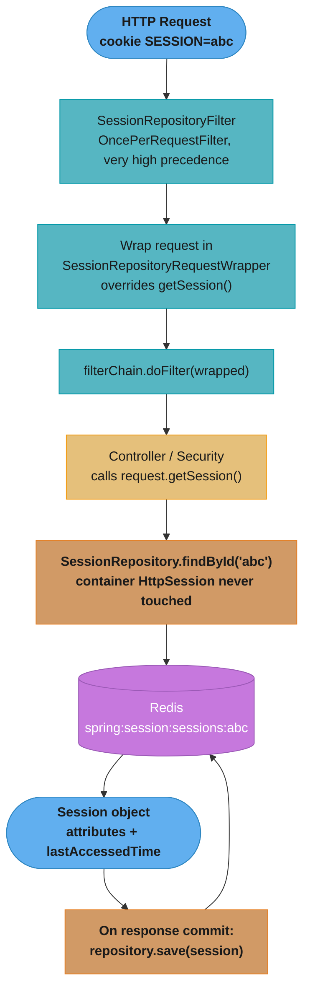
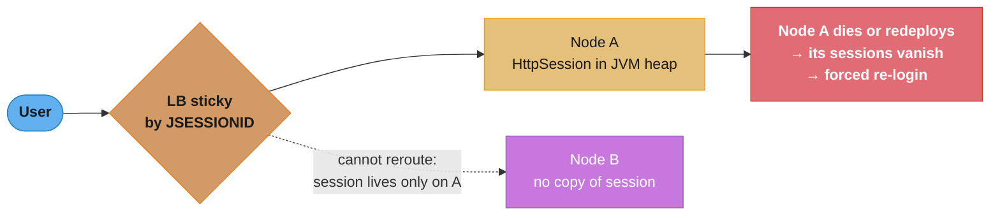
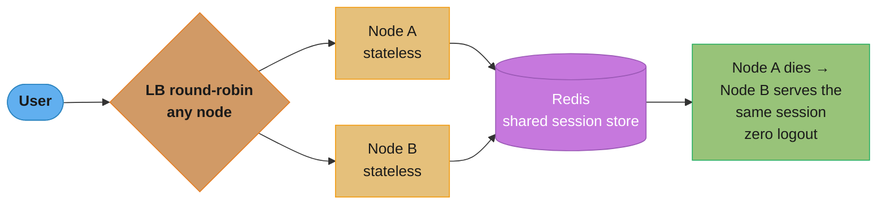
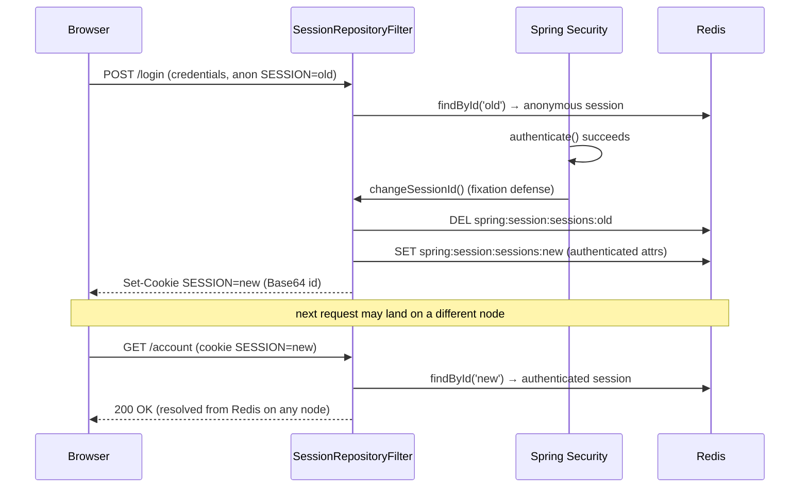
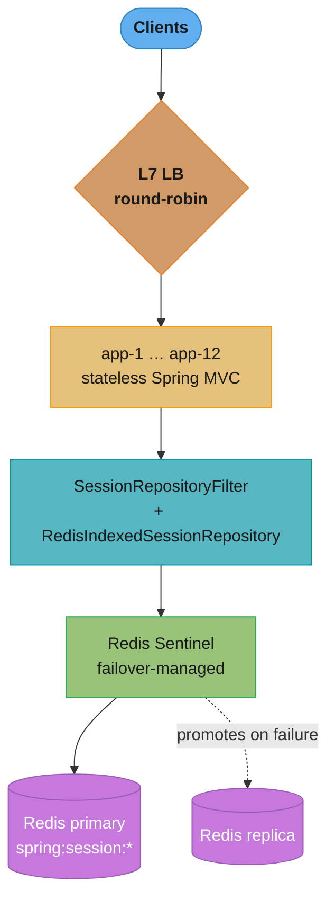

# Spring Session

## 1. Concept Overview

Spring Session decouples HTTP session storage from the servlet container. In a stock Spring Boot app, `HttpSession` is managed by Tomcat/Jetty/Undertow and its state lives in that one JVM's heap. Spring Session replaces this with a `Session` abstraction backed by a pluggable `SessionRepository` — Redis, JDBC, Hazelcast, or MongoDB — so session state becomes an external, shared resource that any application instance can read and write.

The mechanism is deliberately transparent. A single servlet filter, `SessionRepositoryFilter`, wraps every incoming `HttpServletRequest` and overrides `getSession()` / `getSession(boolean)` so that your controllers, Spring MVC, and Spring Security keep calling the ordinary Servlet API but silently talk to the repository instead of the container. No application code changes; the container's own session machinery is bypassed entirely.

The core architectural pillars are:

- **`SessionRepositoryFilter`** — the single integration point; wraps the request and swaps the `HttpSession` implementation for a repository-backed one
- **`SessionRepository<S>`** — CRUD over a backing store (`findById`, `save`, `deleteById`, `createSession`)
- **`Session`** — a container-neutral session (id, attributes, `lastAccessedTime`, `maxInactiveInterval`)
- **`HttpSessionIdResolver`** — decides where the session id travels: `CookieHttpSessionIdResolver` (cookie `SESSION`) or `HeaderHttpSessionIdResolver` (header `X-Auth-Token`)
- **`FindByIndexNameSessionRepository`** — optional index for "all sessions for principal X", enabling concurrent-session control and logout-everywhere

Spring Session 3.x aligns with Spring Boot 3.x / Spring Framework 6.x: `jakarta.*` namespace, JDK 17 baseline. Spring Session 2.x is the last `javax.*` line (Boot 2.7). Spring Session 3.0 also changed the Redis default from the older `RedisIndexedSessionRepository` to the simpler `RedisSessionRepository`.

---

## 2. Intuition

**One-line analogy:** Spring Session is a coat check. Instead of each waiter (JVM) stuffing your coat (session) in their own pocket, everyone hangs it in one shared cloakroom (Redis) and hands you a numbered ticket (the `SESSION` cookie) that any waiter can redeem.

**Mental model:** The session id is just a key. In stock Tomcat that key resolves to an object in *this* JVM's memory, so the key is only meaningful on the node that created it. Spring Session makes the key resolve against an external store, so the same ticket works no matter which node the load balancer picks.

**Why it matters:** Horizontal scaling and rolling deploys are table stakes. If sessions live in-JVM, either you pin users to a node with sticky sessions (which turns every node into a single point of failure for its users and breaks on failover and during deploys), or you lose everyone's login the moment an instance restarts. A shared store makes instances stateless and interchangeable.

**Key insight:** Spring Session changes *where* the session lives, not *how* you use it. Because `SessionRepositoryFilter` swaps the implementation behind the standard Servlet `getSession()`, existing code and Spring Security integration keep working unchanged — you flip a store, not a programming model.

---

## 3. Core Principles

1. **Storage is decoupled from the container.** The servlet container's `HttpSession` is never used; `SessionRepositoryFilter` substitutes a repository-backed session before the request reaches any servlet or controller.
2. **The Servlet API is preserved.** Application code calls `request.getSession()` and `session.setAttribute(...)` exactly as before. The filter's request wrapper makes the swap invisible.
3. **The session id is the only client-side state.** The client holds a small opaque id (cookie or header); all attributes live server-side in the store. This is the defining difference from stateless JWT.
4. **Instances are stateless and interchangeable.** Any node can serve any request because session state is externalized — enabling round-robin load balancing, failover, and zero-downtime deploys.
5. **Expiration is the store's job.** Redis TTL (or a JDBC cleanup task) expires sessions. Spring Session leans on the backend's own eviction rather than tracking timers in the JVM.
6. **Indexing is opt-in.** Enumerating "all sessions for a user" (for max-sessions or logout-everywhere) requires a `FindByIndexNameSessionRepository`; the simple repository trades that capability for lower Redis overhead.

---

## 4. Types / Architectures / Strategies

### Backing Stores

| Backend | Starter | Best For | Notes |
|---|---|---|---|
| Redis | `spring-session-data-redis` | Most web apps; low-latency shared store | Sub-ms reads; native TTL expiry; the default choice |
| JDBC | `spring-session-jdbc` | Teams already running a relational DB; no new infra | `SPRING_SESSION` + `SPRING_SESSION_ATTRIBUTES` tables; scheduled cleanup job |
| Hazelcast | `spring-session-hazelcast` | Embedded in-grid caching, no external service | `MapSession` in a distributed `IMap`; entry listeners for expiry |
| MongoDB | `spring-session-data-mongodb` | Mongo-centric stacks | Document per session; TTL index for expiry |

### Redis Repository Types

| Repository | Enable | Principal Index | Expired-Session Events | Cost |
|---|---|---|---|---|
| `RedisSessionRepository` (Spring Session 3.0 default) | `spring.session.redis.repository-type=default` | No | No | One key per session; pure TTL |
| `RedisIndexedSessionRepository` | `@EnableRedisIndexedHttpSession` or `repository-type=indexed` | Yes (`findByPrincipalName`) | Yes (needs keyspace notifications) | Extra index keys + a background cleanup task |

Pick `indexed` only when you need concurrent-session control, logout-everywhere, or `SessionExpiredEvent`. Otherwise `default` is cheaper.

### Session Id Transport

| Resolver | Where the id rides | Client |
|---|---|---|
| `CookieHttpSessionIdResolver` (default) | Cookie `SESSION` (Base64-encoded id) | Browsers; benefits from `HttpOnly`, `Secure`, `SameSite` |
| `HeaderHttpSessionIdResolver` | Header `X-Auth-Token` (configurable) | SPAs and mobile clients that manage the token themselves and want no cookie |

### Serialization Strategy

| Serializer | Format | Tradeoff |
|---|---|---|
| `JdkSerializationRedisSerializer` (default) | Java binary | Zero config; but attribute classes must implement `Serializable`, and a `serialVersionUID` mismatch on deploy throws `InvalidClassException` |
| `GenericJackson2JsonRedisSerializer` | JSON | Human-readable, language-neutral, resilient to field changes; but needs type info / mixins and rejects non-JSON-friendly attributes |

---

## 5. Architecture Diagrams

### SessionRepositoryFilter Swaps the HttpSession into Redis



The filter runs before Spring Security, so by the time `SecurityContextHolderFilter` reads the session the swap has already happened. Everything downstream uses the standard Servlet API and never knows the store is remote.

### Before: Sticky Sessions (Single Point of Failure)



### After: Shared Redis Store (Stateless Nodes)



Sticky sessions make every node a SPOF for the users pinned to it and break on failover and rolling deploys. Moving the state to Redis makes nodes interchangeable; the only new dependency is the availability of Redis itself.

### Login → Session-Fixation Change → Subsequent Request From Redis



On authentication the id is rotated (a new key replaces the old one) so a pre-login id an attacker planted is worthless. The rotated id resolves from Redis, so the follow-up request authenticates on whichever node the balancer chooses.

---

## 6. How It Works — Detailed Mechanics

### Enabling Redis-backed sessions (Spring Boot 3.x)

Add `spring-boot-starter-data-redis` and `spring-session-data-redis`, then either annotate or use properties.

```java
@Configuration
@EnableRedisHttpSession(maxInactiveIntervalInSeconds = 1800) // 30 min default TTL
public class SessionConfig {

    // LettuceConnectionFactory is auto-configured from spring.data.redis.* properties.
    // No other beans are required — @EnableRedisHttpSession registers:
    //   - springSessionRepositoryFilter (a SessionRepositoryFilter)
    //   - a RedisSessionRepository (Spring Session 3.0 default)
}
```

```yaml
# Equivalent property-driven configuration (Boot 3.x)
spring:
  session:
    store-type: redis
    timeout: 30m                 # session max inactive interval
    redis:
      namespace: "spring:session"
      flush-mode: on_save        # write to Redis only when the request completes
      repository-type: default   # 'indexed' to enable principal index + expiry events
  data:
    redis:
      host: redis.internal
      port: 6379
```

`@EnableRedisHttpSession` registers a bean named `springSessionRepositoryFilter`. Spring Boot's `DelegatingFilterProxyRegistrationBean` wires it into the servlet container at a very high precedence (order `SessionRepositoryFilter.DEFAULT_ORDER = Integer.MIN_VALUE + 50`) so it runs before Spring Security's filter chain.

### What the filter actually does

```java
// Simplified from SessionRepositoryFilter
public class SessionRepositoryFilter<S extends Session> extends OncePerRequestFilter {

    @Override
    protected void doFilterInternal(HttpServletRequest request,
                                    HttpServletResponse response,
                                    FilterChain chain) throws ServletException, IOException {
        // Wrap the request so getSession() resolves against the repository, not the container
        SessionRepositoryRequestWrapper wrapped =
            new SessionRepositoryRequestWrapper(request, response);
        try {
            chain.doFilter(wrapped, response);          // downstream sees the wrapper
        } finally {
            wrapped.commitSession();                    // repository.save(session) on the way out
        }
    }

    private final class SessionRepositoryRequestWrapper extends HttpServletRequestWrapper {
        @Override
        public HttpSession getSession(boolean create) {
            // Resolve id via HttpSessionIdResolver (cookie SESSION or header X-Auth-Token),
            // then sessionRepository.findById(id); create a new Session if absent and create==true.
            // Returns an HttpSessionAdapter wrapping the Spring Session — NOT the container session.
            ...
        }
    }
}
```

The `finally` block is why `flush-mode` matters: with the default `ON_SAVE`, attributes are buffered and written to Redis once, at `commitSession()`. With `IMMEDIATE`, every `setAttribute` writes through — safer against mid-request crashes but far chattier on Redis.

### RedisIndexedSessionRepository key layout and the expired-event gotcha

The indexed repository stores three kinds of keys per session:

```
spring:session:sessions:<id>                       Redis hash: session data + attributes
                                                   TTL = maxInactiveInterval + 5 min buffer
spring:session:sessions:expires:<id>               dummy key, TTL = exact maxInactiveInterval
                                                   its expiry is what fires the keyspace event
spring:session:expirations:<rounded-minute>        set of session ids due to expire that minute
                                                   scanned by a background cleanup task (backup)
```

Redis does **not** guarantee prompt or reliable delivery of expired-key notifications — a key is only actively expired when accessed or during Redis's slow background sweep. So Spring Session uses the `expires:<id>` key to *trigger* the event and the `expirations:<minute>` index plus a scheduled task as a *backup* sweep. Crucially, `SessionExpiredEvent` and `SessionDeletedEvent` only fire if Redis keyspace notifications are enabled:

```bash
# Required for RedisIndexedSessionRepository to publish expired/deleted session events
redis-cli config set notify-keyspace-events Egx
# E = keyevent notifications, g = generic (DEL/EXPIRE), x = expired
```

Without this, sessions still expire (TTL removes the data) but your `@EventListener` for `SessionExpiredEvent` never fires. The 5-minute buffer on the main key ensures the session data is still retrievable when the expiration event arrives so the listener can inspect the expiring principal. `RedisSessionRepository` (the non-indexed default) sidesteps all of this — it relies purely on TTL and publishes no expiration events.

### Session-fixation protection

```java
@Bean
SecurityFilterChain filterChain(HttpSecurity http) throws Exception {
    http
        .sessionManagement(session -> session
            // Spring Security 6 default; rotates the id on authentication
            .sessionFixation(fixation -> fixation.changeSessionId())
        );
    return http.build();
}
```

`changeSessionId()` calls `HttpSession.changeSessionId()`, which the Spring Session wrapper implements by generating a new id, copying attributes, deleting the old Redis key, and saving under the new key. This defeats fixation: any id an attacker fixed before login is discarded at authentication.

### Concurrent-session control across the cluster

The default `SessionRegistryImpl` only knows about sessions in the local JVM, so `maximumSessions(1)` is useless across nodes. Back it with the indexed repository:

```java
@Bean
public SpringSessionBackedSessionRegistry<? extends Session> sessionRegistry(
        FindByIndexNameSessionRepository<? extends Session> sessions) {
    return new SpringSessionBackedSessionRegistry<>(sessions);
}

@Bean
SecurityFilterChain filterChain(HttpSecurity http,
        SpringSessionBackedSessionRegistry<?> registry) throws Exception {
    http.sessionManagement(session -> session
        .maximumSessions(1)               // cluster-wide, not per-JVM
        .maxSessionsPreventsLogin(false)  // evict the oldest session instead of blocking login
        .sessionRegistry(registry));
    return http.build();
}
```

Because the registry reads `findByPrincipalName` from Redis, "at most one active session per user" now holds across every instance.

### Logout everywhere

```java
@Service
public class SessionAdminService {
    private final FindByIndexNameSessionRepository<? extends Session> sessions;

    public SessionAdminService(FindByIndexNameSessionRepository<? extends Session> sessions) {
        this.sessions = sessions;
    }

    public void logoutEverywhere(String username) {
        // One index lookup returns every session id for the principal, on any node
        sessions.findByPrincipalName(username).keySet()
                .forEach(sessions::deleteById);   // instant, cluster-wide revocation
    }
}
```

This instant, global revocation is the headline advantage of stateful sessions over JWT — no blacklist, no waiting for token expiry.

### Header-based id for SPA / mobile

```java
@Bean
public HttpSessionIdResolver httpSessionIdResolver() {
    // Client sends and receives the id via the X-Auth-Token header; no cookie involved
    return HeaderHttpSessionIdResolver.xAuthToken();
}
```

The server returns the id in `X-Auth-Token` on session creation; the SPA stores it and echoes it on each request. This sidesteps cookie/CSRF/CORS friction for non-browser clients while keeping server-side session state.

### WebFlux: reactive sessions

```java
@Configuration
@EnableRedisWebSession   // reactive analogue of @EnableRedisHttpSession
public class ReactiveSessionConfig {
    // Registers a ReactiveRedisSessionRepository and a WebSessionManager.
}

@GetMapping("/cart")
public Mono<Cart> cart(ServerWebExchange exchange) {
    return exchange.getSession()                       // Mono<WebSession>
        .map(session -> session.getAttributeOrDefault("cart", new Cart()));
}
```

WebFlux uses `WebSession` (not `HttpSession`) resolved through `ReactiveSessionRepository`; access is non-blocking via `exchange.getSession()` returning a `Mono<WebSession>`.

### CSRF token that survives failover

```java
@Bean
SecurityFilterChain filterChain(HttpSecurity http) throws Exception {
    http.csrf(csrf -> csrf
        // Store the CSRF token in the (shared) session so it survives node failover
        .csrfTokenRepository(new HttpSessionCsrfTokenRepository()));
    return http.build();
}
```

With `HttpSessionCsrfTokenRepository`, the CSRF token rides inside the Spring Session in Redis, so a form submitted after the user's request is rerouted to a different node still validates. A `CookieCsrfTokenRepository` (stateless) would also survive failover but moves the token to the client.

---

## 7. Real-World Examples

### Horizontally-scaled monolith behind a round-robin load balancer

A classic Spring MVC e-commerce app runs 8 identical instances behind an L7 balancer. Adding `spring-session-data-redis` and one `@EnableRedisHttpSession` line externalizes the cart and login session to Redis. The balancer drops sticky routing entirely; rolling deploys no longer log anyone out because a restarting instance holds no session state.

### Blue-green and canary deploys

Because instances are stateless, a canary version can be introduced into the pool and take real traffic without session affinity. Users' sessions live in Redis, so requests flowing to either the stable or canary fleet resolve the same session — no "logged out after deploy" incidents.

### SSO gateway fan-out to internal apps

An internal portal authenticates once and stores the session in Redis. Several backend apps sharing the same Redis namespace read the same session, giving lightweight shared-session SSO across a small trusted cluster without a full OIDC provider.

### Mobile API with header-based sessions

A mobile backend uses `HeaderHttpSessionIdResolver.xAuthToken()`. The app receives an `X-Auth-Token` on login, stores it in the keychain, and sends it on every call. Server-side session state (feature flags, rate windows, cart) stays in Redis while the client avoids cookie handling.

---

## 8. Tradeoffs

### Stateful Session (Spring Session) vs Stateless JWT

| Dimension | Spring Session (stateful) | Stateless JWT |
|---|---|---|
| Server state | Shared store (Redis) — O(active sessions) | None — O(1) |
| Revocation | Instant (delete the key) | Needs blacklist or short expiry |
| Client payload | Small opaque id (~40 bytes cookie) | Full token, 500–2000 bytes each request |
| Horizontal scaling | Needs a shared store; nodes stateless | Trivially horizontal, no store |
| Extra dependency | Redis availability is on the request path | None |
| CSRF | Cookie-borne id → CSRF applies | Bearer header → no CSRF |
| Logout-everywhere | Built-in via principal index | Hard; requires server-side tracking |
| Read cost per request | One store round-trip (~0.5–1ms) | Local signature verify (~0.1ms) |

**The idea behind it.** "Stateful sessions move the cost from the wire to the request path; stateless JWTs move it from the request path to the wire. You are choosing which resource to spend, and the exchange rate is roughly ten-to-one on latency against fifty-to-one on bytes."

Both rows of this table describe the same request, just measured differently. Multiplying each by your request rate is what turns a preference into a decision.

| Symbol | What it is |
|--------|------------|
| session read cost | **0.5-1 ms** — one Redis round-trip, added to every authenticated request |
| JWT verify cost | **~0.1 ms** — in-process signature check, no network |
| session cookie size | **~40 bytes** — an opaque id, nothing else |
| JWT size | **500-2,000 bytes** — the full claim set, resent on every request |
| the tradeoff | Latency on the server path versus bandwidth on every request |

**Walk one example.** Price both designs at a realistic 22,000 authenticated req/sec:

```
  Latency added per request:
    session : 0.5 - 1.0 ms   (network hop to Redis)
    JWT     :       0.1 ms   (local crypto)
    ratio   : 5x to 10x more per-request latency for sessions

  Inbound bytes per second, credential only:
    session :    40 bytes x 22,000 =    880,000 B/s =  0.88 MB/s
    JWT     : 2,000 bytes x 22,000 = 44,000,000 B/s = 44.0 MB/s
    ratio   : 2,000 / 40 = 50x more bandwidth for JWTs

  Redis load created by the session design:
    22,000 reads/sec against the session store, on the auth path
    -> Redis is now a hard dependency of every logged-in request
```

The 44 MB/s figure is the one people miss. A 2 KB bearer token is not free — it is uploaded on every request, over mobile links, and it inflates every proxy log line and every trace. Meanwhile the 0.88 MB/s session design pays for that saving with 22,000 Redis reads per second sitting directly on the authentication path.

**Why the Redis read rate is the real decision.** The latency difference is small in absolute terms — 1 ms against 0.1 ms disappears inside a 250 ms budget. What does not disappear is that the session design puts a network service in the hard path of every authenticated request, so Redis being down means *nobody is logged in*, whereas JWT validation keeps working with the auth server entirely offline. That availability coupling, not the millisecond, is what the last row of this table is really pricing.

### Backend Comparison

| | Redis | JDBC | Hazelcast |
|---|---|---|---|
| Latency | Sub-ms | DB round-trip (~1–5ms) | In-grid, sub-ms |
| Expiry | Native TTL | Scheduled cleanup query | Entry TTL + listeners |
| New infra | Yes | No (reuse existing DB) | Embedded or cluster |
| Best when | You want speed and native TTL | You must not add infra | You already run a data grid |

### RedisSessionRepository vs RedisIndexedSessionRepository

| | Default (`RedisSessionRepository`) | Indexed (`RedisIndexedSessionRepository`) |
|---|---|---|
| Redis keys/session | 1 | 3 (data, expires, expiration index) |
| Principal index | No | Yes (`findByPrincipalName`) |
| Expired-session events | No | Yes (needs keyspace notifications) |
| Concurrent-session control | No | Yes |
| Overhead | Lowest | Higher (cleanup task + extra keys) |

---

## 9. When to Use / When NOT to Use

### Use Spring Session When

- You run more than one application instance and need sessions to survive load-balancing across nodes.
- You want to eliminate sticky sessions and enable zero-downtime rolling / blue-green deploys.
- You need instant, cluster-wide session revocation (logout-everywhere) or "one active session per user".
- You already have server-side session semantics (carts, CSRF tokens, flash attributes) and do not want to re-architect to stateless tokens.
- Session data is too large or too sensitive to put in a client-side JWT.

### Do NOT Use Spring Session (or reconsider) When

- The API is genuinely stateless machine-to-machine — a short-lived JWT or opaque token validated per request is simpler and avoids a store on the hot path.
- You run a single instance with no scale-out or failover requirement — the container's `HttpSession` is fine and adds no dependency.
- You cannot tolerate Redis (or the chosen store) being on the critical request path; a store outage then blocks authenticated traffic unless you plan HA and graceful degradation.
- Ultra-low per-request latency is paramount and even one sub-millisecond store round-trip is unacceptable — stateless verification wins.

---

## 10. Common Pitfalls

### Pitfall 1: In-memory HttpSession Lost on Scale-Out / Node Failure

```java
// BROKEN: default container-managed HttpSession in a multi-instance deployment.
// Session lives in THIS JVM's heap only.
@PostMapping("/cart/add")
public String addToCart(HttpServletRequest request, @RequestParam Long itemId) {
    HttpSession session = request.getSession();          // Tomcat heap session on Node A
    List<Long> cart = (List<Long>) session.getAttribute("cart");
    if (cart == null) { cart = new ArrayList<>(); session.setAttribute("cart", cart); }
    cart.add(itemId);
    return "cart";
    // The next request is balanced to Node B → getSession() finds nothing →
    // empty cart, or the user appears logged out. Node A restart = all its sessions gone.
}
```

```java
// FIX: externalize the session to Redis with Spring Session. The SAME controller code
// now reads/writes a shared store, so any node resolves the same session.
@Configuration
@EnableRedisHttpSession(maxInactiveIntervalInSeconds = 1800)
public class SessionConfig { }

// Controller unchanged — request.getSession() now resolves against RedisSessionRepository.
// Node B sees the cart; a Node A restart loses nothing.
```

### Pitfall 2: Relying on Sticky Sessions as the Fix

Pinning users to a node with `JSESSIONID` affinity "works" until that node dies or is redeployed — then every session pinned to it is lost, and the balancer cannot fail those users over because the session exists nowhere else. Sticky sessions turn each node into a SPOF for its users and block rolling deploys. The real fix is a shared store, not affinity.

### Pitfall 3: Expired-Session Events Never Fire

```java
// BROKEN: expecting SessionExpiredEvent without keyspace notifications enabled.
@Component
class SessionAuditor {
    @EventListener
    void onExpired(SessionExpiredEvent e) {   // never invoked
        log.info("session {} expired", e.getSessionId());
    }
}
// Root cause: RedisIndexedSessionRepository publishes this event from Redis keyspace
// notifications, which are OFF by default (notify-keyspace-events = "").
```

```bash
# FIX: enable keyspace notifications on Redis AND use the indexed repository.
redis-cli config set notify-keyspace-events Egx      # persist in redis.conf too
```

```properties
# Application: switch to the indexed repository (default repository publishes no events)
spring.session.redis.repository-type=indexed
```

Also remember Redis does not deliver expired notifications instantly — the event may lag until the key is accessed or the background sweep runs, so never depend on it for tight, real-time timing.

### Pitfall 4: Java Serialization Version Mismatch on Deploy

```java
// BROKEN: a session attribute changes shape between deploys with JDK serialization.
public class CartV1 implements Serializable { private List<Long> items; }        // deployed Monday
// Tuesday's build:
public class CartV2 implements Serializable { private List<Long> items; private String coupon; }
// Old sessions in Redis were serialized as CartV1. Deserializing into CartV2 throws
// InvalidClassException (serialVersionUID / incompatible-class), 500-ing existing users.
```

```java
// FIX: use a JSON serializer that tolerates additive changes, and never let the JVM
// auto-generate serialVersionUID.
@Bean
public RedisSerializer<Object> springSessionDefaultRedisSerializer() {
    return new GenericJackson2JsonRedisSerializer();   // field-additive, language-neutral
}
// If you keep JDK serialization, pin serialVersionUID and only make backward-compatible changes.
```

### Pitfall 5: Storing Huge Objects in the Session

Putting large collections, entire entity graphs, or file blobs into session attributes is cheap with an in-JVM `HttpSession` but expensive with Spring Session — every attribute is serialized and shipped to Redis on save and pulled back on read. A 2MB session serialized on every request saturates Redis bandwidth and inflates latency. Keep sessions small (ids and flags); fetch heavy data from the database on demand.

### Pitfall 6: Forgetting SessionRepositoryFilter Must Precede Spring Security

```java
// BROKEN: registering a custom SessionRepositoryFilter at the wrong order so it runs
// AFTER Spring Security's SecurityContextHolderFilter.
// Spring Security reads the SecurityContext out of the session before the session has
// been swapped → user appears unauthenticated even with a valid SESSION cookie.
```

```java
// FIX: let @EnableRedisHttpSession register springSessionRepositoryFilter, which Boot
// wires at SessionRepositoryFilter.DEFAULT_ORDER (Integer.MIN_VALUE + 50) — well before
// Spring Security. Do not override the order unless you truly understand the chain.
```

---

## 11. Technologies & Tools

| Technology | Role | Notes |
|---|---|---|
| `spring-session-core` | Core `Session` / `SessionRepository` / filter abstractions | Store-agnostic |
| `spring-session-data-redis` | Redis-backed sessions | The default production choice; sub-ms reads |
| `spring-session-jdbc` | Relational store | `SPRING_SESSION` tables + scheduled cleanup; no new infra |
| `spring-session-hazelcast` | Data-grid store | `MapSession` in a distributed `IMap` |
| `spring-session-data-mongodb` | Document store | TTL index for expiry |
| Redis (Lettuce) | Backing store + native TTL | `spring.data.redis.*`; enable `notify-keyspace-events` for indexed events |
| `@EnableRedisHttpSession` / `@EnableRedisIndexedHttpSession` | Servlet config entry points | Register `springSessionRepositoryFilter` |
| `@EnableRedisWebSession` | WebFlux entry point | Reactive `WebSession` support |
| `FindByIndexNameSessionRepository` | Principal index | Powers max-sessions and logout-everywhere |
| `SpringSessionBackedSessionRegistry` | Cluster-wide `SessionRegistry` | Replaces per-JVM `SessionRegistryImpl` |
| `GenericJackson2JsonRedisSerializer` | JSON serialization | Safer cross-deploy than JDK serialization |
| Spring Security 6.x | Auth integration | Reads `SecurityContext` from the shared session |

---

## 12. Interview Questions with Answers

**Q: Why does the default `HttpSession` break when you scale a Spring Boot app to multiple instances?**
The default `HttpSession` lives in the JVM heap of the single instance that created it, so a request the load balancer routes to a different instance cannot see it. That node finds no session, so the user's cart empties or they appear logged out, and if the original node restarts every session it held is lost. Spring Session fixes this by moving session state to an external shared store (Redis) that every instance can read. Reach for it the moment you run more than one instance.

**Q: Why aren't sticky sessions a real solution to multi-instance session loss?**
Sticky sessions pin a user to one node, so they "work" until that node fails or is redeployed, at which point all its sessions vanish and the balancer cannot fail those users over. Affinity makes every node a single point of failure for its pinned users and blocks zero-downtime rolling deploys. The correct fix is externalizing session state to a shared store so any node can serve any request. Use sticky sessions only as a stopgap, never as the architecture.

**Q: What is the core trick Spring Session uses to replace the container's session?**
`SessionRepositoryFilter` wraps the incoming `HttpServletRequest` and overrides `getSession()` so it resolves against a `SessionRepository` instead of the servlet container. Because it wraps the request very early — before Spring Security and your controllers — all downstream code keeps calling the standard Servlet API while transparently reading and writing the external store. The container's own `HttpSession` is never used. This is why adopting Spring Session needs no application code changes.

**Q: What is the default cookie name Spring Session uses, and why did it change from `JSESSIONID`?**
Spring Session's `CookieHttpSessionIdResolver` uses a cookie named `SESSION` holding a Base64-encoded id, not the container's `JSESSIONID`. The rename makes explicit that the container is no longer managing the session and avoids confusion with any residual container cookie. The default max inactive interval is 1800 seconds (30 minutes). You can switch the id to a header (`X-Auth-Token`) for non-browser clients.

**Q: Why might a `SessionExpiredEvent` never fire even though sessions do expire?**
Because `RedisIndexedSessionRepository` publishes expiration events from Redis keyspace notifications, which are disabled by default (`notify-keyspace-events` is empty). The session data still expires via TTL, but no event reaches your `@EventListener`. Enable notifications with `notify-keyspace-events Egx` and use the indexed repository (`repository-type=indexed`); the plain `RedisSessionRepository` publishes no events at all. Also note Redis delivers expired notifications lazily, so never rely on them for precise real-time timing.

**Q: What is the difference between `RedisSessionRepository` and `RedisIndexedSessionRepository`?**
`RedisSessionRepository` (the Spring Session 3.0 default) stores one key per session and relies purely on Redis TTL — it is cheapest but offers no principal index, no expiration events, and no concurrent-session control. `RedisIndexedSessionRepository` stores extra index keys and runs a cleanup task, enabling `findByPrincipalName`, `SessionExpiredEvent`, max-sessions, and logout-everywhere, at the cost of more Redis writes and required keyspace notifications. Choose indexed only when you need those cluster-wide features.

**Q: How does Spring Session protect against session fixation, and does `changeSessionId` work with an external store?**
On login, Spring Security's default `sessionFixation().changeSessionId()` rotates the session id, defeating fixation. Spring Session implements that rotation against the external store by generating a new id, copying attributes, deleting the old Redis key, and saving under the new one, so any id an attacker fixed before login is discarded. Modern Spring Session fully supports `changeSessionId()`; you do not need to fall back to `migrateSession()`. The rotated id then resolves from Redis on subsequent requests on any node.

**Q: How do you enforce "at most one active session per user" across a cluster of instances?**
Back Spring Security's concurrent-session control with a `SpringSessionBackedSessionRegistry` instead of the default `SessionRegistryImpl`. The default registry only tracks sessions in the local JVM, so `maximumSessions(1)` is meaningless across nodes; the Spring Session-backed registry reads the principal index (`findByPrincipalName`) from Redis, making the limit cluster-wide. This requires the indexed Redis repository. Set `maxSessionsPreventsLogin(false)` to evict the oldest session rather than block the new login.

**Q: How do you implement "log out everywhere" for a user?**
Use `FindByIndexNameSessionRepository.findByPrincipalName(username)` to enumerate all of that user's session ids across the cluster, then call `deleteById` on each. Because the sessions are deleted from the shared store, revocation is instant and global — no blacklist and no waiting for token expiry. This requires the indexed repository, which maintains the principal-to-sessions index. This instant revocation is a headline advantage of stateful sessions over JWT.

**Q: What is the tradeoff between stateless JWT and stateful Spring Session?**
JWT is stateless (no server store, trivial scaling, ~0.1ms local verification) but hard to revoke, larger on the wire (500–2000 bytes per request), and needs a blacklist for early invalidation. Spring Session keeps a small opaque id client-side and full state server-side, giving instant revocation, logout-everywhere, and tiny client payloads, at the cost of a shared store on the request path and one ~0.5–1ms round-trip per request. Choose sessions when revocation and server-side state matter; choose JWT for stateless machine-to-machine APIs.

**Q: What does `flush-mode` control and when would you change it from the default?**
`flush-mode` controls when session changes are written to Redis. The default `ON_SAVE` buffers all attribute changes and writes once when the request completes (via `commitSession()`), while `IMMEDIATE` writes through on every `setAttribute`. `ON_SAVE` minimizes Redis round-trips and is right for most apps; switch to `IMMEDIATE` only when you must not lose an attribute set mid-request if the node crashes before the response commits. `IMMEDIATE` is markedly chattier on Redis.

**Q: How does Spring Session support SPA and mobile clients that do not want cookies?**
Register `HeaderHttpSessionIdResolver.xAuthToken()`, which transports the session id in the `X-Auth-Token` header instead of the `SESSION` cookie. The server returns the id in that header on session creation; the client stores it (keychain, memory) and echoes it on each request. This keeps server-side session state while avoiding cookie, CSRF, and CORS friction for non-browser clients.

**Q: How is Java serialization a deploy-time risk with Spring Session, and how do you avoid it?**
With the default `JdkSerializationRedisSerializer`, session attributes are stored as Java binary, so a class change between deploys can raise `InvalidClassException`. It happens when old sessions in Redis are deserialized into the new class shape (serialVersionUID mismatch), 500-ing already-logged-in users. Avoid it by using `GenericJackson2JsonRedisSerializer` (tolerant of additive field changes and language-neutral) or, if you keep JDK serialization, pinning `serialVersionUID` and making only backward-compatible changes. Never store non-`Serializable` attributes under JDK serialization.

**Q: Where is the CSRF token stored with Spring Session, and does it survive node failover?**
With `HttpSessionCsrfTokenRepository`, the CSRF token lives inside the Spring Session in Redis, so it survives node failover. A form submitted after the user's request is rerouted to a different instance still validates because the token travels with the shared session. A `CookieCsrfTokenRepository` also survives failover but stores the token on the client instead. Either way, moving the session to a shared store is what keeps CSRF protection intact across a scaled-out cluster.

**Q: How does WebFlux session support differ from the servlet model?**
WebFlux uses `WebSession` (not `HttpSession`) accessed non-blockingly via `exchange.getSession()`, which returns a `Mono<WebSession>`, backed by a `ReactiveSessionRepository`. You enable it with `@EnableRedisWebSession` and a `ReactiveRedisSessionRepository`, and a `WebSessionManager` coordinates resolution. The storage concept is identical — externalized, shared session state — but the API is reactive end to end so no thread blocks on the Redis round-trip.

**Q: Why must `SessionRepositoryFilter` run before Spring Security's filters?**
Spring Security reads the `SecurityContext` from the session, so the session must already be swapped to the repository-backed one before Security runs. Otherwise `SecurityContextHolderFilter` reads the container session (or nothing) and the user appears unauthenticated despite a valid `SESSION` cookie. Spring Boot wires `springSessionRepositoryFilter` at `SessionRepositoryFilter.DEFAULT_ORDER` (`Integer.MIN_VALUE + 50`), well ahead of the security chain. Do not override this ordering unless you fully understand the filter chain.

**Q: Why does `RedisIndexedSessionRepository` keep the main session key alive ~5 minutes past its TTL?**
The session data key (`spring:session:sessions:<id>`) is given a TTL of the max inactive interval plus a 5-minute buffer, while a separate `expires:<id>` key holds the exact TTL and triggers the expiration event. The buffer guarantees the session data is still retrievable when the expiration event fires, so the `@EventListener` can inspect the expiring principal instead of finding an already-deleted key. It is a deliberate consequence of Redis not deleting keys at the precise expiry instant. This is why observed Redis memory holds sessions slightly longer than their nominal timeout.

**Q: Can multiple applications share one Spring Session store, and what controls isolation?**
Yes — apps pointing at the same Redis with the same namespace (default `spring:session`) read the same sessions, which enables lightweight shared-session SSO across a trusted cluster. Isolation is controlled by the `namespace` (and the Redis instance/database): give unrelated apps distinct namespaces so their session keys never collide. Sharing sessions this way requires compatible serialization and attribute classes on both sides, so it is best kept within a single team's trusted apps rather than as a general SSO mechanism.

---

## 13. Best Practices

1. **Externalize sessions the moment you run more than one instance.** A single `@EnableRedisHttpSession` line removes the need for sticky sessions and makes rolling and blue-green deploys session-safe.

2. **Prefer a shared store over sticky sessions.** Affinity is a fragile stopgap that makes each node a SPOF; a shared store makes instances stateless and interchangeable.

3. **Use the plain `RedisSessionRepository` unless you need indexed features.** Only switch to `indexed` when you actually require expiration events, concurrent-session control, or logout-everywhere — it costs extra keys and a cleanup task.

4. **Enable Redis keyspace notifications when you use the indexed repository.** Set `notify-keyspace-events Egx` (persist it in `redis.conf`) or `SessionExpiredEvent` / `SessionDeletedEvent` will silently never fire.

5. **Prefer JSON serialization for session attributes.** `GenericJackson2JsonRedisSerializer` tolerates additive field changes across deploys; JDK serialization can `InvalidClassException` existing users on a class change.

6. **Keep sessions small.** Store ids and flags, not entity graphs or blobs — every attribute is serialized to Redis on save and read back on load.

7. **Keep session-fixation protection on.** Leave Spring Security's `changeSessionId()` default enabled so the id rotates on login; Spring Session implements it correctly against the external store.

8. **Back cluster-wide session limits with `SpringSessionBackedSessionRegistry`.** The default registry is per-JVM and makes `maximumSessions` meaningless across nodes.

9. **Secure the session cookie.** Set `HttpOnly`, `Secure`, and `SameSite=Lax`/`Strict` on the `SESSION` cookie; use the header resolver (`X-Auth-Token`) for SPA/mobile clients.

10. **Treat the store as a production dependency.** Redis is now on the authenticated request path — run it highly available, monitor latency, and plan graceful degradation for a store outage.

11. **Tune `flush-mode` deliberately.** Keep `ON_SAVE` for efficiency; move to `IMMEDIATE` only when a mid-request attribute write must not be lost on a crash.

12. **Pin Spring Session to your Boot line.** Use Spring Session 3.x with Boot 3.x (`jakarta.*`, JDK 17); Spring Session 2.x is the last `javax.*` line for Boot 2.7.

---

## 14. Case Study

### Problem: Distributed Session Store for a Horizontally-Scaled Web App

A retail web app runs a Spring MVC monolith. Black Friday traffic forced a scale-out from 2 to 12 instances behind an L7 load balancer. With container-managed `HttpSession` the team enabled `JSESSIONID` sticky sessions — and immediately hit three incidents:

- **Deploy logouts:** every rolling deploy restarted instances and dropped ~1/12 of active carts per instance cycled, generating a spike of "my cart is empty" complaints.
- **Failover logouts:** when an instance OOM-killed, all users pinned to it were logged out with no recovery.
- **Hot-node skew:** long-lived sticky sessions concentrated heavy users on a few nodes, so the balancer could not spread load evenly.

**Stated plainly.** "With sticky sessions and in-memory state, a rolling deploy does not log out a fraction of your users — it logs out all of them, one twelfth at a time, and the fraction per step only gets worse as you scale out."

The `~1/12` looks reassuringly small, which is precisely the trap. A rolling deploy cycles every instance, so the per-step fraction is not the damage — the sum is.

| Symbol | What it is |
|--------|------------|
| `N` | Instance count — **12** after the Black Friday scale-out |
| `1 / N` | Fraction of active sessions pinned to any one instance |
| sticky session | LB pins a user to one node via `JSESSIONID`; state lives only in that node's heap |
| rolling deploy | Restarts all `N` instances one at a time |
| blast radius | Sessions destroyed. Per step it is `1/N`; across a full deploy it is `1` |

**Walk one example.** Follow one rolling deploy across the 12 instances:

```
  Per-instance share of active sessions:
    1 / 12 = 8.3% of logged-in users

  A full rolling deploy restarts every instance once:
    12 steps x (1/12 of sessions) = 12/12 = 100% of sessions destroyed

  Scaling out makes each step smaller but changes the total not at all:
    N =  2  ->  50.0% lost per step, 100% across the deploy
    N = 12  ->   8.3% lost per step, 100% across the deploy
    N = 50  ->   2.0% lost per step, 100% across the deploy

  Unplanned single-node loss (the OOM-kill case) is the per-step figure:
    1 instance lost of 12 = 8.3% of users logged out, no recovery path
```

Scaling from 2 to 12 instances did not reduce the deploy's damage — it spread the same 100% over six times as many smaller complaint spikes, which is why the incident presented as "intermittent cart loss" rather than an obvious outage. Externalizing session state to Redis is what takes the total from 100% to 0%, because instance identity stops mattering at all.

**Why sticky sessions also break load balancing.** A pinned user stays pinned for the session's whole 30-minute lifetime, so the balancer is not distributing requests — it is distributing *logins*, once, and then living with whatever traffic those users generate. Heavy users landing on the same node cannot be rebalanced away, which is the hot-node skew above. Removing stickiness lets every request be routed independently, and that is only safe once no request depends on which node served the previous one.

**Requirements:**
- Sessions must survive load-balancing across all 12 instances and node restarts.
- Rolling and blue-green deploys must not log users out.
- Security must support "one active session per user" and "log out everywhere" for account-takeover response.
- Session-fixation protection on login.
- Tolerate a single Redis node failure.

**Architecture:**



**Implementation Highlights:**

```java
@Configuration
@EnableRedisIndexedHttpSession(maxInactiveIntervalInSeconds = 1800)  // indexed: events + max-sessions
public class SessionConfig {

    // JSON serialization so a session-attribute class change during a deploy
    // does not InvalidClassException already-logged-in shoppers.
    @Bean
    public RedisSerializer<Object> springSessionDefaultRedisSerializer() {
        return new GenericJackson2JsonRedisSerializer();
    }

    // Cluster-wide session limit + logout-everywhere via the principal index.
    @Bean
    public SpringSessionBackedSessionRegistry<? extends Session> sessionRegistry(
            FindByIndexNameSessionRepository<? extends Session> sessions) {
        return new SpringSessionBackedSessionRegistry<>(sessions);
    }
}

@Configuration
@EnableWebSecurity
public class SecurityConfig {

    @Bean
    SecurityFilterChain filterChain(HttpSecurity http,
            SpringSessionBackedSessionRegistry<?> registry) throws Exception {
        http
            .authorizeHttpRequests(a -> a.anyRequest().authenticated())
            .csrf(csrf -> csrf.csrfTokenRepository(new HttpSessionCsrfTokenRepository()))
            .sessionManagement(session -> session
                .sessionFixation(f -> f.changeSessionId())     // rotate id on login
                .maximumSessions(1)                            // cluster-wide
                .maxSessionsPreventsLogin(false)               // evict oldest, don't block
                .sessionRegistry(registry));
        return http.build();
    }
}

// Account-takeover response: instantly kill every session for a user, across all 12 nodes.
@Service
public class AccountSecurityService {
    private final FindByIndexNameSessionRepository<? extends Session> sessions;

    public AccountSecurityService(FindByIndexNameSessionRepository<? extends Session> sessions) {
        this.sessions = sessions;
    }

    public void forceLogoutEverywhere(String username) {
        sessions.findByPrincipalName(username).keySet().forEach(sessions::deleteById);
    }
}
```

```bash
# Redis Sentinel + keyspace notifications so expiration/deletion events fire.
redis-cli -h redis-primary config set notify-keyspace-events Egx
# spring.data.redis.sentinel.master / .nodes configure Lettuce for automatic failover.
```

**Key Decisions:**
- **Indexed Redis repository** was required because both max-sessions and logout-everywhere depend on `findByPrincipalName`; the team accepted the extra keys and cleanup task for those features.
- **JSON serialization** was chosen after the first JDK-serialization deploy incident — a `Cart` field addition had `InvalidClassException`-ed live sessions.
- **Redis Sentinel** provides automatic primary failover; the app treats a brief failover window with a retry, tolerating the single-node failure requirement. (Redis Cluster was considered but Sentinel met the durability bar with less operational complexity.)
- **`ON_SAVE` flush mode** (default) kept Redis write volume manageable at peak; carts survive normal request completion, and the small window of an in-flight crash was accepted.

**Results:**
- Sticky sessions were removed; the L7 balancer moved to round-robin and load evened out across all 12 nodes.
- Rolling and blue-green deploys stopped logging users out — restarting instances hold no session state.
- A node OOM no longer logs its users out; the next request resolves the same session from Redis on another node.
- Security ops gained instant, cluster-wide "log out everywhere" for compromised accounts, plus enforced single-session-per-user.
- Session-fixation protection works against the external store via `changeSessionId()`.

---

## Related / See Also

- [Spring Security Architecture](../spring_security_architecture/README.md) — filter chain, `SecurityContext`, session management policies
- [Spring Security JWT/OAuth](../spring_security_jwt_oauth/README.md) — the stateless alternative to shared sessions
- [Auth & Authorization Systems](../../backend/auth_and_authorization_systems/README.md) — session vs token auth, revocation, OIDC
- [Key-Value Stores](../../database/key_value_stores/README.md) — Redis internals, TTL, keyspace notifications
- [Security & Auth (HLD)](../../hld/security_and_auth/README.md) — session management at system-design scale
