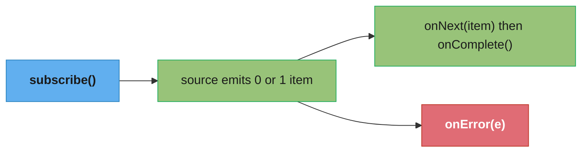
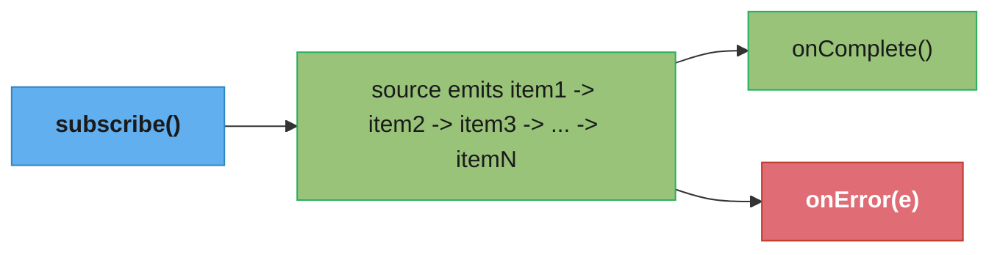
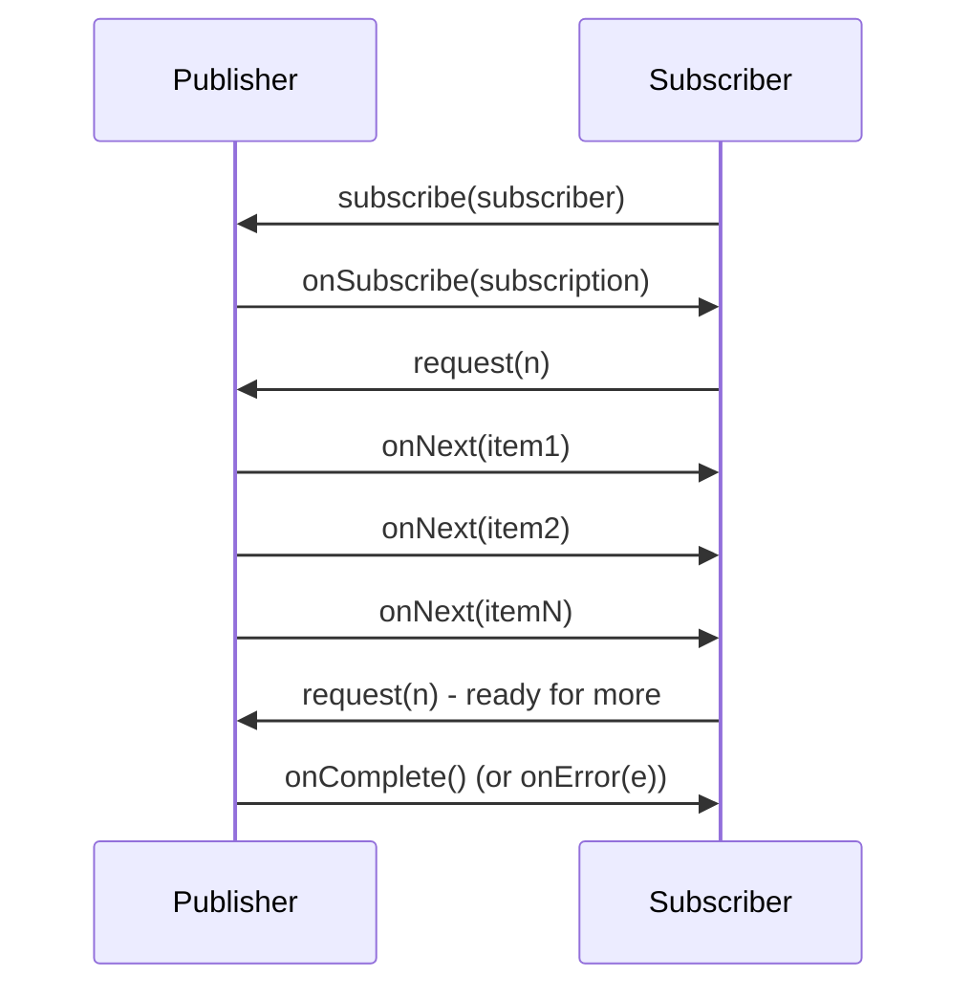
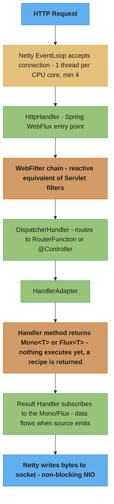
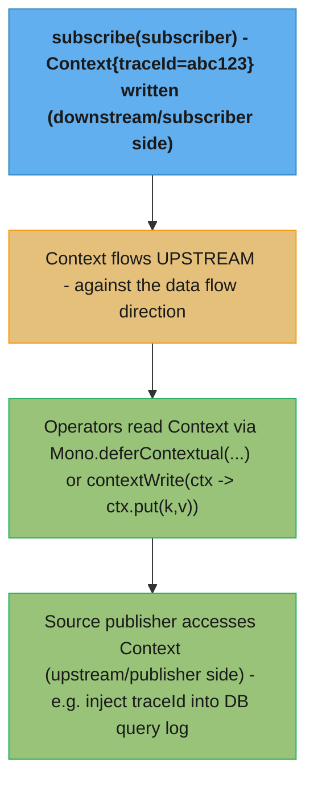
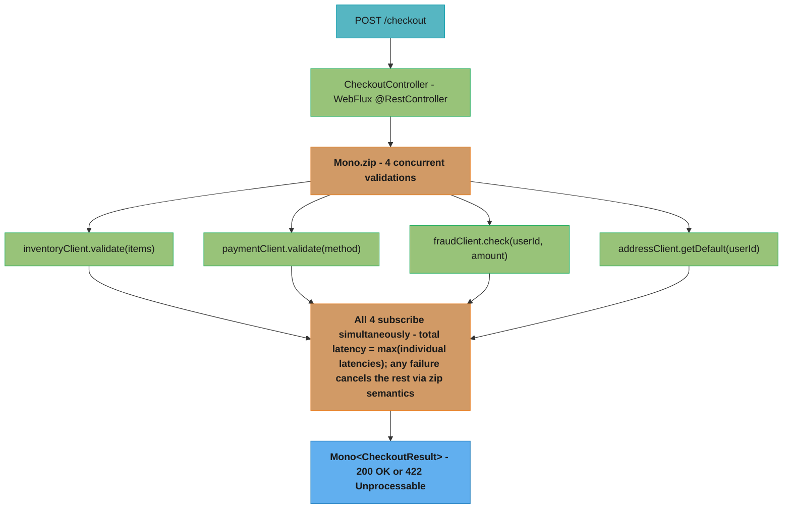

# Spring WebFlux and Project Reactor

---

## 1. Concept Overview

Spring WebFlux is the reactive web framework introduced in Spring 5 as a non-blocking alternative to Spring MVC. It is built on Project Reactor and runs on Netty (the default) or on Servlet 3.1+ containers in non-blocking mode.

**Project Reactor** is the reactive streams implementation underneath WebFlux. It provides two primary types:

- `Mono<T>` — a publisher that emits 0 or 1 item, then completes or errors
- `Flux<T>` — a publisher that emits 0 to N items, then completes or errors

Both are **lazy** — no computation starts until something subscribes. This is the fundamental contract of reactive streams.

**The reactive streams specification** (java.util.concurrent.Flow, Reactor, RxJava, Akka Streams all implement it) defines four interfaces: `Publisher`, `Subscriber`, `Subscription`, and `Processor`. All of Reactor's behavior derives from these contracts plus backpressure — the ability for a subscriber to signal to a publisher how many items it is ready to receive.

**WebFlux vs. Spring MVC:** Spring MVC uses a thread-per-request model. WebFlux uses an event-loop model (Netty's event loop threads, typically one per CPU core) where I/O completion events are handled non-blocking, allowing a handful of threads to serve thousands of concurrent connections. The performance benefit is realized for I/O-bound workloads with high concurrency. For CPU-bound work or low concurrency, Spring MVC is simpler and equally performant.

---

## 2. Intuition

One-line analogy: A `Mono`/`Flux` is a recipe, not a meal — subscribing is the act of cooking.

Mental model: Think of a reactive chain as a pipeline of lazy transformations. Each operator returns a new publisher that, when subscribed, pulls data through the pipeline from source to subscriber. The subscriber controls the pace via backpressure signals (`request(n)` in the `Subscription` protocol).

Why it matters: Traditional blocking I/O holds a thread for the entire duration of a database call or an HTTP request to another service. With 200 Tomcat threads and 100ms average I/O wait, maximum throughput is 200 / 0.1s = 2,000 req/sec. An event-loop model with 8 threads can handle orders of magnitude more concurrent I/O operations because threads are never parked waiting.

Key insight: The power of reactive programming is not in the operators — it is in the ability to describe a complete computation pipeline that handles concurrency, backpressure, error propagation, and cancellation declaratively, with no shared mutable state and no thread coordination primitives.

---

## 3. Core Principles

**Reactive Streams Contract**
A publisher must not produce more items than the subscriber has requested. This backpressure protocol prevents fast publishers from overwhelming slow subscribers — the fundamental problem that caused `OutOfMemoryError` in legacy producer/consumer systems.

**Laziness**
Neither `Mono` nor `Flux` does any work at construction time. A `Flux.fromIterable(list).map(transform).filter(predicate)` builds a description of the computation. Work begins only on `subscribe()`. This enables composition without execution and makes reactive code more predictable about when side effects occur.

**Immutability of Operators**
Each operator returns a new publisher. The original publisher is not modified. This means you can branch a pipeline by holding references to intermediate publishers, though in practice this is rare.

**Error as First-Class Citizen**
Errors propagate downstream through the `onError` signal. Every operator has default error-passing semantics, and you can intercept errors with `onErrorReturn`, `onErrorResume`, `onErrorMap`, and `doOnError`. Uncaught errors terminate the subscription.

**Non-Blocking Event Loop**
Netty uses a small number of event-loop threads (default: `2 * CPU cores`, minimum 4). These threads must never block. Blocking an event-loop thread stalls all I/O operations on that loop, degrading the entire system.

**Context Propagation**
Reactor provides `Context` — an immutable, read-only key-value store that flows upstream (against the data flow direction). It replaces `ThreadLocal` for per-request state (trace ID, security context) in reactive pipelines where data can flow across multiple threads.

---

## 4. Types / Architectures / Strategies

### 4.1 Mono



Use cases: single database lookup, single HTTP call result, `void`-returning operations (use `Mono<Void>`).

### 4.2 Flux



Use cases: streaming database results, Server-Sent Events, paginated API responses.

### 4.3 flatMap vs concatMap vs switchMap

| Operator | Concurrency | Order | Use Case |
|----------|-------------|-------|----------|
| `flatMap` | Concurrent — subscribes to all inner publishers immediately | Not preserved — whichever inner publisher emits first wins | Maximum throughput, order irrelevant (e.g., parallel HTTP calls) |
| `concatMap` | Sequential — waits for inner publisher to complete before starting next | Preserved — strict input order | Order-sensitive transformations (e.g., sequential processing of events) |
| `switchMap` | Concurrent but cancels previous inner publisher when new item arrives | Only latest — previous are discarded | Search-as-you-type, latest-wins scenarios |

### 4.4 WebFlux Programming Models

**Annotated Controllers** (same annotations as Spring MVC, but return `Mono`/`Flux`):
```java
@RestController
public class OrderController {
    @GetMapping("/orders/{id}")
    public Mono<Order> getOrder(@PathVariable String id) {
        return orderRepository.findById(id);
    }
}
```

**Functional Endpoints** (Router Functions + Handler Functions — no reflection, explicit routing):
```java
@Bean
public RouterFunction<ServerResponse> routes(OrderHandler handler) {
    return RouterFunctions.route()
        .GET("/orders/{id}", handler::getOrder)
        .POST("/orders", handler::createOrder)
        .build();
}
```

### 4.5 WebClient

The non-blocking HTTP client for reactive applications. Replaces `RestTemplate` (which is blocking) in WebFlux applications.

### 4.6 R2DBC (Reactive Relational Database Connectivity)

Reactive driver specification for relational databases. Supports PostgreSQL, MySQL, H2, MSSQL, Oracle. Allows non-blocking SQL queries from a reactive chain. The ecosystem is more limited than JDBC — stored procedures, complex transactions, and some advanced query features vary by driver maturity.

### 4.7 Schedulers (Thread Management)

| Scheduler | Backing Pool | Use Case |
|-----------|-------------|----------|
| `Schedulers.parallel()` | Fixed thread pool, size = CPU cores | CPU-bound work |
| `Schedulers.boundedElastic()` | Elastic pool, max 10x CPU cores, 60s idle timeout | Blocking I/O offloading |
| `Schedulers.single()` | Single reusable thread | Lightweight sequential tasks |
| `Schedulers.immediate()` | Current thread | Testing; no thread switch |
| `Schedulers.fromExecutor(e)` | Custom executor | Integration with existing thread pools |

### 4.8 Backpressure Strategies

| Strategy | Behavior | Use When |
|----------|----------|----------|
| `limitRate(n)` | Subscriber requests n items at a time, replenishes at 75% | Controlled pacing for normal consumers |
| `onBackpressureBuffer()` | Buffers all items; can OOM if unbounded | Short bursts expected |
| `onBackpressureBuffer(n)` | Bounded buffer; errors on overflow | Bounded latency tolerance |
| `onBackpressureDrop()` | Drops items subscriber cannot consume | Lossy; acceptable for metrics, UI updates |
| `onBackpressureLatest()` | Keeps only the most recent item | Latest-value-wins scenarios |

---

## 5. Architecture Diagrams

### Reactive Streams Protocol



### Netty Event Loop vs Tomcat Thread-per-Request

```
Tomcat (Spring MVC)                    Netty (Spring WebFlux)

Thread-1: [req1]-------WAITING-------> DB response arrives
Thread-2: [req2]-------WAITING-------> HTTP response arrives
Thread-3: [req3]-------WAITING-------> File read completes
...
Thread-200: [req200]---WAITING------>
                                       Event Loop Thread-1:
[req201] REJECTED (queue full)            -> accepts req1 connection
                                          -> registers DB I/O with OS
                                          -> immediately accepts req2
                                          -> registers HTTP I/O with OS
                                          -> accepts req3, req4...req1000
                                          <- DB result for req1 ready
                                          -> completes req1 pipeline
                                          <- HTTP result for req2 ready
                                          -> completes req2 pipeline
                                          ...
```

### Operator Pipeline Subscription Flow (Assembly vs. Subscription Time)

```
ASSEMBLY TIME (building the pipeline — no work done):
  Flux.fromIterable(ids)         <- source operator
       .map(this::enrich)        <- wraps source
       .filter(this::isValid)    <- wraps map
       .flatMap(this::fetchData) <- wraps filter
       .collectList()            <- wraps flatMap
                                 <- Mono<List<T>> returned (recipe only)

SUBSCRIPTION TIME (subscribe() called — work begins):
  collectList subscribes to flatMap
  flatMap subscribes to filter
  filter subscribes to map
  map subscribes to fromIterable
  fromIterable starts emitting ids
  Each id flows: map -> filter -> flatMap (concurrent HTTP calls)
  Results accumulate in collectList
  onComplete() triggers when all flatMap publishers complete
```

### WebFlux Request Handling on Netty



### Context Propagation



---

## 6. How It Works — Detailed Mechanics

### 6.1 Mono and Flux Basics

```java
// Mono — 0 or 1 item
Mono<String> empty = Mono.empty();
Mono<String> just = Mono.just("hello");
Mono<String> error = Mono.error(new RuntimeException("failed"));
Mono<String> deferred = Mono.fromSupplier(() -> expensiveCompute()); // lazy

// Flux — 0 to N items
Flux<Integer> range = Flux.range(1, 100);
Flux<String> fromList = Flux.fromIterable(list);
Flux<Long> interval = Flux.interval(Duration.ofMillis(100)); // emits every 100ms

// Nothing happens until subscribe:
Mono<String> mono = Mono.fromSupplier(() -> {
    System.out.println("computing"); // never printed without subscribe
    return "result";
});
// At this point: no output

mono.subscribe(value -> System.out.println("Got: " + value));
// Now: "computing" then "Got: result"
```

### 6.2 Operator Composition

```java
// flatMap: concurrent, unordered
Flux.fromIterable(userIds)          // 100 user IDs
    .flatMap(id ->
        userService.findById(id),   // 100 concurrent Mono calls
        16)                         // concurrency hint: max 16 concurrent inner subscriptions
    .filter(user -> user.isActive())
    .map(User::getEmail)
    .collectList()                  // Mono<List<String>>
    .subscribe(emails -> sendBulkEmail(emails));

// concatMap: sequential, ordered — use when side effects must be ordered
Flux.fromIterable(orderIds)
    .concatMap(id -> orderService.process(id))  // processes one at a time, in order
    .subscribe();

// zip: combine two publishers element-by-element
Mono<User> userMono = userService.findById(userId);
Mono<Account> accountMono = accountService.findByUserId(userId);

Mono.zip(userMono, accountMono)     // subscribes to both concurrently
    .map(tuple -> new UserProfile(tuple.getT1(), tuple.getT2()))
    .subscribe(profile -> render(profile));
```

### 6.3 Error Handling

```java
userRepository.findById(id)
    .switchIfEmpty(Mono.error(new UserNotFoundException(id)))  // 404 case
    .map(user -> transform(user))
    .onErrorMap(DataAccessException.class,
        e -> new ServiceException("Database unavailable", e))  // translate tech errors
    .onErrorResume(UserNotFoundException.class,
        e -> Mono.just(User.anonymous()))  // fallback value
    .doOnError(e -> metrics.incrementErrorCount(e.getClass()))  // side effect on error, re-emits error
    .retry(3)  // retry up to 3 times on any error — use retryWhen for conditional retry
    .timeout(Duration.ofSeconds(5),
        Mono.error(new TimeoutException("user lookup timed out after 5s")));
```

### 6.4 WebClient

```java
@Bean
public WebClient webClient(WebClient.Builder builder) {
    return builder
        .baseUrl("https://api.inventory.internal")
        .defaultHeader("X-Service", "order-service")
        .codecs(configurer ->
            configurer.defaultCodecs().maxInMemorySize(2 * 1024 * 1024))  // 2MB buffer
        .build();
}

// GET with error handling
public Mono<InventoryItem> getInventory(String productId) {
    return webClient.get()
        .uri("/inventory/{id}", productId)
        .retrieve()
        .onStatus(HttpStatus::is4xxClientError,
            response -> response.bodyToMono(ErrorResponse.class)
                .flatMap(err -> Mono.error(new ClientException(err.getMessage()))))
        .onStatus(HttpStatus::is5xxServerError,
            response -> Mono.error(new ServerException("inventory service error")))
        .bodyToMono(InventoryItem.class)
        .timeout(Duration.ofSeconds(3))
        .retryWhen(Retry.backoff(3, Duration.ofMillis(100))
            .filter(e -> e instanceof ServerException));
}

// POST with request body
public Mono<Order> createOrder(CreateOrderRequest request) {
    return webClient.post()
        .uri("/orders")
        .contentType(MediaType.APPLICATION_JSON)
        .bodyValue(request)
        .retrieve()
        .bodyToMono(Order.class);
}

// Streaming response
public Flux<StockPrice> streamPrices(String symbol) {
    return webClient.get()
        .uri("/prices/{symbol}/stream", symbol)
        .accept(MediaType.TEXT_EVENT_STREAM)
        .retrieve()
        .bodyToFlux(StockPrice.class);
}
```

### 6.5 Reactor Context

```java
// Writing to Context
Mono<String> withContext = Mono.just("data")
    .contextWrite(Context.of("traceId", "abc123", "userId", "user-99"));

// Reading from Context — use deferContextual
Mono<String> readingContext = Mono.deferContextual(ctx -> {
    String traceId = ctx.getOrDefault("traceId", "unknown");
    return fetchData(traceId);
});

// Practical: propagate security context in WebFlux
public Mono<Response> securedOperation() {
    return ReactiveSecurityContextHolder.getContext()
        .map(SecurityContext::getAuthentication)
        .flatMap(auth -> businessService.execute(auth.getName()));
}
```

### 6.6 Backpressure with limitRate

```java
// Without backpressure control: fast source, slow consumer
Flux.range(1, 1_000_000)
    .flatMap(i -> slowProcess(i))   // BUG: subscribes to all 1M concurrently, OOM

// With limitRate: request 100 at a time, replenish when 75 consumed (default 75% prefetch)
Flux.range(1, 1_000_000)
    .limitRate(100)
    .flatMap(i -> slowProcess(i), 10)  // max 10 concurrent inner subscriptions
    .subscribe();

// onBackpressureBuffer with bounded buffer
Flux.interval(Duration.ofMillis(1))   // emits 1000/sec
    .onBackpressureBuffer(500,
        dropped -> log.warn("Dropped item: {}", dropped),
        BufferOverflowStrategy.DROP_OLDEST)
    .delayElements(Duration.ofMillis(5))  // processes 200/sec
    .subscribe();
```

### 6.7 Concrete Numbers

- Netty default event loop threads: `max(2 * CPU cores, 4)` — on a 4-core machine, 8 threads serve all connections
- `Schedulers.boundedElastic()` max threads: `10 * CPU cores` (default), configurable; idle thread timeout 60 seconds; task queue unbounded by default
- `WebClient` default in-memory buffer for response body: 256 KB — increase with `maxInMemorySize` for large payloads
- Reactor's default prefetch in `flatMap`: 256 items
- `limitRate(n)` triggers replenishment at `0.75 * n` items consumed (75% prefetch ratio)
- `Flux.interval` uses `Schedulers.parallel()` by default
- Spring Boot 3.x WebFlux on Netty: typically handles 10,000+ concurrent connections on a 4-core machine with 256 MB heap

---

## 7. Real-World Examples

### 7.1 Aggregating Multiple Service Calls Concurrently

```java
@GetMapping("/dashboard/{userId}")
public Mono<Dashboard> getDashboard(@PathVariable String userId) {
    Mono<UserProfile> profile = userService.getProfile(userId);
    Mono<List<Order>> orders = orderService.getRecentOrders(userId, 10);
    Mono<AccountBalance> balance = accountService.getBalance(userId);
    Mono<List<Notification>> notifications = notificationService.getUnread(userId);

    // All four calls execute concurrently — total latency = max(individual latencies)
    // vs. sequential: sum(individual latencies)
    return Mono.zip(profile, orders, balance, notifications)
        .map(tuple -> Dashboard.builder()
            .profile(tuple.getT1())
            .orders(tuple.getT2())
            .balance(tuple.getT3())
            .notifications(tuple.getT4())
            .build());
}
```

### 7.2 Server-Sent Events Streaming

```java
@GetMapping(value = "/prices/{symbol}", produces = MediaType.TEXT_EVENT_STREAM_VALUE)
public Flux<StockPrice> streamPrices(@PathVariable String symbol) {
    return priceService.getPriceStream(symbol)
        .filter(price -> price.hasChanged())
        .sample(Duration.ofMillis(100))   // at most 10 events/sec per client
        .timeout(Duration.ofMinutes(30)); // disconnect idle clients
}
```

### 7.3 Reactive Database Pagination with R2DBC

```java
public Flux<Product> streamAllProducts(int batchSize) {
    return productRepository.findAll()
        .buffer(batchSize)               // collect into List<Product> of batchSize
        .delayElements(Duration.ofMillis(50))  // rate-limit to protect downstream
        .flatMapIterable(batch -> batch); // flatten back to individual items
}
```

---

## 8. Tradeoffs

| Dimension | Spring WebFlux / Reactor | Spring MVC / Blocking |
|-----------|--------------------------|----------------------|
| Concurrency model | Event loop — few threads, non-blocking I/O | Thread-per-request — 200 Tomcat threads default |
| Throughput for I/O-bound | Very high — 10K+ concurrent connections on 8 threads | Limited by thread count — ~2K req/sec at 100ms I/O |
| CPU-bound workload | No benefit; event-loop threads should not block | Straightforward — threads doing CPU work is fine |
| Learning curve | High — reactive paradigm, operator vocabulary, debugging difficulty | Low — sequential imperative code |
| Debugging | Stack traces are unintelligible (operator assembly traces); need `Hooks.onOperatorDebug()` or `ReactorDebugAgent` | Normal Java stack traces |
| Library ecosystem | Maturing — R2DBC less mature than JDBC; some libraries have no reactive driver | Mature — JDBC, JPA, most libraries blocking by default |
| Thread-local / SecurityContext | Broken — must use Reactor Context and `ReactiveSecurityContextHolder` | Works naturally — Spring Security uses ThreadLocal |
| Code readability | Declarative pipelines — readable with experience; alien to new team members | Imperative — universally understood |
| Error handling | Declarative — `onErrorResume`, `onErrorMap`; easy to forget to handle | Try-catch familiar to all Java developers |
| Blocking code safety | Blocking inside event loop destroys performance; requires `subscribeOn(boundedElastic())` | Any blocking call is fine by design |

---

## 9. When to Use / When NOT to Use

### Use Spring WebFlux when:
- The application is I/O-bound with many concurrent requests: API gateways, proxies, streaming services, chat applications
- Building a service that aggregates responses from multiple downstream services concurrently (fan-out)
- Implementing Server-Sent Events or WebSocket streaming
- The target deployment environment is resource-constrained (fewer threads = less memory per connection)
- The entire stack supports reactive drivers: R2DBC for the database, reactive Redis client, reactive MongoDB driver

### Use Spring MVC (do NOT use WebFlux) when:
- The application is CPU-bound — reactive provides no benefit for pure computation; thread-per-request is simpler
- The team is unfamiliar with reactive programming — the productivity cost of the learning curve exceeds the concurrency benefit for most business applications
- The database access layer uses JDBC/JPA — blocking database calls inside a reactive chain require `subscribeOn(boundedElastic())`, which partially negates the event-loop benefit
- Third-party libraries are blocking and cannot be replaced — wrapping every blocking call in `subscribeOn` adds complexity
- The application handles a low volume of requests — below 1,000 concurrent connections, Spring MVC and WebFlux perform equivalently
- Thorough debugging and straightforward stack traces are a priority for operational teams

---

## 10. Common Pitfalls

### Pitfall 1: Blocking code inside the event-loop thread

**Broken:**
```java
@GetMapping("/orders/{id}")
public Mono<Order> getOrder(@PathVariable String id) {
    // BUG: jdbcTemplate.queryForObject is blocking — it parks the calling thread
    // This thread IS the Netty event-loop thread
    // While this thread waits for the DB, ALL other requests on this loop stall
    Order order = jdbcTemplate.queryForObject(
        "SELECT * FROM orders WHERE id = ?", Order.class, id);
    return Mono.just(order);
}
```

**Fixed:**
```java
@GetMapping("/orders/{id}")
public Mono<Order> getOrder(@PathVariable String id) {
    return Mono.fromCallable(() ->
            jdbcTemplate.queryForObject(
                "SELECT * FROM orders WHERE id = ?", Order.class, id))
        .subscribeOn(Schedulers.boundedElastic());  // offload blocking call
        // Result is then published back to the event loop for response writing
}
```

**Better fix:** Migrate to R2DBC and remove JDBC entirely for the reactive path.

**Production war story:** A team migrated a payment service to WebFlux to handle peak load better. Under load testing, latency at p99 was 50x worse than Spring MVC. Thread dumps showed all 8 Netty event-loop threads blocked on HikariCP connection acquisition. Their `@Repository` classes used `JdbcTemplate` directly inside `Mono.just(...)` — the blocking happened on the event-loop thread with no `subscribeOn` wrapper. The fix required either wrapping every repository call with `subscribeOn(Schedulers.boundedElastic())` or migrating to R2DBC. They chose boundedElastic wrappers as an interim fix, accepting reduced throughput improvement in exchange for stability.

---

### Pitfall 2: Calling block() inside a reactive chain

**Broken:**
```java
public Mono<String> processOrder(String orderId) {
    return Mono.fromCallable(() -> {
        // BUG: block() inside a reactive operator running on event-loop thread
        // If the event-loop thread calls block(), it waits for the inner Mono
        // The inner Mono also needs the event-loop thread to complete
        // DEADLOCK: event-loop thread is waiting for itself
        User user = userService.findCurrentUser().block();  // deadlock on Netty
        return "Processed by " + user.getName();
    });
}
```

**Fixed:**
```java
public Mono<String> processOrder(String orderId) {
    return userService.findCurrentUser()
        .map(user -> "Processed by " + user.getName());
    // compose reactively — no block() needed
}

// block() is ONLY acceptable at the application boundary (e.g., main method, tests)
// Never inside a reactive operator or on a reactor thread
@Test
void testProcessOrder() {
    String result = service.processOrder("order-1").block(Duration.ofSeconds(5));
    assertThat(result).startsWith("Processed by");
}
```

---

### Pitfall 3: Mutating shared state inside operators

**Broken:**
```java
List<String> results = new ArrayList<>();  // shared mutable state

Flux.range(1, 1000)
    .parallel()
    .runOn(Schedulers.parallel())
    .map(i -> fetchData(i))
    .doOnNext(data -> results.add(data))  // BUG: ArrayList is not thread-safe
    .sequential()
    .subscribe();
// ConcurrentModificationException or silent data loss
```

**Fixed:**
```java
// Collect into list reactively — no shared mutable state
Flux.range(1, 1000)
    .flatMap(i -> fetchData(i), 16)  // 16 concurrent fetches
    .collectList()                   // thread-safe accumulation inside Reactor
    .subscribe(results -> process(results));
```

---

### Pitfall 4: Not subscribing — the pipeline never executes

**Broken:**
```java
public void sendNotifications(List<String> userIds) {
    Flux.fromIterable(userIds)
        .flatMap(id -> notificationService.send(id));
    // BUG: no subscribe() call — nothing executes
    // Method returns, notifications are never sent
}
```

**Fixed:**
```java
public void sendNotifications(List<String> userIds) {
    Flux.fromIterable(userIds)
        .flatMap(id -> notificationService.send(id))
        .subscribe(
            result -> log.debug("Sent: {}", result),
            error -> log.error("Failed to send notification", error),
            () -> log.info("All notifications sent")
        );
    // OR: if this is inside a reactive chain, return the Flux and let the caller subscribe
}
```

---

### Pitfall 5: Using ThreadLocal inside reactive code

**Broken:**
```java
// Spring Security stores authentication in a ThreadLocal
// In MVC this works: the same thread handles the entire request
// In WebFlux the chain can switch threads — ThreadLocal context is lost

@GetMapping("/profile")
public Mono<Profile> getProfile() {
    return Mono.fromCallable(() -> {
        // BUG: if this runs on a different thread than the one that set SecurityContext,
        // SecurityContextHolder returns null
        Authentication auth = SecurityContextHolder.getContext().getAuthentication();
        return profileService.get(auth.getName());  // NullPointerException
    }).subscribeOn(Schedulers.boundedElastic());
}
```

**Fixed:**
```java
@GetMapping("/profile")
public Mono<Profile> getProfile() {
    return ReactiveSecurityContextHolder.getContext()
        .map(SecurityContext::getAuthentication)
        .flatMap(auth -> profileService.get(auth.getName()));
    // ReactiveSecurityContextHolder uses Reactor Context, not ThreadLocal
}
```

---

### Pitfall 6: Ignoring errors from fire-and-forget subscriptions

**Broken:**
```java
public Mono<Order> createOrder(OrderRequest request) {
    return orderRepository.save(request)
        .doOnSuccess(order -> {
            // BUG: subscribe() with no error handler — errors are swallowed silently
            auditService.log(order).subscribe();
        });
}
```

**Fixed:**
```java
public Mono<Order> createOrder(OrderRequest request) {
    return orderRepository.save(request)
        .doOnSuccess(order -> {
            auditService.log(order)
                .subscribe(
                    null,
                    error -> log.error("Audit logging failed for order {}: {}",
                        order.getId(), error.getMessage())
                );
        });
}
```

---

## 11. Technologies & Tools

| Technology | Role |
|------------|------|
| Project Reactor (`reactor-core`) | Core reactive library: `Mono`, `Flux`, operators, schedulers |
| Spring WebFlux (`spring-webflux`) | Reactive web framework on top of Reactor |
| Netty | Default HTTP server for WebFlux; event-loop NIO |
| `WebClient` | Non-blocking HTTP client replacing `RestTemplate` |
| R2DBC | Reactive relational database driver specification |
| `r2dbc-postgresql`, `r2dbc-mysql` | R2DBC driver implementations |
| Spring Data R2DBC | Repository abstraction over R2DBC |
| Reactive Redis (`spring-data-redis` with Lettuce) | Non-blocking Redis client (Lettuce uses Netty) |
| Reactive MongoDB (`spring-data-mongodb` reactive) | Non-blocking MongoDB driver |
| `reactor-test` | Testing utilities: `StepVerifier`, `TestPublisher` |
| `ReactorDebugAgent` | Java agent that captures assembly-time stack traces for better debugging |
| `Hooks.onOperatorDebug()` | Enable assembly-time tracing (expensive — dev/test only) |
| Micrometer + `reactor-addons` | Metrics instrumentation for reactive pipelines |
| Spring Security Reactive | `ReactiveSecurityContextHolder`, `SecurityWebFilterChain` |
| `WebTestClient` | Testing reactive web endpoints end-to-end |

---

## 12. Interview Questions with Answers

**Q: What is the difference between Mono and Flux?**
`Mono<T>` is a publisher that emits 0 or 1 item and then signals completion or error. `Flux<T>` emits 0 to N items and then signals completion or error. Both are lazy — no computation runs until something subscribes. Use `Mono` for single-value operations like a database lookup by ID or a POST that returns the created resource. Use `Flux` for multi-value operations like streaming query results or Server-Sent Events.

**Q: What does "lazy" mean in the context of Reactor, and why does it matter?**
A `Mono` or `Flux` represents a description of a computation, not the execution of it. Calling `Mono.fromSupplier(() -> someExpensiveCall())` does not invoke `someExpensiveCall` — it only wraps it. The call executes only when `subscribe()` is invoked. This matters because: (1) the pipeline is composable without triggering side effects, (2) each subscription triggers a fresh execution — important for retry logic and request-scoped operations, and (3) operators can be assembled in one place and subscribed in another, enabling clean separation between pipeline construction and execution.

**Q: What is backpressure, and how does Reactor implement it?**
Backpressure is a flow-control mechanism by which a downstream subscriber signals to an upstream publisher how many items it is ready to consume, preventing the publisher from overwhelming the subscriber. Reactor implements the Reactive Streams specification: when a subscriber calls `subscription.request(n)`, the upstream publishes at most `n` items. Operators like `limitRate(n)` request `n` items at a time and replenish at 75% consumed. For sources that cannot honor backpressure (like `Flux.interval`), overflow strategies like `onBackpressureDrop()` or `onBackpressureBuffer(maxSize)` are applied.

**Q: What backpressure strategies does Reactor provide when a publisher outpaces its subscriber?**
Reactor provides five overflow strategies for backpressure: `limitRate`, buffered (bounded or unbounded), `onBackpressureDrop`, and `onBackpressureLatest`. `limitRate(n)` paces demand by requesting n items at a time and replenishing once 75% are consumed — the right default for well-behaved consumers. Unbounded `onBackpressureBuffer()` queues every item and risks an `OutOfMemoryError` under sustained overload, while bounded `onBackpressureBuffer(n)` caps the queue and errors on overflow instead. `onBackpressureDrop()` discards items the subscriber cannot keep up with, and `onBackpressureLatest()` keeps only the newest item — both are lossy but appropriate for metrics streams or live UI updates where freshness matters more than completeness. Sources that cannot honor backpressure natively, such as `Flux.interval`, must have one of these strategies applied explicitly or they will eventually exhaust memory.

**Q: What is the difference between flatMap and concatMap?**
`flatMap` subscribes to all inner publishers concurrently as each item arrives from the source, emitting results as they arrive — so output order may differ from input order. `concatMap` subscribes to the next inner publisher only after the previous one completes, preserving order but sacrificing concurrency. Use `flatMap` when maximum throughput matters and order is irrelevant (parallel HTTP calls). Use `concatMap` when operations must be sequential and ordered (processing financial events where order is contractually required).

**Q: Why should you never call block() inside a reactive pipeline running on a Netty event-loop thread?**
Calling `block()` suspends the current thread until the inner publisher completes. If the current thread is a Netty event-loop thread, blocking it prevents Netty from processing any other I/O events on that loop — including the I/O completion that the inner publisher is waiting for. This creates a deadlock. Additionally, Reactor 3.x detects blocking calls on non-blocking scheduler threads and throws a `BlockingOperationError` by default when this guard is enabled. `block()` is only safe at the application boundary — in `main()`, in tests, or in code explicitly scheduled on `boundedElastic()`.

**Q: What is Reactor Context, and why is it needed in reactive programming?**
Reactor `Context` is an immutable, read-only key-value store that propagates upstream through the reactive chain (against the data flow direction). It replaces `ThreadLocal` for per-request state (trace IDs, security context, locale) in reactive pipelines where operators can execute on different threads and `ThreadLocal` values are therefore unreliable. You write to the context with `.contextWrite(Context.of(key, value))` and read it with `Mono.deferContextual(ctx -> ...)`. Spring Security Reactive uses this to propagate `Authentication` through reactive chains via `ReactiveSecurityContextHolder`.

**Q: When should you use Spring WebFlux instead of Spring MVC?**
WebFlux pays off for I/O-bound applications with high concurrency. Good fits include API gateways, proxies, microservices that aggregate many downstream calls, streaming endpoints, and applications handling thousands of simultaneous connections. For CPU-bound work, low-concurrency services, or teams unfamiliar with reactive programming, Spring MVC is simpler with equivalent performance. A practical threshold: if your service needs to handle more concurrent connections than your Tomcat thread pool (default 200), WebFlux is worth considering. If your service uses JDBC/JPA and you cannot migrate to R2DBC, the benefit of WebFlux is significantly reduced.

**Q: How do you offload blocking I/O when you must use it inside a reactive chain?**
Use `Mono.fromCallable(() -> blockingCall()).subscribeOn(Schedulers.boundedElastic())`. The `subscribeOn` operator moves the subscription (and therefore the execution of the callable) to a thread from `boundedElastic()`, which is a pool of expandable threads designed for blocking I/O. The result is then published back to the event loop for downstream processing. `boundedElastic()` defaults to `10 * CPU cores` threads and an unbounded task queue. For latency-sensitive paths, set an explicit bound with `Schedulers.newBoundedElastic(threadCap, queueSize, name)`.

**Q: Why does Spring WebFlux need R2DBC instead of JDBC to be fully non-blocking?**
JDBC is fundamentally blocking, which is incompatible with WebFlux's non-blocking event-loop threads. Every JDBC `Connection`, `Statement`, and `ResultSet` call parks the calling thread until the database responds; running that call directly on a Netty event-loop thread stalls every other request sharing that loop. Wrapping JDBC in `subscribeOn(Schedulers.boundedElastic())` makes it safe but not actually non-blocking — a thread is still held per in-flight query, just from a separate elastic pool, so you avoid deadlock without gaining the event loop's concurrency benefit. R2DBC (Reactive Relational Database Connectivity) is a driver specification built on the Reactive Streams contract from the start, so a query yields the thread while waiting for I/O and Reactor resumes it via callback when data arrives — no thread is held during the wait. The tradeoff is ecosystem maturity: R2DBC drivers still lag JDBC on stored procedures, some complex transaction features, and vendor-specific behavior, which is why teams sometimes settle for the `boundedElastic` wrapper instead of a full migration.

**Q: What is the WebClient alternative to RestTemplate and why is RestTemplate deprecated for WebFlux?**
`WebClient` is the non-blocking HTTP client for reactive applications. `RestTemplate` is synchronous — it blocks the calling thread for the duration of the HTTP call. Inside a WebFlux application, using `RestTemplate` blocks the event-loop thread, serializing I/O that should be concurrent. `WebClient` returns `Mono<T>` or `Flux<T>`, integrating natively with reactive chains. In Spring MVC applications, you can also use `WebClient` and call `.block()` at the boundary, replacing `RestTemplate` uniformly. Spring has officially deprecated `RestTemplate` for new development since Spring 5.

**Q: How does WebFlux's annotated controller model differ from Spring MVC's?**
The annotations are largely the same (`@RestController`, `@GetMapping`, `@PathVariable`, `@RequestBody`). The key difference is the return type: MVC methods return `T` (or `ResponseEntity<T>`), while WebFlux methods return `Mono<T>` (or `Flux<T>`, or `Mono<ResponseEntity<T>>`). WebFlux also supports `Flux<T>` for streaming responses (SSE, NDJson). Internally, WebFlux's `DispatcherHandler` subscribes to the returned publisher and writes items to the response as they arrive. Parameter binding, validation, and exception handling (`@ExceptionHandler`, `@ControllerAdvice`) work the same way but return reactive types.

**Q: How do you test reactive code with StepVerifier?**
`StepVerifier` from `reactor-test` creates a synchronous test for asynchronous publishers. You create a verifier, declare the expected events in order (`expectNext`, `expectNextMatches`, `expectError`, `expectComplete`), and call `verify()` which subscribes and blocks until all expected events arrive or a timeout is reached. Example:
```java
StepVerifier.create(userService.findById("123"))
    .expectNextMatches(user -> user.getName().equals("Alice"))
    .expectComplete()
    .verify(Duration.ofSeconds(5));
```
`StepVerifier.withVirtualTime()` enables testing time-based operators (like `delayElements`, `timeout`, `interval`) without actually waiting by manipulating a virtual clock.

**Q: What is switchMap and when would you use it?**
`switchMap` subscribes to a new inner publisher each time the source emits, and cancels any previously active inner publisher. Only the results of the most recent inner publisher are emitted. Use it for search-as-you-type scenarios: when a user types a new character, the previous search request is cancelled and a new one starts. Without `switchMap`, using `flatMap`, all in-flight requests would complete and results from outdated queries could overwrite results from the latest query. The cancellation propagates upstream through the reactive streams cancel signal, potentially aborting HTTP requests or DB queries mid-flight.

**Q: How does Spring Security integrate with WebFlux?**
Spring Security for WebFlux uses `SecurityWebFilterChain` instead of Spring MVC's `SecurityFilterChain`. Authentication and authorization are implemented as `WebFilter` instances (WebFlux's equivalent of servlet filters). Security context is stored in Reactor `Context` and accessed via `ReactiveSecurityContextHolder.getContext()`. Configuration uses `@EnableWebFluxSecurity` and a `SecurityWebFilterChain` bean created with `ServerHttpSecurity`. Method security uses `@EnableReactiveMethodSecurity` and `@PreAuthorize` with SpEL that can reference the authenticated principal from the reactive context.

**Q: What are the symptoms of blocking code on the event-loop, and how do you detect it?**
Symptoms include p99 latency spikes to 10-100x baseline and CPU usage dropping to near zero despite a high request rate. Thread dumps show all Netty event-loop threads in `WAITING` or `TIMED_WAITING` state on `java.util.concurrent.locks.*` or JDBC/socket operations. Detection: (1) Enable `BlockHound` — a Java agent that instruments blocking calls and throws `BlockingOperationError` when blocking happens on non-blocking threads; (2) Use `Schedulers.onScheduleHook` to log thread-scheduler mismatches; (3) Thread dumps at peak load — event-loop threads should always be in I/O selection or running short computations, never parked on locks.

**Q: What is the difference between publishOn and subscribeOn?**
`subscribeOn(scheduler)` affects where the subscription-time code (the source's `subscribe()` call and any upstream code) runs. It determines the thread on which the source begins emitting. `publishOn(scheduler)` affects where downstream operators and the subscriber run — it inserts a thread switch for all operators that appear after it in the chain. If you have a blocking source and want to run it on `boundedElastic`, use `subscribeOn`. If you want to run specific downstream operators on a different scheduler (e.g., move CPU-intensive processing to `parallel()`), use `publishOn`. In most real-world scenarios for offloading blocking I/O, `subscribeOn(Schedulers.boundedElastic())` is the correct choice.

**Q: How do you handle timeout and retry in a WebClient call?**
Use `.timeout(Duration)` to emit a `TimeoutException` if the publisher does not complete within the duration, and `.retryWhen(Retry.backoff(maxAttempts, minBackoff))` for exponential backoff retries. The `Retry.backoff` variant supports `jitter()` to spread retry timing, `.filter(e -> e instanceof NetworkException)` to retry only on specific errors, and `.maxBackoff(maxDuration)` to cap the backoff delay. Example: `retryWhen(Retry.backoff(3, Duration.ofMillis(100)).maxBackoff(Duration.ofSeconds(2)).jitter(0.5))` retries up to 3 times with 100ms base delay, up to 2 seconds max, with 50% jitter. Place `.timeout()` before `.retryWhen()` if you want each attempt to have its own timeout.

---

## 13. Best Practices

**Never block on a Netty event-loop thread.** This is the cardinal rule. Use `BlockHound` in test and staging environments to enforce this automatically. Any call to `Thread.sleep`, `Future.get()`, JDBC, `RestTemplate`, or any `block()` invocation on a reactor thread is a defect.

**Prefer composing reactive types over wrapping blocking calls.** `subscribeOn(boundedElastic())` is a workaround, not an architecture. For new services, use R2DBC for databases and reactive-native libraries throughout.

**Annotate test methods with `StepVerifier.withVirtualTime` for time-dependent tests.** Never `Thread.sleep` in tests for time-based operators — virtual time makes tests deterministic and runs them in microseconds.

**Use `doOnError` for logging, not `onErrorResume` when you do not want to change the error behavior.** `doOnError` observes the error and re-emits it. `onErrorResume` consumes it and substitutes a fallback.

**Set explicit backpressure strategies on sources that cannot honor backpressure.** `Flux.interval`, Kafka consumer offsets, and network streams can all produce faster than consumers process. Always apply `onBackpressureBuffer(n)` or `onBackpressureDrop()` explicitly — unbounded `onBackpressureBuffer()` is a memory leak.

**Enable `ReactorDebugAgent` in production for better stack traces.** Unlike `Hooks.onOperatorDebug()` which instruments at runtime (high overhead), `ReactorDebugAgent` uses a Java agent to capture assembly-time traces with minimal overhead.

**Use `Mono.zip` for independent concurrent calls, not sequential flatMap.** `zip` subscribes to all publishers simultaneously, completing when all complete. This is a common performance win when aggregating data from multiple services.

**Set timeouts on all external calls.** Reactive code is not inherently resilient. An unresponsive downstream service will hold open subscriptions indefinitely without a `.timeout()`. Add timeout + retry with exponential backoff and circuit breaking (Resilience4j has reactive adapters) on every WebClient call.

**Propagate trace IDs through Reactor Context.** Instrument a `WebFilter` to extract or generate a trace ID and write it to the request context. Read it with `deferContextual` in any operator that needs it. This replaces MDC-based tracing which is thread-local and breaks across thread switches.

**Avoid stateful operator chains.** Operators that accumulate state (`scan`, `reduce`, `collect`) are fine. Sharing mutable objects (lists, maps) across parallel operator executions without synchronization causes data races. Use Reactor's built-in collectors instead.

---

## 14. Case Study

### Building a Real-Time Order Processing Aggregator

**Context:** An e-commerce platform's checkout service must, for each order creation request, concurrently: (1) validate inventory with the inventory service, (2) validate the payment method with the payment service, (3) check for active fraud flags with the fraud service, and (4) fetch the user's shipping addresses. All four calls must complete within 800ms SLA. Under Black Friday load, the service receives 5,000 checkout requests per second. The legacy Spring MVC implementation required 1,000 threads and still hit timeout errors at peak.

**Goals:**
- Handle 5,000 req/sec with under 800ms p99 latency
- Fail fast: if any validation fails, cancel remaining calls immediately
- Return structured error response indicating which validation failed

**Architecture:**



**Key implementation:**

```java
@RestController
@RequiredArgsConstructor
public class CheckoutController {

    private final InventoryClient inventoryClient;
    private final PaymentClient paymentClient;
    private final FraudClient fraudClient;
    private final AddressClient addressClient;
    private final OrderRepository orderRepository;

    @PostMapping("/checkout")
    public Mono<ResponseEntity<OrderConfirmation>> checkout(
            @RequestBody @Valid CheckoutRequest request,
            ServerWebExchange exchange) {

        return exchange.getPrincipal()
            .cast(Authentication.class)
            .flatMap(auth -> processCheckout(request, auth.getName()))
            .map(confirmation -> ResponseEntity.status(HttpStatus.CREATED).body(confirmation))
            .onErrorMap(ValidationException.class,
                e -> new ResponseStatusException(HttpStatus.UNPROCESSABLE_ENTITY, e.getMessage()))
            .timeout(Duration.ofMillis(750),
                Mono.error(new ResponseStatusException(HttpStatus.GATEWAY_TIMEOUT,
                    "Checkout validation timed out")));
    }

    private Mono<OrderConfirmation> processCheckout(CheckoutRequest request, String userId) {
        Mono<InventoryResult> inventory = inventoryClient
            .validate(request.getItems())
            .timeout(Duration.ofMillis(600))
            .retryWhen(Retry.backoff(2, Duration.ofMillis(50)));

        Mono<PaymentResult> payment = paymentClient
            .validate(request.getPaymentMethod())
            .timeout(Duration.ofMillis(600));

        Mono<FraudResult> fraud = fraudClient
            .check(userId, request.getTotalAmount())
            .timeout(Duration.ofMillis(600));

        Mono<ShippingAddress> address = addressClient
            .getDefault(userId)
            .timeout(Duration.ofMillis(400));

        return Mono.zip(inventory, payment, fraud, address)
            .flatMap(tuple -> {
                InventoryResult inv = tuple.getT1();
                PaymentResult pay = tuple.getT2();
                FraudResult fr = tuple.getT3();
                ShippingAddress addr = tuple.getT4();

                if (!inv.isAvailable()) {
                    return Mono.error(new ValidationException(
                        "Items out of stock: " + inv.getUnavailableItems()));
                }
                if (!pay.isValid()) {
                    return Mono.error(new ValidationException(
                        "Payment method declined: " + pay.getReason()));
                }
                if (fr.isFlagged()) {
                    return Mono.error(new ValidationException(
                        "Order flagged for review"));
                }

                return orderRepository.save(
                    Order.from(request, userId, addr));
            })
            .map(order -> new OrderConfirmation(order.getId(),
                order.getEstimatedDelivery()));
    }
}
```

**Results after migration to WebFlux:**

```
                     Spring MVC          Spring WebFlux
                     ----------          --------------
Threads required:    1,000               16 (8 event-loop + 8 boundedElastic)
Memory per instance: 4 GB               800 MB
p50 latency:         180ms              120ms
p99 latency:         820ms (SLA breach) 310ms
Max throughput:      3,200 req/sec       8,500 req/sec
Instance count       6                  2
at 5K req/sec:
```

**Key lessons:**
- `Mono.zip` is the single most impactful pattern: it cut latency by converting 4 sequential 150ms calls (600ms) into 4 concurrent calls (~180ms = the slowest single call)
- Setting individual timeouts on each client call prevents one slow downstream service from holding the overall 750ms budget
- The fraud service occasionally spikes to 800ms; the per-call 600ms timeout with a 2-attempt retry on the inventory service (which had transient failures) was tuned separately from the overall checkout timeout
- Thread count reduction from 1,000 to 16 reduced JVM heap pressure substantially, which in turn reduced GC pause frequency and improved tail latency
- The `ServerWebExchange.getPrincipal()` pattern for accessing the authenticated user in WebFlux replaced `SecurityContextHolder.getContext().getAuthentication()` — the reactive security context propagation was the most complex migration aspect

---

**Additional production patterns and interview Q&As:**

**Backpressure war story: unbounded in-memory queue caused OOM.** A reactive pipeline consumed a Kafka topic and mapped each record through a slow external enrichment API (200ms). Without backpressure, the `Flux` buffered 100k pending records in heap, causing an OOM at peak.

```java
// BROKEN: flatMap with unlimited concurrency — 100k parallel HTTP calls buffered
Flux.fromIterable(kafkaRecords)
    .flatMap(record -> enrichmentClient.enrich(record))  // no concurrency limit!
    .subscribe(enriched -> repo.save(enriched));

// FIX: flatMap with concurrency cap and bounded prefetch
Flux.fromIterable(kafkaRecords)
    .flatMap(
        record -> enrichmentClient.enrich(record),
        8,     // max 8 concurrent inner subscriptions
        1      // prefetch 1 at a time from upstream
    )
    .subscribe(enriched -> repo.save(enriched));
// Result: heap usage: 4GB (OOM) → 180MB
```

**Pitfall: Blocking call inside reactive pipeline pins Netty thread.**

```java
// BROKEN: blocking JDBC call on Netty I/O thread → stalls all reactive requests
@GetMapping("/vehicles/{id}")
public Mono<Vehicle> getVehicle(@PathVariable String id) {
    return Mono.fromCallable(() -> jdbcRepo.findById(id));  // blocks Netty thread!
}

// FIX: offload blocking to bounded elastic scheduler
@GetMapping("/vehicles/{id}")
public Mono<Vehicle> getVehicle(@PathVariable String id) {
    return Mono.fromCallable(() -> jdbcRepo.findById(id))
               .subscribeOn(Schedulers.boundedElastic());
}
// Or use R2DBC for fully non-blocking DB access
```

**When to use WebFlux vs Spring MVC:** Use WebFlux when upstream is reactive (R2DBC, reactive MongoDB, WebClient), you need streaming (Server-Sent Events, large file transfer), or you're running at >10k concurrent connections with I/O-bound workloads. Stick with Spring MVC when the data layer is blocking JDBC/Hibernate (virtual threads in Java 21 make MVC competitive), the team is unfamiliar with reactive programming, or the codebase uses `ThreadLocal`-based patterns (Spring Security `SecurityContext`, MDC) that need special reactive adaptation.

**Additional interview Q&As:**

**How does Project Reactor handle error signals differently from exceptions?** In a reactive pipeline, exceptions thrown inside operators are caught and converted to `onError` signals propagated downstream. Use `onErrorReturn(fallback)` for a static fallback, `onErrorResume(fn)` for a dynamic fallback `Mono`/`Flux`, and `onErrorMap(fn)` to rethrow as a different exception type. Uncaught errors that reach `subscribe()` are delivered to the subscriber's error handler; if none is provided, the exception is re-thrown on the subscription thread — often silently swallowed in Netty's event loop.

**What is the difference between flatMap and concatMap in Reactor?** `flatMap` subscribes to inner publishers eagerly and merges results in arrival order — fast but unordered. `concatMap` subscribes to inner publishers sequentially — slower but preserves ordering. Use `flatMap` for independent I/O calls (enrichment API calls), `concatMap` when order matters (ordered event processing, sequential DB writes).

**How do you propagate reactive context across service boundaries?** Use `Context` (Reactor's immutable key-value store) propagated automatically through the subscription chain. For HTTP headers (trace IDs), Spring's reactive WebClient supports `ExchangeFilterFunction` that reads from context and sets headers. Never use `ThreadLocal` in reactive code — the thread executing a step changes across operators; use `Mono.deferContextual` to read context at subscription time.

---

## Related / See Also

- [Spring MVC Architecture](../spring_mvc_architecture/README.md) — Servlet stack comparison
- [Spring Messaging](../spring_messaging/README.md) — reactive Kafka with WebFlux
- [Concurrency (Java)](../../java/concurrency/README.md) — virtual threads vs reactive
- [Reactive Programming (Java)](../../java/reactive_programming/README.md) — Project Reactor internals: Flux/Mono, Schedulers, backpressure in depth
- [Async & Concurrency Patterns](../../backend/async_and_concurrency_patterns/README.md) — non-blocking I/O and concurrency patterns at the architecture level
