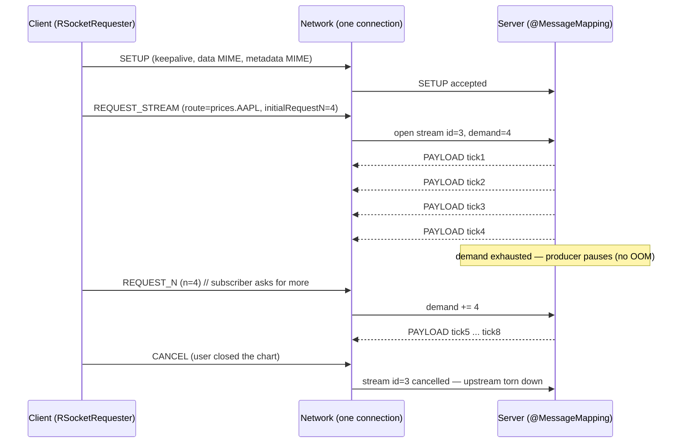
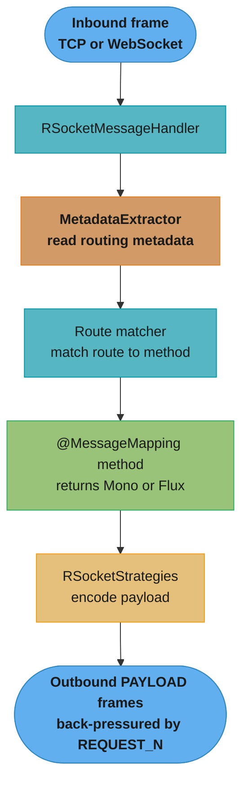

# RSocket Reactive Messaging — Deep Dive

RSocket is a binary, application-layer messaging protocol built for reactive
systems: it carries Reactive Streams backpressure *on the wire*, supports four
interaction models over a single multiplexed connection, and runs over TCP,
WebSocket, or UDP/Aeron. This deep dive covers how Spring integrates RSocket
(`@MessageMapping`, `RSocketRequester`, `RSocketStrategies`), the protocol
mechanics (frames, keepalive, resumption, leasing), security, and how RSocket
compares to gRPC, raw WebSocket, and SSE.

This is a sub-file of [Spring WebFlux](README.md) — RSocket in Spring is built on
Project Reactor, so everything about `Mono`/`Flux`, schedulers, and "never block
the event loop" from the parent applies here verbatim.

Version baseline: RSocket support arrived in Spring Framework 5.2 / Spring Boot
2.2 (Nov 2019). All code below targets **Spring Boot 3.x** (Spring Framework 6,
`jakarta.*`, JDK 17+), using `spring-boot-starter-rsocket` and RSocket Java
(`io.rsocket:rsocket-core` 1.1.x).

---

## 1. Concept Overview

HTTP is a request-response protocol; everything else (streaming, push, bidirectional)
is bolted on. RSocket inverts that: streaming and bidirectional messaging are
first-class, and simple request-response is one of four native interaction
models. RSocket is defined at the *application* layer and is *transport-agnostic* —
the same RSocket semantics run over a raw TCP socket, over a WebSocket frame, or
over an Aeron/UDP datagram flow.

Two properties make RSocket distinctive:

1. **On-the-wire backpressure.** A subscriber's `request(n)` demand is serialized
   into a `REQUEST_N` frame and sent to the remote publisher. The producer on the
   other side of the network only emits what the consumer asked for. HTTP has no
   equivalent — HTTP/1.1 has none, and HTTP/2 flow control is a transport-level
   byte window, not application-level message demand.
2. **A single multiplexed, long-lived connection.** Many logical streams share one
   connection, each identified by a stream ID in the frame header. There is no
   head-of-line blocking between logical streams (as with HTTP/1.1 pipelining) and
   no per-request connection setup cost.

---

## 2. Intuition

**One-line analogy:** RSocket is to reactive streaming what HTTP is to
request-response — the protocol *is* the programming model, not a workaround layered
on top of one.

**Mental model:** Picture two peers connected by one pipe. Either side can open a
logical stream at any time by sending a frame tagged with a fresh stream ID. Frames
for all streams interleave on the pipe. Each stream carries not just data but
*demand* — the consumer keeps telling the producer "send me N more" via `REQUEST_N`
frames, and the producer never runs ahead.

**Why it matters:** For a chat backend, a market-data feed, an IoT telemetry
ingest, or a microservice mesh where services stream to each other, RSocket lets a
slow consumer throttle a fast producer *across the network* with no custom
ack/window protocol. Without it, you hand-roll pagination, polling, or an
unbounded queue that eventually OOMs.

**Key insight:** RSocket is symmetric. Once connected, the roles of "client" and
"server" dissolve — the server can initiate a request-stream to the client just as
easily as the reverse. This is what makes true server push and bidirectional
channels natural, unlike SSE (server→client only) or classic request-response.

---

## 3. Core Principles

**Interaction models are the API surface.** You never think in terms of frames —
you pick one of four models (plus metadata push) that matches your cardinality, and
Spring maps it to `Mono`/`Flux` signatures.

**Backpressure is mandatory, not optional.** Every stream honors Reactive Streams
semantics end to end. A `Flux` returned by a handler is only pulled as fast as the
remote requester's `REQUEST_N` frames allow.

**Metadata is separate from data.** Every payload has two parts: `data` (the
business message) and `metadata` (routing, security tokens, tracing, MIME hints).
Composite metadata lets you attach several typed metadata entries to one payload.

**Connections are stateful and resumable.** A dropped TCP connection does not mean a
lost session. With resumption enabled, the client reconnects and replays from the
last acknowledged position, so in-flight streams survive a network blip.

**Leasing enables admission control.** A responder can grant the requester a *lease*
(N requests valid for T milliseconds) — the requester must not exceed it. This is
connection-level flow control on top of per-stream backpressure, useful for
protecting an overloaded server.

---

## 4. The Four Interaction Models (+ Metadata Push)

| Model | Requester sends | Responder returns | Frame | Spring handler signature |
|-------|-----------------|-------------------|-------|--------------------------|
| Request-Response | `Mono<T>` | `Mono<R>` | `REQUEST_RESPONSE` | `Mono<R> handle(T req)` |
| Request-Stream | `Mono<T>` | `Flux<R>` | `REQUEST_STREAM` | `Flux<R> handle(T req)` |
| Fire-and-Forget | `Mono<T>` | `Mono<Void>` (no reply) | `REQUEST_FNF` | `Mono<Void> handle(T req)` |
| Request-Channel | `Flux<T>` | `Flux<R>` | `REQUEST_CHANNEL` | `Flux<R> handle(Flux<T> reqs)` |
| Metadata Push | metadata only | none | `METADATA_PUSH` | `@ConnectMapping` / handler |

- **Request-Response** is the familiar RPC call, but non-blocking and multiplexed.
- **Request-Stream** is the server-push workhorse: one request, a stream of
  responses (price ticks, log tail, notifications).
- **Fire-and-Forget** skips the response entirely — no correlation frame comes back.
  It is *not* guaranteed delivery; use it for high-volume, loss-tolerant signals
  (metrics, analytics events) where an ack would be wasteful.
- **Request-Channel** is fully bidirectional: both directions are streams with
  independent backpressure — think collaborative editing or a bidirectional sync.
- **Metadata Push** sends metadata with no data and no response — used for
  out-of-band signals like cache-invalidation or a config nudge.

---

## 5. Architecture Diagrams

### The four interaction models by cardinality

```mermaid
flowchart LR
    classDef io      fill:#61afef,stroke:#2e86c1,color:#1a1a1a,font-weight:bold
    classDef frozen  fill:#c678dd,stroke:#9b59b6,color:#fff
    classDef train   fill:#98c379,stroke:#27ae60,color:#1a1a1a
    classDef mathOp  fill:#d19a66,stroke:#e67e22,color:#1a1a1a,font-weight:bold
    classDef lossN   fill:#e06c75,stroke:#c0392b,color:#fff,font-weight:bold
    classDef req     fill:#56b6c2,stroke:#0097a7,color:#1a1a1a
    classDef base    fill:#e5c07b,stroke:#f39c12,color:#1a1a1a

    RRin(["send Mono"])  -->|"REQUEST_RESPONSE"| RRout(["receive Mono"])
    RSin(["send Mono"])  -->|"REQUEST_STREAM"|   RSout(["receive Flux"])
    FFin(["send Mono"])  -->|"REQUEST_FNF"|      FFout(["no reply"])
    CHin(["send Flux"])  -->|"REQUEST_CHANNEL"|  CHout(["receive Flux"])
    MPin(["metadata"])   -->|"METADATA_PUSH"|    MPout(["no reply"])

    class RRin,RSin,FFin,CHin,MPin req
    class RRout,RSout,CHout base
    class FFout,MPout frozen
```

Each model maps a requester cardinality (one or many messages) to a responder
cardinality; fire-and-forget and metadata push have no response frame at all.

### Request-Stream with backpressure carried over the wire



The `REQUEST_N` frame is the on-the-wire embodiment of `Subscription.request(n)`:
the server never produces faster than the client's demand, and `CANCEL` propagates
upstream to abort the underlying query mid-flight. Plain HTTP has no such frame.

### Spring server-side routing pipeline



Inbound frames are routed by metadata (not by URL) to an `@MessageMapping` method;
the returned publisher is encoded by `RSocketStrategies` and streamed back subject
to the requester's demand.

---

## 6. How It Works — Detailed Mechanics

### Server side — `@MessageMapping` handlers

```java
import org.springframework.messaging.handler.annotation.MessageMapping;
import org.springframework.messaging.rsocket.annotation.ConnectMapping;
import org.springframework.stereotype.Controller;
import reactor.core.publisher.Flux;
import reactor.core.publisher.Mono;
import java.time.Duration;

@Controller
public class MarketDataController {

    // Called once when a client connects (handles SETUP payload/metadata)
    @ConnectMapping
    Mono<Void> onConnect(String clientId) {
        log.info("client {} connected", clientId);
        return Mono.empty();
    }

    // Request-Response: route "quote"
    @MessageMapping("quote")
    Mono<Quote> quote(String symbol) {
        return quoteService.latest(symbol);   // Mono<Quote>
    }

    // Request-Stream: route "prices.{symbol}"
    @MessageMapping("prices.{symbol}")
    Flux<Tick> prices(@DestinationVariable String symbol) {
        return priceService.stream(symbol)     // Flux<Tick>, back-pressured
                           .delayElements(Duration.ofMillis(100));
    }

    // Fire-and-Forget: route "telemetry"
    @MessageMapping("telemetry")
    Mono<Void> telemetry(TelemetryEvent event) {
        return metricsSink.record(event).then(); // no response frame
    }

    // Request-Channel: route "chat"
    @MessageMapping("chat")
    Flux<Message> chat(Flux<Message> incoming) {
        return incoming.flatMap(chatService::broadcast); // both sides stream
    }
}
```

`@ConnectMapping` handles the connection SETUP; `@DestinationVariable` binds a
route template segment (mirroring `@PathVariable` in MVC).

### Server configuration (Spring Boot 3.x)

```yaml
spring:
  rsocket:
    server:
      port: 7000            # standalone TCP RSocket server
      transport: tcp        # or "websocket"
      # For transport=websocket, RSocket runs INSIDE the WebFlux web server:
      # mapping-path: /rsocket   # and remove server.port (use the web port)
```

- `transport: tcp` starts a dedicated RSocket server on `port` (needs
  `spring-boot-starter-rsocket`).
- `transport: websocket` requires `spring-boot-starter-webflux`; RSocket frames
  ride WebSocket frames under `mapping-path` on the existing HTTP port — useful
  when a browser or an HTTP-only load balancer sits in front.

### Client side — `RSocketRequester`

```java
import org.springframework.messaging.rsocket.RSocketRequester;
import io.rsocket.core.Resume;
import java.time.Duration;

@Configuration
class RSocketClientConfig {

    @Bean
    RSocketRequester requester(RSocketRequester.Builder builder) {
        return builder
            .rsocketConnector(connector -> connector
                .keepAlive(Duration.ofSeconds(20),  // send KEEPALIVE every 20s
                           Duration.ofSeconds(90))  // drop if no ack within 90s
                .resume(new Resume()                 // session resumption on reconnect
                        .retry(reactor.util.retry.Retry
                               .fixedDelay(5, Duration.ofSeconds(2)))))
            .setupRoute("connect")                   // route for the SETUP payload
            .setupData("order-service")              // clientId sent at SETUP
            .tcp("marketdata.internal", 7000);
    }
}

// Using it — each interaction model has a fluent terminal operator:
Mono<Quote> quote = requester.route("quote")
        .data("AAPL")
        .retrieveMono(Quote.class);

Flux<Tick> ticks = requester.route("prices.AAPL")
        .retrieveFlux(Tick.class);                  // request-stream

Mono<Void> fnf = requester.route("telemetry")
        .data(event)
        .send();                                    // fire-and-forget

Flux<Message> chat = requester.route("chat")
        .data(outgoingFlux)                         // Flux in
        .retrieveFlux(Message.class);               // request-channel
```

The terminal operator picks the interaction model: `send()` = fire-and-forget,
`retrieveMono()` = request-response, `retrieveFlux()` = request-stream (or channel
if `data(Flux)` is supplied).

### `RSocketStrategies` — codecs, routing, metadata

```java
@Bean
RSocketStrategies rSocketStrategies() {
    return RSocketStrategies.builder()
        .encoders(e -> e.add(new Jackson2CborEncoder()))   // CBOR = compact binary JSON
        .decoders(d -> d.add(new Jackson2CborDecoder()))
        .routeMatcher(new PathPatternRouteMatcher())        // "prices.{symbol}" templates
        .metadataExtractor(new DefaultMetadataExtractor())
        .build();
}
```

`RSocketStrategies` is the RSocket analog of `HttpMessageConverter` config —
CBOR or Protobuf are common choices over JSON for the binary wire.

### Security — JWT in setup and route metadata

```java
import org.springframework.security.config.annotation.rsocket.EnableRSocketSecurity;
import org.springframework.security.config.annotation.rsocket.RSocketSecurity;
import org.springframework.security.rsocket.core.PayloadSocketAcceptorInterceptor;

@Configuration
@EnableRSocketSecurity
class RSocketSecurityConfig {

    @Bean
    PayloadSocketAcceptorInterceptor authorization(RSocketSecurity security) {
        return security
            .authorizePayload(auth -> auth
                .route("admin.*").hasRole("ADMIN")
                .route("prices.*").authenticated()
                .anyRequest().permitAll()
                .anyExchange().authenticated())
            .jwt(Customizer.withDefaults())   // bearer JWT in metadata
            .build();
    }
}
```

Authentication can occur at **SETUP** (a token in the connection metadata,
authenticating the whole session) or **per-route** (a token in each request's
composite metadata, checked against `authorizePayload` rules). Method security
also works: `@PreAuthorize` on `@MessageMapping` methods.

### Keepalive and resumption

- **Keepalive:** `KEEPALIVE` frames flow both ways on a configurable interval
  (e.g. 20s) with a max-lifetime (e.g. 90s). If no keepalive ack arrives within the
  lifetime, the connection is considered dead.
- **Resumption:** with `Resume` enabled, each side tracks the position (byte offset)
  of frames sent and acknowledged. After a reconnect, a `RESUME` frame declares the
  last received position; the peer replays unacknowledged frames from its buffer.
  In-flight streams survive a transient network drop without the application seeing
  an error.

---

## 7. Real-World Examples

**Netflix** originated RSocket (Ben Christensen, also behind RxJava) to replace a
sprawl of ad-hoc HTTP/gRPC/messaging inside its microservice mesh with one protocol
that natively carries backpressure and supports bidirectional streaming.

**Alibaba** uses RSocket in its RSocket Broker architecture for service-to-service
communication where a broker fans messages across a mesh — a model that fits
RSocket's symmetric, multiplexed connections better than per-request HTTP.

**Trading and market-data platforms** use request-stream over RSocket for price
feeds: one subscription request yields a back-pressured `Flux` of ticks, and a slow
UI client throttles the feed via `REQUEST_N` instead of dropping or buffering
unboundedly.

**IoT telemetry ingest** uses fire-and-forget over RSocket/Aeron (UDP): millions of
low-value events per second where an ack per message would dominate the cost, and
occasional loss is acceptable.

---

## 8. Tradeoffs

### RSocket vs gRPC vs WebSocket vs SSE

| Dimension | RSocket | gRPC | Raw WebSocket | SSE |
|-----------|---------|------|---------------|-----|
| Transport | TCP, WebSocket, Aeron/UDP | HTTP/2 only | TCP (WS upgrade) | HTTP/1.1 |
| Interaction models | 4 + metadata push | 4 (unary, server/client/bidi stream) | 1 (raw bytes, DIY) | 1 (server→client) |
| App-level backpressure | Yes (`REQUEST_N` frames) | No (HTTP/2 byte window only) | No | No |
| Bidirectional | Yes, symmetric (server can initiate) | Yes (bidi stream), client-initiated | Yes (raw) | No |
| Resumption / keepalive | Built-in | No (reconnect + retry) | DIY | Auto-reconnect (Last-Event-ID) |
| Payload | Binary (any codec) | Binary (Protobuf) | Any | Text (UTF-8) |
| Browser support | Via WebSocket transport | grpc-web proxy needed | Native | Native `EventSource` |
| Best fit | Reactive mesh, streaming with backpressure | Polyglot RPC, strict schemas | Simple push, chat | Simple one-way feeds |

**When each wins:**
- **RSocket** — you need real application-level backpressure, symmetric bidirectional
  streaming, transport flexibility (UDP/Aeron), or resumable sessions.
- **gRPC** — polyglot RPC with strong Protobuf contracts and a mature ecosystem;
  backpressure needs are satisfied by HTTP/2 flow control. See
  [Spring gRPC](../spring_grpc/README.md) for the Spring integration and
  [gRPC and Protobuf (Java)](../../java/grpc_protobuf/README.md) for the wire format.
- **WebSocket** — you need a dumb bidirectional byte pipe and will define your own
  semantics (or you are already on a WS-only stack).
- **SSE** — trivial, one-way server→client text updates over plain HTTP with
  auto-reconnect and no client library.

### RSocket vs Spring Messaging (Kafka/RabbitMQ)

RSocket is point-to-point request/stream messaging over a live connection;
Kafka/RabbitMQ (see [Spring Messaging](../spring_messaging/README.md)) are durable,
broker-mediated, decoupled pub/sub. Use RSocket for low-latency interactive
streaming between services; use a broker for durable, fan-out, replayable events.

### Load balancing

RSocket connections are long-lived and multiplexed, so a per-request L4/L7 load
balancer cannot spread individual streams across backends. Options:
- **Client-side load balancing** — `LoadbalanceRSocketClient` with a pool of
  `LoadbalanceTarget`s (round-robin or weighted).
- **An RSocket broker** — a broker terminates connections and routes logical
  streams across the mesh.

---

## 9. When to Use / When NOT to Use

**Use RSocket when:**
- You need true application-level backpressure across the network (fast producer,
  slow consumer) without hand-rolling a windowing protocol.
- The workload is interactive streaming: live feeds, collaborative apps, telemetry,
  a reactive microservice mesh.
- You want the server to push to the client and vice versa over one connection.
- You need resumable sessions that survive transient network drops.
- Your services are already reactive (WebFlux, Reactor) — RSocket fits natively.

**Do NOT use RSocket when:**
- Simple request-response over HTTP is enough — the operational familiarity of REST
  outweighs RSocket's benefits.
- You need durable, replayable, decoupled messaging — use Kafka/RabbitMQ.
- Your team and infra are HTTP-centric and the tooling gap (fewer proxies,
  gateways, and debuggers speak RSocket) is not worth it.
- You need broad browser support without a WebSocket transport and RSocket-JS.
- The data layer is blocking JDBC and you cannot go reactive — you inherit the same
  event-loop hazards as WebFlux with less mature tooling.

---

## 10. Common Pitfalls

### Pitfall 1 (headline): Blocking JDBC inside a reactive `@MessageMapping` handler

The RSocket handler runs on a Reactor event-loop thread. A blocking JDBC call parks
that thread; while parked, it cannot service *any* other logical stream on the
connection — every multiplexed stream stalls, and under load p99 latency explodes.

**Broken:**
```java
@MessageMapping("orders.{id}")
Mono<Order> order(@DestinationVariable String id) {
    // BUG: jdbcTemplate.queryForObject blocks the event-loop thread.
    // All other streams on this RSocket connection stall behind it.
    Order o = jdbcTemplate.queryForObject(
        "SELECT * FROM orders WHERE id = ?", orderRowMapper, id);
    return Mono.just(o);
}
```

**Fixed (offload the blocking call):**
```java
@MessageMapping("orders.{id}")
Mono<Order> order(@DestinationVariable String id) {
    return Mono.fromCallable(() ->
            jdbcTemplate.queryForObject(
                "SELECT * FROM orders WHERE id = ?", orderRowMapper, id))
        .subscribeOn(Schedulers.boundedElastic()); // run on a blocking-safe pool
}
```

**Best fix (go fully non-blocking):** use R2DBC so the event loop is never blocked.
```java
@MessageMapping("orders.{id}")
Mono<Order> order(@DestinationVariable String id) {
    return orderRepository.findById(id); // R2DBC — non-blocking end to end
}
```
For a mid-stream transformation that must call blocking code, use
`.publishOn(Schedulers.boundedElastic())` before the blocking operator so
downstream work moves off the event loop. Detect violations automatically with
**BlockHound** in tests — it throws `BlockingOperationError` when blocking code runs
on a non-blocking thread.

### Pitfall 2: Fire-and-forget assumed to be reliable

Fire-and-forget returns `Mono<Void>` that completes as soon as the frame is *written*
to the transport — not when the server processed it, and there is no response frame.
Teams use it for "important but async" writes and lose messages on a reconnect. Use
request-response with an ack for anything that must not be lost, or put it on a
durable broker.

### Pitfall 3: Unbounded producer ignoring `REQUEST_N`

A hot source (e.g. `Flux.interval` or a Kafka consumer) that ignores demand will
buffer in memory when the remote consumer is slow. Apply an explicit backpressure
strategy on the source before returning it:
```java
@MessageMapping("events")
Flux<Event> events() {
    return hotEventSource()
        .onBackpressureBuffer(1000,               // bounded buffer
            dropped -> log.warn("dropped {}", dropped),
            BufferOverflowStrategy.DROP_OLDEST);
}
```

### Pitfall 4: Per-request load balancer in front of RSocket

Placing an L4 load balancer expecting to spread requests across backends breaks
RSocket, because one long-lived connection pins all its streams to a single
backend. Use client-side `LoadbalanceRSocketClient` or an RSocket broker instead.

### Pitfall 5: WebSocket transport without a web server

Setting `transport: websocket` but depending only on `spring-boot-starter-rsocket`
(no `spring-boot-starter-webflux`) fails to start — WebSocket RSocket needs the
reactive web server to host the mapping path.

---

## 11. Technologies, Tools & Best Practices

| Technology | Role |
|------------|------|
| `io.rsocket:rsocket-core` | The RSocket Java protocol implementation |
| `spring-boot-starter-rsocket` | Auto-configures RSocket server/client, `RSocketRequester.Builder` |
| `RSocketMessageHandler` | Routes inbound frames to `@MessageMapping` methods |
| `RSocketRequester` | Fluent client for the four interaction models |
| `RSocketStrategies` | Encoders/decoders (CBOR, Protobuf, JSON), route matcher, metadata |
| `spring-security-rsocket` | `@EnableRSocketSecurity`, payload authorization, JWT |
| `LoadbalanceRSocketClient` | Client-side load balancing across targets |
| `rsocket-transport-netty` / `-aeron` | TCP/WebSocket / UDP-Aeron transports |
| BlockHound | Detects blocking calls on event-loop threads in tests |

**Best practices:**
1. **Never block the event loop** — use R2DBC / reactive clients, or offload with
   `subscribeOn(Schedulers.boundedElastic())`; enforce with BlockHound in CI.
2. **Pick a binary codec** — CBOR or Protobuf over JSON for compactness on the wire.
3. **Set keepalive and resumption** explicitly — do not rely on TCP alone to detect
   dead peers; enable resumption for streams that must survive blips.
4. **Match the interaction model to cardinality** — do not fake streaming with
   repeated request-response; use request-stream and let backpressure work.
5. **Authenticate at SETUP for session identity, per-route for fine-grained authz** —
   and prefer `@PreAuthorize` method security for route rules.
6. **Return a back-pressured `Flux`** from stream handlers — apply
   `onBackpressureBuffer`/`limitRate` on hot sources so a slow consumer cannot OOM
   the producer.
7. **Do client-side load balancing** — never front RSocket with a per-request L4 LB.
8. **Set timeouts on request-response calls** — `.retrieveMono(...).timeout(...)`;
   a live connection does not make a hung responder fail fast.

---

## 12. Interview Questions with Answers

**Q: Why does a blocking JDBC call inside a reactive `@MessageMapping` handler cripple an RSocket server?**
The handler runs on a Reactor event-loop thread, and blocking it stalls every multiplexed stream on that connection, not just the one request. RSocket carries many logical streams over one connection dispatched by a small pool of event-loop threads; parking a thread on a JDBC call means no other stream on that loop is serviced until the query returns, so p99 latency spikes 10-100x under load. Fix by using R2DBC, or offload the blocking call with `Mono.fromCallable(...).subscribeOn(Schedulers.boundedElastic())`, and catch violations with BlockHound in tests.

**Q: How is RSocket's backpressure different from HTTP's flow control?**
RSocket serializes the subscriber's `request(n)` demand into `REQUEST_N` frames sent to the remote producer, so backpressure is application-level and per-logical-stream. HTTP/1.1 has no flow control at all, and HTTP/2 flow control is a transport-level byte window shared per connection/stream that knows nothing about message boundaries or consumer demand. This is why a slow RSocket consumer can throttle a fast remote producer message-by-message, whereas an HTTP consumer must resort to polling, pagination, or an unbounded buffer.

**Q: Why can't you put a normal per-request L4/L7 load balancer in front of RSocket?**
RSocket uses one long-lived, multiplexed connection, so all of its logical streams are pinned to whichever backend that connection landed on. A per-request load balancer assumes each request opens a fresh connection it can route independently, which does not hold — every stream after connect goes to the same backend. Use client-side load balancing (`LoadbalanceRSocketClient` over a pool of targets) or an RSocket broker that terminates connections and routes logical streams.

**Q: Does fire-and-forget guarantee the server received the message?**
No — fire-and-forget completes as soon as the frame is written to the transport, with no response frame and no server-side acknowledgment. On a reconnect or a server-side error the message can be silently lost, so it suits high-volume, loss-tolerant signals like metrics. For anything that must not be lost, use request-response with an ack or a durable broker.

**Q: What happens to in-flight streams when the TCP connection briefly drops?**
With resumption enabled, in-flight streams survive a transient drop. Each side tracks the position of frames sent and acknowledged, and after reconnect a `RESUME` frame declares the last received position so the peer replays unacknowledged frames from its buffer. Keepalive frames detect the dead connection within the configured max-lifetime and trigger the reconnect-and-resume. Without resumption, a drop errors all active streams and the client must resubscribe from scratch.

**Q: What are the four RSocket interaction models and their Spring signatures?**
Request-Response (`Mono` in, `Mono` out), Request-Stream (`Mono` in, `Flux` out), Fire-and-Forget (`Mono` in, `Mono<Void>` out, no reply), and Request-Channel (`Flux` in, `Flux` out, bidirectional). In Spring you express each as an `@MessageMapping` method whose return and parameter types match that cardinality, and on the client the terminal operator (`retrieveMono`, `retrieveFlux`, `send`) selects the model. There is also metadata push, which sends metadata with no data and no response.

**Q: What is metadata push and when do you use it?**
Metadata push sends a metadata-only frame with no data payload and no response, used for out-of-band signals like cache invalidation, a config change nudge, or a lease update. It bypasses normal routing to a business handler and is handled at the connection level. Use it for lightweight control-plane messages, not for carrying business data.

**Q: How does routing work in Spring RSocket if there are no URLs?**
Routing metadata (MIME type `message/x.rsocket.routing.v0`) carries a route string that `RSocketMessageHandler` matches against `@MessageMapping` route patterns. On the client you set it with `requester.route("prices.AAPL")`, and route templates like `prices.{symbol}` bind segments via `@DestinationVariable`, mirroring `@PathVariable` in MVC. A `MetadataExtractor` and `PathPatternRouteMatcher` (configured in `RSocketStrategies`) perform the extraction and matching.

**Q: What does `RSocketRequester` do and how do you create one in Boot 3.x?**
`RSocketRequester` is the fluent client that opens a connection and issues requests in any of the four models. You inject the auto-configured `RSocketRequester.Builder`, configure the connector (keepalive, resume), set a setup route/data, and terminate with `.tcp(host, port)` or `.websocket(uri)`. Then `requester.route("...").data(...).retrieveMono(T.class)` (or `retrieveFlux`, or `send()`) performs the interaction.

**Q: What is `RSocketStrategies` responsible for?**
`RSocketStrategies` holds the encoders/decoders, route matcher, and metadata extractor for an RSocket connection — the RSocket analog of Spring MVC's `HttpMessageConverter` configuration. It determines how payloads are serialized (CBOR, Protobuf, JSON), how routes are matched (`PathPatternRouteMatcher`), and how composite metadata is parsed. Both server (`RSocketMessageHandler`) and client (`RSocketRequester.Builder`) are configured with it.

**Q: How do keepalive and connection liveness work in RSocket?**
Both peers exchange `KEEPALIVE` frames on a configured interval, and each expects an ack within a configured max-lifetime; if none arrives, the connection is declared dead. In Spring you set this via `connector.keepAlive(interval, maxLifetime)` — for example every 20s with a 90s lifetime. This detects half-open connections that TCP alone would leave hanging and, combined with resumption, drives reconnect.

**Q: Where can JWT authentication happen in RSocket, and how does Spring enforce it?**
Authentication can occur at SETUP (a token in the connection metadata authenticating the whole session) or per-route (a token in each request's composite metadata). Spring Security's `@EnableRSocketSecurity` with `RSocketSecurity.authorizePayload(...)` and `.jwt(...)` installs a `PayloadSocketAcceptorInterceptor` that authorizes routes (e.g. `route("admin.*").hasRole("ADMIN")`), and `@PreAuthorize` on `@MessageMapping` methods adds method-level authz. SETUP suits stable session identity; per-route suits fine-grained, per-message authorization.

**Q: What transports does RSocket support and when would you choose each?**
RSocket runs over TCP, WebSocket, and UDP via Aeron. TCP is the default and lowest-overhead for service-to-service; WebSocket traverses HTTP infrastructure and reaches browsers; Aeron suits very high-throughput, low-latency, loss-tolerant flows like telemetry. In Spring you select the server transport with `spring.rsocket.server.transport=tcp|websocket`; WebSocket additionally requires `spring-boot-starter-webflux` because it rides inside the reactive web server. Choose TCP for internal meshes, WebSocket for browser/proxy reach, Aeron for extreme throughput.

**Q: When does RSocket win over gRPC, and when does gRPC win?**
RSocket wins when you need application-level backpressure (`REQUEST_N`), symmetric bidirectional streaming where the server can initiate, transport flexibility (UDP/Aeron), or resumable sessions. gRPC wins for polyglot RPC with strict Protobuf contracts and its mature ecosystem, where HTTP/2 flow control suffices and you want broad language and tooling support. gRPC is HTTP/2-only and its "backpressure" is a transport byte window, not per-message demand.

**Q: How does the `spring.rsocket.server.*` config change what server starts?**
`transport: tcp` with a `port` starts a standalone RSocket server on that port, independent of any web server. `transport: websocket` with a `mapping-path` embeds RSocket inside the existing WebFlux web server on the HTTP port, so browsers and HTTP-aware proxies can reach it. Choosing websocket without `spring-boot-starter-webflux` on the classpath fails to start because there is no reactive web server to host the mapping path.

**Q: What is leasing in RSocket and how does it differ from per-stream backpressure?**
Leasing is connection-level admission control: a responder grants the requester a lease of N requests valid for T milliseconds, and the requester must not exceed it. It differs from `REQUEST_N` backpressure, which paces items *within* an already-accepted stream — leasing instead limits *how many requests* may be started at all, letting an overloaded responder shed load before work begins. It is opt-in and configured on the connector.

**Q: How does request-channel handle backpressure in both directions?**
Request-channel is fully symmetric: the outbound `Flux` (requester → responder) and the inbound `Flux` (responder → requester) each carry independent `REQUEST_N` demand, so each side paces the other. A slow responder throttles the requester's uploads while a slow requester throttles the responder's downloads, all over the one stream. This makes it correct for bidirectional sync or collaborative editing where neither side should overwhelm the other.

**Q: How do you handle errors in an RSocket handler and propagate them to the client?**
Throwing or emitting `onError` in an `@MessageMapping` handler sends an `ERROR` frame to the requester, surfacing as an errored `Mono`/`Flux` on the client. Use `@MessageExceptionHandler` methods in the controller (or a `@ControllerAdvice`-style bean) to map specific exceptions to a structured error payload, and use Reactor operators (`onErrorResume`, `onErrorMap`, `timeout`) in the pipeline for fallbacks. Always set `.timeout(...)` on client request-response calls, since a live connection will not make a hung responder fail fast on its own.
