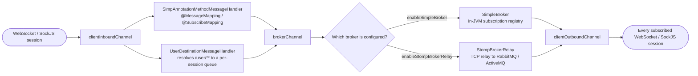
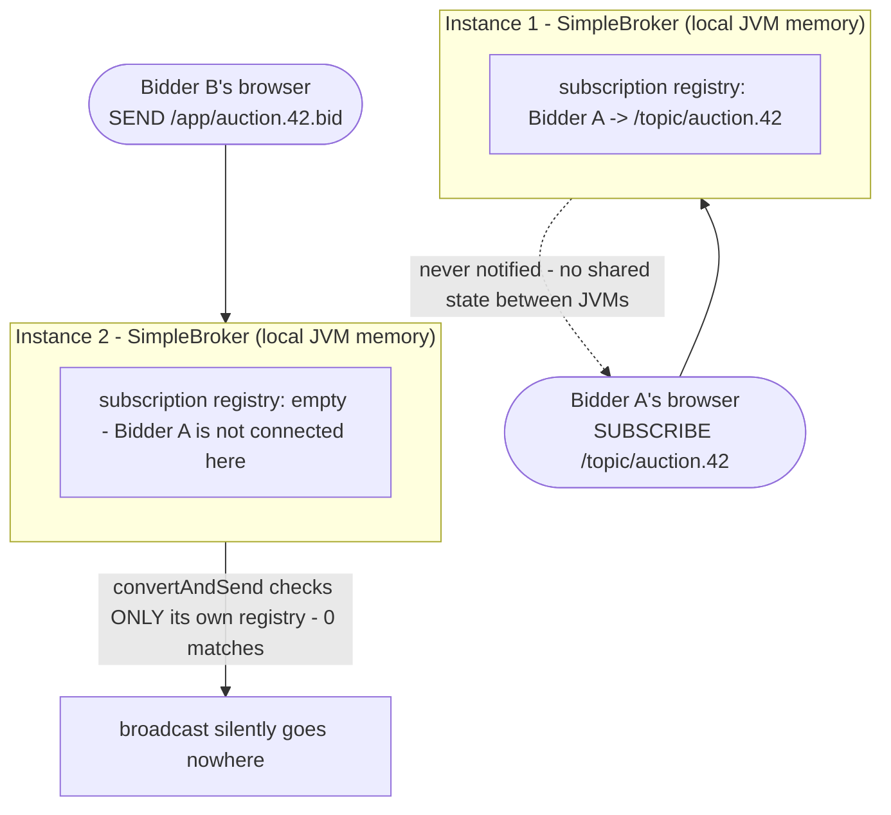
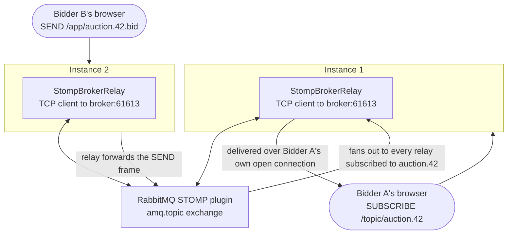
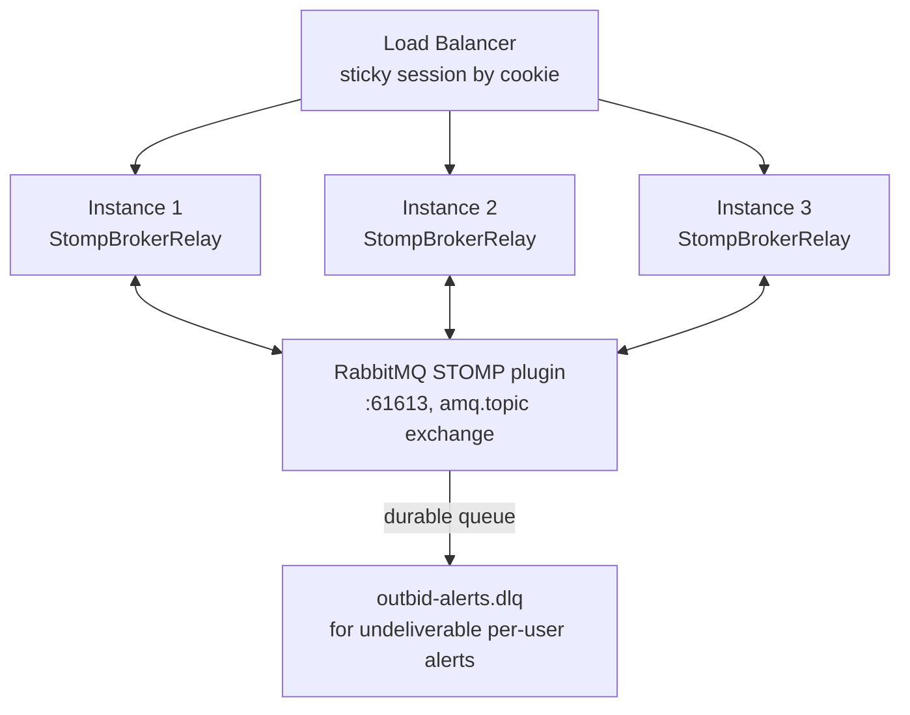

# Spring WebSocket & STOMP

## 1. Concept Overview

WebSocket (RFC 6455) upgrades a single HTTP connection into a persistent, full-duplex TCP channel — both sides can send frames at any time without a new request/response round trip. Spring exposes this at two altitudes: a **low-level API** (`WebSocketHandler`, `TextMessage`, `WebSocketConfigurer`) that hands you a raw byte/text channel per connection, and a **higher-level messaging API** built on **STOMP** (Simple Text Oriented Messaging Protocol) that adds publish/subscribe semantics — destinations, subscriptions, and routing — on top of that raw channel.

This module covers both altitudes end to end: the HTTP Upgrade handshake that establishes `ws://`/`wss://`; the low-level `WebSocketHandler` contract; STOMP-over-WebSocket via `@EnableWebSocketMessageBroker`, `@MessageMapping`, `@SubscribeMapping`, `@SendTo`, and `SimpMessagingTemplate`; the choice between Spring's simple in-memory broker and an external STOMP-capable broker (RabbitMQ or ActiveMQ) relayed over a second TCP connection; SockJS as a transport-negotiation fallback; the security surface unique to WebSocket (Origin validation, CSRF on the CONNECT frame, authenticating a handshake that cannot carry arbitrary headers); horizontal scaling (why the simple broker is fundamentally single-JVM, and why sticky sessions solve a *different* problem than the broker does); and where WebSocket sits relative to Server-Sent Events and long polling.

The throughline is that a WebSocket connection is **stateful and pinned to one server process** — every architectural decision in this module (which broker, whether you need sticky sessions, how per-user delivery works) follows from that one fact.

---

## 2. Intuition

**One-line analogy**: a raw `WebSocketHandler` is a single phone line strung directly between one browser tab and one server process; STOMP is the PBX switchboard layered on top of that line, giving many independent "extensions" (destinations like `/topic/auction.42` or `/user/queue/alerts`) a way to share the one physical line without their calls crossing.

**Mental model**: think of the WebSocket connection as the wire, and STOMP as the addressing scheme written on every envelope that travels across it. The wire itself doesn't know or care what's inside a frame. STOMP's `SUBSCRIBE`, `SEND`, and `MESSAGE` commands are how Spring decides which envelopes go to which handler method, and which subscribers receive which broadcast — all multiplexed over the one TCP connection each client opened.

**Why it matters**: because the connection is stateful, "which server holds this connection" and "who else needs to see this event" become first-class architectural questions the moment you run more than one instance. Getting this wrong doesn't throw an exception — it silently drops messages for some subset of your users, which is far more dangerous than a crash because it fails quietly in production.

**Key insight**: STOMP's message broker (whichever one you choose) is not an implementation detail — it *is* the horizontal-scaling story. Spring's built-in simple broker is a JVM-local `Map` of subscriptions; it works perfectly on one instance and breaks silently the moment you add a second one. Everything about scaling this module discusses follows from replacing that local map with a broker that lives outside any single instance's JVM.

---

## 3. Core Principles

**Full-duplex, not request-response.** Once the Upgrade handshake completes, either side can send a frame at any time; there is no notion of "request" and "response" at the WebSocket layer itself. HTTP semantics (status codes, methods) only apply to the handshake, not to anything that happens after it.

**Persistent connection means server affinity.** A WebSocket connection lives on exactly one TCP socket, accepted by exactly one application process. Unlike a stateless REST call, request N+1 on the same logical session cannot be routed to a different instance — it isn't a new request at all, it's a frame on an already-open socket.

**STOMP is an application-level protocol riding inside WebSocket frames, not a transport.** Every STOMP command (`CONNECT`, `SUBSCRIBE`, `SEND`, `MESSAGE`, `DISCONNECT`) is plain text sent as the payload of ordinary WebSocket text frames. Spring's STOMP support is a message-parsing and routing layer built entirely in userspace on top of the raw WebSocket API described in Section 6.1 — it does not replace it.

**The broker is what actually implements "publish to N subscribers."** `@MessageMapping` methods and `SimpMessagingTemplate` only ever talk to the broker's inbound side. Whether a `SUBSCRIBE` and a later `SEND` for the same destination end up connected to each other is entirely the broker's job — and Spring ships two very different brokers (Section 4.2) with very different scaling properties.

**Heartbeats exist because idle connections lie.** TCP alone does not reliably reveal that a peer has vanished — NATs, load balancers, and corporate proxies silently drop idle connections without a FIN/RST, and a client that lost its network can leave a socket in `ESTABLISHED` state on the server for a long time. Both SockJS and STOMP run independent, differently-scheduled heartbeats (Section 5, ASCII diagram) specifically because neither layer trusts the other or the network to prove liveness.

**Same-origin policy does not govern the WebSocket handshake the way it governs `fetch`/XHR.** A browser will happily let JavaScript on `evil.example` open `new WebSocket('wss://your-api.com/ws')`, and the request carries your site's cookies. Origin validation at the handshake is the WebSocket-specific replacement for the CSRF protection you'd otherwise get for free on same-origin XHR.

**Per-user delivery requires a session-to-user mapping, because a user is not a connection.** One authenticated user can have several tabs open, each with its own STOMP session. `/user/**` destinations exist specifically to answer "deliver to this *person*, regardless of which of their sessions is currently open" — a question the raw broker cannot answer on its own (Section 6.5).

---

## 4. Types / Architectures / Strategies

### 4.1 Low-level `WebSocketHandler` vs STOMP messaging

| Dimension | Low-level `WebSocketHandler` | STOMP messaging (`@EnableWebSocketMessageBroker`) |
|---|---|---|
| What you get | One raw text/binary channel per connection | Destinations, subscribe/publish semantics, routing |
| Message routing | You parse and dispatch every payload yourself | `@MessageMapping`/`@SubscribeMapping` route by destination |
| Broadcast to N subscribers | You track subscriber lists yourself | Broker (simple or relay) tracks subscriptions for you |
| Natural fit | Custom binary protocols, single-purpose channels (signaling, a 1:1 game session) | Pub/sub apps: chat rooms, live feeds, per-user notifications |
| Effort to add a second "channel" | New handler + new endpoint, or your own multiplexing | New destination string — no new endpoint |
| Spring building blocks | `WebSocketHandler`, `TextWebSocketHandler`, `WebSocketConfigurer` | `@EnableWebSocketMessageBroker`, `SimpMessagingTemplate` |

### 4.2 Simple in-memory broker vs external STOMP broker relay

| Dimension | `enableSimpleBroker` | `enableStompBrokerRelay` |
|---|---|---|
| Where subscriptions live | JVM heap of the instance that accepted the connection | External broker (RabbitMQ STOMP plugin or ActiveMQ) |
| Multi-instance broadcast | Does not cross instances — see Section 10, Pitfall 1 | Works — every instance relays through the same broker |
| Persistence / durability | None — a restart drops every subscription | Broker-dependent (RabbitMQ queues can be durable) |
| Transactions, acks | Minimal — Spring's docs call it a "simple" broker deliberately | Full STOMP transaction/ack semantics via the real broker |
| Operational cost | Zero — nothing extra to run | A RabbitMQ or ActiveMQ cluster to operate and monitor |
| Extra infrastructure | None | Two TCP connections per instance to the broker (system + relay) |
| When it's the right call | Local dev, a single-instance deployment, a prototype | Any deployment that runs, or will ever run, N > 1 instances |

### 4.3 SockJS transport fallback

`.withSockJS()` on a STOMP endpoint registration layers a transport-negotiation protocol underneath the WebSocket API so browsers or intermediary proxies that block native WebSocket upgrades still get a working (if degraded) channel. SockJS negotiates, in order of preference: **native WebSocket** first; if that fails, **`xhr-streaming`** (a long-lived HTTP response the client reads incrementally); if that fails, **`xhr-polling`** (repeated short HTTP requests); with **`jsonp-polling`** as a last resort for very old clients that cannot do cross-origin XHR at all. Every fallback transport still speaks the same STOMP frames over its own framing — the application code in `@MessageMapping` methods never knows which transport carried a given message.

### 4.4 WebSocket/STOMP vs SSE vs long polling — the Spring angle

| Dimension | WebSocket + STOMP | Server-Sent Events (`SseEmitter`) | Long polling |
|---|---|---|---|
| Direction | Bidirectional | Server to client only | Bidirectional (via repeated requests) |
| Spring abstraction | `@MessageMapping`, `SimpMessagingTemplate` | `SseEmitter` returned from a `@GetMapping` | Ordinary blocking/deferred `@GetMapping` |
| Reconnection | Manual (client library responsibility) | Automatic, built into `EventSource` | Automatic (each poll is a fresh request) |
| Multi-instance fan-out | Needs a shared broker (Section 4.2) | Needs the same shared-state problem solved (pub/sub backend) | None — each poll is independently stateless |
| Best fit here | Bidding, chat, collaborative editing | One-way feeds, live dashboards, notifications | Environments that block both of the above |

The full protocol-level comparison — frame structure, HTTP/2 multiplexing, proxy behavior — lives in [WebSockets & SSE](../../backend/websockets_and_sse/README.md); this module only covers the Spring-specific implementation choice.

---

## 5. Architecture Diagrams

### Handshake, CONNECT, and broadcast — one lifecycle

```mermaid
sequenceDiagram
    participant B as Browser
    participant S as Spring App
    participant K as Broker (Simple or Relay)

    B->>S: GET /ws (Upgrade: websocket, Sec-WebSocket-Key, Origin)
    Note over S: HandshakeInterceptor.beforeHandshake() runs first
    S-->>B: 101 Switching Protocols (Sec-WebSocket-Accept)
    Note over B,S: Raw WebSocket channel is open; STOMP frames now ride inside WS text frames
    B->>S: STOMP CONNECT (heart-beat:10000,10000, Authorization header)
    S->>K: register session
    S-->>B: STOMP CONNECTED (heart-beat:10000,10000)
    B->>S: STOMP SUBSCRIBE /topic/auction.42
    S->>K: register subscription
    B->>S: STOMP SEND /app/auction.42.bid  {amount: 150}
    S->>K: @MessageMapping handler runs, return value routed to broker
    K-->>B: STOMP MESSAGE /topic/auction.42  {amount: 150}
    Note over K,B: Same MESSAGE frame fans out to every other subscriber of this destination
```

The handshake is a single HTTP request/response pair; everything after `101 Switching Protocols` — including the entire STOMP `CONNECT`/`SUBSCRIBE`/`SEND`/`MESSAGE` exchange — is just text payloads inside WebSocket frames on the one TCP connection that handshake opened.

### The message channel pipeline



Every `@MessageMapping`/`@SubscribeMapping` handler and every `SimpMessagingTemplate` call only ever talks to `brokerChannel`; the `pick` decision — simple broker or relay — is made once, in configuration, and is invisible to application code. This is exactly why swapping brokers to fix Pitfall 1 (below) requires no changes to any controller.

### Broken — simple broker across two instances



### Fixed — external STOMP broker relay



Nothing about `Instance2`'s controller code changed between the broken and fixed diagrams — only the `MessageBrokerRegistry` configuration (Section 6.4) did.

### Two independent heartbeat layers

```
t (seconds)   STOMP heart-beat (10000,10000 ms)      SockJS heartbeat (setHeartbeatTime 25000 ms)
   0          CONNECT negotiates 10s / 10s            SockJS session opens
  10          app-level heart-beat frame both ways     (nothing due yet)
  20          app-level heart-beat frame both ways     (nothing due yet)
  25          (nothing due yet)                        SockJS sends "h" keepalive frame
  30          app-level heart-beat frame both ways     (nothing due yet)
  40          app-level heart-beat frame both ways     (nothing due yet)
  50          app-level heart-beat frame both ways     SockJS sends "h" keepalive frame
```

STOMP's heartbeat is application-level dead-peer detection between Spring and the browser's STOMP client library; SockJS's heartbeat exists purely so intermediary HTTP proxies see periodic traffic and do not time out an otherwise-idle long-polling transport. They run on independent clocks for independent reasons — configuring one does not configure the other, and a deployment behind a corporate proxy typically needs both.

### Two orthogonal scaling concerns

```
CONCERN 1: connection routing - which instance physically holds the socket
  Bidder's browser --(one connection, pinned for its whole lifetime)--> Instance 2
  Solved by:      load-balancer sticky session (cookie or source-IP hash)
  Has no effect on: whether other instances know this subscription exists

CONCERN 2: message fan-out - who else needs to see this event
  Instance 2 handles a SEND ---------> must reach subscribers on Instance 1, 2, 3...
  Solved by:      a shared broker (StompBrokerRelay -> RabbitMQ / ActiveMQ)
  Has no effect on: which instance originally accepted any given connection
```

These two concerns are frequently conflated. Fixing only one of them still leaves half the bug in production — Pitfall 5 in Section 10 walks through exactly that failure mode.

---

## 6. How It Works — Detailed Mechanics

### 6.1 Low-level `WebSocketHandler` and `WebSocketConfigurer`

```java
@Component
public class EchoWebSocketHandler extends TextWebSocketHandler {

    @Override
    public void afterConnectionEstablished(WebSocketSession session) {
        log.info("Connection {} opened from {}", session.getId(), session.getRemoteAddress());
    }

    @Override
    protected void handleTextMessage(WebSocketSession session, TextMessage message) throws IOException {
        // TextMessage wraps a String payload; BinaryMessage wraps a ByteBuffer
        String payload = message.getPayload();
        session.sendMessage(new TextMessage("echo: " + payload));
    }

    @Override
    public void handleTransportError(WebSocketSession session, Throwable exception) {
        log.warn("Transport error on session {}: {}", session.getId(), exception.getMessage());
    }

    @Override
    public void afterConnectionClosed(WebSocketSession session, CloseStatus status) {
        log.info("Connection {} closed: {}", session.getId(), status);
    }
}

@Configuration
@EnableWebSocket
public class LowLevelWebSocketConfig implements WebSocketConfigurer {

    private final EchoWebSocketHandler echoHandler;

    @Override
    public void registerWebSocketHandlers(WebSocketHandlerRegistry registry) {
        registry.addHandler(echoHandler, "/ws-echo")
            .setAllowedOriginPatterns("https://app.example.com");
    }
}
```

This is the entire API surface for a raw channel: one handler, four lifecycle callbacks, no destinations, no subscriptions. Every routing decision — is this a chat message, a game move, a heartbeat — is a decision your own `handleTextMessage` body has to make by inspecting the payload.

### 6.2 STOMP — `@EnableWebSocketMessageBroker`

```java
@Configuration
@EnableWebSocketMessageBroker
public class WebSocketConfig implements WebSocketMessageBrokerConfigurer {

    @Override
    public void registerStompEndpoints(StompEndpointRegistry registry) {
        registry.addEndpoint("/ws")
            .setAllowedOriginPatterns("https://app.example.com")
            .withSockJS()
            .setHeartbeatTime(25_000);   // SockJS-level keepalive, independent of STOMP heart-beat
    }

    @Override
    public void configureMessageBroker(MessageBrokerRegistry registry) {
        // Single-instance / dev only - see Section 6.4 for the production relay
        registry.enableSimpleBroker("/topic", "/queue")
            .setHeartbeatValue(new long[]{10_000, 10_000})
            .setTaskScheduler(heartbeatScheduler());   // required or startup fails - Pitfall 3
        registry.setApplicationDestinationPrefixes("/app");
        registry.setUserDestinationPrefix("/user");     // default value, shown for clarity
    }

    @Override
    public void configureWebSocketTransport(WebSocketTransportRegistration registry) {
        registry.setMessageSizeLimit(64 * 1024);        // Spring's default: 64 KB
        registry.setSendTimeLimit(10_000);              // Spring's default: 10 s
        registry.setSendBufferSizeLimit(512 * 1024);    // Spring's default: 512 KB
    }

    @Bean
    public TaskScheduler heartbeatScheduler() {
        ThreadPoolTaskScheduler scheduler = new ThreadPoolTaskScheduler();
        scheduler.setPoolSize(1);
        scheduler.setThreadNamePrefix("stomp-heartbeat-");
        scheduler.initialize();
        return scheduler;
    }
}
```

### 6.3 `@MessageMapping`, `@SubscribeMapping`, `@SendTo`, `@SendToUser`, `SimpMessagingTemplate`

```java
@Controller
public class AuctionController {

    private final SimpMessagingTemplate messagingTemplate;
    private final AuctionService auctionService;

    // Handles STOMP SEND to /app/auction.{lotId}.bid; return value is broadcast
    @MessageMapping("/auction.{lotId}.bid")
    @SendTo("/topic/auction.{lotId}")
    public BidEvent placeBid(@DestinationVariable String lotId, @Payload BidRequest request,
                              Principal principal) {
        Bid result = auctionService.placeBid(lotId, principal.getName(), request.amount());
        return new BidEvent(lotId, result.amount(), result.bidder());
        // No @SendTo would fall back to Spring's default rule: replace the /app prefix
        // with the first configured broker prefix, i.e. /topic/auction.{lotId}.bid
    }

    // Handles the SUBSCRIBE frame itself - reply goes ONLY to the subscribing session,
    // it is NOT registered as an ongoing broker subscription or broadcast to anyone else
    @SubscribeMapping("/auction.{lotId}.snapshot")
    public AuctionSnapshot onSubscribe(@DestinationVariable String lotId) {
        return auctionService.currentSnapshot(lotId);   // one-time "catch up" reply
    }

    // Imperative push from any @Service - not tied to an inbound STOMP frame at all
    public void notifyOutbid(String username, String lotId, BigDecimal previousBid) {
        messagingTemplate.convertAndSendToUser(
            username, "/queue/outbid-alerts", new OutbidAlert(lotId, previousBid));
        // physical destination becomes /user/{username}/queue/outbid-alerts, resolved to
        // whichever of that user's sessions are currently connected - see Section 6.5
    }

    // @SendToUser is the annotation-driven equivalent of convertAndSendToUser
    @MessageMapping("/auction.{lotId}.watch")
    @SendToUser("/queue/watch-ack")
    public WatchAck watchLot(@DestinationVariable String lotId, Principal principal) {
        auctionService.addWatcher(lotId, principal.getName());
        return new WatchAck(lotId, "watching");
    }

    // Exceptions thrown from any @MessageMapping method land here instead of crashing
    // the session; without this, Spring's default StompSubProtocolErrorHandler sends a
    // bare STOMP ERROR frame the client may not surface anywhere visible
    @MessageExceptionHandler(IllegalBidException.class)
    @SendToUser("/queue/errors")
    public ErrorPayload handleBadBid(IllegalBidException ex) {
        return new ErrorPayload(ex.getMessage());
    }
}
```

`@SubscribeMapping` versus `@MessageMapping` + `@SendTo` is the single most-missed distinction in this API: the former answers one subscriber once, out of band from the broker's subscription registry; the latter registers with the broker and broadcasts to everyone subscribed, indefinitely, until they unsubscribe or disconnect.

### 6.4 External STOMP broker relay — RabbitMQ

```java
@Override
public void configureMessageBroker(MessageBrokerRegistry registry) {
    registry.enableStompBrokerRelay("/topic", "/queue")
        .setRelayHost("rabbitmq.internal")
        .setRelayPort(61_613)                 // RabbitMQ STOMP plugin default port
        .setClientLogin("stomp-relay")         // per-client-session frames use this identity
        .setClientPasscode("${rabbitmq.stomp.password}")
        .setSystemLogin("stomp-relay")         // the one "system" connection each instance keeps open
        .setSystemPasscode("${rabbitmq.stomp.password}")
        .setSystemHeartbeatSendInterval(10_000)
        .setSystemHeartbeatReceiveInterval(10_000)
        .setVirtualHost("/production");
    registry.setApplicationDestinationPrefixes("/app");
    registry.setPreservePublishOrder(true);    // relay is otherwise not guaranteed FIFO per session
}
```

```
# On the RabbitMQ broker:
rabbitmq-plugins enable rabbitmq_stomp
# STOMP destination convention applied by the plugin:
#   /topic/auction.42  -> published to the amq.topic exchange, routing key "auction.42"
#   /queue/outbid-alerts-user<session> -> a named, durable-capable RabbitMQ queue
```

Each application instance keeps **two** TCP connections to the broker: one "system" connection (`setSystemLogin`/`setSystemPasscode`) used for frames that don't originate from any particular client session (server-pushed messages, administrative traffic), and one relay connection per active client session (`setClientLogin`/`setClientPasscode`) that forwards that specific client's frames. Never leave these on RabbitMQ's default `guest`/`guest` account in anything but localhost development — RabbitMQ rejects `guest` connections from any other host by default, which is usually how teams discover this the hard way during a first non-local deployment.

### 6.5 Security — Origin validation, authenticating CONNECT, per-user destinations

```java
// 1. Origin validation replaces same-origin-policy at the handshake (Pitfall 2)
@Override
public void registerStompEndpoints(StompEndpointRegistry registry) {
    registry.addEndpoint("/ws")
        .setAllowedOriginPatterns("https://app.example.com")   // never "*" in production
        .withSockJS();
}

// 2a. Cookie/session-based auth: the Authentication is already in the HTTP session by
// the time the handshake request arrives, so a HandshakeInterceptor just copies it over
@Component
public class PrincipalHandshakeInterceptor implements HandshakeInterceptor {

    @Override
    public boolean beforeHandshake(ServerHttpRequest request, ServerHttpResponse response,
                                    WebSocketHandler wsHandler, Map<String, Object> attributes) {
        if (request instanceof ServletServerHttpRequest servletRequest) {
            Principal principal = servletRequest.getServletRequest().getUserPrincipal();
            if (principal == null) {
                response.setStatusCode(HttpStatus.FORBIDDEN);
                return false;                    // reject the handshake outright
            }
            attributes.put("principal", principal);
        }
        return true;
    }
}

// 2b. Token-based auth: the browser WebSocket API cannot attach a custom Authorization
// header to the handshake, so the token instead travels as a native STOMP header on
// CONNECT, and a ChannelInterceptor validates it and sets the session's Principal
@Component
public class StompAuthChannelInterceptor implements ChannelInterceptor {

    @Override
    public Message<?> preSend(Message<?> message, MessageChannel channel) {
        StompHeaderAccessor accessor =
            MessageHeaderAccessor.getAccessor(message, StompHeaderAccessor.class);

        if (StompCommand.CONNECT.equals(accessor.getCommand())) {
            String token = accessor.getFirstNativeHeader("Authorization");
            Principal principal = jwtService.validateAndBuildPrincipal(token);
            if (principal == null) {
                throw new MessagingException("Invalid or missing token on CONNECT");
            }
            accessor.setUser(principal);          // applies to every frame on this session
        }
        return message;
    }
}

@Override
public void configureClientInboundChannel(ChannelRegistration registration) {
    registration.interceptors(new StompAuthChannelInterceptor());
}
```

Cross-site WebSocket hijacking is the reason Origin validation matters here specifically: a browser attaches cookies to the WebSocket handshake request exactly as it would to any same-site navigation, but the handshake itself is not subject to the same-origin restrictions that block a cross-origin `fetch`. `setAllowedOriginPatterns` at the handshake is the load-bearing check; Spring Security's CSRF token requirement on the CONNECT frame is a second, narrower layer that specifically protects SockJS's HTTP-based fallback transports (`xhr-streaming`, `xhr-polling`), because those transports are literal same-origin-policy-governed HTTP requests where ordinary CSRF applies the same way it would to any state-changing `POST` — the token travels as an `X-CSRF-Token` native STOMP header on CONNECT, sourced from the same `CsrfToken` Spring Security already issues for regular HTTP requests.

Per-user destinations resolve through `UserDestinationMessageHandler` (visible in the Section 5 pipeline diagram): a `SEND` to `/user/{username}/queue/x` or a call to `convertAndSendToUser(username, "/queue/x", payload)` is rewritten, before it ever reaches the broker, into a physical destination unique to each of that user's currently-open sessions. This is why `/user/**` works correctly even when the same logged-in user has three browser tabs open — each tab's session gets its own physical queue, and Spring's registry ensures a single `convertAndSendToUser` call reaches all of them.

### 6.6 Heartbeats and transport limits, concretely

| Setting | Layer | Default / typical value | What happens if exceeded |
|---|---|---|---|
| STOMP `heart-beat` header | Application (negotiated in CONNECT/CONNECTED) | `10000,10000` (10 s send, 10 s expect) | Peer is considered dead; client library reconnects |
| SockJS `setHeartbeatTime` | Transport keepalive | `25000` ms | Idle proxy may drop the long-poll/stream connection |
| `setMessageSizeLimit` | STOMP frame decoding | `64 * 1024` (64 KB) | Session closed with a `TRANSPORT_ERROR` |
| `setSendTimeLimit` | Outbound write | `10 * 1000` (10 s) | Session treated as a slow client and closed |
| `setSendBufferSizeLimit` | Outbound queue | `512 * 1024` (512 KB) | Session closed rather than let it grow unbounded |

---

## 7. Real-World Examples

**Crypto exchange market-data streams** (Binance- and Coinbase-style public WebSocket APIs): order-book deltas and trade prints are pushed to every subscribed client the instant they occur, using raw JSON-over-WebSocket rather than STOMP — a case where the low-level `WebSocketHandler` API (Section 4.1) is the right fit because there is one high-frequency channel per symbol, not a general pub/sub surface.

**Collaborative whiteboards** (Figma/Miro-style): every cursor move and shape edit is bidirectional and latency-sensitive, which is exactly the profile that rules out SSE — clients are both senders and receivers of the same event stream, typically multiplexed over STOMP destinations scoped per document (`/topic/doc.{id}`).

**Ride-hailing live tracking** (Uber/Lyft-style): a driver's location updates flow to the rider's app several times a second while the rider's ETA requests and cancellations flow the other way on the same logical channel — full duplex, but at a scale where per-instance connection counts and the broker-relay pattern (Section 6.4) are what make horizontal scaling possible.

**Customer-support live chat widgets** (Intercom/Zendesk-style): each conversation maps naturally to a STOMP destination (`/topic/conversation.{id}`), with `@SendToUser` handling the "notify the agent even if they're viewing a different conversation" case through per-user destinations.

**Multiplayer game lobbies and matchmaking**: player-ready state and countdown timers broadcast to everyone in a lobby (`/topic/lobby.{id}`) while individual "you've been matched" notifications use per-user destinations — a single application combining both broadcast and targeted delivery patterns from this module in one feature.

---

## 8. Tradeoffs

### Low-level `WebSocketHandler` vs STOMP messaging

| Dimension | Low-level `WebSocketHandler` | STOMP messaging |
|---|---|---|
| Time to first working feature | Fast for one channel | Slightly more setup (broker, prefixes) |
| Scaling to many logical "rooms"/"topics" | You build the registry yourself | Free — just more destination strings |
| Protocol flexibility | Total — any framing you want | Constrained to STOMP's command set |
| Debuggability | Requires custom tooling | `wscat`/browser devtools already understand STOMP text frames |
| Best fit | One tightly-scoped channel | Many destinations, per-user delivery, broadcast |

### Simple broker vs broker relay

| Dimension | Simple broker | Broker relay |
|---|---|---|
| Multi-instance correctness | Broken by default (Pitfall 1) | Correct by design |
| Operational surface | None | A broker cluster to run, patch, and monitor |
| Latency per message | Lowest (in-process) | +1 network hop each way through the broker |
| Message durability | None | Broker-dependent (RabbitMQ can persist) |
| Right for | Local dev, single-instance deployments | Anything running, or planning to run, N > 1 instances |

### WebSocket/STOMP vs SSE vs long polling

| Dimension | WebSocket + STOMP | SSE | Long polling |
|---|---|---|---|
| Bidirectional | Yes | No | Yes (inefficiently) |
| Reconnection handling | Manual | Automatic (`EventSource`) | Automatic by construction |
| Infrastructure to scale | Sticky sessions + broker relay | Sticky sessions + shared pub/sub | None extra |
| Proxy/firewall friendliness | Needs SockJS fallback in strict networks | Excellent (plain HTTP) | Best (works everywhere) |
| Use when | Both sides send frequently | Only the server pushes | Everything else is blocked |

---

## 9. When to Use / When NOT to Use

**Use STOMP messaging when** you need destination-based pub/sub — multiple logical topics or queues, per-user targeted delivery, or broadcast to an arbitrary number of subscribers — rather than a single dedicated channel.

**Use the low-level `WebSocketHandler` when** the feature is genuinely one channel with a custom protocol — binary game state sync, WebRTC signaling, a single-purpose streaming endpoint — where STOMP's destination machinery adds ceremony without adding value.

**Do NOT use the simple in-memory broker in any deployment that runs, or will ever run, more than one instance.** It is explicitly a development/prototyping tool; treat "add a second instance" as the trigger to switch to a broker relay before it ships, not after an incident.

**Do NOT use WebSocket where SSE would suffice.** If the server is the only side that ever pushes data (live scores, notifications, dashboards), SSE gets you automatic reconnection and works over plain HTTP/2 with none of the sticky-session/broker-relay scaling burden described here — see [WebSockets & SSE](../../backend/websockets_and_sse/README.md) for the full comparison.

**Do NOT skip Origin validation "because it's just an internal API."** Cross-site WebSocket hijacking does not require the attacker to be on your network — it only requires the victim's browser to have an open session cookie and to visit a malicious page.

---

## 10. Common Pitfalls

### Pitfall 1 — Simple broker across two instances (broken, then fixed)

```java
// BROKEN: works perfectly in local testing (one instance), breaks in production (N instances)
@Override
public void configureMessageBroker(MessageBrokerRegistry registry) {
    registry.enableSimpleBroker("/topic", "/queue");   // JVM-local subscription registry
    registry.setApplicationDestinationPrefixes("/app");
}
// Bidder A connects to Instance 1 and subscribes to /topic/auction.42.
// Bidder B's bid is routed by the load balancer to Instance 2.
// Instance 2's SimpleBroker checks ITS OWN registry, finds zero subscribers, and the
// broadcast silently disappears. Bidder A never sees the new price. No exception,
// no log line by default - just a dropped message, discovered only when a user complains.
```

```java
// FIXED: point every instance at the same external broker
@Override
public void configureMessageBroker(MessageBrokerRegistry registry) {
    registry.enableStompBrokerRelay("/topic", "/queue")
        .setRelayHost("rabbitmq.internal")
        .setRelayPort(61_613)
        .setClientLogin("stomp-relay").setClientPasscode("${rabbitmq.stomp.password}")
        .setSystemLogin("stomp-relay").setSystemPasscode("${rabbitmq.stomp.password}");
    registry.setApplicationDestinationPrefixes("/app");
}
// Now Instance 2's SEND is relayed to RabbitMQ, which fans out to every instance's
// relay connection - including Instance 1's, which delivers to Bidder A over the
// exact same open connection it already had. No controller code changes at all.
```

Measured impact on a 2-instance deployment before the fix: with connections split roughly evenly by the load balancer, **~50% of active watchers on any given auction lot never received a bid update** raised by a request that happened to land on the "other" instance — a silent, load-dependent failure rate that varied with traffic shape and was initially mistaken for a client-side bug.

### Pitfall 2 — Wildcard Origin allows cross-site WebSocket hijacking

```java
// BROKEN: same-origin policy does not protect a WebSocket handshake the way it protects fetch()
registry.addEndpoint("/ws").setAllowedOriginPatterns("*").withSockJS();
// A page on evil.example can run new WebSocket('wss://your-api.com/ws') and the
// victim's browser attaches your site's session cookie to that handshake - the
// attacker's script now shares a live, authenticated STOMP session with the victim.
```

```java
// FIXED: enumerate exactly the origins that should be allowed to open this endpoint
registry.addEndpoint("/ws")
    .setAllowedOriginPatterns("https://app.example.com", "https://staging.example.com")
    .withSockJS();
```

### Pitfall 3 — Simple broker heartbeats configured without a `TaskScheduler`

```java
// BROKEN: fails at application startup with an IllegalArgumentException
registry.enableSimpleBroker("/topic").setHeartbeatValue(new long[]{10_000, 10_000});
// The simple broker needs a background thread to actually fire heartbeat frames on
// schedule; setHeartbeatValue alone does not provide one.
```

```java
// FIXED: provide a TaskScheduler explicitly
registry.enableSimpleBroker("/topic")
    .setHeartbeatValue(new long[]{10_000, 10_000})
    .setTaskScheduler(heartbeatScheduler());   // @Bean shown in Section 6.2
```

### Pitfall 4 — No message size or send-time limits configured

```java
// BROKEN: relying entirely on Spring's defaults without ever measuring your payloads
@EnableWebSocketMessageBroker
public class WebSocketConfig implements WebSocketMessageBrokerConfigurer { /* no
    configureWebSocketTransport override - a client sending an 800 KB payload
    (a base64 image pasted into a chat message, say) is simply rejected with a
    transport error, and nobody investigated what the real limit should be */ }
```

```java
// FIXED: set limits deliberately, sized to the application's real payloads, and
// reject oversized client input with a clear error rather than a generic transport failure
@Override
public void configureWebSocketTransport(WebSocketTransportRegistration registry) {
    registry.setMessageSizeLimit(128 * 1024);      // sized to the largest legitimate payload
    registry.setSendTimeLimit(15_000);
    registry.setSendBufferSizeLimit(1024 * 1024);
}
```

### Pitfall 5 — Fixing only one of the two scaling concerns

```
BROKEN: broker relay added, sticky sessions removed "since the broker handles it now"
  -> SockJS's HTTP fallback transports (xhr-streaming/xhr-polling) issue a SEQUENCE of
     HTTP requests for one logical session; without sticky routing, request 2 of that
     sequence can land on a different instance that has no idea the SockJS session
     exists, and the client is disconnected mid-conversation - even though every
     instance is correctly relaying through the same broker.
```

```
FIXED: keep BOTH mechanisms, because they solve different problems (Section 5 diagram)
  -> sticky sessions (LB cookie or source-IP hash) keep one client's HTTP request
     sequence and/or raw WS connection pinned to one instance for its lifetime
  -> the broker relay makes sure a message published anywhere reaches every
     instance's subscribers, regardless of which instance originated it
```

### Pitfall 6 — Swallowed exceptions in `@MessageMapping` handlers

```java
// BROKEN: no @MessageExceptionHandler - the exception is caught by Spring's default
// StompSubProtocolErrorHandler, converted into a bare STOMP ERROR frame, and unless
// the client's STOMP library explicitly surfaces ERROR frames in the UI, the user
// just sees their bid silently fail with no visible feedback
@MessageMapping("/auction.{lotId}.bid")
@SendTo("/topic/auction.{lotId}")
public BidEvent placeBid(@DestinationVariable String lotId, @Payload BidRequest r) {
    return auctionService.placeBid(lotId, r.bidder(), r.amount());   // throws on a stale bid
}
```

```java
// FIXED: handle it explicitly and reply directly to the sender
@MessageExceptionHandler(IllegalBidException.class)
@SendToUser("/queue/errors")
public ErrorPayload handleBadBid(IllegalBidException ex) {
    return new ErrorPayload(ex.getMessage());
}
```

---

## 11. Technologies & Tools

| Tool | Purpose | Notes |
|---|---|---|
| `spring-boot-starter-websocket` | Brings `spring-websocket` + `spring-messaging` onto the classpath | Single starter for both the low-level and STOMP APIs |
| `spring-websocket` | Low-level `WebSocketHandler`, `WebSocketConfigurer`, SockJS server support | Servlet-stack only; WebFlux has its own reactive equivalent |
| `spring-messaging` | `@MessageMapping`, `SimpMessagingTemplate`, message channels | Shared with non-WebSocket Spring messaging (see [Spring Messaging](../spring_messaging/README.md)) |
| RabbitMQ + `rabbitmq_stomp` plugin | External STOMP broker for the relay pattern | Default STOMP port `61613`; separate from AMQP's `5672` |
| ActiveMQ Artemis | Alternative external STOMP broker | STOMP support built in, no plugin required |
| SockJS client (`sockjs-client`) | Browser-side transport negotiation | Pairs with `.withSockJS()` on the server |
| `@stomp/stompjs` | Modern browser STOMP client library | Successor to the older `stomp-websocket` package |
| `wscat` | Command-line raw WebSocket client | Good for poking a low-level handler directly |
| Browser devtools (Network > WS frames) | Inspect live STOMP frames | Frames appear as plain text - easy to read without extra tooling |
| Micrometer | `simp.*` metrics for channels and sessions | Wire into [Observability & Tracing](../observability_and_tracing/README.md) |
| Testcontainers | Real RabbitMQ/ActiveMQ broker in integration tests | See [Testcontainers & Test Strategy](../../spring/case_studies/cross_cutting/testcontainers_and_test_strategy/README.md) |

---

## 12. Interview Questions with Answers

**Q: Why does broadcasting a message never reach some clients once you run more than one application instance?**
The default simple broker keeps its subscription registry in that one JVM's memory, so a broadcast issued on Instance 2 only ever checks Instance 2's local subscribers. Any client connected to a different instance is invisible to it, and the message is dropped with no error. The fix is `enableStompBrokerRelay` pointed at a shared external broker (RabbitMQ or ActiveMQ) so every instance publishes and subscribes through the same place. Treat "we might run two instances" as the trigger to make this switch before launch, not after the first support ticket.

**Q: What is wrong with `setAllowedOriginPatterns("*")` on a STOMP endpoint in production?**
It disables the one control that replaces same-origin policy for WebSocket, exposing the endpoint to cross-site WebSocket hijacking. A browser attaches cookies to a WebSocket handshake exactly as it would to a same-site request, and unlike `fetch`, the handshake itself isn't blocked cross-origin by the browser — so a malicious page can open a live, authenticated session against your endpoint. Always enumerate the exact origins allowed to connect. Treat this the same way you'd treat a wide-open CORS policy on a state-changing endpoint.

**Q: Why does an app fail to start when you configure simple-broker heartbeats?**
`setHeartbeatValue` on the simple broker registration requires a `TaskScheduler` to actually fire the heartbeat frames on schedule, and Spring throws at startup if none is supplied. The heartbeat values alone only declare the negotiated interval; something still has to wake up periodically and send the frame. Provide a small dedicated `ThreadPoolTaskScheduler` bean and pass it to `.setTaskScheduler(...)` alongside the heartbeat values.

**Q: A `@MessageMapping` method has no `@SendTo` — where does its return value go?**
Spring applies a default rule: the same destination the client sent to, but with the configured application-destination prefix (typically `/app`) replaced by the first configured broker prefix (typically `/topic`). This means a `SEND` to `/app/auction.42.bid` with no `@SendTo` broadcasts to `/topic/auction.42.bid` — easy to get by accident if you assumed no destination meant no broadcast. Always add an explicit `@SendTo` when the target destination matters, rather than relying on the implicit substitution rule.

**Q: Why do some clients disconnect randomly under a load balancer, but only when using SockJS's HTTP fallback transports?**
SockJS's HTTP fallback transports split one logical session into a sequence of separate HTTP requests that must all land on the same instance. Without sticky routing, request two of that sequence can hit a different instance that has never heard of the session, and the client is disconnected. This is a distinct failure from the broker-fan-out problem — fixing the broker relay does nothing for it, because the issue is connection routing, not message delivery. Configure load-balancer session affinity (cookie- or source-IP-based) specifically to keep each client's request sequence pinned to one instance.

**Q: Where does an exception thrown inside a `@MessageMapping` method go if there's no explicit handler?**
It is caught by Spring's default `StompSubProtocolErrorHandler` and converted into a bare STOMP `ERROR` frame sent back to the client. This does not crash the application or surface as an HTTP error, and many client STOMP libraries don't display `ERROR` frames anywhere visible by default. Add a `@MessageExceptionHandler` method (optionally paired with `@SendToUser`) so the failure reaches the user in a form the UI actually renders. Treat a missing exception handler here the same way you'd treat a missing `@ControllerAdvice` in a REST API — errors that vanish silently are worse than ones that are visible.

**Q: What actually happens to a message between `clientInboundChannel` and `clientOutboundChannel`?**
An inbound STOMP frame lands on `clientInboundChannel` and is routed to a matching handler by `SimpAnnotationMethodMessageHandler`. Destinations under `/user/**` are routed by `UserDestinationMessageHandler` instead, and either way the handler's return value is then handed to `brokerChannel`, where whichever broker is configured — simple or relay — decides which sessions should receive it before it reaches `clientOutboundChannel` for delivery. This pipeline is the same regardless of which broker you choose, which is exactly why switching brokers requires no controller changes. Understanding this pipeline is the fastest way to reason about where a message "got stuck" when debugging.

**Q: What is the difference between `@SubscribeMapping` and `@MessageMapping` combined with `@SendTo`?**
`@SubscribeMapping` answers the `SUBSCRIBE` frame itself with a one-time reply sent only to the requesting session, and it never registers with the broker's ongoing subscription registry. `@MessageMapping` plus `@SendTo` instead registers a durable broadcast: the return value goes to every current and future subscriber of that destination via the broker, indefinitely. Use `@SubscribeMapping` for "give me a snapshot when I first connect" and `@MessageMapping`/`@SendTo` for "keep everyone updated as things change."

**Q: How does `SimpMessagingTemplate.convertAndSendToUser` find the right WebSocket session for a given username?**
`UserDestinationMessageHandler` rewrites the logical `/user/{username}/queue/x` destination into a physical, session-unique destination for each of that user's connected sessions. This happens before the message ever reaches the broker, so one call can reach several open browser tabs for the same logged-in user simultaneously. This resolution happens entirely on the Spring side; an external broker relay never sees `/user/**` at all, only the already-resolved physical destinations. This is why per-user destinations still work correctly even when you switch from the simple broker to a broker relay.

**Q: What does `enableStompBrokerRelay` actually change mechanically compared to `enableSimpleBroker`?**
It replaces the JVM-local subscription registry with two TCP connections per instance to a real STOMP-speaking broker. One is a "system" connection for frames not tied to any client session, and the other is a relay connection per active client session that forwards that client's own frames. The broker itself — not any application instance — now owns the authoritative subscription state, which is what makes broadcasts correct across any number of instances. The tradeoff is an extra network hop per message and a broker cluster to operate.

**Q: How does Spring Security protect the STOMP CONNECT frame, and why isn't ordinary CSRF protection enough?**
Ordinary CSRF protection assumes same-origin policy blocks a forged cross-origin request, and that assumption does not hold for a raw WebSocket handshake. A malicious page can open a cross-origin `WebSocket` and the victim's cookies ride along regardless, so Origin validation at the handshake (`setAllowedOriginPatterns`) is the primary defense for that vector. Separately, Spring Security requires a valid CSRF token as a native header on the STOMP CONNECT frame specifically to protect SockJS's HTTP-based fallback transports, which genuinely are same-origin-policy-governed HTTP requests where classic CSRF applies. The two mechanisms guard two different transports of the same logical connection.

**Q: How do you authenticate a WebSocket/STOMP connection when the client can't attach a custom Authorization header to the handshake?**
The browser's native `WebSocket` constructor does not expose a way to set custom headers on the Upgrade request. Token-based auth instead rides as a native STOMP header on the CONNECT frame, which is sent after the socket is already open, and a `ChannelInterceptor.preSend()` inspects `StompCommand.CONNECT`, validates the token, and calls `accessor.setUser(principal)` so the Principal applies to every subsequent frame on that session. Cookie-based session auth avoids this entirely, since cookies are attached automatically to the handshake request itself.

**Q: What happens when a message exceeds `setSendBufferSizeLimit` or a client is too slow to keep up with `setSendTimeLimit`?**
Spring treats that session as a slow consumer and closes it rather than letting the outbound buffer grow without bound. `setSendBufferSizeLimit` (default 512 KB) caps how much unsent data can queue for one session, and `setSendTimeLimit` (default 10 seconds) caps how long a send can take before the session is abandoned. This protects the server's memory from one badly-behaved or disconnected client at the cost of forcibly dropping that client's connection. Size both limits to your real traffic rather than leaving unexamined defaults in a high-throughput deployment.

**Q: Why does Spring negotiate STOMP heartbeats instead of relying on TCP keep-alive or WebSocket ping/pong alone?**
TCP keep-alive operates on a timescale of minutes by default and is frequently disabled or unreachable through NATs and proxies. WebSocket ping/pong isn't even exposed to browser JavaScript, so neither mechanism reliably proves the application layer is still responsive. STOMP's `heart-beat:<send-ms>,<receive-ms>` header, negotiated during CONNECT, instead gives the framework an application-level, configurable-interval signal that both sides are actually alive, independent of what the network layer is doing. This is also why SockJS runs its own, separately-scheduled heartbeat — it's protecting a different layer (the HTTP transport) for a different reason (proxy idle timeouts).

**Q: Can you point `enableStompBrokerRelay` at Kafka the way `spring_messaging` uses Kafka for event streaming?**
No — the relay requires a broker that natively speaks the STOMP protocol, such as RabbitMQ (via its `rabbitmq_stomp` plugin) or ActiveMQ/Artemis, and Kafka does not implement STOMP. Using Kafka for WebSocket fan-out would require a separate STOMP-to-Kafka bridge component, which is unusual and adds an extra moving part most teams avoid. If a system already standardizes on Kafka for other messaging, it's still common to run a small RabbitMQ instance purely for the WebSocket broker-relay role.

**Q: How does WebFlux's reactive WebSocket support differ from the `WebSocketHandler` covered in this module?**
WebFlux ships its own `org.springframework.web.reactive.socket.WebSocketHandler`, built around `Flux<WebSocketMessage>` instead of imperative callback methods. It runs on the Netty/reactive-stack event loop rather than a Servlet thread per connection, and the two are not interchangeable — a Servlet-stack `@Controller` cannot use the reactive handler, and vice versa — though STOMP messaging itself is Servlet-stack-oriented in the mainstream Spring configuration shown here. See [Spring WebFlux](../spring_webflux/README.md) for the reactive programming model this reactive handler is built on.

**Q: When would you reach for the low-level `WebSocketHandler` instead of STOMP messaging for a new real-time feature?**
Reach for it when the feature is genuinely one dedicated channel with its own framing, not a general pub/sub surface. Binary game-state sync, WebRTC signaling exchange, and a proprietary streaming protocol are good examples, where STOMP's destinations, subscriptions, and broker abstraction would add configuration without adding value. STOMP earns its complexity when you need multiple logical topics, per-user targeted delivery, or broadcast to an open-ended set of subscribers; a single-purpose channel usually doesn't need any of that. Reach for `TextWebSocketHandler` first and only add STOMP once a second destination or a broadcast requirement actually shows up.

**Q: How do you test a `@MessageMapping` STOMP endpoint in an integration test?**
Start the application with a real embedded server and connect using a real STOMP client library rather than mocking the protocol. Use `@SpringBootTest(webEnvironment = RANDOM_PORT)` with `WebSocketStompClient` backed by `StandardWebSocketClient`, subscribe to the destination under test, send a frame, and assert on what arrives via a `BlockingQueue` or `CompletableFuture` populated by the test's own `StompFrameHandler`. For the broker-relay path specifically, use Testcontainers to run a real RabbitMQ instance rather than mocking the relay, since the relay's TCP-level behavior is exactly the part most likely to break in production. Testing the low-level `WebSocketHandler` API is simpler still — connect with a plain `WebSocketClient` and assert on raw `TextMessage` payloads.

---

## 13. Best Practices

**Never deploy the simple broker to more than one instance.** Decide the broker choice at design time based on the deployment topology you expect to reach, not the one you're testing against locally.

**Enumerate allowed origins explicitly; never use a wildcard in production.** Origin validation at the handshake is the primary defense against cross-site WebSocket hijacking, and it costs nothing to configure correctly from day one.

**Keep sticky sessions and the broker relay as two separate, deliberate decisions.** Removing sticky sessions "because the broker relay handles scaling now" breaks SockJS's HTTP fallback transports, which need connection-level routing the broker cannot provide.

**Authenticate at the transport layer that can actually carry the credential.** Cookie/session auth belongs in a `HandshakeInterceptor`; token auth that can't ride the handshake belongs in a `ChannelInterceptor` on the CONNECT frame — don't try to force one mechanism to do both jobs.

**Set `messageSizeLimit`, `sendTimeLimit`, and `sendBufferSizeLimit` deliberately.** Spring's defaults (64 KB / 10 s / 512 KB) are reasonable starting points, but size them to your real payloads and traffic rather than discovering them via a production incident.

**Configure both heartbeat layers when SockJS fallback is enabled.** STOMP heartbeats detect a dead application-level peer; SockJS heartbeats keep intermediary proxies from timing out an idle long-poll — neither substitutes for the other.

**Add a `@MessageExceptionHandler` for every `@MessageMapping` controller that can fail.** Without one, failures become bare STOMP `ERROR` frames that many client libraries never surface to the user.

**Never leave a broker relay on default credentials.** RabbitMQ's `guest`/`guest` account is restricted to localhost by default specifically to stop this mistake — create a dedicated, least-privilege user for the relay's system and client connections.

**Set `setPreservePublishOrder(true)` on the broker relay if message ordering matters.** The relay is not guaranteed FIFO per session by default; this setting trades a small amount of throughput for guaranteed publish order, which most chat/bidding/collaborative-editing use cases need.

**Prefer SSE over WebSocket whenever the server is the only side that pushes.** Every scaling concern in this module — sticky sessions, broker relays, per-instance connection limits — is either avoided or simplified by choosing the narrower tool for a one-directional feed.

---

## 14. Case Study

### Scenario: Live Auction Bidding Platform Scaled Across Three Instances

**Context.** A live-auction platform pushes real-time bid updates to everyone watching a lot (`/topic/auction.{lotId}`) and privately alerts the previous highest bidder the moment they're outbid (`/user/queue/outbid-alerts`). At peak, the platform sustains **12,000 concurrent WebSocket connections** and **~40 bids/sec** across the busiest lots, running **3 application instances** behind a load balancer. Both broadcast (new bid) and per-user (outbid alert) delivery must work correctly regardless of which instance accepted the bidder's connection or which instance handled the incoming bid.

### Architecture



### Configuration and Controller

```java
@Configuration
@EnableWebSocketMessageBroker
public class AuctionWebSocketConfig implements WebSocketMessageBrokerConfigurer {

    @Override
    public void registerStompEndpoints(StompEndpointRegistry registry) {
        registry.addEndpoint("/ws")
            .setAllowedOriginPatterns("https://auctions.example.com")
            .withSockJS()
            .setHeartbeatTime(25_000);
        registry.addEndpoint("/ws")
            .setAllowedOriginPatterns("https://auctions.example.com")
            .addInterceptors(new PrincipalHandshakeInterceptor());   // native clients, no SockJS
    }

    @Override
    public void configureMessageBroker(MessageBrokerRegistry registry) {
        registry.enableStompBrokerRelay("/topic", "/queue")
            .setRelayHost("rabbitmq.internal").setRelayPort(61_613)
            .setClientLogin("auction-relay").setClientPasscode("${rabbitmq.stomp.password}")
            .setSystemLogin("auction-relay").setSystemPasscode("${rabbitmq.stomp.password}")
            .setSystemHeartbeatSendInterval(10_000).setSystemHeartbeatReceiveInterval(10_000);
        registry.setApplicationDestinationPrefixes("/app");
        registry.setPreservePublishOrder(true);   // bid order must match arrival order
    }

    @Override
    public void configureWebSocketTransport(WebSocketTransportRegistration registry) {
        registry.setMessageSizeLimit(32 * 1024);
        registry.setSendTimeLimit(10_000);
        registry.setSendBufferSizeLimit(512 * 1024);
    }

    @Override
    public void configureClientInboundChannel(ChannelRegistration registration) {
        registration.interceptors(new StompAuthChannelInterceptor());
    }
}

@Controller
public class AuctionController {

    private final AuctionService auctionService;
    private final SimpMessagingTemplate messagingTemplate;

    @MessageMapping("/auction.{lotId}.bid")
    @SendTo("/topic/auction.{lotId}")
    public BidEvent placeBid(@DestinationVariable String lotId, @Payload BidRequest req,
                              Principal principal) {
        BidResult result = auctionService.placeBid(lotId, principal.getName(), req.amount());
        if (result.previousBidder() != null) {
            messagingTemplate.convertAndSendToUser(
                result.previousBidder(), "/queue/outbid-alerts",
                new OutbidAlert(lotId, result.amount()));
        }
        return new BidEvent(lotId, result.amount(), principal.getName());
    }

    @SubscribeMapping("/auction.{lotId}.snapshot")
    public AuctionSnapshot onSubscribe(@DestinationVariable String lotId) {
        return auctionService.currentSnapshot(lotId);
    }
}
```

### Metrics

- Concurrent connections: **12,000** peak, spread ~evenly across 3 instances by the sticky-session load balancer.
- Broadcast fan-out latency (bid placed on one instance, delivered to a watcher on another) via the relay: p50 **28 ms**, p99 **85 ms**.
- Cross-instance delivery success rate after the relay fix: **99.98%** (the remaining 0.02% attributable to clients disconnecting mid-delivery, not the broker).
- Before the fix (simple broker, 3 instances): roughly **two-thirds of watchers** on any given lot never saw updates raised by a bid that landed on a different instance.
- Outbid-alert delivery: durable RabbitMQ queue with a dead-letter queue for alerts that can't be delivered (bidder disconnected before the alert arrived) — reprocessed as a push notification instead.

### Pitfalls

**Pitfall 1 — assuming the relay makes the simple broker's local state migrate automatically.**
```java
// BROKEN: switching enableSimpleBroker -> enableStompBrokerRelay mid-deployment without
// draining existing connections first; in-flight sessions on old instances still
// reference the old broker configuration until they reconnect
```
```java
// FIXED: roll the broker-relay change out with a full connection drain (see Best
// Practices in websockets_and_sse) - accept no new connections on old config, wait
// for natural client reconnection, then retire the old instances
```

**Pitfall 2 — per-user alert lost because the bidder's session had already closed.**
```java
// BROKEN: convertAndSendToUser assumes at least one open session for the target user;
// if the outbid bidder closed their laptop between bidding and being outbid, the
// alert has nowhere to go and is silently dropped by the broker
messagingTemplate.convertAndSendToUser(previousBidder, "/queue/outbid-alerts", alert);
```
```java
// FIXED: back the per-user queue with durability and a DLQ, and fall back to a
// push notification when the DLQ receives an alert (see Architecture diagram)
// RabbitMQ queue declared durable=true with x-dead-letter-exchange configured;
// a DLQ consumer triggers auctionNotificationService.sendPush(bidderId, alert)
```

**Pitfall 3 — bid order scrambled under load without `setPreservePublishOrder`.**
```java
// BROKEN: two bids for the same lot, submitted 50ms apart, relayed out of order
// under concurrent processing - watchers briefly see a lower bid AFTER a higher one
registry.enableStompBrokerRelay("/topic", "/queue")
    .setRelayHost("rabbitmq.internal").setRelayPort(61_613);
```
```java
// FIXED: preserve publish order per session at a small throughput cost - acceptable
// here since correctness of bid ordering matters more than raw fan-out throughput
registry.enableStompBrokerRelay("/topic", "/queue")
    .setRelayHost("rabbitmq.internal").setRelayPort(61_613)
    .setPreservePublishOrder(true);
```

### Interview Q&A

**Why does this platform need both a load-balancer sticky session AND a broker relay?** The sticky session keeps each bidder's WebSocket connection routed to the same instance for its whole lifetime; the broker relay makes sure a bid placed via any instance reaches watchers connected to every other instance. They solve the connection-routing problem and the message-fan-out problem respectively, and dropping either one reintroduces a different class of missed-update bug.

**Why is `setPreservePublishOrder(true)` worth its throughput cost here but might not be elsewhere?** Bid ordering directly determines who is currently winning, so a reordered pair of bids is a correctness bug, not just a cosmetic one. A feed where ordering doesn't affect correctness (e.g., independent chat messages in different rooms) would not need to pay this cost.

**Why back the outbid-alert queue with durability and a dead-letter queue instead of just letting `convertAndSendToUser` fail silently?** An outbid alert has real business value (a bidder needs to know to re-bid before the auction closes) even if their WebSocket session happened to be closed at the exact moment it was sent. Durability plus a DLQ-triggered push notification turns a lost real-time message into a delayed but still-delivered one, rather than losing it entirely.

**What would happen if this platform mistakenly pointed `enableStompBrokerRelay` at a Kafka cluster instead of RabbitMQ?** It wouldn't work at all — Kafka does not speak STOMP, and `StompBrokerRelayMessageHandler` requires a broker that understands STOMP `CONNECT`/`SEND`/`SUBSCRIBE` frames natively. RabbitMQ's STOMP plugin (or ActiveMQ/Artemis) is a hard requirement for this specific scaling pattern, independent of whatever else the platform might use Kafka for elsewhere.

**How would you verify the fix for Pitfall 1 (simple broker to relay migration) actually worked before rolling it to all three instances?** Deploy the relay configuration to one instance first, keep sticky sessions intact, and manually verify that a bid placed via that instance's connection is visible to a watcher connected through a different, still-unchanged instance — if the relay is correctly wired, that cross-instance delivery succeeds even mid-migration, since RabbitMQ is now the shared source of truth regardless of which instances have adopted it yet.

---

## Related / See Also

- [Spring Messaging](../spring_messaging/README.md) — Kafka/RabbitMQ event streaming and `@Async`; this module's STOMP section is the deep dive on the WebSocket row of that module's overview table
- [Spring WebFlux](../spring_webflux/README.md) — the reactive-stack `WebSocketHandler` and the Netty event-loop model it runs on
- [Spring Security Architecture](../spring_security_architecture/README.md) — `FilterChainProxy`, CSRF token issuance, and the `HandshakeInterceptor`/`ChannelInterceptor` extension points used in Section 6.5
- [WebSockets & SSE](../../backend/websockets_and_sse/README.md) — full protocol-level detail (frame structure, HTTP/2 multiplexing, Redis Pub/Sub fan-out) behind the Spring-specific APIs covered here
