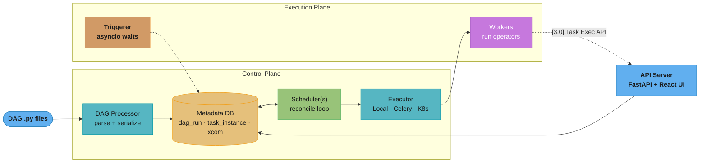
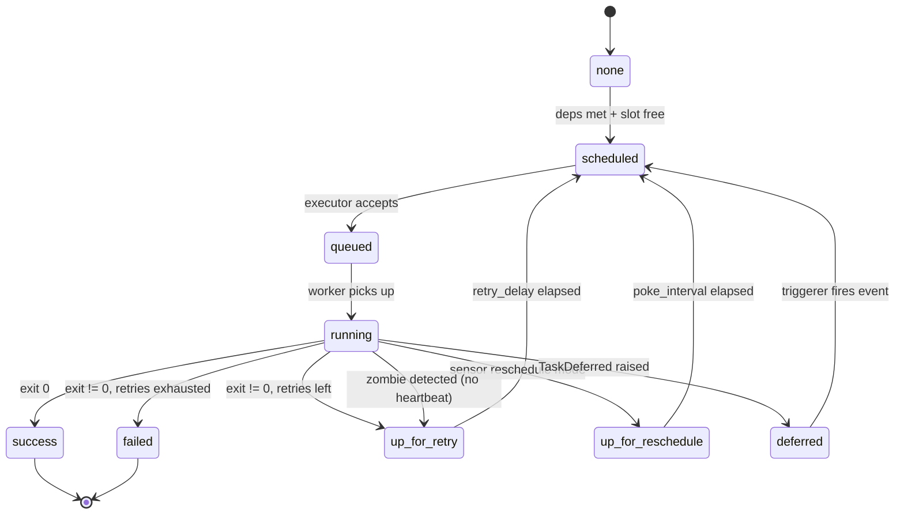
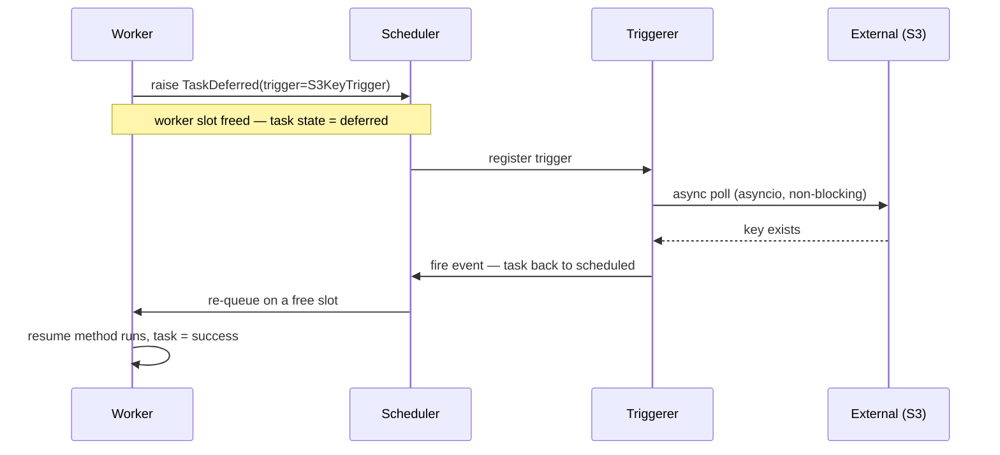
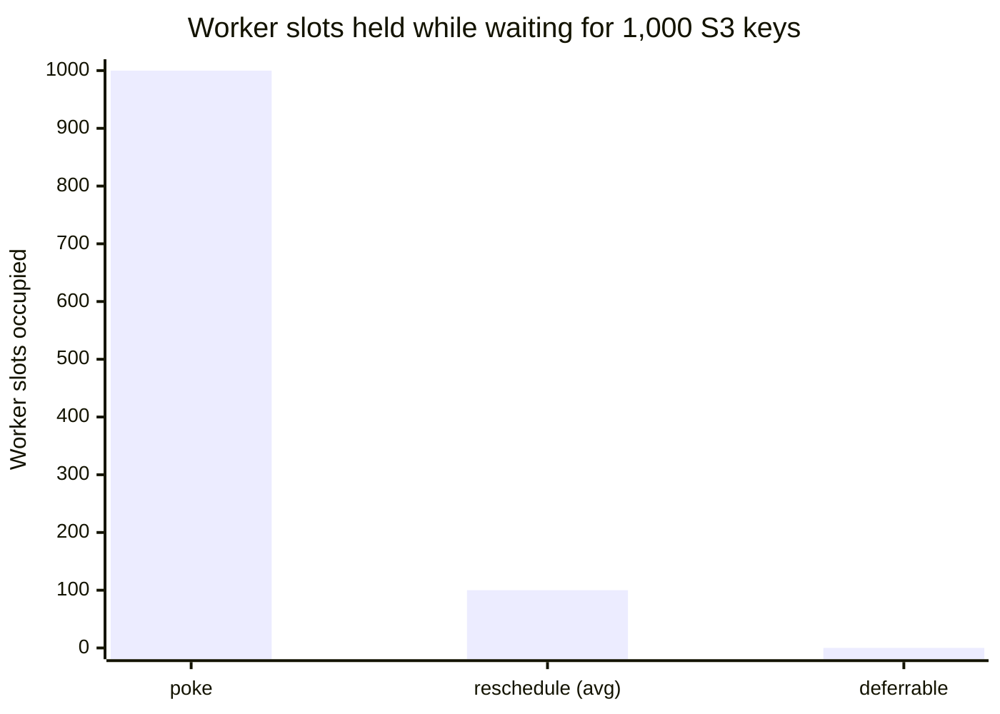

# Apache Airflow

> **Version pin:** This module targets **Airflow 3.0.x (released April 2025)**. Where Airflow 2.x behaves differently, the delta is tagged inline as **[2.x]**.

Airflow is the de-facto open-source **batch workflow orchestrator**: you declare pipelines as Python, and a control plane schedules, retries, and observes them. It runs your business logic on a schedule with dependency awareness — it does not run the logic itself.

---

## 1. Concept Overview

Apache Airflow is a platform to **author, schedule, and monitor batch data pipelines as code**. A pipeline is a **DAG** (Directed Acyclic Graph) — a set of **tasks** with directional dependencies, expressed in a Python file. Airflow parses that file, works out which tasks are ready to run based on their upstream state and the schedule, hands ready tasks to an **executor**, and records every state transition in a **metadata database**.

The defining idea is separation of concerns. Airflow is a **control plane**: the scheduler decides *what* should run and *when*, but the actual work (a SQL query, a Spark submit, a dbt run, an S3 copy) happens inside operators executed on **workers** — or, better, on external systems the operators merely trigger. Airflow itself should hold no business logic and move no large data; a task that loads a 5 GB DataFrame into the worker process is an anti-pattern (see §6, §10).

Airflow was built at Airbnb in 2014, entered the Apache incubator in 2016, and became a top-level Apache project in 2019. It is the orchestration layer under most modern data platforms — the "operating system" that decides when your ETL, your dbt models, your Spark jobs, and your ML retrains run, in what order, and what happens when one fails.

**What Airflow is not.** It is not a data-processing engine (it triggers Spark/dbt/Snowflake, it does not compute over your rows itself), not a streaming system (it thinks in scheduled *batches*, not events-at-a-time), and not a low-latency service (the scheduler heartbeat and data-interval model make sub-minute request/response impossible). Reaching for Airflow to do any of those is the most common architectural misuse (§9).

**Airflow 2 vs 3 positioning.** Airflow 2 (Dec 2020) delivered the modern scheduler (HA, no leader — the `SKIP LOCKED` design in §6.1), the TaskFlow API, deferrable operators, and datasets. **Airflow 3.0 (April 2025)** is the biggest re-architecture since:

| Concern | Airflow 2.x | Airflow 3.0 |
|---------|-------------|-------------|
| Worker ↔ DB | Workers connect to the metadata DB directly | **Task Execution API** brokers all access |
| Data linking | `datasets` | first-class **assets** (aliases, watchers, events) |
| Scheduling | cron / timedelta / timetable / dataset | + asset-driven, external watchers |
| History fidelity | Editing a DAG rewrote past-run views | **DAG versioning** pins each run's code |
| Backfills | Blocking CLI outside concurrency limits | **Scheduler-managed**, limit-respecting |
| Remote execution | Not supported | **Task Execution API** decouples workers from the DB; **EdgeExecutor** ships as an experimental provider (AIP-69) |
| UI / API | Flask + FAB | **React UI on a FastAPI server** (JWT auth) |

The mental model below holds across both versions; what moved in 3.0 is the *worker-to-DB boundary* and the *data-linking primitive*. Everything about DAGs, idempotency, data intervals, and the reconciliation loop is unchanged.

---

## 2. Intuition

> **One-line analogy:** Airflow is **cron with a dependency graph and a memory** — it remembers which runs happened, which tasks failed, and reconciles reality toward the schedule you declared.

**Mental model:** The scheduler is a **conductor, never a player**. It reads the score (your DAGs), watches the metadata DB (the orchestra's current state), and cues the next task the moment its prerequisites finish — but it never plays a note. All durable truth lives as rows in the metadata DB: `dag_run` rows, `task_instance` rows with a `state` column, `xcom` rows for small hand-offs. Scheduling is a **reconciliation loop**: on every heartbeat the scheduler asks "given current task_instance states and the schedule, which tasks should now move from `scheduled` to `queued`?" and enacts the diff.

**Why it matters:** Because state is externalized to a database and tasks are meant to be idempotent, Airflow can crash, restart, run multiple schedulers, retry a task, or backfill six months of history — all by replaying the same reconciliation logic over durable rows. There is no in-memory queue to lose.

**Key insight:** Airflow's power is not the Python DSL; it is that **every scheduling decision is a pure function of database state**. Master that and the war stories in §10 (catchup floods, zombies, HA without a leader) stop being surprises and become consequences.

---

## 3. Core Principles

- **DAGs as code.** Pipelines are Python objects, not YAML or clicks. This gives version control, code review, parametrization, and dynamic generation — but also means a syntax error or a slow import breaks parsing (§10).
- **Idempotent tasks.** Retries, backfills, and "clear and re-run" all *assume* a task produces the same result when re-executed for the same logical date. Non-idempotent tasks (append-only writes, `INSERT` without an idempotency key) corrupt data on the second run (§10, §12).
- **Logical / data-interval time ≠ wall-clock time.** A run is labeled by the **start** of the interval it covers, but executes only **after that interval ends**. The run labeled `2026-07-14` for a daily DAG fires at `2026-07-15 00:00` — because only then is the 14th's data complete. Confusing `logical_date` with "now" is the single most common beginner bug.
- **At-least-once execution.** Airflow guarantees a task runs *at least* once; under worker crashes or network partitions it may run *more* than once. Exactly-once is your job, via idempotency.
- **Scheduler / executor / worker separation.** The scheduler decides; the executor is the transport (Local process, Celery queue, K8s pod); the worker executes. Each scales independently.
- **[3.0] Task Execution API.** Workers no longer connect to the metadata DB. They call a versioned REST API on the API server to fetch context, push XComs, and report state. This is the security/isolation cornerstone of Airflow 3 — remote and multi-language workers become possible, and a compromised task cannot reach the DB.
- **Tasks are ephemeral, state is durable.** A worker process lives only for one task; everything that must survive (state, XComs, logs) is written out. A worker can die at any instant and lose nothing but that one in-flight task, which the scheduler re-runs.
- **Parsing is separate from execution.** The DAG file is *parsed* continuously by the DAG processor to discover structure, and *executed* only when a run fires. Code in the module body runs at parse time (constantly); code in task callables runs at execution time (once per run). Conflating the two causes parse storms (§10).
- **Everything is extensible.** Operators, hooks, sensors, timetables, XCom/secrets/executor backends, and listeners are all pluggable — Airflow is a framework, not a fixed product, which is why 90+ provider packages exist.

---

## 4. Types / Architectures / Strategies

### 4.1 The component processes

An Airflow deployment is a set of long-running processes plus the ephemeral work they spawn:

| Process | Role | Scales by |
|---------|------|-----------|
| **Scheduler** | Reconcile loop; decides what runs | Add active-active replicas (2–3 typical) |
| **DAG processor** | Parse `.py` files, serialize DAGs to DB | `parsing_processes` (default 2); separate process in 3.0 |
| **API server / Webserver** | UI + REST API | Stateless — add replicas behind a LB |
| **Triggerer** | asyncio event loop for deferrable tasks | Add replicas; one handles thousands of waits |
| **Worker** | Executes operator code | Executor-specific (Celery workers / K8s pods) |
| **Metadata DB** | Single source of truth | Vertical + read replicas; the hard scaling limit |

The metadata DB is the one stateful, un-shardable component — every other process is horizontally scalable, so DB write throughput is the ceiling on cluster size.

### 4.2 Executor taxonomy

The executor decides *where* tasks run:

| Executor | Parallelism | Startup | Use |
|----------|-------------|---------|-----|
| **Sequential** | 1 task, SQLite | instant | Demo only; the default-with-SQLite |
| **Local** | Multiprocess on one host | instant | Small single-node deployments |
| **Celery** | Distributed workers via broker (Redis/RabbitMQ) | ~instant (warm) | Classic horizontal scale |
| **Kubernetes** | One pod per task | 10–60s pod cold start | Isolation, per-task resources, no idle workers |
| **CeleryKubernetes** | Celery + K8s hybrid (route by queue) | mixed | Mixed workloads |
| **[3.0, experimental] EdgeExecutor** (AIP-69 provider) | Remote workers pull via Task Execution API | network-bound | On-prem/edge/multi-region workers |
| **[3.0] Hybrid executors** | Multiple executors in one deployment, per-task | mixed | Native in 3.0 — set `executor` on a task |

Celery needs a broker (Redis/RabbitMQ) and a result backend; the KubernetesExecutor needs only a K8s API and a pod template. The **[3.0]** hybrid model finally lets one DAG send its light SQL tasks to Celery and its heavy Spark task to a K8s pod, chosen per task. **EdgeExecutor ships separately as `apache-airflow-providers-edge`, not a core executor** — it is explicitly experimental, distinct from the built-in Local/Celery/Kubernetes/CeleryKubernetes executors above.

### 4.3 Sensor modes

How a task waits for an external condition — the choice determines whether waits cost worker slots:

- **poke** (default): occupies a worker slot the entire wait, re-checking every `poke_interval` (60s default). Cheap logic, expensive slot; safe only for a handful of short waits.
- **reschedule**: releases the slot between checks and re-queues itself, trading slot-holding for scheduler churn — good for long waits at moderate count.
- **deferrable** (async): raises `TaskDeferred` and hands the wait to the **Triggerer** as an asyncio coroutine, freeing the slot entirely. One triggerer multiplexes thousands of waits on a single event loop — the default choice at scale (§5.4).

Set `timeout` (default 7 days for a sensor) and `mode` explicitly; a `poke` sensor with no timeout is a classic slot leak.

### 4.4 Scheduling strategies

- **Cron string** — `schedule="0 2 * * *"` for calendar-based runs.
- **timedelta** — `schedule=timedelta(hours=6)` for fixed-interval runs relative to the previous run.
- **Custom Timetable** — a `Timetable` subclass for irregular calendars (trading days, fiscal months, "last business day") that cron cannot express.
- **[3.0] asset-driven** — `schedule=[asset_a, asset_b]`; the DAG runs when its upstream **assets** are produced ([2.x] called these **datasets**), decoupling it from any clock.
- **[3.0] asset watchers** — trigger on an *external* event (a queue message) rather than another DAG's task.
- **Manual / API** — no schedule; triggered by a human, the REST API, or a `TriggerDagRunOperator`.

### 4.5 Deployment topologies

Ordered by scale:

1. **Single-node** — LocalExecutor + one scheduler + one API server + a Postgres. Fine to a few hundred light tasks/day.
2. **HA multi-scheduler** — 2+ active schedulers (no leader, coordinated by `FOR UPDATE SKIP LOCKED`), Celery workers, a managed Postgres. Survives a scheduler loss with zero downtime.
3. **Kubernetes** — the **official Helm chart** or **KEDA-scaled Celery workers** (worker replicas auto-scale on broker queue depth, down to zero) or the **KubernetesExecutor** (pod-per-task, zero idle compute). This is the standard production shape.
4. **[3.0] Edge/remote** — an EdgeExecutor with workers in other networks/regions pulling work over the Task Execution API, for hybrid-cloud and on-prem execution.

---

## 5. Architecture Diagrams

### 5.1 Control plane



The scheduler only ever reads and writes the metadata DB; workers do the work. In 3.0 workers reach the DB only through the Task Execution API on the API server (dotted), never directly.

### 5.2 TaskInstance lifecycle



Every arrow is a scheduler-enacted row update. The `deferred → scheduled` loop is the deferrable-operator path; the zombie arrow is a worker that stopped heartbeating and is reaped after `scheduler_zombie_task_threshold` (300s default).

### 5.3 Deferrable operator hand-off



A deferred task holds **zero** worker slots while waiting — one triggerer process multiplexes thousands of async waits on a single event loop.

### 5.4 Worker-slot cost of 1,000 concurrent S3 waits



Poke pins one slot per wait (1,000 slots — cluster-freezing). Reschedule frees slots between pokes so the average occupancy is a small sawtooth (~100). Deferrable holds 0 worker slots — the waits live on one triggerer.

### 5.5 Data-interval semantics (ASCII — alignment carries the meaning)

```
 wall-clock time  ─────────────────────────────────────────────────────►
                  |                                   |
   data interval  [====== covers 2026-07-14 ==========)
                  07-14 00:00                          07-15 00:00
                                                       |
                                                       ▼  RUN FIRES HERE
                                                       run_id / logical_date = 2026-07-14
                                                       (the label is the interval START;
                                                        execution is at the interval END)
```

The run "for the 14th" cannot start until the 14th is over — only then is that day's data complete. `logical_date` = interval start (07-14); actual execution = interval end (07-15 00:00). This off-by-one trips nearly every newcomer (see §10, §12).

---

## 6. How It Works — Detailed Mechanics

### 6.1 The scheduler loop

The scheduler runs a tight loop every `scheduler_heartbeat_sec` (5s default). Two intervals govern DAG file freshness, handled by the **DAG processor** (a separate process in 3.0, a subprocess in 2.x):

- `min_file_process_interval = 30` (s) — a DAG file is re-parsed at most every 30s. Heavy top-level code therefore re-executes every 30s (the "parse storm", §10).
- `dag_dir_list_interval = 300` (s) — the DAGs folder is re-scanned for new/removed files every 5 minutes.
- `parsing_processes = 2` — the DAG processor forks this many workers to parse files in parallel; raise it when parse latency (`dag_processing.total_parse_time`) climbs past your `min_file_process_interval`.

On each pass the scheduler enters a **critical section** to select which `scheduled` task instances become `queued`, honoring `parallelism`, per-DAG limits, and pool slots. To make this safe across **multiple active schedulers with no leader**, it uses row-level locking:

```sql
-- Each scheduler grabs a disjoint batch; SKIP LOCKED means no scheduler
-- ever blocks on another's rows, so N schedulers scale near-linearly.
SELECT * FROM task_instance
 WHERE state = 'scheduled'
 ORDER BY priority_weight DESC
 FOR UPDATE SKIP LOCKED
 LIMIT :max_tis_per_query;   -- max_tis_per_query = 16 default
```

There is no elected coordinator — correctness comes entirely from `SELECT ... FOR UPDATE SKIP LOCKED` (Postgres/MySQL 8+; **SQLite cannot run HA schedulers**). Add schedulers up to the point the metadata DB's write throughput saturates — in practice 2–3 schedulers serve thousands of DAGs. This is the HA design (§12).

**Mini-scheduler fast-follow.** Waiting a full loop for a downstream task to notice its upstream just finished wastes up to `scheduler_heartbeat_sec` on every hop of a long chain. To avoid that, a worker that just finished a task runs a small "mini-scheduler" pass (`schedule_after_task_execution`, on by default) that immediately checks its own DAG run for any direct downstream tasks now eligible to schedule, and schedules them right away instead of waiting for the next scheduler loop. This shaves latency off chains of short, sequential tasks without touching the main critical-section loop's throughput.

### 6.2 Config defaults + performance-tuning cookbook

The annotated core knobs, with real 3.0 defaults:

```ini
[core]
parallelism = 32                      ; max task instances RUNNING cluster-wide
max_active_tasks_per_dag = 16         ; concurrent tasks within one DAG  [2.x: dag_concurrency]
max_active_runs_per_dag = 16          ; concurrent DAG runs of one DAG
dagbag_import_timeout = 30.0          ; kill a DAG file parse exceeding 30s
default_pool_task_slot_count = 128    ; slots in the auto-created default_pool

[scheduler]
scheduler_heartbeat_sec = 5           ; loop cadence
min_file_process_interval = 30        ; re-parse a file at most every 30s
dag_dir_list_interval = 300           ; re-scan DAGs folder every 5 min
parsing_processes = 2                 ; parallel DAG-parse workers
max_tis_per_query = 16                ; task instances examined per critical-section query
scheduler_zombie_task_threshold = 300 ; reap a task with no heartbeat for 300s

[celery]
worker_concurrency = 16               ; tasks per Celery worker process

[operators]
default_deferrable = False            ; set True to flip every deferrable-capable operator/sensor to async mode by default
```

`[operators] default_deferrable = True` is a fleet-wide lever: instead of setting `deferrable=True` on each sensor/operator call site, flipping this one config makes every operator/sensor that *supports* deferral (§4.3, §6.31) run async by default cluster-wide, freeing worker slots without touching DAG code. Useful when migrating an existing fleet of poke sensors to the Triggerer in bulk; individual tasks can still opt back out with `deferrable=False`.

**Performance-tuning cookbook** — the knobs that actually move throughput, their defaults, and the symptom that says "raise me":

| Knob | Default | Raise it when |
|------|---------|---------------|
| `parallelism` | 32 | Slots full but workers idle; you have capacity for more concurrent tasks |
| `max_active_tasks_per_dag` | 16 | One wide fan-out DAG is throttled below cluster capacity |
| `max_active_runs_per_dag` | 16 | Backfills/catchup are serializing when they could overlap |
| `parsing_processes` | 2 | `dag_processing.total_parse_time` approaches `min_file_process_interval` |
| `max_tis_per_query` | 16 | Scheduler under-fills slots each loop on a large cluster |
| `worker_concurrency` (Celery) | 16 | Workers CPU-idle while tasks queue; lower it for memory-heavy tasks |
| `default_pool_task_slot_count` | 128 | The global default pool is the bottleneck, not a specific resource |

Rule of thumb: `parallelism` is the cluster ceiling, pool slots are per-resource ceilings, and `max_active_tasks_per_dag` is the per-DAG ceiling — a task runs only if it clears all three.

**Stated plainly.** "Four separate ceilings sit between a ready task and a running one, and your actual concurrency is the smallest of them — never the one you last edited."

Written as a `min()` it stops being four config values and becomes one arithmetic question: which term is currently smallest? Raising any other term changes nothing at all, which is why "I doubled the workers and throughput did not move" is the most common Airflow complaint.

| Symbol | What it is |
|--------|------------|
| `parallelism` | Cluster-wide cap on task instances in the `running` state. Default `32` |
| `max_active_tasks_per_dag` | Cap on concurrent tasks within a single DAG. Default `16` |
| pool slots | Cap for a named shared resource; a task may claim `pool_slots > 1` |
| `worker_concurrency` | Task processes one Celery worker will run at once. Default `16` |
| worker count | How many Celery worker hosts are in the fleet |

**Walk one example.** A 200-task fan-out DAG on a 4-worker Celery fleet, all defaults:

```
  fleet execution capacity : worker_concurrency 16 x 4 workers = 64 slots
  cluster ceiling          : parallelism                       = 32
  per-DAG ceiling          : max_active_tasks_per_dag          = 16
  default pool             : default_pool_task_slot_count      = 128

  effective concurrency = min(64, 32, 16, 128) = 16 tasks running

  hardware idle           : 64 - 16 = 48 slots paid for and unused
  wall clock for 200 tasks at 60 s each:
      ceil(200 / 16) = 13 waves  ->  13 x 60 s = 780 s = 13.0 min
```

Raise only the per-DAG ceiling and watch which term takes over:

```
  max_active_tasks_per_dag 16 -> 64
  effective = min(64, 32, 64, 128) = 32     <- parallelism is now binding
      ceil(200 / 32) = 7 waves -> 7 x 60 s = 420 s = 7.0 min

  now also raise parallelism 32 -> 64
  effective = min(64, 64, 64, 128) = 64     <- the fleet itself is binding
      ceil(200 / 64) = 4 waves -> 4 x 60 s = 240 s = 4.0 min
```

Three edits, each unlocking the next bottleneck: 13.0 min, 7.0 min, 4.0 min. Stopping after the first edit and concluding "Airflow does not scale" is the trap.

**Why `pool_slots > 1` breaks the naive count.** A pool's capacity is measured in slots, not tasks, so a task declaring `pool_slots: 4` against a 5-slot `warehouse` pool leaves room for exactly one more single-slot task, not four. This is deliberate — it is how you express "this Spark submit costs as much warehouse capacity as four small queries." Forget it and the pool looks under-utilized in the UI while tasks queue behind it.

**Why sensor mode dominates all four ceilings.** A `poke` sensor occupies one of these scarce slots for its entire wait; 1,000 concurrent S3 waits consume 1,000 slots against a `parallelism` of 32, so the cluster deadlocks before any real work is scheduled. `reschedule` frees the slot between pokes, and `deferrable` holds **zero** — which is why the triggerer changes the capacity equation rather than merely tuning it.

### 6.3 Connections and provider hooks

A **Connection** is a named credential/endpoint (`conn_id`) — a host, login, password, port, and a JSON `extra` blob — resolved at run time by a **Hook**. `PostgresHook(postgres_conn_id="warehouse")` looks up the `warehouse` connection and returns a live client; operators wrap hooks. Connections resolve through a lookup chain: **secrets backend → environment variable (`AIRFLOW_CONN_WAREHOUSE`) → metadata DB**. Never hard-code credentials in a DAG file — that leaks them into every parse and into version control.

### 6.4 Secrets backends (lookup order + caching)

A **secrets backend** externalizes connections and Variables to Vault, AWS Secrets Manager, or GCP Secret Manager. The resolution order is fixed:

1. **Custom secrets backend** (if configured) — e.g. `HashiCorpVaultBackend`, `SecretsManagerBackend`.
2. **Environment variables** — `AIRFLOW_CONN_<ID>` / `AIRFLOW_VAR_<KEY>`.
3. **Metadata DB** (the `connection`/`variable` tables).

The backend is queried **first**, so a mis-scoped Vault path silently falls through to env then DB. Two footguns: (1) the backend is hit on **every** lookup — a per-task connection fetch can hammer Vault, so set `connections_prefix`/`variables_prefix` correctly and rely on `AIRFLOW_SECRETS_BACKEND_KWARGS`-configured caching; (2) with no backend, secrets in the DB are only **Fernet-encrypted** with the `fernet_key` — rotating that key without re-encrypting bricks every stored credential.

### 6.5 XCom and the TaskFlow API

XCom ("cross-communication") passes **small** values between tasks via `xcom` rows in the metadata DB. The **TaskFlow API** ([2.x]+) makes this implicit — a returned value becomes an XCom, a function argument pulls it:

```python
from airflow.decorators import dag, task
import pendulum

@dag(schedule="@daily", start_date=pendulum.datetime(2026, 1, 1, tz="UTC"),
     catchup=False, tags=["elt"])
def daily_sales():
    @task
    def extract() -> str:
        # return a POINTER, not data — the string is stored as an xcom row
        return "s3://warehouse/sales/2026-07-14/raw.parquet"

    @task
    def transform(path: str) -> str:
        # read/write in the external store; never pull the DataFrame through XCom
        return path.replace("/raw", "/clean")

    transform(extract())

daily_sales()
```

XComs are serialized into the DB, so they must stay small (KB, not MB). A 200 MB DataFrame pushed through XCom bloats the DB and can OOM the scheduler (§10, §12). For large payloads, register a **custom XCom backend** that transparently spills to S3 and stores only the pointer in the DB:

```python
from airflow.models.xcom import BaseXCom
import uuid, boto3, pickle

class S3XComBackend(BaseXCom):
    BUCKET = "airflow-xcom"
    @staticmethod
    def serialize_value(value, **kwargs):
        key = f"xcom/{uuid.uuid4()}.pkl"
        boto3.client("s3").put_object(Bucket=S3XComBackend.BUCKET, Key=key,
                                      Body=pickle.dumps(value))
        return BaseXCom.serialize_value(f"s3://{S3XComBackend.BUCKET}/{key}")
```

Set it via `[core] xcom_backend = my_pkg.S3XComBackend`. **[3.0]** the object-storage XCom backend ships built-in, so pointing XComs at S3/GCS no longer needs custom code.

### 6.6 Dynamic task mapping (deep)

`.expand()` fans a task out over a runtime-computed list — the number of parallel copies (**map indexes**) is decided *at run time*, not parse time, capped by `max_map_length = 1024`:

```python
@task
def list_files() -> list[str]:
    return ["a.csv", "b.csv", "c.csv"]   # length known only at run time

@task
def process(name: str) -> int:
    return len(name)

process.expand(name=list_files())        # 3 mapped instances: map_index 0,1,2
```

The full mapping toolkit:

- **`.expand_kwargs()`** maps over a list of *kwarg dicts*, so each mapped instance gets a different set of arguments: `run.expand_kwargs([{"a": 1, "b": 2}, {"a": 3, "b": 4}])`.
- **`.zip()`** pairs two lists positionally before mapping (like Python `zip`), avoiding a full cross-product.
- **Cross-product** happens automatically when you `.expand()` on two arguments — `f.expand(x=[1,2], y=[3,4])` yields 4 instances.
- **Mapping over a TaskGroup** ([2.5+]) fans out an entire group of tasks per input, not just one task.
- **Reduce**: a downstream non-mapped task receives the *list* of all mapped results, so map-then-reduce is native.

This is the correct replacement for a top-level Python `for` loop that generates tasks (which runs at parse time and can trigger a parse storm — §12). Each map index is a separate `task_instance` row with its own retries and logs, visible in the grid view.

### 6.7 Jinja templating, params, and macros

Operator fields marked *templated* are rendered with **Jinja2** at run time, giving tasks access to the run context without any Python glue:

```python
BashOperator(
    task_id="load",
    # {{ ds }} = logical date YYYY-MM-DD; {{ data_interval_start }} a pendulum dt
    bash_command="aws s3 cp s3://raw/{{ ds }}/ /tmp/ --recursive",
)
```

Built-in macros include `{{ ds }}`, `{{ ds_nodash }}`, `{{ data_interval_start }}`, `{{ data_interval_end }}`, `{{ ts }}`, `{{ run_id }}`, and `{{ macros.ds_add(ds, -7) }}`. **Params** attach validated, UI-overridable inputs to a DAG (`params={"region": Param("us", enum=["us","eu"])}`), surfaced in the "Trigger DAG w/ config" form. Templating is why you must derive the processing window from `{{ ds }}` / `data_interval_start`, never `datetime.now()` (§10).

### 6.8 TaskGroups (vs deprecated SubDAGs)

**TaskGroups** visually and logically group tasks inside one DAG without spawning a child DAG:

```python
from airflow.utils.task_group import TaskGroup
with TaskGroup("ingest") as ingest:
    a = extract(); b = validate(a)
```

They are pure UI/organization sugar — the tasks still run in the parent DAG under the parent's concurrency limits. **SubDAGs are removed in 3.0** (deprecated since 2.0): they ran a whole child DAG under a `SubDagOperator` that itself occupied a worker slot, causing deadlocks when the SubDAG's tasks needed slots the operator was holding. Always use TaskGroups (or asset-linked separate DAGs) instead.

### 6.9 Setup and teardown tasks ([2.7+])

**Setup/teardown** tasks bind resource lifecycle to a work scope: a teardown runs even if the work task fails, and a failed teardown does not (by default) fail the DAG run. This models "create an EMR cluster → run jobs → always tear the cluster down":

```python
create = create_cluster()
run = process()
destroy = delete_cluster()
create >> run >> destroy.as_teardown(setups=create)
```

Unlike a normal downstream task with `trigger_rule="all_done"`, teardowns are excluded from the DAG's success state and are automatically re-run on a `clear`, so you never leak the expensive cluster.

### 6.10 Datasets → Assets (deep)

**[3.0]** generalizes 2.x **datasets** into first-class **assets** — named logical data objects that link producer and consumer DAGs by *data readiness* instead of a clock:

```python
from airflow.sdk import Asset          # [3.0]; [2.x]: from airflow.datasets import Dataset
customers = Asset("s3://warehouse/customers")

@task(outlets=[customers])             # producing this task marks the asset updated
def build_customers(): ...

@dag(schedule=[customers])             # this DAG runs when the asset is updated
def downstream(): ...
```

Deeper features: **asset aliases** let a task decide *at run time* which asset it produced (dynamic outlets); **asset watchers** ([3.0]) trigger a DAG on an *external* event (e.g. a message on a queue) rather than another DAG's task; **asset events** are the rows recording each update, and a consumer can require *multiple* assets (`schedule=(a & b)`) or *any* (`a | b`). This is how you decompose a mega-DAG into small, independently-scheduled DAGs wired by data (§8).

### 6.11 Backfill and catchup

`catchup` decides whether Airflow fills in every missed interval between `start_date` and now:

```python
# catchup=False (recommended default): only the latest interval runs.
@dag(schedule="@daily", start_date=pendulum.datetime(2024, 1, 1, tz="UTC"),
     catchup=False)   # un-pausing in 2026 => ONE run, not 700+
def safe(): ...
```

To reprocess history deliberately, run a backfill:

```bash
airflow dags backfill --start-date 2026-06-01 --end-date 2026-06-30 sales_etl
```

**[3.0]** backfills are **scheduler-managed** — triggered via API/UI and executed by the scheduler honoring `max_active_runs_per_dag`, instead of the old blocking CLI process that ran outside those limits and could overwhelm downstreams.

### 6.12 Pools, priority_weight, and queues

A **pool** caps concurrency for a shared resource (a `warehouse` pool of 5 slots so Airflow never opens more than 5 connections to Snowflake). A task can claim more than one slot via `pool_slots`. `priority_weight` (default 1) orders `scheduled` tasks competing for the same slots — higher wins — and `weight_rule` (`downstream`/`upstream`/`absolute`) controls how weights propagate through the graph. **Queues** route tasks to specific Celery workers (a `gpu` queue served only by GPU-equipped workers), the mechanism behind heterogeneous fleets.

### 6.13 Remote logging (S3 / GCS / Elasticsearch) and log serving

Task logs are written to local disk by default, which is useless when a KubernetesExecutor pod is deleted after the task. **Remote logging** ships logs to object storage or a search store:

```ini
[logging]
remote_logging = True
remote_base_log_folder = s3://airflow-logs/
remote_log_conn_id = aws_logs
```

While a task runs, logs are served live from the worker over the **log-serving port 8793**; after completion the UI reads them from the remote store. With Elasticsearch/OpenSearch, logs are indexed and the UI links out. Without remote logging, a common incident is "logs vanished" after pods/workers are recycled (§10).

### 6.14 REST API and the auth / RBAC model

**[3.0]** exposes a **FastAPI**-based REST API (the same server that backs the React UI), authenticated with **JWT** tokens issued by a pluggable auth manager. Programmatic clients trigger DAGs, read task state, and manage connections over HTTP:

```bash
curl -X POST https://airflow/api/v2/dags/sales_etl/dagRuns \
  -H "Authorization: Bearer $JWT" -d '{"logical_date": "2026-07-14T00:00:00Z"}'
```

RBAC is role-based: **[2.x]** used Flask-AppBuilder (FAB) roles — `Admin`, `Op`, `User`, `Viewer`, `Public` — plus per-DAG permissions (`can_read on DAG:sales_etl`). **[3.0]** introduces the pluggable **auth manager** interface (FAB remains the default; enterprises swap in an external one). Access control is per-DAG, but note the multi-tenancy caveat in §6.18.

### 6.15 Plugins, listeners, and notifications

The **plugins** system (`AirflowPlugin` subclasses dropped in `$AIRFLOW_HOME/plugins/`) registers custom operators, hooks, macros, timetables, and **listeners**. **Listeners** hook lifecycle events (`on_task_instance_running`, `on_dag_run_failed`) for cross-cutting concerns like pushing every state change to an external system. **Notifications** fire on task/DAG outcomes:

```python
from airflow.providers.slack.notifications.slack import SlackNotifier
BashOperator(task_id="x", bash_command="...",
             on_failure_callback=SlackNotifier(slack_conn_id="slack", text="failed"))
```

`on_failure_callback`, `on_retry_callback`, and `on_success_callback` cover per-task-outcome alerting; reusable **Notifier** classes (Slack, PagerDuty, SMTP) replace ad-hoc callback functions. **[2.x] SLA callbacks** let a task declare an `sla` duration and fired `sla_miss_callback` when a run exceeded it — but only if/when the scheduler got around to checking, and never for a run that simply hung forever. **`sla` and `sla_miss_callback` were removed in Airflow 3.0.** **[3.1+] Deadline Alerts** (AIP-86) are the replacement, and they work differently: a `DeadlineAlert` attaches a reference point (e.g. `DeadlineReference.DAGRUN_QUEUED_AT`), an interval, and a callback to the **DAG run** (not a single task), and every scheduler pass compares `reference + interval` against now — so the callback fires within roughly one `scheduler_heartbeat_sec` (5s default) of the deadline actually expiring, rather than waiting for the run to finish first.

### 6.16 Metrics and observability

Airflow emits **StatsD** metrics and, since 2.x, **OpenTelemetry** metrics/traces (`[metrics] otel_on = True`). The five scheduler metrics worth alerting on:

| Metric | Meaning | Alert when |
|--------|---------|-----------|
| `scheduler.scheduler_loop_duration` | Time for one loop | Approaches/exceeds `scheduler_heartbeat_sec` (5s) |
| `dag_processing.total_parse_time` | Time to parse all DAGs | Approaches `min_file_process_interval` (30s) |
| `executor.open_slots` | Free executor slots | Sits near 0 (cluster saturated) |
| `executor.queued_tasks` | Tasks waiting for a slot | Grows unbounded (backlog) |
| `scheduler.tasks.starving` | Tasks blocked on pool slots | Persistently > 0 (pool undersized) |

A rising `scheduler_loop_duration` next to a rising `total_parse_time` is the classic parse-storm signature (§10).

### 6.17 Metadata DB migrations and the upgrade playbook

The metadata DB schema is versioned by Alembic migrations. `airflow db migrate` ([3.0]; **[2.x]** was `airflow db upgrade`) applies pending migrations; `airflow db check` validates connectivity. The version-upgrade playbook: (1) read the release notes for breaking changes, (2) **back up the metadata DB**, (3) run `airflow db migrate` on a maintenance window with schedulers stopped (long migrations can lock large `task_instance` tables for minutes), (4) upgrade schedulers/workers, (5) smoke-test with `dag.test()`. Major upgrades (2→3) also require a config migration (`airflow config update`) and provider re-pinning. Never run mismatched Airflow versions across scheduler and workers.

### 6.18 Multi-tenancy limits

Airflow is **not truly multi-tenant**. Per-DAG RBAC controls *who can see/trigger* a DAG, but every worker shares one Python environment and can read every Connection and Variable — a task in team A's DAG can import team B's credentials at run time. The DAG processor parses all files in one interpreter, so one team's slow import degrades everyone's scheduling. Real isolation requires *separate Airflow deployments* per tenant (the managed-service and Astronomer approach). **[3.0]**'s Task Execution API narrows the blast radius — workers no longer reach the DB directly — but shared connections and shared parsing keep hard multi-tenancy out of scope. Do not put untrusted tenants in one cluster.

### 6.19 Testing

Airflow supports three test layers. **DAG integrity / import tests** in CI import every DAG and assert no cycles and no import errors:

```python
def test_no_import_errors():
    dagbag = DagBag(include_examples=False)
    assert not dagbag.import_errors      # catches parse breakage before deploy
```

**Operator unit tests** instantiate an operator and call `.execute(context)` with a stubbed context. **`dag.test()`** ([2.5+]) runs a whole DAG end-to-end in-process against a local/ephemeral DB — the fastest way to validate a pipeline locally without a running scheduler. Together these catch the parse-time and logic errors that otherwise only surface in production.

### 6.20 DAG versioning and the Task SDK / edge executor ([3.0])

**DAG versioning** ([3.0]) records the exact code a run used, so the grid/graph view of a *past* run reflects the DAG as it was *then* — not the latest edited version. This fixes the long-standing confusion where editing a DAG retroactively rewrote history in the UI. The **Task Execution API** ([3.0]) decouples task execution from the scheduler internals — tasks talk to a versioned REST API over HTTP instead of touching the metadata DB — and that boundary is what makes non-Python task execution *possible*, not something Airflow 3.0 shipped outright: the Python **Task SDK** is the first client of that API, the **EdgeExecutor** (AIP-69) ships separately as an **experimental provider package** letting workers run in remote/on-prem/edge locations over the same API, and Go/Java task runtimes did not arrive until **3.3**, as experimental Coordinator-based SDKs (a JVM coordinator and a native-binary coordinator) that still declare the DAG shape in Python via `@task.stub`. Together these make Airflow 3 a distributed control plane with a stable worker contract rather than a monolith where workers reach into the DB.

### 6.21 Operators, branching, and control flow

An **Operator** is a task template; instantiating one creates a task. The taxonomy:

| Operator | Purpose |
|----------|---------|
| `PythonOperator` / `@task` | Run a Python callable (the TaskFlow default) |
| `BashOperator` | Run a shell command (templated) |
| `KubernetesPodOperator` | Run a task as an arbitrary K8s pod/image |
| `SQLExecuteQueryOperator` | Run SQL against any DB connection |
| `EmptyOperator` | No-op join/fan-in marker (was `DummyOperator`) |
| `TriggerDagRunOperator` | Trigger another DAG (cross-DAG orchestration) |
| `ExternalTaskSensor` | Wait for a task in *another* DAG to finish |
| `@task.branch` / `BranchPythonOperator` | Choose which downstream path(s) run |
| `ShortCircuitOperator` | Skip all downstream if a condition is false |

**Branching** picks a subset of downstream tasks at run time — `@task.branch` returns the `task_id`(s) to follow, and un-chosen branches are marked `skipped`. **ShortCircuit** returning `False` skips everything downstream (used above in §14 to gate model registration). Because skipping propagates, a join task after a branch needs `trigger_rule="none_failed_min_one_success"` so it runs when *some* upstream succeeded and the rest were skipped — a classic gotcha.

### 6.22 Executor internals

**CeleryExecutor lifecycle:** the scheduler serializes a task command and publishes it to the broker (Redis/RabbitMQ); a Celery worker with a free `worker_concurrency` slot pulls it, forks a subprocess to run the operator, and writes the result state via the DB ([2.x]) or Task Execution API ([3.0]). Broker visibility timeout matters — set it *higher* than your longest task, or the broker redelivers a still-running task to a second worker (a duplicate-execution source).

**KubernetesExecutor lifecycle:** the scheduler creates a pod from a pod template (base image + task command as args); a **pod watcher** thread watches the K8s API for pod phase changes (`Pending → Running → Succeeded/Failed`) and updates the `task_instance` state accordingly. A pod stuck `Pending` (no nodes, image pull backoff) shows as a queued task that never starts — check `kubectl describe pod`, not the Airflow logs.

### 6.23 Variables, and the CLI

**Variables** are key-value config stored in the metadata DB (or a secrets backend), fetched with `Variable.get("region")` — but *inside* a task, never at parse time, since a top-level `Variable.get` hits the DB on every parse (a parse-storm source). Store structured config as a single JSON Variable to avoid N lookups.

The **CLI** is the operational surface: `airflow dags list/trigger/backfill/pause`, `airflow tasks test <dag> <task> <date>` (run one task locally with no scheduler), `airflow db migrate/clean/check`, `airflow connections add/list`, `airflow pools set`, and `airflow standalone` (one-command local everything). `airflow tasks test` is the fastest way to debug a single operator against real connections without a DAG run.

### 6.24 Trigger-rule reference

A task's `trigger_rule` decides when it runs given its direct upstreams' states (default `all_success`):

| Rule | Runs when |
|------|-----------|
| `all_success` (default) | All upstreams succeeded |
| `all_failed` | All upstreams failed |
| `all_done` | All upstreams finished (any state) — cleanup tasks |
| `all_skipped` | All upstreams were skipped |
| `one_success` | At least one upstream succeeded (don't wait for the rest) |
| `one_failed` | At least one upstream failed — alerting branch |
| `one_done` | At least one upstream succeeded or failed |
| `none_failed` | No upstream failed (success or skipped OK) |
| `none_failed_min_one_success` | No failures and at least one success — the correct join after a branch |
| `none_skipped` | No upstream skipped |
| `always` | Ignore upstreams entirely |

The single most common mistake: a join task after a `@task.branch` left on the default `all_success` gets marked `skipped` (because a branch skips siblings), silently dropping the rest of the pipeline. Use `none_failed_min_one_success` there.

### 6.25 The UI and debugging workflow

The web UI is the primary operational surface, with several views:

- **Grid** — runs (rows) × tasks (columns) as a colored matrix; the fastest way to spot which task/date failed across many runs.
- **Graph** — the DAG's dependency topology for one run, colored by task state.
- **Gantt** — per-task duration/overlap for one run; finds the critical-path bottleneck and slot contention.
- **Logs** — per-task-try logs (local or remote per §6.13); each retry is a separate try.
- **Task duration / landing times** — trends to catch a task that is slowly regressing.

Debugging workflow: Grid shows a red cell → click the failed task instance → read the log for the exception → fix code or data → **Clear** the task (and optionally downstream) to re-run just the failed subtree, not the whole DAG. For a fix you want to validate locally first, `airflow tasks test <dag> <task> <date>` runs that one task against real connections with no scheduler and no state writes.

### 6.26 A complete worked DAG

Putting the pieces together — an idempotent daily ELT with a pool, retries, callbacks, a branch, and an asset outlet:

```python
from airflow.decorators import dag, task
from airflow.providers.slack.notifications.slack import SlackNotifier
from airflow.sdk import Asset
import pendulum

clean_sales = Asset("s3://warehouse/sales/clean")
DEFAULTS = {
    "retries": 3,
    "retry_delay": pendulum.duration(minutes=5),
    "retry_exponential_backoff": True,
    "execution_timeout": pendulum.duration(hours=1),
    "on_failure_callback": SlackNotifier(slack_conn_id="slack", text="task failed"),
}

@dag(schedule="@daily", start_date=pendulum.datetime(2026, 1, 1, tz="UTC"),
     catchup=False, default_args=DEFAULTS, tags=["elt", "sales"])
def sales_elt():
    @task
    def extract(ds=None) -> str:                    # ds injected from context
        return f"s3://raw/sales/{ds}/data.parquet"  # pointer, not data

    @task(pool="warehouse")                         # cap warehouse concurrency
    def load(path: str, ds=None) -> str:
        dst = f"s3://warehouse/sales/clean/{ds}/"
        # idempotent: overwrite this partition, so a retry is a no-op-equivalent
        run_sql(f"INSERT OVERWRITE ... SELECT * FROM read('{path}')")
        return dst

    @task.branch
    def check_freshness(path: str) -> str:
        return "publish" if rows(path) > 0 else "skip_empty"

    @task(outlets=[clean_sales])                    # marks the asset updated
    def publish(): ...

    @task
    def skip_empty(): ...

    p = extract()
    loaded = load(p)
    branch = check_freshness(loaded)
    branch >> [publish(), skip_empty()]

sales_elt()
```

Every senior best practice from §13 is visible: pointer-only XComs, idempotent `INSERT OVERWRITE`, a `warehouse` pool, exponential-backoff retries, `execution_timeout`, failure alerting, a branch with the correct downstream handling, and an asset outlet so a consumer DAG runs on data readiness.

### 6.27 Security model

Security spans several layers: **at rest**, connection passwords and Variables in the metadata DB are **Fernet-encrypted** with `fernet_key` (rotate via a key list, never a bare swap — §10); production should externalize secrets to a backend (§6.4) so nothing sensitive sits in the DB at all. **In transit / access**, the web UI and REST API enforce **RBAC** (FAB roles in 2.x; pluggable auth manager + JWT in 3.0) with per-DAG permissions. **Network**, the worker log-serving port is **8793**, the API/UI defaults to **8080**, and the Celery Flower monitor to **5555** — lock these behind the cluster boundary. **`secret_key` consistency**, the webserver/API server's `[webserver]`/`[api]` `secret_key` signs sessions and internal request auth, and it **must be identical across every replica behind a load balancer**; a mismatch (e.g. one replica still on its auto-generated default, or a rolling deploy that regenerated it) causes intermittent 403s or "session invalid" errors that only reproduce when the LB happens to route a request to the odd-one-out replica — set it explicitly in config/secrets rather than leaving it to be auto-generated per process. **Blast radius**, the **[3.0]** Task Execution API removes workers' direct DB access, so a compromised task can no longer read the whole connection table over the DB socket — the largest security improvement in 3.0, though shared connections still limit true multi-tenancy (§6.18).

### 6.28 Cross-DAG dependencies

Three mechanisms wire DAGs together, each with a different coupling:

| Mechanism | Direction | Coupling | Use |
|-----------|-----------|----------|-----|
| `TriggerDagRunOperator` | Push (A triggers B) | Tight — A names B | A must actively kick off B |
| `ExternalTaskSensor` | Pull (B waits for A) | Tight — B names A + its schedule | B must not start until A's task done |
| **Assets** ([3.0]) | Data-driven | Loose — via a named asset | B runs when the data A produces is ready |

`ExternalTaskSensor` is the classic footgun: it matches on `logical_date`, so if A and B are on different schedules the dates never align and B waits forever — you must set `execution_delta` or `execution_date_fn`. **Assets are the modern answer** — they decouple producer and consumer entirely (neither names the other's schedule), which is why 3.0 pushes them as the primary cross-DAG primitive.

### 6.29 Scaling and sizing heuristics

Rough sizing by DAG count (light tasks, tune to your workload):

| Scale | Schedulers | `parsing_processes` | Metadata DB | Executor |
|-------|-----------|---------------------|-------------|----------|
| < 100 DAGs | 1 | 2 (default) | Small Postgres (2 vCPU) | Local or Celery |
| 100–1,000 | 2 | 4–8 | 4 vCPU + read replica | Celery / K8s |
| 1,000–5,000 | 2–3 | 8–16 | 8+ vCPU, tuned, replica | K8s + KEDA |
| 5,000+ | 3+ | 16+ | Dedicated, heavily tuned; consider splitting deployments | K8s |

What breaks first, in order: (1) **DAG parsing** — `total_parse_time` exceeds `min_file_process_interval`; fix with more `parsing_processes` and no top-level code; (2) **the metadata DB** — critical-section queries slow; fix with `db clean`, a read replica for the UI, and vertical scale; (3) **executor slots** — raise `parallelism` and add workers. Adding schedulers helps only until the DB write path saturates — beyond ~3 schedulers / a few thousand DAGs, split into multiple Airflow deployments rather than scaling one.

### 6.30 Timezones, DST, and start_date

Airflow stores everything in **UTC** internally and displays in a configurable timezone. Always set `start_date` with an explicit `tz` (`pendulum.datetime(2026, 1, 1, tz="UTC")`); a naive datetime is interpreted as `[core] default_timezone` and shifts your runs. Two rules that prevent whole classes of bugs: **never use a dynamic `start_date`** (`datetime.now()` as start_date makes the interval move every parse, so no run ever fires), and for schedules that must respect **DST**, set a non-UTC timezone so a `@daily` "2 AM local" run stays at 2 AM across the spring/fall transitions — under UTC it would drift by an hour. The interval-end execution rule (§3) combined with an explicit tz is the complete fix for the off-by-one and DST-drift war stories in §10.

### 6.31 Writing extension points (deferrable operator + custom timetable)

Two extension points seniors write by hand. A **deferrable operator** pairs an operator's `execute()` (which calls `self.defer(...)`) with an async **Trigger** (a coroutine that yields a `TriggerEvent` when the condition is met):

```python
from airflow.triggers.base import BaseTrigger, TriggerEvent
from airflow.models import BaseOperator
import asyncio

class S3KeyTrigger(BaseTrigger):
    def __init__(self, bucket, key): self.bucket, self.key = bucket, key
    def serialize(self):                       # so the triggerer can rehydrate it
        return ("my.S3KeyTrigger", {"bucket": self.bucket, "key": self.key})
    async def run(self):                       # runs on the triggerer event loop
        while not await self._exists():        # non-blocking; frees the worker slot
            await asyncio.sleep(30)
        yield TriggerEvent({"key": self.key})  # fires -> scheduler re-queues task

class WaitForS3(BaseOperator):
    def execute(self, context):
        self.defer(trigger=S3KeyTrigger(self.bucket, self.key),
                   method_name="resume")       # worker slot released here
    def resume(self, context, event):          # runs after the event fires
        return event["key"]
```

A **custom Timetable** expresses schedules cron cannot — here "every weekday at 07:00", skipping weekends:

```python
from airflow.timetables.base import Timetable, DagRunInfo, DataInterval
import pendulum

class WeekdayTimetable(Timetable):
    def next_dagrun_info(self, *, last_automated_data_interval, restriction):
        last = last_automated_data_interval
        start = (last.end if last else restriction.earliest) or pendulum.now("UTC")
        nxt = start.add(days=1)
        while nxt.day_of_week in (pendulum.SATURDAY, pendulum.SUNDAY):
            nxt = nxt.add(days=1)              # skip the weekend
        return DagRunInfo.interval(nxt.start_of("day").add(hours=7),
                                   nxt.start_of("day").add(days=1, hours=7))
```

Register the timetable via a plugin (§6.15) and use `schedule=WeekdayTimetable()`. These two patterns — a Trigger for anything you `poke` for, a Timetable for anything cron cannot say — cover the large majority of real custom-behavior needs.

### 6.32 Quantified performance envelope (rule-of-thumb, not benchmarked)

These numbers reuse figures already introduced elsewhere in this module (§6.1, §6.29, §5.3–5.4, §14) and are estimates for sizing conversations, not a substitute for load-testing your own DAG mix:

| Dimension | Approximate figure | Basis |
|-----------|--------------------|-------|
| Scheduler critical-section throughput | Low hundreds of task instances/sec per scheduler | Each critical-section pass claims up to `max_tis_per_query` (16 default) rows via `SKIP LOCKED`, and the loop runs continuously (not once per `scheduler_heartbeat_sec`), so sustained throughput is well above one batch per 5s heartbeat |
| Metadata DB write volume | ~3–5 DB rows per task instance per day | A `task_instance` row plus its `xcom`, `log`, and (for sensors) `task_reschedule` rows; the §14 case study's 500 DAGs × 20 tasks = 10,000 TI/day works out to tens of thousands of DB rows/day |
| DAG parse-time scaling | Roughly linear in DAG file count, capped by `parsing_processes` | §6.29's sizing table: 2 processes suffice under 100 DAGs, 8–16 processes needed at 1,000–5,000 DAGs to keep `total_parse_time` under the 30s `min_file_process_interval` |
| Triggerer capacity | Low thousands of concurrent deferred waits per triggerer instance | One asyncio event loop multiplexes all deferred tasks (§5.3); the §14 case study runs 3 triggerer replicas to cover its deferrable-sensor fleet with headroom |

Treat every cell as an order-of-magnitude estimate — actual throughput depends heavily on task duration, DB hardware, and network latency to the metadata DB.

---

## 7. Real-World Examples

- **Airbnb (origin, 2014):** Maxime Beauchemin built Airflow to replace a sprawl of cron jobs coordinating data-warehouse ETL, where dependency management, retries, and visibility were all missing. Open-sourced 2015, entered Apache incubation 2016, and became a top-level Apache project January 2019 — now the default orchestration layer across the data industry.
- **Shopify-scale operations:** runs **10,000+ DAGs** on Airflow. Their public engineering write-ups are a canonical source of scheduler-tuning lessons — sharding DAGs across scheduler/parsing capacity, aggressive `airflow db clean` on the metadata DB, moving heavy imports out of the top level to survive parse pressure, and using the KubernetesExecutor to isolate noisy tasks. The recurring theme: the metadata DB and DAG parsing are the first things to break at scale, long before task execution.
- **Managed services:** **Amazon MWAA** (Managed Workflows for Apache Airflow), **Google Cloud Composer**, and **Astronomer (Astro)** run Airflow as a product so teams skip operating schedulers, workers, and the metadata DB. Astronomer employs many core committers and drove much of the 3.0 architecture; MWAA and Composer trade some flexibility (pinned versions, restricted plugins) for a managed control plane.
- **dbt via Cosmos:** the **Cosmos** provider parses a dbt project's `manifest.json` and renders each dbt model as a native Airflow task, giving per-model retries, lineage, and selective re-runs instead of one opaque `dbt run` that fails all-or-nothing. This is the dominant modern ELT pattern — Airflow orchestrates *when* and *what*, dbt expresses the SQL transforms.
- **Nightly / weekly ML retrain:** a DAG extracts features, validates them with Great Expectations, retrains a model on a K8s GPU pod, evaluates against a holdout, and conditionally registers the model to MLflow only if it beats the incumbent — the orchestration backbone of many production MLOps stacks. Pairs with [MLOps & CI/CD](../../ml/mlops_and_ci_cd/README.md).
- **Data platform lineage:** companies wire **OpenLineage** into Airflow so every task run emits input/output dataset events to a lineage catalog (Marquez, DataHub, OpenMetadata), giving column-level provenance across hundreds of pipelines without manual annotation.

---

## 8. Tradeoffs

**Celery vs Kubernetes executor:**

| Dimension | CeleryExecutor | KubernetesExecutor |
|-----------|----------------|--------------------|
| Task startup | ~instant (warm workers) | **pod cold start 10–60s** |
| Isolation | Shared worker env | Full per-task pod isolation |
| Idle cost | Idle workers cost money | Zero idle (pods on demand) |
| Per-task resources | Uniform per worker | Per-task CPU/mem/GPU |
| Best for | Many short tasks | Heavy/heterogeneous/isolated tasks |

**Sensor modes:**

| Mode | Slot held while waiting | Scheduler load | Use when |
|------|------------------------|----------------|----------|
| poke | Yes (entire wait) | Low | Very short waits, few sensors |
| reschedule | No (re-queues) | Medium (churn) | Long waits, moderate count |
| deferrable | No (triggerer) | Lowest | Many/long waits — the default choice |

**XCom vs external storage:**

| | XCom | External store (S3/warehouse) |
|--|------|------------------------------|
| Payload size | KB | GB+ |
| Where stored | Metadata DB rows | Object store / table |
| Risk | DB bloat, scheduler OOM | Extra plumbing |

**Catchup on vs off:**

| | `catchup=True` | `catchup=False` |
|--|----------------|-----------------|
| On un-pause / deploy | Schedules every missed interval since `start_date` | Schedules only the latest interval |
| Correct for | Immutable historical reprocessing | Live pipelines (most cases) |
| Risk | Warehouse stampede (§10) | Missed intervals not auto-filled |

**Mega-DAG vs asset-linked DAGs:**

| | One mega-DAG | Small asset-linked DAGs |
|--|--------------|-------------------------|
| Coupling | Unrelated schedules share one file/run | Each DAG runs on its own trigger |
| Blast radius | One task's failure blocks the whole run | Failures isolated per DAG |
| Ownership | Hard to split across teams | Clean per-team boundaries |
| Trigger | One clock | Data readiness via **[3.0] assets** |

Splitting a mega-DAG into asset-wired DAGs is the modern refactor: producers declare `outlets`, consumers `schedule=[asset]`, and the graph reassembles itself by data dependency rather than a shared cron.

**Poke vs reschedule vs deferrable** is the single most consequential per-task choice at scale — the §5.4 chart quantifies it: for 1,000 concurrent waits the slot cost is 1,000 vs ~100 vs 0.

---

## 9. When to Use / When NOT to Use

**Use Airflow when** you have scheduled or dependency-triggered **batch** pipelines — ETL/ELT, nightly aggregations, ML retraining, report generation — where runs take seconds-to-hours, you want retries/backfills/observability, and latency of a minute or more is acceptable.

**Reach for something else when:**

- **Dagster** — you want an **asset-first** model (declare the tables/models you want; the framework derives the graph) with strong typing and local testability.
- **Prefect** — you want **dynamic, Pythonic** flows with less ceremony and native runtime-dynamic task graphs.
- **Temporal** — you need **durable execution** with millisecond latency, long-running human-in-the-loop workflows, and per-step state persistence — a fundamentally different (not batch-analytics) tool.
- **Plain cron** — a handful of independent jobs with no dependencies and no need for history or a UI.
- **AWS Step Functions** — you want a serverless, AWS-native state machine and don't want to run a scheduler.

**Never use Airflow for** streaming / event-at-a-time processing (use Flink/Kafka Streams) or sub-minute request-driven work (use a service/queue). The scheduler heartbeat and data-interval model make it structurally unfit for low-latency or continuous workloads.

**Decision framework:**

| Your workload | Best tool |
|---------------|-----------|
| Scheduled batch ETL/ELT with dependencies, retries, backfills | **Airflow** |
| Asset-first data platform, strong typing, local tests | Dagster |
| Dynamic, Pythonic flows, minimal ceremony | Prefect |
| Durable, ms-latency, long-running / human-in-loop | Temporal |
| A few independent jobs, no deps, no history | cron |
| Serverless AWS-native state machine | Step Functions |
| Continuous stream processing | Flink / Kafka Streams |
| Sub-minute request/response | A service + queue |

The tell that you have outgrown cron and need Airflow: your jobs have **dependencies** ("run B only after A succeeds"), you need to **reprocess history**, or you need **visibility** into what ran and why it failed. The tell that Airflow is the *wrong* tool: you find yourself fighting the data-interval model to get low latency, or shrinking the schedule toward seconds — both mean the workload is event-driven, not batch.

---

## 10. Common Pitfalls (Production War Stories)

- **Parse storm from top-level code.** A DAG file that opens a DB connection, calls an API, or reads a large config at module top level re-runs that code on **every parse — as often as every 30s per file**. At 500 DAGs that is up to 500 connections opened every half-minute; the external system throttles, `dag_processing.total_parse_time` climbs past `min_file_process_interval`, and the whole cluster's scheduling stalls. Symptom: rising `scheduler_loop_duration` and `total_parse_time` together. Fix: all heavy work inside task functions; keep the module body to declarations only.
- **Zombie tasks after OOM-killed workers.** A worker OOM-killed mid-task leaves a `running` row that never completes. The scheduler reaps it as a **zombie** after `scheduler_zombie_task_threshold` (300s) of no heartbeat and marks it `up_for_retry`. During those 300s a downstream may already look "stuck", and if the killed task wrote partial output, the retry can double-write (below). Fix: right-size worker/pod memory, set `execution_timeout`, and keep tasks idempotent.
- **Metadata DB bloat.** `task_instance`, `xcom`, `task_reschedule`, `log`, and `dag_run` grow unbounded; a multi-year cluster can reach **hundreds of GB**, at which point every critical-section query slows and the scheduler falls behind. Fix: schedule `airflow db clean --clean-before-timestamp <date>` (nightly, keeping ~30–90 days), keep XComs tiny, and ship logs to object storage rather than the DB.
- **Un-pausing an old DAG with `catchup=True`.** Toggle on a DAG whose `start_date` is a year back and Airflow immediately schedules **~365 daily runs at once** that stampede the warehouse — connection pools exhaust, queries queue, downstream SLAs blow. Real impact: hours of warehouse contention and a paged on-call. Fix: `catchup=False` by default; reprocess history with a bounded, `max_active_runs`-limited backfill.
- **Sensor deadlock.** Dozens of poke sensors each hold a worker slot; once *waiting* sensors occupy every slot, the tasks they wait for can never acquire a slot to run — total deadlock, no error, just a frozen cluster. Fix: deferrable mode (0 slots) or reschedule mode, plus a dedicated sensor pool so sensors can never starve real work.
- **Non-idempotent task + retry → double-written partition.** A task that `INSERT`s rows without an idempotency key, then retries after a transient network blip, writes the partition twice — silently corrupting downstream aggregates that nobody notices until a finance report is wrong. Fix: idempotent writes (`INSERT OVERWRITE` / delete-then-insert / MERGE keyed on `logical_date`) so a re-run is a no-op-equivalent.
- **Timezone / logical-date off-by-one.** Reading "today" as `datetime.now()` inside a task instead of `data_interval_start` / `{{ ds }}` processes the wrong day — *every* day — because the run for the 14th executes on the 15th. This ships wrong data quietly for weeks. Fix: always derive the processing window from the run's data interval, and set `start_date` with an explicit `tz`.
- **Editing a running DAG's structure.** Renaming or removing tasks in a DAG that has active/queued runs orphans their `task_instance` rows and confuses the grid view. **[3.0]** DAG versioning mitigates this; on 2.x, avoid structural edits while runs are in flight, or clear the affected runs after deploy.
- **Fernet key rotation without re-encryption.** Rotating `fernet_key` without re-encrypting the `connection`/`variable` tables makes every stored secret undecryptable, breaking all connections at once. Fix: use a `fernet_key` rotation list (old + new) or a proper secrets backend so credentials live outside the DB.
- **`depends_on_past` wedged behind one failed or cleared run.** `depends_on_past=True` blocks a task's next-run instance until its *own* instance in the previous run reaches `success`, so a single failed run — or one a teammate manually **cleared** and never re-ran — silently stops every later run of that task from ever scheduling, with no error anywhere. The tell is subtle: the blocked instances sit in `none` (not `failed`, not `up_for_retry`), which reads as "not due yet" rather than "broken," so this can go unnoticed for days, and it compounds badly with `catchup=True` — a growing backlog of missed intervals piles up behind the one bad run and none of them advance. Fix: **Clear** the offending run (with "downstream" to also clear its children) so the chain can proceed, or drop `depends_on_past` altogether in favor of an explicit upstream data check (assert the prior partition exists) so a real dependency failure fails loudly instead of gating the schedule invisibly.

---

## 11. Technologies & Tools

- **Providers:** ~90+ **provider packages** (`apache-airflow-providers-*`) for AWS, GCP, Azure, Snowflake, Databricks, dbt, Spark, Kubernetes, HTTP, Postgres, Slack, and more — operators, hooks, and sensors ship and version *separately* from Airflow core since 2.0, so you upgrade a provider without upgrading Airflow.
- **Metadata DB:** **PostgreSQL** (recommended for HA — `SKIP LOCKED`, better concurrency) or **MySQL 8+**; SQLite for local only. The DB is the scaling bottleneck, so managed Postgres (RDS/Cloud SQL) with a read replica for the UI is standard.
- **Message brokers (Celery):** **Redis** or **RabbitMQ** as the task broker; a separate result backend (often the metadata DB or Redis).
- **Lineage:** **OpenLineage** emits input/output dataset events per task run to Marquez, DataHub, or OpenMetadata for column-level provenance.
- **dbt:** **Cosmos** (Astronomer) renders dbt models as native Airflow tasks with per-model retries.
- **Data quality:** **Great Expectations** and **Soda** operators gate pipelines on validation suites, failing the run before bad data propagates.
- **Autoscaling:** **KEDA** scales Celery worker replicas on broker queue depth (down to zero); the **official Helm chart** deploys the whole stack on Kubernetes.
- **Observability:** **StatsD** and **OpenTelemetry** metrics/traces; Prometheus via the StatsD exporter; Grafana dashboards for the §6.16 metrics.
- **Secrets:** **HashiCorp Vault**, **AWS Secrets Manager**, **GCP Secret Manager** backends.
- **[3.0] Platform:** rewritten **React UI** on a **FastAPI-based API server**, and the **Task Execution API** brokering all worker↔DB access — the foundation the Python **Task SDK** builds on, with the **EdgeExecutor** (AIP-69, experimental provider) and the **[3.3, experimental]** Go/Java Coordinator SDKs following on top of that same API.
- **Managed:** **Amazon MWAA**, **Google Cloud Composer**, **Astronomer Astro** — run Airflow as a service.
- **Plugins & extension points:** custom operators/hooks (subclass `BaseOperator`/`BaseHook`), timetables (`Timetable`), listeners (`hookimpl`), Notifier classes, and XCom/secrets/executor backends — Airflow is extensible at every layer.

Related reading: [ML data pipelines](../../ml/data_pipelines_and_processing/README.md), [MLOps & CI/CD](../../ml/mlops_and_ci_cd/README.md), [Kubernetes workloads](../../devops/kubernetes_workloads_and_objects/README.md), [event streaming ops](../../devops/event_streaming_operations/README.md), [messaging patterns](../../backend/messaging_patterns/README.md), [DDIA ch.10 batch processing](../../book/designing_data_intensive_applications/10_batch_processing/README.md).

---

## 12. Interview Questions with Answers

**Q: A teammate un-paused a DAG that had been off for a year and the warehouse fell over — what happened and how do you prevent it?**
The DAG had `catchup=True` so Airflow immediately scheduled a run for every missed interval since `start_date`, hundreds of concurrent runs stampeding the warehouse. Catchup makes the scheduler reconcile all historical intervals at once the moment the DAG becomes active. Set `catchup=False` as the default, cap `max_active_runs_per_dag`, and reprocess history deliberately with a bounded `airflow dags backfill --start-date ... --end-date ...` instead of relying on un-pause.

**Q: How does Airflow detect and handle a zombie task after a worker is OOM-killed?**
A zombie is a `task_instance` still marked `running` whose worker stopped sending heartbeats, and the scheduler reaps it after `scheduler_zombie_task_threshold` (300s default). The worker updates a heartbeat timestamp while alive, so a crashed or OOM-killed process stops refreshing it, and the scheduler's zombie check flips the row to `up_for_retry` (or `failed` if retries are exhausted). Keep tasks idempotent so the automatic retry is safe, and right-size worker memory so OOM kills are rare in the first place.

**Q: 200 poke sensors are running and the whole cluster freezes with no tasks progressing — what is going on and what are two fixes?**
Each poke sensor occupies a worker slot for its entire wait, so 200 of them can consume every slot and leave nothing free to run the tasks they are waiting on, a self-inflicted deadlock. Poke mode trades cheap logic for an expensive held slot. Fix one, switch the sensors to **deferrable** mode so the waits move to the Triggerer and hold zero worker slots; fix two, use **reschedule** mode so a sensor releases its slot between pokes, or confine sensors to a dedicated pool so they can never starve real work.

**Q: Why must an Airflow task be idempotent even if you set retries=0?**
Because Airflow guarantees at-least-once execution and several mechanisms re-run a task regardless of the retry count, so non-idempotent logic corrupts data eventually. Backfills, a manual "clear and re-run", zombie reaping, and scheduler failover can all execute the same logical date more than once even with `retries=0`. Write every task so re-running for the same `logical_date` yields the same result, using delete-then-insert, `INSERT OVERWRITE`, or a MERGE keyed on the data interval.

**Q: An engineer pushed a 200 MB DataFrame through XCom and the scheduler started OOMing — what went wrong?**
XCom values are serialized into rows in the metadata database, so a 200 MB payload bloats the DB and gets deserialized into scheduler/worker memory, causing OOM and slow queries. XCom is designed for kilobyte-scale hand-offs like a file path or a small dict, not bulk data. Pass a pointer (an S3 URI or table name) through XCom and keep the data in the external store, or install a custom XCom backend that transparently spills large values to S3.

**Q: How do multiple Airflow schedulers run active-active with no elected leader?**
They coordinate purely through database row locks (a `FOR UPDATE SKIP LOCKED` select), so each scheduler claims a disjoint batch of schedulable task instances without blocking on the others. There is no leader election and no coordinator, correctness comes entirely from the database refusing to hand the same locked rows to two schedulers while `SKIP LOCKED` lets each grab different rows lock-free. Run Postgres or MySQL 8+ (which support `SKIP LOCKED`) and add schedulers to scale near-linearly for higher throughput.

**Q: What is the difference between logical_date and the wall-clock time a task runs?**
`logical_date` is the start of the data interval a run covers, while the run actually executes only after that interval ends, so the two differ by one interval. A daily run labeled `2026-07-14` fires at `2026-07-15 00:00` because only then is the 14th's data complete. Always derive your processing window from the run's data interval rather than `datetime.now()`, or every run will silently process the wrong day.

**Q: Why is importing a heavy library or opening a connection at the top level of a DAG file a scheduler problem?**
Top-level code executes on every DAG parse, and the DAG processor re-parses each file as often as every `min_file_process_interval` (30s), so heavy imports or connections run constantly and starve parsing. At hundreds of DAGs this becomes a parse storm that hammers external systems and delays scheduling. Move all heavy imports and I/O inside task functions so they run only at execution time, keeping the module body cheap.

**Q: How does a deferrable operator free a worker slot while it waits?**
It raises `TaskDeferred` with a trigger, which moves the task to the `deferred` state and releases its worker slot, then the Triggerer awaits the condition on an asyncio event loop. When the trigger fires, the scheduler moves the task back to `scheduled` and re-queues it on any free slot where its `method_name` resumes. One triggerer multiplexes thousands of such async waits, so replace long-running poke sensors with deferrable ones to reclaim slots.

**Q: When should you use dynamic task mapping instead of a top-level Python loop to create tasks?**
Use dynamic task mapping (`.expand()`) whenever the number of tasks depends on data known only at run time, because a top-level `for` loop runs at parse time and can only see parse-time values. Mapping creates map-indexed task instances at run time from an upstream task's output, up to `max_map_length` (1024), and shows each as a separate try in the UI. Reserve top-level loops for a small, static, parse-time-known set, and use `.expand()` for anything data-dependent to avoid parse-time coupling.

**Q: How do you choose between the Celery and Kubernetes executors?**
Choose Celery for many short, homogeneous tasks where warm workers give near-instant startup, and Kubernetes when you need per-task isolation, per-task resources, or zero idle cost. The Kubernetes executor spins a fresh pod per task, paying a 10–60s cold start but isolating dependencies and letting each task request its own CPU, memory, or GPU. For mixed workloads use a hybrid so short tasks go to Celery and heavy isolated ones to pods.

**Q: What do trigger rules and depends_on_past versus wait_for_downstream control?**
Trigger rules decide when a task runs relative to its upstreams, while `depends_on_past` and `wait_for_downstream` instead gate a task against its own previous runs. The default rule is `all_success`, and alternatives like `all_done`, `one_failed`, and `none_failed_min_one_success` handle cleanup-on-failure and fan-in branches; `depends_on_past=True` blocks a task until its own instance in the prior run succeeded, and `wait_for_downstream` additionally waits for the prior run's immediate downstream. Use trigger rules for cleanup branches and `depends_on_past` for strictly sequential, order-dependent pipelines.

**Q: Two DAGs overwhelm a shared database — how do pools and priority_weight arbitrate contention?**
A pool caps how many slot-consuming tasks touch a shared resource at once, and `priority_weight` orders tasks competing for those slots so higher-priority work goes first. Create a `warehouse` pool of, say, 5 slots and assign both DAGs' warehouse tasks to it, and no matter how many are ready Airflow runs at most 5 concurrently. Raise `priority_weight` on latency-sensitive tasks so they win contested slots, and size the pool to the external system's real connection limit.

**Q: What are the headline changes in Airflow 3.0?**
Airflow 3.0 (April 2025) adds a Task Execution API so workers no longer touch the metadata DB directly, promotes datasets to first-class assets, and ships a React UI on a FastAPI server. It also makes backfills scheduler-managed, introduces DAG versioning so the UI shows the exact code a past run used, and removes `sla`/`sla_miss_callback` outright (Deadline Alerts don't arrive until 3.1). The Task Execution API is the foundation for non-Python and remote execution, but that arrived gradually rather than in 3.0 itself — the EdgeExecutor shipped as an experimental provider package (AIP-69), and Go/Java task runtimes didn't land until 3.3. Plan upgrades around the worker-DB boundary change, the datasets-to-assets rename, and the SLA removal when migrating from 2.x.

**Q: The metadata DB has grown to hundreds of GB and queries are slow — how do you scale and clean it?**
The `task_instance`, `xcom`, `log`, and `dag_run` tables grow unbounded, so you cap them with periodic `airflow db clean --clean-before-timestamp` runs and keep XComs tiny. Long-running clusters accumulate years of history that inflate every scheduler query, so archive or delete old rows on a schedule and offload task logs to object storage instead of the DB. Also use Postgres over MySQL for large deployments and monitor table sizes so cleanup runs before performance degrades.

**Q: When would you pick Temporal or Dagster over Airflow?**
Pick Temporal for durable, millisecond-latency, long-running or human-in-the-loop workflows that persist per-step state, and Dagster when you want an asset-first, strongly-typed, locally-testable data platform. Airflow is a batch scheduler built around data intervals, so it fits scheduled ETL and retraining but not low-latency event-driven orchestration or fine-grained asset lineage as a first principle. Match the tool to the workload — Airflow for batch on a schedule, Temporal for durable execution, Dagster for asset-centric data engineering.

**Q: In what order does Airflow resolve a connection, and what is the risk of a secrets backend?**
Airflow checks the configured secrets backend first, then environment variables (`AIRFLOW_CONN_*`), then the metadata DB, using the first hit. Because the backend is queried on every lookup, a per-task connection fetch can hammer Vault or Secrets Manager, and a mis-scoped `connections_prefix` silently falls through to env or DB instead of erroring. Set the prefixes correctly, enable backend caching, and avoid the anti-pattern of hard-coding credentials in the DAG file where they leak into every parse and into git.

**Q: Why were SubDAGs removed, and what should you use instead?**
SubDAGs were removed in Airflow 3.0 because the `SubDagOperator` itself held a worker slot while running its child DAG, causing deadlocks when the child's tasks needed slots the operator was occupying. They also confused concurrency accounting and the UI. Use **TaskGroups** for visual/logical grouping within one DAG, or split into separate asset-linked DAGs for real decoupling, and use setup/teardown tasks for resource lifecycle instead of a SubDAG wrapper.

**Q: Task logs disappeared after a Kubernetes pod was deleted — how do you fix and prevent this?**
The logs were only on the pod's local disk, which is destroyed when the KubernetesExecutor deletes the pod after the task, so enable remote logging to S3, GCS, or Elasticsearch. With `remote_logging = True` and a `remote_base_log_folder`, logs are streamed live over the worker log-serving port 8793 during the run and read from the remote store afterward. Configure remote logging on day one for any pod-per-task or autoscaled-worker deployment, because ephemeral compute makes local logs unreliable.

**Q: Which scheduler metrics tell you the cluster is unhealthy, and what does a parse storm look like?**
Alert on five signals: scheduler loop duration, DAG parse time, open executor slots, queued tasks, and starving tasks. Concretely, `scheduler_loop_duration` nearing the 5s heartbeat, `dag_processing.total_parse_time` nearing the 30s parse interval, `executor.open_slots` near 0, `executor.queued_tasks` growing, and `scheduler.tasks.starving` persistently above 0. A parse storm shows as `total_parse_time` and `scheduler_loop_duration` climbing together while tasks queue, so ship these to StatsD or OpenTelemetry and page on that pair to catch it early.

**Q: A DAG with `depends_on_past=True` silently stopped advancing — every later run just sits, no errors anywhere. Why?**
One earlier run of that task failed, or was manually cleared and never re-run, and `depends_on_past` blocks each later instance until its own prior-run instance reaches `success`. The blocked task instances sit in `none` state rather than `failed`, which reads as "not due yet" instead of "broken," so the wedge can go unnoticed for days — and it compounds with `catchup=True` into a growing backlog that never advances. Clear the offending run (with "downstream" to clear its children too), or replace `depends_on_past` with an explicit upstream data check so a real failure surfaces loudly instead of gating the schedule invisibly.

**Q: What replaced SLAs in Airflow 3, and how do Deadline Alerts differ from the old sla_miss_callback?**
`sla` and `sla_miss_callback` were removed outright in Airflow 3.0, and **Deadline Alerts** (AIP-86) arrived later, in 3.1, as their experimental replacement. The old SLA was per-task and only checked once the scheduler evaluated that task, so a run that simply hung was never flagged; a Deadline Alert attaches a reference point plus interval to the **DAG run** as a whole, and every scheduler pass compares that deadline against now, firing the callback within about one `scheduler_heartbeat_sec` of expiry regardless of whether the run ever finishes. Migrate SLA-based alerting to a `DeadlineAlert` on `DeadlineReference.DAGRUN_QUEUED_AT` or `DAGRUN_LOGICAL_DATE` rather than assuming the old per-task callback still exists.

---

## 13. Best Practices

**Authoring:**

- **Idempotent + atomic tasks.** Every task must be safe to re-run for the same `logical_date`; write atomically (staging + swap, `INSERT OVERWRITE`, MERGE) so a retry never double-writes.
- **No heavy top-level code.** Keep DAG module bodies to declarations only — all imports and I/O inside tasks — so parsing stays fast and no parse storm forms.
- **Derive time from the data interval.** Use `{{ ds }}` / `data_interval_start`, never `datetime.now()`, so every run processes its own window.
- **Small XComs.** Pass pointers (S3 URIs, table names), not payloads; spill large data to object storage via the built-in object-store XCom backend.
- **Prefer TaskFlow + TaskGroups.** Use the `@task`/`@dag` decorators for implicit XComs and TaskGroups for grouping; never SubDAGs.
- **`.expand()` over parse-time loops.** Data-dependent fan-out belongs in dynamic task mapping, not a top-level `for`.

**Reliability:**

- **Retries with exponential backoff.** Set `retries` (2–3) with `retry_delay` and `retry_exponential_backoff=True` so transient failures self-heal without stampeding.
- **`execution_timeout` everywhere.** Bound every task so a hung external call cannot pin a slot forever.
- **Deferrable sensors by default.** Replace poke sensors with deferrable ones at any scale to reclaim worker slots.
- **Setup/teardown for expensive resources.** Guarantee cluster/connection cleanup even on failure.
- **`on_failure_callback` / Notifier alerting.** Wire Slack/PagerDuty notifications and, on 3.1+, a **Deadline Alert** for run-level time thresholds — SLAs are gone in 3.0, so failures and overruns page a human through these, not a dashboard nobody watches.

**Operations:**

- **`catchup=False` by default.** Opt into history explicitly with bounded, `max_active_runs`-limited backfills.
- **Pools for rate-limited externals.** Cap concurrency to any shared system (warehouse, API) with a pool sized to its real connection limit.
- **Remote logging + `airflow db clean`.** Ship logs to S3/GCS; trim the metadata DB nightly to keep scheduler queries fast.
- **Secrets backend, not DAG literals.** Store credentials in Vault/Secrets Manager; never hard-code them.
- **Back up the metadata DB before every upgrade** and run `airflow db migrate` in a maintenance window.

**CI/CD:**

- **DAG integrity tests.** Import every DAG and assert no cycles / no import errors before deploy.
- **`dag.test()` in CI** for end-to-end logic on changed DAGs.
- **Pin providers and Airflow versions** and upgrade providers independently of core.

---

## 14. Case Study

**Daily ELT + weekly retrain platform.** A data team runs 500 pipelines feeding a warehouse plus a weekly model retrain, on Airflow 3.0 atop Kubernetes.

**Requirements.** 500 DAGs, average 20 tasks each; most tasks trigger external systems (dbt, Snowflake, Spark) and do little work in-process; freshness SLA of a few hours; a retrain DAG must run whenever curated feature tables are refreshed, not on a fixed clock.

**Architecture.** **KubernetesExecutor** gives each task its own pod — heavy Spark submits request 8 GB pods, light SQL triggers request 512 MB, and there is zero idle worker cost overnight (the 10–60s pod cold start is negligible against multi-minute tasks). Ingestion DAGs use **deferrable sensors** to wait for source-file arrival, so even thousands of concurrent waits hold zero worker slots on a single triggerer. dbt transforms are rendered per-model via **Cosmos** so a single failing model retries alone. The weekly retrain DAG is **asset-driven**: it declares `schedule=[Asset("s3://warehouse/features/customer")]` and runs automatically when the upstream ELT DAG's producing task marks that asset updated — decoupling the retrain from any clock. It trains on a GPU pod, evaluates against a holdout, and registers to MLflow only if it beats the incumbent (a branch on a `ShortCircuitOperator`).

**Data flow sketch:**

```python
# ELT producer marks the asset; retrain consumer schedules on it.
features = Asset("s3://warehouse/features/customer")

@dag(schedule="@daily", start_date=START, catchup=False)
def elt():
    raw = extract()                       # deferrable S3 sensor upstream
    clean = dbt_run(raw)                  # Cosmos-rendered per model
    publish = build_features.override(outlets=[features])(clean)

@dag(schedule=[features], catchup=False)  # runs on data readiness, not a cron
def retrain():
    m = train_on_gpu()
    if_better = evaluate(m)               # ShortCircuit if not better
    register(if_better)
```

**Capacity math.** 500 DAGs × 20 tasks = **10,000 task instances per daily cycle**. Assuming tasks average 3 minutes and the daily window compresses into ~4 hours of overlap, peak concurrency lands around **200–400 pods**, so `parallelism` is raised to ~500 (well above the default 32), `max_active_tasks_per_dag` tuned per-DAG to the freshness SLA, and node autoscaling sized for the peak. **Two schedulers** run active-active (coordinated by `FOR UPDATE SKIP LOCKED`) for headroom and zero-downtime rolling restarts; `parsing_processes` is raised to keep `total_parse_time` under the 30s `min_file_process_interval` across 500 files. **Metadata DB sizing:** at ~10,000 task instances/day plus retries and XComs, the DB writes on the order of tens of thousands of rows/day; a managed Postgres (e.g. 4 vCPU / 16 GB with a read replica for the UI) handles the write load, and a nightly `airflow db clean` trimming `task_instance`/`log`/`xcom`/`task_reschedule` older than 30 days keeps critical-section queries fast. Task logs stream to S3 (remote logging), never the DB. Three triggerer replicas cover the deferrable-sensor fleet.

**Failure modes handled.** A runaway Spark task is isolated to its pod (no shared-worker contention); a source-file delay parks the pipeline on a deferrable sensor holding zero slots; a bad model never reaches production because the ShortCircuit gates registration; a scheduler loss is invisible because the second scheduler keeps reconciling.

**Outcome.** Batch stays within the freshness SLA, retrains fire on data readiness instead of a guessed cron time, per-task pods keep noisy jobs from starving light ones, and the metadata DB stays healthy under nightly cleanup. Pairs naturally with [ML data pipelines](../../ml/data_pipelines_and_processing/README.md) and [MLOps & CI/CD](../../ml/mlops_and_ci_cd/README.md) for the model side, [Kubernetes workloads](../../devops/kubernetes_workloads_and_objects/README.md) for the pod-scheduling layer, [event streaming ops](../../devops/event_streaming_operations/README.md) where upstream data arrives via Kafka, [messaging patterns](../../backend/messaging_patterns/README.md) for the broker semantics behind Celery, and [DDIA ch.10 batch processing](../../book/designing_data_intensive_applications/10_batch_processing/README.md) for the theory of the batch/dataflow model Airflow embodies.
