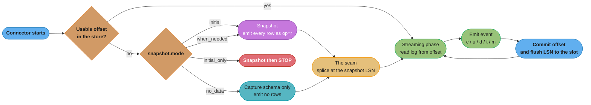
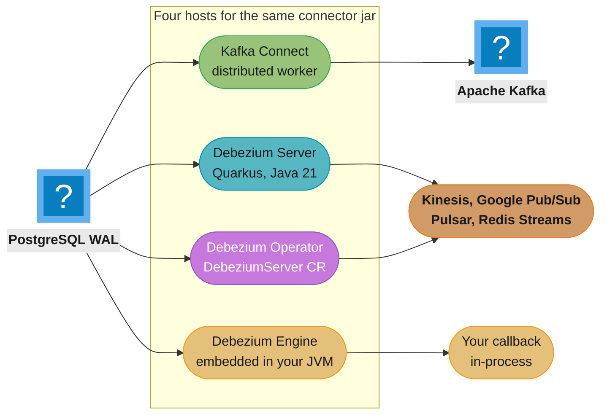
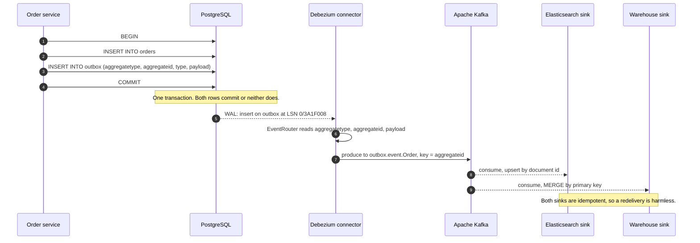

# Debezium — Change Data Capture from the Database Log

> **Version anchor (2026-08-04).** **Debezium 3.6.0.Final** (released 2026-07-01), Apache 2.0, community-governed with Red Hat as the corporate sponsor — it is **not** a CNCF project and has no foundation. Built and tested against **Apache Kafka 4.3.0**. The preceding releases on the current line are **3.5.2.Final** (2026-06-02) and **3.4.3.Final** (2026-03-30); **3.7.0.Alpha1** shipped 2026-07-30 as the current preview. Building Debezium from source requires **Java 21**; the connector runtime baseline is **Java 17**, while Debezium Server, the Debezium Operator and the Quarkus Outbox extension each require **21**. Support floors moved recently: **PostgreSQL 13 was dropped `[3.4.0.Alpha1]`** (DBZ-9376) and **MySQL 5.7 `[2.5.0.Alpha2]`** (DBZ-6874). Version-gated behaviour is tagged inline as `[3.6]`, `[3.4]`, `[3.0]`, `[2.6]`, `[Kafka 3.3]`, `[MySQL 8.4]`, and wherever a property or a value was *removed* this page names the release that removed it — a removal is what silently breaks a config copied from a two-year-old blog post.

Debezium turns a database's own replication log into a stream of row-level change events. It does not poll, it does not add triggers, and it does not ask your application to publish anything: it connects to PostgreSQL as a logical replication client, to MySQL as a replica, to Oracle through LogMiner, to MongoDB through a change stream, and re-emits what the database already wrote down for its own durability. Everything else on this page — snapshots, offsets, replication slots, schema history, heartbeats — exists to answer two questions and only two: **where do I start reading**, and **can I keep reading**.

---

## 1. Concept Overview

### What Debezium is

Debezium is a family of **source connectors** plus the runtimes that host them. A connector attaches to one database, produces a consistent picture of the rows that already exist (the *snapshot*), then switches to tailing that database's transaction log (the *streaming* phase) and emits one structured event per row change, forever, resuming from a recorded position after any restart.

The change event is not a diff and not a notification. It is a self-describing record carrying the **before** image, the **after** image, an **operation code**, and a **source block** naming the database, schema, table, transaction, log position and commit timestamp that produced it. A consumer that has never seen your schema can still tell that row `orders.id = 4711` went from `status = PENDING` to `status = SHIPPED` at a specific LSN inside a specific transaction.

What makes CDC from the log different from every alternative is that **the log is the database's own record of what committed**. A trigger fires inside your transaction and can be rolled back with it. A polling query sees the state at poll time and misses anything that changed twice in between. An application-level publish is a second write to a second system. The log has already been written, has already been fsynced, and is already in commit order — reading it adds nothing to the commit path and cannot disagree with the database.

### The thesis of this page: Debezium is a log reader with a snapshot problem

Reading a log is easy. Every hard thing about Debezium is a *position* problem:

- The log does not go back to the beginning of time, so you need an initial snapshot — and a snapshot of a live database has to be stitched onto the log with no gap and no unbounded duplicate window.
- The log position you last read has to survive a crash, a redeploy, a rebalance and a cluster migration, so there is an **offset** store.
- On MySQL, Oracle and SQL Server the log records *row images against a schema*, not against column names, so replaying old log entries needs the schema **as it was then** — hence a **schema history**.
- The database will happily discard log segments you have not read yet unless something holds them, so on PostgreSQL there is a **replication slot**, and a slot that stops advancing is the single most dangerous object this technology creates.

Ninety percent of §6 and the whole of §10 fall out of those four sentences. When you are debugging Debezium at 3 a.m., the question is almost never "is it reading correctly" — it is *"what position does it think it is at, and why can it not move past it."*

### The guarantee, stated precisely

CDC's guarantee is not "you get the changes". It is:

> **You get the changes in commit order, at least once, starting from a position you can name.**

Every operational problem is a violated clause of that sentence. Out-of-order downstream state is the *commit order* clause meeting a multi-partition topic. Duplicate side effects are the *at least once* clause meeting a non-idempotent consumer. A four-terabyte re-snapshot is the *position you can name* clause meeting a lost offset. Memorise the sentence; it is the fastest triage tool on this page.

### Disambiguation — four things called Debezium

| Name | What it is | Relationship to this page |
|---|---|---|
| **Debezium** (upstream) | The Apache 2.0 community project at `debezium.io` and `github.com/debezium`, released as `3.6.0.Final`. | **This page.** |
| **Red Hat build of Debezium** | A downstream, separately versioned product shipped inside **Streams for Apache Kafka**, with its own release cadence, its own supported-connector subset and its own lifecycle dates. | A *distribution* of the upstream code. Its version numbers do not line up with upstream's, and a feature present upstream may sit outside the supported set. |
| **Debezium Server** | A standalone **Quarkus** application that runs one connector through the embedded engine and writes to a non-Kafka sink — Kinesis, Google Pub/Sub, Pulsar, Redis Streams, NATS, HTTP and others. Requires Java 21. | A *runtime*, §4.1. No Kafka Connect and no Kafka involved. |
| **Debezium Platform** | The web UI and control layer — a **Conductor** backend plus a **Stage** front end — that replaced the archived `debezium-ui` project. | Manages **Debezium Server** pipelines, **not** Kafka Connect. The `debezium-ui` repository was **archived on 2025-09-17**; there is no maintained UI for a Connect-hosted Debezium there. |

The last row is the one that catches people. Teams running Debezium on Kafka Connect go looking for "the Debezium UI", find the Platform, deploy it, and discover it drives a different runtime entirely. For Kafka Connect the management surface is the Connect REST API plus whatever console your Kafka distribution ships.

### The connector family, and what each one reads

| Connector | What it reads | The position it records |
|---|---|---|
| **PostgreSQL** | Logical decoding output from the WAL, through a replication slot and an output plugin | LSN |
| **MySQL / MariaDB** | The row-based binlog, by registering as a replica | Binlog file plus offset, or a GTID set |
| **MongoDB** | A change stream — server-side, resumable, built on the oplog | Resume token |
| **Oracle** | LogMiner against the redo and archive logs, or XStream, or OpenLogReplicator | SCN |
| **SQL Server** | The CDC change tables that SQL Server's own capture job populates | LSN |
| **Db2, Informix, Cassandra, Spanner, Vitess, JDBC-based** | Product-specific log or change-table mechanisms | Product-specific |

They share a very large amount of machinery — the same envelope, the same snapshot modes, the same signalling subsystem, the same SMTs, the same offset and metrics plumbing — and differ exactly where the underlying log differs. This page uses **PostgreSQL as the worked example**, because its failure mode (the slot) is the one that takes a production database down, and calls out the MySQL, Oracle, SQL Server and MongoDB divergences where they matter.

### Licence, governance and the vendor question

Debezium is **Apache License 2.0**, developed in the open at `github.com/debezium`, with **Red Hat** employing most of the core maintainers and sponsoring the project. It has **not** been donated to a foundation — not CNCF, not the Apache Software Foundation — so the trademark and the `debezium.io` domain sit with the sponsor rather than with a neutral body.

That matters in two practical places. First, the roadmap is heavily influenced by one company, which is a real governance consideration for a component you are attaching to your primary database's replication interface. Second, the *supported* artifact for an enterprise buying support is the Red Hat build, not the upstream jar, and the two are not interchangeable for the purposes of a support contract.

### A short history

| Year | Event |
|---|---|
| 2016 | Started at Red Hat as a Kafka Connect source-connector project — MySQL first, then MongoDB and PostgreSQL |
| 2019 | Netflix publishes **DBLog**, a watermark-based CDC framework, after evaluating Debezium among others. Its **watermark technique for chunked snapshots was later adopted by Debezium** as incremental snapshots. The direction of influence is DBLog to Debezium, which is worth stating plainly because the common shorthand "Netflix uses Debezium" reverses it. [`backend/kafka_deep_dive`](../../backend/kafka_deep_dive/kafka_deep_dive.md) owns that story |
| 2021 | **Incremental snapshots** ship, retiring the "stop the world to add a table" constraint that had defined CDC operations until then |
| 2022 | **Debezium Server** matures as a Kafka-free runtime, and the outbox `EventRouter` SMT becomes the default answer to dual writes |
| 2024 | The 2.x line consolidates: `wal2json` gone, MongoDB oplog capture gone, and `ts_ms` corrected to commit time `[2.6.0.CR1]` |
| 2025 | Docker Hub publishing **stops** `[3.0.1.Final]` (DBZ-8327) and images move to `quay.io/debezium/*`; the `debezium-ui` repo is **archived (2025-09-17)** in favour of Debezium Platform |
| 2026 | **3.6.0.Final** (2026-07-01) against Kafka 4.3.0. `AsyncEmbeddedEngine` is the only engine implementation `[3.2.0.Alpha1]`; PostgreSQL 13 support dropped `[3.4]`; Oracle's `redo_log_catalog` strategy deprecated `[3.6.0.Beta1]` for removal in 3.7 |

### Where Debezium sits, and what it displaces

Debezium is almost never introduced into a greenfield system. It arrives to replace something, and which something it replaces determines which half of this page matters to you.

| What it replaces | Who introduces it | Which sections matter most |
|---|---|---|
| A **nightly ETL** feeding derived stores | A platform or data team chasing freshness | §4.3 snapshots, §6.13 ordering, §14 |
| **Dual writes** from application code to a broker | A backend team that has been burned by divergence | §6.16 outbox, §8.5, §8.7 |
| **Timestamp polling** (`WHERE updated_at > :last`) | Whoever discovered it silently misses deletes | §8.1, §6.15 tombstones |
| A **hand-rolled binlog reader** somebody wrote in 2019 | The person who inherited it | §6.7–§6.12, all of §10 |
| **Nothing** — a new read model, a new service boundary | An architect drawing a diagram | §8.5, §9, and the honesty of §8.7's caveat |

The middle two rows are where Debezium's reputation comes from, and the last row is where it is most often over-applied. Reaching for a connector, a slot and a Connect cluster to deliver an event nobody would miss is the most common way this technology becomes a liability rather than an asset.

### What Debezium is not

- **Not a replication tool between two databases of the same kind.** If you want a PostgreSQL standby, use physical streaming replication. Debezium exists to get changes *out* to something that is not a copy of the source.
- **Not exactly-once by default.** It is at-least-once, and the exactly-once path is narrow and expensive (§6.18).
- **Not an ETL engine.** It emits row changes. Joins, aggregation and enrichment belong to a stream processor downstream.
- **Not a way to avoid understanding your database's log.** Every serious Debezium incident is a database incident wearing a connector's name.
- **Not free on the source side.** Logical decoding burns CPU on the PostgreSQL primary, `binlog_row_image=FULL` inflates MySQL binlog volume, and Oracle LogMiner is genuinely expensive. The log is already written; decoding it is not free.

---

## 2. Intuition

**One-line analogy.** Debezium is a stenographer sitting inside the database's own transaction log: it does not interview the witnesses, it reads the transcript the court already keeps — and its entire job is remembering which line it read last.

**The mental model.** Picture a tape the database appends to on every commit, and a read head parked somewhere along it. Debezium is the read head. Three facts about the tape explain everything:

1. **The tape is finite.** The database recycles old segments. If your read head is too far back, the tape it needs is gone, permanently. A PostgreSQL replication slot is a clamp preventing recycling ahead of the head — the clamp is what protects you and also what fills your disk.
2. **The head's position must be written down somewhere else.** If Debezium forgets where it was, it cannot ask the tape, because the tape has no notion of who read what. That somewhere else is the offset store, and losing it costs a full re-snapshot.
3. **The tape only starts where it starts.** Rows written before the oldest surviving segment are invisible to it. That is the entire reason snapshots exist, and the entire reason they are hard: you have to photograph a moving subject and splice the photograph onto the film with no visible seam.

**Why it matters.** Every system that is not the system of record — the search index, the cache, the warehouse, the feature store, the audit trail, the second service's local copy — needs to learn about changes. The naive answer is to have the application tell them, which means two writes to two systems with no shared transaction and no retry strategy that closes the window between them (§8.7). CDC replaces two unreliable writes with one reliable read.

**The key insight.** *The database has already solved durable ordered logging for you.* Replication logs exist because the database needs them to survive a crash and to feed replicas — fsynced, in commit order, complete. CDC is not building a new guarantee, it is borrowing one that has already been paid for. The corollary is the uncomfortable half: because you are borrowing the database's own mechanism, your consumer's health is now coupled to the database's health. A stalled Debezium connector is not a stalled pipeline. It is a growing WAL on your primary.

---

## 3. Core Principles

1. **The log is the source of truth, and it is already ordered.** Debezium never invents an order. It emits events in the order the database committed them, per source. Anything that reorders downstream — partitioning, parallel consumers, multiple topics — is your choice, not the log's.

2. **Position is state, and it lives outside the database.** The connector's entire memory is `(offset, schema history)`. Both are Debezium's own storage, not the source database's. Treating them as durable production data — replicated, backed up, monitored — is the difference between a five-minute restart and a four-terabyte re-snapshot.

3. **At-least-once is the contract; idempotency is your job.** A connector can crash after writing an event and before committing its offset, so the event is re-emitted. Every consumer must upsert or must dedupe. Designing for at-least-once is cheap; retrofitting it after a duplicate ships money out the door is not.

4. **Snapshot and stream are two different programs with one seam.** The snapshot reads rows, streaming reads the log, and the correctness of the whole system is the correctness of the seam between them. That is why snapshot modes and the incremental-snapshot watermark algorithm take so much of §6.

5. **Nothing may hold the log open indefinitely.** A replication slot whose consumer stopped is a disk-fill timer on your primary. This principle is why `heartbeat.interval.ms`, `flush.lsn.source`, `max_slot_wal_keep_size` and slot-lag alerting exist, and why "the connector is paused for the deploy" is a sentence with a deadline attached to it.

6. **Schema evolution is a first-class event, not an exception.** Columns get added, types get widened, tables get renamed. Debezium tracks DDL and emits events against the schema in force at that log position. Consumers assuming a fixed shape break on the first `ALTER TABLE`; consumers built on a schema registry with compatibility rules do not.

7. **The defaults are tuned for a demo, not for your database.** `plugin.name=decoderbufs`, `heartbeat.interval.ms=0`, `snapshot.max.threads=1`, `tombstones.on.delete=true` and `decimal.handling.mode=precise` are all reasonable choices for the project and wrong choices for most production deployments. Read §6.1 line by line before shipping.

8. **Capture the smallest surface that answers the question.** A `table.include.list` scoped to one outbox table means the WAL retained behind a stalled slot is bounded by *outbox traffic*, not by every write in the database. Scope is a reliability control, not a tidiness preference.

---
## 4. Types / Architectures / Strategies

### 4.1 The four runtimes — the same connector jar in four different hosts

A Debezium connector is a Java class implementing Kafka Connect's `SourceTask`. What differs between deployments is who calls it and where its output goes.

| Runtime | What it is | Offsets and schema history live in | Sink | Scaling unit |
|---|---|---|---|---|
| **Kafka Connect** (distributed) | The mainstream deployment. A Connect cluster hosts the connector as a task; Connect owns offset commit, config, status and REST management. | Kafka topics (`connect-offsets`, `connect-configs`, `connect-status`) plus the connector's own schema-history topic | Kafka | One connector per source database; the cluster gives you supervision and failover, not parallelism (§6.19) |
| **Debezium Server** | A standalone Quarkus app wrapping the embedded engine, configured with a properties file, requiring **Java 21**. | Local files by default, or Redis, or Kafka | Kinesis, Google Pub/Sub, Apache Pulsar, Redis Streams, NATS JetStream, RabbitMQ, HTTP, Infinispan, and more | One process per pipeline; you supply the supervision |
| **Debezium Engine** (embedded) | The `debezium-embedded` library called from your own JVM application. `AsyncEmbeddedEngine` has been the only implementation since `[3.2.0.Alpha1]`. | Whatever you configure — a file, a database table, Redis, Kafka | Your own callback | Your application's lifecycle |
| **Debezium Operator + Platform** | A Kubernetes operator reconciling a `DebeziumServer` CR, with the Platform (Conductor + Stage) as the UI and control layer over it. | As configured on the CR | As configured | One CR per pipeline |

**Choosing between them is mostly a Kafka question.** If Kafka is already the backbone, Kafka Connect is the answer: offset management, restart-on-failure, rolling upgrades and a REST API you do not have to write. If the destination is Kinesis or Pub/Sub and Kafka would exist solely to carry CDC, Debezium Server removes an entire distributed system from the diagram — at the cost of owning supervision, offset durability and back-pressure yourself. The embedded engine is for the narrow case where the consumer *is* the application and an intermediate broker adds only latency.

The trap in the non-Kafka runtimes is that **the offset store degrades quietly**. Connect stores offsets in a replicated compacted Kafka topic. Debezium Server's default is a file on local disk, which on a Kubernetes pod without a persistent volume means the offset is destroyed on every reschedule, and the connector re-snapshots. Configure Redis or a Kafka offset store, or mount a real volume — this is the most common Debezium Server production defect.

### 4.2 The capture-mechanism taxonomy — how each database exposes its log

The connector families differ because the databases differ, and the differences drive real operational consequences.

| Mechanism | Databases | How Debezium attaches | The operational hazard it creates |
|---|---|---|---|
| **Logical decoding** | PostgreSQL | Registers as a logical replication client on a **replication slot** with an output plugin | The slot pins WAL. A stalled connector fills the primary's disk (§6.3, §10.1) |
| **Replica protocol** | MySQL, MariaDB | Registers as a replica and reads the **binlog** | Binlog **expiry** (`binlog_expire_logs_seconds`, default 30 days on MySQL 8) — miss the window and the position is unrecoverable |
| **Change stream** | MongoDB | Opens a resumable **change stream**; `capture.mode` defaults to `change_streams_update_full`. Oplog capture was **removed `[2.0.0.Alpha2]`** (DBZ-4951) | The oplog is a capped collection. Down longer than the oplog window and the resume token expires — full re-snapshot |
| **Log mining** | Oracle | `database.connection.adapter` selects **`LogMiner`** (default), `LogMiner_Unbuffered`, `XStream` or `OLR` (OpenLogReplicator) | LogMiner is CPU- and I/O-expensive on the source; XStream requires a **GoldenGate licence** |
| **Vendor change tables** | SQL Server | Reads the change tables SQL Server's own capture job writes. The default switched to **direct query mode `[3.4.0.Alpha2]`** (DBZ-9394) | You now depend on the SQL Server Agent capture and cleanup jobs as well as on Debezium |

**Oracle's `log.mining.strategy`** deserves its own row because it changes what the connector needs from the database: `online_catalog` (fast, but cannot decode DDL that happened before the current dictionary), `hybrid`, `dictionary_from_file`, and `redo_log_catalog` — the last of which is **deprecated `[3.6.0.Beta1]` with removal scheduled for 3.7**. If a runbook you inherited names `redo_log_catalog`, it has an expiry date.

### 4.3 Snapshot strategies — the modes, and the two that were removed

`snapshot.mode` decides what happens on the very first start and, for some values, on any start with no usable offset. The PostgreSQL set `[3.6]`:

| Mode | Schema captured | Rows emitted as `r` | Then streams | Use when |
|---|---|---|---|---|
| **`initial`** (default) | yes | yes | yes | Greenfield. The consumer needs full current state |
| **`no_data`** | yes | **no** | yes | The rows are already at the destination by some other means — a `pg_dump`, a bulk copy, a warehouse load |
| **`initial_only`** | yes | yes | **no** | A one-shot export. The connector stops after the snapshot |
| **`when_needed`** | yes | yes | yes | Re-snapshot automatically whenever the recorded offset is no longer usable. Convenient, and a loaded gun on a large database |
| **`always`** | yes | yes | yes | Snapshot on **every** start. Test environments and small reference tables only |
| **`configuration_based`** | per property | per property | per property | Fine-grained control via `snapshot.mode.configuration.based.*` properties |
| **`custom`** | your code | your code | your code | A `Snapshotter` implementation you supply |

The binlog family (MySQL, MariaDB) adds **`recovery`**, which rebuilds a lost or corrupted **schema-history topic** from the current schema without re-reading rows. It is the answer to exactly one problem (§6.12) and it is only safe if no DDL has occurred since the last recorded offset.

**Two removals that break old configs.** `schema_only` and `schema_only_recovery` were **removed `[3.3.0.Alpha1]`** (DBZ-8171) — their replacements are `no_data` and `recovery`. `never` was **removed for MySQL `[3.6.0.Alpha2]`** (DBZ-1832); it was an older spelling of `no_data`. A config carrying any of the three fails to start, which is at least loud. What is *not* loud is a runbook that still tells an operator to set them.

**There is no property that hands the connector a starting LSN, SCN or binlog position.** This is the single most common wrong mental model, and it costs a full re-snapshot every time (§10.4). On PostgreSQL the position is carried by the **slot**, so the sequence is: create the slot (it pins the current LSN), do the bulk copy, then start the connector with `snapshot.mode: no_data`. [`devops/case_studies/design_zero_downtime_infra_migration`](../../devops/case_studies/design_zero_downtime_infra_migration.md) works that exact sequence at 200 TB scale; this page owns the general mechanic.

### 4.4 Incremental snapshots — the chunked, non-blocking alternative

An initial snapshot is a stop-the-world event: nothing streams until it finishes, and on a large table that is hours. An **incremental snapshot** interleaves chunks of a table read with the live change stream, so the connector never stops streaming and can be interrupted and resumed at any point.

| Property | Default | What it controls |
|---|---|---|
| `incremental.snapshot.chunk.size` | **1024** | Rows read per chunk. Bigger chunks mean fewer round trips and a longer window in which a chunk's rows can be superseded |
| `incremental.snapshot.watermarking.strategy` | `INSERT_INSERT` | `INSERT_INSERT` writes an open and a close marker to the signal table; `INSERT_DELETE` writes the open marker and deletes it, leaving no accumulating rows |
| `signal.data.collection` | — | The table Debezium reads signals from and writes watermarks into |

`INSERT_DELETE` exists because `INSERT_INSERT` leaves two rows per chunk in the signal table forever — on a billion-row table at 1,024 rows per chunk that is roughly two million rows of debris. Use `INSERT_DELETE` unless something downstream is reading the signal table's history.

The mechanism is the **watermark technique from Netflix's DBLog**, and §6.8 works through the algorithm. The property that makes it operationally valuable is that a *new table can be backfilled into an existing pipeline without stopping it* — you send a signal, and the chunks arrive interleaved with live traffic.

### 4.5 The change-event envelope — one shape for every connector

Every Debezium change event value is an `Envelope` with these fields (from `Envelope.java`):

| Field | Meaning |
|---|---|
| `before` | Row image before the change. `null` for creates, and `null` for updates and deletes unless the source is configured to provide it (§6.5) |
| `after` | Row image after the change. `null` for deletes |
| `op` | The operation code |
| `source` | Provenance block |
| `transaction` | Transaction id, total event count and per-data-collection order, when transaction metadata is enabled |
| `ts_ms` / `ts_us` / `ts_ns` | When the **connector processed** the event, at three precisions |

The operation codes are `r`, `c`, `u`, `d`, `t` and `m`:

| `op` | Name | Emitted when |
|---|---|---|
| `r` | read | A snapshot row. Not a change — a photograph of existing state |
| `c` | create | INSERT |
| `u` | update | UPDATE |
| `d` | delete | DELETE |
| `t` | truncate | TRUNCATE, where the source and connector support it |
| `m` | message | A logical decoding message — PostgreSQL `pg_logical_emit_message`, not tied to a table |

The `source` block carries `version`, `connector`, `name`, `ts_ms`, `ts_us`, `ts_ns`, `snapshot`, `db`, `schema`, `table`, `collection` and `sequence`, plus connector-specific position fields (`lsn` for PostgreSQL, `file`/`pos`/`gtid` for MySQL, `scn` for Oracle).

**`source.ts_ms` is the COMMIT timestamp since `[2.6.0.CR1]`** (DBZ-7628). Before that release it was the transaction's *begin* time. This is a semantic change to a field many pipelines use as their event time and as their conflict-resolution version, and it is invisible on upgrade: nothing errors, the numbers just mean something slightly different. On a long transaction the two can differ by minutes.

Distinguish it from the envelope's own top-level `ts_ms`, which is **when Debezium processed the record**, not when the database committed it. `source.ts_ms` minus the envelope `ts_ms` is your end-to-end capture lag, and confusing the two produces a lag metric that is always zero.

### 4.6 The transformation taxonomy — what an SMT is for, and which ones matter

Single Message Transforms run inside the connector's task, per record, before the record reaches the converter. The Debezium-supplied ones fall into four groups:

| Group | SMTs | What they are for |
|---|---|---|
| **Shape** | `ExtractNewRecordState`, `ExtractNewDocumentState` (MongoDB) | Flatten the envelope down to just the `after` image, for sinks that cannot parse a nested envelope (§6.15) |
| **Route** | `EventRouter` (outbox), `ByLogicalTableRouter`, `PartitionRouting` | Decide the topic and the partition a record lands on (§6.16, §6.14) |
| **Filter / select** | `Filter`, `ContentBasedRouter` | Drop or redirect records using a scripting expression. Both require a scripting engine on the classpath |
| **Enrich / redact** | `HeaderToValue`, `TimezoneConverter`, `SchemaChangeEventFilter`, field-level masking and truncation | Add provenance to the value, normalise time zones, mask a column, cap a string's length |

**SMTs are per-record and single-threaded inside the task.** A scripting SMT that costs a millisecond per record caps the connector at roughly 1,000 records per second regardless of how fast the database or Kafka is. Filtering is far cheaper done with `table.include.list` and `column.include.list`, which never materialise the record at all.

### 4.7 Sink-side topologies — four shapes, and what each buys

| Topology | Shape | Buys you | Costs you |
|---|---|---|---|
| **Direct connector-to-sink** | Debezium source connector then a sink connector in the same Connect cluster, over Kafka topics | Nothing to write. The Debezium JDBC sink connector, the Elasticsearch sink and the ClickHouse sink cover most cases | Transformation power is limited to SMTs |
| **Stream processor in the middle** | Debezium then Kafka Streams, Flink CDC or ksqlDB, then a sink | Joins, aggregation, windowing, enrichment against other topics | A second distributed system to operate |
| **Custom consumer** | Debezium then your own consumer applying idempotent upserts | Full control of the write, the retry policy and the dedupe key | You own idempotency, ordering and back-pressure |
| **Lakehouse ingest** | Debezium then a table-format writer into Apache Iceberg, Delta Lake, Apache Hudi or Apache Paimon | Warehouse-native CDC with time travel and merge-on-read | Small-file management and compaction become your problem |

**Flink CDC deserves a specific note** because it competes with the whole topology rather than sitting inside one: it embeds Debezium's connectors directly in a Flink job, so there is no Kafka Connect and often no Kafka. That is a strictly better shape when Flink already exists and the pipeline is source-to-sink with transformation; it is a worse shape when many independent consumers need the same change stream, because you have lost the durable fan-out log.

### 4.8 Delivery-semantics taxonomy

| Semantics | How you get it | The catch |
|---|---|---|
| **At-least-once** | The default, everywhere | Duplicates on any restart between emit and offset commit. Consumers must be idempotent |
| **At-least-once with dedupe downstream** | Consumer keys on `(source.lsn)` or the primary key plus `source.ts_ms` | Requires state at the consumer, and a retention window for it |
| **Effectively-once via idempotent writes** | Upsert on primary key; reject events with an older `source.ts_ms` | The pragmatic production answer for almost everybody |
| **Exactly-once (Kafka Connect)** | Kafka Connect's KIP-618 source-connector EOS, **Kafka 3.3+**, `exactly.once.support=required` and **`transaction.boundary=poll`** | Transactional writes, lower throughput, more operational surface, and it only covers the hop into Kafka — nothing about your consumer (§6.18) |

The honest summary: **build idempotent consumers**. Exactly-once into Kafka does not make your Elasticsearch write exactly-once, and the effort is almost always better spent on the upsert.

---
## 5. Architecture Diagrams

### 5.1 The two-phase lifecycle, and the one decision that drives it



*The only branch that matters is the first one: a usable offset skips everything on the left. Every "why is it re-snapshotting" incident is that diamond answering "no" when you expected "yes". `initial_only` is the one terminal state — the connector finishes and stops, which surprises operators who expect it to carry on.*

### 5.2 What a PostgreSQL replication slot actually pins (ASCII — the axis carries the meaning)

```
WAL, oldest on the left, newest on the right. Each block is one 16 MB segment.

  recycled          RETAINED BY THE SLOT — cannot be recycled          being written
 <-------->  <------------------------------------------------->  <--------------->
 +----+----+----+----+----+----+----+----+----+----+----+----+----+----+----+----+
 | .. | .. | 41 | 42 | 43 | 44 | 45 | 46 | 47 | 48 | 49 | 50 | 51 | 52 | 53 | 54 |
 +----+----+----+----+----+----+----+----+----+----+----+----+----+----+----+----+
            ^              ^                                            ^
            |              |                                            |
      restart_lsn   confirmed_flush_lsn                        pg_current_wal_lsn()
      "resume here  "the consumer told me                      "the database is
       after a       it durably has everything                  here right now"
       crash"        before this point"

            |<---------------- slot lag = 13 segments = 208 MB ---------------->|

 catalog_xmin rides along: it pins the oldest transaction id whose CATALOG rows
 autovacuum may not remove, because decoding old WAL needs the old catalog.
 That is why a stuck slot also stops table bloat from being cleaned up.
```

*Three numbers, three different failures. `restart_lsn` not advancing is the disk-fill risk. `confirmed_flush_lsn` not advancing means the consumer is not acknowledging (§6.4). `catalog_xmin` not advancing means autovacuum cannot clean catalog bloat, which is the slow, quiet version of the same incident. Query all three from `pg_replication_slots`; alerting on only one of them is the usual gap.*

### 5.3 The incremental-snapshot watermark window (ASCII — the interleaving is the point)

```
Time, left to right. The connector interleaves chunk reads with the live log stream.

  log stream:  ... u(k7) ---- u(k3) -------- u(k42) ---- d(k9) ---- u(k3) ...
                     |          |               |          |          |
  signal table:      |     [LOW WATERMARK]      |          |   [HIGH WATERMARK]
                     |          |               |          |          |
  chunk read:        |          +--- SELECT rows k1..k50 --+          |
                     |                                                |
                     v                                                v
                deduplicate window ---------------------------------->

  Rule: any row in the chunk whose key ALSO appeared in the log between the low
        and high watermark is DROPPED from the chunk. The log event is newer and
        already correct, so the chunk's photograph of it is stale by definition.

  chunk keys      : k1 k2 k3 ... k9 ... k42 ... k50
  seen in window  :       k3      k9      k42
  emitted as op=r : k1 k2 __  ... __  ... ___ ... k50      (3 rows suppressed)
```

*This is Netflix's DBLog watermark technique, adopted by Debezium. It needs no table lock and no stopped stream: correctness comes from the fact that a log event inside the window is unconditionally newer than the chunk row for the same key. The cost is two writes to the signal table per chunk — which is exactly what `INSERT_DELETE` watermarking exists to clean up.*

### 5.4 The four runtimes, one connector



*The connector code is identical in all four. What changes is who commits the offset and where it is stored — and that is precisely where the non-Kafka runtimes get you: Connect's offset topic is replicated and compacted by default, while Debezium Server's default is a local file that a pod reschedule destroys.*

### 5.5 Losing your position — the four-quadrant recovery map (ASCII — the grid is the point)

```
                        SCHEMA HISTORY
                 intact                    lost
              +--------------------+--------------------+
              |                    |                    |
     intact   |  Nothing to do.    |  snapshot.mode     |
              |  Restart resumes   |  = recovery        |
              |  from the offset.  |  ONLY IF no DDL    |
  O           |                    |  since the offset. |
  F           +--------------------+--------------------+
  F           |                    |                    |
  S    lost   |  Full re-snapshot. |  Full re-snapshot. |
  E           |  The log position  |  Both halves gone; |
  T           |  is unknowable.    |  start from zero.  |
  S           |                    |                    |
              +--------------------+--------------------+

              +----------------------------------------+
              |  SLOT LOST (PostgreSQL)                |
              |  = DATA LOSS.                          |
              |  Dropping the slot frees the WAL, and  |
              |  Postgres recycles it. A new slot      |
              |  starts at the CURRENT LSN. Everything |
              |  between the old restart_lsn and now   |
              |  is gone from the log, forever.        |
              |  Only a re-snapshot restores state --  |
              |  and it cannot restore the individual  |
              |  EVENTS, only the final row values.    |
              +----------------------------------------+
```

*Three of the four quadrants are recoverable inconvenience. The fifth box is the one that is not: a dropped slot is unrecoverable event loss, because a re-snapshot gives you the current row values and can never reconstruct the intermediate transitions a downstream audit log or a materialised counter needed. `DROP REPLICATION SLOT` on a busy primary during an incident is the most expensive single command in this technology.*

### 5.6 Outbox end to end, one transaction to two sinks



*The single transaction at the top is the whole argument. Note what is absent: the application never talks to Kafka, so there is no window in which one system accepted the write and the other did not. The `EventRouter` SMT is what turns an outbox row into a domain event on a domain-named topic — [`database/polyglot_persistence_patterns`](../../database/polyglot_persistence_patterns/polyglot_persistence_patterns.md) owns the pattern argument; §6.16 here owns the SMT's defaults and mechanics.*

---
## 6. How It Works — Detailed Mechanics

Every subsection below is one of the two questions from §1: *where do I start* (6.7–6.12) or *can I keep reading* (6.2–6.6, 6.19). The rest is shaping what comes out.

### 6.1 The annotated PostgreSQL connector configuration

Every value below is the **real default** read from `PostgresConnectorConfig.java` at `v3.6.0.Final`, not a placeholder. Comments mark the ones you must change.

```json
{
  "name": "orders-pg-connector",
  "config": {
    "connector.class": "io.debezium.connector.postgresql.PostgresConnector",

    "database.hostname": "pg-primary.internal",
    "database.port": "5432",
    "database.user": "debezium",
    "database.password": "${file:/opt/secrets/pg.properties:password}",
    "database.dbname": "shop",

    "topic.prefix": "shop",

    "plugin.name": "pgoutput",
    "slot.name": "debezium",
    "publication.name": "dbz_publication",
    "publication.autocreate.mode": "filtered",

    "table.include.list": "public.outbox",

    "snapshot.mode": "initial",
    "snapshot.locking.mode": "none",
    "snapshot.max.threads": "4",

    "heartbeat.interval.ms": "10000",
    "heartbeat.action.query": "INSERT INTO dbz_heartbeat (id, ts) VALUES (1, now()) ON CONFLICT (id) DO UPDATE SET ts = now()",

    "flush.lsn.source": "true",
    "status.update.interval.ms": "10000",
    "lsn.flush.timeout.action": "fail",

    "max.queue.size": "8192",
    "max.batch.size": "2048",
    "poll.interval.ms": "500",

    "decimal.handling.mode": "double",
    "time.precision.mode": "adaptive",
    "tombstones.on.delete": "true",
    "skipped.operations": "t",

    "incremental.snapshot.chunk.size": "1024",
    "signal.enabled.channels": "source",
    "signal.data.collection": "public.debezium_signal",
    "signal.poll.interval.ms": "5000",

    "topic.creation.default.replication.factor": "3",
    "topic.creation.default.partitions": "12",
    "topic.creation.default.cleanup.policy": "delete",
    "topic.creation.default.retention.ms": "604800000"
  }
}
```

| Property | **Default** | Set here to | Why |
|---|---|---|---|
| `plugin.name` | **`decoderbufs`** | `pgoutput` | `decoderbufs` is a C extension that must be compiled and installed into the server. **No managed PostgreSQL has it** — not RDS, not Aurora, not Cloud SQL, not Azure Database. `pgoutput` is built into PostgreSQL 10+ and is the only realistic choice. Leaving the default is §10.3, and the failure message does not say "missing plugin" |
| `slot.name` | `debezium` | keep, but make it unique | Two connectors sharing a slot is a corruption scenario. Name it after the connector |
| `publication.name` | `dbz_publication` | keep | Only used with `pgoutput` |
| `publication.autocreate.mode` | **`all_tables`** | `filtered` | `all_tables` creates `FOR ALL TABLES`, which makes the server decode **every** table's WAL and throw most of it away — CPU on the primary for nothing. `filtered` publishes only the tables in your include list. `disabled` means you create the publication yourself, which is what a DBA-gated environment will insist on |
| `snapshot.locking.mode` | `none` | keep | PostgreSQL snapshots use an MVCC repeatable-read transaction, so no table lock is needed. Other connectors differ |
| `snapshot.max.threads` | **1** | 4 | Single-threaded by default. On a multi-table snapshot this is often the entire reason the initial load takes eight hours |
| `heartbeat.interval.ms` | **0 (off)** | 10000 | The default is off, which is the direct cause of §10.2. See §6.4 |
| `flush.lsn.source` | `true` | keep | When true the connector reports its flushed LSN back to PostgreSQL so the slot can advance. Setting it false makes the slot never advance — a deliberate, dangerous option |
| `status.update.interval.ms` | 10000 | keep | How often the standby status update carrying that LSN is sent |
| `lsn.flush.timeout.action` | `fail` | keep | What to do if the flush does not complete in time. `fail` is right in production: a silent `warn` hides a slot that is not advancing |
| `max.queue.size` / `max.batch.size` | 8192 / 2048 | keep | The in-memory queue between the log reader and the Connect poll loop. `max.queue.size` must exceed `max.batch.size`; raise both together for high-throughput sources, and prefer `max.queue.size.in.bytes` when rows are large |
| `poll.interval.ms` | 500 | keep | How long the reader waits when the queue is empty |
| `decimal.handling.mode` | **`precise`** | `double` or `string` | `precise` emits `org.apache.kafka.connect.data.Decimal`, which serialises to **base64 bytes plus a scale** in JSON. That is correct and unreadable, and it is §10.8 |
| `skipped.operations` | **`t`** | keep or `none` | Truncates are skipped by default. If your consumer needs to know about a `TRUNCATE`, set `none` |
| `signal.enabled.channels` | `source` | keep | `source` means the signal table. `kafka` and `jmx` and `file` are the alternatives |
| `signal.poll.interval.ms` | 5000 | keep | How often the signal table is polled |

**Two things the table cannot show.** First, `topic.prefix` is immutable in practice: it is the first component of every topic name *and* part of the offset key, so changing it re-snapshots. Second, `heartbeat.action.query` is separate from `heartbeat.interval.ms` and does a different job — the interval sends a heartbeat *message*, the query performs a *write* to the source database. §6.4 explains why you frequently need both.

### 6.2 Logical decoding, output plugins and publications

PostgreSQL's WAL is a physical redo log: it records "page 42 block 7 changed to these bytes", not "row (4711, 'SHIPPED')". **Logical decoding** is the server-side machinery that reassembles physical WAL records into logical row changes, and an **output plugin** decides the wire format those changes are serialised in.

| Plugin | Status | Notes |
|---|---|---|
| **`pgoutput`** | Built into PostgreSQL 10+ | The only one available on managed PostgreSQL. Requires a **publication**, which is what tells the server which tables to decode |
| **`decoderbufs`** | **The Debezium default**, and a separately compiled C extension | Protobuf output. Faster on paper, unavailable in practice on any managed service |
| **`wal2json`** | **Removed `[2.0.0.Alpha1]`** (DBZ-4156) | Do not carry it forward from an old config |

The publication is the filter. With `publication.autocreate.mode: all_tables` Debezium issues `CREATE PUBLICATION dbz_publication FOR ALL TABLES`, and the server then decodes every table in the database, hands the lot to the connector, and the connector discards everything not in `table.include.list`. The decoding CPU is spent on the **primary** regardless. With `filtered`, the publication names only your tables and the server skips the rest.

The `filtered` mode has one operational consequence worth knowing before it bites: adding a table to `table.include.list` requires the publication to be altered, which Debezium does on restart in `filtered` mode but cannot do without ownership privileges. In an environment where the Debezium role does not own the tables, use `publication.autocreate.mode: disabled` and have the DBA run `ALTER PUBLICATION ... ADD TABLE` as part of the change.

**Prerequisites on the server**, none of which Debezium can set for you:

```sql
-- postgresql.conf
wal_level = logical              -- requires a restart; the single most common blocker
max_replication_slots = 10       -- one per connector, plus headroom
max_wal_senders  = 10            -- one per active slot connection

-- the role
CREATE ROLE debezium WITH LOGIN REPLICATION PASSWORD '...';
GRANT USAGE ON SCHEMA public TO debezium;
GRANT SELECT ON ALL TABLES IN SCHEMA public TO debezium;   -- for the snapshot
ALTER DEFAULT PRIVILEGES IN SCHEMA public GRANT SELECT ON TABLES TO debezium;
```

On managed services `REPLICATION` is granted differently — `rds_replication` on RDS, `cloudsqlsuperuser`-adjacent grants on Cloud SQL, `azure_pg_admin` membership on Azure — and `wal_level` is a parameter-group change plus a reboot, not a config-file edit.

**MySQL's equivalent prerequisites** are `binlog_format=ROW`, `binlog_row_image=FULL` and a `REPLICATION SLAVE, REPLICATION CLIENT` grant. Note that `binlog_format` is **deprecated in MySQL 8.4** precisely because ROW is the only supported future value, so the deprecation warning is telling you that you are already correct. `binlog_row_image=FULL` is not optional if you want a usable `before` image: `MINIMAL` logs only changed columns plus the key, and your `before` block will be mostly nulls.

### 6.3 What a replication slot actually pins

A slot is a server-side object with three fields that matter, all visible in `pg_replication_slots`:

```sql
SELECT slot_name,
       active,
       restart_lsn,
       confirmed_flush_lsn,
       catalog_xmin,
       pg_size_pretty(pg_wal_lsn_diff(pg_current_wal_lsn(), restart_lsn)) AS retained_wal,
       wal_status,          -- reserved | extended | unreserved | lost
       safe_wal_size
FROM pg_replication_slots;
```

| Field | What it pins | The failure when it stops moving |
|---|---|---|
| `restart_lsn` | The oldest WAL the server must keep, because decoding might have to restart there | **Disk fill.** Retained WAL grows without bound until `max_slot_wal_keep_size` intervenes or the volume is full |
| `confirmed_flush_lsn` | The position the consumer has confirmed it durably has | Consumer is not acknowledging. `restart_lsn` follows it, so this stalling first is the early warning |
| `catalog_xmin` | The oldest transaction id whose **catalog** row versions autovacuum may not remove | **Catalog bloat.** `pg_attribute` and friends grow, planning slows, and nothing in your Debezium dashboard mentions it |

`wal_status` is the field to alert on because it is categorical rather than a threshold: `reserved` is healthy, `extended` means the slot is past `wal_keep_size` and relying on `max_slot_wal_keep_size` headroom, `unreserved` means the WAL is about to be removed, and **`lost`** means it already has been and the slot is permanently unusable.

**`max_slot_wal_keep_size`** (PostgreSQL 13+, default `-1` meaning unlimited) is the safety valve: past that many bytes, PostgreSQL invalidates the slot rather than filling the disk. It converts an outage of the database into a re-snapshot of the pipeline, which is almost always the trade you want. Set it. [`database/replication_and_high_availability`](../../database/replication_and_high_availability/replication_and_high_availability.md) and [`database/postgresql_internals`](../../database/postgresql_internals/postgresql_internals.md) own the general slot primitive and the xmin horizon; what this page adds is what *Debezium* does to those three numbers.

### 6.4 Keeping the slot moving — `flush.lsn.source`, heartbeats and the idle-table trap

This is the mechanism that produces the most confusing Debezium incident, so it is worth walking slowly.

The connector advances the slot by sending PostgreSQL a **standby status update** carrying the LSN it has durably processed, every `status.update.interval.ms` (10,000 ms), when `flush.lsn.source` is true (the default). PostgreSQL moves `confirmed_flush_lsn`, then `restart_lsn`, and the WAL behind it becomes recyclable.

The catch: **the connector can only report an LSN it has actually seen.** And logical decoding only hands the connector WAL records for tables in its publication. So consider a database where:

- `table.include.list` is `public.outbox`,
- the outbox is quiet — it is 2 a.m. and nobody is ordering anything,
- but the rest of the database is extremely busy, writing gigabytes of WAL for tables Debezium does not capture.

The connector receives nothing. It has no new LSN to report. `confirmed_flush_lsn` sits still while `pg_current_wal_lsn()` races ahead, and the retained WAL grows at the speed of the *uncaptured* traffic. Every dashboard says the connector is healthy — because it is. It is idle, and idle is the problem.

**`heartbeat.interval.ms` is the fix, and it defaults to 0 (off).** With it set, the connector emits a heartbeat message on its own heartbeat topic on that interval, and critically, sending a heartbeat gives it an occasion to flush the current LSN back to the server even when no captured change has occurred. Ten seconds is a normal value.

**Sometimes the heartbeat alone is not enough**, and this is the subtlety that catches people twice. On some configurations the server has produced no decodable output at all for the slot, so there is nothing for the connector to advance *to*. `heartbeat.action.query` closes that gap by having the connector periodically execute a write **against a captured table** in the source database:

```sql
CREATE TABLE dbz_heartbeat (id int PRIMARY KEY, ts timestamptz NOT NULL);
INSERT INTO dbz_heartbeat (id, ts) VALUES (1, now());
```

with `heartbeat.action.query` set to an upsert on it and `dbz_heartbeat` added to `table.include.list`. That write generates WAL in the publication, the connector decodes it, and it now has a fresh LSN to confirm. The cost is one tiny write every heartbeat interval; the benefit is that the slot cannot silently freeze.

**`lsn.flush.timeout.action`** (default **`fail`**) governs what happens if the flush does not complete within the timeout: `fail` stops the connector loudly, `warn` logs and carries on, `ignore` is silent. Keep `fail`. A connector that cannot flush is a connector that is accumulating WAL on your primary, and you want that to page someone.

**`[3.4]` fixed a real bug here.** DBZ-9641 addressed a case where the PostgreSQL JDBC driver's keepalive interfered with the LSN flush, so a slot could fail to advance on an otherwise healthy connector. If you are on 3.3 or earlier and chasing a slot that will not move despite heartbeats, upgrade before you debug further.

### 6.5 `REPLICA IDENTITY` and the `before` image

PostgreSQL decides how much of the *old* row goes into the WAL on an UPDATE or DELETE, per table, via `REPLICA IDENTITY`. Debezium cannot conjure what the server did not log.

| `REPLICA IDENTITY` | What goes into WAL for UPDATE/DELETE | Debezium's `before` |
|---|---|---|
| **`DEFAULT`** (the default) | Primary-key columns only | `before` contains **only the primary key**; every other field is null |
| `NOTHING` | Nothing | `before` is **`null`** entirely. A DELETE's key comes from nowhere — the connector cannot even build the message key |
| **`FULL`** | The complete old row | `before` is complete. This is what people assume they already have |
| `USING INDEX <ix>` | The columns of a unique, non-partial, `NOT NULL` index | `before` has those columns |

```sql
ALTER TABLE public.orders REPLICA IDENTITY FULL;
```

**The cost is real, which is why it is not the default.** `FULL` writes the entire old row into the WAL on every UPDATE and DELETE. On a wide table under an update-heavy workload this can multiply WAL volume several times over, which means more WAL to archive, more to ship to standbys, more to retain behind your slot and more disk. Set it on the tables whose `before` you genuinely consume — a change-audit trail, a CDC-driven diff, a downstream that needs to know the previous value — and leave the rest at `DEFAULT`.

**A useful consequence for the outbox pattern:** outbox rows are insert-only, so `before` is always null and `REPLICA IDENTITY` is irrelevant. This is one more reason the outbox is cheap.

MySQL's equivalent is `binlog_row_image`: `FULL` gives a complete before image, `MINIMAL` gives changed columns plus the key, `NOBLOB` gives everything except unchanged BLOB and TEXT columns.

### 6.6 TOAST columns and `__debezium_unavailable_value`

PostgreSQL stores oversized field values out of line, in a TOAST table, and **an UPDATE that does not change a TOASTed value does not re-log it**. There is nothing in the WAL for that column, so Debezium has nothing to emit.

Rather than emit `null` — which would be a lie a consumer would happily write to its store, silently erasing the value — Debezium emits a **placeholder**, by default the string `__debezium_unavailable_value`, configurable with `unavailable.value.placeholder`.

The event looks like this:

```json
{
  "op": "u",
  "after": {
    "id": 4711,
    "status": "SHIPPED",
    "description": "__debezium_unavailable_value"
  }
}
```

Three ways to handle it, in order of preference:

1. **Filter it in the consumer.** Treat the placeholder as "no change to this field" and omit the column from your upsert. This is correct, cheap and requires no source change. A sink connector that cannot express a partial update cannot do this, which is when you reach for the other two.
2. **`REPLICA IDENTITY FULL` on that table.** With the full old row logged, the connector can reconstruct the value. This solves it at the cost of §6.5's WAL amplification.
3. **Do not capture the column.** `column.exclude.list` on a large blob column you never consume removes the problem and shrinks every event.

The failure this causes is nasty precisely because it is not an error: a sink that maps `after` straight into an upsert writes the literal string `__debezium_unavailable_value` into a customer-visible description field. It renders, it looks like a bug in the application, and nobody thinks of the CDC pipeline (§10.6). MongoDB has an analogous case in `capture.mode`: anything other than `change_streams_update_full` gives you a partial document rather than a whole one.

### 6.7 The initial snapshot, phase by phase

On PostgreSQL with `snapshot.mode: initial` and `snapshot.locking.mode: none`:

1. **Open the replication slot** if it does not exist. This pins the current LSN — call it `L0`. Everything committed after `L0` is guaranteed to still be in the WAL when streaming begins. This step being *first* is the whole reason the snapshot has no gap.
2. **Begin a `REPEATABLE READ` transaction** and export a snapshot. Every subsequent read in this transaction sees the database as of one consistent instant, and other sessions are not blocked.
3. **Read the schema** of the captured tables.
4. **`SELECT *` each captured table**, in `snapshot.max.threads` parallel streams (default **1**), emitting each row as an event with `op = r` and `source.snapshot = true`.
5. **Commit the read transaction** and switch to streaming from `L0`.

The seam between 1 and 5 is where correctness lives. Because the slot was opened before the snapshot transaction, any change committed *during* the snapshot is both (a) possibly reflected in the snapshot rows, if it happened before the transaction's read point, and (b) definitely present in the WAL from `L0` forward. So a row can be emitted twice — once as `r` and once as `c`/`u`. That is the at-least-once contract doing its job, and it is why idempotent consumers are non-negotiable rather than nice to have.

**`snapshot.max.threads` is the single biggest snapshot lever and it defaults to 1.** Four to eight threads on a multi-table snapshot routinely cuts an eight-hour initial load to under two. The constraint is the source's I/O and connection budget, not Debezium.

Other connectors differ where their MVCC does. MySQL's snapshot has real locking modes (`minimal`, `minimal_percona`, `extended`, `none`), and `none` on MySQL is only safe if the schema cannot change during the snapshot. On PostgreSQL, `none` is safe by construction because of MVCC — which is why it is the default there.

### 6.8 Incremental snapshots — the watermark algorithm

The initial snapshot answers "how do I start". Incremental snapshots answer the far more common operational question: *"we need to add a table / re-read a table / backfill a column, and we cannot stop the pipeline."*

The algorithm, per chunk:

1. Read the next chunk's key range from the last-processed key: `SELECT * FROM t WHERE pk > :last ORDER BY pk LIMIT 1024`.
2. Write a **low watermark** to the signal table. This produces a WAL record, so it appears in the change stream at a known position.
3. Execute the chunk `SELECT`.
4. Write a **high watermark** to the signal table.
5. Buffer the chunk. As the log stream is consumed, note every key that appears in it between the low and high watermarks.
6. **Remove from the chunk every key seen in that window**, then emit the survivors as `r` events.
7. Repeat.

**Why the dedupe is correct.** A key that changed inside the window has a log event that is, by construction, at a later position than the chunk's read. Emitting the chunk row would overwrite newer state with older state. Dropping it is not lossy, because the log event carries the current value and is emitted anyway.

**Why this needs no locks.** Correctness comes entirely from the ordering of the two watermark records relative to the chunk read in the log. Nothing is locked, nothing is blocked, and the live stream is never paused.

**The properties that matter operationally:**

| Property | Default | Trade |
|---|---|---|
| `incremental.snapshot.chunk.size` | **1024** | Larger chunks reduce round trips and signal-table churn but widen the dedupe window, so more chunk rows get suppressed and re-delivered via the log. 1024 to 10240 is the useful band |
| `incremental.snapshot.watermarking.strategy` | `INSERT_INSERT` | `INSERT_DELETE` deletes the low watermark instead of leaving it, keeping the signal table from accumulating two rows per chunk forever |
| `signal.poll.interval.ms` | 5000 | How quickly a signal is noticed. Not a throughput knob |

**The chunk key must be sortable and unique.** Incremental snapshots need a primary key or a unique index to page through; a table with neither cannot be incrementally snapshotted.

**Resumability is the real win.** An incremental snapshot's progress is stored in the offset, so a connector restart mid-snapshot picks up at the last completed chunk rather than starting the table again. On a 400 GB table that difference is the difference between a routine operation and one you schedule for a weekend.

### 6.9 The signalling subsystem

A signal is how you tell a running connector to do something. `signal.enabled.channels` defaults to **`source`**, meaning the connector polls a table in the source database.

```sql
CREATE TABLE public.debezium_signal (
  id   varchar(64)  PRIMARY KEY,
  type varchar(32)  NOT NULL,
  data varchar(2048) NULL
);
```

The table must be in `table.include.list` — the connector reads it through the change stream, not with a separate query, which is what makes signals ordered relative to the data.

| Signal `type` | What it does |
|---|---|
| `execute-snapshot` | Start an incremental (or blocking) snapshot of the named collections |
| `stop-snapshot` | Cancel an in-flight incremental snapshot, wholly or for named collections |
| `pause-snapshot` / `resume-snapshot` | Suspend and continue an incremental snapshot without losing progress |
| `log` | Write a message into the connector log. The trivial one, and the best way to prove your signal plumbing works before you need it |
| `schema-changes` | Adjust the in-memory schema representation. A recovery tool, not routine |

Starting an incremental snapshot of one newly added table:

```sql
INSERT INTO public.debezium_signal (id, type, data) VALUES (
  'backfill-2026-08-04-payments',
  'execute-snapshot',
  '{"data-collections": ["public.payments"],
    "type": "incremental",
    "additional-conditions": [
      {"data-collection": "public.payments", "filter": "created_at >= ''2026-01-01''"}
    ]}'
);
```

**`additional-conditions` is plural.** The singular `additional-condition` was **removed `[3.0]`** (DBZ-8278). A signal using the old spelling is accepted as a row and then quietly does the wrong thing — the filter is not applied and you snapshot the whole table. This is the sharpest edge in the signalling API.

The other channels: **`kafka`** reads signals from a dedicated topic (`signal.kafka.topic`), useful when writing to the source database is not permitted; **`jmx`** exposes a signal operation on the connector MBean; **`file`** reads from a local file, which suits Debezium Server. They can be combined: `signal.enabled.channels: source,kafka`.

There is also a **blocking** snapshot type (`"type": "blocking"`), which pauses streaming and does a conventional snapshot of the named collections. It exists for the case where you need the snapshot to be a single consistent point rather than interleaved, and it costs you the stream while it runs.

### 6.10 Offsets — what they are and where they live

The offset is a small map from a partition key (the connector's `topic.prefix` plus, for some connectors, the server id) to a position:

```json
{"lsn": 63317528, "txId": 8492, "ts_usec": 1785900000000000, "lsn_commit": 63317400}
```

For MySQL it is `{"file": "mysql-bin.000042", "pos": 1057, "gtids": "..."}`. For MongoDB it is a resume token. For Oracle it is an SCN with a commit-scn map.

**Where it lives depends on the runtime**, and this is where the real risk is:

| Runtime | Offset store | Risk |
|---|---|---|
| Kafka Connect | The `connect-offsets` topic — compacted, replicated per your cluster config | Low, if the topic has RF 3. RF 1 on a dev-grade cluster is a re-snapshot waiting for a broker restart |
| Debezium Server | `offset.storage.file.filename` on local disk **by default** | **High.** A pod without a persistent volume loses it on every reschedule |
| Embedded engine | Whatever you configure | Yours to get right |

**Offsets are committed asynchronously**, on `offset.flush.interval.ms` (Connect's default is 60,000 ms — one minute). That interval is your duplicate window: a crash re-delivers up to a minute of events. Shortening it trades throughput for a smaller replay.

**Reading and editing offsets.** Kafka Connect exposes them: `GET /connectors/{name}/offsets` and, since Kafka 3.6, `PATCH` and `DELETE`. The `DELETE` requires the connector to be stopped and is the supported way to force a re-snapshot — much safer than the old ritual of consuming and hand-producing tombstones into `connect-offsets` with a matching key, which is easy to get subtly wrong and corrupts the connector's state when you do.

```bash
curl -s localhost:8083/connectors/orders-pg-connector/offsets | jq
curl -s -X PUT localhost:8083/connectors/orders-pg-connector/stop
curl -s -X DELETE localhost:8083/connectors/orders-pg-connector/offsets
curl -s -X PUT localhost:8083/connectors/orders-pg-connector/resume
```

**The offset does not carry the schema.** That is a separate store, and losing the two independently produces four different recoveries (§6.12).
### 6.11 Schema history, and the topic you must not compact

For MySQL, Oracle, SQL Server and the other connectors whose log records **row images against an ordinal schema**, replaying a log entry from three weeks ago requires knowing what the table looked like three weeks ago. Debezium maintains a **database schema history**: an append-only record of every DDL statement it has observed, keyed by log position.

On Kafka Connect that history is a Kafka topic, `schema.history.internal.kafka.topic`, and it has four non-negotiable properties:

| Setting | Required value | What happens otherwise |
|---|---|---|
| **Partitions** | **1** | Multiple partitions means DDL is no longer totally ordered, and a replay applies `ALTER`s out of sequence |
| **Replication factor** | **3** (or your cluster's durability standard) | RF 1 means one broker disk loss costs the history |
| **Retention** | **infinite** (`retention.ms = -1`) | Aged-out DDL means the connector cannot rebuild the schema at an old position |
| **`cleanup.policy`** | **`delete`** — and never `compact` | This is the trap. See below |

**Why compaction destroys it, precisely.** Log compaction keeps the *latest* record per key and discards older ones. The schema history is a **sequence of deltas**, not a set of current values: `CREATE TABLE`, then `ADD COLUMN`, then `MODIFY COLUMN`. Compaction throws away earlier records for the same key and leaves you with a mid-sequence fragment — you have the `ADD COLUMN` and no `CREATE TABLE`. On the next restart the connector cannot rebuild the schema and refuses to start, with an error about the history topic being incomplete, and there is **no repair**: the only path forward is `snapshot.mode: recovery` or a full re-snapshot.

The reason this happens to competent teams is that **`cleanup.policy=compact` is a common broker-level default** for internal topics, applied by a platform team's Kafka configuration and inherited by any auto-created topic. The Debezium topic looks internal, gets the default, and behaves perfectly for months — until the first restart after the first compaction run (§10.7). Create the topic explicitly, with `--config cleanup.policy=delete --config retention.ms=-1 --partitions 1`, before the connector starts.

**PostgreSQL is the exception.** `pgoutput` decodes against the *current* catalog on the server, so the PostgreSQL connector does not maintain a schema-history topic at all. That is why the recovery matrix in §6.12 has a PostgreSQL column that reads differently — and why PostgreSQL has a different problem instead: a DDL change is decoded against the catalog as it is *now*, which is why the `catalog_xmin` pin exists (§6.3).

**Debezium Server** stores schema history in a file by default, with the same persistence hazard as its offset store.

### 6.12 Losing your position — the four-quadrant recovery table

| Offsets | Schema history | Recovery | Cost |
|---|---|---|---|
| **intact** | **intact** | Restart. Nothing to do | Seconds |
| **intact** | **lost or corrupt** | `snapshot.mode: recovery` — rebuild the history from the current schema, then resume streaming at the recorded offset. **Only valid if no DDL has occurred since that offset.** If it has, the rebuilt history describes today's schema and the connector will misinterpret older log records, producing silently wrong column values | Minutes, plus a correctness precondition you must verify |
| **lost** | **intact** | Full re-snapshot. There is no property that supplies a starting position, and the schema history alone cannot tell you where you were | Hours to days |
| **lost** | **lost** | Full re-snapshot from zero | Hours to days |

And the fifth case, which is not in the grid because it is not the same kind of problem:

> **The PostgreSQL slot is dropped or invalidated: that is DATA LOSS, not inconvenience.** Dropping a slot releases the WAL, PostgreSQL recycles it, and a newly created slot begins at the *current* LSN. Every change between the old `restart_lsn` and now is gone from the log permanently. A re-snapshot restores the current *row values*, so a store that only needs current state recovers — but any consumer that needed the individual **transitions** (an audit trail, an event-sourced projection, an incrementing counter, a downstream that reacts to `status: PENDING -> SHIPPED`) has lost events that cannot be reconstructed from anywhere.

The same shape applies elsewhere: MySQL binlogs expired past `binlog_expire_logs_seconds`, a MongoDB resume token older than the oplog window, Oracle archive logs deleted by RMAN. In every case the log is the only copy, and the connector's position is only useful while the log behind it still exists.

**The `recovery` precondition deserves emphasis** because it is the one that produces silent wrongness rather than a loud failure. "No DDL since the last offset" is a claim about the source database that Debezium cannot verify. Check it against your migration history before reaching for `recovery`; when in doubt, re-snapshot.

### 6.13 Ordering — per key yes, per table conditionally, across tables never

This is the guarantee consumers most often assume more of than they have.

| Scope | Guaranteed? | Why |
|---|---|---|
| **Per primary key** | **Yes** | Debezium sets the message key to the row's primary key. Keyed messages hash to one partition, so per-key order holds. [`backend/kafka_deep_dive`](../../backend/kafka_deep_dive/kafka_deep_dive.md) owns the partitioning mechanics |
| **Per table** | **Only if the topic has one partition** | A table maps to one topic. With 12 partitions, two different rows' changes land on different partitions and are consumed concurrently |
| **Across tables** | **No** | Different tables are different topics. Nothing coordinates their consumption, so an `order` and its `order_line` can be applied in either order |
| **Within a transaction** | **No, unless you rebuild it** | A transaction's changes are spread across topics and partitions and delivered independently |

Debezium reads the log in strict commit order and emits in that order. Everything above is what Kafka's partitioning and your consumers do to it afterwards.

**Three fixes, in increasing cost:**

1. **Single partition for the tables that need table-wide order.** Correct, trivially. Caps throughput at one consumer, which is fine for an outbox at a few hundred events per second and hopeless at fifty thousand.
2. **Route related tables onto one topic with a shared key.** The `ByLogicalTableRouter` SMT rewrites the topic, and setting the message key to the *aggregate root's* id — the `order_id` on both `orders` and `order_lines` — puts every change to one aggregate on one partition in commit order. This is the outbox pattern's real ordering argument: one outbox row per aggregate change, keyed by `aggregateid`, gives you exactly this without any routing tricks.
3. **Transaction metadata.** Set `provide.transaction.metadata: true` and Debezium emits `BEGIN` and `END` markers on a `<prefix>.transaction` topic, and stamps every event with `transaction.id`, `transaction.total_order` and `transaction.data_collection_order`. A consumer can buffer until it has seen `END` with a matching total count and then apply the transaction atomically. It works, and it is a substantial amount of consumer machinery for a guarantee most pipelines discover they did not need.

**The practical answer for almost everyone is (2) plus idempotent, commutative writes downstream.** If your sink is an upsert keyed on the primary key with a version check on `source.ts_ms`, cross-table ordering stops mattering, because the final state is the same regardless of arrival order.

### 6.14 Topic naming, routing and auto-creation

The default topic name is `<topic.prefix>.<schema>.<table>` — `shop.public.orders`. `topic.prefix` is also the logical server name embedded in `source.name` and in the offset key, which is why changing it is effectively a new connector.

Three routing surfaces, each for a different shape:

| SMT | Rewrites | Typical use |
|---|---|---|
| `ByLogicalTableRouter` | The topic name, by regex | Collapse `shop.public.orders_2024`, `_2025`, `_2026` shards onto one `shop.orders` topic, optionally injecting the original table into the key so the shard is not lost |
| `EventRouter` | Topic **and** key, from column values | The outbox (§6.16) |
| `PartitionRouting` | The partition, from a field | Force a non-default partitioning, for example by tenant id rather than primary key |

**Topic auto-creation** is worth configuring explicitly. Broker-side `auto.create.topics.enable` gives you the broker defaults — frequently one partition and RF 1 — which is how a production CDC topic ends up unreplicated. Kafka Connect's own topic-creation groups let the connector create topics with the settings you want:

```json
"topic.creation.default.replication.factor": "3",
"topic.creation.default.partitions": "12",
"topic.creation.default.cleanup.policy": "delete",
"topic.creation.default.retention.ms": "604800000",

"topic.creation.groups": "outbox",
"topic.creation.outbox.include": "outbox\\.event\\..*",
"topic.creation.outbox.partitions": "6",
"topic.creation.outbox.retention.ms": "2592000000"
```

This requires `topic.creation.enable=true` on the Connect worker (the default). The schema-history topic is created by the connector separately and does **not** follow these groups — create it by hand (§6.11).

### 6.15 `ExtractNewRecordState` — flattening, and the tombstone modes

Most sinks cannot consume the nested envelope. `ExtractNewRecordState` (`ExtractNewDocumentState` for MongoDB) replaces the value with the `after` image, so `{before, after, op, source}` becomes just the row.

```json
"transforms": "unwrap",
"transforms.unwrap.type": "io.debezium.transforms.ExtractNewRecordState",
"transforms.unwrap.delete.tombstone.handling.mode": "rewrite",
"transforms.unwrap.add.fields": "op,source.ts_ms,source.lsn",
"transforms.unwrap.add.headers": "op"
```

| Property | Default | Behaviour |
|---|---|---|
| **`delete.tombstone.handling.mode`** | **`tombstone`** | See the table below |
| `replace.null.with.default` | **`true`** | A null field whose column has a default is replaced by the default. Surprising if you rely on null meaning "not set" |
| `add.fields` | — | Re-attach envelope fields onto the flattened record as `__op`, `__source_ts_ms`, `__lsn`. Almost always worth adding `op` and `source.ts_ms` — the latter is your version field for idempotent upserts |
| `add.headers` | — | Same, but as Kafka headers rather than value fields |

The five values of `delete.tombstone.handling.mode`, which is the property that decides what a DELETE looks like downstream:

| Value | A DELETE becomes | Use when |
|---|---|---|
| **`tombstone`** (default) | A record with a **null value** (the tombstone) and nothing else | The sink understands null-as-delete, and the topic is compacted so the key should be removed |
| `drop` | **Nothing.** The delete disappears | The sink is append-only and deletes are meaningless. **Dangerous by accident** — this is §10.9 |
| `rewrite` | A record with the `before` values plus a `__deleted: "true"` field | The sink is a soft-delete table or a search index that flags rather than removes |
| `rewrite-with-tombstone` | The rewritten record **and** a following tombstone | You need both the soft-delete signal and the compaction tombstone |
| `delete-to-tombstone` | The delete event is converted to a tombstone | A narrower variant of the default |

**Two removals `[3.2.0.Beta1]`** (DBZ-6068): `drop.tombstones` and `delete.handling.mode` no longer exist. Both were folded into `delete.tombstone.handling.mode`. A config carrying either fails, which is the good outcome; a *runbook* carrying either is the bad one.

Note the interaction with the connector-level `tombstones.on.delete` (default **`true`**). That property controls whether the connector emits a tombstone after a delete event at all; the SMT then decides what the pair becomes. Setting the connector property false and then expecting `rewrite-with-tombstone` to produce a tombstone does not work.

### 6.16 The outbox `EventRouter` — defaults and mechanics

[`database/polyglot_persistence_patterns`](../../database/polyglot_persistence_patterns/polyglot_persistence_patterns.md) §6 owns the *pattern* argument — why an outbox exists, what dual writes break, and a worked PostgreSQL-to-Elasticsearch example. This section owns the **SMT**: what it reads, what it emits, and the defaults that decide both.

`EventRouter` turns an insert on an outbox table into a domain event on a domain-named topic. Its defaults:

| Property | **Default** | What it reads |
|---|---|---|
| `table.field.event.id` | **`id`** | The event id column, used for the `id` header |
| `table.field.event.key` | **`aggregateid`** | The column whose value becomes the **Kafka message key** |
| `table.field.event.type` | **`type`** | The column carrying the event type, emitted as a header |
| `table.field.event.payload` | **`payload`** | The column whose contents become the message **value** |
| `route.by.field` | **`aggregatetype`** | The column whose value is substituted into the topic template |
| `route.topic.replacement` | **`outbox.event.${routedByValue}`** | The topic template |

So the **canonical outbox table is not arbitrary** — it is the shape the defaults expect:

```sql
CREATE TABLE public.outbox (
  id            uuid         PRIMARY KEY,
  aggregatetype varchar(255) NOT NULL,   -- -> topic:  outbox.event.<this>
  aggregateid   varchar(255) NOT NULL,   -- -> message key
  type          varchar(255) NOT NULL,   -- -> header
  payload       jsonb        NOT NULL    -- -> message value
);
```

Write `aggregatetype = 'Order'` and the event lands on `outbox.event.Order`, keyed by `aggregateid`. Nothing else needs configuring:

```json
"transforms": "outbox",
"transforms.outbox.type": "io.debezium.transforms.outbox.EventRouter"
```

**Why an existing example had to override all three.** `polyglot_persistence_patterns` uses an outbox table whose columns are named `aggregate_type`, `aggregate_id` and `event_type` — snake_case, in line with the rest of that schema — and routes to a topic template of its own. Every one of those is a *different column name from the default*, so the SMT would look for `aggregatetype` and find nothing:

```json
"transforms.outbox.route.by.field": "aggregate_type",
"transforms.outbox.table.field.event.key": "aggregate_id",
"transforms.outbox.route.topic.replacement": "${routedByValue}.events"
```

That is the general lesson: **the defaults are column names, not conventions the SMT can infer.** Name your outbox columns exactly `aggregatetype`, `aggregateid`, `type` and `payload` and the configuration is two lines; name them anything else and every deviation costs an override. Given that nothing else reads the outbox table, matching the defaults is free.

**Three more properties worth knowing:**

- `table.expand.json.payload` (default `false`) — parse a JSON payload string into a structured Connect schema rather than shipping it as an opaque string. Set it true when the sink wants typed fields.
- `table.fields.additional.placement` — copy extra outbox columns into the value or the headers, for example a `tracing_context` column so the event carries its originating trace.
- `route.tombstone.on.empty.payload` (default `false`) — emit a tombstone when the payload is null, which is how you express a deletion through an outbox.

**The Quarkus Outbox Extension** (`debezium-quarkus-outbox`, Java 21) is the write-side counterpart: you fire a CDI event implementing `ExportedEvent`, and the extension inserts the outbox row inside the current transaction and deletes it immediately. The delete matters — the row exists only long enough to be written to the WAL, so the table stays empty while the WAL still carries the insert. That is the tidiest form of the pattern, and it makes the outbox table's growth a non-issue.

### 6.17 Type mapping — decimals, temporals, and the base64 surprise

`decimal.handling.mode`, default **`precise`**:

| Value | Emits | Consequence |
|---|---|---|
| **`precise`** | `org.apache.kafka.connect.data.Decimal` — an unscaled `bytes` value plus a `scale` in the schema | With Avro this is exact and correct. With **JSON** the bytes serialise as **base64**, so `19.99` arrives as `"B58="` with `"scale": 2` sitting in the schema you probably are not reading (§10.8) |
| `double` | A 64-bit float | Readable and lossy. Fine for a dashboard, wrong for money |
| `string` | The decimal as a string | Readable and exact. **The right default for JSON pipelines carrying money** — parse it into your own decimal type at the consumer |

`time.precision.mode`, default **`adaptive`**:

| Value | Behaviour |
|---|---|
| **`adaptive`** | Precision follows the column: `DATE` becomes days, `TIME` becomes milliseconds or microseconds, `TIMESTAMP` matches the column's declared precision. Faithful, and the field's unit varies by column |
| `adaptive_time_microseconds` | Same, but every time-typed field is microseconds |
| `connect` | Always Kafka Connect's built-in `Date`, `Time` and `Timestamp` logical types, which are millisecond-precision. Uniform, and it **truncates** a microsecond column |

The `TimezoneConverter` SMT normalises timestamps to a target zone, which is worth adding when the source stores naive local timestamps and the consumer assumes UTC.

Other mappings that surprise people: PostgreSQL `numeric` with no declared precision becomes a variable-scale decimal (`VariableScaleDecimal`) rather than a plain number; `bytea` becomes `bytes`, base64 in JSON, by the same route as `precise` decimals; `hstore` maps according to `hstore.handling.mode`; and PostgreSQL arrays and enums are mapped as arrays and strings, but a **custom type** with no mapping is skipped and logged, so a column silently disappears from your events.

**The general rule: pick the encoding for the consumer you have.** Avro plus a schema registry makes `precise` and `adaptive` both correct and invisible. Plain JSON makes them both hostile. Choosing the converter first, then the handling modes, is the order that avoids §10.8.

### 6.18 Delivery semantics, and the narrow exactly-once path

The default is at-least-once, and the duplicate window is `offset.flush.interval.ms`.

**Kafka Connect's exactly-once source support** (KIP-618, **Kafka 3.3+**) wraps the produce of records and the write of offsets in a single Kafka transaction, so a crash cannot leave records visible with an uncommitted offset. To use it:

```properties
# worker
exactly.once.source.support=enabled
# and the worker principal needs transactional-producer ACLs
```

```json
"exactly.once.support": "required",
"transaction.boundary": "poll"
```

- **`exactly.once.support=required`** makes the connector refuse to start if the worker cannot provide it, which is what you want — `requested` degrades silently to at-least-once.
- **`transaction.boundary=poll`** is the value Debezium needs: one Kafka transaction per `poll()` batch. The alternatives (`interval`, `connector`) do not fit a continuously streaming source connector.

**What it does and does not buy.** It makes the hop *into Kafka* exactly-once. It says nothing about your consumer: a consumer that reads a record, writes to Elasticsearch and then crashes before committing its own offset will reprocess it. End-to-end exactly-once requires the consumer to participate too — read-process-write inside a Kafka transaction with `isolation.level=read_committed`, which only works if the sink is Kafka.

**The costs** are transactional produce overhead, a lower throughput ceiling, more moving parts (transaction coordinators, hanging-transaction diagnostics, `transaction.timeout.ms` tuning), and a hard dependency on the whole Connect cluster running in EOS mode.

**The recommendation stands unchanged:** make your consumers idempotent. An upsert keyed on the primary key with a `WHERE incoming.source_ts_ms >= stored.source_ts_ms` guard gives you the outcome you actually want — correct final state under arbitrary redelivery — for a fraction of the operational cost, and it keeps working when the sink is not Kafka.

### 6.19 Scaling, the `tasks.max` trap, and the metrics that matter

**`tasks.max` is ignored by most Debezium connectors.** PostgreSQL, Oracle and MongoDB in replica-set mode each run exactly **one task**, regardless of what you set. The reason is structural rather than a missing feature: the connector holds a single ordered position on a single log. Two tasks reading one replication slot would either duplicate the stream or corrupt the slot's position, and there is no way to split an ordered log into independent shards without giving up the ordering that is the entire point.

The exceptions: MongoDB **sharded clusters** can run one task per shard, because each shard has its own change stream and its own ordering domain; SQL Server can parallelise across databases; and MySQL parallel snapshotting is a snapshot-phase concurrency, not a streaming one.

**So you scale by splitting tables across connectors, each with its own slot.** Three connectors, three `slot.name` values, three `publication.name` values, three disjoint `table.include.list` values:

| Connector | `slot.name` | Tables | Why separate |
|---|---|---|---|
| `orders-hot` | `dbz_orders` | `orders`, `order_lines` | Highest volume. Isolate so a slow consumer here does not stall everything |
| `catalog` | `dbz_catalog` | `products`, `categories` | Low volume, different consumers, different retention |
| `outbox` | `dbz_outbox` | `outbox` | Bounded WAL retention: a stall here holds back only outbox traffic |

**The costs of the split are real and worth stating.** Each slot independently pins WAL, so three slots mean three ways to fill the disk and three `catalog_xmin` values holding back autovacuum. Each connection decodes independently, so the primary's decoding CPU multiplies. And **ordering across connectors is gone entirely** — if `orders` and `order_lines` must be applied in commit order relative to each other, they must be in the same connector. Split along consistency boundaries, not along table sizes.

**Throughput levers within one connector**, in the order they usually pay:

1. `snapshot.max.threads` from 1 to 4–8, for the initial load only.
2. `max.queue.size` and `max.batch.size` up together, for high-volume streaming.
3. `max.queue.size.in.bytes` instead of a row count when rows are large and heap is the real constraint.
4. Narrow `table.include.list` and `column.include.list` — never emitting a record is cheaper than any transform that drops it.
5. Fewer SMTs. Every scripting SMT is per-record and single-threaded.

**The metrics to put on a dashboard before the first incident**, from the connector's JMX MBeans (`debezium.postgres:type=connector-metrics,...`) plus the database:

| Metric | Source | Alert on |
|---|---|---|
| `MilliSecondsBehindSource` | Streaming MBean | The end-to-end capture lag. Sustained growth means you are falling behind the source |
| `QueueRemainingCapacity` | Streaming MBean | Near zero means the queue is the bottleneck, not the database |
| `NumberOfCommittedTransactions` / `TotalNumberOfEventsSeen` | Streaming MBean | Flatlining while the database is busy is the idle-slot signature (§10.2) |
| `Connected` | Connector MBean | False is the loud failure |
| `SnapshotRunning` / `RowsScanned` | Snapshot MBean | An unexpected `true` is a re-snapshot you did not order |
| `pg_wal_lsn_diff(pg_current_wal_lsn(), restart_lsn)` | PostgreSQL | Retained WAL bytes. **This is the alert that prevents the outage** — page well below the free-disk figure |
| `wal_status` from `pg_replication_slots` | PostgreSQL | Anything other than `reserved` |
| Consumer lag on the CDC topics | Kafka | Back-pressure that will eventually become slot lag |

The failure this list is designed around: **the connector's own health metrics can all be green while the database is heading for a disk-full outage.** `Connected: true`, zero errors, no lag — because there is nothing to lag on. Only the database-side slot metrics see it.

### 6.20 A complete worked example — PostgreSQL to outbox to Kafka to two sinks

One order service on PostgreSQL 17, an outbox, one Debezium connector, and two independent consumers: a search index and a warehouse. Everything below is a complete artifact, not a fragment.

**Step 1 — the source database.**

```sql
-- postgresql.conf (requires a restart for wal_level)
--   wal_level = logical
--   max_replication_slots = 10
--   max_wal_senders = 10
--   max_slot_wal_keep_size = 20GB      -- the safety valve: invalidate the slot
--                                      -- rather than fill the disk

CREATE ROLE debezium WITH LOGIN REPLICATION PASSWORD :'dbz_password';

-- The outbox, named to match EventRouter's defaults exactly (see 6.16).
CREATE TABLE public.outbox (
  id            uuid          PRIMARY KEY DEFAULT gen_random_uuid(),
  aggregatetype varchar(255)  NOT NULL,
  aggregateid   varchar(255)  NOT NULL,
  type          varchar(255)  NOT NULL,
  payload       jsonb         NOT NULL,
  created_at    timestamptz   NOT NULL DEFAULT now()
);

-- Insert-only, so REPLICA IDENTITY is irrelevant and the before image is always null.
-- Rows are deleted by a janitor (step 7); the WAL record is what matters, not the row.

-- The signal table, for incremental snapshots (6.9).
CREATE TABLE public.debezium_signal (
  id   varchar(64)   PRIMARY KEY,
  type varchar(32)   NOT NULL,
  data varchar(2048) NULL
);

-- The heartbeat target, so the slot can advance while the outbox is quiet (6.4).
CREATE TABLE public.dbz_heartbeat (
  id int PRIMARY KEY,
  ts timestamptz NOT NULL
);
INSERT INTO public.dbz_heartbeat (id, ts) VALUES (1, now());

GRANT SELECT ON public.outbox, public.debezium_signal, public.dbz_heartbeat TO debezium;
GRANT INSERT, UPDATE ON public.dbz_heartbeat TO debezium;
GRANT INSERT ON public.debezium_signal TO debezium;

-- Created by hand so the DBA, not autocreate, owns it.
CREATE PUBLICATION dbz_publication
  FOR TABLE public.outbox, public.debezium_signal, public.dbz_heartbeat;
```

**Step 2 — the application write. One transaction, two tables, no broker.**

```java
@Transactional
public Order ship(UUID orderId, String trackingNumber) {
    Order order = orders.findById(orderId).orElseThrow();
    order.markShipped(trackingNumber);          // UPDATE orders

    outbox.insert(new OutboxRow(
        UUID.randomUUID(),
        "Order",                                 // aggregatetype -> outbox.event.Order
        orderId.toString(),                      // aggregateid   -> Kafka message key
        "OrderShipped",                          // type          -> header
        json.write(Map.of(
            "orderId",  orderId,
            "tracking", trackingNumber,
            "shippedAt", Instant.now().toString()))));

    return order;                                // COMMIT: both rows, or neither
}
```

There is no Kafka client in this method, no retry, no compensating action, and no window in which one system accepted the write and the other did not. That is the entire argument (§8.7).

**Step 3 — the Kafka topics, created explicitly.**

```bash
# The schema-history topic is NOT used by the PostgreSQL connector (6.11), but the
# offset and config topics are, and their durability is the connector's memory.
kafka-topics --create --topic connect-offsets --partitions 25 \
  --replication-factor 3 --config cleanup.policy=compact

kafka-topics --create --topic outbox.event.Order --partitions 6 \
  --replication-factor 3 --config cleanup.policy=delete \
  --config retention.ms=2592000000     # 30 days: your replay window
```

**Step 4 — the Connect worker.**

```properties
bootstrap.servers=kafka-1:9092,kafka-2:9092,kafka-3:9092
group.id=cdc-connect

key.converter=org.apache.kafka.connect.json.JsonConverter
value.converter=org.apache.kafka.connect.json.JsonConverter
key.converter.schemas.enable=false
value.converter.schemas.enable=false

offset.storage.topic=connect-offsets
offset.storage.replication.factor=3
config.storage.topic=connect-configs
config.storage.replication.factor=3
status.storage.topic=connect-status
status.storage.replication.factor=3

offset.flush.interval.ms=10000
topic.creation.enable=true
plugin.path=/opt/kafka/connect-plugins
```

`offset.flush.interval.ms` is dropped from Connect's 60,000 ms default to 10,000: the duplicate window on a crash is now ten seconds rather than a minute, at the cost of six times as many offset writes to a compacted topic. Cheap.

**Step 5 — the connector.**

```json
{
  "name": "orders-outbox",
  "config": {
    "connector.class": "io.debezium.connector.postgresql.PostgresConnector",
    "tasks.max": "1",

    "database.hostname": "pg-primary.internal",
    "database.port": "5432",
    "database.user": "debezium",
    "database.password": "${file:/opt/secrets/pg.properties:password}",
    "database.dbname": "shop",
    "topic.prefix": "shop",

    "plugin.name": "pgoutput",
    "slot.name": "dbz_outbox",
    "publication.name": "dbz_publication",
    "publication.autocreate.mode": "disabled",

    "table.include.list": "public.outbox,public.debezium_signal,public.dbz_heartbeat",

    "snapshot.mode": "no_data",

    "heartbeat.interval.ms": "10000",
    "heartbeat.action.query": "INSERT INTO public.dbz_heartbeat (id, ts) VALUES (1, now()) ON CONFLICT (id) DO UPDATE SET ts = now()",
    "flush.lsn.source": "true",
    "lsn.flush.timeout.action": "fail",

    "signal.enabled.channels": "source",
    "signal.data.collection": "public.debezium_signal",
    "incremental.snapshot.chunk.size": "4096",
    "incremental.snapshot.watermarking.strategy": "INSERT_DELETE",

    "decimal.handling.mode": "string",
    "tombstones.on.delete": "false",

    "transforms": "outbox",
    "transforms.outbox.type": "io.debezium.transforms.outbox.EventRouter",
    "transforms.outbox.table.expand.json.payload": "true",
    "transforms.outbox.table.fields.additional.placement": "type:header:eventType",

    "topic.creation.default.replication.factor": "3",
    "topic.creation.default.partitions": "6",
    "topic.creation.default.cleanup.policy": "delete",
    "topic.creation.default.retention.ms": "2592000000"
  }
}
```

Four choices worth defending. `snapshot.mode: no_data` because the outbox is transient — snapshotting it would replay whatever rows happen to be sitting there, which are events already published. `tombstones.on.delete: false` because the janitor's deletes are cleanup, not domain events, and a tombstone per deleted outbox row is pure noise. `decimal.handling.mode: string` because the converter is JSON (§6.17, §10.8). `INSERT_DELETE` watermarking so the signal table does not accumulate two rows per chunk forever.

**Step 6 — an idempotent consumer.**

```java
@KafkaListener(topics = "outbox.event.Order", groupId = "search-indexer")
public void onOrderEvent(ConsumerRecord<String, JsonNode> rec) {
    if (rec.value() == null) return;                    // tombstone, if ever enabled

    JsonNode e = rec.value();
    String orderId = rec.key();                          // = aggregateid
    long   version = e.path("shippedAtEpochMs").asLong();

    // Upsert with a version guard: an out-of-order or replayed event cannot
    // overwrite newer state. This is what makes at-least-once safe (6.18).
    jdbc.update("""
        INSERT INTO search_orders (order_id, status, tracking, version)
        VALUES (?, ?, ?, ?)
        ON CONFLICT (order_id) DO UPDATE
          SET status   = EXCLUDED.status,
              tracking = EXCLUDED.tracking,
              version  = EXCLUDED.version
          WHERE search_orders.version <= EXCLUDED.version
        """, orderId, e.path("status").asText(), e.path("tracking").asText(), version);
}
```

The `WHERE ... version <= EXCLUDED.version` clause is doing all the work. Redelivery is a no-op, reordering is a no-op, and the final state is correct regardless of arrival order. Nothing here requires exactly-once from the pipeline.

**Step 7 — the janitor, and why deletes matter to the design.**

```sql
-- Runs every 5 minutes. Rows older than an hour have long since been captured.
DELETE FROM public.outbox WHERE created_at < now() - interval '1 hour';
```

The subtlety: **a DELETE on a captured table generates its own WAL record and therefore its own change event.** With `tombstones.on.delete: false` and `EventRouter` in the chain the delete produces nothing useful downstream, but it is still decoded and processed, so a janitor deleting 100,000 rows in one statement produces a burst of 100,000 change events the connector must chew through. Delete in bounded batches, and consider `skipped.operations: d` on an outbox connector so deletes are dropped at the source of the pipeline rather than filtered later.

**Step 8 — backfilling a thirteenth aggregate without stopping anything.**

A new `Shipment` aggregate is added. Historical shipments exist in `public.shipments` and were never written to the outbox. Backfill them by adding the table to the connector and issuing one signal:

```sql
INSERT INTO public.debezium_signal (id, type, data) VALUES (
  'backfill-shipments-2026-08-04',
  'execute-snapshot',
  '{"data-collections": ["public.shipments"],
    "type": "incremental",
    "additional-conditions": [
      {"data-collection": "public.shipments", "filter": "created_at >= ''2025-01-01''"}
    ]}'
);
```

Note `additional-conditions`, plural — the singular form was **removed `[3.0]`** (DBZ-8278) and silently snapshots the whole table (§6.9). Chunks of 4,096 rows arrive interleaved with live outbox traffic as `op = r` events; the pipeline never pauses; and a connector restart mid-backfill resumes at the last completed chunk.

Watch it finish:

```bash
# Snapshot MBean: SnapshotRunning flips false and RowsScanned stops moving.
curl -s localhost:8083/connectors/orders-outbox/status | jq '.tasks[0].state'
psql -c "SELECT slot_name, wal_status,
         pg_size_pretty(pg_wal_lsn_diff(pg_current_wal_lsn(), restart_lsn)) AS retained
         FROM pg_replication_slots WHERE slot_name = 'dbz_outbox';"
```

The second query is the one to keep on the dashboard. A backfill reads rows; it does not stop the slot advancing — but if `retained` starts climbing during one, the connector is not keeping up and the disk is the thing that runs out first.

---
## 7. Real-World Examples

**The in-house CDC frameworks, and what Debezium took from them.** Before Debezium was the default answer, the large consumer platforms each built their own. LinkedIn's **Databus** (2012) fed derived stores from Oracle and later Espresso. Yelp's **MySQL Streamer** and Airbnb's **SpinalTap** both tailed the MySQL binlog. Alibaba's **Canal** did the same and is still widely deployed in China. Netflix published **DBLog** in 2019 after evaluating Maxwell, SpinalTap, MySQL Streamer and Debezium, and its contribution — a watermark-based chunked snapshot that needs no locks and no stopped stream — **was subsequently adopted by Debezium as incremental snapshots**. The direction of influence runs DBLog to Debezium, which is worth saying plainly because the common shorthand reverses it. [`backend/kafka_deep_dive`](../../backend/kafka_deep_dive/kafka_deep_dive.md) carries the Netflix story in full.

**The outbox as the default microservice integration pattern.** The combination of a transactional outbox table, the `EventRouter` SMT and Kafka is now the reference architecture for getting domain events out of a service without dual writes. It is what the Debezium project itself documents first, what the Quarkus Outbox Extension automates, and what [`database/polyglot_persistence_patterns`](../../database/polyglot_persistence_patterns/polyglot_persistence_patterns.md) teaches as a pattern. The shape is boring and that is the point: one transaction, one connector, one topic per aggregate type.

**Zero-downtime database migrations.** The bulk-copy-then-CDC-catch-up pattern is the standard way to move a database across engines, versions, regions or clouds without a maintenance window: take a consistent copy, then let CDC chase the delta until lag approaches zero, then cut over. [`devops/case_studies/design_zero_downtime_infra_migration`](../../devops/case_studies/design_zero_downtime_infra_migration.md) works a 200 TB instance of exactly this, and its most instructive detail is a configuration one — the slot must be created *before* the copy, because that is the only thing that records the starting position.

**Materialised views and streaming databases.** **Materialize** and similar streaming-SQL systems consume Debezium's envelope directly, using the `before` and `after` images to maintain incrementally-updated views: a `d` event retracts, a `u` retracts the before and inserts the after. This is the one downstream that genuinely wants the full envelope rather than the flattened `after`, and it is the reason `ExtractNewRecordState` is opt-in rather than automatic.

**Four production shapes, with the numbers that characterise them:**

| Shape | Typical volume | The constraint that bites first |
|---|---|---|
| **Outbox for service integration** | 10–500 events/s | Nothing, usually. Bounded WAL retention is the reason it is safe |
| **Full-table capture into a warehouse** | 5k–50k events/s | Source decoding CPU, then sink write throughput. Batch at the sink |
| **Cache and search-index invalidation** | Bursty, 100–20k events/s | Consumer lag during a bulk update. A single `UPDATE` touching a million rows produces a million events |
| **Audit and compliance trail** | Whatever the database does | `REPLICA IDENTITY FULL` WAL amplification, and the fact that a lost slot loses events irrecoverably |

The fourth row is the one to think hardest about. An audit trail is the use case that *cannot* be repaired by a re-snapshot, because the value of the trail is the transitions, not the current state. If regulatory retention depends on the CDC stream, the slot's health is a compliance control.

---

## 8. Tradeoffs

### 8.1 The headline comparison — four ways to learn about a change

| Approach | Latency | Load on source | Catches every change | Catches deletes | Schema coupling | Ops burden |
|---|---|---|---|---|---|---|
| **Log-based CDC** (Debezium) | 10 ms – 2 s | Decoding CPU; no query load | **Yes** | **Yes** | Reads physical schema | High — slots, offsets, history |
| **Trigger-based CDC** | Sub-second | **Inside your transaction.** Every write pays | Yes | Yes | Triggers are schema objects to maintain | Medium |
| **Timestamp polling** (`WHERE updated_at > :last`) | Poll interval | Repeated index scans | **No** — misses intermediate states; ties at the boundary are a correctness bug | **No** | Requires a maintained column | Low |
| **Full-table diff** | Hours | Full scans | No | Yes | None | Low |

The row that decides it is usually **deletes**. Timestamp polling cannot see a row that no longer exists, so every polling pipeline eventually grows a soft-delete column, and then every query in the system grows a `WHERE deleted_at IS NULL`. Log-based CDC gets deletes for free because the log records them.

The row that decides it *second* is **intermediate states**. Polling gives you the value at poll time. If a row went `PENDING -> APPROVED -> SHIPPED` between polls, you see `SHIPPED` and the two transitions never happened as far as your consumer is concerned. For a search index that is fine; for a workflow trigger or an audit trail it is a defect.

### 8.2 Debezium versus managed CDC services

| | **Debezium** | **AWS DMS** | **Google Cloud Datastream** | **Fivetran** |
|---|---|---|---|---|
| Sources | Very broad, log-based | Broad, heterogeneous | PostgreSQL, MySQL, Oracle, SQL Server | Very broad, mostly SaaS plus databases |
| Destination | Kafka, or anything through Debezium Server | Many, including engine-to-engine | BigQuery, Cloud Storage | Warehouses |
| Fan-out to many consumers | **Yes** — Kafka is a durable log | Point-to-point per task | Point-to-point | Point-to-point |
| Cost model | Your infrastructure | Instance-hours | Per GB | **Per row changed** — can be startling on a high-churn table |
| Control over the event shape | Total | Limited | Limited | Almost none |
| Who is paged at 3 a.m. | You | The provider, mostly | The provider | The provider |

**The honest decision rule.** If the destination is one warehouse and nobody else needs the stream, a managed service is almost always the better trade — you are buying away the slot, the offsets and the schema history, which is most of this page. If several independent consumers need the same change stream, or you need control over the event shape, or the destination is not a warehouse, Debezium plus Kafka is the shape that fits, and the durable fan-out log is what you are paying the operational cost for.

**A cost trap worth naming:** per-row pricing interacts badly with CDC's honesty. A batch job that rewrites 50 million rows nightly produces 50 million change events whether or not any value changed. Debezium charges you decoding CPU for that; a per-row service charges you money.

### 8.3 Debezium on Kafka Connect versus Flink CDC

**Flink CDC** embeds Debezium's connector code inside a Flink job. Same capture, entirely different topology.

| | **Debezium on Kafka Connect** | **Flink CDC** |
|---|---|---|
| Systems to operate | Kafka plus Connect | Flink |
| Durable buffer between source and sink | **Yes** — the Kafka topic | No, unless you add one |
| Multiple independent consumers | Natural | Each needs its own job re-reading the source |
| Transformation power | SMTs only | Full stream SQL, joins, windows, state |
| Backfill and replay | Re-read the topic | Re-run the job against the source |
| Exactly-once to the sink | Narrow (§6.18) | Flink checkpoints plus a two-phase-commit sink |

**Pick Flink CDC** when Flink already exists, the pipeline is source-to-transform-to-sink, and there is exactly one consumer. **Pick Kafka Connect** the moment a second consumer appears, because otherwise you are putting a second, third and fourth replication slot on your primary — one per job.

### 8.4 The three runtimes

| | **Kafka Connect** | **Debezium Server** | **Embedded engine** |
|---|---|---|---|
| Offset durability | Replicated Kafka topic, by default | A **local file**, by default | Whatever you build |
| Restart and failover | The cluster handles it | Your supervisor handles it | Your application handles it |
| Management | REST API, status, config | A properties file and a restart | Your code |
| Extra infrastructure | Kafka plus Connect | One process | None |
| Right when | Kafka is the backbone | The sink is not Kafka and Kafka would exist only for CDC | The consumer is the application |

The asymmetry to internalise is the first row. Connect's default is durable; the other two default to something that is not, and the failure only shows up on the *second* restart, in production, as an unexplained re-snapshot.

### 8.5 Capture the tables, or capture an outbox

| | **Capture business tables directly** | **Capture an outbox** |
|---|---|---|
| Event shape | Your physical schema, leaked to every consumer | A domain event you designed |
| Schema changes | Every `ALTER TABLE` is a downstream breaking change | The physical schema is free to change; the event contract is explicit |
| Application changes | **None** — this is the whole appeal | Every write path must also insert an outbox row |
| Events per business action | One per row touched, so a three-table transaction is three events on three topics | Exactly one, with the aggregate boundary you chose |
| Ordering across the aggregate | Not guaranteed (§6.13) | Guaranteed, because it is one row keyed by the aggregate id |
| WAL retained behind a stalled slot | Bounded by **all** captured tables' traffic | Bounded by **outbox** traffic |
| Deletes | Free | You must emit them deliberately |

**Direct capture is right for derived read models** — a search index, a cache, a warehouse — where the consumer genuinely wants the rows and a schema change is a coordinated migration anyway. **The outbox is right for integration between services**, where leaking your physical schema across a team boundary is the thing you are trying to avoid, and where the last two rows of that table are the operational argument nobody thinks of until the first incident.

### 8.6 Serialization: JSON, Avro or protobuf

| | **JSON** | **Avro plus a registry** | **protobuf plus a registry** |
|---|---|---|---|
| Readability | Excellent | Needs tooling | Needs tooling |
| Size | Largest — field names on every record | Smallest | Small |
| Schema evolution | None enforced. Hope | Enforced compatibility rules | Enforced |
| Decimals and temporals | **Hostile** — `precise` decimals arrive base64 (§6.17) | Native and exact | Native |
| Right when | Prototyping, low volume, human debugging | Production CDC at any real volume | You already standardised on it |

The interaction with §6.17 is what makes this a real decision rather than a preference: choosing JSON silently commits you to `decimal.handling.mode: string` and to reading `time.precision.mode` carefully. Choosing Avro with **Confluent Schema Registry** or Apicurio makes both defaults correct, and adds a compatibility gate that catches a breaking schema change at the producer rather than at 200 consumers.

### 8.7 "Why not just write to Kafka from the application?"

This is the most common push-back in an interview and the most common shortcut in a design doc, so it deserves a full answer rather than a dismissal.

**The proposal.** After committing the order, publish `OrderShipped` to Kafka. No connector, no slot, no Connect cluster, no schema history. One less system, and the event is exactly the shape you want.

**Why it does not work, stated precisely.** The database commit and the Kafka send are **two independent systems with no shared transaction**, so there is a window between them in which one succeeded and the other did not. That is not an implementation defect to be fixed with better code; it is a property of having two systems. Walk the three orderings:

1. **Commit, then send.** The commit succeeds. The process is killed by an OOM, a deploy, a node eviction or a network partition before the send lands. The order is shipped in the database and no event was ever published. **Silent, permanent divergence** — nothing knows an event is missing, because the only record that one was owed died with the process.
2. **Send, then commit.** The event is published. The transaction then rolls back — a constraint violation, a deadlock, a serialization failure, a timeout. The event says the order shipped; the database says it did not. **You have invented an event for something that never happened**, and every downstream has now acted on it.
3. **Send inside the transaction, retry on failure.** This is the one people reach for, and it does not help. The send is not transactional, so a successful send inside a transaction that later rolls back is case 2. And a failed send that you retry until it succeeds either blocks the transaction — holding locks while you wait on a broker, which is its own outage — or is abandoned, which is case 1.

**No retry strategy closes the window.** Retrying after the commit requires the retry state to survive the crash, and the only place to durably keep it is... a row in the database, written in the same transaction. That is the outbox. You have not avoided the pattern; you have discovered it.

**What about a distributed transaction?** Two-phase commit across PostgreSQL and Kafka is technically expressible (`PREPARE TRANSACTION` plus Kafka's transactional producer) and is a bad idea in practice. It requires a transaction coordinator, it holds prepared transactions open across a network round trip — a prepared transaction in PostgreSQL pins the xmin horizon and blocks vacuum exactly like a stuck slot does — and an in-doubt transaction after a coordinator crash requires manual resolution. Neither system's operators want it, and the failure mode is worse than the problem.

**The honest caveat, because the answer is not always "use CDC".** If you own both sides of the boundary, the event is advisory rather than authoritative, and **at-most-once is genuinely acceptable**, then a plain publisher is simpler and you should use it. A cache-warming hint, a best-effort analytics ping, a notification that will be re-derived on the next full sync — for these, losing an event on a crash costs nothing, and adding a connector, a slot and a Connect cluster to guarantee delivery of something you do not need delivered is over-engineering.

The test is one question: **if this event is silently lost, does anything become permanently wrong?** If yes, you need the outbox or direct capture. If no, publish it directly and move on.

### 8.8 Exactly-once versus idempotent consumers

| | **Kafka Connect EOS** | **Idempotent consumers** |
|---|---|---|
| What it guarantees | No duplicates in the Kafka topic | Correct final state regardless of duplicates |
| Covers your sink | **No** | **Yes** |
| Requires | Kafka 3.3+, EOS worker mode, `transaction.boundary=poll` | An upsert and a version column |
| Throughput cost | Real | Negligible |
| Works when the sink is not Kafka | No | Yes |

The table is the argument. Exactly-once into Kafka solves a problem you mostly do not have (a duplicate in a log) and leaves the one you do have (a duplicate side effect at the sink) untouched.

---

## 9. When to Use / When NOT to Use

### Use Debezium when

- **Multiple independent consumers need the same change stream.** The durable log plus fan-out is the shape Debezium plus Kafka is uniquely good at, and it is what a managed point-to-point service cannot give you.
- **You need deletes and intermediate states**, not just the current value — an audit trail, an event-driven workflow, a cache that must be invalidated on delete.
- **You cannot change the application.** Direct capture of a legacy schema requires no code in the system of record, which is often the only way to get data out of it.
- **You are eliminating a dual write.** The outbox plus `EventRouter` is the standard answer, and §8.7 is why.
- **You are migrating a database with no maintenance window.** Bulk copy plus CDC catch-up, with the slot created first.
- **Sub-second freshness matters** and a nightly batch does not cut it.
- **You want control over the event shape**, event time, headers and topic layout that a managed connector will not give you.

### Do NOT use Debezium when

- **There is one destination, one consumer, and it is a warehouse.** A managed service costs less in total, and the total includes the pager.
- **Nobody will own the source database's health.** Debezium creates an object on your primary that can fill its disk. If the team deploying it cannot see `pg_replication_slots`, do not deploy it.
- **You need exactly-once end to end and the sink is not Kafka.** You are going to build idempotent consumers anyway (§8.8), so evaluate whether the whole pipeline is the right design.
- **The source is a managed database that does not expose logical replication.** Some serverless and multi-tenant offerings simply do not, and no amount of configuration works around it.
- **A daily batch is genuinely sufficient.** A `pg_dump` on a cron is a legitimate architecture, and it has no slot.
- **The transformation is the hard part, not the capture.** If the work is joins and aggregation across five sources, choose the stream processor first and let it own capture.
- **The event volume is dominated by machine-generated churn.** A table rewritten wholesale every night produces a full-table event storm each time. Capture something narrower, or capture nothing and reload.

### The decision table

| Situation | Choose | Why |
|---|---|---|
| Microservice integration, no dual writes | **Debezium plus outbox** | One transaction, explicit event contract, bounded WAL retention |
| Search index and cache off a legacy schema | **Debezium direct capture** | No application change; deletes and intermediates included |
| One PostgreSQL to one warehouse | **Managed CDC** | Fewer moving parts than a Connect cluster you would run for one pipeline |
| Sink is Kinesis or Google Pub/Sub, no Kafka anywhere | **Debezium Server** | Removes Kafka entirely — but configure a durable offset store |
| Heavy joins and windowing on the way to one sink | **Flink CDC** | Capture and transform in one runtime |
| Cross-engine migration with no window | **Debezium or a managed service** | Slot first, bulk copy, then `snapshot.mode: no_data` |
| The consumer is a single JVM application | **Debezium Engine** | No broker in the path at all |
| Advisory, losable notification | **Publish directly** | §8.7's caveat. Do not build a pipeline for an event nobody misses |

---
## 10. Common Pitfalls (Production War Stories)

Ten incidents, each with the symptom you actually see, the cause, the fix, and the alert that would have caught it before the page. Every one of them is a clause of the thesis in §1 being violated:

| # | Story | Which question it is |
|---|---|---|
| 1, 2 | Slot fills the disk; slot never advances | **Can I keep reading** — the log is held open |
| 3 | `plugin.name` default | **Can I keep reading** — the log cannot be opened at all |
| 4 | Re-snapshot over the WAN | **Where do I start** — the position was never recorded |
| 5, 6 | `before: null`; TOAST placeholder | Neither. These are the log telling the truth about what it contains |
| 7 | Compacted schema history | **Where do I start** — the position is known, the schema at it is not |
| 8, 9 | Base64 decimals; vanished deletes | Neither. These are shaping defects at the edge of the pipeline |
| 10 | Stale Docker Hub image | Neither. This is a supply-chain defect that presents as a feature gap |

The split is worth internalising because it predicts the triage path. A "where do I start" or "can I keep reading" failure is a *position* problem and is diagnosed against `pg_replication_slots` and the offset store. The other five are diagnosed by reading one event.

### 10.1 The replication slot filled the disk and took the primary down

**Symptom.** PostgreSQL goes read-only, then refuses connections. `PANIC: could not write to file "pg_wal/...": No space left on device`. The application is down. The Debezium dashboard is green.

**Cause.** The Elasticsearch cluster was unavailable for four hours during an unrelated incident. The sink connector stopped, Kafka topics filled, Connect applied back-pressure, and the Debezium task stopped flushing its LSN. `restart_lsn` froze. PostgreSQL retained every WAL segment from that point — 100 GB in four hours on a busy primary — and the volume filled. **Fixing incident A caused incident B, on a more important system.**

**Fix.** Set **`max_slot_wal_keep_size`** (PostgreSQL 13+, default `-1` meaning unlimited). Past that ceiling PostgreSQL invalidates the slot rather than filling the disk, converting a database outage into a pipeline re-snapshot. That is always the better trade. Then decide the ceiling deliberately: it must be smaller than your free space and larger than the longest outage you intend to survive without re-snapshotting.

**The alert.** `pg_wal_lsn_diff(pg_current_wal_lsn(), restart_lsn)` per slot, paging at a value you can still recover from — and `wal_status != 'reserved'` as a categorical warning that needs no threshold tuning.

### 10.2 The slot never advanced, and everything looked healthy

**Symptom.** Retained WAL climbing steadily. Connector status `RUNNING`, zero errors, zero lag, `Connected: true`. Nobody can find anything wrong, because nothing is wrong with the connector.

**Cause.** `table.include.list` covered one low-traffic table. Overnight that table saw no writes, while the rest of the database wrote gigabytes. The connector received no decodable change, so it had no new LSN to confirm, so `confirmed_flush_lsn` stood still while `pg_current_wal_lsn()` raced away. **The connector was idle, and idle was the failure.**

**Fix.** `heartbeat.interval.ms: 10000` — it defaults to **0, off**. Where that is not enough because the server produces no output for the slot at all, add `heartbeat.action.query` writing to a small captured heartbeat table (§6.4), so there is always fresh WAL in the publication for the connector to advance past. If you are on 3.3 or earlier, also take the `[3.4]` pgjdbc keepalive-flush fix (DBZ-9641) before debugging further.

**The alert.** The same retained-WAL metric as 10.1, plus a flatline check on `TotalNumberOfEventsSeen` — flat while the database is demonstrably busy is this exact signature.

### 10.3 `plugin.name` left at its default, and the error reads like a permissions problem

**Symptom.** The connector fails at startup. The message mentions the replication slot and access, and the team spends a day on `REPLICATION` grants, `pg_hba.conf`, security groups and IAM before someone reads the plugin name.

**Cause.** `plugin.name` defaults to **`decoderbufs`**, a C extension that must be compiled and installed into the PostgreSQL server. **No managed PostgreSQL offers it** — not RDS, not Aurora, not Cloud SQL, not Azure Database for PostgreSQL. The server rejects the slot creation, and the resulting error is about the slot rather than about a missing plugin.

**Fix.** `"plugin.name": "pgoutput"`, always, on any managed service. It is built into PostgreSQL 10+ and needs only a publication. And do not carry `wal2json` forward from an old runbook — it was **removed `[2.0.0.Alpha1]`** (DBZ-4156).

**The alert.** None needed. This is a review checklist item: no Debezium PostgreSQL config reaches production without an explicit `plugin.name`.

### 10.4 Re-snapshotted 4 TB over the WAN looking for a property that does not exist

**Symptom.** A migration cutover starts. The bulk copy finished hours ago. Someone starts the connector and the link saturates; p99 on live traffic climbs; the copy the team had already paid for is being redone.

**Cause.** The engineer looked for a `start.lsn` or `starting.position` property, did not find one, assumed the default was safe, and left `snapshot.mode` at **`initial`**. **There is no property that hands the connector a starting LSN, SCN or binlog position.** On PostgreSQL the *slot* is the only thing that carries the position.

**Fix.** The sequence, in this order: (1) create the replication slot — this pins the current LSN; (2) run the bulk copy; (3) start the connector with **`snapshot.mode: no_data`**, which captures schema, emits no rows, and streams from wherever the slot is. [`devops/case_studies/design_zero_downtime_infra_migration`](../../devops/case_studies/design_zero_downtime_infra_migration.md) runs this at 200 TB. Note also that `never` is gone — **removed for MySQL `[3.6.0.Alpha2]`** (DBZ-1832) — and `schema_only` was **removed `[3.3.0.Alpha1]`** (DBZ-8171).

**The alert.** The `SnapshotRunning` JMX metric going `true` when nobody ordered a snapshot. Page on it. A re-snapshot you did not intend is always an incident.

### 10.5 Every UPDATE arrived with `before: null`

**Symptom.** A change-audit consumer records "field changed from null to X" for every update on every table. Months of audit records are useless. Nobody noticed because the events were structurally valid.

**Cause.** PostgreSQL's `REPLICA IDENTITY` defaults to **`DEFAULT`**, which logs only primary-key columns for the old row. Debezium emitted exactly what the WAL contained. The consumer assumed a complete before image because the field was called `before`.

**Fix.** `ALTER TABLE t REPLICA IDENTITY FULL` on the tables whose before image you genuinely consume — and only those, because `FULL` writes the whole old row into the WAL on every UPDATE and DELETE, multiplying WAL volume on a wide, update-heavy table. On MySQL the equivalent is `binlog_row_image=FULL`; `MINIMAL` produces the same mostly-null `before`.

**The alert.** A data-quality check on the consumer: the fraction of `u` events where `before` has more than the key columns populated. It should be 100% on tables you set to `FULL`, and seeing it at 0% is the bug.

### 10.6 A customer-visible field contained `__debezium_unavailable_value`

**Symptom.** Product descriptions on the storefront read `__debezium_unavailable_value`. Support tickets. It looks like an application bug, and the CDC pipeline is the last place anyone looks.

**Cause.** The description column is TOASTed. An UPDATE that changed only `price` did not re-log the TOASTed description, so there was nothing in the WAL for it. Debezium emitted the placeholder rather than `null` — deliberately, because `null` would have caused the sink to *erase* the value, which is worse. The sink mapped `after` straight into an upsert and wrote the placeholder verbatim.

**Fix.** Preferred: the consumer treats the placeholder as "no change" and omits the field from its upsert. Alternatives: `REPLICA IDENTITY FULL` on that table so the value can be reconstructed, or `column.exclude.list` if the column is never consumed. Configure `unavailable.value.placeholder` to something your consumer explicitly checks for if the default string is inconvenient.

**The alert.** A sink-side assertion that no written value equals the placeholder. One line, catches it on the first record instead of the first support ticket.

### 10.7 The schema-history topic was compacted by a cluster default

**Symptom.** A MySQL connector restarts after a routine deploy and refuses to start, reporting that the database history topic is missing or incomplete. It had been running perfectly for eight months.

**Cause.** The topic was auto-created and inherited the platform team's broker-level `cleanup.policy=compact`, applied to internal topics as a house default. Compaction keeps the latest record per key and discards earlier ones — but the schema history is a **sequence of DDL deltas**, not a set of current values. Compaction left an `ALTER TABLE` with no preceding `CREATE TABLE`, and the schema could not be rebuilt. Eight months of clean operation because nothing had restarted since the compaction ran.

**Fix.** Create the topic explicitly, before the connector starts: **1 partition, RF 3, `cleanup.policy=delete`, `retention.ms=-1`**. Recovery in the moment is `snapshot.mode: recovery`, and only if no DDL has occurred since the recorded offset — otherwise it silently rebuilds today's schema and misinterprets older log records. When in doubt, re-snapshot.

**The alert.** A config audit that asserts `cleanup.policy=delete` and `retention.ms=-1` on every `*.schema-history` topic. This one cannot be caught by a runtime metric, because the failure is invisible until a restart.

### 10.8 Prices arrived as base64 and the warehouse loaded them as text

**Symptom.** A `price` field in the CDC topic reads `"B58="`. Downstream, the warehouse column is a string of gibberish and a month of revenue reporting is wrong.

**Cause.** `decimal.handling.mode` defaults to **`precise`**, which emits a Kafka Connect `Decimal` — unscaled **bytes** plus a `scale` carried in the schema. With Avro that is exact and invisible. With the JSON converter and `schemas.enable=false` the bytes serialise as base64 and the scale is discarded, so the value is both unreadable and unrecoverable at the consumer.

**Fix.** For a JSON pipeline set **`decimal.handling.mode: string`** and parse to a decimal type at the consumer — exact and readable. `double` is readable and lossy, which is fine for a dashboard and wrong for money. The structural fix is Avro or protobuf with a schema registry, which makes `precise` correct and invisible. Check `time.precision.mode` at the same time: `connect` truncates a microsecond column to milliseconds.

**The alert.** A schema contract test on the topic: assert the field's JSON type is what the consumer expects, run in CI against a real event. This is the class of bug that only a contract test catches.

### 10.9 Deletes vanished downstream

**Symptom.** Rows deleted in PostgreSQL remain in the search index forever. The index grows, results include deleted products, and a reconciliation job finds a million orphans.

**Cause.** `ExtractNewRecordState` was configured with `delete.tombstone.handling.mode: drop` — copied from a blog post about an append-only sink. `drop` makes the delete event **disappear entirely**. There is no error and no metric; the delete simply never reaches the sink.

**Fix.** Choose the mode for the sink you have: **`tombstone`** (the default) for a compacted topic or a sink that understands null-as-delete; **`rewrite`** for a soft-delete flag, which adds `__deleted: "true"` and the `before` values; **`rewrite-with-tombstone`** for both. Remember the connector-level `tombstones.on.delete` (default `true`) must also be on, or the SMT has no tombstone to work with. And note that `drop.tombstones` and `delete.handling.mode` were **removed `[3.2.0.Beta1]`** (DBZ-6068) — a runbook naming either is describing a version you are not running.

**The alert.** A periodic row-count reconciliation between source and sink. Absolute equality is unrealistic under lag; a persistent and growing gap is the signal.

### 10.10 `docker pull debezium/connect` silently pulled a two-year-old image

**Symptom.** A newly built environment behaves like an old one. Properties documented in the current release are rejected as unknown. The image tag looks current. Nobody suspects the registry.

**Cause.** **Docker Hub publishing stopped `[3.0.1.Final]`** (DBZ-8327). Images from 2.7.x onward are published only to **`quay.io/debezium/*`**. The Docker Hub repository still exists and the old tags still resolve, so `docker pull debezium/connect:latest` succeeds and returns a stale image. Nothing fails, nothing warns; the pull works and the artifact is old.

**Fix.** Pin the registry and the version everywhere: `quay.io/debezium/connect:3.6.0.Final`. Never `latest`, in any registry. Add a startup assertion on the connector's reported `source.version`, and fail the deploy if it does not match the expected release.

**The alert.** A CI check that no Dockerfile, Helm chart, Compose file or Kubernetes manifest in the repository references `debezium/` without the `quay.io/` prefix. Grep-level, cheap, and it catches the whole class.

---

## 11. Technologies & Tools

### 11.1 Debezium itself

- **Core:** **Debezium**, **Debezium MongoDB connector** — the Apache 2.0 connector family at 3.6.0.Final, built against Apache Kafka 4.3.0, with the MongoDB connector called out separately because change streams behave unlike a write-ahead log in almost every operational respect.
- **Runtimes:** **Debezium Server**, **Debezium Engine**, **Debezium Operator** — a standalone Quarkus process for non-Kafka sinks, the embedded library for in-process capture, and the Kubernetes operator reconciling a `DebeziumServer` custom resource. All three require Java 21, and all three default to an offset store far less durable than Kafka Connect's.
- **Debezium Platform** — the Conductor backend and Stage front end that replaced the archived `debezium-ui` project on 2025-09-17. It manages Debezium Server pipelines rather than Kafka Connect, which is the single most common expectation mismatch in this ecosystem.
- **Debezium JDBC sink connector** — the project's own sink, consuming Debezium's envelope and applying upserts and deletes to a relational target, so a source-to-relational-sink pipeline needs no third-party connector.
- **Debezium Quarkus Outbox Extension** — the write-side counterpart to the `EventRouter` transform: fire a CDI event and the extension inserts and immediately deletes the outbox row inside your transaction, so the WAL carries the event while the table stays empty.

### 11.2 The source databases and their capture mechanisms

- **Log-based sources:** **PostgreSQL**, **MySQL**, **MongoDB**, **Oracle Database**, **SQL Server**, **Cassandra**, **Vitess** — logical decoding through a replication slot, the row binlog, a resumable change stream, LogMiner against redo logs, vendor change tables, commit-log capture and a sharded MySQL topology respectively. Each one's log-retention policy is the real limit on how long a connector may be down.
- **OpenLogReplicator** — an open-source C++ Oracle redo-log reader that Debezium can drive as the `OLR` adapter, and the way out of LogMiner's CPU cost without buying a licence.
- **Oracle GoldenGate** — Oracle's own replication product, whose XStream API the Debezium Oracle connector can use instead of LogMiner. Note the commercial consequence: XStream requires a GoldenGate licence, which frequently decides the adapter choice on cost rather than on technical merit.
- **PostgreSQL high availability:** **Patroni** — worth naming here because a failover moves the primary and a replication slot does not follow it by default. Slot failover must be arranged deliberately, or the connector points at a server that is no longer the source of truth.

### 11.3 Transport, runtimes and packaging

- **The log:** **Apache Kafka**, **Kafka Connect** — the durable ordered buffer and the connector runtime, and between them the reason Debezium's fan-out to many consumers is free while a point-to-point service's is not.
- **Managed and alternative brokers:** **Amazon MSK**, **Confluent Cloud**, **Redpanda**, **Apache Pulsar** — Kafka-compatible surfaces plus one genuinely different architecture. All work as Debezium's sink; only the first two also host Kafka Connect for you.
- **Non-Kafka sinks for Debezium Server:** **Amazon Kinesis**, **Google Pub/Sub**, **Redis Streams**, **NATS JetStream** — the destinations that make a Kafka-free deployment worth considering, at the cost of losing replay from a durable log.
- **Deployment:** **Kubernetes**, **Strimzi**, **Quarkus** — the substrate, the Kafka and Connect operator that most teams use to run Debezium on Kubernetes, and the framework Debezium Server and the outbox extension are built on.

### 11.4 Downstream processing and sinks

- **Stream processing:** **Apache Flink**, **Flink CDC**, **Kafka Streams**, **ksqlDB** — the join, window and aggregation layer over a change stream. Flink CDC is the outlier: it embeds the connectors directly, replacing the whole Connect topology rather than sitting after it.
- **Search and analytics sinks:** **Elasticsearch**, **Elasticsearch Sink**, **ClickHouse**, **ClickHouse Sink** — the two most common derived stores and the connectors that feed them, both of which need an idempotent upsert keyed on the primary key to survive at-least-once delivery.
- **Lakehouse and warehouse targets:** **Apache Iceberg**, **Delta Lake**, **Snowflake**, **BigQuery** — table formats and warehouses that consume CDC as a merge, where small-file accumulation and compaction become the operational cost you traded the connector's for.
- **Streaming databases:** **Materialize** — one of the few consumers that wants the full envelope rather than the flattened `after`, because incremental view maintenance needs the before image to retract.
- **Batch and modelling downstream:** **Apache Spark**, **dbt**, **Airflow** — what usually runs on top once the change stream has landed, and the reason CDC freshness and batch schedules have to be reasoned about together.

### 11.5 Serialization, schema and observability

- **Encodings:** **Avro**, **protobuf** — the two encodings that make `decimal.handling.mode: precise` and `time.precision.mode: adaptive` both correct and invisible, which plain JSON does not.
- **Schema governance:** **Confluent Schema Registry** — the compatibility gate that turns a breaking schema change into a producer-side failure rather than 200 broken consumers.
- **Metrics and dashboards:** **Prometheus**, **Grafana** — scrape the connector's JMX metrics and the source database's slot metrics onto a single dashboard. Keeping them apart is precisely how a green connector coexists with a database heading for a disk-full outage.

### 11.6 The alternatives you should be able to name

- **Managed CDC services:** **AWS DMS**, **Google Cloud Datastream**, **Fivetran** — point-to-point, cheaper in total for a single warehouse destination, and priced per instance-hour, per gigabyte and per changed row respectively. The last one interacts badly with a nightly full-table rewrite.
- **Open-source alternatives:** **Airbyte**, **Maxwell's Daemon** — a broad-connector ELT platform and a focused MySQL binlog-to-JSON producer. Maxwell is the right size when the source is MySQL, the sink is one topic, and none of Debezium's snapshot machinery is needed.

### 11.7 What this module deliberately does not own

Kafka broker internals, partitions, ISR, `acks`, consumer groups, the rebalance protocol, log compaction and retention, and KRaft belong to [`backend/kafka_deep_dive`](../../backend/kafka_deep_dive/kafka_deep_dive.md). The transactional-outbox and polyglot-persistence *patterns* belong to [`database/polyglot_persistence_patterns`](../../database/polyglot_persistence_patterns/polyglot_persistence_patterns.md). Physical versus logical replication, replication slots as a general primitive, `max_slot_wal_keep_size` and the xmin horizon belong to [`database/replication_and_high_availability`](../../database/replication_and_high_availability/replication_and_high_availability.md) and [`database/postgresql_internals`](../../database/postgresql_internals/postgresql_internals.md). The zero-downtime migration scenario belongs to [`devops/case_studies/design_zero_downtime_infra_migration`](../../devops/case_studies/design_zero_downtime_infra_migration.md).

This module owns Debezium's own contribution to each: `flush.lsn.source`, `heartbeat.interval.ms` and the idle-captured-table case, `lsn.flush.timeout.action`, the snapshot-mode taxonomy and its removals, the incremental-snapshot watermark algorithm, the offset and schema-history stores, the `EventRouter` defaults, and the position-loss recovery matrix.

Related reading: [Kafka deep dive](../../backend/kafka_deep_dive/kafka_deep_dive.md), [event-driven fundamentals](../../backend/event_driven_fundamentals/event_driven_fundamentals.md), [event sourcing and CQRS](../../backend/event_sourcing_and_cqrs/event_sourcing_and_cqrs.md), [polyglot persistence patterns](../../database/polyglot_persistence_patterns/polyglot_persistence_patterns.md), [replication and high availability](../../database/replication_and_high_availability/replication_and_high_availability.md), [PostgreSQL internals](../../database/postgresql_internals/postgresql_internals.md), [distributed transactions and consistency](../../backend/distributed_transactions_and_consistency/distributed_transactions_and_consistency.md), [data pipelines and processing](../../ml/data_pipelines_and_processing/data_pipelines_and_processing.md), [zero-downtime infrastructure migration](../../devops/case_studies/design_zero_downtime_infra_migration.md).

---
## 12. Interview Questions with Answers

**Q: Your Debezium connector stopped and now the PostgreSQL primary is out of disk — what happened?**
**Short:** The replication slot pinned every WAL segment from the connector's last confirmed position, so retained WAL grew until the volume filled.
A logical replication slot exists to guarantee the WAL a consumer has not read is not recycled. When the connector stops flushing its LSN — because it crashed, because it was paused for a deploy, or because back-pressure from a stalled sink reached it — `restart_lsn` freezes and PostgreSQL retains everything after it. On a busy primary that is tens of gigabytes an hour, and the database goes read-only when the volume fills. The structural fix is `max_slot_wal_keep_size`, which invalidates the slot past a ceiling rather than filling the disk, converting a database outage into a pipeline re-snapshot. Alert on `pg_wal_lsn_diff(pg_current_wal_lsn(), restart_lsn)` per slot and on `wal_status != 'reserved'` — the connector's own metrics cannot see this, because from its point of view nothing is wrong.

**Q: Retained WAL is climbing but the connector is RUNNING with zero lag and zero errors — why?**
**Short:** The captured tables are idle while the rest of the database is busy, so the connector has no new LSN to confirm and the slot cannot advance.
Logical decoding only delivers WAL for tables in the publication. If your `table.include.list` covers a quiet table while everything else writes gigabytes, the connector receives nothing, has nothing to acknowledge, and `confirmed_flush_lsn` stands still while `pg_current_wal_lsn()` races away. It is idle, and idle is the failure. The fix is `heartbeat.interval.ms`, which **defaults to 0, off** — set it to about 10 seconds so the connector gets a periodic occasion to flush its LSN. Where that is still not enough, add `heartbeat.action.query` writing to a small captured heartbeat table, which manufactures WAL inside the publication for the connector to advance past. On 3.3 and earlier also take the `[3.4]` pgjdbc keepalive-flush fix, DBZ-9641.

**Q: The connector fails to start with a slot error on RDS and the grants all look correct — what is it?**
**Short:** `plugin.name` defaults to `decoderbufs`, a C extension no managed PostgreSQL ships, and the resulting error reads like a permissions problem.
`decoderbufs` must be compiled and installed into the server, and RDS, Aurora, Cloud SQL and Azure Database all refuse. The error surfaces as a failure to create or open the replication slot, which sends teams into `pg_hba.conf`, IAM and `REPLICATION` grants for a day. Set `"plugin.name": "pgoutput"` — built into PostgreSQL 10+, needing only a publication — on every managed deployment. Do not reach for `wal2json` either: it was **removed `[2.0.0.Alpha1]`** (DBZ-4156). Treat an explicit `plugin.name` as a review checklist item, because the default is right for exactly one deployment shape and wrong for the one you almost certainly have.

**Q: You already bulk-copied the table — how do you tell Debezium to start streaming from that exact point?**
**Short:** You cannot pass a starting LSN; the replication slot is the only thing that carries the position, so create it before the copy and start with `snapshot.mode: no_data`.
**There is no `start.lsn`, `starting.position` or equivalent property in any connector.** The correct sequence is: create the slot first, which pins the current LSN; run the bulk copy; then start the connector with `snapshot.mode: no_data`, which captures schema, emits no `r` events, and streams from wherever the slot already is. Getting this wrong means the default `initial` re-snapshots the entire table over your production link — the war story in §10.4, and a four-terabyte one in a real migration. Note the removals while you are here: `schema_only` went `[3.3.0.Alpha1]` (DBZ-8171) and `never` went for MySQL `[3.6.0.Alpha2]` (DBZ-1832).

**Q: Every UPDATE event arrives with before set to only the primary key — is that a bug?**
**Short:** No — PostgreSQL's `REPLICA IDENTITY` defaults to `DEFAULT`, which logs only key columns for the old row, so there is nothing else for Debezium to emit.
Debezium can only emit what the WAL contains, and `REPLICA IDENTITY DEFAULT` puts just the primary key in the old-row image. `NOTHING` gives you no `before` at all; `FULL` gives the complete old row; `USING INDEX` gives a chosen unique index's columns. Set `ALTER TABLE t REPLICA IDENTITY FULL` on the tables whose before image you genuinely consume — and only those, because `FULL` writes the entire old row into the WAL on every UPDATE and DELETE, which on a wide, update-heavy table multiplies WAL volume, archive traffic and slot retention. MySQL's equivalent is `binlog_row_image`, where `MINIMAL` produces the same mostly-null `before`.

**Q: A text field downstream contains the literal string __debezium_unavailable_value — what is that?**
**Short:** A TOASTed column that the UPDATE did not change was not re-logged, so Debezium emits a placeholder rather than a null that would erase the value downstream.
PostgreSQL stores oversized values out of line and does not re-log an unchanged TOASTed value on UPDATE. Emitting `null` would be actively harmful — a sink would write the null and destroy the data — so Debezium emits the configurable `unavailable.value.placeholder` instead. The right fix is at the consumer: treat the placeholder as "no change to this field" and omit the column from the upsert. If the sink cannot express a partial update, `REPLICA IDENTITY FULL` lets the value be reconstructed at the cost of WAL amplification, or `column.exclude.list` removes the column entirely if nobody consumes it. Add a sink-side assertion that no written value equals the placeholder; it turns a customer-visible defect into a first-record failure.

**Q: A MySQL connector that ran for months refuses to start after a restart, complaining about the history topic — what happened?**
**Short:** The schema-history topic was compacted, and it is a sequence of DDL deltas, so compaction leaves an ALTER with no preceding CREATE and the schema cannot be rebuilt.
Log compaction keeps the latest record per key. The schema history is not a set of current values, it is an ordered sequence of DDL statements, so compaction discards the earlier statements a replay depends on. It usually happens because the topic was auto-created and inherited a broker-level `cleanup.policy=compact` default for internal topics, and it is invisible until the first restart after the first compaction run. Create the topic explicitly with **1 partition, RF 3, `cleanup.policy=delete` and `retention.ms=-1`**. Immediate recovery is `snapshot.mode: recovery`, but only if no DDL has occurred since the recorded offset — otherwise the rebuilt history describes today's schema and older log records are silently misread.

**Q: Decimal values are arriving as base64 strings — why, and what do you change?**
**Short:** `decimal.handling.mode` defaults to `precise`, which emits unscaled bytes plus a schema-carried scale, and the JSON converter serialises those bytes as base64.
`precise` is exactly right with Avro or protobuf, where the logical type is preserved and the consumer sees a decimal. With plain JSON the bytes become base64 and the scale is often dropped with the schema, so `19.99` arrives as `"B58="` and is unrecoverable at the consumer. For a JSON pipeline set `decimal.handling.mode: string` — exact and readable, parsed to a decimal type at the consumer. `double` is readable and lossy, acceptable for a dashboard and wrong for money. Check `time.precision.mode` at the same time: `connect` forces millisecond precision and truncates a microsecond column.

**Q: Deleted rows never disappear from the search index — where did the delete events go?**
**Short:** `ExtractNewRecordState` with `delete.tombstone.handling.mode: drop` discards delete events entirely, silently, with no error and no metric.
The property defaults to `tombstone` and takes five values: `drop` removes the event, `tombstone` emits a null-valued record, `rewrite` emits the before image plus `__deleted: "true"`, `rewrite-with-tombstone` emits both, and `delete-to-tombstone` converts the delete. `drop` is correct for a genuinely append-only sink and catastrophic when copied into a pipeline that maintains current state. The connector-level `tombstones.on.delete` (default `true`) must also be on for the tombstone-producing modes to have anything to work with. Note that `drop.tombstones` and `delete.handling.mode` were **removed `[3.2.0.Beta1]`** (DBZ-6068) — a runbook naming either describes a version you are not running.

**Q: Why might docker pull debezium/connect give you a two-year-old image with no warning?**
**Short:** Docker Hub publishing stopped at `[3.0.1.Final]` (DBZ-8327); images live only at `quay.io/debezium/*` now, but the old Docker Hub tags still resolve.
Nothing fails. The pull succeeds, the container starts, and the only symptom is that properties documented in the current release are rejected as unknown while the tag looks current. Pin both the registry and the version everywhere — `quay.io/debezium/connect:3.6.0.Final`, never `latest` in any registry — and assert the connector's reported `source.version` at startup so a wrong artifact fails the deploy rather than the debugging session. A grep-level CI check that no manifest references `debezium/` without the `quay.io/` prefix catches the entire class.

**Q: What ordering guarantees does Debezium actually give you?**
**Short:** Per primary key, yes. Per table, only with a single partition. Across tables and within a transaction, none unless you rebuild it.
Debezium reads the log in strict commit order and emits in that order; everything afterwards is what Kafka's partitioning and your consumers do to it. The message key is the row's primary key, so keyed messages land on one partition and per-key order holds — [`backend/kafka_deep_dive`](../../backend/kafka_deep_dive/kafka_deep_dive.md) owns that mechanic. Table-wide order needs a single-partition topic, which caps throughput. Cross-table order does not exist, because different tables are different topics. Three fixes, in increasing cost: single partition; route related tables onto one topic keyed by the aggregate root's id, which is exactly what an outbox gives you for free; or enable `provide.transaction.metadata` and have consumers buffer to the `END` marker. Most pipelines are better served by idempotent, commutative writes, which make arrival order stop mattering.

**Q: You set tasks.max to 8 and only one task is running — why, and how do you scale?**
**Short:** PostgreSQL, Oracle and replica-set MongoDB connectors run exactly one task by design, because the log is a single ordered position that cannot be split.
Two tasks reading one replication slot would either duplicate the stream or corrupt its position, and there is no way to shard an ordered log without giving up the ordering that is the point of CDC. The exceptions are MongoDB sharded clusters, where each shard is its own ordering domain, and SQL Server across databases. So you scale by **splitting tables across separate connectors**, each with its own `slot.name`, `publication.name` and disjoint `table.include.list`. The costs are real: each slot independently pins WAL and holds back `catalog_xmin`, decoding CPU on the primary multiplies, and ordering *between* connectors is gone — so split along consistency boundaries, not table sizes. Within one connector the levers are `snapshot.max.threads` for the initial load and `max.queue.size` with `max.batch.size` for streaming.

**Q: You lose the connector's offsets. You lose the schema history. Are those the same problem?**
**Short:** No — offsets tell you where you were, history tells you what the schema was then, and the four combinations have four different recoveries.
Both intact: restart, seconds. Offsets intact and history lost: `snapshot.mode: recovery` rebuilds the history from the current schema and resumes at the offset — but **only if no DDL has occurred since**, otherwise it silently misreads older log records against today's schema. Offsets lost, history intact: full re-snapshot, because nothing supplies a starting position. Both lost: full re-snapshot from zero. PostgreSQL is a partial exception because `pgoutput` decodes against the live catalog and the connector keeps no schema-history topic. The reason to know this grid cold is that the second cell is the only one with a correctness precondition that Debezium cannot verify for you.

**Q: Someone dropped the replication slot to free disk during an incident — how bad is that?**
**Short:** That is unrecoverable event loss, not inconvenience: the WAL is released and recycled, and a new slot starts at the current LSN.
Everything between the old `restart_lsn` and now is gone from the log permanently, because the log is the only copy. A re-snapshot restores the current *row values*, so a search index or a cache recovers fully — but any consumer that needed the individual **transitions** has lost them: an audit trail, an event-sourced projection, a counter that increments per change, a workflow that reacts to `PENDING -> SHIPPED`. Nothing can reconstruct those. The same shape applies to MySQL binlogs aged out past `binlog_expire_logs_seconds`, a MongoDB resume token older than the oplog window, and Oracle archive logs removed by RMAN. This is why the answer to a full disk is `max_slot_wal_keep_size` decided in advance, not `DROP REPLICATION SLOT` decided at 3 a.m.

**Q: Walk through the snapshot modes and say which one you would pick for a 4 TB table.**
**Short:** `initial` is the default and snapshots everything; for 4 TB you almost always want `no_data` plus a bulk copy, or an incremental snapshot instead.
The PostgreSQL set `[3.6]` is `initial`, `no_data`, `initial_only`, `when_needed`, `always`, `configuration_based` and `custom`, with `recovery` added for the binlog family. For 4 TB, a stop-the-world `initial` snapshot is hours of no streaming and a slot pinned throughout — so either copy the data out of band and use `no_data` with a slot created first, or start the connector with `no_data` and then issue an incremental-snapshot signal, which chunks the table while streaming continues and resumes at the last chunk after a restart. Avoid `when_needed` on anything large: it silently re-snapshots whenever the offset becomes unusable, which is the behaviour you least want at that size. And know the removals — `schema_only` and `schema_only_recovery` `[3.3.0.Alpha1]`, `never` for MySQL `[3.6.0.Alpha2]`.

**Q: How does an incremental snapshot stay correct without locking the table?**
**Short:** It writes low and high watermarks to the signal table around each chunk read and drops any chunk row whose key also appeared in the log between them.
Correctness comes entirely from ordering in the log, not from locks. The connector writes a low watermark, reads a chunk with `WHERE pk > :last ORDER BY pk LIMIT 1024`, writes a high watermark, and then — as it consumes the log — notes every key appearing between the two markers. Those keys are removed from the chunk before it is emitted, because a log event inside the window is by construction newer than the chunk's photograph of the same row, and the log event is emitted anyway. Nothing is locked, streaming never pauses, and progress is stored in the offset so a restart resumes at the last completed chunk. This is Netflix's DBLog watermark technique, adopted by Debezium — the influence runs that direction, not the reverse. Tune `incremental.snapshot.chunk.size` (default 1024) and prefer `INSERT_DELETE` watermarking so the signal table does not accumulate two rows per chunk forever.

**Q: You need to backfill a newly captured table without stopping the pipeline — what do you do?**
**Short:** Insert an `execute-snapshot` signal into the signal table naming the collection, and note that the filter key is `additional-conditions`, plural.
Add the table to `table.include.list` and the publication, then insert a row into `signal.data.collection` with `type = 'execute-snapshot'` and a JSON body carrying `data-collections`, `"type": "incremental"` and optionally `additional-conditions`. Chunks arrive interleaved with live traffic as `op = r` events, the stream never pauses, and a restart mid-backfill resumes at the last completed chunk. **The singular `additional-condition` was removed `[3.0]`** (DBZ-8278) — a signal using it is accepted as a row and then quietly snapshots the whole table, which is the sharpest edge in the signalling API. Other signals worth knowing: `stop-snapshot`, `pause-snapshot`, `resume-snapshot` and `log`, and the channels `source`, `kafka`, `jmx` and `file` for environments where writing to the source database is not permitted.

**Q: What is in a Debezium change event, and what is the difference between ts_ms and source.ts_ms?**
**Short:** The envelope is `before`, `after`, `op`, `source`, `transaction` and `ts_ms`; the top-level `ts_ms` is when Debezium processed it, `source.ts_ms` is when the database committed it.
Operations are `r` (snapshot read), `c`, `u`, `d`, `t` (truncate) and `m` (a logical decoding message). The `source` block carries `version`, `connector`, `name`, `ts_ms`, `ts_us`, `ts_ns`, `snapshot`, `db`, `schema`, `table`, `collection` and `sequence`, plus the connector's position field. **`source.ts_ms` has been the COMMIT timestamp since `[2.6.0.CR1]`** (DBZ-7628); before that it was the transaction's begin time, and on a long transaction the two differ by minutes. That change is invisible on upgrade — nothing errors, a field many pipelines use as event time and as a conflict-resolution version just means something slightly different. Subtracting the two timestamps gives your end-to-end capture lag; confusing them gives you a lag metric that is always zero.

**Q: Can you get exactly-once with Debezium, and should you?**
**Short:** Kafka Connect's KIP-618 support gives exactly-once into Kafka on Kafka 3.3+, but it says nothing about your sink, so idempotent consumers are the better investment.
Enable `exactly.once.source.support=enabled` on the worker and set `exactly.once.support=required` plus **`transaction.boundary=poll`** on the connector — `required` matters because `requested` degrades silently to at-least-once, and `poll` is the only boundary that fits a continuously streaming source. What you buy is that a crash cannot leave records visible with an uncommitted offset. What you do not buy is anything about your consumer: read a record, write to Elasticsearch, crash before committing, and you reprocess. End-to-end exactly-once needs the consumer inside a Kafka transaction with `read_committed`, which only works when the sink is Kafka. An upsert with a `WHERE incoming_version >= stored_version` guard gives you correct final state under arbitrary redelivery, works for any sink, and costs nothing.

**Q: What are the EventRouter defaults, and why does that decide your outbox table's column names?**
**Short:** They are column names, not conventions — `aggregateid` for the key, `aggregatetype` for routing, `type`, `payload`, and the topic `outbox.event.${routedByValue}`.
`table.field.event.id` is `id`, `table.field.event.key` is **`aggregateid`**, `table.field.event.type` is `type`, `table.field.event.payload` is `payload`, `route.by.field` is **`aggregatetype`** and `route.topic.replacement` is **`outbox.event.${routedByValue}`**. Name your outbox columns exactly that and the whole configuration is two lines. Name them `aggregate_type` and `aggregate_id` — perfectly reasonable snake_case, which is what the example in [`database/polyglot_persistence_patterns`](../../database/polyglot_persistence_patterns/polyglot_persistence_patterns.md) uses — and you must override `route.by.field`, `table.field.event.key` and `route.topic.replacement`, one per deviation. Since nothing else reads the outbox table, matching the defaults is free. Also worth knowing: `table.expand.json.payload` parses a JSON payload into typed fields, and `table.fields.additional.placement` carries extra columns such as a tracing context into headers.

**Q: Why not just publish to Kafka from the application after the commit and skip all of this?**
**Short:** The commit and the send are two systems with no shared transaction, so there is a window where one succeeded and the other did not, and no retry strategy closes it.
Commit then send: the process dies in between and the event is never published, silently and permanently, because the only record that one was owed died with the process. Send then commit: the transaction rolls back on a constraint violation or a deadlock and you have published an event for something that never happened. Send inside the transaction with retries: a successful send in a transaction that later rolls back is the second case, and blocking the transaction on a broker round trip holds locks during a broker outage. Two-phase commit across PostgreSQL and Kafka is expressible and a bad idea — a prepared transaction pins the xmin horizon exactly like a stuck slot, and an in-doubt transaction after a coordinator crash needs manual resolution. The honest caveat: if you own both sides and **at-most-once is genuinely acceptable** — a cache-warming hint, a best-effort analytics ping — a plain publisher is simpler and correct. The test is one question: if this event is silently lost, does anything become permanently wrong?

**Q: Compare log-based CDC with trigger-based CDC and with timestamp polling.**
**Short:** Polling misses deletes and intermediate states, triggers put the cost inside your transaction, and log-based CDC pays decoding CPU and operational complexity instead.
Timestamp polling (`WHERE updated_at > :last`) cannot see a row that no longer exists, so every polling pipeline eventually grows a soft-delete column and every query grows a `WHERE deleted_at IS NULL`; it also gives you the value at poll time, so a row that went `PENDING -> APPROVED -> SHIPPED` between polls appears to have jumped, which is fine for a search index and a defect for a workflow or an audit trail. Triggers catch everything, including deletes, but they execute inside the writing transaction, so every write in the system pays, and they are schema objects to version and maintain. Log-based CDC reads what the database already fsynced, adds nothing to the commit path, catches deletes and intermediates, and costs you decoding CPU on the source plus the slot, offset and schema-history machinery this whole page is about.

**Q: When would you choose AWS DMS or Datastream over Debezium?**
**Short:** When there is one destination, one consumer, and nobody on your team will own a replication slot's health at 3 a.m.
A managed service buys away the slot, the offsets and the schema history, which is most of Debezium's operational surface, and for a single PostgreSQL-to-warehouse pipeline that is a straightforwardly better trade. Debezium wins when several independent consumers need the same change stream — Kafka's durable fan-out is exactly what a point-to-point service cannot give you — or when you need control over the event shape, the topic layout and the headers, or when the destination is not a warehouse. Watch the cost models: instance-hours for DMS, per gigabyte for Datastream, and **per changed row** for Fivetran, which interacts badly with a nightly batch that rewrites fifty million rows whether or not any value changed.

**Q: Kafka Connect, Debezium Server or the embedded engine — how do you choose?**
**Short:** Kafka Connect when Kafka is the backbone, Debezium Server when the sink is not Kafka, the embedded engine when the consumer is the application — and mind the offset store.
Connect gives you offset management in a replicated compacted topic, restart and failover from the cluster, and a REST API you do not have to write. Debezium Server is one Quarkus process writing to Kinesis, Google Pub/Sub, Pulsar, Redis Streams or NATS, which removes an entire distributed system when Kafka would exist solely to carry CDC. The embedded engine puts the connector in your JVM with no broker in the path. The asymmetry that catches people is durability: **Connect's offset store defaults to durable and the other two default to a local file**, so a Debezium Server pod without a persistent volume loses its position on every reschedule and re-snapshots. Configure Redis or a Kafka offset store, or mount a real volume.

**Q: How is Flink CDC different from running Debezium on Kafka Connect?**
**Short:** Flink CDC embeds the same connector code inside a Flink job, so there is no Connect and often no Kafka — and therefore no durable buffer and no cheap fan-out.
It is a strictly better shape when Flink already exists and the pipeline is one source, some transformation, one sink: you get full stream SQL with joins and windows instead of SMTs, and Flink's checkpointing plus a two-phase-commit sink gives a stronger end-to-end story than Connect's exactly-once. It is a worse shape the moment a second consumer appears, because each job re-reads the source — which on PostgreSQL means a second replication slot on your primary, with its own WAL retention and its own `catalog_xmin`. The general rule: one consumer, choose Flink CDC; many consumers, choose the durable log.

**Q: What does publication.autocreate.mode default to, and why change it?**
**Short:** It defaults to `all_tables`, which makes the server decode every table's WAL and throw most of it away, spending CPU on the primary for nothing.
`all_tables` issues `CREATE PUBLICATION ... FOR ALL TABLES`, so logical decoding runs over the whole database and the connector discards everything not in `table.include.list` — the decoding cost is paid on the primary regardless. `filtered` publishes only your tables, which is usually what you want, at the cost of needing ownership privileges to alter the publication when you add a table. `disabled` means you create and maintain the publication yourself, which is what a DBA-gated environment will insist on and what an audited change process makes easy. Pick `filtered` for a self-service environment and `disabled` where a DBA owns DDL.

**Q: What does ExtractNewRecordState do, and which of its defaults would surprise you?**
**Short:** It flattens the envelope to the `after` image; the surprises are `delete.tombstone.handling.mode` defaulting to `tombstone` and `replace.null.with.default` defaulting to true.
Most sinks cannot parse the nested `{before, after, op, source}` envelope, so the SMT replaces the value with the row. `replace.null.with.default: true` silently substitutes a column's default for a null value, which breaks any consumer that relies on null meaning "not set" — turn it off if null is semantically meaningful in your schema. `delete.tombstone.handling.mode: tombstone` means a delete becomes a null-valued record, which a compaction-aware sink understands and an append-only one ignores. Always add `add.fields: op,source.ts_ms` — the operation and the commit timestamp are exactly what an idempotent consumer needs, and once flattened they are otherwise gone. Note that `drop.tombstones` and `delete.handling.mode` were removed `[3.2.0.Beta1]`.

**Q: The initial snapshot of a twelve-table database is taking eight hours — what is the first thing you change?**
**Short:** `snapshot.max.threads`, which defaults to **1**, so the entire snapshot is reading one table at a time in a single stream.
Four to eight threads routinely cuts a multi-table snapshot to a quarter of its single-threaded time, bounded by the source's I/O and connection budget rather than by Debezium. After that: `max.queue.size` and `max.batch.size` up together so the reader is not throttled by the handoff to the Connect poll loop, and `column.exclude.list` for large columns nobody consumes, since never materialising a value beats any transform that drops it. If the snapshot still does not fit the window, stop trying to make it faster and change the shape: `no_data` plus an out-of-band bulk copy, or an incremental snapshot that runs alongside live streaming and survives restarts.

**Q: Someone says "we run Debezium" — what four things could they mean?**
**Short:** Upstream Debezium, the separately versioned Red Hat build, Debezium Server the standalone runtime, or Debezium Platform the management UI.
Upstream is the Apache 2.0 project at `debezium.io`, currently 3.6.0.Final. The **Red Hat build of Debezium** is a downstream product inside Streams for Apache Kafka with its own version numbers, its own supported-connector subset and its own lifecycle dates, so "we are on Debezium 2.7" from a Red Hat customer does not mean the upstream 2.7. **Debezium Server** is a standalone Quarkus process for non-Kafka sinks. **Debezium Platform** — Conductor plus Stage — is the UI that replaced the archived `debezium-ui` repository on 2025-09-17, and it manages **Debezium Server pipelines, not Kafka Connect**, which is the mismatch that catches teams looking for a UI over their Connect cluster.

**Q: What changed for MongoDB CDC, and what does capture.mode control?**
**Short:** Oplog capture was removed `[2.0.0.Alpha2]`; the connector uses change streams, and `capture.mode` defaults to `change_streams_update_full`.
A change stream is MongoDB's server-side, resumable feed built on the oplog, and it is now the only mechanism — DBZ-4951 removed direct oplog capture. `change_streams_update_full` requests the whole post-image on an update; the narrower modes give you only the changed fields, which is MongoDB's version of the partial-image problem PostgreSQL has with `REPLICA IDENTITY`. Full pre-images require pre- and post-image capture enabled on the collection itself. The dominant operational constraint is the oplog window: the connector's position is a resume token, and if the connector is down longer than the oplog retains, the token expires and recovery is a full re-snapshot of the collection. Size the oplog for your worst realistic outage, not for normal operation. Sharded clusters are also the one place `tasks.max` genuinely parallelises, one task per shard.

**Q: What are the Oracle capture options, and which one has a licensing consequence?**
**Short:** `database.connection.adapter` offers LogMiner, LogMiner_Unbuffered, XStream and OLR — and XStream requires an Oracle GoldenGate licence.
LogMiner is the default and needs no extra licence, but it is genuinely expensive in CPU and I/O on the source, which is often the reason an Oracle CDC project stalls. XStream is faster and pushes changes rather than being mined, and it is only legal with a GoldenGate licence, so the choice is frequently made on cost rather than merit. `OLR` drives **OpenLogReplicator**, an open-source C++ redo reader, which is the way out of both. Also check `log.mining.strategy`: `online_catalog` is fast but cannot decode DDL older than the current dictionary, `hybrid` and `dictionary_from_file` trade differently, and **`redo_log_catalog` is deprecated `[3.6.0.Beta1]` with removal in 3.7** — a runbook naming it has an expiry date.

**Q: Kafka is down for two hours. What happens to Debezium and to your database?**
**Short:** The connector cannot produce, so it stops committing offsets, so the replication slot stops advancing and WAL accumulates on your primary.
The chain is the important part: Connect's producer blocks or errors, back-pressure reaches the Debezium task, the task stops flushing its LSN, `restart_lsn` freezes, and PostgreSQL retains every segment from that point. **A Kafka outage becomes a database disk-space problem**, which is the coupling most teams do not anticipate. Debezium buffers a little in memory (`max.queue.size`, 8192 records) and that is all. The mitigations are structural rather than reactive: `max_slot_wal_keep_size` so the database sheds the slot instead of filling, retained-WAL alerting with enough headroom to fix Kafka first, and capturing the smallest surface you can so the WAL retained is bounded by that table's traffic rather than the whole database's.

**Q: What makes a CDC consumer idempotent, and why is that better than chasing exactly-once?**
**Short:** An upsert on the primary key guarded by a version comparison against `source.ts_ms`, so redelivery and reordering both become no-ops.
Write `INSERT ... ON CONFLICT (pk) DO UPDATE SET ... WHERE stored.version <= EXCLUDED.version`, using the commit timestamp or the LSN as the version. A redelivered event writes the same values; an out-of-order event fails the guard and is discarded; the final state is correct regardless of arrival order, which also makes cross-table ordering stop mattering. This costs one column and one clause, works for any sink, and keeps working when the sink is not Kafka. Exactly-once into Kafka, by contrast, solves duplicates in the log — a problem you mostly do not have — and leaves duplicate side effects at the sink untouched, while costing transactional produce overhead and a whole EOS operating mode. Build the upsert first; consider exactly-once only if something specific still demands it.

**Q: You are the first person to deploy Debezium at this company. Which alerts do you set on day one?**
**Short:** Retained WAL per slot, `wal_status != 'reserved'`, `SnapshotRunning` unexpectedly true, connector task state, capture lag, and consumer lag on the CDC topics.
Retained WAL — `pg_wal_lsn_diff(pg_current_wal_lsn(), restart_lsn)` — is the one that prevents an outage, and it must page well below the free-disk figure. `wal_status` is the categorical companion that needs no threshold tuning. `SnapshotRunning` going true when nobody ordered a snapshot is always an incident, because it means the connector lost its position. Task state `FAILED` is the loud failure and the easiest to get right. `MilliSecondsBehindSource` catches falling behind, and consumer lag on the topics catches the back-pressure that will become slot lag in an hour. The organising insight: **the connector's own metrics can all be green while the database heads for a disk-full outage**, so the database-side slot metrics and the connector metrics must live on one dashboard, owned by one team.

---
## 13. Best Practices

### Before the first connector starts

- **Decide who owns the source database's health.** Debezium creates an object on your primary that can fill its disk. If the deploying team cannot see `pg_replication_slots`, stop and fix that first — everything else on this list is downstream of it.
- **Set `max_slot_wal_keep_size`.** Choose a ceiling smaller than your free space and larger than the longest outage you intend to survive without re-snapshotting. It converts a database outage into a pipeline re-snapshot, which is always the better trade.
- **Set `plugin.name: pgoutput` explicitly.** The default `decoderbufs` exists on no managed PostgreSQL, and its failure reads like a permissions problem.
- **Create the schema-history topic by hand** where the connector uses one: 1 partition, RF 3, `cleanup.policy=delete`, `retention.ms=-1`. Never let it be auto-created into a broker default.
- **Pin the registry and the version.** `quay.io/debezium/connect:3.6.0.Final`. Docker Hub publishing stopped `[3.0.1.Final]` and the stale tags still resolve.

### Configuration

- **Turn heartbeats on.** `heartbeat.interval.ms: 10000`, and add `heartbeat.action.query` against a small captured table wherever captured tables can be idle while the database is busy.
- **Scope `table.include.list` as narrowly as the requirement allows.** It bounds decoding cost, event volume and — the reason that matters most — the WAL retained behind a stalled slot.
- **Use `publication.autocreate.mode: filtered` or `disabled`**, never the `all_tables` default, which spends primary CPU decoding tables you discard.
- **Raise `snapshot.max.threads` from its default of 1** before concluding the initial snapshot is too slow.
- **Choose the converter first, then the handling modes.** Avro or protobuf with a registry makes `precise` decimals and `adaptive` temporals correct and invisible; plain JSON obliges you to set `decimal.handling.mode: string`.
- **Set `REPLICA IDENTITY FULL` deliberately, per table**, only where the before image is genuinely consumed — it multiplies WAL on wide, update-heavy tables.
- **Keep `lsn.flush.timeout.action: fail`.** A connector that cannot flush is accumulating WAL on your primary and you want that loud.

### Event and topic design

- **Prefer an outbox for cross-service integration** and direct capture for derived read models. Leaking a physical schema across a team boundary is a decision, not a default.
- **Name outbox columns to match the `EventRouter` defaults** — `aggregatetype`, `aggregateid`, `type`, `payload`. Nothing else reads that table, so every deviation is a free override you chose to pay for.
- **Key by the aggregate root, not the row**, when several tables belong to one consistency boundary. That is what buys you ordering without single-partition topics.
- **Add `add.fields: op,source.ts_ms`** whenever you flatten with `ExtractNewRecordState`. The operation code and the commit timestamp are exactly what an idempotent consumer needs.
- **Register schemas and enforce compatibility.** A breaking change should fail at the producer, not at 200 consumers.
- **Set topic creation explicitly** through Connect's topic-creation groups rather than relying on broker auto-creation, which is how production CDC topics end up with RF 1.

### Consumers

- **Make every consumer an idempotent upsert with a version guard** on `source.ts_ms` or the LSN. This single practice removes duplicates, reordering and most cross-table ordering concerns at once.
- **Handle the TOAST placeholder explicitly.** Treat `__debezium_unavailable_value` as "no change to this field", and assert at the sink that it is never written.
- **Do not assume `before` is populated.** Check what `REPLICA IDENTITY` the source table actually has before building a diff.
- **Treat tombstones as part of the contract.** Decide the `delete.tombstone.handling.mode` your sink needs and write it down; the default is not universally right.

### Operations

- **Put the connector metrics and the database slot metrics on one dashboard**, owned by one team. Their separation is the structural reason 10.1 and 10.2 happen.
- **Alert on retained WAL per slot and on `wal_status != 'reserved'`** before anything else.
- **Page on `SnapshotRunning` becoming true unexpectedly.** An unordered re-snapshot always means the connector lost its position.
- **Rehearse the recovery paths** — offsets lost, history lost, both lost — on a copy, before you need them at 3 a.m. Especially verify the "no DDL since the offset" precondition on `snapshot.mode: recovery`, because that is the one that produces silently wrong data rather than a loud failure.
- **Never resolve a disk-space incident with `DROP REPLICATION SLOT`.** That is unrecoverable event loss. Decide `max_slot_wal_keep_size` in advance so the database makes that call for you.
- **Use the Connect offsets API** (`GET`, `PATCH`, `DELETE` on `/connectors/{name}/offsets`) rather than hand-producing tombstones into `connect-offsets`.
- **Test the connector's version at startup.** Assert `source.version` matches the release you deployed; a silently stale image is otherwise indistinguishable from a correct one.

### Change management

- **Adding a table is a three-part change:** `table.include.list`, the publication, and an incremental-snapshot signal to backfill it. Missing the third leaves you with the table's future and none of its past.
- **Use `additional-conditions`, plural.** The singular form was removed `[3.0]` and silently snapshots the whole table.
- **Treat `topic.prefix` as immutable.** It is embedded in every topic name and in the offset key, so changing it is a new connector and a full re-snapshot.
- **Split connectors along consistency boundaries, never along table sizes.** Ordering between connectors does not exist, and each additional slot is another way to fill the primary's disk.

---

## 14. Case Study — Killing the nightly sync: a 900-table monolith's outbox rollout

### The situation

A logistics company runs a fifteen-year-old PostgreSQL 17 monolith: **900 tables, 3.2 TB, roughly 4,000 write transactions per second at peak**. Four downstream systems — a customer-facing tracking portal, a partner API, a data warehouse and a fraud-scoring service — are all fed by the same **nightly ETL**: a 90-minute job that dumps twelve tables, transforms them, and loads them into each consumer.

The nightly sync has three problems, in increasing order of how much anyone cares:

1. **Freshness.** The tracking portal shows yesterday's shipment status. Support handles roughly 400 calls a week that are entirely "the website is wrong".
2. **Drift.** The job has failed silently three times in eighteen months — a transform threw on an unexpected null and the wrapper script swallowed the exit code. Each time, consumers served stale data for days before anyone noticed.
3. **Deletes.** The job does a full reload of some tables and an upsert on others. The upserted ones never delete, so the warehouse has accumulated **1.4 million rows that no longer exist in the source**, and the fraud model has been training on them.

The mandate: sub-minute freshness for the four consumers, no application rewrite, and no new risk to the monolith's database — which is the part everybody is nervous about, correctly.

### Why not simply capture all 900 tables

The obvious move is direct capture of everything, and it is rejected on two grounds, one of which is operational and decides it.

The design objection is that 900 tables of physical schema become the integration contract for four teams. Every `ALTER TABLE` in a fifteen-year-old monolith — of which there are several a week — becomes a potential downstream break, and the monolith team is the last group that will accept that constraint.

The operational objection is the one that ends the discussion. **The WAL retained behind a stalled slot would be bounded by the whole database's write volume**: 4,000 transactions per second, measured at roughly 38 GB of WAL per hour at peak. The database volume has 400 GB free. That is a **ten-hour** window between "the sink is down" and "the primary is read-only", and the last time Kafka had a bad day it was down for six.

### The design

**One connector. One slot. `table.include.list` scoped to the outbox table only.**

The twelve aggregates the four consumers actually need get an outbox write added to their service methods — twelve code paths, not 900 tables. The remaining 888 tables stay entirely uncaptured. The consequence that made the design acceptable to the DBA: **WAL retention behind the slot is now bounded by outbox traffic, not by the database.** Measured outbox volume is about 340 events per second at peak, averaging 1.1 KB, which is roughly **1.4 GB of WAL per hour**. Against 400 GB free that is a **twelve-day** window instead of ten hours.

```sql
CREATE TABLE public.outbox (
  id            uuid          PRIMARY KEY DEFAULT gen_random_uuid(),
  aggregatetype varchar(64)   NOT NULL,
  aggregateid   varchar(64)   NOT NULL,
  type          varchar(64)   NOT NULL,
  payload       jsonb         NOT NULL,
  created_at    timestamptz   NOT NULL DEFAULT now()
);
CREATE INDEX outbox_created_at_ix ON public.outbox (created_at);
```

Twelve `aggregatetype` values produce twelve topics under `outbox.event.*` via the `EventRouter` defaults, keyed by `aggregateid` so all changes to one shipment stay ordered on one partition. Each of the four consumers subscribes to the topics it needs; none of them ever sees a physical column name.

Configuration highlights, all defended in §6: `plugin.name: pgoutput`, `publication.autocreate.mode: disabled` with the DBA owning the publication, `snapshot.mode: no_data` because a snapshot of a transient outbox would replay events already published, `heartbeat.interval.ms: 10000` with `heartbeat.action.query` against a captured heartbeat table, and `decimal.handling.mode: string` because the converter is JSON.

### Rollout

Twelve weeks, one aggregate at a time, with the nightly ETL still running throughout. For each aggregate: add the outbox write, deploy, let the CDC path run alongside the ETL, and run a nightly reconciliation comparing the CDC-fed store against the ETL-fed one. When the counts matched for seven consecutive days, the ETL's rows for that aggregate were switched off.

The reconciliation earned its cost twice. It caught a service method that updated a status column through a bulk `UPDATE ... WHERE` that bypassed the domain object entirely and therefore wrote no outbox row — an invisible gap that would have shipped. And it caught a consumer whose upsert lacked the version guard, so a redelivery during a Connect rebalance briefly reverted a shipment's status.

### Backfilling aggregate #13 without stopping anything

Four months in, a new `CustomsDeclaration` aggregate is added, and the partner API needs its history — 2.1 million rows going back three years — not just its future.

```sql
INSERT INTO public.debezium_signal (id, type, data) VALUES (
  'backfill-customs-2026-08-04',
  'execute-snapshot',
  '{"data-collections": ["public.customs_declarations"],
    "type": "incremental",
    "additional-conditions": [
      {"data-collection": "public.customs_declarations",
       "filter": "declared_at >= ''2023-01-01''"}
    ]}'
);
```

The table is added to `table.include.list` and the publication, and the signal is inserted. Chunks of 4,096 rows arrive interleaved with live outbox traffic as `op = r` events. Nothing pauses. The backfill takes 51 minutes and is interrupted once by a routine Connect worker restart, after which it **resumes at the last completed chunk** rather than starting over.

The one thing that had to be planned: those 2.1 million events go to a topic the partner API also consumes live, so the consumer had to tolerate `r` events interleaved with `c` and `u` events for the same keys. The version-guarded upsert handles it — an `r` event carrying an older `source.ts_ms` than an already-applied update is discarded by the guard.

### The slot incident

Month seven. The Kafka cluster loses two of three brokers in a rack failure and stays degraded for **47 hours**.

What happened: the Connect producer blocked, back-pressure reached the Debezium task, the task stopped flushing its LSN, and `restart_lsn` froze. Retained WAL grew at roughly 1.4 GB per hour and reached **64 GB** by the time Kafka recovered.

What did not happen: the primary did not run out of disk. The twelve-day headroom the scoping decision bought was the difference between an inconvenience and a second, larger outage. The retained-WAL alert fired at 20 GB — about fourteen hours in — and the on-call engineer's runbook said, correctly, *do not drop the slot*, with the reasoning attached: dropping it would have released 64 GB of WAL and lost 47 hours of shipment transitions that the audit trail is legally required to hold.

When Kafka came back the connector drained 64 GB of retained WAL in 38 minutes and the slot returned to normal. Two changes came out of the review: `max_slot_wal_keep_size` was set to 200 GB as a backstop, and the alert threshold was lowered to 8 GB so the page arrives with days of headroom rather than hours.

### Capacity math

| Quantity | Value | Derivation |
|---|---|---|
| Outbox events at peak | 340/s | 12 aggregates, measured |
| Average event size | 1.1 KB | payload plus envelope, before compression |
| WAL generated by outbox writes | ~1.4 GB/h | 340/s x 1.1 KB x 3600, plus index and TOAST overhead |
| Free space on the DB volume | 400 GB | — |
| **Survivable sink outage** | **~12 days** | 400 GB / 1.4 GB per hour |
| Same figure if all 900 tables were captured | **~10 hours** | 38 GB/h of whole-database WAL |
| Outbox rows retained | 1 hour | Janitor deletes older rows every 5 minutes |
| Steady-state outbox table size | ~1.3 GB | 340/s x 3600 x 1.1 KB |
| Kafka retention on `outbox.event.*` | 30 days | The replay window for rebuilding a consumer |
| Kafka storage for CDC topics | ~1.1 TB | 340/s x 1.1 KB x 30 days x RF 3, before compression |

### Deletes are part of the design, not an afterthought

The janitor deleting outbox rows older than an hour is not free: **a DELETE on a captured table generates its own WAL record and therefore its own change event.** A naive `DELETE FROM outbox WHERE created_at < now() - interval '1 hour'` clearing 1.2 million rows in one statement produced a burst of 1.2 million change events, which the connector dutifully decoded and which pushed capture lag to eleven minutes.

Two changes fixed it. The janitor now deletes in batches of 10,000 with a short pause between them, and the connector sets **`skipped.operations: d`** so deletes on the outbox are dropped at the front of the pipeline rather than filtered somewhere downstream. The connector-level `tombstones.on.delete` is also `false`, since a tombstone per deleted outbox row is pure noise.

### Outcome, eighteen months on

| Metric | Before | After |
|---|---|---|
| Data freshness | Up to 24 hours | **p50 180 ms, p99 1.4 s** |
| Support calls about stale tracking | ~400/week | ~12/week |
| Silent ETL failures | 3 in 18 months | 0 — the connector fails loudly and pages |
| Orphaned rows in the warehouse | 1.4 million | 0 — deletes are events now |
| Tables captured | 12 dumped nightly | **1** |
| New systems to operate | — | Kafka Connect, and one replication slot to watch |

The last row is the honest cost. The team traded a fragile nightly job for a distributed system and a database object that can take the primary down if nobody watches it. What made that trade safe was not the connector's configuration but the **scoping decision**: capturing one outbox table instead of 900 business tables is what turned a ten-hour blast radius into a twelve-day one, and it is the decision this case study exists to make memorable.
