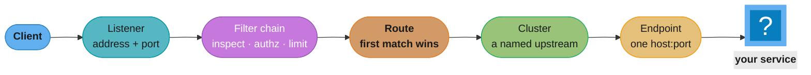
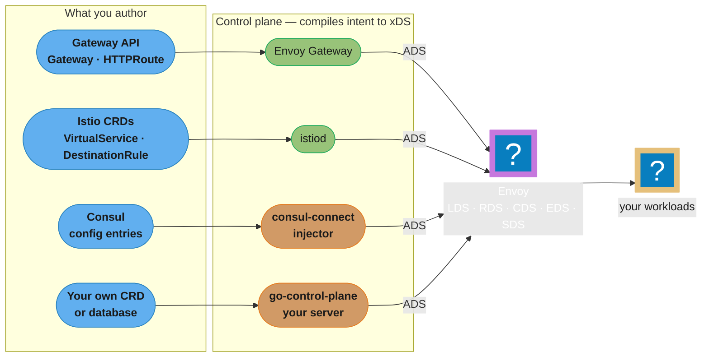
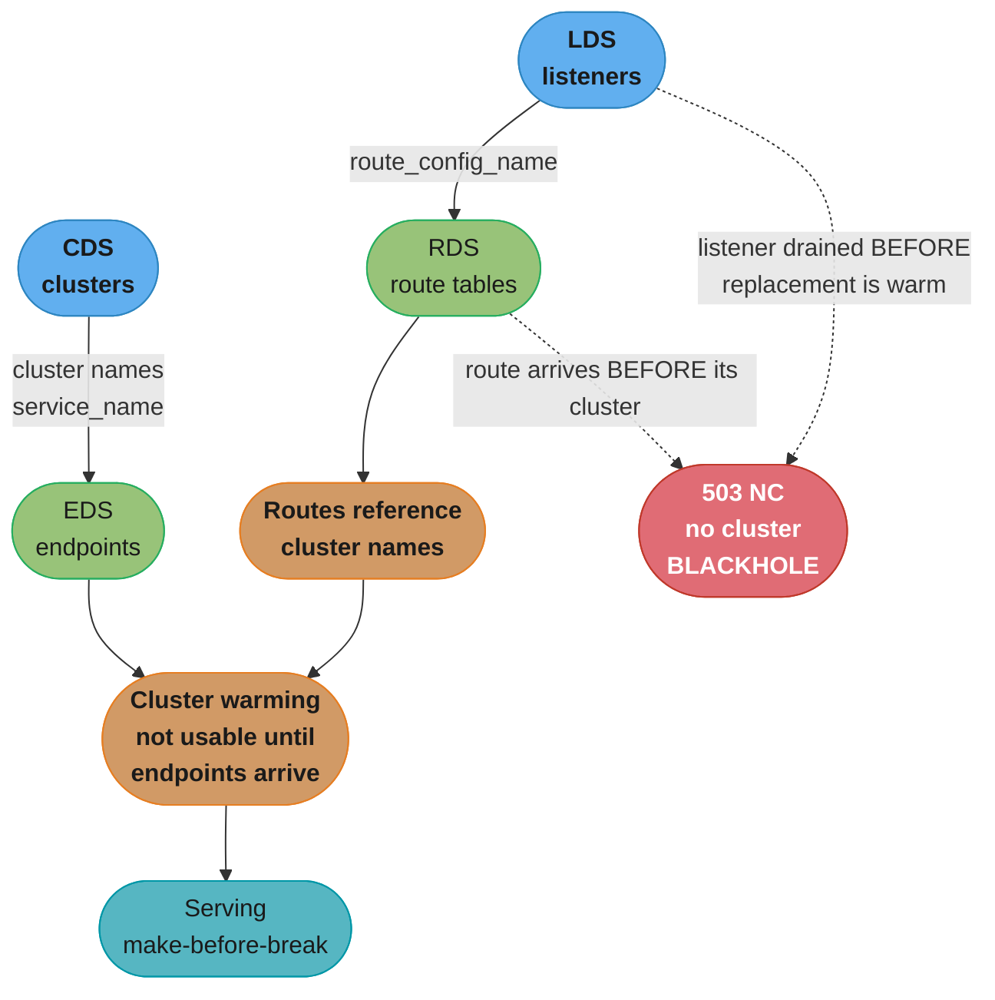
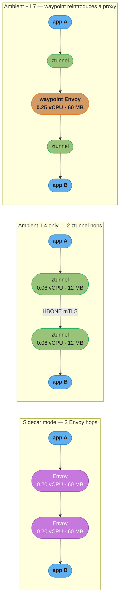
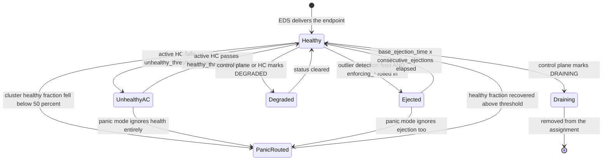

# Envoy — The L7 Proxy and Service-Mesh Data Plane

> **Version anchor (2026-08-04).** **Envoy 1.39.0** (released 2026-07-14), Apache 2.0, CNCF **graduated** (November 2018). Envoy ships **quarterly on the 15th** of each quarter; **1.40.0 is scheduled for 2026-10-13**. Each release line gets roughly **12 months** of backported security and stability fixes, so the currently supported lines are **1.39, 1.38, 1.37 and 1.36**. Ecosystem versions studied: **Kubernetes Gateway API 1.6.1** (2026-07-16; 1.6.0 GA'd UDPRoute and promoted TCPRoute to v1), **Istio 1.30.3** (2026-07-16; the 1.30.0 feature line landed 2026-05-18), **Envoy Gateway 1.8.3** (2026-07-22, bundling Gateway API CRDs v1.5.1), **Contour 1.33.5** (2026-05-28), **Envoy AI Gateway 1.0** (June 2026). Version-specific behaviour is tagged inline as `[1.39]`, `[1.34]`, `[Istio 1.24]`, `[Gateway API 1.6]`; nothing in this module is described as current without naming the release it landed in.

Envoy is an L3/L4/L7 proxy written in C++ whose **entire configuration surface is an API rather than a file**. One binary runs at the edge, as a sidecar, as a per-node DaemonSet, as an egress gateway, and compiled into a mobile app — and in every one of those placements it is configured by a control plane streaming it typed protobuf over gRPC. That single design decision is why Istio, Envoy Gateway, Contour, kgateway, Consul and Google Cloud Service Mesh are all, underneath, the same process with different config sources.

---

## 1. Concept Overview

### What Envoy is

Envoy sits between two TCP connections and decides everything about the second one. It accepts a connection on a **listener**, runs the bytes through a **filter chain** that can inspect TLS ClientHello, parse HTTP, authorize, rate-limit, mutate and log, matches the request against a **route**, hands it to a **cluster**, and the cluster's load balancer picks an **endpoint** and borrows a pooled connection to it. Those five nouns are the whole model, and everything else in this module is a knob on one of them.

What makes it different from NGINX or HAProxy is not the proxying — all three proxy competently. It is that Envoy has **no meaningful static configuration story in production**. There is a bootstrap file, and the bootstrap file's real job is to name a control plane. Listeners, routes, clusters, endpoints, secrets, runtime flags and even filter configuration arrive over **xDS**, a set of gRPC streaming APIs, and are swapped in atomically without dropping a connection, without a reload signal, and without a config file existing anywhere on the proxy's disk.

The second differentiator is **observability as an output of the request path rather than a bolt-on**. Every filter emits stats. The router emits a per-request access log with a `%RESPONSE_FLAGS%` field that names *which internal mechanism* ended the request — not "503", but "the connection pool was over its ceiling" (`UO`) versus "there were no healthy upstream hosts" (`UH`) versus "the route timeout fired" (`UT`). Operating a proxy without that distinction is guesswork, and getting it is most of why the industry standardized on Envoy for meshes.

### The thesis of this page: Envoy is a substrate, not a product

This is the fact that most changes how you reason about Envoy, and half of what follows is a consequence of it.

**Almost nobody adopts Envoy. They adopt something that emits xDS.** A platform team choosing "Istio" or "Envoy Gateway" or "Contour" is choosing a control plane — an opinionated compiler from a high-level intent (a `Gateway`, an `HTTPRoute`, a `VirtualService`, a Consul `service-router`) down to the same four or five xDS resource types, delivered to the same binary. The control planes differ enormously in API, scope and operational weight. The data plane, in every case, is Envoy.

Three practical consequences fall straight out:

1. **Learning Envoy is transferable in a way that learning a control plane is not.** `%RESPONSE_FLAGS%`, `enforcing_consecutive_5xx`, the 15-second default route timeout, panic mode and the per-worker connection pool behave identically whether Istio, Envoy Gateway or a hand-rolled `go-control-plane` server put them there. A debugging skill learned once applies to all of them.
2. **Your escape hatch is always the same.** When the control plane's abstraction cannot express what you need, every serious control plane offers a raw-Envoy override — Istio's `EnvoyFilter`, Envoy Gateway's `EnvoyPatchPolicy`, Contour's limited passthrough. All of them require you to know the object model on this page.
3. **The blast radius of a control-plane outage is bounded and specific.** Envoy keeps serving the last configuration it received. A dead control plane does not drop traffic; it freezes routing, stops endpoint updates, and eventually leaves you routing to hosts that no longer exist. The dangerous case is not "control plane down", it is "Envoy restarts while the control plane is down" (§6.1, §10).

### Disambiguation — four things called Envoy, only one of which is this

| Name | What it is | Relationship to this page |
|---|---|---|
| **Envoy** | The proxy. This page. | — |
| **Envoy Gateway** | A CNCF project that implements the Kubernetes **Gateway API** by running and configuring Envoy. v1.8.3 (2026-07-22). | A **control plane over** Envoy, not a fork of it. §4.7, §8.7, §14. |
| **Envoy AI Gateway** | An additive layer on Envoy Gateway giving an OpenAI-compatible API across providers, token-based rate limiting and MCP routing. **v1.0, June 2026.** | A control plane *on top of a control plane*; the data plane is still Envoy. §4.7. |
| **Envoy Mobile** | The same C++ core compiled into an iOS/Android client library, so a phone app gets the same retries, TLS and stats as a server. The standalone `envoyproxy/envoy-mobile` repo folded into `envoyproxy/envoy` under `/mobile`. | The same binary in a fifth placement. §4.2. |

And one that is not a proxy at all: **Envoy** (`envoy.com`) is a well-known visitor-management and workplace SaaS company. It is entirely unrelated, it owns the shorter domain, and it is the top non-technical search result for the word. Say "Envoy proxy" out loud when the context is ambiguous.

### A short history

| Year | Event |
|---|---|
| 2016 | Built inside **Lyft** to give a polyglot fleet consistent retries, timeouts and telemetry that no per-language library was delivering; open-sourced in September 2016 |
| 2017 | Donated to the **CNCF** (September 2017); **Istio** launches with Envoy as its data plane, which is what made xDS a de facto standard rather than one project's internal API |
| 2018 | **CNCF graduation (November 2018)** — the third project ever to graduate, after Kubernetes and Prometheus |
| 2019–2021 | Wasm/proxy-wasm extensibility; HTTP/3 support; xDS formalized as a versioned, independently-implementable protocol under `cncf/xds` |
| 2022 | **Envoy Gateway** announced as the CNCF-native Gateway API control plane, explicitly to stop every vendor rewriting the same Envoy-management layer |
| 2024 | Istio **ambient mode reaches GA** in `[Istio 1.24]` (November 2024), splitting the data plane into a per-node `ztunnel` for L4/mTLS and an optional per-service `waypoint` (an Envoy) for L7 |
| 2025–2026 | **Dynamic Modules** land `[1.34]` with an official Rust SDK and expand substantially `[1.39]`; **Envoy AI Gateway 1.0** ships (June 2026); **ingress-nginx is retired (March 2026)**, leaving Gateway API — and therefore Envoy — as the mainstream Kubernetes ingress path |

### Why this page exists now

In November 2025 the Kubernetes project announced the **retirement of ingress-nginx**, and in March 2026 it happened: no more releases, no more CVE fixes, no more maintainers. The **Ingress API itself remains supported but is feature-frozen** — every new L7 capability lands in **Gateway API**, which reached GA and is at **1.6.1** `[Gateway API 1.6]`.

That matters here because of what the Gateway API implementation list actually contains. **Envoy Gateway, Istio, Contour and kgateway are all Envoy underneath.** The genuine non-Envoy implementations are the minority: Traefik, NGINX Gateway Fabric (F5's separately-maintained controller, unaffected by the ingress-nginx retirement), Cilium's own eBPF+Envoy hybrid, and a handful of cloud-managed ones.

So the practical consequence of the retirement is that a very large share of Kubernetes clusters are migrating *onto Envoy* — usually without anyone on the team learning Envoy, because the control plane hides it. That works until the first incident, at which point the access log says `UO`, the dashboard says the pod is healthy, and nobody knows what either of those means. This page is the missing layer.

### What Envoy is not

- **Not a web server.** It has no meaningful static file serving, no CGI, no PHP-FPM story. If you want NGINX's other job, use NGINX.
- **Not a service mesh.** A mesh is Envoy *plus* a control plane, an identity system, a sidecar-injection or ambient mechanism, and a policy API. Envoy alone is one of four or five required parts (§12 Q23).
- **Not an application framework.** ext_authz, ext_proc and Wasm let you put logic on the request path; none of them is where your business logic should live.
- **Not a WAF by default.** There is a `waf` filter family and third-party ModSecurity/Coraza integrations, but out of the box Envoy inspects nothing for attack signatures.
- **Not something you hand-write in production.** A realistic ingress configuration is thousands of lines of generated protobuf-shaped YAML with no templating, no includes and no comments in the delivered form. That is not a criticism; it is the design (§6.1, §12 Q22).

### Licence and governance

Apache 2.0, no relicensing event, no BSL, no open-core split. CNCF **graduated** since November 2018, with maintainers spread across Google, Lyft, Tetrate, Bloomberg, IBM and others — a genuinely multi-vendor project rather than one company's open-source arm, which matters when you are betting a traffic layer on it for a decade.

The release cadence is unusually strict and worth internalizing for planning: a minor release **every quarter on the 15th**, an extended maintenance window of roughly **12 months** per line, and a documented deprecation policy where a field is announced deprecated in release N, runtime-guarded off in N+1, and removed in N+2. `[1.39]` is a live example: `enforce_rsa_key_usage` is deprecated and ignored, with RSA key-usage validation now mandatory.

---

## 2. Intuition

> **One-line analogy:** Envoy is a programmable switchboard whose wiring diagram is *downloaded*, not soldered.

**Mental model — four nouns and one verb.** A request arrives at a **listener**, walks a **filter chain**, matches a **route**, is handed to a **cluster**, which picks an **endpoint**. That is the entire request path. Every Envoy problem you will ever debug is the question *"which of those five is wrong?"*, and the access log's response flag usually tells you which.



**Why it matters.** Because those five nouns are identical at the edge, in a sidecar, on a node and inside a mobile app, **one operational vocabulary covers your entire traffic surface**. An engineer who can read `/config_dump` on an ingress gateway can read it on a sidecar. The same `%RESPONSE_FLAGS%` letters mean the same things. The same 15-second route-timeout default is waiting in both places. Nothing else in the traffic layer gives you that.

**Key insight — the sentence the rest of this page unpacks.** *Envoy's core is an event loop plus a registry of typed extensions; nearly everything named in this module is an extension, not a feature.* Every surprising thing about the configuration follows:

- Config values are keyed by a URL-shaped `@type` (`type.googleapis.com/envoy.extensions.filters.http.router.v3.Router`) rather than a keyword, because the type **is** the registry lookup that finds the extension.
- There is no "enable HTTP" flag — you insert the `http_connection_manager` **network filter** into a listener's chain, and HTTP appears.
- Two Envoy builds can legitimately have different capabilities, because extensions are compile-time-selectable and a slim build omits many.
- The extensibility story (Wasm, Lua, ext_authz, ext_proc, dynamic modules) is not an add-on API; it is the same mechanism the built-in filters use, exposed to you.

If you can restate that sentence and derive those four consequences, you will find the documentation stops feeling arbitrary.

---

## 3. Core Principles

- **Configuration is an API, not a file.** The bootstrap exists to name a control plane; everything of consequence arrives over xDS and is swapped atomically. This is the difference that produces every other difference (§6.1).
- **Config delivery is eventually consistent, and ordering is a real problem.** Separate xDS streams can deliver a route referencing a cluster that has not arrived yet, which blackholes traffic. ADS exists specifically to make ordering expressible (§6.1, §12 Q14).
- **Everything is a typed extension.** Filters, transport sockets, load-balancing policies, access-log sinks, stat sinks, resource monitors and tracers are all extension points with the same `@type` shape. There is no privileged built-in tier.
- **One binary, many placements.** Edge, sidecar, per-node, egress, middle proxy, mobile — the "universal data plane" claim. What it buys is not code reuse; it is that your incident vocabulary does not change when the traffic moves from the edge to the mesh.
- **Observability is an output of the request path, not an add-on.** Stats, access logs and spans are emitted by the same filter chain that routes, so they can name internal state (`UO`, `URX`, `DPE`) that no external observer could infer.
- **Transparent to the application, L7-aware regardless.** Getting traffic into Envoy — iptables REDIRECT, eBPF, a Service VIP, an explicit proxy setting — is somebody else's job. Parsing and deciding is Envoy's.
- **No locks on the request path.** Worker threads share nothing mutable. Configuration reaches them through thread-local slot updates posted from the main thread, which is why per-worker state (connection pools, local rate-limit buckets) is a recurring source of surprise (§5.3, §6.14, §6.20).

---
## 4. Types / Architectures / Strategies

### 4.1 The object model — the five nouns, and the four people forget

| Object | What it is | Delivered by | The thing people get wrong |
|---|---|---|---|
| **Listener** | A bind address and port plus an ordered list of filter chains | **LDS** | A listener can hold *many* filter chains; which one runs is a match, not a sequence |
| **Filter chain** | An ordered list of network filters, plus a `transport_socket` | inside the listener | The TLS termination config lives on the chain, not on the listener |
| **Route configuration** | A named set of virtual hosts | **RDS** | The name is referenced by the HCM, so one config can serve many listeners |
| **Virtual host** | A set of domains plus routes | inside the route config | Domain matching is exact → suffix → prefix → `*`, *not* first-match |
| **Route** | A match plus an action (cluster, weighted clusters, redirect, direct response) | inside the virtual host | Route matching **is** first-match-wins, so order is the API |
| **Cluster** | A named upstream group: discovery type, LB policy, health checks, circuit breakers, connection pool settings, TLS | **CDS** | A cluster is a *policy* object; the hosts in it are a separate resource |
| **Endpoint** | One `host:port` with a weight, a locality, and a health status | **EDS** | Endpoints arrive as a `ClusterLoadAssignment`, keyed by the cluster's `service_name` |

The four that are routinely missed, and each costs an outage at least once:

- **`transport_socket`** — the pluggable TLS (or raw-buffer, or ALTS, or QUIC) layer, present on both the downstream filter chain and the upstream cluster. "Envoy is not doing mTLS to the backend" is almost always a missing upstream transport socket.
- **`ClusterLoadAssignment`** — the EDS payload. It is not a list of IPs; it carries **localities**, **priorities**, per-locality weights and an `overprovisioning_factor`. Most of §6.8 is about fields living here.
- **Locality** — the `(region, zone, sub_zone)` triple attached to each endpoint group, and the input to zone-aware and locality-weighted routing.
- **`LbEndpoint.health_status`** — an endpoint can be `HEALTHY`, `UNHEALTHY`, `DRAINING`, `TIMEOUT` or `DEGRADED`, delivered by the control plane. This is a *third* health signal alongside active health checks and outlier detection (§4.6).

### 4.2 Deployment topologies

| Topology | Hops added | Config scope | Blast radius | Who owns the upgrade |
|---|---|---|---|---|
| **Edge / ingress gateway** | 1 | Every route into the cluster | Whole cluster's north-south traffic | Platform team |
| **Sidecar** | 2 per call (client-side + server-side) | Only what this workload talks to | One pod | Platform, via injection — but the app team's deploy triggers it |
| **Per-node DaemonSet** | 1 | Every workload on that node | One node's worth of pods | Platform |
| **Egress gateway** | 1 on the way out | Traffic leaving the mesh | External connectivity | Platform / security |
| **Middle proxy** | 1 | A tier boundary inside the fleet | That tier | Whoever owns the tier |
| **Mobile-embedded** (Envoy Mobile) | 0 (in-process) | The app's own outbound calls | One app version | Mobile release train — **months**, not minutes |
| **Proxyless gRPC** | 0 | The gRPC client's own channels | One service's clients | The app's dependency bump |

Two of these deserve more than a table row.

**Sidecar means two Envoys per call, not one.** Service A calls service B: A's sidecar intercepts outbound, applies A's retry/timeout/circuit-breaker policy, does mTLS, and connects to B's sidecar, which terminates mTLS, applies B's authorization policy, and forwards to localhost. Every latency and resource figure you read must be checked for whether it is stated per proxy or per pair (§6.25 exists mostly to settle this).

**Proxyless gRPC is the most interesting one**, because it proves the thesis. A gRPC client library can consume CDS and EDS from an xDS control plane directly, doing its own load balancing over the endpoints the mesh told it about — no Envoy process anywhere. You get mesh-managed discovery and load balancing with zero added hops, and you give up every filter (no ext_authz, no Wasm, no rich access logs) and you require every client to be gRPC in a supported language. xDS escaped Envoy; that is what "standard" means.

### 4.3 Filter taxonomy — where each type can and cannot act

The single most useful thing to hold in your head is **what is visible at each stage**, because it determines where a given feature *can* be implemented.

| Filter type | Runs when | Can see | Cannot see | Examples |
|---|---|---|---|---|
| **Listener filter** | After accept, before the filter chain is chosen | Source/destination IP and port, the raw first bytes, TLS ClientHello (SNI, ALPN) | Anything HTTP | `tls_inspector`, `http_inspector`, `original_dst`, `proxy_protocol` |
| **Network filter** | On the L4 byte stream of the chosen chain | Bytes, connection metadata, TLS peer certificate | HTTP semantics unless it parses them itself | `tcp_proxy`, `http_connection_manager`, `rbac`, `ratelimit`, `redis_proxy`, `thrift_proxy`, `mongo_proxy` |
| **HTTP filter (decoder half)** | Per request, inside the HCM | Request headers, body, trailers, route metadata | The response, the chosen upstream host | `jwt_authn`, `ext_authz`, `cors`, `local_ratelimit`, `lua`, `wasm`, `router` |
| **HTTP filter (encoder half)** | Per response, inside the HCM, in reverse order | Response headers, body, trailers | Nothing about a request that never reached the router | the same filters, encoding side |
| **Upstream HTTP filter** | After host selection, per upstream attempt | The **selected upstream host**, and runs again per retry | Downstream connection details it was not given | custom per-attempt header injection |
| **UDP listener filter** | Per datagram | The datagram and its 4-tuple | Any stream context | `udp_proxy`, DNS filter |
| **Access-log filter** | At log time | Everything, including the response flags | — | status-code, duration, header, runtime-percentage filters |

Three consequences worth stating explicitly:

1. **`tls_inspector` must be a listener filter, not a network filter**, because filter-chain matching on SNI happens *before* the chain — and therefore before any network filter — is selected. This is the "my SNI-based routing does nothing" bug.
2. **An HTTP filter cannot know which upstream host was picked**, because host selection happens in the router, which is last. If you need per-host behaviour, that is an **upstream** HTTP filter.
3. **A retry re-runs upstream filters but not downstream ones.** Decoder filters see the request once; upstream filters see it once per attempt.

### 4.4 The xDS resource taxonomy

| API | Delivers | Depends on |
|---|---|---|
| **LDS** | Listeners | — |
| **RDS** | Route configurations | referenced by name from an HCM (LDS) |
| **CDS** | Clusters | — |
| **EDS** | `ClusterLoadAssignment` (endpoints) | referenced by `service_name` from a cluster (CDS) |
| **SDS** | Secrets (certs, keys, validation contexts) | referenced from a transport socket |
| **SRDS** | Scoped route configurations — pick a route table by header/key before matching | scales past one giant route table |
| **VHDS** | Virtual hosts on demand — fetch a vhost when a request needs it | for route tables too large to hold |
| **ECDS** | Extension configuration — a filter's config, delivered separately from the listener | change a filter's config without churning the listener |
| **RTDS** | Runtime layer — feature flags and percentages | powers `runtime_fraction`-gated routes |
| **LEDS** | Endpoints incrementally, as a Delta resource inside an EDS assignment | very large, churning endpoint sets |

Then the 2×2 that actually decides your operational experience:

|  | **Separate streams** | **Aggregated (ADS)** |
|---|---|---|
| **State of the world (SotW)** | Every update resends the full resource set of that type, and cross-type ordering is undefined. The classic blackhole source. | Every type on one gRPC stream, so the control plane can order CDS before EDS and LDS before RDS. **This is what nearly everyone runs.** |
| **Delta (incremental)** | Only changed resources are sent, per type. Cheaper, still unordered across types. | Only changed resources, on one ordered stream. The efficient target, used by Istio for EDS-heavy workloads. |

**What each control plane ships:** Istio uses ADS on a single stream and supports Delta; Envoy Gateway uses ADS via `go-control-plane`; Contour uses ADS; a naive DIY control plane usually starts with SotW-per-type and discovers §12 Q14 the hard way.

### 4.5 Load-balancing policy taxonomy

The *algorithms* are taught in [`hld/load_balancing`](../../hld/load_balancing/load_balancing.md) and [`hld/consistent_hashing`](../../hld/consistent_hashing/consistent_hashing.md). What follows is Envoy's implementation of them, with the constants that decide behaviour.

| Policy | Envoy's implementation | Disruption when a host leaves | Cost per pick | Pick it when |
|---|---|---|---|---|
| `ROUND_ROBIN` | Weighted round robin, with optional `slow_start_config` ramping new hosts in over a window | N/A (stateless) | O(1) | Default. Homogeneous, stateless backends |
| `LEAST_REQUEST` | **Power of two choices** — samples `choice_count` hosts (**default 2**) and picks the one with fewer active requests; `active_request_bias` (default 1.0) tunes how strongly weight is discounted by load | N/A | O(choice_count) | Heterogeneous request costs, long-lived requests |
| `RING_HASH` | Ketama-style ring; `minimum_ring_size` **1024**, `maximum_ring_size` 8M. Larger ring = better balance, more memory and build time | ~1/N of keys remap | O(log ring) | Session affinity where a modest remap is acceptable |
| `MAGLEV` | Fixed **65537-entry** lookup table, Google's Maglev algorithm | Near-minimal remap, better balance than ring hash at a fraction of the memory | O(1) table lookup | Affinity at scale — the better default of the two hash policies |
| `RANDOM` | Uniform random | N/A | O(1) | When you have no health signal and want to avoid herd effects |
| `CLUSTER_PROVIDED` | The cluster type picks (e.g. `ORIGINAL_DST`) | N/A | — | Transparent proxying |
| `load_balancing_policy` (extension form) | The newer extensible field superseding the `lb_policy` enum, letting a policy be a typed extension with its own config and letting policies be *nested* (e.g. locality-aware wrapping least-request) | — | — | Anything the enum cannot express |

### 4.6 Health and failure detection — five independent mechanisms

This is the taxonomy that produces the most production confusion, because these are **five separate systems that all decide whether a host receives traffic**, and they compose in ways nobody documents in one place.

| Mechanism | Signal | Who decides | Recovers by |
|---|---|---|---|
| **Active health checking** | Envoy's own synthetic probe | Each Envoy independently | `healthy_threshold` consecutive successes |
| **Outlier detection (passive)** | Real production responses | Each Envoy independently | `base_ejection_time` elapsing, backed off per ejection |
| **EDS health status** | The control plane's view (e.g. Kubernetes readiness) | The control plane, for everyone | The control plane says so |
| **`DEGRADED` status** | An endpoint is up but should be used only if nothing better exists | Control plane or active HC | Status change |
| **Panic mode** | Too few healthy hosts overall | Each Envoy, per cluster | Healthy fraction rising above the threshold |

The interactions are where outages live: outlier detection ejects a host that active health checking still calls healthy; priority failover promotes a lower-priority group only after the primary's healthy fraction drops; and **panic mode overrides all of it** by routing to every host regardless of health once too few are healthy, on the theory that a coin flip beats a guaranteed 503 (§6.8, §6.10, §12 Q7).

### 4.7 Control-plane taxonomy — who is actually driving the same binary

| Control plane | Scope | API surface | Data plane | Notes |
|---|---|---|---|---|
| **Istio** (sidecar) | Full mesh | Istio CRDs + Gateway API | **Envoy** | The most complete; the most operational weight |
| **Istio** (ambient) | Full mesh | Same | **ztunnel** (Rust, L4/mTLS) + **waypoint** (Envoy, L7) | L7 becomes opt-in per service `[Istio 1.24]` |
| **Envoy Gateway** | Ingress | Gateway API + its own policy CRDs | **Envoy** | The CNCF-native answer; v1.8.3 |
| **Contour** | Ingress | Gateway API + `HTTPProxy` | **Envoy** | Long-standing, VMware-originated, v1.33.5 |
| **kgateway** | Ingress / AI gateway | Gateway API | **Envoy** | CNCF sandbox; the renamed donation of Solo.io's Gloo Gateway (Gloo OSS reaches end of life 31 December 2026) |
| **Consul** service mesh | Full mesh | Consul config entries | **Envoy** | Strong multi-runtime (VM + Kubernetes) story |
| **Google Cloud Service Mesh** | Full mesh | GCP APIs + Gateway API | **Envoy**, and proxyless gRPC | Managed xDS, formerly Traffic Director |
| **Envoy AI Gateway** | LLM traffic | `AIGatewayRoute`, `AIServiceBackend`, `BackendSecurityPolicy`, `MCPRoute` | **Envoy**, via Envoy Gateway | v1.0, June 2026, additive on Envoy Gateway |
| **`go-control-plane`** | Whatever you build | Yours | **Envoy** | The DIY library. Correct choice more often than people think, and wrong more often than they hope |
| **Traefik** | Ingress | Gateway API + its own CRDs | **its own Go proxy** | Genuinely not Envoy |
| **NGINX Gateway Fabric** | Ingress | Gateway API | **NGINX** | Genuinely not Envoy; F5-maintained, unaffected by the ingress-nginx retirement |
| **Linkerd** | Full mesh | Linkerd CRDs + Gateway API | **`linkerd2-proxy`** (Rust) | Genuinely not Envoy, deliberately (§8.4) |

AWS **App Mesh** was Envoy-based and belongs here historically only: it **closed to new customers on 24 September 2024** and reaches **end of support on 30 September 2026**, with AWS pointing customers at ECS Service Connect or VPC Lattice (§7).

The conceptual half of this table — what a service mesh is for, whether you should run one at all, and Istio's CRD authoring surface — belongs to [`backend/service_mesh_and_service_discovery`](../../backend/service_mesh_and_service_discovery/service_mesh_and_service_discovery.md). This module deliberately shows the xDS **output** those CRDs compile into, never the CRD input.

---
## 5. Architecture Diagrams

### 5.1 The request path, end to end

```mermaid
flowchart LR
    classDef io      fill:#61afef,stroke:#2e86c1,color:#1a1a1a,font-weight:bold
    classDef frozen  fill:#c678dd,stroke:#9b59b6,color:#fff
    classDef train   fill:#98c379,stroke:#27ae60,color:#1a1a1a
    classDef mathOp  fill:#d19a66,stroke:#e67e22,color:#1a1a1a,font-weight:bold
    classDef lossN   fill:#e06c75,stroke:#c0392b,color:#fff,font-weight:bold
    classDef req     fill:#56b6c2,stroke:#0097a7,color:#1a1a1a
    classDef base    fill:#e5c07b,stroke:#f39c12,color:#1a1a1a

    CL(["Client"]) --> SOCK(["accept<br/>on a worker thread"])

    subgraph down["Downstream side"]
        SOCK --> LF(["Listener filters<br/>tls_inspector · original_dst"])
        LF --> FCM(["Filter-chain match<br/>port · SNI · ALPN · source IP"])
        FCM --> HCM(["http_connection_manager<br/>codec · access log · tracing"])
        HCM --> HF(["HTTP filter chain<br/>jwt · ext_authz · ratelimit"])
        HF --> RT(["router filter<br/>TERMINAL"])
    end

    RT --> RM(["Route match<br/>vhost then first-match route"])
    RM --> CLU(["Cluster<br/>policy · breakers · timeouts"])

    subgraph up["Upstream side"]
        CLU --> LB(["LB policy<br/>picks an endpoint"])
        LB --> POOL(["Connection pool<br/>per worker thread"])
        POOL --> TS(["transport_socket<br/>mTLS origination"])
    end

    TS --> EP(["Endpoint<br/>host:port"])
    RT -.->|"response encodes back<br/>through the chain in reverse"| HF

    class CL,EP io
    class SOCK,LF req
    class FCM,HCM frozen
    class HF mathOp
    class RT lossN
    class RM,CLU train
    class LB,POOL,TS base
```



Two things to take from this. The **router filter is where the downstream half ends and the upstream half begins** — everything left of it is about the request as received, everything right of it is about the attempt being made. And the response walks the encoder half of the HTTP filter chain **in reverse order**, which is why a filter that adds a request header appears before, and a filter that scrubs a response header appears after, in the same list.

### 5.2 The two planes — one data plane, four owners



This is the page's thesis in one picture. The left column is where the products genuinely differ — API shape, scope, operational weight, who is behind it. The right-hand box is the same binary in every case, with the same defaults, the same response flags and the same failure modes. Choosing a control plane is a real decision; choosing a data plane, in 2026, mostly is not.

### 5.3 The threading model (ASCII — the replicated columns carry the meaning)

```
                        +-------------------------------------------+
                        |  MAIN THREAD                              |
                        |  xDS streams · config parse · admin API   |
                        |  timers for HC · hot restart · stats flush|
                        +---------------------+---------------------+
                                              | posts thread-local slot updates
              +-------------------+-----------+-----------+-------------------+
              v                   v                       v                   v
      +---------------+   +---------------+       +---------------+   +---------------+
      | WORKER 0      |   | WORKER 1      |       | WORKER 2      |   | WORKER N-1    |
      | event loop    |   | event loop    |       | event loop    |   | event loop    |
      +---------------+   +---------------+       +---------------+   +---------------+
      | listener sock |   | listener sock |       | listener sock |   | listener sock |  REUSEPORT:
      |  (own fd)     |   |  (own fd)     |       |  (own fd)     |   |  (own fd)     |  the kernel
      +---------------+   +---------------+       +---------------+   +---------------+  balances
      | conn pools    |   | conn pools    |       | conn pools    |   | conn pools    |  PER WORKER
      | local rl bkts |   | local rl bkts |       | local rl bkts |   | local rl bkts |  PER WORKER
      | cluster view  |   | cluster view  |       | cluster view  |   | cluster view  |  TLS copy
      +---------------+   +---------------+       +---------------+   +---------------+

  a connection is assigned to ONE worker at accept() and stays there for its whole life
  no locks on the request path -- workers share nothing mutable

  arithmetic that follows:
      local_rate_limit 100 rps  x  --concurrency 8   ->  ~800 rps admitted
      max_connections  1024     x  --concurrency 8   ->  8192 upstream conns possible
      1 hot HTTP/2 connection   ->  1 busy worker, N-1 idle, and NO rebalancing
```

Three operational facts fall out of this picture, and all three are §10 war stories. Anything counted "per cluster" is really counted per worker; a single very hot downstream connection pins one core with no way to spread it; and `--concurrency` is therefore not a pure throughput knob, it is a multiplier on several limits you thought were absolute.

### 5.4 xDS dependency order, and the blackhole separate streams produce



Read the dotted arrows: both are the same failure. On **separate SotW streams there is no ordering guarantee**, so a control plane that sends a new route table and a new cluster set in the same logical update can deliver them in either order, and the window between them is a blackhole. **ADS puts every type on one stream**, so the control plane can order CDS before EDS and LDS before RDS deterministically. Envoy's side of the contract is **cluster warming** (a new or updated cluster does not receive traffic until its endpoints and health checks are ready) and **make-before-break** for listeners.

### 5.5 The seven timeout layers on one shared axis (ASCII — nested brackets)

```
 t=0  downstream connection accepted                                    connection closed
  |                                                                                |
  |<------------------ max_connection_duration (unset by default) ---------------->|
  |                                                                                |
  |   |<------------- idle_timeout (1 h, downstream connection) ------------->|    |
  |                                                                                |
  |      stream 1                          stream 2                                |
  |   |<-- max_stream_duration (unset) -->|                                        |
  |   |<-- stream_idle_timeout (5 min) -->|                                        |
  |                                                                                |
  |   |<========== route timeout: 15 s DEFAULT -- TOTAL, spans all retries =======>|
  |   |                                                                       |    |
  |   | attempt 1        backoff   attempt 2        backoff   attempt 3       |    |
  |   |<--per_try--->|  <------>  |<--per_try--->| <------>  |<--per_try-->|  |    |
  |   |                                                                       |    |
  |   |<-connect_timeout->|  (per attempt, cluster-level, no default -- REQUIRED)   |
  |
  arithmetic that bites:
      route timeout 15 s   with per_try_timeout 10 s and num_retries 3
      -> attempt 1 runs 10 s, attempt 2 is cut off at 15 s: you get 1.5 attempts, not 3
      -> per_try_timeout x (num_retries + 1) must fit INSIDE the route timeout, plus backoff
```

The single highest-value fact on this page for a working engineer: **the route `timeout` defaults to 15 seconds and is a total budget across every retry**. No configuration file says 15, so nobody looks there when a legitimately-slow endpoint starts returning `UT` at exactly fifteen seconds.

### 5.6 Sidecar versus ambient — where the hops go



The honest reading is **not** "ambient replaces sidecars". It is that ambient makes **L7 opt-in per service** instead of mandatory per pod: services that need only mTLS and L4 authorization pay 0.06 vCPU and 12 MB per node, and only the services that genuinely need L7 policy pay for a waypoint — which is a *larger* proxy than a sidecar (§8.6).

### 5.7 Endpoint lifecycle — three independent transition sources



`Degraded` means "usable, but only if nothing better exists" — Envoy routes to degraded hosts only when the healthy set cannot serve. `PanicRouted` is the state that surprises people at 3am: once fewer than `healthy_panic_threshold` (**default 50%**) of the cluster is healthy, Envoy sends traffic to **every** host including the ejected and the failing ones, because a partial chance of success beats a guaranteed 503 from an empty pool.

---
## 6. How It Works — Detailed Mechanics

### 6.1 The bootstrap, annotated — and why its only real job is to name a control plane

A minimal **static** Envoy, the shape every tutorial shows and almost nobody runs:

```yaml
admin:
  address:
    socket_address: { address: 127.0.0.1, port_value: 9901 }   # NEVER 0.0.0.0 (§6.21)

static_resources:
  listeners:
  - name: ingress
    address:
      socket_address: { address: 0.0.0.0, port_value: 8080 }
    filter_chains:
    - filters:
      - name: envoy.filters.network.http_connection_manager
        typed_config:
          "@type": type.googleapis.com/envoy.extensions.filters.network.http_connection_manager.v3.HttpConnectionManager
          stat_prefix: ingress_http
          codec_type: AUTO                       # ALPN-driven: h2, http/1.1, or h3
          use_remote_address: true               # see §6.3 -- this one is security-relevant
          route_config:
            name: local_route
            virtual_hosts:
            - name: default
              domains: ["*"]
              routes:
              - match: { prefix: "/" }
                route:
                  cluster: app
                  timeout: 15s                   # the DEFAULT, written out so it is visible
          http_filters:
          - name: envoy.filters.http.router
            typed_config:
              "@type": type.googleapis.com/envoy.extensions.filters.http.router.v3.Router

  clusters:
  - name: app
    connect_timeout: 1s                          # REQUIRED -- there is no default
    type: STRICT_DNS
    lb_policy: ROUND_ROBIN
    load_assignment:
      cluster_name: app
      endpoints:
      - lb_endpoints:
        - endpoint: { address: { socket_address: { address: app.svc, port_value: 8080 }}}
```

Now the same proxy as a **dynamic** one. Notice how little is left:

```yaml
node:
  id: ingress-gateway-7f9c                       # identity the control plane uses to scope config
  cluster: ingress-gateway                       # grouping key; also a stats tag
  locality: { region: us-east-1, zone: us-east-1b }

admin:
  address: { socket_address: { address: 127.0.0.1, port_value: 9901 }}

dynamic_resources:
  ads_config:                                    # ONE stream, ordered, for every resource type
    api_type: GRPC
    transport_api_version: V3
    grpc_services:
    - envoy_grpc: { cluster_name: xds_cluster }
    set_node_on_first_message_only: true
  cds_config: { ads: {}, initial_fetch_timeout: 15s }
  lds_config: { ads: {}, initial_fetch_timeout: 15s }

static_resources:
  clusters:                                      # the ONLY static cluster: the control plane itself
  - name: xds_cluster
    connect_timeout: 1s
    type: STRICT_DNS
    typed_extension_protocol_options:
      envoy.extensions.upstreams.http.v3.HttpProtocolOptions:
        "@type": type.googleapis.com/envoy.extensions.upstreams.http.v3.HttpProtocolOptions
        explicit_http_config: { http2_protocol_options: {} }   # xDS is gRPC, so HTTP/2
    load_assignment:
      cluster_name: xds_cluster
      endpoints:
      - lb_endpoints:
        - endpoint: { address: { socket_address: { address: istiod.istio-system, port_value: 15012 }}}

layered_runtime:                                 # feature flags, lowest to highest precedence
  layers:
  - name: static_layer
    static_layer:
      envoy.reloadable_features.no_extension_lookup_by_name: true
  - name: rtds_layer                             # runtime pushed by the control plane
    rtds_layer:
      name: runtime-0
      rtds_config: { ads: {} }
  - name: admin_layer                            # /runtime_modify, for incident response only
    admin_layer: {}
```

Field by field, the ones that matter:

- **`node.id` and `node.cluster`** are the proxy's identity on the xDS stream. Istio encodes pod name, namespace and mesh ID into `node.id` because that is how `istiod` scopes what this proxy is allowed to see. Get it wrong and you receive the wrong config, or none.
- **`node.locality`** is what makes zone-aware routing possible (§6.8). An unset locality silently disables locality-aware behaviour.
- **`ads_config`** is the whole ordering story (§5.4). `set_node_on_first_message_only: true` is a bandwidth optimization every real control plane expects.
- **`initial_fetch_timeout`** is the field nobody sets and everybody should. It bounds how long Envoy waits for the first response of a subscription **before proceeding with what it has** — which, on a cold start with a dead control plane, is nothing. Unset (the default is 15s for many resources but 0 = infinite in some configurations), a restarting Envoy can sit with no listeners at all, or come up with empty routes and answer everything `404 NR`. This is §10 pitfall 11.
- **`layered_runtime`** is Envoy's feature-flag system. `envoy.reloadable_features.*` guards are how new behaviour ships safely: `[1.39]` turned `enable_new_dns_implementation`, `http_inspector_use_balsa_parser` and `match_headers_individually` on by default, each individually revertable through this layer without a rollback.

**The thesis, made concrete:** the dynamic bootstrap contains one cluster and no routes. Everything a request touches arrives over the wire. That is why "hand-writing Envoy config" is a category error in production (§12 Q22), and why every discussion of Envoy is really a discussion of a control plane.

### 6.2 Listeners and listener filters

A listener binds an address and holds an **ordered list of listener filters** plus an **unordered set of filter chains** selected by match.

**Filter-chain matching** is a scored match, not a first-match, over: destination port, destination IP/prefix ranges, source IP/prefix ranges, source port, `server_names` (SNI), `transport_protocol` (`raw_buffer` or `tls`), and `application_protocols` (ALPN). The most specific match wins, and Envoy rejects a config with two chains that can match identically.

The critical ordering fact: **`transport_protocol` and `server_names` are only populated if a listener filter put them there.** That is `tls_inspector`, which peeks at the ClientHello without terminating TLS. Omit it and every SNI-based chain silently never matches, so all TLS traffic falls into your plaintext chain and fails in a confusing way.

```yaml
listener_filters:
- name: envoy.filters.listener.tls_inspector      # populates SNI + ALPN + transport_protocol
  typed_config:
    "@type": type.googleapis.com/envoy.extensions.filters.listener.tls_inspector.v3.TlsInspector
- name: envoy.filters.listener.http_inspector     # populates application_protocol for cleartext
  typed_config:
    "@type": type.googleapis.com/envoy.extensions.filters.listener.http_inspector.v3.HttpInspector
```

Two more that matter in specific placements:

- **`original_dst`** recovers the pre-iptables destination address from `SO_ORIGINAL_DST`. This is the mechanism that lets a sidecar know which service the app *meant* to call after the traffic was transparently redirected to port 15001 or 15006. Without it a sidecar has no idea what the request was for.
- **`proxy_protocol`** parses a HAProxy PROXY protocol v1/v2 header, which is how a downstream L4 load balancer (AWS NLB with proxy protocol enabled, for instance) conveys the real client IP when it cannot use XFF.

**Draining.** When a listener is replaced or removed, Envoy drains it rather than closing it: it stops accepting on the old socket and gradually asks in-flight connections to close, controlled by `--drain-time-s` (default **600**) and `--drain-strategy` (`gradual`, the default, closes an increasing fraction over the drain window; `immediate` starts asking straight away). `/drain_listeners?graceful` triggers this on demand, which is exactly what a Kubernetes `preStop` hook should call (§6.22).

### 6.3 The HTTP connection manager

The HCM is a **network filter**. That is not trivia — it is why `tcp_proxy` and `http_connection_manager` are alternatives in the same slot, and why a listener can serve raw TCP on one filter chain and HTTP on another.

Its configuration is where most of a gateway's behaviour actually lives:

```yaml
"@type": type.googleapis.com/envoy.extensions.filters.network.http_connection_manager.v3.HttpConnectionManager
stat_prefix: ingress_http
codec_type: AUTO                    # ALPN picks h2/http1; explicit HTTP1/HTTP2/HTTP3 also valid
rds:                                # route table from RDS instead of inline route_config
  route_config_name: ingress-routes
  config_source: { ads: {} }
use_remote_address: true            # trust the connection's peer as the client, then append XFF
xff_num_trusted_hops: 1             # how many trailing XFF entries are YOUR infrastructure
normalize_path: true                # RFC 3986 path normalization: collapse /../ and /./
merge_slashes: true                 # //a//b -> /a/b
path_with_escaped_slashes_action: UNESCAPE_AND_REDIRECT   # %2F handling -- see below
common_http_protocol_options:
  idle_timeout: 3600s               # downstream connection idle (default 1 h)
  max_connection_duration: 0s       # unset by default
stream_idle_timeout: 300s           # per-stream idle (default 5 min)
request_timeout: 0s                 # time to receive the WHOLE request -- DISABLED by default
request_headers_timeout: 0s         # time to receive headers -- DISABLED by default
drain_timeout: 5s
delayed_close_timeout: 1s
server_name: envoy                  # the Server: header value
```

**The path-normalization block is a security control, not a formatting preference.** The attack it defends against is a normalization mismatch: Envoy authorizes `/admin` with an RBAC or ext_authz rule, sees `/public/..%2fadmin`, does not normalize it, forwards it, and the backend's framework normalizes it into `/admin`. Authorization was performed on a different string than the one that was served.

- `normalize_path: true` applies RFC 3986 normalization before routing and authorization.
- `merge_slashes: true` collapses duplicate slashes, defeating `//admin`.
- `path_with_escaped_slashes_action` decides what happens to `%2F` and `%5C`: `KEEP_UNCHANGED` (the historical default, and the risky one), `REJECT_REQUEST`, `UNESCAPE_AND_REDIRECT` (issue a 307 to the normalized form, so the client re-requests it and every layer sees the same string), or `UNESCAPE_AND_FORWARD`.

Turn all three on unless you have a documented reason not to, and put the reason in the config repo.

**`use_remote_address` is the other one that bites.** With it `false` (the default), Envoy trusts the incoming `X-Forwarded-For` header wholesale and derives the client IP from it — so any client can claim any IP. With it `true`, Envoy uses the actual peer address of the connection and appends it to XFF, then `xff_num_trusted_hops` says how many trailing entries belong to infrastructure you control. Get it wrong and every downstream consumer of the client IP is wrong: rate limits keyed on client IP collapse onto your load balancer's address, geo rules misfire, and the access log is fiction (§10 pitfall 9).

### 6.4 HTTP filters in depth

An HTTP filter has two halves. The **decoder** half sees `decodeHeaders`, `decodeData`, `decodeTrailers` on the way in; the **encoder** half sees `encodeHeaders`, `encodeData`, `encodeTrailers` on the way out. A filter may implement either or both. The chain runs decoders in configured order and encoders in **reverse** configured order.

Each callback returns an iteration status, and this is the mechanism behind every "why did my filter not see the body" question:

| Status | Effect |
|---|---|
| `Continue` | Pass to the next filter immediately |
| `StopIteration` | Stop the chain here. Headers are held; data continues to be buffered by Envoy up to the buffer limit, and the filter must call `continueDecoding()` to resume |
| `StopAllIterationAndBuffer` | Stop and buffer the whole body, so the filter can inspect a complete payload — bounded by `per_connection_buffer_limit_bytes` (default **1 MiB**), past which the request is rejected with a 413 |
| `StopAllIterationAndWatermark` | Stop and apply backpressure to the downstream rather than buffering unboundedly |

**Why the router must be last.** The router is a *terminal* filter: it consumes the request, performs host selection and initiates the upstream attempt. Nothing after it in the chain will ever run, and Envoy rejects a configuration whose HTTP filter chain does not end in a terminal filter. So the ordering rule is simply: authentication before authorization before rate limiting before mutation before router. Put `ext_authz` after `router` and you have configured nothing.

**`typed_per_filter_config`** lets a virtual host or an individual route override a filter's configuration — disable `ext_authz` on `/healthz`, raise a local rate limit for one route, change the JWT requirement per path. The override is looked up most-specific-first: route → virtual host → listener.

**Upstream HTTP filters** run *after* host selection, per attempt. They are the only place you can act on the chosen host, and they run again on every retry, which makes them the right home for per-attempt header injection and the wrong home for anything that must happen exactly once.

**ECDS** (Extension Configuration Discovery Service) delivers a filter's configuration as its own xDS resource, so a control plane can change one filter's config without rewriting and re-warming the whole listener. This is how a Wasm module or an ext_authz endpoint gets swapped at runtime.

### 6.5 Routing

```yaml
name: ingress-routes
virtual_hosts:
- name: api
  domains: ["api.example.com", "api.example.com:*"]
  routes:
  - match: { path: "/healthz" }                      # exact -- must come first
    direct_response: { status: 200, body: { inline_string: "ok" }}
  - match: { path_separated_prefix: "/v2/orders" }   # matches /v2/orders and /v2/orders/... but NOT /v2/ordersearch
    route:
      cluster: orders-v2
      timeout: 30s
      retry_policy:
        retry_on: "5xx,reset,connect-failure"
        num_retries: 3
        per_try_timeout: 8s
  - match:
      safe_regex: { regex: "^/legacy/[0-9]+/detail$" }
      headers:
      - name: ":method"
        string_match: { exact: "GET" }
    route: { cluster: legacy, prefix_rewrite: "/detail" }
  - match: { prefix: "/" }                            # the catch-all LAST
    route:
      weighted_clusters:                              # a 90/10 canary
        clusters:
        - { name: web-stable, weight: 90 }
        - { name: web-canary, weight: 10 }
```

**Two different matching rules in one file, and confusing them is a classic bug.**

- **Virtual host selection is by specificity**: exact domain beats suffix wildcard (`*.example.com`) beats prefix wildcard (`example.*`) beats `*`. Order in the list is irrelevant.
- **Route selection inside a virtual host is strictly first-match-wins**. Order **is** the API. A `prefix: "/"` route placed second makes every route below it dead, and Envoy will not warn you.

Match types worth knowing: `prefix` (naive string prefix — `/api` matches `/apifoo`), `path` (exact), `path_separated_prefix` (prefix on `/`-separated segments, which is what people usually mean by "prefix"), `safe_regex` (RE2, no backtracking, so no catastrophic-regex class of DoS), plus header matchers, query-parameter matchers, `runtime_fraction` for percentage rollouts, and `dynamic_metadata` matchers for decisions a previous filter made.

Actions besides `cluster`: `weighted_clusters` (the canary primitive — and note the weights are relative, not required to sum to 100 in current versions), `redirect`, `direct_response`, and `cluster_header` (take the cluster name from a request header, which is powerful and a foot-gun). Header manipulation is available at route, virtual-host and route-config level via `request_headers_to_add` / `response_headers_to_remove`, with `append_action` controlling overwrite-versus-append.

### 6.6 Clusters, endpoints and discovery types

| `type` | How hosts are found | Cost | When it lies to you |
|---|---|---|---|
| `STATIC` | IPs in the config | none | The moment anything moves |
| `STRICT_DNS` | Resolves the name on `dns_refresh_rate` (default **5s**) and uses **all** returned A/AAAA records as the host set | one resolution per interval | Never dishonest, but a 5s refresh against a 30s DNS TTL is wasted work — set `respect_dns_ttl: true` |
| `LOGICAL_DNS` | Resolves the name but keeps only **one** host, re-resolving lazily as new connections are needed | minimal | It looks like one host in `/clusters` even when the name has 50 records. Correct for very large external services, misleading everywhere else |
| `EDS` | Endpoints pushed by the control plane | a subscription | Only as fresh as the control plane |
| `ORIGINAL_DST` | The destination the connection was originally headed to, from `original_dst` | none | It is a passthrough, not a pool — no meaningful health checking |

The **`ClusterLoadAssignment`** is where the interesting fields live:

```yaml
cluster_name: orders
policy:
  overprovisioning_factor: 140          # 1.4, expressed as a percentage -- see §6.8
endpoints:
- locality: { region: us-east-1, zone: us-east-1a }
  priority: 0
  load_balancing_weight: 100
  lb_endpoints:
  - endpoint: { address: { socket_address: { address: 10.0.1.7, port_value: 8080 }}}
    health_status: HEALTHY
    load_balancing_weight: 1
- locality: { region: us-east-1, zone: us-east-1b }
  priority: 0
  lb_endpoints: [ ... ]
- locality: { region: us-west-2, zone: us-west-2a }
  priority: 1                            # failover tier
  lb_endpoints: [ ... ]
```

Note that **weights exist at two levels** — per locality and per endpoint — and that **priority is a property of a locality group**, not of the cluster. That is the whole basis of §6.8.

### 6.7 Load balancing as implemented

**`ROUND_ROBIN` with `slow_start_config`.** A freshly added host receives a linearly-ramped share of traffic over `slow_start_window` rather than its full share immediately, with `aggression` controlling the curve and `min_weight_percent` (default 10%) setting the floor. This is the fix for the JIT-warmup and cold-cache stampede that makes a newly-scaled-up pod fail its first hundred requests.

```yaml
lb_policy: ROUND_ROBIN
round_robin_lb_config:
  slow_start_config:
    slow_start_window: 60s
    aggression: { default_value: 1.0, runtime_key: lb.slow_start.aggression }
    min_weight_percent: { value: 10 }
```

**`LEAST_REQUEST` is not least-request.** It is **power of two choices**: sample `choice_count` hosts at random (default **2**) and pick the one with fewer outstanding requests. Sampling two is deliberate — scanning all hosts is O(N) per pick and, worse, causes every proxy to independently pick the same "least loaded" host and herd onto it. `active_request_bias` (default **1.0**) controls how strongly a host's configured weight is discounted by its current load; 0.0 makes it pure weighted round robin, higher values chase load harder.

**Hash-based policies** need a `hash_policy` on the route, and this is the step people forget — configuring `RING_HASH` with no hash policy silently degrades to something close to random.

```yaml
route:
  cluster: sessions
  hash_policy:
  - header: { header_name: "x-user-id" }
  - cookie: { name: "session", ttl: 3600s }     # Envoy will SET the cookie if absent
  - connection_properties: { source_ip: true }
  - query_parameter: { name: "shard" }
  - filter_state: { key: "io.envoyproxy.something" }
```

Multiple policies combine into one hash unless one is marked `terminal: true`, which stops evaluation once it produces a value.

`RING_HASH` builds a Ketama ring of `minimum_ring_size` (**1024**) to `maximum_ring_size` (8M) virtual nodes; larger rings balance better and cost memory and build time on every endpoint change. `MAGLEV` builds a fixed **65537**-entry lookup table, giving O(1) picks, better balance than a small ring, and near-minimal disruption when a host leaves — it is the better default of the two unless you specifically need very fine-grained weighting.

`hash_balance_factor` (on `common_lb_config`) adds bounded-load consistent hashing: a host may only receive up to `factor/100` times the mean load before overflow keys spill to the next host on the ring. The theory is in [`hld/consistent_hashing`](../../hld/consistent_hashing/consistent_hashing.md); the knob is here.

### 6.8 Locality, priority, zone-aware routing and panic mode — the four everyone conflates

These are **four distinct mechanisms**, they are evaluated in a specific order, and each one has a threshold that silently disables it.

**Priority — failover between tiers.** Each locality group carries a `priority` (0 = primary). Envoy sends all traffic to priority 0 while it is healthy enough, and spills to priority 1 only as priority 0 degrades. The arithmetic is the part nobody knows:

```
  health(P) = (healthy hosts in P / total hosts in P) x overprovisioning_factor
  effective load on P0 = min(100, health(P0))
  spillover to P1      = 100 - effective load on P0

  with overprovisioning_factor = 1.4 (the default, encoded as 140):
      P0 100% healthy -> health 140 -> capped at 100 -> P1 gets 0%
      P0  80% healthy -> health 112 -> capped at 100 -> P1 gets 0%   <- still no failover!
      P0  71% healthy -> health  99 ->                  P1 gets 1%
      P0  50% healthy -> health  70 ->                  P1 gets 30%
      P0  20% healthy -> health  28 ->                  P1 gets 72%
```

The reason for the 1.4 factor is that the healthy hosts in a partly-degraded region are usually not running at capacity, so failing over the instant one host dies would be an overreaction. The consequence is that **losing 28% of your primary region produces exactly zero failover traffic**, which is either a feature or an incident depending on whether you knew.

**Locality weighting** (`locality_weighted_lb_config`) distributes load across localities *within* a priority in proportion to their `load_balancing_weight`, adjusted by each locality's health. It is mutually exclusive with zone-aware routing.

**Zone-aware routing** (`zone_aware_lb_config`) is the cross-AZ-cost mechanism: keep traffic in the client's own zone when the local zone has enough capacity, and spill across zones only in proportion to the shortfall. It has two gates, and one of them is the single most expensive silent default in this module:

```yaml
common_lb_config:
  zone_aware_lb_config:
    routing_enabled: { value: 100 }        # percentage of requests eligible
    min_cluster_size: 6                    # <- below this, zone-aware routing is SILENTLY OFF
    fail_traffic_on_panic: false
```

`min_cluster_size` defaults to **6**. A cluster with five endpoints gets no zone-aware routing at all, no warning, no stat that says "disabled" — just a cross-AZ data-transfer bill nobody can explain (§10 pitfall 12, §12 Q8). It also requires the local Envoy's `node.locality` to be set and the upstream's localities to be populated, either of which being absent produces the same silence.

**Panic mode** is the last-resort override. `healthy_panic_threshold` defaults to **50%**: if fewer than half the hosts in a cluster (or a priority level) are healthy, Envoy **ignores health status entirely** and load-balances across all hosts, ejected and failing included. The reasoning is sound — if 90% of your fleet is failing health checks, the health checks are more likely wrong than the fleet, and routing to an empty pool guarantees 503s while routing to a possibly-bad pool merely risks them. The operational consequence is that "Envoy is sending traffic to a host my dashboard shows as unhealthy" is frequently correct behaviour, visible as `cluster.<name>.lb_healthy_panic` in the stats (§12 Q7). Set `fail_traffic_on_panic: true` if you would rather fail fast than serve from a degraded pool.

### 6.9 Active health checking

```yaml
health_checks:
- timeout: 1s
  interval: 5s
  unhealthy_threshold: 3          # required -- consecutive failures before UNHEALTHY
  healthy_threshold: 2            # required -- consecutive successes before HEALTHY again
  initial_jitter: 1s              # spread the first check across the fleet
  interval_jitter_percent: 10     # keep checks from synchronizing into a thundering herd
  no_traffic_interval: 60s        # slower polling for a cluster receiving no requests
  reuse_connection: true
  always_log_health_check_failures: true
  event_log_path: /dev/stdout     # a dedicated log of every health transition
  http_health_check:
    path: /healthz
    host: internal
    expected_statuses: [{ start: 200, end: 300 }]
```

The checker families are `http_health_check`, `tcp_health_check` (send bytes, expect bytes — a plain connect if both are empty), `grpc_health_check` (the standard `grpc.health.v1.Health` service), and `custom_health_check` for extensions such as Redis.

**The detection floor is `interval x unhealthy_threshold`.** At 5s and 3 that is 15 seconds during which a dead host keeps receiving its share of traffic. Lowering the interval is almost always a better lever than lowering the threshold, because a threshold of 1 turns a single GC pause into an ejection. The full arithmetic, including how many requests are lost during detection, is worked in [`hld/load_balancing`](../../hld/load_balancing/load_balancing.md) — this module owns the fields, that one owns the sizing.

`no_traffic_interval` (**60s**) is a nice detail: a cluster receiving no real requests is checked ten times less often, so a large mesh with hundreds of mostly-idle clusters does not spend its life health checking.

### 6.10 Outlier detection, and the `enforcing_*` trap

Outlier detection is **passive** health checking: it judges hosts by the responses they are already producing, and ejects them from the load-balancing pool temporarily.

```yaml
outlier_detection:
  interval: 10s                                   # analysis sweep
  base_ejection_time: 30s                         # multiplied by consecutive ejection count
  max_ejection_time: 300s                         # ceiling on that multiplication
  max_ejection_percent: 10                        # <- RAW ENVOY DEFAULT IS 10, NOT 50

  consecutive_5xx: 5
  enforcing_consecutive_5xx: 100                  # works out of the box

  consecutive_gateway_failure: 5
  enforcing_consecutive_gateway_failure: 0        # <- DEFAULT 0: DETECTS, EJECTS NOTHING

  failure_percentage_threshold: 85
  enforcing_failure_percentage: 0                 # <- DEFAULT 0: DETECTS, EJECTS NOTHING
  enforcing_failure_percentage_local_origin: 0    # <- DEFAULT 0: DETECTS, EJECTS NOTHING

  success_rate_stdev_factor: 1900                 # 1.9 std devs below the fleet mean
  enforcing_success_rate: 100                     # works, but see the volume gate below
  success_rate_minimum_hosts: 5                   # need >= 5 hosts with enough volume
  success_rate_request_volume: 100                # each host needs >= 100 requests in the interval

  split_external_local_origin_errors: false       # false: local-origin errors count as 5xx
  consecutive_local_origin_failure: 5
  enforcing_consecutive_local_origin_failure: 100
```

**Every detector is gated by an `enforcing_*` percentage**, which is the probability that a triggered detection actually results in an ejection. Three of them default to **zero**. The detector runs, the `outlier_detection.ejections_detected_*` counter increments, and no host is ever removed. This is the single most common "we configured outlier detection and it does nothing" cause, and it is invisible unless you compare `ejections_detected_*` against `ejections_enforced_*` (§12 Q3).

**The success-rate detector has a two-part volume gate.** It compares each host's success rate against the fleet mean, but only if at least `success_rate_minimum_hosts` (**5**) hosts each received at least `success_rate_request_volume` (**100**) requests in the interval. A three-replica deployment, or a ten-replica deployment at low traffic, will never trigger it — again silently.

**`max_ejection_percent` is 10 in raw Envoy.** The 50 that appears in Istio examples is an *authored value in that example*, not a default. At 10, a deploy that made half your pods bad leaves five of ten bad pods serving, because Envoy refuses to eject more than 10% of the cluster. Raising it is usually right; leaving it at 10 while believing it is 50 is how a half-bad deploy stays half-bad (§10 pitfall 3).

**`split_external_local_origin_errors`** decides whether Envoy's own connection failures and timeouts (local origin) are counted as 5xx alongside upstream-returned 5xx. Left `false`, a network problem and an application bug are indistinguishable to the detector. Set `true` and you get separate `consecutive_local_origin_failure` and `local_origin_success_rate` detectors, which is what you want in a mesh where the two have completely different remediations.

**Interaction with everything else.** An ejected host is still actively health checked; if active health checking says it is healthy, it is *not* automatically un-ejected — the ejection timer still has to expire (unless `successful_active_health_check_uneject_host` is enabled, which is on by default in current versions). Ejections count toward the healthy fraction that drives priority failover and panic mode, so aggressive ejection can *cause* panic mode, at which point ejections are ignored entirely and everything is routed to again.

This is the finding that motivates this section: **a mesh's automatic failover only works if outlier detection is configured with non-zero enforcement, a realistic `max_ejection_percent`, and a cluster large enough to clear the success-rate volume gate.** The pattern is taught in [`hld/resilience_patterns`](../../hld/resilience_patterns/resilience_patterns.md) and the Istio CRD form in [`backend/service_mesh_and_service_discovery`](../../backend/service_mesh_and_service_discovery/service_mesh_and_service_discovery.md); the defaults that decide whether it does anything are here.

### 6.11 Circuit breaking — five resource ceilings, not a breaker

Envoy's "circuit breaker" is not a failure-rate state machine with closed/open/half-open states. It is **five concurrency ceilings per cluster, per priority**, enforced without any coordination and with no state transitions at all.

```yaml
circuit_breakers:
  thresholds:
  - priority: DEFAULT
    max_connections: 1024          # upstream connections (matters for HTTP/1)
    max_pending_requests: 1024     # requests queued waiting for a connection
    max_requests: 1024             # concurrent requests (matters for HTTP/2 multiplexing)
    max_retries: 3                 # concurrent retries across the whole cluster
    track_remaining: true          # emit remaining_* gauges -- off by default, turn it on
  - priority: HIGH
    max_connections: 2048
    max_requests: 2048
    max_retries: 6
  per_host_thresholds:
  - max_connections: 64            # a per-endpoint ceiling, added later than the rest
```

When a ceiling is hit the request is **immediately rejected with a 503** carrying the response flag **`UO`** ("upstream overflow"), and the downstream response gets an `x-envoy-overloaded: true` header. `max_retries` overflow shows as **`URX`**. That is the whole mechanism: no half-open probing, no error-rate window, no recovery timer. Load falls, the counter drops below the ceiling, requests flow again.

**Three consequences that decide whether the numbers you set mean anything:**

1. **The limits are per Envoy instance and uncoordinated.** Forty sidecars each allowing 1,024 pending requests permits 40,960 to a service sized for 1,024. Your real ceiling is `limit x number of proxies`, and in a mesh that number changes with every autoscale (§10 pitfall 5, §12 Q6).
2. **The right ceiling depends on the protocol.** With HTTP/1.1 one request occupies one connection, so `max_connections` is the effective limit and `max_requests` rarely binds. With HTTP/2 a single connection multiplexes hundreds of streams, so `max_connections` is nearly meaningless and `max_requests` is the real control. Setting the wrong one is indistinguishable from setting none.
3. **`track_remaining` is off by default**, and without it you cannot see how close you are to a ceiling — only that you crossed it. Turn it on; the `circuit_breakers.<priority>.remaining_*` gauges are what let you alert before the outage.

The *theory* of circuit breaking, and the well-documented DoorDash incident that shows how a badly-tuned breaker amplifies an outage, live in [`backend/fault_tolerance_patterns`](../../backend/fault_tolerance_patterns/fault_tolerance_patterns.md). This section deliberately does not retell it.

### 6.12 Retries, budgets and hedging

```yaml
retry_policy:
  retry_on: "5xx,reset,connect-failure,refused-stream,retriable-status-codes"
  retriable_status_codes: [429]
  num_retries: 3
  per_try_timeout: 4s
  per_try_idle_timeout: 2s
  retry_back_off:
    base_interval: 0.025s          # 25 ms default
    max_interval: 0.25s            # 250 ms default (10x base if unset)
  retry_host_predicate:
  - name: envoy.retry_host_predicates.previous_hosts     # do not retry the host that just failed
  host_selection_retry_max_attempts: 5
  retry_priority:
  - name: envoy.retry_priorities.previous_priorities     # push retries to the failover tier
  # NOTE: the retry BUDGET is not here -- it lives on the cluster's circuit breakers, below
```

**The `retry_on` token set** is the part people get wrong. `5xx` retries *any* 5xx including a 500 the application deliberately returned; `gateway-error` narrows it to 502/503/504; `reset` covers a connection reset or disconnect with no response; `connect-failure` covers a failed TCP/TLS handshake; `refused-stream` is the HTTP/2 REFUSED_STREAM frame; `retriable-4xx` is 409 only; `retriable-status-codes` and `retriable-headers` let the upstream opt itself in. For gRPC there is a parallel set: `cancelled`, `deadline-exceeded`, `internal`, `resource-exhausted`, `unavailable`.

**The safety rule nobody enforces for you:** `retry_on: 5xx` will happily retry a non-idempotent `POST`. Envoy has no idea whether your handler is idempotent. `reset` and `connect-failure` are usually safe because the request provably never reached the application; everything else is a judgment call you must make per route.

**The retry budget is the modern control**, and it lives on the cluster's circuit breakers, not the route:

```yaml
circuit_breakers:
  thresholds:
  - priority: DEFAULT
    retry_budget:
      budget_percent: { value: 20 }      # retries may be at most 20% of active requests
      min_retry_concurrency: 3           # but always allow at least 3
```

`max_retries` is a fixed number that is either too small under load or too large under failure. A budget is a *ratio*: retries may consume at most 20% of the concurrency the cluster is already handling, with a floor of 3 so a low-traffic service can still retry at all. When an upstream fails wholesale, the budget caps amplification at 1.2x instead of letting a 3x retry multiplier turn a partial outage into a total one (§12 Q9).

**Hedging** (`hedge_on_per_try_timeout: true`) sends a *second* attempt when the first exceeds `per_try_timeout`, without cancelling the first, and takes whichever responds. It converts tail latency into extra load — which is exactly the wrong trade when the tail is caused by the dependency being overloaded, and exactly the right one when it is caused by an occasional unlucky host. Hedge only where you have measured that the slow tail is per-host, and never without a budget.

**`request_mirror_policies`** is the adjacent tool: fire-and-forget a copy of the request to a shadow cluster, with `runtime_fraction` controlling what share is mirrored. The response is discarded and never affects the client. This is how you validate a rewritten service against production traffic — and note that the shadow's side effects are real, so the shadow must be read-only or write to a throwaway store.

---
### 6.13 Timeouts, layer by layer

| Timeout | Where | Default | What it bounds |
|---|---|---|---|
| `connect_timeout` | cluster | **required, no default** | One TCP+TLS handshake attempt to an endpoint |
| `per_try_timeout` | route retry policy | unset (falls back to the route timeout) | One upstream attempt |
| `timeout` (route) | route | **15s** | The **whole** request including every retry |
| `stream_idle_timeout` | HCM, overridable per route as `idle_timeout` | **5 min** | Time with no activity on one stream |
| `request_timeout` | HCM | **0 = disabled** | Time to receive the complete request from the client |
| `request_headers_timeout` | HCM | **0 = disabled** | Time to receive the request headers — a slowloris control |
| `max_stream_duration` | HCM or route | unset | Absolute cap on one stream regardless of activity |
| `idle_timeout` (connection) | HCM `common_http_protocol_options` | **1 h** | Idle downstream connection |
| `max_connection_duration` | HCM or upstream options | unset | Absolute cap on a connection's life, used to force periodic rebalancing |
| `drain_timeout` | HCM | **5s** | After a GOAWAY, how long before forcing the connection closed |
| `delayed_close_timeout` | HCM | **1000 ms** | Lingering close, so the client reliably reads the response before RST |

**The interaction rule that matters more than any single value:** the route `timeout` is a **total** budget spanning all attempts, and it does **not** grow with `num_retries`. Set `per_try_timeout: 10s`, `num_retries: 3` and leave the route timeout at its default 15s, and the second attempt is cut off five seconds in. You configured three attempts and bought one and a half.

A workable sizing recipe: pick the per-attempt budget from the upstream's p99, multiply by `num_retries + 1`, add the backoff you expect (`base_interval` doubling up to `max_interval`), and set the route timeout above that — then set the client's own timeout above *that*. Every layer's timeout should be strictly larger than the layer beneath it, or the inner layer's retries never get to happen.

The other one people miss: **`request_headers_timeout` is disabled by default**, so an internet-facing Envoy will happily hold a connection open forever while a client dribbles headers one byte at a time. Set it.

### 6.14 Connection pools and protocol normalisation

**Pool identity is `(cluster, priority, protocol, socket options, transport socket) per worker thread.`** The per-worker part is the surprising half: a "per-cluster" connection limit is really per worker, so `--concurrency 8` multiplies it by eight (§5.3).

| Pool | Key settings | Behaviour |
|---|---|---|
| HTTP/1 | `max_requests_per_connection` (0 = unlimited), `max_connections` circuit breaker | One request per connection at a time; concurrency = connection count |
| HTTP/2 | `max_concurrent_streams`, `initial_stream_window_size` and `initial_connection_window_size` (Envoy defaults both to **256 MiB**, deliberately large — tune down when memory per connection matters), `max_requests_per_connection` for periodic recycling | One connection multiplexes many streams; concurrency = stream count |
| HTTP/3 | QUIC transport socket, ALPN `h3`, `[1.39]` adds TLS key logging and session-ticket resumption upstream | UDP, per-stream loss recovery |

Protocol selection lives in `typed_extension_protocol_options`, and three shapes are worth recognizing:

```yaml
typed_extension_protocol_options:
  envoy.extensions.upstreams.http.v3.HttpProtocolOptions:
    "@type": type.googleapis.com/envoy.extensions.upstreams.http.v3.HttpProtocolOptions
    # (a) pin the upstream protocol
    explicit_http_config: { http2_protocol_options: { max_concurrent_streams: 100 }}
    # (b) OR negotiate by ALPN, falling back if the upstream refuses
    # auto_config: { http2_protocol_options: {}, http_protocol_options: {} }
    # (c) OR mirror whatever the downstream used
    # use_downstream_protocol_config: { http2_protocol_options: {} }
```

`use_downstream_protocol_config` is the one to be careful with: it makes the upstream protocol depend on the client, so an HTTP/1.1 client produces an HTTP/1.1 upstream connection and defeats your carefully-sized HTTP/2 pool.

**`preconnect_policy`** opens connections ahead of demand (`per_upstream_preconnect_ratio`, `predictive_preconnect_ratio`) to hide handshake latency on a bursty cluster. It costs idle connections on every upstream host multiplied by every worker on every proxy, which in a large mesh is a lot of file descriptors for a small p99 win.

**Downstream H1 to upstream H2 normalisation** is a routine transformation with four real failure modes:

- **Connection-scoped headers are dropped.** `Connection`, `Keep-Alive`, `Transfer-Encoding`, `Upgrade` and `Proxy-Connection` are forbidden in HTTP/2 and removed. A legacy backend that keys behaviour off `Connection` sees nothing (§10 pitfall 14).
- **Chunked encoding disappears.** HTTP/2 has its own framing, so `Transfer-Encoding: chunked` is translated away and reappears as DATA frames.
- **`Expect: 100-continue`** semantics differ, and a client relying on a 100 before sending a large body may not get the behaviour it expects.
- **Trailers survive but only if the upstream speaks them.** gRPC-over-HTTP/1.1 is not a thing, which is why gRPC-Web needs an explicit filter.

Header **case** is the other one: HTTP/2 mandates lowercase header names, so an upstream that string-matches `X-Request-Id` case-sensitively breaks. `stateful_formatter` / `preserve_case` formatters exist specifically to placate such backends on the HTTP/1 side.

### 6.15 TLS, SDS and certificate rotation

TLS is a **transport socket**, configured symmetrically on both sides.

```yaml
# Downstream (terminating)
transport_socket:
  name: envoy.transport_sockets.tls
  typed_config:
    "@type": type.googleapis.com/envoy.extensions.transport_sockets.tls.v3.DownstreamTlsContext
    require_client_certificate: true
    common_tls_context:
      tls_params: { tls_minimum_protocol_version: TLSv1_2 }
      tls_certificate_sds_secret_configs:
      - name: default                       # SDS: the cert is streamed, never on disk
        sds_config: { ads: {} }
      combined_validation_context:
        default_validation_context:
          match_typed_subject_alt_names:
          - san_type: URI
            matcher: { exact: "spiffe://cluster.local/ns/prod/sa/orders" }
        validation_context_sds_secret_config:
          name: ROOTCA
          sds_config: { ads: {} }
```

The identity model in a mesh is **SPIFFE**: the certificate's URI SAN is `spiffe://<trust-domain>/ns/<namespace>/sa/<service-account>`, so authorization can be written against a workload identity rather than an IP that will be recycled in ninety seconds. `match_typed_subject_alt_names` with `san_type: URI` is how you assert it; matching on the CN is the legacy form and should not appear in new config.

`validation_context` versus `combined_validation_context` is a small but load-bearing distinction: the combined form lets *part* of the validation context be delivered over SDS (the CA bundle) while the rest stays inline (the SAN matchers), which is exactly what you need when the CA rotates but your authorization rules do not.

**SDS is why mesh certificate rotation is a non-event.** Certificates and keys arrive as xDS resources over the same stream as everything else and are swapped into the transport socket atomically. No file mount, no inotify, no `SIGHUP`, no pod restart. That is what makes a 24-hour or even 1-hour workload certificate lifetime practical, and short lifetimes are what make revocation largely unnecessary. Mounting certs as files and restarting to rotate them is the anti-pattern SDS exists to delete.

The mTLS *theory*, the trust model and the Istio `PERMISSIVE` to `STRICT` migration runbook belong to [`backend/service_mesh_and_service_discovery`](../../backend/service_mesh_and_service_discovery/service_mesh_and_service_discovery.md).

### 6.16 The stats subsystem and its cardinality hazards

Envoy emits counters, gauges and histograms with dotted names, and extracts **tags** from those names so a Prometheus scrape produces labelled series:

```
cluster.orders-v2.upstream_rq_5xx   -> envoy_cluster_upstream_rq_5xx{envoy_cluster_name="orders-v2"}
cluster.orders-v2.upstream_rq_time  -> a histogram (the expensive kind)
http.ingress_http.downstream_rq_total
listener.0.0.0.0_8080.downstream_cx_active
cluster.orders-v2.outlier_detection.ejections_enforced_total
cluster.orders-v2.circuit_breakers.default.rq_open
```

The stats you should have on a dashboard before your first incident: `upstream_rq_5xx` and `upstream_rq_timeout` per cluster, `upstream_rq_pending_overflow` and `upstream_rq_retry_overflow` (the circuit breakers firing), `outlier_detection.ejections_enforced_total` versus `ejections_detected_total` (§6.10's trap, made visible), `lb_healthy_panic` (panic mode), `membership_healthy` versus `membership_total`, and `control_plane.connected_state` (is xDS even up).

**The cardinality blow-up is arithmetic, and it is worse than people expect.** Per cluster, Envoy keeps roughly a hundred counters plus several histograms. Add per-endpoint stats and you multiply by endpoint count. Histograms are the expensive part — each carries many buckets, and each worker keeps its own copy before aggregation.

```
   200 clusters x ~100 counters                        =  20,000 series
   200 clusters x 4 histograms x ~20 buckets           =  16,000 series
   + per-endpoint stats on a 5,000-endpoint cluster
     5,000 endpoints x ~20 stats                       = 100,000 series  <- the OOM
```

The remediation is a `stats_matcher`, and it belongs in the bootstrap on day one rather than after the first out-of-memory kill:

```yaml
stats_config:
  stats_matcher:
    inclusion_list:
      patterns:
      - prefix: "cluster_manager."
      - prefix: "listener_manager."
      - prefix: "http.ingress_http."
      - safe_regex: { regex: "^cluster\\.[^.]+\\.(upstream_rq_[245]xx|upstream_rq_timeout|upstream_cx_active|membership_healthy|outlier_detection\\..*|circuit_breakers\\..*)$" }
  use_all_default_tags: true
  stats_tags:
  - tag_name: envoy_cluster_name
    regex: "^cluster\\.((.+?)\\.)"
```

An `exclusion_list` is the alternative shape and is the easier first move: exclude `cluster.*.upstream_rq_time` histograms and per-endpoint stats, keep everything else. Either way, scrape `/stats/prometheus` rather than `/stats`, and set `stats_flush_interval` (default 5s) to match your scrape interval rather than beating it.

### 6.17 Access logs and `%RESPONSE_FLAGS%`

The default access-log format, decoded:

```
[%START_TIME%] "%REQ(:METHOD)% %REQ(X-ENVOY-ORIGINAL-PATH?:PATH)% %PROTOCOL%"
%RESPONSE_CODE% %RESPONSE_FLAGS% %BYTES_RECEIVED% %BYTES_SENT% %DURATION%
%RESP(X-ENVOY-UPSTREAM-SERVICE-TIME)% "%REQ(X-FORWARDED-FOR)%" "%REQ(USER-AGENT)%"
"%REQ(X-REQUEST-ID)%" "%REQ(:AUTHORITY)%" "%UPSTREAM_HOST%"
```

`%DURATION%` is the total from first downstream byte to last upstream byte; `X-ENVOY-UPSTREAM-SERVICE-TIME` is the upstream's own contribution. **The difference between them is the proxy's overhead plus queueing**, which is the single most useful latency decomposition you get for free.

**`%RESPONSE_FLAGS%` is the field that makes Envoy debuggable**, because it names the internal mechanism that ended the request — information no external observer could reconstruct from a status code.

| Flag | Meaning | What you actually change |
|---|---|---|
| `UH` | No healthy upstream hosts | Health checks, readiness, or the endpoint set the control plane sent |
| `UF` | Upstream connection failure | Network, security groups, `connect_timeout` |
| `UO` | **Upstream overflow — a circuit breaker rejected it** | `max_connections` / `max_pending_requests` / `max_requests`, or the upstream's capacity |
| `UT` | Upstream request timeout | The route `timeout` (15s by default) or `per_try_timeout` |
| `UR` | Upstream remote reset | The upstream closed the stream — often its own timeout or an OOM kill |
| `URX` | Retry limit or **retry budget** exceeded | `num_retries`, `max_retries`, `retry_budget` |
| `UC` | Upstream connection termination mid-request | Upstream idle timeouts shorter than Envoy's, or a restarting pod |
| `NR` | **No route configured** | Your route table, or an empty config from a cold start (§6.1) |
| `NC` | No cluster found for the route | xDS ordering — the route arrived before its cluster (§5.4) |
| `DC` | Downstream connection termination | The client went away; usually not your bug |
| `LH` | Failed **local** health check | This Envoy's own `/healthcheck/fail` state |
| `RL` | Rate limited by the global rate-limit service | Your RLS descriptors and limits |
| `RLSE` | Rate-limit service **error** | The RLS itself, plus your `failure_mode_deny` choice |
| `UAEX` | Unauthorized by **ext_authz** | Your authorization service or its policy |
| `SI` | Stream idle timeout | `stream_idle_timeout`, often a long-poll or SSE stream |
| `DI` / `FI` | Fault injection delayed / aborted the request | Somebody left a fault-injection filter enabled |
| `IH` | Invalid value for a strictly-checked header | `request_headers_to_add` or a misbehaving client |
| `DPE` | Downstream **protocol error** | A malformed request, or an HTTP/1 parser strictness change |
| `OM` | Rejected by the **overload manager** | Memory pressure (§6.23) |

Two flags, one incident each: seeing `UO` means you are being rejected by *your own* circuit breaker and the upstream may be perfectly healthy; seeing `UH` means the opposite. A 503 alone cannot distinguish them, which is why "we get 503s" is not a diagnosis.

**`%RESPONSE_CODE_DETAILS%`** is the finer-grained successor — a string such as `upstream_reset_before_response_started{connection_termination}` or `via_upstream` that says precisely which code path produced the response. Add it to your format; it turns most `UC`/`UR` investigations into a single log line.

JSON logging is a first-class alternative (`json_format` instead of `text_format`), and access logs can go to a file, to stdout, to a gRPC sink, or — increasingly — to an **OTLP** access-log sink so logs, traces and metrics share one pipeline.

### 6.18 Tracing

Envoy creates a span per request, generates an `x-request-id` if one is absent, and propagates trace context — B3 headers (`x-b3-traceid`, `x-b3-spanid`, `x-b3-sampled`) for Zipkin/Jaeger, or W3C `traceparent` for OpenTelemetry.

```yaml
tracing:
  provider:
    name: envoy.tracers.opentelemetry
    typed_config:
      "@type": type.googleapis.com/envoy.config.trace.v3.OpenTelemetryConfig
      grpc_service: { envoy_grpc: { cluster_name: otel-collector }}
      service_name: ingress-gateway
  random_sampling: { value: 1.0 }     # 1% of otherwise-unsampled requests
  client_sampling: { value: 100.0 }   # honour x-client-trace-id
  overall_sampling: { value: 100.0 }  # a hard cap applied after the others
```

**The trap is the one that makes half of all mesh tracing useless: Envoy cannot stitch your spans unless your application forwards the trace headers.** A sidecar sees an inbound request with a trace context and an outbound request from the same process, and has no way to know they are related — it is not inside your process, and it will not guess. If your service does not copy `traceparent` (or the B3 set) from the request it received onto the requests it makes, you get a forest of one-hop traces instead of one end-to-end trace. This is a five-line change in every service and it is the single highest-value tracing work in a mesh adoption.

The three sampling knobs compose: `client_sampling` honours a client-forced decision, `random_sampling` is the default rate for everything else, and `overall_sampling` is an upper bound applied last so a misconfigured client cannot trace everything.

### 6.19 Extensibility, five ways

| Mechanism | Added latency | Language | Failure mode | Deploy coupling | Debuggability |
|---|---|---|---|---|---|
| **Wasm** (proxy-wasm) | tens of microseconds, plus VM memory per worker | Rust, C++, Go (TinyGo), AssemblyScript | Configurable: fail-open or fail-closed on VM trap | Module pushed via ECDS, no proxy restart | Poor — limited debugger story, logs only |
| **Lua** | microseconds for simple logic | Lua only | A script error fails the request | Inline in config, instant | Good — it is a script you can read |
| **ext_authz** | **one network round trip** on the critical path | Any (it is a service) | `failure_mode_allow` decides fail-open or fail-closed | Fully decoupled — deploy the service separately | Excellent — it is a normal service with normal logs |
| **ext_proc** | one round trip, or a streaming session | Any | Configurable per phase | Fully decoupled | Excellent |
| **Dynamic Modules** `[1.34]` | native, near-zero | Rust (official SDK), C ABI | A crash takes the proxy down | Shared object loaded by the proxy | Native tooling, but a bug is fatal |
| **Native C++ filter** | zero | C++ | A crash takes the proxy down | Requires a custom Envoy build | Full, but you now maintain an Envoy fork |

**Wasm** runs a proxy-wasm ABI module in a sandboxed VM (V8 or Wasmtime) **per worker thread**, so memory cost multiplies by concurrency and per-VM state is not shared across workers. It is the portable option, and its real cost is usually operational rather than latency: shipping, versioning and debugging a Wasm module is a discipline most teams underestimate.

**Lua** runs a coroutine per request. `httpCall()` is the only sanctioned I/O, and it yields the coroutine properly; **any blocking call you smuggle in blocks the entire worker's event loop and therefore every other connection on that thread.** That is the whole risk in one sentence.

**ext_authz** calls out to an authorization service — gRPC (`envoy.service.auth.v3.Authorization`) or HTTP — with the request headers (and optionally a body prefix), and the service returns allow, deny, or allow-with-header-mutations. The `failure_mode_allow` question deserves a real answer rather than a default: **fail-open is usually wrong for authorization**, because it converts an outage of your authz service into an open door; **fail-open is often right for authn enrichment**, where the filter is decorating a request with claims that a downstream service will re-validate anyway. Decide per filter, write down why, and alert on `RLSE`-equivalent failures either way.

**ext_proc** is the more powerful sibling: a **bidirectional streaming gRPC** session in which Envoy sends the request headers, body chunks, trailers, response headers and response body according to a `processing_mode`, and the external server replies with mutations. Body modes are `NONE`, `BUFFERED` (get the whole body, at the cost of buffering it), `STREAMED` (chunk by chunk) and `BUFFERED_PARTIAL`. This is the mechanism behind most LLM gateways — you cannot count tokens without seeing the body — and `[1.39]` continued fixing its edge cases.

**Dynamic Modules** `[1.34]` load a shared object into the proxy with an official Rust SDK, giving native speed without forking Envoy. `[1.39]` expanded them substantially: beyond HTTP filters they can now provide transport sockets, health checkers, access-log formatters, stats sinks and load-balancer callbacks. The tradeoff is blunt — you are running your code in-process in C++'s address space, so a bug is a proxy crash rather than a failed request.

**Choosing:** if it needs a network call anyway, use ext_authz or ext_proc and keep it out of the proxy. If it is small, per-request and pure, use Lua. If it must be portable and sandboxed, use Wasm. If it is hot enough that a round trip is unacceptable and you have Rust expertise plus a serious test story, use a dynamic module. Write a native C++ filter only if you are already maintaining an Envoy build.

### 6.20 Rate limiting

Two entirely different mechanisms with confusingly similar names.

**Local rate limit** is a token bucket inside the proxy:

```yaml
"@type": type.googleapis.com/envoy.extensions.filters.http.local_ratelimit.v3.LocalRateLimit
stat_prefix: http_local_rate_limiter
token_bucket:
  max_tokens: 100
  tokens_per_fill: 100
  fill_interval: 1s
filter_enabled:  { default_value: { numerator: 100, denominator: HUNDRED }}
filter_enforced: { default_value: { numerator: 100, denominator: HUNDRED }}
```

**The bucket is per worker thread.** With `--concurrency 8`, a configured 100 rps admits roughly 800 rps, because eight independent buckets each grant 100. There is a `local_cluster_rate_limit` variant that divides the budget across the members of a local cluster, but the default behaviour is the one that surprises people, and it is §10 pitfall 4 and §12 Q5.

**Global rate limiting** delegates the decision to an external service over gRPC, so the quota is shared across every proxy:

```yaml
"@type": type.googleapis.com/envoy.extensions.filters.http.ratelimit.v3.RateLimit
domain: edge
failure_mode_deny: false          # fail open if the RLS is unreachable -- decide deliberately
rate_limit_service:
  grpc_service: { envoy_grpc: { cluster_name: ratelimit }}
  transport_api_version: V3
```

The route contributes **descriptors** built from `actions` — `request_headers` (key on a tenant header), `remote_address`, `destination_cluster`, `header_value_match`, `generic_key`, `dynamic_metadata`. The service (commonly Lyft's `ratelimit`, backed by Redis) matches the descriptor tuple against configured limits and answers OK or OVER_LIMIT, producing response flag `RL`. An RLS failure produces `RLSE`, and `failure_mode_deny` decides whether that opens the gate or closes it.

The algorithms — token bucket, leaky bucket, sliding window, and why distributed counters are approximate — are taught in [`hld/rate_limiting`](../../hld/rate_limiting/rate_limiting.md).

### 6.21 The admin interface, and debugging a live proxy

The admin listener is the single best debugging tool in the ecosystem, and the single worst thing to expose.

| Endpoint | What it answers |
|---|---|
| `/config_dump?include_eds` | **The whole effective configuration**, including everything xDS pushed. The first thing to fetch in any incident |
| `/config_dump?resource=dynamic_route_configs` | Just the route tables, when the full dump is megabytes |
| `/clusters` | Every cluster, every endpoint, health status, active requests, and ejection state |
| `/stats?filter=<regex>` and `/stats/prometheus` | Counters and gauges, filterable |
| `/listeners` | Bound addresses, useful when a listener silently failed to bind |
| `/server_info` | Version, state (`LIVE`, `DRAINING`, `PRE_INITIALIZING`), uptime, command line |
| `/runtime` and `/runtime_modify?key=value` | Live feature flags — including flipping a `reloadable_features` guard during an incident |
| `/healthcheck/fail` and `/healthcheck/ok` | Force this proxy to fail its own health check, to drain it from an upstream LB |
| `/drain_listeners?graceful` | Start draining. The `preStop` hook (§6.22) |
| `/logging?level=debug` or `?upstream=debug` | Change log levels at runtime, per component |
| `/quitquitquit` | **Terminate the process.** A `POST` away, with no authentication |

Three workflows worth having in muscle memory:

```bash
# 1. Reproduce a config locally with an overlay, no control plane needed
envoy -c base.yaml --config-yaml '{"static_resources":{"clusters":[{"name":"app","connect_timeout":"5s"}]}}'

# 2. Gate config in CI -- parses and validates without binding a single socket
envoy -c candidate.yaml --mode validate

# 3. Turn on targeted debug logging without drowning in it
curl -X POST 'localhost:9901/logging?upstream=debug&router=debug&conn_handler=debug'
# or at startup:
envoy -c bootstrap.yaml --component-log-level upstream:debug,router:debug
```

**The security note is not optional.** The admin interface has **no authentication and no authorization**. Anyone who can reach it can dump your entire configuration including secrets metadata, flip runtime flags, and `POST /quitquitquit` to kill the proxy. Bind it to `127.0.0.1`, or to a Unix domain socket, and reach it through a debug container or `kubectl port-forward`. Meshes that expose a stats port publicly expose a *filtered* stats endpoint, not the admin listener (§10 pitfall 8).

### 6.22 Hot restart, draining, and Kubernetes reality

Envoy's **hot restart** is a genuinely impressive piece of engineering: a new process starts with `--restart-epoch N+1`, connects to the old process over a Unix domain socket, **inherits its listening sockets** so not a single connection is refused, shares a memory region so stats counters continue rather than resetting, and the old process drains and exits. `hot-restarter.py` in the Envoy repo orchestrates it.

```
  --drain-time-s 600            how long the old process drains (default 600 s)
  --parent-shutdown-time-s 900  when the parent is killed regardless (default 900 s)
  --drain-strategy gradual      gradual (default) or immediate
```

**And in Kubernetes you almost never use it.** The pod is the unit of deployment; you roll the Deployment and a new pod with a new Envoy replaces the old one. What you use instead is:

```yaml
lifecycle:
  preStop:
    exec:
      command: ["/bin/sh","-c","curl -sf -XPOST http://127.0.0.1:9901/drain_listeners?graceful; sleep 20"]
terminationGracePeriodSeconds: 60
```

The `sleep` is the part everyone omits and it is the reason for the 502s. When a pod is deleted, two things happen **concurrently and unordered**: the kubelet sends SIGTERM, and the endpoint is removed from the Service, which then has to propagate to every kube-proxy, every Envoy's EDS subscription and every external load balancer's target group. If Envoy exits before that propagation completes, upstream proxies keep sending it traffic for several seconds and every one of those requests is a 502. The `preStop` sleep must exceed the deregistration delay of the slowest thing pointing at this pod — for an AWS target group, that is the deregistration delay setting, commonly 30 seconds (§10 pitfall 10, §12 Q32).

### 6.23 The overload manager

Circuit breakers protect *upstreams*. The overload manager protects *Envoy itself*, and it is the layer people discover only after the first OOM kill.

```yaml
overload_manager:
  refresh_interval: 0.25s
  resource_monitors:
  - name: envoy.resource_monitors.fixed_heap
    typed_config:
      "@type": type.googleapis.com/envoy.extensions.resource_monitors.fixed_heap.v3.FixedHeapConfig
      max_heap_size_bytes: 1073741824        # 1 GiB -- must match the container memory limit
  actions:
  - name: envoy.overload_actions.shrink_heap
    triggers: [{ name: envoy.resource_monitors.fixed_heap, threshold: { value: 0.95 }}]
  - name: envoy.overload_actions.reduce_timeouts
    triggers: [{ name: envoy.resource_monitors.fixed_heap, scaled: { scaling_threshold: 0.85, saturation_threshold: 0.95 }}]
  - name: envoy.overload_actions.stop_accepting_requests
    triggers: [{ name: envoy.resource_monitors.fixed_heap, threshold: { value: 0.98 }}]
```

The escalation is deliberate: at 0.95 return free memory to the OS, at 0.98 stop accepting new requests (response flag **`OM`**) while continuing to serve in-flight ones. `reset_high_memory_stream` resets the largest streams first. There is also a **global downstream connection limit** (`overload.global_downstream_max_connections`) that caps total accepted connections across all listeners, and **load shed points** (`envoy.load_shed_points.*`) which are finer-grained bail-out locations inside the request path.

Set `max_heap_size_bytes` to roughly the container memory limit. Leaving it unset means the container's OOM killer is your overload manager, and an OOM kill drops every in-flight connection instead of shedding a fraction of new ones.

### 6.24 A complete worked example — an ingress gateway

Everything above, in one configuration: a 90/10 canary, JWT authentication, external authorization, a global rate limit, retries with a budget, outlier detection with enforcement actually turned on, and an access log that includes the response flags.

```yaml
# ---------- LDS ----------
name: https
address: { socket_address: { address: 0.0.0.0, port_value: 8443 }}
listener_filters:
- name: envoy.filters.listener.tls_inspector
  typed_config: { "@type": type.googleapis.com/envoy.extensions.filters.listener.tls_inspector.v3.TlsInspector }
filter_chains:
- filter_chain_match: { server_names: ["api.example.com"] }
  transport_socket:
    name: envoy.transport_sockets.tls
    typed_config:
      "@type": type.googleapis.com/envoy.extensions.transport_sockets.tls.v3.DownstreamTlsContext
      common_tls_context:
        tls_params: { tls_minimum_protocol_version: TLSv1_2 }
        tls_certificate_sds_secret_configs: [{ name: api-cert, sds_config: { ads: {} }}]
        alpn_protocols: ["h2","http/1.1"]
  filters:
  - name: envoy.filters.network.http_connection_manager
    typed_config:
      "@type": type.googleapis.com/envoy.extensions.filters.network.http_connection_manager.v3.HttpConnectionManager
      stat_prefix: ingress_https
      codec_type: AUTO
      use_remote_address: true
      xff_num_trusted_hops: 1
      normalize_path: true
      merge_slashes: true
      path_with_escaped_slashes_action: UNESCAPE_AND_REDIRECT
      request_headers_timeout: 10s
      stream_idle_timeout: 300s
      rds: { route_config_name: api-routes, config_source: { ads: {} }}
      access_log:
      - name: envoy.access_loggers.file
        typed_config:
          "@type": type.googleapis.com/envoy.extensions.access_loggers.file.v3.FileAccessLog
          path: /dev/stdout
          log_format:
            json_format:
              start: "%START_TIME%"
              method: "%REQ(:METHOD)%"
              path: "%REQ(X-ENVOY-ORIGINAL-PATH?:PATH)%"
              code: "%RESPONSE_CODE%"
              flags: "%RESPONSE_FLAGS%"          # the field that makes this log worth keeping
              details: "%RESPONSE_CODE_DETAILS%"
              duration: "%DURATION%"
              upstream_time: "%RESP(X-ENVOY-UPSTREAM-SERVICE-TIME)%"
              upstream_host: "%UPSTREAM_HOST%"
              cluster: "%UPSTREAM_CLUSTER%"
              request_id: "%REQ(X-REQUEST-ID)%"
      http_filters:
      - name: envoy.filters.http.jwt_authn                # 1. authenticate
        typed_config:
          "@type": type.googleapis.com/envoy.extensions.filters.http.jwt_authn.v3.JwtAuthentication
          providers:
            idp:
              issuer: https://idp.example.com
              audiences: ["api.example.com"]
              remote_jwks:
                http_uri: { uri: https://idp.example.com/jwks, cluster: idp, timeout: 5s }
                cache_duration: 600s
              payload_in_metadata: jwt_payload
          rules:
          - match: { prefix: "/" }
            requires: { provider_name: idp }
      - name: envoy.filters.http.ext_authz                # 2. authorize
        typed_config:
          "@type": type.googleapis.com/envoy.extensions.filters.http.ext_authz.v3.ExtAuthz
          transport_api_version: V3
          failure_mode_allow: false                       # authz fails CLOSED. Deliberate.
          grpc_service: { envoy_grpc: { cluster_name: authz }, timeout: 0.25s }
      - name: envoy.filters.http.ratelimit                # 3. rate limit
        typed_config:
          "@type": type.googleapis.com/envoy.extensions.filters.http.ratelimit.v3.RateLimit
          domain: edge
          failure_mode_deny: false                        # limiter fails OPEN. Also deliberate.
          rate_limit_service:
            grpc_service: { envoy_grpc: { cluster_name: ratelimit }}
            transport_api_version: V3
      - name: envoy.filters.http.router                   # 4. TERMINAL -- always last
        typed_config: { "@type": type.googleapis.com/envoy.extensions.filters.http.router.v3.Router }

# ---------- RDS ----------
name: api-routes
virtual_hosts:
- name: api
  domains: ["api.example.com"]
  rate_limits:
  - actions:
    - request_headers: { header_name: "x-tenant-id", descriptor_key: tenant }
    - remote_address: {}
  routes:
  - match: { path: "/healthz" }
    direct_response: { status: 200, body: { inline_string: "ok" }}
    typed_per_filter_config:
      envoy.filters.http.ext_authz:
        "@type": type.googleapis.com/envoy.extensions.filters.http.ext_authz.v3.ExtAuthzPerRoute
        disabled: true                                    # do not authorize the health check
  - match: { path_separated_prefix: "/v1/orders" }
    route:
      timeout: 30s                                        # NOT the 15s default -- stated on purpose
      retry_policy:
        retry_on: "connect-failure,reset,retriable-status-codes"
        retriable_status_codes: [503]
        num_retries: 2
        per_try_timeout: 8s
        retry_back_off: { base_interval: 0.05s, max_interval: 0.5s }
        retry_host_predicate: [{ name: envoy.retry_host_predicates.previous_hosts }]
        host_selection_retry_max_attempts: 3
      weighted_clusters:
        clusters:
        - { name: orders-stable, weight: 90 }
        - { name: orders-canary, weight: 10 }

# ---------- CDS ----------
name: orders-stable
connect_timeout: 1s
type: EDS
eds_cluster_config: { service_name: orders-stable, eds_config: { ads: {} }}
lb_policy: LEAST_REQUEST
least_request_lb_config: { choice_count: 3 }
common_lb_config:
  healthy_panic_threshold: { value: 50 }
  zone_aware_lb_config: { min_cluster_size: 6, routing_enabled: { value: 100 }}
circuit_breakers:
  thresholds:
  - priority: DEFAULT
    max_connections: 2048
    max_pending_requests: 512
    max_requests: 2048
    track_remaining: true
    retry_budget: { budget_percent: { value: 20 }, min_retry_concurrency: 3 }
outlier_detection:
  interval: 10s
  base_ejection_time: 30s
  max_ejection_time: 300s
  max_ejection_percent: 30                                # NOT the default 10
  consecutive_5xx: 5
  enforcing_consecutive_5xx: 100
  consecutive_gateway_failure: 5
  enforcing_consecutive_gateway_failure: 100              # NOT the default 0
  failure_percentage_threshold: 50
  enforcing_failure_percentage: 100                       # NOT the default 0
  split_external_local_origin_errors: true
health_checks:
- timeout: 1s
  interval: 5s
  unhealthy_threshold: 3
  healthy_threshold: 2
  interval_jitter_percent: 10
  http_health_check: { path: /healthz }
transport_socket:
  name: envoy.transport_sockets.tls
  typed_config:
    "@type": type.googleapis.com/envoy.extensions.transport_sockets.tls.v3.UpstreamTlsContext
    common_tls_context:
      tls_certificate_sds_secret_configs: [{ name: workload-cert, sds_config: { ads: {} }}]
      combined_validation_context:
        default_validation_context:
          match_typed_subject_alt_names:
          - san_type: URI
            matcher: { exact: "spiffe://cluster.local/ns/prod/sa/orders" }
        validation_context_sds_secret_config: { name: ROOTCA, sds_config: { ads: {} }}
```

That is roughly 150 lines of generated resources for **one hostname with two routes**. Now the same intent through a control plane:

```yaml
apiVersion: gateway.networking.k8s.io/v1
kind: HTTPRoute
metadata: { name: orders }
spec:
  parentRefs: [{ name: api-gateway }]
  hostnames: ["api.example.com"]
  rules:
  - matches: [{ path: { type: PathPrefix, value: /v1/orders }}]
    timeouts: { request: 30s }
    backendRefs:
    - { name: orders-stable, port: 8080, weight: 90 }
    - { name: orders-canary, port: 8080, weight: 10 }
---
apiVersion: gateway.envoyproxy.io/v1alpha1
kind: BackendTrafficPolicy
metadata: { name: orders-resilience }
spec:
  targetRefs: [{ group: gateway.networking.k8s.io, kind: HTTPRoute, name: orders }]
  retry:
    numRetries: 2
    perRetry: { backOff: { baseInterval: 50ms, maxInterval: 500ms }, timeout: 8s }
    retryOn: { triggers: ["connect-failure","reset"], httpStatusCodes: [503] }
  circuitBreaker: { maxParallelRequests: 2048, maxPendingRequests: 512 }
  healthCheck:
    passive: { baseEjectionTime: 30s, interval: 10s, maxEjectionPercent: 30, consecutive5XxErrors: 5 }
```

**Twenty lines instead of a hundred and fifty, and this is the argument for a control plane made concretely.** The catch is equally concrete: `maxEjectionPercent: 30` is a field the control plane chose to expose, and `enforcing_failure_percentage` is one it did not. When you need a field the abstraction does not surface, you reach for the escape hatch (`EnvoyPatchPolicy` here, `EnvoyFilter` in Istio) — and then you are writing the config on the left, which is why this page exists.

### 6.25 A quantified performance envelope

Numbers first, with their provenance, because this area is full of folklore.

| Measure | Value | Source and conditions |
|---|---|---|
| Istio sidecar cost | **0.20 vCPU + 60 MB** per proxy | Istio 1.24 benchmark, CNCF Community Infrastructure Lab, bare metal, **1,000 rps**, 1 KB payload |
| Istio waypoint cost | **0.25 vCPU + 60 MB** | same benchmark |
| Istio ztunnel cost | **0.06 vCPU + 12 MB** | same benchmark — the L4/mTLS-only path |
| Added latency | **+1.7 ms p90, +2.7 ms p99 for the two proxies combined** | the last figure Istio stated in prose (1.13.4, default config with telemetry v2, HTTP/1.1, 1 KB, 1,000 rps, 16 connections). Current docs publish charts rather than a sentence |

**Two corrections that follow, and they matter because the folk figures are widely repeated.**

1. **"5–10 ms per hop" is wrong by roughly 6–12x.** The stated figure is 2.7 ms p99 for **both** proxies on a call, i.e. a client-side and a server-side Envoy together — not per hop. On modern hardware with a warm connection pool, a single Envoy hop is a **sub-millisecond to low-single-digit-millisecond** p99 addition, and the p50 addition is a few hundred microseconds.
2. **"50 MB per sidecar" is close but low, and the number is not a constant.** 60 MB is the benchmark figure at that scale, and memory grows with the *configuration* you give the proxy, not with traffic: roughly linearly in clusters and endpoints. A sidecar that receives the whole mesh's config carries the whole mesh's cost, which is why Istio's `Sidecar` resource (scoping a proxy to the services it actually talks to) is the single most effective memory lever in a large mesh.

Rules of thumb that hold across deployments:

- **Throughput scales close to linearly with `--concurrency`** until you saturate the NIC or a lock outside the request path. Sizing an ingress gateway is mostly picking a core count.
- **TLS termination dominates CPU on short connections.** A gateway seeing many new TLS connections per second spends most of its cycles on handshakes, not on proxying — session resumption and connection reuse are worth more than any proxy tuning.
- **Memory is a function of config, not traffic.** 200 clusters with 20 endpoints each is a very different proxy from 20 clusters with 200 endpoints, even at identical request rates, and per-endpoint stats (§6.16) can dwarf both.
- **The p99 is dominated by queueing, not by proxying.** When `%DURATION%` minus `X-ENVOY-UPSTREAM-SERVICE-TIME` grows, you are looking at connection-pool contention or worker saturation, not at Envoy being slow.

---
## 7. Real-World Examples

- **Lyft — the origin, and the reason the design looks the way it does.** Envoy was built in 2016 because a polyglot fleet could not get consistent retries, timeouts, circuit breaking and telemetry out of per-language libraries: every language had a different client, every client had different defaults, and nobody could answer "what is our p99 between these two services" in one place. Moving that logic out of the process and into a proxy is the whole thesis, and it is why observability was a first-class output rather than an afterthought.
- **Google — Istio, and Cloud Service Mesh.** Istio (2017) is what turned Envoy from Lyft's proxy into an industry default, because it gave xDS a large, well-funded consumer. Cloud Service Mesh (formerly Traffic Director) is the managed form: a hosted xDS control plane serving Envoy sidecars, gateways, VMs **and proxyless gRPC clients** from one configuration model — the clearest proof that xDS is a protocol rather than an implementation detail.
- **Airbnb — SmartStack to Kubernetes-native discovery.** Airbnb ran SmartStack (a client-side discovery system built on ZooKeeper, HAProxy and local agents) for years before moving to Kubernetes with Envoy sidecars. The migration shape is the interesting part rather than the endpoint: a home-grown discovery layer is not replaced in one cutover, it is shadowed, then dual-run with both paths live, then retired per service. The mesh-adoption side of this story is covered in [`backend/service_mesh_and_service_discovery`](../../backend/service_mesh_and_service_discovery/service_mesh_and_service_discovery.md).
- **Dropbox — nginx to Envoy at the edge.** Dropbox publicly documented replacing nginx with Envoy on their edge tier. The motivation they gave was not raw performance — nginx was fast enough — it was the L7 traffic-management and observability surface: per-route retries and timeouts, gRPC support, request-level statistics, and configuration that a control plane could generate rather than a template engine.
- **AWS — App Mesh, and the cautionary tale.** App Mesh was AWS's Envoy-based managed mesh. It **closed to new customers on 24 September 2024** and reaches **end of support on 30 September 2026**, with AWS directing customers to ECS Service Connect or VPC Lattice. The lesson is specific and worth carrying into any adoption review: an open data plane does not protect you from a proprietary control plane's end of life. Your Envoy knowledge transfers; your App Mesh CRDs do not.
- **Bloomberg, Tetrate and Nutanix — Envoy as the LLM traffic layer.** The **Envoy AI Gateway v1.0** release (June 2026) came out of a coalition of these companies plus the Envoy maintainers, and it exists because LLM traffic broke the assumptions of ordinary gateways: you cannot rate-limit on requests when one request costs 200 tokens and the next costs 200,000, and you cannot route on headers when the routing signal is inside a streaming body. That is an `ext_proc` problem, which is why it is an Envoy problem.
- **gRPC itself — the protocol escaped the proxy.** A proxyless gRPC client consuming CDS and EDS from Istio or Cloud Service Mesh does Envoy's load balancing with none of Envoy's process. xDS is now specified independently under `cncf/xds`, with multiple implementations. When a protocol outlives its original implementation, it has become infrastructure.

---

## 8. Tradeoffs

### 8.1 The headline decision table

| Situation | Reach for | Why |
|---|---|---|
| One service behind a cloud load balancer | **The cloud LB** | A managed ALB does TLS, health checks and path routing with zero operational surface |
| A polyglot fleet needing consistent retries and telemetry | **Envoy under a control plane** | This is the problem Envoy was built for |
| A single-language fleet with a good client library | **The library** | Resilience4j or gRPC's own retry config costs no hops and no proxies |
| Kubernetes ingress, post-ingress-nginx | **Envoy Gateway or Contour** | Gateway API is where L7 capability lands, and both are Envoy underneath |
| Mesh-wide mTLS and L4 authorization only | **Istio ambient** | 0.06 vCPU and 12 MB per node beats a sidecar per pod decisively |
| Rich L7 policy on a few critical services | **Ambient plus waypoints, or sidecars** | Pay for L7 where you need it, not everywhere |
| Extreme latency sensitivity, single hop budget | **Proxyless gRPC or no proxy** | Every userspace hop is a real cost |

### 8.2 Envoy versus NGINX, and what the ingress-nginx retirement did and did not mean

| Axis | Envoy | NGINX |
|---|---|---|
| Config model | An API — xDS streams, atomic swaps, no file on disk | A file plus a reload signal; `nginx -s reload` forks new workers |
| Config churn cost | Constant — a routing change is a message | Reload spawns workers and drains old ones; frequent reloads are expensive |
| Extension model | Wasm, Lua, ext_authz, ext_proc, dynamic modules, native C++ | Lua (OpenResty), njs, C modules |
| Observability | Per-route/cluster stats, response flags, native tracing | Log-derived; stats need `stub_status`, VTS or NGINX Plus |
| HTTP/3 | Supported, both directions | Supported |
| Static file serving | Effectively none | Excellent |
| Memory per instance | Higher, and grows with config size | Lower, flatter |

**The retirement, stated precisely, because it is widely garbled.** What retired in March 2026 is **ingress-nginx** — the Kubernetes-project-maintained Ingress *controller*. No further releases, no further CVE fixes. What did **not** retire: NGINX the web server and reverse proxy, which is healthy and maintained; F5's separately maintained `nginxinc/kubernetes-ingress` controller, which is a different product; and the Kubernetes **Ingress API**, which remains supported but is **feature-frozen** — no new capability will be added to it.

The practical consequence is that new L7 capability arrives only through **Gateway API**, and most Gateway API implementations are Envoy. That is why a repo full of Ingress examples had to be rewritten, and why the data plane those rewrites point at needed explaining.

### 8.3 Envoy versus HAProxy

HAProxy is superb at what it does: extremely fast L4 and L7 proxying, a mature runtime API for dynamic server management, stick tables for stateful rate limiting and session persistence, and a memory footprint Envoy will not match. Its configuration is a file with a reload, and its dynamic story — the Runtime API and the Data Plane API — is capable but is bolted onto a file-first design rather than being the design.

Pick HAProxy when raw throughput per core and predictable memory matter more than dynamic reconfiguration, and when the config changes on a human timescale. Pick Envoy when a control plane is generating the configuration continuously and the routing surface changes faster than a human could edit a file.

### 8.4 Envoy versus `linkerd2-proxy`

Linkerd's micro-proxy is written in Rust, is purpose-built for the mesh sidecar role, and is **deliberately not configurable** — there is no xDS, no filter chain, no extension registry, and no way to express something Linkerd's control plane does not model. That is a position, not a limitation: the result is a proxy measured in single-digit megabytes with a much smaller attack surface and far fewer knobs to get wrong.

The honest comparison: if your requirements fit inside Linkerd's model, Linkerd is simpler, lighter and harder to misconfigure. If they do not — you need an ext_authz call to a legacy authorization service, a Wasm filter, a custom protocol, a specific load-balancing policy — there is no escape hatch, and the answer is to change requirements or change mesh. Envoy trades footprint and simplicity for the ability to say yes.

### 8.5 Envoy versus Cilium and eBPF

This one is usually framed as a rivalry and is really a layering question. eBPF runs in the kernel and is excellent at L3/L4: routing, load balancing to Services, network policy on IP and port, and observability of connections — all without a userspace hop or a context switch.

What eBPF cannot practically do in-kernel is L7: parsing HTTP, terminating TLS, running an authorization filter, transforming a body. So **Cilium's own L7 policy path runs Envoy**, launched and configured by Cilium. The question is therefore not "eBPF or Envoy" but "how much of my policy is L4, and can it stay in the kernel?" — and the answer for most fleets is that L4 policy and Service load balancing belong in eBPF while L7 policy belongs in a proxy. Istio ambient's ztunnel is the same conclusion reached from the other direction: a small L4 data path, with the Envoy-shaped waypoint reserved for L7.

### 8.6 Sidecar versus ambient versus gateway-only versus proxyless

| Model | Cost per unit | Hops per call | What you get | What you give up |
|---|---|---|---|---|
| **Sidecar** | 0.20 vCPU + 60 MB per pod | 2 | Everything, per workload | Per-pod cost, injection complexity, lifecycle problems |
| **Ambient L4** | 0.06 vCPU + 12 MB per node | 2 (ztunnel) | mTLS, L4 authorization, TCP telemetry | All L7 policy |
| **Ambient plus waypoint** | 0.25 vCPU + 60 MB per waypointed service | 3 | L7 for the services that need it | An extra hop over sidecars, for those services |
| **Gateway only** | one gateway fleet | 1 | North-south policy | Nothing east-west |
| **Proxyless gRPC** | none | 0 | Discovery and load balancing | Every filter, and non-gRPC clients |

**Where the argument actually lands.** With ztunnel at 0.06 vCPU and 12 MB against a sidecar's 0.20 and 60 MB, ambient wins decisively **for L4 plus mTLS only** — and that is genuinely what a large fraction of services need. The moment you want L7 policy, a waypoint reintroduces a proxy that is *larger* than a sidecar and adds a third hop for that service's traffic.

So the honest framing is **not** "ambient replaces sidecars". It is that **ambient makes L7 opt-in per service instead of mandatory per pod**, converting a fleet-wide cost into a per-service decision. And the cost argument is often not even the real motivation: ambient also deletes the sidecar *lifecycle* problems — init-container ordering races, Job pods that never terminate because the sidecar is still running, and a mesh upgrade meaning a restart of every pod in the fleet. Teams frequently move for those reasons and treat the CPU saving as a bonus.

### 8.7 Which control plane

| Control plane | Scope | API | Operational weight | Upgrade coupling |
|---|---|---|---|---|
| **Istio** | Full mesh | Istio CRDs + Gateway API | High — the largest surface of any option | Istio pins the Envoy version it ships |
| **Envoy Gateway** | Ingress | Gateway API + its own policy CRDs | Low to moderate | Tracks Envoy closely; v1.8.3 bundles Gateway API CRDs v1.5.1 |
| **Contour** | Ingress | Gateway API + `HTTPProxy` | Low | Mature, conservative release cadence |
| **kgateway** | Ingress and AI | Gateway API | Moderate | CNCF sandbox; the Gloo Gateway donation |
| **Consul** | Full mesh, multi-runtime | Consul config entries | Moderate to high | Strong VM plus Kubernetes story |
| **Cloud Service Mesh** | Full mesh, managed | GCP APIs + Gateway API | Low for you, high for Google | GCP-coupled |
| **`go-control-plane`** | Whatever you build | Yours | You own all of it | You choose |

The DIY option deserves a fair hearing rather than a reflex dismissal. If your routing is genuinely derived from a system you already own — a service catalogue, a tenant database, a bespoke deployment tool — then `go-control-plane` plus a few hundred lines is a *smaller* thing to operate than Istio, and it is exactly how several very large fleets run. What you sign up for is real, though: xDS ordering (§5.4), cluster warming, versioning, snapshot consistency, and being the only team on earth who can debug your control plane at 3am.

### 8.8 Extension mechanism tradeoffs

| Mechanism | Latency | Language | Blast radius of a bug | Deploy coupling | Maturity |
|---|---|---|---|---|---|
| **Lua** | microseconds | Lua | One request, unless you block the event loop | Inline in config | Very mature |
| **Wasm** | tens of microseconds | Rust, C++, TinyGo | One request, sandboxed | ECDS push | Mature, operationally demanding |
| **ext_authz** | one RTT | Any | Configurable fail-open or fail-closed | Fully decoupled | Very mature |
| **ext_proc** | one RTT or a stream | Any | Configurable per phase | Fully decoupled | Maturing, actively developed |
| **Dynamic Modules** | native | Rust | **The whole proxy** | Shared object on the proxy image | Experimental `[1.34]`, expanded `[1.39]` |
| **Native C++ filter** | native | C++ | **The whole proxy** | A custom Envoy build | Mature, but you own a fork |

---

## 9. When to Use / When NOT to Use

### Use Envoy when

- You have a **polyglot fleet** and need identical retry, timeout, circuit-breaking and telemetry semantics across all of it.
- Your routing configuration is **generated continuously** by a system rather than edited by a person.
- You need **L7 policy** — authorization on paths and claims, per-route rate limits, header-based routing, traffic mirroring, weighted canaries — applied uniformly.
- You are adopting **Gateway API** on Kubernetes, in which case you are adopting Envoy whether or not you noticed.
- You need **mTLS with short-lived, automatically rotated workload certificates** without touching application code (§6.15).
- Your incidents currently end in "we got 503s and we do not know why", and you need `%RESPONSE_FLAGS%` (§6.17).

### Do NOT use Envoy when

- You have **one service behind a cloud load balancer**. An ALB or a Cloud Load Balancer does the job with no operational surface at all.
- Your organization has **no appetite for a control plane**. Raw Envoy is not a product you run; something must generate its config, and that something is the actual adoption cost (§12 Q22).
- Your **latency budget cannot absorb another userspace hop**. Sub-millisecond p99 requirements and two sidecar hops are not compatible; look at proxyless gRPC or no proxy.
- You are **already on Linkerd and happy**. Migrating a working mesh to gain features you have not needed is a large project with a speculative payoff.
- You want a **web server**. Serve static files with something that was built to.
- The honest answer is **"you want Envoy Gateway, not Envoy"** — which it usually is. Wanting to configure Envoy directly, in production, is almost always a symptom of a control plane you have not chosen yet.

### The decision table

| Need | Answer |
|---|---|
| TLS plus path routing for one app | Cloud load balancer |
| Kubernetes ingress in 2026 | Gateway API, implemented by Envoy Gateway or Contour |
| Ingress plus an OpenAI-compatible LLM front door | Envoy Gateway plus Envoy AI Gateway |
| mTLS everywhere, minimal cost | Istio ambient (ztunnel) |
| Rich L7 policy on some services | Ambient plus waypoints, or sidecars |
| Mesh across VMs and Kubernetes | Consul, or Istio with VM support |
| Routing derived from a system you already own | `go-control-plane` |
| Smallest possible mesh footprint | Linkerd |
| L4 policy and Service load balancing in the kernel | Cilium, with Envoy for the L7 subset |

---

## 10. Common Pitfalls (Production War Stories)

1. **The 15-second wall.** A reporting endpoint that legitimately takes 40 seconds starts returning 503 `UT` at exactly fifteen seconds after a migration onto a gateway. Nobody looks at the timeout because **no configuration file anywhere says 15** — it is the route `timeout` default. **Fix:** set the route timeout explicitly on every route, including the ones where the default is fine, so the value is visible in review.
2. **Outlier detection that ejects nothing.** A team configures `consecutive_gateway_failure` and `failure_percentage_threshold`, watches `ejections_detected_total` climb during an incident, and never sees a single ejection. `enforcing_consecutive_gateway_failure` and `enforcing_failure_percentage` both default to **0**. **Fix:** set every `enforcing_*` you rely on to 100, and alert on the gap between `ejections_detected_total` and `ejections_enforced_total`.
3. **`max_ejection_percent` left at 10.** A bad deploy makes half the pods return 500s. Outlier detection works perfectly and ejects exactly one pod in ten, because raw Envoy caps ejections at **10%** — the 50 people remember is from an Istio example. **Fix:** set it deliberately, usually 30–50, and understand that the cap exists to stop you ejecting your way into panic mode.
4. **The rate limit that is eight times too high.** A local rate limit of 100 rps admits roughly 800. The token bucket is **per worker thread** and `--concurrency` was 8. **Fix:** divide by concurrency, or use the global rate-limit service when the number has to be exact.
5. **Circuit breakers that do not add up.** `max_pending_requests: 1024` on a service that fell over at 4,000 concurrent requests. There were 40 sidecars, each with its own uncoordinated 1,024. **Fix:** size limits as `total ÷ number of proxies`, and re-derive them when the fleet autoscales — or move admission control to a global rate limiter that actually shares state.
6. **Retries that finished the outage off.** An upstream degrades, `retry_on: 5xx` with `num_retries: 3` triples its load, and a partial outage becomes total. Worse, `5xx` was retrying non-idempotent `POST`s and a customer was charged twice. **Fix:** a `retry_budget` (20% / min 3), and `retry_on` narrowed to `connect-failure,reset,refused-stream` on anything not provably idempotent.
7. **Stats cardinality OOM.** Per-endpoint histograms across a 5,000-endpoint cluster; the proxy is OOM-killed under memory pressure that has nothing to do with traffic. **Fix:** a `stats_matcher` in the bootstrap from day one, plus an overload manager whose `max_heap_size_bytes` matches the container limit.
8. **The admin interface on `0.0.0.0`.** Someone binds admin to all interfaces to scrape stats from outside the pod. The admin listener has **no authentication**, and `/quitquitquit` is one unauthenticated POST away — as is a full `/config_dump`. **Fix:** bind to `127.0.0.1` or a Unix socket; expose stats through a separate, filtered listener.
9. **Everyone shares one client IP.** `use_remote_address` was left `false`, so Envoy trusted the incoming XFF. Every rate limit keyed on client IP collapsed onto the upstream load balancer's address, and one noisy tenant throttled the entire platform. **Fix:** `use_remote_address: true` with a correct `xff_num_trusted_hops`, and verify the access log shows real client IPs before you trust any IP-keyed policy.
10. **502s on every rolling update.** No `preStop` hook. The pod gets SIGTERM and the endpoint removal propagates concurrently, so upstream proxies keep sending traffic to a dead Envoy for several seconds. **Fix:** a `preStop` that calls `/drain_listeners?graceful` and then sleeps past the slowest deregistration delay pointing at that pod.
11. **Cold start into an empty config.** The control plane is down during a node replacement. Envoy restarts, gets no xDS response, and comes up with **no listeners or empty routes** — every request is `NR`. **Fix:** set `initial_fetch_timeout` deliberately, run the control plane with more replicas than you think you need, and know that a *running* Envoy survives a control-plane outage indefinitely while a *restarting* one does not.
12. **The cross-AZ bill nobody could explain.** Zone-aware routing was configured and reviewed. The cluster had five endpoints, and `min_cluster_size` defaults to **6**, so it was silently disabled. **Fix:** check `min_cluster_size` against real replica counts, confirm `node.locality` is populated on both sides, and watch the cross-zone stats rather than trusting the config.
13. **Panic mode, working as designed.** During an incident, traffic goes to hosts every dashboard shows as unhealthy, and the team spends an hour hunting a routing bug. Fewer than 50% of the cluster was healthy, so Envoy stopped honouring health status entirely. **Fix:** put `cluster.*.lb_healthy_panic` on the dashboard and in the runbook so it is identified in seconds, not hours.
14. **The header the backend needed, silently deleted.** Downstream HTTP/1.1, upstream HTTP/2, and a legacy backend keyed a behaviour off the `Connection` header — which is forbidden in HTTP/2 and stripped during normalisation. **Fix:** pin the upstream protocol explicitly when talking to a legacy service, and be aware that `Transfer-Encoding`, `Upgrade` and `Keep-Alive` vanish the same way.

---

## 11. Technologies & Tools

### 11.1 Envoy itself

- **Core:** **Envoy** — the Apache 2.0, CNCF-graduated L3/L4/L7 proxy, at 1.39.0, shipping quarterly on the 15th with roughly twelve months of support per line.
- **The configuration protocol:** **xDS** — the gRPC streaming APIs (LDS, RDS, CDS, EDS, SDS, plus SRDS, VHDS, ECDS, RTDS, LEDS) that carry every listener, route, cluster, endpoint and secret to the proxy, now specified independently under `cncf/xds` and consumed by non-Envoy clients.
- **Embedded form:** **Envoy Mobile** — the same core compiled into an iOS and Android client library so a phone gets the same retries, mTLS and stats as a server; the standalone repo folded into `envoyproxy/envoy` under `/mobile`.
- **Transport:** **gRPC** — every xDS stream, ext_authz call, ext_proc session and rate-limit query is gRPC, so anything between Envoy and its control plane must tolerate very long-lived streams.

### 11.2 Control planes over the same data plane

- **Meshes:** **Istio**, **Consul**, **Consul Connect**, **Cloud Service Mesh** — four different APIs compiling to the same xDS. Istio ships sidecar and ambient modes, Consul covers VMs alongside Kubernetes, and Cloud Service Mesh is Google's managed control plane, formerly Traffic Director.
- **Istio ambient data path:** **ztunnel** — the per-node Rust proxy handling L4 and mTLS over HBONE at roughly 0.06 vCPU and 12 MB, GA since Istio 1.24.
- **Istio ambient L7:** **waypoint proxy** — an Envoy deployed per service or namespace, used only by workloads that need L7 policy, which is what makes L7 an opt-in cost rather than a per-pod tax.
- **Build your own:** **go-control-plane** — the reference Go library for serving xDS, including snapshot caching and ADS. The right answer when routing is derived from a system you already own, and a serious undertaking otherwise.
- **Mesh visualization:** **Kiali** — the topology, traffic-flow and configuration-validation console for Istio, which is how most teams first see what their mesh is actually doing.

### 11.3 Gateway API implementations and edge deployments

- **Envoy-based:** **Envoy Gateway**, **Contour**, **kgateway**, **Istio Ingress Gateway** — the mainstream successors to a retired ingress-nginx, all driving Envoy. Envoy Gateway is at 1.8.3 and bundles Gateway API CRDs v1.5.1; Contour is at 1.33.5; kgateway is the CNCF sandbox donation of Solo.io's Gloo Gateway, whose open-source predecessor reaches end of life on 31 December 2026.
- **The API itself:** **Gateway API** — at 1.6.1, the GA successor to a feature-frozen Ingress, with 1.6.0 taking UDPRoute to GA and promoting TCPRoute to v1.
- **LLM traffic:** **Envoy AI Gateway** — v1.0 since June 2026, additive on Envoy Gateway, giving an OpenAI-compatible API across providers, token-aware rate limiting and MCP routing.
- **Not Envoy, and useful to know as counterexamples:** **Traefik**, **Nginx**, **HAProxy**, **Caddy**, **Linkerd**, **Cilium Service Mesh** — genuinely different data planes, except Cilium, which runs Envoy for its L7 policy path while keeping L4 in eBPF.
- **Cloud edges in front of it all:** **AWS ALB**, **AWS NLB**, **Amazon VPC Lattice**, **ECS Service Connect**, **MetalLB** — what terminates the internet before Envoy sees it, and the two AWS services named as the migration target for a retiring App Mesh.

### 11.4 Extension surfaces

- **In-process:** **Lua**, **Proxy-Wasm**, **Envoy dynamic modules** — a per-request Lua coroutine for small pure logic, a sandboxed Wasm ABI for portable modules pushed over ECDS, and Rust-native dynamic modules `[1.34]` that trade sandboxing for native speed and were substantially expanded `[1.39]`.
- **Out-of-process:** **ext_authz**, **ext_proc** — a single-shot authorization call and a bidirectional streaming processor respectively, both costing a round trip and both keeping your code out of the proxy's address space.
- **Policy engines behind them:** **Open Policy Agent** — the usual implementation behind an ext_authz endpoint when authorization decisions are policy-as-code rather than a bespoke service.
- **Rate limiting:** **Lyft ratelimit** — the reference global rate-limit service Envoy's rate-limit filter talks to, backed by Redis and configured with descriptor-keyed limits so the quota is shared across every proxy.

### 11.5 Observability and operations

- **Metrics:** **Prometheus**, **Grafana** — scrape `/stats/prometheus` rather than `/stats`, and put the response-flag-adjacent counters (`upstream_rq_pending_overflow`, `ejections_enforced_total`, `lb_healthy_panic`, `control_plane.connected_state`) on the dashboard before the first incident, not after.
- **Tracing:** **OpenTelemetry**, **Jaeger**, **Zipkin**, **Datadog** — Envoy generates spans and propagates W3C or B3 context, but it cannot stitch your spans unless the application forwards the headers between the request it received and the requests it makes.
- **Logs:** **Fluent Bit**, **Vector** — the usual shippers for access logs, which should be JSON and must include `%RESPONSE_FLAGS%` and `%RESPONSE_CODE_DETAILS%` to be worth storing.
- **Platform:** **Kubernetes**, **Helm**, **cert-manager** — the deployment substrate, the packaging, and the certificate issuer that feeds Gateway TLS when the mesh's own SDS identity is not what terminates.
- **Progressive delivery:** **Argo Rollouts**, **Flagger** — both drive canaries by manipulating the weights on Envoy routes through a control plane's API, which is the practical consumer of §6.5's `weighted_clusters`.

### 11.6 What this module deliberately does not own

The mesh *pattern* and Istio's CRD authoring surface, the API gateway *pattern*, load-balancing *algorithms*, circuit-breaker *theory*, Kubernetes networking primitives, and HTTP protocol mechanics all live elsewhere in this repo. This module owns Envoy's own object model, configuration surface, defaults and failure modes.

Related reading: [service mesh and service discovery](../../backend/service_mesh_and_service_discovery/service_mesh_and_service_discovery.md), [API gateway patterns](../../backend/api_gateway_patterns/api_gateway_patterns.md), [load balancing](../../hld/load_balancing/load_balancing.md), [consistent hashing](../../hld/consistent_hashing/consistent_hashing.md), [resilience patterns](../../hld/resilience_patterns/resilience_patterns.md), [fault tolerance patterns](../../backend/fault_tolerance_patterns/fault_tolerance_patterns.md), [rate limiting](../../hld/rate_limiting/rate_limiting.md), [Kubernetes networking](../../devops/kubernetes_networking/kubernetes_networking.md), [HTTP protocols](../../backend/http_protocols/http_protocols.md), [gRPC and Protobuf](../../backend/grpc_and_protobuf/grpc_and_protobuf.md), [deployment strategies](../../devops/deployment_strategies/deployment_strategies.md).

---
## 12. Interview Questions with Answers

**Q: Envoy's circuit breaker is not the circuit breaker most people mean — what is it actually?**
**Short:** It is five concurrency ceilings per cluster and priority, enforced with no state machine, no error-rate window and no half-open probing.
Envoy's `circuit_breakers` are resource limits, not a failure-rate state machine. The five are `max_connections` (1024), `max_pending_requests` (1024), `max_requests` (1024), `max_retries` (3) and `max_connection_pools`, applied per cluster and per `RoutingPriority`. When a ceiling is crossed the request is rejected immediately with a 503, response flag `UO` and an `x-envoy-overloaded` header, and it recovers the instant the counter drops — there is no open state, no recovery timer and no half-open probe. The behaviour closest to a classic breaker is outlier detection, which ejects individual hosts on error signals; conflating the two is why teams configure `circuit_breakers` and wonder why nothing ever "trips".

**Q: A request fails with a 503 and the access log shows UO — what happened, and what do you change?**
**Short:** UO means your own circuit-breaker ceiling rejected the request, so the fix is the cluster's limits or its capacity, not the upstream's health.
`UO` is upstream overflow: one of the cluster's circuit-breaker thresholds — usually `max_pending_requests` or `max_requests` — was already at its limit, so Envoy refused the request without ever contacting the upstream. The upstream may be entirely healthy, which is exactly why a bare 503 is not a diagnosis and the response flag is. Check `cluster.<name>.upstream_rq_pending_overflow` and, if you enabled `track_remaining`, the `remaining_*` gauges to see how close you run normally. Then either raise the ceiling deliberately, remembering it is per proxy and per worker so N proxies multiply it, or accept it as working load shedding and add capacity upstream.

**Q: You configured outlier detection and nothing has ever been ejected — why?**
**Short:** Each detector is gated by an enforcing_ percentage, and enforcing_consecutive_gateway_failure, enforcing_failure_percentage and its local-origin twin all default to zero.
Every outlier detector has a companion `enforcing_*` field that is the probability an actual detection causes an ejection, and three of them default to **0**: `enforcing_consecutive_gateway_failure`, `enforcing_failure_percentage` and `enforcing_failure_percentage_local_origin`. The detector still runs and still increments `outlier_detection.ejections_detected_*`, so the config looks alive while nothing is ever removed. The second cause is the success-rate detector's volume gate — it needs at least `success_rate_minimum_hosts` (5) hosts each with `success_rate_request_volume` (100) requests in the interval, so small or low-traffic clusters never qualify. Set the `enforcing_*` values you rely on to 100 and alert on the gap between `ejections_detected_total` and `ejections_enforced_total`.

**Q: Your upstream takes 30 seconds and Envoy kills it at 15 — which timeout did that, and which of the seven do you actually set?**
**Short:** The route timeout, which defaults to 15 seconds and is a total budget across all retries rather than a per-attempt one.
The route-level `timeout` defaults to **15 seconds**, and because no config file states it, nobody looks there. It is also a **total** budget spanning every retry, not a per-attempt limit, so `per_try_timeout: 10s` with `num_retries: 3` gets you one and a half attempts before the total budget expires. The ones worth setting explicitly are the route `timeout`, `per_try_timeout`, the cluster's `connect_timeout` (which has no default at all and is required), `request_headers_timeout` on any internet-facing listener as a slowloris control, and `max_stream_duration` where you need an absolute cap. Size them so each outer layer is strictly larger than the inner one plus its retries and backoff, or the inner retries never happen.

**Q: You set a local rate limit of 100 rps and it is admitting roughly 800 — why?**
**Short:** The local rate limit's token bucket is per worker thread, so the effective limit is the configured value multiplied by the concurrency setting.
Envoy's worker threads share nothing mutable on the request path, and the local rate limit filter's token bucket is one of the things they each get their own copy of. At `--concurrency 8` you have eight independent buckets of 100 tokens, so the proxy admits roughly 800 rps. It is not a bug, it is the no-locks-on-the-request-path design showing through. The fixes are to divide the configured value by the worker count, to use the `local_cluster_rate_limit` variant that shares a budget across a local cluster's members, or — when the number must actually be exact and shared across proxies — to use the global rate-limit service, where the counter lives in Redis behind a gRPC call.

**Q: Your circuit breaker is set to 1,024 pending requests but the upstream sees far more — why?**
**Short:** Circuit-breaker limits are per Envoy instance with no coordination, so forty sidecars each allowing 1,024 permit forty thousand.
There is no shared state between proxies. Each Envoy independently counts its own pending requests against its own threshold, so the fleet-wide ceiling is `limit x number of proxies`, and in a mesh that count changes every time something autoscales. The same multiplication applies per worker thread inside each proxy for anything pool-shaped. Size the limit as the total you want divided by the number of proxies you expect, re-derive it when the fleet size changes materially, and when the number genuinely has to be exact, move admission control to a global rate limiter that shares a counter rather than to a circuit breaker that cannot.

**Q: Envoy is routing to a host the dashboard shows as unhealthy — what is panic mode and why is this correct?**
**Short:** Once fewer than healthy_panic_threshold percent of a cluster is healthy, default 50, Envoy ignores health status entirely and load-balances across every host.
Panic mode is a deliberate last-resort override. The reasoning is that if 60% of a cluster is failing health checks, it is more likely the health-check path or a shared dependency is broken than that 60% of your fleet died — and routing to an empty pool guarantees 503s while routing to a possibly-bad pool merely risks them. It is per cluster and per priority level, controlled by `healthy_panic_threshold` (default 50%), and it overrides outlier ejections too. The tell is the `cluster.<name>.lb_healthy_panic` stat, which belongs on your dashboard so this is identified in seconds rather than after an hour of hunting a routing bug. Set `fail_traffic_on_panic: true` if failing fast is preferable to serving from a degraded pool.

**Q: Zone-aware routing is configured, the cross-AZ bill says otherwise, and nothing is misconfigured — what happened?**
**Short:** Zone-aware routing silently disables itself when the cluster has fewer endpoints than min_cluster_size, which defaults to six.
`zone_aware_lb_config.min_cluster_size` defaults to **6**, and below that Envoy stops doing zone-aware routing entirely — no warning, no error, no stat announcing that it is off. A five-replica deployment therefore spreads traffic across zones and pays cross-AZ data-transfer charges while the configuration reads as correct. Two other silent disablers exist: the local Envoy's `node.locality` must be populated, and the upstream endpoints must carry localities in their `ClusterLoadAssignment`. Check all three against reality, and verify with cross-zone traffic stats rather than by re-reading the config, because the config is not what is wrong.

**Q: Your retries turned a partial outage into a total one — what is a retry budget and what are its defaults?**
**Short:** A retry budget caps retries as a percentage of active requests rather than a fixed count, defaulting to 20 percent with a floor of three concurrent retries.
`max_retries` is a fixed concurrency number, which is either too small under normal load or catastrophic during an outage: with `num_retries: 3`, an upstream that starts failing everything suddenly receives up to four times its normal load at the exact moment it can least handle it. A retry budget, configured as `retry_budget` inside the cluster's circuit breakers, instead limits retries to `budget_percent` of the active request count — **20% by default** — with `min_retry_concurrency` (**3**) as a floor so low-traffic services can still retry. That caps amplification at about 1.2x regardless of how bad things get. Pair it with a narrow `retry_on` (`connect-failure`, `reset`, `refused-stream` are the provably safe ones) because `5xx` will cheerfully retry a non-idempotent POST.

**Q: Your Envoy is using several gigabytes of RAM with only 200 clusters — where did it go?**
**Short:** Almost always stats cardinality: per-endpoint stats and histograms multiply by cluster count, endpoint count and worker count.
Envoy's memory tracks configuration size, not traffic. Each cluster carries roughly a hundred counters plus histograms with many buckets each, and per-endpoint stats multiply that by the endpoint count — a 5,000-endpoint cluster with 20 stats per endpoint is 100,000 series on its own, before workers keep their own copies for aggregation. The second contributor is config scope: a sidecar that receives the whole mesh's clusters and endpoints pays for the whole mesh, which is what Istio's `Sidecar` resource exists to fix. Add a `stats_matcher` inclusion or exclusion list in the bootstrap, scrape `/stats/prometheus` rather than `/stats`, and configure the overload manager's `max_heap_size_bytes` to match the container limit so you shed load instead of being OOM-killed.

**Q: Every rolling update produces a burst of 502s — what is missing?**
**Short:** A preStop hook that gracefully drains listeners and then sleeps past the endpoint-deregistration delay of everything still pointing at the pod.
When a pod is deleted, SIGTERM and endpoint removal happen concurrently and in no guaranteed order. The endpoint change has to propagate to every kube-proxy, every other Envoy's EDS subscription and any external load balancer's target group, and if this Envoy exits first, everything still holding the old address keeps sending it traffic — each of those requests becomes a 502. The fix is a `preStop` that POSTs to `/drain_listeners?graceful` and then sleeps for longer than the slowest deregistration delay, with `terminationGracePeriodSeconds` set above that total. Hot restart is not the answer here: in Kubernetes the pod is the unit of replacement, so you drain rather than hand sockets to a successor.

**Q: Walk a request through Envoy from the socket to the upstream endpoint.**
**Short:** Accept on a worker, listener filters, filter-chain match, HTTP connection manager, HTTP filter chain, router, route match, cluster, load balancer, connection pool, transport socket.
A worker thread accepts the connection and owns it for life. **Listener filters** run first — `tls_inspector` peeking at the ClientHello for SNI and ALPN, `original_dst` recovering the pre-redirect destination — and then the **filter chain is selected by match** on port, SNI, ALPN, transport protocol and source or destination IP. The chain's network filters run; for HTTP that means the **HTTP connection manager**, which decodes the protocol and drives the **HTTP filter chain** in order: authentication, authorization, rate limiting, mutation, and finally the **router**, which is terminal. The router matches the virtual host by domain specificity and then the route by strict first-match order, resolves the cluster, lets the **load-balancing policy** pick an endpoint, borrows a connection from the per-worker **connection pool**, and writes through the **transport socket** that originates TLS. The response walks the encoder half of the HTTP filter chain in reverse.

**Q: What is xDS, and what does each of LDS, RDS, CDS, EDS and SDS carry?**
**Short:** xDS is the gRPC streaming API family a control plane uses to push configuration into a proxy: listeners, routes, clusters, endpoints and secrets respectively.
xDS is a set of discovery services with a common request-response protocol carrying versioned, typed protobuf resources over gRPC. **LDS** delivers listeners (addresses, filter chains); **RDS** delivers route configurations referenced by name from an HTTP connection manager; **CDS** delivers clusters (upstream policy: discovery type, load balancing, circuit breakers, health checks); **EDS** delivers `ClusterLoadAssignment` resources with the actual endpoints, their localities, priorities and weights; **SDS** delivers certificates and validation contexts, which is what makes rotation a non-event. Beyond those five there are SRDS and VHDS for very large route tables, ECDS for per-filter configuration, RTDS for runtime flags and LEDS for incremental endpoint delivery. The protocol has outgrown Envoy — it is specified under `cncf/xds` and consumed directly by proxyless gRPC clients.

**Q: What is ADS and what breaks without it?**
**Short:** ADS aggregates every resource type onto one gRPC stream so the control plane can order updates, without which a route can arrive before its cluster and blackhole traffic.
On separate per-type streams there is no ordering guarantee between types, so a control plane pushing a new route table and its new clusters as one logical change can have them arrive in either order. If the route arrives first, requests match a route whose cluster does not exist and are rejected with response flag `NC`; if a listener is replaced before its route config arrives, you get `NR`. The Aggregated Discovery Service puts every type on a single stream from a single management server, which makes ordering expressible: CDS before EDS, LDS before RDS. Envoy's half of the contract is **cluster warming** — a new or changed cluster does not receive traffic until its endpoints and initial health checks are ready — and make-before-break for listeners. Essentially every production control plane uses ADS.

**Q: Delta xDS versus state-of-the-world — when does the difference actually matter?**
**Short:** State-of-the-world resends every resource of a type on any change, so it matters once the resource set is large or churns often — typically endpoints.
In SotW mode a single pod restarting causes the control plane to send the complete endpoint set for that cluster, and in a large mesh, config pushes are the control plane's dominant cost and the proxy's dominant CPU spike. Delta xDS sends only added, changed and removed resources, identified by name, with the proxy acknowledging per resource. The difference is negligible for listeners and route tables, which are few and change rarely, and very large for endpoints in a fleet where pods churn constantly. The practical guidance is to use ADS always and Delta where your control plane supports it for EDS. If you are writing your own control plane, implement SotW first for correctness and add Delta when endpoint churn shows up in your own CPU graphs.

**Q: Why must the router filter be last in the HTTP filter chain?**
**Short:** The router is a terminal filter — it consumes the request and starts the upstream attempt, so nothing configured after it can ever run.
Envoy's HTTP filter chain runs decoder callbacks in configured order, and the router performs host selection, borrows a connection and forwards the request. Once that happens the decoding path is finished, so any filter placed after it is dead configuration; Envoy rejects a chain that does not end in a terminal filter rather than letting you find out in production. The practical consequence is an ordering discipline: authentication, then authorization, then rate limiting, then header mutation, then the router. Put `ext_authz` after the router and you have configured an authorization filter that authorizes nothing. If you need behaviour that depends on which host was chosen, that is an **upstream** HTTP filter, which runs after selection and again on every retry.

**Q: What can a network filter see that an HTTP filter cannot, and the reverse?**
**Short:** A network filter sees raw bytes and connection state but no HTTP semantics, while an HTTP filter sees parsed requests but nothing about the connection's raw framing.
A network filter operates on the L4 byte stream of a chosen filter chain: it sees the TLS peer certificate, the connection's addresses and the bytes themselves, which is what lets `tcp_proxy`, `redis_proxy` and `thrift_proxy` exist for protocols Envoy does not model as HTTP. It has no notion of a request path or a header unless it parses one itself — which is exactly what the HTTP connection manager, itself a network filter, does. An HTTP filter sits inside that manager and sees headers, body and trailers per request, but cannot see the raw stream and cannot know the selected upstream host, because selection happens later in the router. Above both sits the listener filter, which runs before the chain is even chosen and is therefore the only place SNI-based chain matching can be populated — the reason `tls_inspector` must be a listener filter.

**Q: Describe Envoy's threading model, and why a single hot connection cannot be rebalanced onto an idle worker.**
**Short:** A main thread handles xDS and admin while N workers each run an event loop, and a connection is bound to one worker at accept and stays there for life.
The main thread owns xDS streams, configuration parsing, the admin interface and health-check timers, and pushes new configuration to workers through thread-local slot updates. Each worker runs its own event loop and, with `SO_REUSEPORT`, its own copy of the listening socket, so the kernel spreads incoming connections across them. Nothing mutable is shared on the request path, which is why there are no locks — and why a connection assigned at `accept()` stays on that worker for its entire life. One HTTP/2 connection carrying thousands of multiplexed streams therefore pins exactly one core while the others idle, and no amount of tuning moves it. The mitigations are upstream: `max_connection_duration` or `max_requests_per_connection` to force periodic reconnection, or more client connections. The same per-worker structure is why connection pools and local rate-limit buckets multiply by concurrency.

**Q: What is the difference between active health checking and outlier detection, and why run both?**
**Short:** Active health checking sends synthetic probes on a fixed interval, while outlier detection judges hosts by the real responses they are already producing.
An active health check is Envoy's own request to `/healthz` every `interval`, marking a host unhealthy after `unhealthy_threshold` consecutive failures — so detection has a floor of `interval x threshold`, and the probe is a different request from the ones users send. That is the gap: a backend can answer `/healthz` in two milliseconds while returning 503s to real traffic, and between probes Envoy has no opinion at all. Outlier detection closes both gaps by counting real responses and ejecting a host temporarily for `base_ejection_time`, escalating with repeat offences up to `max_ejection_time`. Run both because they fail differently: active checks catch a host that is down but idle, passive ejection catches one that is up but wrong. Then remember that ejections count toward the healthy fraction driving panic mode, so aggressive ejection can trigger the very mode that ignores it.

**Q: Ring hash versus Maglev — when do you pick each, and what happens when a host leaves?**
**Short:** Ring hash builds a configurable Ketama ring and remaps roughly one over N of keys, while Maglev uses a fixed 65537-entry table with near-minimal disruption and O(1) lookups.
Both provide session affinity by hashing a request attribute — a header, a cookie, the source IP — onto a host, and both need a `hash_policy` on the route, without which they degrade to something close to random. Ring hash builds a Ketama ring of `minimum_ring_size` (1024) to 8 million virtual nodes: larger rings balance better but cost memory and rebuild time on every endpoint change, and a departing host remaps about 1/N of keys. Maglev builds a fixed 65537-entry lookup table, giving constant-time picks, better balance than a small ring, and near-minimal remapping when a host leaves. Maglev is the better default; choose ring hash when you need fine-grained weighting that the table cannot express. Either way, add `hash_balance_factor` if a hot key must not be allowed to overload its host.

**Q: What does %RESPONSE_FLAGS% tell you that a status code does not? Name five flags.**
**Short:** It names the internal mechanism that ended the request, so it distinguishes causes that all surface as an identical 503 to the client.
A 503 can mean at least four unrelated things, and only the response flag separates them. `UH` — no healthy upstream hosts, so look at health checks and the endpoint set. `UO` — upstream overflow, meaning your own circuit-breaker ceiling rejected it and the upstream may be fine. `UT` — upstream request timeout, so look at the route timeout and `per_try_timeout`. `URX` — the retry limit or retry budget was exhausted. `NR` — no route matched at all, which on a cold start usually means the proxy came up with empty configuration. Beyond those: `NC` for a route whose cluster does not exist (an xDS ordering problem), `UAEX` for an ext_authz denial, `RL` and `RLSE` for rate-limit decisions and rate-limit-service failures, `DPE` for a downstream protocol error, and `OM` for the overload manager shedding. Add `%RESPONSE_CODE_DETAILS%` alongside it and most investigations collapse to a single log line.

**Q: Why does almost nobody hand-write Envoy configuration in production?**
**Short:** Because the delivered configuration is a generated, fully-expanded protobuf graph with no templating, includes or comments, and it changes whenever a pod does.
Envoy's configuration is an API surface designed for a program to emit, not a file designed for a person to maintain. There is no inheritance, no include mechanism, no variables and no templating: every route names its cluster in full, every cluster restates its circuit breakers, timeouts and TLS context, and one hostname with two routes expands to well over a hundred lines. Worse, endpoints change every time a pod is rescheduled, so a static file is stale within seconds in any orchestrated environment. That is why the bootstrap's real job is to name a control plane and why the adoption question is always "which control plane" rather than "should we use Envoy". Hand-written config remains useful for exactly two things: reproducing a bug locally with `--config-yaml` overlays, and reading `/config_dump` to understand what the control plane actually produced.

**Q: Is Envoy a service mesh?**
**Short:** No — Envoy is the data plane, and a mesh additionally requires a control plane, a workload identity system, an injection mechanism and a policy API.
A service mesh needs at least four things Envoy does not provide: a control plane that compiles intent into xDS, an identity system issuing short-lived workload certificates, a mechanism for getting the proxy into the data path (sidecar injection, a per-node agent, or iptables and eBPF redirection), and a user-facing policy API. Istio, Consul and Cloud Service Mesh each supply those around the same Envoy binary. Calling Envoy a mesh is like calling a database engine a data platform — accurate about the hard part, wrong about the boundary. The corollary is the useful one: Envoy skills transfer across every mesh built on it, while control-plane skills do not, which is why AWS App Mesh's end of support costs its users their CRDs but not their proxy knowledge.

**Q: Istio, Envoy Gateway, Contour, Consul, kgateway — which are control planes over the same data plane?**
**Short:** All five are Envoy control planes; the genuine non-Envoy data planes in this space are Traefik, NGINX Gateway Fabric and Linkerd's Rust proxy.
Istio (sidecar and ambient waypoints), Envoy Gateway, Contour, Consul service mesh, kgateway, Google Cloud Service Mesh and Envoy AI Gateway all compile their own API into xDS and stream it to Envoy. They differ enormously in scope, API shape and operational weight, and not at all in what is actually proxying your bytes. The honest exceptions matter for comparison: Traefik has its own Go proxy, NGINX Gateway Fabric uses NGINX, Linkerd uses the purpose-built `linkerd2-proxy` in Rust, and Cilium is a hybrid that keeps L4 in eBPF while launching Envoy for its L7 policy path. Istio ambient is the interesting middle case — `ztunnel` is Rust and not Envoy, but the waypoints that handle L7 are.

**Q: Gateway API replaced Ingress. What does that have to do with Envoy?**
**Short:** Most Gateway API implementations are Envoy-based, so a fleet migrating off the retired ingress-nginx is usually migrating onto Envoy without deciding to.
The Kubernetes Ingress API is feature-frozen and its reference controller, ingress-nginx, was retired in March 2026 with no further releases or CVE fixes. Gateway API is the GA successor, at 1.6.1, with a role-oriented model of `GatewayClass`, `Gateway` and `HTTPRoute` that natively expresses traffic splitting, header matching and cross-namespace routing — the things that were previously forty vendor-specific annotations. Envoy Gateway, Istio, Contour and kgateway are the mainstream implementations, and all four drive Envoy; the notable non-Envoy ones are Traefik and F5's NGINX Gateway Fabric. So the practical consequence of the retirement is a large migration onto a data plane whose defaults — the 15-second route timeout, `UO` versus `UH`, `enforcing_*` at zero — nobody on the team has read yet.

**Q: What is a waypoint proxy and how does it differ from a sidecar?**
**Short:** A waypoint is an Envoy deployed per service or namespace rather than per pod, used only by workloads that need L7 policy in Istio ambient mode.
In ambient mode the per-node `ztunnel` handles L4 and mTLS over HBONE for every pod, so no pod carries a sidecar. When a service needs L7 behaviour — path-based authorization, header routing, request-level telemetry, retries — you deploy a waypoint for it, and ztunnel routes that service's traffic through the waypoint. The differences that matter: a waypoint is shared by a whole service or namespace rather than living in each pod, it is deployed and upgraded on its own schedule rather than requiring every application pod to restart, and it is slightly larger than a sidecar at roughly 0.25 vCPU and 60 MB. It also adds a hop for waypointed traffic, so the model is best read as making L7 an opt-in per-service cost rather than a mandatory per-pod one.

**Q: Sidecar versus ambient — where does the argument actually land, with numbers?**
**Short:** Ambient wins clearly for L4 and mTLS only at 0.06 vCPU and 12 MB per node against a sidecar's 0.20 and 60 MB, but L7 brings back a waypoint that is larger than a sidecar.
On Istio's 1.24 benchmark at 1,000 rps with a 1 KB payload, a sidecar costs about 0.20 vCPU and 60 MB per pod, a ztunnel about 0.06 vCPU and 12 MB per node, and a waypoint about 0.25 vCPU and 60 MB. For a fleet that needs only mutual TLS and L4 authorization, ambient is dramatically cheaper, and the saving scales with pod count rather than node count. But every service needing real L7 policy gets a waypoint that costs more than the sidecar it replaced and adds a third hop. So the correct framing is that ambient converts a fleet-wide mandatory cost into a per-service opt-in one. In practice the deciding factor is often not CPU at all: ambient removes sidecar lifecycle pain — init-container ordering, Job pods that never exit, and mesh upgrades that restart every pod.

**Q: ext_authz, ext_proc, Wasm, Lua or a dynamic module — pick one for an external authorization call, and justify it.**
**Short:** ext_authz, because the decision requires a network call to a service you already have, and putting that call in the proxy buys nothing while costing isolation.
If the authorization decision lives in another system, the round trip is unavoidable, and ext_authz is the mechanism designed for exactly that shape: a gRPC or HTTP call carrying the request headers, answered with allow, deny or allow-with-mutations, deployed and scaled independently of the proxy, and debuggable with ordinary service tooling. Wasm and dynamic modules would still have to make the same call while adding a sandbox or an in-process crash risk; Lua can call out with `httpCall` but gives you a scripting language on the critical path for no benefit; ext_proc is more machinery than a header-only decision needs. Set `failure_mode_allow: false` for genuine authorization, because fail-open converts an outage of your authz service into an open door, and reserve fail-open for enrichment filters whose output is re-validated downstream. Choose differently only when there is no external system to call.

**Q: What is SDS and why does it change how certificate rotation works?**
**Short:** SDS streams certificates and validation contexts to the proxy as xDS resources, so rotation is an atomic in-memory swap with no file, no reload and no restart.
Traditionally a proxy loads certificates from disk and needs a reload or a restart to pick up new ones, which makes short certificate lifetimes operationally expensive and pushes teams toward year-long certificates plus revocation machinery. The Secret Discovery Service delivers `tls_certificate` and `validation_context` resources over the same stream as everything else, and the transport socket swaps them atomically. Private keys therefore never touch the proxy's filesystem, and a one-hour workload certificate becomes practical — which in turn makes revocation largely unnecessary, since a compromised credential expires before a CRL would have propagated. In a mesh the certificate carries a SPIFFE URI SAN such as `spiffe://cluster.local/ns/prod/sa/orders`, so authorization is written against workload identity rather than an IP address that will be recycled in ninety seconds.

**Q: Downstream is HTTP/1.1 and upstream is HTTP/2 — what does Envoy normalise, and what breaks?**
**Short:** Connection-scoped headers are removed, chunked encoding becomes DATA frames, and header names are lowercased, which breaks backends that depend on any of the three.
HTTP/2 forbids the connection-specific headers, so `Connection`, `Keep-Alive`, `Proxy-Connection`, `Transfer-Encoding` and `Upgrade` are stripped during translation — a legacy backend keying behaviour off `Connection` simply stops seeing it. Chunked transfer encoding disappears because HTTP/2 has its own framing, `Expect: 100-continue` semantics differ enough that clients relying on the interim response may not get what they expect, and header names are mandated lowercase so a backend that string-matches `X-Request-Id` case-sensitively fails. Envoy provides preserve-case header formatters for the HTTP/1 side to placate such backends, and the more robust answer for a known-legacy upstream is to pin the protocol explicitly in `typed_extension_protocol_options` rather than negotiating. Note also that `use_downstream_protocol_config` makes the upstream protocol depend on the client, which is rarely what you want.

**Q: How do you debug a routing problem in a running Envoy without redeploying it?**
**Short:** Fetch the effective configuration from the admin interface, check the cluster and endpoint state, then raise component log levels at runtime.
Start with `/config_dump?include_eds` on the admin listener, which returns the entire effective configuration including everything xDS pushed — `?resource=dynamic_route_configs` narrows it when the full dump is megabytes. Compare what you find against what you believe the control plane sent, because the gap between those two is the bug more often than the proxy is. Then `/clusters` shows every endpoint with its health status, active request count and ejection state, and `/stats?filter=` gives the counters — `upstream_rq_pending_overflow`, `ejections_enforced_total`, `lb_healthy_panic`, `control_plane.connected_state`. If you still need more, `POST /logging?router=debug&upstream=debug` raises log levels live and per component. To reproduce locally, run the same binary with `--config-yaml` overlaying a change onto a saved dump, and gate config in CI with `--mode validate`. Keep the admin listener on localhost, because none of it is authenticated.

**Q: What is hot restart, and why do you not use it in Kubernetes?**
**Short:** Hot restart hands listening sockets and shared stats memory from an old Envoy process to a new one with no dropped connections, which Kubernetes makes redundant by replacing whole pods.
A new process starts with `--restart-epoch N+1`, connects to the old one over a Unix domain socket, inherits its listening file descriptors so not a single connection is refused, shares a memory region so stats counters continue rather than resetting, and the old process drains over `--drain-time-s` (default 600) before being killed at `--parent-shutdown-time-s` (default 900). It is genuinely elegant, and it solves a problem Kubernetes solves differently: there, the pod is the unit of deployment, so you roll the Deployment and a new pod with a new Envoy replaces the old one entirely. What you need instead is graceful draining — a `preStop` hook that POSTs to `/drain_listeners?graceful` and then sleeps past the endpoint-deregistration delay, with `terminationGracePeriodSeconds` above that. Hot restart still matters on VMs and bare metal, where the process really is the unit of deployment.

---
## 13. Best Practices

### Configuration

- **Never hand-write production Envoy config.** Choose a control plane deliberately and treat raw config as a debugging artifact, not a deliverable.
- **Gate every config change with `envoy --mode validate` in CI.** It parses and validates without binding a socket, and catches the class of error that otherwise surfaces as a listener that silently failed to come up.
- **Version and diff the control plane's *output*, not only its input.** Snapshot `/config_dump` in staging on every release; the interesting regressions are the ones where the CRD did not change and the generated xDS did.
- **Set `initial_fetch_timeout` explicitly**, and make sure you know what a cold start with a dead control plane produces in your setup. A running Envoy survives a control-plane outage indefinitely; a restarting one does not.
- **Use ADS.** Separate SotW streams are an ordering bug waiting for a busy day.

### Traffic policy

- **State every timeout explicitly on every route**, including the ones where the default is what you want, so the value is visible in review rather than hiding in a proto default.
- **Make the timeout ladder consistent:** `connect_timeout` < `per_try_timeout` x (`num_retries` + 1) + backoff < route `timeout` < the client's own timeout. Any inversion means the inner layer's retries never happen.
- **Budget your retries** with `retry_budget` (20% / min 3) rather than a bare `num_retries`, and keep `retry_on` narrow — `connect-failure`, `reset` and `refused-stream` are the ones that provably did not reach the application.
- **Set `request_headers_timeout` on any internet-facing listener.** It is disabled by default and it is your slowloris control.
- **Put the catch-all route last and treat route order as an API.** First match wins, and Envoy will not warn you that everything below `prefix: "/"` is dead.

### Resilience

- **Run both health-check layers**, and know which one ejected a host when it matters.
- **Set every `enforcing_*` you depend on**, because three of them default to zero and a detector that never enforces looks exactly like one that works.
- **Set `max_ejection_percent` deliberately** — the raw default is 10, not the 50 people remember from Istio examples.
- **Size circuit breakers as a fleet total divided by proxy count**, and turn on `track_remaining` so you can alert before the ceiling rather than after.
- **Configure the overload manager** with `max_heap_size_bytes` matching the container limit, so memory pressure sheds load instead of triggering an OOM kill that drops every in-flight connection.
- **Put `lb_healthy_panic` on the dashboard.** Panic mode is correct behaviour that looks exactly like a bug.

### Observability

- **`%RESPONSE_FLAGS%` and `%RESPONSE_CODE_DETAILS%` in every access log**, in JSON. Without them a 503 is not a diagnosis.
- **Add a `stats_matcher` on day one**, not after the first OOM. Per-endpoint stats and histograms are the cardinality that kills you, and the arithmetic is entirely predictable in advance.
- **Alert on `ejections_detected_total` minus `ejections_enforced_total`**, on `upstream_rq_pending_overflow`, on `upstream_rq_retry_overflow`, and on `control_plane.connected_state`.
- **Propagate trace headers in the application.** Envoy cannot stitch spans across your process, and this is the single highest-value five-line change in a mesh adoption.
- **Watch `%DURATION%` minus `X-ENVOY-UPSTREAM-SERVICE-TIME`.** That difference is proxy overhead plus queueing, and it is the fastest way to tell a slow upstream from a saturated proxy.

### Security

- **Bind the admin interface to `127.0.0.1` or a Unix socket.** It has no authentication and `/quitquitquit` is one POST.
- **Turn on `normalize_path`, `merge_slashes` and a non-default `path_with_escaped_slashes_action`.** A normalization mismatch between the proxy that authorizes and the backend that serves is a real, repeatedly-exploited bug class.
- **Set `use_remote_address: true` with a correct `xff_num_trusted_hops`**, and verify real client IPs appear in the access log before trusting any IP-keyed policy.
- **Use SDS rather than mounted certificate files**, and match on SPIFFE URI SANs rather than on a certificate CN.
- **Decide `failure_mode_allow` per filter and write down why.** Fail-closed for authorization, fail-open for enrichment, never by accident.

### Operations

- **A `preStop` drain on every Envoy pod**, sleeping past the slowest deregistration delay pointing at it.
- **Pin the Envoy version separately from the control-plane version** where your control plane permits it, and know which release lines are still receiving security backports — roughly four at any time, given the quarterly cadence and twelve-month window.
- **Scope sidecar configuration** to the services a workload actually calls. Memory tracks configuration size, so a sidecar holding the whole mesh's clusters pays the whole mesh's cost.
- **Rehearse the control-plane-down scenario**, including a node replacement during the outage. That is the failure everyone assumes is graceful and nobody has tested.

---

## 14. Case Study — Migrating 400 Services off ingress-nginx onto Gateway API with Envoy Gateway

### The situation

A platform team at a mid-size company runs a single Kubernetes cluster per environment with **400 services** behind **180 Ingress objects**, all served by one ingress-nginx controller deployment. The Kubernetes project announced ingress-nginx's retirement in November 2025; it happened in **March 2026**. There are no further releases and no further CVE fixes, and the company's security policy forbids running a component with no upstream security response for more than two quarters. That is the deadline, and it is not negotiable.

The team has six months, two platform engineers, and forty other teams whose services must not notice.

### The before-architecture and its three problems

An inventory of the 180 Ingress objects found **40 distinct `nginx.ingress.kubernetes.io/*` annotations** in use, in 214 places. Three structural problems fell out of that number.

1. **Annotation sprawl with no schema.** `proxy-read-timeout`, `proxy-body-size`, `rewrite-target`, `configuration-snippet`, `canary-weight`, `auth-url` — an untyped string map, validated only by whether the controller happened to like it, with no way to know which annotations were load-bearing without reading every one. Two annotations turned out to be misspelled and had never done anything; nobody had noticed for eighteen months.
2. **No first-class traffic splitting.** Canaries were performed by replica ratio: scale the new deployment to 1 and the old to 9 and call it 10%. That couples traffic share to capacity, cannot express 1%, and produces a very different split when the HPA moves either side.
3. **A blast-radius singleton.** One controller deployment served all 180 Ingress objects. A bad `configuration-snippet` in one team's Ingress produced an NGINX config that failed to load, and the reload failure held the *entire cluster's* routing at the last good version — including changes other teams had shipped in the meantime.

### Why Envoy Gateway rather than Istio

The team needed **ingress**, not a mesh. Istio would have solved the ingress problem and simultaneously imposed a mesh decision — sidecar injection or ambient, mTLS policy, an identity story, a much larger upgrade surface — on forty teams who had not asked for one.

Envoy Gateway gave them the Gateway API implementation with roughly the operational weight of the controller they were replacing. Crucially, it also **keeps the mesh decision open at no cost**: if they adopt Istio in eighteen months, the ingress data plane is already Envoy, the operational vocabulary already transfers, and the migration is a control-plane change rather than a data-plane one.

### The migration strategy

**Phase 1 — inventory and capability matrix (3 weeks).** Every annotation mapped to one of four buckets: has a native Gateway API field (`rewrite-target` to `URLRewrite`, `canary-weight` to `backendRefs` weights, `proxy-read-timeout` to `timeouts.request`); has an Envoy Gateway policy CRD equivalent (`BackendTrafficPolicy` for retries and circuit breaking, `SecurityPolicy` for `auth-url`); needs a raw-Envoy escape hatch; or is dead. Result: 31 native, 6 policy CRD, 1 escape hatch, 2 dead.

**Phase 2 — dual stack (2 weeks).** Both controllers run simultaneously behind **separate cloud load balancers**, so nothing shares a failure domain during the migration. No DNS changes yet.

**Phase 3 — per-hostname cutover (16 weeks).** Each team authored `HTTPRoute` objects for its own hostnames — a deliberate choice, because Gateway API's role split means route authorship genuinely belongs to the application team rather than the platform. Cutover was **weighted DNS**: 5%, then 25%, then 100%, with a rollback that was a DNS change rather than a redeploy. Hostname order was riskiest-last.

**Phase 4 — decommission (1 week).** ingress-nginx deleted after two weeks of zero traffic.

### Capacity math

```
  north-south traffic:      12,000 rps peak, 1.5 KB mean response
  Envoy Gateway proxies:    6 replicas, 2 vCPU / 2 GiB each (across 3 AZs)
  per-replica load:         12,000 / 6 = 2,000 rps
  headroom target:          survive losing one AZ -> 4 replicas carry 3,000 rps each

  config size drives memory, not traffic:
      400 services -> ~400 clusters
      ~4,000 endpoints total
      default per-endpoint stats: 4,000 x ~20 = 80,000 series  <- would not fit in 2 GiB
      after stats_matcher excluding per-endpoint stats and rq_time histograms:
      400 clusters x ~40 retained counters = 16,000 series     <- comfortable

  TLS: ~800 new connections/sec at peak, session resumption enabled
       handshakes, not proxying, are the dominant CPU cost at this shape
```

The `stats_matcher` was the single most important capacity decision, and it was made *before* the first production cutover rather than after an OOM, precisely because the arithmetic above is predictable in advance.

### The four failure modes handled

1. **An annotation with no equivalent.** One team used `configuration-snippet` to inject a Lua block that stamped a signed header for a legacy partner. There is no Gateway API field for that. Resolved with an Envoy Gateway `EnvoyPatchPolicy` adding a Lua HTTP filter — an escape hatch that requires knowing the Envoy filter model, which is why the platform team read §6.4 and §6.19 before promising the date.
2. **Route order changed behaviour.** ingress-nginx sorts paths by length; Envoy routes are **strictly first-match-wins in authored order**. A route table where `/api` preceded `/api/v2/internal` worked under one and silently swallowed the second path under the other. Caught in staging by a route-coverage test that asserted the resolved backend for 340 representative paths, which became a permanent CI gate.
3. **The 15-second wall.** One legacy reporting endpoint took 38 seconds and had a `proxy-read-timeout: 120` annotation. That annotation mapped to a field the team classified as "native", and it was — but the *default* on the new side is 15 seconds, and one route's conversion missed the mapping. It surfaced as 503s with response flag `UT`, and it was diagnosed in four minutes rather than four hours because `%RESPONSE_FLAGS%` was in the access-log format from day one.
4. **502s in week one.** The first Envoy Gateway rollout produced a burst of 502s on every proxy restart. Cause: no `preStop` hook, so Envoy exited before the cloud load balancer had deregistered the target. Fixed with a `preStop` calling `/drain_listeners?graceful` and sleeping 35 seconds, against a target-group deregistration delay of 30.

### Outcome

Migration completed in 22 weeks against a 26-week deadline. The measurable results:

| Measure | Before | After |
|---|---|---|
| Routing config | 214 untyped annotations | Typed `HTTPRoute` and policy CRDs, validated by the API server |
| Canary mechanism | Replica ratio, minimum ~10% | `backendRefs` weights, 1% granularity |
| Blast radius of a bad route | Entire cluster's routing frozen | One `HTTPRoute`, rejected at admission |
| p99 added latency | 3.1 ms | 2.4 ms |
| Security posture | Unmaintained controller | Supported, with a known release cadence |
| Mesh decision | Blocked on ingress | Deferred, at no future data-plane cost |

The lesson the team wrote into its own runbook is the one this module exists for: **they had been running Envoy from the day the first Gateway went live, and every incident during the migration was resolved by reading an Envoy response flag, an Envoy stat or an Envoy default — never by reading a Gateway API field.** The abstraction is what you author; the data plane is what you debug.
