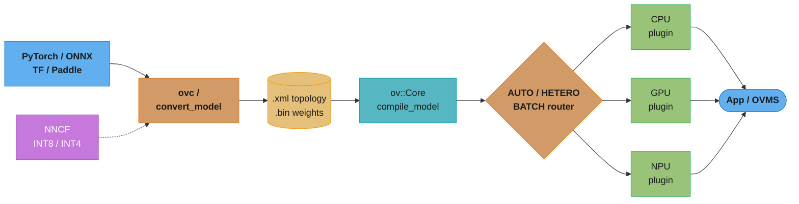
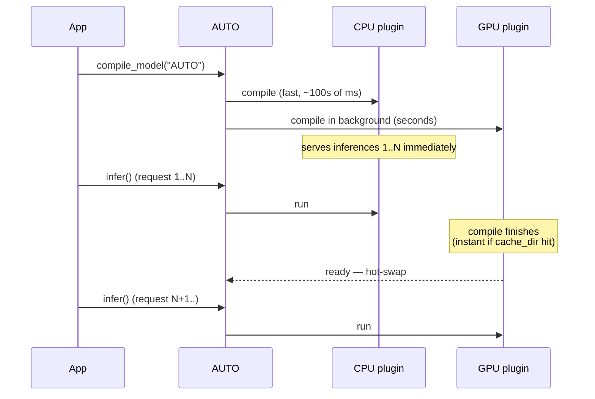
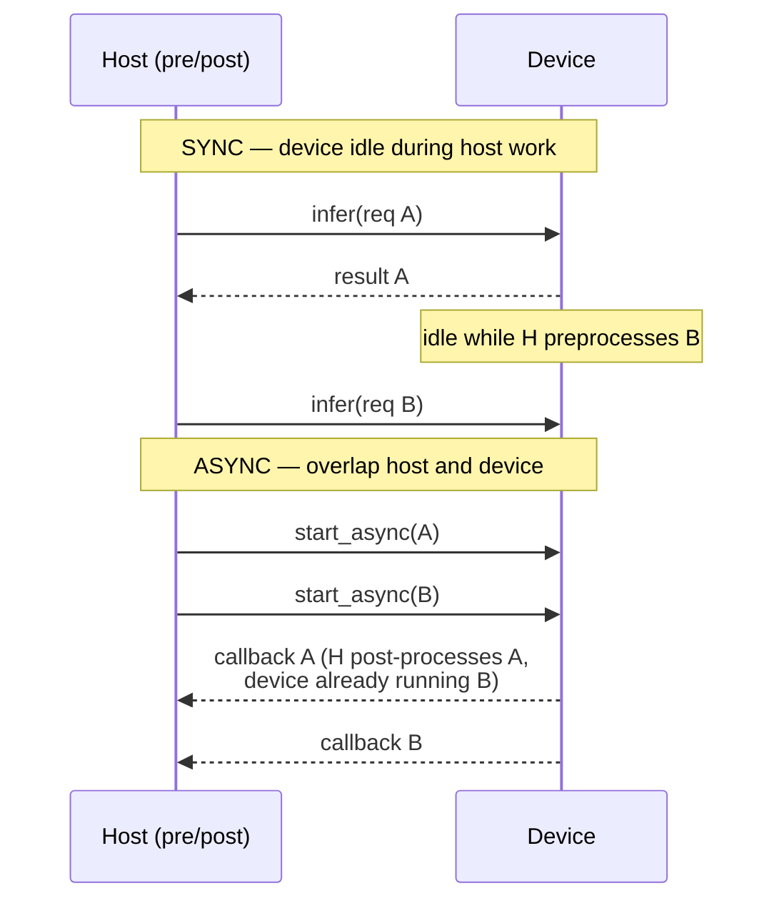
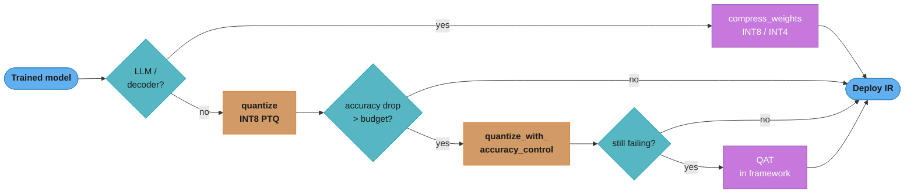
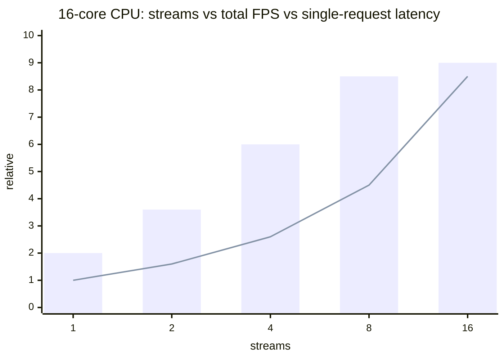
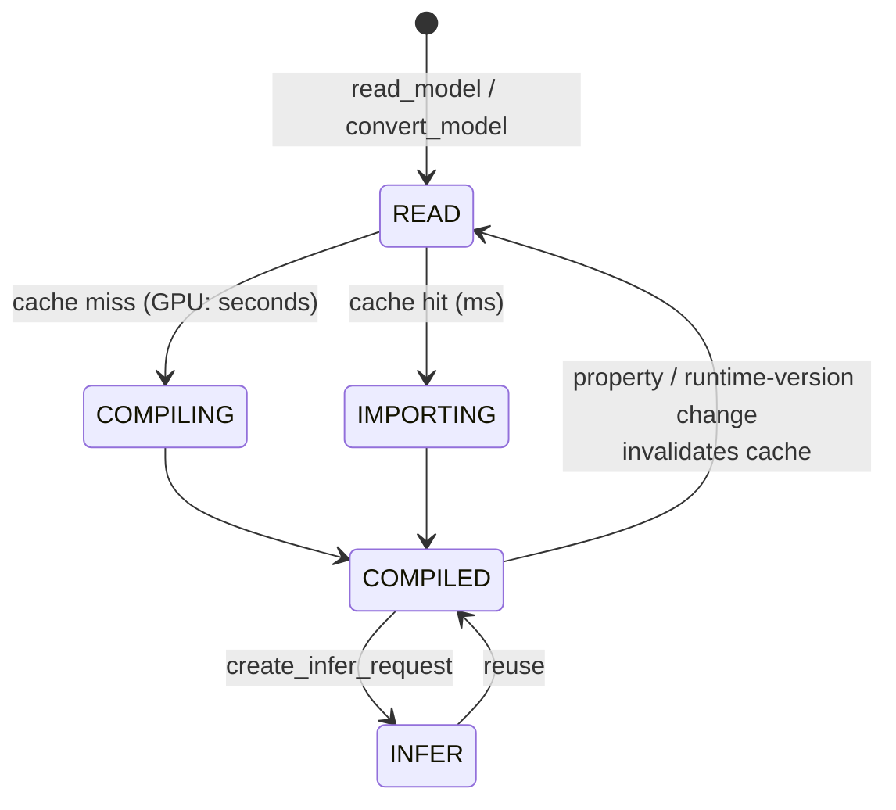

# Intel OpenVINO — CPU/Edge Inference & Model Optimization

> **Version anchor:** OpenVINO **2025.2** (API 2.0 / `ov::` namespace era). Every
> version-specific behavior is tagged inline against the release it landed in — e.g.
> `[2022.1]` for the `ov::` API, `[2024.0]` for the removal of the legacy
> `InferenceEngine::` API, `[2025.0]` for the removal of the Model Optimizer (`mo`)
> CLI. OpenVINO ships **quarterly** (`2025.0`, `2025.1`, `2025.2`, …) with occasional
> LTS lines; treat any "current default" here as accurate for the 2025.x line and
> re-verify a flag against the exact release you deploy, because defaults and device
> support move release to release.

---

## 1. Concept Overview

**OpenVINO** (Open Visual Inference and Neural-network Optimization) is Intel's
open-source toolkit for **optimizing and running inference** — not training — on
Intel hardware: x86-64 and ARM64 **CPUs**, Intel integrated and Arc/Flex/Max
**GPUs**, and the **NPU** (the "AI Boost" neural accelerator in Core Ultra /
Meteor-Lake-and-later client silicon). Its promise is *convert a model once, deploy
it across any Intel device* — the same portable graph runs on a laptop CPU, a data-
center Xeon, an integrated GPU, or an NPU, with each device's plugin compiling the
graph to its own kernels.

It has three pillars:

1. **OpenVINO Runtime** — a C++ core (`ov::Core`) with a **plugin architecture** (one
   shared library per device) and bindings for Python, C, and JavaScript/Node. This
   is what loads a model, compiles it for a device, and runs inference requests.
2. **Conversion & optimization** — turning a trained model (PyTorch, TensorFlow,
   ONNX, PaddlePaddle, TFLite) into OpenVINO's **Intermediate Representation (IR)** or
   reading it directly, and shrinking it with **NNCF** (INT8/INT4 quantization, weight
   compression).
3. **Serving & ecosystem** — **OpenVINO Model Server (OVMS)** for network serving, the
   **`openvino-genai`** / **`optimum-intel`** stack for LLMs on client hardware, and
   integrations (ONNX Runtime's OpenVINO Execution Provider, `torch.compile`, DL
   Streamer, OpenCV).

**Where it sits.** OpenVINO is the **CPU-first, edge-and-client** counterpoint to
GPU-centric serving stacks. Where [NVIDIA Triton](../nvidia_triton_inference_server/README.md)
and [vLLM](../../llm/vllm_deep_dive/README.md) assume a CUDA GPU, OpenVINO's default
target is the CPU already in the box — the huge installed base of Xeons and client
laptops that never had their inference tuned. It is the toolkit you reach for to
squeeze existing Intel capacity before buying accelerators, to run models at the edge
where there is no GPU, or to put an LLM on an AI PC's NPU.

**What it is NOT.** OpenVINO is not a training framework (NNCF's quantization-aware
training runs *inside* PyTorch/TensorFlow; OpenVINO consumes the result). It is not
oneAPI — it *uses* oneAPI's **oneDNN** (kernels) and **oneTBB** (threading) libraries,
but it is a distinct product. And it has **no CUDA device** — it does not run on
NVIDIA GPUs. (Conversely, NVIDIA Triton ships an **OpenVINO backend** so it can serve
CPU models inside a GPU fleet — the two products compose rather than compete.)

**API-era disambiguation.** Everything in this module is **API 2.0** — the `ov::`
C++ namespace and the top-level `openvino` Python package, introduced in `[2022.1]`.
The **legacy API 1.0** (`InferenceEngine::` / `IECore` in C++, `openvino.inference_engine`
in Python, and the standalone nGraph API) was **removed in `[2024.0]`**. If you find
`InferenceEngine::Core` in a tutorial, it is pre-2024 and won't compile against a
current runtime.

---

## 2. Intuition

**One-line analogy:** OpenVINO is a **cross-compiler plus a JVM for neural networks**
— you compile a model once to a portable "bytecode" (the IR / `ov::Model`), and each
device plugin acts as a JIT that compiles that bytecode down to its own silicon at
load time.

**Mental model.** Think in three layers:

- **`ov::Model`** is the portable graph — device-agnostic bytecode.
- **CPU / GPU / NPU plugins** are the JITs — each turns the graph into fused,
  layout-optimized kernels for its hardware when you call `compile_model`.
- **AUTO** is the launcher — hand it the graph and it picks the machine (and even
  serves the first requests on the CPU while a slower device warms up).

**Why it matters.** Most inference in the world runs on **CPUs nobody tuned**. The
lever Triton pulls on a GPU — *more model instances, deeper batching* — becomes, on a
CPU, the **streams × infer-requests** lever: how you partition cores across concurrent
requests. Get that partition right and a plain Xeon delivers multiples of its naïve
throughput; get it wrong and you leave two-thirds of the machine idle.

**Key insight.** On a CPU, **latency and throughput are a core-partitioning decision**.
One request using all cores minimizes latency; many requests each using a few cores
maximizes throughput — and they are mutually exclusive on the same box. OpenVINO's
**performance hints** (`LATENCY` vs `THROUGHPUT`) automate that partition so you
declare intent instead of hand-computing stream counts.

---

## 3. Core Principles

1. **One portable graph, per-device compilation.** You load or convert a model to a
   single `ov::Model`, then `compile_model(model, device)`. The **plugin** owns the
   hard part — operator fusion, memory layout, kernel selection — so the same graph is
   optimal on a CPU and on a GPU without you rewriting it.

2. **Hints over knobs.** Declare *what you want* — `LATENCY`, `THROUGHPUT`, or
   `CUMULATIVE_THROUGHPUT` — and let the plugin derive the number of streams, threads,
   and infer requests. Raw knobs (`ov::num_streams`, `ov::inference_num_threads`)
   still exist, but they are the escape hatch, not the front door.

3. **Throughput comes from concurrent infer requests, not bigger calls.** A single
   synchronous `infer()` leaves the device idle during pre/post-processing. Saturation
   comes from running **multiple asynchronous `InferRequest`s in flight** — the direct
   analog of Triton's model instances.

4. **Optimization is a build-time artifact, not a runtime toggle.** FP16 compression,
   INT8 PTQ, INT4 weight compression each produce a **new model file**. You cannot flip
   a model to INT8 at `compile_model` time; you quantize it offline with NNCF and
   deploy the result. (Same principle as Triton's build-time precision decision.)

5. **Measure before you tune.** `benchmark_app` reports the real throughput/latency of
   a model on a device under a chosen hint, with the streams and infer-request counts
   the plugin actually selected. Reproduce those settings in your app before hand-
   tuning anything.

---

## 4. Types / Architectures / Strategies

OpenVINO's "architecture" is a **taxonomy of device plugins, virtual devices, model-
ingestion paths, and deployment shapes**. This is the technology-flavor read of §4:
the component and topology map, not an abstract pattern catalog.

### 4.1 Device Plugin Taxonomy

The runtime discovers one shared-library **plugin per device class**. `ov::Core::get_available_devices()`
lists what's present.

| Device | Backend | Hardware | Precision sweet spot | Notes |
|--------|---------|----------|----------------------|-------|
| **CPU** | oneDNN + oneTBB | x86-64 (AVX2/AVX-512/**VNNI**/**AMX**) and ARM64 | INT8 (VNNI/AMX), BF16 (AMX) | The default, always available; dynamic ISA dispatch at runtime |
| **GPU** | OpenCL / Level Zero + oneDNN | Intel iGPU + Arc/Flex/Max discrete | FP16 (default), INT8 (**XMX** on Arc) | Compiles kernels at `compile_model` time — the cold-start cost |
| **NPU** | Level Zero, compiler-in-driver | Core Ultra "AI Boost" `[2023.2+]` | INT8, low-power sustained loads | Prefers **static shapes**; perf-per-watt play for client/edge |

**Removed devices (don't cite as current):** MYRIAD / Neural Compute Stick 2 and HDDL
were removed in `[2023.0]`; **GNA** (the low-power audio accelerator) was deprecated in
the `[2023.x]` LTS line and subsequently removed. The **NPU** is the successor story on
modern client silicon.

### 4.2 Virtual / Meta Devices

These are plugins that don't map to one piece of silicon — they route across the real
ones.

| Virtual device | What it does | When |
|----------------|--------------|------|
| **AUTO** | Picks the best available device by an internal priority (roughly discrete GPU → integrated GPU → NPU → CPU); can serve first inferences on CPU while an accelerator compiles | The default choice when you don't want to hard-code a device |
| **MULTI** | Runs the model on several named devices in parallel | Legacy — superseded by AUTO's `CUMULATIVE_THROUGHPUT` mode |
| **HETERO** | Splits one graph across devices by per-operation affinity | A model with ops one device can't run — fall back op-by-op |
| **BATCH** | Automatically groups concurrent requests into a batch | Usually applied implicitly by the GPU under the `THROUGHPUT` hint |

### 4.3 Model-Ingestion Strategies

| Path | How | Adds |
|------|-----|------|
| **Direct read** | `core.read_model("model.onnx")` | ONNX, TF SavedModel/frozen, TFLite, PaddlePaddle, and IR — no conversion step |
| **Python convert** | `ov.convert_model(torch_model, example_input=…)` | PyTorch (needs a traced example input), in-memory graph |
| **Offline `ovc`** | `ovc model.onnx` → `model.xml` + `model.bin` | An IR artifact: faster load, no framework deps in prod, FP16 compression, cacheable |

### 4.4 Execution Modes

- **Synchronous single-request** — `infer()`; simplest, lowest single-request latency,
  but the device idles during host-side pre/post work.
- **Asynchronous multi-request** — `start_async()` + callbacks across several
  `InferRequest`s; the throughput mode.
- **Stateful sequential** — models with internal `ReadValue`/`Assign` state (LLM KV
  cache); the request carries state across calls instead of re-uploading it.

### 4.5 Deployment Shapes

- **Embedded in-process library** — the default and the biggest contrast with Triton:
  OpenVINO ships *inside* your application binary. There is no server to run.
- **OpenVINO Model Server (OVMS)** — a standalone C++ server exposing gRPC/REST
  (KServe v2 compatible) for a network deployment.
- **Via integration** — Triton's OpenVINO backend, ONNX Runtime's OpenVINO Execution
  Provider, or `torch.compile(backend="openvino")`.

### 4.6 Optimization Strategy Taxonomy

- **FP16 compression** — halves the `.bin`; on by default in `ovc`. Nearly always safe.
- **INT8 PTQ** (NNCF) — post-training quantization from a small calibration set.
- **Accuracy-aware PTQ** — PTQ with a validation loop that reverts the worst layers to
  keep accuracy inside a budget.
- **QAT** — quantization-aware training inside the framework, for when PTQ can't hold
  accuracy.
- **Weight-only INT8/INT4** — for LLMs, compress *weights* while activations stay
  FP16 (decode is memory-bandwidth-bound, so shrinking weights is the win).

---

## 5. Architecture Diagrams

### 5.1 The End-to-End Stack



A trained model is converted (optionally after NNCF quantization) to IR, loaded by
`ov::Core`, compiled by a device plugin — directly or via a virtual-device router —
and consumed in-process or through OVMS.

### 5.2 AUTO — Hiding First-Inference Latency



AUTO's headline trick: the GPU/NPU can take seconds to compile a graph. Rather than
block, AUTO serves the opening requests on the always-ready CPU, then transparently
switches to the accelerator once it's warm. `ov::cache_dir` makes the warm-up instant
on subsequent runs.

### 5.3 Synchronous Loop vs Asynchronous Pipeline



The synchronous loop leaves the device idle while the host prepares the next input.
Two-plus infer requests in flight overlap host and device work, keeping the silicon
busy — this is the throughput lever, the CPU analog of Triton's concurrent instances.

### 5.4 NNCF Optimization Decision



The routing that keeps accuracy inside budget: weight-only compression for LLMs, PTQ
for CNNs, escalating to accuracy-aware PTQ and finally QAT only when the drop exceeds
the budget.

### 5.5 Why THROUGHPUT Is Slower for One Request



More streams raise aggregate throughput (bars) up to a plateau, but each stream gets a
smaller slice of the cores, so a single request's latency (line) *rises*. This is the
visual answer to the most common OpenVINO gotcha — `THROUGHPUT` mode makes one
isolated request *slower*.

### 5.6 Compile / Cache Lifecycle



With `ov::cache_dir` set, the second load of the same model+device+properties skips
compilation entirely and imports the cached blob — the difference between seconds and
milliseconds on GPU/NPU. Changing a compile property or upgrading the runtime
invalidates the cache and forces a rebuild.

---

## 6. How It Works — Detailed Mechanics

### 6.1 Package Layout and Plugin Discovery

`pip install openvino` installs the runtime plus the CPU/GPU/NPU plugins and their
`plugins.xml` registry; `ov::Core` reads that registry to find each device's shared
library at startup. The older **`openvino-dev`** package (which bundled Model
Optimizer, POT, and accuracy tools) is **discontinued** — those tools moved into the
main package (`ovc`) or into separate packages (`nncf`, `optimum-intel`).

```python
import openvino as ov            # API 2.0 top-level package [2022.1+]
core = ov.Core()
print(core.available_devices)    # e.g. ['CPU', 'GPU', 'NPU']
print(core.get_property("CPU", "FULL_DEVICE_NAME"))
```

### 6.2 IR Anatomy — `.xml` + `.bin`

OpenVINO's native format is the **Intermediate Representation**: a human-readable
`.xml` holding the **topology** (opset-versioned layers and the edges between their
ports) and a binary `.bin` holding the **weights**.

```xml
<!-- model.xml (abridged) — IR v11 -->
<layer id="7" name="conv1" type="Convolution" version="opset1">
  <data strides="2,2" pads_begin="3,3" pads_end="3,3" dilations="1,1"/>
  <input>  <port id="0" precision="FP16">…</port> </input>
  <output> <port id="2" precision="FP16">…</port> </output>
</layer>
```

- Weights live in `.bin` at byte offsets the `.xml` references — the `.xml` is tiny,
  the `.bin` carries the mass.
- **FP16 weight compression is on by default** when converting, halving the `.bin`
  with negligible accuracy loss (weights are decompressed to the compute precision at
  inference).
- **Forward-compatibility rule:** a **newer** runtime reads an **older** IR, but not
  the reverse. An IR built by a 2025.2 runtime may fail to load on a 2024.x runtime —
  pin the runtime that *produces* your IR to ≤ the runtime that *consumes* it.

### 6.3 Conversion — `ovc` and `convert_model`

```bash
# Offline: ONNX -> IR. FP16 compression is the DEFAULT (flag turns it OFF).
ovc model.onnx --output_model ir/model.xml
ovc model.onnx --output_model ir/fp32.xml --compress_to_fp16=False   # opt out
```

```python
# In-memory: PyTorch needs a traced example input to fix shapes/dtypes.
import torch, openvino as ov
ov_model = ov.convert_model(torch_model, example_input=torch.rand(1, 3, 224, 224))
ov.save_model(ov_model, "ir/model.xml")   # save_model compresses to FP16 by default
```

> **`mo` is gone, and `ovc` is not a rename.** The old **Model Optimizer** (`mo`) was
> deprecated in `[2023.1]` and **removed in `[2025.0]`**. `ovc` / `convert_model`
> deliberately **dropped** the preprocessing flags `--mean_values`, `--scale_values`,
> and `--reverse_input_channels` — that functionality moved into the runtime's
> `PrePostProcessor` (§6.15). Don't show `mo` commands as current, and don't expect
> `--mean_values` on `ovc`.

### 6.4 The Core Inference Loop (C++)

```cpp
#include <openvino/openvino.hpp>
ov::Core core;
auto model    = core.read_model("model.xml");                 // build ov::Model
auto compiled = core.compile_model(model, "AUTO",             // JIT for a device
                    ov::hint::performance_mode(ov::hint::PerformanceMode::THROUGHPUT));
auto req      = compiled.create_infer_request();              // one request
req.set_input_tensor(input);                                  // bind input
req.infer();                                                  // synchronous run
auto out = req.get_output_tensor();                           // read result
```

`read_model` builds the device-agnostic graph; `compile_model` is where the plugin
does fusion, layout selection, and kernel compilation for the chosen device; a
`CompiledModel` owns the compiled kernels and spawns cheap `InferRequest`s.

### 6.5 The Same Loop in Python

```python
core = ov.Core()
compiled = core.compile_model("model.xml", "CPU")
result = compiled(input_array)                # infer_new_request shorthand
# result is keyed by output; index or use compiled.output(0)
```

The one-liner call is convenient but adds per-call Python overhead. For throughput,
drive it with an `AsyncInferQueue` (§6.13), which amortizes that overhead across many
requests in flight.

### 6.6 Properties and Hints

```python
compiled = core.compile_model("model.xml", "CPU", {
    ov.properties.hint.performance_mode(): ov.properties.hint.PerformanceMode.THROUGHPUT,
    ov.properties.hint.num_requests(): 4,          # cap concurrent requests
})
# Ask the plugin what it chose:
nireq = compiled.get_property(ov.properties.optimal_number_of_infer_requests())
print("optimal infer requests:", nireq)
```

You declare intent with `performance_mode` (`LATENCY` / `THROUGHPUT` /
`CUMULATIVE_THROUGHPUT`) and read back what the plugin decided — most importantly
`optimal_number_of_infer_requests`, which tells your app how many requests to keep in
flight.

### 6.7 CPU Plugin Internals — Streams, Threads, and ISA Dispatch

The CPU plugin builds on **oneDNN** kernels and a **oneTBB** thread pool. At runtime
it dispatches to the best instruction set the CPU exposes — AVX2 → **AVX-512 VNNI**
(INT8) → **AMX** (BF16/INT8 on Sapphire Rapids and later). You don't recompile; the
same binary picks the widest ISA available.

The **streams** model is the heart of CPU tuning:

- **`LATENCY` hint** → **one stream** spanning all physical cores of a NUMA node — one
  request, all the hardware.
- **`THROUGHPUT` hint** → **N streams**, each pinned to a subset of cores — N requests
  run concurrently, each on its slice.

```python
# Manual override (the escape hatch — prefer hints):
compiled = core.compile_model("model.xml", "CPU", {
    ov.properties.num_streams(): 8,                    # 8 concurrent streams
    ov.properties.inference_num_threads(): 32,         # threads across all streams
    ov.properties.hint.scheduling_core_type():         # P-cores vs E-cores on hybrids
        ov.properties.hint.SchedulingCoreType.PCORE_ONLY,
    ov.properties.hint.enable_hyper_threading(): False,
})
```

On hybrid client CPUs (P-cores + E-cores), `scheduling_core_type` and
`enable_hyper_threading` decide which cores the streams land on — a knob that doesn't
exist on uniform server CPUs.

### 6.8 GPU Plugin Internals

The GPU plugin compiles OpenCL / Level-Zero kernels **at `compile_model` time** — this
is the seconds-long cold start that `cache_dir` (§6.14) exists to eliminate. GPU
inference precision defaults to **FP16**. For video pipelines, **remote tensors**
(`ov::RemoteTensor`) let you keep a decoded frame in GPU memory and infer on it with
**zero host-copy** (§6.25).

### 6.9 NPU Plugin

The NPU plugin `[2023.2+]` targets the Core Ultra "AI Boost" accelerator through a
**Level Zero** driver with a **compiler in the driver**. It prefers **static shapes**
(dynamic-shape models may fail to compile or fall back), and it wins on **sustained,
power-constrained** small-model workloads — the perf-per-watt target for AI-PC
scenarios where running the CPU/GPU flat-out would drain the battery.

### 6.10 AUTO Device Mechanics

```python
# Explicit candidate list is best practice in prod:
compiled = core.compile_model("model.xml", "AUTO:GPU,CPU", {
    ov.properties.hint.performance_mode(): ov.properties.hint.PerformanceMode.THROUGHPUT,
})
```

AUTO selects by an internal priority and, by default, uses the **CPU-first startup
fallback**: it begins serving on the CPU while the GPU/NPU compiles, then hot-swaps
(§5.2). Disable that with `enable_startup_fallback(False)` if you require the target
device from the first request. The **`CUMULATIVE_THROUGHPUT`** mode fans requests
across *all* candidate devices at once — the modern replacement for the MULTI device.

### 6.11 HETERO Mechanics

```python
# See how ops would be split across devices:
core.set_property("HETERO", {ov.properties.device.priorities(): "GPU,CPU"})
supported = core.query_model(model, "HETERO:GPU,CPU")   # op -> device affinity map
compiled = core.compile_model(model, "HETERO:GPU,CPU")
```

HETERO splits **one graph across devices op-by-op**: ops the GPU supports run on the
GPU, the rest fall to the CPU, and OpenVINO inserts the transfers. Contrast AUTO,
which places the **whole model** on one device. Use HETERO when a single unsupported
op would otherwise block the whole model from the accelerator.

### 6.12 Automatic Batching (the BATCH Device)

Under the GPU + `THROUGHPUT` hint, OpenVINO implicitly wraps the model in the **BATCH**
device: it collects concurrent infer requests into a batch, runs them together, then
scatters the results. It is gated by `AUTO_BATCH_TIMEOUT` (default **1000 ms**) — how
long it waits to fill a batch before firing a partial one.

```python
compiled = core.compile_model("model.xml", "BATCH:GPU", {
    ov.properties.auto_batch_timeout(): 100,   # ms — cap the wait
})
```

The critical requirement: automatic batching only helps if the app keeps **many
concurrent infer requests in flight** — with one request at a time there is nothing to
batch, and you pay the timeout for nothing. (Contrast Triton's server-side dynamic
batcher, which batches across *network* clients.)

### 6.13 The Async API — Broken Sync Loop, Then the Fix

**Broken (device idles during host work):**

```python
# Anti-pattern: synchronous loop. GPU/CPU sits idle while Python pre/post-processes.
for frame in stream:
    x = preprocess(frame)        # device idle
    y = compiled(x)              # blocks until done
    postprocess(y)               # device idle
```

**Fixed (overlap host and device with an infer-request pool):**

```python
def on_done(request, userdata):
    postprocess(request.get_output_tensor().data, userdata)

queue = ov.AsyncInferQueue(compiled, jobs=nireq)   # nireq = optimal_number_of_infer_requests
queue.set_callback(on_done)
for i, frame in enumerate(stream):
    queue.start_async({0: preprocess(frame)}, userdata=i)   # returns immediately if a slot is free
queue.wait_all()
```

`AsyncInferQueue` keeps `nireq` requests in flight; while the device computes one
frame, the host preprocesses the next and post-processes a finished one. The device
stops idling — the single biggest real-world throughput win, and the reason
`benchmark_app`'s numbers look nothing like a naïve sync loop.

### 6.14 Model Caching

```python
core.set_property({ov.properties.cache_dir(): "/var/cache/ov"})
compiled = core.compile_model("model.xml", "GPU")   # 1st run compiles; later runs import
```

With `cache_dir` set, the plugin serializes the **compiled blob** after the first
`compile_model` and imports it thereafter — turning a seconds-long GPU/NPU compile into
a millisecond load. The cache key includes the **model hash, the runtime version, and
the compile properties**, so any of those changing rebuilds the cache. For explicit
control you can `compiled.export_model(stream)` and `core.import_model(stream, "GPU")`
to ship a pre-compiled blob yourself.

### 6.15 Preprocessing — Baking Steps Into the Graph

```python
from openvino.preprocess import PrePostProcessor, ColorFormat, ResizeAlgorithm
ppp = PrePostProcessor(model)
ppp.input().tensor() \
    .set_element_type(ov.Type.u8) \
    .set_layout(ov.Layout("NHWC")) \
    .set_color_format(ColorFormat.BGR)          # raw camera frame: u8, NHWC, BGR
ppp.input().preprocess() \
    .convert_element_type(ov.Type.f32) \
    .convert_color(ColorFormat.RGB) \
    .resize(ResizeAlgorithm.RESIZE_LINEAR) \
    .mean([123.675, 116.28, 103.53]).scale([58.395, 57.12, 57.375])
ppp.input().model().set_layout(ov.Layout("NCHW"))  # model wants NCHW
model = ppp.build()                                 # steps become graph ops
```

`PrePostProcessor` **compiles resize/color-convert/normalize/layout into the model
graph**, so they run **on the device** (and can be fused). This replaces per-frame
`cv2`/NumPy preprocessing on the Python thread — the hidden bottleneck that starves the
device in most naïve pipelines. It is also where the old `mo --mean_values` flags went.

### 6.16 Dynamic Shapes and `reshape`

```python
# Bounded dynamic dims (batch fixed at 1, spatial dims 1..512):
model.reshape({0: ov.PartialShape([1, 3, ov.Dimension(1, 512), ov.Dimension(1, 512)])})
```

A model can carry dynamic dimensions (`-1`) or **bounded** ones (`Dimension(1, 512)`).
Dynamism costs performance — the plugin can't specialize kernels to a fixed shape — so
if your input size is actually fixed, `reshape()` to a **static** shape for the fastest
kernels. The **NPU in particular needs static shapes**; feeding it a dynamic model is a
common cause of NPU compile failure.

### 6.17 Stateful Models (LLM KV-Cache)

```python
for req in [infer_request]:
    req.reset_state()                 # clear KV cache between sequences
    # ... generate tokens; state (ReadValue/Assign ops) persists across infer() calls
```

A **stateful** model holds internal state (`ReadValue`/`Assign` ops) — for LLMs, the
**KV cache** lives in device memory as model state instead of being passed in and out
as tensors every token. This is why `optimum-intel` exports LLMs **stateful by
default**: round-tripping a growing KV cache through input/output tensors every token
would dominate the runtime. `query_state()` / `reset_state()` manage it.

### 6.18 NNCF Post-Training Quantization (INT8)

```python
import nncf, openvino as ov
def transform_fn(item):
    return preprocess(item["image"])                 # dataloader item -> model input
calib = nncf.Dataset(calibration_loader, transform_fn)
ov_model = ov.Core().read_model("model.xml")
int8_model = nncf.quantize(ov_model, calib,          # ~300 representative samples
                           preset=nncf.QuantizationPreset.MIXED)
ov.save_model(int8_model, "model_int8.xml")
```

**NNCF** inserts `FakeQuantize` ops, runs the ~300-sample calibration set to learn
activation ranges, then folds them into INT8. On VNNI/AMX CPUs INT8 typically runs
**2–4×** faster than FP32 at a fraction of the memory. Fragile layers (e.g. a final
softmax) can be excluded with an `ignored_scope`. **POT**, the old Post-training
Optimization Tool, is **removed** — NNCF is the only quantization path now.

### 6.19 Accuracy-Aware Quantization

```python
int8 = nncf.quantize_with_accuracy_control(
    ov_model, calibration_dataset=calib, validation_dataset=val,
    validation_fn=validate,          # returns a metric on the validated model
    max_drop=0.01,                   # tolerate <=1% metric drop
)
```

When plain PTQ drops too much accuracy, this variant quantizes, **measures on a
validation set**, and iteratively **reverts the most-damaging layers to floating point**
until the drop is within `max_drop`. It trades a little speed for a bounded accuracy
guarantee — the fix for "INT8 tanked my accuracy."

### 6.20 LLM Weight Compression (INT8 / INT4)

```python
from nncf import compress_weights, CompressWeightsMode
compressed = compress_weights(ov_model,
    mode=CompressWeightsMode.INT4_ASYM,   # 4-bit asymmetric
    group_size=128,                       # weights share a scale per 128-element group
    ratio=0.8,                            # 80% of layers to INT4, rest INT8 (sensitive ones)
    awq=True)                             # activation-aware scaling for better accuracy
```

For LLMs you compress **weights only** (activations stay FP16) because decode is
**memory-bandwidth-bound** — shrinking the weights you stream per token is the win. The
memory math for a 7B model: **FP16 ≈ 14 GB → INT8 ≈ 7 GB → INT4 ≈ 3.5–4 GB**, which is
what lets a 7B model run on a laptop. `group_size` trades accuracy for size (smaller
groups = more scales = better accuracy, bigger file); `ratio` keeps the most sensitive
layers at INT8.

### 6.21 The GenAI Path — `optimum-intel` and `openvino-genai`

```bash
# Export + compress an LLM to OpenVINO in one command:
optimum-cli export openvino --model meta-llama/Llama-3.1-8B-Instruct \
    --weight-format int4 llama_ov/
```

```python
import openvino_genai as ov_genai
pipe = ov_genai.LLMPipeline("llama_ov", "GPU")      # or "CPU" / "NPU"
print(pipe.generate("Explain OpenVINO in one line.", max_new_tokens=64,
                    streamer=lambda tok: print(tok, end="", flush=True)))
```

`optimum-intel` bridges Hugging Face to OpenVINO (export + optimize); **`openvino-genai`**
`[2024.2+]` is the lightweight C++-backed generation runtime with tokenization,
sampling, **continuous batching**, and speculative decoding built in — so you get an
LLM serving loop without pulling in the full `transformers` stack.

### 6.22 OpenVINO Model Server — `config.json` + Launch

```json
{
  "model_config_list": [
    {
      "config": {
        "name": "resnet",
        "base_path": "/models/resnet",          // numeric version subdirs: 1/, 2/, ...
        "target_device": "CPU",
        "nireq": 4,
        "plugin_config": {"PERFORMANCE_HINT": "THROUGHPUT"},
        "model_version_policy": {"latest": {"num_versions": 1}}
      }
    }
  ]
}
```

```bash
docker run -p 9000:9000 -p 8000:8000 -v /models:/models \
  openvino/model_server --config_path /models/config.json \
  --port 9000 --rest_port 8000        # gRPC 9000, REST 8000
```

**OVMS** is the network-serving layer: a C++ server that loads a model repository
(numeric version directories, exactly like Triton's) and exposes **KServe v2** and
TensorFlow-Serving APIs over gRPC/REST. It hot-reloads on `config.json` changes and
routes versions by policy (`latest`, specific, or `all`). It has **no built-in
authentication** — front it with an authenticating gateway.

### 6.23 OVMS Graphs and LLM Serving

Beyond single models, OVMS runs **MediaPipe graphs** — DAGs of model and Python nodes
for multi-stage pipelines (the successor to the older custom-node DAG scheduler). For
LLMs, OVMS exposes an **OpenAI-compatible** endpoint (`/v3/chat/completions`) backed by
**continuous batching** `[2024.2+]`, so an OpenVINO-served LLM is a drop-in for OpenAI-
client code.

### 6.24 `benchmark_app` — Reading the Numbers

```bash
benchmark_app -m model.xml -d CPU -hint throughput -t 30
#   -hint throughput  -> plugin auto-picks streams + nireq
#   -t 30             -> run 30 seconds
# Output reports: chosen nstreams, nireq, total throughput (FPS), latency percentiles
benchmark_app -m model.xml -d CPU -hint none -nstreams 8 -nireq 8   # manual mode
```

`benchmark_app` is the ground truth. Match its **hint and input shapes to production**,
then read back the **streams and nireq it selected** and replicate them in your app —
the top cause of "my app is slower than the benchmark" is a hint or nireq mismatch.

### 6.25 Worked Example — Streams × nireq × Throughput

ResNet-50 INT8 on a 32-core Xeon (VNNI), numbers illustrative of the *shape* of the
tradeoff:

| Mode | Streams | nireq | Single-req latency | Total throughput |
|------|---------|-------|--------------------|------------------|
| `LATENCY` | 1 | 1 | **8 ms** | 125 FPS |
| `THROUGHPUT` | 8 | 8 | 22 ms | **~360 FPS** |

The latency mode gives one request all 32 cores — lowest latency, but the cores sit
idle between requests. The throughput mode splits the cores into 8 streams: each
request is ~2.7× slower, but eight run at once for ~2.9× the aggregate FPS. Derive
`nireq` from `optimal_number_of_infer_requests`, not by guessing.

### 6.26 Zero-Copy Video with Remote Tensors

For a decode → infer pipeline on the iGPU, a decoded frame already lives in GPU
memory. Wrapping it as an `ov::RemoteTensor` and inferring on it directly avoids a
GPU→host→GPU round-trip per frame — for high-FPS video analytics that copy is often the
bottleneck, and eliminating it is the difference between real-time and dropped frames.

---

## 7. Real-World Examples

- **Retail / edge computer vision** — shelf monitoring, loss prevention, and people-
  counting pipelines run detector + classifier chains on in-store CPUs, converted to IR
  and INT8-quantized, avoiding a cloud GPU round-trip per camera frame.
- **DL Streamer video analytics** — Intel's GStreamer-based framework runs *N* concurrent
  decode+detect+classify streams per Xeon socket, with OpenVINO as the inference element.
- **AI-PC client apps** — Windows applications offload background-blur, super-resolution,
  and on-device assistants to the **NPU** via OpenVINO for perf-per-watt on battery.
- **LLMs on client hardware** — `optimum-intel` + `openvino-genai` run INT4-compressed
  7B/8B models on laptop CPUs, iGPUs, and NPUs — the memory math in §6.20 is what makes
  it fit.
- **Hugging Face CPU endpoints** — `optimum-intel` powers CPU-served transformer
  inference where a GPU would be idle-expensive for the traffic.
- **Inside a GPU fleet** — NVIDIA Triton's **OpenVINO backend** serves the CPU-bound
  models of a mixed deployment, letting one Triton control plane cover both GPU and CPU
  models.

---

## 8. Tradeoffs

### Performance Hints

| Hint | Streams created | Single-request latency | Aggregate throughput | Use when |
|------|-----------------|------------------------|----------------------|----------|
| `LATENCY` | 1 (all cores) | **Lowest** | Low | One user, latency-critical, sparse traffic |
| `THROUGHPUT` | N (partitioned) | Higher | **Highest** | Batch / high-concurrency serving |
| `CUMULATIVE_THROUGHPUT` | Across all devices | Higher | Highest (multi-device) | Several devices, saturate them all |

### Precision Ladder

| Precision | `.bin` size | Speed vs FP32 | Accuracy risk | Hardware needed |
|-----------|-------------|---------------|---------------|-----------------|
| FP32 | 1× | 1× | none | any |
| FP16 (default) | 0.5× | ~1× (CPU) / faster (GPU) | negligible | any (GPU native) |
| INT8 (PTQ) | 0.25× | **2–4×** | small, needs calibration | VNNI / AMX / XMX |
| INT4 (weights) | ~0.15× | memory-bound win | moderate (LLMs) | any (weights decompressed) |

### Ingestion

| Approach | Load time | Prod image deps | FP16 compression | Cacheable |
|----------|-----------|-----------------|------------------|-----------|
| Direct `read_model(onnx)` | Slower (parse) | ONNX importer | manual | yes |
| Offline IR (`ovc`) | **Fastest** | **none** (just runtime) | default | yes |

### Serving Options

| Option | Multi-framework | GPU story | LLM continuous batching | Deployment |
|--------|-----------------|-----------|-------------------------|------------|
| **Embed runtime** | via IR | Intel only | via `openvino-genai` | in-process, no server |
| **OVMS** | via IR | Intel only | yes (`/v3/`) | standalone C++ server |
| **Triton + OpenVINO backend** | many backends | **NVIDIA + Intel** | via TRT-LLM/vLLM backends | server, mixed fleet |
| **ONNX Runtime + OpenVINO EP** | ONNX only | Intel (per-op fallback) | n/a | in-process, existing ORT app |

---

## 9. When to Use / When NOT to Use

**Use OpenVINO when:**

- Your inference target is a **CPU or Intel edge/client device** — the common case
  where there is no GPU, or the GPU round-trip loses to a well-tuned CPU.
- You want to **standardize inference across an Intel fleet** (laptops, Xeons, NPUs)
  with one artifact and one API.
- You need **latency-sensitive small models** where a network hop to a GPU server costs
  more than the inference itself.
- You're putting an **LLM on AI-PC-class hardware** (INT4 weights on CPU/iGPU/NPU).
- You want to **exhaust existing Xeon capacity** before buying accelerators.

**Do NOT reach for OpenVINO when:**

- Your estate is **NVIDIA-GPU training/serving** — OpenVINO has no CUDA device; use
  [Triton](../nvidia_triton_inference_server/README.md) / [vLLM](../../llm/vllm_deep_dive/README.md).
- You need **massive-scale LLM serving** with paged attention and high concurrency —
  that's [vLLM](../../llm/vllm_deep_dive/README.md) / SGLang territory on GPUs.
- You need a **serving control plane across heterogeneous accelerators** — Triton's
  multi-backend model fits better (and can host OpenVINO too).
- The model **churns daily in PyTorch** and conversion friction would dominate — a
  `torch.compile(backend="openvino")` path may fit, but full IR conversion each day is
  overhead.

---

## 10. Common Pitfalls (Production War Stories)

- **THROUGHPUT hint on a single-user latency path.** A team set `THROUGHPUT`
  everywhere; P99 on an interactive endpoint **doubled** because each request now got a
  fraction of the cores. Use `LATENCY` for interactive, `THROUGHPUT` for batch.
- **No `cache_dir` in production.** Every pod restart re-compiled the GPU graph —
  seconds of cold start per replica during a rolling deploy. Setting `ov::cache_dir`
  turned it into a millisecond import.
- **`benchmark_app` numbers unreproducible in the app.** The app ran a **synchronous
  loop with one request**; the benchmark ran `THROUGHPUT` with 8 in flight. Match the
  hint *and* keep `nireq` requests in flight.
- **INT8 PTQ tanked accuracy on a transformer.** LayerNorm/dynamic-range layers don't
  quantize cleanly; plain PTQ dropped 5% accuracy. `quantize_with_accuracy_control`
  with `max_drop=0.01` (or weight-only compression) recovered it.
- **Forgot `example_input` for a PyTorch model.** `convert_model` needs a traced
  example to fix shapes/dtypes; without it, conversion fails or bakes wrong shapes.
- **Preprocessing in Python starved the device.** Per-frame `cv2.resize` on the host
  thread left the GPU 60% idle. Baking resize/normalize into the graph with
  `PrePostProcessor` fixed the pipeline throughput.
- **Dynamic-shape model on the NPU.** The NPU compile failed (or silently fell back)
  because the model had `-1` dims. `reshape()` to static shapes or use bounded dims.
- **AUTO silently landed on CPU.** The container was missing `/dev/dri` and the render
  group, so the GPU plugin wasn't visible; AUTO quietly used the CPU. Check
  `core.available_devices` at startup and pin `AUTO:GPU,CPU` explicitly.
- **Newer-runtime IR read by an older runtime.** An IR built with 2025.2 failed to load
  on a 2024.x replica during a partial rollout. IR is **forward-compatible only** — pin
  producer ≤ consumer runtime.
- **Stateless LLM export.** An LLM exported without state re-uploaded the growing KV
  cache every token, dominating latency. Export **stateful** (the `optimum-intel`
  default).
- **OVMS exposed without a gateway.** OVMS has no auth; an internally-reachable port was
  effectively open. Put an authenticating reverse proxy in front.
- **P-core/E-core scheduling surprise on a client CPU.** Streams landed on slow E-cores,
  halving throughput; `scheduling_core_type=PCORE_ONLY` fixed it.

---

## 11. Technologies & Tools

### 11.1 Profiling and Benchmarking

- **`benchmark_app`** — the ground-truth throughput/latency tool; reports the streams
  and nireq the plugin chose.
- **Per-layer profiling** — `InferRequest.get_profiling_info()` exposes per-op timings
  to find the hot layer.
- **Intel VTune / ITT** — OpenVINO emits ITT markers so VTune can attribute time to
  OpenVINO regions in a full-system profile.

### 11.2 Model Sources and Pipelines

- **Hugging Face + `optimum-intel`** — the modern model source (`optimum-cli export
  openvino`). The old **Open Model Zoo** (`omz_downloader`) is **archived/discontinued**
  — don't present it as current tooling.
- **NNCF** — the quantization/compression library (PTQ, accuracy-aware, weight
  compression, QAT).

### 11.3 Serving and Orchestration

- **OVMS on Kubernetes** — Helm chart / operator, KServe-compatible.
- **NVIDIA Triton OpenVINO backend** — serve CPU models inside a Triton fleet.
- **DL Streamer** — GStreamer-based video-analytics pipelines with OpenVINO inference
  elements.

### 11.4 Integration Surfaces

- **ONNX Runtime — OpenVINO Execution Provider** — accelerate an existing ORT
  deployment on Intel hardware with per-op fallback to the default EP.
- **`torch.compile(backend="openvino")`** `[2023.1+]` — run a PyTorch model through
  OpenVINO without an explicit export step, for models that churn in PyTorch.

### 11.5 Hardware Feature Matrix

| Feature | Hardware | Accelerates |
|---------|----------|-------------|
| AVX-512 **VNNI** | Cascade Lake+ Xeon / client | INT8 |
| **AMX** | Sapphire Rapids+ Xeon | BF16, INT8 (tiles) |
| **XMX** | Arc / Flex / Max GPUs | FP16, INT8 |
| **NPU** | Core Ultra AI Boost | INT8, low-power sustained |

For the GPU side of this contrast, see
[`ml/gpu_and_hardware_optimization`](../../ml/gpu_and_hardware_optimization/README.md)
and [`cuda/tensor_cores_and_mixed_precision`](../../cuda/tensor_cores_and_mixed_precision/README.md).

---

## 12. Interview Questions with Answers

**Q: Why is THROUGHPUT mode slower for a single request than LATENCY mode?**
Because THROUGHPUT partitions the CPU cores into several **streams**, so one request
runs on only a fraction of the cores instead of all of them. LATENCY mode gives a
single request every core of a NUMA node, minimizing its wall-clock time; THROUGHPUT
mode trades per-request latency for the ability to run many requests concurrently. If
you have one user at a time, THROUGHPUT is the wrong hint — it makes that user wait
longer while buying concurrency you aren't using.

**Q: What's the difference between the AUTO, MULTI, and HETERO virtual devices?**
AUTO picks one best device for the **whole model** (and can serve the first requests on
CPU while an accelerator warms up); HETERO splits **one graph across devices op-by-op**
by affinity; MULTI runs the model on several devices in parallel and is **legacy**,
superseded by AUTO's `CUMULATIVE_THROUGHPUT`. Reach for AUTO as the default, HETERO when
a single unsupported op would otherwise block the accelerator, and prefer
`CUMULATIVE_THROUGHPUT` over MULTI to saturate multiple devices at once.

**Q: Does OpenVINO need a GPU, and does it run on AMD CPUs or NVIDIA GPUs?**
No GPU is needed — OpenVINO is **CPU-first** and the CPU plugin is always available. It
runs on any x86-64 CPU (including AMD, though INT8 acceleration needs Intel's VNNI/AMX)
and on ARM64. It does **not** run on NVIDIA GPUs — there is no CUDA device; for NVIDIA
hardware you use Triton or vLLM. OpenVINO's GPU/NPU plugins target **Intel** silicon.

**Q: What changed between Model Optimizer (`mo`) and `ovc`/`convert_model`?**
The `mo` CLI was **removed in 2025.0**; `ovc` and the Python `convert_model` replaced
it, and they deliberately **dropped the preprocessing flags** (`--mean_values`,
`--scale_values`, `--reverse_input_channels`). That preprocessing moved into the runtime's
`PrePostProcessor` so it can run on-device and be fused. Also, FP16 compression is now
the **default** on conversion, whereas with `mo` it was opt-in.

**Q: Why did INT8 quantization tank my model's accuracy, and how do you fix it?**
Plain post-training quantization learns activation ranges from a small calibration set,
and layers with wide dynamic ranges (LayerNorm, attention, final softmax) can lose too
much precision. The fix is `nncf.quantize_with_accuracy_control` with a `max_drop`
budget — it quantizes, validates, and **reverts the most-damaging layers to floating
point** until accuracy is within budget — or `ignored_scope` to skip known-fragile
layers, or weight-only compression for LLMs.

**Q: Why is the first inference on a GPU or NPU slow, and how do you hide it?**
Because those plugins **compile kernels at `compile_model` time**, which takes seconds.
Two mechanisms hide it: `ov::cache_dir` serializes the compiled blob so subsequent loads
**import** in milliseconds, and AUTO's **CPU-first startup fallback** serves the opening
requests on the always-ready CPU while the accelerator compiles in the background, then
hot-swaps. In production you should set `cache_dir` on every replica.

**Q: If `read_model` can load ONNX directly, why bother producing IR?**
IR gives **faster load** (no framework parse), **no framework dependency** in the
production image (just the runtime), **default FP16 compression** halving the weights,
and clean **caching**. Direct ONNX read is fine for prototyping, but a converted IR
artifact is the leaner, faster deployment unit — and the conversion is where you'd apply
FP16/INT8 optimization anyway.

**Q: What's the difference between `nncf.quantize` and `nncf.compress_weights`, and why use each?**
`quantize` does full **INT8 activation + weight** quantization from a calibration set —
right for CNNs, where compute is the bottleneck. `compress_weights` compresses **weights
only** (INT8/INT4) and leaves activations FP16 — right for **LLMs**, where decode is
memory-bandwidth-bound so shrinking the streamed weights is the win. You quantize a
ResNet; you compress-weights a Llama.

**Q: Why doesn't my application reproduce `benchmark_app`'s throughput numbers?**
Almost always because the app runs a **synchronous loop with one infer request** while
`benchmark_app` runs the `THROUGHPUT` hint with multiple requests in flight. Match the
**hint**, keep `optimal_number_of_infer_requests` requests in flight via
`AsyncInferQueue`, and use the **same input shapes**. A hint or nireq mismatch is the
top cause of the gap.

**Q: How do asynchronous inference and multiple infer requests increase throughput?**
A single synchronous `infer()` leaves the device **idle** during host-side pre/post-
processing. Running several `InferRequest`s asynchronously overlaps that host work with
device compute — while the device runs frame N, the host preprocesses N+1 and post-
processes N−1. It's the CPU-and-edge analog of Triton's concurrent model instances, and
it's the single biggest real-world throughput lever.

**Q: What is `optimal_number_of_infer_requests` and how should an app use it?**
It's a property the **compiled model** exposes telling you how many concurrent infer
requests the plugin needs to saturate the device under the chosen hint. Your app should
read it after `compile_model` and size its `AsyncInferQueue` (or request pool) to that
number — hard-coding a different count either under-utilizes the device or over-subscribes
it. It's the bridge between the hint's stream count and your app's concurrency.

**Q: What does the LATENCY vs THROUGHPUT hint concretely change per device?**
On CPU, LATENCY creates **one stream over all cores** and THROUGHPUT creates **N streams
each on a core subset**. On GPU, THROUGHPUT additionally enables **automatic batching**
(the BATCH device) and picks a larger optimal request count. In both cases you're
declaring intent and letting the plugin derive streams, threads, batch size, and nireq —
rather than setting `num_streams`/`inference_num_threads` by hand.

**Q: AUTO placed my model on CPU even though the box has an Arc GPU — why?**
Usually the GPU plugin isn't **visible** to the runtime: in a container that means
`/dev/dri` isn't mounted or the process isn't in the render group; on bare metal it can
mean missing GPU drivers or an unsupported op forcing CPU. Check
`core.available_devices` at startup and pin an explicit candidate list (`AUTO:GPU,CPU`)
so a missing GPU is a loud failure, not a silent CPU fallback.

**Q: What's a stateful model, and why is a stateful LLM export dramatically faster?**
A stateful model holds internal state via `ReadValue`/`Assign` ops; for an LLM that
state is the **KV cache**, kept in device memory across `infer()` calls. A stateless
export would pass the growing KV cache in and out as tensors **every token**, and that
data movement dominates. `optimum-intel` exports LLMs stateful by default for exactly
this reason; `reset_state()` clears the cache between sequences.

**Q: What can and can't run on the NPU?**
The NPU runs quantized (INT8) and FP16 models well for **sustained, power-constrained**
workloads, and prefers **static shapes** — a dynamic-shape model may fail to compile or
fall back. It's a perf-per-watt device (AI-PC background tasks), not a peak-throughput
one; a latency-critical burst may still be faster on the CPU/GPU. Feed it static shapes
and INT8 and it shines; feed it a dynamic transformer and it struggles.

**Q: When do you serve with OVMS versus embedding the runtime versus Triton?**
Embed the runtime for **in-process** inference with no network hop (the default and
lowest latency). Use **OVMS** when you need a **network service** with KServe/TF-Serving
APIs, versioning, and hot-reload but your hardware is Intel. Use **Triton** when you
need one control plane across **heterogeneous accelerators** (NVIDIA GPUs + Intel CPUs)
— and note Triton can host OpenVINO via its OpenVINO backend.

**Q: What exactly is in the `.xml` versus the `.bin`, and what's the compatibility rule?**
The `.xml` holds the **topology** — opset-versioned layers and the edges between their
ports — and the `.bin` holds the **weights** at byte offsets the `.xml` references. The
compatibility rule is **forward-only**: a newer runtime reads an older IR, but an older
runtime may reject a newer IR. Pin the runtime that produces the IR to be no newer than
the runtime that consumes it, or a partial rollout will fail to load models.

**Q: Why bake preprocessing into the graph with `PrePostProcessor`?**
Because otherwise resize/color-convert/normalize runs on the **host Python thread**,
which becomes the bottleneck and leaves the device idle. `PrePostProcessor` compiles
those steps into the model graph so they run **on the device** and can be fused, and it
lets the model accept raw camera tensors (u8, NHWC, BGR) directly. It's also where the
removed `mo --mean_values` functionality now lives.

**Q: What does a dynamic-shape model cost, and when should you `reshape` to static?**
Dynamic dimensions prevent the plugin from **specializing kernels** to a fixed shape, so
inference is slower and memory planning is looser. If your real input size is fixed,
`reshape()` to a static shape for the fastest kernels; if it varies within a range, use
**bounded** dims (`Dimension(1, 512)`) to bound the specialization. The NPU in
particular needs static shapes.

**Q: FP16 compression is on by default — when can it hurt, and how do you disable it?**
FP16 halves the `.bin` with negligible loss for almost all models, but a model with
weights outside the FP16 range or extreme dynamic range can lose accuracy. Disable it
with `ovc --compress_to_fp16=False` (or the equivalent `save_model` argument) to keep
FP32 weights. Note the flag exists to turn compression **off** — it's already on by
default.

**Q: What makes a good calibration dataset for PTQ, and how many samples?**
Around **300 representative samples** that match the production input distribution —
enough to estimate activation ranges without over-fitting to a narrow slice. A
`transform_fn` maps each dataloader item to the model's expected input. Too few samples
or an unrepresentative set gives bad ranges and accuracy loss; the samples don't need
labels for plain PTQ (they do for accuracy-aware validation).

**Q: How is OpenVINO's automatic batching different from Triton's dynamic batching?**
OpenVINO's BATCH device batches **concurrent infer requests within one process** and
requires the app to keep many requests in flight (gated by `AUTO_BATCH_TIMEOUT`,
default 1000 ms). Triton's dynamic batcher batches across **network clients** on the
server side. OpenVINO's is a client-side concurrency mechanism (implicit under the GPU
THROUGHPUT hint); Triton's is a server-side request aggregator.

**Q: What's the difference between `optimum-intel`, `openvino-genai`, and the raw Runtime for LLMs?**
`optimum-intel` is the **export/optimize bridge** from Hugging Face (produces an
OpenVINO LLM). `openvino-genai` is the **generation runtime** — tokenization, sampling,
continuous batching, speculative decoding — a lightweight C++-backed loop you call with
`LLMPipeline`. The raw Runtime is the low-level `ov::Core` API you'd use to build your
own loop. Most LLM apps export with optimum-intel and serve with openvino-genai.

**Q: What do `group_size` and `ratio` control in INT4 weight compression?**
`group_size` is how many weights share one quantization scale — smaller groups (e.g. 128)
mean more scales, better accuracy, and a slightly larger file. `ratio` is the fraction
of layers compressed to INT4 versus kept at the more accurate INT8 — e.g. `ratio=0.8`
puts 80% at INT4 and keeps the 20% most sensitive layers at INT8. Together they trade
model size against accuracy.

**Q: Can OpenVINO train or fine-tune a model?**
No — OpenVINO is **inference-only**. NNCF's quantization-aware training (QAT) runs
**inside** PyTorch or TensorFlow's training loop; OpenVINO consumes the trained/QAT'd
result. If you need to train, you use the framework; OpenVINO optimizes and deploys what
comes out. This is the clean split from a training-and-serving stack.

**Q: How do P-core/E-core hybrid CPUs change scheduling, and what hints control it?**
On hybrid client CPUs, streams can land on slow **E-cores** and drag throughput. The
`scheduling_core_type` hint (`PCORE_ONLY` / `ECORE_ONLY` / `ANY_CORE`) chooses which
cores streams use, and `enable_hyper_threading` toggles logical cores. On uniform server
CPUs these don't apply. A common surprise is throughput halving because streams spread
onto E-cores — `PCORE_ONLY` fixes it.

**Q: When would you use `torch.compile(backend="openvino")` instead of exporting IR?**
When the model **churns in PyTorch** and you want OpenVINO acceleration without an
explicit export/convert step — `torch.compile(backend="openvino")` `[2023.1+]` traces and
runs it through OpenVINO in-place. Exporting IR is better for a stable model you deploy
repeatedly (faster load, no framework deps, cacheable). The compile backend trades that
for zero conversion friction during rapid iteration.

**Q: When is ONNX Runtime with the OpenVINO Execution Provider better than the native runtime?**
When you already have an **ONNX Runtime deployment** and want Intel acceleration without
rewriting to the OpenVINO API — the OpenVINO EP accelerates supported ops and **falls
back per-op** to ORT's default EP for the rest. The native runtime gives more control
(hints, PrePostProcessor, caching, OVMS) and typically higher performance, but the EP is
the low-friction path for an existing ORT stack.

**Q: What happens when the GPU plugin hits an operation it can't run?**
Under plain GPU it's an error at compile time; under **HETERO** the unsupported op runs
on the fallback device (CPU) while the rest stays on the GPU; under **AUTO** the whole
model may be placed on a device that supports it. The senior move is to `query_model`
first to see op affinity, then choose HETERO to keep most of the graph on the accelerator
rather than dropping the whole model to CPU.

**Q: How does model caching decide when to rebuild, and what invalidates it?**
The cache key is derived from the **model hash, the runtime version, and the compile
properties**. Any of them changing — an upgraded OpenVINO, a different hint, a `reshape`
— produces a new key and forces a recompile; an exact match imports the cached blob in
milliseconds. This is why an upgrade transparently rebuilds caches, and why you shouldn't
share a `cache_dir` across runtime versions expecting hits.

**Q: How do remote tensors enable zero-copy video inference on the iGPU?**
A decoded video frame from the GPU's media engine already lives in **GPU memory**;
wrapping it as an `ov::RemoteTensor` lets the GPU plugin infer on it **without copying**
to host and back. For high-FPS analytics that per-frame GPU→host→GPU round-trip is often
the bottleneck, so eliminating it is what makes a real-time pipeline real-time rather
than dropping frames.

**Q: What is CUMULATIVE_THROUGHPUT, and why did it replace the MULTI device?**
`CUMULATIVE_THROUGHPUT` is an AUTO performance mode that **fans inference requests across
all candidate devices at once** to sum their throughput. It replaced the separate MULTI
device because it folds multi-device throughput into the same AUTO + hints model instead
of being a distinct device you configure by hand — one consistent API for "use one best
device" and "use them all."

**Q: Why is INT8 typically 2–4× faster than FP32 on a modern Xeon, but not on an old one?**
Because the speedup comes from **hardware INT8 instructions** — AVX-512 VNNI and AMX —
that pack 8-bit MACs densely; a CPU without VNNI/AMX has to emulate INT8 and sees little
gain. So INT8's payoff is hardware-gated: big on Cascade Lake / Sapphire Rapids, modest
on a pre-VNNI chip. Always check the target CPU's ISA before promising INT8 speedups.

**Q: What is the practical difference between `save_model` compressing to FP16 and NNCF INT8?**
`save_model` / `ovc` FP16 compression is a **lossless-ish, calibration-free** halving of
the weights that's on by default and safe for almost any model. NNCF INT8 is a **lossy,
calibration-dependent** quantization that needs representative data and can shift accuracy
but delivers the 2–4× VNNI/AMX speedup. FP16 is a free size win; INT8 is a deliberate
speed optimization with an accuracy budget to manage.

---

## 13. Best Practices

- **Pin the whole stack together** — `openvino`, `nncf`, and `optimum-intel` versions
  move in lockstep; a mismatched NNCF can produce an IR a runtime rejects.
- **Always set `ov::cache_dir` in production** — it turns GPU/NPU cold starts from
  seconds into milliseconds on every replica restart.
- **Choose hints before raw knobs** — set `LATENCY`/`THROUGHPUT` first; only reach for
  `num_streams`/`inference_num_threads` when profiling proves the hint suboptimal.
- **Size `nireq` from `optimal_number_of_infer_requests`** — don't hard-code request
  pool size; read it from the compiled model.
- **Bake preprocessing into the graph** — use `PrePostProcessor` so resize/normalize run
  on-device, not on the Python thread.
- **Benchmark honestly** — run `benchmark_app` with the **production hint and shapes**,
  then replicate the chosen streams/nireq in the app.
- **Calibrate PTQ with ~300 representative samples** and set an explicit accuracy budget
  with `quantize_with_accuracy_control(max_drop=…)`.
- **Weight-compress LLMs, full-quantize CNNs** — INT4/INT8 `compress_weights` for
  decoders, `quantize` for vision models.
- **Export LLMs stateful** — keep the KV cache as model state (the `optimum-intel`
  default).
- **Pin AUTO's candidate list explicitly** (`AUTO:GPU,CPU`) so a missing GPU fails loud
  instead of silently dropping to CPU.
- **Front OVMS with an authenticating gateway** — it has no built-in auth.
- **Keep IR producer ≤ consumer runtime** — IR is forward-compatible only.

---

## 14. Case Study — Moving a Retail-CV Pipeline off GPUs onto the Existing Xeon Fleet

**The situation.** A retailer runs shelf-monitoring across **40 stores × 8 camera
streams** (320 streams). The pipeline — a YOLO-class detector plus a ResNet-50 product
classifier — currently runs on a **cloud T4 GPU pool**, with every store backhauling
frames over the network. The GPU pool is expensive, and the network round-trip adds
latency and a bandwidth bill. Each store already has a **Sapphire Rapids Xeon** (AMX)
edge box doing other work.

**The move.** Bring inference to the edge box, on CPU, with OpenVINO:

1. **Convert** both models to IR (`ovc detector.onnx`, `ovc resnet.onnx`) — FP16 by
   default, no PyTorch in the edge image.
2. **Quantize INT8** with accuracy-aware NNCF: `quantize_with_accuracy_control(...,
   max_drop=0.01)` on ~300 in-store frames, so INT8 gets the **AMX** 2–4× speedup while
   staying within 1% mAP/accuracy. Fragile detection-head layers go in `ignored_scope`.
3. **Bake preprocessing** into each graph with `PrePostProcessor` — the camera delivers
   u8/NHWC/BGR; resize + BGR→RGB + normalize + NHWC→NCHW run on-device, freeing the host
   thread that was the real bottleneck.
4. **THROUGHPUT hint + async** — 8 streams, `nireq` from
   `optimal_number_of_infer_requests`, driven by an `AsyncInferQueue` so all 8 camera
   streams keep the cores busy.
5. **`cache_dir`** so a container restart during a nightly deploy imports the compiled
   blobs in milliseconds instead of recompiling.
6. **OVMS** on the edge box with a `config.json` model repository (versioned dirs,
   `PERFORMANCE_HINT: THROUGHPUT`, Prometheus metrics), so store-ops can roll a new model
   version by dropping a numbered directory and letting OVMS hot-reload.

**The numbers (illustrative shape of the win).**

| | Cloud T4 baseline | Edge Xeon (INT8 + AMX, THROUGHPUT) |
|--|-------------------|-------------------------------------|
| Detector per-stream | GPU + network hop | on-box, no backhaul |
| Aggregate per store | 8 streams to a shared T4 | 8 streams × ~2.9× throughput vs FP32 CPU |
| Latency | + network RTT | local, sub-frame |
| Cost | GPU pool + egress | existing Xeon capacity |

**Outcome.** INT8 on AMX gave roughly **3× the throughput** of the naïve FP32 CPU
attempt — enough to serve all 8 streams per store on the existing Xeon, eliminating the
GPU pool and the frame-backhaul bandwidth. Accuracy stayed within the 1% budget via
accuracy-aware quantization, and `cache_dir` + OVMS versioning made rollouts a
directory-drop. The lesson is the inverse of the [Triton consolidation
story](../nvidia_triton_inference_server/README.md#14-case-study--consolidating-12-single-model-services-onto-a-shared-triton-fleet):
sometimes the right serving move isn't a bigger GPU fleet — it's **the CPU you already
own**, tuned properly.

---

## See also

- [`nvidia_triton_inference_server`](../nvidia_triton_inference_server/README.md) — the
  GPU-serving counterpart; hosts OpenVINO via its OpenVINO backend.
- [`apache_airflow`](../apache_airflow/README.md) — the other Technologies deep dive.
- [`llm/inference_engines`](../../llm/inference_engines/README.md) and
  [`llm/vllm_deep_dive`](../../llm/vllm_deep_dive/README.md) — GPU-side LLM serving,
  contrasted with OpenVINO's CPU/edge LLM path.
- [`llm/optimization_and_quantization`](../../llm/optimization_and_quantization/README.md)
  — the quantization concepts NNCF implements.
- [`ml/gpu_and_hardware_optimization`](../../ml/gpu_and_hardware_optimization/README.md)
  and [`cuda/tensor_cores_and_mixed_precision`](../../cuda/tensor_cores_and_mixed_precision/README.md)
  — the hardware-acceleration contrast (VNNI/AMX/XMX vs Tensor Cores).
