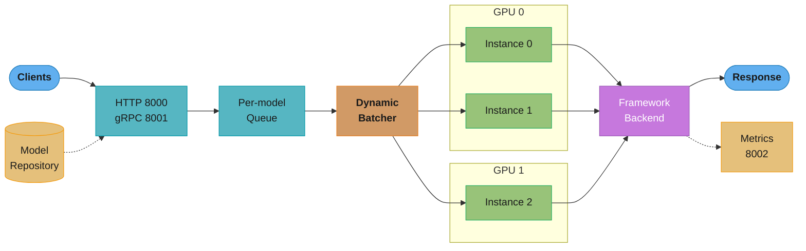
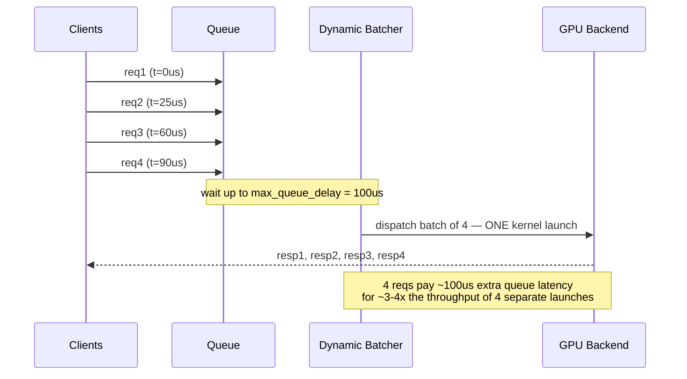
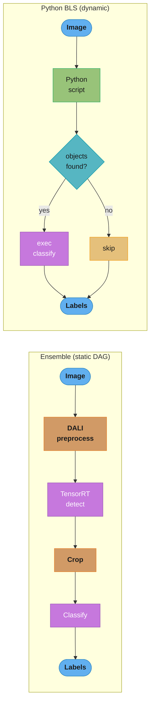
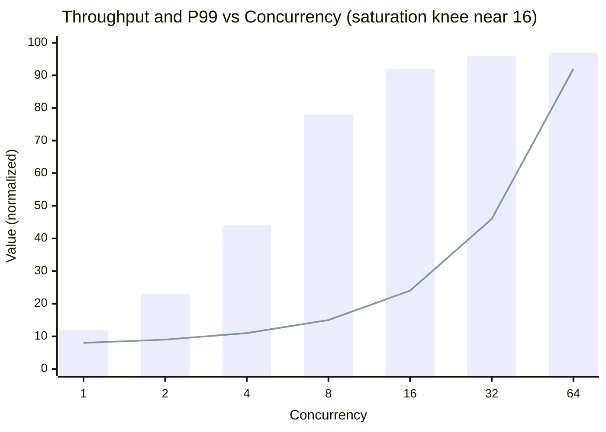
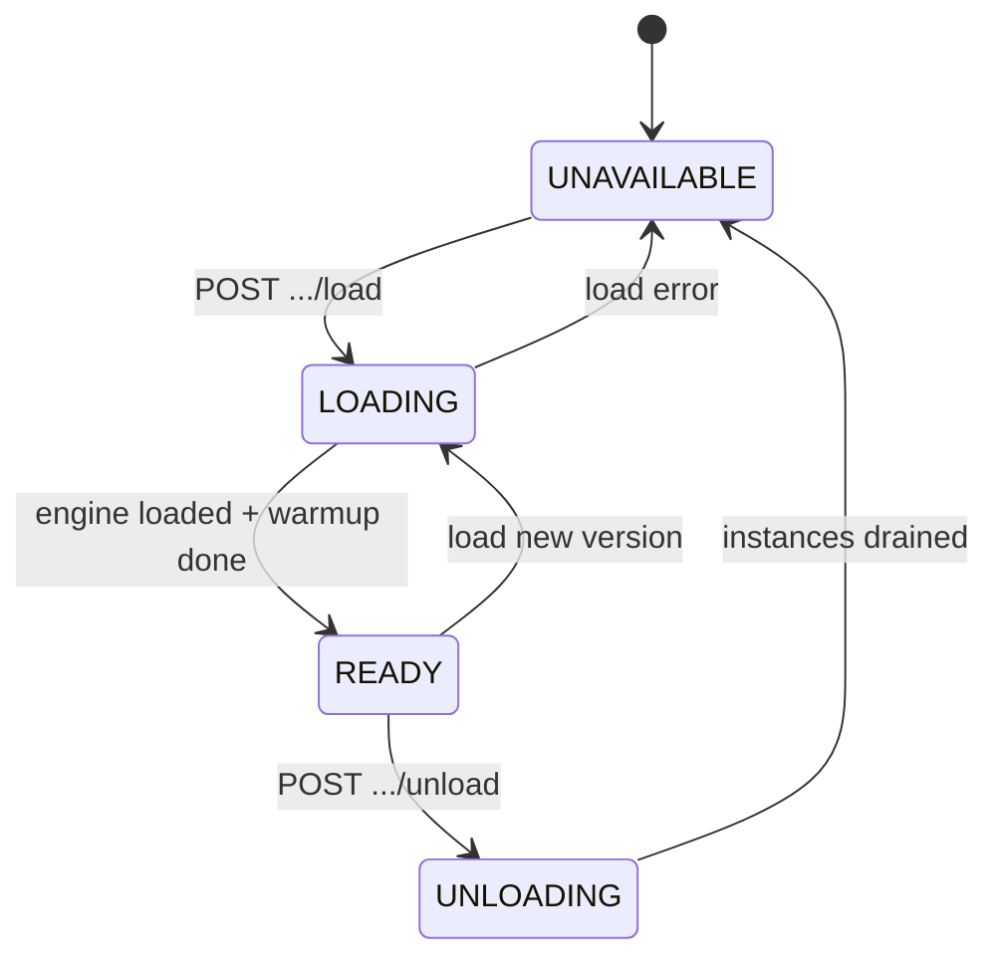

# NVIDIA Triton Inference Server

> Version anchor: this module tracks Triton by **NGC container release** (e.g. `nvcr.io/nvidia/tritonserver:25.06-py3`). Each monthly NGC tag pins a specific CUDA, TensorRT, and backend matrix — always design against a tag, never "latest". Default ports: **8000 HTTP/REST**, **8001 gRPC**, **8002 Prometheus metrics**.

---

## 1. Concept Overview

NVIDIA Triton Inference Server is **one open-source server binary that serves many models across many frameworks behind one API**. You point it at a *model repository* — a directory of versioned model folders — and it exposes every model over HTTP/REST (8000), gRPC (8001), and a Prometheus metrics endpoint (8002). A single Triton process can simultaneously serve a TensorRT engine, an ONNX Runtime graph, a LibTorch (PyTorch) module, a Python script, and a TensorRT-LLM model, each with its own scheduler, its own batching policy, and its own GPU placement.

Triton is best understood as **the standardization layer for GPU inference**. Before Triton, every team wrapped its model in a bespoke Flask/FastAPI server, reinvented batching badly (usually not at all), and produced inconsistent metrics. Triton replaces that sprawl with one server that already solves batching, multi-model memory sharing, concurrent execution, versioning, health/readiness, and metrics — so the ops surface is identical whether the model is a fraud ranker or a 70B LLM.

**Disambiguation — this is NOT OpenAI Triton.** There are two unrelated things called "Triton" in the GPU world:

- **NVIDIA Triton Inference Server** (this module) — a *serving system*: a deployed process that receives inference requests and returns predictions.
- **OpenAI Triton** — a *Python kernel DSL* for writing GPU kernels (a compiler front-end that competes with hand-written CUDA), covered in [../../cuda/triton_and_kernel_dsls/README.md](../../cuda/triton_and_kernel_dsls/README.md).

They share only a name. This module is exclusively about the inference server. When someone says "we deploy on Triton" they mean this; when they say "I wrote a Triton kernel" they mean OpenAI's DSL.

**Relationship to NIM and TensorRT-LLM.** Triton sits in the middle of NVIDIA's inference stack:

- **TensorRT-LLM** is a *backend* — an optimized execution engine for transformer LLMs (in-flight batching, paged KV cache, FP8) that plugs into Triton via the `tensorrtllm` backend.
- **NVIDIA NIM** (NVIDIA Inference Microservices) is a *packaging layer* — a pre-built container that bundles Triton + TensorRT-LLM + a specific optimized model + an OpenAI-compatible API, so you `docker run` a ready endpoint instead of assembling one. NIM is Triton with the assembly done for you.

So the mental hierarchy is: **NIM (turnkey product) → Triton (the serving engine) → TensorRT-LLM / ONNX / PyTorch / Python (the backends Triton drives).**

---

## 2. Intuition

> **One-line analogy**: Triton is an application server for models — the way Tomcat or Gunicorn hosts many web apps behind one port, Triton hosts many models behind one GPU-aware runtime.

**Mental model**: A model is a *deployable artifact*, exactly like a WAR file or a container image. You drop it into the model repository with a config file, and Triton takes over the boring-but-hard runtime concerns: it accepts requests, puts them in a **per-model queue**, **batches** compatible requests together, **schedules** the batch onto a GPU instance, runs the framework backend, and returns responses. You never write the accept loop, the batching logic, the thread pool, or the metrics — Triton owns all of it.

**Why it matters**: GPUs are **throughput devices, not latency devices**. A GPU running one request at a time is like a 40-seat bus driving one passenger — the silicon is mostly idle because a single small tensor cannot fill the thousands of ALUs and Tensor Cores. The economic job of the server is to *saturate the GPU without blowing the latency SLO*. The single most powerful lever for that is **batching**: combining N independent requests into one kernel launch so the matrix multiply is wide enough to keep the Tensor Cores busy.

**Key insight**: Latency and throughput trade off through batch size, and Triton's dynamic batcher automates that trade. Bigger batches raise throughput (more requests per GPU-second) but raise per-request latency (each request waits for the batch to fill and then computes on a larger tensor). The art of running Triton well is choosing a **queue-delay budget** small enough to protect your P99 SLO but large enough to let batches form — and then *measuring* it with `perf_analyzer` rather than guessing. Everything else in Triton is machinery in service of that one trade.

---

## 3. Core Principles

- **The model repository is the deploy contract.** State lives on disk as versioned directories, each containing numbered version folders and a `config.pbtxt`. Deploying a model = writing files into that layout; there is no imperative "deploy" API you must call. This makes deployments declarative, diffable, and trivially version-controlled.
- **One scheduler per model.** Triton does not have a single global queue. *Each model* gets its own scheduler configured independently — one model can use a dynamic batcher with a 200-microsecond delay while another uses a sequence batcher and a third does no batching at all. Batching policy is a per-model property, not a server property.
- **Framework-agnostic backend API.** Triton defines a C API contract ("the backend API"); TensorRT, ONNX Runtime, PyTorch, TensorFlow, Python, vLLM, and TensorRT-LLM are all *backends* implementing it. The scheduler, queue, metrics, and HTTP/gRPC layers are shared; only the execute-a-batch step is framework-specific. Adding a new framework means writing a backend, not a new server.
- **Measure, then configure.** Triton is a performance product, and its culture is empirical: you do not hand-tune `max_batch_size` and `instance_group` from intuition. You run `perf_analyzer` to sweep concurrency and find the saturation knee, or `model_analyzer` to search the configuration space, and you set the config from the data. Guessing is the root cause of most Triton production incidents.
- **Metrics-first operations.** Every model emits Prometheus counters and histograms on 8002 out of the box: request counts, queue duration, compute duration, batch size distribution, GPU utilization. The correct autoscaling and alerting signals (especially `nv_inference_queue_duration_us`) come from Triton itself, not from external probes.

---

## 4. Types / Architectures / Strategies

### 4.1 Backend Taxonomy

Triton's power is the breadth of backends behind one API:

| Backend | Executes | Typical use |
|---------|----------|-------------|
| **TensorRT** | Compiled `.plan` engines | Lowest latency on NVIDIA GPUs; engine is arch-specific |
| **ONNX Runtime** | `.onnx` graphs | Portable; runs the same model on many GPU/CPU targets |
| **PyTorch (LibTorch)** | TorchScript / `.pt` | Ship a PyTorch model with no rewrite |
| **TensorFlow** | SavedModel / GraphDef | Legacy TF estates |
| **Python** | Arbitrary `model.py` | Pre/post-processing, glue, custom logic, BLS |
| **vLLM** | HF LLMs via vLLM engine | LLM serving with PagedAttention inside Triton |
| **TensorRT-LLM** | Compiled LLM engines | Highest-throughput LLM serving, in-flight batching |
| **FIL** | XGBoost / LightGBM / cuML forests | GPU-accelerated tree models (fraud, ranking) |
| **DALI** | GPU data-loading pipelines | Image/video decode + resize on the GPU, as an ensemble step |

### 4.2 Scheduler Types

Each model chooses exactly one scheduler:

- **Default scheduler** — runs each request as it arrives, one at a time per instance. No batching. Correct only for models with `max_batch_size: 0` or when the client already batches.
- **Dynamic batcher** — the workhorse. Holds incoming requests in the queue for up to `max_queue_delay_microseconds`, forms a batch up to `preferred_batch_size`, and dispatches one kernel launch. Stateless models only.
- **Sequence batcher** — for *stateful* models where requests belong to a session (a conversation, a streaming ASR stream). Guarantees all requests of one sequence route to the *same* instance so state persists. Two strategies: **Direct** (a fixed slot per sequence) and **Oldest** (batch the oldest ready requests across sequences). Uses control inputs START/END/READY/CORRID.
- **Ensemble scheduler** — stitches multiple models into a DAG (preprocess → detect → crop → classify) executed server-side, so the client makes one call and no intermediate tensors cross the network.

### 4.3 Model-Management Modes

How Triton loads models from the repository:

- **`none`** — load everything at startup, no runtime changes. Simplest; a repo edit needs a restart.
- **`poll`** — periodically re-scan the repository and pick up added/changed/removed models. Convenient but racy and not recommended for production (no explicit control, no atomic swap guarantee).
- **`explicit`** — load nothing (or a startup allowlist) and require the **model-control API** (`POST /v2/repository/models/{name}/load` / `/unload`) to load and unload. This is the production choice: deployments are explicit, auditable, and atomic.

### 4.4 Deployment Shapes

- **Shared multi-model fleet** — one Triton per node hosting many models; maximizes GPU sharing and consolidates ops. Best when you have many small/medium models.
- **Model-per-pod** — one Triton per model (often per big LLM), scaled independently. Best for large models with distinct scaling curves and blast-radius isolation.
- **Managed containers** — Triton ships as first-party containers for **KServe** (raw and v2 predict protocol), **Amazon SageMaker**, and **Azure Machine Learning**, so the same model repository runs across platforms unchanged.

### 4.5 Client Surface Strategies

Triton exposes the **KServe v2 (Predict Protocol v2)** contract over two wire formats and three client access styles:

- **HTTP/REST on 8000** — JSON body plus an optional binary tensor extension (tensors sent as raw bytes appended after the JSON header, avoiding base64 bloat). Simplest to integrate; highest per-request overhead.
- **gRPC on 8001** — protobuf `ModelInfer` RPC; ~2-5x lower framing overhead than JSON for large tensors, and the only surface with **streaming RPC** (`ModelStreamInfer`) needed for decoupled/token-streaming models.
- **Client libraries** — official **Python, C++, and Java** clients wrap both protocols with a uniform `InferInput`/`InferResult` API, plus helpers for shared-memory registration. `perf_analyzer` is built on the C++ client.

### 4.6 Extension and Build Strategies

- **Custom C++ backend** — implement the backend C API when you need a framework Triton does not ship, or maximum performance without the Python stub. More effort than the Python backend; reserved for hot paths and novel runtimes.
- **In-process embedding** — instead of running the server, link `libtritonserver` via the **C API** or the `tritonserver` **Python in-process API** to embed the core inside your own process, eliminating the network hop for co-located pipelines.
- **`compose.py` minimal images** — the SDK's build/compose tooling produces a trimmed container carrying only the backends you select (e.g. TensorRT + Python), cutting image size from the ~10+ GB monolithic NGC image to a few GB.

---

## 5. Architecture Diagrams

### 5.1 Request Path



Requests enter one of two frontends, land in the model's own queue, get grouped by the dynamic batcher, and are dispatched to one of several instances spread across GPUs. The model repository and metrics endpoint sit to the side as the deploy contract and observability tap.

### 5.2 Dynamic Batching Timeline



Four requests arriving within the 100-microsecond window are fused into a single batched kernel launch. Each request pays a small, bounded queue delay; in return the GPU runs one wide matmul instead of four narrow ones.

### 5.3 Ensemble DAG vs Business Logic Scripting



An ensemble is a fixed graph Triton executes with no client round-trips; BLS is a Python script that calls other models imperatively, so it can branch, loop, and skip work — flexibility bought with the Python backend's per-instance overhead.

### 5.4 perf_analyzer Concurrency Sweep



Throughput climbs steeply until the batch/instance capacity saturates near concurrency 16, then flattens; past the knee, extra concurrency only inflates P99 as requests queue. Provision at the knee, not past it.

### 5.5 Model Lifecycle Under Explicit Mode



Under explicit mode every state change is an API call you control, so deploys and rollbacks are atomic and auditable; a model only reaches READY after its instances load and any `model_warmup` completes.

---

## 6. How It Works — Detailed Mechanics

### 6.1 The Model Repository Layout

```
model_repository/
└── resnet50_trt/
    ├── config.pbtxt
    ├── 1/
    │   └── model.plan        # version 1 (TensorRT engine)
    └── 2/
        └── model.plan        # version 2
```

The directory name is the model name clients address; numbered subdirectories are versions; `config.pbtxt` declares inputs, outputs, backend, scheduler, and placement.

### 6.2 A Fully Annotated config.pbtxt

```protobuf
name: "resnet50_trt"
platform: "tensorrt_plan"          # selects the TensorRT backend
max_batch_size: 32                 # server may batch up to 32 reqs into one call.
                                   # THE BATCH DIMENSION IS IMPLICIT: dims below are
                                   # PER-SAMPLE; Triton prepends the batch axis itself.

input [
  {
    name: "input"
    data_type: TYPE_FP32
    dims: [ 3, -1, -1 ]            # -1 = dynamic axis (variable H, W). Fixed dims
                                   # (channels=3) are static; -1 lets the engine
                                   # accept a range built at TensorRT compile time.
  }
]
output [
  { name: "logits" data_type: TYPE_FP32 dims: [ 1000 ] }
]

instance_group [
  {
    count: 2                       # 2 concurrent copies of the model...
    kind: KIND_GPU
    gpus: [ 0 ]                    # ...both pinned to GPU 0. Each instance runs on
                                   # its own CUDA stream, so 2 batches overlap.
  }
]

dynamic_batching {
  preferred_batch_size: [ 4, 8 ]  # aim to form batches of 4 or 8 (kernel-efficient sizes)
  max_queue_delay_microseconds: 100  # wait AT MOST 100us for a batch to fill.
                                   # Rule of thumb: budget ~5-10% of your P99 SLO here.
}

model_warmup [                     # run synthetic requests at load time so the FIRST
  {                                # real request does not eat cuBLAS/TensorRT autotuning.
    name: "warmup_batch8"
    batch_size: 8
    inputs {
      key: "input"
      value { data_type: TYPE_FP32 dims: [3, 224, 224] zero_data: true }
    }
  }
]

version_policy: { latest: { num_versions: 1 } }
# latest{num_versions:N} serves the N highest-numbered versions;
# all{} serves every version dir; specific{versions:[1,3]} serves an explicit set —
# the mechanism behind canary/blue-green (serve v1 and v2 side by side, shift traffic).
```

**Why `max_batch_size: 0` silently disables batching.** `max_batch_size > 0` is a *contract*: it tells Triton the model's first tensor dimension is a batch axis it may vary. Setting `max_batch_size: 0` means "this model has no batch dimension" — so the dynamic batcher has nothing to batch *along* and every request runs alone, even with a `dynamic_batching {}` block present. This is the most common way batching ends up secretly off.

### 6.3 Concurrent Execution via CUDA Streams

`instance_group.count: 2` creates two execution contexts, each with its own **CUDA stream**. While instance 0's batch is computing, instance 1's batch can be copying inputs H2D or running on the copy engines — the GPU overlaps them. More instances raise throughput and GPU utilization up to the point where they contend for SMs or VRAM. (Stream mechanics: [../../cuda/streams_events_and_concurrency/README.md](../../cuda/streams_events_and_concurrency/README.md).)

### 6.4 Sequence Batching Control Inputs

Stateful models declare control inputs the sequence batcher populates automatically:

```protobuf
sequence_batching {
  max_sequence_idle_microseconds: 5000000    # drop a sequence idle >5s
  control_input [
    { name: "START"  control { kind: CONTROL_SEQUENCE_START  } },
    { name: "END"    control { kind: CONTROL_SEQUENCE_END    } },
    { name: "READY"  control { kind: CONTROL_SEQUENCE_READY  } },
    { name: "CORRID" control { kind: CONTROL_SEQUENCE_CORRID } }
  ]
}
```

START/END mark the first and last request of a session, READY signals a valid slot this step, and CORRID carries the correlation id so the backend keeps per-sequence state. All requests sharing a correlation id route to the same instance.

### 6.5 Business Logic Scripting (BLS)

BLS is a Python backend model that calls *other* Triton models in-process:

```python
import triton_python_backend_utils as pb_utils

class TritonPythonModel:
    def execute(self, requests):
        responses = []
        for request in requests:
            img = pb_utils.get_input_tensor_by_name(request, "IMAGE")
            det = pb_utils.InferenceRequest(
                model_name="detector",
                requested_output_names=["boxes"],
                inputs=[img],
            ).exec()                                    # call detector model
            boxes = pb_utils.get_output_tensor_by_name(det, "boxes")
            if boxes.as_numpy().shape[0] == 0:          # conditional branch
                out = pb_utils.Tensor("LABELS", empty_labels())
            else:
                cls = pb_utils.InferenceRequest(
                    model_name="classifier",
                    requested_output_names=["labels"],
                    inputs=[crop(img, boxes)],
                ).exec()
                out = pb_utils.get_output_tensor_by_name(cls, "labels")
            responses.append(pb_utils.InferenceResponse(output_tensors=[out]))
        return responses
```

Unlike an ensemble's static DAG, BLS can branch, loop, and skip models — at the cost of running inside the Python backend.

### 6.6 Decoupled Transaction Policy (LLM Token Streaming)

By default one request yields exactly one response. LLMs need one request to yield *many* responses (a token stream). The **decoupled** transaction policy allows N responses per request:

```protobuf
model_transaction_policy { decoupled: true }
```

The backend calls `response_sender.send(...)` per generated token and closes with `TRITONSERVER_RESPONSE_COMPLETE_FINAL`. Clients consume the stream over gRPC. This is how the vLLM and TensorRT-LLM backends stream tokens.

### 6.7 Response Cache and Rate Limiter

- **Response cache** — enable a shared cache and add `response_cache { enable: true }` to a model; identical input tensors return the cached output, skipping compute entirely. Only correct for deterministic models (a greedy classifier, not a sampled LLM).
- **Rate limiter** — caps how often instances execute across models, so a burst on one model cannot starve others sharing the GPU; configure per-instance `resources` and priorities.

### 6.8 Python Backend Runtime

Each Python model instance runs as a **separate stub process** communicating with the Triton core over **shared memory**, which sidesteps the GIL across instances but means you must size `--shm-size` (e.g. `docker run --shm-size=1g`). Under-sizing shared memory is a classic Python-backend crash. Concrete numbers to anchor on: dynamic batching typically buys **2-4x throughput** on GPU-bound models; keep the queue-delay budget near **5-10% of the P99 SLO**; each additional instance adds one full model's worth of VRAM.

### 6.9 Client Surfaces — HTTP, gRPC, and Streaming

The HTTP frontend (8000) speaks KServe v2 JSON. For a 3x224x224 FP32 image the JSON-with-base64 body is ~800 KB; the **binary tensor extension** sends the raw 602 KB tensor after a small JSON header, cutting serialization cost. The gRPC frontend (8001) uses protobuf and is the better default above a few KB of tensor payload — framing overhead drops roughly 2-5x.

```python
import tritonclient.grpc as grpcclient
import numpy as np

client = grpcclient.InferenceServerClient(url="localhost:8001")
inp = grpcclient.InferInput("input", [8, 3, 224, 224], "FP32")
inp.set_data_from_numpy(np.random.rand(8, 3, 224, 224).astype(np.float32))
out = grpcclient.InferRequestedOutput("logits")
res = client.infer(model_name="resnet50_trt", inputs=[inp], outputs=[out])
print(res.as_numpy("logits").shape)   # (8, 1000)
```

For **decoupled** models the client must use the streaming RPC, because one request yields many responses:

```python
def callback(result, error):
    if error is None:
        print(result.as_numpy("output_text"))   # one call per generated token
client.start_stream(callback=callback)
client.async_stream_infer(model_name="llama_trtllm", inputs=[prompt_in])
```

Only gRPC supports `ModelStreamInfer`; HTTP cannot stream partial responses, so any token-streaming LLM route is gRPC (or an OpenAI-compatible wrapper in front). The C++ client library backs `perf_analyzer`; the Java client targets JVM services.

### 6.10 In-Process Serving — C API and Python In-Process API

Sometimes the network hop is pure overhead — a pipeline where the caller and Triton live in the same process. Triton's core is `libtritonserver.so`, usable two ways:

- **C API** — link the library and drive `TRITONSERVER_ServerNew`, `TRITONSERVER_InferenceRequestNew`, etc., directly. Zero serialization, zero sockets; used by NVIDIA DeepStream and Holoscan to embed inference in a C++ media pipeline.
- **Python in-process API** — `import tritonserver; server = tritonserver.Server(model_repository=...).start()` then `server.model("m").infer(...)`. You get Triton's batching, versioning, and metrics as a library call, latency measured in microseconds of overhead instead of a full RPC.

Rule of thumb: **embed in-process** when the client is co-located and single-tenant (an edge appliance, one big pipeline); **run the server** when many clients, languages, or pods must share the models. In-process trades the operational conveniences of a standalone server (independent scaling, isolation, the model-control API surface) for the lowest possible call overhead.

### 6.11 Shared-Memory I/O — Zero-Copy Input/Output

By default input tensors are copied client → HTTP/gRPC buffer → Triton → GPU. For large tensors this copy dominates latency. Triton supports two shared-memory regions that let the client hand Triton a pointer instead of bytes:

- **System (CPU) shared memory** — client writes the tensor into a `/dev/shm` region, registers it via `RegisterSystemSharedMemory`, and passes the region handle in the request. Triton reads in place — no socket serialization of the payload.
- **CUDA shared memory** — the client writes directly into a GPU buffer and registers it with `RegisterCudaSharedMemory` (passing a CUDA IPC handle), so an already-on-GPU tensor never round-trips through host memory.

```python
import tritonclient.utils.shared_memory as shm
shm_handle = shm.create_shared_memory_region("in_data", "/in_data", byte_size=602112)
shm.set_shared_memory_region(shm_handle, [tensor])
client.register_system_shared_memory("in_data", "/in_data", 602112)
inp.set_shared_memory("in_data", 602112)
```

On large images/video this removes ~0.5-2 ms of copy per request and can lift throughput 20-40% on I/O-bound models. The registration APIs (`register_*`/`unregister_*`) exist over both HTTP and gRPC. Only worthwhile when client and server share a host — pointless across the network.

### 6.12 Priority Levels and Queue Policies

The dynamic batcher's queue is configurable beyond just the delay. `priority_levels` creates N priority classes; requests carry a priority and higher-priority requests jump ahead:

```protobuf
dynamic_batching {
  preferred_batch_size: [ 8, 16 ]
  max_queue_delay_microseconds: 500
  priority_levels: 2
  default_priority_level: 2
  default_queue_policy {
    max_queue_size: 256                       # reject (not queue) beyond 256 waiting
    timeout_action: REJECT                    # or DELAY
    default_timeout_microseconds: 20000       # 20 ms cap on time in queue
    allow_timeout_override: true
  }
  priority_queue_policy {
    key: 1                                     # level-1 (high) traffic
    value { max_queue_size: 64 default_timeout_microseconds: 5000 }
  }
}
```

This is how you protect an interactive model from a batch-scoring flood on the same server: give interactive traffic priority 1 with a 5 ms timeout and let bulk traffic sit at priority 2. `max_queue_size` caps memory and enforces backpressure — beyond it, requests are rejected fast (a 503-equivalent) rather than piling up unbounded, which is the correct failure mode under overload.

### 6.13 Ragged Batching

Normally the dynamic batcher can only batch requests with identical shapes. **Ragged batching** lets variable-length inputs (tokenized sequences, point clouds) batch together by concatenating them into one flat tensor plus an index/shape tensor the backend uses to unpack:

```protobuf
input [
  { name: "input_ids" data_type: TYPE_INT32 dims: [ -1 ] allow_ragged_batch: true }
]
batch_input [
  { kind: BATCH_ACCUMULATED_ELEMENT_COUNT_WITH_ZERO target_name: "offsets" data_type: TYPE_INT32 source_input: "input_ids" }
]
```

Without ragged batching, a request of length 37 and one of length 512 cannot batch and each runs alone; with it they concatenate into a length-549 buffer with offsets `[0, 37, 549]`, so both share one kernel launch. This is essential for NLP preprocessing and any variable-length input where padding to a common length would waste 2-10x the compute.

### 6.14 Sequence State — Implicit State Tensors vs Explicit CORRID

Section 6.4 covered the control inputs; the sequence batcher offers two ways to actually carry state:

- **Explicit (CORRID)** — the backend receives the correlation id and manages its own state store keyed by it. Full control, but you write the state machine.
- **Implicit state** — Triton stores named **state tensors** for you between requests of a sequence. The config declares input/output state pairs; the backend reads the incoming state, writes the outgoing state, and Triton persists it to the next request in that sequence automatically:

```protobuf
sequence_batching {
  state [
    { input_name: "state_in" output_name: "state_out"
      data_type: TYPE_FP32 dims: [ 512 ]
      initial_state: { data_type: TYPE_FP32 dims: [ 512 ] zero_data: true name: "init" } }
  ]
}
```

Implicit state is how a stateful RNN/decoder keeps its hidden vector across a streaming session without the backend owning a session store. `initial_state` seeds the first request. Prefer implicit state for fixed-shape recurrent state; use explicit CORRID when the state is large, external (a KV cache), or has custom eviction.

### 6.15 Rate Limiter — Resource-Based Throttling

The dynamic batcher bounds *queueing*; the **rate limiter** bounds *execution* across models sharing a device. Each model instance declares the resources it consumes; Triton only schedules an instance when its resources are available, so a heavy model cannot monopolize the GPU:

```protobuf
instance_group [
  { count: 2 kind: KIND_GPU
    rate_limiter { resources [ { name: "gpu_slots" count: 4 } ] priority: 1 } }
]
```

Started with `--rate-limit=execution_count`, Triton treats resources as a global budget (per-device or global). A ranker declaring 4 `gpu_slots` and a detector declaring 1 lets four detectors run per one ranker — a coarse but effective fairness knob when many models contend. Off by default (`--rate-limit=off`), where scheduling is purely instance-availability driven.

### 6.16 Response Cache — Local and Redis

The response cache (introduced in 6.7) is pluggable. Two implementations ship:

- **Local cache** — an in-process LRU sized with `--cache-config local,size=1073741824` (1 GB). Fastest (memory lookup) but per-instance and lost on restart.
- **Redis cache** — `--cache-config redis,host=...,port=6379` shares a cache across every Triton replica in a fleet, so a hit computed on pod A serves pod B. Adds a network hop (~0.2-1 ms) but multiplies effective hit rate across replicas.

The cache key is a hash of the model name, version, and input tensor bytes. **Only deterministic models are cacheable** — mark them `response_cache { enable: true }`. Hit rate is observable via `nv_cache_num_hits_per_model` / `nv_cache_num_misses_per_model`; a low hit rate on high-cardinality inputs means the cache is pure overhead and should be disabled. Sampled LLMs, stateful models, and anything time-dependent must never be cached.

### 6.17 Tracing — Triton Trace API and OpenTelemetry

Triton emits per-request traces that break latency into `HTTP_RECV`, `QUEUE`, `COMPUTE_INPUT`, `COMPUTE_INFER`, `COMPUTE_OUTPUT`, and `HTTP_SEND` spans — so you can attribute a slow P99 to queueing vs compute vs I/O precisely:

```bash
tritonserver --model-repository=/models \
  --trace-config mode=opentelemetry \
  --trace-config opentelemetry,url=http://otel-collector:4318/v1/traces \
  --trace-config rate=100 \
  --trace-config level=TIMESTAMPS
```

`rate=100` samples 1 in 100 requests (tracing every request is expensive); `level` is `OFF`/`TIMESTAMPS`/`TENSORS` (TENSORS also captures input/output values — huge, debug only). The **OpenTelemetry** mode exports OTLP spans that join your distributed trace, so an LLM app's end-to-end trace shows the Triton compute span inline with the gateway and retrieval spans. The legacy file mode (`mode=triton`) writes JSON traces locally. OTel context is covered in [../../devops/ml_platform_and_gpu_infrastructure/README.md](../../devops/ml_platform_and_gpu_infrastructure/README.md).

### 6.18 TensorRT-LLM Backend — In-Flight Batching and Multi-GPU

The `tensorrtllm` backend is how Triton serves large LLMs at high throughput, and it works differently from the stateless dynamic batcher:

- **In-flight (continuous) batching** — instead of waiting for a whole batch to finish, the backend admits new sequences into the running batch as soon as others emit their EOS token, keeping the GPU near-saturated. This lifts throughput 2-4x over static batching for mixed-length generation.
- **Paged KV cache** — the KV cache is allocated in fixed blocks (like OS paging) rather than one contiguous per-sequence buffer, cutting fragmentation and letting far more concurrent sequences share VRAM. (Same idea as vLLM's PagedAttention: [../../llm/vllm_deep_dive/README.md](../../llm/vllm_deep_dive/README.md).)
- **Tokenizer in preprocessing** — the raw model is token-in/token-out, so a real deployment is an **ensemble**: a Python `preprocessing` model tokenizes text → `tensorrt_llm` generates → a Python `postprocessing` model detokenizes. NVIDIA ships this as the `tensorrtllm_backend` example repo (`ensemble` + `preprocessing` + `tensorrt_llm` + `postprocessing`).
- **Multi-GPU via MPI** — tensor/pipeline parallelism across GPUs is orchestrated by an **MPI** launcher (`mpirun` with one rank per GPU). This is why a multi-GPU TensorRT-LLM deployment has a different launch story than a normal Triton model.
- **Multi-node reality** — Triton is fundamentally a **single-node** server; a model must fit within one node's GPUs. Multi-node LLM serving (a 405B across two nodes) is done with the TensorRT-LLM MPI orchestrator spanning nodes, or by sharding at a higher layer (a router in front of node-local Tritons) — Triton itself does not shard one model across nodes natively.

### 6.19 Model Repository Agents and Cloud Repositories

The model repository can live in object storage, not just local disk. Triton reads `s3://bucket/models`, `gs://bucket/models`, and `as://account/container/models` directly, pulling models into a local cache at load time:

```bash
tritonserver --model-repository=s3://my-bucket/triton/models
# credentials via env: AWS_ACCESS_KEY_ID / AWS_SECRET_ACCESS_KEY (S3),
# GOOGLE_APPLICATION_CREDENTIALS (GCS), AZURE_STORAGE_ACCOUNT/KEY (Azure)
```

**Repository agents** run at load time to transform or gate a model: the built-in **checksum** agent verifies file hashes in `config.pbtxt` before a model loads, rejecting a corrupted or tampered artifact. Custom agents (a C API) can decrypt an encrypted model or fetch it from a bespoke store. **Polling semantics** on cloud repos: with `--model-control-mode=poll` and `--repository-poll-secs=15`, Triton re-lists the bucket every 15 s and loads changes — but polling S3 is rate-limit-prone and non-atomic, so production uses explicit mode and pushes load calls from CI.

### 6.20 Custom C++ Backends — the Backend API Contract

When neither a shipped framework nor the Python backend fits, you implement the **backend C API**: a shared library exporting `TRITONBACKEND_ModelInstanceExecute` (plus `Initialize`/`Finalize` for backend, model, and instance lifecycle). Triton hands your `Execute` a batch of requests; you read input tensors, run your runtime, and set output tensors:

```cpp
TRITONSERVER_Error*
TRITONBACKEND_ModelInstanceExecute(
    TRITONBACKEND_ModelInstance* instance,
    TRITONBACKEND_Request** requests, const uint32_t request_count) {
  for (uint32_t r = 0; r < request_count; ++r) {
    // get input buffer, run custom kernel/runtime, set output buffer
  }
  return nullptr;  // success
}
```

Write a C++ backend over the Python backend when: you need every microsecond (no stub-process hop, no serialization), you are wrapping a novel runtime (a proprietary accelerator, a custom decoder), or the logic is compute-heavy and GIL-bound in Python. The Python backend wins for iteration speed and glue; the C++ backend wins for production hot paths — the same tradeoff as writing a CUDA kernel vs a NumPy prototype.

### 6.21 Building Minimal Images with compose.py

The stock NGC image (`tritonserver:25.06-py3`) carries every backend and is ~10-15 GB. For production you usually want only one or two backends. `compose.py` assembles a slim image from the per-backend layers:

```bash
python3 compose.py --backend tensorrt --backend python \
  --repoagent checksum --container-version 25.06 \
  --output-name triton-slim:25.06
```

This drops the image to a few GB, shrinks the attack surface, and speeds pulls in autoscaling. Backend selection happens at **build** time (which `.so` backends are baked in), independent of which models the repository actually loads at **run** time — a model referencing a backend not in the image simply fails to load.

### 6.22 Model Configuration Auto-Generation and the Optimization Block

You do not always have to write `config.pbtxt` by hand. Auto-completion is **on by default**; the current flag to turn it off is `--disable-auto-complete-config`. The older `--strict-model-config=true/false` flag controlled the same behavior with inverted polarity and is now a **deprecated alias** in Triton's own `--help` text — reason and document in terms of `--disable-auto-complete-config`, not the legacy flag. With auto-completion enabled, Triton **auto-completes** the config for backends that expose their own IO metadata — TensorRT, ONNX Runtime, and TensorFlow SavedModel carry input/output names, dtypes, and shapes in the model file, so Triton fills them in and even enables dynamic batching with a default `max_batch_size`. You still write config explicitly when you need to pin batching policy, instance groups, or version policy, because auto-config gives you a conservative default, not a tuned one. The `platform`/`backend` field, `max_batch_size`, and any scheduler block are the parts worth writing by hand.

The **`optimization`** block turns on backend-specific accelerators without changing the model:

```protobuf
optimization {
  execution_accelerators {
    gpu_execution_accelerator [
      { name: "tensorrt"                       # run an ONNX model through TensorRT
        parameters { key: "precision_mode" value: "FP16" }
        parameters { key: "max_workspace_size_bytes" value: "1073741824" } }  # 1 GB
    ]
  }
  cuda { graphs: true                          # capture CUDA graphs to cut launch overhead
         busy_wait_events: true }
  input_pinned_memory { enable: true }         # pinned host buffers speed H2D copies
  output_pinned_memory { enable: true }
}
```

`cuda.graphs: true` captures the kernel launch sequence once and replays it, saving tens of microseconds of launch overhead per inference on small models where launch cost is a real fraction of latency. The ONNX→TensorRT accelerator gives much of TensorRT's speed while keeping ONNX's portable source, converting subgraphs at load time (which lengthens cold start — the first load can take minutes). Pinned memory removes a pageable-to-pinned staging copy on the host, shaving copy latency on I/O-bound models. The `instance_group.kind` also matters here: `KIND_GPU` (run on GPU), `KIND_CPU` (CPU execution), `KIND_MODEL` (let the framework decide placement), and `KIND_AUTO`.

### 6.23 Ensemble Configuration — the Scheduling Graph

Section 4.2 named the ensemble scheduler; here is what its `config.pbtxt` actually looks like. An ensemble is a model with `platform: "ensemble"` and no weights of its own — just a `step` list wiring other models' inputs and outputs by name:

```protobuf
name: "detect_classify_ensemble"
platform: "ensemble"
max_batch_size: 8
input  [ { name: "RAW_IMAGE" data_type: TYPE_UINT8 dims: [ -1 ] } ]
output [ { name: "LABELS"    data_type: TYPE_STRING dims: [ -1 ] } ]

ensemble_scheduling {
  step [
    { model_name: "dali_preprocess" model_version: -1        # -1 = latest
      input_map  { key: "DALI_INPUT"  value: "RAW_IMAGE" }
      output_map { key: "DALI_OUTPUT" value: "preprocessed" } },
    { model_name: "detector_trt" model_version: -1
      input_map  { key: "images" value: "preprocessed" }
      output_map { key: "boxes"  value: "detections" } },
    { model_name: "classifier_trt" model_version: -1
      input_map  { key: "crops"  value: "detections" }
      output_map { key: "labels" value: "LABELS" } }
  ]
}
```

The `value` strings are the ensemble's internal "tensor bus": `preprocessed` produced by step 1 is consumed by step 2 because the names match. Triton schedules the whole DAG on the server, passing intermediate tensors in memory (GPU memory when possible) with no client round-trips — three models, one client call. Each step model keeps its *own* batching and instance config, so the detector can batch 8 while the classifier batches 32. The ensemble itself does no compute and holds no GPU memory beyond the intermediate tensors.

### 6.24 Metrics Catalog

Triton's Prometheus endpoint on 8002 is the operational backbone. The metrics a senior operator watches:

| Metric | Type | What it tells you |
|--------|------|-------------------|
| `nv_inference_request_success` / `_failure` | counter | Request volume and error rate per model |
| `nv_inference_count` | counter | Total *inferences* (sum of batch sizes) — divide by requests for avg batch |
| `nv_inference_exec_count` | counter | Number of batched executions — `request_count / exec_count` = avg batch size |
| `nv_inference_queue_duration_us` | counter (histogram-like) | **Time spent waiting in the queue — the autoscaling signal** |
| `nv_inference_compute_input_duration_us` | counter | Input copy/format time (H2D, layout) |
| `nv_inference_compute_infer_duration_us` | counter | Pure model execution time |
| `nv_inference_compute_output_duration_us` | counter | Output copy/format time (D2H) |
| `nv_gpu_utilization` | gauge | Per-GPU SM utilization (via DCGM) |
| `nv_gpu_memory_used_bytes` | gauge | Per-GPU VRAM in use — capacity headroom |
| `nv_cache_num_hits_per_model` / `_misses_per_model` | counter | Response-cache effectiveness |
| `nv_pinned_memory_pool_used_bytes` | gauge | Pinned buffer pressure |

The single most valuable derived signal is the **queue-vs-compute ratio**: if `queue_duration` dominates, you are capacity-bound (scale out or add instances); if `compute_infer_duration` dominates, the model itself is the bottleneck (optimize, quantize, or move to TensorRT). The **avg batch size** (`inference_count / exec_count`) confirms whether batching is actually happening — a ratio near 1.0 under load means batches are not forming and something (client batches of 1, `max_batch_size: 0`, too-small queue delay) is wrong. There is also a `GET /v2/models/{name}/stats` JSON endpoint returning the same counters per model for scripted checks.

### 6.25 Worked Example — Instances x Batch x Throughput

Concrete arithmetic ties the levers together. Take a ResNet-50-class model on one A10 where a single unbatched FP32 inference takes ~6 ms of GPU compute (≈167 infer/s if fully serialized):

- **Batch of 8** does not take 8 x 6 ms; the GPU processes the wider matmul in ~14 ms because it was under-utilized at batch 1. That is 8 / 0.014 ≈ **570 infer/s** from one instance — a ~3.4x throughput gain for ~2.3x the per-request latency.
- **INT8 TensorRT** roughly halves compute to ~7 ms for that batch of 8, doubling to ~1,140 infer/s.
- **Two instances** (`count: 2`) overlap on separate CUDA streams, adding perhaps ~1.7x (not a clean 2x — they contend for SMs and memory bandwidth), reaching ~1,900 infer/s.
- **Memory check**: INT8 weights ~1.6 GB per instance x 2 = 3.2 GB plus activation working set — comfortably inside the A10's 24 GB, leaving room for the ranker and embedder to share the card.

The point is that throughput is `batch_efficiency x precision_speedup x instance_overlap`, each measured, not assumed — and the queue-delay budget (say 1.5 ms at a 25 ms P99 SLO) sets how large a batch can actually form under real inter-arrival times.

### 6.26 Backend-Specific Tuning

Each backend exposes its own knobs; the ones that matter in production:

- **TensorRT** — the engine is built with **optimization profiles** that fix the *range* of dynamic dimensions (min/opt/max batch and shape). A request outside the profile range fails. The `opt` shape is the size TensorRT tunes for, so set it to your common batch (e.g. min 1 / opt 8 / max 32). Precision (FP16/INT8/FP8) is baked into the engine at build time, not toggled in `config.pbtxt`. Multiple profiles let one engine serve several shape regimes at the cost of more VRAM.
- **ONNX Runtime** — select **execution providers** in priority order (`tensorrt`, `cuda`, then `cpu` fallback) and set `graph_optimization_level` (`ORT_ENABLE_ALL` fuses ops). The TensorRT EP converts subgraphs at load time — fast at run time, slow to load. Thread pools (`intra_op`/`inter_op`) matter on the CPU EP.
- **PyTorch (LibTorch)** — ship a **TorchScript** (`torch.jit.trace`/`script`) module; eager `.pt` files are not directly servable. `DISABLE_OPTIMIZED_EXECUTION` and `INFERENCE_MODE` parameters control JIT fusion. Watch that traced models bake in the trace-time batch shape unless you trace with dynamic axes.
- **TensorFlow** — SavedModel is preferred over frozen GraphDef; the backend can apply TF-TRT conversion via the `optimization` block. Signature-def names become the IO tensor names.

The recurring gotcha across all four is **shape/precision mismatch between build and serve** — an engine or traced module built for one shape/precision regime silently fails or falls back when production sends something outside it. Always build for the production shape distribution.

### 6.27 Precision and Quantization — a Build-Time Decision, Not a Config Toggle

Section 6.26 noted that TensorRT precision is baked in at build time — that generalizes across every backend that quantizes. Precision is decided when the model **artifact** is produced, never by a field in `config.pbtxt`:

- **TensorRT** — FP16, INT8, and FP8 kernels are selected inside the TensorRT builder (`trtexec` or the builder API) when the `.plan` engine is compiled. FP8 support requires **Hopper (H100/H200) or newer**, since FP8 Tensor Cores do not exist on Ampere. Changing precision means re-running the build, not editing the config.
- **TensorRT-LLM** — quantization schemes like **SmoothQuant** and **AWQ** are applied during the TensorRT-LLM checkpoint-conversion/engine-build step, producing a quantized engine as its own artifact separate from the unquantized one.
- **ONNX Runtime** — INT8/FP16 quantization happens at **model-export time** (`onnxruntime.quantization` tooling, or exporting directly from a quantization-aware-trained checkpoint), producing a distinct `.onnx` file; the execution provider inside Triton just runs whatever precision the graph already carries.

Triton's role is to **serve whatever precision the artifact carries** — there is no `precision: INT8` field in `config.pbtxt` that reaches into a loaded model and reduces its numerics at runtime. This has a direct capacity-planning consequence: each precision needs its own build, and on TensorRT specifically each build is also pinned to one GPU architecture (the compute-capability gotcha from §6.26), so a fleet serving both A10s and H100s at both FP16 and INT8 is really maintaining up to four separate engine artifacts. Anchor the tradeoff on the arithmetic from §6.25: INT8 roughly **doubles throughput over FP16** for the same model and batch, which is the number that justifies the extra build-pipeline complexity.

### 6.28 FIL and DALI Backends

Two backends solve non-neural problems that still belong on the GPU:

- **FIL (Forest Inference Library)** — serves tree ensembles: XGBoost, LightGBM, scikit-learn/cuML random forests. A fraud or ranking model with thousands of trees runs on the GPU with dynamic batching just like a neural net, often at **sub-millisecond** latency for a batch of hundreds. Config points at the serialized model (`model.xgboost`/`model.txt`) and sets `output_class` and `threshold`. This is why Triton fits classic ML estates, not just deep learning — the American Express fraud stack mixes exactly these with deep models behind one server.
- **DALI** — a GPU data-loading pipeline (JPEG/video decode, resize, normalize) authored as a DALI pipeline and served as a Triton model, almost always as the **first step of an ensemble** so preprocessing runs on the GPU next to inference instead of pinning a CPU. Decoding a 1080p JPEG and resizing on the GPU can be **5-10x faster** than a CPU/Pillow path and removes the CPU from the critical path entirely.

### 6.29 The API Surface — Endpoint Catalog

Triton implements the KServe v2 protocol plus Triton extensions; the endpoints a senior operator should know (each has an HTTP form on 8000 and a gRPC RPC on 8001):

| Endpoint | Purpose |
|----------|---------|
| `GET /v2/health/live` | Process is up (liveness) |
| `GET /v2/health/ready` | All models loaded and healthy (readiness gate) |
| `GET /v2/models/{name}/ready` | Per-model readiness |
| `GET /v2` (server metadata) | Server name, version, backend extensions |
| `GET /v2/models/{name}` | Model metadata — IO names, dtypes, shapes |
| `GET /v2/models/{name}/config` | The effective `config.pbtxt` (incl. auto-completed fields) |
| `POST /v2/models/{name}/infer` | Run inference (the hot path) |
| `GET /v2/models/{name}/stats` | Per-model counters — success/fail, queue/compute durations, batch sizes |
| `POST /v2/repository/index` | List all models and their load state |
| `POST /v2/repository/models/{name}/load` \| `/unload` | Model-control API (explicit mode) |
| `POST /v2/systemsharedmemory/region/{r}/register` | Register system shared memory |
| `POST /v2/cudasharedmemory/region/{r}/register` | Register CUDA shared memory |
| `GET /metrics` (port 8002) | Prometheus scrape |

`GET /v2/models/{name}/config` is invaluable for debugging auto-config: it shows exactly what Triton inferred, so you can see whether dynamic batching was enabled and with what defaults. `POST /v2/repository/index` is how a deploy tool discovers what is loaded before issuing load/unload calls.

### 6.30 Decoupled Backend Implementation and String Tensors

A decoupled Python model streams responses through a **response sender** held per request, calling it once per chunk and flagging the final send:

```python
class TritonPythonModel:
    def execute(self, requests):
        for request in requests:
            sender = request.get_response_sender()
            prompt = pb_utils.get_input_tensor_by_name(request, "PROMPT")
            for token in self.generate(prompt):                 # yields tokens
                out = pb_utils.Tensor("OUTPUT", np.array([token], dtype=object))
                sender.send(pb_utils.InferenceResponse(output_tensors=[out]))
            sender.send(flags=pb_utils.TRITONSERVER_RESPONSE_COMPLETE_FINAL)
        return None   # decoupled models return None, not a response list
```

Returning `None` (not a response list) is the decoupled contract — the responses already went out through the sender. Forgetting the final flag leaves the client's stream open forever, a common hang.

**String/BYTES tensors are a recurring gotcha.** Triton has no native string type; text is `TYPE_STRING`/`BYTES`, carried as length-prefixed UTF-8 byte arrays. In NumPy that is `dtype=object` (or `np.bytes_`), and a mismatch (sending `str` where the backend expects encoded `bytes`, or forgetting the object dtype) produces cryptic serialization errors. Classification models can also attach human-readable labels: set `label_filename` in the output config and request `class_count` to get back ranked `label:score` strings instead of raw logits — Triton does the top-k for you.

**Cancellation matters as much as generation.** A gRPC streaming client that disconnects (a closed connection, a client-side timeout, a user closing a tab) sends a **stream cancellation** the transport layer surfaces to the backend — but only backends that actually poll for it stop early. TRT-LLM and vLLM backends check cancellation state between decode steps and abort the in-flight generation; a custom backend must poll the equivalent of `TRITONBACKEND_ResponseFactoryIsCancelled` itself, or an abandoned request keeps consuming a GPU slot and burning compute generating tokens nobody will read. **HTTP has no mid-request cancellation primitive** — an HTTP client that gives up cannot signal Triton to stop, so any workload where users bail mid-generation (chat UIs, autocomplete) should default to gRPC for exactly this reason, independent of the framing-overhead argument in §6.9.

---

## 7. Real-World Examples

- **NVIDIA NIM microservices** are built directly on Triton. A NIM container packages Triton + TensorRT-LLM + an optimized model + an OpenAI-compatible route, so enterprises deploy `docker run` endpoints for Llama, Mistral, and embedding models without hand-assembling the stack. NIM is the productized, opinionated face of Triton.
- **Amazon SageMaker and Azure Machine Learning** ship first-party Triton containers as managed serving options. The same model repository that runs locally runs unchanged as a SageMaker real-time endpoint or an Azure ML online deployment, inheriting each platform's autoscaling and IAM.
- **American Express fraud inference** (public NVIDIA case study) used Triton to serve gradient-boosted and deep models for real-time transaction fraud scoring at very low latency across a large transaction volume, consolidating heterogeneous models behind one GPU-accelerated server and meeting a strict millisecond-scale decision budget.
- **TensorRT-LLM in-flight batching** (a.k.a. continuous batching) served through Triton's `tensorrtllm` backend keeps the GPU busy by admitting new sequences into a running batch as others finish generating — the LLM analog of dynamic batching, and the reason Triton+TensorRT-LLM reaches high LLM throughput.
- **Multi-model consolidation** — teams routinely collapse dozens of one-model-per-service Flask deployments onto a handful of shared Triton fleets, cutting idle GPU count and unifying metrics/rollout across every model.
- **Snap and other recommendation/ranking platforms** have publicly described serving deep ranking and embedding models on Triton to hit tight ad- and feed-serving latency budgets at high QPS, using dynamic batching and multiple instances to keep expensive GPUs saturated under bursty traffic.
- **Oracle Cloud, Microsoft, and other CSPs** run Triton behind managed inference offerings and internal services, precisely because one server standardizes batching, metrics, and multi-framework hosting across many teams — the same consolidation argument at cloud scale.
- **DALI + TensorRT vision pipelines** in autonomous-driving and media companies push JPEG/video decode and resize onto the GPU as an ensemble's first step, removing the CPU preprocessing bottleneck that otherwise caps throughput on image-heavy workloads.

---

## 8. Tradeoffs

**Queue delay vs P99 latency vs batch efficiency**

| max_queue_delay | Batch fill rate | P99 impact | When |
|-----------------|-----------------|-----------|------|
| 0 us | Only what is already queued | None added | Ultra-tight SLO, high natural QPS |
| 100 us | Small batches form | +~0.1 ms | Tight SLO (P99 ~10 ms) |
| 1000 us | Larger batches | +~1 ms | Throughput-first, looser SLO |
| 10000 us | Big batches | +~10 ms | Offline/batch scoring |

**Instance count vs GPU memory and contention**

| instance count | GPU memory | Throughput | Risk |
|----------------|-----------|-----------|------|
| 1 | 1x model | Baseline | GPU under-utilized on small models |
| 2 | 2x model | ~1.5-2x | Sweet spot for many models |
| 4+ | 4x+ model | Diminishing | SM/VRAM contention; OOM risk |

**Ensemble vs BLS vs client-side orchestration**

| Approach | Branching | Network hops | Overhead | Use when |
|----------|-----------|-------------|----------|----------|
| Ensemble | No (static DAG) | 1 client call | Lowest | Fixed pipeline |
| BLS (Python) | Yes | 1 client call | Python stub | Conditional/looping logic |
| Client-side | Yes | N calls | N round-trips | Logic must live in the app |

**TensorRT vs ONNX Runtime backend**

| | TensorRT | ONNX Runtime |
|--|----------|--------------|
| Latency | Fastest on NVIDIA | Good, not best |
| Portability | Engine per GPU arch/version | One graph, many targets |
| Cold start | Slow (compiled engine, arch-specific) | Fast |
| Brittleness | Wrong compute capability = rebuild | Robust across GPUs |

**Triton with vLLM backend vs raw vLLM**

| | Triton + vLLM | Raw vLLM server |
|--|---------------|-----------------|
| Multi-model / multi-framework | Yes (one server, many models) | LLM-only |
| Unified metrics / ops | Yes (8002, same as all models) | vLLM's own metrics |
| OpenAI-compatible API | Via wrapper/NIM | Native |
| Simplicity for a pure-LLM shop | Extra layer | Fewer moving parts |

---

## 9. When to Use / When NOT to Use

**Use Triton when:**

- You run **multiple frameworks and/or many models** on GPUs and want one standardized serving + ops surface (metrics, batching, versioning, health) across all of them.
- You need **server-side batching and concurrent execution** to saturate expensive GPUs without hand-rolling it.
- You need **ensembles/BLS** to run multi-stage pipelines (decode → detect → classify) server-side with no intermediate network hops.
- You want **portability** across KServe, SageMaker, and Azure ML from one model repository.

**Do NOT reach for Triton when:**

- You are a **pure-LLM shop** serving a handful of large models — run **vLLM or SGLang directly** for a simpler stack ([../../llm/inference_engines/README.md](../../llm/inference_engines/README.md); deep dive [../../llm/vllm_deep_dive/README.md](../../llm/vllm_deep_dive/README.md)). Triton adds value once you also have non-LLM models to consolidate.
- You serve **small CPU-only models** — a **FastAPI + ONNX Runtime** service is lighter and cheaper; see the reader-linked case study [../../fastapi/case_studies/design_ml_inference_api_fastapi.md](../../fastapi/case_studies/design_ml_inference_api_fastapi.md).
- You are choosing **TorchServe** — it has been in **maintenance mode since 2024**; do not build new systems on it.
- Your workload is a **Python-heavy multi-step pipeline** where the model is a small part — **Ray Serve** composes Python business logic more naturally than Triton's ensemble/BLS.

---

## 10. Common Pitfalls (Production War Stories)

- **Batching silently off.** A team sets `max_batch_size: 0` (or their client sends batches of 1 with a default scheduler) and wonders why a `dynamic_batching {}` block does nothing. The batch dimension contract was never enabled — GPU utilization sits at 15% under heavy load. Fix: `max_batch_size > 0`, confirm batch sizes in the `nv_inference_exec_count` vs `nv_inference_request_count` ratio.
- **perf_analyzer looks great, prod does not.** `perf_analyzer` at concurrency 64 fills batches of 8 and reports fantastic throughput; production QPS is bursty and rarely puts two requests in the queue at once, so batches are size 1 and latency is worse than the benchmark. The benchmark's synthetic concurrency never existed in prod. Fix: benchmark at *realistic* concurrency and inter-arrival, and set `max_queue_delay` from real traffic.
- **GPU OOM from instance count.** `instance_group.count: 4` on a model that needs 6 GB weights plus activations silently multiplies to ~24 GB+ and OOMs mid-deploy on a 24 GB card. Fix: capacity = `instance_count x (weights + peak activations)`; audit before raising count.
- **TensorRT engine on the wrong GPU.** A `.plan` built for compute capability 8.0 (A100) is shipped to a mixed pool that also has 8.6 (A10); on the A10 node Triton rebuilds/refuses the engine, producing a 10-minute cold start or a hard failure. Fix: build one engine per arch, tag repos by GPU, or ship ONNX and let ORT handle heterogeneity.
- **Python backend memory growth / GIL.** A Python model leaks numpy buffers across `execute` calls and the stub process RSS climbs until the pod is OOM-killed; or a single-instance Python model serializes everything behind the GIL. Fix: release references each call, raise `instance_group.count` (separate stub processes dodge the GIL), size `--shm-size`.
- **Shared-memory undersizing.** Default `--shm-size` (often 64 MB) is far too small for Python-backend tensor passing; large batches crash with cryptic shm errors. Fix: `--shm-size=1g` (or more) sized to peak tensor volume.
- **Sequence timeout drops conversation state.** `max_sequence_idle_microseconds` set too low evicts a user's session between turns, so a stateful ASR/chat model loses context mid-conversation. Fix: set the idle window above realistic think-time gaps.
- **Autoscaling on GPU utilization.** Scaling on `gpu_util` is a trap: utilization is high *because* the GPU is already saturated, so the signal fires *after* latency has degraded. Fix: autoscale on **queue duration** (`nv_inference_queue_duration_us`) — rising queue time is the leading indicator that capacity is short.
- **Exposing Triton ports directly.** Triton has no built-in auth; a team maps 8000/8001 to a public LB and now anyone can invoke models and, in explicit mode, load/unload them. Fix: front Triton with an authenticating gateway, disable the model-control API where not needed, and keep 8002 internal.
- **Polling a cloud repository in production.** `--model-control-mode=poll` against `s3://` re-lists the bucket every N seconds; under many models this hits S3 rate limits and the swap is non-atomic, so a half-uploaded model can load. Fix: use explicit mode and push `load` calls from CI after the upload completes.
- **TensorRT-LLM tokenizer drift.** The generation engine is token-in/token-out, so the preprocessing/postprocessing Python models must use the *exact* tokenizer the engine was built with; a mismatched tokenizer produces garbled output that looks like a model bug. Fix: pin the tokenizer artifact alongside the engine and version them together.
- **Tracing every request.** Leaving `--trace-config rate=1` (trace all) or `level=TENSORS` in production adds serialization overhead per request and can dump gigabytes of tensor data. Fix: sample (`rate=100` or higher) and keep `level=TIMESTAMPS` in prod, reserving TENSORS for debugging.
- **Abandoned streams burn GPU for nothing.** A chat UI's user closes the tab mid-generation; if the backend never polls for stream cancellation, Triton keeps decoding tokens for a connection that is already gone, wasting a GPU slot other requests are queued behind. Fix: confirm the backend honors cancellation (TRT-LLM and vLLM do; verify custom backends explicitly poll the `TRITONBACKEND_ResponseFactoryIsCancelled`-equivalent state), and prefer gRPC streaming over HTTP since HTTP has no mid-request cancel signal at all.

---

## 11. Technologies & Tools

### 11.1 Profiling and Configuration Search

- **perf_analyzer** — sweeps concurrency (`--concurrency-range 1:64:2`) and batch, reporting throughput, latency percentiles, and the per-phase queue/compute split; the first tool to run before any deploy. Point it at realistic concurrency, not just the max, or it lies about production.
- **GenAI-Perf** — the LLM-aware front-end over perf_analyzer. It measures **time-to-first-token (TTFT)**, **inter-token latency (ITL)**, output-tokens/s, and request throughput against an OpenAI-compatible or Triton endpoint, and understands streaming responses (which raw perf_analyzer's single latency number does not). Use it to size LLM deployments where P99 alone is meaningless.
- **model_analyzer** — automated configuration search. It launches Triton across many `instance_group` x `dynamic_batching` combinations and reports the **Pareto frontier** of throughput vs latency vs GPU memory. Search modes: **brute** (exhaustive grid), **quick** (a guided heuristic search that converges faster on the frontier), and manual sweeps. You give it **constraints** (`--constraint p99_latency:25` ms, `--constraint gpu_used_memory:16000` MB) and it discards configs that violate them, emitting CSV plus a PDF/HTML report with the recommended config. Run it first to pick a config from data, then perf_analyzer to confirm.
- **Model Navigator** — converts and optimizes a source model (PyTorch/TF/ONNX to TensorRT) and verifies correctness/accuracy across formats before you deploy, so a TensorRT engine's outputs are checked against the source model within a tolerance.

### 11.2 Kubernetes and Fleet Operations

- **Readiness and liveness** — probe `GET /v2/health/ready` (all models loaded and healthy) for the readiness gate and `/v2/health/live` for liveness; per-model readiness is `GET /v2/models/{name}/ready`. A pod that passes live but not ready is still loading models — do not send it traffic yet.
- **Model-control sidecars** — in explicit mode a small sidecar (or an init/CI job) calls the model-control API to load the right models into each replica, decoupling "what code runs" from "what models are loaded".
- **MIG partitioning per replica** — split one A100/H100 into MIG slices (e.g. 7x 1g.10gb) and schedule one Triton replica per slice, giving hard memory/compute isolation between small models. **MPS** instead lets multiple processes share SMs without hard partitions — looser isolation, higher packing.
- **DCGM exporter pairing** — run NVIDIA Data Center GPU Manager's Prometheus exporter alongside Triton so the infra layer (per-GPU utilization, memory, temperature, ECC, throttling) sits next to Triton's request metrics on the same dashboard. (GPU infra: [../../devops/ml_platform_and_gpu_infrastructure/README.md](../../devops/ml_platform_and_gpu_infrastructure/README.md).)
- **KServe / Seldon** — Kubernetes model-serving control planes that run Triton as a backend, adding CRDs, canary, and request-driven autoscaling.
- **Prometheus + HPA** — scrape 8002 and drive a Horizontal Pod Autoscaler on `nv_inference_queue_duration_us` (queue time), never GPU util. (K8s autoscaling: [../../devops/kubernetes_scheduling_and_autoscaling/README.md](../../devops/kubernetes_scheduling_and_autoscaling/README.md).)

### 11.3 Security and Hardening

- **No built-in authentication or authorization.** Triton's endpoints are unauthenticated by design — anyone who can reach 8000/8001 can invoke or (in explicit mode) load/unload models. **Always front Triton with a gateway** (Envoy, an authenticating ingress, an API gateway, or a NIM wrapper) that enforces authN/authZ, rate limits, and TLS; never expose Triton's ports directly to untrusted networks.
- **Restrict the model-control and metrics surfaces** — disable the model-control API in fixed deployments (`--model-control-mode=none`) or firewall it, and keep 8002 on the internal monitoring network.
- **Container hardening** — run the minimal `compose.py` image (smaller attack surface), drop root, mount the model repository read-only, and pin the NGC tag by digest so the backend/CUDA matrix is reproducible and scannable.
- **MIG / MPS** — Multi-Instance GPU partitions one A100/H100 into isolated slices; Multi-Process Service lets multiple processes share SMs. Both let Triton fleets pack GPUs tighter with different isolation guarantees. Mixed-precision context: [../../cuda/tensor_cores_and_mixed_precision/README.md](../../cuda/tensor_cores_and_mixed_precision/README.md).

### 11.4 Server Launch Flags Reference

The flags that actually change between a laptop smoke test and a production launch command, with the defaults `tritonserver --help` reports:

| Flag | Default | Tuning goal |
|------|---------|-------------|
| `--model-repository` | *(required, no default)* | Point at local disk or `s3://`/`gs://`/`as://`; repeatable for multiple repos (§6.19) |
| `--model-control-mode` | `none` | Switch to `explicit` for production — atomic, auditable load/unload (§4.3) |
| `--http-port` | `8000` | Change only to avoid a port collision on shared hosts |
| `--grpc-port` | `8001` | Keep paired with whatever port the client library expects |
| `--metrics-port` | `8002` | Keep on an internal-only network — never expose alongside 8000/8001 (§11.3) |
| `--allow-http` / `--allow-grpc` / `--allow-metrics` | `true` (all) | Disable the protocol surface you don't use to shrink attack surface |
| `--pinned-memory-pool-byte-size` | `256` MB | Raise for large-tensor I/O-bound models (image/video H2D/D2H staging) |
| `--cuda-memory-pool-byte-size` | `64` MB per GPU | Raise when many small on-GPU allocations dominate; format is `<gpu_id>:<bytes>`, settable per GPU |
| `--model-load-thread-count` | `4` | Raise on repositories with many models to cut cold-start time; lower on memory-constrained hosts |
| `--exit-on-error` | `true` | Set `false` only if the fleet should stay up despite some models failing to load |
| `--strict-readiness` | `true` | Set `false` if `/v2/health/ready` should report ready even with some models unavailable |
| `--backend-config` | *(none — per backend)* | Pass backend-specific tuning, e.g. `--backend-config=tensorrtllm,batch_scheduler_policy=max_utilization` |
| `--repository-poll-secs` | `0` (inactive unless polling) | Only meaningful under `--model-control-mode=poll`; avoid in production (§6.19, §10) |
| `--rate-limit` | `off` | Turn on `execution_count` when multiple models must share a GPU execution budget (§6.15) |
| `--cache-config` | *(none — disabled)* | Enable `local,size=<bytes>` or `redis,host=...,port=...` for deterministic models (§6.16) |
| `--trace-config` | *(none — disabled)* | Enable `mode=opentelemetry` with a low `rate` for sampled distributed tracing (§6.17) |
| `--log-verbose` | `0` | Raise temporarily (`1`+) to debug; never leave above `0` in steady-state production |

`--strict-model-config` still appears in `--help` output but is a **deprecated alias** for `--disable-auto-complete-config` (§6.22) — new launch commands should use the current flag name.

### 11.5 MIG vs MPS — Partitioning Mechanics

§11.2 and §11.3 named MIG and MPS as GPU-sharing options; here is how they actually differ underneath.

- **MIG (Multi-Instance GPU)** is a **hardware partition** — the GPU is split into up to 7 isolated slices, each with dedicated SMs, a dedicated L2 cache slice, and dedicated memory, e.g. an A100-80GB split into **7x `1g.10gb`** instances. Each slice behaves like an independent, smaller GPU; in Kubernetes the NVIDIA device plugin exposes each slice as its own schedulable resource, so one Triton replica lands on one slice. Because memory and compute are hard-partitioned, one tenant's OOM or runaway kernel cannot starve another slice — real isolation, at the cost of a fixed, coarse-grained split decided at partition time (a running slice cannot be resized).
- **MPS (Multi-Process Service)** is **soft SM sharing** — multiple processes submit work to the same physical SMs concurrently instead of time-slicing the whole GPU, cutting context-switch overhead versus default multi-process CUDA sharing. There is **no memory isolation**: any process can allocate until the GPU's memory is exhausted, so a misbehaving model can starve or OOM its neighbors. MPS suits **many tiny models** where even MIG's smallest slice would be oversized and wasteful.
- **When each wins** — pick MIG when tenants need hard blast-radius isolation (multi-tenant clusters, untrusted or noisy-neighbor workloads) and models are large enough to fit a slice comfortably; pick MPS when many small, trusted, same-team models need tighter SM packing and can tolerate shared-fate memory.
- **DCGM visibility caveat** — DCGM's per-GPU metrics (§11.2) become **per-slice under MIG** (each MIG instance reports separately), so a dashboard built for a whole GPU must be re-pointed at MIG instance IDs or it silently shows a partial or empty view. Under MPS, DCGM still reports one set of whole-GPU counters, losing per-process attribution — lean on Triton's own per-model metrics (§6.24) to tell tenants apart in that case.

---

## 12. Interview Questions with Answers

**Q: Dynamic batching can 3x throughput — what does it cost, and when would you disable it?**
Dynamic batching trades a bounded per-request queue delay for far higher GPU throughput, typically 2-4x on GPU-bound models. The batcher holds requests up to `max_queue_delay_microseconds` so it can fuse them into one wide kernel launch, so every request pays up to that delay even under light load. Disable it (or set the delay to 0) when the SLO is tighter than the smallest useful batch delay, when the model has no batch dimension, or when the client already sends full batches. Set the delay from `perf_analyzer` data, budgeting roughly 5-10% of your P99 SLO.

**Q: Why does max_batch_size: 0 silently disable batching even with a dynamic_batching block present?**
Because `max_batch_size` is the contract that tells Triton the model's first tensor dimension is a batchable axis. Setting it to 0 declares the model has no batch dimension, so the dynamic batcher has nothing to batch along and every request runs alone regardless of the `dynamic_batching {}` block. The config looks correct but GPU utilization stays low under load. Always set `max_batch_size > 0` and verify batch formation via the exec-count to request-count ratio in the metrics.

**Q: When do two instances on one GPU help throughput, and when do they hurt?**
Two instances help when a single model cannot saturate the GPU, because each instance runs on its own CUDA stream so compute and data movement overlap. They hurt when the model already fills the SMs or when 2x the weights plus activations exceeds VRAM and causes contention or OOM. The rule of thumb is that count 2 is the sweet spot for small/medium models and count 4+ shows diminishing returns. Size instances from a model_analyzer sweep and a memory audit, never from intuition.

**Q: How do you choose between an ensemble and a BLS Python model?**
Choose an ensemble when the pipeline is a fixed DAG with no conditional logic, because Triton runs the whole graph server-side with the lowest overhead and one client call. Choose BLS when you need branching, looping, or skipping models, since it is a Python script that calls other models imperatively. The cost of BLS is running inside the Python backend with its per-instance stub-process overhead. Default to an ensemble and reach for BLS only when the control flow genuinely varies per request.

**Q: What metric should drive Triton autoscaling, and why not GPU utilization?**
Autoscale on queue duration, exposed as `nv_inference_queue_duration_us`, because rising queue time is the leading indicator that capacity is short. GPU utilization is a trap: it reads high precisely because the GPU is already saturated, so it fires only after latency has degraded. Queue time climbs before the SLO breaks, giving the HPA runway to add pods in time. Wire Prometheus to scrape 8002 and set the HPA target on queue duration per model.

**Q: What breaks if you serve a stateful model without sequence batching?**
Requests from one session scatter across instances, so the per-session state each request expects is not there and outputs are wrong or corrupt. The sequence batcher exists to route all requests sharing a correlation id to the same instance and to signal boundaries via the START/END/READY/CORRID control inputs. Without it, a conversation or streaming-ASR model has no coherent state between turns. Enable `sequence_batching` and populate the control inputs for any model that carries state across requests.

**Q: When should you run vLLM inside Triton versus running raw vLLM directly?**
Run vLLM inside Triton when you also serve non-LLM or multi-framework models and want one standardized batching, metrics, and versioning surface across all of them. Run raw vLLM when you are a pure-LLM shop, because the extra Triton layer buys little and a single-purpose server is simpler to operate. Triton's advantage is consolidation and uniform ops, not LLM performance, since the heavy lifting is the vLLM engine either way. Decide on how heterogeneous your model fleet is, not on LLM throughput.

**Q: The first request after loading is 100x slower than the rest — what causes it and how do you fix it?**
The first request pays one-time initialization: TensorRT/cuBLAS kernel autotuning, CUDA context and memory-pool setup, and lazy graph compilation, none of which the warm path repeats. The fix is a `model_warmup` block that fires synthetic requests at load time, so the model only reaches READY after the expensive autotuning is already done. Warm up at the batch sizes you expect in production so the tuned kernels match real traffic. This also keeps the explicit-mode load transition honest, since READY then means truly ready.

**Q: What is the difference between perf_analyzer and model_analyzer?**
perf_analyzer measures a single configuration, sweeping concurrency and batch to report throughput, latency percentiles, and the queue-versus-compute split. model_analyzer searches across many configurations, launching Triton with different instance counts and batching settings and reporting the Pareto frontier of throughput, latency, and GPU memory. You use perf_analyzer to validate or profile one config and model_analyzer to discover the best config. Run model_analyzer first to pick a config, then perf_analyzer to confirm it against realistic traffic.

**Q: What does the decoupled transaction policy enable, and which workloads need it?**
Decoupled mode lets one request produce many responses instead of exactly one, which is what token streaming requires. The backend calls the response sender once per generated token and closes the stream with a final flag, and clients consume it over gRPC. LLM backends like vLLM and TensorRT-LLM depend on it to stream tokens as they are generated. Set `model_transaction_policy { decoupled: true }` on any model that emits an incremental stream rather than a single result.

**Q: How should you reason about Python backend performance?**
Treat the Python backend as flexible glue, not a hot path, because each instance is a separate stub process talking to the core over shared memory. Separate processes dodge the GIL across instances, so you scale Python throughput with `instance_group.count` rather than threads. The costs are shared-memory sizing (`--shm-size`), serialization of tensors across the boundary, and the risk of memory growth if you retain buffers between calls. Use it for pre/post-processing and BLS, and push compute-heavy work into a TensorRT or ONNX backend.

**Q: How do you run a canary using Triton's version policy?**
Use `version_policy: { specific { versions: [1, 2] } }` to serve the current and new versions side by side from the same model, then shift traffic between them at the router or client. `latest{num_versions:N}` serves the N highest versions and `all{}` serves every version directory, but explicit `specific` is what makes a controlled canary possible. Because versions are just numbered directories, rolling back is copying or removing a folder, not rebuilding. Pair this with explicit model control so each load and unload is atomic and auditable.

**Q: Why prefer explicit model-control mode in production over poll mode?**
Explicit mode loads and unloads only via the model-control API, so every deployment is intentional, atomic, and auditable, and there is no background rescan racing your writes. Poll mode periodically rescans the repository and picks up changes automatically, which is convenient in dev but offers no control over timing and no atomic-swap guarantee. In production you want a deploy to be an API call you can gate, log, and roll back. Start with an allowlist and drive changes through `POST /v2/repository/models/{name}/load`.

**Q: How does concurrent execution relate to CUDA streams?**
Each model instance Triton creates runs on its own CUDA stream, and independent streams let the GPU overlap kernels and data transfers instead of serializing them. So `instance_group.count: 2` means two batches can be in flight — one computing while the other copies inputs host-to-device — which is how added instances raise utilization. The ceiling is SM and memory-bandwidth contention: past the point where streams fight for the same resources, more instances stop helping. Tune instance count against a utilization and memory sweep, not by adding streams blindly.

**Q: What are the correctness rules for Triton's response cache?**
The response cache returns a stored output whenever the input tensors exactly match a previous request, skipping compute entirely. It is only correct for deterministic models where identical inputs must yield identical outputs, such as a greedy classifier or an embedding model. It is wrong for any sampled or stateful model — a temperature-sampled LLM must not serve a cached token stream, and a stateful model's output depends on more than the current input. Enable it per model only after confirming determinism, and size the shared cache to your working set.

**Q: How do you choose between the TensorRT and ONNX Runtime backends?**
Choose TensorRT for the lowest latency on NVIDIA GPUs, accepting that the compiled engine is specific to a GPU architecture and TensorRT version and rebuilds on mismatch. Choose ONNX Runtime for portability, since one graph runs across heterogeneous GPUs and even CPU with fast cold starts and no per-arch engine. The classic failure is shipping an engine built for one compute capability to a mixed-GPU pool, causing 10-minute cold-start rebuilds. Use TensorRT on homogeneous fleets where latency is critical and ONNX on mixed or fast-iterating fleets.

**Q: How does CUDA shared-memory I/O reduce latency, and when is it worth the complexity?**
Shared-memory I/O lets the client hand Triton a pointer to a registered memory region instead of serializing tensor bytes over the socket, so a large input is read in place. CUDA shared memory goes further: an already-on-GPU tensor is passed by CUDA IPC handle and never round-trips through host memory, removing roughly 0.5-2 ms of copy per large request. It is only usable when client and server share a host, since the pointer is meaningless across the network. Reach for it on I/O-bound large-tensor models where the copy dominates, and skip it for small payloads where registration overhead outweighs the saving.

**Q: How do you stop a batch-scoring flood from starving interactive traffic on a shared Triton server?**
Use the dynamic batcher's priority levels and per-priority queue policies so interactive requests jump ahead of bulk ones. Give interactive traffic a high priority level with a short timeout (say 5 ms) and put batch scoring at a lower priority, and set `max_queue_size` so overload rejects requests fast instead of queueing unbounded. Rejection is the correct failure mode under overload because a bounded queue preserves latency for what you do admit. Alternatively or additionally, use the rate limiter's resource budgets to cap how often the heavy model executes.

**Q: How does the TensorRT-LLM backend's in-flight batching differ from dynamic batching, and what is Triton's multi-node story?**
In-flight batching admits a new sequence into the running batch as soon as another emits its EOS token, so the GPU stays saturated where static dynamic batching would idle waiting for the whole batch. It handles mixed-length generation this way, and combined with a paged KV cache it lifts LLM throughput 2-4x. Multi-GPU parallelism is orchestrated by an MPI launcher with one rank per GPU, and a real deployment is an ensemble of tokenizer preprocessing, generation, and detokenizer postprocessing. Critically, Triton is single-node: one model must fit within one node's GPUs, so multi-node serving relies on the TensorRT-LLM MPI orchestrator spanning nodes or a router in front of node-local servers.

**Q: How do you localize a P99 latency regression to queueing versus compute versus I/O in Triton?**
Enable tracing and read the per-request span breakdown, which splits latency into receive, queue, compute-input, compute-infer, compute-output, and send phases. A high QUEUE span means you are capacity-bound (add instances or scale out), a high COMPUTE_INFER means the model itself is slow (optimize or quantize), and high COMPUTE_INPUT/receive means I/O (consider shared memory). Sample at a low rate like 1 in 100 because tracing every request is expensive, and export via OpenTelemetry so the Triton spans join the app's end-to-end distributed trace. The same split is available cheaply as the `nv_inference_queue_duration_us` and `nv_inference_compute_infer_duration_us` Prometheus histograms.

**Q: When do you write a custom C++ backend instead of using the Python backend?**
Write a C++ backend when you need every microsecond, are wrapping a runtime Triton does not ship, or the logic is compute-heavy and would be GIL-bound in Python. The C++ backend implements the backend C API directly, so there is no stub-process hop and no tensor serialization across a shared-memory boundary, unlike the Python backend. The Python backend wins on iteration speed and glue code, which is why most teams start there and only drop to C++ for a proven hot path. Treat it like choosing a hand-written CUDA kernel over a NumPy prototype — justified by measured need, not default.

**Q: How does Triton serve models straight from S3 or GCS, and what is a repository agent for?**
Point `--model-repository` at an `s3://`, `gs://`, or `as://` URL and Triton pulls models into a local cache at load time, with credentials supplied through the standard cloud environment variables. A repository agent runs at load time to transform or gate a model: the built-in checksum agent verifies file hashes from `config.pbtxt` and refuses a corrupted or tampered artifact, and custom agents can decrypt or fetch from a bespoke store. Avoid polling a cloud bucket in production because it is rate-limit-prone and non-atomic. Prefer explicit mode and push load calls from CI after the upload finishes.

**Q: When should you embed Triton in-process instead of running the server?**
Embed in-process when the caller is co-located and single-tenant, so the C API or Python in-process API give you Triton's batching and metrics as a library call instead of a full RPC. The overhead drops to microseconds because there is no socket or serialization. Run the standalone server when many clients, languages, or pods must share the models, since you then want independent scaling, isolation, and the model-control API surface. NVIDIA DeepStream and Holoscan embed the C API to keep inference inside a C++ media pipeline. Choose by co-location and tenancy, not by raw latency alone.

**Q: What problem does ragged batching solve, and how does it work?**
Ragged batching lets variable-length inputs batch together without padding them all to a common length, which would waste 2-10x the compute on short sequences. It concatenates the per-request tensors into one flat buffer and adds a generated offsets or element-count tensor the backend uses to unpack each request's slice. You enable it with `allow_ragged_batch: true` on the input plus a `batch_input` describing the index tensor. Use it for NLP token sequences and any variable-length input where padding to the max length would dominate cost.

**Q: When do you use implicit state tensors versus explicit CORRID state in sequence batching?**
Use implicit state when the per-sequence state is a fixed-shape tensor Triton can carry between requests, so the backend just reads and writes it without owning a session store. You declare it as input/output state pairs with an initial state. Use explicit CORRID handling when the state is large, external, or needs custom eviction — for example a KV cache the backend manages keyed by correlation id. Both rely on the sequence batcher routing a session's requests to the same instance. Prefer implicit for simple recurrent state and explicit for anything you must control directly.

**Q: What is the difference between the local and Redis response caches, and what is safe to cache?**
The local cache is an in-process LRU that is fastest but per-replica and lost on restart, while the Redis cache is shared across replicas at the cost of a network hop. A Redis hit computed on one pod can serve another. The cache key is a hash of model name, version, and input bytes, so only deterministic models are safe to cache — never a sampled LLM, a stateful model, or anything time-dependent. Watch `nv_cache_num_hits_per_model` and disable the cache if hit rate is low on high-cardinality inputs, where it is pure overhead. Enable it per model with `response_cache { enable: true }` only after confirming determinism.

**Q: Why can a TensorRT model that worked in testing fail in production with a shape error?**
Because a TensorRT engine is built with optimization profiles that fix the min/opt/max range of every dynamic dimension, and a request outside that range fails rather than falling back. If testing only sent batch sizes up to 8 but production sends 16, the engine built for max 8 rejects it. The fix is to build the engine for the full production shape distribution, setting `opt` to the common batch and `max` above the largest expected. This is the TensorRT analog of the compute-capability mismatch — engines are specialized artifacts, so build them for what production will actually send.

**Q: Why would you serve an XGBoost model on Triton instead of a CPU service?**
Serve it on the FIL backend when the tree ensemble is large or latency-critical, because FIL runs thousands of trees on the GPU with dynamic batching at sub-millisecond latency for batches of hundreds. It also lets classic ML share one server, one metrics surface, and one ops story with your deep models instead of running a separate CPU fleet. Fraud and ranking stacks that mix gradient-boosted trees with neural nets consolidate both behind Triton for exactly this reason. Reach for it when tree-model latency or fleet consolidation matters, and keep small low-QPS trees on CPU where a GPU is overkill.

**Q: What happens to GPU work when a gRPC streaming client disconnects mid-generation?**
A gRPC stream cancellation propagates to the backend as a cancellation flag the backend must poll, and an unchecked backend keeps generating anyway. TRT-LLM and vLLM backends check request-cancellation state between decode steps and stop early, but a custom backend that never polls burns GPU time generating tokens for a client that already hung up. HTTP has no mid-request cancellation primitive at all, so a client abort there leaves the backend running to completion regardless. Prefer gRPC for any LLM streaming route and confirm your backend actually polls for cancellation before relying on it to free capacity.

**Q: Can you change a served model's precision from FP16 to INT8 by editing config.pbtxt, without rebuilding it?**
No — precision is baked into the artifact at build time, not a runtime toggle in config.pbtxt. A TensorRT engine's FP16/INT8/FP8 kernels are selected when the engine is compiled (FP8 requires Hopper or newer), SmoothQuant/AWQ quantization is applied during the TensorRT-LLM build step, and ONNX Runtime quantization happens at model-export time — Triton's config only selects which pre-built artifact and backend to load. A precision change therefore means rebuilding and redeploying a new artifact, typically as a separate model version, not editing a config field. Budget capacity accordingly: INT8 roughly doubles throughput over FP16 for the same model, so plan one engine build per precision-per-GPU-architecture combination you intend to serve.

---

## 13. Best Practices

- **Run perf_analyzer before every production deploy** — validate throughput, P99, and the queue/compute split at *realistic* concurrency, not just high synthetic concurrency.
- **Derive max_queue_delay from SLO math** — budget ~5-10% of the P99 target; if P99 must be 20 ms, a ~1000-2000 us queue delay is a safe starting point, then confirm empirically.
- **Pin the NGC container tag and use explicit model-control mode** — reproducible backend matrices and atomic, auditable deploys/rollbacks.
- **Write model_warmup blocks** at production batch sizes so READY means truly ready and the first request is not 100x slow.
- **Compute capacity from instance_count x (weights + peak activations)** and audit VRAM before raising instance count to avoid OOM.
- **Drive the HPA on queue duration** (`nv_inference_queue_duration_us`), never GPU utilization.
- **Dashboard the queue-duration and compute-duration split per model** so you can tell a batching problem (queue high) from a compute problem (compute high) at a glance.
- **Front every deployment with an authenticating gateway** — Triton ships no auth; terminate TLS and enforce authN/authZ, quotas, and rate limits at the edge, and never expose 8000/8001/8002 to untrusted networks.
- **Use shared-memory I/O for large co-located tensors** — register system or CUDA shared memory to remove the serialization copy on I/O-bound image/video models, but only when client and server share a host.
- **Protect interactive traffic with priority levels and bounded queues** — give latency-critical models a high priority level and a `max_queue_size` so overload rejects fast instead of degrading everyone.
- **Ship slim images and pin by digest** — build a `compose.py` image with only the backends you use, mount the repository read-only, and pin the NGC tag by digest for reproducible, scannable deploys.
- **Sample traces via OpenTelemetry** — export a small fraction (e.g. 1%) of requests as OTLP spans so Triton's compute span joins the app's end-to-end trace without per-request overhead.

---

## 14. Case Study — Consolidating 12 Single-Model Services onto a Shared Triton Fleet

**Problem.** A platform team runs 12 one-model-per-service Flask deployments: a CV object **detector**, a ranking **ranker**, and a text **embedder** among them, each on its own GPU pod, each averaging ~18% GPU utilization, each with bespoke and inconsistent metrics. GPU spend is dominated by idle silicon and rollouts differ per service.

**Target.** Consolidate onto a shared Triton fleet on A10 GPUs (24 GB), standardize batching and metrics, and cut idle GPU count while holding a P99 of 25 ms per model.

**Capacity math.** The detector is a ResNet-50-class CNN. Unbatched FP32 on an A10 sustains a baseline throughput; converting to a **TensorRT INT8 engine** and enabling **dynamic batching** (preferred sizes [4, 8], `max_queue_delay_microseconds: 1500` ≈ 6% of the 25 ms SLO) lifts throughput roughly **6x** over the unbatched FP32 Flask baseline — INT8 halves memory traffic and doubles Tensor Core rate, and batching turns narrow matmuls into wide ones. At ~1.6 GB per INT8 instance, `instance_group.count: 2` fits comfortably in 24 GB alongside the ranker and embedder, letting three models share one GPU that formerly needed three.

**Vision pipeline as an ensemble.** The detect → crop → classify flow becomes an **ensemble**: a DALI preprocess step, the TensorRT detector, a crop step, and a classifier, executed server-side so the client makes one call and no intermediate tensors cross the network. This removes two network round-trips per image versus the old client-side orchestration.

**Autoscaling.** Prometheus scrapes 8002; the HPA scales each model's deployment on `nv_inference_queue_duration_us`, so pods are added when queue time rises — before the 25 ms P99 is threatened — rather than after GPU utilization pegs.

**Rollout.** New model versions ship as numbered directories under `version_policy: { specific { versions: [N-1, N] } }` for a **canary**: v_{N} takes a small traffic slice via the router while v_{N-1} serves the rest, with rollback reduced to removing a directory. All changes flow through explicit model-control API calls, keeping deploys atomic and auditable.

**Outcome.** Twelve services collapse onto a small shared Triton fleet, average GPU utilization rises from ~18% to a healthy steady-state batched load, idle GPU count drops sharply, and every model now emits the same queue/compute/batch-size metrics — so one dashboard and one autoscaling policy cover the entire model portfolio.

**See also:** [../../ml/model_serving_and_inference/README.md](../../ml/model_serving_and_inference/README.md) · [../../ml/model_compression_and_efficiency/README.md](../../ml/model_compression_and_efficiency/README.md) · [../../devops/ml_platform_and_gpu_infrastructure/README.md](../../devops/ml_platform_and_gpu_infrastructure/README.md) · [../../devops/kubernetes_scheduling_and_autoscaling/README.md](../../devops/kubernetes_scheduling_and_autoscaling/README.md) · [../../cuda/streams_events_and_concurrency/README.md](../../cuda/streams_events_and_concurrency/README.md) · [../../cuda/tensor_cores_and_mixed_precision/README.md](../../cuda/tensor_cores_and_mixed_precision/README.md)
