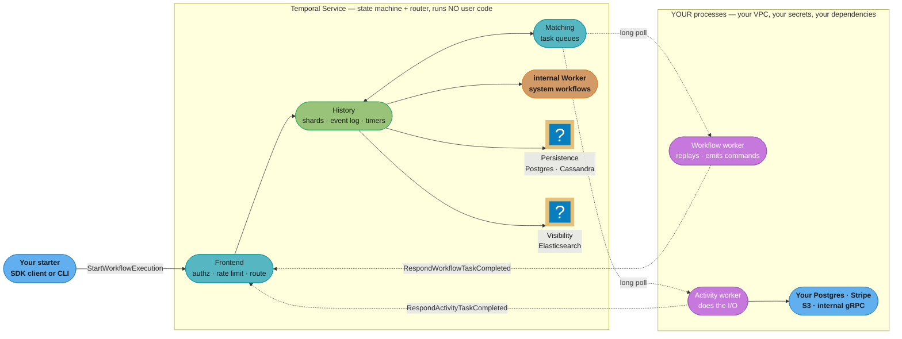
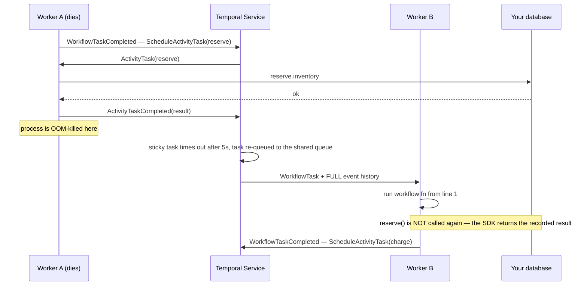
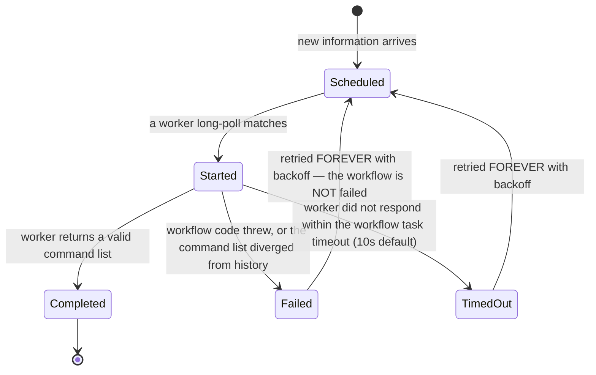
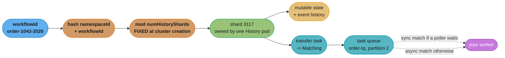
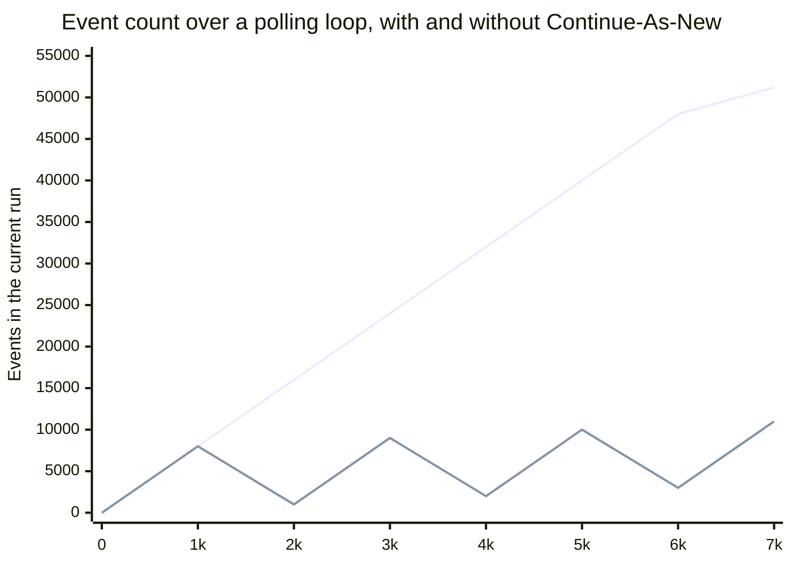

# Temporal — Durable Execution

> **Version anchor (2026-08-04).** Temporal Server **1.31.2** (patch) on the **1.31** feature line; supported server lines are **1.29.7**, **1.30.6**, **1.31.2**. SDKs: **Go 1.47.0**, **Java 1.37.0**, **Python 1.31.0**, **TypeScript 1.21.1**, **.NET 1.17.0**. The `temporal` CLI is **1.8.2**. Everything — server, SDKs, CLI, Web UI — is **MIT licensed** (Temporal Technologies Inc., retaining the original Uber Technologies copyright from the Cadence fork). Version-specific behaviour is tagged inline as `[1.31]`, `[Go 1.47]`, `[Java 1.37]` and so on; nothing in this module is described as current without naming the release it landed in.

Temporal is a **durable execution** platform: you write an ordinary function in Go, Java, Python, TypeScript or .NET, and the platform guarantees it runs to completion — across process crashes, machine loss, deploys, and waits measured in months. It does that by persisting the function's *progress* (an append-only event history) rather than asking you to persist its *state* (a status column and a poller).

---

## 1. Concept Overview

### What durable execution means

A normal function's progress lives in a process's memory: the program counter, the call stack, the local variables. Kill the process and all of it is gone. Every workaround engineers reach for — a `status` column, a `retry_count`, a cron that sweeps stuck rows, a compensating job — is a hand-built, partial reconstruction of that lost progress.

Temporal makes the progress itself durable. Each meaningful step of a **Workflow Execution** is appended to a per-execution **event history** in the Temporal Service's database *before* the next step is allowed to happen. If the worker process dies at step 7 of 12, another worker picks the execution up, feeds the history back through your function from line one, and the SDK **short-circuits** every call whose result is already in the history — returning the recorded value instantly instead of doing the work again. Your function arrives back at step 7 with the same local variables, the same loop counter, the same call stack, and continues.

The observable consequence is the one that sells it: `await sleep(timedelta(days=30))` is a legitimate, cheap line of production code. So is a loop that waits for a human to approve something, a saga that unwinds six services' worth of side effects, and a retry policy that keeps trying for a week.

### The thesis of this page: the Temporal Service never runs your code

This is the single fact that most changes how you reason about Temporal, and half of the rest of this module is a consequence of it.

- **The Temporal Service** (the server cluster: Frontend, History, Matching, internal Worker) is a **state machine and a task router**. It stores event histories, enforces timers and timeouts, dispatches tasks onto task queues, and indexes executions for search. It has no idea what your code does and cannot execute a line of it.
- **Workers** are processes *you* build, deploy and scale. They embed a Temporal SDK, **long-poll** the Service for tasks on the task queues they are registered for, execute your workflow and activity functions **in your process, inside your VPC, against your dependencies and your secrets**, and report the resulting commands back.

Three practical consequences fall straight out:

1. **Your dependencies never leave your network.** Temporal Cloud can be a multi-tenant SaaS holding your histories, and your worker still talks to an internal Postgres over a private subnet, because the worker is yours. Contrast AWS Step Functions, where AWS invokes your Lambda.
2. **Scaling has two independent axes.** Workers scale on CPU and concurrency limits; the Service scales on persistence throughput. A worker fleet at 100% CPU and a Service at 5% load is a normal, healthy, unbalanced picture.
3. **Your code's failure is not the Service's failure.** A bad worker deploy stalls workflow *tasks*, which the Service retries indefinitely. Nothing is marked failed, nothing pages, and rolling the worker back resumes every execution exactly where it stopped (§6.14, §10).

### Disambiguation — five other "temporal"s and one Cadence

"Temporal" is also an ordinary English adjective, and this repository already uses it in five unrelated technical senses. None of them is this product:

| Term you may hit | What it actually means | Where it lives |
|---|---|---|
| **Temporal locality** | The caching principle that a byte read now is likely read again soon | [`cs_fundamentals/computer_architecture_and_memory_hierarchy`](../../cs_fundamentals/computer_architecture_and_memory_hierarchy/computer_architecture_and_memory_hierarchy.md) |
| **Temporal queries** | Asking an event-sourced system "what did this look like on 3 March?" | [`backend/event_sourcing_and_cqrs`](../../backend/event_sourcing_and_cqrs/event_sourcing_and_cqrs.md), [`hld/event_sourcing_cqrs`](../../hld/event_sourcing_cqrs/event_sourcing_cqrs.md) |
| **Temporal coupling** | A design smell: A must be called before B or B misbehaves | [`lld/behavioral/command`](../../lld/behavioral/command/command.md) |
| **Temporal decoupling** | Producer and consumer need not be online at the same instant | [`backend/event_driven_fundamentals`](../../backend/event_driven_fundamentals/event_driven_fundamentals.md) |
| **`java.time.temporal.Temporal`** | The JDK interface `Instant`, `LocalDate` and friends implement, with `TemporalAdjuster` / `TemporalAmount` | [`java/java_time_datetime`](../../java/java_time_datetime/java_time_datetime.md) |
| **Temporal Fusion Transformer (TFT)** | An attention-based time-series forecasting architecture | [`ml/time_series_forecasting`](../../ml/time_series_forecasting/time_series_forecasting.md) |

And the name confusion that is *not* a homonym: **Cadence**. Temporal is a 2019 fork of [Uber's Cadence](https://github.com/uber/cadence), created by Cadence's own original authors — Maxim Fateev and Samar Abbas, who had earlier built Amazon Simple Workflow Service. The two systems still share a family resemblance (workflows, activities, task queues, event histories, determinism, `GetVersion`-style patching), which is why Cadence documentation often reads as almost-correct Temporal documentation. The APIs diverged years ago, the ecosystems are not compatible, and essentially all new adoption is Temporal (§8, §12 Q27).

### A short history

| Year | Event |
|---|---|
| 2015–2016 | Fateev and Abbas build **Cadence** at Uber, drawing on their AWS Simple Workflow Service experience |
| 2017 | Cadence open-sourced by Uber |
| 2019 | **Temporal Technologies** founded; Cadence forked as **Temporal**, MIT licensed |
| 2020 | Temporal Server **1.0**; Temporal Cloud enters private preview |
| 2022–2023 | Temporal Cloud GA; Java/Python/TypeScript/.NET SDKs mature; Schedules replace cron-only scheduling |
| 2024–2025 | **Nexus** pre-release `[1.25+]`; Update-with-Start GA and Worker Deployment APIs in public preview `[1.28]` |
| 2026 | **`[1.31]`** Worker Deployment APIs **GA**, Task Queue **Priority and Fairness GA**, Nexus **on by default** with token-based routing, `Principal` attribution on history events |

### What Temporal is not

- **Not a batch scheduler.** It has no data intervals, no backfill semantics, no notion of "yesterday's partition". That is [Apache Airflow's](../apache_airflow/apache_airflow.md) job, and §8 spends a whole table on the difference.
- **Not a message broker.** It does not fan out an event to N unknown subscribers, and it is not where you put 200,000 clickstream events per second. That is Kafka's job ([`backend/kafka_deep_dive`](../../backend/kafka_deep_dive/kafka_deep_dive.md)).
- **Not a data-processing engine.** Payloads are capped (2 MB hard, 256 KB before it warns). You pass an S3 URI, not a DataFrame.
- **Not low-latency RPC.** Every workflow step costs several database writes. A workflow step is a ~10–50 ms floor operation, not a 200 μs one.
- **Not a BPMN modeller.** There is no drawing surface an analyst edits; the process *is* code in a general-purpose language. Camunda occupies the other end of that axis (§8).

### Licence and governance

Server, all SDKs, the CLI and the Web UI are **MIT**. There has been no relicensing event, no BSL, no SSPL — a genuine differentiator in 2026's infrastructure market, and worth stating in an adoption review because it means self-hosting forever is a supported path, not a loophole. **Temporal Cloud** is the vendor's commercial hosted offering built on the same open-source server (§6.20); it is how the company makes money, and the reason the open-source project is not crippled.

---

## 2. Intuition

> **One-line analogy:** Temporal gives your function an infinitely long, crash-proof call stack.

**Mental model.** Stop thinking of workflow state as something you write to a database. Your workflow's **local variables, loop counters, `if` branches and call stack *are* the durable state.** You never `UPDATE orders SET status = 'PAID'`; you write `const paid = await authorizePayment(order)` and the fact that payment succeeded is recorded as an `ActivityTaskCompleted` event in the history. The next time anything needs to know, the SDK rebuilds `paid` by replaying that event into your variable.

**Why it matters.** The alternative — the one nearly every team builds by hand at least once — is the **queue-plus-database state machine**. A three-line function

```text
reserved = reserveInventory(order)
charged  = authorizePayment(order)
shipped  = ship(order)
```

becomes: a `status` enum with six values, a table of `attempt_count`s, a consumer per step, a dead-letter queue per consumer, a cron sweeping rows stuck in `PAYMENT_PENDING`, a hand-written compensation path that releases inventory when shipping fails, and an operator runbook nobody trusts. Every one of those exists to reconstruct the progress that the language gave you for free and the crash took away. Temporal gives it back.

**Key insight — the sentence the rest of this page unpacks.** *The event history is the source of truth; your local variables are a cache of it.* Everything that surprises newcomers is a direct consequence:

- Replay must be **deterministic**, because a cache is only valid if recomputing it yields the same answer — hence no `time.Now()`, no `rand`, no direct I/O in workflow code (§6.3).
- The history has a **size limit**, because it is loaded and replayed in a worker's memory — hence 51,200 events, hence Continue-As-New (§6.11).
- Changing your code changes the recomputation — hence **versioning is a first-class deploy concern**, not an afterthought (§6.10).
- **Activities exist at all** only because I/O is exactly the thing that cannot be recomputed. An activity's *result* is recorded so it need never be recomputed; that is the whole trick.

If you can restate that one sentence and derive those four consequences from it, you understand Temporal better than most people who have shipped on it.

---

## 3. Core Principles

- **Durable progress, not durable data.** Temporal persists where your program *is*, not just what it holds. That is the entire product; everything else is machinery serving it.
- **The history is an append-only log; state is a fold over it.** Same idea as event sourcing ([`backend/event_sourcing_and_cqrs`](../../backend/event_sourcing_and_cqrs/event_sourcing_and_cqrs.md)), applied to a program's execution rather than a domain aggregate.
- **Replay determinism: same history + same code ⇒ same command sequence.** The SDK verifies that the commands your code produces on replay match what the history already recorded. Divergence is a hard error, not a warning.
- **The Service is a state machine and a router; it never executes user code.** The two-plane split (§1) drives the security model, the scaling model, and the failure model.
- **Workflows decide; activities act.** Workflow code must be deterministic and does no I/O. Every network call, disk write, clock read and random draw belongs in an activity.
- **Activity execution is at-least-once, so idempotency is your job.** Temporal guarantees the activity will run until it succeeds or its policy gives up. It cannot guarantee it ran only once (§6.14).
- **Timers are durable server state, not `sleep()`.** A 30-day wait is a row in the Service's timer queue and consumes no worker, no thread and no memory (§6.5).
- **Task queues are matched, not broadcast.** A task goes to exactly one polling worker. A task queue is a rendezvous point, not a pub/sub topic (§6.8).
- **Failure is typed, and the types behave completely differently.** Activity failure ≠ workflow-task failure ≠ workflow failure ≠ termination. Confusing them is the most expensive misunderstanding in production (§6.14).
- **Everything lives in a namespace with finite retention.** A namespace is the unit of isolation, config, authorization, rate limiting and retention — and closed executions *are deleted* when retention expires (§6.12).
- **Versioning is a deploy concern from day one.** Long-lived executions mean old code and new code coexist by definition. Plan for it before the first production workflow, not after the first stall (§6.10).

---

## 4. Types / Architectures / Strategies

### 4.1 The primitive taxonomy — what each building block is for, and when it is the wrong tool

Temporal has ten user-facing primitives. Most production mistakes are a primitive used outside its lane, so the last column matters more than the first.

| Primitive | Durable? | May do I/O? | Blocks the caller? | Writes history? | When it is the WRONG tool |
|---|---|---|---|---|---|
| **Workflow** | Yes | **No** | n/a | Yes (its own history) | Anything that fits in one request/response, or anything needing sub-10 ms latency |
| **Activity** | Yes (result recorded) | **Yes** | Workflow awaits it | Yes (3 events per attempt-chain) | Pure computation on data already in the workflow — you pay 3 events and a round trip for nothing |
| **Local Activity** | Yes (marker) | Yes | Workflow awaits it | Yes (1 marker event, batched) | Anything slow, anything needing heartbeats, anything needing long retries — it must finish inside the workflow task timeout |
| **Child Workflow** | Yes | No | Optional (`await` handle or just start) | Parent + its own history | A function call. A child costs a full execution, its own history, its own retention and its own visibility row — see §6.7 |
| **Signal** | Yes | n/a (input) | No — fire and forget | Yes (`WorkflowExecutionSignaled`) | Anything where the sender needs a result or needs to know it was processed — that is an Update |
| **Query** | **No** — read-only | **No** | Yes, synchronously | **No** | Triggering work, mutating state, or anything that must survive the call. A Query that mutates is a replay bomb (§6.6) |
| **Update** | Yes | No (handler is workflow code) | Yes | Yes (`Accepted` + `Completed`) | High-frequency polling — each Update writes history |
| **Timer** | Yes | n/a | Workflow awaits it | Yes (`TimerStarted` / `TimerFired`) | Sub-second precision. Timer resolution is seconds, and firing is best-effort-prompt, not real-time |
| **`SideEffect` / `MutableSideEffect`** | Yes (marker) | Local only | Yes | Yes (marker) | Anything remote. `SideEffect` is for a UUID or a local random draw, not an HTTP call — it has no retries |
| **Nexus Operation** | Yes | Yes (in the handler's namespace) | Optional | Yes | Same-team, same-namespace composition — a child workflow is simpler and cheaper there (§6.7) |

Two lines from that table that engineers argue about in code review:

- **"A child workflow is not a function call."** If you would not create a separate database row, a separate retention bucket and a separate searchable record for it, it is an activity.
- **"A Query is not a way to trigger work."** Queries are served from a replayed (or cached) workflow state with no history write. If the query handler changes state, the change exists only in that one worker's memory and disappears on the next replay — silent, non-deterministic divergence.

### 4.2 Server component taxonomy — the four services

A Temporal Service is four independently scalable roles. In `temporal server start-dev` all four run in one binary; in production they are usually four Kubernetes Deployments behind one Helm release.

| Service | Stateless? | Owns | Scales by | What breaks when it is short |
|---|---|---|---|---|
| **Frontend** | Yes | The public gRPC API surface: authentication, authorization, rate limiting, request validation, routing to the right History shard | Replicas + CPU; it is the only service clients and workers connect to | Client `ResourceExhausted` errors, poll rejections, elevated `service_latency` on every API |
| **History** | **No** — owns shards | Event histories, mutable state, and the internal **transfer**, **timer**, **visibility** and **replication** task queues that drive everything asynchronously | Number of history shards (fixed at cluster creation) spread over pods | Task-queue lag climbs, timers fire late, activities are dispatched slowly, `task_latency` spikes — the classic "Temporal feels slow" incident |
| **Matching** | Mostly (owns task-queue partitions) | The **user-facing task queues**: it holds tasks and matches them to long-polling workers, with sync match when a poller is already waiting | Task-queue partitions and replicas | `schedule_to_start` latency rises across the board even though workers are idle |
| **Worker** (internal) | Yes | Temporal's **own** system workflows — namespace deletion, batch operations, archival, multi-cluster replication, scanner jobs | Replicas | Housekeeping stops: retention deletion lags, batch jobs stall, archival backs up |

**The trap in the names.** The internal **Worker service** is part of the Temporal Service and has nothing to do with *your* workers. When an SRE says "the worker is unhealthy" you must establish which one. This module always says "the internal Worker service" for Temporal's and "your workers" for yours.

### 4.3 Persistence and visibility store choices

Temporal keeps two logically separate stores, and they are configured, sized and scaled separately.

**Core persistence** (event histories, mutable state, task queues, timers):

| Store | Status | Use it when | Schema floor `[1.31]` |
|---|---|---|---|
| **Cassandra** | The original, still the highest-throughput choice | You already run Cassandra and need the write throughput and horizontal headroom | **Cassandra 5.0.4+** required by the 1.31 line |
| **PostgreSQL** | Fully supported, the most common self-hosted choice in 2026 | You want one managed RDS/Cloud SQL instance and your throughput fits a single writer | core schema **v1.19** (adds `current_chasm_executions`) |
| **MySQL** | Fully supported | Same as Postgres, in a MySQL shop | core schema **v1.19** |
| **SQLite** | **Development only** | `temporal server start-dev`; never production | schema **v1.11** |

**Visibility** (the searchable index behind "list all failed order workflows for customer 42"):

| Mode | Backend | You get | You lose |
|---|---|---|---|
| **Standard visibility** | The same SQL database | Listing by workflow type, workflow ID, status, start/close time | **Custom search attributes**, rich List Filter expressions, `ORDER BY` on custom fields — the Web UI's advanced search box is effectively disabled |
| **Advanced visibility** | **Elasticsearch** (visibility schema **v14** on 1.31) or **OpenSearch** | Custom typed search attributes, SQL-like List Filters, keyword-list matching, efficient large-scale listing | An extra stateful system to run, and eventual consistency between writing and being listable |

**The decision rule.** Advanced visibility is not optional at scale — but it also cannot be retrofitted for free, because the index must be backfilled. Choose it on day one if you will ever need to answer "find me every execution for tenant X". `[1.31]` also allows advanced visibility on modern PostgreSQL/MySQL for some workloads, but Elasticsearch remains the reference deployment for large clusters.

### 4.4 Worker taxonomy and deployment shapes

A **worker** is a process running your code with an embedded SDK. What varies is what it registers and where it runs.

| Shape | What it registers | Why |
|---|---|---|
| **Combined worker** | Workflows and activities on one task queue | The default; correct until one of the two starves the other |
| **Workflow-only worker** | Workflow types only | Workflow tasks are short, CPU-light and latency-sensitive; keeping them off a fleet full of slow activities protects the sticky cache and keeps replay fast |
| **Activity-only worker** | Activity types only | Activities are I/O-heavy, memory-hungry, sometimes GPU-bound, and want completely different autoscaling. Splitting also lets one activity type get its own task queue and its own hardware |
| **Sticky queue** | Created automatically per worker | Not something you register — the SDK creates a private task queue per worker so subsequent workflow tasks for a cached execution come back to the worker that already has it in memory (§6.8) |

**One worker polls one task queue per registration.** Routing work to specific hardware — GPU activities, a Windows-only integration, a PCI-scoped subnet — is done by giving that work its own task queue and running a dedicated worker fleet on it. Task queue names are the routing primitive; there is no other.

**Deployment ladder:**

| Rung | Command / artifact | Persistence | Fit |
|---|---|---|---|
| Dev server | `temporal server start-dev` (CLI 1.8.2) | In-memory or SQLite file | Laptop, unit tests, CI integration tests |
| Docker Compose | `temporalio/auto-setup` images | Postgres/Cassandra + optional Elasticsearch | Team dev cluster, demos |
| **Kubernetes via Helm** | The `temporal` Helm chart, four Deployments | Managed Postgres/Cassandra + Elasticsearch | Self-hosted production |
| **Temporal Cloud** | No cluster at all — you get an endpoint plus mTLS certs or API keys | Vendor-operated | Production without a stateful tier to own (§6.20) |

### 4.5 Multi-cluster and multi-region

| Topology | How it works | The honest limitation |
|---|---|---|
| **Single cluster** | One Service, one persistence store, HA within a region via replicas and multi-AZ storage | A regional outage is an outage |
| **Multi-cluster replication** | A namespace is replicated to a second cluster; failover is manual or automatic and flips which cluster is "active" for that namespace | **Replication is asynchronous.** A failover can lose the tail of the history that had not replicated yet, and executions may re-run their last step on the new active cluster |
| **Temporal Cloud HA namespaces** | Cloud runs the replica pair and the failover for you, with a published RPO/RTO | Same asynchronous physics; Cloud manages it, it does not repeal it |

**Say the quiet part in an interview:** Temporal offers **no synchronous cross-region consistency**. There is no Spanner-style globally consistent write path. Multi-region Temporal is asynchronous replication plus a failover procedure, and your design must tolerate a small window of replayed or lost tail work.

### 4.6 Versioning strategies as a taxonomy

Four legitimate strategies, each with a different granularity and a different bill.

| Strategy | Granularity | What it costs | When it is the only option |
|---|---|---|---|
| **Patching** (`GetVersion` / `patched`) | One change site inside one workflow function | Permanent branch clutter until every old execution drains; a marker event per patch; discipline to actually remove it | You must change the behaviour of executions **already running**, and you cannot wait for them to finish |
| **Worker Deployments + Build IDs** `[1.28 preview, 1.31 GA]` | A whole worker build | Operating deployment versions, ramping, and keeping old workers alive until pinned executions drain | You have many long-lived executions and want new code to apply only to new ones — the modern default |
| **Blue/green by task queue name** | A whole workflow type | Two fleets, two queues, and a starter that must know which queue to use | You want total isolation and are willing to route at start time; also the migration hatch when the other two do not fit |
| **Continue-As-New as a version boundary** | One loop iteration | You must already be using CAN, and the change must be safe to apply at the boundary | A long-running entity workflow that loops forever and would otherwise never pick up new code |

**Pinned vs AutoUpgrade** is the choice inside the Worker Deployments strategy and comes up in every Temporal interview:

- **Pinned** — an execution stays on the Deployment Version it started on for its whole life. New code never touches it, so **patching is largely unnecessary**, at the cost of keeping the old worker build running until the last pinned execution finishes. This is the right default for long-lived business processes.
- **AutoUpgrade** — an execution moves to whatever the current Deployment Version is at its next workflow task. New code applies immediately, so **determinism is your problem again** and patching comes back. Correct for short-lived executions and for behaviour changes you genuinely want applied to in-flight work.

`[1.31 → removal in 1.32]` The **legacy Worker Versioning v1/v2 APIs are deprecated**: `UpdateWorkerBuildIdCompatibility`, `GetWorkerBuildIdCompatibility`, `UpdateWorkerVersioningRules`, `GetWorkerVersioningRules` and `GetWorkerTaskReachability`. Anything written against build-ID *sets* must migrate to Worker Deployments before 1.32.

---

## 5. Architecture Diagrams

### 5.1 The two planes — the Service versus your workers



The dotted arrows are all worker-initiated: workers **poll**, the Service never calls out to them, so a worker needs only outbound connectivity. Nothing on the right-hand side is ever visible to the Service except the payloads you explicitly pass through it (§6.19).

### 5.2 One workflow's event history, annotated (ASCII — the two-column alignment carries the meaning)

```
  id  event type                        written by   what it means
 ───  ────────────────────────────────  ──────────  ─────────────────────────────────────
   1  WorkflowExecutionStarted          server      the start request, input, timeouts
   2  WorkflowTaskScheduled             server      "someone please advance this"
   3  WorkflowTaskStarted               server      a worker long-poll matched
   4  WorkflowTaskCompleted             worker      worker returned its COMMAND list
   5  ActivityTaskScheduled             server      from command ScheduleActivityTask
   6  ActivityTaskStarted               server      an activity worker picked it up
   7  ActivityTaskCompleted             worker      result payload recorded  <- the cache
   8  WorkflowTaskScheduled             server      new information -> advance again
   9  WorkflowTaskStarted               server
  10  WorkflowTaskCompleted             worker      commands: StartTimer(30d)
  11  TimerStarted                      server      durable timer row; costs 0 workers
      ...  30 days pass, zero resources held  ...
  12  TimerFired                        server
  13  WorkflowTaskScheduled             server
  14  WorkflowTaskStarted               server
  15  WorkflowTaskCompleted             worker      commands: CompleteWorkflowExecution
  16  WorkflowExecutionCompleted        server      terminal; retention clock starts

 arithmetic:  1 activity ~= 3 events      1 workflow task ~= 2-3 events
              warn at 10,240 events / 10 MB      TERMINATE at 51,200 events / 50 MB
```

Read the "written by" column: the worker writes only `*TaskCompleted` events, and every other event is the server reacting. That is the two-plane split expressed as a log.

### 5.3 Replay after a worker crash



Nothing is replayed against the outside world. The SDK intercepts every awaited call, finds its completion already in the history, and hands back the recorded value — so replay is pure re-derivation of in-memory state, which is exactly why it must be deterministic.

### 5.4 Workflow Task lifecycle



The two red arrows are the ones that surprise people at 3am. A workflow **task** failure is retried indefinitely with exponential backoff and leaves the workflow execution in `Running`. A bad deploy therefore **freezes** every in-flight execution rather than failing them — no alert fires, nothing is marked failed, and rolling the worker back resumes all of them (§6.14, §10, §12 Q1).

### 5.5 The four activity timeouts over a retry chain (ASCII — nested brackets on one shared time axis)

```
 t=0   activity scheduled                                          activity finally done
  |                                                                          |
  |<---------------------- ScheduleToClose (whole chain) ------------------->|
  |                                                                          |
  |  [ queue wait ]  attempt 1        backoff   attempt 2   backoff  attempt 3
  |  |<--------->|<------------->|   <------>  |<------->|  <----->  |<---->|
  |  ScheduleToStart               StartToClose (PER ATTEMPT — resets each retry)
  |  (queue time only;             |<------------->|      |<------->|  |<---->|
  |   NOT retried)                 heartbeat timeout runs inside each attempt
  |                                 h----h----h----X  (no heartbeat -> attempt fails fast)
  |
  defaults:  ScheduleToStart  = infinity, NOT required, and deliberately NOT retried
             StartToClose     = ScheduleToClose if unset; ONE OF these two is REQUIRED
             ScheduleToClose  = infinity
             HeartbeatTimeout = unset (opt in; required for long activities)
```

`StartToClose` is per attempt and resets on every retry; `ScheduleToClose` is the only bound on the whole chain. Set `StartToClose` always. Leave `ScheduleToStart` unset unless you have a specific, argued reason (§6.4, §10).

### 5.6 Signal versus Query versus Update

```mermaid
sequenceDiagram
    participant C as Caller
    participant S as Temporal Service
    participant W as Worker (workflow)
    rect rgb(30,34,42)
    Note over C,W: SIGNAL — async, durable, no result
    C->>S: SignalWorkflowExecution(payload)
    S-->>C: ack (accepted, not processed)
    S->>W: WorkflowTask with WorkflowExecutionSignaled
    W->>W: handler mutates workflow state
    end
    rect rgb(30,34,42)
    Note over C,W: QUERY — sync, read-only, writes NOTHING to history
    C->>S: QueryWorkflow(name)
    S->>W: QueryTask against cached or replayed state
    W-->>S: value
    S-->>C: value
    end
    rect rgb(30,34,42)
    Note over C,W: UPDATE — sync AND durable AND may mutate
    C->>S: UpdateWorkflowExecution(args)
    S->>W: validator runs first — reject writes no history
    W-->>S: accepted
    S->>S: WorkflowExecutionUpdateAccepted persisted
    W-->>S: result
    S-->>C: result
    end
```



Signal is the only one that cannot tell you whether the workflow liked it. Query is the only one that leaves no trace. Update is the only one that is synchronous, durable and mutating at once — which is why it took until `[1.28]` for Update-with-Start to reach GA.

### 5.7 Workflow ID to shard to worker



Every operation on one workflow ID is serialized through one shard owned by one History pod, which is what makes single-execution consistency cheap — and what makes `numHistoryShards` the immutable capacity decision you cannot revisit (§6.18, §12 Q10).

### 5.8 History growth and the Continue-As-New sawtooth



The rising line is a loop with no Continue-As-New: it crosses the **10,240-event warning** around iteration 1,300 and is **terminated by the server at 51,200 events**. The sawtooth is the same loop calling Continue-As-New every few thousand events — same workflow ID, new run ID, fresh history, unbounded lifetime.

---

## 6. How It Works — Detailed Mechanics

### 6.1 The event history — what is actually stored

The history is the whole product. Here is a real one, trimmed:

```text
$ temporal workflow show --workflow-id order-1043-2026 --output json | head -40
  1  WorkflowExecutionStarted    {workflowType: OrderWorkflow, taskQueue: order-tq,
                                  workflowExecutionTimeout: 0s, workflowRunTimeout: 0s,
                                  workflowTaskTimeout: 10s, attempt: 1,
                                  input: [{"orderId":"1043","total":8999}]}
  2  WorkflowTaskScheduled       {taskQueue: order-tq, startToCloseTimeout: 10s}
  3  WorkflowTaskStarted         {identity: 41@worker-7d9f-abc, requestId: ...}
  4  WorkflowTaskCompleted       {workerVersion: {buildId: "2026.08.04-a91f"}}
  5  ActivityTaskScheduled       {activityId: "5", activityType: ReserveInventory,
                                  scheduleToCloseTimeout: 5m, startToCloseTimeout: 30s,
                                  retryPolicy: {initialInterval: 1s, backoffCoefficient: 2,
                                                maximumInterval: 100s}}
  6  ActivityTaskStarted         {attempt: 1, identity: 41@worker-7d9f-abc}
  7  ActivityTaskCompleted       {result: [{"reservationId":"r-88"}]}
```

**The event catalogue, grouped by what causes it.** You do not need to memorise all ~50 event types, but you must know these groups, because reading a history is the core Temporal debugging skill:

| Group | Events | Notes |
|---|---|---|
| Start | `WorkflowExecutionStarted` | Carries input, all three workflow-level timeouts, the task queue, the parent (if any), the retry policy and the search attributes |
| Workflow task | `WorkflowTaskScheduled` → `WorkflowTaskStarted` → `WorkflowTaskCompleted` \| `WorkflowTaskFailed` \| `WorkflowTaskTimedOut` | 2–3 events per cycle; `[1.31]` completions also carry a `Principal` attribution field |
| Activity | `ActivityTaskScheduled` → `ActivityTaskStarted` → `ActivityTaskCompleted` \| `ActivityTaskFailed` \| `ActivityTaskTimedOut` \| `ActivityTaskCancelRequested` \| `ActivityTaskCanceled` | ~3 events per activity **regardless of retry count** — retries reuse the same `Scheduled` event and bump `attempt` |
| Timer | `TimerStarted` → `TimerFired` \| `TimerCanceled` | The cheapest durable primitive in the system |
| Marker | `MarkerRecorded` | Side effects, mutable side effects, local activities and version patches all land here |
| Signal | `WorkflowExecutionSignaled` | One event per signal, written even if no handler is registered yet |
| Update | `WorkflowExecutionUpdateAccepted` → `WorkflowExecutionUpdateCompleted` \| `...Rejected` | A rejected update writes **nothing** — the validator runs before acceptance |
| Child workflow | `StartChildWorkflowExecutionInitiated` → `ChildWorkflowExecutionStarted` → `ChildWorkflowExecutionCompleted` \| `Failed` \| `TimedOut` \| `Canceled` \| `Terminated` | In the **parent's** history; the child has a full history of its own |
| Nexus | `NexusOperationScheduled` → `NexusOperationStarted` → `NexusOperationCompleted` \| `Failed` \| `Canceled` \| `TimedOut` | `[1.31]` GA with token-based routing |
| Continue-As-New | `WorkflowExecutionContinuedAsNew` | Terminal for the current run, immediately starting a new run under the same workflow ID |
| Terminal | `WorkflowExecutionCompleted` \| `Failed` \| `TimedOut` \| `Canceled` \| `Terminated` | Starts the retention clock |

**The arithmetic you should carry in your head.** One activity is about **3 events**; one workflow task is **2–3 events**. So a workflow that calls 40 activities and sleeps twice costs roughly `40 × 3 + 42 × 3 ≈ 250` events — comfortably fine. A workflow polling once a minute for a week costs `10,080 × 6 ≈ 60,000` events — terminated. History budgets are *event-count* budgets, and you estimate them by counting activities and awaits, not by counting bytes.

### 6.2 The workflow task cycle — your code emits commands, not events

Newcomers assume the worker writes events. It does not. The worker returns a **command list**, and the History service turns commands into events after validating them.

**What the worker receives** in a `PollWorkflowTaskQueue` response:
- the workflow type, the run's identity, and the task queue,
- the event history up to a point, plus `previousStartedEventId` — the boundary between "already replayed before" and "new since your last task",
- for a sticky hit, only the *incremental* history since the last task, because the worker already holds the state in cache.

**What the worker returns** in `RespondWorkflowTaskCompleted`: an ordered list of commands, generated by the SDK from what your code did — you never construct one by hand.

| Command | Emitted when your code… | Becomes event |
|---|---|---|
| `ScheduleActivityTask` | calls an activity | `ActivityTaskScheduled` |
| `StartTimer` | sleeps or sets a deadline | `TimerStarted` |
| `CancelTimer` | a select/race loses | `TimerCanceled` |
| `RequestCancelActivityTask` | cancels an activity | `ActivityTaskCancelRequested` |
| `StartChildWorkflowExecution` | starts a child | `StartChildWorkflowExecutionInitiated` |
| `RecordMarker` | uses `SideEffect`, a local activity, or `GetVersion` | `MarkerRecorded` |
| `UpsertWorkflowSearchAttributes` | upserts search attributes | `UpsertWorkflowSearchAttributes` |
| `ScheduleNexusOperation` | invokes a Nexus operation | `NexusOperationScheduled` |
| `ContinueAsNewWorkflowExecution` | calls Continue-As-New | `WorkflowExecutionContinuedAsNew` |
| `CompleteWorkflowExecution` / `FailWorkflowExecution` / `CancelWorkflowExecution` | returns, throws, or accepts cancellation | the matching terminal event |

**The validation step is the determinism check.** On replay, the SDK compares the commands your code produces against the events already in the history. If command #3 is `StartTimer` but the history says `ActivityTaskScheduled`, the SDK raises a **non-determinism error**, the workflow task fails, and the Service retries it forever until you deploy code that matches (§6.14).

### 6.3 Determinism — the constraint list and its sanctioned replacements

This is the section interviewers probe hardest, because it is the constraint that makes durable execution possible and the one engineers violate accidentally.

| Forbidden in workflow code | Why it breaks replay | Use instead |
|---|---|---|
| `time.Now()`, `datetime.now()`, `System.currentTimeMillis()` | Returns a different value on every replay; any branch on it diverges | `workflow.Now()` / `workflow.now()` / `Workflow.currentTimeMillis()` — replay-safe, frozen at the workflow task's start time |
| `rand()`, `math/rand`, `random.random()` | Different draw every replay | The SDK's deterministic random (`workflow.SideEffect`, `workflow.random()`, `Workflow.newRandom()`) |
| `uuid4()` | Same problem | `workflow.SideEffect(uuid)` — recorded as a marker and replayed from it, or generate it in an activity |
| Direct HTTP / gRPC / DB / file I/O | The result is not in the history, so it re-executes on every replay, and any change in the response diverges the code path | An **activity** (or a **local activity** for something fast and local) |
| `sleep()` / `Thread.sleep()` | Blocks a worker thread for real and is invisible to the Service | `workflow.Sleep()` / `await asyncio.sleep()` under the SDK's clock / `Workflow.sleep()` — becomes a durable timer |
| Raw goroutines, threads, `asyncio.create_task` | Scheduling order is not reproducible | `workflow.Go()` (Go), `Async.function()` (Java), the SDK-provided task API (Python/TS) |
| **Iterating a Go `map`** | Go **randomizes map iteration order by design**, so the order of scheduled activities differs on replay — and the bug only appears after a worker restart forces a replay | Sort the keys into a slice and iterate the slice |
| **Iterating a Python `set`**, or anything with hash-seed-dependent ordering | Same class of bug | `sorted(...)`, or a list |
| Reading env vars, config files, feature flags | The value changes between the original run and the replay, silently forking the code path | Pass it as workflow input, or read it in an activity and record the result |
| Global mutable state, statics, singletons shared across executions | Two executions on one worker see each other's state; replay sees whatever the process happens to hold | Keep all state in workflow-local variables |
| Native locks/`synchronized` held across an await point | The SDK's cooperative scheduler cannot make progress; Java's deadlock detector will kill the task | Structure the code so nothing is held across an await; use the SDK's own primitives |
| Changing code without versioning | Old executions replay against new code and diverge | Patching or Worker Deployments (§6.10) |

**How each SDK enforces it — they are genuinely not equal:**

| SDK | Enforcement | Strength |
|---|---|---|
| **Python 1.31** | A real **sandbox**: workflow modules are re-imported into a restricted environment with dangerous stdlib calls blocked at runtime. Pass through known-safe imports with `workflow.unsafe.imports_passed_through()` | Strongest. It will actually stop you calling `datetime.now()` |
| **TypeScript 1.21** | Workflow code is bundled and run in an **isolated v8 context** with no Node APIs, a deterministic clock and a deterministic `Math.random` | Very strong — I/O is simply not reachable |
| **Java 1.37** | A **deadlock detector** kills a workflow task that blocks the scheduler thread, plus a replayer for tests; virtual threads are stable on JVM 21+ | Medium — it catches blocking, not clock reads |
| **Go 1.47** | The **replayer** (in tests) plus the static analyzer **`workflowcheck`** | **Weakest static enforcement.** Nothing at runtime stops `time.Now()`. Run `workflowcheck` in CI and mandate replay tests (§6.17) |

Say this plainly in an interview: **Go gives you the least protection and is the most common Temporal SDK**, which is why the Go ecosystem leans hardest on replay tests as a CI gate.

### 6.4 Activities in depth

An activity is a plain function the worker executes at-least-once, whose *result* the Service records. It is the only place I/O may happen.

**The four timeouts** (see the diagram at §5.5):

| Timeout | Default | Required? | What it bounds | Retried? |
|---|---|---|---|---|
| `ScheduleToStart` | infinity | No | Time sitting in the task queue before a worker picks it up | **No — deliberately** |
| `StartToClose` | falls back to `ScheduleToClose` | **One of this or `ScheduleToClose` is required** | A single attempt's execution time | Yes, per the retry policy |
| `ScheduleToClose` | infinity | See above | The **whole chain**: queue time plus every attempt plus every backoff | n/a — it ends the chain |
| `HeartbeatTimeout` | unset | No, but effectively required for long activities | Max gap between heartbeats within an attempt | Failing it fails the attempt, which retries |

**The one people get wrong: `ScheduleToStart`.** It reads like a safety net — "don't let this sit in the queue forever" — so it gets set to something like 30 seconds across the board. Then a routine deploy drains the worker fleet for 45 seconds and thousands of queued activities fail simultaneously. Worse, `ScheduleToStart` is **deliberately not retried**: retrying would only put the task back on the same backed-up queue, so Temporal treats it as a routing/capacity failure rather than a transient one. The correct posture is: **always set `StartToClose`; leave `ScheduleToStart` unset** unless you are deliberately detecting a mis-routed task queue, and then alert on the *metric* instead (§6.18).

**The default retry policy** applies to every activity unless you override it:

```text
initialInterval:     1s
backoffCoefficient:  2.0
maximumInterval:     100 x initialInterval   (100s with the default)
maximumAttempts:     0  ->  UNLIMITED
```

So the sleep sequence is 1s, 2s, 4s, 8s, 16s, 32s, 64s, 100s, 100s, 100s… forever, until `ScheduleToClose` (if set) cuts the chain. **Activities retry by default; workflows do not.** A workflow gets a retry policy only if you attach one at start.

**Non-retryable errors.** Retrying a 400 Bad Request forever is a bug. Two mechanisms:

```go
// Go — declare types that must never be retried
ao := workflow.ActivityOptions{
    StartToCloseTimeout: 30 * time.Second,
    RetryPolicy: &temporal.RetryPolicy{
        InitialInterval:        time.Second,
        BackoffCoefficient:     2.0,
        MaximumInterval:        100 * time.Second,
        MaximumAttempts:        5,
        NonRetryableErrorTypes: []string{"InvalidCardError", "FraudBlockedError"},
    },
}
```

```python
# Python — or raise a non-retryable failure from inside the activity
from temporalio.exceptions import ApplicationError

@activity.defn
async def authorize_payment(req: PaymentRequest) -> str:
    resp = await stripe_client.charge(req.amount, idempotency_key=req.idem_key)
    if resp.status == 402:
        raise ApplicationError("card declined", non_retryable=True, type="CardDeclined")
    return resp.id
```

`ApplicationFailure` (Go `temporal.NewApplicationError`, Java `ApplicationFailure.newFailure`, Python `ApplicationError`, TS `ApplicationFailure`) is the wrapper that carries a **type string** across the wire. That type is what `NonRetryableErrorTypes` matches on and what the workflow catches — so give your failures stable, meaningful type names, because they are effectively an API.

**Heartbeating.** For any activity that runs longer than a few seconds:

```python
@activity.defn
async def export_ledger(cursor: str) -> str:
    while True:
        page = await db.fetch_page(cursor)
        if not page:
            return cursor
        await s3.put(page)
        cursor = page.next_cursor
        activity.heartbeat(cursor)          # details are persisted with the heartbeat
```

Three things heartbeating buys you, and the third is the one people miss:

1. **Fast failure detection** — without it, a worker that dies mid-activity is only noticed when `StartToClose` expires, which for a 2-hour activity means a 2-hour hole.
2. **Resumable progress** — the `details` argument (`cursor` above) is persisted, and the next attempt reads it back via `activity.info().heartbeat_details`, so a retry resumes from page 4,000 instead of page 1.
3. **Cancellation delivery.** **A heartbeat is the ONLY channel by which an activity learns it has been cancelled.** An activity that never heartbeats can never be cancelled cooperatively — it runs to completion or times out. This is the single best argument for heartbeating.

**Asynchronous activity completion.** When the work is finished by something that is not your worker — a human clicking Approve, a callback from a payment provider, a batch job on another platform — the activity can call `activity.doNotCompleteOnReturn()` (Java) / return `activity.raise_complete_async()` (Python) / `activity.ErrResultPending` (Go), hand its **task token** to the external system, and later that system calls `CompleteActivityByToken`. The activity's timeouts and heartbeats still apply, so the human has, say, 72 hours.

**Local Activities and their real limits.** A local activity runs **inside the workflow task**, in the same worker process, and is recorded as a single `MarkerRecorded` event rather than the usual three. That is a genuine saving for something called thousands of times. The limits are strict:

- it must complete within the **workflow task timeout** (10 s default), so it is for milliseconds-scale work only;
- **no heartbeats**, so no long-running work and no cooperative cancellation;
- retries happen inside the workflow task, so a long retry chain will blow the task timeout;
- it does not appear as a first-class activity in the Web UI, so it is harder to debug.

Use a local activity for a fast in-process lookup, a small local computation, a cheap cache read. Use a normal activity for anything crossing the network.

### 6.5 Timers and the durable clock

`workflow.Sleep(30 * 24 * time.Hour)` is two events and one row:

1. the worker emits a `StartTimer` command; the History service writes `TimerStarted` and inserts a **timer task** into its internal timer queue keyed on the fire time;
2. thirty days later the History service's timer processor picks it up, writes `TimerFired`, and schedules a workflow task.

Between those two moments the execution consumes **zero worker memory, zero threads and zero polls**. It is a row in a database and nothing else. This is the fact that makes month-long processes practical, and it is worth stating explicitly in an interview because most people assume something must be holding the wait open.

**Resolution and honesty about it.** Timers are **second-resolution** and fire "promptly, not precisely" — under load the History service's timer queue can lag. Never build something that needs a 50 ms deadline on a Temporal timer.

**`workflow.Now()` is frozen.** It returns the **workflow task's start time**, not the wall clock, and it does not advance while your code runs inside one task. Two calls in the same workflow task return the same instant. That is what makes it replay-safe, and it means you cannot measure elapsed time inside a workflow task with it.

**Cron workflows versus Schedules.** The `CronSchedule` option on a start request is the legacy mechanism: it re-runs the workflow on a cron expression, but you cannot pause it, backfill it, or see it as a first-class object. **Schedules** are the modern replacement — a real resource you create, describe, pause, unpause, trigger manually, and backfill over a time range, with overlap policies (skip, buffer one, buffer all, cancel other, terminate other, allow all) and a jitter setting:

```bash
temporal schedule create \
  --schedule-id nightly-recon \
  --cron "0 2 * * *" \
  --overlap-policy Skip \
  --workflow-id recon \
  --task-queue finance-tq \
  --type ReconciliationWorkflow

temporal schedule backfill --schedule-id nightly-recon \
  --start-time 2026-07-01T00:00:00Z --end-time 2026-07-15T00:00:00Z \
  --overlap-policy BufferAll
```

Use Schedules for anything new. And note the contrast with Airflow: a Temporal Schedule has **no data interval** — it starts a workflow at a time, it does not hand it "the partition for 14 July" (§8).

### 6.6 Signals, Queries and Updates

| | Signal | Query | Update |
|---|---|---|---|
| Direction | Into the workflow | Out of the workflow | Both |
| Synchronous for the caller? | No | Yes | Yes |
| Durable? | Yes | **No** | Yes |
| May mutate workflow state? | Yes | **Never** | Yes |
| Writes history? | Yes | **No** | Yes (Accepted + Completed) |
| Can be rejected? | No | n/a | **Yes** — a validator runs first and a rejection writes nothing |
| Works on a closed workflow? | No | Yes, if within retention | No |

**Signal-with-start** solves the "start it if it isn't running, otherwise just tell it" race atomically:

```python
handle = await client.start_workflow(
    SubscriptionWorkflow.run, customer_id,
    id=f"sub-{customer_id}", task_queue="billing-tq",
    start_signal="payment_received", start_signal_args=[amount],
)
```

Without it you would check-then-start and lose to a concurrent starter.

**The ordering trap.** A signal delivered before its handler is registered is **not lost** — it is buffered and delivered when the handler appears — but signals that arrive while the workflow is between awaits, or right at the end, are the source of real bugs. Two idioms:

- Register every signal handler **at the very top** of the workflow function, before the first await, so no window exists where one is unregistered.
- Before completing (and especially before Continue-As-New), **drain**: Python exposes `workflow.all_handlers_finished()`, and the pattern is `await workflow.wait_condition(workflow.all_handlers_finished)` before returning. Otherwise a signal accepted a millisecond before completion is silently discarded (§6.11, §10).

**Queries are strictly read-only, and violating that is subtle.** A query handler runs against a replayed or cached state and produces **no history**. If it mutates a field, the mutation lives only in that worker's memory. The next workflow task on a different worker replays from history, does not see the mutation, and takes a different branch — a non-determinism error whose cause is nowhere near the failure. It is one of the hardest Temporal bugs to diagnose, which is why every SDK's documentation is emphatic about it.

**Updates are the only synchronous, durable, mutating call.** Lifecycle: **validate → accept → execute → complete**. The validator is ordinary code that may inspect workflow state and reject; a rejection writes **nothing** to history, which is what makes Update safe to use for input validation. `[1.28]` **Update-with-Start is GA**, giving you "start this workflow if needed and get me a synchronous answer from it" in one call — the shape most request/response APIs on top of Temporal actually want.

```java
// Java 1.37 — an Update that changes the shipping address mid-flight
@UpdateMethod
String changeAddress(Address next);

@UpdateValidatorMethod(updateName = "changeAddress")
void validateChangeAddress(Address next) {
    if (this.shipped) throw new IllegalArgumentException("already shipped");
}
```

### 6.7 Child workflows, and when Nexus instead

A **child workflow** is a full Workflow Execution started by another workflow. It gets its own workflow ID, its own event history, its own retention row and its own visibility record.

**Parent-close policy is the surprise.** The default is **`TERMINATE`**: when the parent closes, its children are terminated. That is usually what you want for a fan-out of subtasks and catastrophically wrong for a child that represents an independent long-lived process. The three values:

| Policy | Behaviour |
|---|---|
| `TERMINATE` (default) | Children are terminated when the parent closes |
| `ABANDON` | Children keep running independently — use this for anything that should outlive the parent |
| `REQUEST_CANCEL` | Children get a cancellation request and may clean up |

**The real cost of a child.** Each child is a first-class execution: several database writes to start, a history to store, retention to pay for, a visibility row to index, and its own workflow tasks. Fanning out one child per line item on a 50,000-item order is how teams hit the **2,000 pending-children limit** and, well before that, make the parent's history enormous (§6.11, §10).

**Choose an activity when** the work is a single unit that does I/O and returns a value. **Choose a child workflow when** the work is genuinely a multi-step process with its own timers, signals, retries and history — or when it needs to be queried and observed as its own entity in the UI.

**Nexus** `[1.25 pre-release, 1.31 enabled by default with token-based routing and a reworked error model]` is the boundary a child workflow cannot express: a **cross-namespace, cross-team, cross-cluster** call. A Nexus **Endpoint** exposes named **Operations** that another team's workflow can invoke exactly like an activity, while the implementation — a workflow or a handler — lives entirely in the provider's namespace, with the provider's own workers, retention and access control. It is the difference between calling a function in your module and calling another team's service with a contract. Use it when the two sides have different owners, different deploy cadences, different namespaces or different compliance boundaries; a child workflow is simpler and cheaper inside one team's namespace.

### 6.8 Task queues and matching

A **task queue** is a named rendezvous point held by the Matching service. Workers long-poll it; the Service pushes nothing.

**Sync match versus async match.** If a poller is already waiting when a task arrives, Matching hands it over **without ever persisting the task** — that is the fast path and it is why a warm fleet feels instant. If no poller is waiting, the task is persisted and delivered when one arrives (async match), which costs an extra write and some latency. Keeping enough pollers to stay on the sync-match path is a real tuning goal.

**Long polling.** A `PollWorkflowTaskQueue` call blocks server-side for up to about a minute and returns empty if nothing arrives. Workers immediately re-poll. Consequences: idle workers still generate steady RPC volume, and worker→Service connectivity must allow long-lived requests through every proxy in between.

**Sticky queues.** After a worker completes a workflow task it keeps the workflow's state in memory and tells the Service to send the next task to a **private, per-worker sticky queue**. Two numbers matter:

- **`StickyScheduleToStartTimeout` = 5 s.** If the sticky worker does not pick the task up within 5 seconds — because it died, is saturated, or was drained by a deploy — the task falls back to the shared task queue and any worker takes it, replaying the full history first.
- **The sticky cache size** is per SDK: Go's default workflow cache is **10,000** executions; Java's `WorkflowCacheSize` default is **600**. A cache **miss** means fetching and replaying the *entire* history for that execution, so miss rate is a direct latency and CPU cost.

The classic incident: a scale-down evicts half the fleet, every cached execution's next task misses, and the surviving workers spend minutes replaying long histories at 100% CPU. It reads exactly like a Temporal outage and is entirely self-inflicted (§10).

**Poller tuning.** Each worker runs a configurable number of workflow-task and activity-task pollers. Too few and you never sync-match; too many and you waste connections on the Frontend. `[Go 1.47]` ships **automatic poller autoscaling**, so the Go SDK adjusts poller counts to observed load — prefer it to hand-tuned counts on the Go SDK.

**Slot suppliers and resource-based tuning.** Modern SDKs let you replace fixed concurrency caps with a **resource-based tuner** that admits work while CPU and memory stay under a target. That is far better than a hand-picked `maxConcurrentActivityExecutionSize` for heterogeneous activity durations. Where you do set the fixed numbers, note they differ per SDK — check the pinned SDK's own documentation rather than assuming a shared default; the tuning surface is one of the biggest per-SDK differences in the product (§6.16).

**Task Queue Priority and Fairness `[1.31 GA]`.** You can now attach a **priority key** to workflows and activities and get fair scheduling across keys on a single task queue. Before 1.31 the only tool was a separate task queue per tenant or per priority band, which meant a worker fleet per band. The new mechanism lets one fleet serve a shared queue while a noisy tenant cannot starve the others — the standard answer to "how do you stop one customer's 50,000-item backfill from delaying everyone else's checkout".

### 6.9 Workers in depth

```go
// Go 1.47 — a production-shaped worker
c, err := client.Dial(client.Options{
    HostPort:  "temporal.internal:7233",
    Namespace: "orders-prod",
    ConnectionOptions: client.ConnectionOptions{TLS: tlsCfg},
})
w := worker.New(c, "order-tq", worker.Options{
    MaxConcurrentActivityExecutionSize:     200,
    MaxConcurrentWorkflowTaskExecutionSize: 100,
    WorkerStopTimeout:                      30 * time.Second, // grace for in-flight activities
    EnableSessionWorker:                    false,
})
w.RegisterWorkflow(OrderWorkflow)
w.RegisterActivity(ReserveInventory)
w.RegisterActivity(AuthorizePayment)
if err := w.Run(worker.InterruptCh()); err != nil { log.Fatal(err) }
```

**Registration is a name→function map.** Nothing is sent to the Service; the worker simply knows how to handle those types. If a task arrives for a type this worker has not registered, the workflow task fails and retries — which is precisely what happens when a new workflow type is deployed to only half the fleet.

**Worker identity** defaults to `pid@hostname` and appears in `WorkflowTaskStarted` events. Set it to something meaningful (pod name, build ID) — it is what turns "some worker misbehaved" into "pod `order-worker-7d9f` misbehaved".

**Graceful shutdown** matters more here than in a stateless service. On SIGTERM the worker should stop polling immediately, then let in-flight activities finish up to `WorkerStopTimeout`. Kubernetes `terminationGracePeriodSeconds` must exceed that, or the kubelet SIGKILLs mid-activity and you take an unnecessary retry (and, if `ScheduleToStart` is set, a wave of failures — §6.4).

**Split workflow and activity workers at scale** when: activities are slow or memory-hungry and starve workflow tasks; you want different autoscaling signals for the two; or activities need hardware (GPU, big memory) that would be wasted on workflow tasks. The split also protects the sticky cache, because workflow workers then restart only when workflow code changes.

### 6.10 Versioning and safe deploys — the deep one

Long-lived executions guarantee that **old histories will be replayed by new code**. This is not an edge case; it is the steady state.

#### What actually breaks

The rule is about the **command sequence**, not about the source text:

| Change | Safe? | Why |
|---|---|---|
| Append a new activity call **after** everything the history already recorded | **Safe** | Replay reaches the end of the history and simply continues |
| Add a field to an activity's input struct | Usually safe | Inputs are not compared against history; the recorded *result* is what matters. Confirm your converter tolerates the change |
| Change an activity's implementation (its body) | **Safe** | Activities are not replayed — their results are |
| Rename an activity **type** | **Unsafe** | The scheduled type in the history no longer matches the command |
| Insert an activity or timer **before** an already-recorded step | **Unsafe** | Every subsequent command shifts, so command #3 no longer matches event #3 |
| Remove or reorder steps | **Unsafe** | Same reason |
| Change a conditional so a different branch runs on replay | **Unsafe** | The command sequence diverges |
| Change workflow **input/output types** incompatibly | **Unsafe** | Deserialization fails on replay |

#### Patching, in four steps

```go
// Go / Java: GetVersion(changeID, minSupported, maxSupported)
v := workflow.GetVersion(ctx, "use-fraud-check", workflow.DefaultVersion, 1)
if v == workflow.DefaultVersion {
    err = workflow.ExecuteActivity(ctx, LegacyRiskScore, order).Get(ctx, &score)
} else {
    err = workflow.ExecuteActivity(ctx, FraudCheckV2, order).Get(ctx, &score)
}
```

```python
# Python 1.31
if workflow.patched("use-fraud-check"):
    score = await workflow.execute_activity(fraud_check_v2, order, ...)
else:
    score = await workflow.execute_activity(legacy_risk_score, order, ...)
```

```typescript
// TypeScript 1.21
import { patched, deprecatePatch } from '@temporalio/workflow';
if (patched('use-fraud-check')) { await fraudCheckV2(order); } else { await legacyRiskScore(order); }
```

The lifecycle is always the same four steps, and skipping step 4 is how a codebase accumulates dead branches:

1. **Patch** — deploy the two-branch version. Old executions take the old branch (they have no marker); new executions record a `MarkerRecorded` version marker and take the new one.
2. **Drain** — wait until every execution that predates the patch has closed. Verify with a visibility query, not with a guess.
3. **Deprecate** — deploy `deprecate_patch("use-fraud-check")` / `DeprecatePatch`, which asserts "everything is on the new branch now" while still accepting the marker.
4. **Remove** — delete the patch call and the old branch entirely.

Each `GetVersion`/`patched` call writes **one marker event** per execution, so hundreds of live patches in a hot loop is itself a history-size problem.

#### Worker Deployments and Build IDs `[1.28 public preview, 1.31 GA]`

A **Deployment Version** is `deployment name + build ID`. You tell the Service which version is current, and optionally ramp traffic to a new one:

```bash
# roll out a new build to 10% of new executions
temporal worker deployment set-ramping-version \
  --deployment-name order-workers --build-id 2026.08.04-a91f --percentage 10

# promote it
temporal worker deployment set-current-version \
  --deployment-name order-workers --build-id 2026.08.04-a91f

temporal worker deployment describe --deployment-name order-workers
```

With **Pinned** behaviour, an execution stays on the version it started on for life. The consequence is worth stating loudly: **pinning long-running workflows makes most patching unnecessary.** You stop writing `GetVersion` branches and instead keep the old worker build running until its executions drain. The bill is operational (two or more worker builds alive at once, and a way to know when the old one is finally idle) rather than in the code.

`[1.31 → removal in 1.32]` The legacy build-ID *sets* APIs are deprecated: `UpdateWorkerBuildIdCompatibility`, `GetWorkerBuildIdCompatibility`, `UpdateWorkerVersioningRules`, `GetWorkerVersioningRules`, `GetWorkerTaskReachability`. If your deploy tooling calls any of those, it breaks on the 1.32 upgrade.

`[Go 1.47 / Java 1.37]` **`PreferredVersionProvider`** closes a subtler gap: it lets you deploy a new `GetVersion` call and roll out the *code* before activating its *behaviour*, so the marker and the branch are not forced to go live in the same deploy.

`[Python 1.31]` adds `patch_activation_callback`, giving a hook to observe patch activation during rolling deploys.

#### The replay test is the only real safety net

Every mechanism above depends on you knowing whether new code still replays old histories. **The only way to know is to try it.** Export a corpus of production histories and run the SDK's replayer against them in CI, as a required gate:

```go
// Go — CI gate: new code must replay yesterday's real histories
func TestReplayProductionHistories(t *testing.T) {
    replayer := worker.NewWorkflowReplayer()
    replayer.RegisterWorkflow(OrderWorkflow)
    for _, f := range histories("testdata/histories/*.json") {
        require.NoError(t, replayer.ReplayWorkflowHistoryFromJSONFile(nil, f), f)
    }
}
```

```bash
# refresh the corpus — a nightly job, committed as test fixtures
temporal workflow show --workflow-id order-1043-2026 --output json > testdata/histories/order-1043.json
```

Treat this as mandatory, not as a nicety. It is the difference between a determinism bug caught in a pull request and one discovered when every in-flight execution silently freezes on a Friday deploy.

### 6.11 Continue-As-New and the limits

**The limits table** — memorise the two on the top row:

| Limit | Warn | Error / hard |
|---|---|---|
| Event history length | **10,240 events** | **51,200 events** — the execution is **terminated** |
| Event history size | **10 MB** | **50 MB** — terminated |
| Single payload (blob) | **256 KB** | **2 MB** |
| Pending activities | — | **2,000** (docs recommend staying under 500) |
| Pending child workflows | — | **2,000** (same recommendation) |
| Pending signals to other executions | — | **2,000** |
| Pending cancel requests | — | **2,000** |
| Incomplete Nexus operations | — | **30** |

**How Continue-As-New works.** The workflow returns a special "continue as new" result carrying the input for the next run. The Service closes the current run with `WorkflowExecutionContinuedAsNew` and immediately starts a **new run** — **same workflow ID, new run ID, empty history** — with the input you chose. To the outside world it is still one logical workflow: signals addressed to the workflow ID reach the new run, and the Web UI chains the runs together.

```python
@workflow.defn
class SubscriptionWorkflow:
    @workflow.run
    async def run(self, state: SubState) -> None:
        for _ in range(12):                       # one year of monthly cycles per run
            await workflow.sleep(timedelta(days=30))
            await workflow.execute_activity(charge, state.customer, ...)
            state.cycles += 1
            if state.cancelled:
                return
        # drain in-flight handlers BEFORE continuing, or a signal lands in a dead run
        await workflow.wait_condition(workflow.all_handlers_finished)
        workflow.continue_as_new(state)
```

**The signal-loss race at the boundary.** Continue-As-New is not atomic with respect to signals in flight. A signal that arrives after your code decides to continue but before the new run exists can be dropped, and a signal handler that is still executing when you call `continue_as_new` loses its work. The closing pattern is two-part:

1. **Drain handlers** — `await workflow.wait_condition(workflow.all_handlers_finished)` (or the SDK equivalent) immediately before continuing.
2. **Carry the buffer forward** — if your handler appends to a queue, pass the unprocessed remainder into the next run's input rather than assuming it is empty.

**The entity-workflow idiom.** A long-lived "entity" — a subscription, a shopping cart, a device, an agent session — is modelled as a workflow that loops forever: wait for a signal or a timer, do a little work, and Continue-As-New every N iterations or when the history crosses a threshold you check with `workflow.info().get_current_history_length()`. This is the canonical way to run something for years on a system with a 51,200-event ceiling.

---

### 6.12 Namespaces, retention, archival and multi-tenancy

A **namespace** is the unit of isolation. Workflow IDs are unique *within* a namespace; task queues, search attributes, authorization rules, rate limits and retention are all per namespace. Two namespaces on one cluster cannot see each other's executions.

```bash
temporal operator namespace create --namespace orders-prod --retention 30d
temporal operator namespace describe --namespace orders-prod
temporal operator namespace update  --namespace orders-prod --retention 90d
```

**Retention is a deletion policy, and people misread it.**

| Deployment | Default | Range |
|---|---|---|
| Self-hosted | **3 days** | minimum **1 day** |
| Temporal Cloud | **30 days** | **1–90 days** |

Retention applies to **closed** executions only — a running workflow is never deleted no matter how long it runs. When retention expires, the execution's **event history and its visibility record are deleted**. Not archived, not cold-stored: gone. The self-hosted default of 3 days is a development default, and shipping it to production is how a team discovers in an audit that last month's approvals no longer exist (§10).

**Archival** is the answer, and it is **off by default**. Configure it per namespace, for two independent targets:

- **History archival** — the full event history, written to S3, GCS or a filestore.
- **Visibility archival** — the searchable record.

The critical caveat: archived histories are retrievable **by workflow ID and run ID only**. They are not queryable, not listable by search attribute, and not visible in the Web UI's normal list view. Archival is a compliance and forensics tool, not a data warehouse. If you need to *analyse* completed executions, stream them out instead — Temporal Cloud offers a per-namespace **export** of closed workflow histories to your own bucket in Protobuf, and self-hosted clusters usually solve it with an activity that writes a business-level record to your own store at the end of each workflow.

**Multi-tenancy patterns:**

| Pattern | Isolation | Cost |
|---|---|---|
| Namespace per environment (dev/staging/prod) | Baseline; everyone does this | None |
| Namespace per team or bounded context | Independent retention, authz, rate limits, and blast radius | More namespaces to operate; cross-namespace calls need Nexus |
| Namespace per customer | Hard tenant isolation and per-tenant retention | Does not scale past a few hundred; namespace count has real cluster cost |
| One namespace, tenant ID in the workflow ID and a search attribute | Scales to millions of tenants | No isolation — a noisy tenant needs `[1.31]` task-queue fairness or a separate task queue |

**Per-namespace rate limits** exist on both self-hosted (`frontend.namespaceRPS` and friends in dynamic config) and Cloud. When you exceed them the Frontend returns `ResourceExhausted`, workers back off, and everything gets slower without anything appearing broken — the symptom to recognise (§6.18).

### 6.13 Visibility and search attributes

Visibility answers "which executions match this?" — the Web UI list view, `temporal workflow list`, and every batch operation.

**Predefined attributes** exist in every namespace: `WorkflowId`, `RunId`, `WorkflowType`, `ExecutionStatus`, `StartTime`, `CloseTime`, `ExecutionDuration`, `TaskQueue`, `HistoryLength`, plus `TemporalScheduledById` for schedule-started runs.

**Custom search attributes** must be registered on the namespace before use, and they are typed:

| Type | Use for |
|---|---|
| `Keyword` | Exact-match identifiers — customer ID, tenant, region |
| `Text` | Tokenized free text (analysed, so not exact-match) |
| `Int`, `Double`, `Bool` | Numeric and boolean filters |
| `Datetime` | Time filters |
| `KeywordList` | A set of exact-match tags on one execution |

```bash
temporal operator search-attribute create --name CustomerId --type Keyword
temporal operator search-attribute create --name OrderTotal --type Double
temporal operator search-attribute create --name Tags       --type KeywordList
```

```python
# set at start, and update from inside the workflow as the process progresses
handle = await client.start_workflow(
    OrderWorkflow.run, order, id=f"order-{order.id}", task_queue="order-tq",
    search_attributes=TypedSearchAttributes([
        SearchAttributePair(SearchAttributeKey.for_keyword("CustomerId"), order.customer_id),
    ]),
)

# inside the workflow
workflow.upsert_search_attributes([
    SearchAttributePair(SearchAttributeKey.for_keyword("Stage"), "awaiting-payment"),
])
```

**Memo versus search attribute.** A **memo** is arbitrary metadata attached to an execution that is returned when you describe or list it but is **not indexed and not filterable**. A **search attribute** is indexed and filterable but must be registered and typed. Use a memo for "extra context a human might want on the row" and a search attribute for anything you will ever filter on.

**List Filter syntax** is SQL-like:

```bash
temporal workflow list --query \
  'WorkflowType = "OrderWorkflow" AND ExecutionStatus = "Failed" AND CustomerId = "42" AND StartTime > "2026-08-01T00:00:00Z"'

# and batch operations run over the same query
temporal workflow terminate --query 'WorkflowType="StuckWorkflow" AND ExecutionStatus="Running"' --reason "bad rollout"
```

**Visibility is eventually consistent.** The visibility record is written asynchronously off the History service's visibility task queue, so "I started the workflow and it is not in the list" is expected, not a bug — and it can lag by seconds to minutes when the cluster is loaded. Never build a correctness-critical read on a visibility query. If you must know whether a specific execution exists, use `DescribeWorkflowExecution` on its workflow ID, which reads mutable state directly and is strongly consistent.

### 6.14 Failure semantics — the taxonomy interviews probe

There are four distinct failure kinds and they behave nothing alike. Getting this table right is most of a Temporal interview.

| Kind | Trigger | Default behaviour | Effect on the execution |
|---|---|---|---|
| **Activity failure** | The activity function threw | Retried per the retry policy (unlimited attempts by default) | Nothing — until attempts are exhausted, at which point the workflow sees an exception it may catch |
| **Workflow task failure** | Workflow code threw a non-`ApplicationFailure` error, hit a determinism mismatch, blocked the scheduler, or the type was not registered | **Retried FOREVER with exponential backoff** | **The execution stays `Running`.** It makes no progress and nothing is marked failed |
| **Workflow failure** | The workflow deliberately failed — returned/threw an `ApplicationFailure` | Retried only if the workflow has a retry policy (it has none by default) | History closes as `Failed`; `finally`/`defer` compensation code **does** run |
| **Termination** | `temporal workflow terminate`, a batch terminate, hitting the 51,200-event limit, or a `TERMINATE` parent-close | None | Hard stop, immediately. **No compensation runs. No `finally` block runs.** |

**The 3am line:** *a workflow task failure freezes the workflow, it does not fail it.* This is deliberate and it is a feature — it means a bad deploy is recoverable by rolling back rather than by re-running thousands of business processes. It is also why a stall must be detected on a metric (`workflow_task_execution_failed`, or a rising count of executions with `attempt > 1`) rather than on a failure alert that will never fire.

**Cancellation versus termination:**

| | Cancel | Terminate |
|---|---|---|
| Cooperative? | **Yes** — the workflow receives a cancellation signal and may run cleanup | No |
| Compensation runs? | **Yes** — `defer`, `finally`, saga rollback | **No** |
| Can the workflow refuse? | It can ignore it, or take time to shut down | No |
| Use for | Business-level "stop this order" | Genuine emergency, or a wedged execution you have given up on |

Use `temporal workflow cancel` by default. `terminate` as routine cleanup is a data-integrity bug waiting to happen — inventory stays reserved, payments stay authorised, and nobody notices for a week (§10).

**The three workflow-level timeouts** (all separate from the activity timeouts in §6.4):

| Timeout | Default | Bounds |
|---|---|---|
| `WorkflowExecutionTimeout` | unlimited | The whole logical workflow **including every Continue-As-New run and retry** |
| `WorkflowRunTimeout` | = execution timeout | A **single run** (resets at Continue-As-New) |
| `WorkflowTaskTimeout` | **10 s** | How long a worker has to process one workflow task |

Setting `WorkflowExecutionTimeout` on an entity workflow that continues-as-new forever is a common self-inflicted wound: the execution dies at the deadline no matter how healthy it is.

**At-least-once and the two duplicate-producing races.** Temporal guarantees an activity runs *at least* once. Duplicates happen concretely when:

1. the activity completes its side effect and the worker crashes **before** `RespondActivityTaskCompleted` reaches the Service — the Service never learns it succeeded and retries after `StartToClose`;
2. the activity is slow, `StartToClose` fires while the work is still running, and the retry starts a **second concurrent** execution of the same side effect.

Neither is preventable by Temporal, because "did my charge go through" is a question only the downstream system can answer. **Idempotency is your job**, and the key must be derived from something stable across attempts:

```python
# CORRECT — workflow ID + activity ID are stable across every attempt
info = activity.info()
idem_key = f"{info.workflow_id}:{info.activity_id}"

# WRONG — attempt increments on every retry, so every retry looks like a new charge
idem_key = f"{info.workflow_id}:{info.attempt}"
```

Pass that key to Stripe's `Idempotency-Key`, to your own `INSERT ... ON CONFLICT DO NOTHING`, or to a dedupe table. Do **not** use `workflow.uuid4()` generated inside the activity — it changes every attempt.

### 6.15 Sagas and compensation

Temporal does not have a saga *engine*; it has something better, which is that a saga becomes ordinary `try`/`catch` plus a stack of compensations:

```python
@workflow.defn
class OrderWorkflow:
    @workflow.run
    async def run(self, order: Order) -> str:
        compensations = []
        try:
            res = await workflow.execute_activity(reserve_inventory, order, start_to_close_timeout=timedelta(seconds=30))
            compensations.append(lambda: workflow.execute_activity(release_inventory, res, start_to_close_timeout=timedelta(seconds=30)))

            pay = await workflow.execute_activity(authorize_payment, order, start_to_close_timeout=timedelta(seconds=30))
            compensations.append(lambda: workflow.execute_activity(refund_payment, pay, start_to_close_timeout=timedelta(seconds=30)))

            return await workflow.execute_activity(ship_order, order, start_to_close_timeout=timedelta(minutes=5))
        except Exception:
            for undo in reversed(compensations):     # unwind newest-first
                await undo()                          # each is itself a retried activity
            raise
```

```java
// Java 1.37 ships a Saga helper that does the same bookkeeping
Saga saga = new Saga(new Saga.Options.Builder().setParallelCompensation(false).build());
try {
    String r = activities.reserveInventory(order);
    saga.addCompensation(activities::releaseInventory, r);
    String p = activities.authorizePayment(order);
    saga.addCompensation(activities::refundPayment, p);
    return activities.ship(order);
} catch (ActivityFailure e) {
    saga.compensate();
    throw e;
}
```

Two things to notice. **Compensations are themselves activities**, so they get their own retries and their own idempotency requirements — a refund that fails must retry, not be swallowed. And **compensation only runs on cancel or failure, never on terminate** (§6.14), which is the operational reason `terminate` is dangerous.

For the theory — why compensation is not rollback, what a semantic lock is, when to prefer orchestration over choreography — see [`backend/distributed_transactions_and_consistency`](../../backend/distributed_transactions_and_consistency/distributed_transactions_and_consistency.md) and [`hld/distributed_transactions`](../../hld/distributed_transactions/distributed_transactions.md). This page deliberately does not re-teach it.

### 6.16 The SDK surface across languages

| | **Go 1.47** | **Java 1.37** | **Python 1.31** | **TypeScript 1.21** |
|---|---|---|---|---|
| Concurrency primitive | `workflow.Go` + `Selector` + channels | `Async.function` + `Promise` + `Workflow.await` | `asyncio` under a deterministic event loop | Promises in an isolated v8 context |
| Determinism enforcement | Replayer + `workflowcheck` static analyzer | Deadlock detector + replayer | **Sandbox** with runtime blocking | **Isolated bundle** — I/O is unreachable |
| Sandboxing | None | None | Yes | Yes |
| Worker tuning surface | Richest; `[1.47]` automatic poller autoscaling | Rich; virtual threads stable on JVM 21+ | Good | Good |
| Notable recent additions | `PreferredVersionProvider` | `PreferredVersionProvider`, `temporal-aws-lambda` (experimental), Workflow Streams (preview) | `patch_activation_callback`, payload limits via `Client.connect(PayloadLimitsConfig)` | — |
| Maturity | Reference implementation; the server is written in Go | Most mature enterprise surface | Fastest-growing, strong for ML and agent workloads | Best fit for Node service meshes |

**The same workflow, four languages.** The point of this block is that the concepts map 1:1 and only syntax differs.

```go
// Go 1.47
func OrderWorkflow(ctx workflow.Context, order Order) (string, error) {
    ctx = workflow.WithActivityOptions(ctx, workflow.ActivityOptions{StartToCloseTimeout: 30 * time.Second})
    var res string
    if err := workflow.ExecuteActivity(ctx, ReserveInventory, order).Get(ctx, &res); err != nil {
        return "", err
    }
    if err := workflow.Sleep(ctx, time.Hour); err != nil { return "", err }
    var tracking string
    err := workflow.ExecuteActivity(ctx, ShipOrder, order).Get(ctx, &tracking)
    return tracking, err
}
```

```java
// Java 1.37
public class OrderWorkflowImpl implements OrderWorkflow {
    private final OrderActivities acts = Workflow.newActivityStub(
        OrderActivities.class,
        ActivityOptions.newBuilder().setStartToCloseTimeout(Duration.ofSeconds(30)).build());

    @Override public String run(Order order) {
        acts.reserveInventory(order);
        Workflow.sleep(Duration.ofHours(1));
        return acts.shipOrder(order);
    }
}
```

```python
# Python 1.31
@workflow.defn
class OrderWorkflow:
    @workflow.run
    async def run(self, order: Order) -> str:
        await workflow.execute_activity(reserve_inventory, order,
                                        start_to_close_timeout=timedelta(seconds=30))
        await workflow.sleep(timedelta(hours=1))
        return await workflow.execute_activity(ship_order, order,
                                               start_to_close_timeout=timedelta(seconds=30))
```

```typescript
// TypeScript 1.21
import { proxyActivities, sleep } from '@temporalio/workflow';
const acts = proxyActivities<typeof activities>({ startToCloseTimeout: '30 seconds' });

export async function orderWorkflow(order: Order): Promise<string> {
  await acts.reserveInventory(order);
  await sleep('1 hour');
  return acts.shipOrder(order);
}
```

Four languages, one program: reserve, wait an hour durably, ship. The `sleep` in each is a durable timer, and each survives a worker restart at any point.

### 6.17 Testing

**The time-skipping test environment** is the feature that makes long workflows testable at all. It runs a real Temporal server (or an in-process equivalent) whose clock jumps forward whenever every workflow is blocked on a timer — so a 30-day sleep completes in microseconds and the whole test suite stays fast.

```python
async def test_subscription_charges_twelve_times():
    async with await WorkflowEnvironment.start_time_skipping() as env:
        async with Worker(env.client, task_queue="tq",
                          workflows=[SubscriptionWorkflow], activities=[charge]):
            handle = await env.client.start_workflow(
                SubscriptionWorkflow.run, SubState("cust-1"), id="s1", task_queue="tq")
            await handle.result()          # 12 x 30-day sleeps, milliseconds of wall clock
```

**Mock the activities.** Register a stub activity in the test worker so the workflow's logic is tested without the network — and assert on the *sequence* of activities as well as the result, because sequence is what determinism cares about.

**Replay tests in CI** are the versioning gate from §6.10 and belong in every Temporal project's pipeline. Nothing else catches a determinism regression before production.

**Integration tests against `temporal server start-dev`** cover the wiring the unit tests mock away — real serialization, real timeouts, real task-queue routing:

```bash
temporal server start-dev --db-filename /tmp/temporal-test.db --ui-port 8233 &
pytest tests/integration
```

A sensible pyramid: many workflow unit tests with mocked activities and time skipping, a smaller set of activity unit tests against real dependencies or their fakes, a handful of end-to-end tests against `start-dev`, and a replay corpus that grows with production traffic.

### 6.18 Operations — sizing, shards and the persistence bottleneck

**`numHistoryShards` is set at cluster creation and cannot be changed.** Not by config reload, not by rolling restart, not by adding pods. Increasing it requires standing up a new cluster and migrating namespaces across. It determines the maximum parallelism of the History service: shards are distributed over History pods, so **you can never have more useful History capacity than you have shards**.

The rule: **shards are cheap, and you cannot go up — so over-provision.** A dev cluster's default (often 4 for `start-dev`) in production is one of the most expensive mistakes in this module, because the fix is a migration. Production clusters commonly run in the low thousands (512, 1,024, 4,096, 8,192 are all typical, chosen as powers of two), sized for where you expect to be in three years, not where you are today. The cost of extra shards is some metadata and some per-shard overhead on the History pods; the cost of too few is a rebuild.

**Throughput is measured in state transitions per second.** A "state transition" is one durable step of a workflow's state machine — scheduling an activity, recording its completion, firing a timer. It is the right unit because it is what hits persistence, and it is also the unit **Temporal Cloud bills on** (as Actions). A useful mental model: a workflow with N activities costs roughly `3N + 3` state transitions over its life.

**Persistence is always the ceiling.** Not CPU on the Frontend, not memory on Matching — the database. Every state transition is one or more writes, and the cluster goes exactly as fast as the store will accept them. This is why the Cassandra-versus-Postgres choice (§4.3) is a throughput choice, and why the first question about any slow Temporal cluster is "what is `persistence_latency` doing?".

**Server metrics that matter:**

| Metric | Watch for |
|---|---|
| `persistence_latency` (by operation) | **The primary health signal.** Rising P99 here precedes every other symptom |
| `persistence_error_with_type` | Store errors, timeouts, and — on Cassandra — write-timeout storms |
| `task_latency` (by task type/category) | History's internal transfer/timer/visibility queue lag; a rising timer-task latency means timers fire late |
| `service_latency` (by operation) | Frontend API latency, including poll paths |
| `service_errors_resource_exhausted` | You are hitting namespace or cluster RPS limits |
| shard-ownership churn / `sharditem_created` | Shards moving between pods — usually a History pod under memory pressure or being rescheduled |
| `sticky_cache_hit` / `sticky_cache_miss` | Miss rate spikes after every deploy or scale-down (§6.8) |
| `workflow_task_execution_failed` | **The stall detector.** Non-zero and climbing means a determinism bug or an unregistered type is freezing executions |
| `poll_success` / `poll_timeouts` | Poller supply versus task demand |

**SDK metrics that matter, and the one to autoscale on:**

| Metric | Meaning |
|---|---|
| **`temporal_activity_schedule_to_start_latency`** | **THE worker-capacity signal.** How long an activity task waited in the queue before a worker took it. It rises when workers are short and is independent of how fast the activities themselves are |
| `temporal_workflow_task_schedule_to_start_latency` | The same signal for workflow workers |
| `temporal_workflow_task_execution_failed` | Client-side view of the stall detector |
| `temporal_worker_task_slots_available` | Whether the worker is at its concurrency cap |
| `temporal_long_request_failure` | Poll failures — connectivity, TLS, or Frontend throttling |

**Autoscale worker replicas on `schedule_to_start` latency, not on CPU.** CPU is a lagging and misleading indicator for a fleet dominated by I/O-bound activities: a worker waiting on a slow HTTP call is at 3% CPU and completely full. Schedule-to-start latency rises the moment demand exceeds slot supply, which is exactly when you want another pod. (This is the same shape as Triton's "autoscale on queue duration, not GPU utilization" — see [`nvidia_triton_inference_server`](../nvidia_triton_inference_server/nvidia_triton_inference_server.md) §6.)

**The throttling symptom.** When a namespace exceeds its RPS limit, the Frontend returns `ResourceExhausted`, SDKs back off and retry, and the visible effect is *everything getting slower* — polls returning empty, starts taking a second, timers firing late — with no errors surfacing in your application. Recognise it by `service_errors_resource_exhausted` and raise the namespace limit or shard the load across namespaces.

### 6.19 Security

- **mTLS to the Frontend.** The standard self-hosted posture: the Frontend presents a server certificate and requires client certificates from workers and clients. Temporal Cloud requires either mTLS with a CA you upload, or API keys.
- **Authorizer and claim-mapper.** Two Go interfaces in the server: the **claim mapper** turns an incoming credential (a JWT, a client certificate's SAN) into a set of role claims per namespace, and the **authorizer** decides whether those claims may perform this API call on this namespace. The default implementations do simple JWT and certificate mapping; anything organisation-specific means implementing them yourself and building a custom server binary. Cloud gives you managed RBAC and SSO instead.
- **Per-namespace authorization.** Roles are namespace-scoped (read, write, admin), which is the main reason to give a team its own namespace.
- **The data converter and the payload codec.** Every payload — workflow input, activity input, activity result, signal argument, search-attribute value, the failure message — passes through a **data converter**. Slot a **payload codec** into it and you get end-to-end encryption: the worker encrypts before the bytes leave the process and decrypts after they come back, so **the Temporal Service stores ciphertext and holds no keys**.

```python
# Python 1.31 — an AES-GCM codec; the Service never sees plaintext
class EncryptionCodec(PayloadCodec):
    async def encode(self, payloads): ...   # AES-GCM with a KMS-held key
    async def decode(self, payloads): ...

client = await Client.connect("temporal.internal:7233",
                              data_converter=dataclasses.replace(
                                  temporalio.converter.default(),
                                  payload_codec=EncryptionCodec()))
```

- **Run a codec server so the Web UI still works.** Encrypted payloads render as opaque blobs in the UI, which destroys the debugging experience Temporal is loved for. The fix is a small HTTP **codec server** you host: the UI posts encoded payloads to it, it decrypts (enforcing *your* authorization), and returns plaintext for display. The keys stay on your side; the UI never gets them.
- **State the default plainly.** Without a codec, **the Temporal Service sees every payload in plaintext** — card numbers, PII, prompts, everything — and so does anyone with Web UI access. That is the correct starting assumption for a security review, and the reason payload minimisation (pass an S3 key, not the document) is a security practice as well as a size practice.
- **`[1.31]` `Principal` attribution** adds the identity that caused an action to history events, so an audit can answer "who terminated this execution" rather than just "it was terminated".
- **`[1.31]` `passwordCommand`** lets the server fetch its SQL password from an external command at startup, which is how cloud IAM database auth (short-lived RDS IAM tokens) is wired without a static secret in config.

### 6.20 Temporal Cloud versus self-hosted

**What Cloud takes off your plate:**

- the Cassandra/Postgres fleet and its backups, compaction, and upgrades;
- the Elasticsearch cluster behind advanced visibility;
- server version upgrades and schema migrations;
- **HA namespaces** with managed multi-region replication and failover;
- per-namespace **export** of closed histories to your bucket;
- managed RBAC, SSO, audit logging, and certificate/API-key management.

**What stays yours no matter what:** your **workers**, your **code**, your **dependencies**, your **codec keys**, your determinism discipline, and your versioning strategy. Cloud does not run a line of your code (§1), so the hardest parts of operating Temporal — deploys that do not break replay, worker capacity, idempotency — are unchanged.

**Billing shape.** Cloud charges primarily per **Action** (roughly: a state transition — starting a workflow, scheduling an activity, recording its completion, firing a timer, delivering a signal), plus **storage** billed in GB-hours for active and retained histories, plus a support tier. The practical consequences are the same two every time: **chatty workflows are expensive** (a poll loop that ticks every 10 seconds is an enormous Action bill for very little business value), and **retention is a storage bill** (90-day retention on high-volume workflows costs real money). Verify current Action definitions and prices against Temporal's published pricing before you build a cost model — the taxonomy has changed more than once and is not something to quote from memory.

**The decision rule, not a sales pitch:**

| Choose Cloud when | Choose self-hosted when |
|---|---|
| You have no team that wants to own a stateful tier | You already run Cassandra or large Postgres well |
| You need multi-region HA and do not want to build failover | Data residency or air-gap rules forbid a vendor holding histories |
| Your volume is low enough that per-Action pricing beats a three-node cluster plus on-call | Your volume is high enough that a fixed fleet is cheaper than metered Actions |
| Time-to-first-workflow matters more than unit cost | You need a custom authorizer or server-side plugin |

Because everything is MIT, the migration between them is a client configuration change plus a history migration — not a rewrite. That asymmetry is a genuine reason to start on Cloud even if you expect to self-host later.

### 6.21 A complete worked example — order fulfilment

The workflow: reserve inventory, authorize payment, ship, notify. Compensate on failure. Accept a cancellation Signal, expose a status Query, allow an address change via Update, heartbeat the long shipping activity.

```python
from datetime import timedelta
from temporalio import workflow, activity
from temporalio.common import RetryPolicy
from temporalio.exceptions import ApplicationError

RETRY = RetryPolicy(initial_interval=timedelta(seconds=1), backoff_coefficient=2.0,
                    maximum_interval=timedelta(seconds=100), maximum_attempts=5,
                    non_retryable_error_types=["CardDeclined", "OutOfStock"])

@workflow.defn
class OrderWorkflow:
    def __init__(self) -> None:
        self.stage = "created"
        self.cancelled = False
        self.address: str | None = None

    @workflow.signal
    def cancel_order(self, reason: str) -> None:      # registered before the first await
        self.cancelled = True

    @workflow.query
    def status(self) -> str:                          # read-only — never mutates
        return self.stage

    @workflow.update
    async def change_address(self, next_addr: str) -> str:
        self.address = next_addr
        return f"address set to {next_addr}"

    @change_address.validator
    def _validate(self, next_addr: str) -> None:
        if self.stage in ("shipped", "done"):
            raise ValueError("too late to change the address")

    @workflow.run
    async def run(self, order: dict) -> str:
        self.address = order["address"]
        undo = []
        try:
            self.stage = "reserving"
            res = await workflow.execute_activity(
                reserve_inventory, order, start_to_close_timeout=timedelta(seconds=30),
                retry_policy=RETRY)
            undo.append(("release_inventory", res))

            if self.cancelled:
                raise ApplicationError("cancelled by customer", non_retryable=True)

            self.stage = "authorizing"
            pay = await workflow.execute_activity(
                authorize_payment, order, start_to_close_timeout=timedelta(seconds=30),
                retry_policy=RETRY)
            undo.append(("refund_payment", pay))

            self.stage = "shipping"
            tracking = await workflow.execute_activity(
                ship_order, {"order": order, "address": self.address},
                start_to_close_timeout=timedelta(hours=2),
                heartbeat_timeout=timedelta(minutes=2),      # cancellation + resume
                retry_policy=RETRY)

            self.stage = "notifying"
            await workflow.execute_activity(
                notify_customer, tracking, start_to_close_timeout=timedelta(seconds=30))

            self.stage = "done"
            return tracking
        except Exception:
            self.stage = "compensating"
            for name, arg in reversed(undo):
                await workflow.execute_activity(
                    name, arg, start_to_close_timeout=timedelta(seconds=30),
                    retry_policy=RETRY)
            self.stage = "compensated"
            raise
```

The heartbeating activity, with a stable idempotency key and resumable progress:

```python
@activity.defn(name="ship_order")
async def ship_order(req: dict) -> str:
    info = activity.info()
    idem_key = f"{info.workflow_id}:{info.activity_id}"       # stable across attempts
    resume_from = info.heartbeat_details[0] if info.heartbeat_details else 0
    for leg in carrier.legs(req["order"], start=resume_from):
        await carrier.dispatch(leg, idempotency_key=f"{idem_key}:{leg.id}")
        activity.heartbeat(leg.index)                          # progress + cancel channel
    return carrier.tracking_id(req["order"])
```

And the subscription-renewal loop that runs forever via Continue-As-New:

```python
@workflow.defn
class RenewalWorkflow:
    @workflow.run
    async def run(self, state: dict) -> None:
        for _ in range(12):
            await workflow.sleep(timedelta(days=30))
            await workflow.execute_activity(charge_subscription, state,
                                            start_to_close_timeout=timedelta(seconds=30))
            state["cycles"] += 1
        await workflow.wait_condition(workflow.all_handlers_finished)   # drain first
        workflow.continue_as_new(state)
```

**Driving it from the `temporal` CLI** (1.8.2). Note that this reference lives here in §6 rather than in §11 — §11 indexes product names, and a command reference there would be indexed as if the commands were products:

```bash
# start
temporal workflow start --type OrderWorkflow --task-queue order-tq \
  --workflow-id order-1043-2026 --input '{"orderId":"1043","address":"1 Main St"}'

# observe
temporal workflow describe --workflow-id order-1043-2026      # status, pending activities
temporal workflow show     --workflow-id order-1043-2026      # the full event history
temporal workflow list --query 'WorkflowType="OrderWorkflow" AND ExecutionStatus="Running"'

# interact
temporal workflow query  --workflow-id order-1043-2026 --type status
temporal workflow signal --workflow-id order-1043-2026 --name cancel_order --input '"fraud hold"'
temporal workflow update execute --workflow-id order-1043-2026 \
  --name change_address --input '"9 Elm Rd"'

# intervene — cancel runs compensation, terminate does not
temporal workflow cancel    --workflow-id order-1043-2026
temporal workflow terminate --workflow-id order-1043-2026 --reason "duplicate order"
temporal workflow reset --workflow-id order-1043-2026 --event-id 12 --reason "replay from before the bad step"
```

`temporal workflow reset` deserves a note: it starts a **new run** from a chosen point in the history, discarding everything after it. It is the strongest operational tool in the box and the easiest to misuse — anything the discarded events caused in the outside world has already happened.

### 6.22 A quantified performance envelope

**Order-of-magnitude only** — every number here depends on your persistence class, payload sizes and network. Measure your own cluster; use these to sanity-check a capacity conversation.

| Quantity | Rough figure | Notes |
|---|---|---|
| State transitions per second, single Postgres (managed, well-provisioned) | **hundreds to low thousands** | Single-writer bound; the most common self-hosted ceiling |
| State transitions per second, healthy Cassandra cluster | **tens of thousands** | Scales horizontally; the reason large clusters run Cassandra |
| Event overhead per activity | **~3 events**, a few writes | Independent of retry count |
| Event overhead per workflow task | **2–3 events** | So the total is ~`3N + 3` for N activities |
| Activity round-trip floor (warm worker, sync match, trivial body) | **~10–50 ms** | Dominated by two persistence round trips plus the poll path |
| Sticky-hit workflow task | **single-digit ms** of worker CPU | The fast path |
| Sticky-miss workflow task, 5,000-event history | **hundreds of ms** of worker CPU | Full replay; this is why cache-miss storms hurt |
| Timer resolution | **seconds** | Fires promptly, not precisely |
| Practical payload | **< 256 KB** | 2 MB is the hard cap; pass pointers |

The headline: **Temporal is a reliability substrate, not a low-latency one.** If a step must complete in under 10 ms, it does not belong in a workflow step (§9).

---

## 7. Real-World Examples

**The origin — Cadence at Uber.** Uber built Cadence in 2015–2016 to stop every team reinventing the queue-plus-database state machine for driver onboarding, payments and trip lifecycle flows. It was open-sourced in 2017 and remains in production at Uber. Temporal is the 2019 fork by Cadence's original authors, and the family resemblance in the API is why so much Cadence writing reads as near-correct Temporal writing (§1, §8).

**Payments and money movement — Coinbase.** Coinbase's published Temporal case study describes migrating a transactional application component by component into Cadence/Temporal workflows, using their existing blue/green deployment system to cut over — the conservative migration shape §14 generalises. Money movement is the canonical fit: multi-step, must not be lost, must be compensatable, must be auditable. ([Coinbase case study](https://temporal.io/resources/case-studies/coinbase))

**Platform-as-a-product — Stripe.** Stripe's public talk describes not a workflow but a *platform*: horizontal scalability and isolation through distributed ownership, a "fat client" strategy where each team runs its own worker service, and internal wrappers that hide the Temporal SDK from product teams entirely. It is the best public example of the organisational shape Temporal takes at scale — a platform team owns the Service and the wrappers, and product teams own workers. ([How Stripe uses Temporal](https://temporal.io/resources/on-demand/stripe))

**Infrastructure automation — Datadog.** Datadog's case study covers automating database upgrades: a manual, unscalable, high-stakes operational process turned into a workflow with retries, heartbeats and visibility. This is the "infrastructure provisioning" archetype, and it is where Temporal most often enters an organisation, because the internal platform team is both the owner and the first customer. ([How Datadog ensures database reliability with Temporal](https://temporal.io/resources/case-studies/how-datadog-ensures-database-reliability-with-temporal))

**Retail ordering at scale — Yum! Brands.** Yum!'s public talk walks through the before-and-after of their ordering engine and menu versioning across their restaurant brands — an order lifecycle spanning payment, kitchen, and fulfilment systems with a genuine compensation requirement. ([Temporal at Yum! Brands](https://temporal.io/resources/on-demand/temporal-at-yum-brands))

**Complex business processes — Instacart.** Instacart's case study describes replacing intricate hand-built process orchestration with Temporal workflows to gain efficiency and scalability across their business processes. ([Instacart simplifies complex workflows](https://temporal.io/resources/case-studies/instacart-simplifies-complex-workflows))

**The durable-agent wave — Replit.** Temporal's own customer page describes Replit migrating its coding agent onto Temporal to improve reliability and orchestrate the Replit Agent control plane at scale. This is the fastest-growing category in 2026: an LLM agent session is a long-running, resumable, tool-calling process with human-in-the-loop pauses — structurally identical to a saga, and structurally hostile to a request/response server. The agent loop is the workflow, each tool call is an activity with its own retry policy and idempotency key, human approval is a Signal or an Update, and the session survives a deploy. See [`llm/agents_and_tool_use/durable_long_running_agents.md`](../../llm/agents_and_tool_use/durable_long_running_agents.md) for the agent-side treatment and [`llm/case_studies/cross_cutting/agent_durability_patterns.md`](../../llm/case_studies/cross_cutting/agent_durability_patterns.md) for the durability patterns; this page owns the product, those own the pattern. ([Temporal customers](https://temporal.io/in-use))

**Other recurring archetypes**, named without a company because the pattern matters more than the logo: SaaS tenant onboarding and provisioning (§14); subscription billing cycles running for years via Continue-As-New; document/media processing pipelines where each stage is an expensive, retryable activity; and human-in-the-loop approval flows where the workflow simply waits, for days, on a Signal.

---

## 8. Tradeoffs

### 8.1 The headline decision table

| Approach | What you get | What it costs |
|---|---|---|
| **Temporal** | Durable execution of ordinary code in five languages, retries/timeouts/timers/compensation built in, per-execution visibility, month-long waits, polyglot workers you host | A new stateful tier to operate or a Cloud bill, the determinism constraint on all workflow code, versioning discipline forever, and several DB writes per step |
| **Apache Airflow** | Batch DAGs with data intervals, backfills, a huge provider ecosystem, and a scheduler that owns the calendar | Python-only DAGs, task-level rather than execution-level durability, no first-class per-entity execution, and a scheduler/metadata-DB bottleneck |
| **AWS Step Functions** | A fully managed state machine with deep AWS-native integrations and nothing to operate | ASL JSON instead of code, AWS runs your Lambda, hard state/duration/payload ceilings, and vendor lock-in |
| **Camunda / BPMN** | A visual process model a business analyst can read and change, with process mining and human task management | A modelling layer between the diagram and the code, weaker fit for developer-owned services, and a heavier platform |
| **Queue + database state machine** | No new platform, total control, and nothing to learn | You hand-build retries, timeouts, timers, compensation, visibility, idempotency and the operator runbook — and you keep maintaining all of it |

### 8.2 Temporal versus Apache Airflow

The comparison people get wrong most often, because both are called "orchestrators".

| Dimension | Temporal | Apache Airflow |
|---|---|---|
| Unit of work | **One execution per business entity** — one order, one customer, one agent session | **One DAG run per data interval** — "the pipeline for 14 July" |
| Durability granularity | Per-execution, at every step, replayable | Per-task, via retries and the metadata DB |
| Who decides what runs next | **Your code** — `if`, `for`, `try`, awaiting a Signal | **The scheduler**, from the DAG's declared dependency graph |
| Language | Go, Java, Python, TypeScript, .NET | Python DAG definitions |
| Waiting | A durable timer holding no resources; months are normal | Deferrable operators hold no worker slot but the DAG run is still a scheduled entity |
| Scale axis | **Concurrent executions** — millions of small live processes | **DAGs per day and tasks per DAG** |
| Backfill / reprocess history | No such concept — you start executions | First-class: `catchup`, `backfill`, data intervals |
| Natural fit | Order fulfilment, provisioning, sagas, agents, subscriptions | Nightly ETL, model retraining, warehouse loads |

The honest summary: **Airflow schedules pipelines over time; Temporal runs processes per entity.** A nightly recon job is Airflow's. A million concurrent 45-day provisioning workflows are Temporal's. Teams run both, and the seam is usually an Airflow task that starts a Temporal workflow, or a Temporal activity that triggers an Airflow DAG. See [`technologies/apache_airflow`](../apache_airflow/apache_airflow.md) for the scheduler internals; this page deliberately does not re-teach them.

### 8.3 Temporal versus AWS Step Functions

| Dimension | Temporal | AWS Step Functions |
|---|---|---|
| **Who runs your code** | **You do** — workers in your VPC | **AWS does** — it invokes your Lambda/ECS task |
| Definition language | General-purpose code, with a debugger and unit tests | **Amazon States Language** JSON (or CDK/ASL generation) |
| Local development | `temporal server start-dev` gives a real server on a laptop | Emulators are approximations |
| Duration ceiling | Unbounded via Continue-As-New | Standard workflows up to 1 year; Express far shorter |
| History / state ceiling | 51,200 events per run, reset by Continue-As-New | State-machine payload and history quotas per execution |
| Portability | MIT, self-host or Cloud, five languages | AWS only |
| Operations | You or Temporal Cloud | Nothing to operate |
| Best when | Complex branching business logic, polyglot teams, portability, code-first testing | AWS-native glue, low volume, a team that wants zero platform ownership |

The one-sentence version: **Step Functions is a managed state machine that calls your functions; Temporal is a durable runtime for your functions.** If the process logic is genuinely complex, expressing it as ASL JSON is the cost you will feel every day.

### 8.4 Temporal versus Cadence

| Dimension | Temporal | Cadence |
|---|---|---|
| Origin | 2019 fork by Cadence's original authors | Built at Uber, 2015–2016; open-sourced 2017 |
| Model | Workflows, activities, task queues, histories, determinism | The same concepts under mostly the same names |
| Governance | Temporal Technologies, MIT, with a commercial Cloud | Uber, MIT |
| Ecosystem in 2026 | The overwhelming majority of new adoption, SDKs, docs and hiring | Maintained, primarily for existing Uber-ecosystem users |
| Migrating | No automated path — the APIs diverged; in practice you re-point clients and let old executions drain, or run both until the tail clears | — |

The lineage matters for exactly two reasons: search results and documentation frequently mix them up, and a system labelled "Cadence" in an older architecture diagram is Temporal's ancestor rather than an unrelated product.

### 8.5 Temporal versus Camunda 8 / Zeebe / BPMN

This is a real competitor, not a strawman — it simply optimises for a different reader.

| Dimension | Temporal | Camunda 8 (Zeebe) |
|---|---|---|
| The artifact | **Code** an engineer reads, diffs and unit-tests | **A BPMN diagram** an analyst reads and can change |
| Who owns the process | The engineering team | Often a business/process team, with engineering supplying job workers |
| Human tasks | You build them (Signals, Updates, a task table) | First-class task list, forms and assignment |
| Process mining and analytics | Not offered | A core product feature |
| Fit | Developer-owned services with intricate logic | Regulated, cross-departmental business processes with non-engineer stakeholders |

Decide on the reader, not the runtime: if a compliance officer must be able to look at the process and agree with it, BPMN is genuinely better. If the process is 400 lines of branching logic owned by the team that wrote it, a diagram becomes a lie the moment the code changes.

### 8.6 Temporal versus a queue plus a database — the honest one

| | Queue + DB state machine | Temporal |
|---|---|---|
| Steps 1–3, one retry, no branching | **Less total complexity.** A worker, a table, a retry. Ship it | Over-engineered — a whole platform for something a `ON CONFLICT` handles |
| Branching and conditionals | Every branch is another status value and another consumer | An `if` |
| Compensation on failure | Hand-written, hand-tested, usually incomplete | `try`/`except` plus a compensation stack (§6.15) |
| Waiting hours or months | A cron sweeping a `next_check_at` column | A durable timer |
| "Where is order 1043 stuck?" | A SQL query you write and a dashboard you build | `temporal workflow describe`, out of the box |
| Cost | Free, until it is not | A stateful tier or a Cloud bill, from day one |

**Where the crossover sits.** Temporal wins once **two or more** of these are true: real branching, compensation on failure, waits longer than a request timeout, more than a handful of steps, or an operator who needs per-entity visibility. Below that line the queue-plus-database really is the simpler system, and saying so is a sign of judgment rather than a lack of conviction (§12 Q28).

### 8.7 Temporal versus the newer durable-execution field

| Product | Shape | Where it differs from Temporal |
|---|---|---|
| **Restate** | Durable execution with a self-contained log-based runtime, strong on low-latency durable RPC and virtual objects | Much lighter operationally; smaller ecosystem; different consistency and keying model |
| **Inngest** | Event-driven durable functions, primarily managed, TypeScript-first | Event-trigger-centric rather than execution-centric; less control over hosting |
| **DBOS** | Durable execution implemented **on top of Postgres**, with the workflow state living in your own database | No separate service to run at all; ties durability to your Postgres and its throughput |
| **Azure Durable Functions** | Durable orchestrations inside the Azure Functions runtime | Azure-only; the orchestrator/activity split will look familiar because the lineage is shared |
| **LangGraph** | Graph-structured agent orchestration with checkpointing | An agent framework with durability features, not a general durable-execution platform; frequently paired *with* Temporal rather than compared to it |

Temporal's advantages in 2026 are maturity, five first-class SDKs, an MIT licence with a credible self-host story, and the largest operational knowledge base. Its disadvantage against every product in that table is the same: it is the heaviest thing to run.

### 8.8 Self-hosted versus Cloud, and Pinned versus AutoUpgrade

| Choice | Take the first when | Take the second when |
|---|---|---|
| **Self-hosted vs Cloud** | You run stateful systems well, your volume makes a fixed fleet cheaper, or residency rules forbid a vendor | You want no stateful tier, need managed multi-region HA, or value time-to-first-workflow over unit cost |
| **Pinned vs AutoUpgrade** | Executions are long-lived and you want new code to touch only new executions — patching mostly disappears | Executions are short-lived, or you genuinely want in-flight work to pick up the change immediately |

---

## 9. When to Use / When NOT to Use

### Use Temporal when

- A business process spans **multiple services** and runs for **minutes to months** — provisioning, onboarding, fulfilment, KYC, claims, subscription lifecycles.
- The process needs **compensation**: a saga where step 4 failing must undo steps 1–3 in a way a distributed transaction cannot.
- There is a **human in the loop** — approvals, manual review, a customer clicking a link three days later.
- **"The process must not be lost"** is a stated requirement, and a lost one costs money, trust or a regulator's attention.
- You want retries, timeouts, timers, cancellation and per-execution visibility to be the **platform's problem** rather than a bespoke layer you maintain.
- You are running **long-lived LLM agents** whose sessions must survive deploys and pause for human input.
- You need the **same orchestration substrate across languages** — a Go worker and a Python worker participating in one process.

### Do NOT use Temporal when

- **It fits inside one request/response.** A synchronous API call with one retry does not need durable execution; it needs a retry.
- **The volume is high and the per-event value is low.** Each workflow step is several database writes. Clickstream, telemetry and metrics belong in Kafka ([`backend/kafka_deep_dive`](../../backend/kafka_deep_dive/kafka_deep_dive.md)), not in workflow histories.
- **It is scheduled batch analytics.** Data intervals, backfills and partition-aware reprocessing are [Airflow's](../apache_airflow/apache_airflow.md) or Dagster's job.
- **It is a single-step background job with a retry.** Celery, Sidekiq or SQS is less machinery for the same outcome.
- **You cannot operate a stateful tier and will not pay for Cloud.** A badly run Temporal cluster is worse than no Temporal cluster, because now the outage takes every business process with it.
- **You need sub-10 ms step latency.** The floor is two persistence round trips (§6.22).
- **You are moving bulk data.** The payload cap is 2 MB hard, 256 KB before it warns. Pass pointers.
- **Your team will not accept the determinism constraint.** It is a permanent tax on how workflow code is written and reviewed, and a team that fights it will produce a stalled cluster and blame the product.

### The decision table

| Your situation | Reach for |
|---|---|
| Multi-step business process per entity, must not be lost | **Temporal** |
| Nightly ETL with data intervals and backfills | **Airflow** / Dagster |
| Fire-and-forget background job with retries | Celery / Sidekiq / SQS |
| High-volume event fan-out to unknown consumers | Kafka / SNS |
| AWS-native glue, low volume, zero platform ownership | AWS Step Functions |
| A business process a non-engineer must read and approve | Camunda / BPMN |
| Three steps, one retry, no branching, no long waits | A queue and a database — genuinely |
| Long-running agent sessions surviving deploys | **Temporal**, with the agent loop as the workflow |

---

## 10. Common Pitfalls (Production War Stories)

1. **The silent freeze.** A deploy introduces a non-determinism bug. Every in-flight execution stops advancing, the workflow-task retry loop hides it, nothing is marked failed, and no alert fires because nothing *failed*. Discovered hours later by a customer. **Fix:** alert on `workflow_task_execution_failed` and on executions whose current workflow-task attempt exceeds 1; roll the worker back, which resumes everything.
2. **`ScheduleToStart` set "for safety".** A 30-second `ScheduleToStart` across all activities, then a rolling deploy drains workers for 45 seconds and thousands of activities fail at once — and are not retried, by design. **Fix:** remove it; bound the chain with `ScheduleToClose` and alert on the schedule-to-start *metric* instead.
3. **The hanging activity with no `StartToClose`.** An HTTP call to a partner with no client-side timeout and no `StartToClose`; the socket hangs and the activity occupies a slot for eleven hours. **Fix:** `StartToClose` is not optional. Set it to the longest a single attempt may legitimately take.
4. **Go map iteration.** A workflow iterating `map[string]Item` to schedule activities. It passes review, passes tests, and runs fine for weeks — until a worker restart forces a replay, the map yields a different order, the command sequence diverges, and the execution wedges. **Fix:** sort keys into a slice; run `workflowcheck` in CI.
5. **`time.Now()` in workflow code.** It works perfectly. It keeps working until the first replay, then the branch that "took less than an hour" evaluates differently and the history diverges. **Fix:** `workflow.Now()`, and a replay-test gate that would have caught it (§6.10).
6. **The polling loop that got terminated.** A workflow polling an external system every 30 seconds, waiting for approval. Six days later it hits **51,200 events** and the server *terminates* it — no compensation, no `finally`. **Fix:** Continue-As-New on an event-count threshold, or replace polling with a Signal from a webhook.
7. **The signal lost at the Continue-As-New boundary.** A cancellation signal arrives while the workflow is continuing-as-new and is silently dropped; the order ships anyway. **Fix:** `wait_condition(all_handlers_finished)` before continuing, and carry any unprocessed buffer into the next run's input.
8. **The Query handler that mutated state.** Someone "optimised" a status query by caching a computed field on the workflow object. The mutation exists only in one worker's memory; the next replay diverges, far from the code that caused it. **Fix:** queries are read-only, enforced in review.
9. **The double charge.** The payment activity succeeded, the worker was OOM-killed before responding, Temporal retried after `StartToClose`, and the customer was charged twice. **Fix:** idempotency keys derived from `workflowId + activityId` — never from `attempt`, which increments.
10. **`numHistoryShards` left at the dev-server value.** The cluster was stood up from the quickstart, shipped, and grew. At the throughput ceiling the only options are a new cluster and a namespace migration. **Fix:** choose the shard count as a three-year capacity decision on day one; over-provision, because you cannot go up.
11. **Standard visibility, then a search requirement.** Launched on standard visibility for simplicity. Six months later support needs "all executions for tenant X", which requires a custom search attribute, which requires advanced visibility, which requires Elasticsearch **and a backfill of the existing index**. **Fix:** decide visibility on day one.
12. **Retention left at 3 days.** The self-hosted default. An audit asks for last quarter's approval trail; the histories were deleted 87 days ago and archival was never enabled. **Fix:** set retention deliberately, enable archival before you need it, and write business-level records to your own store rather than treating Temporal as the system of record.
13. **A child workflow per line item.** A 50,000-item bulk import fans out one child per item. The parent hits the **2,000 pending-children** ceiling, and long before that its own history is unmanageable. **Fix:** batch — one child per 500 items, or activities in bounded parallel batches with a semaphore.
14. **Sticky-cache thrash after a scale-down.** An autoscaler halves the worker fleet at 2am. Every cached execution's next task misses the sticky cache, the survivors replay thousands of long histories, CPU pins at 100%, latency explodes, and the incident is filed as "Temporal outage". **Fix:** scale down gradually, size the sticky cache (Go 10,000 / Java 600 defaults), and alert on `sticky_cache_miss`.
15. **PII in plaintext in the Web UI.** Card numbers and addresses passed as workflow input, visible to everyone with UI access and stored unencrypted in the Service. **Fix:** a payload codec plus a codec server (§6.19), and pass references rather than documents.
16. **`terminate` used as routine cleanup.** An operator script terminates "stuck" workflows nightly. No compensation runs, so inventory stays reserved and payments stay authorised. **Fix:** `cancel` by default; reserve `terminate` for genuinely wedged executions, and make the difference part of the runbook.

---

## 11. Technologies & Tools

### 11.1 The Temporal Service and its stores

- **Server:** **Temporal** — the MIT-licensed server binary running four roles (Frontend, History, Matching, internal Worker), deployed as four Deployments in production, pinned here at 1.31.2.
- **Core persistence:** **Cassandra**, **PostgreSQL**, **MySQL**, **SQLite** — Cassandra 5.0.4+ for the highest write throughput, Postgres or MySQL on core schema v1.19 for most self-hosted clusters, SQLite for the dev server only.
- **Advanced visibility:** **Elasticsearch**, **OpenSearch** — the searchable index behind custom search attributes and List Filter queries, on visibility schema v14 for the 1.31 server line.

### 11.2 Developer surface

- **temporal CLI** — version 1.8.2, the single binary for everything operational: it runs the local dev server via `temporal server start-dev`, starts and signals and queries and describes executions, manages namespaces and search attributes and schedules, drives worker deployment versions, and runs batch operations over a List Filter. It supersedes the legacy `tctl`, which should not appear in new tooling.
- **Temporal Web UI** — the execution browser: the event history rendered as a readable timeline, pending activities with their attempt counts and next-retry times, the input and result payloads, search over visibility, and the buttons behind cancel, terminate and reset. With a payload codec in place it needs a codec server to render anything (§6.19).

### 11.3 SDKs

- **Temporal Go SDK** — v1.47.0, the reference implementation and the language the server itself is written in; determinism is enforced only by the replayer and the `workflowcheck` static analyzer, and 1.47 adds automatic poller autoscaling and `PreferredVersionProvider`.
- **Temporal Java SDK** — v1.37.0, the most mature enterprise surface: a deadlock detector, the `Saga` compensation helper, stable virtual threads on JVM 21+, `PreferredVersionProvider`, an experimental `temporal-aws-lambda` module and Workflow Streams in preview.
- **Temporal Python SDK** — v1.31.0, the strongest determinism enforcement of the five thanks to a real sandbox with `workflow.unsafe.imports_passed_through()`; 1.31 adds `patch_activation_callback` for rolling deploys and moves payload limits onto `Client.connect`.
- **Temporal TypeScript SDK** — v1.21.1, running workflow code in an isolated bundle where Node I/O is simply unreachable, which makes determinism violations largely impossible rather than merely detectable.

The .NET SDK (1.17.0), plus the Ruby and PHP SDKs, cover the same model with smaller ecosystems and are the right choice only when the language is already fixed.

### 11.4 Platform features

- **Temporal Cloud** — the vendor-hosted Service: no persistence fleet, no Elasticsearch, no upgrades, plus HA namespaces with managed multi-region failover, per-namespace export of closed histories, managed RBAC and SSO. Billed per Action plus storage GB-hours; your workers and your code stay yours.
- **Temporal Nexus** — the cross-namespace, cross-team call boundary a child workflow cannot express: an Endpoint exposes named Operations that another namespace's workflows invoke like activities, with the implementation, workers and access control staying on the provider's side. Pre-release from 1.25, enabled by default with token-based routing and a reworked error model in 1.31.
- **Temporal Schedules** — the first-class replacement for cron workflows: a resource you create, describe, pause, unpause, trigger and backfill, with overlap policies and jitter. Unlike an Airflow schedule it has no data interval — it starts an execution at a time, it does not hand it a partition.
- **Temporal Worker Deployments** — the GA-since-1.31 versioning mechanism: a Deployment Version is a deployment name plus a build ID, with Pinned behaviour keeping an execution on its original version for life and AutoUpgrade moving it forward at the next workflow task, ramped with `set-ramping-version` and promoted with `set-current-version`.
- **Temporal child workflows** — independently scheduled sub-executions with their own history, retention and visibility row, governed by a parent-close policy that defaults to TERMINATE and capped at 2,000 pending per parent.

### 11.5 Deployment and operations

- **Orchestration:** **Kubernetes**, **Helm** — the official chart deploys the four services plus the Web UI; workers are ordinary Deployments whose `terminationGracePeriodSeconds` must exceed the SDK's worker stop timeout.
- **Metrics and dashboards:** **Prometheus**, **Grafana** — the server and every SDK expose Prometheus metrics; the dashboards that matter are persistence latency, task latency by type, workflow-task failures and schedule-to-start latency.
- **Tracing and APM:** **OpenTelemetry**, **Datadog** — SDK interceptors propagate trace context from the starter through workflow tasks into every activity, which is the only way to see one business process end to end across worker fleets.
- **Transport:** **gRPC** — every client, worker and CLI interaction is gRPC on port 7233, including the long polls, so every proxy between a worker and the Frontend must tolerate minute-long requests.

Docker Compose (via the `auto-setup` images) is the usual team dev cluster, and a Kubernetes operator exists for cluster lifecycle management; neither is a production requirement.

### 11.6 Alternatives and neighbours

- **Lineage and forks:** **Cadence**, **Conductor OSS** — Cadence is Temporal's Uber ancestor and shares most of its vocabulary; Conductor is Netflix's originally-JSON-defined orchestrator, now community maintained.
- **Managed state machines:** **AWS Step Functions**, **Durable Functions** — the cloud-native equivalents, where the provider invokes your functions rather than your workers polling for work.
- **Durable-execution peers:** **Restate**, **Inngest**, **DBOS** — newer entrants trading ecosystem breadth for a much lighter operational footprint, with DBOS notably putting the durable state in your own Postgres instead of a separate service.
- **BPMN engines:** **Camunda**, **Flowable** — model-first process engines aimed at a business reader rather than an engineer, with human task management and process mining that Temporal does not attempt.
- **DAG schedulers:** **Airflow**, **Dagster**, **Prefect**, **Argo Workflows** — the batch/data-pipeline neighbours, scheduling pipelines over calendar time rather than running one execution per business entity.
- **Agent orchestration:** **LangGraph** — graph-structured agent control flow with checkpointing, increasingly deployed *on* Temporal rather than instead of it, with the graph as the workflow and each tool call as an activity.

Related reading: [Apache Airflow](../apache_airflow/apache_airflow.md), [distributed transactions and consistency](../../backend/distributed_transactions_and_consistency/distributed_transactions_and_consistency.md), [saga theory](../../hld/distributed_transactions/distributed_transactions.md), [event sourcing and CQRS](../../backend/event_sourcing_and_cqrs/event_sourcing_and_cqrs.md), [durable long-running agents](../../llm/agents_and_tool_use/durable_long_running_agents.md), [Kubernetes workloads](../../devops/kubernetes_workloads_and_objects/kubernetes_workloads_and_objects.md), [DDIA ch.11 stream processing](../../book/designing_data_intensive_applications/11_stream_processing/11_stream_processing.md).

---

## 12. Interview Questions with Answers

**Q: You deployed a change and every in-flight workflow stopped making progress, but nothing is marked failed — what happened?**
**Short:** A non-determinism error is failing the workflow task, which Temporal retries forever, so executions freeze in Running rather than failing.
Almost certainly a non-determinism error: the new code produces a different command sequence than the recorded history, so the workflow task fails. Temporal retries workflow tasks **forever** with backoff and leaves the execution in `Running`, which is why nothing shows as failed and no alert fires. Confirm it by describing a stuck execution and looking at the pending workflow task's attempt count and last failure, then **roll the worker back** — every execution resumes from where it stopped. The permanent fixes are patching or Pinned Worker Deployments plus a replay test against production histories as a CI gate.

**Q: What is the difference between a workflow task failure and a workflow failure, and why does it matter at 3am?**
**Short:** A workflow task failure retries forever and leaves the execution Running, while a workflow failure closes the execution as Failed.
A **workflow task failure** means the worker could not process one step — a determinism mismatch, an unregistered type, a thrown non-`ApplicationFailure` error — and Temporal retries it indefinitely, so the execution stays `Running` and simply stops advancing. A **workflow failure** is deliberate: the workflow threw an `ApplicationFailure`, the history closes as `Failed`, and `finally`/`defer` compensation runs. At 3am it matters because the first is invisible to failure-based alerting and is fixed by rolling back, while the second is a business outcome you must handle in code. Alert on `workflow_task_execution_failed`, not on execution status.

**Q: A teammate used time.Now() and rand.Intn() inside workflow code and all the tests passed — why is it broken and what replaces each?**
**Short:** Both return different values on replay, so the code path diverges from the recorded history; use workflow.Now() and the SDK's deterministic random.
Workflow code is re-executed from the start on every replay, so any value that changes between runs can send execution down a different branch than the history recorded, producing a non-determinism error. Tests pass because a test rarely forces a replay — the bug appears the first time a worker restarts. Replace `time.Now()` with `workflow.Now()`, which returns the workflow task's start time and is frozen for the task's duration, and replace `rand` with the SDK's deterministic random or a `SideEffect`. In Go nothing stops you at runtime, which is why `workflowcheck` in CI and replay tests are mandatory there.

**Q: Which of the four activity timeouts do engineers get wrong most often, and which one must you always set?**
**Short:** ScheduleToStart is the one most often set wrongly, and StartToClose is the one you must always set.
`ScheduleToStart` bounds only queue time and is the trap: it looks like a safety net, so it gets set globally, and then any worker drain or deploy fails thousands of queued activities at once — and it is deliberately **not retried**, because a retry would just re-enqueue onto the same backed-up queue. `StartToClose` bounds a single attempt and is the one you must always set, or a hung network call occupies a worker slot indefinitely. Bound the whole retry chain with `ScheduleToClose` when you need a deadline, and detect queue backlog with the `schedule_to_start` latency metric rather than a timeout.

**Q: Your payment activity charged the customer twice after Temporal retried it — is that a Temporal bug?**
**Short:** No — activity execution is at-least-once by design, so idempotency is the application's responsibility.
No. Temporal guarantees an activity runs **at least** once, never exactly once, because it cannot know whether a side effect completed when the worker died before reporting. Two concrete races produce a duplicate: the activity succeeds and the worker crashes before `RespondActivityTaskCompleted`, or `StartToClose` fires while the work is still running and a second attempt starts concurrently. The fix is an idempotency key derived from stable identifiers — `workflowId + activityId` — passed to the downstream system; never derive it from `attempt`, which increments on every retry, and never generate a fresh UUID inside the activity.

**Q: The server terminated a workflow after six days of a polling loop — why, and what is the fix?**
**Short:** It crossed the 51,200-event history limit, which terminates the execution outright, with no compensation run.
Every loop iteration writes events — roughly three per activity and two to three per workflow task — so a 30-second poll for six days accumulates well past the **10,240-event warning** and hits the **51,200-event hard limit**, at which point the Service terminates the execution. Termination is a hard stop: no `finally`, no compensation. The structural fix is **Continue-As-New** on an event-count threshold, checking `workflow.info().get_current_history_length()`, so each run starts with a fresh history under the same workflow ID. The better fix is usually to stop polling entirely and have the external system send a Signal.

**Q: You added Continue-As-New and now some customer signals vanish — what is the race and how do you close it?**
**Short:** Signals arriving during the Continue-As-New transition, or handlers still running when it fires, are dropped; drain handlers first and carry the buffer forward.
Continue-As-New closes the current run and starts a new one, and it is not atomic with respect to in-flight signals: a signal that lands in the transition window can be dropped, and a signal handler still executing when `continue_as_new` is called loses its work. Close it in two parts — wait for handlers to finish (`await workflow.wait_condition(workflow.all_handlers_finished)` in Python, the equivalent in each SDK) immediately before continuing, and pass any unprocessed buffered work into the next run's input rather than assuming the queue is empty. Register all signal handlers before the first await, too, so no unregistered window exists.

**Q: A Go workflow iterates a map to schedule activities and fails non-deterministically, but only after a worker restart — why?**
**Short:** Go randomizes map iteration order by design, so replay schedules the activities in a different order than the history recorded.
Go's runtime deliberately randomizes map iteration order, so the sequence of `ScheduleActivityTask` commands differs between the original execution and the replay, and the SDK's command-versus-history comparison rejects it. It only surfaces after a restart because that is the first time a replay happens — everything before that ran straight through from memory. Sort the keys into a slice and iterate the slice. The same class of bug hits Python `set` iteration and anything else whose order depends on hash seeding, and `workflowcheck` plus replay tests are what catch it before production.

**Q: Why must a Query handler never mutate workflow state or call an activity?**
**Short:** A Query writes nothing to history, so any mutation lives only in one worker's memory and vanishes on the next replay, diverging the execution.
A Query is served from cached or replayed workflow state and produces **no history events**. If the handler mutates a field, that change exists only in the memory of the worker that served the query; the next workflow task may run on a different worker, or the same worker after an eviction, and replays from history without it — so the code takes a different branch and the execution wedges with a non-determinism error far from the actual cause. Queries also cannot call activities because there is no workflow task in which to record the command. Anything that must change state and be durable is an **Update**.

**Q: numHistoryShards was set to the quickstart value and the cluster is at its throughput ceiling — what are your options?**
**Short:** None in place — the shard count is fixed at cluster creation, so the only path is a new cluster and a namespace migration.
`numHistoryShards` is set at cluster build time and **cannot be changed**: not by config, not by restart, not by adding History pods. It caps the parallelism of the History service, so once you are at the ceiling the options are to reduce load (fewer state transitions per workflow, batching, less chatty polling), to move namespaces onto additional clusters, or to stand up a properly sized cluster and migrate. All three are expensive, which is why the rule is to over-provision on day one — shards are cheap and you cannot go up. Production clusters commonly run in the low thousands, sized for three years out.

**Q: When is a child workflow the wrong tool and an activity the right one?**
**Short:** A child workflow is wrong whenever the work is a single unit of I/O — it costs a full execution, history, retention and visibility row.
Use an activity when the work is one unit that does I/O and returns a value; use a child workflow only when the work is genuinely a multi-step process with its own timers, signals, retries and observable identity. A child is a first-class Workflow Execution: several database writes to start, its own event history, its own retention cost, its own visibility row, its own workflow tasks. Fanning one out per item over a 50,000-item list hits the **2,000 pending-children** ceiling and bloats the parent's history long before that. Batch instead — one child per few hundred items, or bounded-parallel activities.

**Q: temporal workflow terminate versus temporal workflow cancel — why does the choice change your data?**
**Short:** Cancel is cooperative and runs your compensation code, while terminate is a hard stop that runs nothing.
Cancellation delivers a cancellation request to the workflow, which can run cleanup — `defer`, `finally`, a saga's compensation stack — before closing. Termination stops the execution immediately: no compensation, no cleanup, nothing. Terminating a half-completed order therefore leaves inventory reserved and a payment authorised with no record that anyone intended to undo them, and nobody notices until reconciliation. Use `cancel` by default, put the distinction in the runbook, and reserve `terminate` for executions that are genuinely wedged and cannot process a cancellation.

**Q: What does "durable execution" actually mean, and what is the source of truth for a workflow's state?**
**Short:** It means the platform persists a program's progress, not just its data, and the append-only event history is the source of truth.
Durable execution means the system records where your program *is* — which steps completed and with what results — so it can resume across crashes, deploys and long waits. The **event history** is the source of truth; your workflow's local variables, loop counters and call stack are a cache rebuilt by replaying that history through your code, with the SDK short-circuiting every call whose result is already recorded. Every other property follows from that one sentence: determinism is required because a cache must recompute identically, history limits exist because it is replayed in memory, and versioning matters because new code must still replay old histories.

**Q: Walk me through exactly what happens when a worker crashes mid-workflow and another picks it up.**
**Short:** The sticky task times out after five seconds, the task returns to the shared queue, and a new worker replays the full history to rebuild state.
The dead worker stops responding, so its sticky workflow task times out after the 5-second `StickyScheduleToStartTimeout` and the task is re-queued onto the shared task queue. Another worker long-polls, receives the task with the **full event history**, and runs your workflow function from line one. Every awaited call whose completion is already in the history returns its recorded value immediately, so no activity re-executes and no external system is touched. The function arrives at the point of the crash with identical in-memory state and continues, emitting the next command. Any activity that was mid-flight is retried separately under its own policy.

**Q: Does Temporal's server ever run your workflow code, and why does the answer matter architecturally?**
**Short:** Never — the Service is a state machine and task router, and all user code runs in workers you host and operate.
The Temporal Service stores histories, enforces timers and timeouts, and matches tasks to pollers; it cannot execute a line of your code. Your **workers** long-poll for tasks and run everything in your own process. Three consequences: your dependencies and secrets never leave your network, so multi-tenant Temporal Cloud is compatible with a private VPC database; scaling has two independent axes, worker CPU and Service persistence throughput; and a bad worker deploy stalls workflow tasks rather than failing executions, so rolling back resumes everything. It is also the sharpest contrast with AWS Step Functions, where the provider invokes your function.

**Q: What are the four Temporal server services, and what does each own?**
**Short:** Frontend (API gateway), History (shards, event logs, internal task queues), Matching (user task queues), and an internal Worker service for system workflows.
**Frontend** is the stateless gRPC gateway doing authentication, authorization, rate limiting, validation and routing — the only endpoint clients and workers connect to. **History** is the stateful core: it owns shards, persists event histories and mutable state, and drives the internal transfer, timer, visibility and replication task queues. **Matching** holds the user-facing task queues and matches tasks to long-polling workers, taking the fast sync-match path when a poller is already waiting. The internal **Worker** service runs Temporal's own system workflows — archival, batch operations, namespace deletion, replication — and is not related to your workers, a naming collision worth stating explicitly during an incident.

**Q: What is a history shard, how is a workflow assigned to one, and why does the count matter so much?**
**Short:** A shard is a unit of History-service ownership chosen by hashing namespace and workflow ID, and its count is fixed forever at cluster creation.
A workflow is mapped to a shard by hashing its namespace ID and workflow ID modulo `numHistoryShards`, and one History pod owns that shard exclusively — which is what makes all operations on a single execution cheaply serialized and consistent. Shards are distributed across History pods, so the shard count is the hard ceiling on History parallelism. It is set at cluster build time and **cannot be changed**; raising it means a new cluster and a migration. Over-provision at creation: production clusters commonly use 512 to 8,192, chosen for three-year capacity rather than today's load.

**Q: What is sticky execution, what is cached, and what does a cache miss cost?**
**Short:** A worker keeps a workflow's state in memory and receives its next task on a private sticky queue; a miss costs a full history replay.
After completing a workflow task, a worker retains that execution's in-memory state and asks the Service to route the next task to its **private sticky task queue**, so the next task carries only the incremental history. If the worker does not pick it up within the 5-second `StickyScheduleToStartTimeout` — it died, saturated, or drained — the task falls back to the shared queue and whichever worker gets it must fetch and replay the **entire history**, which for a 5,000-event execution is hundreds of milliseconds of CPU. Cache sizes are per SDK: Go defaults to 10,000 cached executions, Java's `WorkflowCacheSize` to 600. A mass eviction after a scale-down produces a replay storm that reads exactly like a platform outage.

**Q: Compare Signals, Queries and Updates — which write history, which block the caller, which may mutate state?**
**Short:** Signals are async, durable and mutating; Queries are sync, read-only and write nothing; Updates are sync, durable and mutating with a validator.
A **Signal** is fire-and-forget: it writes a `WorkflowExecutionSignaled` event, may mutate state, and tells the caller nothing beyond acceptance. A **Query** is synchronous and strictly read-only, served from cached or replayed state, and writes **nothing** to history — mutating in a query handler is a silent replay bug. An **Update** is the only call that is synchronous, durable and mutating at once: a validator runs first and a rejection writes nothing, then acceptance and completion are both persisted. Use a Signal for a fire-and-forget event, a Query for status, and an Update when the caller needs a durable answer — with Update-with-Start GA since 1.28 for the start-or-update-in-one-call shape.

**Q: How do you version a workflow safely, and when do Worker Deployments make patching unnecessary?**
**Short:** Patch with GetVersion or patched for in-flight executions; Pinned Worker Deployments avoid patching by keeping executions on the build they started on.
What breaks is a change to the **command sequence** before a point the history already recorded — inserting, removing or reordering a step, or renaming an activity type. Appending at the end and changing an activity's body are safe. For changes that must apply to already-running executions, patch: `GetVersion` in Go and Java, `workflow.patched()` in Python, `patched()` in TypeScript, then drain, then deprecate, then remove. With **Worker Deployments** (GA in 1.31) and **Pinned** behaviour, an execution stays on the Deployment Version it started on for life, so new code never replays old histories and patching largely disappears — at the cost of keeping old worker builds alive until they drain. Either way, replay tests against production histories in CI are the only real safety net.

**Q: What is the default activity retry policy, and how do you make a specific error non-retryable?**
**Short:** One second initial interval, backoff coefficient 2.0, maximum interval 100x initial, unlimited attempts — and activities retry by default while workflows do not.
The default is `initialInterval: 1s`, `backoffCoefficient: 2.0`, `maximumInterval: 100 x initialInterval` (100 seconds), and **unlimited** attempts, so the delays go 1s, 2s, 4s, 8s… capped at 100s forever until `ScheduleToClose` cuts the chain. Activities retry automatically; workflows do not unless you attach a retry policy at start. To stop retrying a specific failure, either list its type in the policy's `NonRetryableErrorTypes` or raise an `ApplicationFailure` marked non-retryable from inside the activity. Because the type string is what both the policy and the workflow's `catch` match on, treat failure type names as a stable API.

**Q: How does a 30-day workflow sleep work, and what does it consume while waiting?**
**Short:** It becomes a TimerStarted event plus a durable server-side timer row, and consumes no worker, no thread and no memory while it waits.
The worker emits a `StartTimer` command, the History service writes `TimerStarted` and inserts a timer task keyed on the fire time, and the workflow task completes — the worker keeps nothing open. Thirty days later the History service's timer processor writes `TimerFired` and schedules a workflow task, and a worker resumes the execution by replaying its history. The waiting cost is one database row. The caveats worth stating: timers are second-resolution and fire promptly rather than precisely, and `workflow.Now()` is frozen at the workflow task's start time, so you cannot measure elapsed time with it inside a task.

**Q: What is the difference between standard and advanced visibility, and what do you lose without Elasticsearch?**
**Short:** Standard visibility uses the main SQL store and supports only predefined fields; advanced visibility adds custom search attributes and List Filter queries.
Standard visibility writes the searchable record into the same SQL database and can list only by predefined fields — workflow type, workflow ID, status, start and close time. Advanced visibility indexes into Elasticsearch or OpenSearch and adds **custom typed search attributes** (Keyword, Text, Int, Double, Bool, Datetime, KeywordList) with SQL-like List Filter expressions, which is what makes "every failed order for tenant 42 since Monday" possible in the UI, the CLI and batch operations. Without it you cannot answer per-entity questions at all. Both modes are **eventually consistent** — the visibility record is written asynchronously — so never build correctness on a list query; use `DescribeWorkflowExecution` when you need a strongly consistent read.

**Q: What does an activity heartbeat buy you beyond liveness detection?**
**Short:** Resumable progress via persisted heartbeat details, and cancellation delivery — a heartbeat is the only channel by which an activity learns it was cancelled.
Beyond detecting a dead worker faster than `StartToClose` would, heartbeating persists a `details` payload with each beat, so the next attempt reads it back from `heartbeat_details` and resumes from page 4,000 instead of page 1. The underrated part is **cancellation**: an activity is told it has been cancelled only in the response to a heartbeat, so an activity that never heartbeats can never be cancelled cooperatively — it runs to completion or times out. Set a `HeartbeatTimeout` on anything running longer than a few seconds, and heartbeat more often than that timeout with meaningful progress details.

**Q: When would you choose Airflow over Temporal, and when the reverse?**
**Short:** Airflow for scheduled batch pipelines with data intervals and backfills; Temporal for one long-lived durable execution per business entity.
Choose Airflow when the unit of work is a **DAG run per data interval** — nightly ETL, warehouse loads, model retraining — where backfilling history, data-interval semantics and a large provider ecosystem are the value, and the scheduler owning the calendar is what you want. Choose Temporal when the unit is **one execution per business entity** that must survive for minutes to months, where your code decides what happens next, compensation matters, and you need per-entity visibility. Airflow schedules pipelines over time; Temporal runs processes per entity. Plenty of organisations run both, with an Airflow task starting a Temporal workflow or the reverse.

**Q: Temporal versus AWS Step Functions — what are the real differences beyond who hosts it?**
**Short:** Step Functions is a managed state machine that invokes your functions in ASL JSON; Temporal is a durable runtime for code that your own workers execute.
The structural difference is **who executes the code**: Step Functions invokes your Lambda or ECS task, while Temporal's workers run in your VPC and poll outward, so your dependencies and secrets never cross a boundary. The authoring difference is **ASL JSON versus a general-purpose language**, which decides whether you get a debugger, unit tests and ordinary control flow. Then: portability (MIT and five languages versus AWS only), duration and history ceilings, and local development, where `temporal server start-dev` gives a real server on a laptop. Step Functions wins on zero operational burden for AWS-native glue at modest volume; Temporal wins when the process logic is genuinely complex or must be portable.

**Q: How is Temporal related to Cadence, and does that lineage matter today?**
**Short:** Temporal is a 2019 fork of Uber's Cadence by Cadence's original authors, and the lineage mostly matters because documentation and search results conflate the two.
Cadence was built at Uber in 2015-2016 by Maxim Fateev and Samar Abbas, drawing on their AWS Simple Workflow Service work, and open-sourced in 2017. In 2019 the same authors founded Temporal Technologies and forked it as Temporal under MIT. The concepts are nearly identical — workflows, activities, task queues, event histories, determinism, `GetVersion`-style patching — so Cadence material reads as almost-correct Temporal material, which is exactly the trap. The APIs diverged years ago and there is no automated migration; in practice you re-point clients and let old executions drain. Effectively all new adoption is Temporal, and a "Cadence" box on an old architecture diagram is Temporal's ancestor, not a rival.

**Q: You have a three-step flow with one retry — is Temporal overkill, and where is the crossover against a queue plus a database?**
**Short:** Yes, that is overkill; the crossover arrives once you need branching, compensation, waits longer than a request, or per-entity operator visibility.
For three steps with one retry a queue plus a status column is genuinely less total complexity, and saying so is the right answer. The crossover arrives when **two or more** of these appear: real branching, compensation that must unwind earlier steps, waits longer than a request timeout, more than a handful of steps, or an operator who needs to answer "where is order 1043 stuck?" without writing SQL. Each of those is something you would otherwise hand-build and keep maintaining — a timeout cron, a compensation path, a dashboard. Temporal's cost is real and up front: a stateful tier or a Cloud bill, the determinism constraint on all workflow code, and versioning discipline forever.

**Q: How do you keep PII out of the Temporal Service and still have a usable Web UI?**
**Short:** Install a payload codec so workers encrypt before payloads leave the process, and run a codec server so the UI can decrypt under your own authorization.
By default the Service stores every payload in plaintext and anyone with Web UI access can read it. Slot a **payload codec** into the SDK's data converter and the worker encrypts before bytes leave the process and decrypts after they return, so the Service holds only ciphertext and never any keys. The cost is that the UI shows opaque blobs, which destroys the debugging experience — so run a small **codec server** you host: the UI posts encoded payloads to it, it decrypts under your authorization rules, and returns plaintext for display, with the keys never leaving your side. Pair that with payload minimisation: pass an object-store reference rather than the document.

**Q: Temporal Cloud versus self-hosted — how do you decide, and what does Cloud actually bill for?**
**Short:** Cloud removes the persistence fleet, Elasticsearch, upgrades and multi-region failover, and bills mainly per Action plus storage GB-hours.
Cloud takes the stateful tier: the Cassandra or Postgres fleet, Elasticsearch, version and schema upgrades, HA namespaces with managed multi-region failover, export, and managed RBAC and SSO. What stays yours is everything that matters most — your **workers**, your code, your codec keys, your determinism discipline and your versioning strategy — because Cloud still runs none of your code. Billing is primarily per **Action** (roughly a state transition) plus storage GB-hours plus support, so chatty workflows and long retention are the two things that dominate the bill. Choose Cloud when you have no team that wants to own a stateful tier or you need managed multi-region; self-host when volume makes a fixed fleet cheaper, residency rules forbid a vendor, or you need a custom authorizer.

**Q: How do you test a workflow that sleeps for 30 days, and what belongs in CI?**
**Short:** Use the time-skipping test environment, which fast-forwards the clock whenever every workflow is blocked on a timer, and gate CI on replay tests.
The SDK's **time-skipping test environment** runs a real server whose clock jumps forward whenever all workflows are blocked on timers, so twelve 30-day sleeps complete in milliseconds of wall clock. Mock the activities in the test worker so you assert on the workflow's logic and, importantly, on the **sequence** of activities, since sequence is what determinism cares about. In CI, three things belong: those unit tests, integration tests against `temporal server start-dev` covering real serialization and routing, and — the non-negotiable one — **replay tests** running the SDK replayer against a corpus of exported production histories, which is the only mechanism that catches a determinism regression before it freezes production.

**Q: What is Nexus, and what problem does it solve that a child workflow does not?**
**Short:** Nexus is a cross-namespace, cross-team call boundary; a child workflow only works inside one namespace and one team's ownership.
A child workflow lives in the parent's namespace, under the parent's ownership, retention and access control — fine within one team, useless across an organisational boundary. **Nexus** defines an Endpoint exposing named **Operations** that another namespace's workflows invoke much like an activity, while the implementation, the workers, the retention and the authorization stay entirely on the provider's side. That gives two teams a versioned contract with independent deploy cadences instead of shared internals. It was pre-release from 1.25 and is **enabled by default in 1.31** with token-based routing and a reworked error model, capped at 30 incomplete operations per execution. Inside one team's namespace a child workflow is still simpler and cheaper.

---

## 13. Best Practices

### Authoring

- **Be deterministic by construction, not by review.** No clock reads, no randomness, no I/O, no env-var or feature-flag reads, no unordered iteration in workflow code. Where the SDK cannot enforce it (Go especially), run `workflowcheck` in CI.
- **Every side effect is an activity.** If it touches the network, the disk, a clock or a random source, it belongs in an activity — including the ones that feel too small to bother with.
- **Keep payloads small and pass pointers.** An S3 URI, a row ID, a document key. The 256 KB warning is a design signal, not a nuisance, and small payloads are a security practice too.
- **Derive idempotency keys from `workflowId + activityId`.** Stable across attempts. Never from `attempt`, never from a UUID generated inside the activity.
- **Always set `StartToClose`.** Leave `ScheduleToStart` unset unless you can articulate exactly which mis-routing you are detecting.
- **Register all signal and update handlers before the first await**, so there is no window in which one is missing.
- **Name failure types deliberately.** `ApplicationFailure` type strings are what retry policies and `catch` blocks match on — treat them as an API.

### Reliability

- **Heartbeat anything running longer than a few seconds**, with meaningful progress details, so retries resume and cancellation can be delivered at all.
- **Bound retry chains with `ScheduleToClose`** rather than relying on unlimited attempts, and mark client errors non-retryable.
- **Cancel, do not terminate.** Put the distinction in the runbook; terminate runs no compensation.
- **Drain handlers before completing or continuing-as-new**, and carry unprocessed buffered work into the next run's input.
- **Batch fan-out.** One child per few hundred items, or bounded-parallel activities with a semaphore — never one child per row.

### Versioning and deploys

- **Prefer Pinned Worker Deployments for long-lived workflows.** New code touches only new executions, and most patching disappears.
- **Replay-test in CI against real production histories.** Export a corpus nightly, commit it as fixtures, fail the build on any replay error. This is the single highest-value practice on this page.
- **Follow the full patch lifecycle:** patch, deploy, drain, deprecate, remove. Verify the drain with a visibility query, not with a guess.
- **Migrate off the legacy build-ID sets APIs** before 1.32 removes the five deprecated calls named in §6.10.
- **Give workers a meaningful identity** (pod name plus build ID) so history events name the process that misbehaved.

### Operations

- **Over-provision `numHistoryShards` at cluster creation.** You cannot raise it. Size for three years.
- **Autoscale workers on `temporal_activity_schedule_to_start_latency`, never CPU.** An I/O-bound worker at 3% CPU can be completely full.
- **Alert on `workflow_task_execution_failed` and on rising workflow-task attempt counts** — the only signals that see a silent freeze.
- **Watch `persistence_latency` first** in any slowness investigation; the database is always the ceiling.
- **Size and monitor the sticky cache** (Go 10,000, Java 600 defaults) and scale worker fleets down gradually to avoid replay storms.
- **Decide retention, archival and visibility mode on day one.** All three are painful to retrofit, and the self-hosted 3-day retention default is a development default.
- **Set `terminationGracePeriodSeconds` above the SDK's worker stop timeout** so in-flight activities finish instead of being SIGKILLed.

### Security

- **Enforce mTLS to the Frontend** and scope roles per namespace.
- **Install a payload codec and run a codec server** if any payload contains regulated data; otherwise assume the Service and every UI user can read everything.
- **Give teams their own namespaces** — it is the isolation, authorization, retention and rate-limit boundary in one.

### Testing

- **Use the time-skipping environment** for anything with timers, and assert on the activity sequence as well as the result.
- **Mock activities in workflow unit tests**, test activities separately against real dependencies or fakes.
- **Keep an integration suite against `temporal server start-dev`** for the serialization and routing that mocks hide.

---

## 14. Case Study — Migrating a Nine-Step SaaS Provisioning Saga off a Queue-plus-Postgres State Machine

### The situation

A B2B SaaS company provisions new enterprise tenants through a nine-step process: create the tenant record, allocate a dedicated database schema, provision object storage, issue OAuth credentials, configure the customer's SSO (which requires the customer's IT team to upload metadata — **human wait, often days**), seed reference data, run a verification suite, send the welcome sequence, and finally flip the tenant to `active`. The whole thing takes a median of 6 hours and a p95 of **45 days**, dominated by the SSO step.

Volume: **400 provisioning runs per day**, with roughly **9,000 concurrently in flight** at any moment because of the long SSO tail.

### The before-architecture, and its three recurring incidents

A `provisioning_runs` table with a `state` enum, one SQS queue per step, a consumer per queue, and a cron sweeping rows that had not advanced in 24 hours.

1. **Silent stalls.** A consumer crashed after doing its side effect but before updating the state row. The cron re-queued it 24 hours later and it ran again — sometimes creating a second storage bucket. Roughly **six incidents a quarter**, each found by a customer.
2. **Incomplete compensation.** When SSO configuration failed permanently, the compensation path was supposed to release the schema, the bucket and the credentials. It had been written for six steps and never updated for the last three, so orphaned resources accumulated — an audit found **~1,100 orphaned buckets**.
3. **No visibility.** "Where is Acme's provisioning?" required a support engineer to run three SQL queries and read consumer logs. Median time to answer: **20 minutes**.

### The after-architecture

One `ProvisioningWorkflow` per tenant, workflow ID `provision-{tenantId}`, on task queue `provisioning-tq`, with Python workers on Kubernetes.

- Each of the nine steps is an **activity** with `StartToClose` sized to the step and an idempotency key of `workflowId + activityId`.
- The SSO step is a **Signal wait** with a 60-day timer as the escape hatch: `await workflow.wait_condition(lambda: self.sso_ready, timeout=timedelta(days=60))`. The customer's IT portal posts a webhook that signals the workflow. No polling, no cron, no queue.
- Compensation is a **stack** built as steps succeed and unwound newest-first on failure (§6.15), so it cannot drift out of sync with the forward path the way the hand-written version did.
- A `status` **Query** and a `CustomerId` **search attribute** replace the three SQL queries. Support answers "where is Acme?" in the Web UI in seconds.
- An **Update** lets sales change the tenant's plan tier mid-provisioning, with a validator rejecting the change after the verification step.

### Capacity math

| Quantity | Calculation | Result |
|---|---|---|
| Executions started per day | given | **400** |
| Activities per execution | 9 steps + 3 average compensations on the 8% that fail | ~9.2 |
| State transitions per execution | `3 x 9.2 activities + 3 x ~11 workflow tasks + ~4 timer/signal events` | **~65** |
| State transitions per day | `400 x 65` | **26,000** |
| Average state transitions per second | `26,000 / 86,400` | **~0.3/s** |
| Peak (business hours, 6x average) | | **~2/s** |
| Concurrent open executions | given | **9,000** |
| Events per open execution | ~65 over its life, mostly early | avg ~40 |
| Active history storage | `9,000 x 40 events x ~2 KB` | **~720 MB** |
| Closed-history storage at 90-day retention | `400/day x 90 x 65 events x ~2 KB` | **~4.7 GB** |

**The conclusions that fall out of that table are the interesting part.** At 2 state transitions per second this workload is *tiny* for Temporal — a single managed Postgres handles it with three orders of magnitude of headroom, and the shard count is irrelevant to throughput here. The team nonetheless provisioned **512 shards** rather than the quickstart default, precisely because the number can never be raised and other workloads would land on the same cluster (§6.18, §10).

Worker sizing is driven by concurrency, not throughput: 9,000 concurrent executions are almost all *asleep* in a Signal wait, consuming nothing. Only the ~30 actively advancing at any moment need slots. **Three worker pods** with 100 activity slots each was over-provisioned by a wide margin and was kept that way because the cost was negligible next to the incident cost it removed.

**The build-versus-buy number.** Temporal Cloud at ~26,000 Actions/day plus ~5 GB of storage was well under the loaded cost of one engineer-week per month maintaining the previous system — before counting the incidents. Self-hosting would have meant a three-node Postgres, an Elasticsearch cluster, and on-call for a stateful tier that did not previously exist. They chose Cloud, with the MIT licence as the exit story if the bill ever outgrew a fleet.

### The versioning strategy for a 45-day-lived workflow

This is the part the team got wrong first. Their initial plan was patching, and within two months the provisioning workflow had **five live `GetVersion` branches** because a 45-day p95 means every fortnight's deploy overlaps thousands of in-flight executions.

They moved to **Worker Deployments with Pinned behaviour** (§6.10, GA in 1.31). Now each execution runs the build it started on for life, new code applies only to new tenants, and the patch branches were drained and removed. The operational cost is real and worth naming: **up to four worker builds run concurrently**, and a dashboard tracks how many executions remain pinned to each so an old build can be retired. A nightly job exports 200 production histories into the repository as fixtures, and CI fails any pull request whose workflow code cannot replay them.

### Failure modes handled

| Failure | What happens now |
|---|---|
| Worker OOM mid-activity | Sticky task times out in 5s, another worker replays, the activity retries under its policy, the idempotency key prevents a duplicate bucket |
| SSO never configured | The 60-day timer fires, the workflow compensates fully and closes as `Failed`, with the reason in the history |
| Storage provisioning permanently fails | `OutOfQuota` is non-retryable, compensation unwinds the schema and the tenant record, and support sees the exact failing step in the UI |
| Bad deploy with a determinism bug | Pinned versioning means in-flight executions never see it; if it reaches a new execution, workflow tasks fail, the alert fires on `workflow_task_execution_failed`, and rollback resumes everything |
| Customer cancels mid-provisioning | `temporal workflow cancel` — compensation runs, every resource is released |

### Outcome, twelve months on

- Silent stalls: **six per quarter to zero.** The failure mode no longer exists — a crashed worker is a replay, not a lost row.
- Orphaned resources: **~1,100 to 4** over the year, and all four were bugs in a compensation activity rather than a missing compensation path.
- "Where is Acme's provisioning?": **20 minutes to under a minute**, self-service in the Web UI.
- Lines of orchestration code: the state table, six consumers, the sweeper cron and the compensation module were **deleted**; the workflow file is about 300 lines.
- The cost that is real and permanent: every engineer touching workflow code must understand determinism and versioning, and code review has a new checklist. The team considers that a fair trade, and says the replay-test CI gate is what made it survivable.

**Cross-links:** [Apache Airflow](../apache_airflow/apache_airflow.md) for the batch-orchestration contrast; [distributed transactions and consistency](../../backend/distributed_transactions_and_consistency/distributed_transactions_and_consistency.md) and [saga theory](../../hld/distributed_transactions/distributed_transactions.md) for the compensation model this case study applies; [event sourcing and CQRS](../../backend/event_sourcing_and_cqrs/event_sourcing_and_cqrs.md) for the log-as-truth idea; [state pattern](../../lld/behavioral/state/state.md) for the hand-rolled FSM this replaced; [durable long-running agents](../../llm/agents_and_tool_use/durable_long_running_agents.md) for the agent-shaped version of the same problem; [Kubernetes workloads](../../devops/kubernetes_workloads_and_objects/kubernetes_workloads_and_objects.md) for worker deployment mechanics.
